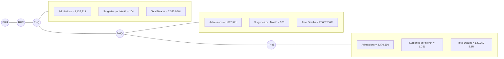

Government of Punjab logo

Directorate General Health Services logo

unicef logo

# DIRECTORATE GENERAL
# HEALTH SERVICES
# PUNJAB

**FINANCIAL YEAR**

# REPORT
# (2023-2024)

**DISTRICT HEALTH**
**INFORMATION SYSTEM**

dhis2 logo

24-Cooper Road, Lahore, Pakistan

Tel: +92-99200990 Web Site: www.dhispb.com Email: hmispb@yahoo.com

---

# Message
# Directorate General Health Services, Punjab

Government of Punjab logo

Health Department logo

unicef logo

Photograph of Dr. Muhammad Ilyas Gondal

It is a matter of great pleasure for me to write this message. The importance of data planning and implementation is immense. DHIS is a decision support system that will help managers at all levels to make evidence-based decisions. It will help in planning & development, strategy management, Budgeting and forecasting about future needs. The MIS team is praise-worthy to implement the system in the whole province and bring reporting regularity to more than 99%.

The performances of the district management teams and health facilities of the province are available for scrutiny and evaluation on DHIS. The issues of data validity and data accuracy needs more efforts and hard working. The doctors and paramedics should pay heed to the plight of data quality and accuracy, so that correct and valid figures may be made available for the decision makers.

**Dr. Muhammad Ilyas Gondal**
Director General Health Services
Punjab. Lahore

01

---

unicef logo and other emblems

# Abstract

The raw data in a prescribed format from public health facilities is regularly received at the provincial level through the MIS district cells and directly from online health facilities. This is then analyzed and scrutinized by the MIS provincial cell after being transferred online by Punjab Health Centers / Districts. In this report, some key indicators are being analyzed in the form of tables and charts, to present the situation at the district and facility levels. The purpose of this report as well as future reports is to highlight various issues of public health and to emphasize specific solutions in the system. This would help to identify some of today's most pressing health issues and how to resolve them. We hope this report will be helpful for decision-making by Chief Executive Officers (DHA), heads of health facilities as well as the Punjab Ministry of Health, Federal Ministry of Health, Provincial and Federal Statistical Offices, and development partners.

02

---

# Acknowledgment

Government of Punjab and UNICEF logos

Photograph of Dr. Khalid Mehmood

The Annual Report owes its existence to the invaluable support, guidance and expertise provided by **Dr. Khalid Mehmood**, Director of Health Services (P&D and MIS). Dr. Mehmood's diligent oversight, along with the continuous reviews, discussions and methodological refinements have ensured that the Annual Report upholds the highest statistical standards, offering an accurate portrayal of our Provincial health system. Additionally, special thanks are extended to **UNICEF** for their unwavering support and collaboration in this endeavor. On behalf of the MIS team, gratitude is extended to **Dr. Khalid Mehmood** (Director MIS), **Dr. Muhammad Mohsan Wattoo** (ADHS-MIS), **Mr. Farooq Ahmed** (CPO MIS), and **Miss-Rukhsana Fawad** (Data Analyst) for their dedicated efforts. Furthermore, sincere appreciation is extended to the focal persons of Districts and public health professionals whose tireless work has contributed to the enhancement of our provincial information system health, positioning us to better address the public health challenges of today and tomorrow.

**Director Health Services (MIS)**
**Directorate General Health Services**
**Punjab, Lahore**

03

---

# Table of Content
unicef logo

<table>
  <thead>
    <tr>
        <th>Table of Content</th>
        <th>Page</th>
    </tr>
  </thead>
  <tbody>
    <tr>
        <td>Executive Summary</td>
<td>7</td>
    </tr>
<tr>
        <td>Highlights and Insights</td>
<td>7</td>
    </tr>
<tr>
        <td><strong>Introduction</strong></td>
<td>11</td>
    </tr>
<tr>
        <td>Overview of DHIS Program</td>
<td>11</td>
    </tr>
<tr>
        <td>Important Features of DHIS</td>
<td>11</td>
    </tr>
<tr>
        <td>Salient Features of Report</td>
<td>11</td>
    </tr>
<tr>
        <td>Challenges and Issue</td>
<td>12</td>
    </tr>
<tr>
        <td>Importance of Record Keeping and Data Management</td>
<td>12</td>
    </tr>
<tr>
        <td><strong>Punjab District Population, 2024</strong></td>
<td>13</td>
    </tr>
<tr>
        <td><strong>Reporting Compliance of Health Facilities</strong></td>
<td>14</td>
    </tr>
<tr>
        <td>Reporting Compliance of Health Facilities at District level, FY (2023-24)</td>
<td>14</td>
    </tr>
<tr>
        <td>Yearly Comparative Analysis of Reporting Compliance</td>
<td>14</td>
    </tr>
<tr>
        <td>Punjab District Reporting Compliance: A Geographic Overview</td>
<td>15</td>
    </tr>
<tr>
        <td><strong>Suspected Diseases Section (OPD &amp; INDOOR)</strong></td>
<td>16</td>
    </tr>
<tr>
        <td>Common Conditions in OPD Attendance</td>
<td>16</td>
    </tr>
<tr>
        <td>Priority diseases reported through DHIS-2</td>
<td>16</td>
    </tr>
<tr>
        <td><strong>Top Disease Conditions Among OPD Attendances</strong></td>
<td>16</td>
    </tr>
<tr>
        <td>Comparative Analysis of Top Ten Priority Diseases with Median Index (2020-2023)</td>
<td>16</td>
    </tr>
<tr>
        <td><strong>Disease Pattern</strong></td>
<td>17</td>
    </tr>
<tr>
        <td>Outpatient Department Suspected Diseases Tabulation</td>
<td>17</td>
    </tr>
<tr>
        <td>Trend Analysis of Top Priority Diseases during FY (2023-24)</td>
<td>18</td>
    </tr>
<tr>
        <td>Month-wise Comparison of Priority 10 diseases</td>
<td>18</td>
    </tr>
<tr>
        <td>Comparative Analysis of Epidemic Diseases Over a 5-Year</td>
<td>18</td>
    </tr>
<tr>
        <td><strong>Conditions Leading to Admissions (indoor)</strong></td>
<td>19</td>
    </tr>
<tr>
        <td>Priority Indoor diseases have reported through DHIS-2</td>
<td>19</td>
    </tr>
<tr>
        <td>Comparative Analysis of Top 10 (IPD) Priority Diseases</td>
<td>19</td>
    </tr>
<tr>
        <td><strong>Comprehensive Overview of District-level Incidence Rates and Average of Four Previous Years for Specific Diseases</strong></td>
<td>20</td>
    </tr>
<tr>
        <td>District wise Incidence Rate (FY 2023-24) of Pneumonia Cases with 4-year Average</td>
<td>20</td>
    </tr>
<tr>
        <td>District wise Incidence Rate (FY 2023-24) of Diabetes Mellitus Cases with 4-year Average</td>
<td>20</td>
    </tr>
<tr>
        <td>District wise Incidence Rate (FY 2023-24) of Suspected Hepatitis Cases</td>
<td>21</td>
    </tr>
<tr>
        <td>District wise Incidence Rate (FY 2023-24) of Cough &gt;2 Wks. (Presumptive TB) Cases with 4-year Average:</td>
<td>21</td>
    </tr>
<tr>
        <td>District wise Incidence Rate (FY 2023-24) of Scabies with 4-year Average</td>
<td>22</td>
    </tr>
<tr>
        <td><strong>Geographic Representation of Suspected Diseases in Punjab, FY (2023-24)</strong></td>
<td>23</td>
    </tr>
<tr>
        <td>Punjab Map - OPD- AWD/Susp Cholera</td>
<td>23</td>
    </tr>
<tr>
        <td>Punjab Map - OPD - Acute Conjunctivitis</td>
<td>23</td>
    </tr>
<tr>
        <td>Punjab Map - OPD- Heat Stroke</td>
<td>23</td>
    </tr>
<tr>
        <td>Punjab Map - OPD- Susp Measles</td>
<td>23</td>
    </tr>
<tr>
        <td><strong>Out-Patient Department (OPD) Summary</strong></td>
<td>24</td>
    </tr>
<tr>
        <td>Out Patient Details</td>
<td>25</td>
    </tr>
<tr>
        <td>Patient Distribution by Age and Gender Wise Analysis</td>
<td>25</td>
    </tr>
<tr>
        <td>Comparison of OPD Visits Monthly Throughout the Financial Year (2023-24)</td>
<td>25</td>
    </tr>
<tr>
        <td>Referred Patients</td>
<td>26</td>
    </tr>
<tr>
        <td>Specialty wise OPD cases</td>
<td>26</td>
    </tr>
<tr>
        <td>Trend analysis of Outpatient Visits on a weekly basis throughout the FY (2023-24)</td>
<td>27</td>
    </tr>
<tr>
        <td>Facility Type wise average number of OPD Visits (Per Day/HF Types Wise)</td>
<td>27</td>
    </tr>
<tr>
        <td>Comparative Analysis of Emergency Cases by Health Facility Type Over Time</td>
<td>27</td>
    </tr>
  </tbody>
</table>

04

---

# Table of Content

unicef logo

<table>
  <thead>
    <tr>
        <th>Table of Content</th>
        <th>Page</th>
    </tr>
  </thead>
  <tbody>
    <tr>
        <td>Emergency and Trauma Visits (Yearly Trends Analysis)</td>
<td>28</td>
    </tr>
<tr>
        <td>District wise Outpatient Attendance and per capita OPD</td>
<td>28</td>
    </tr>
<tr>
        <td>Yearly Comparative Analysis of Total OPD Visits and Per Capita Attendance over 5 years</td>
<td>29</td>
    </tr>
<tr>
        <td>District-Level Per Capita Comparison: FY (2023-24) with Average (2020-2023)</td>
<td>29</td>
    </tr>
<tr>
        <td><strong>Inpatient Department (IPD) Summary</strong></td>
<td>30</td>
    </tr>
<tr>
        <td>Age and Gender wise Admissions</td>
<td>31</td>
    </tr>
<tr>
        <td>Surgeries with respect of Anesthesia</td>
<td>31</td>
    </tr>
<tr>
        <td>Surgeries w.r.t Anesthesia Per Health Facility Type Wise</td>
<td>31</td>
    </tr>
<tr>
        <td>Average Surgeries per month per Health Facility type wise</td>
<td>32</td>
    </tr>
<tr>
        <td>Bed Occupancy Rate (BOR) by Health Facility types</td>
<td>32</td>
    </tr>
<tr>
        <td>Average length of stay (ALS)</td>
<td>33</td>
    </tr>
<tr>
        <td>District-wise Distribution of Admissions and Deaths in FY (2023-24)</td>
<td>33</td>
    </tr>
<tr>
        <td>Hospital Death Rate Comparison with Previous year</td>
<td>34</td>
    </tr>
<tr>
        <td><strong>Maternal, Newborn and Child Health (MNCH) Summary</strong></td>
<td>35</td>
    </tr>
<tr>
        <td><strong>Antenatal Care Coverage</strong></td>
<td>36</td>
    </tr>
<tr>
        <td>Month wise Comparison of Anemia Among Women Attending First Antenatal Care</td>
<td>36</td>
    </tr>
<tr>
        <td>Trend Analysis of Antenatal Care Services (ANC-1)</td>
<td>36</td>
    </tr>
<tr>
        <td>Five-Year Trend Analysis of Anaemic Women Attending ANC-1 Visits</td>
<td>37</td>
    </tr>
<tr>
        <td>District wise Trend of Anemia in Pregnancy Among Women Attending the HFs during ANC-1</td>
<td>37</td>
    </tr>
<tr>
        <td>Facility Type Wise Average Number of ANC-1 Visits (Per month per Health Facility)</td>
<td>38</td>
    </tr>
<tr>
        <td><strong>Types of Deliveries</strong></td>
<td>38</td>
    </tr>
<tr>
        <td>Average number of Deliveries conducted per Month per Health Facility Type wise</td>
<td>38</td>
    </tr>
<tr>
        <td>Yearly Trend Analysis of Deliveries Conducted at Health Facilities</td>
<td>39</td>
    </tr>
<tr>
        <td>Number of Deliveries Conducted by Health Facilities Types</td>
<td>39</td>
    </tr>
<tr>
        <td>District wise Deliveries Conducted at health Facilities</td>
<td>40</td>
    </tr>
<tr>
        <td>Analyzing Monthly Trends in Deliveries and PNC-1 visits</td>
<td>40</td>
    </tr>
<tr>
        <td><strong>Number of Admissions and Deaths in Obstetric Complications</strong></td>
<td>41</td>
    </tr>
<tr>
        <td>District wise Maternal Obstetric Complication</td>
<td>41</td>
    </tr>
<tr>
        <td>Number of Neonatal Deaths due to Complications during Pregnancy</td>
<td>42</td>
    </tr>
<tr>
        <td>Trend Analysis of Neonatal Mortality at District Level</td>
<td>42</td>
    </tr>
<tr>
        <td><strong>Comparative Analysis of LBW&lt;2.5%, Premature Births and Stillbirths</strong></td>
<td>43</td>
    </tr>
<tr>
        <td>Total Deliveries Conducted and Live Births in Health Facilities Month-wise Analysis</td>
<td>43</td>
    </tr>
<tr>
        <td>5-year Comparative Analysis of LBW &lt; 2.5kg</td>
<td>43</td>
    </tr>
<tr>
        <td>District-wise Low Birth Weight (&lt; 2.5 kg)</td>
<td>44</td>
    </tr>
<tr>
        <td><strong>Kangaroo Mother Care (KMC), Newborn Indicators</strong></td>
<td>44</td>
    </tr>
<tr>
        <td><strong>Family Planning Visits.</strong></td>
<td>45</td>
    </tr>
<tr>
        <td>Yearly Trend Analysis of Family Planning Visits</td>
<td>46</td>
    </tr>
<tr>
        <td>Monthly Trend Analysis of Family Planning Coverage During FY (2023-24)</td>
<td>46</td>
    </tr>
<tr>
        <td>District Wise Family Planning Coverage During FY (2023-24)</td>
<td>46</td>
    </tr>
<tr>
        <td>Family Planning visits by Health Facility type wise</td>
<td>47</td>
    </tr>
<tr>
        <td>District wise Distribution of Commodities and Contraceptive Measures</td>
<td>48</td>
    </tr>
<tr>
        <td><strong>Diagnostic Services Utilization</strong></td>
<td>49</td>
    </tr>
<tr>
        <td><strong>Lab Utilization Services (Indoor)</strong></td>
<td>49</td>
    </tr>
<tr>
        <td>5 Year Comparison Indoor Diagnostic Services</td>
<td>49</td>
    </tr>
<tr>
        <td><strong>Lab Utilization Services (Outdoor)</strong></td>
<td>50</td>
    </tr>
<tr>
        <td>5 Year Comparison Outdoor Diagnostic Services</td>
<td>50</td>
    </tr>
<tr>
        <td>Analyzing the Laboratory Investigation for Communicable Diseases FY (2023-24)</td>
<td>50</td>
    </tr>
  </tbody>
</table>

05

---

# Table of Content

Logos of Government of Punjab, Health Department, and UNICEF

<table>
  <thead>
    <tr>
        <th colspan="2">Table of Content</th>
    </tr>
<tr>
        <th> </th>
        <th>Page</th>
    </tr>
  </thead>
  <tbody>
    <tr>
        <td><strong>Comprehensive Analysis of Optimal Drug Availability</strong></td>
<td>51</td>
    </tr>
<tr>
        <td>Trend Analysis District Wise Stock Availability</td>
<td>51</td>
    </tr>
<tr>
        <td>Yearly Comparative Analysis of Stock Availability</td>
<td>52</td>
    </tr>
<tr>
        <td><strong>Human Resoures (HR)</strong></td>
<td>53</td>
    </tr>
<tr>
        <td>District wise distribution of health personnel positions (Table - 1)</td>
<td>53</td>
    </tr>
<tr>
        <td>District wise distribution of health personnel positions (Table - 2)</td>
<td>54</td>
    </tr>
<tr>
        <td>Comparison of Filled posts of Health Personnel</td>
<td>55</td>
    </tr>
<tr>
        <td>Comparative Assessment of Filled Health Personnel Positions Over Time</td>
<td>55</td>
    </tr>
<tr>
        <td><strong>Immunization Coverage</strong></td>
<td>56</td>
    </tr>
<tr>
        <td>Immunization Coverage: Complete Vaccine Series for Under-One-Year-Olds</td>
<td>56</td>
    </tr>
<tr>
        <td>District-wise Vaccination Coverage Summary During FY (2023-24) Table 1</td>
<td>56</td>
    </tr>
<tr>
        <td>District-wise Vaccination Coverage Summary During FY (2023-24) Table 2</td>
<td>57</td>
    </tr>
<tr>
        <td><strong>Health Facilities with Bed Strength</strong></td>
<td>58</td>
    </tr>
<tr>
        <td>Number of Functional and Reporting Health Facilities with Bed Strength FY (2023-24)</td>
<td>58</td>
    </tr>
<tr>
        <td><strong>ANNEXURE-I (Detail of Health Facilities of Punjab)</strong></td>
<td>59</td>
    </tr>
<tr>
        <td>List of THQ.s Hospitals in Punjab FY (2023-24)</td>
<td>59</td>
    </tr>
<tr>
        <td>List of DHQs and Teaching / Specialized Institutions (THOS) in Punjab FY (2023-24)</td>
<td>60</td>
    </tr>
<tr>
        <td><strong>ANNEXURE-II</strong></td>
<td>61</td>
    </tr>
<tr>
        <td>DHIS-2 Daily OPD Reporting Form</td>
<td>61</td>
    </tr>
<tr>
        <td>DHIS-2 Daily Indoor &amp; Surgeries Reporting Form</td>
<td>64</td>
    </tr>
<tr>
        <td>DHIS-2 Daily RMNCH Reporting Form</td>
<td>67</td>
    </tr>
<tr>
        <td>DHIS-2 Monthly Medicine and Vaccine Reporting Form</td>
<td>70</td>
    </tr>
<tr>
        <td>DHIS-2 Monthly Diagnostic Reporting Form</td>
<td>72</td>
    </tr>
<tr>
        <td>DHIS-2 Monthly HR &amp; Budget Reporting Form</td>
<td>74</td>
    </tr>
  </tbody>
</table>

06

---

# Executive Summary unicef logo

## Highlights and Insights.

The Health Management Information System (**HMIS**), launched by the Punjab Health Department in the early 1990s, was later evolved into the **District Health Information System (DHIS)** in 2006. This transformation represented a key advancement in healthcare data management. With its broadened scope, DHIS now plays a crucial role in enabling detailed data collection and analysis across different tiers of healthcare services

In June 2022, the **upgraded DHIS-2** system was introduced at the district level, marking a significant leap in healthcare data management. While the rollout schedules varied across provinces, the Punjab Health Department ensured that all 36 districts were fully operational by July 2022. Notably, since its implementation, every district has consistently submitted timely reports.

This analytical report examines various indicators, providing meaningful insights based on data collected through DHIS-2. Furthermore, it includes data from teaching and tertiary care hospitals, enhancing the analysis and offering a comprehensive overview of healthcare trends and challenges.

The initial section of the report highlights that **reporting compliance** for FY 2023-24 across all 36 districts reached an impressive 95%. This reflects a notable 2% decrease compared to previous years, indicating ongoing efforts to enhance data accuracy and reporting standards. Several districts achieved exceptional compliance rates, with some reaching a perfect 100%, while others came close with rates of 99%.

Top-performing districts, including Multan, Mianwali, Muzaffargarh, Rawalpindi, Mandi Bahauddin, Chakwal, Jhelum, Nankana Sahib, Rajanpur, Gujranwala, and Rahimyar Khan, all recorded a compliance rate of 100%. Additionally, Sahiwal, Sheikhupura, Vehari, and Toba Tek Singh demonstrated near-perfect performance with compliance rates of 99%. Khushab, Narowal, Bahawalnagar, and Chiniot followed closely with rates of 98%.

Districts such as Lodhran and Faisalabad performed well, achieving compliance rates of 97%, while D.G. Khan reported 96%. Bahawalpur and Okara both recorded compliance rates of 95%.However, some districts fell short of target compliance rates. Pakpattan and Jhang achieved rates of 94%, while Hafizabad, Khanewal, and Attock reported 93%. Kasur reached 91%, and Gujrat recorded a compliance rate of 90%.

Among the underperforming districts, Bhakkar (87%), Layyah (86%), Lahore (82%), Sargodha (78%), and Sialkot (73%) had the lowest compliance rates, highlighting the need for targeted interventions to enhance reporting accuracy in the future.

The report also includes insights on **suspected diseases**, both indoors and outdoors. In the documentation of diseases within DHIS-2 for FY (2023-24), a total of 68 diseases were recorded, representing 55% of all patient cases. Notably, 57% of these cases were identified as communicable diseases, while 43% were non-communicable, highlighting the focus on prioritized diseases during this financial year (July 2023 to June 2024). Graphs and tables were used to visually represent specific communicable and non-communicable diseases. Additionally, district-wise comparisons of new cases and their incidence rates, alongside a four-year average, provide valuable insights into local disease trends, enhancing our understanding of regional variations over time. The geographic representation of specific suspected diseases further aids in identifying patterns and trends, thereby empowering informed decision-making and targeted interventions.

In the financial year (July-2023 to June-2024), the total number of **Outpatient Department (OPD)** visits recorded in the DHIS-2 system amounted to 112,614,584 (113 million) patients. This figure shows an 8% decline compared to the previous year's total of 122,240,267 (122 million) visits in 2022-23. Of the visits in FY (2023-24), 96% involved new OPD patients, while only 4% were follow-up cases. The per capita OPD visits for FY (2023-24) averaged 0.88, a drop of 0.22 from the previous year's average of 1.14 visits per person. The highest average daily OPD visits were observed in Teaching Hospitals (THOS), with 1,264 visits per day, District Headquarter Hospitals (DHQ) followed with 1,147 visits per day, Tehsil Headquarter Hospitals (THQ) recorded an average of 549 visits per day, while Rural Health Centers (RHC) had 167 visits per day. Basic Health Units (BHU) reported the lowest number, with 42 visits per day. On a district level, Lahore topped the list with 11,148,262 OPD visits, followed by Faisalabad with 9,558,528 visits and Multan with 6,097,952 visits. In terms of demographics, 55% of the visits were by females, while males made up 45%. The most frequent age group visiting the OPD was between 15 and 49 years, with females representing 50% and males 42% of this age bracket.

07

---

# Executive Summary unicef logo

The total number of **indoor admissions** in the financial year (FY) 2023-24 reached 6,056,765 patients, with 63% admitted due to specific diseases, and only 1% being referred. Upon analyzing age and gender distribution, male patients totaled 1,768,925 (46%) and female patients numbered 2,045,796 (54%). The highest number of patients fell within the age group of 15-49 years, where 49% of female patients and 31% of male patients were admitted. Throughout FY 2023-24, a total of 1,091,651 surgeries were performed using various anesthesia methods. General anesthesia (GA) was used in 19% (211,175) of surgeries, local anesthesia (LA) in 49% (537,241), and spinal anesthesia in 26% (282,641). Alternative anesthesia methods were used in 6% (60,594) of procedures. Teaching hospitals were notably active, performing the highest number of surgeries per month, with a total of 1,261 surgeries across different anesthesia types. There were 6,056,765 admitted patients overall, with a death toll of 166,720, representing 3% of total admissions. District-wise, Lahore had the highest number of admitted patients at 1,065,734, followed by Faisalabad with 422,008 admissions. In terms of mortality, Rawalpindi had the highest death percentage, with 5.5% of admitted patients passing away. Tertiary care hospitals reported a slightly lower mortality rate of 5.3%, an improvement compared to the previous year.

In the financial year (July-23 to June-24), the overall **Bed Occupancy Rate (BOR)** in secondary and tertiary care hospitals was 70%. Teaching and tertiary hospitals recorded a higher BOR of 93%, while District Headquarter Hospitals (DHQs) had a similarly significant BOR of 90%. Tehsil Headquarter Hospitals (THQs) maintained a BOR of 79%, with Rural Health Centers (RHCs) reporting the lowest BOR at 45%.

Additionally, the **Average Length of Stay (ALS)** serves as a key indicator of the level of care provided to hospitalized patients and the strain on hospital resources. In the FY (2023-24), the ALS across various hospital types was as follows: Teaching and tertiary hospitals reported an ALS of 3 days, District Headquarter Hospitals (DHQs) 2 days, while Tehsil Headquarter Hospitals (THQs) and Rural Health Centers (RHCs) both recorded an ALS of 1 day. Notably, the ALS remained consistent throughout the year. These metrics offer valuable insights into hospital efficiency, patient flow, and resource allocation.

**Antenatal Care (ANC)** coverage is an important indicator of access to and utilization of healthcare services during pregnancy. In the financial year (FY) July 2023 to June 2024, a total of 11,489,359 ANC visits were conducted, representing 3.4% of the total expected population. Of these, 42% (4,387,448) were ANC-1 visits, with 16% (691,677) of those visits revealing hemoglobin levels below 10g/dl. ANC-2 visits accounted for 31% (3,550,261) of the total, followed by ANC-3 visits at 17% (1,974,351), and ANC-4 visits at 14%. ANC-1 visits saw a 6% decrease in FY 2023-24, with 4.4 million visits compared to 4.6 million in the previous year. On average, District Headquarter Hospitals (DHQs) reported the highest number of monthly ANC-1 visits per facility, with 609 visits.

**Deliveries** conducted at health facilities is an indicator of the utilization of skilled birth services provided at public health facilities. During the financial year 2023-24, a total of 1,317,700 deliveries were conducted at health facilities, accounting for 36% of the expected population. This marks a 3% decrease from the previous year, with 35.5% (1,317,700) of deliveries in FY 2023-24 compared to 37% (1,321,552) in 2023.

Among different types of health facilities, THQS hospitals recorded the highest average monthly deliveries, with 373 deliveries per month. Of the total deliveries, 80% (1,054,715) were normal vaginal deliveries, 0.2% (2,696) involved vacuum or forceps assistance, and 20% (260,289) were Caesarean sections. Notably, tertiary care hospitals reported the highest number of Caesarean sections, totaling 112,652 cases, representing 9% of all deliveries.

In contrast, the highest number of normal vaginal deliveries was observed at Basic Health Units (BHUs), which accounted for 555,349 cases (or 42%). The data indicates that District Kasur had the highest percentage of normal vaginal deliveries at 98%, while Lahore recorded the highest number of Caesarean sections, comprising 45% of the total deliveries.

In FY (2023-24), a total of 175,800 (13%) **Deliveries with Complications** occurred out of the 1,317,700 total deliveries in secondary and tertiary care hospitals. Among these complications, there were 311 (0.2%) maternal deaths attributed to obstetric complications during the same period. The highest number of deliveries with complications occurred in Lahore, totaling 38,149, while Rajanpur reported the lowest number, with just 38 deliveries affected.

08

---

# Executive Summary unicef logo

Among the 1,293,616 total **live births**, 4% (47,033 newborns) did not survive due to complications during childbirth, with the highest neonatal mortality rate reported in Lahore (15,282). Data for the financial year 2023-24 indicates that the highest incidence of low-birth-weight cases occurred in Multan (4,765), while the lowest numbers were recorded in Khushab and Chiniot (25 and 7, respectively). Across Punjab, the overall average prevalence of low birth weight stood at 1.80%, reflecting a declining trend over time.

In 2023, **Kangaroo Mother Care (KMC)** was introduced as a critical indicator of newborn health. The following section focuses exclusively on District Headquarters Hospitals (DHQs) where the KMC project is being implemented. This indicator is crucial as it provides essential information regarding newborn care and is also presented in tabular form.

In FY 2023-24, public sector health facilities reported 2,425,170 **family planning visits**, representing 12% of the expected population (16% MCBA). Of these, 2% (5,8270) were by women under 25 years old. This marks a 1% increase in family planning visits compared to the previous year. District-wise, Faisalabad, Chakwal, and Sialkot had the highest number of visits, recording 197,568, 138,642, and 138,310 visits, respectively. The majority of visits (75%) took place in BHUs, followed by RHCs at 14%, THQs at 6%, and DHQs and tertiary care hospitals each accounting for 2% of the total visits.

**Immunization coverage**, particularly the completion of vaccine series for infants under one year, is a vital indicator of healthcare effectiveness. It measures the percentage of infants who receive all essential vaccines, including the Hepatitis B Birth Dose, BCG, OPV, Penta, IPV, PCV13, Rotavirus, MR, TCV, and the DTP Booster, within a specified time frame, typically within their first year. District-level summaries of vaccination coverage are presented in tabular form, offering a detailed breakdown of immunization rates across various regions.

The utilization of **laboratory services** serves as a key indicator of healthcare performance, measured by the proportion of patients accessing these services in health facilities. In FY 2023-24, a total of 60 million patients utilized laboratory services 31 million as outpatients and 27 million as inpatients. Lab investigations were the most frequently used diagnostic service in Punjab's health facilities, representing 79% of all diagnostics. Ultrasound services followed at 7.9%, X-rays at 7.7%, ECGs at 3.7%, CT scans at 0.9% and both Elisa and Echocardiography at 0.5%. These figures reflect both indoor and outdoor utilization, with a detailed breakdown of laboratory investigations for communicable diseases available in tabular format.

This indicator measures the percentage of health facilities where all **Tracer Drugs and Medicines** were consistently available throughout the year. Ideally, facilities should ensure uninterrupted availability of these essential drugs, as any stock-out, no matter how brief, indicates a breakdown in the supply chain. In FY 2023-24, a comprehensive inventory review of 60 medicines across 36 districts revealed that 96% of the stock remained consistently available, while approximately 4% experienced stock-outs. For family planning commodities, 83% were available, with 17% stock-outs reported. On the other hand, vaccination supplies achieved 100% availability. Notably, the highest overall availability of essential medical supplies (including medicines, vaccinations, and family planning commodities) approximately 99% was reported in Khushab, Lahore, Rahimyar Khan, and Sialkot.

09

---

# Executive Summary

unicef logo and other icons

During the analysis of FY 2023-24 trends, a clear upward trajectory was observed in several key areas, including indoor admissions (12%), surgeries with anesthesia (10%), emergency cases (20%), ANC visits (16%), deliveries (5%), Live Births (14%), PNC-1 visits (36%), and family planning services (14%). However, OPD visits experienced a notable 12% decline compared to the previous FY (2022-23). These shifts indicate significant changes in healthcare activity and performance over the course of the year.

<table>
  <thead>
    <tr>
        <th colspan="4">Comparative Yearly Performance (2022/23 -2023/24)</th>
    </tr>
<tr>
        <th> </th>
        <th>FY (2022-23)</th>
        <th>FY (2023-24)</th>
        <th>% Δ</th>
    </tr>
  </thead>
  <tbody>
    <tr>
        <td>Total OPD</td>
<td>128,113,220</td>
<td>112,614,584</td>
<td>-12%</td>
    </tr>
<tr>
        <td>Emergency Cases</td>
<td>22,374,468</td>
<td>26,860,689</td>
<td>20%</td>
    </tr>
<tr>
        <td>Total Admissions</td>
<td>5,421,936</td>
<td>6,056,765</td>
<td>12%</td>
    </tr>
<tr>
        <td>Surgeries w.r.t Anesthesia</td>
<td>991,873</td>
<td>1,091,651</td>
<td>10%</td>
    </tr>
<tr>
        <td>Total ANC (I-IV Only)</td>
<td>9,886,297</td>
<td>11,489,359</td>
<td>16%</td>
    </tr>
<tr>
        <td>Total Deliveries</td>
<td>1,254,067</td>
<td>1,317,700</td>
<td>5%</td>
    </tr>
<tr>
        <td>Live Births</td>
<td>1,131,918</td>
<td>1,293,616</td>
<td>14%</td>
    </tr>
<tr>
        <td>Postnatal Attendance-1</td>
<td>965,502</td>
<td>1,317,700</td>
<td>36%</td>
    </tr>
<tr>
        <td>Total FP Visits</td>
<td>2,128,850</td>
<td>2,425,170</td>
<td>14%</td>
    </tr>
  </tbody>
</table>

10

---

# Introduction

unicef logo

## Overview of the DHIS Program

District Health Information System (DHIS) is a mechanism of data collection, transmission, processing, analysis and feedback all levels of health care system. DHIS provides a baseline data for district planning, implementation and monitoring on major indicators of service delivery, clinical interventions, disease pattern, preventive services and physical resources allocation.

The revised system aims to gather information from Teaching hospitals, Secondary level hospitals (District Headquarter Hospitals (DHQs), Tehsil Headquarter Hospitals (THQs) and RHCs/BHUs.

## Important Features of DHIS

DHIS is a district – based Routine Health Information System

* Responds to the communication needs of the District Health Systems. It also supports in performance monitoring both at district and provincial levels.

* DHIS provides minimum set of indicators.

* Promotes / Supports evidence-based decision-making at local & provincial level.

* Caters the important routine health information needs of the federal & provincial levels for monitoring and policy implementation.

* DHIS is an improved version of HMIS and incorporates many indicators from HMIS.

## Salient Features of the Report

* The overall purpose of this feedback report is to provide a basic analysis of important performance indicators to the district managers and facility in-charges.

* This would ensure the identification of problem areas, problem analysis, planning & implementation of the solutions and monitoring & evaluating implementations and recognizing the best practices.

* This report should assist the district, provincial & national health managers in analyzing the health situation, and health care services (e.g. EPI, Malaria, Hepatitis, MCH & Family Planning Services), availability of drugs/supplies, etc.

11

---

# Introduction

Logos of Government of Punjab, Health Department, and UNICEF

## Challenges and Issue

Health is a wide subject consisting of diverse fields of which medicine is a part. It is imperative to strengthen the links between the several working sectors and departments to improve health and reduce morbidity, disability and death. DHIS has the capacity to become a full-fledged health information system as being utilized in developed countries.

## Importance of Record Keeping and Data Management

Knowledge is power and it leads to discovery when applied. When information is analyzed on a scientific basis using statistical tools and the application of appropriate methods on the collected data, issues are identified. Record keeping and data management are the core activities are linked together to produce verifiable, reproducible and presentable knowledge.

Modern IT and communication facilities have reduced distances among organizations, institutions and learned academia and led to the use of information in short-term and long-term decision-making. Based on this relationship between academia and institutions, field research has flourished. The dengue epidemic of 2011 is an example of this relationship when all the departments of Punjab and academic institutions joined hands to help the government face the emergency.

12

---

# Punjab District Population, 2024 unicef logo

Map of Punjab showing district-wise population for the year 2024 with a color-coded legend.

<table>
  <thead>
    <tr>
        <th>District</th>
        <th>Pop 2024</th>
        <th>District</th>
        <th colspan="3">Pop 2024</th>
    </tr>
  </thead>
  <tbody>
    <tr>
        <td>1</td>
<td>Attock</td>
<td>2,170,423</td>
<td>19</td>
<td>Lodhran</td>
<td>1,928,299</td>
    </tr>
<tr>
        <td>2</td>
<td>Bahawalnagar</td>
<td>3,550,342</td>
<td>20</td>
<td>Mandi Bahauddin</td>
<td>1,829,486</td>
    </tr>
<tr>
        <td>3</td>
<td>Bahawalpur</td>
<td>4,284,964</td>
<td>21</td>
<td>Mianwali</td>
<td>1,798,268</td>
    </tr>
<tr>
        <td>4</td>
<td>Bhakkar</td>
<td>1,957,470</td>
<td>22</td>
<td>Multan</td>
<td>5,362,305</td>
    </tr>
<tr>
        <td>5</td>
<td>Chakwal</td>
<td>1,734,854</td>
<td>23</td>
<td>Muzaffargarh</td>
<td>5,015,325</td>
    </tr>
<tr>
        <td>6</td>
<td>Chiniot</td>
<td>1,563,024</td>
<td>24</td>
<td>Nankana Sahib</td>
<td>1,634,871</td>
    </tr>
<tr>
        <td>7</td>
<td>Dera Ghazi Khan</td>
<td>3,393,705</td>
<td>25</td>
<td>Narowal</td>
<td>1,950,954</td>
    </tr>
<tr>
        <td>8</td>
<td>Faisalabad</td>
<td>9,075,819</td>
<td>26</td>
<td>Okara</td>
<td>3,515,490</td>
    </tr>
<tr>
        <td>9</td>
<td>Gujranwala</td>
<td>5,959,750</td>
<td>27</td>
<td>Pakpattan</td>
<td>2,136,170</td>
    </tr>
<tr>
        <td>10</td>
<td>Gujrat</td>
<td>3,219,375</td>
<td>28</td>
<td>Rahim Yar Khan</td>
<td>5,564,703</td>
    </tr>
<tr>
        <td>11</td>
<td>Hafizabad</td>
<td>1,319,909</td>
<td>29</td>
<td>Rajanpur</td>
<td>2,381,049</td>
    </tr>
<tr>
        <td>12</td>
<td>Jhang</td>
<td>3,077,720</td>
<td>30</td>
<td>Rawalpindi</td>
<td>6,118,911</td>
    </tr>
<tr>
        <td>13</td>
<td>Jhelum</td>
<td>1,382,308</td>
<td>31</td>
<td>Sahiwal</td>
<td>2,881,811</td>
    </tr>
<tr>
        <td>14</td>
<td>Kasur</td>
<td>4,084,286</td>
<td>32</td>
<td>Sargodha</td>
<td>4,334,448</td>
    </tr>
<tr>
        <td>15</td>
<td>Khanewal</td>
<td>3,364,077</td>
<td>33</td>
<td>Sheikhupura</td>
<td>4,049,418</td>
    </tr>
<tr>
        <td>16</td>
<td>Khushab</td>
<td>1,501,089</td>
<td>34</td>
<td>Sialkot</td>
<td>4,499,394</td>
    </tr>
<tr>
        <td>17</td>
<td>Lahore</td>
<td>13,004,135</td>
<td>35</td>
<td>Toba Tek Singh</td>
<td>2,511,963</td>
    </tr>
<tr>
        <td>18</td>
<td>Layyah</td>
<td>2,102,386</td>
<td>36</td>
<td>Vehari</td>
<td>3,430,421</td>
    </tr>
  </tbody>
</table>

13

---

# Reporting Compliance of Health Facilities unicef logo

## Reporting Compliance of Health Facilities at District level, FY (2023-24)

Complete and accurate reporting is crucial for informed decision-making, resource allocation, and policy formulation. For the financial year (July 2023 to June 2024), reporting compliance across all 36 districts was closely monitored. The overall compliance rate reached a strong 95%, reflecting ongoing efforts to improve data accuracy and reporting standards.

Among the top-performing districts Multan, Mianwali, Muzaffargarh, Rawalpindi, Mandi Bahauddin, Chakwal, Jhelum, Nankana Sahib, Rajanpur, Gujranwala, and Rahimyar Khan all achieved a perfect compliance rate of 100%. Several districts demonstrated near-perfect performance, including Sahiwal, Sheikhupura, Vehari, and Toba Tek Singh, all with a compliance rate of 99%. Additionally, Khushab, Narowal, Bahawalnagar, and Chiniot recorded 98% compliance.

Districts like Lodhran and Faisalabad performed well with compliance rates of 97%, while D.G. Khan reported 96%. Bahawalpur and Okara followed with a compliance rate of 95%.

However, some districts reported lower-than-target compliance rates. Pakpattan and Jhang achieved a compliance rate of 94%, followed by Hafizabad, Khanewal, and Attock at 93%. Kasur reached 91%, while Gujrat recorded 90%.

Among the underperforming districts, Bhakkar (87%), Layyah (86%), Lahore (82%), Sargodha (78%), and Sialkot (73%) had the lowest compliance rates, indicating a need for targeted interventions to improve reporting accuracy in the future.

### District-Wise Reporting Compliance Analysis for FY (2023-24)

<table>
  <thead>
    <tr>
        <th>District</th>
        <th>Compliance %</th>
    </tr>
  </thead>
  <tbody>
    <tr>
        <td>Multan</td>
<td>100%</td>
    </tr>
<tr>
        <td>Mianwali</td>
<td>100%</td>
    </tr>
<tr>
        <td>Muzaffargarh</td>
<td>100%</td>
    </tr>
<tr>
        <td>Rawalpindi</td>
<td>100%</td>
    </tr>
<tr>
        <td>Mandi Bahauddin</td>
<td>100%</td>
    </tr>
<tr>
        <td>Chakwal</td>
<td>100%</td>
    </tr>
<tr>
        <td>Jhelum</td>
<td>100%</td>
    </tr>
<tr>
        <td>Nankana Sahib</td>
<td>100%</td>
    </tr>
<tr>
        <td>Rajanpur</td>
<td>100%</td>
    </tr>
<tr>
        <td>Gujranwala</td>
<td>100%</td>
    </tr>
<tr>
        <td>Rahimyar Khan</td>
<td>100%</td>
    </tr>
<tr>
        <td>Sahiwal</td>
<td>99%</td>
    </tr>
<tr>
        <td>Sheikhupura</td>
<td>99%</td>
    </tr>
<tr>
        <td>Vehari</td>
<td>99%</td>
    </tr>
<tr>
        <td>Toba Tek Singh</td>
<td>99%</td>
    </tr>
<tr>
        <td>Khushab</td>
<td>98%</td>
    </tr>
<tr>
        <td>Narowal</td>
<td>98%</td>
    </tr>
<tr>
        <td>Bahawalnagar</td>
<td>98%</td>
    </tr>
<tr>
        <td>Chiniot</td>
<td>98%</td>
    </tr>
<tr>
        <td>Lodhran</td>
<td>97%</td>
    </tr>
<tr>
        <td>Faisalabad</td>
<td>97%</td>
    </tr>
<tr>
        <td>D.G. Khan</td>
<td>96%</td>
    </tr>
<tr>
        <td>Bahawalpur</td>
<td>95%</td>
    </tr>
<tr>
        <td>Okara</td>
<td>95%</td>
    </tr>
<tr>
        <td>Pakpattan</td>
<td>94%</td>
    </tr>
<tr>
        <td>Jhang</td>
<td>94%</td>
    </tr>
<tr>
        <td>Hafizabad</td>
<td>93%</td>
    </tr>
<tr>
        <td>Khanewal</td>
<td>93%</td>
    </tr>
<tr>
        <td>Attock</td>
<td>93%</td>
    </tr>
<tr>
        <td>Kasur</td>
<td>91%</td>
    </tr>
<tr>
        <td>Gujrat</td>
<td>90%</td>
    </tr>
<tr>
        <td>Bhakkar</td>
<td>87%</td>
    </tr>
<tr>
        <td>Layyah</td>
<td>86%</td>
    </tr>
<tr>
        <td>Lahore</td>
<td>82%</td>
    </tr>
<tr>
        <td>Sargodha</td>
<td>78%</td>
    </tr>
<tr>
        <td>Sialkot</td>
<td>73%</td>
    </tr>
  </tbody>
</table>

## Yearly Comparative Analysis of Reporting Compliance

The bar graph illustrates the yearly reporting compliance percentages over the past five years, with a specific focus on reporting regularity within the Province of Punjab. The benchmark for reporting compliance is established at 100%. Notably, there is a substantial enhancement in reporting compliance, escalating from 82% in 2022 to an impressive 95% in FY (2023-24), reflecting a remarkable 16% improvement. This upward trend demonstrates the province's ongoing commitment to enhancing reporting regularity

**Trend Analysis of Reporting Compliance**

<table>
  <thead>
    <tr>
        <th>Year</th>
        <th>Compliance %</th>
    </tr>
  </thead>
  <tbody>
    <tr>
        <td>2020</td>
<td>99%</td>
    </tr>
<tr>
        <td>2021</td>
<td>98%</td>
    </tr>
<tr>
        <td>2022</td>
<td>82%</td>
    </tr>
<tr>
        <td>2023</td>
<td>97%</td>
    </tr>
<tr>
        <td>FY 2023/24</td>
<td>95%</td>
    </tr>
  </tbody>
</table>

14

---

# Punjab District Reporting Compliance: A Geographic Overview unicef logo

### Punjab Map - OPD Compliance Reporting Rate
### Punjab Map - IPD Compliance Reporting Rate

<table>
  <thead>
    <tr>
        <th>District</th>
        <th>Daily OPD Form Reporting Rate (%)</th>
        <th>Daily Indoor and Surgeries Services Reporting Rate (%)</th>
    </tr>
  </thead>
  <tbody>
    <tr>
        <td>Attock</td>
<td>89.39</td>
<td>96.08</td>
    </tr>
<tr>
        <td>Rawalpindi</td>
<td>98.05</td>
<td>100</td>
    </tr>
<tr>
        <td>Chakwal</td>
<td>99.14</td>
<td>100</td>
    </tr>
<tr>
        <td>Jhelum</td>
<td>100</td>
<td>97.54</td>
    </tr>
<tr>
        <td>Mianwali</td>
<td>100</td>
<td>100</td>
    </tr>
<tr>
        <td>Khushab</td>
<td>95.06</td>
<td>100</td>
    </tr>
<tr>
        <td>Gujrat</td>
<td>88.52</td>
<td>90.48</td>
    </tr>
<tr>
        <td>Gujranwala</td>
<td>99.86</td>
<td>99.33</td>
    </tr>
<tr>
        <td>Narowal</td>
<td>97.64</td>
<td>97.63</td>
    </tr>
<tr>
        <td>Bhakkar</td>
<td>87.41</td>
<td>78.48</td>
    </tr>
<tr>
        <td>Chiniot</td>
<td>97.08</td>
<td>99.41</td>
    </tr>
<tr>
        <td>Lahore</td>
<td>77.15</td>
<td>89.28</td>
    </tr>
<tr>
        <td>Faisalabad</td>
<td>96.85</td>
<td>95.53</td>
    </tr>
<tr>
        <td>Jhang</td>
<td>94.91</td>
<td>89.53</td>
    </tr>
<tr>
        <td>Layyah</td>
<td>96.14</td>
<td>97.08</td>
    </tr>
<tr>
        <td>Kasur</td>
<td>94.57</td>
<td>82.09</td>
    </tr>
<tr>
        <td>Okara</td>
<td>97.87</td>
<td>86.96</td>
    </tr>
<tr>
        <td>Sahiwal</td>
<td>98.74</td>
<td>98.87</td>
    </tr>
<tr>
        <td>Khanewal</td>
<td>89.8</td>
<td>89.79</td>
    </tr>
<tr>
        <td>Pakpattan</td>
<td>95.62</td>
<td>87.74</td>
    </tr>
<tr>
        <td>D.G Khan</td>
<td>94.16</td>
<td>97.35</td>
    </tr>
<tr>
        <td>Lodhran</td>
<td>93.68</td>
<td>97.17</td>
    </tr>
<tr>
        <td>Bahawalnagar</td>
<td>96.72</td>
<td>98.42</td>
    </tr>
<tr>
        <td>Rajanpur</td>
<td>99.85</td>
<td>99.75</td>
    </tr>
<tr>
        <td>Bahawalpur</td>
<td>92.72</td>
<td>93.72</td>
    </tr>
<tr>
        <td>Rahimyar Khan</td>
<td>99.6</td>
<td>98.96</td>
    </tr>
  </tbody>
</table>

**Daily OPD Form (Reporting Rate) (July 2023-June 2024)**
* 0 - 85 (3)
* 85 - 95 (10)
* 95 - 100 (23)

**Daily Indoor and Surgeries Services (Reporting Rate) (July 2023-June 2024)**
* 0 - 85 (04)
* 85 - 95 (08)
* 95 - 100 (24)

## Punjab Map - RMNCH Compliance Reporting Rate

<table>
  <thead>
    <tr>
        <th>District</th>
        <th>Daily RMNCH Form Reporting Rate (%)</th>
    </tr>
  </thead>
  <tbody>
    <tr>
        <td>Attock</td>
<td>93.16</td>
    </tr>
<tr>
        <td>Rawalpindi</td>
<td>99.37</td>
    </tr>
<tr>
        <td>Chakwal</td>
<td>99.84</td>
    </tr>
<tr>
        <td>Jhelum</td>
<td>100</td>
    </tr>
<tr>
        <td>Mianwali</td>
<td>100</td>
    </tr>
<tr>
        <td>Gujrat</td>
<td>90.08</td>
    </tr>
<tr>
        <td>Khushab</td>
<td>96.54</td>
    </tr>
<tr>
        <td>Gujranwala</td>
<td>100</td>
    </tr>
<tr>
        <td>Narowal</td>
<td>99.4</td>
    </tr>
<tr>
        <td>Bhakkar</td>
<td>94.07</td>
    </tr>
<tr>
        <td>Chiniot</td>
<td>97.27</td>
    </tr>
<tr>
        <td>Lahore</td>
<td>78.3</td>
    </tr>
<tr>
        <td>Faisalabad</td>
<td>98.36</td>
    </tr>
<tr>
        <td>Jhang</td>
<td>96.11</td>
    </tr>
<tr>
        <td>Layyah</td>
<td>65.77</td>
    </tr>
<tr>
        <td>Kasur</td>
<td>95.22</td>
    </tr>
<tr>
        <td>Okara</td>
<td>100</td>
    </tr>
<tr>
        <td>Sahiwal</td>
<td>99.99</td>
    </tr>
<tr>
        <td>Khanewal</td>
<td>99.26</td>
    </tr>
<tr>
        <td>Pakpattan</td>
<td>98.76</td>
    </tr>
<tr>
        <td>D.G Khan</td>
<td>95.27</td>
    </tr>
<tr>
        <td>Lodhran</td>
<td>100</td>
    </tr>
<tr>
        <td>Bahawalnagar</td>
<td>98.89</td>
    </tr>
<tr>
        <td>Rajanpur</td>
<td>99.99</td>
    </tr>
<tr>
        <td>Bahawalpur</td>
<td>99.65</td>
    </tr>
<tr>
        <td>Rahimyar Khan</td>
<td>100</td>
    </tr>
  </tbody>
</table>

**Daily RMNCH Form (Reporting Rate) (July 2023-June 2024)**
* 0 - 85 (04)
* 85 - 95 (03)
* 95 - 100 (29)

15

---

# Suspected Diseases Section (OPD & INDOOR) unicef logo

**Disease Burden:**

The MIS-Cell routinely monitors the disease burden in the province using the DHIS-2 which captures data from health facilities in the Province of Punjab.

**Common Conditions in OPD Attendance:**

Acute Upper Respiratory Infections (AURI) remained the leading condition among all outpatient department (OPD) diagnoses for all ages, accounting for 36.3% of all OPD attendances, followed by Fever due to unknown causes at 13.3%, Diarrhea/Gastroenteritis at 7.3%, Scabies at 6.6%, Peptic Ulcer Disease at 4.7%, and Diabetes Mellitus at 4.2%. The number of AURI cases decreased by 0.08% (22,545,647 in FY 2023-24) compared to the previous year (24,502,546 in 2022-23).

# Priority diseases reported through DHIS-2.

<table>
    <thead>
    <tr>
        <th colspan="12">SUSPECTED OPD DISEASE WISE NEW CASES OF THE FINANCIAL YEAR (2023-24)</th>
    </tr>
    </thead>
    <tr>
        <td>sr.</td>
        <td colspan="3">Respiratory Diseases</td>
<td></td>
        <td colspan="3">Vaccine Preventable Diseases/Hepatitis</td>
<td></td>
        <td colspan="3">Cardiovascular Diseases</td>
    </tr>
<tr>
        <td>1</td>
<td>Acute (upper) Respiratory Infections (AURI)</td>
<td>22,545,647</td>
<td>36.3%</td>
<td>22</td>
<td>Susp Hepatitis</td>
<td>356,280</td>
<td>0.6%</td>
<td>43</td>
<td>Hypertension</td>
<td>2,670,440</td>
<td>4.3%</td>
    </tr>
<tr>
        <td>2</td>
<td>Asthma</td>
<td>1,450,460</td>
<td>2.3%</td>
<td>23</td>
<td>Susp Malaria</td>
<td>205,572</td>
<td>0.3%</td>
<td>44</td>
<td>Ischemic Heart Dis</td>
<td>560,859</td>
<td>0.9%</td>
    </tr>
<tr>
        <td>3</td>
<td>Cough >2 Wks (Presumptive TB)</td>
<td>523,192</td>
<td>0.8%</td>
<td>24</td>
<td>Susp Meningitis</td>
<td>1,574</td>
<td>0.0%</td>
<td></td>
        <td colspan="3">Sexually Transmitted Infection</td>
    </tr>
<tr>
        <td>4</td>
<td>Chronic Obstructive Pulmonary Dis</td>
<td>403,078</td>
<td>0.6%</td>
<td>25</td>
<td>Susp Acute Flaccid Paralysis AFP</td>
<td>598</td>
<td>0.0%</td>
<td>45</td>
<td>Urinary Tract Infection UTI</td>
<td>1,767,506</td>
<td>2.8%</td>
    </tr>
<tr>
        <td>5</td>
<td>Pneumonia</td>
<td>170,248</td>
<td>0.3%</td>
<td>26</td>
<td>Mumps</td>
<td>218</td>
<td>0.0%</td>
<td>46</td>
<td>Susp Syphilis</td>
<td>1,471</td>
<td>0.0%</td>
    </tr>
<tr>
        <td></td>
        <td colspan="3">Communicable Diseases</td>
<td>27</td>
<td>Susp diphtheria</td>
<td>204</td>
<td>0.0%</td>
<td></td>
        <td colspan="3">Endocrine Disorder</td>
    </tr>
<tr>
        <td>6</td>
<td>Fever (other causes)</td>
<td>8,258,956</td>
<td>13.3%</td>
<td>28</td>
<td>Susp Corona Virus</td>
<td>56</td>
<td>0.0%</td>
<td>47</td>
<td>Diabetes Mellitus</td>
<td>2,634,012</td>
<td>4.2%</td>
    </tr>
<tr>
        <td>7</td>
<td>Susp Enteric / Typhoid Fever</td>
<td>168,339</td>
<td>0.3%</td>
<td>29</td>
<td>Susp pertussis</td>
<td>15</td>
<td>0.0%</td>
<td>48</td>
<td>Goiter</td>
<td>36,462</td>
<td>0.1%</td>
    </tr>
<tr>
        <td>8</td>
<td>Susp dengue fever</td>
<td>47,165</td>
<td>0.1%</td>
<td></td>
        <td colspan="3">Gestro Intestinal Diseases</td>
<td></td>
        <td colspan="3">Cancer Diseases</td>
    </tr>
<tr>
        <td>9</td>
<td>Susp Measles</td>
<td>8,090</td>
<td>0.0%</td>
<td>30</td>
<td>Diarrhea/Gastroenteritis</td>
<td>4,546,233</td>
<td>7.3%</td>
<td>49</td>
<td>Breast cancer</td>
<td>8,438</td>
<td>0.0%</td>
    </tr>
<tr>
        <td>10</td>
<td>Seasonal Influenza ILI</td>
<td>5,861</td>
<td>0.0%</td>
<td>31</td>
<td>Peptic Ulcer Disease</td>
<td>2,907,027</td>
<td>4.7%</td>
<td>50</td>
<td>Lung Cancer</td>
<td>1,531</td>
<td>0.0%</td>
    </tr>
<tr>
        <td>11</td>
<td>Chicken Pox</td>
<td>1,858</td>
<td>0.0%</td>
<td>32</td>
<td>Worm Infestations</td>
<td>689,231</td>
<td>1.1%</td>
<td>51</td>
<td>Prostate cancer</td>
<td>1,109</td>
<td>0.0%</td>
    </tr>
<tr>
        <td>12</td>
<td>Susp Cervical Cancer (HPV)</td>
<td>1,548</td>
<td>0.0%</td>
<td>33</td>
<td>Acu Watery Diarrhea/Susp Cholera</td>
<td>165,515</td>
<td>0.3%</td>
<td></td>
        <td colspan="3">Occupational Lung Diseases</td>
    </tr>
<tr>
        <td>13</td>
<td>Susp HIV/ AIDS</td>
<td>1,108</td>
<td>0.0%</td>
<td>34</td>
<td>Chronic Liver Dis</td>
<td>131,110</td>
<td>0.2%</td>
<td>52</td>
<td>Silicosis</td>
<td>20</td>
<td>0.0%</td>
    </tr>
<tr>
        <td>14</td>
<td>Susp Neonatal Tetanus</td>
<td>42</td>
<td>0.0%</td>
<td>35</td>
<td>Bloody Diarrhea/Dysentery</td>
<td>101,885</td>
<td>0.2%</td>
<td></td>
        <td colspan="3">Injuries / Poisoning</td>
    </tr>
<tr>
        <td>15</td>
<td>Susp Monkey Pox</td>
<td>15</td>
<td>0.0%</td>
<td>36</td>
<td>Susp Crimean Congo Hemorrhagic Fever (CCHF)</td>
<td>7</td>
<td>0.0%</td>
<td>53</td>
<td>Road Traffic Accidents</td>
<td>1,368,504</td>
<td>2.2%</td>
    </tr>
<tr>
        <td></td>
        <td colspan="3">Skin Diseases</td>
<td></td>
        <td colspan="3">Oral Diseases</td>
<td>54</td>
<td>Injuries</td>
<td>922,203</td>
<td>1.5%</td>
    </tr>
<tr>
        <td>16</td>
<td>Scabies</td>
<td>4,121,285</td>
<td>6.6%</td>
<td>37</td>
<td>Dental Caries</td>
<td>1,485,795</td>
<td>2.4%</td>
<td>55</td>
<td>Dog bite</td>
<td>229,825</td>
<td>0.4%</td>
    </tr>
<tr>
        <td>17</td>
<td>Dermatitis</td>
<td>1,312,142</td>
<td>2.1%</td>
<td></td>
        <td colspan="3">Eye & ENT</td>
<td>56</td>
<td>Fractures</td>
<td>208,555</td>
<td>0.3%</td>
    </tr>
<tr>
        <td>18</td>
<td>Cutaneous Leishmaniasis</td>
<td>521</td>
<td>0.0%</td>
<td>38</td>
<td>Cataract</td>
<td>337,860</td>
<td>0.5%</td>
<td>57</td>
<td>Burns</td>
<td>58,235</td>
<td>0.1%</td>
    </tr>
<tr>
        <td></td>
        <td colspan="3">Psychiatric Diseases</td>
<td>39</td>
<td>Otitis Media</td>
<td>644,554</td>
<td>1.0%</td>
<td>58</td>
<td>Snake bite</td>
<td>3,109</td>
<td>0.0%</td>
    </tr>
<tr>
        <td>19</td>
<td>Anxiety & Depression</td>
<td>468,560</td>
<td>0.8%</td>
<td>40</td>
<td>Acute Conjunctivitis</td>
<td>322,016</td>
<td>0.5%</td>
<td></td>
        <td colspan="3">Neurological/ Neurosurgical</td>
    </tr>
<tr>
        <td>20</td>
<td>Epilepsy</td>
<td>80,420</td>
<td>0.1%</td>
<td>41</td>
<td>Trachoma</td>
<td>53,467</td>
<td>0.1%</td>
<td>59</td>
<td>CVA Stroke</td>
<td>33,282</td>
<td>0.1%</td>
    </tr>
<tr>
        <td>21</td>
<td>Drug Dependence</td>
<td>32,465</td>
<td>0.1%</td>
<td>42</td>
<td>Glaucoma</td>
<td>51,959</td>
<td>0.1%</td>
<td>60</td>
<td>Heat Stroke</td>
<td>783</td>
<td>0.0%</td>
    </tr>
</table>

\*These percentages were calculated based on the disease-wise new cases in the (OPD).

# TOP DISEASE CONDITIONS AMONG OPD ATTENDANCES
## Comparative Analysis of Top Ten Priority Diseases with Median Index (2020-2023)

The figure illustrates the prevalence of 10 priority diseases for FY 2023/24, (**July 2023 to June 2024**). The median index for the years 2020 to 2023 is displayed through an area chart, while the disease percentages for FY 2023/24 are represented with bars. A clear trend is evident, showing an increase in the incidence of priority diseases such as Acute Upper Respiratory Infections (AURI), fever due to other causes, scabies, peptic ulcer, and other related conditions, compared to the five-year average.

**Comparitive Analysis of Top Ten Priority Diseases**

<table>
  <thead>
    <tr>
        <th>Disease</th>
        <th>Median Index (2020-2023)</th>
        <th>FY (2023-24) (%)</th>
    </tr>
  </thead>
  <tbody>
    <tr>
        <td>Acute (upper) Respiratory...</td>
<td> </td>
<td>36.3</td>
    </tr>
<tr>
        <td>Fever (other causes)</td>
<td> </td>
<td>13.3</td>
    </tr>
<tr>
        <td>Diarrhea/Gastroenteritis</td>
<td> </td>
<td>7.3</td>
    </tr>
<tr>
        <td>Scabies</td>
<td> </td>
<td>6.6</td>
    </tr>
<tr>
        <td>Peptic Ulcer Disease</td>
<td> </td>
<td>4.7</td>
    </tr>
<tr>
        <td>Hypertension</td>
<td> </td>
<td>4.3</td>
    </tr>
<tr>
        <td>Diabetes Mellitus</td>
<td> </td>
<td>4.2</td>
    </tr>
<tr>
        <td>Urinary Tract Infection UTI</td>
<td> </td>
<td>2.8</td>
    </tr>
<tr>
        <td>Dental Caries</td>
<td> </td>
<td>2.4</td>
    </tr>
<tr>
        <td>Asthma</td>
<td> </td>
<td>2.3</td>
    </tr>
  </tbody>
</table>

16

---

# Disease Pattern unicef logo

## Disease Pattern:

This pie chart represents the annual count of cases attending the Outpatient Department (OPD) based on specified disease classifications. A total of 68 diseases were recorded in DHIS-2, accounting for 55% of all patient cases (62,111,771). Within these reported illnesses, 57% were categorized as communicable diseases, while 43% were non communicable, emphasizing a focus on prioritized diseases in FY (2023-24).

<table>
  <tbody>
    <tr>
        <td>Category</td>
<td>Percentage</td>
    </tr>
<tr>
        <td>CD</td>
<td>57%</td>
    </tr>
<tr>
        <td>NCD</td>
<td>43%</td>
    </tr>
  </tbody>
</table>

## Outpatient Department Suspected Diseases Tabulation

<table>
  <thead>
    <tr><th colspan="9">SUSPECTED OPD DISEASES WISE NEW CASES OF THE FINANCIAL YEAR (2023-24)</th></tr>
<tr><th rowspan="12">Susp OPD Communicable Diseases</th><th colspan="2">Communicable Diseases</th><th colspan="3">Vaccine Preventable Diseases/ Hepatitis</th><th colspan="3">Respiratory Diseases</th></tr>
<tr>
        <th>1 Acute Conjunctivitis</th>
        <th>322,016</th>
        <th>0.9%</th>
        <th>11 Susp Hepatitis</th>
        <th>356,280</th>
        <th>1.0%</th>
        <th>21 Acute upper respiratory Infections (AURI)</th>
        <th>22,545,647</th>
        <th>63.2%</th>
    </tr>
<tr>
        <th>2 Susp Malaria</th>
        <th>205,572</th>
        <th>0.6%</th>
        <th>12 Susp Measles</th>
        <th>8,090</th>
        <th>0.0%</th>
        <th>22 Cough &gt;2 Wks (Presumptive TB)</th>
        <th>523,192</th>
        <th>1.5%</th>
    </tr>
<tr>
        <th>3 Susp dengue fever</th>
        <th>47,165</th>
        <th>0.1%</th>
        <th>13 Susp Acute Flaccid Paralysis AFP</th>
        <th>598</th>
        <th>0.0%</th>
        <th>23 Susp Pneumonia</th>
        <th>170,248</th>
        <th>0.5%</th>
    </tr>
<tr>
        <th>4 Susp Seasonal Influenza ILI</th>
        <th>5,861</th>
        <th>0.0%</th>
        <th>14 Susp Mumps</th>
        <th>218</th>
        <th>0.0%</th>
        <th colspan="3">Skin Diseases</th>
    </tr>
<tr>
        <th>5 Susp Chicken Pox</th>
        <th>1,858</th>
        <th>0.0%</th>
        <th>15 Susp diphtheria</th>
        <th>204</th>
        <th>0.0%</th>
        <th>24 Scabies</th>
        <th>4,121,285</th>
        <th>11.6%</th>
    </tr>
<tr>
        <th>6 Susp Meningitis</th>
        <th>1,574</th>
        <th>0.0%</th>
        <th>16 Susp Corona Virus</th>
        <th>56</th>
        <th>0.0%</th>
        <th>25 Susp Cutaneous Leishmaniasis</th>
        <th>521</th>
        <th>0.0%</th>
    </tr>
<tr>
        <th>7 Cervical cancer</th>
        <th>1,548</th>
        <th>0.0%</th>
        <th>17 Susp Neonatal Tetanus</th>
        <th>42</th>
        <th>0.0%</th>
        <th colspan="3">Waterborne Diseases</th>
    </tr>
<tr>
        <th>8 Susp HIV/ AIDS</th>
        <th>1,108</th>
        <th>0.0%</th>
        <th>18 Susp pertussis</th>
        <th>15</th>
        <th>0.0%</th>
        <th>26 Diarrhea/Gastroenteritis</th>
        <th>4,546,233</th>
        <th>12.8%</th>
    </tr>
<tr>
        <th>9 Susp Monkey Pox</th>
        <th>15</th>
        <th>0.0%</th>
        <th colspan="3">Sexually Transmitted Infections</th>
        <th>27 Worm Infestations</th>
        <th>689,231</th>
        <th>1.9%</th>
    </tr>
<tr>
        <th>10 Susp Viral Hemorrhagic Fever (CCHF)</th>
        <th>7</th>
        <th>0.0%</th>
        <th>19 Urinary Tract Infection UTI</th>
        <th>1,767,506</th>
        <th>5.0%</th>
        <th>28 Susp Enteric / Typhoid Fever</th>
        <th>168,339</th>
        <th>0.5%</th>
    </tr>
<tr>
        <th> </th>
        <th> </th>
        <th>20 Susp Syphilis</th>
        <th>1,471</th>
        <th>0.0%</th>
        <th>29 AWD/Susp Cholera</th>
        <th>165,515</th>
        <th>0.5%</th>
        <th></th>
    </tr>
  </thead>
  <tbody>
    <tr>
        <th rowspan="15">OPD Non-Communicable Diseases</th>
        <th>Sr.</th>
        <th>Respiratory Diseases</th>
        <th> </th>
        <th> </th>
        <th>Eye &amp; ENT Diseases</th>
        <th> </th>
        <th> </th>
        <th>Occupational Lung Diseases</th>
        <th> </th>
    </tr>
<tr>
        <td>1 Asthma</td>
<td>1,450,460</td>
<td>5.5%</td>
<td>11 Otitis Media</td>
<td>644,554</td>
<td>2.4%</td>
<td>22 Silicosis</td>
<td>20</td>
<td>0.0%</td>
    </tr>
<tr>
        <td>2 Chronic Obstructive Pulmonary Dis</td>
<td>403,078</td>
<td>1.5%</td>
<td>12 Cataract</td>
<td>337,860</td>
<td>1.3%</td>
        <td colspan="3">Injuries/Poisoning</td>
    </tr>
<tr>
        <td colspan="2">Communicable Diseases</td>
<td>13 Trachoma</td>
<td>53,467</td>
<td>0.2%</td>
<td>23 Road Traffic Accidents</td>
<td>1,368,504</td>
<td>5.2%</td>
<td></td>
    </tr>
<tr>
        <td>3 Fever (other causes)</td>
<td>8,258,956</td>
<td>31.2%</td>
<td>14 Glaucoma</td>
<td>51,959</td>
<td>0.2%</td>
<td>24 Injuries</td>
<td>922,203</td>
<td>3.5%</td>
    </tr>
<tr>
        <td colspan="2">Skin Diseases</td>
        <td colspan="3">Endocrine Disorder</td>
<td>25 Dog bite</td>
<td>229,825</td>
<td>0.9%</td>
<td></td>
    </tr>
<tr>
        <td>4 Dermatitis</td>
<td>1,312,142</td>
<td>5.0%</td>
<td>15 Diabetes Mellitus</td>
<td>2,634,012</td>
<td>10.0%</td>
<td>26 Fractures</td>
<td>208,555</td>
<td>0.8%</td>
    </tr>
<tr>
        <td colspan="2">Gastrointestinal Diseases</td>
<td>16 Goiter</td>
<td>36,462</td>
<td>0.1%</td>
<td>27 Burns</td>
<td>58,235</td>
<td>0.2%</td>
<td></td>
    </tr>
<tr>
        <td>5 Peptic Ulcer Disease</td>
<td>2,907,027</td>
<td>11.0%</td>
        <td colspan="3">Cardiovascular Diseases</td>
<td>28 Snake bite</td>
<td>3,109</td>
<td>0.0%</td>
    </tr>
<tr>
        <td>6 Chronic Liver Dis</td>
<td>131,110</td>
<td>0.5%</td>
<td>17 Hypertension</td>
<td>2,670,440</td>
<td>10.1%</td>
        <td colspan="3">Neurological/Neurosurgical</td>
    </tr>
<tr>
        <td>7 Bloody Diarrhea/Dysentery</td>
<td>101,885</td>
<td>0.4%</td>
<td>18 Ischemic Heart Dis</td>
<td>560,859</td>
<td>2.1%</td>
<td>29 CVA Stroke</td>
<td>33,282</td>
<td>0.1%</td>
    </tr>
<tr>
        <td colspan="2">Psychiatric Diseases</td>
        <td colspan="3">Cancer Diseases</td>
<td>30 Heat Stroke</td>
<td>783</td>
<td>0.0%</td>
<td></td>
    </tr>
<tr>
        <td>8 Anxiety &amp; Depression</td>
<td>468,560</td>
<td>1.8%</td>
<td>19 Breast cancer</td>
<td>8,438</td>
<td>0.0%</td>
        <td colspan="3">Oral Disease</td>
    </tr>
<tr>
        <td>9 Epilepsy</td>
<td>80,420</td>
<td>0.3%</td>
<td>20 Lung Cancer</td>
<td>1,531</td>
<td>0.0%</td>
<td>31 Dental Caries</td>
<td>1,485,795</td>
<td>5.6%</td>
    </tr>
<tr>
        <td>10 Drug Dependence</td>
<td>32,465</td>
<td>0.1%</td>
<td>21 Prostate cancer</td>
<td>1,109</td>
<td>0.0%</td>
<td> </td>
<td> </td>
<td> </td>
    </tr>
  </tbody>
</table>

\*These percentages were derived from patients visiting the OPD for CD and NCD during that period

17

---

# Trend Analysis of Top Priority Diseases during UNICEF and Government logos

# FY (2023-24)

## Month-wise Comparison of Priority 10 diseases

The Top Ten Priority Cases indicator is designed to identify the most prevalent communicable and non-communicable diseases among outpatient department (OPD) attendees. This information helps in directing appropriate measures and resources, such as staff training, equipment, medicines, and lab facilities, to address the specific needs of patients. The data also suggests focus areas for disease control and prevention. The month-wise comparison of priority 10 diseases in the province throughout FY 2023-24, (July 2023 to June 2024) revealed that Acute Upper Respiratory Infections (AURI) was the most common disease. In summary, the primary goal of the Top Ten Priority Cases indicator is to guide decision-making regarding resource allocation and intervention strategies to improve patient care and public health outcomes.

### Trend Analysis of top ten Priority Diseases (OPD new Cases) during FY (2023-24)

<table>
  <thead>
    <tr>
        <th>Month</th>
        <th>Acute (upper) Respiratory Infections (AURI)</th>
        <th>Fever (other causes)</th>
        <th>Acu Watery Diarrhea/Susp Cholera</th>
        <th>Peptic Ulcer Disease</th>
        <th>Hypertension</th>
        <th>Diabetes Mellitus</th>
        <th>Urinary Tract Infection UTI</th>
        <th>Dental Caries</th>
        <th>Asthma</th>
        <th>Scabies</th>
    </tr>
  </thead>
  <tbody>
    <tr>
        <td>Jul-23</td>
<td>1650</td>
<td>600</td>
<td>450</td>
<td>350</td>
<td>250</td>
<td>200</td>
<td>150</td>
<td>100</td>
<td>50</td>
<td>50</td>
    </tr>
<tr>
        <td>Aug-23</td>
<td>2050</td>
<td>850</td>
<td>550</td>
<td>400</td>
<td>300</td>
<td>250</td>
<td>200</td>
<td>150</td>
<td>100</td>
<td>100</td>
    </tr>
<tr>
        <td>Sep-23</td>
<td>1850</td>
<td>750</td>
<td>450</td>
<td>350</td>
<td>250</td>
<td>200</td>
<td>150</td>
<td>100</td>
<td>50</td>
<td>50</td>
    </tr>
<tr>
        <td>Oct-23</td>
<td>2050</td>
<td>800</td>
<td>450</td>
<td>350</td>
<td>250</td>
<td>200</td>
<td>150</td>
<td>100</td>
<td>50</td>
<td>50</td>
    </tr>
<tr>
        <td>Nov-23</td>
<td>2100</td>
<td>750</td>
<td>400</td>
<td>350</td>
<td>250</td>
<td>200</td>
<td>150</td>
<td>100</td>
<td>50</td>
<td>50</td>
    </tr>
<tr>
        <td>Dec-23</td>
<td>2200</td>
<td>750</td>
<td>400</td>
<td>350</td>
<td>250</td>
<td>200</td>
<td>150</td>
<td>100</td>
<td>50</td>
<td>50</td>
    </tr>
<tr>
        <td>Jan-24</td>
<td>2050</td>
<td>700</td>
<td>350</td>
<td>300</td>
<td>200</td>
<td>150</td>
<td>100</td>
<td>50</td>
<td>50</td>
<td>50</td>
    </tr>
<tr>
        <td>Feb-24</td>
<td>1950</td>
<td>650</td>
<td>350</td>
<td>300</td>
<td>200</td>
<td>150</td>
<td>100</td>
<td>50</td>
<td>50</td>
<td>50</td>
    </tr>
<tr>
        <td>Mar-24</td>
<td>1950</td>
<td>700</td>
<td>350</td>
<td>300</td>
<td>200</td>
<td>150</td>
<td>100</td>
<td>50</td>
<td>50</td>
<td>50</td>
    </tr>
<tr>
        <td>Apr-24</td>
<td>1750</td>
<td>650</td>
<td>350</td>
<td>300</td>
<td>200</td>
<td>150</td>
<td>100</td>
<td>50</td>
<td>50</td>
<td>50</td>
    </tr>
<tr>
        <td>May-24</td>
<td>1850</td>
<td>750</td>
<td>400</td>
<td>350</td>
<td>250</td>
<td>200</td>
<td>150</td>
<td>100</td>
<td>50</td>
<td>50</td>
    </tr>
<tr>
        <td>Jun-24</td>
<td>1400</td>
<td>550</td>
<td>350</td>
<td>300</td>
<td>200</td>
<td>150</td>
<td>100</td>
<td>50</td>
<td>50</td>
<td>50</td>
    </tr>
  </tbody>
</table>

## Comparative Analysis of Epidemic Diseases Over a 5-Year

<table>
  <thead>
    <tr>
        <th>Diseases</th>
        <th>Scabies</th>
        <th>Diabetes Mellitus</th>
        <th>Cough &gt; 2 Wks (Presumptive TB)</th>
        <th>Susp Hepatitis</th>
        <th>Susp Malaria</th>
        <th>Susp Pneumonia</th>
        <th>Susp Measles</th>
        <th>Seasonal Influenza ILI</th>
        <th>Susp Chicken Pox</th>
        <th>Susp Meningitis</th>
        <th>Susp HIV/AIDS</th>
        <th>Susp Acute Flaccid Paralysis</th>
        <th>Susp Cutaneous Leishmaniasis</th>
        <th>Susp Diptheria</th>
        <th>Susp Neonatal Tetanus</th>
        <th>Susp Pertusis</th>
        <th>Susp Viral Hemorrhagic Fever</th>
    </tr>
  </thead>
  <tbody>
    <tr>
        <td>2020</td>
<td>3,999,127</td>
<td>2,711,858</td>
<td>576,918</td>
<td>528,337</td>
<td>616,042</td>
<td>739,113</td>
<td>5,322</td>
<td>2,307</td>
<td>597</td>
<td>6,542</td>
<td>29,189</td>
<td>1,536</td>
<td>5,332</td>
<td>631</td>
<td>1,924</td>
<td>76</td>
<td>23</td>
    </tr>
<tr>
        <td>2021</td>
<td>5,011,833</td>
<td>3,533,798</td>
<td>686,959</td>
<td>520,100</td>
<td>473,647</td>
<td>788,580</td>
<td>5,963</td>
<td>33,933</td>
<td>5,043</td>
<td>14,909</td>
<td>10,250</td>
<td>6,709</td>
<td>18,948</td>
<td>1,382</td>
<td>2,033</td>
<td>1,166</td>
<td>1,535</td>
    </tr>
<tr>
        <td>2022</td>
<td>5,568,647</td>
<td>3,253,354</td>
<td>645,744</td>
<td>322,318</td>
<td>417,272</td>
<td>630,182</td>
<td>2,198</td>
<td>34,926</td>
<td>16,719</td>
<td>3,838</td>
<td>3,419</td>
<td>1,330</td>
<td>49,152</td>
<td>739</td>
<td>504</td>
<td>144</td>
<td>5,396</td>
    </tr>
<tr>
        <td>2023</td>
<td>4,896,091</td>
<td>3,113,769</td>
<td>596,533</td>
<td>172,370</td>
<td>292,083</td>
<td>271,127</td>
<td>1,758</td>
<td>17,368</td>
<td>4,157</td>
<td>2,760</td>
<td>2,075</td>
<td>742</td>
<td>1,941</td>
<td>512</td>
<td>42</td>
<td>24</td>
<td>-</td>
    </tr>
<tr>
        <td>FY (2023-24)</td>
<td>4,121,285</td>
<td>2,634,012</td>
<td>523,192</td>
<td>356,280</td>
<td>205,572</td>
<td>170,248</td>
<td>8,090</td>
<td>5,861</td>
<td>1,858</td>
<td>1,574</td>
<td>1,108</td>
<td>598</td>
<td>521</td>
<td>204</td>
<td>42</td>
<td>15</td>
<td>7</td>
    </tr>
  </tbody>
</table>

18

---

# Conditions Leading to Admissions (indoor) unicef logo

## Priority Indoor diseases have reported through DHIS-2.

<table>
    <thead>
    <tr>
        <th colspan="12">DISEASE WISE INDOOR ADMISSION OF THE FINANCIAL YEAR (2023-24)</th>
    </tr>
    </thead>
    <tr>
        <td>sr.</td>
        <td colspan="3">Medicine</td>
<td></td>
        <td colspan="3">Surgical</td>
<td></td>
        <td colspan="3">Vaccine Preventable diseases/hepatitis</td>
    </tr>
<tr>
        <td>1</td>
<td>Diarrhea</td>
<td>846,364</td>
<td>22.0%</td>
<td>26</td>
<td>Acu Appendicitis</td>
<td>31,352</td>
<td>0.8%</td>
<td>48</td>
<td>Measles</td>
<td>12,438</td>
<td>0.3%</td>
    </tr>
<tr>
        <td>2</td>
<td>Pneumonia</td>
<td>160,449</td>
<td>4.2%</td>
<td>27</td>
<td>Hernias</td>
<td>25,177</td>
<td>0.7%</td>
<td>49</td>
<td>Malaria</td>
<td>3,160</td>
<td>0.1%</td>
    </tr>
<tr>
        <td>3</td>
<td>Chronic Renal Disease</td>
<td>146,461</td>
<td>3.8%</td>
<td>28</td>
<td>Cholelithiasis / Cholecystitis</td>
<td>20,781</td>
<td>0.5%</td>
<td>50</td>
<td>Acu Flaccid Paralysis (AFP)</td>
<td>637</td>
<td>0.0%</td>
    </tr>
<tr>
        <td>4</td>
<td>Sus Enteric / Typhoid Fever</td>
<td>125,707</td>
<td>3.3%</td>
<td>29</td>
<td>Burns</td>
<td>17,597</td>
<td>0.5%</td>
<td>51</td>
<td>Neonatal Tetanus</td>
<td>312</td>
<td>0.0%</td>
    </tr>
<tr>
        <td>5</td>
<td>Asthma</td>
<td>121,204</td>
<td>3.2%</td>
<td>30</td>
<td>Urolithiasis</td>
<td>6,607</td>
<td>0.2%</td>
<td>52</td>
<td>Viral Hepatitis A</td>
<td>5,317</td>
<td>0.1%</td>
    </tr>
<tr>
        <td>6</td>
<td>Diabetes Mellitus</td>
<td>109,659</td>
<td>2.9%</td>
<td>31</td>
<td>Hyperplasia of Prostate</td>
<td>4,441</td>
<td>0.1%</td>
<td>53</td>
<td>Viral Hepatitis B</td>
<td>4,913</td>
<td>0.1%</td>
    </tr>
<tr>
        <td>7</td>
<td>Chronic Liver Disease</td>
<td>69,541</td>
<td>1.8%</td>
<td></td>
        <td colspan="3">Psychiatric Diseases</td>
<td>54</td>
<td>Viral Hepatitis C</td>
<td>7,841</td>
<td>0.2%</td>
    </tr>
<tr>
        <td>8</td>
<td>Acute Watery Diarrhea / Cholera</td>
<td>57,575</td>
<td>1.5%</td>
<td>32</td>
<td>Psychiatric Disorder</td>
<td>7,501</td>
<td>0.2%</td>
<td>55</td>
<td>Viral Hepatitis E</td>
<td>195</td>
<td>0.0%</td>
    </tr>
<tr>
        <td>9</td>
<td>Chronic Obstructive Airways</td>
<td>40,036</td>
<td>1.0%</td>
<td>33</td>
<td>Drug Abuse</td>
<td>5,240</td>
<td>0.1%</td>
<td></td>
        <td colspan="3">Neurological/Neurosurgical</td>
    </tr>
<tr>
        <td>10</td>
<td>Pulmonary Tuberculosis</td>
<td>26,943</td>
<td>0.7%</td>
<td></td>
        <td colspan="3">Eye</td>
<td>56</td>
<td>CVA Stroke</td>
<td>59,689</td>
<td>1.6%</td>
    </tr>
<tr>
        <td>11</td>
<td>Bloody Diarrhea/Dysentery</td>
<td>13,144</td>
<td>0.3%</td>
<td>34</td>
<td>Chronic Renal Disease</td>
<td>146,461</td>
<td>3.8%</td>
<td>57</td>
<td>Head Injury</td>
<td>46,729</td>
<td>1.2%</td>
    </tr>
<tr>
        <td>12</td>
<td>Extra Pulmonary Tuberculosis</td>
<td>6,466</td>
<td>0.2%</td>
<td>35</td>
<td>Cataract</td>
<td>20,046</td>
<td>0.5%</td>
<td>58</td>
<td>Heat Stroke</td>
<td>95</td>
<td>0.0%</td>
    </tr>
<tr>
        <td></td>
        <td colspan="3">Communicable Diseases</td>
<td>36</td>
<td>Allergic Conjunctivitis</td>
<td>3,107</td>
<td>0.1%</td>
<td></td>
        <td colspan="3">OrthoPedic Diseases</td>
    </tr>
<tr>
        <td>13</td>
<td>Meningitis</td>
<td>12,860</td>
<td>0.3%</td>
<td>37</td>
<td>Glaucoma</td>
<td>1,924</td>
<td>0.1%</td>
<td>59</td>
<td>Fractures</td>
<td>70,082</td>
<td>1.8%</td>
    </tr>
<tr>
        <td>14</td>
<td>Dengue fever</td>
<td>7,768</td>
<td>0.2%</td>
<td></td>
        <td colspan="3">ENT</td>
<td>60</td>
<td>Arthropathies</td>
<td>18,965</td>
<td>0.5%</td>
    </tr>
<tr>
        <td>15</td>
<td>Rabies</td>
<td>2,889</td>
<td>0.1%</td>
<td>38</td>
<td>Chronic Otitis Media</td>
<td>5,324</td>
<td>0.1%</td>
<td></td>
        <td colspan="3">Obstetrics/Maternal Complications</td>
    </tr>
<tr>
        <td>16</td>
<td>Seasonal Influenza I L I</td>
<td>1,942</td>
<td>0.1%</td>
<td>39</td>
<td>DNS</td>
<td>3,996</td>
<td>0.1%</td>
<td>61</td>
<td>Other Obstetric Complications</td>
<td>108,811</td>
<td>2.8%</td>
    </tr>
<tr>
        <td>17</td>
<td>Diptheria</td>
<td>91</td>
<td>0.0%</td>
<td></td>
        <td colspan="3">Gynecologial</td>
<td>62</td>
<td>Prolonged/ Obstructed Labour</td>
<td>14,770</td>
<td>0.4%</td>
    </tr>
<tr>
        <td>18</td>
<td>Corona Virus Dis (COVID)</td>
<td>90</td>
<td>0.0%</td>
<td>40</td>
<td>Inflam. Diseases of Female Pelvic Organs (PID)</td>
<td>12,112</td>
<td>0.3%</td>
<td>63</td>
<td>Anti Partum Hemorrhage (APH)</td>
<td>12,058</td>
<td>0.3%</td>
    </tr>
<tr>
        <td>19</td>
<td>Pertussis</td>
<td>37</td>
<td>0.0%</td>
<td>41</td>
<td>Fibroid Uterus</td>
<td>7,764</td>
<td>0.2%</td>
<td>64</td>
<td>Complication of Abortion</td>
<td>10,084</td>
<td>0.3%</td>
    </tr>
<tr>
        <td>20</td>
<td>Viral Hemorrhagic Fever (CCHF)</td>
<td>12</td>
<td>0.0%</td>
<td>42</td>
<td>Vesico -Vaginal Fistula</td>
<td>5,849</td>
<td>0.2%</td>
<td>65</td>
<td>Pre-Eclampsia/ Eclampsia</td>
<td>8,423</td>
<td>0.2%</td>
    </tr>
<tr>
        <td>21</td>
<td>Probable Monkey Pox</td>
<td>8</td>
<td>0.0%</td>
<td>43</td>
<td>Uterine Prolapse</td>
<td>3,624</td>
<td>0.1%</td>
<td>66</td>
<td>Postpartum Hemorrhage (PPH)</td>
<td>7,728</td>
<td>0.2%</td>
    </tr>
<tr>
        <td></td>
        <td colspan="3">Cardic Diseases</td>
<td></td>
        <td colspan="3">Cancer Diseases</td>
<td>67</td>
<td>Puerperal Sepsis</td>
<td>5,693</td>
<td>0.1%</td>
    </tr>
<tr>
        <td>22</td>
<td>Hypertension</td>
<td>136,404</td>
<td>3.5%</td>
<td>44</td>
<td>Breast Cancer</td>
<td>2,334</td>
<td>0.1%</td>
<td>68</td>
<td>Rupture Uterus</td>
<td>4,674</td>
<td>0.1%</td>
    </tr>
<tr>
        <td>23</td>
<td>Ischemic Heart Disease (IHD)</td>
<td>120,069</td>
<td>3.1%</td>
<td>45</td>
<td>Prostate Cancer</td>
<td>497</td>
<td>0.0%</td>
<td>69</td>
<td>Ectopic Pregnancies</td>
<td>3,870</td>
<td>0.1%</td>
    </tr>
<tr>
        <td>24</td>
<td>Congestive Cardiac Failure (CCF)</td>
<td>40,574</td>
<td>1.1%</td>
<td>46</td>
<td>Skin Cancer</td>
<td>250</td>
<td>0.0%</td>
<td>70</td>
<td>Other Diseases</td>
<td>1,191,594</td>
<td>31.0%</td>
    </tr>
<tr>
        <td>25</td>
<td>Valvular Heart Dis</td>
<td>12,372</td>
<td>0.3%</td>
<td>47</td>
<td>Silicosis</td>
<td>198</td>
<td>0.0%</td>
<td></td>
<td></td>
<td></td>
<td></td>
    </tr>
</table>

"These percentages were calculated based on the disease-wise admissions in the Inpatient Department (IPD)"

## Comparative Analysis of Top 10 (IPD) Priority Diseases

In the Financial year (2023-24), Diarrhea and Pneumonia were the most common conditions among hospital admissions for all ages, accounting for 20.0% and 4.2% of all admissions respectively, followed by Chronic Renal Disease at 3.8% and Suspected Enteric/Typhoid Fever at 3.3%. Pneumonia still ranked as the second most common condition among admissions for children under five. The figure below displays a bar graph depicting the top 10 disease conditions among Inpatient Department (IPD) admissions.

Comparative Analysis of Top 10 (IPD) Priority Diseases of FY 2023-24

<table>
  <thead>
    <tr>
        <th>Disease Condition</th>
        <th>Other Diseases</th>
        <th>Diarrhea</th>
        <th>Pneumonia</th>
        <th>Chronic Renal Disease</th>
        <th>Hypertension</th>
        <th>Sus Enteric / Typhoid Fever</th>
        <th>Asthma</th>
        <th>Ischemic Heart Disease (IHD)</th>
        <th>Diabetes Mellitus</th>
        <th>Other Obstetric Complications</th>
    </tr>
  </thead>
  <tbody>
    <tr>
        <td>Percentage (%)</td>
<td>31.0</td>
<td>22.0</td>
<td>4.2</td>
<td>3.8</td>
<td>3.5</td>
<td>3.3</td>
<td>3.2</td>
<td>3.1</td>
<td>2.9</td>
<td>2.8</td>
    </tr>
  </tbody>
</table>

19

---

# Comprehensive Overview of District-level Incidence Rates and Average of Four Previous Years for Specific Diseases unicef logo

In epidemiology, incidence refers to the rate of new cases of a disease occurring within a specific time period, typically expressed as a proportion or rate relative to the population at risk. The incidence rate measures the likelihood of developing a particular disease during that time, calculated by dividing the number of new cases by the at-risk population. Population size changes can impact both the incidence rate and case numbers, highlighting the need to account for population dynamics when analyzing disease trends. This brief overview from FY (2023-24) emphasizes the crucial link between incidence rates, population changes, and disease patterns, which are essential for comprehensive annual reporting. Furthermore, district-level comparisons of new cases against a four-year average provide valuable insights into regional disease trends and variations over time.

## District wise Incidence Rate (FY 2023-24) of Pneumonia Cases with 4-year Average:

**OPD Susp Pneumonia**

<table>
  <thead>
    <tr>
        <th>District</th>
        <th>Average (2020-23)</th>
        <th>Pneumonia - FY (2023-24)</th>
        <th>Incidence Rate*1000</th>
    </tr>
  </thead>
  <tbody>
    <tr>
        <td>Rawalpindi</td>
<td>55000</td>
<td>20000</td>
<td>2.9</td>
    </tr>
<tr>
        <td>Lahore</td>
<td>90000</td>
<td>25000</td>
<td>1.1</td>
    </tr>
<tr>
        <td>Faisalabad</td>
<td>30000</td>
<td>15000</td>
<td>1.2</td>
    </tr>
<tr>
        <td>Pakpattan</td>
<td>80000</td>
<td>10000</td>
<td>4.6</td>
    </tr>
<tr>
        <td>Jhang</td>
<td>40000</td>
<td>10000</td>
<td>1.8</td>
    </tr>
<tr>
        <td>Bahawalpur</td>
<td>35000</td>
<td>10000</td>
<td>1.5</td>
    </tr>
<tr>
        <td>Chiniot</td>
<td>90000</td>
<td>10000</td>
<td>4.8</td>
    </tr>
<tr>
        <td>Multan</td>
<td>25000</td>
<td>5000</td>
<td>1.1</td>
    </tr>
<tr>
        <td>Rahimyar Khan</td>
<td>20000</td>
<td>5000</td>
<td>0.8</td>
    </tr>
<tr>
        <td>Sheikhupura</td>
<td>30000</td>
<td>5000</td>
<td>1.3</td>
    </tr>
<tr>
        <td>Vehari</td>
<td>35000</td>
<td>5000</td>
<td>1.6</td>
    </tr>
<tr>
        <td>Layyah</td>
<td>45000</td>
<td>5000</td>
<td>2.3</td>
    </tr>
<tr>
        <td>Sargodha</td>
<td>25000</td>
<td>5000</td>
<td>1.0</td>
    </tr>
<tr>
        <td>Toba Tek Singh</td>
<td>35000</td>
<td>5000</td>
<td>1.9</td>
    </tr>
<tr>
        <td>Muzaffargarh</td>
<td>25000</td>
<td>5000</td>
<td>0.9</td>
    </tr>
<tr>
        <td>Attock</td>
<td>40000</td>
<td>5000</td>
<td>2.1</td>
    </tr>
<tr>
        <td>Lodhran</td>
<td>40000</td>
<td>5000</td>
<td>2.1</td>
    </tr>
<tr>
        <td>Bahawalnagar</td>
<td>20000</td>
<td>5000</td>
<td>0.9</td>
    </tr>
<tr>
        <td>Gujranwala</td>
<td>25000</td>
<td>5000</td>
<td>0.7</td>
    </tr>
<tr>
        <td>Bhakkar</td>
<td>35000</td>
<td>5000</td>
<td>1.8</td>
    </tr>
<tr>
        <td>Kasur</td>
<td>50000</td>
<td>5000</td>
<td>1.2</td>
    </tr>
<tr>
        <td>Gujrat</td>
<td>20000</td>
<td>5000</td>
<td>1.1</td>
    </tr>
<tr>
        <td>Sialkot</td>
<td>15000</td>
<td>5000</td>
<td>0.9</td>
    </tr>
<tr>
        <td>Hafizabad</td>
<td>40000</td>
<td>5000</td>
<td>2.0</td>
    </tr>
<tr>
        <td>Khanewal</td>
<td>15000</td>
<td>5000</td>
<td>0.8</td>
    </tr>
<tr>
        <td>Mianwali</td>
<td>25000</td>
<td>5000</td>
<td>1.2</td>
    </tr>
<tr>
        <td>Khushab</td>
<td>25000</td>
<td>5000</td>
<td>1.4</td>
    </tr>
<tr>
        <td>D.G Khan</td>
<td>15000</td>
<td>5000</td>
<td>0.6</td>
    </tr>
<tr>
        <td>Mandi Bahauddin</td>
<td>20000</td>
<td>5000</td>
<td>1.1</td>
    </tr>
<tr>
        <td>Narowal</td>
<td>15000</td>
<td>5000</td>
<td>0.9</td>
    </tr>
<tr>
        <td>Jhelum</td>
<td>20000</td>
<td>5000</td>
<td>1.0</td>
    </tr>
<tr>
        <td>Nankana Sahib</td>
<td>15000</td>
<td>5000</td>
<td>0.7</td>
    </tr>
<tr>
        <td>Rajanpur</td>
<td>10000</td>
<td>5000</td>
<td>0.5</td>
    </tr>
<tr>
        <td>Chakwal</td>
<td>10000</td>
<td>5000</td>
<td>0.4</td>
    </tr>
<tr>
        <td>Okara</td>
<td>10000</td>
<td>5000</td>
<td>0.3</td>
    </tr>
<tr>
        <td>Sahiwal</td>
<td>10000</td>
<td>5000</td>
<td>0.3</td>
    </tr>
  </tbody>
</table>

Based on the observation, the overall incidence rate of pneumonia in Punjab is **1.3** cases per 1,000 population. However, there are notable variations in the incidence rates across different districts. Specifically, Chiniot has the highest incidence rate of pneumonia at **4.8** cases per 1,000 population, followed by Pakpattan at **4.6** cases per 1,000 population, and Rawalpindi at **2.9** cases per 1,000 population.

## District wise Incidence Rate (FY 2023-24) of Diabetes Mellitus Cases with 4-year

**Diabetes Mellitus**

<table>
  <thead>
    <tr>
        <th>District</th>
        <th>Average (2020-23)</th>
        <th>Diabetes Mellitus-FY (2023-24)</th>
        <th>Incidence Rate*1,000</th>
    </tr>
  </thead>
  <tbody>
    <tr>
        <td>Faisalabad</td>
<td>350000</td>
<td>250000</td>
<td>22</td>
    </tr>
<tr>
        <td>Lahore</td>
<td>300000</td>
<td>220000</td>
<td>18</td>
    </tr>
<tr>
        <td>Sheikhupura</td>
<td>350000</td>
<td>200000</td>
<td>51</td>
    </tr>
<tr>
        <td>Rawalpindi</td>
<td>220000</td>
<td>150000</td>
<td>21</td>
    </tr>
<tr>
        <td>Gujranwala</td>
<td>200000</td>
<td>120000</td>
<td>18</td>
    </tr>
<tr>
        <td>Muzaffargarh</td>
<td>180000</td>
<td>120000</td>
<td>21</td>
    </tr>
<tr>
        <td>Gujrat</td>
<td>180000</td>
<td>110000</td>
<td>28</td>
    </tr>
<tr>
        <td>Jhang</td>
<td>180000</td>
<td>100000</td>
<td>28</td>
    </tr>
<tr>
        <td>Multan</td>
<td>120000</td>
<td>100000</td>
<td>15</td>
    </tr>
<tr>
        <td>Bahawalpur</td>
<td>150000</td>
<td>90000</td>
<td>18</td>
    </tr>
<tr>
        <td>Rahimyar Khan</td>
<td>120000</td>
<td>80000</td>
<td>13</td>
    </tr>
<tr>
        <td>Sargodha</td>
<td>100000</td>
<td>80000</td>
<td>16</td>
    </tr>
<tr>
        <td>Kasur</td>
<td>100000</td>
<td>70000</td>
<td>16</td>
    </tr>
<tr>
        <td>Vehari</td>
<td>100000</td>
<td>70000</td>
<td>22</td>
    </tr>
<tr>
        <td>Toba Tek Singh</td>
<td>320000</td>
<td>250000</td>
<td>38</td>
    </tr>
<tr>
        <td>Nankana Sahib</td>
<td>300000</td>
<td>220000</td>
<td>44</td>
    </tr>
<tr>
        <td>Chakwal</td>
<td>150000</td>
<td>100000</td>
<td>10</td>
    </tr>
<tr>
        <td>Sialkot</td>
<td>350000</td>
<td>250000</td>
<td>41</td>
    </tr>
<tr>
        <td>Hafizabad</td>
<td>150000</td>
<td>100000</td>
<td>42</td>
    </tr>
<tr>
        <td>Layyah</td>
<td>120000</td>
<td>80000</td>
<td>18</td>
    </tr>
<tr>
        <td>Sahiwal</td>
<td>100000</td>
<td>70000</td>
<td>15</td>
    </tr>
<tr>
        <td>Bahawalnagar</td>
<td>100000</td>
<td>70000</td>
<td>13</td>
    </tr>
<tr>
        <td>Mianwali</td>
<td>180000</td>
<td>120000</td>
<td>21</td>
    </tr>
<tr>
        <td>Jhelum</td>
<td>150000</td>
<td>100000</td>
<td>15</td>
    </tr>
<tr>
        <td>Pakpattan</td>
<td>120000</td>
<td>80000</td>
<td>18</td>
    </tr>
<tr>
        <td>Khanewal</td>
<td>100000</td>
<td>70000</td>
<td>15</td>
    </tr>
<tr>
        <td>Khushab</td>
<td>100000</td>
<td>70000</td>
<td>15</td>
    </tr>
<tr>
        <td>Narowal</td>
<td>80000</td>
<td>60000</td>
<td>11</td>
    </tr>
<tr>
        <td>D.G Khan</td>
<td>80000</td>
<td>60000</td>
<td>10</td>
    </tr>
<tr>
        <td>Attock</td>
<td>80000</td>
<td>60000</td>
<td>10</td>
    </tr>
<tr>
        <td>Okara</td>
<td>60000</td>
<td>50000</td>
<td>8</td>
    </tr>
<tr>
        <td>Chiniot</td>
<td>60000</td>
<td>50000</td>
<td>10</td>
    </tr>
<tr>
        <td>Mandi Bahauddin</td>
<td>50000</td>
<td>40000</td>
<td>8</td>
    </tr>
<tr>
        <td>Lodhran</td>
<td>50000</td>
<td>40000</td>
<td>8</td>
    </tr>
<tr>
        <td>Bhakkar</td>
<td>40000</td>
<td>30000</td>
<td>7</td>
    </tr>
<tr>
        <td>Rajanpur</td>
<td>40000</td>
<td>30000</td>
<td>6</td>
    </tr>
  </tbody>
</table>

Based on the observation, the overall incidence rate of Diabetes Mellitus in Punjab is **20.6** cases per 1,000 population. However, there are significant variations in the incidence rates across different districts. Specifically, Sheikhupura has the highest incidence rate of Diabetes Mellitus at **51** cases per 1,000 population, followed by Nankana Sahib at **44** cases per 1,000 population, and Hafizabad at **42** cases per 1,000 population.

20

---

# Comprehensive Overview of District-level Incidence Rates and Average of Four Previous Years for Specific Diseases unicef logo

## District wise Incidence Rate (FY 2023-24) of Suspected Hepatitis Cases

The overall incidence rate of suspected hepatitis in Punjab is 2.8 per 1,000 people. However, there are significant variations in incidence rates across different districts. Lodhran has the highest incidence rate of suspected hepatitis at (7.6/1,000 pop), followed by Sheikhupura at (7.3/1,000 pop), and Muzaffargarh at (6.1/1,000 pop).

**Suspected Hepatitis**

<table>
  <thead>
    <tr>
        <th>District</th>
        <th>Susp Hepatitis-FY (2023-24)</th>
        <th>Incidence Rate*1,000</th>
    </tr>
  </thead>
  <tbody>
    <tr>
        <td>Lahore</td>
<td>48000</td>
<td>3.8</td>
    </tr>
<tr>
        <td>Faisalabad</td>
<td>28000</td>
<td>3.2</td>
    </tr>
<tr>
        <td>Rawalpindi</td>
<td>38000</td>
<td>6.0</td>
    </tr>
<tr>
        <td>Muzaffargarh</td>
<td>31000</td>
<td>6.1</td>
    </tr>
<tr>
        <td>Sheikhupura</td>
<td>30000</td>
<td>7.3</td>
    </tr>
<tr>
        <td>Rahimyar Khan</td>
<td>18000</td>
<td>3.2</td>
    </tr>
<tr>
        <td>Lodhran</td>
<td>15000</td>
<td>7.6</td>
    </tr>
<tr>
        <td>Gujranwala</td>
<td>12000</td>
<td>2.0</td>
    </tr>
<tr>
        <td>Sahiwal</td>
<td>25000</td>
<td>4.2</td>
    </tr>
<tr>
        <td>Mianwali</td>
<td>11000</td>
<td>6.0</td>
    </tr>
<tr>
        <td>Sargodha</td>
<td>10000</td>
<td>2.5</td>
    </tr>
<tr>
        <td>Nankana Sahib</td>
<td>10000</td>
<td>6.0</td>
    </tr>
<tr>
        <td>Chiniot</td>
<td>9000</td>
<td>5.5</td>
    </tr>
<tr>
        <td>Sialkot</td>
<td>8000</td>
<td>1.5</td>
    </tr>
<tr>
        <td>Bahawalnagar</td>
<td>10000</td>
<td>2.0</td>
    </tr>
<tr>
        <td>Gujrat</td>
<td>10000</td>
<td>2.2</td>
    </tr>
<tr>
        <td>Jhang</td>
<td>10000</td>
<td>2.2</td>
    </tr>
<tr>
        <td>D.G Khan</td>
<td>8000</td>
<td>1.8</td>
    </tr>
<tr>
        <td>Bahawalpur</td>
<td>10000</td>
<td>1.5</td>
    </tr>
<tr>
        <td>Jhelum</td>
<td>5000</td>
<td>4.5</td>
    </tr>
<tr>
        <td>Vehari</td>
<td>4000</td>
<td>1.5</td>
    </tr>
<tr>
        <td>Toba Tek Singh</td>
<td>4000</td>
<td>1.8</td>
    </tr>
<tr>
        <td>Mandi..</td>
<td>3000</td>
<td>2.2</td>
    </tr>
<tr>
        <td>Multan</td>
<td>5000</td>
<td>0.8</td>
    </tr>
<tr>
        <td>Khanewal</td>
<td>4000</td>
<td>1.2</td>
    </tr>
<tr>
        <td>Hafizabad</td>
<td>3000</td>
<td>1.8</td>
    </tr>
<tr>
        <td>Okara</td>
<td>3000</td>
<td>0.5</td>
    </tr>
<tr>
        <td>Khushab</td>
<td>2000</td>
<td>1.2</td>
    </tr>
<tr>
        <td>Layyah</td>
<td>2000</td>
<td>0.8</td>
    </tr>
<tr>
        <td>Narowal</td>
<td>2000</td>
<td>0.8</td>
    </tr>
<tr>
        <td>Kasur</td>
<td>1000</td>
<td>0.5</td>
    </tr>
<tr>
        <td>Pakpattan</td>
<td>1000</td>
<td>0.5</td>
    </tr>
<tr>
        <td>Attock</td>
<td>1000</td>
<td>0.4</td>
    </tr>
<tr>
        <td>Bhakkar</td>
<td>1000</td>
<td>0.3</td>
    </tr>
<tr>
        <td>Chakwal</td>
<td>1000</td>
<td>0.2</td>
    </tr>
<tr>
        <td>Rajanpur</td>
<td>1000</td>
<td>0.2</td>
    </tr>
  </tbody>
</table>

## District wise Incidence Rate (FY 2023-24) of Cough >2 Wks. (Presumptive TB) Cases with 4-year Average

Based on the observation, the overall incidence rate of Cough >2 Wks. (Presumptive TB) in Punjab is 4.1 cases per 1,000 population. However, there are significant variations in the incidence rates across different districts. Specifically, Pakpattan has the highest incidence rate of Cough >2 Wks. (Presumptive TB) at 11 cases per 1,000 population, followed by Jhelum and Chiniot at 10 cases per 1,000 population respectively.

**Cough >2 Wks (Presumptive TB)**

<table>
  <thead>
    <tr>
        <th>District</th>
        <th>Average (2020-23)</th>
        <th>Cough &gt;2 Wks (Presumptive TB)-FY (2023-24)</th>
        <th>Incidence Rate*1,000</th>
    </tr>
  </thead>
  <tbody>
    <tr>
        <td>Muzaffargarh</td>
<td>32000</td>
<td>40000</td>
<td>8.0</td>
    </tr>
<tr>
        <td>Lahore</td>
<td>30000</td>
<td>38000</td>
<td>3.0</td>
    </tr>
<tr>
        <td>Faisalabad</td>
<td>25000</td>
<td>28000</td>
<td>3.2</td>
    </tr>
<tr>
        <td>Sialkot</td>
<td>22000</td>
<td>25000</td>
<td>4.8</td>
    </tr>
<tr>
        <td>Sargodha</td>
<td>20000</td>
<td>22000</td>
<td>5.5</td>
    </tr>
<tr>
        <td>Gujranwala</td>
<td>18000</td>
<td>20000</td>
<td>3.2</td>
    </tr>
<tr>
        <td>Rahimyar Khan</td>
<td>15000</td>
<td>18000</td>
<td>3.2</td>
    </tr>
<tr>
        <td>Pakpattan</td>
<td>22000</td>
<td>25000</td>
<td>11.0</td>
    </tr>
<tr>
        <td>Multan</td>
<td>18000</td>
<td>21000</td>
<td>4.0</td>
    </tr>
<tr>
        <td>Rawalpindi</td>
<td>15000</td>
<td>18000</td>
<td>2.8</td>
    </tr>
<tr>
        <td>Bahawalpur</td>
<td>15000</td>
<td>18000</td>
<td>3.0</td>
    </tr>
<tr>
        <td>Gujrat</td>
<td>12000</td>
<td>15000</td>
<td>3.2</td>
    </tr>
<tr>
        <td>Chiniot</td>
<td>15000</td>
<td>18000</td>
<td>10.5</td>
    </tr>
<tr>
        <td>Toba Tek Singh</td>
<td>12000</td>
<td>15000</td>
<td>6.5</td>
    </tr>
<tr>
        <td>Rajanpur</td>
<td>10000</td>
<td>12000</td>
<td>4.5</td>
    </tr>
<tr>
        <td>Jhelum</td>
<td>12000</td>
<td>15000</td>
<td>10.5</td>
    </tr>
<tr>
        <td>Attock</td>
<td>10000</td>
<td>12000</td>
<td>5.5</td>
    </tr>
<tr>
        <td>Sheikhupura</td>
<td>8000</td>
<td>10000</td>
<td>2.5</td>
    </tr>
<tr>
        <td>Bahawalnagar</td>
<td>10000</td>
<td>12000</td>
<td>3.8</td>
    </tr>
<tr>
        <td>D.G Khan</td>
<td>10000</td>
<td>12000</td>
<td>2.8</td>
    </tr>
<tr>
        <td>Kasur</td>
<td>8000</td>
<td>10000</td>
<td>2.5</td>
    </tr>
<tr>
        <td>Jhang</td>
<td>8000</td>
<td>10000</td>
<td>2.2</td>
    </tr>
<tr>
        <td>Vehari</td>
<td>8000</td>
<td>10000</td>
<td>3.5</td>
    </tr>
<tr>
        <td>Khanewal</td>
<td>6000</td>
<td>8000</td>
<td>2.5</td>
    </tr>
<tr>
        <td>Okara</td>
<td>6000</td>
<td>8000</td>
<td>2.2</td>
    </tr>
<tr>
        <td>Chakwal</td>
<td>8000</td>
<td>10000</td>
<td>4.0</td>
    </tr>
<tr>
        <td>Nankana Sahib</td>
<td>6000</td>
<td>8000</td>
<td>3.8</td>
    </tr>
<tr>
        <td>Layyah</td>
<td>6000</td>
<td>8000</td>
<td>3.2</td>
    </tr>
<tr>
        <td>Mianwali</td>
<td>8000</td>
<td>10000</td>
<td>3.5</td>
    </tr>
<tr>
        <td>Hafizabad</td>
<td>8000</td>
<td>10000</td>
<td>4.5</td>
    </tr>
<tr>
        <td>Mandi..</td>
<td>4000</td>
<td>6000</td>
<td>2.0</td>
    </tr>
<tr>
        <td>Lodhran</td>
<td>4000</td>
<td>6000</td>
<td>2.5</td>
    </tr>
<tr>
        <td>Sahiwal</td>
<td>4000</td>
<td>6000</td>
<td>1.5</td>
    </tr>
<tr>
        <td>Narowal</td>
<td>4000</td>
<td>6000</td>
<td>2.2</td>
    </tr>
<tr>
        <td>Khushab</td>
<td>4000</td>
<td>6000</td>
<td>2.0</td>
    </tr>
<tr>
        <td>Bhakkar</td>
<td>4000</td>
<td>6000</td>
<td>1.8</td>
    </tr>
  </tbody>
</table>

21

---

# Comprehensive Overview of District-level Incidence Rates and Average of Four Previous Years for Specific Diseases unicef logo

## District wise Incidence Rate (FY 2023-24) of Scabies with 4-year Average

The overall incidence rate of Scabies in Punjab is (32.3/1,000 pop). However, there are significant variations in the incidence rates across different districts Specifically, Nankana Sahib has the highest incidence rate of Scabies at 68.1 cases per 1,000 population, followed by and Kasur at 60 cases per 1,000 population and Narowal at 55 cases per 1,000 population.

### Scabies

<table>
  <thead>
    <tr>
        <th>District</th>
        <th>Average (2020-23)</th>
        <th>OPD Scabies FY (2023-24)</th>
        <th>Incidence Rate*1,000</th>
    </tr>
  </thead>
  <tbody>
    <tr>
        <td>Faisalabad</td>
<td>320000</td>
<td>350000</td>
<td>45.0</td>
    </tr>
<tr>
        <td>Muzaffargarh</td>
<td>220000</td>
<td>250000</td>
<td>52.0</td>
    </tr>
<tr>
        <td>Multan</td>
<td>200000</td>
<td>230000</td>
<td>45.0</td>
    </tr>
<tr>
        <td>Lahore</td>
<td>250000</td>
<td>250000</td>
<td>22.0</td>
    </tr>
<tr>
        <td>Kasur</td>
<td>250000</td>
<td>320000</td>
<td>60.0</td>
    </tr>
<tr>
        <td>Bahawalpur</td>
<td>200000</td>
<td>200000</td>
<td>40.0</td>
    </tr>
<tr>
        <td>Gujranwala</td>
<td>320000</td>
<td>180000</td>
<td>30.0</td>
    </tr>
<tr>
        <td>Sialkot</td>
<td>250000</td>
<td>180000</td>
<td>35.0</td>
    </tr>
<tr>
        <td>Jhang</td>
<td>180000</td>
<td>160000</td>
<td>52.0</td>
    </tr>
<tr>
        <td>Okara</td>
<td>160000</td>
<td>160000</td>
<td>42.0</td>
    </tr>
<tr>
        <td>Rahimyar Khan</td>
<td>150000</td>
<td>120000</td>
<td>25.0</td>
    </tr>
<tr>
        <td>Sheikhupura</td>
<td>180000</td>
<td>120000</td>
<td>30.0</td>
    </tr>
<tr>
        <td>Sargodha</td>
<td>150000</td>
<td>120000</td>
<td>28.0</td>
    </tr>
<tr>
        <td>Vehari</td>
<td>180000</td>
<td>120000</td>
<td>35.0</td>
    </tr>
<tr>
        <td>Nankana Sahib</td>
<td>120000</td>
<td>120000</td>
<td>68.1</td>
    </tr>
<tr>
        <td>Narowal</td>
<td>110000</td>
<td>110000</td>
<td>55.0</td>
    </tr>
<tr>
        <td>Pakpattan</td>
<td>100000</td>
<td>100000</td>
<td>45.0</td>
    </tr>
<tr>
        <td>Bahawalnagar</td>
<td>100000</td>
<td>100000</td>
<td>28.0</td>
    </tr>
<tr>
        <td>Sahiwal</td>
<td>100000</td>
<td>90000</td>
<td>28.0</td>
    </tr>
<tr>
        <td>Khushab</td>
<td>100000</td>
<td>90000</td>
<td>51.0</td>
    </tr>
<tr>
        <td>Khanewal</td>
<td>100000</td>
<td>90000</td>
<td>22.0</td>
    </tr>
<tr>
        <td>Toba Tek Singh</td>
<td>100000</td>
<td>80000</td>
<td>30.0</td>
    </tr>
<tr>
        <td>Rajanpur</td>
<td>100000</td>
<td>80000</td>
<td>32.0</td>
    </tr>
<tr>
        <td>Rawalpindi</td>
<td>100000</td>
<td>70000</td>
<td>12.0</td>
    </tr>
<tr>
        <td>Gujrat</td>
<td>120000</td>
<td>60000</td>
<td>22.0</td>
    </tr>
<tr>
        <td>Layyah</td>
<td>80000</td>
<td>60000</td>
<td>35.0</td>
    </tr>
<tr>
        <td>Hafizabad</td>
<td>80000</td>
<td>60000</td>
<td>50.0</td>
    </tr>
<tr>
        <td>D.G Khan</td>
<td>80000</td>
<td>60000</td>
<td>22.0</td>
    </tr>
<tr>
        <td>Lodhran</td>
<td>80000</td>
<td>60000</td>
<td>32.0</td>
    </tr>
<tr>
        <td>Chiniot</td>
<td>80000</td>
<td>50000</td>
<td>30.0</td>
    </tr>
<tr>
        <td>Bhakkar</td>
<td>80000</td>
<td>50000</td>
<td>25.0</td>
    </tr>
<tr>
        <td>Mianwali</td>
<td>80000</td>
<td>50000</td>
<td>25.0</td>
    </tr>
<tr>
        <td>Attock</td>
<td>70000</td>
<td>40000</td>
<td>20.0</td>
    </tr>
<tr>
        <td>Chakwal</td>
<td>70000</td>
<td>40000</td>
<td>22.0</td>
    </tr>
<tr>
        <td>Mandi Bahauddin</td>
<td>70000</td>
<td>40000</td>
<td>20.0</td>
    </tr>
<tr>
        <td>Jhelum</td>
<td>70000</td>
<td>40000</td>
<td>20.0</td>
    </tr>
  </tbody>
</table>

22

---

# Geographic Representation of Suspected Diseases in Punjab, FY (2023-24) logo logo unicef logo

## Punjab Map - OPD- AWD/Susp Cholera

Punjab Map - OPD- AWD/Susp Cholera July 2023-June 2024

Visualizing the district-wise distribution of AWD/Susp Cholera cases in Punjab, it's evident that the overall incidence rate is 1.3. Notably, Lahore (34,935 cases), Faisalabad (29,628 cases), and Kasur (21,890 cases) stand out with the highest number of reported cases in FY (2023-24).

## Punjab Map - OPD - Acute Conjunctivitis

Punjab Map - OPD - Acute Conjunctivitis July 2023-June 2024

This map of Punjab visualizes the cases of Acute Conjunctivitis. The incidence rate of Acute Conjunctivitis in Punjab is 2.5. The highest number of cases were reported in Districts Bahawalpur (46,576 cases), Faisalabad (32,017 cases), and Lahore (24,641 cases) in the FY-(2023-24).

## Punjab Map - OPD- Heat Stroke

Punjab Map - OPD- Heat Stroke July 2023-June 2024

Geographic distribution of Heat Stroke cases in Punjab reveals an overall incidence rate of Chickenpox is 0.01. Notably, the majority of cases were concentrated in Districts Lahore (113 cases), Okara (96 cases), and DG khan (91 cases).

## Punjab Map - OPD- Susp Measles

Punjab Map - OPD- Susp Measles July 2023-June 2024

Mapping the spread of Suspected Measles cases in FY 2023-24 reveals an incidence rate of Measles is 0.1 in Punjab. The highest number of cases were reported in Districts Lahore (954 cases), Rahimyar Khan (812 cases) and Multan (807 cases) during the FY (2023-24).

23

---

# Outpatient Department (OPD) Logos of Government of Pakistan, Health Department, and UNICEF

## Summary

<table>
    <tr>
        <th>Total OPD Visits</th>
        <th>Per Capita</th>
    </tr>
</table>

<table>
    <tr>
        <th>112,614,584</th>
        <th>0.9</th>
    </tr>
</table>

<table>
    <tr>
        <th>Males</th>
        <th>Females</th>
    </tr>
</table>

<table>
    <tr>
        <th>48,895,640 (45%)</th>
        <th>58,989,550 (55%)</th>
    </tr>
</table>

## Health Facility Type Wise Visits

<table>
  <thead>
    <tr>
        <th>Facility Type</th>
        <th>Total OPD</th>
        <th>OPD/day visits</th>
    </tr>
  </thead>
  <tbody>
    <tr>
        <td>BHU</td>
<td>31,606,163</td>
<td>42</td>
    </tr>
<tr>
        <td>RHC</td>
<td>15,987,606</td>
<td>167</td>
    </tr>
<tr>
        <td>THQ</td>
<td>23,735,920</td>
<td>549</td>
    </tr>
<tr>
        <td>DHQ</td>
<td>11,700,119</td>
<td>1,147</td>
    </tr>
<tr>
        <td>THoS</td>
<td>18,202,322</td>
<td>1,264</td>
    </tr>
  </tbody>
</table>

24

---

# Out Patient Details

Logos of Government of Pakistan, Health Department, and UNICEF

## Patient Distribution by Age and Gender Wise Analysis

This indicator illustrates the demographic breakdown of new Outpatient Department (OPD) attendees by age and gender. It helps assess whether the facility serves various age groups adequately, from infants (under 1 month) to seniors (50 years and older). The total number of OPD visits recorded in the FY (2023-24) was 112,614,584. Among these visits, females constituted 54%, while male patients comprised 46%. Additionally, the figure presents a chart offering a detailed analysis by age and gender. Furthermore, when considering age categories, the 15-49 age group exhibited the highest utilization of health services, with 50% female attendees and 42% male attendees. These insights guide healthcare planners and policymakers in adapting services to meet diverse population needs while ensuring reasonable access across genders.

### Age and Gender wise OPD Attendance FY (2023-24)

<table>
  <thead>
    <tr>
        <th>Age Group</th>
        <th>Female (%)</th>
        <th>Male (%)</th>
    </tr>
  </thead>
  <tbody>
    <tr>
        <td>50y+</td>
<td>22%</td>
<td>24%</td>
    </tr>
<tr>
        <td>15-49y</td>
<td>50%</td>
<td>42%</td>
    </tr>
<tr>
        <td>5-14Y</td>
<td>14%</td>
<td>16%</td>
    </tr>
<tr>
        <td>1-4y</td>
<td>8%</td>
<td>10%</td>
    </tr>
<tr>
        <td>6-12m</td>
<td>3%</td>
<td>4%</td>
    </tr>
<tr>
        <td>3-5m</td>
<td>2%</td>
<td>2%</td>
    </tr>
<tr>
        <td>1-2m</td>
<td>1%</td>
<td>1%</td>
    </tr>
<tr>
        <td>&lt;1m</td>
<td>1%</td>
<td>1%</td>
    </tr>
  </tbody>
</table>

<table>
  <thead>
    <tr>
        <th>Gender</th>
        <th>Percentage (%)</th>
    </tr>
  </thead>
  <tbody>
    <tr>
        <td>Male</td>
<td>46%</td>
    </tr>
<tr>
        <td>Female</td>
<td>54%</td>
    </tr>
  </tbody>
</table>

## Comparison of OPD Visits Monthly Throughout the Financial Year (2023-24)

In FY (2023-24), the total number of OPD visits recorded was 112,614,584. Upon observation of the monthly OPD visits, it was noted that Aug-2023 had the highest count, reaching 11,773,564 visits, while June-2024 marked the lowest attendance. Additionally, the trend of OPD visits every week is illustrated in this figure.

### Total OPD Visits Month wise Comparison during FY (2023-24)

<table>
  <thead>
    <tr>
        <th>Month-Year</th>
        <th>Quarter</th>
        <th>Total OPD Visits</th>
    </tr>
  </thead>
  <tbody>
    <tr>
        <td>Jul-23</td>
<td>Q-3</td>
<td>9,790,288</td>
    </tr>
<tr>
        <td>Aug-23</td>
<td>Q-3</td>
<td>11,773,564</td>
    </tr>
<tr>
        <td>Sep-23</td>
<td>Q-3</td>
<td>10,106,132</td>
    </tr>
<tr>
        <td>Oct-23</td>
<td>Q-4</td>
<td>10,082,879</td>
    </tr>
<tr>
        <td>Nov-23</td>
<td>Q-4</td>
<td>9,815,046</td>
    </tr>
<tr>
        <td>Dec-23</td>
<td>Q-4</td>
<td>9,305,754</td>
    </tr>
<tr>
        <td>Jan-24</td>
<td>Q-1</td>
<td>8,753,066</td>
    </tr>
<tr>
        <td>Feb-24</td>
<td>Q-1</td>
<td>8,740,686</td>
    </tr>
<tr>
        <td>Mar-24</td>
<td>Q-1</td>
<td>9,049,335</td>
    </tr>
<tr>
        <td>Apr-24</td>
<td>Q-2</td>
<td>8,229,455</td>
    </tr>
<tr>
        <td>May-24</td>
<td>Q-2</td>
<td>9,627,924</td>
    </tr>
<tr>
        <td>Jun-24</td>
<td>Q-2</td>
<td>7,340,455</td>
    </tr>
  </tbody>
</table>

25

---

# Out Patient Details unicef logo

## Referred Patients

During FY (2023-24), a total of 197,483 patients were referred within the healthcare system. Out of these referrals:
**Outgoing Referrals:** 36% (71,336 patients) were directed to other healthcare facilities or institutions.
**Incoming Referrals:** 64% (126,147 patients) were referred into the healthcare facility from external sources
The sources of these referrals were diverse:
**Source of Referrals:** 69% (86,716 patients) referred from LHW, 27% (34,045 patients) from other HFs (Health Facilities) and 4.3% (5,386 patients) Referred from SHNS.

Bar Graph of Referred Patients FY (2023-24)

<table>
  <thead>
    <tr>
        <th>Referral Type</th>
        <th>Percentage</th>
        <th>Source Breakdown</th>
    </tr>
  </thead>
  <tbody>
    <tr>
        <td>Referred Out</td>
<td>36%</td>
<td> </td>
    </tr>
<tr>
        <td>Referred In</td>
<td>64%</td>
<td>LHW: 69% Other HFs: 27% SHNS: 4%</td>
    </tr>
  </tbody>
</table>

## Specialty wise OPD cases

The graph illustrates the distribution of OPD visits across various specialties.

Speciality wise OPD new cases during FY (2023-24)

<table>
  <thead>
    <tr>
        <th>Specialty</th>
        <th>New Cases</th>
    </tr>
  </thead>
  <tbody>
    <tr>
        <td>General</td>
<td>616540</td>
    </tr>
<tr>
        <td>Emergency/Trauma</td>
<td>268540</td>
    </tr>
<tr>
        <td>Pediatrics</td>
<td>82960</td>
    </tr>
<tr>
        <td>Others</td>
<td>77920</td>
    </tr>
<tr>
        <td>Medicine</td>
<td>58540</td>
    </tr>
<tr>
        <td>OB/Gynae</td>
<td>51110</td>
    </tr>
<tr>
        <td>Eye</td>
<td>25230</td>
    </tr>
<tr>
        <td>Skin</td>
<td>23890</td>
    </tr>
<tr>
        <td>Dental</td>
<td>23110</td>
    </tr>
<tr>
        <td>Orthopedics</td>
<td>22150</td>
    </tr>
<tr>
        <td>Surgery</td>
<td>22050</td>
    </tr>
<tr>
        <td>Cardiology</td>
<td>19170</td>
    </tr>
<tr>
        <td>ENT</td>
<td>14770</td>
    </tr>
<tr>
        <td>TB/Chest</td>
<td>12960</td>
    </tr>
<tr>
        <td>Urology</td>
<td>7790</td>
    </tr>
<tr>
        <td>Psychiatry</td>
<td>5130</td>
    </tr>
<tr>
        <td>Homeo</td>
<td>3990</td>
    </tr>
<tr>
        <td>Tibb/Unani</td>
<td>2750</td>
    </tr>
<tr>
        <td>Neurosurgery</td>
<td>2640</td>
    </tr>
<tr>
        <td>Pediatrics Surgery</td>
<td>2420</td>
    </tr>
<tr>
        <td>Neurology</td>
<td>2330</td>
    </tr>
<tr>
        <td>Oncology</td>
<td>1020</td>
    </tr>
<tr>
        <td>Burn/PlasticSurg</td>
<td>380</td>
    </tr>
  </tbody>
</table>

26

---

# Out Patient Details

unicef logo

## Trend analysis of Outpatient Visits on a weekly basis throughout the FY (2023-24)

Week wise trend OPD Visits during Financial Year (2023-24)

<table>
  <thead>
    <tr>
        <th>Month</th>
        <th>Week</th>
        <th>Visits (K)</th>
    </tr>
  </thead>
  <tbody>
    <tr>
        <td>Jul-23</td>
<td>W27</td>
<td>2400</td>
    </tr>
<tr>
        <td>Jul-23</td>
<td>W28</td>
<td>2500</td>
    </tr>
<tr>
        <td>Jul-23</td>
<td>W29</td>
<td>2600</td>
    </tr>
<tr>
        <td>Jul-23</td>
<td>W30</td>
<td>2500</td>
    </tr>
<tr>
        <td>Aug-23</td>
<td>W31</td>
<td>2650</td>
    </tr>
<tr>
        <td>Aug-23</td>
<td>W32</td>
<td>2750</td>
    </tr>
<tr>
        <td>Aug-23</td>
<td>W33</td>
<td>2350</td>
    </tr>
<tr>
        <td>Aug-23</td>
<td>W34</td>
<td>2650</td>
    </tr>
<tr>
        <td>Aug-23</td>
<td>W35</td>
<td>2600</td>
    </tr>
<tr>
        <td>Sep-23</td>
<td>W36</td>
<td>2550</td>
    </tr>
<tr>
        <td>Sep-23</td>
<td>W37</td>
<td>2550</td>
    </tr>
<tr>
        <td>Sep-23</td>
<td>W38</td>
<td>2350</td>
    </tr>
<tr>
        <td>Sep-23</td>
<td>W39</td>
<td>1800</td>
    </tr>
<tr>
        <td>Oct-23</td>
<td>W40</td>
<td>2300</td>
    </tr>
<tr>
        <td>Oct-23</td>
<td>W41</td>
<td>2350</td>
    </tr>
<tr>
        <td>Oct-23</td>
<td>W42</td>
<td>2250</td>
    </tr>
<tr>
        <td>Oct-23</td>
<td>W43</td>
<td>2300</td>
    </tr>
<tr>
        <td>Nov-23</td>
<td>W44</td>
<td>2400</td>
    </tr>
<tr>
        <td>Nov-23</td>
<td>W45</td>
<td>2000</td>
    </tr>
<tr>
        <td>Nov-23</td>
<td>W46</td>
<td>2350</td>
    </tr>
<tr>
        <td>Nov-23</td>
<td>W47</td>
<td>2400</td>
    </tr>
<tr>
        <td>Nov-23</td>
<td>W48</td>
<td>2150</td>
    </tr>
<tr>
        <td>Dec-23</td>
<td>W49</td>
<td>2300</td>
    </tr>
<tr>
        <td>Dec-23</td>
<td>W50</td>
<td>2250</td>
    </tr>
<tr>
        <td>Dec-23</td>
<td>W51</td>
<td>2350</td>
    </tr>
<tr>
        <td>Dec-23</td>
<td>W52</td>
<td>1800</td>
    </tr>
<tr>
        <td>Jan-24</td>
<td>W1</td>
<td>1850</td>
    </tr>
<tr>
        <td>Jan-24</td>
<td>W2</td>
<td>1750</td>
    </tr>
<tr>
        <td>Jan-24</td>
<td>W3</td>
<td>1950</td>
    </tr>
<tr>
        <td>Jan-24</td>
<td>W4</td>
<td>2050</td>
    </tr>
<tr>
        <td>Jan-24</td>
<td>W5</td>
<td>1800</td>
    </tr>
<tr>
        <td>Feb-24</td>
<td>W6</td>
<td>2200</td>
    </tr>
<tr>
        <td>Feb-24</td>
<td>W7</td>
<td>2500</td>
    </tr>
<tr>
        <td>Feb-24</td>
<td>W8</td>
<td>2300</td>
    </tr>
<tr>
        <td>Feb-24</td>
<td>W9</td>
<td>2100</td>
    </tr>
<tr>
        <td>Mar-24</td>
<td>W10</td>
<td>2350</td>
    </tr>
<tr>
        <td>Mar-24</td>
<td>W11</td>
<td>2150</td>
    </tr>
<tr>
        <td>Mar-24</td>
<td>W12</td>
<td>1850</td>
    </tr>
<tr>
        <td>Mar-24</td>
<td>W13</td>
<td>2150</td>
    </tr>
<tr>
        <td>Apr-24</td>
<td>W14</td>
<td>2000</td>
    </tr>
<tr>
        <td>Apr-24</td>
<td>W15</td>
<td>850</td>
    </tr>
<tr>
        <td>Apr-24</td>
<td>W16</td>
<td>2400</td>
    </tr>
<tr>
        <td>Apr-24</td>
<td>W17</td>
<td>2350</td>
    </tr>
<tr>
        <td>May-24</td>
<td>W18</td>
<td>2000</td>
    </tr>
<tr>
        <td>May-24</td>
<td>W19</td>
<td>2350</td>
    </tr>
<tr>
        <td>May-24</td>
<td>W20</td>
<td>2400</td>
    </tr>
<tr>
        <td>May-24</td>
<td>W21</td>
<td>2250</td>
    </tr>
<tr>
        <td>May-24</td>
<td>W22</td>
<td>1800</td>
    </tr>
<tr>
        <td>Jun-24</td>
<td>W23</td>
<td>2100</td>
    </tr>
<tr>
        <td>Jun-24</td>
<td>W24</td>
<td>2050</td>
    </tr>
<tr>
        <td>Jun-24</td>
<td>W25</td>
<td>850</td>
    </tr>
<tr>
        <td>Jun-24</td>
<td>W26</td>
<td>2100</td>
    </tr>
  </tbody>
</table>

## Facility Type wise average number of OPD Visits (Per Day/HF Types Wise)

This indicator is vital for understanding the workload and utilization of healthcare facilities, as well as for comparing their performance. Using benchmarks or comparing facilities provides valuable insights into their efficiency. During the financial year 2023-24, the highest average daily outpatient department (OPD) visits were observed in Teaching Hospitals/Other Specialized Hospitals (THOS), with 1,264 visits per day. District Headquarter Hospitals (DHQ) followed with 1,147 visits per day. Tehsil Headquarter Hospitals (THQ) recorded an average of 549 visits per day, while Rural Health Centers (RHC) had 167 visits per day. Basic Health Units (BHU) reported the lowest number, with 42 visits per day. This data highlights the varying patient loads across different types of healthcare facilities.

Average Daily Outpatient Visits per HF type in FY (2023-24)

<table>
  <thead>
    <tr>
        <th>Health Facility Type</th>
        <th>Average Daily Visits</th>
    </tr>
  </thead>
  <tbody>
    <tr>
        <td>BHU</td>
<td>42</td>
    </tr>
<tr>
        <td>RHC</td>
<td>167</td>
    </tr>
<tr>
        <td>THQ</td>
<td>549</td>
    </tr>
<tr>
        <td>DHQ</td>
<td>1,147</td>
    </tr>
<tr>
        <td>THOS</td>
<td>1,264</td>
    </tr>
  </tbody>
</table>

## Comparative Analysis of Emergency Cases by Health Facility Type Over Time

From 2020 to FY 2023-24, Tehsil Headquarter Hospitals (THQ) and Teaching Hospitals/Other Specialized Hospitals (THOS) exhibited significant increases in emergency cases, while District Headquarter Hospitals (DHQ) remained stable. THQ's emergency visits grew from 6.1 million in 2020 to 8.5 million in 2023, with an estimated 8.3 million for FY 2023-24. THOS experienced a notable rise from 8.4 million to 10.8 million, projected to reach 12.3 million in FY 2023-24. In contrast, DHQ fluctuated between 4.3 million and 4.8 million during the same period, indicating stable demand without major growth. Overall, THQ and THOS show a robust upward trend in emergency cases, while DHQ reflects consistent but unchanging levels of service demand.

<table>
  <thead>
    <tr>
        <th>Year</th>
        <th>THQ (M)</th>
        <th>DHQ (M)</th>
        <th>THOS (M)</th>
    </tr>
  </thead>
  <tbody>
    <tr>
        <td>2020</td>
<td>6.1</td>
<td>4.3</td>
<td>8.4</td>
    </tr>
<tr>
        <td>2021</td>
<td>6.8</td>
<td>4.1</td>
<td>5.1</td>
    </tr>
<tr>
        <td>2022</td>
<td>7.7</td>
<td>4.5</td>
<td>8.9</td>
    </tr>
<tr>
        <td>2023</td>
<td>8.5</td>
<td>4.8</td>
<td>10.8</td>
    </tr>
<tr>
        <td>FY (2023-24)</td>
<td>8.3</td>
<td>4.8</td>
<td>12.3</td>
    </tr>
  </tbody>
</table>

27

---

# Out Patient Details

unicef logo

## Emergency and Trauma Visits (Yearly Trends Analysis)

### Trends in Emergency and Trauma Visits

<table>
  <thead>
    <tr>
        <th>Year</th>
        <th>Visits (Millions)</th>
    </tr>
  </thead>
  <tbody>
    <tr>
        <td>2020</td>
<td>18.8</td>
    </tr>
<tr>
        <td>2021</td>
<td>20.1</td>
    </tr>
<tr>
        <td>2022</td>
<td>22.4</td>
    </tr>
<tr>
        <td>2023</td>
<td>25.8</td>
    </tr>
<tr>
        <td>FY (2023-24)</td>
<td>26.9</td>
    </tr>
  </tbody>
</table>

## District wise Outpatient Attendance and per capita OPD

In the financial year 2023-24, Lahore had the highest number of OPD visits, totaling 11,148,262, followed by Faisalabad with 9,558,528 visits and Multan with 6,097,952. In terms of per capita OPD attendance across primary, secondary, and tertiary healthcare facilities, Jhelum ranked highest with a rate of 1.4, while Gujranwala recorded the lowest at 0.7

District-Wise OPD Visits FY (2023-24)

<table>
  <thead>
    <tr>
        <th>District</th>
        <th>OPD Visits (Millions)</th>
    </tr>
  </thead>
  <tbody>
    <tr>
        <td>Lahore</td>
<td>11</td>
    </tr>
<tr>
        <td>Faisalabad</td>
<td>10</td>
    </tr>
<tr>
        <td>Multan</td>
<td>6</td>
    </tr>
<tr>
        <td>RY Khan</td>
<td>5</td>
    </tr>
<tr>
        <td>Rajanpur</td>
<td>5</td>
    </tr>
<tr>
        <td>Muzaffargarh</td>
<td>4</td>
    </tr>
<tr>
        <td>Bahawalpur</td>
<td>4</td>
    </tr>
<tr>
        <td>Gujranwala</td>
<td>4</td>
    </tr>
<tr>
        <td>Sargodha</td>
<td>4</td>
    </tr>
<tr>
        <td>Sialkot</td>
<td>3</td>
    </tr>
<tr>
        <td>Kasur</td>
<td>3</td>
    </tr>
<tr>
        <td>Sheikhupura</td>
<td>3</td>
    </tr>
<tr>
        <td>Okara</td>
<td>3</td>
    </tr>
<tr>
        <td>D.G Khan</td>
<td>3</td>
    </tr>
<tr>
        <td>Bahawalnagar</td>
<td>3</td>
    </tr>
<tr>
        <td>TT Singh</td>
<td>3</td>
    </tr>
<tr>
        <td>Vehari</td>
<td>3</td>
    </tr>
<tr>
        <td>Jhang</td>
<td>3</td>
    </tr>
<tr>
        <td>Gujrat</td>
<td>2</td>
    </tr>
<tr>
        <td>Sahiwal</td>
<td>2</td>
    </tr>
<tr>
        <td>Attock</td>
<td>2</td>
    </tr>
<tr>
        <td>Khanewal</td>
<td>2</td>
    </tr>
<tr>
        <td>Narowal</td>
<td>2</td>
    </tr>
<tr>
        <td>Layyah</td>
<td>2</td>
    </tr>
<tr>
        <td>Chakwal</td>
<td>2</td>
    </tr>
<tr>
        <td>Mianwali</td>
<td>2</td>
    </tr>
<tr>
        <td>Jhelum</td>
<td>2</td>
    </tr>
<tr>
        <td>Pakpattan</td>
<td>2</td>
    </tr>
<tr>
        <td>Khushab</td>
<td>2</td>
    </tr>
<tr>
        <td>Rawalpindi</td>
<td>2</td>
    </tr>
<tr>
        <td>NN Sahib</td>
<td>2</td>
    </tr>
<tr>
        <td>Bhakkar</td>
<td>2</td>
    </tr>
<tr>
        <td>Hafizabad</td>
<td>2</td>
    </tr>
<tr>
        <td>Lodhran</td>
<td>1</td>
    </tr>
<tr>
        <td>Chiniot</td>
<td>1</td>
    </tr>
<tr>
        <td>MB din</td>
<td>1</td>
    </tr>
  </tbody>
</table>

District-Wise Per Capita OPD Attendance in FY (2023-24)

<table>
  <thead>
    <tr>
        <th>District</th>
        <th>Per Capita OPD Attendance</th>
    </tr>
  </thead>
  <tbody>
    <tr>
        <td>Jhelum</td>
<td>1.4</td>
    </tr>
<tr>
        <td>Chakwal</td>
<td>1.2</td>
    </tr>
<tr>
        <td>Mianwali</td>
<td>1.2</td>
    </tr>
<tr>
        <td>Khushab</td>
<td>1.2</td>
    </tr>
<tr>
        <td>Hafizabad</td>
<td>1.1</td>
    </tr>
<tr>
        <td>Narowal</td>
<td>1.1</td>
    </tr>
<tr>
        <td>Multan</td>
<td>1.1</td>
    </tr>
<tr>
        <td>TT Singh</td>
<td>1.1</td>
    </tr>
<tr>
        <td>Faisalabad</td>
<td>1.1</td>
    </tr>
<tr>
        <td>Attock</td>
<td>1.1</td>
    </tr>
<tr>
        <td>Layyah</td>
<td>1.0</td>
    </tr>
<tr>
        <td>Nankana Sahib</td>
<td>1.0</td>
    </tr>
<tr>
        <td>Bahawalpur</td>
<td>0.9</td>
    </tr>
<tr>
        <td>Sargodha</td>
<td>0.9</td>
    </tr>
<tr>
        <td>Lahore</td>
<td>0.9</td>
    </tr>
<tr>
        <td>D.G Khan</td>
<td>0.9</td>
    </tr>
<tr>
        <td>Jhang</td>
<td>0.9</td>
    </tr>
<tr>
        <td>Rawalpindi</td>
<td>0.8</td>
    </tr>
<tr>
        <td>Chiniot</td>
<td>0.8</td>
    </tr>
<tr>
        <td>Rahimyar Khan</td>
<td>0.8</td>
    </tr>
<tr>
        <td>Sahiwal</td>
<td>0.8</td>
    </tr>
<tr>
        <td>Okara</td>
<td>0.8</td>
    </tr>
<tr>
        <td>Pakpattan</td>
<td>0.8</td>
    </tr>
<tr>
        <td>Lahore</td>
<td>0.8</td>
    </tr>
<tr>
        <td>Muzaffargarh</td>
<td>0.8</td>
    </tr>
<tr>
        <td>Bahawalnagar</td>
<td>0.8</td>
    </tr>
<tr>
        <td>Bhakkar</td>
<td>0.8</td>
    </tr>
<tr>
        <td>Kasur</td>
<td>0.8</td>
    </tr>
<tr>
        <td>Gujrat</td>
<td>0.8</td>
    </tr>
<tr>
        <td>Sialkot</td>
<td>0.7</td>
    </tr>
<tr>
        <td>Sheikhupura</td>
<td>0.7</td>
    </tr>
<tr>
        <td>Lodhran</td>
<td>0.7</td>
    </tr>
<tr>
        <td>Rajanpur</td>
<td>0.7</td>
    </tr>
<tr>
        <td>Mandi Bahauddin</td>
<td>0.7</td>
    </tr>
<tr>
        <td>Khanewal</td>
<td>0.7</td>
    </tr>
<tr>
        <td>Gujranwala</td>
<td>0.7</td>
    </tr>
  </tbody>
</table>

28

---

# Out Patient Details unicef logo

## Yearly Comparative Analysis of Total OPD Visits and Per Capita Attendance over 5 years

The comparison of yearly total OPD visits (Speciality+Transgender+Follow-up) from 2020 to FY (2023-24) is displayed in the figure. As observed, the highest OPD attendance over the last five years was recorded in 2022. However, in FY (2023-24), the total OPD visits (new and follow-up cases) were reported as 112,614,584 (113 M) patients in DHIS, indicating an 8% decrease compared to the previous year. Additionally, the per capita attendance also decreased.

## Yearly Comparative Analysis of Total OPD Visits and Per Capita Attendance rates

<table>
  <thead>
    <tr>
        <th>Year</th>
        <th>OPD Visits (Millions)</th>
        <th>Per Capita OPD</th>
    </tr>
  </thead>
  <tbody>
    <tr>
        <td>2020</td>
<td>127</td>
<td>1.1</td>
    </tr>
<tr>
        <td>2021</td>
<td>126</td>
<td>1.1</td>
    </tr>
<tr>
        <td>2022</td>
<td>133</td>
<td>1.1</td>
    </tr>
<tr>
        <td>2023</td>
<td>122</td>
<td>1.0</td>
    </tr>
<tr>
        <td>FY (2023-24)</td>
<td>113</td>
<td>0.9</td>
    </tr>
  </tbody>
</table>

## District-Level Per Capita Comparison: FY (2023-24) with Average (2020-2023)

The figure presents a district-wise comparative analysis of per capita OPD visits for FY 2023-24 against the average of the previous four years. Illustrated through an area chart, the performance of each district in terms of OPD visits is compared to its historical average, highlighting trends or anomalies. This visualization provides a clear overview of variations in healthcare utilization across districts, emphasizing any significant shifts in outpatient care patterns. By showcasing the data in this way, it helps viewers identify emerging trends and pinpoint areas that may need further investigation or focused interventions

## District-Wise Per Capita Comparison: FY 2023-24 with Average (2020-23)

<table>
  <thead>
    <tr>
        <th>District</th>
        <th>Avg 2020-2023 per capita</th>
        <th>per capita FY (2023-24)</th>
    </tr>
  </thead>
  <tbody>
    <tr>
        <td>Jhelum</td>
<td>1.4</td>
<td>1.4</td>
    </tr>
<tr>
        <td>Chakwal</td>
<td>1.2</td>
<td>1.2</td>
    </tr>
<tr>
        <td>Mianwali</td>
<td>1.2</td>
<td>1.2</td>
    </tr>
<tr>
        <td>Khushab</td>
<td>1.2</td>
<td>1.2</td>
    </tr>
<tr>
        <td>Hafizabad</td>
<td>1.1</td>
<td>1.1</td>
    </tr>
<tr>
        <td>Narowal</td>
<td>1.1</td>
<td>1.1</td>
    </tr>
<tr>
        <td>Multan</td>
<td>1.1</td>
<td>1.1</td>
    </tr>
<tr>
        <td>Toba Tek Singh</td>
<td>1.1</td>
<td>1.1</td>
    </tr>
<tr>
        <td>Faisalabad</td>
<td>1.1</td>
<td>1.1</td>
    </tr>
<tr>
        <td>Attock</td>
<td>1.1</td>
<td>1.1</td>
    </tr>
<tr>
        <td>Layyah</td>
<td>1.0</td>
<td>1.0</td>
    </tr>
<tr>
        <td>Nankana Sahib</td>
<td>1.0</td>
<td>1.0</td>
    </tr>
<tr>
        <td>Bahawalpur</td>
<td>0.9</td>
<td>0.9</td>
    </tr>
<tr>
        <td>Sargodha</td>
<td>0.9</td>
<td>0.9</td>
    </tr>
<tr>
        <td>Lahore</td>
<td>0.9</td>
<td>0.9</td>
    </tr>
<tr>
        <td>D.G Khan</td>
<td>0.9</td>
<td>0.9</td>
    </tr>
<tr>
        <td>Jhang</td>
<td>0.9</td>
<td>0.9</td>
    </tr>
<tr>
        <td>Rawalpindi</td>
<td>0.8</td>
<td>0.8</td>
    </tr>
<tr>
        <td>Chiniot</td>
<td>0.8</td>
<td>0.8</td>
    </tr>
<tr>
        <td>Rahimyar Khan</td>
<td>0.8</td>
<td>0.8</td>
    </tr>
<tr>
        <td>Sahiwal</td>
<td>0.8</td>
<td>0.8</td>
    </tr>
<tr>
        <td>Okara</td>
<td>0.8</td>
<td>0.8</td>
    </tr>
<tr>
        <td>Pakpattan</td>
<td>0.8</td>
<td>0.8</td>
    </tr>
<tr>
        <td>Vehari</td>
<td>0.8</td>
<td>0.8</td>
    </tr>
<tr>
        <td>Muzaffargarh</td>
<td>0.8</td>
<td>0.8</td>
    </tr>
<tr>
        <td>Bahawalnagar</td>
<td>0.8</td>
<td>0.8</td>
    </tr>
<tr>
        <td>Bhakkar</td>
<td>0.8</td>
<td>0.8</td>
    </tr>
<tr>
        <td>Kasur</td>
<td>0.8</td>
<td>0.8</td>
    </tr>
<tr>
        <td>Gujrat</td>
<td>0.8</td>
<td>0.8</td>
    </tr>
<tr>
        <td>Sialkot</td>
<td>0.7</td>
<td>0.7</td>
    </tr>
<tr>
        <td>Sheikhupura</td>
<td>0.7</td>
<td>0.7</td>
    </tr>
<tr>
        <td>Lodhran</td>
<td>0.7</td>
<td>0.7</td>
    </tr>
<tr>
        <td>Rajanpur</td>
<td>0.7</td>
<td>0.7</td>
    </tr>
<tr>
        <td>Mandi Bahauddin</td>
<td>0.7</td>
<td>0.7</td>
    </tr>
<tr>
        <td>Khanewal</td>
<td>0.7</td>
<td>0.7</td>
    </tr>
<tr>
        <td>Gujranwala</td>
<td>0.7</td>
<td>0.7</td>
    </tr>
  </tbody>
</table>

29

---

# In-Patient Department (IPD) Logos

## Summary

<table>
  <thead>
    <tr>
        <th>Total Admission</th>
        <th>Disease Wise Admission</th>
        <th>Total Deaths</th>
    </tr>
  </thead>
  <tbody>
    <tr>
        <td>6,056,765</td>
<td>3,814,721 63%</td>
<td>166,720 03%</td>
    </tr>
  </tbody>
</table>

<table>
  <thead>
    <tr>
        <th>Males</th>
        <th>Females</th>
        <th>Total Surgeries</th>
    </tr>
  </thead>
  <tbody>
    <tr>
        <td>1,768,925 46%</td>
<td>2,045,796 54%</td>
<td>1,091,651</td>
    </tr>
  </tbody>
</table>

## Health Facility Type Wise Detail

30

---

# In-Patient Department (IPD)

unicef logo

<table>
  <thead>
    <tr>
      <th>Total
Allocated Beds</th>
      <th>Total
Admissions</th>
      <th>Total
Referred</th>
      <th>Total LAMA</th>
      <th>Total Cured</th>
      <th>Disease wise
Admission</th>
      <th>Total Deaths</th>
    </tr>
  </thead>
  <tbody>
    <tr>
      <td>63,139</td>
<td>6,056,765</td>
<td>68,276</td>
<td>128,917</td>
<td>5,526,093</td>
<td>3,814,721</td>
<td>166,720</td>
    </tr>
  </tbody>
</table>

## Age and Gender wise Admissions

A Total indoor 6,056,765 patients were admitted during the financial year (July-23 to June-24), out of which 63% patients' disease wise admitted, only 1% were referred and 3% indoor deaths were occurred in this FY (2023-24). Age and gender wise analysis male patients were 17,68,925 (46%) while female patients were 2,045,796 (54%), the highest number of patients were under the age group (15-49) yr. The percentage of female patients in this age group was 49% and males were 31%.

Demographic Distribution of Indoor Admissions, FY (2023-24)

<table>
  <thead>
    <tr>
        <th>Age Group</th>
        <th>Female (%)</th>
        <th>Male (%)</th>
    </tr>
  </thead>
  <tbody>
    <tr>
        <td>&lt;5y</td>
<td>19</td>
<td>26</td>
    </tr>
<tr>
        <td>5-14Y</td>
<td>11</td>
<td>13</td>
    </tr>
<tr>
        <td>15-49Y</td>
<td>49</td>
<td>31</td>
    </tr>
<tr>
        <td>50-69Y</td>
<td>15</td>
<td>22</td>
    </tr>
<tr>
        <td>70Y+</td>
<td>5</td>
<td>9</td>
    </tr>
  </tbody>
</table>

## Surgeries with respect of Anesthesia

Throughout 1,091,651 surgeries, various anesthesia methods were employed. General anesthesia (GA) was used in 19% (211,175) of surgeries, while local anesthesia (LA) was 49% (537,241). Spinal anesthesia contributed to 26% (282,641) of procedures, with 6% (60,594) involving other alternative anesthesia methods.

<table>
  <thead>
    <tr>
        <th>Anesthesia Type</th>
        <th>Percentage (%)</th>
        <th>Count</th>
    </tr>
  </thead>
  <tbody>
    <tr>
        <td>Local Anesthesia</td>
<td>49</td>
<td>537,241</td>
    </tr>
<tr>
        <td>Spinal Anesthesia</td>
<td>26</td>
<td>282,641</td>
    </tr>
<tr>
        <td>General Anesthesia</td>
<td>19</td>
<td>211,175</td>
    </tr>
<tr>
        <td>Others</td>
<td>6</td>
<td>60,594</td>
    </tr>
  </tbody>
</table>

## Surgeries w.r.t Anesthesia Per Health Facility Type Wise

The figure illustrates the distribution of surgeries across different types of anesthesia performed in various health facility types during FY (2023-24). Notably, Teaching Hospitals recorded the highest number of surgeries across all types of anesthesia, including local anesthesia, general anesthesia, spinal anesthesia, and other types. This indicates that Teaching Hospitals were extensively involved in a wide range of surgical procedures utilizing different forms of anesthesia.

Surgeries w.r.t Anesthesia Per Health Facility Type Wise, FY (2023-24)

<table>
  <thead>
    <tr>
        <th>Facility Type</th>
        <th>GA</th>
        <th>LA</th>
        <th>Spinal Anesthesia</th>
        <th>Other</th>
    </tr>
  </thead>
  <tbody>
    <tr>
        <td>THQ Hospitals</td>
<td>29K</td>
<td>58K</td>
<td>75K</td>
<td>17K</td>
    </tr>
<tr>
        <td>DHQ Hospitals</td>
<td>22K</td>
<td>50K</td>
<td>65K</td>
<td>16K</td>
    </tr>
<tr>
        <td>Teaching Hospitals</td>
<td>158K</td>
<td>405K</td>
<td>136K</td>
<td>27K</td>
    </tr>
  </tbody>
</table>

31

---

# Inpatient Department (IPD)

unicef logo

## Average Surgeries per month per Health Facility type wise

Upon evaluating the data for the FY (2023-24), the analysis indicates that Teaching Hospitals (THOS) exhibited the highest monthly average of surgeries, totalling 1,261 across various types of anesthesia, as depicted in the bar chart. In contrast, District Headquarters (DHQ) facilities recorded 376 surgeries, while Tehsil Headquarters (THQ) facilities conducted 104 surgeries during the same period. This highlights the substantial disparity in surgical volumes among different types of healthcare facilities.

Average Surgeries Performed /Month/HF types, FY (2023-24)

<table>
  <tbody>
    <tr>
        <td>Health Facility Type</td>
<td>Average Surgeries</td>
    </tr>
<tr>
        <td>THQ</td>
<td>104</td>
    </tr>
<tr>
        <td>DHQ</td>
<td>376</td>
    </tr>
<tr>
        <td>THOS</td>
<td>1,261</td>
    </tr>
  </tbody>
</table>

## Bed Occupancy Rate (BOR) by Health Facility types

BOR indicates utilization of hospital indoor services. It may also indicate the quality of care. The Bed Occupancy Rate (BOR) serves as a critical metric, reflecting the utilization of indoor services within hospitals. However, the hospital with a high average occupancy rate may not necessarily be running more effectively than the hospital with a low average. High occupancy rates can be due to longer lengths of stay rather than greater numbers of patients being treated. Furthermore, since these averages are generally calculated based on an average number of available staffed beds for a year, they frequently conceal bed borrowing by other specialties, and temporary ward closures. Midnight bed counts can fail to identify patients who do not remain overnight. THOs (Teaching Hospitals) presents a notably high BOR of 93%, indicating that a vast majority of its available beds are occupied at any given time. This suggests a high demand for indoor services within this healthcare facility, potentially indicating a need for increased resource allocation or management strategies to optimize bed utilization.

Bed Occupancy Rate (BOR), FY (2023-24)

<table>
  <tbody>
    <tr>
        <td>Health Facility Type</td>
<td>BOR (%)</td>
    </tr>
<tr>
        <td>RHC</td>
<td>45</td>
    </tr>
<tr>
        <td>THQ</td>
<td>79</td>
    </tr>
<tr>
        <td>DHQ</td>
<td>90</td>
    </tr>
<tr>
        <td>THOS</td>
<td>93</td>
    </tr>
  </tbody>
</table>

32

---

# Inpatient Department (IPD)

unicef logo

## Average length of stay (ALS)

The Average Length of Stay (ALS) serves as a critical measure in assessing hospital efficiency and patient care duration. Across different healthcare facilities (HFs), ALS values vary significantly. Notably, teaching/tertiary hospitals exhibit the longest ALS, standing at 3. This extended duration suggests that patients tend to stay for more extended periods, possibly due to the facility's specialized or tertiary care role.

### Average Length of Stay (ALS), FY (2023-24)

<table>
  <tbody>
    <tr>
        <td>Facility Type</td>
<td>ALS (Days)</td>
    </tr>
<tr>
        <td>RHC</td>
<td>1</td>
    </tr>
<tr>
        <td>THQ</td>
<td>1</td>
    </tr>
<tr>
        <td>DHQ</td>
<td>2</td>
    </tr>
<tr>
        <td>THOS</td>
<td>3</td>
    </tr>
  </tbody>
</table>

## District-wise Distribution of Admissions and Deaths in FY (2023-24)

The indicator examines the proportion of hospital deaths among admitted patients. In the financial year (July-23 to June-24), there were a total of 6,056,765 admitted patients, with an overall death toll of 166,720, equivalent to 3% of total admissions. According to the District-wise Death analysis, Rawalpindi exhibited the highest percentage of deaths, constituting 5.5% of admitted patients.

### District-wise Inpatient Admissions for the FY (2023-24)

<table>
  <tbody>
    <tr>
        <td>District</td>
<td>Admissions (k)</td>
    </tr>
<tr>
        <td>Lahore</td>
<td>1066k</td>
    </tr>
<tr>
        <td>Faisalabad</td>
<td>422k</td>
    </tr>
<tr>
        <td>Multan</td>
<td>404k</td>
    </tr>
<tr>
        <td>Rahimyar Khan</td>
<td>332k</td>
    </tr>
<tr>
        <td>Bahawalpur</td>
<td>269k</td>
    </tr>
<tr>
        <td>Muzaffargarh</td>
<td>236k</td>
    </tr>
<tr>
        <td>Layyah</td>
<td>223k</td>
    </tr>
<tr>
        <td>Rawalpindi</td>
<td>210k</td>
    </tr>
<tr>
        <td>Sheikhupura</td>
<td>209k</td>
    </tr>
<tr>
        <td>Jhang</td>
<td>181k</td>
    </tr>
<tr>
        <td>Bahawalnagar</td>
<td>162k</td>
    </tr>
<tr>
        <td>Gujranwala</td>
<td>156k</td>
    </tr>
<tr>
        <td>Toba Tek Singh</td>
<td>153k</td>
    </tr>
<tr>
        <td>Sahiwal</td>
<td>152k</td>
    </tr>
<tr>
        <td>Narowal</td>
<td>147k</td>
    </tr>
<tr>
        <td>D.G Khan</td>
<td>147k</td>
    </tr>
<tr>
        <td>Vehari</td>
<td>135k</td>
    </tr>
<tr>
        <td>Okara</td>
<td>135k</td>
    </tr>
<tr>
        <td>Gujrat</td>
<td>133k</td>
    </tr>
<tr>
        <td>Sargodha</td>
<td>116k</td>
    </tr>
<tr>
        <td>Mianwali</td>
<td>107k</td>
    </tr>
<tr>
        <td>Sialkot</td>
<td>89k</td>
    </tr>
<tr>
        <td>Mandi Bahauddin</td>
<td>89k</td>
    </tr>
<tr>
        <td>Khanewal</td>
<td>84k</td>
    </tr>
<tr>
        <td>Nankana Sahib</td>
<td>69k</td>
    </tr>
<tr>
        <td>Rajanpur</td>
<td>65k</td>
    </tr>
<tr>
        <td>Chakwal</td>
<td>64k</td>
    </tr>
<tr>
        <td>Jhelum</td>
<td>62k</td>
    </tr>
<tr>
        <td>Chiniot</td>
<td>61k</td>
    </tr>
<tr>
        <td>Khushab</td>
<td>61k</td>
    </tr>
<tr>
        <td>Hafizabad</td>
<td>59k</td>
    </tr>
<tr>
        <td>Kasur</td>
<td>55k</td>
    </tr>
<tr>
        <td>Lodhran</td>
<td>55k</td>
    </tr>
<tr>
        <td>Bhakkar</td>
<td>53k</td>
    </tr>
<tr>
        <td>Attock</td>
<td>50k</td>
    </tr>
<tr>
        <td>Pakpattan</td>
<td>48k</td>
    </tr>
  </tbody>
</table>

### District-wise Percentage of Mortality during FY (2023-24)

<table>
  <tbody>
    <tr>
        <td>District</td>
<td>Mortality (%)</td>
    </tr>
<tr>
        <td>Rawalpindi</td>
<td>5.5%</td>
    </tr>
<tr>
        <td>Sargodha</td>
<td>5.2%</td>
    </tr>
<tr>
        <td>Faisalabad</td>
<td>4.8%</td>
    </tr>
<tr>
        <td>Bhakkar</td>
<td>4.4%</td>
    </tr>
<tr>
        <td>Sahiwal</td>
<td>4.2%</td>
    </tr>
<tr>
        <td>Lahore</td>
<td>4.0%</td>
    </tr>
<tr>
        <td>Multan</td>
<td>3.7%</td>
    </tr>
<tr>
        <td>Gujranwala</td>
<td>3.7%</td>
    </tr>
<tr>
        <td>Rahimyar Khan</td>
<td>3.0%</td>
    </tr>
<tr>
        <td>Bahawalpur</td>
<td>2.7%</td>
    </tr>
<tr>
        <td>Jhang</td>
<td>2.5%</td>
    </tr>
<tr>
        <td>D.G Khan</td>
<td>2.2%</td>
    </tr>
<tr>
        <td>Hafizabad</td>
<td>2.1%</td>
    </tr>
<tr>
        <td>Sheikhupura</td>
<td>1.9%</td>
    </tr>
<tr>
        <td>Toba Tek Singh</td>
<td>1.8%</td>
    </tr>
<tr>
        <td>Vehari</td>
<td>1.8%</td>
    </tr>
<tr>
        <td>Okara</td>
<td>1.7%</td>
    </tr>
<tr>
        <td>Khushab</td>
<td>1.6%</td>
    </tr>
<tr>
        <td>Bahawalnagar</td>
<td>1.6%</td>
    </tr>
<tr>
        <td>Gujrat</td>
<td>1.6%</td>
    </tr>
<tr>
        <td>Lodhran</td>
<td>1.5%</td>
    </tr>
<tr>
        <td>Jhelum</td>
<td>1.4%</td>
    </tr>
<tr>
        <td>Layyah</td>
<td>1.1%</td>
    </tr>
<tr>
        <td>Mianwali</td>
<td>1.1%</td>
    </tr>
<tr>
        <td>Narowal</td>
<td>1.1%</td>
    </tr>
<tr>
        <td>Khanewal</td>
<td>1.1%</td>
    </tr>
<tr>
        <td>Attock</td>
<td>1.1%</td>
    </tr>
<tr>
        <td>Sialkot</td>
<td>1.1%</td>
    </tr>
<tr>
        <td>Mandi Bahauddin</td>
<td>0.8%</td>
    </tr>
<tr>
        <td>Rajanpur</td>
<td>0.7%</td>
    </tr>
<tr>
        <td>Chiniot</td>
<td>0.5%</td>
    </tr>
<tr>
        <td>Chakwal</td>
<td>0.4%</td>
    </tr>
<tr>
        <td>Nankana Sahib</td>
<td>0.4%</td>
    </tr>
<tr>
        <td>Muzaffargarh</td>
<td>0.4%</td>
    </tr>
<tr>
        <td>Pakpattan</td>
<td>0.4%</td>
    </tr>
<tr>
        <td>Kasur</td>
<td>0.2%</td>
    </tr>
  </tbody>
</table>

33

---

# Inpatient Department (IPD) unicef logo

## Hospital Death Rate Comparison with Previous year

### Hospital Death Rate Comparison with Previous years

<table>
  <thead>
    <tr>
        <th>Hospital Type</th>
        <th>2022 (%)</th>
        <th>2023 (%)</th>
        <th>FY (2023-24) (%)</th>
    </tr>
  </thead>
  <tbody>
    <tr>
        <td>THQ</td>
<td>0.4</td>
<td>0.5</td>
<td>0.5</td>
    </tr>
<tr>
        <td>DHQ</td>
<td>2.6</td>
<td>2.7</td>
<td>2.6</td>
    </tr>
<tr>
        <td>THOS</td>
<td>3.5</td>
<td>5.7</td>
<td>5.3</td>
    </tr>
  </tbody>
</table>

In comparing the hospital death rates over the years, it is evident that Teaching Hospitals (THOS) reported a higher mortality rate of 5.7% in 2023 compared to the previous year. However, in the current year (FY 2023-24), the death rate has decreased slightly to 5.3%.

34

---

# Maternal, Newborn and Child Health (MNCH) unicef logo

## Summary

* **Total ANC Visits**: 11,489,359
* **Total ANC-1 Visits**: 4,387,448 (38%)
* **Anemic Women (Hb<10 g/dl)**: 691,677 (16%)
* **Total Deliveries**: 1,317,700 (36%)
* **Total PNC-1 Visits**: 1,005,678 (76%)
* **Total FP Visits**: 2,425,170 (12%)

## Health Facility Type Wise Detail

<table>
  <thead>
    <tr>
        <th>Facility Type</th>
        <th>ANC-1 Data</th>
        <th>Deliveries Data</th>
        <th>FP Visits</th>
    </tr>
  </thead>
  <tbody>
    <tr>
        <td>BHU</td>
<td>Total ANC-1 = 2,280,702 ANC-1/ Month = 75</td>
<td>Total Deliveries = 555,349 Deliveries/ Month = 18</td>
<td>1,674,845 (75%)</td>
    </tr>
<tr>
        <td>RHC</td>
<td>Total ANC-1 = 584,482 ANC-1/ Month = 153</td>
<td>Total Deliveries = 196,007 Deliveries/ Month = 51</td>
<td>320,209 (14%)</td>
    </tr>
<tr>
        <td>THQ</td>
<td>Total ANC-1 = 688,290 ANC-1/ Month = 398</td>
<td>Total Deliveries = 198,459 Deliveries/ Month = 115</td>
<td>134,138 (6%)</td>
    </tr>
<tr>
        <td>DHQ</td>
<td>Total ANC-1 = 248,300 ANC-1/ Month = 609</td>
<td>Total Deliveries = 125,304 Deliveries/ Month = 307</td>
<td>49,704 (2%)</td>
    </tr>
<tr>
        <td>THoS</td>
<td>Total ANC-1 = 305,799 ANC-1/ Month = 531</td>
<td>Total Deliveries = 214,977 Deliveries/ Month = 373</td>
<td>47,100 (2%)</td>
    </tr>
  </tbody>
</table>

35

---

# Maternal, Newborn and Child Health (MNCH) unicef logo

## Antenatal Care Coverage

Antenatal care coverage is an indicator of access and utilization of health care services during pregnancy. It is a measure of the number of pregnant women who utilize antenatal care services provided at the public health facility at least once during their current pregnancy. A total ANC 11,489,359 visits were conducted during FY (2023-24), out of the total ANC visits, 42% (4,387,448) were ANC-1 visits, with 16% (691,677) of those indicating Hemoglobin levels below 10g/dl. ANC-2 visits accounted for 31% (3,550,261) of the total visits, followed by ANC-3 visits at 17% (1,974,351), and ANC-4 visits at 14% (1,577,299).

Antenatal Care (ANC) visits during FY (2023-24)

<table>
  <thead>
    <tr>
        <th>Visit Type</th>
        <th>ANC visits (%)</th>
        <th>Hb. &lt;10 g/dl (%)</th>
    </tr>
  </thead>
  <tbody>
    <tr>
        <td>ANC-1</td>
<td>38</td>
<td>16</td>
    </tr>
<tr>
        <td>ANC-2</td>
<td>31</td>
<td> </td>
    </tr>
<tr>
        <td>ANC-3</td>
<td>17</td>
<td> </td>
    </tr>
<tr>
        <td>ANC-4+</td>
<td>14</td>
<td> </td>
    </tr>
  </tbody>
</table>

## Month-wise Comparison of Anemia Among Women Attending First Antenatal Care

Month wise Comparison of Anemia among Women Attending First Antenatal Care during FY (2023-24)

<table>
  <thead>
    <tr>
        <th>Month</th>
        <th>Quarter</th>
        <th>ANC 1 Visits</th>
        <th>Hb. &lt;10 g/dl</th>
    </tr>
  </thead>
  <tbody>
    <tr>
        <td>Jul-23</td>
<td>Q-3</td>
<td>403,994</td>
<td>62,201</td>
    </tr>
<tr>
        <td>Aug-23</td>
<td>Q-3</td>
<td>453,472</td>
<td>76,065</td>
    </tr>
<tr>
        <td>Sep-23</td>
<td>Q-3</td>
<td>384,206</td>
<td>61,937</td>
    </tr>
<tr>
        <td>Oct-23</td>
<td>Q-4</td>
<td>374,223</td>
<td>60,555</td>
    </tr>
<tr>
        <td>Nov-23</td>
<td>Q-4</td>
<td>353,165</td>
<td>58,645</td>
    </tr>
<tr>
        <td>Dec-23</td>
<td>Q-4</td>
<td>345,872</td>
<td>53,542</td>
    </tr>
<tr>
        <td>Jan-24</td>
<td>Q-1</td>
<td>352,078</td>
<td>55,938</td>
    </tr>
<tr>
        <td>Feb-24</td>
<td>Q-1</td>
<td>340,324</td>
<td>50,841</td>
    </tr>
<tr>
        <td>Mar-24</td>
<td>Q-1</td>
<td>371,233</td>
<td>55,516</td>
    </tr>
<tr>
        <td>Apr-24</td>
<td>Q-2</td>
<td>327,897</td>
<td>50,961</td>
    </tr>
<tr>
        <td>May-24</td>
<td>Q-2</td>
<td>371,277</td>
<td>57,797</td>
    </tr>
<tr>
        <td>Jun-24</td>
<td>Q-2</td>
<td>309,707</td>
<td>47,679</td>
    </tr>
  </tbody>
</table>

## Trend Analysis of Antenatal Care Services (ANC-1)

The figure presents a year-by-year comparison of ANC-1 visits from 2020 to FY (2023-24), based on expected pregnancies, estimated at 3.4% of the total population. A steady increase is observed from 2021 to 2023; however, FY 2023-24 shows a 6% decline compared to the prior year.

Analyzing Five Years of ANC-1 Visit Trends

<table>
  <thead>
    <tr>
        <th>Year</th>
        <th>ANC-1 Visits (Millions)</th>
    </tr>
  </thead>
  <tbody>
    <tr>
        <td>2020</td>
<td>3.4</td>
    </tr>
<tr>
        <td>2021</td>
<td>3.2</td>
    </tr>
<tr>
        <td>2022</td>
<td>3.8</td>
    </tr>
<tr>
        <td>2023</td>
<td>4.6</td>
    </tr>
<tr>
        <td>FY (2023-24)</td>
<td>4.4</td>
    </tr>
  </tbody>
</table>

36

---

# Maternal, Newborn and Child Health (MNCH) Government logo unicef logo

## Five-Year Trend Analysis of Anaemic Women Attending ANC-1 Visits

The percentage of anaemic women attending ANC-1 visits from 2020 to FY 2023-24 shows a notable decline until 2023, with a slight rise in FY 2023-24. In 2020, 23% of women were anaemic, which steadily decreased to 20% in 2021 and 16% in 2022. This downward trend reflects a positive improvement in women's health over time. A reduced rate of anaemia among pregnant women signifies healthier pregnancies and stronger maternal well-being.

Five-Year Trend Analysis of Anaemic Women Attending ANC-1 Visits

<table>
  <tbody>
    <tr>
        <td>Year</td>
<td>Percentage</td>
    </tr>
<tr>
        <td>2020</td>
<td>23%</td>
    </tr>
<tr>
        <td>2021</td>
<td>20%</td>
    </tr>
<tr>
        <td>2022</td>
<td>16%</td>
    </tr>
<tr>
        <td>2023</td>
<td>15%</td>
    </tr>
<tr>
        <td>FY (2023-24)</td>
<td>16%</td>
    </tr>
  </tbody>
</table>

## District wise Trend of Anemia in Pregnancy Among Women Attending the HFs during ANC-1

This metric provides insight into the coverage of antenatal care services among pregnant women within the facility's catchment area. It also serves as an indicator of the facility's market share in delivering antenatal services and the effectiveness of referral systems between community health workers (LHW) and facility-based healthcare providers, reflecting the community's trust in public health facilities/providers.

District wise Trend of Anemia in Pregnancy Among Women Attending the HFs during ANC-1

<table>
  <thead>
    <tr>
        <th>District</th>
        <th>ANC1 Hb. &lt;10 g/dl (%)</th>
        <th>ANC-1 Visits</th>
    </tr>
  </thead>
  <tbody>
    <tr>
        <td>Lahore</td>
<td>24%</td>
<td>329K</td>
    </tr>
<tr>
        <td>Faisalabad</td>
<td>18%</td>
<td>307K</td>
    </tr>
<tr>
        <td>Khanewal</td>
<td>13%</td>
<td>232K</td>
    </tr>
<tr>
        <td>Okara</td>
<td>18%</td>
<td>192K</td>
    </tr>
<tr>
        <td>Rawalpindi</td>
<td>14%</td>
<td>189K</td>
    </tr>
<tr>
        <td>Rahimyar Khan</td>
<td>12%</td>
<td>177K</td>
    </tr>
<tr>
        <td>Gujranwala</td>
<td>15%</td>
<td>162K</td>
    </tr>
<tr>
        <td>Multan</td>
<td>11%</td>
<td>162K</td>
    </tr>
<tr>
        <td>Kasur</td>
<td>12%</td>
<td>161K</td>
    </tr>
<tr>
        <td>Bahawalpur</td>
<td>17%</td>
<td>149K</td>
    </tr>
<tr>
        <td>Jhang</td>
<td>13%</td>
<td>149K</td>
    </tr>
<tr>
        <td>D.G Khan</td>
<td>16%</td>
<td>147K</td>
    </tr>
<tr>
        <td>Sialkot</td>
<td>18%</td>
<td>141K</td>
    </tr>
<tr>
        <td>Toba Tek Singh</td>
<td>15%</td>
<td>139K</td>
    </tr>
<tr>
        <td>Bahawalnagar</td>
<td>13%</td>
<td>137K</td>
    </tr>
<tr>
        <td>Sheikhupura</td>
<td>20%</td>
<td>127K</td>
    </tr>
<tr>
        <td>Sargodha</td>
<td>15%</td>
<td>127K</td>
    </tr>
<tr>
        <td>Muzaffargarh</td>
<td>20%</td>
<td>117K</td>
    </tr>
<tr>
        <td>Gujrat</td>
<td>18%</td>
<td>111K</td>
    </tr>
<tr>
        <td>Sahiwal</td>
<td>19%</td>
<td>100K</td>
    </tr>
<tr>
        <td>Narowal</td>
<td>14%</td>
<td>96K</td>
    </tr>
<tr>
        <td>Lodhran</td>
<td>27%</td>
<td>85K</td>
    </tr>
<tr>
        <td>Chakwal</td>
<td>8%</td>
<td>83K</td>
    </tr>
<tr>
        <td>Vehari</td>
<td>14%</td>
<td>83K</td>
    </tr>
<tr>
        <td>Mandi Bahauddin</td>
<td>9%</td>
<td>80K</td>
    </tr>
<tr>
        <td>Pakpattan</td>
<td>13%</td>
<td>74K</td>
    </tr>
<tr>
        <td>Attock</td>
<td>17%</td>
<td>73K</td>
    </tr>
<tr>
        <td>Bhakkar</td>
<td>16%</td>
<td>68K</td>
    </tr>
<tr>
        <td>Layyah</td>
<td>14%</td>
<td>66K</td>
    </tr>
<tr>
        <td>Mianwali</td>
<td>7%</td>
<td>60K</td>
    </tr>
<tr>
        <td>Chiniot</td>
<td>14%</td>
<td>59K</td>
    </tr>
<tr>
        <td>Nankana Sahib</td>
<td>14%</td>
<td>54K</td>
    </tr>
<tr>
        <td>Rajanpur</td>
<td>13%</td>
<td>50K</td>
    </tr>
<tr>
        <td>Hafizabad</td>
<td>13%</td>
<td>35K</td>
    </tr>
<tr>
        <td>Khushab</td>
<td>10%</td>
<td>34K</td>
    </tr>
<tr>
        <td>Jhelum</td>
<td>11%</td>
<td>30K</td>
    </tr>
  </tbody>
</table>

During FY (2023-24), the lowest coverage for first antenatal care (ANC-1) visits was observed in Jhelum at (n=29,982) of the expected 3.4% population. Districts Lahore, Faisalabad, Khanewal & Okara exhibited the highest ANC-1 visit rates, as they included revisit clients in their calculations.

The percentage of pregnant women screened for hemoglobin levels at their first antenatal care visit, with hemoglobin levels below 10g/dl, is another crucial indicator. This metric helps assess the nutritional status of women within the catchment population. Out of a total of 4,387,448 ANC-1 visits, 691,677 (16%) women were reported as anemic (hemoglobin<10g/dl).

Furthermore, it's notable that the highest percentage of anemic women, at 27%, was recorded in Lodhran, while the lowest percentage, at 7%, was observed in District Mianwali. This additional information sheds light on the variation in nutritional health among pregnant women across different regions within the catchment area.

37

---

# Maternal, Newborn and Child Health (MNCH) unicef logo

## Facility Type Wise Average Number of ANC-1 Visits (*Per month per Health Facility*)

During the financial year (2023-24), a number of total ANC-1 visits were 4,387,448 and the health facility type-wise number of ANC-1 visits on average per month per health facility were showed in the figure. On average, the highest number of visits were reported in DHQ hospital as 609 visits per month.

Monthly Number of Pregnant Women Attending ANC-1 Visits During FY (2023-24)

<table>
  <tbody>
    <tr>
        <td>Facility Type</td>
<td>Average Monthly Visits</td>
    </tr>
<tr>
        <td>BHU</td>
<td>75</td>
    </tr>
<tr>
        <td>RHC</td>
<td>153</td>
    </tr>
<tr>
        <td>THQ</td>
<td>398</td>
    </tr>
<tr>
        <td>DHQ</td>
<td>609</td>
    </tr>
<tr>
        <td>THOS</td>
<td>531</td>
    </tr>
  </tbody>
</table>

## Types of Deliveries

During the FY (2023-24), a total of 1,317,700 (36%) deliveries were conducted at health facilities, representing 2.9% of the expected population, which is approximately 3,702,979. Out of these deliveries, 80% (1,054,715) were normal vaginal deliveries, 0.2% (2,696) were vacuum/forceps deliveries, and 20% (260,289) were Caesarean sections.

<table>
  <tbody>
    <tr>
        <td>Delivery Type</td>
<td>Percentage</td>
    </tr>
<tr>
        <td>Normal</td>
<td>80%</td>
    </tr>
<tr>
        <td>C-Sections</td>
<td>20%</td>
    </tr>
<tr>
        <td>Vacuum/Forceps</td>
<td>0%</td>
    </tr>
  </tbody>
</table>

## Average number of Deliveries conducted per Month per Health Facility-wise

In FY 2023-24, a total of 1,317,700 deliveries were conducted across various health facilities in Punjab, including Basic Health Units (BHUs), Rural Health Centers (RHCs), Tehsil Headquarters (THQ), District Headquarters (DHQ), and Teaching Hospitals (THOS). Teaching Hospitals recorded the highest average number of deliveries per month, with 373, followed by DHQs with 307, THQs with 115, RHCs with 51, and BHUs with 18 deliveries per month.

Average Deliveries Conducted per Month per HF types FY (2023-24)

<table>
  <tbody>
    <tr>
        <td>HF Type</td>
<td>Average Deliveries</td>
    </tr>
<tr>
        <td>BHU</td>
<td>18</td>
    </tr>
<tr>
        <td>RHC</td>
<td>51</td>
    </tr>
<tr>
        <td>THQ</td>
<td>115</td>
    </tr>
<tr>
        <td>DHQ</td>
<td>307</td>
    </tr>
<tr>
        <td>THOS</td>
<td>373</td>
    </tr>
  </tbody>
</table>

38

---

# Maternal, Newborn and Child Health (MNCH)
# (Trend Analysis Of Deliveries)
Government logos
unicef logo

## Yearly Trend Analysis of Deliveries Conducted at Health Facilities

The figure illustrates a year-wise comparison of deliveries conducted at health facilities from 2020 to FY 2023-24. A gradual increase from 35% in 2020 to 37% in 2023 was observed. However, in FY 2023-24, a decrease to 36% was noted, reflecting a total of 1,317,700 deliveries conducted. The graph also includes a yearly trend analysis of normal deliveries and C-sections, as shown in the bar graph below.

Yearly Comparative Analysis of Deliveries Conducted

<table>
  <tbody>
    <tr>
        <td>Year</td>
<td>Percentage</td>
    </tr>
<tr>
        <td>2020</td>
<td>35%</td>
    </tr>
<tr>
        <td>2021</td>
<td>34%</td>
    </tr>
<tr>
        <td>2022</td>
<td>34%</td>
    </tr>
<tr>
        <td>2023</td>
<td>37%</td>
    </tr>
<tr>
        <td>FY (2023-24)</td>
<td>36%</td>
    </tr>
  </tbody>
</table>

Yearly Trend Analysis of Normal Deliveries

<table>
  <tbody>
    <tr>
        <td>Year</td>
<td>Percentage</td>
    </tr>
<tr>
        <td>2020</td>
<td>83%</td>
    </tr>
<tr>
        <td>2021</td>
<td>83%</td>
    </tr>
<tr>
        <td>2022</td>
<td>82%</td>
    </tr>
<tr>
        <td>2023</td>
<td>82%</td>
    </tr>
<tr>
        <td>FY (2023-24)</td>
<td>80%</td>
    </tr>
  </tbody>
</table>

Yearly Trend Analysis of Cesarean Deliveries

<table>
  <tbody>
    <tr>
        <td>Year</td>
<td>Percentage</td>
    </tr>
<tr>
        <td>2020</td>
<td>17%</td>
    </tr>
<tr>
        <td>2021</td>
<td>17%</td>
    </tr>
<tr>
        <td>2022</td>
<td>18%</td>
    </tr>
<tr>
        <td>2023</td>
<td>18%</td>
    </tr>
<tr>
        <td>FY (2023-24)</td>
<td>20%</td>
    </tr>
  </tbody>
</table>

## Number of Deliveries Conducted by Health Facilities Types

The figure illustrates the distribution of delivery types conducted across different health facilities during the financial year (2023-24). Teaching Hospitals recorded the highest number of Cesarean sections, totaling 112,652 cases (9%). In contrast, Basic Health Units (BHUs) accounted for the highest percentage of normal/forceps deliveries, representing 42% (555,349), including both normal and forceps deliveries.

Frequency Distribution of Deliveries conducted by Health Facility types wise during Fy (2023-24)

<table>
  <tbody>
    <tr>
        <td>Health Facility Type</td>
<td>C-Sections</td>
<td>Normal/Forceps</td>
    </tr>
<tr>
        <td>BHU</td>
<td> </td>
<td>555K</td>
    </tr>
<tr>
        <td>RHC</td>
<td>75K</td>
<td>196K</td>
    </tr>
<tr>
        <td>THQ</td>
<td>67K</td>
<td>123K</td>
    </tr>
<tr>
        <td>DHQ</td>
<td>59K</td>
<td>113K</td>
    </tr>
<tr>
        <td>THOS</td>
<td>113K</td>
<td>102K</td>
    </tr>
  </tbody>
</table>

39

---

# Maternal, Newborn and Child Health (MNCH) (Trend Analysis Of Deliveries) unicef logo

## District wise Deliveries Conducted at health Facilities

The percentages of district-wise total deliveries (including normal deliveries, Vacuum Forceps, and Caesarean Section) have been calculated based on the deliveries conducted in each district, divided by 2.9% of the respective district's population during the FY (2023-24). The overall data indicates that the highest percentage of total deliveries occurred in district Jhelum (60%), while the lowest percentage was observed in district Gujranwala (18%).

### District-level Analysis of Deliveries Conducted in Health Facilities FY (2023-24)

<table>
  <thead>
    <tr>
        <th>District</th>
        <th>Percentage</th>
    </tr>
  </thead>
  <tbody>
    <tr>
        <td>Jhelum</td>
<td>60%</td>
    </tr>
<tr>
        <td>Chakwal</td>
<td>56%</td>
    </tr>
<tr>
        <td>Layyah</td>
<td>53%</td>
    </tr>
<tr>
        <td>Lodhran</td>
<td>49%</td>
    </tr>
<tr>
        <td>Nankana Sahib</td>
<td>48%</td>
    </tr>
<tr>
        <td>Mianwali</td>
<td>47%</td>
    </tr>
<tr>
        <td>Attock</td>
<td>46%</td>
    </tr>
<tr>
        <td>Hafizabad</td>
<td>46%</td>
    </tr>
<tr>
        <td>D.G Khan</td>
<td>45%</td>
    </tr>
<tr>
        <td>Rajanpur</td>
<td>45%</td>
    </tr>
<tr>
        <td>Bhakkar</td>
<td>45%</td>
    </tr>
<tr>
        <td>Bahawalpur</td>
<td>44%</td>
    </tr>
<tr>
        <td>Rahimyar Khan</td>
<td>43%</td>
    </tr>
<tr>
        <td>Muzaffargarh</td>
<td>41%</td>
    </tr>
<tr>
        <td>Mandi Bahauddin</td>
<td>41%</td>
    </tr>
<tr>
        <td>Khushab</td>
<td>40%</td>
    </tr>
<tr>
        <td>Narowal</td>
<td>39%</td>
    </tr>
<tr>
        <td>Toba Tek Singh</td>
<td>38%</td>
    </tr>
<tr>
        <td>Bahawalnagar</td>
<td>38%</td>
    </tr>
<tr>
        <td>Gujrat</td>
<td>38%</td>
    </tr>
<tr>
        <td>Chiniot</td>
<td>36%</td>
    </tr>
<tr>
        <td>Jhang</td>
<td>35%</td>
    </tr>
<tr>
        <td>Okara</td>
<td>35%</td>
    </tr>
<tr>
        <td>Pakpattan</td>
<td>33%</td>
    </tr>
<tr>
        <td>Lahore</td>
<td>33%</td>
    </tr>
<tr>
        <td>Faisalabad</td>
<td>32%</td>
    </tr>
<tr>
        <td>Sheikhupura</td>
<td>32%</td>
    </tr>
<tr>
        <td>Khanewal</td>
<td>32%</td>
    </tr>
<tr>
        <td>Kasur</td>
<td>31%</td>
    </tr>
<tr>
        <td>Multan</td>
<td>31%</td>
    </tr>
<tr>
        <td>Sahiwal</td>
<td>30%</td>
    </tr>
<tr>
        <td>Rawalpindi</td>
<td>30%</td>
    </tr>
<tr>
        <td>Vehari</td>
<td>28%</td>
    </tr>
<tr>
        <td>Sargodha</td>
<td>27%</td>
    </tr>
<tr>
        <td>Sialkot</td>
<td>21%</td>
    </tr>
<tr>
        <td>Gujranwala</td>
<td>18%</td>
    </tr>
  </tbody>
</table>

## Analyzing Monthly Trends in Deliveries and PNC-1 visits

The graph provides data on total deliveries and PNC-1 visits from July-23 to June-24. Deliveries peaking in Aug-23 (131k) PNC-1 visits the highest recorded in Aug-23 (96k) and the lowest in May-24 (76k). Overall, the data shows that Aug-23 had the highest activity for both deliveries and PNC-1 visits.

### Total Deliveries Conducted and PNC-1 Visits in Health Facilities Month wise Analysis

<table>
  <thead>
    <tr>
        <th>Month</th>
        <th>Total Deliveries</th>
        <th>PNC-1 Visits</th>
    </tr>
  </thead>
  <tbody>
    <tr>
        <td>Jul-23</td>
<td>121K</td>
<td>90K</td>
    </tr>
<tr>
        <td>Aug-23</td>
<td>131K</td>
<td>96K</td>
    </tr>
<tr>
        <td>Sep-23</td>
<td>120K</td>
<td>88K</td>
    </tr>
<tr>
        <td>Oct-23</td>
<td>120K</td>
<td>89K</td>
    </tr>
<tr>
        <td>Nov-23</td>
<td>114K</td>
<td>85K</td>
    </tr>
<tr>
        <td>Dec-23</td>
<td>111K</td>
<td>82K</td>
    </tr>
<tr>
        <td>Jan-24</td>
<td>115K</td>
<td>88K</td>
    </tr>
<tr>
        <td>Feb-24</td>
<td>103K</td>
<td>79K</td>
    </tr>
<tr>
        <td>Mar-24</td>
<td>103K</td>
<td>82K</td>
    </tr>
<tr>
        <td>Apr-24</td>
<td>91K</td>
<td>73K</td>
    </tr>
<tr>
        <td>May-24</td>
<td>93K</td>
<td>76K</td>
    </tr>
<tr>
        <td>Jun-24</td>
<td>96K</td>
<td>77K</td>
    </tr>
  </tbody>
</table>

40

---

# Maternal, Newborn and Child Health (MNCH) Logos of Government of Punjab and UNICEF

## Number of Admissions and Deaths in Obstetric Complications

These figures display the number of obstetric complication admissions and deaths in secondary and tertiary care hospitals for the FY (2023-24). In FY (2023-24), a total of 175,800 (13%) deliveries with complications occurred out of the 1,317,700 total deliveries in secondary and tertiary care hospitals. Out of these complications, there were 311 (0.2%) maternal deaths attributed to obstetric complications during the same period.

Maternal Admission due to Obstetric Complication during FY (2023-24)

<table>
  <tbody>
    <tr>
        <td>Obstetric Complication</td>
<td>Admissions</td>
    </tr>
<tr>
        <td>Other Obstetric Complications</td>
<td>109,000</td>
    </tr>
<tr>
        <td>Prolonged/ Obstructed Labour</td>
<td>15,000</td>
    </tr>
<tr>
        <td>Anti Partum Hemorrhage (APH)</td>
<td>12,000</td>
    </tr>
<tr>
        <td>Complication of Abortion</td>
<td>10,000</td>
    </tr>
<tr>
        <td>Pre-Eclampsia/ Eclampsia</td>
<td>8,000</td>
    </tr>
<tr>
        <td>Postpartum Hemorrhage (PPH)</td>
<td>8,000</td>
    </tr>
<tr>
        <td>Puerperal Sepsis</td>
<td>6,000</td>
    </tr>
<tr>
        <td>Rupture Uterus</td>
<td>5,000</td>
    </tr>
<tr>
        <td>Ectopic Pregnancies</td>
<td>4,000</td>
    </tr>
  </tbody>
</table>

Examining Maternal Mortality: Insights into Obstetric Complications in FY (2023-24)

<table>
  <tbody>
    <tr>
        <td>Obstetric Complication</td>
<td>Deaths</td>
    </tr>
<tr>
        <td>Other Obstetric Complications</td>
<td>165</td>
    </tr>
<tr>
        <td>Prolonged/ Obstructed Labour</td>
<td>6</td>
    </tr>
<tr>
        <td>Anti Partum Hemorrhage (APH)</td>
<td>26</td>
    </tr>
<tr>
        <td>Complication of Abortion</td>
<td>18</td>
    </tr>
<tr>
        <td>Pre-Eclampsia/ Eclampsia</td>
<td>34</td>
    </tr>
<tr>
        <td>Postpartum Hemorrhage (PPH)</td>
<td>42</td>
    </tr>
<tr>
        <td>Puerperal Sepsis</td>
<td>6</td>
    </tr>
<tr>
        <td>Rupture Uterus</td>
<td>9</td>
    </tr>
<tr>
        <td>Ectopic Pregnancies</td>
<td>5</td>
    </tr>
  </tbody>
</table>

## District wise Maternal Obstetric Complication

This indicator measures the proportion of women estimated to have obstetric complications and are treated in public health facilities. It provides insight into the extent to which complicated pregnancies are managed within the public health system. Additionally, it indirectly reflects the quality of services at the facility, the coverage and quality of antenatal care services in the catchment area, and the effectiveness of the referral system. In FY (2023-24), a total of 175,800 deliveries with complications were recorded, with the highest number observed in Lahore (38,149) and the lowest in Rajanpur (38).

District-Level Analysis of Maternal Admissions Due to Obstetric Complications in FY (2023-24)

<table>
  <tbody>
    <tr>
        <td>District</td>
<td>Admissions</td>
    </tr>
<tr>
        <td>Lahore</td>
<td>38,149</td>
    </tr>
<tr>
        <td>Multan</td>
<td>32,635</td>
    </tr>
<tr>
        <td>D.G Khan</td>
<td>18,608</td>
    </tr>
<tr>
        <td>Gujranwala</td>
<td>10,596</td>
    </tr>
<tr>
        <td>Toba Tek Singh</td>
<td>9,346</td>
    </tr>
<tr>
        <td>Faisalabad</td>
<td>7,744</td>
    </tr>
<tr>
        <td>Sahiwal</td>
<td>7,278</td>
    </tr>
<tr>
        <td>Sargodha</td>
<td>6,815</td>
    </tr>
<tr>
        <td>Chakwal</td>
<td>5,268</td>
    </tr>
<tr>
        <td>Rahimyar Khan</td>
<td>3,764</td>
    </tr>
<tr>
        <td>Muzaffargarh</td>
<td>3,543</td>
    </tr>
<tr>
        <td>Gujrat</td>
<td>2,999</td>
    </tr>
<tr>
        <td>Kasur</td>
<td>2,652</td>
    </tr>
<tr>
        <td>Layyah</td>
<td>2,320</td>
    </tr>
<tr>
        <td>Bhakkar</td>
<td>2,289</td>
    </tr>
<tr>
        <td>Jhelum</td>
<td>2,256</td>
    </tr>
<tr>
        <td>Khushab</td>
<td>2,213</td>
    </tr>
<tr>
        <td>Nankana Sahib</td>
<td>2,145</td>
    </tr>
<tr>
        <td>Jhang</td>
<td>1,640</td>
    </tr>
<tr>
        <td>Bahawalnagar</td>
<td>1,619</td>
    </tr>
<tr>
        <td>Rawalpindi</td>
<td>1,552</td>
    </tr>
<tr>
        <td>Bahawalpur</td>
<td>1,518</td>
    </tr>
<tr>
        <td>Chiniot</td>
<td>1,493</td>
    </tr>
<tr>
        <td>Lodhran</td>
<td>1,325</td>
    </tr>
<tr>
        <td>Mianwali</td>
<td>1,199</td>
    </tr>
<tr>
        <td>Khanewal</td>
<td>1,050</td>
    </tr>
<tr>
        <td>Okara</td>
<td>959</td>
    </tr>
<tr>
        <td>Vehari</td>
<td>703</td>
    </tr>
<tr>
        <td>Sheikhupura</td>
<td>603</td>
    </tr>
<tr>
        <td>Pakpattan</td>
<td>592</td>
    </tr>
<tr>
        <td>Sialkot</td>
<td>556</td>
    </tr>
<tr>
        <td>Attock</td>
<td>147</td>
    </tr>
<tr>
        <td>Hafizabad</td>
<td>101</td>
    </tr>
<tr>
        <td>Mandi Bahauddin</td>
<td>47</td>
    </tr>
<tr>
        <td>Narowal</td>
<td>38</td>
    </tr>
<tr>
        <td>Rajanpur</td>
<td>38</td>
    </tr>
  </tbody>
</table>

41

---

# Maternal, Newborn and Child Health (MNCH) unicef logo

## Number of Neonatal Deaths due to Complications during Pregnancy.

This indicator is calculated from the data received from the health facilities in secondary and tertiary care hospitals. The neonatal Mortality rate is suggestive of the quality of newborn care, immediate newborn care and obstetric care in the facility. It may also reflect the poor nutritional status of mothers and poor health care-seeking behavior in the community.

Additionally, out of the 1,293,616 total live births, 4% (47,033 newborns) did not survive due to complications during childbirth.

### Examining Neonatal Mortality with Complications in FY (2023-24)

<table>
  <tbody>
    <tr>
        <td>Complication</td>
<td>Number of Deaths</td>
    </tr>
<tr>
        <td>Birth Trauma</td>
<td>21,366</td>
    </tr>
<tr>
        <td>Birth Asphyxia</td>
<td>8,605</td>
    </tr>
<tr>
        <td>Other Neonatal Deaths</td>
<td>4,920</td>
    </tr>
<tr>
        <td>Hypothermia</td>
<td>4,895</td>
    </tr>
<tr>
        <td>Congenital Abnormalities</td>
<td>4,867</td>
    </tr>
<tr>
        <td>Neonatal Deaths in 28 days</td>
<td>1,752</td>
    </tr>
<tr>
        <td>Bacterial sepsis</td>
<td>369</td>
    </tr>
<tr>
        <td>No of Prematurity</td>
<td>259</td>
    </tr>
  </tbody>
</table>

## Trend Analysis of Neonatal Mortality at District Level

The district-wise Neonatal Mortality can be visualized through a line chart which was highest in Lahore (15,282).

### Analyzing Trends in Neonatal Mortality at the District Level During FY (2023-24)

<table>
  <tbody>
    <tr>
        <td>District</td>
<td>Number of Deaths</td>
    </tr>
<tr>
        <td>Lahore</td>
<td>15,282</td>
    </tr>
<tr>
        <td>Okara</td>
<td>7,302</td>
    </tr>
<tr>
        <td>Kasur</td>
<td>6,675</td>
    </tr>
<tr>
        <td>Faisalabad</td>
<td>4,285</td>
    </tr>
<tr>
        <td>Chiniot</td>
<td>2,601</td>
    </tr>
<tr>
        <td>Gujranwala</td>
<td>1,980</td>
    </tr>
<tr>
        <td>Narowal</td>
<td>1,267</td>
    </tr>
<tr>
        <td>Rawalpindi</td>
<td>1,234</td>
    </tr>
<tr>
        <td>Attock</td>
<td>1,065</td>
    </tr>
<tr>
        <td>Lodhran</td>
<td>1,006</td>
    </tr>
<tr>
        <td>Toba Tek Singh</td>
<td>977</td>
    </tr>
<tr>
        <td>Bahawalpur</td>
<td>883</td>
    </tr>
<tr>
        <td>Khanewal</td>
<td>651</td>
    </tr>
<tr>
        <td>Sargodha</td>
<td>509</td>
    </tr>
<tr>
        <td>Layyah</td>
<td>217</td>
    </tr>
<tr>
        <td>Khushab</td>
<td>205</td>
    </tr>
<tr>
        <td>Sahiwal</td>
<td>159</td>
    </tr>
<tr>
        <td>D.G Khan</td>
<td>81</td>
    </tr>
<tr>
        <td>Mianwali</td>
<td>69</td>
    </tr>
<tr>
        <td>Muzaffargarh</td>
<td>66</td>
    </tr>
<tr>
        <td>Sialkot</td>
<td>63</td>
    </tr>
<tr>
        <td>Sheikhupura</td>
<td>59</td>
    </tr>
<tr>
        <td>Pakpattan</td>
<td>52</td>
    </tr>
<tr>
        <td>Gujrat</td>
<td>47</td>
    </tr>
<tr>
        <td>Hafizabad</td>
<td>39</td>
    </tr>
<tr>
        <td>Jhang</td>
<td>39</td>
    </tr>
<tr>
        <td>Vehari</td>
<td>33</td>
    </tr>
<tr>
        <td>Jhelum</td>
<td>30</td>
    </tr>
<tr>
        <td>Multan</td>
<td>29</td>
    </tr>
<tr>
        <td>Bahawalnagar</td>
<td>25</td>
    </tr>
<tr>
        <td>Chakwal</td>
<td>24</td>
    </tr>
<tr>
        <td>Bhakkar</td>
<td>20</td>
    </tr>
<tr>
        <td>Nankana Sahib</td>
<td>19</td>
    </tr>
<tr>
        <td>Rajanpur</td>
<td>19</td>
    </tr>
<tr>
        <td>Mandi Bahauddin</td>
<td>17</td>
    </tr>
<tr>
        <td>Rahimyar Khan</td>
<td>4</td>
    </tr>
  </tbody>
</table>

42

---

# Maternal, Newborn and Child Health (MNCH) unicef logo

## Comparative Analysis of LBW<2.5%, Premature Births and Stillbirths

### Month-wise Comparative Study of LBW (<2.5%), Premature Births, and Stillbirths in FY (2023-24)

<table>
  <thead>
    <tr>
        <th>Month</th>
        <th>LBW &lt; 2.5kg</th>
        <th>Premature Births</th>
        <th>Stillbirths in the facility</th>
    </tr>
  </thead>
  <tbody>
    <tr>
        <td>Jul-23</td>
<td>2,413</td>
<td>727</td>
<td>458</td>
    </tr>
<tr>
        <td>Aug-23</td>
<td>2,555</td>
<td>755</td>
<td>766</td>
    </tr>
<tr>
        <td>Sep-23</td>
<td>2,514</td>
<td>743</td>
<td>329</td>
    </tr>
<tr>
        <td>Oct-23</td>
<td>2,396</td>
<td>672</td>
<td>222</td>
    </tr>
<tr>
        <td>Nov-23</td>
<td>2,167</td>
<td>540</td>
<td>244</td>
    </tr>
<tr>
        <td>Dec-23</td>
<td>1,985</td>
<td>449</td>
<td>230</td>
    </tr>
<tr>
        <td>Jan-24</td>
<td>1,861</td>
<td>409</td>
<td>222</td>
    </tr>
<tr>
        <td>Feb-24</td>
<td>1,551</td>
<td>430</td>
<td>208</td>
    </tr>
<tr>
        <td>Mar-24</td>
<td>1,464</td>
<td>385</td>
<td>215</td>
    </tr>
<tr>
        <td>Apr-24</td>
<td>1,436</td>
<td>310</td>
<td>151</td>
    </tr>
<tr>
        <td>May-24</td>
<td>1,513</td>
<td>470</td>
<td>181</td>
    </tr>
<tr>
        <td>Jun-24</td>
<td>1,419</td>
<td>276</td>
<td>145</td>
    </tr>
  </tbody>
</table>

## Total Deliveries Conducted and Live Births in Health Facilities Month-wise Analysis

Total Deliveries Conducted and Live Births in Health Facilities Month wise Analysis

<table>
  <thead>
    <tr>
        <th>Month</th>
        <th>Total Deliveries</th>
        <th>Live births</th>
    </tr>
  </thead>
  <tbody>
    <tr>
        <td>Jul-23</td>
<td>121K</td>
<td>113K</td>
    </tr>
<tr>
        <td>Aug-23</td>
<td>131K</td>
<td>128K</td>
    </tr>
<tr>
        <td>Sep-23</td>
<td>120K</td>
<td>118K</td>
    </tr>
<tr>
        <td>Oct-23</td>
<td>120K</td>
<td>118K</td>
    </tr>
<tr>
        <td>Nov-23</td>
<td>114K</td>
<td>113K</td>
    </tr>
<tr>
        <td>Dec-23</td>
<td>111K</td>
<td>109K</td>
    </tr>
<tr>
        <td>Jan-24</td>
<td>115K</td>
<td>113K</td>
    </tr>
<tr>
        <td>Feb-24</td>
<td>103K</td>
<td>101K</td>
    </tr>
<tr>
        <td>Mar-24</td>
<td>103K</td>
<td>102K</td>
    </tr>
<tr>
        <td>Apr-24</td>
<td>91K</td>
<td>89K</td>
    </tr>
<tr>
        <td>May-24</td>
<td>93K</td>
<td>96K</td>
    </tr>
<tr>
        <td>Jun-24</td>
<td>96K</td>
<td>95K</td>
    </tr>
  </tbody>
</table>

## 5-year Comparative Analysis of LBW < 2.5kg

The percentage was calculated based on the total number of live births conducted at health facilities. In the FY (2023-24), the reported number of low birth weights was 1.80% (23,274) out of the total live births (1,293,616), which is comparatively less than the previous year. In the year 2020, the recorded percentage of children with low birth weight was 3.2%. Subsequently, a declining trend was observed, indicating a reduction in the proportion of children born with low birth weight in the following years.

yearly Comparative study of Live births LBW < 2.5 kg

<table>
  <thead>
    <tr>
        <th>Year</th>
        <th>LBW &lt; 2.5 kg (%)</th>
    </tr>
  </thead>
  <tbody>
    <tr>
        <td>2020</td>
<td>3.20%</td>
    </tr>
<tr>
        <td>2021</td>
<td>2.50%</td>
    </tr>
<tr>
        <td>2022</td>
<td>2.42%</td>
    </tr>
<tr>
        <td>2023</td>
<td>1.95%</td>
    </tr>
<tr>
        <td>FY (2023-24)</td>
<td>1.80%</td>
    </tr>
  </tbody>
</table>

43

---

# Maternal, Newborn and Child Health (MNCH) unicef

## District-wise Low Birth Weight (< 2.5 kg)

This indicator quantifies the percentage of live births with low birth weight (infants born with a weight below 2.5 kg) among births that occur within health facilities during a specified period. On an individual level, low birth weight serves as a significant predictor of newborn health and survival. The data for the FY (July-23 to June-24) reveals that the highest number of low-birth-weight cases were recorded in Multan (4,765), while the lowest figures were observed in Khushab and Chiniot (25 and 7 respectively). Across Punjab, the overall average prevalence of low birth weight was 1.8%.

Trend Analysis of Low Birth Weight Babies (< 2.5kg) at District Level in FY (2023-24)

<table>
  <thead>
    <tr>
        <th>District</th>
        <th>Number of cases</th>
    </tr>
  </thead>
  <tbody>
    <tr>
        <td>Multan</td>
<td>4,765</td>
    </tr>
<tr>
        <td>Faisalabad</td>
<td>3,751</td>
    </tr>
<tr>
        <td>Lahore</td>
<td>3,631</td>
    </tr>
<tr>
        <td>D.G Khan</td>
<td>1,391</td>
    </tr>
<tr>
        <td>Rahimyar Khan</td>
<td>1,228</td>
    </tr>
<tr>
        <td>Sargodha</td>
<td>1,170</td>
    </tr>
<tr>
        <td>Sialkot</td>
<td>997</td>
    </tr>
<tr>
        <td>Rawalpindi</td>
<td>953</td>
    </tr>
<tr>
        <td>Bhakkar</td>
<td>872</td>
    </tr>
<tr>
        <td>Bahawalnagar</td>
<td>448</td>
    </tr>
<tr>
        <td>Sahiwal</td>
<td>407</td>
    </tr>
<tr>
        <td>Muzaffargarh</td>
<td>396</td>
    </tr>
<tr>
        <td>Lodhran</td>
<td>356</td>
    </tr>
<tr>
        <td>Okara</td>
<td>300</td>
    </tr>
<tr>
        <td>Jhang</td>
<td>250</td>
    </tr>
<tr>
        <td>Bahawalpur</td>
<td>245</td>
    </tr>
<tr>
        <td>Gujrat</td>
<td>192</td>
    </tr>
<tr>
        <td>Attock</td>
<td>183</td>
    </tr>
<tr>
        <td>Layyah</td>
<td>180</td>
    </tr>
<tr>
        <td>Sheikhupura</td>
<td>176</td>
    </tr>
<tr>
        <td>Jhelum</td>
<td>175</td>
    </tr>
<tr>
        <td>Nankana Sahib</td>
<td>154</td>
    </tr>
<tr>
        <td>Mianwali</td>
<td>147</td>
    </tr>
<tr>
        <td>Khanewal</td>
<td>136</td>
    </tr>
<tr>
        <td>Chakwal</td>
<td>126</td>
    </tr>
<tr>
        <td>Vehari</td>
<td>102</td>
    </tr>
<tr>
        <td>Hafizabad</td>
<td>99</td>
    </tr>
<tr>
        <td>Rajanpur</td>
<td>93</td>
    </tr>
<tr>
        <td>Mandi Bahauddin</td>
<td>80</td>
    </tr>
<tr>
        <td>Gujranwala</td>
<td>73</td>
    </tr>
<tr>
        <td>Pakpattan</td>
<td>59</td>
    </tr>
<tr>
        <td>Narowal</td>
<td>41</td>
    </tr>
<tr>
        <td>Toba Tek Singh</td>
<td>40</td>
    </tr>
<tr>
        <td>Kasur</td>
<td>26</td>
    </tr>
<tr>
        <td>Khushab</td>
<td>25</td>
    </tr>
<tr>
        <td>Chiniot</td>
<td>7</td>
    </tr>
  </tbody>
</table>

## Kangaroo Mother Care (KMC), Newborn Indicators

Kangaroo Mother Care (KMC), a vital indicator related to newborn health, has been introduced this year. The following section pertains exclusively to District Headquarters Hospitals (DHQs) where the KMC project is being implemented. This indicator holds significant importance as it provides essential information concerning newborn care. The table below presents the data for the FY (2023-24).

Note: The Following Section is Only for DHQs where KMC Project is implemented.

<table>
  <thead>
    <tr>
        <th colspan="9">**Kangaroo Mother Care (KMC) Newborn Indicators , FY (July-23 to June-24)**</th>
    </tr>
<tr>
        <th>Sr</th>
        <th>**Babies Initiated with KMC Services**</th>
        <th>**Total**</th>
        <th>Sr</th>
        <th>**Information on KMC Outcome**</th>
        <th>**Total**</th>
        <th>Sr</th>
        <th>**Information on KMC Follow-up**</th>
        <th>**Total**</th>
    </tr>
  </thead>
  <tbody>
    <tr>
        <td>1</td>
<td>No. of Babies initiated with KMC Services</td>
<td>3,078</td>
<td>1</td>
<td>No. of Babies received KMC &amp; discharge as per protocol</td>
<td>2,113</td>
<td>1</td>
<td>No. of Babies received 1st follow-up</td>
<td>2,539</td>
    </tr>
<tr>
        <td>2</td>
<td>No. of Babies born in Facility initiated KMC Services</td>
<td>2,787</td>
<td>2</td>
<td>No. of Babies received KMC &amp; discharge on request</td>
<td>885</td>
<td>2</td>
<td>No. of Babies received 2nd follow-up</td>
<td>1,003</td>
    </tr>
<tr>
        <td>3</td>
<td>No. of Babies born outside the Facility received KMC Services</td>
<td>1,395</td>
<td>3</td>
<td>No. of Babies initiated KMC&amp; referred / discontinued due to complication</td>
<td>604</td>
<td>3</td>
<td>No. of Babies received 3rd follow-up</td>
<td>655</td>
    </tr>
<tr>
        <td> </td>
<td> </td>
<td> </td>
<td>4</td>
<td>No. of Babies die during KMC</td>
<td>605</td>
<td>4</td>
<td>No. of Babies received 4th follow-up</td>
<td>610</td>
    </tr>
  </tbody>
</table>

44

---

# Maternal, Newborn and Child Health (MNCH) unicef logo

**Family Planning Visits.**

Family planning guides assets for the planned number of children and determines the spacing of pregnancies through the use of contraceptive methods and treatment of infertility (this fact sheet focuses on contraception. In FY 2023-24, public sector health facilities reported 2,425,170 family planning visits, reflecting 16% of the expected MCBA population. Of these visits, 2% (58,270) were made by women under 25 years old, and 74% (1,628,618) were new clients. Family planning counseling accounted for 24% (588,656) of visits, with 85% (501,302) being first-time clients and 15% (87,354) returning clients. Additionally, 10% (236,721) of visits were referrals by LHWs, while 5% (118,244) were postpartum family planning (PPFP) visits, 4% (4,245) of which were by women under 25 years. Post-abortion family planning (PAFP) visits accounted for 1% (31,849) of the total, with 5% (1,671) by women under 25 years. In terms of contraception methods, condoms were the most commonly used at 43% (1,040,221), followed by combined oral contraceptive (COC) cycles at 24% (438,638). Less common methods included progestogen-only pills (POP) cycles, tubal ligation, implants, and vasectomy.

Services wise FP Client visits during FY (2023-24)

<table>
  <tbody>
    <tr>
        <td>Service Type</td>
<td>Visits (K)</td>
    </tr>
<tr>
        <td>New FP visits</td>
<td>1629K</td>
    </tr>
<tr>
        <td>No of FP visits for Counseling</td>
<td>656K</td>
    </tr>
<tr>
        <td>FP Clients Ref by LHW</td>
<td>236K</td>
    </tr>
<tr>
        <td>Total PPFP Visits</td>
<td>112K</td>
    </tr>
<tr>
        <td>Total PAFP Visits</td>
<td>36K</td>
    </tr>
<tr>
        <td>Total FP Visits &lt; 25 y</td>
<td>63K</td>
    </tr>
  </tbody>
</table>

Family Planning Method Usage
Insertions and Removals in FY (2023-24)

<table>
  <tbody>
    <tr>
        <td>Method Usage</td>
<td>Count</td>
    </tr>
<tr>
        <td>Insertion</td>
<td>153,842</td>
    </tr>
<tr>
        <td>Removal</td>
<td>23,871</td>
    </tr>
  </tbody>
</table>

Method wise total FP clients visits FY (2023-24)

<table>
  <tbody>
    <tr>
        <td>Method</td>
<td>Visits</td>
    </tr>
<tr>
        <td>Condom Pieces</td>
<td>802,210</td>
    </tr>
<tr>
        <td>COC cycles</td>
<td>438,638</td>
    </tr>
<tr>
        <td>DMPA Inj</td>
<td>404,339</td>
    </tr>
<tr>
        <td>IUCD</td>
<td>172,256</td>
    </tr>
<tr>
        <td>POP cycles</td>
<td>21,421</td>
    </tr>
<tr>
        <td>Tubal Ligation</td>
<td>3,543</td>
    </tr>
<tr>
        <td>Implants</td>
<td>2,304</td>
    </tr>
<tr>
        <td>Vasectomy</td>
<td>149</td>
    </tr>
  </tbody>
</table>

45

---

# Maternal, Newborn and Child Health (MNCH) unicef logo

## Yearly Trend Analysis of Family Planning Visits

The figure presents a year-wise comparison of the percentage of family planning visits, calculated from married women of childbearing age (16% MCBA), through a bar chart. There is a 1% increase in family planning visits in the current year compared to the previous year.

### Yearly Comparative Analysis of Family Planning Visits

<table>
  <thead>
    <tr>
        <th>Year</th>
        <th>Percentage</th>
    </tr>
  </thead>
  <tbody>
    <tr>
        <td>2020</td>
<td>10%</td>
    </tr>
<tr>
        <td>2021</td>
<td>9%</td>
    </tr>
<tr>
        <td>2022</td>
<td>10%</td>
    </tr>
<tr>
        <td>2023</td>
<td>11%</td>
    </tr>
<tr>
        <td>FY (2023-24)</td>
<td>12%</td>
    </tr>
  </tbody>
</table>

## Monthly Trend Analysis of Family Planning Coverage During FY (2023-24)

In the Monthly Comparison of Family Planning (FP) visits, there is a clear upward trend over the reported period. Notably, the highest number of FP visits was recorded in December 2023 (198K), January 2024 (236K), and March 2024 (218K). On the other hand, the lowest visits were observed in July 2023 (171K), April 2024 (207K), and June 2024 (204K). The overall trend, as illustrated by the data, suggests a positive trajectory in family planning visits, reflecting increased participation and engagement.

### Monthly Comparitve Study of FP visits Comparision

<table>
  <thead>
    <tr>
        <th>Month</th>
        <th>FP Visits (K)</th>
        <th>Percentage</th>
    </tr>
  </thead>
  <tbody>
    <tr>
        <td>Jul-23</td>
<td>171K</td>
<td>10%</td>
    </tr>
<tr>
        <td>Aug-23</td>
<td>187K</td>
<td>11%</td>
    </tr>
<tr>
        <td>Sep-23</td>
<td>179K</td>
<td>10%</td>
    </tr>
<tr>
        <td>Oct-23</td>
<td>183K</td>
<td>11%</td>
    </tr>
<tr>
        <td>Nov-23</td>
<td>191K</td>
<td>11%</td>
    </tr>
<tr>
        <td>Dec-23</td>
<td>198K</td>
<td>12%</td>
    </tr>
<tr>
        <td>Jan-24</td>
<td>236K</td>
<td>14%</td>
    </tr>
<tr>
        <td>Feb-24</td>
<td>227K</td>
<td>13%</td>
    </tr>
<tr>
        <td>Mar-24</td>
<td>218K</td>
<td>13%</td>
    </tr>
<tr>
        <td>Apr-24</td>
<td>207K</td>
<td>12%</td>
    </tr>
<tr>
        <td>May-24</td>
<td>225K</td>
<td>13%</td>
    </tr>
<tr>
        <td>Jun-24</td>
<td>204K</td>
<td>12%</td>
    </tr>
  </tbody>
</table>

## District Wise Family Planning Coverage During FY (2023-24)

Districts wise trend Analysis Faisalabad, Chakwal, and Sialkot recorded the highest FP visits, with 197,568, 138,642, and 138,310 FP visits, respectively.

### District wise Family Planning Visits During FY (2023-24)

<table>
  <thead>
    <tr>
        <th>District</th>
        <th>FP Visits (K)</th>
    </tr>
  </thead>
  <tbody>
    <tr>
        <td>Faisalabad</td>
<td>198K</td>
    </tr>
<tr>
        <td>Chakwal</td>
<td>139K</td>
    </tr>
<tr>
        <td>Sialkot</td>
<td>138K</td>
    </tr>
<tr>
        <td>Rahimyar Khan</td>
<td>137K</td>
    </tr>
<tr>
        <td>Lahore</td>
<td>130K</td>
    </tr>
<tr>
        <td>Multan</td>
<td>119K</td>
    </tr>
<tr>
        <td>Okara</td>
<td>104K</td>
    </tr>
<tr>
        <td>Sargodha</td>
<td>86K</td>
    </tr>
<tr>
        <td>Vehari</td>
<td>83K</td>
    </tr>
<tr>
        <td>Khanewal</td>
<td>82K</td>
    </tr>
<tr>
        <td>Rawalpindi</td>
<td>81K</td>
    </tr>
<tr>
        <td>Sheikhupura</td>
<td>75K</td>
    </tr>
<tr>
        <td>Toba Tek Singh</td>
<td>65K</td>
    </tr>
<tr>
        <td>Kasur</td>
<td>62K</td>
    </tr>
<tr>
        <td>Attock</td>
<td>62K</td>
    </tr>
<tr>
        <td>Gujrat</td>
<td>60K</td>
    </tr>
<tr>
        <td>Gujranwala</td>
<td>58K</td>
    </tr>
<tr>
        <td>Muzaffargarh</td>
<td>57K</td>
    </tr>
<tr>
        <td>Mianwali</td>
<td>55K</td>
    </tr>
<tr>
        <td>Sahiwal</td>
<td>53K</td>
    </tr>
<tr>
        <td>Bahawalnagar</td>
<td>51K</td>
    </tr>
<tr>
        <td>Jhang</td>
<td>49K</td>
    </tr>
<tr>
        <td>Nankana Sahib</td>
<td>44K</td>
    </tr>
<tr>
        <td>Jhelum</td>
<td>43K</td>
    </tr>
<tr>
        <td>Bahawalpur</td>
<td>43K</td>
    </tr>
<tr>
        <td>Pakpattan</td>
<td>41K</td>
    </tr>
<tr>
        <td>D.G Khan</td>
<td>40K</td>
    </tr>
<tr>
        <td>Rajanpur</td>
<td>38K</td>
    </tr>
<tr>
        <td>Narowal</td>
<td>37K</td>
    </tr>
<tr>
        <td>Layyah</td>
<td>34K</td>
    </tr>
<tr>
        <td>Bhakkar</td>
<td>33K</td>
    </tr>
<tr>
        <td>Lodhran</td>
<td>33K</td>
    </tr>
<tr>
        <td>Mandi Bahauddin</td>
<td>28K</td>
    </tr>
<tr>
        <td>Hafizabad</td>
<td>25K</td>
    </tr>
<tr>
        <td>Khushab</td>
<td>23K</td>
    </tr>
<tr>
        <td>Chiniot</td>
<td>19K</td>
    </tr>
  </tbody>
</table>

46

---

# Maternal, Newborn and Child Health (MNCH) UNICEF and Government logos

## Family Planning visits by Health Facility type wise

This graph illustrates the distribution of FP visits across different health facility types. The largest share, comprising 75% of the total visits, took place in BHUs, followed by RHCs at 14%, THQs at 6%, and both DHQs and THOS at 2% each.

Family Planning Visits by Health Facility type wise FY (2023-24)

<table>
  <thead>
    <tr>
        <th>Health Facility Type</th>
        <th>Visits (%)</th>
    </tr>
  </thead>
  <tbody>
    <tr>
        <td>BHU</td>
<td>75</td>
    </tr>
<tr>
        <td>RHC</td>
<td>14</td>
    </tr>
<tr>
        <td>THQ</td>
<td>6</td>
    </tr>
<tr>
        <td>DHQ</td>
<td>2</td>
    </tr>
<tr>
        <td>THOS</td>
<td>2</td>
    </tr>
  </tbody>
</table>

47

---

# Maternal, Newborn and Child Health (MNCH) unicef logo

## District wise Distribution of Commodities and Contraceptive Measures

<table>
    <thead>
    <tr>
        <th colspan="9">District wise Distribution of Commodities and Contraceptive Measures (FY 2023-24)</th>
    </tr>
    </thead>
    <tr>
        <td>Districts</td>
<td>COC
cycles</td>
<td>Condom
Pieces</td>
<td>DMPA
Inj</td>
<td>IUCD</td>
<td>Implants</td>
<td>POP cycles</td>
<td>Tubal
Ligation</td>
<td>Vasectomy</td>
    </tr>
<tr>
        <td>Attock</td>
<td>13,725</td>
<td>26,108</td>
<td>14,005</td>
<td>5,992</td>
<td>59</td>
<td>282</td>
<td>1</td>
<td></td>
    </tr>
<tr>
        <td>Bahawalnagar</td>
<td>8,620</td>
<td>17,821</td>
<td>8,676</td>
<td>9,615</td>
<td>89</td>
<td>288</td>
<td>6</td>
<td>7</td>
    </tr>
<tr>
        <td>Bahawalpur</td>
<td>7,117</td>
<td>13,706</td>
<td>10,315</td>
<td>3,235</td>
<td>11</td>
<td>236</td>
<td>5</td>
<td></td>
    </tr>
<tr>
        <td>Bhakkar</td>
<td>6,241</td>
<td>12,368</td>
<td>7,754</td>
<td>2,761</td>
<td>20</td>
<td>87</td>
<td>12</td>
<td></td>
    </tr>
<tr>
        <td>Chakwal</td>
<td>25,945</td>
<td>49,517</td>
<td>30,306</td>
<td>13,980</td>
<td>176</td>
<td>222</td>
<td>121</td>
<td>1</td>
    </tr>
<tr>
        <td>Chiniot</td>
<td>3,865</td>
<td>7,029</td>
<td>3,851</td>
<td>1,605</td>
<td>3</td>
<td>98</td>
<td>1</td>
<td></td>
    </tr>
<tr>
        <td>D.G Khan</td>
<td>8,311</td>
<td>10,889</td>
<td>12,032</td>
<td>2,530</td>
<td>97</td>
<td>504</td>
<td>358</td>
<td>1</td>
    </tr>
<tr>
        <td>Faisalabad</td>
<td>22,870</td>
<td>44,212</td>
<td>12,159</td>
<td>8,408</td>
<td>93</td>
<td>1,733</td>
<td>241</td>
<td></td>
    </tr>
<tr>
        <td>Gujranwala</td>
<td>9,998</td>
<td>18,218</td>
<td>6,953</td>
<td>6,825</td>
<td>22</td>
<td>9</td>
<td>53</td>
<td></td>
    </tr>
<tr>
        <td>Gujrat</td>
<td>8,637</td>
<td>19,624</td>
<td>8,847</td>
<td>2,800</td>
<td>30</td>
<td>671</td>
<td>94</td>
<td></td>
    </tr>
<tr>
        <td>Hafizabad</td>
<td>4,227</td>
<td>9,452</td>
<td>2,943</td>
<td>2,406</td>
<td>54</td>
<td>756</td>
<td>25</td>
<td></td>
    </tr>
<tr>
        <td>Jhang</td>
<td>12,346</td>
<td>19,521</td>
<td>9,590</td>
<td>4,762</td>
<td>60</td>
<td>624</td>
<td>24</td>
<td>2</td>
    </tr>
<tr>
        <td>Jhelum</td>
<td>9,714</td>
<td>15,589</td>
<td>10,397</td>
<td>5,296</td>
<td>117</td>
<td>74</td>
<td>118</td>
<td></td>
    </tr>
<tr>
        <td>Kasur</td>
<td>6,742</td>
<td>11,075</td>
<td>6,243</td>
<td>4,790</td>
<td>16</td>
<td>1,145</td>
<td></td>
<td>1</td>
    </tr>
<tr>
        <td>Khanewal</td>
<td>19,128</td>
<td>41,222</td>
<td>10,326</td>
<td>3,855</td>
<td>130</td>
<td>1,291</td>
<td>620</td>
<td>24</td>
    </tr>
<tr>
        <td>Khushab</td>
<td>5,975</td>
<td>8,875</td>
<td>5,004</td>
<td>1,197</td>
<td>3</td>
<td>26</td>
<td></td>
<td></td>
    </tr>
<tr>
        <td>Lahore</td>
<td>19,798</td>
<td>46,109</td>
<td>19,629</td>
<td>8,307</td>
<td>390</td>
<td>2,214</td>
<td>437</td>
<td>24</td>
    </tr>
<tr>
        <td>Layyah</td>
<td>5,284</td>
<td>9,538</td>
<td>8,873</td>
<td>2,064</td>
<td>63</td>
<td>421</td>
<td>117</td>
<td>20</td>
    </tr>
<tr>
        <td>Lodhran</td>
<td>7,789</td>
<td>11,383</td>
<td>4,314</td>
<td>1,577</td>
<td>4</td>
<td>629</td>
<td>5</td>
<td>3</td>
    </tr>
<tr>
        <td>Mandi Bahauddin</td>
<td>5,163</td>
<td>9,273</td>
<td>6,753</td>
<td>4,046</td>
<td>121</td>
<td>70</td>
<td>41</td>
<td>2</td>
    </tr>
<tr>
        <td>Mianwali</td>
<td>8,168</td>
<td>18,275</td>
<td>9,365</td>
<td>3,906</td>
<td>23</td>
<td>196</td>
<td>26</td>
<td>1</td>
    </tr>
<tr>
        <td>Multan</td>
<td>31,651</td>
<td>43,897</td>
<td>20,297</td>
<td>7,010</td>
<td>6</td>
<td></td>
<td>18</td>
<td></td>
    </tr>
<tr>
        <td>Muzaffargarh</td>
<td>16,027</td>
<td>20,966</td>
<td>10,537</td>
<td>5,094</td>
<td>20</td>
<td>404</td>
<td>11</td>
<td>4</td>
    </tr>
<tr>
        <td>Nankana Sahib</td>
<td>10,619</td>
<td>10,899</td>
<td>6,540</td>
<td>3,288</td>
<td>6</td>
<td>5</td>
<td>4</td>
<td></td>
    </tr>
<tr>
        <td>Narowal</td>
<td>8,716</td>
<td>13,550</td>
<td>8,893</td>
<td>2,469</td>
<td>8</td>
<td>239</td>
<td>2</td>
<td></td>
    </tr>
<tr>
        <td>Okara</td>
<td>14,448</td>
<td>30,723</td>
<td>12,225</td>
<td>5,105</td>
<td>18</td>
<td>203</td>
<td>7</td>
<td>1</td>
    </tr>
<tr>
        <td>Pakpattan</td>
<td>6,064</td>
<td>14,687</td>
<td>11,428</td>
<td>5,333</td>
<td>39</td>
<td>113</td>
<td>3</td>
<td></td>
    </tr>
<tr>
        <td>Rahimyar Khan</td>
<td>19,929</td>
<td>42,711</td>
<td>13,490</td>
<td>6,893</td>
<td>28</td>
<td>2,760</td>
<td>102</td>
<td></td>
    </tr>
<tr>
        <td>Rajanpur</td>
<td>6,685</td>
<td>5,301</td>
<td>5,712</td>
<td>1,559</td>
<td>86</td>
<td>322</td>
<td>31</td>
<td>8</td>
    </tr>
<tr>
        <td>Rawalpindi</td>
<td>16,766</td>
<td>29,614</td>
<td>22,456</td>
<td>5,426</td>
<td>48</td>
<td>831</td>
<td>47</td>
<td>5</td>
    </tr>
<tr>
        <td>Sahiwal</td>
<td>4,682</td>
<td>16,274</td>
<td>6,903</td>
<td>1,744</td>
<td>14</td>
<td>127</td>
<td></td>
<td>9</td>
    </tr>
<tr>
        <td>Sargodha</td>
<td>19,536</td>
<td>36,850</td>
<td>14,724</td>
<td>5,580</td>
<td>75</td>
<td>453</td>
<td>9</td>
<td>9</td>
    </tr>
<tr>
        <td>Sheikhupura</td>
<td>9,921</td>
<td>25,303</td>
<td>12,050</td>
<td>5,776</td>
<td>160</td>
<td>697</td>
<td>533</td>
<td>6</td>
    </tr>
<tr>
        <td>Sialkot</td>
<td>32,910</td>
<td>53,104</td>
<td>25,241</td>
<td>10,460</td>
<td>145</td>
<td>1,500</td>
<td>10</td>
<td>8</td>
    </tr>
<tr>
        <td>Toba Tek Singh</td>
<td>6,213</td>
<td>16,315</td>
<td>12,808</td>
<td>2,719</td>
<td>27</td>
<td>1,939</td>
<td>179</td>
<td></td>
    </tr>
<tr>
        <td>Vehari</td>
<td>14,808</td>
<td>22,212</td>
<td>12,700</td>
<td>3,843</td>
<td>43</td>
<td>252</td>
<td>282</td>
<td>13</td>
    </tr>
</table>

48

---

# Diagnostic Services Utilization unicef logo

It indicates the utilization of Diagnostic services of the health facility proportion of patients receiving diagnostics. It helps to understand the need for resource allocation for diagnostic services.

In FY (2023-24), the utilization percentages of diagnostic services in Punjab health facilities indicated a dominance of lab investigations, constituting (n=46,527,211) 79% of the total. On the other hand, Ultra Sonography at 7.9% (n=4,695,399), X-rays at 7.7% (n=4,551,420), ECGs at 3.7% (n=2,217,746), CT scans at (n=521,135) 0.9% and Elisa at 0.5% (n=319,175). This figure reflects the proportion of both indoor and outdoor services within the realm of diagnostic services. This data is crucial for understanding the demand for various diagnostic modalities and allocating resources accordingly.

Diagnostic Services Utilization during FY (2023-24)

<table>
  <thead>
    <tr>
        <th>Diagnostic Modality</th>
        <th>Count (K)</th>
    </tr>
  </thead>
  <tbody>
    <tr>
        <td>Total Ultrasonographys</td>
<td>4695</td>
    </tr>
<tr>
        <td>Total X Rays</td>
<td>4551</td>
    </tr>
<tr>
        <td>Total ECG</td>
<td>2218</td>
    </tr>
<tr>
        <td>Total CT Scan</td>
<td>521</td>
    </tr>
<tr>
        <td>Total Elisa</td>
<td>319</td>
    </tr>
<tr>
        <td>Total Echocardiography</td>
<td>302</td>
    </tr>
<tr>
        <td>Total No of MRI</td>
<td>105</td>
    </tr>
<tr>
        <td>Total ETT</td>
<td>25</td>
    </tr>
  </tbody>
</table>

# Lab Utilization Services (Indoor)

In indoor Lab Services during FY (2023-24), the overall percentage of Lab Investigations was 395.5%, X-rays 25.6%, ECG 15.4%, Ultra Sonography 13.7% and CT scans 3.7%.

In Patient Dept (IPD) Diagnostic Services FY (2023-24)

<table>
  <thead>
    <tr>
        <th>Diagnostic Modality</th>
        <th>Percentage</th>
    </tr>
  </thead>
  <tbody>
    <tr>
        <td>Total X-Rays</td>
<td>25.6%</td>
    </tr>
<tr>
        <td>Total ECG</td>
<td>15.4%</td>
    </tr>
<tr>
        <td>Total Ultrasonography's</td>
<td>13.7%</td>
    </tr>
<tr>
        <td>Total CT Scan</td>
<td>3.7%</td>
    </tr>
<tr>
        <td>Total Elisa</td>
<td>2.6%</td>
    </tr>
<tr>
        <td>Total Echocardiography</td>
<td>1.5%</td>
    </tr>
<tr>
        <td>Total number of MRI</td>
<td>0.5%</td>
    </tr>
<tr>
        <td>Total ETT</td>
<td>0.1%</td>
    </tr>
<tr>
        <td>Total Lab Investigations</td>
<td>395.5%</td>
    </tr>
  </tbody>
</table>

# 5 Year Comparison Indoor Diagnostic Services

The figure presents a year-wise percentage comparison of Indoor Lab Utilization Services from 2020 to FY (2023-24) in Punjab, specifically focusing on CT scans, ECG, Ultrasound, and X-rays. These percentages are derived from the total admissions reported indoors.

Yearly Comparitive Analysis of Diagnostic Services (IPD)

<table>
  <thead>
    <tr>
        <th>Service</th>
        <th>2019</th>
        <th>2020</th>
        <th>2021</th>
        <th>2022</th>
        <th>2023</th>
    </tr>
  </thead>
  <tbody>
    <tr>
        <td>CT Scan</td>
<td>3%</td>
<td>3%</td>
<td>2%</td>
<td>3%</td>
<td>4%</td>
    </tr>
<tr>
        <td>ECG</td>
<td>13%</td>
<td>12%</td>
<td>11%</td>
<td>11%</td>
<td>17%</td>
    </tr>
<tr>
        <td>Ultrasonographys</td>
<td>9%</td>
<td>9%</td>
<td>6%</td>
<td>9%</td>
<td>13%</td>
    </tr>
<tr>
        <td>X Rays</td>
<td>23%</td>
<td>26%</td>
<td>14%</td>
<td>22%</td>
<td>30%</td>
    </tr>
<tr>
        <td colspan="6">Indoor Lab Investigation Services</td>
    </tr>
<tr>
        <td>Year</td>
<td> </td>
<td>2020</td>
<td>2021</td>
<td>2022</td>
<td>2023 / FY (2023-24)</td>
    </tr>
<tr>
        <td>Percentage</td>
<td> </td>
<td>381%</td>
<td>197%</td>
<td>388%</td>
<td>458%</td>
    </tr>
  </tbody>
</table>

49

---

# Diagnostic Services Utilization unicef logo

## Lab Utilization Services (Outdoor)

In Outdoor Lab Services during FY (2023-24), the overall percentage of Lab Investigations were 20%, Ultra Sonographies 3.4%, X-Rays 2.7%, ECGs 1.1%, and CT scans 0.3%.

### Out Patient Dept (OPD) Diagnostic Services FY (2023-24)

<table>
  <thead>
    <tr>
        <th>Service Type</th>
        <th>Total Ultrasonography's</th>
        <th>Total X-Rays</th>
        <th>Total ECG</th>
        <th>Total CT Scan</th>
        <th>Total Echocardiography</th>
        <th>Total Elisa</th>
        <th>Total number of MRI</th>
        <th>Total ETT</th>
        <th>Total Lab Investigations</th>
    </tr>
  </thead>
  <tbody>
    <tr>
        <td>Percentage</td>
<td>3.4%</td>
<td>2.7%</td>
<td>1.1%</td>
<td>0.3%</td>
<td>0.2%</td>
<td>0.1%</td>
<td>0.1%</td>
<td>0.0%</td>
<td>20.0%</td>
    </tr>
  </tbody>
</table>

## 5 Year Comparison Outdoor Diagnostic Services

The figure illustrates the year-wise percentage comparison of Lab Utilization Services (outdoor) from 2020 to FY (2023-24) in Punjab for ECG, CT scans, Ultra Sound and X-rays. These percentages are calculated based on the total number of outdoor patients.

### Yearly Comparitive Analysis of Diagnostic Services (OPD)

<table>
  <thead>
    <tr>
        <th>Service Type</th>
        <th>2019</th>
        <th>2020</th>
        <th>2021</th>
        <th>2022</th>
        <th>2023</th>
    </tr>
  </thead>
  <tbody>
    <tr>
        <td>CT Scan</td>
<td>0.13%</td>
<td>0.17%</td>
<td>0.15%</td>
<td>0.39%</td>
<td>0.26%</td>
    </tr>
<tr>
        <td>ECG</td>
<td>1.00%</td>
<td>0.95%</td>
<td>0.80%</td>
<td>1.61%</td>
<td>1.12%</td>
    </tr>
<tr>
        <td>Ultrasonographys</td>
<td>1.50%</td>
<td>1.90%</td>
<td>2.00%</td>
<td>2.84%</td>
<td>2.93%</td>
    </tr>
<tr>
        <td>X Rays</td>
<td>1.70%</td>
<td>2.20%</td>
<td>2.20%</td>
<td>3.77%</td>
<td>2.48%</td>
    </tr>
  </tbody>
</table>

### Outdoor Lab Investigation Services

<table>
  <thead>
    <tr>
        <th>Year</th>
        <th>Percentage</th>
    </tr>
  </thead>
  <tbody>
    <tr>
        <td>2020</td>
<td>16%</td>
    </tr>
<tr>
        <td>2021</td>
<td>15%</td>
    </tr>
<tr>
        <td>2022</td>
<td>48%</td>
    </tr>
<tr>
        <td>2023</td>
<td>27%</td>
    </tr>
<tr>
        <td>FY (2023-24)</td>
<td>28%</td>
    </tr>
  </tbody>
</table>

## Analyzing the Laboratory Investigation for Communicable Diseases FY (2023-24)

<table>
  <thead>
    <tr>
        <th colspan="12">Analyzing the Laboratory Investigation Reports for Communicable Diseases FY (2023-24)</th>
    </tr>
<tr>
        <th>Sr.</th>
        <th>Viral Hepatitis &amp; HIV</th>
        <th> </th>
        <th>Sr.</th>
        <th>T.B</th>
        <th> </th>
        <th>Malaria</th>
        <th> </th>
        <th colspan="3">AWD / Susp Cholera</th>
        <th> </th>
    </tr>
  </thead>
  <tbody>
    <tr>
        <td rowspan="5">1</td>
<td>Total screened Patients (Hepatitis)</td>
<td>4,331,070</td>
<td>1</td>
<td>No. of all type TB Cases Registered</td>
<td>247,789</td>
<td>1</td>
<td>Slides Prepared</td>
<td>1,657,438</td>
<td>1</td>
<td>Total Screened</td>
<td>15,255</td>
    </tr>
<tr>
        <td>1a) Hepatitis A +ve</td>
<td>3,324</td>
<td>2</td>
<td>No. of presumptive TB cases identified</td>
<td>612,184</td>
<td>2</td>
<td>Slides examined</td>
<td>1,486,141</td>
<td>1a) Tested Positive</td>
<td>1037</td>
<td></td>
    </tr>
<tr>
        <td>1b) Hepatitis B +ve</td>
<td>185,154</td>
<td>3</td>
<td>Presumptive Tb Cases Undergoing Bacteriological Examination</td>
<td>495,707</td>
<td>3</td>
<td>Slides MP +ve</td>
<td>4,705</td>
<td>Samples Collected</td>
<td>1323</td>
<td></td>
    </tr>
<tr>
        <td>1c) Hepatitis C +ve</td>
<td>409,625</td>
<td>4</td>
<td>Presumptive Tb Cases With Positive Bacteriological Result</td>
<td>65,254</td>
<td>4</td>
<td>Slides P. falciparum +ve</td>
<td>1,047</td>
<td>2a) Samples Dispatched</td>
<td>502</td>
<td></td>
    </tr>
<tr>
        <td>1d) Hepatitis E +ve</td>
<td>1,430</td>
<td>5</td>
<td>Number of patients screened for Drug Resistant TB through Gene Xpert</td>
<td>273,433</td>
<td>5</td>
<td>Screened by RDT</td>
<td>155,041</td>
<td>2b) Samples Positive</td>
<td>468</td>
<td></td>
    </tr>
<tr>
        <td>2</td>
<td>No of RDT kits used for Hepatitis A</td>
<td>16,833</td>
<td>6</td>
<td>Number of patients with Positive Drug Resistant TB results through Gene Xpert</td>
<td>17,356</td>
<td>6</td>
<td>Falciparum +ve on RDT</td>
<td>2,194</td>
<td>3</td>
<td>RDT Kits used for Cholera in detail of screen</td>
<td>670</td>
    </tr>
<tr>
        <td>3</td>
<td>No of RDT kits used for Hepatitis E</td>
<td>11,393</td>
<td> </td>
<td> </td>
<td> </td>
<td>7</td>
<td>V+ve on RDT</td>
<td>4,222</td>
        <td colspan="2">Measles</td>
<td></td>
    </tr>
<tr>
        <td>4</td>
<td>Total screened Patients (HIV)</td>
<td>789,239</td>
<td> </td>
<td> </td>
<td> </td>
<td>8</td>
<td>Mix Positive (+ve)</td>
<td>930</td>
<td>Samples Collected</td>
<td>4,594</td>
<td></td>
    </tr>
<tr>
        <td> </td>
<td>4a) HIV Screened +ve</td>
<td>6,130</td>
<td> </td>
<td> </td>
<td> </td>
<td> </td>
<td> </td>
<td> </td>
<td>1a) Samples Dispatched</td>
<td>2351</td>
<td></td>
    </tr>
  </tbody>
</table>

<table>
  <thead>
    <tr>
        <th colspan="3">Dengue Screening</th>
    </tr>
  </thead>
  <tbody>
    <tr>
        <td>1</td>
<td>Total Screened</td>
<td>59,729</td>
    </tr>
<tr>
        <td>1a) Tested Positive</td>
<td>6,345</td>
<td></td>
    </tr>
<tr>
        <td>2</td>
<td>Samples Collected</td>
<td>14,155</td>
    </tr>
<tr>
        <td>2a) Samples Dispatched</td>
<td>7,058</td>
<td></td>
    </tr>
<tr>
        <td>2b) Samples Positive</td>
<td>1,798</td>
<td></td>
    </tr>
<tr>
        <td>3</td>
<td>RDT Kits for Dengue</td>
<td>24,834</td>
    </tr>
<tr>
        <td> </td>
<td> </td>
<td> </td>
    </tr>
<tr>
        <td> </td>
<td> </td>
<td> </td>
    </tr>
<tr>
        <td>2</td>
<td>Samples Positive</td>
<td>51</td>
    </tr>
  </tbody>
</table>

50

---

# Comprehensive Analysis of Optimal Drug Availability Government of Punjab logo Health Department logo unicef logo

This indicator measures the percentage of health facilities where all tracer drugs/medicines were available throughout the year. Ideally, all facilities should maintain consistent availability of tracer drugs without experiencing any stock-out situations. A stock-out of any tracer drug for any duration during the year indicates a disruption in the logistic system. By analyzing this indicator, the district manager can determine whether stock-out situations are widespread across many health facilities or isolated incidents. They can also identify if these incidents occur regularly throughout the year or sporadically. This analysis helps in pinpointing potential faults in the supply chain and implementing appropriate measures to improve the situation. In the FY (2023-24), following a comprehensive inventory assessment covering 60 medicines across 36 districts, it was noted that 96% of our medicine stock was available. However, approximately 4% of our medicine inventory experienced stock-outs. Notably, the medicines Telbivudines, Dinoprostone Gel and Ribavirin (Tab+Syp+Inj) with Chlorhexidine Gel are significantly affected by these stock-outs. Conversely, FP Commodities like Vasectomy and Tubal Ligation experienced significant shortages, 17% of FP commodities were out of Stock.

## Availability of Stock Status, FY (2023-24)

<table>
  <tbody>
    <tr>
        <td>Category</td>
<td>Availability (%)</td>
    </tr>
<tr>
        <td>Medicine</td>
<td>96</td>
    </tr>
<tr>
        <td>FP Commodities</td>
<td>83</td>
    </tr>
<tr>
        <td>Vaccination</td>
<td>100</td>
    </tr>
  </tbody>
</table>

# Trend Analysis District Wise Stock Availability

It is important to highlight that the availability of essential medical supplies including medicines, vaccinations, and family planning commodities was highest in the following Districts: Khushab, Lahore, Rahimyar Khan, Rawalpindi and Sialkot.

## Availability of Stoct Status during FY (2023-24)

<table>
  <tbody>
    <tr>
        <td>District</td>
<td>Availability (%)</td>
    </tr>
<tr>
        <td>Khushab</td>
<td>99</td>
    </tr>
<tr>
        <td>Lahore</td>
<td>99</td>
    </tr>
<tr>
        <td>Rahimyar Khan</td>
<td>99</td>
    </tr>
<tr>
        <td>Rawalpindi</td>
<td>99</td>
    </tr>
<tr>
        <td>Sialkot</td>
<td>99</td>
    </tr>
<tr>
        <td>Attock</td>
<td>97</td>
    </tr>
<tr>
        <td>Hafizabad</td>
<td>97</td>
    </tr>
<tr>
        <td>Gujrat</td>
<td>96</td>
    </tr>
<tr>
        <td>Sheikhupura</td>
<td>96</td>
    </tr>
<tr>
        <td>Bahawalpur</td>
<td>95</td>
    </tr>
<tr>
        <td>Multan</td>
<td>95</td>
    </tr>
<tr>
        <td>Faisalabad</td>
<td>95</td>
    </tr>
<tr>
        <td>Khanewal</td>
<td>95</td>
    </tr>
<tr>
        <td>Chakwal</td>
<td>94</td>
    </tr>
<tr>
        <td>Chiniot</td>
<td>94</td>
    </tr>
<tr>
        <td>D.G Khan</td>
<td>94</td>
    </tr>
<tr>
        <td>Narowal</td>
<td>94</td>
    </tr>
<tr>
        <td>Rajanpur</td>
<td>94</td>
    </tr>
<tr>
        <td>Vehari</td>
<td>93</td>
    </tr>
<tr>
        <td>Kasur</td>
<td>92</td>
    </tr>
<tr>
        <td>Layyah</td>
<td>91</td>
    </tr>
<tr>
        <td>Mandi Bahauddin</td>
<td>91</td>
    </tr>
<tr>
        <td>Okara</td>
<td>91</td>
    </tr>
<tr>
        <td>Bahawalnagar</td>
<td>91</td>
    </tr>
<tr>
        <td>Gujranwala</td>
<td>91</td>
    </tr>
<tr>
        <td>Jhang</td>
<td>91</td>
    </tr>
<tr>
        <td>Lodhran</td>
<td>90</td>
    </tr>
<tr>
        <td>Muzaffargarh</td>
<td>90</td>
    </tr>
<tr>
        <td>Sargodha</td>
<td>90</td>
    </tr>
<tr>
        <td>Toba Tek Singh</td>
<td>90</td>
    </tr>
<tr>
        <td>Mianwali</td>
<td>89</td>
    </tr>
<tr>
        <td>Pakpattan</td>
<td>89</td>
    </tr>
<tr>
        <td>Nankana Sahib</td>
<td>86</td>
    </tr>
<tr>
        <td>Jhelum</td>
<td>86</td>
    </tr>
<tr>
        <td>Bhakkar</td>
<td>85</td>
    </tr>
<tr>
        <td>Sahiwal</td>
<td>85</td>
    </tr>
  </tbody>
</table>

51

---

# Comprehensive Analysis of Optimal Drug Availability Government and Health logos unicef logo

## Yearly Comparative Analysis of Stock Availability

The graphical representation illustrates the percentage of available drug stock over the past five years, highlighting significant trends. In 2021, drug availability peaked at 96%. Since then, stock availability has gradually declined, with the lowest level recorded in both 2023 and FY (2023-24) at 93%.

Yearly Comparative Analysis of Stock Availability

<table>
  <tbody>
    <tr>
        <td>Year</td>
<td>Stock Availability (%)</td>
    </tr>
<tr>
        <td>2020</td>
<td>95</td>
    </tr>
<tr>
        <td>2021</td>
<td>96</td>
    </tr>
<tr>
        <td>2022</td>
<td>94</td>
    </tr>
<tr>
        <td>2023</td>
<td>93</td>
    </tr>
<tr>
        <td>FY (2023-24)</td>
<td>93</td>
    </tr>
  </tbody>
</table>

52

---

# Human Resources (HR)

unicef logo

## District wise distribution of health personnel positions (Table - 1)

<table>
  <thead>
    <tr>
      <th rowspan="2">DISTRICT</th>
      <th colspan="2">Specialist</th>
      <th colspan="2">Surgeon</th>
      <th colspan="2">Doctors</th>
      <th colspan="2">Nurses</th>
      <th colspan="2">Assistant/Tec</th>
      <th colspan="2">LHVs</th>
      <th colspan="2">Dispenser</th>
    </tr>
  </thead>
  <tbody>
    <tr>
      <td>Sanc.</td>
<td>Filled</td>
<td>Sanc.</td>
<td>Filled</td>
<td>Sanc.</td>
<td>Filled</td>
<td>Sanc.</td>
<td>Filled</td>
<td>Sanc.</td>
<td>Filled</td>
<td>Sanc.</td>
<td>Filled</td>
<td>Sanc.</td>
<td>Filled</td>
    </tr>
<tr>
      <td>Attock</td>
<td>113</td>
<td>68</td>
<td>15</td>
<td>11</td>
<td>402</td>
<td>280</td>
<td>352</td>
<td>287</td>
<td>111</td>
<td>63</td>
<td>241</td>
<td>185</td>
<td>134</td>
<td>114</td>
    </tr>
<tr>
      <td>Bahawalnagar</td>
<td>35</td>
<td>12</td>
<td>15</td>
<td>12</td>
<td>244</td>
<td>127</td>
<td>118</td>
<td>107</td>
<td>105</td>
<td>82</td>
<td>358</td>
<td>284</td>
<td>154</td>
<td>106</td>
    </tr>
<tr>
      <td>Bahawalpur</td>
<td>84</td>
<td>57</td>
<td>22</td>
<td>16</td>
<td>658</td>
<td>433</td>
<td>520</td>
<td>292</td>
<td>156</td>
<td>102</td>
<td>274</td>
<td>214</td>
<td>209</td>
<td>177</td>
    </tr>
<tr>
      <td>Bhakkar</td>
<td>56</td>
<td>44</td>
<td>9</td>
<td>9</td>
<td>251</td>
<td>177</td>
<td>200</td>
<td>190</td>
<td>68</td>
<td>41</td>
<td>107</td>
<td>101</td>
<td>91</td>
<td>83</td>
    </tr>
<tr>
      <td>Chakwal</td>
<td>97</td>
<td>44</td>
<td>10</td>
<td>7</td>
<td>304</td>
<td>227</td>
<td>223</td>
<td>195</td>
<td>78</td>
<td>62</td>
<td>156</td>
<td>129</td>
<td>122</td>
<td>117</td>
    </tr>
<tr>
      <td>Chiniot</td>
<td>26</td>
<td>21</td>
<td>5</td>
<td>5</td>
<td>184</td>
<td>118</td>
<td>91</td>
<td>77</td>
<td>47</td>
<td>36</td>
<td>129</td>
<td>90</td>
<td>49</td>
<td>35</td>
    </tr>
<tr>
      <td>D.G Khan</td>
<td>134</td>
<td>72</td>
<td>30</td>
<td>15</td>
<td>598</td>
<td>434</td>
<td>582</td>
<td>334</td>
<td>141</td>
<td>87</td>
<td>139</td>
<td>130</td>
<td>122</td>
<td>101</td>
    </tr>
<tr>
      <td>Faisalabad</td>
<td>337</td>
<td>181</td>
<td>56</td>
<td>44</td>
<td>1,532</td>
<td>827</td>
<td>1,859</td>
<td>1,743</td>
<td>405</td>
<td>295</td>
<td>484</td>
<td>400</td>
<td>446</td>
<td>401</td>
    </tr>
<tr>
      <td>Gujranwala</td>
<td>525</td>
<td>280</td>
<td>40</td>
<td>29</td>
<td>497</td>
<td>325</td>
<td>1,097</td>
<td>953</td>
<td>274</td>
<td>176</td>
<td>258</td>
<td>194</td>
<td>221</td>
<td>164</td>
    </tr>
<tr>
      <td>Gujrat</td>
<td>69</td>
<td>45</td>
<td>12</td>
<td>10</td>
<td>244</td>
<td>161</td>
<td>139</td>
<td>87</td>
<td>104</td>
<td>53</td>
<td>170</td>
<td>102</td>
<td>111</td>
<td>94</td>
    </tr>
<tr>
      <td>Hafizabad</td>
<td>51</td>
<td>41</td>
<td>8</td>
<td>6</td>
<td>176</td>
<td>150</td>
<td>55</td>
<td>38</td>
<td>38</td>
<td>31</td>
<td>65</td>
<td>61</td>
<td>56</td>
<td>54</td>
    </tr>
<tr>
      <td>Jhang</td>
<td>80</td>
<td>63</td>
<td>20</td>
<td>18</td>
<td>332</td>
<td>244</td>
<td>317</td>
<td>302</td>
<td>121</td>
<td>97</td>
<td>206</td>
<td>182</td>
<td>169</td>
<td>159</td>
    </tr>
<tr>
      <td>Jhelum</td>
<td>67</td>
<td>39</td>
<td>9</td>
<td>5</td>
<td>282</td>
<td>145</td>
<td>210</td>
<td>175</td>
<td>70</td>
<td>40</td>
<td>143</td>
<td>90</td>
<td>103</td>
<td>81</td>
    </tr>
<tr>
      <td>Kasur</td>
<td>43</td>
<td>36</td>
<td>11</td>
<td>7</td>
<td>215</td>
<td>172</td>
<td>155</td>
<td>138</td>
<td>85</td>
<td>56</td>
<td>194</td>
<td>177</td>
<td>133</td>
<td>129</td>
    </tr>
<tr>
      <td>Khanewal</td>
<td>92</td>
<td>68</td>
<td>11</td>
<td>8</td>
<td>303</td>
<td>259</td>
<td>259</td>
<td>244</td>
<td>102</td>
<td>49</td>
<td>181</td>
<td>159</td>
<td>127</td>
<td>96</td>
    </tr>
<tr>
      <td>Khushab</td>
<td>64</td>
<td>36</td>
<td>8</td>
<td>5</td>
<td>291</td>
<td>175</td>
<td>189</td>
<td>176</td>
<td>72</td>
<td>46</td>
<td>163</td>
<td>120</td>
<td>124</td>
<td>113</td>
    </tr>
<tr>
      <td>Lahore</td>
<td>703</td>
<td>384</td>
<td>97</td>
<td>69</td>
<td>4,401</td>
<td>1,653</td>
<td>7,810</td>
<td>6,332</td>
<td>606</td>
<td>460</td>
<td>141</td>
<td>137</td>
<td>559</td>
<td>428</td>
    </tr>
<tr>
      <td>Layyah</td>
<td>137</td>
<td>95</td>
<td>22</td>
<td>17</td>
<td>388</td>
<td>362</td>
<td>351</td>
<td>348</td>
<td>124</td>
<td>99</td>
<td>130</td>
<td>110</td>
<td>164</td>
<td>125</td>
    </tr>
<tr>
      <td>Lodhran</td>
<td>75</td>
<td>60</td>
<td>10</td>
<td>8</td>
<td>306</td>
<td>239</td>
<td>178</td>
<td>165</td>
<td>53</td>
<td>44</td>
<td>155</td>
<td>139</td>
<td>101</td>
<td>100</td>
    </tr>
<tr>
      <td>Mandi Bahauddin</td>
<td>72</td>
<td>43</td>
<td>17</td>
<td>5</td>
<td>263</td>
<td>168</td>
<td>185</td>
<td>175</td>
<td>91</td>
<td>25</td>
<td>137</td>
<td>80</td>
<td>101</td>
<td>68</td>
    </tr>
<tr>
      <td>Mianwali</td>
<td>69</td>
<td>48</td>
<td>10</td>
<td>7</td>
<td>358</td>
<td>260</td>
<td>279</td>
<td>244</td>
<td>61</td>
<td>47</td>
<td>163</td>
<td>150</td>
<td>119</td>
<td>117</td>
    </tr>
<tr>
      <td>Multan</td>
<td>432</td>
<td>220</td>
<td>43</td>
<td>35</td>
<td>1,709</td>
<td>1,082</td>
<td>2,485</td>
<td>1,767</td>
<td>263</td>
<td>177</td>
<td>263</td>
<td>225</td>
<td>267</td>
<td>209</td>
    </tr>
<tr>
      <td>Muzaffargarh</td>
<td>101</td>
<td>83</td>
<td>22</td>
<td>15</td>
<td>396</td>
<td>343</td>
<td>354</td>
<td>351</td>
<td>125</td>
<td>90</td>
<td>206</td>
<td>188</td>
<td>210</td>
<td>185</td>
    </tr>
<tr>
      <td>Nankana Sahib</td>
<td>27</td>
<td>18</td>
<td>10</td>
<td>9</td>
<td>142</td>
<td>103</td>
<td>109</td>
<td>100</td>
<td>80</td>
<td>48</td>
<td>190</td>
<td>132</td>
<td>119</td>
<td>104</td>
    </tr>
<tr>
      <td>Narowal</td>
<td>53</td>
<td>46</td>
<td>12</td>
<td>11</td>
<td>282</td>
<td>226</td>
<td>253</td>
<td>246</td>
<td>84</td>
<td>51</td>
<td>198</td>
<td>176</td>
<td>98</td>
<td>79</td>
    </tr>
<tr>
      <td>Okara</td>
<td>70</td>
<td>60</td>
<td>18</td>
<td>11</td>
<td>392</td>
<td>291</td>
<td>445</td>
<td>430</td>
<td>136</td>
<td>81</td>
<td>348</td>
<td>304</td>
<td>178</td>
<td>134</td>
    </tr>
<tr>
      <td>Pakpattan</td>
<td>50</td>
<td>34</td>
<td>10</td>
<td>8</td>
<td>107</td>
<td>97</td>
<td>181</td>
<td>177</td>
<td>53</td>
<td>41</td>
<td>142</td>
<td>133</td>
<td>90</td>
<td>87</td>
    </tr>
<tr>
      <td>Rahimyar Khan</td>
<td>73</td>
<td>52</td>
<td>20</td>
<td>15</td>
<td>407</td>
<td>313</td>
<td>227</td>
<td>166</td>
<td>132</td>
<td>92</td>
<td>298</td>
<td>257</td>
<td>232</td>
<td>213</td>
    </tr>
<tr>
      <td>Rajanpur</td>
<td>72</td>
<td>38</td>
<td>13</td>
<td>9</td>
<td>295</td>
<td>229</td>
<td>199</td>
<td>142</td>
<td>82</td>
<td>69</td>
<td>100</td>
<td>89</td>
<td>97</td>
<td>92</td>
    </tr>
<tr>
      <td>Rawalpindi</td>
<td>203</td>
<td>163</td>
<td>37</td>
<td>29</td>
<td>1,099</td>
<td>667</td>
<td>1,357</td>
<td>1,017</td>
<td>241</td>
<td>134</td>
<td>259</td>
<td>194</td>
<td>234</td>
<td>148</td>
    </tr>
<tr>
      <td>Sahiwal</td>
<td>60</td>
<td>46</td>
<td>18</td>
<td>14</td>
<td>698</td>
<td>439</td>
<td>793</td>
<td>474</td>
<td>159</td>
<td>118</td>
<td>227</td>
<td>192</td>
<td>203</td>
<td>192</td>
    </tr>
<tr>
      <td>Sargodha</td>
<td>54</td>
<td>21</td>
<td>15</td>
<td>12</td>
<td>245</td>
<td>169</td>
<td>123</td>
<td>112</td>
<td>110</td>
<td>82</td>
<td>177</td>
<td>139</td>
<td>122</td>
<td>96</td>
    </tr>
<tr>
      <td>Sheikhupura</td>
<td>114</td>
<td>105</td>
<td>20</td>
<td>20</td>
<td>473</td>
<td>392</td>
<td>469</td>
<td>436</td>
<td>119</td>
<td>71</td>
<td>247</td>
<td>194</td>
<td>160</td>
<td>148</td>
    </tr>
<tr>
      <td>Sialkot</td>
<td>23</td>
<td>18</td>
<td>5</td>
<td>5</td>
<td>132</td>
<td>117</td>
<td>64</td>
<td>61</td>
<td>68</td>
<td>45</td>
<td>177</td>
<td>147</td>
<td>95</td>
<td>77</td>
    </tr>
<tr>
      <td>Toba Tek Singh</td>
<td>75</td>
<td>65</td>
<td>13</td>
<td>13</td>
<td>220</td>
<td>197</td>
<td>250</td>
<td>247</td>
<td>90</td>
<td>71</td>
<td>202</td>
<td>183</td>
<td>147</td>
<td>144</td>
    </tr>
<tr>
      <td>Vehari</td>
<td>65</td>
<td>53</td>
<td>36</td>
<td>34</td>
<td>278</td>
<td>250</td>
<td>215</td>
<td>209</td>
<td>86</td>
<td>69</td>
<td>176</td>
<td>172</td>
<td>127</td>
<td>124</td>
    </tr>
<tr>
      <td>Total</td>
<td>4,401</td>
<td>2,759</td>
<td>729</td>
<td>553</td>
<td>19,104</td>
<td>11,851</td>
<td>22,693</td>
<td>18,537</td>
<td>4,740</td>
<td>3,230</td>
<td>7,204</td>
<td>5,959</td>
<td>5,794</td>
<td>4,894</td>
    </tr>
  </tbody>
</table>

53

---

# Human Resources (HR)

unicef logo

## District wise distribution of health personnel positions (Table - 2)

<table>
    <thead>
    <tr>
        <th rowspan="2">DISTRICT</th>
        <th colspan="2">EPI</th>
        <th colspan="2">Sanitary insp.</th>
        <th colspan="2">Midwives</th>
        <th colspan="2">LHWs</th>
        <th colspan="2">SHNS</th>
        <th colspan="2">Others</th>
    </tr>
<tr>
        <th>Sanc.</th>
        <th>Filled</th>
        <th>Sanc.</th>
        <th>Filled</th>
        <th>Sanc.</th>
        <th>Filled</th>
        <th>Sanc.</th>
        <th>Filled</th>
        <th>Sanc.</th>
        <th>Filled</th>
        <th>Sanc.</th>
        <th>Filled</th>
    </tr>
    </thead>
    <tr>
        <td>Attock</td>
<td>57</td>
<td>51</td>
<td>58</td>
<td>33</td>
<td>81</td>
<td>47</td>
<td>731</td>
<td>528</td>
<td>58</td>
<td>47</td>
<td>210</td>
<td>147</td>
    </tr>
<tr>
        <td>Bahawalnagar</td>
<td>117</td>
<td>92</td>
<td>100</td>
<td>90</td>
<td>172</td>
<td>114</td>
<td>880</td>
<td>802</td>
<td>90</td>
<td>65</td>
<td>265</td>
<td>216</td>
    </tr>
<tr>
        <td>Bahawalpur</td>
<td>104</td>
<td>90</td>
<td>67</td>
<td>60</td>
<td>139</td>
<td>92</td>
<td>1,129</td>
<td>1,038</td>
<td>65</td>
<td>52</td>
<td>164</td>
<td>95</td>
    </tr>
<tr>
        <td>Bhakkar</td>
<td>57</td>
<td>57</td>
<td>34</td>
<td>34</td>
<td>99</td>
<td>87</td>
<td>635</td>
<td>587</td>
<td>35</td>
<td>24</td>
<td>85</td>
<td>69</td>
    </tr>
<tr>
        <td>Chakwal</td>
<td>40</td>
<td>38</td>
<td>15</td>
<td>8</td>
<td>78</td>
<td>69</td>
<td>489</td>
<td>429</td>
<td>32</td>
<td>28</td>
<td>80</td>
<td>60</td>
    </tr>
<tr>
        <td>Chiniot</td>
<td>43</td>
<td>39</td>
<td>32</td>
<td>25</td>
<td>40</td>
<td>27</td>
<td>348</td>
<td>282</td>
<td>31</td>
<td>24</td>
<td>114</td>
<td>84</td>
    </tr>
<tr>
        <td>D.G Khan</td>
<td>70</td>
<td>63</td>
<td>29</td>
<td>23</td>
<td>102</td>
<td>99</td>
<td>542</td>
<td>514</td>
<td>41</td>
<td>39</td>
<td>246</td>
<td>208</td>
    </tr>
<tr>
        <td>Faisalabad</td>
<td>206</td>
<td>189</td>
<td>109</td>
<td>45</td>
<td>332</td>
<td>290</td>
<td>1,596</td>
<td>1,469</td>
<td>22</td>
<td>4</td>
<td>928</td>
<td>760</td>
    </tr>
<tr>
        <td>Gujranwala</td>
<td>98</td>
<td>90</td>
<td>97</td>
<td>68</td>
<td>239</td>
<td>165</td>
<td>1,259</td>
<td>1,102</td>
<td>82</td>
<td>72</td>
<td>387</td>
<td>329</td>
    </tr>
<tr>
        <td>Gujrat</td>
<td>69</td>
<td>59</td>
<td>60</td>
<td>27</td>
<td>195</td>
<td>78</td>
<td>1,124</td>
<td>805</td>
<td>56</td>
<td>25</td>
<td>137</td>
<td>90</td>
    </tr>
<tr>
        <td>Hafizabad</td>
<td>22</td>
<td>21</td>
<td>19</td>
<td>15</td>
<td>46</td>
<td>39</td>
<td>209</td>
<td>198</td>
<td>16</td>
<td>13</td>
<td>38</td>
<td>25</td>
    </tr>
<tr>
        <td>Jhang</td>
<td>93</td>
<td>84</td>
<td>54</td>
<td>50</td>
<td>126</td>
<td>116</td>
<td>1,051</td>
<td>982</td>
<td>52</td>
<td>47</td>
<td>168</td>
<td>133</td>
    </tr>
<tr>
        <td>Jhelum</td>
<td>43</td>
<td>41</td>
<td>45</td>
<td>42</td>
<td>103</td>
<td>94</td>
<td>598</td>
<td>516</td>
<td>37</td>
<td>32</td>
<td>90</td>
<td>57</td>
    </tr>
<tr>
        <td>Kasur</td>
<td>93</td>
<td>82</td>
<td>46</td>
<td>26</td>
<td>154</td>
<td>124</td>
<td>773</td>
<td>641</td>
<td>55</td>
<td>50</td>
<td>171</td>
<td>130</td>
    </tr>
<tr>
        <td>Khanewal</td>
<td>84</td>
<td>73</td>
<td>77</td>
<td>72</td>
<td>73</td>
<td>44</td>
<td>1,085</td>
<td>978</td>
<td>58</td>
<td>42</td>
<td>128</td>
<td>93</td>
    </tr>
<tr>
        <td>Khushab</td>
<td>48</td>
<td>45</td>
<td>38</td>
<td>35</td>
<td>113</td>
<td>82</td>
<td>634</td>
<td>575</td>
<td>31</td>
<td>4</td>
<td>107</td>
<td>72</td>
    </tr>
<tr>
        <td>Lahore</td>
<td>76</td>
<td>69</td>
<td>31</td>
<td>24</td>
<td>139</td>
<td>134</td>
<td>223</td>
<td>221</td>
<td>6</td>
<td>6</td>
<td>1,846</td>
<td>1,375</td>
    </tr>
<tr>
        <td>Layyah</td>
<td>16</td>
<td>15</td>
<td>41</td>
<td>41</td>
<td>140</td>
<td>112</td>
<td>516</td>
<td>498</td>
<td>40</td>
<td>38</td>
<td>76</td>
<td>44</td>
    </tr>
<tr>
        <td>Lodhran</td>
<td>57</td>
<td>57</td>
<td>46</td>
<td>46</td>
<td>116</td>
<td>107</td>
<td>782</td>
<td>724</td>
<td>46</td>
<td>44</td>
<td>135</td>
<td>101</td>
    </tr>
<tr>
        <td>Mandi Bahauddin</td>
<td>51</td>
<td>47</td>
<td>40</td>
<td>25</td>
<td>79</td>
<td>45</td>
<td>816</td>
<td>734</td>
<td>43</td>
<td>40</td>
<td>85</td>
<td>60</td>
    </tr>
<tr>
        <td>Mianwali</td>
<td>54</td>
<td>52</td>
<td>33</td>
<td>24</td>
<td>95</td>
<td>89</td>
<td>614</td>
<td>554</td>
<td>32</td>
<td>23</td>
<td>98</td>
<td>77</td>
    </tr>
<tr>
        <td>Multan</td>
<td>198</td>
<td>145</td>
<td>85</td>
<td>74</td>
<td>211</td>
<td>180</td>
<td>1,404</td>
<td>1,370</td>
<td>70</td>
<td>57</td>
<td>460</td>
<td>200</td>
    </tr>
<tr>
        <td>Muzaffargarh</td>
<td>158</td>
<td>147</td>
<td>69</td>
<td>63</td>
<td>258</td>
<td>218</td>
<td>1,605</td>
<td>1,491</td>
<td>68</td>
<td>61</td>
<td>170</td>
<td>121</td>
    </tr>
<tr>
        <td>Nankana Sahib</td>
<td>55</td>
<td>44</td>
<td>43</td>
<td>36</td>
<td>74</td>
<td>46</td>
<td>463</td>
<td>409</td>
<td>45</td>
<td>35</td>
<td>119</td>
<td>68</td>
    </tr>
<tr>
        <td>Narowal</td>
<td>65</td>
<td>62</td>
<td>55</td>
<td>48</td>
<td>103</td>
<td>77</td>
<td>815</td>
<td>661</td>
<td>54</td>
<td>47</td>
<td>123</td>
<td>77</td>
    </tr>
<tr>
        <td>Okara</td>
<td>129</td>
<td>110</td>
<td>95</td>
<td>92</td>
<td>162</td>
<td>106</td>
<td>1,146</td>
<td>976</td>
<td>89</td>
<td>74</td>
<td>200</td>
<td>131</td>
    </tr>
<tr>
        <td>Pakpattan</td>
<td>50</td>
<td>46</td>
<td>42</td>
<td>36</td>
<td>120</td>
<td>111</td>
<td>613</td>
<td>595</td>
<td>41</td>
<td>34</td>
<td>109</td>
<td>72</td>
    </tr>
<tr>
        <td>Rahimyar Khan</td>
<td>141</td>
<td>129</td>
<td>79</td>
<td>35</td>
<td>223</td>
<td>181</td>
<td>1,263</td>
<td>1,111</td>
<td>90</td>
<td>68</td>
<td>245</td>
<td>175</td>
    </tr>
<tr>
        <td>Rajanpur</td>
<td>36</td>
<td>36</td>
<td>37</td>
<td>30</td>
<td>84</td>
<td>54</td>
<td>363</td>
<td>363</td>
<td>33</td>
<td>25</td>
<td>102</td>
<td>64</td>
    </tr>
<tr>
        <td>Rawalpindi</td>
<td>105</td>
<td>92</td>
<td>65</td>
<td>29</td>
<td>167</td>
<td>136</td>
<td>1,075</td>
<td>800</td>
<td>72</td>
<td>58</td>
<td>408</td>
<td>317</td>
    </tr>
<tr>
        <td>Sahiwal</td>
<td>78</td>
<td>70</td>
<td>64</td>
<td>45</td>
<td>150</td>
<td>105</td>
<td>1,008</td>
<td>902</td>
<td>42</td>
<td>4</td>
<td>262</td>
<td>232</td>
    </tr>
<tr>
        <td>Sargodha</td>
<td>76</td>
<td>73</td>
<td>67</td>
<td>63</td>
<td>177</td>
<td>138</td>
<td>703</td>
<td>610</td>
<td>60</td>
<td>49</td>
<td>95</td>
<td>70</td>
    </tr>
<tr>
        <td>Sheikhupura</td>
<td>77</td>
<td>67</td>
<td>61</td>
<td>47</td>
<td>115</td>
<td>98</td>
<td>667</td>
<td>640</td>
<td>64</td>
<td>55</td>
<td>131</td>
<td>75</td>
    </tr>
<tr>
        <td>Sialkot</td>
<td>59</td>
<td>53</td>
<td>56</td>
<td>46</td>
<td>73</td>
<td>53</td>
<td>971</td>
<td>865</td>
<td>47</td>
<td>37</td>
<td>101</td>
<td>68</td>
    </tr>
<tr>
        <td>Toba Tek Singh</td>
<td>77</td>
<td>75</td>
<td>51</td>
<td>23</td>
<td>115</td>
<td>101</td>
<td>902</td>
<td>856</td>
<td>58</td>
<td>38</td>
<td>127</td>
<td>99</td>
    </tr>
<tr>
        <td>Vehari</td>
<td>68</td>
<td>65</td>
<td>49</td>
<td>45</td>
<td>88</td>
<td>83</td>
<td>648</td>
<td>634</td>
<td>48</td>
<td>39</td>
<td>126</td>
<td>89</td>
    </tr>
<tr>
        <td>Total</td>
<td>2,870</td>
<td>2,568</td>
<td>1,989</td>
<td>1,525</td>
<td>4,781</td>
<td>3,741</td>
<td>29,680</td>
<td>26,460</td>
<td>1,809</td>
<td>1,400</td>
<td>8,336</td>
<td>6,083</td>
    </tr>
</table>

54

---

# Human Resources (HR) Government of Punjab and UNICEF logos

## Comparison of Filled Posts of Health personnel

This figure is situation analysis of Specialist, Surgeon, Doctors and Nurses Position in Punjab During FY (2023-24).

### Distribution of Filled Health Personnel Positions During FY (2023-24)

<table>
  <thead>
    <tr>
        <th>Category</th>
        <th>Filled Position (%)</th>
    </tr>
  </thead>
  <tbody>
    <tr>
        <td>Specialist</td>
<td>63</td>
    </tr>
<tr>
        <td>Surgeon</td>
<td>76</td>
    </tr>
<tr>
        <td>Doctors</td>
<td>61</td>
    </tr>
<tr>
        <td>Nurses</td>
<td>82</td>
    </tr>
<tr>
        <td>Assistant/Techs</td>
<td>68</td>
    </tr>
<tr>
        <td>LHVs</td>
<td>83</td>
    </tr>
<tr>
        <td>Dispenser</td>
<td>84</td>
    </tr>
<tr>
        <td>EPI Vaccinator</td>
<td>89</td>
    </tr>
<tr>
        <td>Sanitary insp.</td>
<td>77</td>
    </tr>
<tr>
        <td>Midwives</td>
<td>78</td>
    </tr>
<tr>
        <td>LHWs</td>
<td>89</td>
    </tr>
<tr>
        <td>SHNS</td>
<td>77</td>
    </tr>
<tr>
        <td>Others</td>
<td>72</td>
    </tr>
  </tbody>
</table>

## Comparative Assessment of Filled Health Personnel positions Over Time

### Five-Year Comparative Study of Filled Health Personnel positions

<table>
  <thead>
    <tr>
        <th>Year</th>
        <th>Specialist (%)</th>
        <th>Surgeon (%)</th>
        <th>General Medical Doctors (%)</th>
        <th>Paramedical Staff (%)</th>
    </tr>
  </thead>
  <tbody>
    <tr>
        <td>2020</td>
<td>57</td>
<td>80</td>
<td>66</td>
<td>86</td>
    </tr>
<tr>
        <td>2021</td>
<td>59</td>
<td>86</td>
<td>65</td>
<td>86</td>
    </tr>
<tr>
        <td>2022</td>
<td>58</td>
<td>87</td>
<td>67</td>
<td>85</td>
    </tr>
<tr>
        <td>2023</td>
<td>67</td>
<td>77</td>
<td>70</td>
<td>80</td>
    </tr>
<tr>
        <td>FY (2023-24)</td>
<td>63</td>
<td>76</td>
<td>61</td>
<td>80</td>
    </tr>
  </tbody>
</table>

55

---

# Immunization Coverage

Logos of Government of Sindh, Health Department, and UNICEF

## Immunization Coverage: Complete Vaccine Series for Children Under One Year Old

This indicator measures the percentage of infants under one year of age who have received all required doses of key vaccines, including the Hepatitis B, BCG, OPV, Penta, IPV, PCV13, Rotavirus, MR, TCV, and the DTP Booster, within a year. These figures are vital for evaluating immunization effectiveness, guiding disease control efforts and assessing the performance of preventive health systems. The data comes from the “monthly EPI report of Provincial EPI cell” provided by the Directorate General Health Services. This assessment ensures infants receive essential vaccinations, contributing to better public health outcomes.

## District-wise Vaccination Coverage Summary During FY (2023-24) Table 1

<table>
  <thead>
    <tr>
      <th>District</th>
      <th>Hep.B Birth
Dose</th>
      <th>BCG</th>
      <th>OPV-O</th>
      <th>OPV-I</th>
      <th>OPV-II</th>
      <th>OPV - III</th>
      <th>Penta-I</th>
      <th>Penta-II</th>
      <th>Penta-
III</th>
      <th>IPV-1</th>
      <th>PCV13 - I</th>
      <th>PCV13- II</th>
      <th>PCV13 - III</th>
    </tr>
  </thead>
  <tbody>
    <tr>
      <td>Attock</td>
<td>76%</td>
<td>102%</td>
<td>108%</td>
<td>101%</td>
<td>99%</td>
<td>99%</td>
<td>101%</td>
<td>99%</td>
<td>99%</td>
<td>99%</td>
<td>101%</td>
<td>99%</td>
<td>99%</td>
    </tr>
<tr>
      <td>Bahawalpur</td>
<td>64%</td>
<td>118%</td>
<td>130%</td>
<td>117%</td>
<td>110%</td>
<td>111%</td>
<td>117%</td>
<td>110%</td>
<td>111%</td>
<td>117%</td>
<td>117%</td>
<td>110%</td>
<td>111%</td>
    </tr>
<tr>
      <td>Bahawalnagar</td>
<td>60%</td>
<td>99%</td>
<td>108%</td>
<td>95%</td>
<td>92%</td>
<td>91%</td>
<td>95%</td>
<td>92%</td>
<td>91%</td>
<td>94%</td>
<td>95%</td>
<td>92%</td>
<td>91%</td>
    </tr>
<tr>
      <td>Bhakkar</td>
<td>60%</td>
<td>100%</td>
<td>108%</td>
<td>101%</td>
<td>99%</td>
<td>99%</td>
<td>101%</td>
<td>99%</td>
<td>99%</td>
<td>99%</td>
<td>101%</td>
<td>99%</td>
<td>99%</td>
    </tr>
<tr>
      <td>Chakwal</td>
<td>71%</td>
<td>100%</td>
<td>107%</td>
<td>100%</td>
<td>98%</td>
<td>97%</td>
<td>100%</td>
<td>98%</td>
<td>97%</td>
<td>97%</td>
<td>100%</td>
<td>98%</td>
<td>97%</td>
    </tr>
<tr>
      <td>Chiniot</td>
<td>54%</td>
<td>99%</td>
<td>107%</td>
<td>101%</td>
<td>99%</td>
<td>99%</td>
<td>101%</td>
<td>99%</td>
<td>99%</td>
<td>101%</td>
<td>101%</td>
<td>99%</td>
<td>99%</td>
    </tr>
<tr>
      <td>DeraGhazi Khan</td>
<td>61%</td>
<td>106%</td>
<td>110%</td>
<td>107%</td>
<td>105%</td>
<td>104%</td>
<td>107%</td>
<td>105%</td>
<td>105%</td>
<td>106%</td>
<td>107%</td>
<td>105%</td>
<td>105%</td>
    </tr>
<tr>
      <td>Faisalabad</td>
<td>62%</td>
<td>107%</td>
<td>122%</td>
<td>105%</td>
<td>101%</td>
<td>102%</td>
<td>105%</td>
<td>101%</td>
<td>102%</td>
<td>106%</td>
<td>105%</td>
<td>101%</td>
<td>102%</td>
    </tr>
<tr>
      <td>Gujranwala</td>
<td>41%</td>
<td>105%</td>
<td>112%</td>
<td>105%</td>
<td>101%</td>
<td>101%</td>
<td>105%</td>
<td>101%</td>
<td>101%</td>
<td>101%</td>
<td>105%</td>
<td>101%</td>
<td>101%</td>
    </tr>
<tr>
      <td>Gujrat</td>
<td>53%</td>
<td>115%</td>
<td>124%</td>
<td>113%</td>
<td>109%</td>
<td>107%</td>
<td>113%</td>
<td>109%</td>
<td>107%</td>
<td>109%</td>
<td>119%</td>
<td>110%</td>
<td>107%</td>
    </tr>
<tr>
      <td>Hafizabad</td>
<td>67%</td>
<td>110%</td>
<td>131%</td>
<td>112%</td>
<td>106%</td>
<td>106%</td>
<td>112%</td>
<td>106%</td>
<td>106%</td>
<td>113%</td>
<td>112%</td>
<td>106%</td>
<td>106%</td>
    </tr>
<tr>
      <td>Jhang</td>
<td>56%</td>
<td>109%</td>
<td>117%</td>
<td>109%</td>
<td>104%</td>
<td>104%</td>
<td>109%</td>
<td>105%</td>
<td>104%</td>
<td>106%</td>
<td>109%</td>
<td>104%</td>
<td>104%</td>
    </tr>
<tr>
      <td>Jhelum</td>
<td>72%</td>
<td>99%</td>
<td>108%</td>
<td>100%</td>
<td>99%</td>
<td>98%</td>
<td>100%</td>
<td>99%</td>
<td>98%</td>
<td>98%</td>
<td>100%</td>
<td>99%</td>
<td>98%</td>
    </tr>
<tr>
      <td>Kasur</td>
<td>51%</td>
<td>106%</td>
<td>111%</td>
<td>104%</td>
<td>102%</td>
<td>100%</td>
<td>104%</td>
<td>102%</td>
<td>100%</td>
<td>100%</td>
<td>104%</td>
<td>102%</td>
<td>100%</td>
    </tr>
<tr>
      <td>Khanewal</td>
<td>54%</td>
<td>104%</td>
<td>112%</td>
<td>104%</td>
<td>101%</td>
<td>100%</td>
<td>103%</td>
<td>101%</td>
<td>100%</td>
<td>100%</td>
<td>104%</td>
<td>101%</td>
<td>100%</td>
    </tr>
<tr>
      <td>Khushab</td>
<td>73%</td>
<td>110%</td>
<td>121%</td>
<td>111%</td>
<td>110%</td>
<td>109%</td>
<td>111%</td>
<td>110%</td>
<td>109%</td>
<td>110%</td>
<td>111%</td>
<td>110%</td>
<td>109%</td>
    </tr>
<tr>
      <td>Lahore</td>
<td>51%</td>
<td>116%</td>
<td>110%</td>
<td>107%</td>
<td>102%</td>
<td>103%</td>
<td>107%</td>
<td>102%</td>
<td>103%</td>
<td>110%</td>
<td>107%</td>
<td>102%</td>
<td>103%</td>
    </tr>
<tr>
      <td>Layyah</td>
<td>53%</td>
<td>102%</td>
<td>110%</td>
<td>102%</td>
<td>100%</td>
<td>99%</td>
<td>102%</td>
<td>100%</td>
<td>99%</td>
<td>99%</td>
<td>102%</td>
<td>100%</td>
<td>99%</td>
    </tr>
<tr>
      <td>Lodhran</td>
<td>61%</td>
<td>103%</td>
<td>114%</td>
<td>109%</td>
<td>106%</td>
<td>106%</td>
<td>109%</td>
<td>106%</td>
<td>106%</td>
<td>106%</td>
<td>109%</td>
<td>106%</td>
<td>106%</td>
    </tr>
<tr>
      <td>Mandi Bahuddin</td>
<td>70%</td>
<td>104%</td>
<td>113%</td>
<td>108%</td>
<td>102%</td>
<td>103%</td>
<td>108%</td>
<td>102%</td>
<td>102%</td>
<td>106%</td>
<td>108%</td>
<td>102%</td>
<td>103%</td>
    </tr>
<tr>
      <td>Mianwali</td>
<td>75%</td>
<td>107%</td>
<td>122%</td>
<td>106%</td>
<td>104%</td>
<td>104%</td>
<td>106%</td>
<td>104%</td>
<td>104%</td>
<td>104%</td>
<td>106%</td>
<td>104%</td>
<td>104%</td>
    </tr>
<tr>
      <td>Multan</td>
<td>61%</td>
<td>103%</td>
<td>112%</td>
<td>101%</td>
<td>100%</td>
<td>99%</td>
<td>101%</td>
<td>100%</td>
<td>99%</td>
<td>99%</td>
<td>101%</td>
<td>100%</td>
<td>99%</td>
    </tr>
<tr>
      <td>Muzaffargarh</td>
<td>48%</td>
<td>99%</td>
<td>104%</td>
<td>97%</td>
<td>98%</td>
<td>96%</td>
<td>102%</td>
<td>98%</td>
<td>95%</td>
<td>94%</td>
<td>98%</td>
<td>99%</td>
<td>97%</td>
    </tr>
<tr>
      <td>NN Sahib</td>
<td>76%</td>
<td>109%</td>
<td>133%</td>
<td>106%</td>
<td>103%</td>
<td>101%</td>
<td>106%</td>
<td>103%</td>
<td>101%</td>
<td>101%</td>
<td>106%</td>
<td>103%</td>
<td>101%</td>
    </tr>
<tr>
      <td>Narowal</td>
<td>49%</td>
<td>112%</td>
<td>121%</td>
<td>113%</td>
<td>110%</td>
<td>109%</td>
<td>113%</td>
<td>110%</td>
<td>108%</td>
<td>109%</td>
<td>114%</td>
<td>110%</td>
<td>108%</td>
    </tr>
<tr>
      <td>Okara</td>
<td>63%</td>
<td>115%</td>
<td>127%</td>
<td>114%</td>
<td>112%</td>
<td>109%</td>
<td>114%</td>
<td>112%</td>
<td>109%</td>
<td>110%</td>
<td>114%</td>
<td>112%</td>
<td>109%</td>
    </tr>
<tr>
      <td>Pakpattan</td>
<td>60%</td>
<td>110%</td>
<td>123%</td>
<td>107%</td>
<td>104%</td>
<td>104%</td>
<td>107%</td>
<td>104%</td>
<td>104%</td>
<td>107%</td>
<td>107%</td>
<td>104%</td>
<td>104%</td>
    </tr>
<tr>
      <td>Rajanpur</td>
<td>53%</td>
<td>104%</td>
<td>105%</td>
<td>104%</td>
<td>100%</td>
<td>99%</td>
<td>104%</td>
<td>100%</td>
<td>99%</td>
<td>101%</td>
<td>104%</td>
<td>100%</td>
<td>99%</td>
    </tr>
<tr>
      <td>Rawalpindi</td>
<td>59%</td>
<td>117%</td>
<td>123%</td>
<td>111%</td>
<td>107%</td>
<td>105%</td>
<td>111%</td>
<td>107%</td>
<td>106%</td>
<td>107%</td>
<td>111%</td>
<td>107%</td>
<td>106%</td>
    </tr>
<tr>
      <td>Rahim Yar Khan</td>
<td>56%</td>
<td>107%</td>
<td>116%</td>
<td>109%</td>
<td>104%</td>
<td>105%</td>
<td>109%</td>
<td>104%</td>
<td>105%</td>
<td>110%</td>
<td>109%</td>
<td>104%</td>
<td>105%</td>
    </tr>
<tr>
      <td>Sahiwal</td>
<td>74%</td>
<td>104%</td>
<td>111%</td>
<td>105%</td>
<td>102%</td>
<td>102%</td>
<td>105%</td>
<td>102%</td>
<td>102%</td>
<td>102%</td>
<td>105%</td>
<td>102%</td>
<td>102%</td>
    </tr>
<tr>
      <td>Sargodha</td>
<td>52%</td>
<td>104%</td>
<td>113%</td>
<td>105%</td>
<td>103%</td>
<td>102%</td>
<td>105%</td>
<td>103%</td>
<td>102%</td>
<td>102%</td>
<td>105%</td>
<td>103%</td>
<td>102%</td>
    </tr>
<tr>
      <td>Sheikhupura</td>
<td>53%</td>
<td>105%</td>
<td>112%</td>
<td>106%</td>
<td>105%</td>
<td>103%</td>
<td>106%</td>
<td>105%</td>
<td>103%</td>
<td>103%</td>
<td>106%</td>
<td>105%</td>
<td>103%</td>
    </tr>
<tr>
      <td>Sialkot</td>
<td>48%</td>
<td>106%</td>
<td>119%</td>
<td>111%</td>
<td>107%</td>
<td>109%</td>
<td>111%</td>
<td>107%</td>
<td>109%</td>
<td>108%</td>
<td>111%</td>
<td>107%</td>
<td>109%</td>
    </tr>
<tr>
      <td>TT Singh</td>
<td>68%</td>
<td>102%</td>
<td>109%</td>
<td>102%</td>
<td>101%</td>
<td>101%</td>
<td>102%</td>
<td>101%</td>
<td>101%</td>
<td>102%</td>
<td>102%</td>
<td>101%</td>
<td>101%</td>
    </tr>
<tr>
      <td>Vehari</td>
<td>40%</td>
<td>105%</td>
<td>119%</td>
<td>105%</td>
<td>103%</td>
<td>102%</td>
<td>105%</td>
<td>103%</td>
<td>102%</td>
<td>102%</td>
<td>105%</td>
<td>103%</td>
<td>102%</td>
    </tr>
  </tbody>
</table>

56

---

# Immunization Coverage

Logos of Government of Pakistan, EPI, and UNICEF

## District-wise Vaccination Coverage Summary During FY (2023-24) Table 2

<table>
  <thead>
    <tr>
      <th>District</th>
      <th>Rota-I</th>
      <th>Rota-II</th>
      <th>MR - I</th>
      <th>IPV-II</th>
      <th>TCV</th>
      <th>MR - II</th>
      <th>DTP
Booster</th>
      <th>dT-I</th>
      <th>dT-II</th>
      <th>dT-III</th>
      <th>dT-IV</th>
      <th>dT - V</th>
    </tr>
  </thead>
  <tbody>
    <tr>
      <td>Attock</td>
<td>101%</td>
<td>99%</td>
<td>98%</td>
<td>98%</td>
<td>98%</td>
<td>97%</td>
<td>100%</td>
<td>98%</td>
<td>97%</td>
<td>0%</td>
<td>0%</td>
<td>0%</td>
    </tr>
<tr>
      <td>Bahawalpur</td>
<td>117%</td>
<td>110%</td>
<td>109%</td>
<td>109%</td>
<td>109%</td>
<td>104%</td>
<td>108%</td>
<td>106%</td>
<td>91%</td>
<td>3%</td>
<td>0%</td>
<td>0%</td>
    </tr>
<tr>
      <td>Bahawalnagar</td>
<td>95%</td>
<td>92%</td>
<td>91%</td>
<td>91%</td>
<td>91%</td>
<td>88%</td>
<td>89%</td>
<td>90%</td>
<td>83%</td>
<td>7%</td>
<td>1%</td>
<td>1%</td>
    </tr>
<tr>
      <td>Bhakkar</td>
<td>101%</td>
<td>99%</td>
<td>99%</td>
<td>99%</td>
<td>99%</td>
<td>98%</td>
<td>104%</td>
<td>96%</td>
<td>92%</td>
<td>13%</td>
<td>5%</td>
<td>3%</td>
    </tr>
<tr>
      <td>Chakwal</td>
<td>100%</td>
<td>98%</td>
<td>96%</td>
<td>96%</td>
<td>96%</td>
<td>94%</td>
<td>90%</td>
<td>96%</td>
<td>93%</td>
<td>1%</td>
<td>0%</td>
<td>0%</td>
    </tr>
<tr>
      <td>Chiniot</td>
<td>101%</td>
<td>99%</td>
<td>100%</td>
<td>100%</td>
<td>100%</td>
<td>98%</td>
<td>105%</td>
<td>100%</td>
<td>97%</td>
<td>11%</td>
<td>1%</td>
<td>0%</td>
    </tr>
<tr>
      <td>Dera Ghazi Khan</td>
<td>107%</td>
<td>105%</td>
<td>104%</td>
<td>103%</td>
<td>103%</td>
<td>102%</td>
<td>96%</td>
<td>78%</td>
<td>66%</td>
<td>41%</td>
<td>2%</td>
<td>1%</td>
    </tr>
<tr>
      <td>Faisalabad</td>
<td>105%</td>
<td>101%</td>
<td>102%</td>
<td>102%</td>
<td>101%</td>
<td>99%</td>
<td>124%</td>
<td>94%</td>
<td>85%</td>
<td>6%</td>
<td>1%</td>
<td>1%</td>
    </tr>
<tr>
      <td>Gujranwala</td>
<td>105%</td>
<td>101%</td>
<td>101%</td>
<td>101%</td>
<td>101%</td>
<td>96%</td>
<td>100%</td>
<td>86%</td>
<td>80%</td>
<td>4%</td>
<td>1%</td>
<td>0%</td>
    </tr>
<tr>
      <td>Gujrat</td>
<td>108%</td>
<td>104%</td>
<td>108%</td>
<td>108%</td>
<td>108%</td>
<td>103%</td>
<td>102%</td>
<td>76%</td>
<td>67%</td>
<td>7%</td>
<td>2%</td>
<td>1%</td>
    </tr>
<tr>
      <td>Hafizabad</td>
<td>112%</td>
<td>106%</td>
<td>106%</td>
<td>106%</td>
<td>106%</td>
<td>102%</td>
<td>115%</td>
<td>94%</td>
<td>84%</td>
<td>4%</td>
<td>1%</td>
<td>1%</td>
    </tr>
<tr>
      <td>Jhang</td>
<td>109%</td>
<td>104%</td>
<td>104%</td>
<td>104%</td>
<td>104%</td>
<td>101%</td>
<td>113%</td>
<td>93%</td>
<td>85%</td>
<td>10%</td>
<td>4%</td>
<td>3%</td>
    </tr>
<tr>
      <td>Jhelum</td>
<td>100%</td>
<td>99%</td>
<td>99%</td>
<td>99%</td>
<td>99%</td>
<td>95%</td>
<td>107%</td>
<td>82%</td>
<td>82%</td>
<td>8%</td>
<td>5%</td>
<td>4%</td>
    </tr>
<tr>
      <td>Kasur</td>
<td>104%</td>
<td>102%</td>
<td>99%</td>
<td>99%</td>
<td>99%</td>
<td>96%</td>
<td>94%</td>
<td>95%</td>
<td>90%</td>
<td>11%</td>
<td>3%</td>
<td>1%</td>
    </tr>
<tr>
      <td>Khanewal</td>
<td>104%</td>
<td>101%</td>
<td>99%</td>
<td>99%</td>
<td>100%</td>
<td>97%</td>
<td>91%</td>
<td>100%</td>
<td>89%</td>
<td>10%</td>
<td>3%</td>
<td>2%</td>
    </tr>
<tr>
      <td>Khushab</td>
<td>111%</td>
<td>110%</td>
<td>107%</td>
<td>107%</td>
<td>107%</td>
<td>106%</td>
<td>112%</td>
<td>106%</td>
<td>102%</td>
<td>4%</td>
<td>1%</td>
<td>1%</td>
    </tr>
<tr>
      <td>Lahore</td>
<td>107%</td>
<td>102%</td>
<td>102%</td>
<td>102%</td>
<td>102%</td>
<td>97%</td>
<td>95%</td>
<td>75%</td>
<td>61%</td>
<td>4%</td>
<td>1%</td>
<td>1%</td>
    </tr>
<tr>
      <td>Layyah</td>
<td>102%</td>
<td>100%</td>
<td>99%</td>
<td>99%</td>
<td>99%</td>
<td>97%</td>
<td>97%</td>
<td>96%</td>
<td>92%</td>
<td>7%</td>
<td>2%</td>
<td>2%</td>
    </tr>
<tr>
      <td>Lodhran</td>
<td>109%</td>
<td>106%</td>
<td>104%</td>
<td>105%</td>
<td>105%</td>
<td>104%</td>
<td>112%</td>
<td>107%</td>
<td>93%</td>
<td>9%</td>
<td>2%</td>
<td>1%</td>
    </tr>
<tr>
      <td>Mandi Bahuddin</td>
<td>108%</td>
<td>102%</td>
<td>103%</td>
<td>105%</td>
<td>105%</td>
<td>102%</td>
<td>134%</td>
<td>97%</td>
<td>86%</td>
<td>0%</td>
<td>0%</td>
<td>4%</td>
    </tr>
<tr>
      <td>Mianwali</td>
<td>106%</td>
<td>104%</td>
<td>103%</td>
<td>103%</td>
<td>103%</td>
<td>102%</td>
<td>107%</td>
<td>89%</td>
<td>86%</td>
<td>3%</td>
<td>1%</td>
<td>1%</td>
    </tr>
<tr>
      <td>Multan</td>
<td>101%</td>
<td>100%</td>
<td>99%</td>
<td>99%</td>
<td>99%</td>
<td>97%</td>
<td>94%</td>
<td>97%</td>
<td>93%</td>
<td>8%</td>
<td>3%</td>
<td>2%</td>
    </tr>
<tr>
      <td>Muzaffargarh</td>
<td>97%</td>
<td>98%</td>
<td>94%</td>
<td>94%</td>
<td>94%</td>
<td>93%</td>
<td>104%</td>
<td>91%</td>
<td>91%</td>
<td>3%</td>
<td>0%</td>
<td>0%</td>
    </tr>
<tr>
      <td>NN Sahib</td>
<td>106%</td>
<td>103%</td>
<td>102%</td>
<td>102%</td>
<td>102%</td>
<td>102%</td>
<td>120%</td>
<td>102%</td>
<td>98%</td>
<td>0%</td>
<td>0%</td>
<td>0%</td>
    </tr>
<tr>
      <td>Narowal</td>
<td>112%</td>
<td>108%</td>
<td>110%</td>
<td>109%</td>
<td>109%</td>
<td>107%</td>
<td>111%</td>
<td>90%</td>
<td>83%</td>
<td>1%</td>
<td>0%</td>
<td>0%</td>
    </tr>
<tr>
      <td>Okara</td>
<td>114%</td>
<td>112%</td>
<td>107%</td>
<td>107%</td>
<td>107%</td>
<td>108%</td>
<td>117%</td>
<td>104%</td>
<td>99%</td>
<td>0%</td>
<td>0%</td>
<td>0%</td>
    </tr>
<tr>
      <td>Pakpattan</td>
<td>107%</td>
<td>104%</td>
<td>103%</td>
<td>103%</td>
<td>103%</td>
<td>101%</td>
<td>121%</td>
<td>102%</td>
<td>96%</td>
<td>21%</td>
<td>9%</td>
<td>5%</td>
    </tr>
<tr>
      <td>Rajanpur</td>
<td>104%</td>
<td>100%</td>
<td>98%</td>
<td>98%</td>
<td>98%</td>
<td>97%</td>
<td>96%</td>
<td>98%</td>
<td>84%</td>
<td>2%</td>
<td>0%</td>
<td>0%</td>
    </tr>
<tr>
      <td>Rawalpindi</td>
<td>111%</td>
<td>107%</td>
<td>104%</td>
<td>104%</td>
<td>103%</td>
<td>101%</td>
<td>93%</td>
<td>75%</td>
<td>67%</td>
<td>6%</td>
<td>1%</td>
<td>1%</td>
    </tr>
<tr>
      <td>Rahim Yar Khan</td>
<td>109%</td>
<td>104%</td>
<td>109%</td>
<td>108%</td>
<td>107%</td>
<td>102%</td>
<td>102%</td>
<td>93%</td>
<td>85%</td>
<td>10%</td>
<td>2%</td>
<td>1%</td>
    </tr>
<tr>
      <td>Sahiwal</td>
<td>105%</td>
<td>102%</td>
<td>103%</td>
<td>103%</td>
<td>103%</td>
<td>99%</td>
<td>106%</td>
<td>101%</td>
<td>96%</td>
<td>0%</td>
<td>0%</td>
<td>0%</td>
    </tr>
<tr>
      <td>Sargodha</td>
<td>105%</td>
<td>103%</td>
<td>100%</td>
<td>100%</td>
<td>100%</td>
<td>98%</td>
<td>99%</td>
<td>94%</td>
<td>86%</td>
<td>11%</td>
<td>2%</td>
<td>1%</td>
    </tr>
<tr>
      <td>Sheikhupura</td>
<td>106%</td>
<td>105%</td>
<td>105%</td>
<td>105%</td>
<td>105%</td>
<td>103%</td>
<td>96%</td>
<td>98%</td>
<td>93%</td>
<td>2%</td>
<td>1%</td>
<td>0%</td>
    </tr>
<tr>
      <td>Sialkot</td>
<td>111%</td>
<td>107%</td>
<td>104%</td>
<td>104%</td>
<td>104%</td>
<td>106%</td>
<td>91%</td>
<td>75%</td>
<td>72%</td>
<td>1%</td>
<td>0%</td>
<td>0%</td>
    </tr>
<tr>
      <td>TT Singh</td>
<td>102%</td>
<td>101%</td>
<td>101%</td>
<td>101%</td>
<td>100%</td>
<td>100%</td>
<td>102%</td>
<td>99%</td>
<td>96%</td>
<td>9%</td>
<td>3%</td>
<td>2%</td>
    </tr>
<tr>
      <td>Vehari</td>
<td>105%</td>
<td>103%</td>
<td>101%</td>
<td>101%</td>
<td>101%</td>
<td>98%</td>
<td>107%</td>
<td>104%</td>
<td>96%</td>
<td>4%</td>
<td>1%</td>
<td>1%</td>
    </tr>
  </tbody>
</table>

57

---

# Health Facilities with Bed Strength

Logos of Government of Pakistan, Health Department, and UNICEF

## Number of Functional and Reporting Health Facilities with Bed Strength FY (2023-24)

<table>
    <thead>
    <tr>
        <th>District</th>
        <th colspan="2">THOS</th>
        <th colspan="2">DHQ</th>
        <th colspan="2">THQ's</th>
        <th colspan="2">RHC</th>
        <th colspan="2">BHUS</th>
        <th colspan="2">MCH</th>
        <th colspan="2">Dispensaries</th>
        <th colspan="2">Total</th>
    </tr>
    </thead>
    <tr>
        <td></td>
<td>HF</td>
<td>Beds</td>
<td>HF</td>
<td>Beds</td>
<td>HF</td>
<td>Beds</td>
<td>HF</td>
<td>Beds</td>
<td>HF</td>
<td>Beds</td>
<td>HF</td>
<td>Beds</td>
<td>HF</td>
<td>Beds</td>
<td>HF</td>
<td>Beds</td>
    </tr>
<tr>
        <td>Attock</td>
<td>-</td>
<td>-</td>
<td>1</td>
<td>210</td>
<td>5</td>
<td>380</td>
<td>6</td>
<td>120</td>
<td>62</td>
<td>124</td>
<td>5</td>
<td>-</td>
<td>65</td>
<td>-</td>
<td>79</td>
<td>839</td>
    </tr>
<tr>
        <td>Bahawalnagar</td>
<td>-</td>
<td>-</td>
<td>1</td>
<td>535</td>
<td>4</td>
<td>410</td>
<td>10</td>
<td>200</td>
<td>103</td>
<td>206</td>
<td>7</td>
<td>-</td>
<td>79</td>
<td>-</td>
<td>145</td>
<td>1,349</td>
    </tr>
<tr>
        <td>Bahawalpur</td>
<td>3</td>
<td>2,169</td>
<td>1</td>
<td>70</td>
<td>4</td>
<td>330</td>
<td>12</td>
<td>240</td>
<td>75</td>
<td>150</td>
<td>10</td>
<td>-</td>
<td>5</td>
<td>-</td>
<td>158</td>
<td>3,001</td>
    </tr>
<tr>
        <td>Bhakkar</td>
<td>-</td>
<td>-</td>
<td>1</td>
<td>360</td>
<td>3</td>
<td>214</td>
<td>5</td>
<td>100</td>
<td>40</td>
<td>80</td>
<td>2</td>
<td>-</td>
<td>23</td>
<td>-</td>
<td>90</td>
<td>782</td>
    </tr>
<tr>
        <td>Chakwal</td>
<td>-</td>
<td>-</td>
<td>1</td>
<td>230</td>
<td>4</td>
<td>220</td>
<td>12</td>
<td>240</td>
<td>64</td>
<td>128</td>
<td>6</td>
<td>-</td>
<td>26</td>
<td>-</td>
<td>87</td>
<td>844</td>
    </tr>
<tr>
        <td>Chiniot</td>
<td>-</td>
<td>-</td>
<td>1</td>
<td>140</td>
<td>2</td>
<td>90</td>
<td>3</td>
<td>60</td>
<td>36</td>
<td>72</td>
<td>2</td>
<td>-</td>
<td>21</td>
<td>-</td>
<td>48</td>
<td>371</td>
    </tr>
<tr>
        <td>D.G Khan</td>
<td>1</td>
<td>957</td>
<td>-</td>
<td>-</td>
<td>3</td>
<td>230</td>
<td>9</td>
<td>180</td>
<td>53</td>
<td>106</td>
<td>5</td>
<td>-</td>
<td>44</td>
<td>-</td>
<td>96</td>
<td>1,519</td>
    </tr>
<tr>
        <td>Faisalabad</td>
<td>5</td>
<td>3,333</td>
<td>2</td>
<td>500</td>
<td>5</td>
<td>480</td>
<td>17</td>
<td>340</td>
<td>167</td>
<td>334</td>
<td>6</td>
<td>-</td>
<td>69</td>
<td>-</td>
<td>314</td>
<td>4,987</td>
    </tr>
<tr>
        <td>Gujranwala</td>
<td>3</td>
<td>1,436</td>
<td>-</td>
<td>-</td>
<td>3</td>
<td>260</td>
<td>12</td>
<td>240</td>
<td>94</td>
<td>188</td>
<td>10</td>
<td>-</td>
<td>4</td>
<td>-</td>
<td>174</td>
<td>2,163</td>
    </tr>
<tr>
        <td>Gujrat</td>
<td>1</td>
<td>640</td>
<td>-</td>
<td>-</td>
<td>11</td>
<td>522</td>
<td>9</td>
<td>180</td>
<td>87</td>
<td>174</td>
<td>9</td>
<td>-</td>
<td>39</td>
<td>-</td>
<td>119</td>
<td>1549</td>
    </tr>
<tr>
        <td>Hafizabad</td>
<td>-</td>
<td>-</td>
<td>1</td>
<td>310</td>
<td>1</td>
<td>60</td>
<td>7</td>
<td>140</td>
<td>32</td>
<td>64</td>
<td>5</td>
<td>-</td>
<td>53</td>
<td>-</td>
<td>64</td>
<td>640</td>
    </tr>
<tr>
        <td>Jhang</td>
<td>-</td>
<td>-</td>
<td>1</td>
<td>410</td>
<td>4</td>
<td>340</td>
<td>10</td>
<td>200</td>
<td>59</td>
<td>118</td>
<td>4</td>
<td>-</td>
<td>14</td>
<td>-</td>
<td>86</td>
<td>1,068</td>
    </tr>
<tr>
        <td>Jhelum</td>
<td>-</td>
<td>-</td>
<td>1</td>
<td>400</td>
<td>2</td>
<td>160</td>
<td>6</td>
<td>120</td>
<td>48</td>
<td>96</td>
<td>5</td>
<td>-</td>
<td>8</td>
<td>-</td>
<td>87</td>
<td>791</td>
    </tr>
<tr>
        <td>Kasur</td>
<td>-</td>
<td>-</td>
<td>1</td>
<td>315</td>
<td>4</td>
<td>170</td>
<td>11</td>
<td>220</td>
<td>81</td>
<td>162</td>
<td>7</td>
<td>-</td>
<td>10</td>
<td>-</td>
<td>132</td>
<td>902</td>
    </tr>
<tr>
        <td>Khanewal</td>
<td>-</td>
<td>-</td>
<td>1</td>
<td>270</td>
<td>3</td>
<td>230</td>
<td>9</td>
<td>180</td>
<td>88</td>
<td>176</td>
<td>4</td>
<td>-</td>
<td>26</td>
<td>-</td>
<td>106</td>
<td>842</td>
    </tr>
<tr>
        <td>Khushab</td>
<td>-</td>
<td>-</td>
<td>1</td>
<td>295</td>
<td>3</td>
<td>160</td>
<td>5</td>
<td>100</td>
<td>44</td>
<td>88</td>
<td>6</td>
<td>-</td>
<td>26</td>
<td>-</td>
<td>90</td>
<td>606</td>
    </tr>
<tr>
        <td>Lahore</td>
<td>18</td>
<td>12,909</td>
<td>2</td>
<td>255</td>
<td>14</td>
<td>801</td>
<td>5</td>
<td>100</td>
<td>39</td>
<td>78</td>
<td>50</td>
<td>-</td>
<td>77</td>
<td>-</td>
<td>240</td>
<td>14,183</td>
    </tr>
<tr>
        <td>Layyah</td>
<td>-</td>
<td>-</td>
<td>1</td>
<td>400</td>
<td>6</td>
<td>365</td>
<td>6</td>
<td>120</td>
<td>36</td>
<td>72</td>
<td>2</td>
<td>-</td>
<td>16</td>
<td>-</td>
<td>76</td>
<td>957</td>
    </tr>
<tr>
        <td>Lodhran</td>
<td>-</td>
<td>-</td>
<td>1</td>
<td>180</td>
<td>3</td>
<td>200</td>
<td>4</td>
<td>80</td>
<td>48</td>
<td>96</td>
<td>1</td>
<td>-</td>
<td>35</td>
<td>-</td>
<td>70</td>
<td>570</td>
    </tr>
<tr>
        <td>MB Din</td>
<td>-</td>
<td>-</td>
<td>1</td>
<td>268</td>
<td>2</td>
<td>70</td>
<td>10</td>
<td>200</td>
<td>47</td>
<td>94</td>
<td>3</td>
<td>-</td>
<td>13</td>
<td>-</td>
<td>72</td>
<td>672</td>
    </tr>
<tr>
        <td>Mianwali</td>
<td>-</td>
<td>-</td>
<td>2</td>
<td>600</td>
<td>3</td>
<td>160</td>
<td>10</td>
<td>200</td>
<td>42</td>
<td>84</td>
<td>8</td>
<td>-</td>
<td>29</td>
<td>-</td>
<td>77</td>
<td>1,070</td>
    </tr>
<tr>
        <td>Multan</td>
<td>5</td>
<td>2,621</td>
<td>2</td>
<td>285</td>
<td>2</td>
<td>110</td>
<td>8</td>
<td>160</td>
<td>93</td>
<td>186</td>
<td>29</td>
<td>-</td>
<td>4</td>
<td>-</td>
<td>164</td>
<td>3932</td>
    </tr>
<tr>
        <td>Muzaffargarh</td>
<td>-</td>
<td>-</td>
<td>1</td>
<td>450</td>
<td>4</td>
<td>370</td>
<td>13</td>
<td>260</td>
<td>72</td>
<td>144</td>
<td>4</td>
<td>-</td>
<td>36</td>
<td>-</td>
<td>115</td>
<td>1227</td>
    </tr>
<tr>
        <td>NankanaSahib</td>
<td>-</td>
<td>-</td>
<td>1</td>
<td>200</td>
<td>2</td>
<td>200</td>
<td>7</td>
<td>140</td>
<td>47</td>
<td>94</td>
<td>4</td>
<td>-</td>
<td>52</td>
<td>-</td>
<td>81</td>
<td>646</td>
    </tr>
<tr>
        <td>Narowal</td>
<td>1</td>
<td>400</td>
<td>-</td>
<td>-</td>
<td>2</td>
<td>120</td>
<td>6</td>
<td>120</td>
<td>57</td>
<td>114</td>
<td>4</td>
<td>-</td>
<td>37</td>
<td>-</td>
<td>83</td>
<td>787</td>
    </tr>
<tr>
        <td>Okara</td>
<td>-</td>
<td>-</td>
<td>2</td>
<td>465</td>
<td>3</td>
<td>180</td>
<td>10</td>
<td>200</td>
<td>96</td>
<td>192</td>
<td>11</td>
<td>-</td>
<td>23</td>
<td>-</td>
<td>138</td>
<td>1,039</td>
    </tr>
<tr>
        <td>Pakpattan</td>
<td>-</td>
<td>-</td>
<td>1</td>
<td>210</td>
<td>1</td>
<td>120</td>
<td>5</td>
<td>100</td>
<td>55</td>
<td>110</td>
<td>2</td>
<td>-</td>
<td>15</td>
<td>-</td>
<td>74</td>
<td>541</td>
    </tr>
<tr>
        <td>Rahimyar Khan</td>
<td>1</td>
<td>954</td>
<td>-</td>
<td>-</td>
<td>4</td>
<td>400</td>
<td>19</td>
<td>380</td>
<td>103</td>
<td>206</td>
<td>7</td>
<td>-</td>
<td>11</td>
<td>-</td>
<td>137</td>
<td>1916</td>
    </tr>
<tr>
        <td>Rajanpur</td>
<td>-</td>
<td>-</td>
<td>1</td>
<td>220</td>
<td>2</td>
<td>210</td>
<td>7</td>
<td>140</td>
<td>32</td>
<td>64</td>
<td>1</td>
<td>-</td>
<td>12</td>
<td>-</td>
<td>57</td>
<td>681</td>
    </tr>
<tr>
        <td>Rawalpindi</td>
<td>5</td>
<td>3,214</td>
<td>1</td>
<td>100</td>
<td>6</td>
<td>432</td>
<td>8</td>
<td>160</td>
<td>100</td>
<td>200</td>
<td>19</td>
<td>-</td>
<td>13</td>
<td>-</td>
<td>151</td>
<td>4,384</td>
    </tr>
<tr>
        <td>Sahiwal</td>
<td>2</td>
<td>1156</td>
<td>1</td>
<td>180</td>
<td>1</td>
<td>150</td>
<td>11</td>
<td>220</td>
<td>76</td>
<td>152</td>
<td>6</td>
<td>-</td>
<td>24</td>
<td>-</td>
<td>118</td>
<td>1886</td>
    </tr>
<tr>
        <td>Sargodha</td>
<td>1</td>
<td>731</td>
<td>-</td>
<td>-</td>
<td>10</td>
<td>510</td>
<td>12</td>
<td>240</td>
<td>132</td>
<td>264</td>
<td>16</td>
<td>-</td>
<td>42</td>
<td>-</td>
<td>171</td>
<td>1778</td>
    </tr>
<tr>
        <td>Sheikhupura</td>
<td>-</td>
<td>-</td>
<td>1</td>
<td>600</td>
<td>4</td>
<td>265</td>
<td>7</td>
<td>140</td>
<td>81</td>
<td>162</td>
<td>4</td>
<td>-</td>
<td>22</td>
<td>-</td>
<td>102</td>
<td>1185</td>
    </tr>
<tr>
        <td>Sialkot</td>
<td>2</td>
<td>712</td>
<td>-</td>
<td>-</td>
<td>4</td>
<td>300</td>
<td>6</td>
<td>120</td>
<td>89</td>
<td>178</td>
<td>13</td>
<td>-</td>
<td>27</td>
<td>-</td>
<td>118</td>
<td>1,349</td>
    </tr>
<tr>
        <td>Toba Tek Singh</td>
<td>-</td>
<td>-</td>
<td>1</td>
<td>300</td>
<td>3</td>
<td>280</td>
<td>8</td>
<td>160</td>
<td>70</td>
<td>140</td>
<td>2</td>
<td>-</td>
<td>23</td>
<td>-</td>
<td>114</td>
<td>902</td>
    </tr>
<tr>
        <td>Vehari</td>
<td>-</td>
<td>-</td>
<td>1</td>
<td>450</td>
<td>2</td>
<td>300</td>
<td>14</td>
<td>280</td>
<td>74</td>
<td>148</td>
<td>8</td>
<td>-</td>
<td>3</td>
<td>-</td>
<td>135</td>
<td>1,181</td>
    </tr>
<tr>
        <td>Total</td>
<td>48</td>
<td>31,232</td>
<td>34</td>
<td>9,208</td>
<td>139</td>
<td>9,799</td>
<td>319</td>
<td>6,380</td>
<td>2,522</td>
<td>5,044</td>
<td>287</td>
<td>0</td>
<td>1,026</td>
<td>0</td>
<td>4,168</td>
<td>63,139</td>
    </tr>
</table>

58

---

# Annexure-I

Logos of Government of Punjab, Health Department, and UNICEF

# Detail of Health Facilities of Punjab

## List of THQ Hospitals in Punjab, FY (2023-24)

<table>
    <thead>
    <tr>
        <th colspan="6">List of THQ.s Hospitals in Punjab FY (2023-24)</th>
    </tr>
    </thead>
    <tr>
        <td>sr</td>
<td>FacilityName</td>
<td>sr</td>
<td>FacilityName</td>
<td>sr</td>
<td>FacilityName</td>
    </tr>
<tr>
        <td></td>
<td>District: 111 – Bahawalnagar</td>
<td>47</td>
<td>142153-Civil Hospital Jalalpur Jattan</td>
<td></td>
<td>District: 162-Lodhran</td>
    </tr>
<tr>
        <td>1</td>
<td>111168-THQ Hospital, Chishtian.</td>
<td>48</td>
<td>142154-Govt. Maternity Hospital Gujrat</td>
<td>95</td>
<td>162058-THQ Hospital Kehror Pacca</td>
    </tr>
<tr>
        <td>2</td>
<td>111169-THQ Hospital, Fort Abbas.</td>
<td>49</td>
<td>142156-TraumaCenter, Lalamusa</td>
<td>96</td>
<td>162110-THQ Hospital DunyaPur</td>
    </tr>
<tr>
        <td>3</td>
<td>111170-Thq, Hospital, Haroon Abad.</td>
<td>50</td>
<td>142158-Tehsil Level Hospital LalaMusa</td>
<td>97</td>
<td>162116-THQ Hospital Lodhran</td>
    </tr>
<tr>
        <td>4</td>
<td>111171-THQ Hospital, Minchinabad.</td>
<td>51</td>
<td>142159-THQ Hospital Kharian</td>
<td></td>
<td>District: 163-Multan</td>
    </tr>
<tr>
        <td></td>
<td>District: 112-Bahawalpur</td>
<td>52</td>
<td>142165-Govt. Maternity Hosp. Mangowal</td>
<td>98</td>
<td>163121-Govt.THQ. Hospital Shujabad</td>
    </tr>
<tr>
        <td>5</td>
<td>112138-THQ Hospital, Ahmadpur East.</td>
<td>53</td>
<td>142184-THQ Hospital Kunjah</td>
<td>99</td>
<td>162116-Govt. Mushtaq Lang THQ. Hosp.Jalalpur Pirwala</td>
    </tr>
<tr>
        <td>6</td>
<td>112139-THQ Hospital, Hasilpur.</td>
<td>54</td>
<td>142256-Civil Hospital, KotlaArab AliKhan</td>
<td></td>
<td>District: 164-Pakpattan</td>
    </tr>
<tr>
        <td>7</td>
<td>112168-THQ Khair Pur Tamewali</td>
<td>55</td>
<td>142272-THQ Hospital SaraiAlamgir</td>
<td>100</td>
<td>164081-THQ. Hospital, ArifwalaArifwala</td>
    </tr>
<tr>
        <td>8</td>
<td>112172-THQ Yazman</td>
<td></td>
<td>District: 143-Narowal</td>
<td></td>
<td>District: 165-Sahiwal</td>
    </tr>
<tr>
        <td></td>
<td>District: 113-Rahimyar Khan</td>
<td>56</td>
<td>143070-THQ. Shakargarh</td>
<td>101</td>
<td>165123-THQ. Hospital Chichawatni</td>
    </tr>
<tr>
        <td>9</td>
<td>113176-THQ Hospital Khanpur</td>
<td>57</td>
<td>143078-THQ Zafar Wal</td>
<td></td>
<td>District: 166-Vehari</td>
    </tr>
<tr>
        <td>10</td>
<td>113177-THQ Hospital Liaquatpur</td>
<td></td>
<td>District: 144-Sialkot</td>
<td>102</td>
<td>166115-THQ. Burewala</td>
    </tr>
<tr>
        <td>11</td>
<td>113181-THQ Hospital Sadiqabad</td>
<td>58</td>
<td>144116-Civil Hospital Daska</td>
<td>103</td>
<td>166116-THQ. Mailsi</td>
    </tr>
<tr>
        <td>12</td>
<td>113205-THQ Hospital Mian WaliQureshian</td>
<td>59</td>
<td>144136-THQ. Sambrial</td>
<td></td>
<td>District: 171-Attock</td>
    </tr>
<tr>
        <td></td>
<td>District: 121-D.G Khan</td>
<td>60</td>
<td>144141-THQ. KotliLoharan</td>
<td>104</td>
<td>171066-THQ Hosp Hassan Abdal</td>
    </tr>
<tr>
        <td>13</td>
<td>121007-THQ Khar Fort Munroo</td>
<td>61</td>
<td>144157-THQ. Hospital Pasrur</td>
<td>105</td>
<td>171067-THQ Hospital Jand</td>
    </tr>
<tr>
        <td>14</td>
<td>121069-THQ Hospital Tauns</td>
<td></td>
<td>District: 145-Hafizabad</td>
<td>106</td>
<td>171085-THQ Hospital Pindi Gheb</td>
    </tr>
<tr>
        <td>15</td>
<td>121076-Tehsil Headquarter Hospital, Kot Chutta</td>
<td>62</td>
<td>145200-THQ. Pindi Bhattian</td>
<td>107</td>
<td>171087-THQ Hospital Hazro</td>
    </tr>
<tr>
        <td></td>
<td>District: 122-Layyah</td>
<td></td>
<td>District: 146-Mandi Bahauddin</td>
<td>108</td>
<td>171088-THQ Hospital Fateh Jang</td>
    </tr>
<tr>
        <td>16</td>
<td>122059-THQ Level Hospital Fateh Pur</td>
<td>63</td>
<td>146003-THQ. Hospital Malakwal</td>
<td></td>
<td>District: 172-Chakwal</td>
    </tr>
<tr>
        <td>17</td>
<td>122060-THQ Hospital Karor</td>
<td>64</td>
<td>146007-THQ. Hospital, Phalia</td>
<td>109</td>
<td>172073-THQ Talagang</td>
    </tr>
<tr>
        <td>18</td>
<td>122061-THQ Level Hospital Chowk Azam</td>
<td></td>
<td>District: 151-Kasur</td>
<td>110</td>
<td>172078-THQ Choa Saiden Shah</td>
    </tr>
<tr>
        <td>19</td>
<td>122062-THQ Level Hospital Kot Sultan</td>
<td>65</td>
<td>151107-THQ., Hospital Chunian</td>
<td>111</td>
<td>172188-City Hospital Talagang</td>
    </tr>
<tr>
        <td>20</td>
<td>122089-THQ Hospital Choubara</td>
<td>66</td>
<td>151120-THQ. Hospital Pattoki</td>
<td>112</td>
<td>172189-TraumaCentre Thq Hospital Kallar Kahar</td>
    </tr>
<tr>
        <td>21</td>
<td>122140-THQ Thal (Mian Nawaz Shareef) Hospital Layyah</td>
<td>67</td>
<td>151126-THQ. Hospital, Kot RadhaKishan</td>
<td></td>
<td>District: 173-Jhelum</td>
    </tr>
<tr>
        <td></td>
<td>District: 123-Muzaffargarh</td>
<td>68</td>
<td>151193-Govt. Aziz BibiTHQ. Hospital, Roshan Bheela, Tehsil Kasur</td>
<td>113</td>
<td>173055-THQ Hospital PD Khan</td>
    </tr>
<tr>
        <td>22</td>
<td>123086-THQ Jatoi</td>
<td></td>
<td>District: 152-Lahore</td>
<td>114</td>
<td>173071-THQ Hospital Sohawa</td>
    </tr>
<tr>
        <td>23</td>
<td>123113-THQ Chowk Sarawar Shaheed</td>
<td>69</td>
<td>152046-GMHPathi Ground</td>
<td></td>
<td>District: 174-Rawalpindi</td>
    </tr>
<tr>
        <td>24</td>
<td>123128-THQ Hospital Alipur</td>
<td>70</td>
<td>152047-GMHChohan Road</td>
<td>115</td>
<td>174103-THQ Hospital Taxila</td>
    </tr>
<tr>
        <td>25</td>
<td>123129-THQ Hospital Kot Adu</td>
<td>71</td>
<td>152068-THQ KahnaNau (Indus)</td>
<td>116</td>
<td>174130-THQ Hosp: Murree</td>
    </tr>
<tr>
        <td></td>
<td>District: 124-Rajanpur</td>
<td>72</td>
<td>152105-RanaAbdul Raheem Memorial Hospital (Sodiwal)</td>
<td>117</td>
<td>174131-THQ Hosp Kahuta</td>
    </tr>
<tr>
        <td>26</td>
<td>124039-THQ Hospital Jampur</td>
<td>73</td>
<td>152154-THQ Level Govt. Hospital Shahdra</td>
<td>118</td>
<td>174132-THQ Hosp: Gujar Khan</td>
    </tr>
<tr>
        <td>27</td>
<td>124042-THQ Hospital Rojhan</td>
<td>74</td>
<td>152221-THQ Hospital Samanabad</td>
<td>119</td>
<td>174141-THQ KotliSattian</td>
    </tr>
<tr>
        <td></td>
<td>District: 131-Faisalabad</td>
<td>75</td>
<td>152222-THQ Level Hospital Ghaziabad</td>
<td>120</td>
<td>174142-THQ Hospital Kallar Syedan</td>
    </tr>
<tr>
        <td>28</td>
<td>131170 -THQ Hospital Jaranwala</td>
<td>76</td>
<td>152223-THQ Raiwind ( Indus )</td>
<td></td>
<td>District: 181-Bhakkar</td>
    </tr>
<tr>
        <td>29</td>
<td>131171-THQ Hospital Tandilianwala</td>
<td>77</td>
<td>152226 -THQ QilaGujjar Singh Hospital</td>
<td>121</td>
<td>181058-THQ Hospital Kalurkot</td>
    </tr>
<tr>
        <td>30</td>
<td>131172-THQ Hospital Sumundri</td>
<td>78</td>
<td>152238-Eye and Gyne Hospital SwamiNagar</td>
<td>122</td>
<td>181059-THQ Hospital Mankera</td>
    </tr>
<tr>
        <td>31</td>
<td>131181-THQ Hospital Chak Jhumra</td>
<td>79</td>
<td>152248-NewKarol THQ_Level</td>
<td>123</td>
<td>181120-THQ Hospital, Daryakhan</td>
    </tr>
<tr>
        <td>32</td>
<td>131182-60 Bedded Hospital Khurrianwala</td>
<td>80</td>
<td>152514-THQ Indus Hospital Manawan (Indus)</td>
<td></td>
<td>District: 182-Khushab</td>
    </tr>
<tr>
        <td></td>
<td>District: 132-Jhang</td>
<td>81</td>
<td>152516-THQ MSSH Indus Bedian (Indus)</td>
<td>124</td>
<td>182058-THQ Hospital Naushera</td>
    </tr>
<tr>
        <td>33</td>
<td>132096 -THQ. Hospital Shorkot</td>
<td>82</td>
<td>152517-THQ Indus Sabzazar (Indus)</td>
<td>125</td>
<td>182059-THQ Hospital Noor Pur Thal</td>
    </tr>
<tr>
        <td>34</td>
<td>132110-THQ. Ahmed pur Sial</td>
<td></td>
<td>District: 153 – Okara</td>
<td>126</td>
<td>182105-THQ Hospital Qaidabad</td>
    </tr>
<tr>
        <td>35</td>
<td>132174-City Hospital Jhang City</td>
<td>83</td>
<td>153115-THQ. Hospital Depalpur</td>
<td></td>
<td>District: 183 – Mianwali</td>
    </tr>
<tr>
        <td>36</td>
<td>132183-THQ. Hospital 18 Hazari</td>
<td>84</td>
<td>153140-THQ. RenalaKhurd</td>
<td>127</td>
<td>183052-THQ Hospital Piplan</td>
    </tr>
<tr>
        <td></td>
<td>District: 133 -TobaTek Singh</td>
<td>85</td>
<td>153153-THQ. Hospital HavaliLakha</td>
<td>128</td>
<td>183053-THQ Hospital Kalabagh</td>
    </tr>
<tr>
        <td>37</td>
<td>133064-Govt Eye Cum General Hospital Gojra</td>
<td></td>
<td>District: 154-Sheikhupura</td>
<td>129</td>
<td>183054-THQ Hospital IsaKhel</td>
    </tr>
<tr>
        <td>38</td>
<td>133065-THQ. Hospital Kamalia</td>
<td>86</td>
<td>154289-THQ Hospital Muridke</td>
<td></td>
<td>District: 184-Sargodha</td>
    </tr>
<tr>
        <td>39</td>
<td>133069-THQ. Pirmahal</td>
<td>87</td>
<td>154395-THQ Hospital Sharaqpur Sharif</td>
<td>130</td>
<td>184134-THQ Hospital Bhalwal</td>
    </tr>
<tr>
        <td></td>
<td>District: 134-Chiniot</td>
<td>88</td>
<td>154412-THQ Hospital Ferozewala</td>
<td>131</td>
<td>184141-THQ Bhera</td>
    </tr>
<tr>
        <td>40</td>
<td>134049-THQ. Lalian</td>
<td>89</td>
<td>154413-THQ Hospital Safdarabad</td>
<td>132</td>
<td>184142-THQ Kot Momin</td>
    </tr>
<tr>
        <td>41</td>
<td>134061-THQ. Bhowana</td>
<td></td>
<td>District: 155-Nankana Sahib</td>
<td>133</td>
<td>184147-THQ Bhagtanwala</td>
    </tr>
<tr>
        <td></td>
<td>District: 141-Gujranwala</td>
<td>90</td>
<td>155227-THQ. Hospital Shahkot</td>
<td>134</td>
<td>184148-THQ Chak No. 46/Sb</td>
    </tr>
<tr>
        <td>42</td>
<td>141178-THQ. Hospital Wazirabad</td>
<td>91</td>
<td>155228-THQ. SanglaHill</td>
<td>135</td>
<td>184149-THQ Hospital Chak No. 90/Sb</td>
    </tr>
<tr>
        <td>43</td>
<td>141181-THQ. Hospital Kamoke</td>
<td></td>
<td>District: 161 – Khanewal</td>
<td>136</td>
<td>184152-THQ Sillanwali</td>
    </tr>
<tr>
        <td>44</td>
<td>141195-THQ. Hospital NoshehraVikran</td>
<td>92</td>
<td>161111-THQ Hospital Jahanian</td>
<td>137</td>
<td>184155-THQ Sahiwal</td>
    </tr>
<tr>
        <td></td>
<td>District: 142-Gujrat</td>
<td>93</td>
<td>161112-THQ Hospital Kabir Wala</td>
<td>138</td>
<td>184169-Govt. Tb Hospital Sargodha</td>
    </tr>
<tr>
        <td>45</td>
<td>142003-Govt. Maternity Hospital Gulyana</td>
<td>94</td>
<td>161117-THQ Hospital Mian Channu (Olympian Arshad Nadeem)</td>
<td>139</td>
<td>184174-THQ Hospital Shahpur</td>
    </tr>
<tr>
        <td>46</td>
<td>142133-40-Bedded Tehsil Level Hospital Dinga</td>
<td></td>
<td></td>
<td></td>
<td></td>
    </tr>
</table>

59

---

Annexure-I unicef logo

# Detail of Health Facilities of Punjab

## List of DHQ and Teaching / Specialized Institutions (THOS) in Punjab FY (2023-24)

<table>
  <thead>
    <tr>
        <th colspan="6">List of DHQs Hospitals in Punjab FY (2023-24)</th>
    </tr>
<tr>
        <th>Sr</th>
        <th>Facility Name</th>
        <th>Sr</th>
        <th>Facility Name</th>
        <th>Sr</th>
        <th>Facility Name</th>
    </tr>
  </thead>
  <tbody>
    <tr>
        <td colspan="2">District: 111 – Bahawalnagar</td>
        <td colspan="2">District: 146-Mandi Bahauddin</td>
        <td colspan="2">District: 164-Pakpattan</td>
    </tr>
<tr>
        <td>1</td>
<td>111165-DHQ Hospital Bahawalnagar</td>
<td>12</td>
<td>146006-DHQ Hospital M.B.Din</td>
<td>24</td>
<td>164035-DHQ Hospital Pakpattan</td>
    </tr>
<tr>
        <td colspan="2">District: 112-Bahawalpur</td>
        <td colspan="2">District: 151-Kasur</td>
        <td colspan="2">District: 165-Sahiwal</td>
    </tr>
<tr>
        <td>2</td>
<td>112142-Jubillee Female Hospital QAMC Bahawalpur</td>
<td>13</td>
<td>151108-Baba Bulleh Shah (DHQ) Hospital Kasur</td>
<td>25</td>
<td>165125-DHQ Hosp. Sahiwal (Govt. Haji Abdul Qayyum)</td>
    </tr>
<tr>
        <td colspan="2">District: 122-Layyah</td>
        <td colspan="2">District: 152-Lahore</td>
        <td colspan="2">District: 166-Vehari</td>
    </tr>
<tr>
        <td>3</td>
<td>122055-DHQ Hospital Layyah</td>
<td>14</td>
<td>152095-Govt. Mozang Hospital</td>
<td>26</td>
<td>166117-DHQ Hospital Vehari</td>
    </tr>
<tr>
        <td colspan="2">District: 123-Muzaffargarh</td>
<td>15</td>
<td>152220-Govt. Mian Meer DHQ Hospital</td>
        <td colspan="2">District: 171-Attock</td>
    </tr>
<tr>
        <td>4</td>
<td>123130-DHQ Hospital Muzaffargarh</td>
        <td colspan="2">District: 153 – Okara</td>
<td>27</td>
<td>171086-DHQ Hospital Attock (Isfandyar Bukahri Hospital)</td>
    </tr>
<tr>
        <td colspan="2">District: 124-Rajanpur</td>
<td>16</td>
<td>153175-DHQ Hospital Okara</td>
        <td colspan="2">District: 172-Chakwal</td>
    </tr>
<tr>
        <td>5</td>
<td>124041-DHQ Hospital Rajanpur</td>
<td>17</td>
<td>153180-DHQ Hospital (South City) Okara</td>
<td>28</td>
<td>172072-DHQ Hospital Chakwal</td>
    </tr>
<tr>
        <td colspan="2">District: 131-Faisalabad</td>
        <td colspan="2">District: 154-Sheikhupura</td>
        <td colspan="2">District: 173-Jhelum</td>
    </tr>
<tr>
        <td>6</td>
<td>131384-Govt. General DHQ Hospital Samanabad</td>
<td>18</td>
<td>154189-DHQ Hospital Sheikhupura</td>
<td>29</td>
<td>173051-DHQ Hospital Jhelum</td>
    </tr>
<tr>
        <td>7</td>
<td>131495-Nusrat Fateh Ali Khan DHQ Hospital</td>
        <td colspan="2">District: 155-Nankana Sahib</td>
        <td colspan="2">District: 174-Rawalpindi</td>
    </tr>
<tr>
        <td colspan="2">District: 132-Jhang</td>
<td>19</td>
<td>155185-DHQ Hospital Nankana Sahib</td>
<td>30</td>
<td>174288-Wah General Hospital Taxila</td>
    </tr>
<tr>
        <td>8</td>
<td>132095-DHQ Hospital Jhang</td>
        <td colspan="2">District: 161 – Khanewal</td>
        <td colspan="2">District: 181-Bhakkar</td>
    </tr>
<tr>
        <td colspan="2">District: 133-Toba Tek Singh</td>
<td>20</td>
<td>161113-DHQ Hospital Khanewal</td>
<td>31</td>
<td>181056-DHQ Hospital Bhakkar</td>
    </tr>
<tr>
        <td>9</td>
<td>133066-DHQ Hospital Toba Tek Singh</td>
        <td colspan="2">District: 162-Lodhran</td>
        <td colspan="2">District: 182-Khushab</td>
    </tr>
<tr>
        <td colspan="2">District: 134-Chiniot</td>
<td>21</td>
<td>162059-DHQ Hospital Lodhran</td>
<td>32</td>
<td>182037-DHQ Hospital Khushab</td>
    </tr>
<tr>
        <td>10</td>
<td>134059-DHQ Hospital Chiniot</td>
        <td colspan="2">District: 163-Multan</td>
        <td colspan="2">District: 183 – Mianwali</td>
    </tr>
<tr>
        <td colspan="2">District: 145-Hafizabad</td>
<td>22</td>
<td>163010-DHQ Hospital Multan (Govt.Shahbaz Sharif Hosp.)</td>
<td>33</td>
<td>183055-DHQ Hospital Mianwali</td>
    </tr>
<tr>
        <td>11</td>
<td>145176-DHQ Hospital Hafizabad</td>
<td>23</td>
<td>163282-DHQ Multan (MT)</td>
<td>34</td>
<td>183180-Mother and Child Hospital Mianwali(DHQ)</td>
    </tr>
  </tbody>
</table>

<table>
  <thead>
    <tr>
        <th colspan="4">List of Teaching / Specialized Institutions (THOS) in Punjab FY (2023-24)</th>
    </tr>
<tr>
        <th>Sr</th>
        <th>Facility Name</th>
        <th>Sr</th>
        <th>Facility Name</th>
    </tr>
  </thead>
  <tbody>
    <tr>
        <td colspan="2">District: 112-Bahawalpur</td>
<td>23</td>
<td>152160-Sir Ganga Ram Hospital Lahore</td>
    </tr>
<tr>
        <td>1</td>
<td>112140-B.V. Hospital Bahawalpur</td>
<td>24</td>
<td>152182-General Hospital Lahore</td>
    </tr>
<tr>
        <td>2</td>
<td>112143-CH. Pervaiz Elahi Inst. of Cardiology QAMC Bahawalpur</td>
<td>25</td>
<td>152208-Mayo Hospital</td>
    </tr>
<tr>
        <td>3</td>
<td>112150-Sir Sadiq M Khan Abbasi Hosp Bahawalpur (Civil Hosp)</td>
<td>26</td>
<td>152209-Service Hospital</td>
    </tr>
<tr>
        <td colspan="2">District: 113-Rahimyar Khan</td>
<td>27</td>
<td>152210-Jinnah Hospital</td>
    </tr>
<tr>
        <td>4</td>
<td>113174-Teaching Hospital Sheikh Zayed RYK</td>
<td>28</td>
<td>152211-Punjab Institute of Cardiology Hospital</td>
    </tr>
<tr>
        <td colspan="2">District: 121-D.G Khan</td>
<td>29</td>
<td>152214-Govt Teaching Hospital Shahdra</td>
    </tr>
<tr>
        <td>5</td>
<td>121068-Teaching Hospital D.G. Khan</td>
<td>30</td>
<td>152215-Govt Nawaz Sharif Hospital Yakki Gate</td>
    </tr>
<tr>
        <td colspan="2">District: 131-Faisalabad</td>
<td>31</td>
<td>152217-Children Hospital Lahore</td>
    </tr>
<tr>
        <td>6</td>
<td>131233-Faisalabad Teaching Hospital G.M Abad</td>
<td>32</td>
<td>152218-Institute of Mental Health</td>
    </tr>
<tr>
        <td>7</td>
<td>131252-Allied Hospital-II (DHQ) Faisalabad</td>
<td>33</td>
<td>152219-Punjab Dental Hospital Lahore</td>
    </tr>
<tr>
        <td>8</td>
<td>131381-Allied Hospital-I Faisalabad</td>
<td>34</td>
<td>152534-Punjab Inst. of Neuro Sciences THOS Lahore</td>
    </tr>
<tr>
        <td>9</td>
<td>131391-Faisalabad Institute of Cardiology Faisalabad</td>
<td>35</td>
<td>152535-Jinnah Burn &amp; Reconstructive Surgery Center (JBRSC) Lahore</td>
    </tr>
<tr>
        <td>10</td>
<td>131487-Children Hospital Faisalabad</td>
        <td colspan="2">District: 163-Multan</td>
    </tr>
<tr>
        <td colspan="2">District: 141-Gujranwala</td>
<td>36</td>
<td>163068-Children Hospital Complex Multan</td>
    </tr>
<tr>
        <td>11</td>
<td>141170-DHQ/Teaching Hospital Gujranwala</td>
<td>37</td>
<td>163090-CH. Pervaiz Illahi Institute of Cardiology</td>
    </tr>
<tr>
        <td>12</td>
<td>141171-CH. Pervaiz Elahi Inst. of Cardiology Wazirabad</td>
<td>38</td>
<td>163118-Nishter Hospital Multan</td>
    </tr>
<tr>
        <td>13</td>
<td>141172-Gujranwala Medical College Teaching Hospital Gujranwala</td>
<td>39</td>
<td>163142-Nishter Institute of Dentistry</td>
    </tr>
<tr>
        <td colspan="2">District: 142-Gujrat</td>
<td>40</td>
<td>163280-Pak Italian Modern Burn Centre, Nishtar Medical University Multan</td>
    </tr>
<tr>
        <td>14</td>
<td>142152-Aziz Bhatti Shaheed (DHQ) Hospital, Gujrat</td>
        <td colspan="2">District: 165-Sahiwal</td>
    </tr>
<tr>
        <td colspan="2">District: 143-Narowal</td>
<td>41</td>
<td>165111-Mini Hospital Ghalla Mandi Sahiwal</td>
    </tr>
<tr>
        <td>15</td>
<td>143069-DHQ Narowal</td>
<td>42</td>
<td>165124-DHQ Teaching Hospital Sahiwal</td>
    </tr>
<tr>
        <td colspan="2">District: 144-Sialkot</td>
        <td colspan="2">District: 174-Rawalpindi</td>
    </tr>
<tr>
        <td>16</td>
<td>144117-Allama Iqbal Memorial Hospital Sialkot</td>
<td>43</td>
<td>174143-Rawalpindi Institute of Cardiology, Rawalpindi</td>
    </tr>
<tr>
        <td>17</td>
<td>144161-Govt. Sardar Begum Hospital Sialkot</td>
<td>44</td>
<td>174278-Holy Family Hospital Rawalpindi</td>
    </tr>
<tr>
        <td colspan="2">District: 152-Lahore</td>
<td>45</td>
<td>174279-DHQ Hospital Rawalpindi</td>
    </tr>
<tr>
        <td>18</td>
<td>152081-Siad Mitha Hospital Lahore</td>
<td>46</td>
<td>174280-Benazir Bhutto Hospital</td>
    </tr>
<tr>
        <td>19</td>
<td>152082-Govt. Mian Munshi Hospital</td>
<td>47</td>
<td>174287-Syed Muhammad Hussain Govt. T.B Sanatorium Samli</td>
    </tr>
<tr>
        <td>#</td>
<td>152097-Govt. Kot Khawaja Saeeed Hospital</td>
        <td colspan="2">District: 184-Sargodha</td>
    </tr>
<tr>
        <td>21</td>
<td>152158-Lady Aitchison Hospital Lahore</td>
<td>48</td>
<td>184236-DHQ Teaching Hospital Sargodha</td>
    </tr>
<tr>
        <td>22</td>
<td>152159-Lady Wallingdon Hospital, Lahore</td>
<td> </td>
<td> </td>
    </tr>
  </tbody>
</table>

60

---

# Annexure- II unicef logo

# DHIS-2 Daily OPD Reporting Form

**Date**:     
**DHIS2 Daily OPD Reporting Form**
**Tehsil**      **District**     
dhis2 logo

<table>
  <thead>
    <tr>
        <th colspan="15">Section I: Identification</th>
    </tr>
  </thead>
  <tbody>
    <tr>
        <td>1</td>
<td>Facility ID</td>
<td> </td>
<td> </td>
<td> </td>
<td> </td>
<td> </td>
<td> </td>
<td> </td>
<td> </td>
<td> </td>
<td> </td>
<td>3</td>
        <td colspan="2">Signature of Facility In-charge</td>
    </tr>
<tr>
        <td>2</td>
<td>Facility Name</td>
        <td colspan="10"> </td>
<td>4</td>
        <td colspan="2">Designation</td>
    </tr>
  </tbody>
</table>

<table>
  <thead>
    <tr><th colspan="2">Section II: Outpatients Attendance (From OPD Register)</th></tr>
<tr>
        <th rowspan="3">Specialty</th>
        <th colspan="17">New cases</th>
        <th rowspan="2">Follow-up Cases</th>
        <th colspan="2" rowspan="2">Evening OPD</th>
    </tr>
<tr>
        <th colspan="8">MALE</th>
        <th colspan="8">FEMALE</th>
        <th colspan="2" rowspan="2">Transgender</th>
    </tr>
<tr>
        <th>&lt;1 month</th>
        <th>1-2 month</th>
        <th>3-5 month</th>
        <th>6-12 month</th>
        <th>1-4 year</th>
        <th>5-14 year</th>
        <th>15-49 year</th>
        <th>50+ year</th>
        <th>&lt;1 month</th>
        <th>1-2 month</th>
        <th>3-5 month</th>
        <th>6-12 month</th>
        <th>1-4 year</th>
        <th>5-14 year</th>
        <th>15-49 year</th>
        <th>50+ year</th>
        <th colspan="3"></th>
    </tr>
  </thead>
  <tbody>
    <tr><td>1.</td><td>General OPD</td></tr>
<tr><td>2.</td><td>Medicine</td></tr>
<tr><td>3.</td><td>Surgery</td></tr>
<tr><td>4.</td><td>Pediatrics</td></tr>
<tr><td>5.</td><td>Eye</td></tr>
<tr><td>6.</td><td>ENT</td></tr>
<tr><td>7.</td><td>Orthopedics</td></tr>
<tr><td>8.</td><td>Psychiatry</td></tr>
<tr><td>9.</td><td>Dental</td></tr>
<tr><td>10.</td><td>Skin</td></tr>
<tr><td>11.</td><td>OBS/GYN</td></tr>
<tr><td>12.</td><td>Homeo Cases</td></tr>
<tr><td>13.</td><td>Tibb/Unani Shifa Khana</td></tr>
<tr><td>14.</td><td>Cardiology</td></tr>
<tr><td>15</td><td>TB &amp; Chest</td></tr>
<tr><td>16.</td><td>Urology &amp; Nephrology</td></tr>
<tr><td>17.</td><td>Burn &amp; Plastic Surgery</td></tr>
<tr><td>18.</td><td>Pediatrics Surgery</td></tr>
<tr><td>19.</td><td>Neurosurgery</td></tr>
<tr><td>20.</td><td>Oncology</td></tr>
<tr><td>21.</td><td>Neurology</td></tr>
<tr><td>22.</td><td>Others</td></tr>
<tr><td>23.</td><td>Emergency/Trauma Centre</td></tr>
  </tbody>
</table>

<table>
  <thead>
    <tr>
        <th colspan="9">Section II A: Referrals (from OPD Register)</th>
    </tr>
  </thead>
  <tbody>
    <tr>
        <td>1</td>
<td>Number of Cases Referred From</td>
        <td colspan="2"> </td>
<td>3</td>
        <td colspan="3">Number of cases Referred out</td>
<td></td>
    </tr>
<tr>
        <td>a</td>
<td>Other Health Facility</td>
        <td colspan="2"> </td>
<td>4</td>
        <td colspan="3">No. of cases referred by School Health &amp; Nutrition Supervisor</td>
<td></td>
    </tr>
<tr>
        <td>b</td>
<td>LHWs</td>
        <td colspan="2"> </td>
<td>5</td>
<td>Number of School visited by School Health &amp; Nutrition Supervisor</td>
<td>Male</td>
<td>Female</td>
<td></td>
    </tr>
<tr>
        <td rowspan="2">b-1</td>
        <td rowspan="2">Referred children under 1 year for severe infections (by LHWS)</td>
<td>&lt;1 month</td>
<td>1-2 month</td>
<td>3-5 month</td>
<td>6-12 month</td>
<td>6</td>
<td>Number of students screened</td>
<td> </td>
    </tr>
<tr>
        <td> </td>
<td> </td>
<td> </td>
<td>7</td>
<td>Total students referred to health facility</td>
<td> </td>
<td></td>
    </tr>
<tr>
        <td>2</td>
<td>Total no of Malnutrition Cases &lt;5 year</td>
        <td colspan="2"> </td>
<td> </td>
<td> </td>
<td> </td>
<td> </td>
<td></td>
    </tr>
  </tbody>
</table>

<table>
  <thead>
    <tr>
        <th colspan="18">Section III: Cases Attending OPD (From Abstract Form)</th>
    </tr>
<tr>
        <th rowspan="3">Specialty</th>
        <th colspan="17">New cases</th>
    </tr>
<tr>
        <th colspan="8">MALE</th>
        <th colspan="8">FEMALE</th>
        <th></th>
    </tr>
<tr>
        <th>&lt;1 month</th>
        <th>1-2 month</th>
        <th>3-5 month</th>
        <th>6-12 month</th>
        <th>1-4 year</th>
        <th>5-14 year</th>
        <th>15-49 year</th>
        <th>50+ year</th>
        <th>&lt;1 month</th>
        <th>1-2 month</th>
        <th>3-5 month</th>
        <th>6-12 month</th>
        <th>1-4 year</th>
        <th>5-14 year</th>
        <th>15-49 year</th>
        <th>50+ year</th>
        <th></th>
    </tr>
  </thead>
  <tbody>
    <tr>
        <td colspan="18">Respiratory Diseases</td>
    </tr>
<tr>
        <td>1.</td>
<td>Acute (upper) Respiratory Infections</td>
<td> </td>
<td> </td>
<td> </td>
<td> </td>
<td> </td>
<td> </td>
<td> </td>
<td> </td>
<td> </td>
<td> </td>
<td> </td>
<td> </td>
<td> </td>
<td> </td>
<td> </td>
<td> </td>
    </tr>
<tr>
        <td>2.</td>
<td>Suspected Pneumonia</td>
<td> </td>
<td> </td>
<td> </td>
<td> </td>
<td> </td>
<td> </td>
<td> </td>
<td> </td>
<td> </td>
<td> </td>
<td> </td>
<td> </td>
<td> </td>
<td> </td>
<td> </td>
<td> </td>
    </tr>
<tr>
        <td>3.</td>
<td>Cough more than two weeks (TB Suspect)</td>
<td> </td>
<td> </td>
<td> </td>
<td> </td>
<td> </td>
<td> </td>
<td> </td>
<td> </td>
<td> </td>
<td> </td>
<td> </td>
<td> </td>
<td> </td>
<td> </td>
<td> </td>
<td> </td>
    </tr>
<tr>
        <td>4.</td>
<td>Chronic Obstructive Pulmonary Disease (COPD)</td>
<td> </td>
<td> </td>
<td> </td>
<td> </td>
<td> </td>
<td> </td>
<td> </td>
<td> </td>
<td> </td>
<td> </td>
<td> </td>
<td> </td>
<td> </td>
<td> </td>
<td> </td>
<td> </td>
    </tr>
  </tbody>
</table>

61

---

# Annexure- II unicef logo

# DHIS-2 Daily OPD Reporting Form

<table>
  <thead>
    <tr>
        <th rowspan="3">Specialty</th>
        <th colspan="21">New cases</th>
    </tr>
<tr>
        <th colspan="10">MALE</th>
        <th colspan="11">FEMALE</th>
    </tr>
<tr>
        <th>&lt;1 month</th>
        <th>1-2 month</th>
        <th>3-5 month</th>
        <th>6-12 month</th>
        <th>1-4 year</th>
        <th>5-14 year</th>
        <th>15-49 year</th>
        <th>50+ year</th>
        <th> </th>
        <th> </th>
        <th>&lt;1 month</th>
        <th>1-2 month</th>
        <th>3-5 month</th>
        <th>6-12 month</th>
        <th>1-4 year</th>
        <th>5-14 year</th>
        <th>15-49 year</th>
        <th colspan="2">50+ year</th>
        <th> </th>
        <th> </th>
    </tr>
  </thead>
  <tbody>
    <tr>
        <td>5.</td>
<td>Asthma</td>
<td> </td>
<td> </td>
<td> </td>
<td> </td>
<td> </td>
<td> </td>
<td> </td>
<td> </td>
<td> </td>
<td> </td>
<td> </td>
<td> </td>
<td> </td>
<td> </td>
<td> </td>
<td> </td>
<td> </td>
<td> </td>
<td> </td>
<td> </td>
    </tr>
<tr>
        <td colspan="22"><strong>Communicable Diseases</strong></td>
    </tr>
<tr>
        <td>6.</td>
<td>Suspected Malaria</td>
<td> </td>
<td> </td>
<td> </td>
<td> </td>
<td> </td>
<td> </td>
<td> </td>
<td> </td>
<td> </td>
<td> </td>
<td> </td>
<td> </td>
<td> </td>
<td> </td>
<td> </td>
<td> </td>
<td> </td>
<td> </td>
<td> </td>
<td> </td>
    </tr>
<tr>
        <td>7.</td>
<td>Suspected Meningitis</td>
<td> </td>
<td> </td>
<td> </td>
<td> </td>
<td> </td>
<td> </td>
<td> </td>
<td> </td>
<td> </td>
<td> </td>
<td> </td>
<td> </td>
<td> </td>
<td> </td>
<td> </td>
<td> </td>
<td> </td>
<td> </td>
<td> </td>
<td> </td>
    </tr>
<tr>
        <td>8.</td>
<td>Suspected Dengue Fever</td>
<td> </td>
<td> </td>
<td> </td>
<td> </td>
<td> </td>
<td> </td>
<td> </td>
<td> </td>
<td> </td>
<td> </td>
<td> </td>
<td> </td>
<td> </td>
<td> </td>
<td> </td>
<td> </td>
<td> </td>
<td> </td>
<td> </td>
<td> </td>
    </tr>
<tr>
        <td>9.</td>
<td>Seasonal Influenza ILI</td>
<td> </td>
<td> </td>
<td> </td>
<td> </td>
<td> </td>
<td> </td>
<td> </td>
<td> </td>
<td> </td>
<td> </td>
<td> </td>
<td> </td>
<td> </td>
<td> </td>
<td> </td>
<td> </td>
<td> </td>
<td> </td>
<td> </td>
<td> </td>
    </tr>
<tr>
        <td>10.</td>
<td>Suspected Chicken Pox</td>
<td> </td>
<td> </td>
<td> </td>
<td> </td>
<td> </td>
<td> </td>
<td> </td>
<td> </td>
<td> </td>
<td> </td>
<td> </td>
<td> </td>
<td> </td>
<td> </td>
<td> </td>
<td> </td>
<td> </td>
<td> </td>
<td> </td>
<td> </td>
    </tr>
<tr>
        <td>11.</td>
<td>Suspected Crimean Congo Haemorrhagic Fever (CCHF)</td>
<td> </td>
<td> </td>
<td> </td>
<td> </td>
<td> </td>
<td> </td>
<td> </td>
<td> </td>
<td> </td>
<td> </td>
<td> </td>
<td> </td>
<td> </td>
<td> </td>
<td> </td>
<td> </td>
<td> </td>
<td> </td>
<td> </td>
<td> </td>
    </tr>
<tr>
        <td>12.</td>
<td>Suspected Chikungunya</td>
<td> </td>
<td> </td>
<td> </td>
<td> </td>
<td> </td>
<td> </td>
<td> </td>
<td> </td>
<td> </td>
<td> </td>
<td> </td>
<td> </td>
<td> </td>
<td> </td>
<td> </td>
<td> </td>
<td> </td>
<td> </td>
<td> </td>
<td> </td>
    </tr>
<tr>
        <td>13.</td>
<td>Fever due to other causes</td>
<td> </td>
<td> </td>
<td> </td>
<td> </td>
<td> </td>
<td> </td>
<td> </td>
<td> </td>
<td> </td>
<td> </td>
<td> </td>
<td> </td>
<td> </td>
<td> </td>
<td> </td>
<td> </td>
<td> </td>
<td> </td>
<td> </td>
<td> </td>
    </tr>
<tr>
        <td>14.</td>
<td>Suspected Anthrax</td>
<td> </td>
<td> </td>
<td> </td>
<td> </td>
<td> </td>
<td> </td>
<td> </td>
<td> </td>
<td> </td>
<td> </td>
<td> </td>
<td> </td>
<td> </td>
<td> </td>
<td> </td>
<td> </td>
<td> </td>
<td> </td>
<td> </td>
<td> </td>
    </tr>
<tr>
        <td>15.</td>
<td>Suspected Brucellosis</td>
<td> </td>
<td> </td>
<td> </td>
<td> </td>
<td> </td>
<td> </td>
<td> </td>
<td> </td>
<td> </td>
<td> </td>
<td> </td>
<td> </td>
<td> </td>
<td> </td>
<td> </td>
<td> </td>
<td> </td>
<td> </td>
<td> </td>
<td> </td>
    </tr>
<tr>
        <td>16.</td>
<td>Suspected Leprosy</td>
<td> </td>
<td> </td>
<td> </td>
<td> </td>
<td> </td>
<td> </td>
<td> </td>
<td> </td>
<td> </td>
<td> </td>
<td> </td>
<td> </td>
<td> </td>
<td> </td>
<td> </td>
<td> </td>
<td> </td>
<td> </td>
<td> </td>
<td> </td>
    </tr>
<tr>
        <td colspan="22"><strong>Section III: Cases Attending OPD</strong> <em>(From Abstract Form)</em></td>
    </tr>
<tr>
        <td>17.</td>
<td>Suspected Rubella (CRS)</td>
<td> </td>
<td> </td>
<td> </td>
<td> </td>
<td> </td>
<td> </td>
<td> </td>
<td> </td>
<td> </td>
<td> </td>
<td> </td>
<td> </td>
<td> </td>
<td> </td>
<td> </td>
<td> </td>
<td> </td>
<td> </td>
<td> </td>
<td> </td>
    </tr>
<tr>
        <td>18.</td>
<td>Suspected SARI</td>
<td> </td>
<td> </td>
<td> </td>
<td> </td>
<td> </td>
<td> </td>
<td> </td>
<td> </td>
<td> </td>
<td> </td>
<td> </td>
<td> </td>
<td> </td>
<td> </td>
<td> </td>
<td> </td>
<td> </td>
<td> </td>
<td> </td>
<td> </td>
    </tr>
<tr>
        <td>19.</td>
<td>Suspected Cervical Cancer (HPV)</td>
<td> </td>
<td> </td>
<td> </td>
<td> </td>
<td> </td>
<td> </td>
<td> </td>
<td> </td>
<td> </td>
<td> </td>
<td> </td>
<td> </td>
<td> </td>
<td> </td>
<td> </td>
<td> </td>
<td> </td>
<td> </td>
<td> </td>
<td> </td>
    </tr>
<tr>
        <td>20.</td>
<td>Suspected Monkey Pox</td>
<td> </td>
<td> </td>
<td> </td>
<td> </td>
<td> </td>
<td> </td>
<td> </td>
<td> </td>
<td> </td>
<td> </td>
<td> </td>
<td> </td>
<td> </td>
<td> </td>
<td> </td>
<td> </td>
<td> </td>
<td> </td>
<td> </td>
<td> </td>
    </tr>
<tr>
        <td>21.</td>
<td>Suspected Naegleria</td>
<td> </td>
<td> </td>
<td> </td>
<td> </td>
<td> </td>
<td> </td>
<td> </td>
<td> </td>
<td> </td>
<td> </td>
<td> </td>
<td> </td>
<td> </td>
<td> </td>
<td> </td>
<td> </td>
<td> </td>
<td> </td>
<td> </td>
<td> </td>
    </tr>
<tr>
        <td>22.</td>
<td>Suspected HIV/ AIDS</td>
<td> </td>
<td> </td>
<td> </td>
<td> </td>
<td> </td>
<td> </td>
<td> </td>
<td> </td>
<td> </td>
<td> </td>
<td> </td>
<td> </td>
<td> </td>
<td> </td>
<td> </td>
<td> </td>
<td> </td>
<td> </td>
<td> </td>
<td> </td>
    </tr>
<tr>
        <td colspan="22"><strong>Skin Diseases</strong></td>
    </tr>
<tr>
        <td>23.</td>
<td>Scabies</td>
<td> </td>
<td> </td>
<td> </td>
<td> </td>
<td> </td>
<td> </td>
<td> </td>
<td> </td>
<td> </td>
<td> </td>
<td> </td>
<td> </td>
<td> </td>
<td> </td>
<td> </td>
<td> </td>
<td> </td>
<td> </td>
<td> </td>
<td> </td>
    </tr>
<tr>
        <td>24.</td>
<td>Dermatitis</td>
<td> </td>
<td> </td>
<td> </td>
<td> </td>
<td> </td>
<td> </td>
<td> </td>
<td> </td>
<td> </td>
<td> </td>
<td> </td>
<td> </td>
<td> </td>
<td> </td>
<td> </td>
<td> </td>
<td> </td>
<td> </td>
<td> </td>
<td> </td>
    </tr>
<tr>
        <td>25.</td>
<td>Suspected Cutaneous Leishmaniasis</td>
<td> </td>
<td> </td>
<td> </td>
<td> </td>
<td> </td>
<td> </td>
<td> </td>
<td> </td>
<td> </td>
<td> </td>
<td> </td>
<td> </td>
<td> </td>
<td> </td>
<td> </td>
<td> </td>
<td> </td>
<td> </td>
<td> </td>
<td> </td>
    </tr>
<tr>
        <td colspan="22"><strong>Sexually Transmitted Infections</strong></td>
    </tr>
<tr>
        <td>26.</td>
<td>Urinary Tract Infections (UTI)</td>
<td> </td>
<td> </td>
<td> </td>
<td> </td>
<td> </td>
<td> </td>
<td> </td>
<td> </td>
<td> </td>
<td> </td>
<td> </td>
<td> </td>
<td> </td>
<td> </td>
<td> </td>
<td> </td>
<td> </td>
<td> </td>
<td> </td>
<td> </td>
    </tr>
<tr>
        <td>27.</td>
<td>Suspected Syphilis</td>
<td> </td>
<td> </td>
<td> </td>
<td> </td>
<td> </td>
<td> </td>
<td> </td>
<td> </td>
<td> </td>
<td> </td>
<td> </td>
<td> </td>
<td> </td>
<td> </td>
<td> </td>
<td> </td>
<td> </td>
<td> </td>
<td> </td>
<td> </td>
    </tr>
<tr>
        <td>28.</td>
<td>Suspected Gonorrhea</td>
<td> </td>
<td> </td>
<td> </td>
<td> </td>
<td> </td>
<td> </td>
<td> </td>
<td> </td>
<td> </td>
<td> </td>
<td> </td>
<td> </td>
<td> </td>
<td> </td>
<td> </td>
<td> </td>
<td> </td>
<td> </td>
<td> </td>
<td> </td>
    </tr>
<tr>
        <td colspan="22"><strong>Vaccine Preventable Diseases/ Hepatitis</strong></td>
    </tr>
<tr>
        <td>29.</td>
<td>Suspected Hepatitis</td>
<td> </td>
<td> </td>
<td> </td>
<td> </td>
<td> </td>
<td> </td>
<td> </td>
<td> </td>
<td> </td>
<td> </td>
<td> </td>
<td> </td>
<td> </td>
<td> </td>
<td> </td>
<td> </td>
<td> </td>
<td> </td>
<td> </td>
<td> </td>
    </tr>
<tr>
        <td>30.</td>
<td>Suspected Measles</td>
<td> </td>
<td> </td>
<td> </td>
<td> </td>
<td> </td>
<td> </td>
<td> </td>
<td> </td>
<td> </td>
<td> </td>
<td> </td>
<td> </td>
<td> </td>
<td> </td>
<td> </td>
<td> </td>
<td> </td>
<td> </td>
<td> </td>
<td> </td>
    </tr>
<tr>
        <td>31.</td>
<td>Suspected Neonatal Tetanus</td>
<td> </td>
<td> </td>
<td> </td>
<td> </td>
<td> </td>
<td> </td>
<td> </td>
<td> </td>
<td> </td>
<td> </td>
<td> </td>
<td> </td>
<td> </td>
<td> </td>
<td> </td>
<td> </td>
<td> </td>
<td> </td>
<td> </td>
<td> </td>
    </tr>
<tr>
        <td>32.</td>
<td>Suspected Acute Flaccid Paralysis</td>
<td> </td>
<td> </td>
<td> </td>
<td> </td>
<td> </td>
<td> </td>
<td> </td>
<td> </td>
<td> </td>
<td> </td>
<td> </td>
<td> </td>
<td> </td>
<td> </td>
<td> </td>
<td> </td>
<td> </td>
<td> </td>
<td> </td>
<td> </td>
    </tr>
<tr>
        <td>33.</td>
<td>Suspected Pertussis</td>
<td> </td>
<td> </td>
<td> </td>
<td> </td>
<td> </td>
<td> </td>
<td> </td>
<td> </td>
<td> </td>
<td> </td>
<td> </td>
<td> </td>
<td> </td>
<td> </td>
<td> </td>
<td> </td>
<td> </td>
<td> </td>
<td> </td>
<td> </td>
    </tr>
<tr>
        <td>34.</td>
<td>Suspected Diphtheria</td>
<td> </td>
<td> </td>
<td> </td>
<td> </td>
<td> </td>
<td> </td>
<td> </td>
<td> </td>
<td> </td>
<td> </td>
<td> </td>
<td> </td>
<td> </td>
<td> </td>
<td> </td>
<td> </td>
<td> </td>
<td> </td>
<td> </td>
<td> </td>
    </tr>
<tr>
        <td>35.</td>
<td>Suspected Corona Virus</td>
<td> </td>
<td> </td>
<td> </td>
<td> </td>
<td> </td>
<td> </td>
<td> </td>
<td> </td>
<td> </td>
<td> </td>
<td> </td>
<td> </td>
<td> </td>
<td> </td>
<td> </td>
<td> </td>
<td> </td>
<td> </td>
<td> </td>
<td> </td>
    </tr>
<tr>
        <td>36.</td>
<td>Mumps</td>
<td> </td>
<td> </td>
<td> </td>
<td> </td>
<td> </td>
<td> </td>
<td> </td>
<td> </td>
<td> </td>
<td> </td>
<td> </td>
<td> </td>
<td> </td>
<td> </td>
<td> </td>
<td> </td>
<td> </td>
<td> </td>
<td> </td>
<td> </td>
    </tr>
<tr>
        <td colspan="22"><strong>Gastro Intestinal Diseases</strong></td>
    </tr>
<tr>
        <td>37.</td>
<td>Diarrhea/Gastroenteritis Acute Watery</td>
<td> </td>
<td> </td>
<td> </td>
<td> </td>
<td> </td>
<td> </td>
<td> </td>
<td> </td>
<td> </td>
<td> </td>
<td> </td>
<td> </td>
<td> </td>
<td> </td>
<td> </td>
<td> </td>
<td> </td>
<td> </td>
<td> </td>
<td> </td>
    </tr>
<tr>
        <td>38.</td>
<td>Diarrhea/Suspected Cholera</td>
<td> </td>
<td> </td>
<td> </td>
<td> </td>
<td> </td>
<td> </td>
<td> </td>
<td> </td>
<td> </td>
<td> </td>
<td> </td>
<td> </td>
<td> </td>
<td> </td>
<td> </td>
<td> </td>
<td> </td>
<td> </td>
<td> </td>
<td> </td>
    </tr>
<tr>
        <td>39.</td>
<td>Dysentery</td>
<td> </td>
<td> </td>
<td> </td>
<td> </td>
<td> </td>
<td> </td>
<td> </td>
<td> </td>
<td> </td>
<td> </td>
<td> </td>
<td> </td>
<td> </td>
<td> </td>
<td> </td>
<td> </td>
<td> </td>
<td> </td>
<td> </td>
<td> </td>
    </tr>
<tr>
        <td>40.</td>
<td>Suspected Enteric / Typhoid Fever</td>
<td> </td>
<td> </td>
<td> </td>
<td> </td>
<td> </td>
<td> </td>
<td> </td>
<td> </td>
<td> </td>
<td> </td>
<td> </td>
<td> </td>
<td> </td>
<td> </td>
<td> </td>
<td> </td>
<td> </td>
<td> </td>
<td> </td>
<td> </td>
    </tr>
<tr>
        <td>41.</td>
<td>Worm Infestations</td>
<td> </td>
<td> </td>
<td> </td>
<td> </td>
<td> </td>
<td> </td>
<td> </td>
<td> </td>
<td> </td>
<td> </td>
<td> </td>
<td> </td>
<td> </td>
<td> </td>
<td> </td>
<td> </td>
<td> </td>
<td> </td>
<td> </td>
<td> </td>
    </tr>
<tr>
        <td>42.</td>
<td>Peptic Ulcer Diseases</td>
<td> </td>
<td> </td>
<td> </td>
<td> </td>
<td> </td>
<td> </td>
<td> </td>
<td> </td>
<td> </td>
<td> </td>
<td> </td>
<td> </td>
<td> </td>
<td> </td>
<td> </td>
<td> </td>
<td> </td>
<td> </td>
<td> </td>
<td> </td>
    </tr>
<tr>
        <td>43.</td>
<td>Chronic Liver Disease (CLD)</td>
<td> </td>
<td> </td>
<td> </td>
<td> </td>
<td> </td>
<td> </td>
<td> </td>
<td> </td>
<td> </td>
<td> </td>
<td> </td>
<td> </td>
<td> </td>
<td> </td>
<td> </td>
<td> </td>
<td> </td>
<td> </td>
<td> </td>
<td> </td>
    </tr>
<tr>
        <td colspan="22"><strong>Oral Disease</strong></td>
    </tr>
<tr>
        <td>44.</td>
<td>Dental Caries</td>
<td> </td>
<td> </td>
<td> </td>
<td> </td>
<td> </td>
<td> </td>
<td> </td>
<td> </td>
<td> </td>
<td> </td>
<td> </td>
<td> </td>
<td> </td>
<td> </td>
<td> </td>
<td> </td>
<td> </td>
<td> </td>
<td> </td>
<td> </td>
    </tr>
<tr>
        <td colspan="22"><strong>Eye &amp; ENT Diseases</strong></td>
    </tr>
<tr>
        <td>45.</td>
<td>Cataract</td>
<td> </td>
<td> </td>
<td> </td>
<td> </td>
<td> </td>
<td> </td>
<td> </td>
<td> </td>
<td> </td>
<td> </td>
<td> </td>
<td> </td>
<td> </td>
<td> </td>
<td> </td>
<td> </td>
<td> </td>
<td> </td>
<td> </td>
<td> </td>
    </tr>
<tr>
        <td>46.</td>
<td>Trachoma</td>
<td> </td>
<td> </td>
<td> </td>
<td> </td>
<td> </td>
<td> </td>
<td> </td>
<td> </td>
<td> </td>
<td> </td>
<td> </td>
<td> </td>
<td> </td>
<td> </td>
<td> </td>
<td> </td>
<td> </td>
<td> </td>
<td> </td>
<td> </td>
    </tr>
<tr>
        <td>47.</td>
<td>Glaucoma</td>
<td> </td>
<td> </td>
<td> </td>
<td> </td>
<td> </td>
<td> </td>
<td> </td>
<td> </td>
<td> </td>
<td> </td>
<td> </td>
<td> </td>
<td> </td>
<td> </td>
<td> </td>
<td> </td>
<td> </td>
<td> </td>
<td> </td>
<td> </td>
    </tr>
<tr>
        <td>48.</td>
<td>Otitis Media</td>
<td> </td>
<td> </td>
<td> </td>
<td> </td>
<td> </td>
<td> </td>
<td> </td>
<td> </td>
<td> </td>
<td> </td>
<td> </td>
<td> </td>
<td> </td>
<td> </td>
<td> </td>
<td> </td>
<td> </td>
<td> </td>
<td> </td>
<td> </td>
    </tr>
<tr>
        <td>49.</td>
<td>Acute Conjunctivitis</td>
<td> </td>
<td> </td>
<td> </td>
<td> </td>
<td> </td>
<td> </td>
<td> </td>
<td> </td>
<td> </td>
<td> </td>
<td> </td>
<td> </td>
<td> </td>
<td> </td>
<td> </td>
<td> </td>
<td> </td>
<td> </td>
<td> </td>
<td> </td>
    </tr>
<tr>
        <td colspan="22"><strong>Cancer Diseases</strong></td>
    </tr>
<tr>
        <td>50.</td>
<td>Suspected Lung Cancer</td>
<td> </td>
<td> </td>
<td> </td>
<td> </td>
<td> </td>
<td> </td>
<td> </td>
<td> </td>
<td> </td>
<td> </td>
<td> </td>
<td> </td>
<td> </td>
<td> </td>
<td> </td>
<td> </td>
<td> </td>
<td> </td>
<td> </td>
<td> </td>
    </tr>
  </tbody>
</table>

62

---

# Annexure- II unicef logo

# DHIS-2 Daily OPD Reporting Form

<table>
  <tbody>
    <tr>
        <td>51.</td>
<td>Suspected Breast Cancer</td>
<td> </td>
<td> </td>
<td> </td>
<td> </td>
<td> </td>
<td> </td>
<td> </td>
<td> </td>
<td> </td>
<td> </td>
<td> </td>
<td> </td>
<td> </td>
<td> </td>
<td> </td>
    </tr>
<tr>
        <td>52.</td>
<td>Suspected Prostate Cancer</td>
<td> </td>
<td> </td>
<td> </td>
<td> </td>
<td> </td>
<td> </td>
<td> </td>
<td> </td>
<td> </td>
<td> </td>
<td> </td>
<td> </td>
<td> </td>
<td> </td>
<td> </td>
    </tr>
<tr>
        <td colspan="17"><strong>Endocrine Disorder</strong></td>
    </tr>
<tr>
        <td>53.</td>
<td>Diabetes Mellitus</td>
<td> </td>
<td> </td>
<td> </td>
<td> </td>
<td> </td>
<td> </td>
<td> </td>
<td> </td>
<td> </td>
<td> </td>
<td> </td>
<td> </td>
<td> </td>
<td> </td>
<td> </td>
    </tr>
<tr>
        <td>54.</td>
<td>Goiter</td>
<td> </td>
<td> </td>
<td> </td>
<td> </td>
<td> </td>
<td> </td>
<td> </td>
<td> </td>
<td> </td>
<td> </td>
<td> </td>
<td> </td>
<td> </td>
<td> </td>
<td> </td>
    </tr>
<tr>
        <td colspan="17"><strong>Cardiovascular Diseases</strong></td>
    </tr>
<tr>
        <td>55.</td>
<td>Ischemic Heart Disease (IHD)</td>
<td> </td>
<td> </td>
<td> </td>
<td> </td>
<td> </td>
<td> </td>
<td> </td>
<td> </td>
<td> </td>
<td> </td>
<td> </td>
<td> </td>
<td> </td>
<td> </td>
<td> </td>
    </tr>
<tr>
        <td>56.</td>
<td>Hypertension</td>
<td> </td>
<td> </td>
<td> </td>
<td> </td>
<td> </td>
<td> </td>
<td> </td>
<td> </td>
<td> </td>
<td> </td>
<td> </td>
<td> </td>
<td> </td>
<td> </td>
<td> </td>
    </tr>
<tr>
        <td colspan="17"><strong>Psychiatric Diseases</strong></td>
    </tr>
<tr>
        <td>57.</td>
<td>Anxiety &amp; Depression (MDD)</td>
<td> </td>
<td> </td>
<td> </td>
<td> </td>
<td> </td>
<td> </td>
<td> </td>
<td> </td>
<td> </td>
<td> </td>
<td> </td>
<td> </td>
<td> </td>
<td> </td>
<td> </td>
    </tr>
<tr>
        <td>58.</td>
<td>Epilepsy</td>
<td> </td>
<td> </td>
<td> </td>
<td> </td>
<td> </td>
<td> </td>
<td> </td>
<td> </td>
<td> </td>
<td> </td>
<td> </td>
<td> </td>
<td> </td>
<td> </td>
<td> </td>
    </tr>
<tr>
        <td>59.</td>
<td>Drug Dependence</td>
<td> </td>
<td> </td>
<td> </td>
<td> </td>
<td> </td>
<td> </td>
<td> </td>
<td> </td>
<td> </td>
<td> </td>
<td> </td>
<td> </td>
<td> </td>
<td> </td>
<td> </td>
    </tr>
<tr>
        <td colspan="17"><strong>Occupational Lung Diseases</strong></td>
    </tr>
<tr>
        <td>60.</td>
<td>Silicosis</td>
<td> </td>
<td> </td>
<td> </td>
<td> </td>
<td> </td>
<td> </td>
<td> </td>
<td> </td>
<td> </td>
<td> </td>
<td> </td>
<td> </td>
<td> </td>
<td> </td>
<td> </td>
    </tr>
<tr>
        <td colspan="17"><strong>Injuries / Poisoning</strong></td>
    </tr>
<tr>
        <td>61.</td>
<td>Road Traffic Accidents</td>
<td> </td>
<td> </td>
<td> </td>
<td> </td>
<td> </td>
<td> </td>
<td> </td>
<td> </td>
<td> </td>
<td> </td>
<td> </td>
<td> </td>
<td> </td>
<td> </td>
<td> </td>
    </tr>
<tr>
        <td>62.</td>
<td>Injuries</td>
<td> </td>
<td> </td>
<td> </td>
<td> </td>
<td> </td>
<td> </td>
<td> </td>
<td> </td>
<td> </td>
<td> </td>
<td> </td>
<td> </td>
<td> </td>
<td> </td>
<td> </td>
    </tr>
<tr>
        <td>63.</td>
<td>Fractures</td>
<td> </td>
<td> </td>
<td> </td>
<td> </td>
<td> </td>
<td> </td>
<td> </td>
<td> </td>
<td> </td>
<td> </td>
<td> </td>
<td> </td>
<td> </td>
<td> </td>
<td> </td>
    </tr>
<tr>
        <td>64.</td>
<td>Burns</td>
<td> </td>
<td> </td>
<td> </td>
<td> </td>
<td> </td>
<td> </td>
<td> </td>
<td> </td>
<td> </td>
<td> </td>
<td> </td>
<td> </td>
<td> </td>
<td> </td>
<td> </td>
    </tr>
<tr>
        <td>65.</td>
<td>Dog Bite</td>
<td> </td>
<td> </td>
<td> </td>
<td> </td>
<td> </td>
<td> </td>
<td> </td>
<td> </td>
<td> </td>
<td> </td>
<td> </td>
<td> </td>
<td> </td>
<td> </td>
<td> </td>
    </tr>
<tr>
        <td>66.</td>
<td>Snake Bite</td>
<td> </td>
<td> </td>
<td> </td>
<td> </td>
<td> </td>
<td> </td>
<td> </td>
<td> </td>
<td> </td>
<td> </td>
<td> </td>
<td> </td>
<td> </td>
<td> </td>
<td> </td>
    </tr>
<tr>
        <td colspan="17"><strong>Neurological / Neurosurgical</strong></td>
    </tr>
<tr>
        <td>67.</td>
<td>CVA Stroke</td>
<td> </td>
<td> </td>
<td> </td>
<td> </td>
<td> </td>
<td> </td>
<td> </td>
<td> </td>
<td> </td>
<td> </td>
<td> </td>
<td> </td>
<td> </td>
<td> </td>
<td> </td>
    </tr>
<tr>
        <td>68.</td>
<td>Heat Stroke</td>
<td> </td>
<td> </td>
<td> </td>
<td> </td>
<td> </td>
<td> </td>
<td> </td>
<td> </td>
<td> </td>
<td> </td>
<td> </td>
<td> </td>
<td> </td>
<td> </td>
<td> </td>
    </tr>
<tr>
        <td colspan="17"><strong>Any Other Unusual Disease (Specify)</strong></td>
    </tr>
<tr>
        <td colspan="17">69.</td>
    </tr>
  </tbody>
</table>

63

---

# Annexure-II
unicef logo

# DHIS-2 Daily Indoor & Surgeries Reporting Form

**Date**:     
**DHIS2 Daily Indoor & Surgeries Reporting Form**
**Tehsil**      **District**     
dhis2 logo

## Section I: Identification
* **1 Facility ID**:     
* **2 Facility Name**:     
* **3 Signature of Facility In-charge**:     
* **4 Designation**:     

## Section II: Indoor Services

<table>
  <thead>
    <tr>
<th>Specialty</th>
<th>Allocated Beds</th>
<th>Admissions</th>
<th>Discharged/ DOR (not on same day of admission)</th>
<th>Discharged/ DOR (on same day of admission)</th>
<th>LAMA</th>
<th>Referred</th>
<th>Deaths</th>
<th>Total Daily Patient Count</th>
<th>Bed Occupancy</th>
<th>Average Length of Stay (ALS)</th>
    </tr>
<tr>
<th>1. Medicine</th>
<th> </th>
<th> </th>
<th> </th>
<th> </th>
<th> </th>
<th> </th>
<th> </th>
<th> </th>
<th> </th>
<th>%</th>
    </tr>
  </thead>
  <tbody>
    <tr>
<td>2. Pediatrics</td>
<td> </td>
<td> </td>
<td> </td>
<td> </td>
<td> </td>
<td> </td>
<td> </td>
<td> </td>
<td> </td>
<td>%</td>
    </tr>
<tr>
<td>3 OB/GYN</td>
<td> </td>
<td> </td>
<td> </td>
<td> </td>
<td> </td>
<td> </td>
<td> </td>
<td> </td>
<td> </td>
<td>%</td>
    </tr>
<tr>
<td>4. Eye</td>
<td> </td>
<td> </td>
<td> </td>
<td> </td>
<td> </td>
<td> </td>
<td> </td>
<td> </td>
<td> </td>
<td>%</td>
    </tr>
<tr>
<td>5. ENT</td>
<td> </td>
<td> </td>
<td> </td>
<td> </td>
<td> </td>
<td> </td>
<td> </td>
<td> </td>
<td> </td>
<td>%</td>
    </tr>
<tr>
<td>6. Orthopedics</td>
<td> </td>
<td> </td>
<td> </td>
<td> </td>
<td> </td>
<td> </td>
<td> </td>
<td> </td>
<td> </td>
<td>%</td>
    </tr>
<tr>
<td>7. Cardiology</td>
<td> </td>
<td> </td>
<td> </td>
<td> </td>
<td> </td>
<td> </td>
<td> </td>
<td> </td>
<td> </td>
<td>%</td>
    </tr>
<tr>
<td>8. Neurosurgery</td>
<td> </td>
<td> </td>
<td> </td>
<td> </td>
<td> </td>
<td> </td>
<td> </td>
<td> </td>
<td> </td>
<td>%</td>
    </tr>
<tr>
<td>9. Psychiatry</td>
<td> </td>
<td> </td>
<td> </td>
<td> </td>
<td> </td>
<td> </td>
<td> </td>
<td> </td>
<td> </td>
<td>%</td>
    </tr>
<tr>
<td>10. TB/ Chest</td>
<td> </td>
<td> </td>
<td> </td>
<td> </td>
<td> </td>
<td> </td>
<td> </td>
<td> </td>
<td> </td>
<td>%</td>
    </tr>
<tr>
<td>11. Skin</td>
<td> </td>
<td> </td>
<td> </td>
<td> </td>
<td> </td>
<td> </td>
<td> </td>
<td> </td>
<td> </td>
<td>%</td>
    </tr>
<tr>
<td>12. Urology &amp; Nephrology</td>
<td> </td>
<td> </td>
<td> </td>
<td> </td>
<td> </td>
<td> </td>
<td> </td>
<td> </td>
<td> </td>
<td>%</td>
    </tr>
<tr>
<td>13. Burn Unit</td>
<td> </td>
<td> </td>
<td> </td>
<td> </td>
<td> </td>
<td> </td>
<td> </td>
<td> </td>
<td> </td>
<td>%</td>
    </tr>
<tr>
<td>14. Oncology</td>
<td> </td>
<td> </td>
<td> </td>
<td> </td>
<td> </td>
<td> </td>
<td> </td>
<td> </td>
<td> </td>
<td>%</td>
    </tr>
<tr>
<td>15. Corona Ward</td>
<td> </td>
<td> </td>
<td> </td>
<td> </td>
<td> </td>
<td> </td>
<td> </td>
<td> </td>
<td> </td>
<td>%</td>
    </tr>
<tr>
<td colspan="11">16. Neurology</td>
    </tr>
<tr>
<td>17. Others</td>
<td> </td>
<td> </td>
<td> </td>
<td> </td>
<td> </td>
<td> </td>
<td> </td>
<td> </td>
<td> </td>
<td>%</td>
    </tr>
<tr>
<td>Grand Total</td>
<td> </td>
<td> </td>
<td> </td>
<td> </td>
<td> </td>
<td> </td>
<td> </td>
<td> </td>
<td> </td>
<td>%</td>
    </tr>
<tr>
<td colspan="11">18 Emergency/ Trauma Centre</td>
    </tr>
<tr>
<td colspan="11">19 Dialysis</td>
    </tr>
  </tbody>
</table>

## Section III: Cases attending Indoor

<table>
  <thead>
    <tr>
        <th rowspan="3">Priority Health Problems</th>
        <th colspan="10">Total Admissions</th>
        <th colspan="11">Total Deaths</th>
    </tr>
<tr>
        <th colspan="2">&lt; 5 years</th>
        <th colspan="2">5-14 years</th>
        <th colspan="2">15-49 years</th>
        <th colspan="2">50-69 years</th>
        <th colspan="2">70+ years</th>
        <th colspan="2">&lt; 5 years</th>
        <th colspan="2">5-14 years</th>
        <th colspan="2">15-49 years</th>
        <th colspan="2">50-69 years</th>
        <th colspan="3">70+ years</th>
    </tr>
<tr>
        <th>M</th>
        <th>F</th>
        <th>M</th>
        <th>F</th>
        <th>M</th>
        <th>F</th>
        <th>M</th>
        <th>F</th>
        <th>M</th>
        <th>F</th>
        <th>M</th>
        <th>F</th>
        <th>M</th>
        <th>F</th>
        <th>M</th>
        <th>F</th>
        <th>M</th>
        <th>F</th>
        <th>M</th>
        <th colspan="2">F</th>
    </tr>
  </thead>
  <tbody>
    <tr>
        <td colspan="22">Medicine</td>
    </tr>
<tr>
        <td>1</td>
<td>Diarrhea</td>
<td> </td>
<td> </td>
<td> </td>
<td> </td>
<td> </td>
<td> </td>
<td> </td>
<td> </td>
<td> </td>
<td> </td>
<td> </td>
<td> </td>
<td> </td>
<td> </td>
<td> </td>
<td> </td>
<td> </td>
<td> </td>
<td> </td>
<td> </td>
    </tr>
<tr>
        <td>2</td>
<td>Pneumonia</td>
<td> </td>
<td> </td>
<td> </td>
<td> </td>
<td> </td>
<td> </td>
<td> </td>
<td> </td>
<td> </td>
<td> </td>
<td> </td>
<td> </td>
<td> </td>
<td> </td>
<td> </td>
<td> </td>
<td> </td>
<td> </td>
<td> </td>
<td> </td>
    </tr>
<tr>
        <td>3</td>
<td>Bloody Diarrhea/Dysentery</td>
<td> </td>
<td> </td>
<td> </td>
<td> </td>
<td> </td>
<td> </td>
<td> </td>
<td> </td>
<td> </td>
<td> </td>
<td> </td>
<td> </td>
<td> </td>
<td> </td>
<td> </td>
<td> </td>
<td> </td>
<td> </td>
<td> </td>
<td> </td>
    </tr>
<tr>
        <td>4</td>
<td>Watery Diarrhea/Cholera</td>
<td> </td>
<td> </td>
<td> </td>
<td> </td>
<td> </td>
<td> </td>
<td> </td>
<td> </td>
<td> </td>
<td> </td>
<td> </td>
<td> </td>
<td> </td>
<td> </td>
<td> </td>
<td> </td>
<td> </td>
<td> </td>
<td> </td>
<td> </td>
    </tr>
<tr>
        <td>5</td>
<td>Asthma</td>
<td> </td>
<td> </td>
<td> </td>
<td> </td>
<td> </td>
<td> </td>
<td> </td>
<td> </td>
<td> </td>
<td> </td>
<td> </td>
<td> </td>
<td> </td>
<td> </td>
<td> </td>
<td> </td>
<td> </td>
<td> </td>
<td> </td>
<td> </td>
    </tr>
<tr>
        <td>6</td>
<td>Chronic Obstructive Airways</td>
<td> </td>
<td> </td>
<td> </td>
<td> </td>
<td> </td>
<td> </td>
<td> </td>
<td> </td>
<td> </td>
<td> </td>
<td> </td>
<td> </td>
<td> </td>
<td> </td>
<td> </td>
<td> </td>
<td> </td>
<td> </td>
<td> </td>
<td> </td>
    </tr>
<tr>
        <td>7</td>
<td>Pulmonary Tuberculosis</td>
<td> </td>
<td> </td>
<td> </td>
<td> </td>
<td> </td>
<td> </td>
<td> </td>
<td> </td>
<td> </td>
<td> </td>
<td> </td>
<td> </td>
<td> </td>
<td> </td>
<td> </td>
<td> </td>
<td> </td>
<td> </td>
<td> </td>
<td> </td>
    </tr>
<tr>
        <td>8</td>
<td>Extra Pulmonary Tuberculosis</td>
<td> </td>
<td> </td>
<td> </td>
<td> </td>
<td> </td>
<td> </td>
<td> </td>
<td> </td>
<td> </td>
<td> </td>
<td> </td>
<td> </td>
<td> </td>
<td> </td>
<td> </td>
<td> </td>
<td> </td>
<td> </td>
<td> </td>
<td> </td>
    </tr>
<tr>
        <td>9</td>
<td>Enteric / Typhoid Fever</td>
<td> </td>
<td> </td>
<td> </td>
<td> </td>
<td> </td>
<td> </td>
<td> </td>
<td> </td>
<td> </td>
<td> </td>
<td> </td>
<td> </td>
<td> </td>
<td> </td>
<td> </td>
<td> </td>
<td> </td>
<td> </td>
<td> </td>
<td> </td>
    </tr>
<tr>
        <td>10</td>
<td>Diabetes Mellitus</td>
<td> </td>
<td> </td>
<td> </td>
<td> </td>
<td> </td>
<td> </td>
<td> </td>
<td> </td>
<td> </td>
<td> </td>
<td> </td>
<td> </td>
<td> </td>
<td> </td>
<td> </td>
<td> </td>
<td> </td>
<td> </td>
<td> </td>
<td> </td>
    </tr>
<tr>
        <td>11</td>
<td>Chronic Liver Disease</td>
<td> </td>
<td> </td>
<td> </td>
<td> </td>
<td> </td>
<td> </td>
<td> </td>
<td> </td>
<td> </td>
<td> </td>
<td> </td>
<td> </td>
<td> </td>
<td> </td>
<td> </td>
<td> </td>
<td> </td>
<td> </td>
<td> </td>
<td> </td>
    </tr>
<tr>
        <td>12</td>
<td>Chronic Renal Disease</td>
<td> </td>
<td> </td>
<td> </td>
<td> </td>
<td> </td>
<td> </td>
<td> </td>
<td> </td>
<td> </td>
<td> </td>
<td> </td>
<td> </td>
<td> </td>
<td> </td>
<td> </td>
<td> </td>
<td> </td>
<td> </td>
<td> </td>
<td> </td>
    </tr>
<tr>
        <td colspan="22">Cardiac Diseases</td>
    </tr>
<tr>
        <td>13</td>
<td>Congestive Cardiac Failure (CCF)</td>
<td> </td>
<td> </td>
<td> </td>
<td> </td>
<td> </td>
<td> </td>
<td> </td>
<td> </td>
<td> </td>
<td> </td>
<td> </td>
<td> </td>
<td> </td>
<td> </td>
<td> </td>
<td> </td>
<td> </td>
<td> </td>
<td> </td>
<td> </td>
    </tr>
<tr>
        <td>14</td>
<td>Hypertension</td>
<td> </td>
<td> </td>
<td> </td>
<td> </td>
<td> </td>
<td> </td>
<td> </td>
<td> </td>
<td> </td>
<td> </td>
<td> </td>
<td> </td>
<td> </td>
<td> </td>
<td> </td>
<td> </td>
<td> </td>
<td> </td>
<td> </td>
<td> </td>
    </tr>
<tr>
        <td>15</td>
<td>Ischemic Heart Disease (IHD)</td>
<td> </td>
<td> </td>
<td> </td>
<td> </td>
<td> </td>
<td> </td>
<td> </td>
<td> </td>
<td> </td>
<td> </td>
<td> </td>
<td> </td>
<td> </td>
<td> </td>
<td> </td>
<td> </td>
<td> </td>
<td> </td>
<td> </td>
<td> </td>
    </tr>
<tr>
        <td>16</td>
<td>Valvular Heart Disease</td>
<td> </td>
<td> </td>
<td> </td>
<td> </td>
<td> </td>
<td> </td>
<td> </td>
<td> </td>
<td> </td>
<td> </td>
<td> </td>
<td> </td>
<td> </td>
<td> </td>
<td> </td>
<td> </td>
<td> </td>
<td> </td>
<td> </td>
<td> </td>
    </tr>
<tr>
        <td colspan="22">Vaccine Preventable Diseases/ Hepatitis</td>
    </tr>
<tr>
        <td>17</td>
<td>Neonatal Tetanus</td>
<td> </td>
<td> </td>
<td> </td>
<td> </td>
<td> </td>
<td> </td>
<td> </td>
<td> </td>
<td> </td>
<td> </td>
<td> </td>
<td> </td>
<td> </td>
<td> </td>
<td> </td>
<td> </td>
<td> </td>
<td> </td>
<td> </td>
<td> </td>
    </tr>
  </tbody>
</table>

64

---

# Annexure-II unicef logo

# DHIS-2 Daily Indoor & Surgeries Reporting Form

<table>
  <thead>
    <tr>
        <th colspan="22">Section III: Cases attending Indoor</th>
    </tr>
<tr>
        <th> </th>
        <th> </th>
        <th colspan="10">Total Admissions</th>
        <th colspan="10">Total Deaths</th>
    </tr>
<tr>
        <th rowspan="2"> </th>
        <th rowspan="2">Priority Health Problems</th>
        <th colspan="2">&lt; 5 years</th>
        <th colspan="2">5-14 years</th>
        <th colspan="2">15-49 years</th>
        <th colspan="2">50-69 years</th>
        <th colspan="2">70+ years</th>
        <th colspan="2">&lt; 5 years</th>
        <th colspan="2">5-14 years</th>
        <th colspan="2">15-49 years</th>
        <th colspan="2">50-69 years</th>
        <th colspan="2">70+ years</th>
    </tr>
<tr>
        <th>M</th>
        <th>F</th>
        <th>M</th>
        <th>F</th>
        <th>M</th>
        <th>F</th>
        <th>M</th>
        <th>F</th>
        <th>M</th>
        <th>F</th>
        <th>M</th>
        <th>F</th>
        <th>M</th>
        <th>F</th>
        <th>M</th>
        <th>F</th>
        <th>M</th>
        <th>F</th>
        <th>M</th>
        <th>F</th>
    </tr>
  </thead>
  <tbody>
    <tr>
        <td>18</td>
<td>Acute Flaccid Paralysis (AFP)</td>
<td> </td>
<td> </td>
<td> </td>
<td> </td>
<td> </td>
<td> </td>
<td> </td>
<td> </td>
<td> </td>
<td> </td>
<td> </td>
<td> </td>
<td> </td>
<td> </td>
<td> </td>
<td> </td>
<td> </td>
<td> </td>
<td> </td>
<td> </td>
    </tr>
<tr>
        <td>19</td>
<td>Measles</td>
<td> </td>
<td> </td>
<td> </td>
<td> </td>
<td> </td>
<td> </td>
<td> </td>
<td> </td>
<td> </td>
<td> </td>
<td> </td>
<td> </td>
<td> </td>
<td> </td>
<td> </td>
<td> </td>
<td> </td>
<td> </td>
<td> </td>
<td> </td>
    </tr>
<tr>
        <td>20</td>
<td>Malaria</td>
<td> </td>
<td> </td>
<td> </td>
<td> </td>
<td> </td>
<td> </td>
<td> </td>
<td> </td>
<td> </td>
<td> </td>
<td> </td>
<td> </td>
<td> </td>
<td> </td>
<td> </td>
<td> </td>
<td> </td>
<td> </td>
<td> </td>
<td> </td>
    </tr>
<tr>
        <td>21</td>
<td>Viral Hepatitis A</td>
<td> </td>
<td> </td>
<td> </td>
<td> </td>
<td> </td>
<td> </td>
<td> </td>
<td> </td>
<td> </td>
<td> </td>
<td> </td>
<td> </td>
<td> </td>
<td> </td>
<td> </td>
<td> </td>
<td> </td>
<td> </td>
<td> </td>
<td> </td>
    </tr>
<tr>
        <td>22</td>
<td>Viral Hepatitis E</td>
<td> </td>
<td> </td>
<td> </td>
<td> </td>
<td> </td>
<td> </td>
<td> </td>
<td> </td>
<td> </td>
<td> </td>
<td> </td>
<td> </td>
<td> </td>
<td> </td>
<td> </td>
<td> </td>
<td> </td>
<td> </td>
<td> </td>
<td> </td>
    </tr>
<tr>
        <td>23</td>
<td>Viral Hepatitis B</td>
<td> </td>
<td> </td>
<td> </td>
<td> </td>
<td> </td>
<td> </td>
<td> </td>
<td> </td>
<td> </td>
<td> </td>
<td> </td>
<td> </td>
<td> </td>
<td> </td>
<td> </td>
<td> </td>
<td> </td>
<td> </td>
<td> </td>
<td> </td>
    </tr>
<tr>
        <td>24</td>
<td>Viral Hepatitis C</td>
<td> </td>
<td> </td>
<td> </td>
<td> </td>
<td> </td>
<td> </td>
<td> </td>
<td> </td>
<td> </td>
<td> </td>
<td> </td>
<td> </td>
<td> </td>
<td> </td>
<td> </td>
<td> </td>
<td> </td>
<td> </td>
<td> </td>
<td> </td>
    </tr>
<tr>
        <td colspan="22"><strong>Communicable Diseases</strong></td>
    </tr>
<tr>
        <td>25</td>
<td>Dengue Fever</td>
<td> </td>
<td> </td>
<td> </td>
<td> </td>
<td> </td>
<td> </td>
<td> </td>
<td> </td>
<td> </td>
<td> </td>
<td> </td>
<td> </td>
<td> </td>
<td> </td>
<td> </td>
<td> </td>
<td> </td>
<td> </td>
<td> </td>
<td> </td>
    </tr>
<tr>
        <td>26</td>
<td>Seasonal Influenza ILI</td>
<td> </td>
<td> </td>
<td> </td>
<td> </td>
<td> </td>
<td> </td>
<td> </td>
<td> </td>
<td> </td>
<td> </td>
<td> </td>
<td> </td>
<td> </td>
<td> </td>
<td> </td>
<td> </td>
<td> </td>
<td> </td>
<td> </td>
<td> </td>
    </tr>
<tr>
        <td>27</td>
<td>Diphtheria</td>
<td> </td>
<td> </td>
<td> </td>
<td> </td>
<td> </td>
<td> </td>
<td> </td>
<td> </td>
<td> </td>
<td> </td>
<td> </td>
<td> </td>
<td> </td>
<td> </td>
<td> </td>
<td> </td>
<td> </td>
<td> </td>
<td> </td>
<td> </td>
    </tr>
<tr>
        <td>28</td>
<td>Pertussis</td>
<td> </td>
<td> </td>
<td> </td>
<td> </td>
<td> </td>
<td> </td>
<td> </td>
<td> </td>
<td> </td>
<td> </td>
<td> </td>
<td> </td>
<td> </td>
<td> </td>
<td> </td>
<td> </td>
<td> </td>
<td> </td>
<td> </td>
<td> </td>
    </tr>
<tr>
        <td>29</td>
<td>Viral Hemorrhagic Fever (CCHF)</td>
<td> </td>
<td> </td>
<td> </td>
<td> </td>
<td> </td>
<td> </td>
<td> </td>
<td> </td>
<td> </td>
<td> </td>
<td> </td>
<td> </td>
<td> </td>
<td> </td>
<td> </td>
<td> </td>
<td> </td>
<td> </td>
<td> </td>
<td> </td>
    </tr>
<tr>
        <td>30</td>
<td>Meningitis</td>
<td> </td>
<td> </td>
<td> </td>
<td> </td>
<td> </td>
<td> </td>
<td> </td>
<td> </td>
<td> </td>
<td> </td>
<td> </td>
<td> </td>
<td> </td>
<td> </td>
<td> </td>
<td> </td>
<td> </td>
<td> </td>
<td> </td>
<td> </td>
    </tr>
<tr>
        <td>31</td>
<td>Rabies</td>
<td> </td>
<td> </td>
<td> </td>
<td> </td>
<td> </td>
<td> </td>
<td> </td>
<td> </td>
<td> </td>
<td> </td>
<td> </td>
<td> </td>
<td> </td>
<td> </td>
<td> </td>
<td> </td>
<td> </td>
<td> </td>
<td> </td>
<td> </td>
    </tr>
<tr>
        <td>32</td>
<td>Corona Virus Disease</td>
<td> </td>
<td> </td>
<td> </td>
<td> </td>
<td> </td>
<td> </td>
<td> </td>
<td> </td>
<td> </td>
<td> </td>
<td> </td>
<td> </td>
<td> </td>
<td> </td>
<td> </td>
<td> </td>
<td> </td>
<td> </td>
<td> </td>
<td> </td>
    </tr>
<tr>
        <td>33</td>
<td>Probable Monkey Pox</td>
<td> </td>
<td> </td>
<td> </td>
<td> </td>
<td> </td>
<td> </td>
<td> </td>
<td> </td>
<td> </td>
<td> </td>
<td> </td>
<td> </td>
<td> </td>
<td> </td>
<td> </td>
<td> </td>
<td> </td>
<td> </td>
<td> </td>
<td> </td>
    </tr>
<tr>
        <td>34</td>
<td>Confirmed Monkey Pox</td>
<td> </td>
<td> </td>
<td> </td>
<td> </td>
<td> </td>
<td> </td>
<td> </td>
<td> </td>
<td> </td>
<td> </td>
<td> </td>
<td> </td>
<td> </td>
<td> </td>
<td> </td>
<td> </td>
<td> </td>
<td> </td>
<td> </td>
<td> </td>
    </tr>
<tr>
        <td colspan="22"><strong>Neurological/Neurosurgical</strong></td>
    </tr>
<tr>
        <td>35</td>
<td>CVA Stroke</td>
<td> </td>
<td> </td>
<td> </td>
<td> </td>
<td> </td>
<td> </td>
<td> </td>
<td> </td>
<td> </td>
<td> </td>
<td> </td>
<td> </td>
<td> </td>
<td> </td>
<td> </td>
<td> </td>
<td> </td>
<td> </td>
<td> </td>
<td> </td>
    </tr>
<tr>
        <td>36</td>
<td>Head Injury</td>
<td> </td>
<td> </td>
<td> </td>
<td> </td>
<td> </td>
<td> </td>
<td> </td>
<td> </td>
<td> </td>
<td> </td>
<td> </td>
<td> </td>
<td> </td>
<td> </td>
<td> </td>
<td> </td>
<td> </td>
<td> </td>
<td> </td>
<td> </td>
    </tr>
<tr>
        <td>37</td>
<td>Heat Stroke</td>
<td> </td>
<td> </td>
<td> </td>
<td> </td>
<td> </td>
<td> </td>
<td> </td>
<td> </td>
<td> </td>
<td> </td>
<td> </td>
<td> </td>
<td> </td>
<td> </td>
<td> </td>
<td> </td>
<td> </td>
<td> </td>
<td> </td>
<td> </td>
    </tr>
<tr>
        <td colspan="22"><strong>Cancer Diseases</strong></td>
    </tr>
<tr>
        <td>38</td>
<td>Silicosis (Lung Disease)</td>
<td> </td>
<td> </td>
<td> </td>
<td> </td>
<td> </td>
<td> </td>
<td> </td>
<td> </td>
<td> </td>
<td> </td>
<td> </td>
<td> </td>
<td> </td>
<td> </td>
<td> </td>
<td> </td>
<td> </td>
<td> </td>
<td> </td>
<td> </td>
    </tr>
<tr>
        <td>39</td>
<td>Breast Cancer</td>
<td> </td>
<td> </td>
<td> </td>
<td> </td>
<td> </td>
<td> </td>
<td> </td>
<td> </td>
<td> </td>
<td> </td>
<td> </td>
<td> </td>
<td> </td>
<td> </td>
<td> </td>
<td> </td>
<td> </td>
<td> </td>
<td> </td>
<td> </td>
    </tr>
<tr>
        <td>40</td>
<td>Prostate Cancer</td>
<td> </td>
<td> </td>
<td> </td>
<td> </td>
<td> </td>
<td> </td>
<td> </td>
<td> </td>
<td> </td>
<td> </td>
<td> </td>
<td> </td>
<td> </td>
<td> </td>
<td> </td>
<td> </td>
<td> </td>
<td> </td>
<td> </td>
<td> </td>
    </tr>
<tr>
        <td>41</td>
<td>Skin Cancer</td>
<td> </td>
<td> </td>
<td> </td>
<td> </td>
<td> </td>
<td> </td>
<td> </td>
<td> </td>
<td> </td>
<td> </td>
<td> </td>
<td> </td>
<td> </td>
<td> </td>
<td> </td>
<td> </td>
<td> </td>
<td> </td>
<td> </td>
<td> </td>
    </tr>
<tr>
        <td colspan="22"><strong>Surgical</strong></td>
    </tr>
<tr>
        <td>42</td>
<td>Acute Appendicitis</td>
<td> </td>
<td> </td>
<td> </td>
<td> </td>
<td> </td>
<td> </td>
<td> </td>
<td> </td>
<td> </td>
<td> </td>
<td> </td>
<td> </td>
<td> </td>
<td> </td>
<td> </td>
<td> </td>
<td> </td>
<td> </td>
<td> </td>
<td> </td>
    </tr>
<tr>
        <td>43</td>
<td>Burns</td>
<td> </td>
<td> </td>
<td> </td>
<td> </td>
<td> </td>
<td> </td>
<td> </td>
<td> </td>
<td> </td>
<td> </td>
<td> </td>
<td> </td>
<td> </td>
<td> </td>
<td> </td>
<td> </td>
<td> </td>
<td> </td>
<td> </td>
<td> </td>
    </tr>
<tr>
        <td>44</td>
<td>Cholelithiasis / Cholecystitis</td>
<td> </td>
<td> </td>
<td> </td>
<td> </td>
<td> </td>
<td> </td>
<td> </td>
<td> </td>
<td> </td>
<td> </td>
<td> </td>
<td> </td>
<td> </td>
<td> </td>
<td> </td>
<td> </td>
<td> </td>
<td> </td>
<td> </td>
<td> </td>
    </tr>
<tr>
        <td>45</td>
<td>Hernias</td>
<td> </td>
<td> </td>
<td> </td>
<td> </td>
<td> </td>
<td> </td>
<td> </td>
<td> </td>
<td> </td>
<td> </td>
<td> </td>
<td> </td>
<td> </td>
<td> </td>
<td> </td>
<td> </td>
<td> </td>
<td> </td>
<td> </td>
<td> </td>
    </tr>
<tr>
        <td>46</td>
<td>Hyperplasia of Prostate</td>
<td> </td>
<td> </td>
<td> </td>
<td> </td>
<td> </td>
<td> </td>
<td> </td>
<td> </td>
<td> </td>
<td> </td>
<td> </td>
<td> </td>
<td> </td>
<td> </td>
<td> </td>
<td> </td>
<td> </td>
<td> </td>
<td> </td>
<td> </td>
    </tr>
<tr>
        <td>47</td>
<td>Urolithiasis</td>
<td> </td>
<td> </td>
<td> </td>
<td> </td>
<td> </td>
<td> </td>
<td> </td>
<td> </td>
<td> </td>
<td> </td>
<td> </td>
<td> </td>
<td> </td>
<td> </td>
<td> </td>
<td> </td>
<td> </td>
<td> </td>
<td> </td>
<td> </td>
    </tr>
<tr>
        <td colspan="22"><strong>Orthopedic Diseases</strong></td>
    </tr>
<tr>
        <td>48</td>
<td>Arthropathies</td>
<td> </td>
<td> </td>
<td> </td>
<td> </td>
<td> </td>
<td> </td>
<td> </td>
<td> </td>
<td> </td>
<td> </td>
<td> </td>
<td> </td>
<td> </td>
<td> </td>
<td> </td>
<td> </td>
<td> </td>
<td> </td>
<td> </td>
<td> </td>
    </tr>
<tr>
        <td>49</td>
<td>Fractures</td>
<td> </td>
<td> </td>
<td> </td>
<td> </td>
<td> </td>
<td> </td>
<td> </td>
<td> </td>
<td> </td>
<td> </td>
<td> </td>
<td> </td>
<td> </td>
<td> </td>
<td> </td>
<td> </td>
<td> </td>
<td> </td>
<td> </td>
<td> </td>
    </tr>
<tr>
        <td colspan="22"><strong>Eye</strong></td>
    </tr>
<tr>
        <td>50</td>
<td>Cataract</td>
<td> </td>
<td> </td>
<td> </td>
<td> </td>
<td> </td>
<td> </td>
<td> </td>
<td> </td>
<td> </td>
<td> </td>
<td> </td>
<td> </td>
<td> </td>
<td> </td>
<td> </td>
<td> </td>
<td> </td>
<td> </td>
<td> </td>
<td> </td>
    </tr>
<tr>
        <td>51</td>
<td>Corneal Opacity</td>
<td> </td>
<td> </td>
<td> </td>
<td> </td>
<td> </td>
<td> </td>
<td> </td>
<td> </td>
<td> </td>
<td> </td>
<td> </td>
<td> </td>
<td> </td>
<td> </td>
<td> </td>
<td> </td>
<td> </td>
<td> </td>
<td> </td>
<td> </td>
    </tr>
<tr>
        <td>52</td>
<td>Glaucoma</td>
<td> </td>
<td> </td>
<td> </td>
<td> </td>
<td> </td>
<td> </td>
<td> </td>
<td> </td>
<td> </td>
<td> </td>
<td> </td>
<td> </td>
<td> </td>
<td> </td>
<td> </td>
<td> </td>
<td> </td>
<td> </td>
<td> </td>
<td> </td>
    </tr>
<tr>
        <td>53</td>
<td>Allergic Conjunctivitis</td>
<td> </td>
<td> </td>
<td> </td>
<td> </td>
<td> </td>
<td> </td>
<td> </td>
<td> </td>
<td> </td>
<td> </td>
<td> </td>
<td> </td>
<td> </td>
<td> </td>
<td> </td>
<td> </td>
<td> </td>
<td> </td>
<td> </td>
<td> </td>
    </tr>
<tr>
        <td colspan="22"><strong>ENT</strong></td>
    </tr>
<tr>
        <td>54</td>
<td>Chronic Otitis Media</td>
<td> </td>
<td> </td>
<td> </td>
<td> </td>
<td> </td>
<td> </td>
<td> </td>
<td> </td>
<td> </td>
<td> </td>
<td> </td>
<td> </td>
<td> </td>
<td> </td>
<td> </td>
<td> </td>
<td> </td>
<td> </td>
<td> </td>
<td> </td>
    </tr>
<tr>
        <td>55</td>
<td>DNS</td>
<td> </td>
<td> </td>
<td> </td>
<td> </td>
<td> </td>
<td> </td>
<td> </td>
<td> </td>
<td> </td>
<td> </td>
<td> </td>
<td> </td>
<td> </td>
<td> </td>
<td> </td>
<td> </td>
<td> </td>
<td> </td>
<td> </td>
<td> </td>
    </tr>
<tr>
        <td colspan="22"><strong>Gynecological</strong></td>
    </tr>
<tr>
        <td>56</td>
<td>Fibroid Uterus</td>
<td> </td>
<td> </td>
<td> </td>
<td> </td>
<td> </td>
<td> </td>
<td> </td>
<td> </td>
<td> </td>
<td> </td>
<td> </td>
<td> </td>
<td> </td>
<td> </td>
<td> </td>
<td> </td>
<td> </td>
<td> </td>
<td> </td>
<td> </td>
    </tr>
<tr>
        <td>57</td>
<td>Inflam. diseases of female pelvic organs (PID)</td>
<td> </td>
<td> </td>
<td> </td>
<td> </td>
<td> </td>
<td> </td>
<td> </td>
<td> </td>
<td> </td>
<td> </td>
<td> </td>
<td> </td>
<td> </td>
<td> </td>
<td> </td>
<td> </td>
<td> </td>
<td> </td>
<td> </td>
<td> </td>
    </tr>
<tr>
        <td>58</td>
<td>Uterine Prolapse</td>
<td> </td>
<td> </td>
<td> </td>
<td> </td>
<td> </td>
<td> </td>
<td> </td>
<td> </td>
<td> </td>
<td> </td>
<td> </td>
<td> </td>
<td> </td>
<td> </td>
<td> </td>
<td> </td>
<td> </td>
<td> </td>
<td> </td>
<td> </td>
    </tr>
<tr>
        <td>59</td>
<td>Vesico -Vaginal Fistula</td>
<td> </td>
<td> </td>
<td> </td>
<td> </td>
<td> </td>
<td> </td>
<td> </td>
<td> </td>
<td> </td>
<td> </td>
<td> </td>
<td> </td>
<td> </td>
<td> </td>
<td> </td>
<td> </td>
<td> </td>
<td> </td>
<td> </td>
<td> </td>
    </tr>
<tr>
        <td colspan="22"><strong>Obstetrics / Maternal Complications</strong></td>
    </tr>
<tr>
        <td>60</td>
<td>Ante partum Hemorrhage (APH)</td>
<td> </td>
<td> </td>
<td> </td>
<td> </td>
<td> </td>
<td> </td>
<td> </td>
<td> </td>
<td> </td>
<td> </td>
<td> </td>
<td> </td>
<td> </td>
<td> </td>
<td> </td>
<td> </td>
<td> </td>
<td> </td>
<td> </td>
<td> </td>
    </tr>
<tr>
        <td>61</td>
<td>Complication of Abortion</td>
<td> </td>
<td> </td>
<td> </td>
<td> </td>
<td> </td>
<td> </td>
<td> </td>
<td> </td>
<td> </td>
<td> </td>
<td> </td>
<td> </td>
<td> </td>
<td> </td>
<td> </td>
<td> </td>
<td> </td>
<td> </td>
<td> </td>
<td> </td>
    </tr>
<tr>
        <td>62</td>
<td>Ectopic Pregnancies</td>
<td> </td>
<td> </td>
<td> </td>
<td> </td>
<td> </td>
<td> </td>
<td> </td>
<td> </td>
<td> </td>
<td> </td>
<td> </td>
<td> </td>
<td> </td>
<td> </td>
<td> </td>
<td> </td>
<td> </td>
<td> </td>
<td> </td>
<td> </td>
    </tr>
<tr>
        <td>63</td>
<td>Postpartum Hemorrhage (PPH)</td>
<td> </td>
<td> </td>
<td> </td>
<td> </td>
<td> </td>
<td> </td>
<td> </td>
<td> </td>
<td> </td>
<td> </td>
<td> </td>
<td> </td>
<td> </td>
<td> </td>
<td> </td>
<td> </td>
<td> </td>
<td> </td>
<td> </td>
<td> </td>
    </tr>
  </tbody>
</table>

65

---

# Annexure-II UNICEF and Government logos

# DHIS-2 Daily Indoor & Surgeries Reporting Form

<table>
  <thead>
    <tr>
        <th colspan="22">Section III: Cases attending Indoor</th>
    </tr>
<tr>
        <th colspan="2" rowspan="3">Priority Health Problems</th>
        <th colspan="10">Total Admissions</th>
        <th colspan="10">Total Deaths</th>
    </tr>
<tr>
        <th colspan="2">&lt; 5 years</th>
        <th colspan="2">5-14 years</th>
        <th colspan="2">15-49 years</th>
        <th colspan="2">50-69 years</th>
        <th colspan="2">70+ years</th>
        <th colspan="2">&lt; 5 years</th>
        <th colspan="2">5-14 years</th>
        <th colspan="2">15-49 years</th>
        <th colspan="2">50-69 years</th>
        <th colspan="2">70+ years</th>
    </tr>
<tr>
        <th>M</th>
        <th>F</th>
        <th>M</th>
        <th>F</th>
        <th>M</th>
        <th>F</th>
        <th>M</th>
        <th>F</th>
        <th>M</th>
        <th>F</th>
        <th>M</th>
        <th>F</th>
        <th>M</th>
        <th>F</th>
        <th>M</th>
        <th>F</th>
        <th>M</th>
        <th>F</th>
        <th>M</th>
        <th>F</th>
    </tr>
  </thead>
  <tbody>
    <tr>
        <td>64</td>
<td>Pre-Eclampsia/ Eclampsia</td>
<td> </td>
<td> </td>
<td> </td>
<td> </td>
<td> </td>
<td> </td>
<td> </td>
<td> </td>
<td> </td>
<td> </td>
<td> </td>
<td> </td>
<td> </td>
<td> </td>
<td> </td>
<td> </td>
<td> </td>
<td> </td>
<td> </td>
<td> </td>
    </tr>
<tr>
        <td>65</td>
<td>Prolonged/ Obstructed Labour</td>
<td> </td>
<td> </td>
<td> </td>
<td> </td>
<td> </td>
<td> </td>
<td> </td>
<td> </td>
<td> </td>
<td> </td>
<td> </td>
<td> </td>
<td> </td>
<td> </td>
<td> </td>
<td> </td>
<td> </td>
<td> </td>
<td> </td>
<td> </td>
    </tr>
<tr>
        <td>66</td>
<td>Puerperal Sepsis</td>
<td> </td>
<td> </td>
<td> </td>
<td> </td>
<td> </td>
<td> </td>
<td> </td>
<td> </td>
<td> </td>
<td> </td>
<td> </td>
<td> </td>
<td> </td>
<td> </td>
<td> </td>
<td> </td>
<td> </td>
<td> </td>
<td> </td>
<td> </td>
    </tr>
<tr>
        <td>67</td>
<td>Rupture Uterus</td>
<td> </td>
<td> </td>
<td> </td>
<td> </td>
<td> </td>
<td> </td>
<td> </td>
<td> </td>
<td> </td>
<td> </td>
<td> </td>
<td> </td>
<td> </td>
<td> </td>
<td> </td>
<td> </td>
<td> </td>
<td> </td>
<td> </td>
<td> </td>
    </tr>
<tr>
        <td>68</td>
<td>Other Obstetric Complications</td>
<td> </td>
<td> </td>
<td> </td>
<td> </td>
<td> </td>
<td> </td>
<td> </td>
<td> </td>
<td> </td>
<td> </td>
<td> </td>
<td> </td>
<td> </td>
<td> </td>
<td> </td>
<td> </td>
<td> </td>
<td> </td>
<td> </td>
<td> </td>
    </tr>
<tr>
        <td colspan="22">Psychiatric Diseases</td>
    </tr>
<tr>
        <td>69</td>
<td>Drug Abuse (Psycho-Active substance use)</td>
<td> </td>
<td> </td>
<td> </td>
<td> </td>
<td> </td>
<td> </td>
<td> </td>
<td> </td>
<td> </td>
<td> </td>
<td> </td>
<td> </td>
<td> </td>
<td> </td>
<td> </td>
<td> </td>
<td> </td>
<td> </td>
<td> </td>
<td> </td>
    </tr>
<tr>
        <td>70</td>
<td>Psychiatric Disorder</td>
<td> </td>
<td> </td>
<td> </td>
<td> </td>
<td> </td>
<td> </td>
<td> </td>
<td> </td>
<td> </td>
<td> </td>
<td> </td>
<td> </td>
<td> </td>
<td> </td>
<td> </td>
<td> </td>
<td> </td>
<td> </td>
<td> </td>
<td> </td>
    </tr>
<tr>
        <td colspan="22">Other Diseases Total</td>
    </tr>
<tr>
        <td>71</td>
<td>Others Diseases</td>
<td> </td>
<td> </td>
<td> </td>
<td> </td>
<td> </td>
<td> </td>
<td> </td>
<td> </td>
<td> </td>
<td> </td>
<td> </td>
<td> </td>
<td> </td>
<td> </td>
<td> </td>
<td> </td>
<td> </td>
<td> </td>
<td> </td>
<td> </td>
    </tr>
<tr>
        <td colspan="22">Any Other Unusual Disease (Specify)</td>
    </tr>
<tr>
        <td colspan="22">72</td>
    </tr>
  </tbody>
</table>

<table>
  <thead>
    <tr>
        <th colspan="17">Section IV: Surgeries (From OT Register)</th>
    </tr>
<tr>
        <th>Specialty</th>
        <th>General Surgery</th>
        <th>Gastroenterology</th>
        <th>ENT</th>
        <th>Pediatrics</th>
        <th>OB/GYN</th>
        <th>Eye</th>
        <th>Orthopedics</th>
        <th>Cardiology</th>
        <th>Chest Surgery</th>
        <th>Dental Surgery</th>
        <th>Neuro Surgery</th>
        <th>Plastic Surgery</th>
        <th>Urology</th>
        <th>Other Surgeries</th>
        <th colspan="2">Total</th>
    </tr>
  </thead>
  <tbody>
    <tr>
        <td colspan="17">Operations under GA</td>
    </tr>
<tr>
        <td colspan="17">Operations under Spinal Anesthesia</td>
    </tr>
<tr>
        <td colspan="17">Operations under LA</td>
    </tr>
<tr>
        <td colspan="17">Operations under other type of Anesthesia</td>
    </tr>
<tr>
        <td colspan="17">Total</td>
    </tr>
  </tbody>
</table>

66

---

# Annexure-II unicef logo

# DHIS-2 Daily RMNCH Reporting Form

**Date**: [____________________] **DHIS2 Daily RMNCH Reporting Form** dhis2 logo
**Tehsil** [____________________] **District** [____________________]

## Section I: Identification
* **1 Facility ID**:                                 
* **2 Facility Name**: [________________________________________]
* **3 Signature of Facility In-charge**: [____________________]
* **4 Designation**: [____________________]

## Section II: Maternal and Newborn Health (From Maternal Health & Obstetric Registers)

<table>
  <tbody>
    <tr>
        <td>1</td>
<td>1st Antenatal Care visits (ANC-I)</td>
<td> </td>
<td>13</td>
<td>Live births with LBW &lt; 2.5kg</td>
<td> </td>
    </tr>
<tr>
        <td>2</td>
<td>ANC-1 women with Hb. &lt;10 g/dl</td>
<td> </td>
<td>14</td>
<td>Number of Premature Births (&lt;37 weeks / &lt;2.5 kg)</td>
<td> </td>
    </tr>
<tr>
        <td>3</td>
<td>2nd Antenatal Care visits (ANC-II)</td>
<td> </td>
<td>15</td>
<td>Stillbirths in the facility</td>
<td> </td>
    </tr>
<tr>
        <td>4</td>
<td>3rd Antenatal Care visits (ANC-III)</td>
<td> </td>
<td>16</td>
<td>Maternal Death</td>
<td> </td>
    </tr>
<tr>
        <td>5</td>
<td>4th &amp; Above Antenatal Care visits (ANC-IV &amp; Above)</td>
<td> </td>
<td>17</td>
<td>Intra Uterine Death (IUD)</td>
<td> </td>
    </tr>
<tr>
        <td>6</td>
<td>1st Postnatal Care visit (PNC-1) in the facility</td>
<td> </td>
<td>18</td>
<td>Total Neonatal deaths within 28 days (&lt;28 Days only)</td>
<td> </td>
    </tr>
<tr>
        <th>7</th>
        <th>Postnatal Care Revisit</th>
        <th> </th>
        <th colspan="3">Neonatal deaths in the facility (complications)</th>
    </tr>
<tr>
        <th colspan="3">Deliveries in the Facility</th>
        <th>19</th>
        <th>Birth Trauma</th>
        <th> </th>
    </tr>
<tr>
        <td>8</td>
<td>Normal Vaginal Deliveries</td>
<td> </td>
<td>20</td>
<td>Birth Asphyxia</td>
<td> </td>
    </tr>
<tr>
        <td>9</td>
<td>Vacuum / Forceps Deliveries</td>
<td> </td>
<td>21</td>
<td>Bacterial Sepsis</td>
<td> </td>
    </tr>
<tr>
        <td>10</td>
<td>Cesarean Sections</td>
<td> </td>
<td>22</td>
<td>Congenital Abnormalities</td>
<td> </td>
    </tr>
<tr>
        <td rowspan="4">11</td>
<td>Total No. of Abortions</td>
<td> </td>
<td>23</td>
<td>Prematurity</td>
<td> </td>
    </tr>
<tr>
        <td>11a. Dilation and Curettage (D&amp;C)</td>
<td> </td>
<td>24</td>
<td>Hypothermia</td>
<td> </td>
    </tr>
<tr>
        <td>11b. Manual Vacuum Aspiration (MVA)</td>
<td> </td>
        <td rowspan="2">25</td>
        <td rowspan="2">Others (Specify)</td>
        <td rowspan="2"> </td>
    </tr>
<tr>
        <td colspan="2">11c. Medical Abortion (Misoprostol)</td>
    </tr>
<tr>
        <td>12</td>
<td>Live births in the facility</td>
<td> </td>
<td> </td>
<td> </td>
<td> </td>
    </tr>
  </tbody>
</table>

## Section III: Family Planning Services (From FP Register)

<table>
  <thead>
    <tr>
<th rowspan="2">1</th>
<th rowspan="2">Total FP Visits</th>
<th>Total</th>
<th>Below 25 Years</th>
<th rowspan="2">2</th>
<th rowspan="2">New Visits</th>
<th rowspan="2">3</th>
<th rowspan="2">No. of Counselling</th>
<th>New</th>
<th rowspan="2">4</th>
<th colspan="2" rowspan="2">Clients referred by LHW</th>
    </tr>
<tr>
<th colspan="3">Old</th>
    </tr>
<tr>
<th rowspan="2">5</th>
<th rowspan="2">Total PPFP</th>
<th colspan="2">Total</th>
<th colspan="2">Below 25 years</th>
<th rowspan="2">6</th>
<th rowspan="2">Total PAFP</th>
<th colspan="2">Total</th>
<th colspan="2">Below 25 Years</th>
    </tr>
<tr>
<th colspan="2"> </th>
<th colspan="2"> </th>
<th colspan="4"></th>
    </tr>
<tr>
<th colspan="12">Number of Clients</th>
    </tr>
<tr>
<th colspan="2">Method</th>
<th colspan="3">New Clients</th>
<th colspan="2">Method</th>
<th colspan="5">New Client / Insertion</th>
    </tr>
  </thead>
  <tbody>
    <tr>
<td colspan="2"> </td>
<td colspan="3"> </td>
<td colspan="2"> </td>
<td colspan="3"> </td>
<td colspan="2"></td>
    </tr>
  </tbody>
</table>

67

---

# Annexure-II unicef logo

# DHIS-2 Daily RMNCH Reporting Form

<table>
  <thead>
    <tr>
        <th> </th>
        <th> </th>
        <th>Old Client</th>
        <th>Routine</th>
        <th>Post Pregnancy</th>
        <th>No. of Discontinued Specific Method</th>
        <th> </th>
        <th>Old Client / Removal</th>
        <th>Routine</th>
        <th>Post Pregnancy</th>
        <th>Below 25 Years</th>
    </tr>
  </thead>
  <tbody>
    <tr>
        <td>1</td>
<td>POP Cycles</td>
<td> </td>
<td> </td>
<td> </td>
<td> </td>
<td>5</td>
<td>IUCD</td>
<td> </td>
<td> </td>
<td> </td>
    </tr>
<tr>
        <td>2</td>
<td>COC Cycles</td>
<td> </td>
<td> </td>
<td> </td>
<td> </td>
<td>6</td>
<td>Implants</td>
<td> </td>
<td> </td>
<td> </td>
    </tr>
<tr>
        <td>3</td>
<td>DMPA Inj</td>
<td> </td>
<td> </td>
<td> </td>
<td> </td>
<td>7</td>
<td>Tubal Ligation</td>
<td> </td>
<td> </td>
<td> </td>
    </tr>
<tr>
        <td>4</td>
<td>Condom Pieces</td>
<td> </td>
<td> </td>
<td> </td>
<td> </td>
<td>8</td>
<td>Vasectomy</td>
<td> </td>
<td> </td>
<td> </td>
    </tr>
  </tbody>
</table>

<table>
  <thead>
    <tr>
        <th colspan="13">Section IV: Immunization (From EPI Register)</th>
    </tr>
<tr>
        <th colspan="2">Antigen</th>
        <th colspan="4">Dose</th>
        <th colspan="2">Antigen</th>
        <th colspan="5">Dose</th>
    </tr>
<tr>
        <th> </th>
        <th> </th>
        <th>0</th>
        <th>1</th>
        <th>2</th>
        <th>3</th>
        <th> </th>
        <th> </th>
        <th>1</th>
        <th>2</th>
        <th>3</th>
        <th>4</th>
        <th>5</th>
    </tr>
  </thead>
  <tbody>
    <tr>
        <td>1</td>
<td>BCG</td>
<td> </td>
<td> </td>
<td> </td>
<td> </td>
<td>7</td>
<td>Rota</td>
<td> </td>
<td> </td>
<td> </td>
<td> </td>
<td> </td>
    </tr>
<tr>
        <td>2</td>
<td>Hepatitis B Birth Dose</td>
<td> </td>
<td> </td>
<td> </td>
<td> </td>
<td>8</td>
<td>Measles</td>
<td> </td>
<td> </td>
<td> </td>
<td> </td>
<td> </td>
    </tr>
<tr>
        <td>3</td>
<td>OPV</td>
<td> </td>
<td> </td>
<td> </td>
<td> </td>
<td>9</td>
<td>Typhoid</td>
<td> </td>
<td> </td>
<td> </td>
<td> </td>
<td> </td>
    </tr>
<tr>
        <td>4</td>
<td>Pentavalent</td>
<td> </td>
<td> </td>
<td> </td>
<td> </td>
<td>10</td>
<td>DTP</td>
<td> </td>
<td> </td>
<td> </td>
<td> </td>
<td> </td>
    </tr>
<tr>
        <td>5</td>
<td>Pneumococcal</td>
<td> </td>
<td> </td>
<td> </td>
<td> </td>
<td>11</td>
<td>TT/Td</td>
<td> </td>
<td> </td>
<td> </td>
<td> </td>
<td> </td>
    </tr>
<tr>
        <td>6</td>
<td>IPV</td>
<td> </td>
<td> </td>
<td> </td>
<td> </td>
<td> </td>
<td> </td>
<td> </td>
<td> </td>
<td> </td>
<td> </td>
<td> </td>
    </tr>
  </tbody>
</table>

<table>
  <thead>
    <tr>
        <th colspan="7">Section V: Nutritional Screening</th>
    </tr>
<tr>
        <th>Sr#</th>
        <th>Category</th>
        <th>Male</th>
        <th>Female</th>
        <th>Pregnant Women</th>
        <th>Lactating Women</th>
        <th>Total</th>
    </tr>
  </thead>
  <tbody>
    <tr>
        <td>1</td>
<td>Screening</td>
<td> </td>
<td> </td>
<td> </td>
<td> </td>
<td> </td>
    </tr>
<tr>
        <td>2</td>
<td>SAM</td>
<td> </td>
<td> </td>
<td> </td>
<td> </td>
<td> </td>
    </tr>
<tr>
        <td>3</td>
<td>MAM</td>
<td> </td>
<td> </td>
<td> </td>
<td> </td>
<td> </td>
    </tr>
  </tbody>
</table>

<table>
  <thead>
    <tr>
        <th colspan="3">Section VI: 1034 Rural Ambulance Service</th>
    </tr>
<tr>
        <th>Sr#</th>
        <th>Description</th>
        <th>Total #</th>
    </tr>
  </thead>
  <tbody>
    <tr>
        <td>1</td>
<td>Pick up from home to facility for delivery</td>
<td> </td>
    </tr>
<tr>
        <td>2</td>
<td>Drop Back to home</td>
<td> </td>
    </tr>
<tr>
        <td>3</td>
<td>Emergency child referrals</td>
<td> </td>
    </tr>
<tr>
        <td>4</td>
<td>MRC referrals</td>
<td> </td>
    </tr>
  </tbody>
</table>

<table>
  <thead>
    <tr>
        <th colspan="9">Section VII: Newborn Indicators (Form KMC Register) (Note: This Section is Only for DHQ's where KMC Project is Implemented)</th>
    </tr>
<tr>
        <th>Sr#</th>
        <th>Babies Initiated with KMC Services</th>
        <th>Total</th>
        <th>Sr#</th>
        <th>Information on KMC Outcome</th>
        <th>Total</th>
        <th>Sr#</th>
        <th>Information on KMC Follow-up</th>
        <th>Total</th>
    </tr>
  </thead>
  <tbody>
    <tr>
        <td>1</td>
<td>No. of Babies initiated with KMC Services</td>
<td> </td>
<td>1</td>
<td>No. of Babies received KMC &amp; discharge as per protocol</td>
<td> </td>
<td>1</td>
<td>No. of Babies received 1st follow-up</td>
<td> </td>
    </tr>
  </tbody>
</table>

68

---

# Annexure-II

unicef logo and other icons

# DHIS-2 Daily RMNCH Reporting Form

<table>
  <tbody>
    <tr>
        <td>2</td>
<td>No. of Babies born in Facility initiated KMC Services</td>
<td> </td>
<td>2</td>
<td>No. of Babies received KMC &amp; discharge on request</td>
<td> </td>
<td>2</td>
<td>No. of Babies received 2nd follow-up</td>
<td> </td>
    </tr>
<tr>
        <td>3</td>
<td>No. of Babies born outside the Facility received KMC Services</td>
<td> </td>
<td>3</td>
<td>No. of Babies initiated KMC &amp; referred / discontinued due to complication</td>
<td> </td>
<td>3</td>
<td>No. of Babies received 3rd follow-up</td>
<td> </td>
    </tr>
<tr>
        <td> </td>
<td> </td>
<td> </td>
<td>4</td>
<td>No. of Babies die during KMC</td>
<td> </td>
<td>4</td>
<td>No. of Babies received 4th follow-up</td>
<td> </td>
    </tr>
  </tbody>
</table>

69

---

# Annexure-II unicef logo

# DHIS-2 Monthly Medicine and Vaccine Reporting Form

**Month**:      **Year**: 20     **DHIS2 Monthly Medicine and Vaccine Reporting Form** dhis2 logo
**Date of Submission**      **Tehsil**      **District**     

## Section I: Identification

*   **1 Facility ID**:     
*   **2 Facility Name**:     
*   **3 Signature of Facility In-charge**:     
*   **4 Designation**:     

## Section II: Stock Report: Stock position of drugs (From Stock Register for Medicine/ Supplies)

<table>
  <thead>
    <tr><th> </th><th>Medicine/drugs</th><th>Opening Balance</th><th>Received from any source</th><th>Closing balance</th></tr>
  </thead>
  <tbody>
    <tr><td>1</td><td>Cap. Amoxicillin Dispersible</td><td> </td><td> </td><td> </td></tr>
<tr><td>2</td><td>Tab. Cotrimoxazole</td><td> </td><td> </td><td> </td></tr>
<tr><td>3</td><td>Tab. Erythromycin</td><td> </td><td> </td><td> </td></tr>
<tr><td>4</td><td>Tab. Co-Amoxiclav</td><td> </td><td> </td><td> </td></tr>
<tr><td>5</td><td>Syp. Cephradine</td><td> </td><td> </td><td> </td></tr>
<tr><td>6</td><td>Tab. Ofloxacin</td><td> </td><td> </td><td> </td></tr>
<tr><td>7</td><td>Tab. Ciprofloxacin</td><td> </td><td> </td><td> </td></tr>
<tr><td>8</td><td>Cap. Doxycycline 100mg</td><td> </td><td> </td><td> </td></tr>
<tr><td>9</td><td>Anti-Histamine Tab/ Chlorpheniramine maleate Tablets 4 mg</td><td> </td><td> </td><td> </td></tr>
<tr><td>10</td><td>Tab. Methyldopa</td><td> </td><td> </td><td> </td></tr>
<tr><td>11</td><td>Tab. Atenolol</td><td> </td><td> </td><td> </td></tr>
<tr><td>12</td><td>Tab. Chloroquine</td><td> </td><td> </td><td> </td></tr>
<tr><td>13</td><td>Tab. Artemether + Lumefentrine</td><td> </td><td> </td><td> </td></tr>
<tr><td>14</td><td>Tab. Metronidazole</td><td> </td><td> </td><td> </td></tr>
<tr><td>15</td><td>Tab. Glibenclamide</td><td> </td><td> </td><td> </td></tr>
<tr><td>16</td><td>Tab. Metformin 500mg</td><td> </td><td> </td><td> </td></tr>
<tr><td>17</td><td>Syp. Paracetamol</td><td> </td><td> </td><td> </td></tr>
<tr><td>18</td><td>Syp. Salbutamol</td><td> </td><td> </td><td> </td></tr>
<tr><td>19</td><td>Syp. Ibuprofen</td><td> </td><td> </td><td> </td></tr>
<tr><td>20</td><td>Syp. Zinc</td><td> </td><td> </td><td> </td></tr>
<tr><td>21</td><td>Inj. Ceftriaxone</td><td> </td><td> </td><td> </td></tr>
<tr><td>22</td><td>Inj. Gentamicin</td><td> </td><td> </td><td> </td></tr>
<tr><td>23</td><td>Inj. Co-Amoxiclav</td><td> </td><td> </td><td> </td></tr>
<tr><td>24</td><td>Injection Soda Bicarb</td><td> </td><td> </td><td> </td></tr>
<tr><td>25</td><td>Inj. CPM/Avil</td><td> </td><td> </td><td> </td></tr>
<tr><td>26</td><td>Syp. Magnesium Sulphate</td><td> </td><td> </td><td> </td></tr>
<tr><td>27</td><td>Inj. Metronidazole</td><td> </td><td> </td><td> </td></tr>
<tr><td>28</td><td>Sofobubir</td><td> </td><td> </td><td> </td></tr>
<tr><td>29</td><td>Ribavirin (Tab., Syp., Inj.)</td><td> </td><td> </td><td> </td></tr>
<tr><td>30</td><td>Declatesvir</td><td> </td><td> </td><td> </td></tr>
  </tbody>
</table>

<table>
  <thead>
    <tr><th> </th><th>Medicine/drugs</th><th>Opening Balance</th><th>Received from any source</th><th>Closing balance</th></tr>
  </thead>
  <tbody>
    <tr><td>31</td><td>Inj. Aminophylline</td><td> </td><td> </td><td> </td></tr>
<tr><td>32</td><td>inj. Diclofenac</td><td> </td><td> </td><td> </td></tr>
<tr><td>33</td><td>Inj. Dexamethasone</td><td> </td><td> </td><td> </td></tr>
<tr><td>34</td><td>Inj. Hydrocortisone Sodium susinate</td><td> </td><td> </td><td> </td></tr>
<tr><td>35</td><td>Inj. Oxytocin</td><td> </td><td> </td><td> </td></tr>
<tr><td>36</td><td>Tab. Iron/ Folic Acid</td><td> </td><td> </td><td> </td></tr>
<tr><td>37</td><td>Tab. Diclofenac</td><td> </td><td> </td><td> </td></tr>
<tr><td>38</td><td>Tab. Paracetamol</td><td> </td><td> </td><td> </td></tr>
<tr><td>39</td><td>Tab. Ibuprofen</td><td> </td><td> </td><td> </td></tr>
<tr><td>40</td><td>Tab. Mefenemic Acid</td><td> </td><td> </td><td> </td></tr>
<tr><td>41</td><td>Cap. Omeprazole 20mg</td><td> </td><td> </td><td> </td></tr>
<tr><td>42</td><td>Tab. Misoprostol</td><td> </td><td> </td><td> </td></tr>
<tr><td>43</td><td>Tab. Zinc Dispersible</td><td> </td><td> </td><td> </td></tr>
<tr><td>44</td><td>Tab. Drotaverine</td><td> </td><td> </td><td> </td></tr>
<tr><td>45</td><td>Syp. Amoxicillin</td><td> </td><td> </td><td> </td></tr>
<tr><td>46</td><td>Syp. Cotrimoxazole</td><td> </td><td> </td><td> </td></tr>
<tr><td>47</td><td>Syp. Erythromycin</td><td> </td><td> </td><td> </td></tr>
<tr><td>48</td><td>Syp. Metronidazole</td><td> </td><td> </td><td> </td></tr>
<tr><td>49</td><td>Syp. Anthelmintic</td><td> </td><td> </td><td> </td></tr>
<tr><td>50</td><td>Inj. Transamine/ Tranexamic Acid</td><td> </td><td> </td><td> </td></tr>
<tr><td>51</td><td>I/V Infusions 5% /Dextrose</td><td> </td><td> </td><td> </td></tr>
<tr><td>52</td><td>Infusion/Normal saline</td><td> </td><td> </td><td> </td></tr>
<tr><td>53</td><td>Infusion Ringer lactate</td><td> </td><td> </td><td> </td></tr>
<tr><td>54</td><td>Chlorhexidine Gel</td><td> </td><td> </td><td> </td></tr>
<tr><td>55</td><td>Dinoprostone Gel</td><td> </td><td> </td><td> </td></tr>
<tr><td>56</td><td>LOORS</td><td> </td><td> </td><td> </td></tr>
<tr><td>57</td><td>Salbutamol Solution</td><td> </td><td> </td><td> </td></tr>
<tr><td>58</td><td>Entecavir</td><td> </td><td> </td><td> </td></tr>
<tr><td>59</td><td>Tenofovir</td><td> </td><td> </td><td> </td></tr>
<tr><td>60</td><td>Telbuvidine</td><td> </td><td> </td><td> </td></tr>
  </tbody>
</table>

## Section III : Stock Report: Vaccines (Stock position of vaccine)

<table>
  <thead>
    <tr><th> </th><th>Vaccines</th><th>Opening Balance</th><th>Received from any source</th><th>Closing balance</th></tr>
  </thead>
  <tbody>
    <tr><td>1</td><td>BCG vaccine</td><td> </td><td> </td><td> </td></tr>
<tr><td>2</td><td>Hepatitis-B vaccine</td><td> </td><td> </td><td> </td></tr>
<tr><td>3</td><td>Pentavalent vaccine</td><td> </td><td> </td><td> </td></tr>
<tr><td>4</td><td>PCV-10</td><td> </td><td> </td><td> </td></tr>
<tr><td>5</td><td>Measles vaccine</td><td> </td><td> </td><td> </td></tr>
<tr><td>6</td><td>Rota Virus vaccine</td><td> </td><td> </td><td> </td></tr>
<tr><td>7</td><td>DTP Booster</td><td> </td><td> </td><td> </td></tr>
  </tbody>
</table>

<table>
  <thead>
    <tr><th> </th><th>Vaccines</th><th>Opening Balance</th><th>Received from any source</th><th>Closing balance</th></tr>
  </thead>
  <tbody>
    <tr><td>8</td><td>TD Vaccine</td><td> </td><td> </td><td> </td></tr>
<tr><td>9</td><td>OPV Vaccine</td><td> </td><td> </td><td> </td></tr>
<tr><td>10</td><td>IPV Vaccine</td><td> </td><td> </td><td> </td></tr>
<tr><td>11</td><td>Anti-Rabies vaccine</td><td> </td><td> </td><td> </td></tr>
<tr><td>12</td><td>Anti-Snake venom</td><td> </td><td> </td><td> </td></tr>
<tr><td>13</td><td>Vaccine Syringes</td><td> </td><td> </td><td> </td></tr>
<tr><td>14</td><td>Typhoid vaccine</td><td> </td><td> </td><td> </td></tr>
  </tbody>
</table>

70

---

# Annexure-II unicef logo and other icons

# DHIS-2 Monthly Medicine and Vaccine Reporting Form

<table>
  <thead>
    <tr>
        <th colspan="10">Section IV : Family Planning Commodities (From FP Register)</th>
    </tr>
<tr>
        <th>Commodities</th>
        <th>Opening Balance</th>
        <th>Received from any source</th>
        <th>Closing balance</th>
        <th>Vaccines</th>
        <th>Opening Balance</th>
        <th>Received from any source</th>
        <th colspan="3">Closing balance</th>
    </tr>
  </thead>
  <tbody>
    <tr>
        <td>1</td>
<td>POP cycles</td>
<td> </td>
<td> </td>
<td> </td>
<td>5</td>
<td>IUCD</td>
<td> </td>
<td> </td>
<td> </td>
    </tr>
<tr>
        <td>2</td>
<td>COC cycles</td>
<td> </td>
<td> </td>
<td> </td>
<td>6</td>
<td>Implants</td>
<td> </td>
<td> </td>
<td> </td>
    </tr>
<tr>
        <td>3</td>
<td>DMPA Inj</td>
<td> </td>
<td> </td>
<td> </td>
<td>7</td>
<td>Tubal Ligation</td>
<td> </td>
<td> </td>
<td> </td>
    </tr>
<tr>
        <td>4</td>
<td>Condom Pieces</td>
<td> </td>
<td> </td>
<td> </td>
<td>8</td>
<td>Vasectomy</td>
<td> </td>
<td> </td>
<td> </td>
    </tr>
  </tbody>
</table>

71

---

Annexure-II unicef logo

# DHIS-2 Monthly Diagnostic Reporting Form

**Month**:      **Year**: 20     **DHIS2 Monthly Diagnostic Reporting Form** dhis2 logo
**Date of Submission**      **Tehsil**      **District**     

## Section I: Identification

* **1 Facility ID**:                                                  
* **2 Facility Name**:     
* **3 Signature of Facility In-charge**:     
* **4 Designation**:     

## Section II: Diagnostic Services (From Laboratory Register / TB Lab Register / Radiology Register)

<table>
  <thead>
    <tr><th>S.No</th><th>Services Provided</th><th>OPD (Number)</th><th>Indoor (Number)</th></tr>
  </thead>
  <tbody>
    <tr><td>1</td><td>Total Lab Investigations</td><td> </td><td> </td></tr>
<tr><td>2</td><td>Total X-Rays</td><td> </td><td> </td></tr>
<tr><td>3</td><td>Total Ultrasonography's</td><td> </td><td> </td></tr>
<tr><td>4</td><td>Total number of MRI</td><td> </td><td> </td></tr>
<tr><td>5</td><td>Total CT Scan</td><td> </td><td> </td></tr>
  </tbody>
</table>

<table>
  <thead>
    <tr><th>S.No</th><th>Services Provided</th><th>OPD (Number)</th><th>Indoor (Number)</th></tr>
  </thead>
  <tbody>
    <tr><td>6</td><td>Total ECG</td><td> </td><td> </td></tr>
<tr><td>7</td><td>Total Echocardiography</td><td> </td><td> </td></tr>
<tr><td>8</td><td>Total ETT</td><td> </td><td> </td></tr>
<tr><td>9</td><td>Total Elisa</td><td> </td><td> </td></tr>
  </tbody>
</table>

## Section III: Laboratory Investigation for Communicable Diseases

<table>
  <thead>
    <tr>
        <th colspan="3">Viral Hepatitis &amp; HIV</th>
        <th colspan="3">T.B</th>
        <th colspan="3">Malaria</th>
    </tr>
<tr>
        <th>S.No</th>
        <th>Indicator</th>
        <th>No.</th>
        <th>S.No</th>
        <th>Indicator</th>
        <th>No.</th>
        <th>S.No</th>
        <th>Indicator</th>
        <th>No.</th>
    </tr>
  </thead>
  <tbody>
    <tr>
        <td>1</td>
<td>Total screened Patients (Hepatitis)</td>
<td> </td>
<td>1</td>
<td>Number of all type TB Cases registered</td>
<td> </td>
<td>1</td>
<td>Slides Prepared</td>
<td> </td>
    </tr>
<tr>
        <td>1a</td>
<td>Hepatitis A +ve</td>
<td> </td>
<td>2</td>
<td>No. of presumptive TB Cases identified</td>
<td> </td>
<td>2</td>
<td>Slides Examined</td>
<td> </td>
    </tr>
<tr>
        <td>1b</td>
<td>Hepatitis B +ve</td>
<td> </td>
<td>3</td>
<td>Presumptive TB Cases Undergoing Bacteriological Examination</td>
<td> </td>
<td>3</td>
<td>Slides MP +ve</td>
<td> </td>
    </tr>
<tr>
        <td>1c</td>
<td>Hepatitis C +ve</td>
<td> </td>
<td>4</td>
<td>Presumptive TB Cases with Positive Bacteriological Result</td>
<td> </td>
<td>4</td>
<td>Slides P. Falciparum +ve</td>
<td> </td>
    </tr>
<tr>
        <td>1d</td>
<td>Hepatitis E +ve</td>
<td> </td>
<td>5</td>
<td>Number of patients screened for Drug Resistant TB through Gene Xpert</td>
<td> </td>
<td>5</td>
<td>Screened by RDT</td>
<td> </td>
    </tr>
  </tbody>
</table>

72

---

# Annexure-II unicef logo

# DHIS-2 Monthly Diagnostic Reporting Form

<table>
  <tbody>
    <tr>
        <td>2</td>
<td>RDT Kits for Hepatitis A</td>
<td> </td>
<td>6</td>
<td>Number of patients with Positive Drug Resistant TB results through Gene Xpert</td>
<td> </td>
<td>6</td>
<td>Falciparum +ve on RDT</td>
<td> </td>
    </tr>
<tr>
        <td>3</td>
<td>RDT Kits for Hepatitis E</td>
<td> </td>
<td> </td>
<td> </td>
<td> </td>
<td>7</td>
<td>V -ve on RDT</td>
<td> </td>
    </tr>
<tr>
        <td>4.</td>
<td>Total screened Patients (HIV)</td>
<td> </td>
<td> </td>
<td> </td>
<td> </td>
<td>8</td>
<td>Mix Positive(+ve)</td>
<td> </td>
    </tr>
<tr>
        <td>4a.</td>
<td>HIV screened +ve</td>
<td> </td>
<td> </td>
<td> </td>
<td> </td>
<td> </td>
<td> </td>
<td> </td>
    </tr>
<tr>
        <th colspan="3">Acute Watery Diarrhea / Suspected Cholera</th>
        <th colspan="3">Dengue Screening</th>
        <th colspan="3">Measles</th>
    </tr>
<tr>
        <th>S.No</th>
        <th>Indicator</th>
        <th>No.</th>
        <th>S.No</th>
        <th>Indicator</th>
        <th>No.</th>
        <th>S.No</th>
        <th>Indicator</th>
        <th>No.</th>
    </tr>
<tr>
        <td>1</td>
<td>Total Screened</td>
<td> </td>
<td>1</td>
<td>Total Screened</td>
<td> </td>
<td>1</td>
<td>Samples Collected</td>
<td> </td>
    </tr>
<tr>
        <td>1a</td>
<td>Tested Positive</td>
<td> </td>
<td>1a</td>
<td>Tested Positive</td>
<td> </td>
<td>1a</td>
<td>Samples Dispatched</td>
<td> </td>
    </tr>
<tr>
        <td>2</td>
<td>Samples Collected</td>
<td> </td>
<td>2</td>
<td>Samples Collected</td>
<td> </td>
<td>2</td>
<td>Samples Positive</td>
<td> </td>
    </tr>
<tr>
        <td>2a</td>
<td>Samples Dispatched</td>
<td> </td>
<td>2a</td>
<td>Samples Dispatched</td>
<td> </td>
<td> </td>
<td> </td>
<td> </td>
    </tr>
<tr>
        <td>2b</td>
<td>Samples Positive</td>
<td> </td>
<td>2b</td>
<td>Samples Positive</td>
<td> </td>
<td> </td>
<td> </td>
<td> </td>
    </tr>
<tr>
        <td>3</td>
<td>RDT Kits for Cholera in detail of screen</td>
<td> </td>
<td>3.</td>
<td>RDT Kits for Dengue</td>
<td> </td>
<td> </td>
<td> </td>
<td> </td>
    </tr>
<tr>
        <th colspan="9">NCD Tests</th>
    </tr>
<tr>
        <th>S.No</th>
        <th>Indicator</th>
        <th>No.</th>
        <th>S.No</th>
        <th>Indicator</th>
        <th>No.</th>
        <th>S.No</th>
        <th>Indicator</th>
        <th>No.</th>
    </tr>
<tr>
        <td>1.</td>
<td>Glucose Test Strips</td>
<td> </td>
<td>3.</td>
<td>Urine Pregnancy Test Kit (UPT)</td>
<td> </td>
<td>5.</td>
<td>PCR (Total Positive)</td>
<td> </td>
    </tr>
<tr>
        <td>2.</td>
<td>HB Test Strips</td>
<td> </td>
<td>4.</td>
<td>PCR (Total Screen)</td>
<td> </td>
<td> </td>
<td> </td>
<td> </td>
    </tr>
  </tbody>
</table>

73

---

# Annexure-II unicef logo

# DHIS-2 Monthly HR & Budget Reporting Form

**Month**:      **Year**: 20     **DHIS2 Monthly HR & Budget Reporting Form** dhis2 logo
**Date of Submission**      **Tehsil**      **District**     

<table>
  <thead>
    <tr>
        <th colspan="6">Section I: Identification</th>
    </tr>
  </thead>
  <tbody>
    <tr>
        <td>1</td>
<td>Facility ID</td>
<td>    </td>
<td>3</td>
<td>Signature of Facility In-charge</td>
<td>    </td>
    </tr>
<tr>
        <td>2</td>
<td>Facility Name</td>
<td>    </td>
<td>4</td>
<td>Designation</td>
<td>    </td>
    </tr>
  </tbody>
</table>

<table>
  <thead>
    <tr>
        <th colspan="14">Section II: Human Resource Data ( From Facility Records) Sanc.= Sanctioned ,V =Vacant, C=Contracted, G-In=Working on General Duty in the facility, G-Out=Working on General Duty out of facility</th>
    </tr>
<tr>
        <th> </th>
        <th>Post Name/Category</th>
        <th>Sanc.</th>
        <th>V</th>
        <th>C</th>
        <th>G-In</th>
        <th>G-Out</th>
        <th> </th>
        <th>Post Name/Category</th>
        <th>Sanc.</th>
        <th>V</th>
        <th>C</th>
        <th>G-In</th>
        <th>G-Out</th>
    </tr>
  </thead>
  <tbody>
    <tr>
        <td>1</td>
<td>MS/AMS /Deputy MS</td>
<td> </td>
<td> </td>
<td> </td>
<td> </td>
<td> </td>
<td>22</td>
<td>Physiotherapists</td>
<td> </td>
<td> </td>
<td> </td>
<td> </td>
<td> </td>
    </tr>
<tr>
        <td>2</td>
<td>Medical Specialist</td>
<td> </td>
<td> </td>
<td> </td>
<td> </td>
<td> </td>
<td>23</td>
<td>Matron</td>
<td> </td>
<td> </td>
<td> </td>
<td> </td>
<td> </td>
    </tr>
<tr>
        <td>3</td>
<td>Surgical Specialist</td>
<td> </td>
<td> </td>
<td> </td>
<td> </td>
<td> </td>
<td>24</td>
<td>Head Nurse</td>
<td> </td>
<td> </td>
<td> </td>
<td> </td>
<td> </td>
    </tr>
<tr>
        <td>4</td>
<td>Cardiologist</td>
<td> </td>
<td> </td>
<td> </td>
<td> </td>
<td> </td>
<td>25</td>
<td>Staff Nurse/Charge Nurse</td>
<td> </td>
<td> </td>
<td> </td>
<td> </td>
<td> </td>
    </tr>
<tr>
        <td>5</td>
<td>Chest Specialist</td>
<td> </td>
<td> </td>
<td> </td>
<td> </td>
<td> </td>
<td>26</td>
<td>Lab Assistant/Techs.</td>
<td> </td>
<td> </td>
<td> </td>
<td> </td>
<td> </td>
    </tr>
<tr>
        <td>6</td>
<td>Neurosurgeon</td>
<td> </td>
<td> </td>
<td> </td>
<td> </td>
<td> </td>
<td>27</td>
<td>X-Ray Assist /Techs</td>
<td> </td>
<td> </td>
<td> </td>
<td> </td>
<td> </td>
    </tr>
<tr>
        <td>7</td>
<td>Orthopedic Surgeon</td>
<td> </td>
<td> </td>
<td> </td>
<td> </td>
<td> </td>
<td>28</td>
<td>Dental Assist. /Techs</td>
<td> </td>
<td> </td>
<td> </td>
<td> </td>
<td> </td>
    </tr>
<tr>
        <td>8</td>
<td>Child Specialists</td>
<td> </td>
<td> </td>
<td> </td>
<td> </td>
<td> </td>
<td>29</td>
<td>ECG Assist. /Techs.</td>
<td> </td>
<td> </td>
<td> </td>
<td> </td>
<td> </td>
    </tr>
<tr>
        <td>9</td>
<td>Gynecologists</td>
<td> </td>
<td> </td>
<td> </td>
<td> </td>
<td> </td>
<td>30</td>
<td>Lady Health Visitors</td>
<td> </td>
<td> </td>
<td> </td>
<td> </td>
<td> </td>
    </tr>
<tr>
        <td>10</td>
<td>Eye Specialists</td>
<td> </td>
<td> </td>
<td> </td>
<td> </td>
<td> </td>
<td>31</td>
<td>Health/Medical Technicians</td>
<td> </td>
<td> </td>
<td> </td>
<td> </td>
<td> </td>
    </tr>
<tr>
        <td>11</td>
<td>ENT Specialists</td>
<td> </td>
<td> </td>
<td> </td>
<td> </td>
<td> </td>
<td>32</td>
<td>Dispensers</td>
<td> </td>
<td> </td>
<td> </td>
<td> </td>
<td> </td>
    </tr>
<tr>
        <td>12</td>
<td>Anesthetist</td>
<td> </td>
<td> </td>
<td> </td>
<td> </td>
<td> </td>
<td>33</td>
<td>EPI Vaccinators</td>
<td> </td>
<td> </td>
<td> </td>
<td> </td>
<td> </td>
    </tr>
<tr>
        <td>13</td>
<td>Pathologist</td>
<td> </td>
<td> </td>
<td> </td>
<td> </td>
<td> </td>
<td>34</td>
<td>Sanitary Inspectors</td>
<td> </td>
<td> </td>
<td> </td>
<td> </td>
<td> </td>
    </tr>
<tr>
        <td>14</td>
<td>Radiologist</td>
<td> </td>
<td> </td>
<td> </td>
<td> </td>
<td> </td>
<td>35</td>
<td>Midwives</td>
<td> </td>
<td> </td>
<td> </td>
<td> </td>
<td> </td>
    </tr>
<tr>
        <td>15</td>
<td>PMO/APMO/ CMO/SMO/MO</td>
<td> </td>
<td> </td>
<td> </td>
<td> </td>
<td> </td>
<td>36</td>
<td>LHWs</td>
<td> </td>
<td> </td>
<td> </td>
<td> </td>
<td> </td>
    </tr>
<tr>
        <td>16</td>
<td>PWMO/APWMO/SW MO/WMO</td>
<td> </td>
<td> </td>
<td> </td>
<td> </td>
<td> </td>
<td>37</td>
<td>P.G Trainee</td>
<td> </td>
<td> </td>
<td> </td>
<td> </td>
<td> </td>
    </tr>
<tr>
        <td>17</td>
<td>Dental Surgeon</td>
<td> </td>
<td> </td>
<td> </td>
<td> </td>
<td> </td>
<td>38</td>
<td>School Health Nutrition Supervisor</td>
<td> </td>
<td> </td>
<td> </td>
<td> </td>
<td> </td>
    </tr>
<tr>
        <td>18</td>
<td>WMO(IRMNCH)</td>
<td> </td>
<td> </td>
<td> </td>
<td> </td>
<td> </td>
<td>39</td>
<td>Aya (IRMNCH)</td>
<td> </td>
<td> </td>
<td> </td>
<td> </td>
<td> </td>
    </tr>
<tr>
        <td>19</td>
<td>Staff Nurse(IRMNCH)</td>
<td> </td>
<td> </td>
<td> </td>
<td> </td>
<td> </td>
<td>40</td>
<td>Security Guard(IRMNCH)</td>
<td> </td>
<td> </td>
<td> </td>
<td> </td>
<td> </td>
    </tr>
<tr>
        <td>20</td>
<td>LHS(IRMNCH)</td>
<td> </td>
<td> </td>
<td> </td>
<td> </td>
<td> </td>
<td>41</td>
<td>LHS Driver</td>
<td> </td>
<td> </td>
<td> </td>
<td> </td>
<td> </td>
    </tr>
<tr>
        <td>21</td>
<td>LHV(IRMNCH)</td>
<td> </td>
<td> </td>
<td> </td>
<td> </td>
<td> </td>
<td>42</td>
<td>Others</td>
<td> </td>
<td> </td>
<td> </td>
<td> </td>
<td> </td>
    </tr>
  </tbody>
</table>

<table>
  <thead>
    <tr>
        <th colspan="8">Section III: Revenue Generated(From Receipt Register)</th>
    </tr>
<tr>
        <th> </th>
        <th> </th>
        <th>Total Receipt</th>
        <th>Deposited</th>
        <th> </th>
        <th> </th>
        <th>Total Receipt</th>
        <th>Deposited</th>
    </tr>
  </thead>
  <tbody>
    <tr>
        <td>1</td>
<td>OPD/Dental OPD</td>
<td>Rs.</td>
<td> </td>
<td>6</td>
<td>CT Scan</td>
<td>Rs.</td>
<td> </td>
    </tr>
<tr>
        <td>2</td>
<td>Indoor</td>
<td>Rs.</td>
<td> </td>
<td>7</td>
<td>Ultrasound</td>
<td>Rs.</td>
<td> </td>
    </tr>
<tr>
        <td>3</td>
<td>Laboratory</td>
<td>Rs.</td>
<td> </td>
<td>8</td>
<td>Dental Procedures</td>
<td>Rs.</td>
<td> </td>
    </tr>
<tr>
        <td>4</td>
<td>ECG</td>
<td>Rs.</td>
<td> </td>
<td>9</td>
<td>Ambulance</td>
<td>Rs.</td>
<td> </td>
    </tr>
<tr>
        <td>5</td>
<td>X-Ray</td>
<td>Rs.</td>
<td> </td>
<td>10</td>
<td>Others</td>
<td>Rs.</td>
<td> </td>
    </tr>
  </tbody>
</table>

<table>
  <thead>
    <tr>
        <th colspan="6">Section IV: Financial Report-for the Current Fiscal Year(From Budget and Expenditure Statement)</th>
    </tr>
<tr>
        <th> </th>
        <th> </th>
        <th>Total Allocation for the Fiscal Year</th>
        <th>Total Budget Released to-date</th>
        <th>Expenditure to-date</th>
        <th>Balance to date</th>
    </tr>
  </thead>
  <tbody>
    <tr>
        <td>1</td>
<td>Salary&amp;Allownces(Establishment charges)</td>
<td>Rs.</td>
<td>Rs.</td>
<td>Rs.</td>
<td>Rs.</td>
    </tr>
<tr>
        <td>2</td>
<td>Non-Salary(Operating Expenses)</td>
<td>Rs.</td>
<td>Rs.</td>
<td>Rs.</td>
<td>Rs.</td>
    </tr>
<tr>
        <td>3</td>
<td>Utilities</td>
<td>Rs.</td>
<td>Rs.</td>
<td>Rs.</td>
<td>Rs.</td>
    </tr>
<tr>
        <td>4</td>
<td>Medicine</td>
<td>Rs.</td>
<td>Rs.</td>
<td>Rs.</td>
<td>Rs.</td>
    </tr>
<tr>
        <td>5</td>
<td>General Stores</td>
<td>Rs.</td>
<td>Rs.</td>
<td>Rs.</td>
<td>Rs.</td>
    </tr>
<tr>
        <td>6</td>
<td>M&amp;R Equip/Transport/Furniture</td>
<td>Rs.</td>
<td>Rs.</td>
<td>Rs.</td>
<td>Rs.</td>
    </tr>
<tr>
        <td>7</td>
<td>M&amp;R Building Dept</td>
<td>Rs.</td>
<td>Rs.</td>
<td>Rs.</td>
<td>Rs.</td>
    </tr>
<tr>
        <td>8</td>
<td>Others</td>
<td>Rs.</td>
<td>Rs.</td>
<td>Rs.</td>
<td>Rs.</td>
    </tr>
<tr>
        <td>9</td>
<td>Annual Development Plan</td>
<td>Rs.</td>
<td>Rs.</td>
<td>Rs.</td>
<td>Rs.</td>
    </tr>
  </tbody>
</table>

74
