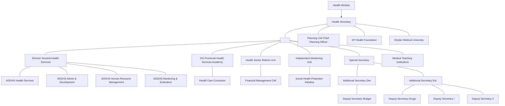
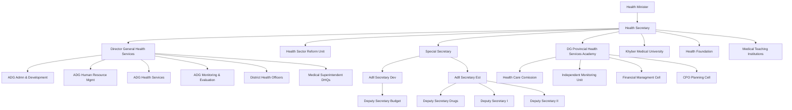
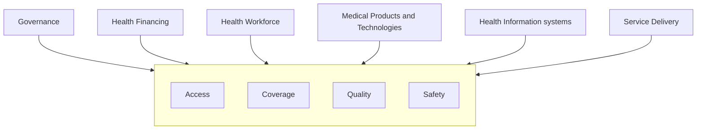

DHIS District Health Information System logo

# District Health Information System

EVIDENCE BASED DECISION MAKING

www.dhiskp.gov.pk

Map of Khyber Pakhtunkhwa districts including Chitral, Upper Dir, Lower Dir, Swat, Kohistan, Shangla, Bajaur, Battagram, Malakand, Mansehra, Mohmand, Mardan, Bunner, Charsadda, Swabi, Haripur, Abbottabad, Peshawar, Nowshera, Khyber, Kurram, Orakzai, Hangu, Dara Adam Khel, Kohat, Karak, Bannu, North Waziristan, Lakki Marwat, South Waziristan, Tank, and D.I. Khan

# ANNUAL REPORT | 2017

Abstract green geometric background with a large illustration of the Bab-e-Khyber gate

Government of Khyber Pakhtunkhwa emblem

---

Photograph of Dr. M. Ayub Rose Yousufzai

# Director General Health Services, Khyber Pakhtunkhwa

The office of the Directorate General Health Services, Khyber Pakhtunkhwa, is the implementation arm of the Health Department. In 2016/17 the Department focused on strengthening the core functions in Directorate of Health, introducing performance management at all levels of service provision and integrating services focused on maternal and childcare.

One of the top priorities of the Department remained strengthening of Health Information System for future planning followed by restructuring of Directorate to introduce critical functions which were missing in the obsolete structure. The Department has streamlined the core functions through restructuring and introduced District Health Information System in place of HMIS to identify, enter the data into DHIS tools, analyze and report disease burden. In past years, inefficient information remained a core challenge for Health Department, which was a key hurdle in timely planning and budgeting towards quality services in Health Sector. The Health Department created DHIS cell to collect information at the district level and analyzed at the provincial DHIS Cell to support all the activities in the Department of Health. The support from DHIS cell has resulted in timely analysis and evidence based information during 2016/17.

The Department has also moved from traditional reporting performance mechanism to a robust automatic online performance mechanism based on Key Performance Indicators (KPIs) from all districts programs. Department conducts regular monthly reviews of DHOs and MS on KPIs and other health indicators. These monthly meetings serve as a platform for collection, analysis and presentation of DHIS data at district and provincial levels.

The launch of DHIS in 2006 (with HMIS in 1996) reiterates the commitment of Health Department towards improving maternal and child health services, vaccine-preventable/modifiablediseases to provide all possible health services to population with a focus on maternal and child health in the province.

In 2017/18 the Department of Health will continue the journey to improve service provision in all health facilities in the province and ensure collection and dissemination of evidence based information for quality reporting towards better planning and minimizing disease burden in Khyber Pakhtunkhwa.

**Dr. M. Ayub Rose Yousufzai**

---

# KHYBER PAKHTUNKHWA: PROFILE

<table>
  <thead>
    <tr>
        <th>Capital</th>
        <th>Peshawar</th>
    </tr>
  </thead>
  <tbody>
    <tr>
        <td>Largest City</td>
<td>Peshawar</td>
    </tr>
<tr>
        <td>Government</td>
<td>Parliamentary system</td>
    </tr>
<tr>
        <td>Type</td>
<td>Province</td>
    </tr>
<tr>
        <td>Body</td>
<td>Provincial Assembly</td>
    </tr>
<tr>
        <td>Governor</td>
<td>Iqbal Zafar Jhagra (PMLN)</td>
    </tr>
<tr>
        <td>Chief Minister</td>
<td>Pervez Khattak (PTI)</td>
    </tr>
<tr>
        <td>Legislature</td>
<td>Unicameral (124)</td>
    </tr>
<tr>
        <td>High Court</td>
<td>Peshawar High Court</td>
    </tr>
<tr>
        <td>Area</td>
<td>74,521 km², 28,773 miles²</td>
    </tr>
<tr>
        <td>Population</td>
<td>2017Provisional Results of 2017 Census: 30,523,3713</td>
    </tr>
<tr>
        <td>Density</td>
<td>360/km (930/sq mi)</td>
    </tr>
<tr>
        <td>Area zone</td>
<td>9291</td>
    </tr>
<tr>
        <td>ISO3166 code</td>
<td>PK-KP</td>
    </tr>
<tr>
        <td>Main Languages</td>
<td>Urdu, Pashto, English, Other language (s) Hindko, Khowar, Kalami, Torwali, Maiya, Kalkoti, Chillisso, Gowro,Kalasha, Palula,Dameli, Gawar-Bati, Yidgha, Burushaski,Wakhi,Saraeki</td>
    </tr>
<tr>
        <td>Assembly Seats</td>
<td>124</td>
    </tr>
<tr>
        <td>Districts</td>
<td>25</td>
    </tr>
<tr>
        <td>Union Councils</td>
<td>986</td>
    </tr>
  </tbody>
</table>

Map of Khyber Pakhtunkhwa showing districts and neighboring regions like Afghanistan, Gilgit Baltistan, Kashmir, Punjab, and FATA.

PAGE 3

DISTRICT HEALTH INFORMATION SYSTEM - ANNUAL REPORT 2017

---

Government of Khyber Pakhtunkhwa logo

DHIS DISTRICT HEALTH INFORMATION SYSTEM logo

# ACKNOWLEDGMENTS

DHIS Project acknowledges the services of its team and all the personnel who contributed in compilation of this reports, without whose efforts it would not have been possible to generate timely information; that in-turn serves as the basis for optimal decision making.

Mr. Hameed Bangash, Data Analyst, Mr. Ehtisham Siddiqui Database Administrator , Mr. Bilal Khalid Network Assistant & Muhammad Waseem Data Entry Operator Provincial Office DHIS are continuously putting efforts to publish quarterly and annual reports of DHIS along with colleagues.

Above all, the guidance provided by the Secretary Health & Director General Health Services served as a beacon in giving final touches to the report.

---

# TABLE OF CONTENTS

<table>
  <thead>
    <tr><th>S.#</th><th>DESCRIPTION</th><th>Page #</th></tr>
  </thead>
  <tbody>
    <tr><td>1.</td><td>Executive Summary</td><td>1</td></tr>
<tr><td>2.</td><td>Introduction: A brief on DHIS</td><td>2</td></tr>
<tr><td><strong>3.</strong></td><td><strong>DHIS ANNUAL REPORT</strong></td><td>3-32</td></tr>
<tr><td>i</td><td>Reporting Compliance</td><td>3</td></tr>
<tr><td>ii</td><td>General OPD Attendance</td><td>4</td></tr>
<tr><td>iii</td><td>Speciality wise Patients breakup</td><td>5</td></tr>
<tr><td>iv</td><td>Average Number of new cases per day</td><td>6</td></tr>
<tr><td>v</td><td>Disease Pattern of OPD (Total 43 Priority Diseases)</td><td>7</td></tr>
<tr><td>vi</td><td>Top 10 Diseases</td><td>8</td></tr>
<tr><td>vii</td><td>Communicable &amp; Non-Communicable Diseases</td><td>9-10</td></tr>
<tr><td>viii</td><td>Lab Services Utilization (Indoor &amp; Outdoor)</td><td>11</td></tr>
<tr><td>ix</td><td>Average Number of ANC Services in the Health Facilities</td><td>12</td></tr>
<tr><td>x</td><td>District wise number of Deliveries</td><td>13</td></tr>
<tr><td>xi</td><td>Health Facility wise number of Deliveries</td><td>14</td></tr>
<tr><td>xii</td><td>Anemia Among Women coming for ANC-1</td><td>15</td></tr>
<tr><td>xiii</td><td>Family Planning visits (16% of total population)</td><td>16</td></tr>
<tr><td>xiv</td><td>Family Planning Services &amp; Commodities provided</td><td>17</td></tr>
<tr><td>xv</td><td>Immunization Status</td><td>18-21</td></tr>
  </tbody>
</table>

<table>
  <thead>
    <tr><th>S.#</th><th>DESCRIPTION</th><th>Page #</th></tr>
  </thead>
  <tbody>
    <tr><td>xvi</td><td>Malaria Cases</td><td>22-23</td></tr>
<tr><td>xvii</td><td>Hepatitis B and C Patients</td><td>24-25</td></tr>
<tr><td>xviii</td><td>TB-DOTS Patients</td><td>26-27</td></tr>
<tr><td>xix</td><td>Mortality Rate</td><td>28-30</td></tr>
<tr><td>xx</td><td>District wise comparison of live birth with LBW</td><td>31</td></tr>
<tr><td>xxi</td><td>District wise comparison of still birth</td><td>32</td></tr>
<tr><td><strong>4.</strong></td><td><strong>TREND ANALYSIS</strong></td><td>33-45</td></tr>
<tr><td><strong>5.</strong></td><td><strong>KEY PERFORMANCE INDICATORS</strong></td><td>46-52</td></tr>
<tr><td><strong>6.</strong></td><td><strong>MEDICAL TEACHING HOSPITALS</strong></td><td>53-59</td></tr>
<tr><td>i</td><td>Lady Reading Hospital</td><td>53-54</td></tr>
<tr><td>ii</td><td>Khyber Teaching Hospital</td><td>55-56</td></tr>
<tr><td>iii</td><td>District Headquarter/Teaching Hospital Bannu</td><td>57-59</td></tr>
<tr><td><strong>7.</strong></td><td><strong>INDEPENDENT MONITORING UNIT</strong></td><td>60-63</td></tr>
<tr><td><strong>8.</strong></td><td><strong>KEY HEALTH STATISTICS</strong></td><td>64-76</td></tr>
<tr><td><strong>9.</strong></td><td><strong>PERFORMANCE OF HEALTH DEPARTMENT AS</strong></td><td>77-92</td></tr>
<tr><td> </td><td><strong>DEPICTED IN A FEW SLIDES OF A PRESENTATION</strong></td><td> </td></tr>
  </tbody>
</table>

---

# Executive Summary

DHIS compiles quarterly and annual report against established health indicators. All districts have achieved the compliance target. General OPD has increased phenomenally i-e 25,106,642 (25.1million). ARI and Diarrhoea are still leading causes of morbidity with regards to communicable diseases whereas amongst non-communicable diseases, UTI & hypertension are on the rise. Health facility utilization rate could be reviewed in detail in the report.

The report also reflects the number of deliveries conducted in the health facilities of the public sector, further family planning services and commodities utilized there-in gives a fair good idea of couples benefitting from these services. The report also encompasses immunization rates. Primary indicators pertaining to T.B & Malaria are also mentioned in the report.

Trend Analysis since 2012-13 up to 2016-17 provides vital information regarding trend of OPD at PHC & SHC levels. Disease patterns of communicable & non-communicable diseases emphasize double burden of disease in Khyber Pakhtunkhwa. Mortality rates are also reflected in the report.

Key performance indicators (KPIs) reflect the performance of the districts & DHQ hospitals and put these in competition with each other. Not only this but, this tools enables districts to further drill-down to facility level to assess the performance of each facility. All the district managers (DHOs & MSs) are provided with relevant dashboards at their desktops.

Last but not the least, on completion of 5 years term of the government, some key health statistics are shared to have a bird’s eye view of the performance of the department in last couple of years.

PAGE 1

DISTRICT HEALTH INFORMATION SYSTEM - ANNUAL REPORT 2017

---

# <u>INTRODUCTION: A BRIEF ON DHIS</u>

DISTRICT HEALTH INFORMATION SYSTEM logo

**PURPOSE / MISSION OF DHIS:**

* Collection, Analysis and dissemination of health related data in the public sector.

* Making organized data/information accessible to all especially policy makers & top Management for evidence based decision-making

* Provide basic tools & instruments (stationary) to all health facilities across the province for maintaining record

**OUTLINE OF THE PROGRAM/PROJECT (Background):**

HMIS was launched in 1992 for generating information on different health indicators. Health Department in collaboration with JICA reviewed HMIS and started working on preparing software of DHIS which was piloted in 2006 in Swabi.

Till 2012: DHIS was implemented in 12 districts

Till 2016: DHIS was implemented in all districts of Khyber Pakhtunkhwa except certain Health Facilities

2016 - 2019: DHIS Phase II is launched as a PC I with the purpose to cover all Health Facilities in PHC and SHC levels and sustenance of regular reporting on 279 Health indicators under 79 sections.

Most of the DHIS staff has been regularized: DHIS is now part of the system.

**CURRENT STATUS (Achievements):**

* DHIS is implemented country-wide (in all provinces); KP DHIS software and data is configured with Federal Level with relevant Ministry.

* Reporting 43 Diseases including Communicable and Non Communicable Priority Diseases.

* DHIS also reports 52 in-patients (hospital-admitted) disease-related-data from Secondary Health Care Level (DHQs/THQs etc)

* Health Indicators (279 in aggregate) are reported under 79 sub-section and; info collected via primary and secondary proformas (Proformas are standardized at country level) covering all health facilities except MTIs and 14 Health facilities at SHC level such as Police Hospital (details mentioned in PC I) etc

* Multiple users can access and work at a time around the province/country/globe as DHIS is a web based/online system.

* Reports regularly: 2012, 2013, 2014, 2015 and 2016 reports are available online; furthermore these reports are also printed and disseminated to different government offices for perusal and taking evidence-based decisions.

* Key Performance Indicators and other MIS such as LHW-MIS, MNCH-MIS, EPI etc are also being configured at DHIS Server.

* Database is available online and can be reached by anyone having login credentials

* DHIS has its own website which is also utilized by Directorate of Health.

* DHIS reporting is carried out from the primary and secondary care health facilities across the province.

PAGE 2

DISTRICT HEALTH INFORMATION SYSTEM - ANNUAL REPORT 2017

---

Photograph of a person writing in a notebook with a pen, with a tablet and charts on the desk

# DISTRICT HEALTH INFORMATION SYSTEM
# ANNUAL REPORT 2017

---

# REPORTING COMPLIANCE DISTRICT WISE PERCENTAGE OF REPORTING COMPLIANCE

This indicator represents the percentage of public health facilities that have submitted monthly reports.

The indicator reflects compliance of DHIS data. A target of 95% is set for the districts.

Twenty four districts have achieved the target.

Reporting Compliance

<table>
  <tbody>
    <tr>
        <td>Category</td>
<td>Value</td>
    </tr>
<tr>
        <td>95</td>
<td>24</td>
    </tr>
<tr>
        <td>&lt;=95</td>
<td>1</td>
    </tr>
  </tbody>
</table>

<table>
  <tbody>
    <tr>
        <td>District</td>
<td>Percentage</td>
    </tr>
<tr>
        <td>D.I. Khan</td>
<td>100</td>
    </tr>
<tr>
        <td>Abbottabad</td>
<td>100</td>
    </tr>
<tr>
        <td>Mansehra</td>
<td>100</td>
    </tr>
<tr>
        <td>Toor Ghar</td>
<td>100</td>
    </tr>
<tr>
        <td>Karak</td>
<td>100</td>
    </tr>
<tr>
        <td>Kohat</td>
<td>100</td>
    </tr>
<tr>
        <td>Hangu</td>
<td>100</td>
    </tr>
<tr>
        <td>Buner</td>
<td>100</td>
    </tr>
<tr>
        <td>Chitral</td>
<td>100</td>
    </tr>
<tr>
        <td>Dir Lower</td>
<td>100</td>
    </tr>
<tr>
        <td>Malakand</td>
<td>100</td>
    </tr>
<tr>
        <td>Dir Upper</td>
<td>100</td>
    </tr>
<tr>
        <td>Shangla</td>
<td>100</td>
    </tr>
<tr>
        <td>Mardan</td>
<td>100</td>
    </tr>
<tr>
        <td>Swabi</td>
<td>100</td>
    </tr>
<tr>
        <td>Charsadda</td>
<td>100</td>
    </tr>
<tr>
        <td>Nowshera</td>
<td>100</td>
    </tr>
<tr>
        <td>Peshawar</td>
<td>100</td>
    </tr>
<tr>
        <td>Lakki Marwat</td>
<td>99</td>
    </tr>
<tr>
        <td>Haripur</td>
<td>99</td>
    </tr>
<tr>
        <td>Bannu</td>
<td>98</td>
    </tr>
<tr>
        <td>Battagram</td>
<td>98</td>
    </tr>
<tr>
        <td>Swat</td>
<td>98</td>
    </tr>
<tr>
        <td>Kohistan</td>
<td>97</td>
    </tr>
<tr>
        <td>Tank</td>
<td>95</td>
    </tr>
  </tbody>
</table>

Figure shows the district-wise reporting compliance of all the districts of Khyber Pakhtunkhwa. 18 districts (D.I Khan, Abbottabad, Mansehra, Tor Ghar, Karak, Kohat, Hangu, Buner, Chitral, Dir Lower, Malakand, Dir Upper, Shangla, Mardan, Charsadda, Swabi, Nowshera, Peshawar), among 25 districts reported 100% performance. Performance of districts Lakki Marwat to Kohistan stands at (99% to 97%). Tank is the only district among all 25 districts which has just touched the target i.e 95%.

PAGE 3 DISTRICT HEALTH INFORMATION SYSTEM - ANNUAL REPORT 2017

---

HEALTH FACILITIES' UTILIZATION RATE

# GENERAL OPD ATTENDANCE
(PRIMARY HEALTH CARE FACILITIES & SECONDARY HEALTH CARE FACILITIES)

This is one of the key indicators to assess performance of the health services in Khyber Pakhtunkhwa Province. It refers to the number of people attending and receiving services at health facilities during illness.

Figure shows the General OPD in secondary and primary care health facilities with gender wise breakup of male and female patients of the province.

Age-wise breakup of patients visiting the OPDs is consistent in 2017, the figures shows that in the case of male OPD attendance of age group from 1 to 14 years is (5,331,239), which is 49.51% of the total of male OPD (10,768,911).

Similarly in case of female OPD attendance of age group from 1 to 14 age group (5,094,424) is 35.53% of the total OPD attendance female.

The overall picture depicts that more female patients are visiting health facilities as compared to male population. Hence more focus should be on providing healthcare services for female population.

Total OPD Attendance
(Primary and Secondary Health Facilities)

<table>
  <thead>
    <tr>
        <th>Gender</th>
        <th>Age Group</th>
        <th>Attendance</th>
    </tr>
  </thead>
  <tbody>
    <tr>
        <td>Male</td>
<td>&lt; 1 yr</td>
<td>996058</td>
    </tr>
<tr>
        <td>Male</td>
<td>1-4 yrs</td>
<td>1992235</td>
    </tr>
<tr>
        <td>Male</td>
<td>5--14yrs</td>
<td>2342946</td>
    </tr>
<tr>
        <td>Male</td>
<td>15-49</td>
<td>3436974</td>
    </tr>
<tr>
        <td>Male</td>
<td>50+</td>
<td>2000698</td>
    </tr>
<tr>
        <td>Male</td>
<td>Total</td>
<td>10768911</td>
    </tr>
<tr>
        <td>FeMale</td>
<td>&lt; 1 yr</td>
<td>897374</td>
    </tr>
<tr>
        <td>FeMale</td>
<td>1-4 yrs</td>
<td>1730072</td>
    </tr>
<tr>
        <td>FeMale</td>
<td>5--14yrs</td>
<td>2466978</td>
    </tr>
<tr>
        <td>FeMale</td>
<td>15-49</td>
<td>6301820</td>
    </tr>
<tr>
        <td>FeMale</td>
<td>50+</td>
<td>2941487</td>
    </tr>
<tr>
        <td>FeMale</td>
<td>Total</td>
<td>14337731</td>
    </tr>
  </tbody>
</table>

PAGE 4

DISTRICT HEALTH INFORMATION SYSTEM - ANNUAL REPORT 2017

---

HEALTH FACILITIES' UTILIZATION RATE

# SPECIALTY WISE PATIENTS BREAK UP

The indicator gives us an idea about the distribution of patients to different specialties enabling the reader to broadly categorize and assess the flow of patients to different specialties available in the health facilities

**Table and figure** of the indicator **OPD Attendance Specialty wise** shows the percentage of total new visits (Patients) of in the facility to different specialty (i.e General OPD, Medicine, Surgery, Pediatric etc).

Under the specialty Emergency/Casualty, the number and percentage of patients are on top and stands at **(3,933,358)** with **26.6%**, General OPD on second number and is **(3,851,081)** which is **26.1%**. Number of patients in the specialty of Pediatric **(1,714,442)** which is **11.6%**.

<table>
  <thead>
    <tr>
        <th>Specialty</th>
        <th>Percentage</th>
    </tr>
  </thead>
  <tbody>
    <tr>
        <td>Emergency/Casualty</td>
<td>26.6</td>
    </tr>
<tr>
        <td>General OPD</td>
<td>26.1</td>
    </tr>
<tr>
        <td>Pediatric</td>
<td>11.6</td>
    </tr>
<tr>
        <td>OB/GYN</td>
<td>6.5</td>
    </tr>
<tr>
        <td>Medicine</td>
<td>6.4</td>
    </tr>
<tr>
        <td>Dental</td>
<td>3.6</td>
    </tr>
<tr>
        <td>Eye</td>
<td>3.5</td>
    </tr>
<tr>
        <td>Surgery</td>
<td>3.3</td>
    </tr>
<tr>
        <td>Orthopedics</td>
<td>3.3</td>
    </tr>
<tr>
        <td>ENT</td>
<td>2.8</td>
    </tr>
<tr>
        <td>Skin</td>
<td>2.1</td>
    </tr>
<tr>
        <td>Others</td>
<td>1.4</td>
    </tr>
<tr>
        <td>Cardiology</td>
<td>1.3</td>
    </tr>
<tr>
        <td>Homeo Cases</td>
<td>0.6</td>
    </tr>
<tr>
        <td>Psychiatry</td>
<td>0.5</td>
    </tr>
<tr>
        <td>Tibb/Unani Shifa Khana</td>
<td>0.3</td>
    </tr>
  </tbody>
</table>

<table>
  <thead>
    <tr>
        <th colspan="3">Total OPD/New Cases (SHC)</th>
        <th>14774941</th>
    </tr>
<tr>
        <th>Sr.#</th>
        <th>Specialty</th>
        <th>New Visits</th>
        <th>%age</th>
    </tr>
  </thead>
  <tbody>
    <tr>
        <td>1</td>
<td>Emergency/Casualty</td>
<td>3933358</td>
<td>26.6</td>
    </tr>
<tr>
        <td>2</td>
<td>General OPD</td>
<td>3851081</td>
<td>26.1</td>
    </tr>
<tr>
        <td>3</td>
<td>Pediatric</td>
<td>1714442</td>
<td>11.6</td>
    </tr>
<tr>
        <td>4</td>
<td>OB/GYN</td>
<td>967324</td>
<td>6.5</td>
    </tr>
<tr>
        <td>5</td>
<td>Medicine</td>
<td>945494</td>
<td>6.4</td>
    </tr>
<tr>
        <td>6</td>
<td>Dental</td>
<td>538564</td>
<td>3.6</td>
    </tr>
<tr>
        <td>7</td>
<td>Eye</td>
<td>518089</td>
<td>3.5</td>
    </tr>
<tr>
        <td>8</td>
<td>Surgery</td>
<td>490733</td>
<td>3.3</td>
    </tr>
<tr>
        <td>9</td>
<td>Orthopaedics</td>
<td>490352</td>
<td>3.3</td>
    </tr>
<tr>
        <td>10</td>
<td>ENT</td>
<td>408908</td>
<td>2.8</td>
    </tr>
<tr>
        <td>11</td>
<td>Skin</td>
<td>310493</td>
<td>2.1</td>
    </tr>
<tr>
        <td>12</td>
<td>Others</td>
<td>205125</td>
<td>1.4</td>
    </tr>
<tr>
        <td>13</td>
<td>Cardiology</td>
<td>192798</td>
<td>1.3</td>
    </tr>
<tr>
        <td>14</td>
<td>Homeo Cases</td>
<td>82514</td>
<td>0.6</td>
    </tr>
<tr>
        <td>15</td>
<td>Psychiatry</td>
<td>80905</td>
<td>0.5</td>
    </tr>
<tr>
        <td>16</td>
<td>Tibb/Unani Shifa Khana</td>
<td>44761</td>
<td>0.3</td>
    </tr>
  </tbody>
</table>

PAGE 5

DISTRICT HEALTH INFORMATION SYSTEM - ANNUAL REPORT 2017

---

HEALTH FACILITIES' UTILIZATION RATE

# AVERAGE NUMBER OF NEW CASES PER DAY

This indicator illustrates the frequency of the average number of new cases per day in the public health facilities.

Table illustrate, the average number of new case per day in 2017.

District Swat is on top of the list and on average **93390** new cases are reported in all public health facilities of the district. District Charsadda is on 2nd position and reported **67540** patients per day in all health facilities.

<table>
  <thead>
    <tr>
        <th>S#</th>
        <th>District</th>
        <th>Total Visits</th>
        <th>Avg New case per Day</th>
    </tr>
  </thead>
  <tbody>
    <tr>
        <td>1</td>
<td>Swat</td>
<td>2535582</td>
<td>93390</td>
    </tr>
<tr>
        <td>2</td>
<td>Charsadda</td>
<td>1690770</td>
<td>67540</td>
    </tr>
<tr>
        <td>3</td>
<td>Peshawar</td>
<td>1650961</td>
<td>65629</td>
    </tr>
<tr>
        <td>4</td>
<td>Swabi</td>
<td>1661999</td>
<td>65577</td>
    </tr>
<tr>
        <td>5</td>
<td>Mansehra</td>
<td>1645658</td>
<td>65456</td>
    </tr>
<tr>
        <td>6</td>
<td>Nowshera</td>
<td>1588652</td>
<td>63296</td>
    </tr>
<tr>
        <td>7</td>
<td>Mardan</td>
<td>1437073</td>
<td>54678</td>
    </tr>
<tr>
        <td>8</td>
<td>Abbottabad</td>
<td>1344137</td>
<td>53441</td>
    </tr>
<tr>
        <td>9</td>
<td>Malakand</td>
<td>1310734</td>
<td>52186</td>
    </tr>
<tr>
        <td>10</td>
<td>Dir Lower</td>
<td>1165073</td>
<td>44768</td>
    </tr>
<tr>
        <td>11</td>
<td>Haripur</td>
<td>1174707</td>
<td>41407</td>
    </tr>
<tr>
        <td>12</td>
<td>Kohat</td>
<td>1075737</td>
<td>40881</td>
    </tr>
<tr>
        <td>13</td>
<td>D.I. Khan</td>
<td>976774</td>
<td>38508</td>
    </tr>
<tr>
        <td>14</td>
<td>Lakki Marwat</td>
<td>807560</td>
<td>30965</td>
    </tr>
<tr>
        <td>15</td>
<td>Karak</td>
<td>737713</td>
<td>29487</td>
    </tr>
<tr>
        <td>16</td>
<td>Dir Upper</td>
<td>709039</td>
<td>28322</td>
    </tr>
<tr>
        <td>17</td>
<td>Bannu</td>
<td>737380</td>
<td>28277</td>
    </tr>
<tr>
        <td>18</td>
<td>Buner</td>
<td>643017</td>
<td>23476</td>
    </tr>
<tr>
        <td>19</td>
<td>Hangu</td>
<td>552133</td>
<td>22036</td>
    </tr>
<tr>
        <td>20</td>
<td>Chitral</td>
<td>563999</td>
<td>21560</td>
    </tr>
<tr>
        <td>21</td>
<td>Battagram</td>
<td>423935</td>
<td>16490</td>
    </tr>
<tr>
        <td>22</td>
<td>Tank</td>
<td>401139</td>
<td>15854</td>
    </tr>
<tr>
        <td>23</td>
<td>Shangla</td>
<td>350029</td>
<td>13927</td>
    </tr>
<tr>
        <td>24</td>
<td>Kohistan</td>
<td>150476</td>
<td>6018</td>
    </tr>
<tr>
        <td>25</td>
<td>Toor Ghar</td>
<td>44576</td>
<td>1757</td>
    </tr>
<tr>
        <td> </td>
<td>Total</td>
<td>25378853</td>
<td>984925</td>
    </tr>
  </tbody>
</table>

Avg New case per Day

<table>
  <thead>
    <tr>
        <th>District</th>
        <th>Avg New case per Day</th>
    </tr>
  </thead>
  <tbody>
    <tr>
        <td>Swat</td>
<td>93390</td>
    </tr>
<tr>
        <td>Charsadda</td>
<td>67540</td>
    </tr>
<tr>
        <td>Peshawar</td>
<td>65629</td>
    </tr>
<tr>
        <td>Swabi</td>
<td>65577</td>
    </tr>
<tr>
        <td>Mansehra</td>
<td>65456</td>
    </tr>
<tr>
        <td>Nowshera</td>
<td>63296</td>
    </tr>
<tr>
        <td>Mardan</td>
<td>54678</td>
    </tr>
<tr>
        <td>Abbottabad</td>
<td>53441</td>
    </tr>
<tr>
        <td>Malakand</td>
<td>52186</td>
    </tr>
<tr>
        <td>Dir Lower</td>
<td>44768</td>
    </tr>
<tr>
        <td>Haripur</td>
<td>41407</td>
    </tr>
<tr>
        <td>Kohat</td>
<td>40881</td>
    </tr>
<tr>
        <td>D.I. Khan</td>
<td>38508</td>
    </tr>
<tr>
        <td>Lakki Marwat</td>
<td>30965</td>
    </tr>
<tr>
        <td>Karak</td>
<td>29487</td>
    </tr>
<tr>
        <td>Dir Upper</td>
<td>28322</td>
    </tr>
<tr>
        <td>Bannu</td>
<td>28277</td>
    </tr>
<tr>
        <td>Buner</td>
<td>23476</td>
    </tr>
<tr>
        <td>Hangu</td>
<td>22036</td>
    </tr>
<tr>
        <td>Chitral</td>
<td>21560</td>
    </tr>
<tr>
        <td>Battagram</td>
<td>16490</td>
    </tr>
<tr>
        <td>Tank</td>
<td>15854</td>
    </tr>
<tr>
        <td>Shangla</td>
<td>13927</td>
    </tr>
<tr>
        <td>Kohistan</td>
<td>6018</td>
    </tr>
<tr>
        <td>Toor Ghar</td>
<td>1757</td>
    </tr>
  </tbody>
</table>

PAGE 6 DISTRICT HEALTH INFORMATION SYSTEM - ANNUAL REPORT 2017

---

This indicator will help to understand which disease/cases were attended at the health facilities in a district

# DISEASES PATTERN IN OUT PATIENT DEPARTMENT (OF THE TOTAL 43 PRIORITY DISEASES)

HEALTH FACILITIES' UTILIZATION RATE

The indicator can trigger a response in terms of additional resources allocation or redistribution of resources according to the disease pattern, or initiating specific preventive, promotive and or curative services at specific area/catchment population.

For the purpose of the DHIS 43 diseases have been selected as "Priority Diseases" in consultation the other stakeholders, the Government of Khyber Pakhtunkhwa has adopted these enlisted priority diseases in continuation to the national decision.

These diseases are listed in table no. 3, which present the numbers of patients provided care at Primary and Secondary Level Health Facilities.

<table>
  <thead>
    <tr>
        <th>Category</th>
        <th>Percentage (%)</th>
    </tr>
  </thead>
  <tbody>
    <tr>
        <td>Total Priority Diseases</td>
<td>50.76</td>
    </tr>
<tr>
        <td>Other Diseases</td>
<td>49.24</td>
    </tr>
  </tbody>
</table>

<table>
  <thead>
    <tr>
        <th colspan="2">Total new Patients in 2017</th>
        <th>25378853</th>
    </tr>
<tr>
        <th>S. No</th>
        <th>Disease Name</th>
        <th>Total</th>
    </tr>
  </thead>
  <tbody>
    <tr>
        <td>1</td>
<td>Acute (upper) Respiratory Infections (ARI)</td>
<td>3352404</td>
    </tr>
<tr>
        <td>2</td>
<td>Diarrhoea/Dysentery in under 5 yrs</td>
<td>1106129</td>
    </tr>
<tr>
        <td>3</td>
<td>Fever due to other causes</td>
<td>1010877</td>
    </tr>
<tr>
        <td>4</td>
<td>Diarrhoea/Dysentery in &gt;5 yrs</td>
<td>900216</td>
    </tr>
<tr>
        <td>5</td>
<td>Urinary Tract Infections</td>
<td>816496</td>
    </tr>
<tr>
        <td>6</td>
<td>Hypertension</td>
<td>615362</td>
    </tr>
<tr>
        <td>7</td>
<td>Dental Caries</td>
<td>588247</td>
    </tr>
<tr>
        <td>8</td>
<td>Peptic Ulcer Diseases</td>
<td>501305</td>
    </tr>
<tr>
        <td>9</td>
<td>Suspected Malaria</td>
<td>494411</td>
    </tr>
<tr>
        <td>10</td>
<td>Diabetes Mellitus</td>
<td>367753</td>
    </tr>
<tr>
        <td>11</td>
<td>Scabies</td>
<td>365144</td>
    </tr>
<tr>
        <td>12</td>
<td>Worm infestation</td>
<td>325707</td>
    </tr>
<tr>
        <td>13</td>
<td>Otitis Media</td>
<td>240802</td>
    </tr>
<tr>
        <td>14</td>
<td>Dermatitis</td>
<td>235375</td>
    </tr>
<tr>
        <td>15</td>
<td>Asthma</td>
<td>226183</td>
    </tr>
<tr>
        <td>16</td>
<td>Road traffic accidents -</td>
<td>225326</td>
    </tr>
  </tbody>
</table>

<table>
  <tbody>
    <tr>
        <td>17</td>
<td>Enteric / Typhoid Fever -</td>
<td>224865</td>
    </tr>
<tr>
        <td>18</td>
<td>Depression -</td>
<td>203508</td>
    </tr>
<tr>
        <td>19</td>
<td>Pneumonia under 5 years -</td>
<td>189149</td>
    </tr>
<tr>
        <td>20</td>
<td>Pneumonia &gt;5 years -</td>
<td>134958</td>
    </tr>
<tr>
        <td>21</td>
<td>TB Suspects -</td>
<td>116164</td>
    </tr>
<tr>
        <td>22</td>
<td>Suspected Viral Hepatitis -</td>
<td>78310</td>
    </tr>
<tr>
        <td>23</td>
<td>Fractures -</td>
<td>77369</td>
    </tr>
<tr>
        <td>24</td>
<td>Cataract -</td>
<td>77010</td>
    </tr>
<tr>
        <td>25</td>
<td>Dog bite -</td>
<td>67086</td>
    </tr>
<tr>
        <td>26</td>
<td>Ischemic Heart Disease -</td>
<td>64758</td>
    </tr>
<tr>
        <td>27</td>
<td>Chronic Obstructive Pulmonary Diseases -</td>
<td>51760</td>
    </tr>
<tr>
        <td>28</td>
<td>Suspected Measles -</td>
<td>33448</td>
    </tr>
<tr>
        <td>29</td>
<td>Trachoma -</td>
<td>29592</td>
    </tr>
<tr>
        <td>30</td>
<td>Glaucoma -</td>
<td>27163</td>
    </tr>
<tr>
        <td>31</td>
<td>Burns -</td>
<td>21632</td>
    </tr>
<tr>
        <td>32</td>
<td>Epilepsy -</td>
<td>20539</td>
    </tr>
<tr>
        <td>33</td>
<td>Drug Dependence -</td>
<td>19232</td>
    </tr>
<tr>
        <td>34</td>
<td>Benign Enlargement of Prostrate -</td>
<td>19076</td>
    </tr>
<tr>
        <td>35</td>
<td>Nephritis/Nephrosis -</td>
<td>14236</td>
    </tr>
<tr>
        <td>36</td>
<td>Sexually Transmitted Infections -</td>
<td>13295</td>
    </tr>
<tr>
        <td>37</td>
<td>Cirrhosis of Liver -</td>
<td>11702</td>
    </tr>
<tr>
        <td>38</td>
<td>Suspected Meningitis -</td>
<td>6064</td>
    </tr>
<tr>
        <td>39</td>
<td>Cutaneous Leishmaniasis -</td>
<td>6012</td>
    </tr>
<tr>
        <td>40</td>
<td>Suspected Neonatal Tetanus -</td>
<td>2632</td>
    </tr>
<tr>
        <td>41</td>
<td>Snake bits (with signs/symptoms of poisoning) -</td>
<td>1443</td>
    </tr>
<tr>
        <td>42</td>
<td>Acute Flaccid Paralysis -</td>
<td>349</td>
    </tr>
<tr>
        <td>43</td>
<td>Suspected HIV/AIDS -</td>
<td>42</td>
    </tr>
<tr>
        <td colspan="2">Total Priority Disease</td>
<td>12883131</td>
    </tr>
  </tbody>
</table>

PAGE 7

DISTRICT HEALTH INFORMATION SYSTEM - ANNUAL REPORT 2017

---

HEALTH FACILITIES' UTILIZATION RATE

# TOP TEN DISEASES

(OF THE TOTAL 43 PRIORITY DISEASES)

Acute Respiratory Infections stands at **3,352,404** which is **13.21%** of these patients. Diarrhoea/Dysentery in under and over 5 year's stands at **1,106,129** with **4.36%** and **900,216** with **3.55%** of the total in 2017. Fever due to other causes stands at **1,010,877 (3.99%)** patients in 2017.

Cases of Urinary Tract Infections and Hypertension disorders are **816,496** which are **3.22%** and **615,362 (2.42%)** of the total patients. Dental Caries and Peptic Ulcer Diseases are **588,247** with **2.32%** and **501305** with **1.98%** in 2017.

Top Ten Disease in Khyber Pakhtunkhwa

<table>
  <tbody>
    <tr>
        <td>Category</td>
<td>Value (%)</td>
    </tr>
<tr>
        <td>Acute(upper)Respiratory Infections</td>
<td>11</td>
    </tr>
<tr>
        <td>Diarrhoea/Dysentery &lt; 5 yrs</td>
<td>11</td>
    </tr>
<tr>
        <td>Fever due to other causes</td>
<td>10</td>
    </tr>
<tr>
        <td>Diarrhoea/Dysentery &gt;5 yrs</td>
<td>9</td>
    </tr>
<tr>
        <td>Urinary Tract Infections</td>
<td>9</td>
    </tr>
<tr>
        <td>Hypertension</td>
<td>6</td>
    </tr>
<tr>
        <td>Dental Caries</td>
<td>6</td>
    </tr>
<tr>
        <td>Peptic Ulcer Diseases</td>
<td>5</td>
    </tr>
<tr>
        <td>Suspected Malaria</td>
<td>5</td>
    </tr>
<tr>
        <td>Other</td>
<td>35</td>
    </tr>
  </tbody>
</table>

<table>
  <thead>
    <tr>
        <th>S. No</th>
        <th>Disease Name</th>
        <th>Total</th>
        <th>%age</th>
    </tr>
  </thead>
  <tbody>
    <tr>
        <td>1</td>
<td>Acute(upper)Respiratory Infections</td>
<td>3352404</td>
<td>13.21</td>
    </tr>
<tr>
        <td>2</td>
<td>Diarrhoea/Dysentery &lt; 5 yrs</td>
<td>1106129</td>
<td>4.36</td>
    </tr>
<tr>
        <td>3</td>
<td>Fever due to other causes</td>
<td>1010877</td>
<td>3.98</td>
    </tr>
<tr>
        <td>4</td>
<td>Diarrhoea/Dysentery &gt;5 yrs</td>
<td>900216</td>
<td>3.55</td>
    </tr>
<tr>
        <td>5</td>
<td>Urinary Tract Infections</td>
<td>816496</td>
<td>3.22</td>
    </tr>
<tr>
        <td>6</td>
<td>Hypertension</td>
<td>615362</td>
<td>2.42</td>
    </tr>
<tr>
        <td>7</td>
<td>Dental Caries</td>
<td>588247</td>
<td>2.32</td>
    </tr>
<tr>
        <td>8</td>
<td>Peptic Ulcer Diseases</td>
<td>501305</td>
<td>1.98</td>
    </tr>
<tr>
        <td>9</td>
<td>Suspected Malaria</td>
<td>494411</td>
<td>1.95</td>
    </tr>
<tr>
        <td>10</td>
<td>Diabetes Mellitus</td>
<td>367753</td>
<td>1.45</td>
    </tr>
  </tbody>
</table>

Suspected Malaria cases reported are **494,411** with **(1.95%)** Diabetes Mellitus having **367,753** with **1.45%** percent in 2016. The department should adopt programmatic approach to control the disease.

PAGE 8 DISTRICT HEALTH INFORMATION SYSTEM - ANNUAL REPORT 2017

---

# COMMUNICABLE AND NON COMMUNICABLE DISEASES

Out of 43 priority diseases, 19 are communicable and 24 are non-communicable diseases. Subsequent analysis shows the most common diseases and disease-wise breakup. In 2017, total number of communicable diseases are 7,378,891 (29.07%), whereas non-communicable diseases are 5,504,240 (21.69%).

## COMMUNICABLE DISEASES

Acute Respiratory Infections and diarrhea/dysentery under and over 5 years constitute **21.12%** of these patients. Prevalence of Scabies stands at 365144 with **1.44%** patients in 2017. Suspected Malaria cases are reported as 494411 in figures and 1.951% in percentage in 2017.

HEALTH FACILITIES' UTILIZATION RATE

<table>
  <thead>
    <tr>
        <th colspan="2">Total new Patients in 2017</th>
        <th colspan="2">25378853</th>
    </tr>
<tr>
        <th>S. #</th>
        <th>Disease Name</th>
        <th>Total</th>
        <th>%age</th>
    </tr>
  </thead>
  <tbody>
    <tr>
        <td>1</td>
<td>Acute (upper) Respiratory Infections (ARI)</td>
<td>3352404</td>
<td>13.21</td>
    </tr>
<tr>
        <td>2</td>
<td>Diarrhoea/Dysentery in under 5 yrs</td>
<td>1106129</td>
<td>4.36</td>
    </tr>
<tr>
        <td>3</td>
<td>Diarrhoea/Dysentery in &gt;5 yrs</td>
<td>900216</td>
<td>3.55</td>
    </tr>
<tr>
        <td>4</td>
<td>Suspected Malaria</td>
<td>494411</td>
<td>1.95</td>
    </tr>
<tr>
        <td>5</td>
<td>Scabies</td>
<td>365144</td>
<td>1.44</td>
    </tr>
<tr>
        <td>6</td>
<td>Worm infestation</td>
<td>325707</td>
<td>1.28</td>
    </tr>
<tr>
        <td>7</td>
<td>Enteric / Typhoid Fever</td>
<td>224865</td>
<td>0.89</td>
    </tr>
<tr>
        <td>8</td>
<td>Pneumonia under 5 years</td>
<td>189149</td>
<td>0.75</td>
    </tr>
<tr>
        <td>9</td>
<td>Pneumonia &gt;5 years</td>
<td>134958</td>
<td>0.53</td>
    </tr>
<tr>
        <td>10</td>
<td>TB Suspects</td>
<td>116164</td>
<td>0.46</td>
    </tr>
<tr>
        <td>11</td>
<td>Suspected Viral Hepatitis</td>
<td>78310</td>
<td>0.31</td>
    </tr>
<tr>
        <td>12</td>
<td>Suspected Measles</td>
<td>33448</td>
<td>0.13</td>
    </tr>
<tr>
        <td>13</td>
<td>Trachoma</td>
<td>29592</td>
<td>0.12</td>
    </tr>
<tr>
        <td>14</td>
<td>Sexually Transmitted Infections</td>
<td>13295</td>
<td>0.05</td>
    </tr>
<tr>
        <td>15</td>
<td>Suspected Meningitis</td>
<td>6064</td>
<td>0.02</td>
    </tr>
<tr>
        <td>16</td>
<td>Cutaneous Leishmaniasis</td>
<td>6012</td>
<td>0.02</td>
    </tr>
<tr>
        <td>17</td>
<td>Suspected Neonatal Tetanus</td>
<td>2632</td>
<td>0.01</td>
    </tr>
<tr>
        <td>18</td>
<td>Acute Flaccid Paralysis</td>
<td>349</td>
<td>0.0014</td>
    </tr>
<tr>
        <td>19</td>
<td>Suspected HIV/AIDS</td>
<td>42</td>
<td>0.00017</td>
    </tr>
<tr>
        <td colspan="2">Total</td>
<td>7378891</td>
<td>29.07</td>
    </tr>
  </tbody>
</table>

Top 5 Non Communicable Diseases (in %age)

<table>
  <tbody>
    <tr>
        <td>Disease</td>
<td>%age</td>
    </tr>
<tr>
        <td>Acute (upper) Respiratory Infections (ARI)</td>
<td>13.21</td>
    </tr>
<tr>
        <td>Diarrhoea/Dysentery in under 5 yrs</td>
<td>4.36</td>
    </tr>
<tr>
        <td>Diarrhoea/Dysentery in &gt;5 yrs</td>
<td>3.55</td>
    </tr>
<tr>
        <td>Suspected Malaria</td>
<td>1.95</td>
    </tr>
<tr>
        <td>Scabies</td>
<td>1.44</td>
    </tr>
  </tbody>
</table>

PAGE 9

DISTRICT HEALTH INFORMATION SYSTEM - ANNUAL REPORT 2017

---

# COMMUNICABLE AND NON COMMUNICABLE DISEASES

Out of 43 priority diseases, 19 are communicable and 24 are non-communicable diseases. Subsequent analysis shows the most common diseases and disease-wise breakup. In 2017, total number of communicable diseases are 7,378,891 (29.07%), whereas non-communicable diseases are 5,504,240 (21.69%).

## NON-COMMUNICABLE DISEASES

The Table and Figure illustrates non-communicable diseases in Khyber Pakhtunkhwa province during 2017

<table>
  <thead>
    <tr>
        <th colspan="2">Total new Patients in 2017</th>
        <th colspan="2">25378853</th>
    </tr>
<tr>
        <th>S. #</th>
        <th>Disease Name</th>
        <th>Total</th>
        <th>%age</th>
    </tr>
  </thead>
  <tbody>
    <tr>
        <td>1</td>
<td>Fever due to other causes</td>
<td>1010877</td>
<td>3.98</td>
    </tr>
<tr>
        <td>2</td>
<td>Urinary Tract Infections</td>
<td>816496</td>
<td>3.22</td>
    </tr>
<tr>
        <td>3</td>
<td>Hypertension</td>
<td>615362</td>
<td>2.42</td>
    </tr>
<tr>
        <td>4</td>
<td>Dental Caries</td>
<td>588247</td>
<td>2.32</td>
    </tr>
<tr>
        <td>5</td>
<td>Peptic Ulcer Diseases</td>
<td>501305</td>
<td>1.98</td>
    </tr>
<tr>
        <td>6</td>
<td>Diabetes Mellitus</td>
<td>367753</td>
<td>1.45</td>
    </tr>
<tr>
        <td>7</td>
<td>Otitis Media</td>
<td>240802</td>
<td>0.95</td>
    </tr>
<tr>
        <td>8</td>
<td>Dermatitis</td>
<td>235375</td>
<td>0.93</td>
    </tr>
<tr>
        <td>9</td>
<td>Asthma</td>
<td>226183</td>
<td>0.89</td>
    </tr>
<tr>
        <td>10</td>
<td>Road traffic accidents</td>
<td>225326</td>
<td>0.89</td>
    </tr>
<tr>
        <td>11</td>
<td>Depression</td>
<td>203508</td>
<td>0.80</td>
    </tr>
<tr>
        <td>12</td>
<td>Fractures</td>
<td>77369</td>
<td>0.30</td>
    </tr>
<tr>
        <td>13</td>
<td>Cataract</td>
<td>77010</td>
<td>0.30</td>
    </tr>
<tr>
        <td>14</td>
<td>Dog bite</td>
<td>67086</td>
<td>0.26</td>
    </tr>
<tr>
        <td>15</td>
<td>Ischemic Heart Disease</td>
<td>64758</td>
<td>0.26</td>
    </tr>
<tr>
        <td>16</td>
<td>Chronic Obstructive Pulmonary</td>
<td>51760</td>
<td>0.20</td>
    </tr>
<tr>
        <td>17</td>
<td>Glaucoma</td>
<td>27163</td>
<td>0.11</td>
    </tr>
<tr>
        <td>18</td>
<td>Burns</td>
<td>21632</td>
<td>0.09</td>
    </tr>
<tr>
        <td>19</td>
<td>Epilepsy</td>
<td>20539</td>
<td>0.08</td>
    </tr>
<tr>
        <td>20</td>
<td>Drug Dependence</td>
<td>19232</td>
<td>0.08</td>
    </tr>
<tr>
        <td>21</td>
<td>Benign Enlargement of Prostrate</td>
<td>19076</td>
<td>0.08</td>
    </tr>
<tr>
        <td>22</td>
<td>Nephritis/Nephrosis</td>
<td>14236</td>
<td>0.06</td>
    </tr>
<tr>
        <td>23</td>
<td>Cirrhosis of Liver</td>
<td>11702</td>
<td>0.05</td>
    </tr>
<tr>
        <td>24</td>
<td>Snake bites (with signs/symptoms of poisoning)</td>
<td>1443</td>
<td>0.01</td>
    </tr>
<tr>
        <td colspan="2">Total</td>
<td>5504240</td>
<td>21.69</td>
    </tr>
  </tbody>
</table>

Top 5 Non Communicable Diseases (in %age)

<table>
  <tbody>
    <tr>
        <td>Disease</td>
<td>%age</td>
    </tr>
<tr>
        <td>Fever due to other causes</td>
<td>3.98</td>
    </tr>
<tr>
        <td>Urinary Tract Infections</td>
<td>3.22</td>
    </tr>
<tr>
        <td>Peptic Ulcer Diseases</td>
<td>2.42</td>
    </tr>
<tr>
        <td>Dental Caries</td>
<td>2.32</td>
    </tr>
<tr>
        <td>Hypertension</td>
<td>1.98</td>
    </tr>
  </tbody>
</table>

PAGE 10

DISTRICT HEALTH INFORMATION SYSTEM - ANNUAL REPORT 2017

---

# LAB SERVICES UTILIZATION FOR OUT DOOR PATIENTS

This indicator indicates the utilization of laboratory services at the facility and also gives a measure of the proportion of outdoor patients receiving diagnostic services from health facility.

The graph reflects the figures and show quality of care in terms of utilization of investigation services.

Lab Services Utilization for Out Patients

<table>
  <tbody>
    <tr>
        <td>Investigation</td>
<td>Value</td>
    </tr>
<tr>
        <td>ECG</td>
<td>229579</td>
    </tr>
<tr>
        <td>CT Scan</td>
<td>14761</td>
    </tr>
<tr>
        <td>Ultrasonographies</td>
<td>505575</td>
    </tr>
<tr>
        <td>X-Rays</td>
<td>830343</td>
    </tr>
<tr>
        <td>Lab Investigation</td>
<td>3958186</td>
    </tr>
  </tbody>
</table>

# LAB SERVICES UTILIZATION FOR IN DOOR PATIENTS

This indicator indicates the utilization of laboratory services at the facility and also gives a measure of the proportion of indoor patients receiving lab services from the laboratory of the health facility. In addition statistics are gathered for other diagnostic investigations

Lab Services Utilization for In Door Patients

<table>
  <tbody>
    <tr>
        <td>Investigation</td>
<td>Value</td>
    </tr>
<tr>
        <td>ECG</td>
<td>60226</td>
    </tr>
<tr>
        <td>CT Scan</td>
<td>1064</td>
    </tr>
<tr>
        <td>Ultrasonographies</td>
<td>62465</td>
    </tr>
<tr>
        <td>X-Rays</td>
<td>223977</td>
    </tr>
<tr>
        <td>Lab Investigation</td>
<td>1128583</td>
    </tr>
  </tbody>
</table>

The graph reflects the figures and show quality of care in terms of utilization of investigation services.

PAGE 11

DISTRICT HEALTH INFORMATION SYSTEM - ANNUAL REPORT 2017

---

# AVERAGE NUMBER OF ANTENATAL CARE SERVICES IN THE FACILITY

Antenatal care is an indicator of access and utilization of health care services during pregnancy. It is a measure of the percent of pregnant women who utilize antenatal care services provided at the government health facility at least once during their current pregnancy.

<table>
    <thead>
    <tr>
        <th>District</th>
        <th>Jan</th>
        <th>Feb</th>
        <th>Mar</th>
        <th>Apr</th>
        <th>May</th>
        <th>Jun</th>
        <th>Jul</th>
        <th>Aug</th>
        <th>Sep</th>
        <th>Oct</th>
        <th>Nov</th>
        <th>Dec</th>
        <th>Avg
ANC1</th>
    </tr>
    </thead>
    <tr>
        <td>Swabi</td>
<td>3049</td>
<td>3007</td>
<td>4259</td>
<td>4363</td>
<td>4812</td>
<td>3181</td>
<td>3639</td>
<td>2841</td>
<td>2463</td>
<td>3136</td>
<td>75819</td>
<td>2399</td>
<td>9414</td>
    </tr>
<tr>
        <td>Swat</td>
<td>6892</td>
<td>6893</td>
<td>7277</td>
<td>7341</td>
<td>7919</td>
<td>4737</td>
<td>8891</td>
<td>7800</td>
<td>6946</td>
<td>8220</td>
<td>7986</td>
<td>7318</td>
<td>7352</td>
    </tr>
<tr>
        <td>Peshawar</td>
<td>5077</td>
<td>4135</td>
<td>5345</td>
<td>5210</td>
<td>5927</td>
<td>2710</td>
<td>4686</td>
<td>8048</td>
<td>4367</td>
<td>6198</td>
<td>4768</td>
<td>4157</td>
<td>5052</td>
    </tr>
<tr>
        <td>Mardan</td>
<td>3033</td>
<td>3044</td>
<td>4058</td>
<td>3677</td>
<td>3682</td>
<td>3731</td>
<td>6131</td>
<td>4584</td>
<td>3927</td>
<td>5167</td>
<td>3938</td>
<td>5058</td>
<td>4169</td>
    </tr>
<tr>
        <td>Dir Lower</td>
<td>3580</td>
<td>3944</td>
<td>4750</td>
<td>4290</td>
<td>4881</td>
<td>2846</td>
<td>4805</td>
<td>3559</td>
<td>3056</td>
<td>3417</td>
<td>3782</td>
<td>4055</td>
<td>3914</td>
    </tr>
<tr>
        <td>Mansehra</td>
<td>3165</td>
<td>4363</td>
<td>4301</td>
<td>4311</td>
<td>3058</td>
<td>1867</td>
<td>3588</td>
<td>5823</td>
<td>4121</td>
<td>3660</td>
<td>3853</td>
<td>4122</td>
<td>3853</td>
    </tr>
<tr>
        <td>Haripur</td>
<td>3900</td>
<td>4022</td>
<td>3624</td>
<td>1978</td>
<td>4937</td>
<td>3514</td>
<td>3468</td>
<td>2909</td>
<td>2839</td>
<td>3392</td>
<td>3647</td>
<td>5635</td>
<td>3655</td>
    </tr>
<tr>
        <td>Malakand</td>
<td>4059</td>
<td>2662</td>
<td>2935</td>
<td>5959</td>
<td>1785</td>
<td>1602</td>
<td>5648</td>
<td>2276</td>
<td>3545</td>
<td>3744</td>
<td>4286</td>
<td>2532</td>
<td>3419</td>
    </tr>
<tr>
        <td>D.I. Khan</td>
<td>3807</td>
<td>1685</td>
<td>4180</td>
<td>3461</td>
<td>4033</td>
<td>3514</td>
<td>5220</td>
<td>4620</td>
<td>2376</td>
<td>2220</td>
<td>2010</td>
<td>2443</td>
<td>3297</td>
    </tr>
<tr>
        <td>Charsadda</td>
<td>2960</td>
<td>2852</td>
<td>2283</td>
<td>2808</td>
<td>2826</td>
<td>3030</td>
<td>4274</td>
<td>3233</td>
<td>3295</td>
<td>3363</td>
<td>1925</td>
<td>2501</td>
<td>2946</td>
    </tr>
<tr>
        <td>Battagram</td>
<td>1832</td>
<td>3353</td>
<td>2886</td>
<td>2557</td>
<td>2875</td>
<td>1910</td>
<td>2877</td>
<td>2843</td>
<td>2502</td>
<td>5191</td>
<td>3701</td>
<td>1964</td>
<td>2874</td>
    </tr>
<tr>
        <td>Nowshera</td>
<td>2860</td>
<td>3492</td>
<td>2734</td>
<td>2511</td>
<td>3051</td>
<td>1287</td>
<td>3056</td>
<td>2909</td>
<td>2348</td>
<td>2899</td>
<td>2409</td>
<td>2192</td>
<td>2646</td>
    </tr>
<tr>
        <td>Kohat</td>
<td>2705</td>
<td>2644</td>
<td>2333</td>
<td>2348</td>
<td>2490</td>
<td>2129</td>
<td>4167</td>
<td>2526</td>
<td>1960</td>
<td>2931</td>
<td>2578</td>
<td>2639</td>
<td>2621</td>
    </tr>
<tr>
        <td>Dir Upper</td>
<td>2422</td>
<td>3517</td>
<td>2940</td>
<td>2483</td>
<td>2725</td>
<td>1594</td>
<td>2750</td>
<td>2474</td>
<td>2377</td>
<td>2437</td>
<td>2898</td>
<td>2724</td>
<td>2612</td>
    </tr>
<tr>
        <td>Lakki Marwat</td>
<td>1837</td>
<td>1486</td>
<td>1806</td>
<td>1677</td>
<td>2026</td>
<td>1929</td>
<td>1928</td>
<td>2531</td>
<td>2041</td>
<td>1949</td>
<td>1955</td>
<td>1451</td>
<td>1885</td>
    </tr>
<tr>
        <td>Chitral</td>
<td>1276</td>
<td>1382</td>
<td>1486</td>
<td>1533</td>
<td>1701</td>
<td>1123</td>
<td>1940</td>
<td>1722</td>
<td>2020</td>
<td>1752</td>
<td>2366</td>
<td>2107</td>
<td>1701</td>
    </tr>
<tr>
        <td>Abbottabad</td>
<td>1088</td>
<td>1604</td>
<td>1627</td>
<td>1496</td>
<td>1281</td>
<td>992</td>
<td>2620</td>
<td>2015</td>
<td>1507</td>
<td>1723</td>
<td>1697</td>
<td>1541</td>
<td>1599</td>
    </tr>
<tr>
        <td>Bannu</td>
<td>1668</td>
<td>1524</td>
<td>1494</td>
<td>1464</td>
<td>1576</td>
<td>1234</td>
<td>1744</td>
<td>1620</td>
<td>1721</td>
<td>1908</td>
<td>1454</td>
<td>1475</td>
<td>1574</td>
    </tr>
<tr>
        <td>Karak</td>
<td>1647</td>
<td>1563</td>
<td>1796</td>
<td>1470</td>
<td>1572</td>
<td>955</td>
<td>1647</td>
<td>1693</td>
<td>1437</td>
<td>1705</td>
<td>1644</td>
<td>1736</td>
<td>1572</td>
    </tr>
<tr>
        <td>Buner</td>
<td>1202</td>
<td>1746</td>
<td>1726</td>
<td>1476</td>
<td>1710</td>
<td>1055</td>
<td>1600</td>
<td>1677</td>
<td>1125</td>
<td>1489</td>
<td>1627</td>
<td>1525</td>
<td>1497</td>
    </tr>
<tr>
        <td>Hangu</td>
<td>1935</td>
<td>809</td>
<td>1269</td>
<td>1683</td>
<td>1884</td>
<td>1177</td>
<td>1502</td>
<td>1689</td>
<td>1229</td>
<td>1420</td>
<td>1616</td>
<td>1344</td>
<td>1463</td>
    </tr>
<tr>
        <td>Tank</td>
<td>1790</td>
<td>1441</td>
<td>1436</td>
<td>1398</td>
<td>1671</td>
<td>595</td>
<td>1481</td>
<td>1315</td>
<td>929</td>
<td>1291</td>
<td>1335</td>
<td>1505</td>
<td>1349</td>
    </tr>
<tr>
        <td>Shangla</td>
<td>1259</td>
<td>1361</td>
<td>1057</td>
<td>1223</td>
<td>1220</td>
<td>930</td>
<td>1497</td>
<td>1573</td>
<td>1222</td>
<td>1472</td>
<td>1061</td>
<td>1056</td>
<td>1244</td>
    </tr>
<tr>
        <td>Toor Ghar</td>
<td>207</td>
<td>287</td>
<td>317</td>
<td>290</td>
<td>268</td>
<td>194</td>
<td>296</td>
<td>170</td>
<td>164</td>
<td>145</td>
<td>279</td>
<td>268</td>
<td>240</td>
    </tr>
<tr>
        <td>Kohistan</td>
<td>402</td>
<td>185</td>
<td>57</td>
<td>216</td>
<td>112</td>
<td>127</td>
<td>154</td>
<td>190</td>
<td>139</td>
<td>261</td>
<td>191</td>
<td>250</td>
<td>190</td>
    </tr>
<tr>
        <td>Total</td>
<td>63652</td>
<td>63001</td>
<td>67976</td>
<td>67223</td>
<td>70022</td>
<td>47963</td>
<td>79609</td>
<td>72640</td>
<td>59656</td>
<td>71090</td>
<td>138825</td>
<td>63997</td>
<td>72138</td>
    </tr>
</table>

This indicator indicates that how many pregnant women in the catchment area population are covered through the facility for antenatal care services. It reflects the integrity of referral linkages between LHW and the facility based health care providers, the extent of mobilization of pregnant women or their families to utilize maternal health services from the government health facilities and or the trust of the community on the public health facilities/providers. It will also provide information about the registration of pregnant women in health facilities for availing the ANC-1 services.

District Wise Average Number of ANC1

<table>
  <thead>
    <tr>
        <th>District</th>
        <th>Average Number of ANC1</th>
    </tr>
  </thead>
  <tbody>
    <tr>
        <td>Swabi</td>
<td>9414</td>
    </tr>
<tr>
        <td>Swat</td>
<td>7352</td>
    </tr>
<tr>
        <td>Peshawar</td>
<td>5052</td>
    </tr>
<tr>
        <td>Mardan</td>
<td>4169</td>
    </tr>
<tr>
        <td>Dir Lower</td>
<td>3914</td>
    </tr>
<tr>
        <td>Mansehra</td>
<td>3853</td>
    </tr>
<tr>
        <td>Haripur</td>
<td>3655</td>
    </tr>
<tr>
        <td>Malakand</td>
<td>3419</td>
    </tr>
<tr>
        <td>D.I. Khan</td>
<td>3297</td>
    </tr>
<tr>
        <td>Charsadda</td>
<td>2946</td>
    </tr>
<tr>
        <td>Battagram</td>
<td>2874</td>
    </tr>
<tr>
        <td>Nowshera</td>
<td>2646</td>
    </tr>
<tr>
        <td>Kohat</td>
<td>2621</td>
    </tr>
<tr>
        <td>Dir Upper</td>
<td>2612</td>
    </tr>
<tr>
        <td>Lakki Marwat</td>
<td>1885</td>
    </tr>
<tr>
        <td>Chitral</td>
<td>1701</td>
    </tr>
<tr>
        <td>Abbottabad</td>
<td>1599</td>
    </tr>
<tr>
        <td>Bannu</td>
<td>1574</td>
    </tr>
<tr>
        <td>Karak</td>
<td>1572</td>
    </tr>
<tr>
        <td>Buner</td>
<td>1497</td>
    </tr>
<tr>
        <td>Hangu</td>
<td>1463</td>
    </tr>
<tr>
        <td>Tank</td>
<td>1349</td>
    </tr>
<tr>
        <td>Shangla</td>
<td>1244</td>
    </tr>
<tr>
        <td>Toor Ghar</td>
<td>240</td>
    </tr>
<tr>
        <td>Kohistan</td>
<td>190</td>
    </tr>
  </tbody>
</table>

**Table** and **figure** illustrate the statistical analysis about data regarding First Antenatal care services (ANC-1) in government health facilities. District Kohistan stands at the bottom of the list and worst performance with an **average of 190** ANC-1 coverage in 2017.

PAGE 12

DISTRICT HEALTH INFORMATION SYSTEM - ANNUAL REPORT 2017

---

# DISTRICT WISE NUMBER OF DELIVERIES

This indicator is reflective of the confidence shown by the general public in the government health facilities for carrying out normal deliveries.

<table>
    <thead>
    <tr>
        <th>S#</th>
        <th>District</th>
        <th>Jan</th>
        <th>Feb</th>
        <th>Mar</th>
        <th>Apr</th>
        <th>May</th>
        <th>Jun</th>
        <th>Jul</th>
        <th>Aug</th>
        <th>Sep</th>
        <th>Oct</th>
        <th>Nov</th>
        <th>Dec</th>
        <th>Avg No.
Deliveries</th>
    </tr>
    </thead>
    <tr>
        <td>1</td>
<td>Swat</td>
<td>2240</td>
<td>2074</td>
<td>2034</td>
<td>2222</td>
<td>2378</td>
<td>2242</td>
<td>2397</td>
<td>2173</td>
<td>2055</td>
<td>2270</td>
<td>2196</td>
<td>2288</td>
<td>2214</td>
    </tr>
<tr>
        <td>2</td>
<td>Malakand</td>
<td>1151</td>
<td>1177</td>
<td>1140</td>
<td>1169</td>
<td>1230</td>
<td>1242</td>
<td>1234</td>
<td>1402</td>
<td>1301</td>
<td>1477</td>
<td>1382</td>
<td>1158</td>
<td>1255</td>
    </tr>
<tr>
        <td>3</td>
<td>Dir Lower</td>
<td>1188</td>
<td>1384</td>
<td>1306</td>
<td>1179</td>
<td>1316</td>
<td>1285</td>
<td>1311</td>
<td>1258</td>
<td>1154</td>
<td>1082</td>
<td>1098</td>
<td>1170</td>
<td>1228</td>
    </tr>
<tr>
        <td>4</td>
<td>Bannu</td>
<td>1755</td>
<td>482</td>
<td>1655</td>
<td>1161</td>
<td>1258</td>
<td>697</td>
<td>945</td>
<td>1184</td>
<td>1071</td>
<td>1467</td>
<td>1168</td>
<td>1547</td>
<td>1199</td>
    </tr>
<tr>
        <td>5</td>
<td>Mardan</td>
<td>991</td>
<td>862</td>
<td>847</td>
<td>737</td>
<td>827</td>
<td>976</td>
<td>1070</td>
<td>1125</td>
<td>1093</td>
<td>1152</td>
<td>1159</td>
<td>1220</td>
<td>1005</td>
    </tr>
<tr>
        <td>6</td>
<td>Peshawar</td>
<td>914</td>
<td>874</td>
<td>718</td>
<td>622</td>
<td>675</td>
<td>771</td>
<td>829</td>
<td>894</td>
<td>835</td>
<td>1276</td>
<td>1026</td>
<td>999</td>
<td>869</td>
    </tr>
<tr>
        <td>7</td>
<td>Kohat</td>
<td>1087</td>
<td>924</td>
<td>909</td>
<td>912</td>
<td>902</td>
<td>1034</td>
<td>964</td>
<td>87</td>
<td>969</td>
<td>1079</td>
<td>970</td>
<td>72</td>
<td>826</td>
    </tr>
<tr>
        <td>8</td>
<td>Charsadda</td>
<td>987</td>
<td>994</td>
<td>930</td>
<td>873</td>
<td>725</td>
<td>844</td>
<td>1147</td>
<td>948</td>
<td>1012</td>
<td>897</td>
<td>122</td>
<td>123</td>
<td>800</td>
    </tr>
<tr>
        <td>9</td>
<td>Buner</td>
<td>696</td>
<td>662</td>
<td>593</td>
<td>631</td>
<td>676</td>
<td>673</td>
<td>722</td>
<td>699</td>
<td>670</td>
<td>727</td>
<td>735</td>
<td>804</td>
<td>691</td>
    </tr>
<tr>
        <td>10</td>
<td>Swabi</td>
<td>685</td>
<td>518</td>
<td>729</td>
<td>680</td>
<td>722</td>
<td>748</td>
<td>843</td>
<td>866</td>
<td>468</td>
<td>557</td>
<td>461</td>
<td>507</td>
<td>649</td>
    </tr>
<tr>
        <td>11</td>
<td>Dir Upper</td>
<td>534</td>
<td>642</td>
<td>691</td>
<td>626</td>
<td>674</td>
<td>650</td>
<td>613</td>
<td>618</td>
<td>432</td>
<td>562</td>
<td>512</td>
<td>550</td>
<td>592</td>
    </tr>
<tr>
        <td>12</td>
<td>Abbottabad</td>
<td>583</td>
<td>507</td>
<td>614</td>
<td>547</td>
<td>533</td>
<td>542</td>
<td>553</td>
<td>406</td>
<td>573</td>
<td>556</td>
<td>534</td>
<td>773</td>
<td>560</td>
    </tr>
<tr>
        <td>13</td>
<td>Haripur</td>
<td>583</td>
<td>461</td>
<td>510</td>
<td>53</td>
<td>392</td>
<td>404</td>
<td>718</td>
<td>674</td>
<td>640</td>
<td>824</td>
<td>673</td>
<td>666</td>
<td>550</td>
    </tr>
<tr>
        <td>14</td>
<td>Nowshera</td>
<td>830</td>
<td>583</td>
<td>533</td>
<td>544</td>
<td>606</td>
<td>228</td>
<td>625</td>
<td>529</td>
<td>327</td>
<td>649</td>
<td>419</td>
<td>430</td>
<td>525</td>
    </tr>
<tr>
        <td>15</td>
<td>Chitral</td>
<td>488</td>
<td>410</td>
<td>508</td>
<td>626</td>
<td>562</td>
<td>602</td>
<td>582</td>
<td>587</td>
<td>531</td>
<td>491</td>
<td>479</td>
<td>436</td>
<td>525</td>
    </tr>
<tr>
        <td>16</td>
<td>Mansehra</td>
<td>433</td>
<td>449</td>
<td>435</td>
<td>487</td>
<td>535</td>
<td>588</td>
<td>588</td>
<td>566</td>
<td>524</td>
<td>571</td>
<td>496</td>
<td>533</td>
<td>517</td>
    </tr>
<tr>
        <td>17</td>
<td>D.I. Khan</td>
<td>735</td>
<td>649</td>
<td>677</td>
<td>549</td>
<td>715</td>
<td>702</td>
<td>758</td>
<td>800</td>
<td>100</td>
<td>119</td>
<td>156</td>
<td>168</td>
<td>511</td>
    </tr>
<tr>
        <td>18</td>
<td>Battagram</td>
<td>446</td>
<td>495</td>
<td>559</td>
<td>474</td>
<td>530</td>
<td>480</td>
<td>505</td>
<td>402</td>
<td>379</td>
<td>370</td>
<td>492</td>
<td>427</td>
<td>463</td>
    </tr>
<tr>
        <td>19</td>
<td>Karak</td>
<td>314</td>
<td>257</td>
<td>320</td>
<td>233</td>
<td>253</td>
<td>186</td>
<td>235</td>
<td>326</td>
<td>278</td>
<td>372</td>
<td>334</td>
<td>358</td>
<td>289</td>
    </tr>
<tr>
        <td>20</td>
<td>Hangu</td>
<td>320</td>
<td>252</td>
<td>301</td>
<td>294</td>
<td>311</td>
<td>364</td>
<td>327</td>
<td>301</td>
<td>252</td>
<td>234</td>
<td>233</td>
<td>233</td>
<td>285</td>
    </tr>
<tr>
        <td>21</td>
<td>Shangla</td>
<td>253</td>
<td>272</td>
<td>319</td>
<td>310</td>
<td>312</td>
<td>300</td>
<td>260</td>
<td>270</td>
<td>298</td>
<td>216</td>
<td>233</td>
<td>227</td>
<td>273</td>
    </tr>
<tr>
        <td>22</td>
<td>Lakki Marwat</td>
<td>248</td>
<td>332</td>
<td>199</td>
<td>200</td>
<td>320</td>
<td>278</td>
<td>153</td>
<td>350</td>
<td>169</td>
<td>356</td>
<td>406</td>
<td>173</td>
<td>265</td>
    </tr>
<tr>
        <td>23</td>
<td>Tank</td>
<td>184</td>
<td>146</td>
<td>133</td>
<td>115</td>
<td>121</td>
<td>106</td>
<td>142</td>
<td>127</td>
<td>133</td>
<td>156</td>
<td>220</td>
<td>189</td>
<td>148</td>
    </tr>
<tr>
        <td>24</td>
<td>Toor Ghar</td>
<td>33</td>
<td>54</td>
<td>42</td>
<td>49</td>
<td>47</td>
<td>46</td>
<td>58</td>
<td>32</td>
<td>36</td>
<td>24</td>
<td>38</td>
<td>32</td>
<td>41</td>
    </tr>
<tr>
        <td>25</td>
<td>Kohistan</td>
<td>57</td>
<td>23</td>
<td>5</td>
<td>27</td>
<td>15</td>
<td>31</td>
<td>59</td>
<td>55</td>
<td>32</td>
<td>65</td>
<td>37</td>
<td>62</td>
<td>39</td>
    </tr>
<tr>
        <td colspan="2">Total</td>
<td>17735</td>
<td>15483</td>
<td>16707</td>
<td>15320</td>
<td>16635</td>
<td>16019</td>
<td>17638</td>
<td>16679</td>
<td>15332</td>
<td>17549</td>
<td>15579</td>
<td>15145</td>
<td>16318</td>
    </tr>
</table>

The Table and fig. shows a district wise breakup of the total number of deliveries conducted in government health facilities and reported in 2017 through DHIS.

District Wise Average No of Deliveries 2017

<table>
  <tbody>
    <tr>
        <td>District</td>
<td>Number of Deliveries</td>
    </tr>
<tr>
        <td>Swat</td>
<td>2214</td>
    </tr>
<tr>
        <td>Malakand</td>
<td>1255</td>
    </tr>
<tr>
        <td>Dir Lower</td>
<td>1228</td>
    </tr>
<tr>
        <td>Bannu</td>
<td>1199</td>
    </tr>
<tr>
        <td>Mardan</td>
<td>1005</td>
    </tr>
<tr>
        <td>Peshawar</td>
<td>869</td>
    </tr>
<tr>
        <td>Kohat</td>
<td>826</td>
    </tr>
<tr>
        <td>Charsadda</td>
<td>800</td>
    </tr>
<tr>
        <td>Buner</td>
<td>691</td>
    </tr>
<tr>
        <td>Swabi</td>
<td>649</td>
    </tr>
<tr>
        <td>Dir Upper</td>
<td>592</td>
    </tr>
<tr>
        <td>Abbottabad</td>
<td>560</td>
    </tr>
<tr>
        <td>Haripur</td>
<td>550</td>
    </tr>
<tr>
        <td>Nowshera</td>
<td>525</td>
    </tr>
<tr>
        <td>Chitral</td>
<td>525</td>
    </tr>
<tr>
        <td>Mansehra</td>
<td>517</td>
    </tr>
<tr>
        <td>D.I. Khan</td>
<td>511</td>
    </tr>
<tr>
        <td>Battagram</td>
<td>463</td>
    </tr>
<tr>
        <td>Karak</td>
<td>289</td>
    </tr>
<tr>
        <td>Hangu</td>
<td>285</td>
    </tr>
<tr>
        <td>Shangla</td>
<td>273</td>
    </tr>
<tr>
        <td>Lakki Marwat</td>
<td>265</td>
    </tr>
<tr>
        <td>Tank</td>
<td>148</td>
    </tr>
<tr>
        <td>Toor Ghar</td>
<td>41</td>
    </tr>
<tr>
        <td>Kohistan</td>
<td>39</td>
    </tr>
  </tbody>
</table>

The poor arrangement in primary and secondary health facilities in government sector and tertiary care hospitals needs to be improved. Figures from tertiary hospitals are not added to these figures; if added, these figures will change significantly. Furthermore, private sector is also providing good services in this regards. Health Care Commission should ensure optimal services in this regards across the province.

District Swat **2214** is ahead of all 25 districts in government health facilities. Districts Malakand and Dir Upper reported **1255**, and **1228** number of deliveries conducted in the government health facilities thereby giving satisfactory performance.

Districts Tank, Tor Ghar and Kohistan reports **148**, **41** and **39** number of deliveries in 2017.

PAGE 13

DISTRICT HEALTH INFORMATION SYSTEM - ANNUAL REPORT 2017

---

# HEALTH FACILITY-WISE
# NUMBER OF DELIVERIES

<table>
  <thead>
    <tr>
        <th>Number of Deliveries in DHQ</th>
        <th>Avg No. of Deliveries in THQ</th>
        <th>Avg No. of Deliveries in RHC</th>
        <th>Avg No. of Deliveries in BHU</th>
    </tr>
  </thead>
  <tbody>
    <tr>
        <td>81279</td>
<td>12732</td>
<td>2611</td>
<td>685</td>
    </tr>
  </tbody>
</table>

District - Wise Average Number of Deliveries

<table>
  <thead>
    <tr>
        <th>Facility Type</th>
        <th>Percentage (%)</th>
    </tr>
  </thead>
  <tbody>
    <tr>
        <td>Number of Deliveries in DHQ</td>
<td>83</td>
    </tr>
<tr>
        <td>Avg No. of Deliveries in THQ</td>
<td>13</td>
    </tr>
<tr>
        <td>Avg No. of Deliveries in RHC</td>
<td>3</td>
    </tr>
<tr>
        <td>Avg No. of Deliveries in BHU</td>
<td>1</td>
    </tr>
  </tbody>
</table>

This indicator reflects health facilities wise number of deliveries. In DHQs number of deliveries conducted are **81279** which is **83%** of the total, in THQs **12732 (13%)**, RHCs report **2611 (3%)**, and BHUs report only **685 (1%)** deliveries.

PAGE 14

DISTRICT HEALTH INFORMATION SYSTEM - ANNUAL REPORT 2017

---

# Anemia in Pregnancy

**District Wise Anemia Status**

<table>
  <thead>
    <tr>
      <th colspan="7">ANEMIA AMONG WOMEN Pregnant women coming to the facility for antenatal care serve as a sample of women from the catchment
population. The status among this sample of pregnant women is suggestive of the nutritional status of
COMING FOR ANC-1 (%AGE) women in the catchment population.</th>
    </tr>
  </thead>
  <tbody>
    <tr>
      <td colspan="7"></td>
    </tr>
<tr>
      <td></td>
<td>S.#</td>
<td>DISTRICT</td>
<td>First Antenatal care 
visits (ANC-1)</td>
<td>ANC-1 women with
Hb. under 10 g/dl</td>
<td>%age</td>
<td></td>
    </tr>
<tr>
      <td></td>
<td>1</td>
<td>Haripur</td>
<td>43865</td>
<td>14429</td>
<td>33</td>
<td></td>
    </tr>
<tr>
      <td></td>
<td>2</td>
<td>Battagram</td>
<td>34491</td>
<td>10521</td>
<td>31</td>
<td></td>
    </tr>
<tr>
      <td></td>
<td>3</td>
<td>Nowshera</td>
<td>31748</td>
<td>8187</td>
<td>26</td>
<td></td>
    </tr>
<tr>
      <td></td>
<td>4</td>
<td>Tank</td>
<td>16187</td>
<td>3700</td>
<td>23</td>
<td></td>
    </tr>
<tr>
      <td></td>
<td>5</td>
<td>Malakand</td>
<td>41033</td>
<td>8491</td>
<td>21</td>
<td></td>
    </tr>
<tr>
      <td></td>
<td>6</td>
<td>Mansehra</td>
<td>46232</td>
<td>9543</td>
<td>21</td>
<td></td>
    </tr>
<tr>
      <td></td>
<td>7</td>
<td>Shangla</td>
<td>14931</td>
<td>2375</td>
<td>16</td>
<td></td>
    </tr>
<tr>
      <td></td>
<td>8</td>
<td>Charsadda</td>
<td>35350</td>
<td>5604</td>
<td>16</td>
<td></td>
    </tr>
<tr>
      <td></td>
<td>9</td>
<td>Peshawar</td>
<td>60628</td>
<td>8373</td>
<td>14</td>
<td></td>
    </tr>
<tr>
      <td></td>
<td>10</td>
<td>Buner</td>
<td>17958</td>
<td>2087</td>
<td>12</td>
<td></td>
    </tr>
<tr>
      <td></td>
<td>11</td>
<td>Lakki Marwat</td>
<td>22616</td>
<td>2413</td>
<td>11</td>
<td></td>
    </tr>
<tr>
      <td></td>
<td>12</td>
<td>Bannu</td>
<td>18882</td>
<td>1776</td>
<td>9</td>
<td>This indicator shows the frequency of Anemia among women coming for</td>
    </tr>
<tr>
      <td></td>
<td>13</td>
<td>Chitral</td>
<td>20408</td>
<td>1810</td>
<td>9</td>
<td>ANC-1 in the government health facilities. First ANC in the facilities is 89%
with greater than 10 gm/dl Hb and the women with Hb under 10g/dl are 11%.</td>
    </tr>
<tr>
      <td></td>
<td>14</td>
<td>Abbottabad</td>
<td>19191</td>
<td>1669</td>
<td>9</td>
<td></td>
    </tr>
<tr>
      <td></td>
<td>15</td>
<td>Swat</td>
<td>88220</td>
<td>6502</td>
<td>7</td>
<td></td>
    </tr>
<tr>
      <td></td>
<td>16</td>
<td>Karak</td>
<td>18865</td>
<td>1281</td>
<td>7</td>
<td></td>
    </tr>
<tr>
      <td></td>
<td>17</td>
<td>D.I. Khan</td>
<td>39569</td>
<td>2593</td>
<td>7</td>
<td></td>
    </tr>
<tr>
      <td></td>
<td>18</td>
<td>Mardan</td>
<td>50030</td>
<td>3224</td>
<td>6</td>
<td></td>
    </tr>
<tr>
      <td></td>
<td>19</td>
<td>Swabi</td>
<td>112968</td>
<td>6871</td>
<td>6</td>
<td></td>
    </tr>
<tr>
      <td></td>
<td>20</td>
<td>Dir Lower</td>
<td>46965</td>
<td>2757</td>
<td>6</td>
<td></td>
    </tr>
<tr>
      <td></td>
<td>21</td>
<td>Dir Upper</td>
<td>31341</td>
<td>1621</td>
<td>5</td>
<td></td>
    </tr>
<tr>
      <td></td>
<td>22</td>
<td>Kohistan</td>
<td>2284</td>
<td>118</td>
<td>5</td>
<td></td>
    </tr>
<tr>
      <td></td>
<td>23</td>
<td>Hangu</td>
<td>17557</td>
<td>665</td>
<td>4</td>
<td></td>
    </tr>
<tr>
      <td></td>
<td>24</td>
<td>Kohat</td>
<td>31450</td>
<td>1078</td>
<td>3</td>
<td></td>
    </tr>
<tr>
      <td></td>
<td></td>
<td></td>
<td></td>
<td></td>
<td></td>
<td></td>
    </tr>
<tr>
      <td></td>
<td>25</td>
<td>Toor Ghar</td>
<td>2885</td>
<td>18</td>
<td>1</td>
<td></td>
    </tr>
<tr>
      <td></td>
      <td colspan="2">Total</td>
<td>865654</td>
<td>107706</td>
<td>12</td>
<td></td>
    </tr>
<tr>
      <td colspan="7">PAGE 15 DISTRICT HEALTH INFORMATION SYSTEM - ANNUAL REPORT 2017</td>
    </tr>
  </tbody>
</table>

### ANC-1 women with Hb. under 10 g/dl

<table>
  <thead>
    <tr>
        <th>District</th>
        <th>Percentage (%)</th>
    </tr>
  </thead>
  <tbody>
    <tr>
        <td>District 1</td>
<td>33</td>
    </tr>
<tr>
        <td>District 2</td>
<td>31</td>
    </tr>
<tr>
        <td>District 3</td>
<td>26</td>
    </tr>
<tr>
        <td>District 4</td>
<td>23</td>
    </tr>
<tr>
        <td>District 5</td>
<td>21</td>
    </tr>
<tr>
        <td>District 6</td>
<td>21</td>
    </tr>
<tr>
        <td>District 7</td>
<td>16</td>
    </tr>
<tr>
        <td>District 8</td>
<td>16</td>
    </tr>
<tr>
        <td>District 9</td>
<td>14</td>
    </tr>
<tr>
        <td>District 10</td>
<td>12</td>
    </tr>
<tr>
        <td>District 11</td>
<td>11</td>
    </tr>
<tr>
        <td>District 12</td>
<td>9</td>
    </tr>
<tr>
        <td>District 13</td>
<td>9</td>
    </tr>
<tr>
        <td>District 14</td>
<td>9</td>
    </tr>
<tr>
        <td>District 15</td>
<td>7</td>
    </tr>
<tr>
        <td>District 16</td>
<td>7</td>
    </tr>
<tr>
        <td>District 17</td>
<td>7</td>
    </tr>
<tr>
        <td>District 18</td>
<td>6</td>
    </tr>
<tr>
        <td>District 19</td>
<td>6</td>
    </tr>
<tr>
        <td>District 20</td>
<td>6</td>
    </tr>
<tr>
        <td>District 21</td>
<td>5</td>
    </tr>
<tr>
        <td>District 22</td>
<td>5</td>
    </tr>
<tr>
        <td>District 23</td>
<td>4</td>
    </tr>
<tr>
        <td>District 24</td>
<td>3</td>
    </tr>
<tr>
        <td>District 25</td>
<td>1</td>
    </tr>
<tr>
        <td>District 26</td>
<td>0</td>
    </tr>
  </tbody>
</table>

<table>
  <thead>
    <tr>
        <th>Hb Level</th>
        <th>Percentage (%)</th>
    </tr>
  </thead>
  <tbody>
    <tr>
        <td>Hb &gt; 10 g/dl</td>
<td>89</td>
    </tr>
<tr>
        <td>Hb &lt; 10 g/dl</td>
<td>11</td>
    </tr>
  </tbody>
</table>

Source: HMIS Data (April 2020 to March 2021)

---

HEALTH FACILITIES' UTILIZATION RATE

# FAMILY PLANNING VISITS
# 16% OF THE TOTAL POPULATION

Family planning refers to the factors that may be considered by a couple in a committed relationship and each individual involved in deciding if and when to have children.

During 2017, 353057 (7.23%) eligible couples availed the family planning services from the public sector health facilities against the expected population (16% CBA) 4883739.

<table>
  <thead>
    <tr>
        <th>S. #</th>
        <th>DISTRICT</th>
        <th>Catchment Population</th>
        <th>16% of total population</th>
        <th>Total FP Visits</th>
        <th>%age</th>
    </tr>
  </thead>
  <tbody>
    <tr>
        <td>1</td>
<td>Chitral</td>
<td>447362</td>
<td>71577.92</td>
<td>15724</td>
<td>21.97</td>
    </tr>
<tr>
        <td>2</td>
<td>Battagram</td>
<td>476612</td>
<td>76257.92</td>
<td>13465</td>
<td>17.66</td>
    </tr>
<tr>
        <td>3</td>
<td>Charsadda</td>
<td>1616198</td>
<td>258591.68</td>
<td>37518</td>
<td>14.51</td>
    </tr>
<tr>
        <td>4</td>
<td>Bannu</td>
<td>1167892</td>
<td>186862.72</td>
<td>18053</td>
<td>9.66</td>
    </tr>
<tr>
        <td>5</td>
<td>Swat</td>
<td>2309570</td>
<td>369531.2</td>
<td>31458</td>
<td>8.51</td>
    </tr>
<tr>
        <td>6</td>
<td>Shangla</td>
<td>757810</td>
<td>121249.6</td>
<td>10244</td>
<td>8.45</td>
    </tr>
<tr>
        <td>7</td>
<td>Lakki Marwat</td>
<td>876182</td>
<td>140189.12</td>
<td>11836</td>
<td>8.44</td>
    </tr>
<tr>
        <td>8</td>
<td>Peshawar</td>
<td>4269079</td>
<td>683052.64</td>
<td>55465</td>
<td>8.12</td>
    </tr>
<tr>
        <td>9</td>
<td>Malakand</td>
<td>720295</td>
<td>115247.2</td>
<td>9123</td>
<td>7.92</td>
    </tr>
<tr>
        <td>10</td>
<td>Kohat</td>
<td>993874</td>
<td>159019.84</td>
<td>12547</td>
<td>7.89</td>
    </tr>
<tr>
        <td>11</td>
<td>Haripur</td>
<td>1003031</td>
<td>160484.96</td>
<td>12423</td>
<td>7.74</td>
    </tr>
<tr>
        <td>12</td>
<td>Nowshera</td>
<td>1518540</td>
<td>242966.4</td>
<td>18410</td>
<td>7.58</td>
    </tr>
<tr>
        <td>13</td>
<td>Swabi</td>
<td>1624616</td>
<td>259938.56</td>
<td>16539</td>
<td>6.36</td>
    </tr>
<tr>
        <td>14</td>
<td>Dir Upper</td>
<td>946421</td>
<td>151427.36</td>
<td>9330</td>
<td>6.16</td>
    </tr>
<tr>
        <td>15</td>
<td>Toor Ghar</td>
<td>171395</td>
<td>27423.2</td>
<td>1644</td>
<td>5.99</td>
    </tr>
<tr>
        <td>16</td>
<td>Tank</td>
<td>391885</td>
<td>62701.6</td>
<td>3622</td>
<td>5.78</td>
    </tr>
<tr>
        <td>17</td>
<td>Mansehra</td>
<td>1556460</td>
<td>249033.6</td>
<td>14190</td>
<td>5.70</td>
    </tr>
<tr>
        <td>18</td>
<td>D.I. Khan</td>
<td>1627132</td>
<td>260341.12</td>
<td>14453</td>
<td>5.55</td>
    </tr>
<tr>
        <td>19</td>
<td>Buner</td>
<td>897319</td>
<td>143571.04</td>
<td>7507</td>
<td>5.23</td>
    </tr>
<tr>
        <td>20</td>
<td>Dir Lower</td>
<td>1435917</td>
<td>229746.72</td>
<td>10331</td>
<td>4.50</td>
    </tr>
<tr>
        <td>21</td>
<td>Abbottabad</td>
<td>1332912</td>
<td>213265.92</td>
<td>8550</td>
<td>4.01</td>
    </tr>
<tr>
        <td>22</td>
<td>Mardan</td>
<td>2373061</td>
<td>379689.76</td>
<td>13509</td>
<td>3.56</td>
    </tr>
<tr>
        <td>23</td>
<td>Karak</td>
<td>706299</td>
<td>113007.84</td>
<td>3810</td>
<td>3.37</td>
    </tr>
<tr>
        <td>24</td>
<td>Hangu</td>
<td>518798</td>
<td>83007.68</td>
<td>2545</td>
<td>3.07</td>
    </tr>
<tr>
        <td>25</td>
<td>Kohistan</td>
<td>784711</td>
<td>125553.76</td>
<td>761</td>
<td>0.61</td>
    </tr>
<tr>
        <td colspan="2">Total</td>
<td>30523371</td>
<td>4883739</td>
<td>353057</td>
<td>7.23</td>
    </tr>
  </tbody>
</table>

Family Planning Visits [16% of the Total Population]

<table>
  <tbody>
    <tr>
        <td>District</td>
<td>%age</td>
    </tr>
<tr>
        <td>Chitral</td>
<td>21.97</td>
    </tr>
<tr>
        <td>Battagram</td>
<td>17.66</td>
    </tr>
<tr>
        <td>Charsadda</td>
<td>14.51</td>
    </tr>
<tr>
        <td>Bannu</td>
<td>9.66</td>
    </tr>
<tr>
        <td>Swat</td>
<td>8.51</td>
    </tr>
<tr>
        <td>Shangla</td>
<td>8.45</td>
    </tr>
<tr>
        <td>Lakki Marwat</td>
<td>8.44</td>
    </tr>
<tr>
        <td>Peshawar</td>
<td>8.12</td>
    </tr>
<tr>
        <td>Malakand</td>
<td>7.92</td>
    </tr>
<tr>
        <td>Kohat</td>
<td>7.89</td>
    </tr>
<tr>
        <td>Haripur</td>
<td>7.74</td>
    </tr>
<tr>
        <td>Nowshera</td>
<td>7.58</td>
    </tr>
<tr>
        <td>Swabi</td>
<td>6.36</td>
    </tr>
<tr>
        <td>Dir Upper</td>
<td>6.16</td>
    </tr>
<tr>
        <td>Toor Ghar</td>
<td>5.99</td>
    </tr>
<tr>
        <td>Tank</td>
<td>5.78</td>
    </tr>
<tr>
        <td>Mansehra</td>
<td>5.70</td>
    </tr>
<tr>
        <td>D.I. Khan</td>
<td>5.55</td>
    </tr>
<tr>
        <td>Buner</td>
<td>5.23</td>
    </tr>
<tr>
        <td>Dir Lower</td>
<td>4.50</td>
    </tr>
<tr>
        <td>Abbottabad</td>
<td>4.01</td>
    </tr>
<tr>
        <td>Mardan</td>
<td>3.56</td>
    </tr>
<tr>
        <td>Karak</td>
<td>3.37</td>
    </tr>
<tr>
        <td>Hangu</td>
<td>3.07</td>
    </tr>
<tr>
        <td>Kohistan</td>
<td>0.61</td>
    </tr>
  </tbody>
</table>

PAGE 16

DISTRICT HEALTH INFORMATION SYSTEM - ANNUAL REPORT 2017

---

# FAMILY PLANNING SERVICES & COMMODITIES PROVIDED

Family planning refers to the factors that may be considered by a couple in a committed relationship and each individual involved in deciding if and when to have children.

<table>
  <thead>
    <tr>
        <th>DISTRICT</th>
        <th>Total FP Visits</th>
        <th>COC cycles</th>
        <th>POP cycles</th>
        <th>DMPA inj.</th>
        <th>Net-En Inj.</th>
        <th>Condom Pieces</th>
        <th>IUCD</th>
        <th>Tubal Ligation</th>
        <th>Vasecto my</th>
        <th>Implants</th>
    </tr>
  </thead>
  <tbody>
    <tr>
        <td>Bannu</td>
<td>18053</td>
<td>5842</td>
<td>1221</td>
<td>5536</td>
<td>400</td>
<td>33340</td>
<td>979</td>
<td>3</td>
<td>0</td>
<td>11</td>
    </tr>
<tr>
        <td>D.I. Khan</td>
<td>14453</td>
<td>2252</td>
<td>648</td>
<td>3053</td>
<td>405</td>
<td>27603</td>
<td>1280</td>
<td>630</td>
<td>1</td>
<td>22</td>
    </tr>
<tr>
        <td>Lakki Marwat</td>
<td>11836</td>
<td>3655</td>
<td>1285</td>
<td>4178</td>
<td>394</td>
<td>12641</td>
<td>1273</td>
<td>25</td>
<td>8</td>
<td>10</td>
    </tr>
<tr>
        <td>Tank</td>
<td>3622</td>
<td>2346</td>
<td>111</td>
<td>1357</td>
<td>129</td>
<td>6972</td>
<td>734</td>
<td>15</td>
<td>0</td>
<td>6</td>
    </tr>
<tr>
        <td>Abbottabad</td>
<td>8550</td>
<td>3562</td>
<td>298</td>
<td>3508</td>
<td>196</td>
<td>22113</td>
<td>1019</td>
<td>72</td>
<td>0</td>
<td>2</td>
    </tr>
<tr>
        <td>Haripur</td>
<td>12423</td>
<td>5178</td>
<td>1495</td>
<td>4021</td>
<td>110</td>
<td>51045</td>
<td>871</td>
<td>24</td>
<td>0</td>
<td>0</td>
    </tr>
<tr>
        <td>Kohistan</td>
<td>761</td>
<td>311</td>
<td>112</td>
<td>240</td>
<td>72</td>
<td>564</td>
<td>22</td>
<td>0</td>
<td>0</td>
<td>0</td>
    </tr>
<tr>
        <td>Mansehra</td>
<td>14190</td>
<td>4987</td>
<td>442</td>
<td>6035</td>
<td>299</td>
<td>41678</td>
<td>1691</td>
<td>74</td>
<td>0</td>
<td>18</td>
    </tr>
<tr>
        <td>Battagram</td>
<td>13465</td>
<td>6647</td>
<td>135</td>
<td>4293</td>
<td>8</td>
<td>26642</td>
<td>1328</td>
<td>1</td>
<td>0</td>
<td>0</td>
    </tr>
<tr>
        <td>Toor Ghar</td>
<td>1644</td>
<td>772</td>
<td>8</td>
<td>748</td>
<td>0</td>
<td>1356</td>
<td>22</td>
<td>3</td>
<td>0</td>
<td>0</td>
    </tr>
<tr>
        <td>Karak</td>
<td>3810</td>
<td>2070</td>
<td>685</td>
<td>1142</td>
<td>181</td>
<td>7707</td>
<td>679</td>
<td>25</td>
<td>0</td>
<td>0</td>
    </tr>
<tr>
        <td>Kohat</td>
<td>12547</td>
<td>5986</td>
<td>1705</td>
<td>4604</td>
<td>18</td>
<td>60120</td>
<td>2365</td>
<td>387</td>
<td>0</td>
<td>123</td>
    </tr>
<tr>
        <td>Hangu</td>
<td>2545</td>
<td>2458</td>
<td>6839</td>
<td>680</td>
<td>178</td>
<td>9016</td>
<td>149</td>
<td>6</td>
<td>0</td>
<td>0</td>
    </tr>
<tr>
        <td>Buner</td>
<td>7507</td>
<td>1261</td>
<td>362</td>
<td>3311</td>
<td>372</td>
<td>22488</td>
<td>868</td>
<td>46</td>
<td>0</td>
<td>9</td>
    </tr>
<tr>
        <td>Chitral</td>
<td>15724</td>
<td>4015</td>
<td>1513</td>
<td>5030</td>
<td>604</td>
<td>14525</td>
<td>308</td>
<td>129</td>
<td>49</td>
<td>16</td>
    </tr>
<tr>
        <td>Dir Lower</td>
<td>10331</td>
<td>466</td>
<td>592</td>
<td>2365</td>
<td>253</td>
<td>2279</td>
<td>211</td>
<td>0</td>
<td>0</td>
<td>57</td>
    </tr>
<tr>
        <td>Malakand</td>
<td>9123</td>
<td>4297</td>
<td>1331</td>
<td>5431</td>
<td>22</td>
<td>39826</td>
<td>955</td>
<td>55</td>
<td>0</td>
<td>17</td>
    </tr>
<tr>
        <td>Swat</td>
<td>31458</td>
<td>13288</td>
<td>927</td>
<td>14396</td>
<td>757</td>
<td>56593</td>
<td>3128</td>
<td>788</td>
<td>0</td>
<td>814</td>
    </tr>
<tr>
        <td>Dir Upper</td>
<td>9330</td>
<td>5920</td>
<td>909</td>
<td>3333</td>
<td>229</td>
<td>2193</td>
<td>545</td>
<td>12</td>
<td>0</td>
<td>3</td>
    </tr>
<tr>
        <td>Shangla</td>
<td>10244</td>
<td>7884</td>
<td>1544</td>
<td>4804</td>
<td>666</td>
<td>16015</td>
<td>764</td>
<td>10</td>
<td>0</td>
<td>0</td>
    </tr>
<tr>
        <td>Mardan</td>
<td>13509</td>
<td>5174</td>
<td>491</td>
<td>4606</td>
<td>464</td>
<td>23588</td>
<td>553</td>
<td>110</td>
<td>0</td>
<td>5</td>
    </tr>
<tr>
        <td>Swabi</td>
<td>16539</td>
<td>9946</td>
<td>842</td>
<td>5745</td>
<td>920</td>
<td>117973</td>
<td>1425</td>
<td>850</td>
<td>36</td>
<td>196</td>
    </tr>
<tr>
        <td>Charsadda</td>
<td>37518</td>
<td>10394</td>
<td>2234</td>
<td>11500</td>
<td>2316</td>
<td>48369</td>
<td>4359</td>
<td>2117</td>
<td>525</td>
<td>1097</td>
    </tr>
<tr>
        <td>Nowshera</td>
<td>18410</td>
<td>4544</td>
<td>917</td>
<td>6273</td>
<td>0</td>
<td>23530</td>
<td>5452</td>
<td>69</td>
<td>0</td>
<td>618</td>
    </tr>
<tr>
        <td>Peshawar</td>
<td>55465</td>
<td>5795</td>
<td>6941</td>
<td>8724</td>
<td>1500</td>
<td>41776</td>
<td>1940</td>
<td>1098</td>
<td>13</td>
<td>36</td>
    </tr>
<tr>
        <td>Total</td>
<td>353057</td>
<td>119050</td>
<td>33587</td>
<td>114913</td>
<td>10493</td>
<td>709952</td>
<td>32920</td>
<td>6549</td>
<td>632</td>
<td>3060</td>
    </tr>
  </tbody>
</table>

The indicator District-wise Family Planning Services & Commodities provided is one of the most important indicators in health services. This reflects the results of all of the districts and show that which family planning services has taken by the couple.

In the modern method of the family planning services, the condom is one of the most effective and simple method and couple preferred to take this services from health institutions. Some of the couple preferred to take other family planning services i.e. COC cycles, POP cycles or DPMA injections etc. Table illustrates the districts wise figures.

<table>
  <tbody>
    <tr>
        <td>Condom Pieces</td>
<td>709952</td>
    </tr>
<tr>
        <td>COC cycles</td>
<td>119050</td>
    </tr>
<tr>
        <td>DMPA inj.</td>
<td>114913</td>
    </tr>
<tr>
        <td>POP cycles</td>
<td>33587</td>
    </tr>
<tr>
        <td>IUCD</td>
<td>32920</td>
    </tr>
<tr>
        <td>Net-En Inj.</td>
<td>10493</td>
    </tr>
<tr>
        <td>Tubal Ligation</td>
<td>6549</td>
    </tr>
<tr>
        <td>Implants</td>
<td>3060</td>
    </tr>
<tr>
        <td>Vasectomy</td>
<td>632</td>
    </tr>
  </tbody>
</table>

Family Planning Services & Commodities Provided

<table>
  <tbody>
    <tr>
        <td>Service</td>
<td>Value</td>
    </tr>
<tr>
        <td>Vasectomy</td>
<td>632</td>
    </tr>
<tr>
        <td>Implants</td>
<td>3060</td>
    </tr>
<tr>
        <td>Tubal Ligation</td>
<td>6549</td>
    </tr>
<tr>
        <td>Net-En Inj.</td>
<td>10493</td>
    </tr>
<tr>
        <td>IUCD</td>
<td>32920</td>
    </tr>
<tr>
        <td>POP cycles</td>
<td>33587</td>
    </tr>
<tr>
        <td>DMPA inj.</td>
<td>114913</td>
    </tr>
<tr>
        <td>COC cycles</td>
<td>119050</td>
    </tr>
<tr>
        <td>Condom Pieces</td>
<td>709952</td>
    </tr>
  </tbody>
</table>

PAGE 17

DISTRICT HEALTH INFORMATION SYSTEM - ANNUAL REPORT 2017

---

# IMMUNIZATION STATUS

Immunization is the process whereby a person is made immune or resistant to an infectious disease, typically by the administration of a vaccine. Vaccines stimulate the body's own immune system to protect the person against subsequent infection or disease.

Immunization is a proven tool for controlling and eliminating life-threatening infectious diseases. It is one of the most cost-effective health investments, with proven strategies that make it accessible to even the most hard-to-reach and vulnerable populations. It has clearly defined target groups; it can be delivered effectively through outreach activities; and vaccination does not require any major lifestyle change.

## Children Received 3rd Pentavalent Vaccine

Pentavalent vaccine is five individual vaccines conjugated in one intended to actively protect infant children from 5 potentially deadly diseases: Haemophilus Influenza type B (a bacteria that causes meningitis, pneumonia and otitis), whooping cough, tetanus, hepatitis B and diphtheria.

<table>
  <thead>
    <tr>
        <th>S#</th>
        <th>DISTRICT</th>
        <th>Total Population</th>
        <th>Expected Children</th>
        <th>Children received 3rd Pentavalent vaccine</th>
        <th>%age</th>
    </tr>
  </thead>
  <tbody>
    <tr>
        <td>1</td>
<td>Toor Ghar</td>
<td>171395</td>
<td>4970</td>
<td>5305</td>
<td>107</td>
    </tr>
<tr>
        <td>2</td>
<td>Malakand</td>
<td>720295</td>
<td>20889</td>
<td>21965</td>
<td>105</td>
    </tr>
<tr>
        <td>3</td>
<td>Swat</td>
<td>2309570</td>
<td>66978</td>
<td>69409</td>
<td>104</td>
    </tr>
<tr>
        <td>4</td>
<td>Haripur</td>
<td>1003031</td>
<td>29088</td>
<td>30068</td>
<td>103</td>
    </tr>
<tr>
        <td>5</td>
<td>Abbottabad</td>
<td>1332912</td>
<td>38654</td>
<td>37913</td>
<td>98</td>
    </tr>
<tr>
        <td>6</td>
<td>Battagram</td>
<td>476612</td>
<td>13822</td>
<td>13239</td>
<td>96</td>
    </tr>
<tr>
        <td>7</td>
<td>Dir Lower</td>
<td>1435917</td>
<td>41642</td>
<td>39710</td>
<td>95</td>
    </tr>
<tr>
        <td>8</td>
<td>Charsadda</td>
<td>1616198</td>
<td>46870</td>
<td>44295</td>
<td>95</td>
    </tr>
<tr>
        <td>9</td>
<td>Buner</td>
<td>897319</td>
<td>26022</td>
<td>24257</td>
<td>93</td>
    </tr>
<tr>
        <td>10</td>
<td>Mansehra</td>
<td>1556460</td>
<td>45137</td>
<td>41859</td>
<td>93</td>
    </tr>
<tr>
        <td>11</td>
<td>Mardan</td>
<td>2373061</td>
<td>68819</td>
<td>62394</td>
<td>91</td>
    </tr>
<tr>
        <td>12</td>
<td>Chitral</td>
<td>447362</td>
<td>12973</td>
<td>11683</td>
<td>90</td>
    </tr>
<tr>
        <td>13</td>
<td>Swabi</td>
<td>1624616</td>
<td>47114</td>
<td>41788</td>
<td>89</td>
    </tr>
<tr>
        <td>14</td>
<td>Dir Upper</td>
<td>946421</td>
<td>27446</td>
<td>23319</td>
<td>85</td>
    </tr>
<tr>
        <td>15</td>
<td>Shangla</td>
<td>757810</td>
<td>21976</td>
<td>18449</td>
<td>84</td>
    </tr>
<tr>
        <td>16</td>
<td>Nowshera</td>
<td>1518540</td>
<td>44038</td>
<td>34547</td>
<td>78</td>
    </tr>
<tr>
        <td>17</td>
<td>Peshawar</td>
<td>4269079</td>
<td>123803</td>
<td>86728</td>
<td>70</td>
    </tr>
<tr>
        <td>18</td>
<td>Bannu</td>
<td>1167892</td>
<td>33869</td>
<td>23464</td>
<td>69</td>
    </tr>
<tr>
        <td>19</td>
<td>Karak</td>
<td>706299</td>
<td>20483</td>
<td>12581</td>
<td>61</td>
    </tr>
<tr>
        <td>20</td>
<td>Hangu</td>
<td>518798</td>
<td>15045</td>
<td>9013</td>
<td>60</td>
    </tr>
<tr>
        <td>21</td>
<td>D.I. Khan</td>
<td>1627132</td>
<td>47187</td>
<td>27730</td>
<td>59</td>
    </tr>
<tr>
        <td>22</td>
<td>Kohat</td>
<td>993874</td>
<td>28822</td>
<td>16937</td>
<td>59</td>
    </tr>
<tr>
        <td>23</td>
<td>Lakki Marwat</td>
<td>876182</td>
<td>25409</td>
<td>12025</td>
<td>47</td>
    </tr>
<tr>
        <td>24</td>
<td>Tank</td>
<td>391885</td>
<td>11365</td>
<td>2762</td>
<td>24</td>
    </tr>
<tr>
        <td>25</td>
<td>Kohistan</td>
<td>784711</td>
<td>22757</td>
<td>2890</td>
<td>13</td>
    </tr>
<tr>
        <td> </td>
<td>Total</td>
<td>30523371</td>
<td>885178</td>
<td>714330</td>
<td>81</td>
    </tr>
  </tbody>
</table>

Children Received 3rd Pentavalent Vaccine

<table>
  <thead>
    <tr>
        <th>District</th>
        <th>Percentage</th>
    </tr>
  </thead>
  <tbody>
    <tr>
        <td>Toor Ghar</td>
<td>107</td>
    </tr>
<tr>
        <td>Malakand</td>
<td>105</td>
    </tr>
<tr>
        <td>Swat</td>
<td>104</td>
    </tr>
<tr>
        <td>Haripur</td>
<td>103</td>
    </tr>
<tr>
        <td>Abbottabad</td>
<td>98</td>
    </tr>
<tr>
        <td>Battagram</td>
<td>96</td>
    </tr>
<tr>
        <td>Dir Lower</td>
<td>95</td>
    </tr>
<tr>
        <td>Charsadda</td>
<td>95</td>
    </tr>
<tr>
        <td>Buner</td>
<td>93</td>
    </tr>
<tr>
        <td>Mansehra</td>
<td>93</td>
    </tr>
<tr>
        <td>Mardan</td>
<td>91</td>
    </tr>
<tr>
        <td>Chitral</td>
<td>90</td>
    </tr>
<tr>
        <td>Swabi</td>
<td>89</td>
    </tr>
<tr>
        <td>Dir Upper</td>
<td>85</td>
    </tr>
<tr>
        <td>Shangla</td>
<td>84</td>
    </tr>
<tr>
        <td>Nowshera</td>
<td>78</td>
    </tr>
<tr>
        <td>Peshawar</td>
<td>70</td>
    </tr>
<tr>
        <td>Bannu</td>
<td>69</td>
    </tr>
<tr>
        <td>Karak</td>
<td>61</td>
    </tr>
<tr>
        <td>Hangu</td>
<td>60</td>
    </tr>
<tr>
        <td>D.I. Khan</td>
<td>59</td>
    </tr>
<tr>
        <td>Kohat</td>
<td>59</td>
    </tr>
<tr>
        <td>Lakki Marwat</td>
<td>47</td>
    </tr>
<tr>
        <td>Tank</td>
<td>24</td>
    </tr>
<tr>
        <td>Kohistan</td>
<td>13</td>
    </tr>
  </tbody>
</table>

PAGE 18

DISTRICT HEALTH INFORMATION SYSTEM - ANNUAL REPORT 2017

---

HEALTH FACILITIES' UTILIZATION RATE

# IMMUNIZATION STATUS

Immunization is the process whereby a person is made immune or resistant to an infectious disease, typically by the administration of a vaccine. Vaccines stimulate the body's own immune system to protect the person against subsequent infection or disease.

Immunization is a proven tool for controlling and eliminating life-threatening infectious diseases. It is one of the most cost-effective health investments, with proven strategies that make it accessible to even the most hard-to-reach and vulnerable populations. It has clearly defined target groups; it can be delivered effectively through outreach activities; and vaccination does not require any major lifestyle change.

Children Received 1st Measles Vaccine icon

Measles, also known as morbilli, rubeola or red measles, is a highly contagious infection caused by the measles virus Measles is an airborne disease which spreads easily through the coughs and sneezes of those infected. Testing for the virus in suspected cases is important for public health efforts.

<table>
  <thead>
    <tr>
        <th>S#</th>
        <th>DISTRICT</th>
        <th>Total Population</th>
        <th>Expected Children</th>
        <th>Children received 1st Measles vaccine</th>
        <th>%age</th>
    </tr>
  </thead>
  <tbody>
    <tr>
        <td>1</td>
<td>Toor Ghar</td>
<td>171395</td>
<td>4970</td>
<td>5966</td>
<td>120</td>
    </tr>
<tr>
        <td>2</td>
<td>Haripur</td>
<td>1003031</td>
<td>29088</td>
<td>29725</td>
<td>102</td>
    </tr>
<tr>
        <td>3</td>
<td>Swat</td>
<td>2309570</td>
<td>66978</td>
<td>67312</td>
<td>100</td>
    </tr>
<tr>
        <td>4</td>
<td>Malakand</td>
<td>720295</td>
<td>20889</td>
<td>20451</td>
<td>98</td>
    </tr>
<tr>
        <td>5</td>
<td>Charsadda</td>
<td>1616198</td>
<td>46870</td>
<td>43255</td>
<td>92</td>
    </tr>
<tr>
        <td>6</td>
<td>Battagram</td>
<td>476612</td>
<td>13822</td>
<td>11974</td>
<td>87</td>
    </tr>
<tr>
        <td>7</td>
<td>Mansehra</td>
<td>1556460</td>
<td>45137</td>
<td>38987</td>
<td>86</td>
    </tr>
<tr>
        <td>8</td>
<td>Buner</td>
<td>897319</td>
<td>26022</td>
<td>22143</td>
<td>85</td>
    </tr>
<tr>
        <td>9</td>
<td>Abbottabad</td>
<td>1332912</td>
<td>38654</td>
<td>32788</td>
<td>85</td>
    </tr>
<tr>
        <td>10</td>
<td>Chitral</td>
<td>447362</td>
<td>12973</td>
<td>10927</td>
<td>84</td>
    </tr>
<tr>
        <td>11</td>
<td>Mardan</td>
<td>2373061</td>
<td>68819</td>
<td>56960</td>
<td>83</td>
    </tr>
<tr>
        <td>12</td>
<td>Dir Lower</td>
<td>1435917</td>
<td>41642</td>
<td>34356</td>
<td>83</td>
    </tr>
<tr>
        <td>13</td>
<td>Swabi</td>
<td>1624616</td>
<td>47114</td>
<td>38106</td>
<td>81</td>
    </tr>
<tr>
        <td>14</td>
<td>Dir Upper</td>
<td>946421</td>
<td>27446</td>
<td>21863</td>
<td>80</td>
    </tr>
<tr>
        <td>15</td>
<td>Shangla</td>
<td>757810</td>
<td>21976</td>
<td>16211</td>
<td>74</td>
    </tr>
<tr>
        <td>16</td>
<td>Bannu</td>
<td>1167892</td>
<td>33869</td>
<td>23264</td>
<td>69</td>
    </tr>
<tr>
        <td>17</td>
<td>Nowshera</td>
<td>1518540</td>
<td>44038</td>
<td>29444</td>
<td>67</td>
    </tr>
<tr>
        <td>18</td>
<td>Hangu</td>
<td>518798</td>
<td>15045</td>
<td>9365</td>
<td>62</td>
    </tr>
<tr>
        <td>19</td>
<td>Peshawar</td>
<td>4269079</td>
<td>123803</td>
<td>74392</td>
<td>60</td>
    </tr>
<tr>
        <td>20</td>
<td>Karak</td>
<td>706299</td>
<td>20483</td>
<td>11335</td>
<td>55</td>
    </tr>
<tr>
        <td>21</td>
<td>Kohat</td>
<td>993874</td>
<td>28822</td>
<td>15269</td>
<td>53</td>
    </tr>
<tr>
        <td>22</td>
<td>Lakki Marwat</td>
<td>876182</td>
<td>25409</td>
<td>12891</td>
<td>51</td>
    </tr>
<tr>
        <td>23</td>
<td>D.I. Khan</td>
<td>1627132</td>
<td>47187</td>
<td>23767</td>
<td>50</td>
    </tr>
<tr>
        <td>24</td>
<td>Tank</td>
<td>391885</td>
<td>11365</td>
<td>3026</td>
<td>27</td>
    </tr>
<tr>
        <td>25</td>
<td>Kohistan</td>
<td>784711</td>
<td>22757</td>
<td>3093</td>
<td>14</td>
    </tr>
<tr>
        <td> </td>
<td>Total</td>
<td>30523371</td>
<td>885178</td>
<td>656870</td>
<td>74</td>
    </tr>
  </tbody>
</table>

Children Received 1st Measles Vaccine

<table>
  <thead>
    <tr>
        <th>District</th>
        <th>Percentage</th>
    </tr>
  </thead>
  <tbody>
    <tr>
        <td>Toor Ghar</td>
<td>120</td>
    </tr>
<tr>
        <td>Haripur</td>
<td>102</td>
    </tr>
<tr>
        <td>Swat</td>
<td>100</td>
    </tr>
<tr>
        <td>Malakand</td>
<td>98</td>
    </tr>
<tr>
        <td>Charsadda</td>
<td>92</td>
    </tr>
<tr>
        <td>Battagram</td>
<td>87</td>
    </tr>
<tr>
        <td>Mansehra</td>
<td>86</td>
    </tr>
<tr>
        <td>Buner</td>
<td>85</td>
    </tr>
<tr>
        <td>Abbottabad</td>
<td>85</td>
    </tr>
<tr>
        <td>Chitral</td>
<td>84</td>
    </tr>
<tr>
        <td>Mardan</td>
<td>83</td>
    </tr>
<tr>
        <td>Dir Lower</td>
<td>83</td>
    </tr>
<tr>
        <td>Swabi</td>
<td>81</td>
    </tr>
<tr>
        <td>Dir Upper</td>
<td>80</td>
    </tr>
<tr>
        <td>Shangla</td>
<td>74</td>
    </tr>
<tr>
        <td>Bannu</td>
<td>69</td>
    </tr>
<tr>
        <td>Nowshera</td>
<td>67</td>
    </tr>
<tr>
        <td>Hangu</td>
<td>62</td>
    </tr>
<tr>
        <td>Peshawar</td>
<td>60</td>
    </tr>
<tr>
        <td>Karak</td>
<td>55</td>
    </tr>
<tr>
        <td>Kohat</td>
<td>53</td>
    </tr>
<tr>
        <td>Lakki Marwat</td>
<td>51</td>
    </tr>
<tr>
        <td>D.I. Khan</td>
<td>50</td>
    </tr>
<tr>
        <td>Tank</td>
<td>27</td>
    </tr>
<tr>
        <td>Kohistan</td>
<td>14</td>
    </tr>
  </tbody>
</table>

PAGE 19 DISTRICT HEALTH INFORMATION SYSTEM - ANNUAL REPORT 2017

---

Immunization is the process whereby a person is made immune or resistant to an infectious disease, typically by the administration of a vaccine. Vaccines stimulate the body's own immune system to protect the person against subsequent infection or disease.

# IMMUNIZATION STATUS

Immunization is a proven tool for controlling and eliminating life-threatening infectious diseases. It is one of the most cost-effective health investments, with proven strategies that make it accessible to even the most hard-to-reach and vulnerable populations. It has clearly defined target groups; it can be delivered effectively through outreach activities; and vaccination does not require any major lifestyle change.

## Children Fully Immunized

Fully Immunization Coverage is the measure of the percentage of children under two year age who have received all doses of BCG vaccine, three doses of polio and pentavalent vaccines and 2 doses of measles vaccine in a given year.

<table>
  <thead>
    <tr>
        <th>S#</th>
        <th>DISTRICT</th>
        <th>Total Population</th>
        <th>Expected Children</th>
        <th>Children fully immunized</th>
        <th>%age</th>
    </tr>
  </thead>
  <tbody>
    <tr>
        <td>1</td>
<td>Swabi</td>
<td>1624616</td>
<td>47114</td>
<td>47558</td>
<td>101</td>
    </tr>
<tr>
        <td>2</td>
<td>Haripur</td>
<td>1003031</td>
<td>29088</td>
<td>28713</td>
<td>99</td>
    </tr>
<tr>
        <td>3</td>
<td>Swat</td>
<td>2309570</td>
<td>66978</td>
<td>62744</td>
<td>94</td>
    </tr>
<tr>
        <td>4</td>
<td>Malakand</td>
<td>720295</td>
<td>20889</td>
<td>19535</td>
<td>94</td>
    </tr>
<tr>
        <td>5</td>
<td>Buner</td>
<td>897319</td>
<td>26022</td>
<td>23552</td>
<td>91</td>
    </tr>
<tr>
        <td>6</td>
<td>Mansehra</td>
<td>1556460</td>
<td>45137</td>
<td>38380</td>
<td>85</td>
    </tr>
<tr>
        <td>7</td>
<td>Charsadda</td>
<td>1616198</td>
<td>46870</td>
<td>39217</td>
<td>84</td>
    </tr>
<tr>
        <td>8</td>
<td>Abbottabad</td>
<td>1332912</td>
<td>38654</td>
<td>31510</td>
<td>82</td>
    </tr>
<tr>
        <td>9</td>
<td>Battagram</td>
<td>476612</td>
<td>13822</td>
<td>11201</td>
<td>81</td>
    </tr>
<tr>
        <td>10</td>
<td>Dir Lower</td>
<td>1435917</td>
<td>41642</td>
<td>33389</td>
<td>80</td>
    </tr>
<tr>
        <td>11</td>
<td>Mardan</td>
<td>2373061</td>
<td>68819</td>
<td>52710</td>
<td>77</td>
    </tr>
<tr>
        <td>12</td>
<td>Chitral</td>
<td>447362</td>
<td>12973</td>
<td>9809</td>
<td>76</td>
    </tr>
<tr>
        <td>13</td>
<td>Dir Upper</td>
<td>946421</td>
<td>27446</td>
<td>18947</td>
<td>69</td>
    </tr>
<tr>
        <td>14</td>
<td>Shangla</td>
<td>757810</td>
<td>21976</td>
<td>14338</td>
<td>65</td>
    </tr>
<tr>
        <td>15</td>
<td>Nowshera</td>
<td>1518540</td>
<td>44038</td>
<td>27426</td>
<td>62</td>
    </tr>
<tr>
        <td>16</td>
<td>Peshawar</td>
<td>4269079</td>
<td>123803</td>
<td>75986</td>
<td>61</td>
    </tr>
<tr>
        <td>17</td>
<td>Bannu</td>
<td>1167892</td>
<td>33869</td>
<td>19607</td>
<td>58</td>
    </tr>
<tr>
        <td>18</td>
<td>Toor Ghar</td>
<td>171395</td>
<td>4970</td>
<td>2873</td>
<td>58</td>
    </tr>
<tr>
        <td>19</td>
<td>Karak</td>
<td>706299</td>
<td>20483</td>
<td>11335</td>
<td>55</td>
    </tr>
<tr>
        <td>20</td>
<td>Kohat</td>
<td>993874</td>
<td>28822</td>
<td>15079</td>
<td>52</td>
    </tr>
<tr>
        <td>21</td>
<td>Hangu</td>
<td>518798</td>
<td>15045</td>
<td>7318</td>
<td>49</td>
    </tr>
<tr>
        <td>22</td>
<td>D.I. Khan</td>
<td>1627132</td>
<td>47187</td>
<td>20520</td>
<td>43</td>
    </tr>
<tr>
        <td>23</td>
<td>Lakki Marwat</td>
<td>876182</td>
<td>25409</td>
<td>7452</td>
<td>29</td>
    </tr>
<tr>
        <td>24</td>
<td>Tank</td>
<td>391885</td>
<td>11365</td>
<td>1968</td>
<td>17</td>
    </tr>
<tr>
        <td>25</td>
<td>Kohistan</td>
<td>784711</td>
<td>22757</td>
<td>1941</td>
<td>9</td>
    </tr>
<tr>
        <td> </td>
<td>Total</td>
<td>30523371</td>
<td>885178</td>
<td>623108</td>
<td>70</td>
    </tr>
  </tbody>
</table>

Children Fully Immunized

<table>
  <thead>
    <tr>
        <th>District</th>
        <th>Percentage</th>
    </tr>
  </thead>
  <tbody>
    <tr>
        <td>Swabi</td>
<td>101</td>
    </tr>
<tr>
        <td>Haripur</td>
<td>99</td>
    </tr>
<tr>
        <td>Swat</td>
<td>94</td>
    </tr>
<tr>
        <td>Malakand</td>
<td>94</td>
    </tr>
<tr>
        <td>Buner</td>
<td>91</td>
    </tr>
<tr>
        <td>Mansehra</td>
<td>85</td>
    </tr>
<tr>
        <td>Charsadda</td>
<td>84</td>
    </tr>
<tr>
        <td>Abbottabad</td>
<td>82</td>
    </tr>
<tr>
        <td>Battagram</td>
<td>81</td>
    </tr>
<tr>
        <td>Dir Lower</td>
<td>80</td>
    </tr>
<tr>
        <td>Mardan</td>
<td>77</td>
    </tr>
<tr>
        <td>Chitral</td>
<td>76</td>
    </tr>
<tr>
        <td>Dir Upper</td>
<td>69</td>
    </tr>
<tr>
        <td>Shangla</td>
<td>65</td>
    </tr>
<tr>
        <td>Nowshera</td>
<td>62</td>
    </tr>
<tr>
        <td>Peshawar</td>
<td>61</td>
    </tr>
<tr>
        <td>Bannu</td>
<td>58</td>
    </tr>
<tr>
        <td>Toor Ghar</td>
<td>58</td>
    </tr>
<tr>
        <td>Karak</td>
<td>55</td>
    </tr>
<tr>
        <td>Kohat</td>
<td>52</td>
    </tr>
<tr>
        <td>Hangu</td>
<td>49</td>
    </tr>
<tr>
        <td>D.I. Khan</td>
<td>43</td>
    </tr>
<tr>
        <td>Lakki Marwat</td>
<td>29</td>
    </tr>
<tr>
        <td>Tank</td>
<td>17</td>
    </tr>
<tr>
        <td>Kohistan</td>
<td>9</td>
    </tr>
  </tbody>
</table>

PAGE 20

DISTRICT HEALTH INFORMATION SYSTEM - ANNUAL REPORT 2017

---

**Immunization** is the process whereby a person is made immune or resistant to an infectious disease, typically by the administration of a vaccine. Vaccines stimulate the body's own immune system to protect the person against subsequent infection or disease.

# IMMUNIZATION STATUS

Immunization is a proven tool for controlling and eliminating life-threatening infectious diseases. It is one of the most cost-effective health investments, with proven strategies that make it accessible to even the most hard-to-reach and vulnerable populations. It has clearly defined target groups; it can be delivered effectively through outreach activities; and vaccination does not require any major lifestyle change.

## Pregnant Women Received TT-2 Vaccine

During 2017, out of 1037795 expected pregnant women, 484683 (47%) women received TT-2 vaccination. Among districts there is a variation that ranges from 82% to 7%. Most of the districts fall under 30% to 82%.

HEALTH FACILITIES' UTILIZATION RATE vertical banner

<table>
  <thead>
    <tr>
        <th>S#</th>
        <th>DISTRICT</th>
        <th>Total Population</th>
        <th>Expected Children</th>
        <th>Pregnant women received TT-2 vaccine</th>
        <th>%age</th>
    </tr>
  </thead>
  <tbody>
    <tr>
        <td>1</td>
<td>Malakand</td>
<td>720295</td>
<td>24490</td>
<td>19990</td>
<td>82</td>
    </tr>
<tr>
        <td>2</td>
<td>Haripur</td>
<td>1003031</td>
<td>34103</td>
<td>23376</td>
<td>69</td>
    </tr>
<tr>
        <td>3</td>
<td>Swat</td>
<td>2309570</td>
<td>78525</td>
<td>49764</td>
<td>63</td>
    </tr>
<tr>
        <td>4</td>
<td>Charsadda</td>
<td>1616198</td>
<td>54951</td>
<td>32792</td>
<td>60</td>
    </tr>
<tr>
        <td>5</td>
<td>Dir Upper</td>
<td>946421</td>
<td>32178</td>
<td>18577</td>
<td>58</td>
    </tr>
<tr>
        <td>6</td>
<td>Battagram</td>
<td>476612</td>
<td>16205</td>
<td>9157</td>
<td>57</td>
    </tr>
<tr>
        <td>7</td>
<td>Buner</td>
<td>897319</td>
<td>30509</td>
<td>17228</td>
<td>56</td>
    </tr>
<tr>
        <td>8</td>
<td>Abbottabad</td>
<td>1332912</td>
<td>45319</td>
<td>24513</td>
<td>54</td>
    </tr>
<tr>
        <td>9</td>
<td>Mardan</td>
<td>2373061</td>
<td>80684</td>
<td>43587</td>
<td>54</td>
    </tr>
<tr>
        <td>10</td>
<td>Chitral</td>
<td>447362</td>
<td>15210</td>
<td>8152</td>
<td>54</td>
    </tr>
<tr>
        <td>11</td>
<td>Mansehra</td>
<td>1556460</td>
<td>52920</td>
<td>27587</td>
<td>52</td>
    </tr>
<tr>
        <td>12</td>
<td>Swabi</td>
<td>1624616</td>
<td>55237</td>
<td>28234</td>
<td>51</td>
    </tr>
<tr>
        <td>13</td>
<td>Dir Lower</td>
<td>1435917</td>
<td>48821</td>
<td>23868</td>
<td>49</td>
    </tr>
<tr>
        <td>14</td>
<td>Lakki Marwat</td>
<td>876182</td>
<td>29790</td>
<td>13066</td>
<td>44</td>
    </tr>
<tr>
        <td>15</td>
<td>Hangu</td>
<td>518798</td>
<td>17639</td>
<td>7309</td>
<td>41</td>
    </tr>
<tr>
        <td>16</td>
<td>Bannu</td>
<td>1167892</td>
<td>39708</td>
<td>16386</td>
<td>41</td>
    </tr>
<tr>
        <td>17</td>
<td>Tank</td>
<td>391885</td>
<td>13324</td>
<td>5293</td>
<td>40</td>
    </tr>
<tr>
        <td>18</td>
<td>D.I. Khan</td>
<td>1627132</td>
<td>55322</td>
<td>20626</td>
<td>37</td>
    </tr>
<tr>
        <td>19</td>
<td>Shangla</td>
<td>757810</td>
<td>25766</td>
<td>8875</td>
<td>34</td>
    </tr>
<tr>
        <td>20</td>
<td>Nowshera</td>
<td>1518540</td>
<td>51630</td>
<td>17581</td>
<td>34</td>
    </tr>
<tr>
        <td>21</td>
<td>Peshawar</td>
<td>4269079</td>
<td>145149</td>
<td>47917</td>
<td>33</td>
    </tr>
<tr>
        <td>22</td>
<td>Kohat</td>
<td>993874</td>
<td>33792</td>
<td>10749</td>
<td>32</td>
    </tr>
<tr>
        <td>23</td>
<td>Karak</td>
<td>706299</td>
<td>24014</td>
<td>6748</td>
<td>28</td>
    </tr>
<tr>
        <td>24</td>
<td>Toor Ghar</td>
<td>171395</td>
<td>5827</td>
<td>1318</td>
<td>23</td>
    </tr>
<tr>
        <td>25</td>
<td>Kohistan</td>
<td>784711</td>
<td>26680</td>
<td>1990</td>
<td>7</td>
    </tr>
<tr>
        <td> </td>
<td>Total</td>
<td>30523371</td>
<td>1037795</td>
<td>484683</td>
<td>47</td>
    </tr>
  </tbody>
</table>

TT2 Coverage

<table>
  <tbody>
    <tr>
        <td>District</td>
<td>Coverage (%)</td>
    </tr>
<tr>
        <td>Malakand</td>
<td>82</td>
    </tr>
<tr>
        <td>Haripur</td>
<td>69</td>
    </tr>
<tr>
        <td>Swat</td>
<td>63</td>
    </tr>
<tr>
        <td>Charsadda</td>
<td>60</td>
    </tr>
<tr>
        <td>Dir Upper</td>
<td>58</td>
    </tr>
<tr>
        <td>Battagram</td>
<td>57</td>
    </tr>
<tr>
        <td>Buner</td>
<td>56</td>
    </tr>
<tr>
        <td>Abbottabad</td>
<td>54</td>
    </tr>
<tr>
        <td>Mardan</td>
<td>54</td>
    </tr>
<tr>
        <td>Chitral</td>
<td>54</td>
    </tr>
<tr>
        <td>Mansehra</td>
<td>52</td>
    </tr>
<tr>
        <td>Swabi</td>
<td>51</td>
    </tr>
<tr>
        <td>Dir Lower</td>
<td>49</td>
    </tr>
<tr>
        <td>Lakki Marwat</td>
<td>44</td>
    </tr>
<tr>
        <td>Hangu</td>
<td>41</td>
    </tr>
<tr>
        <td>Bannu</td>
<td>41</td>
    </tr>
<tr>
        <td>Tank</td>
<td>40</td>
    </tr>
<tr>
        <td>D.I. Khan</td>
<td>37</td>
    </tr>
<tr>
        <td>Shangla</td>
<td>34</td>
    </tr>
<tr>
        <td>Nowshera</td>
<td>34</td>
    </tr>
<tr>
        <td>Peshawar</td>
<td>33</td>
    </tr>
<tr>
        <td>Kohat</td>
<td>32</td>
    </tr>
<tr>
        <td>Karak</td>
<td>28</td>
    </tr>
<tr>
        <td>Toor Ghar</td>
<td>23</td>
    </tr>
<tr>
        <td>Kohistan</td>
<td>7</td>
    </tr>
  </tbody>
</table>

PAGE 21 DISTRICT HEALTH INFORMATION SYSTEM - ANNUAL REPORT 2017

---

# MALARIA CASES
# SLIDE POSITIVITY RATE

The slide positivity rate (SPR), as the number of laboratory-confirmed malaria cases per 100 suspected cases examined, provides an alternative method for estimating temporal changes in malaria incidence.

## Malaria Parasite

This indicator measure the proportion of blood slides tested positive for Malaria.

HEALTH FACILITIES' UTILIZATION RATE

<table>
  <thead>
    <tr>
        <th>S#</th>
        <th>DISTRICT</th>
        <th>Slides examined</th>
        <th>Slides MP +ve</th>
        <th>%age</th>
    </tr>
  </thead>
  <tbody>
    <tr>
        <td>1</td>
<td>Nowshera</td>
<td>17485</td>
<td>3022</td>
<td>17</td>
    </tr>
<tr>
        <td>2</td>
<td>Hangu</td>
<td>10919</td>
<td>1812</td>
<td>17</td>
    </tr>
<tr>
        <td>3</td>
<td>Bannu</td>
<td>53600</td>
<td>8749</td>
<td>16</td>
    </tr>
<tr>
        <td>4</td>
<td>Dir Lower</td>
<td>30173</td>
<td>4921</td>
<td>16</td>
    </tr>
<tr>
        <td>5</td>
<td>D.I. Khan</td>
<td>49681</td>
<td>7874</td>
<td>16</td>
    </tr>
<tr>
        <td>6</td>
<td>Lakki Marwat</td>
<td>32789</td>
<td>4909</td>
<td>15</td>
    </tr>
<tr>
        <td>7</td>
<td>Tank</td>
<td>17890</td>
<td>2279</td>
<td>13</td>
    </tr>
<tr>
        <td>8</td>
<td>Karak</td>
<td>21604</td>
<td>2733</td>
<td>13</td>
    </tr>
<tr>
        <td>9</td>
<td>Shangla</td>
<td>6326</td>
<td>661</td>
<td>10</td>
    </tr>
<tr>
        <td>10</td>
<td>Kohat</td>
<td>19138</td>
<td>1881</td>
<td>10</td>
    </tr>
<tr>
        <td>11</td>
<td>Malakand</td>
<td>26514</td>
<td>2344</td>
<td>9</td>
    </tr>
<tr>
        <td>12</td>
<td>Buner</td>
<td>38118</td>
<td>3343</td>
<td>9</td>
    </tr>
<tr>
        <td>13</td>
<td>Charsadda</td>
<td>80310</td>
<td>6525</td>
<td>8</td>
    </tr>
<tr>
        <td>14</td>
<td>Swabi</td>
<td>11537</td>
<td>916</td>
<td>8</td>
    </tr>
<tr>
        <td>15</td>
<td>Mardan</td>
<td>43067</td>
<td>3204</td>
<td>7</td>
    </tr>
<tr>
        <td>16</td>
<td>Battagram</td>
<td>838</td>
<td>58</td>
<td>7</td>
    </tr>
<tr>
        <td>17</td>
<td>Swat</td>
<td>37968</td>
<td>2520</td>
<td>7</td>
    </tr>
<tr>
        <td>18</td>
<td>Abbottabad</td>
<td>2808</td>
<td>146</td>
<td>5</td>
    </tr>
<tr>
        <td>19</td>
<td>Dir Upper</td>
<td>16221</td>
<td>798</td>
<td>5</td>
    </tr>
<tr>
        <td>20</td>
<td>Chitral</td>
<td>7630</td>
<td>320</td>
<td>4</td>
    </tr>
<tr>
        <td>21</td>
<td>Haripur</td>
<td>1224</td>
<td>51</td>
<td>4</td>
    </tr>
<tr>
        <td>22</td>
<td>Kohistan</td>
<td>50</td>
<td>2</td>
<td>4</td>
    </tr>
<tr>
        <td>23</td>
<td>Peshawar</td>
<td>29338</td>
<td>987</td>
<td>3</td>
    </tr>
<tr>
        <td>24</td>
<td>Mansehra</td>
<td>2398</td>
<td>68</td>
<td>3</td>
    </tr>
<tr>
        <td>25</td>
<td>Toor Ghar</td>
<td>0</td>
<td>0</td>
<td>0</td>
    </tr>
<tr>
        <td> </td>
<td>Total</td>
<td>557626</td>
<td>60123</td>
<td>11</td>
    </tr>
  </tbody>
</table>

Slides Positivity [Malaria Parasite +ve]

<table>
  <tbody>
    <tr>
        <td>District</td>
<td>Percentage</td>
    </tr>
<tr>
        <td>Nowshera</td>
<td>17</td>
    </tr>
<tr>
        <td>Hangu</td>
<td>17</td>
    </tr>
<tr>
        <td>Bannu</td>
<td>16</td>
    </tr>
<tr>
        <td>Dir Lower</td>
<td>16</td>
    </tr>
<tr>
        <td>D.I. Khan</td>
<td>16</td>
    </tr>
<tr>
        <td>Lakki Marwat</td>
<td>15</td>
    </tr>
<tr>
        <td>Tank</td>
<td>13</td>
    </tr>
<tr>
        <td>Karak</td>
<td>13</td>
    </tr>
<tr>
        <td>Shangla</td>
<td>10</td>
    </tr>
<tr>
        <td>Kohat</td>
<td>10</td>
    </tr>
<tr>
        <td>Malakand</td>
<td>9</td>
    </tr>
<tr>
        <td>Buner</td>
<td>9</td>
    </tr>
<tr>
        <td>Charsadda</td>
<td>8</td>
    </tr>
<tr>
        <td>Swabi</td>
<td>8</td>
    </tr>
<tr>
        <td>Mardan</td>
<td>7</td>
    </tr>
<tr>
        <td>Battagram</td>
<td>7</td>
    </tr>
<tr>
        <td>Swat</td>
<td>7</td>
    </tr>
<tr>
        <td>Abbottabad</td>
<td>5</td>
    </tr>
<tr>
        <td>Dir Upper</td>
<td>5</td>
    </tr>
<tr>
        <td>Chitral</td>
<td>4</td>
    </tr>
<tr>
        <td>Haripur</td>
<td>4</td>
    </tr>
<tr>
        <td>Kohistan</td>
<td>4</td>
    </tr>
<tr>
        <td>Peshawar</td>
<td>3</td>
    </tr>
<tr>
        <td>Mansehra</td>
<td>3</td>
    </tr>
<tr>
        <td>Toor Ghar</td>
<td>0</td>
    </tr>
  </tbody>
</table>

PAGE 22

DISTRICT HEALTH INFORMATION SYSTEM - ANNUAL REPORT 2017

---

# MALARIA CASES
# SLIDE POSITIVITY RATE

The slide positivity rate (SPR), as the number of laboratory-confirmed malaria cases per 100 suspected cases examined, provides an alternative method for estimating temporal changes in malaria incidence.

## Plasmodium Falciparum Rate

This indicator measure the proportion of Plasmodium Palciparum among blood slides tested Positive for malaria.

<table>
  <thead>
    <tr>
      <th></th>
      <th>S#</th>
      <th>DISTRICT</th>
      <th>Slides examined</th>
      <th>Slides P.
Falciparum +ve</th>
      <th>%age</th>
      <th>District Kohistan stands on top position among the all 25 districts and reports
16 positive cases of P. Falciparum of 50slides that have been examined with 32.00%.</th>
    </tr>
  </thead>
  <tbody>
    <tr>
      <td></td>
<td>1</td>
<td>Kohistan</td>
<td>50</td>
<td>16</td>
<td>32.00</td>
<td></td>
    </tr>
<tr>
      <td></td>
<td>2</td>
<td>Abbottabad</td>
<td>2808</td>
<td>214</td>
<td>7.62</td>
<td></td>
    </tr>
<tr>
      <td></td>
<td>3</td>
<td>Hangu</td>
<td>10919</td>
<td>218</td>
<td>2.00</td>
<td></td>
    </tr>
<tr>
      <td></td>
<td>4</td>
<td>Bannu</td>
<td>53600</td>
<td>1025</td>
<td>1.91</td>
<td></td>
    </tr>
<tr>
      <td></td>
<td>5</td>
<td>Swabi</td>
<td>11537</td>
<td>169</td>
<td>1.46</td>
<td></td>
    </tr>
<tr>
      <td></td>
<td>6</td>
<td>Nowshera</td>
<td>17485</td>
<td>163</td>
<td>0.93</td>
<td></td>
    </tr>
<tr>
      <td></td>
<td>7</td>
<td>Haripur</td>
<td>1224</td>
<td>11</td>
<td>0.90</td>
<td></td>
    </tr>
<tr>
      <td></td>
<td>8</td>
<td>Mansehra</td>
<td>2398</td>
<td>20</td>
<td>0.83</td>
<td></td>
    </tr>
<tr>
      <td></td>
<td>9</td>
<td>Kohat</td>
<td>19138</td>
<td>148</td>
<td>0.77</td>
<td></td>
    </tr>
<tr>
      <td></td>
<td>10</td>
<td>Karak</td>
<td>21604</td>
<td>151</td>
<td>0.70</td>
<td></td>
    </tr>
<tr>
      <td></td>
<td>11</td>
<td>Malakand</td>
<td>26514</td>
<td>142</td>
<td>0.54</td>
<td></td>
    </tr>
<tr>
      <td></td>
<td>12</td>
<td>Lakki Marwat</td>
<td>32789</td>
<td>149</td>
<td>0.45</td>
<td></td>
    </tr>
<tr>
      <td></td>
<td>13</td>
<td>D.I. Khan</td>
<td>49681</td>
<td>214</td>
<td>0.43</td>
<td></td>
    </tr>
<tr>
      <td></td>
<td>14</td>
<td>Peshawar</td>
<td>29338</td>
<td>120</td>
<td>0.41</td>
<td></td>
    </tr>
<tr>
      <td></td>
<td>15</td>
<td>Shangla</td>
<td>6326</td>
<td>23</td>
<td>0.36</td>
<td></td>
    </tr>
<tr>
      <td></td>
<td>16</td>
<td>Buner</td>
<td>38118</td>
<td>120</td>
<td>0.31</td>
<td></td>
    </tr>
<tr>
      <td></td>
<td>17</td>
<td>Tank</td>
<td>17890</td>
<td>45</td>
<td>0.25</td>
<td></td>
    </tr>
<tr>
      <td></td>
<td>18</td>
<td>Chitral</td>
<td>7630</td>
<td>11</td>
<td>0.14</td>
<td></td>
    </tr>
<tr>
      <td></td>
<td>19</td>
<td>Dir Lower</td>
<td>30173</td>
<td>33</td>
<td>0.11</td>
<td></td>
    </tr>
<tr>
      <td></td>
<td>20</td>
<td>Charsadda</td>
<td>80310</td>
<td>59</td>
<td>0.07</td>
<td></td>
    </tr>
<tr>
      <td></td>
<td>21</td>
<td>Dir Upper</td>
<td>16221</td>
<td>9</td>
<td>0.06</td>
<td></td>
    </tr>
<tr>
      <td></td>
<td>22</td>
<td>Mardan</td>
<td>43067</td>
<td>12</td>
<td>0.03</td>
<td></td>
    </tr>
<tr>
      <td></td>
<td>23</td>
<td>Swat</td>
<td>37968</td>
<td>4</td>
<td>0.01</td>
<td></td>
    </tr>
<tr>
      <td></td>
<td>24</td>
<td>Battagram</td>
<td>838</td>
<td>0</td>
<td>0.00</td>
<td></td>
    </tr>
<tr>
      <td></td>
<td>25</td>
<td>Toor Ghar</td>
<td>0</td>
<td>0</td>
<td>0.00</td>
<td></td>
    </tr>
<tr>
      <td></td>
      <td colspan="2">Total</td>
<td>557626</td>
<td>3076</td>
<td>0.55</td>
<td></td>
    </tr>
<tr>
      <td colspan="7"></td>
    </tr>
<tr>
      <td colspan="7">PAGE 23 DISTRICT HEALTH INFORMATION SYSTEM - ANNUAL REPORT 2017</td>
    </tr>
  </tbody>
</table>

---

HEALTH FACILITIES' UTILIZATION RATE

# HEPATITIS B AND C POSITIVITY RATE

Hepatitis is an inflammation of the liver. The condition can be self-limiting or can progress to fibrosis (scarring), cirrhosis or liver cancer. Hepatitis viruses are the most common cause of hepatitis in the world

**Hepatitis B+Ve Proportion**

Hepatitis B is a serious liver infection caused by the hepatitis B virus (HBV). For some people, hepatitis B infection becomes chronic, meaning it lasts more than six months. Having chronic hepatitis B increases your risk of developing liver failure, liver cancer or cirrhosis. Most people infected with hepatitis B as adults recover fully, even if their signs and symptoms are severe. Infants and children are more likely to develop a chronic hepatitis B infection. A vaccine can prevent hepatitis B, but there's no cure if you have it. If you're infected, taking certain precautions can help prevent spreading HBV to others.

<table>
  <thead>
    <tr>
        <th>S.#</th>
        <th>DISTRICT</th>
        <th>Patients screened</th>
        <th>Hepatitis B +ve</th>
        <th>%age</th>
    </tr>
  </thead>
  <tbody>
    <tr>
        <td>1</td>
<td>Hangu</td>
<td>362</td>
<td>211</td>
<td>58.29</td>
    </tr>
<tr>
        <td>2</td>
<td>Peshawar</td>
<td>38417</td>
<td>2287</td>
<td>5.95</td>
    </tr>
<tr>
        <td>3</td>
<td>Lakki Marwat</td>
<td>3789</td>
<td>168</td>
<td>4.43</td>
    </tr>
<tr>
        <td>4</td>
<td>Tank</td>
<td>4671</td>
<td>163</td>
<td>3.49</td>
    </tr>
<tr>
        <td>5</td>
<td>Malakand</td>
<td>444</td>
<td>15</td>
<td>3.38</td>
    </tr>
<tr>
        <td>6</td>
<td>Kohat</td>
<td>14665</td>
<td>278</td>
<td>1.90</td>
    </tr>
<tr>
        <td>7</td>
<td>D.I. Khan</td>
<td>14296</td>
<td>256</td>
<td>1.79</td>
    </tr>
<tr>
        <td>8</td>
<td>Mansehra</td>
<td>25803</td>
<td>461</td>
<td>1.79</td>
    </tr>
<tr>
        <td>9</td>
<td>Swabi</td>
<td>5948</td>
<td>92</td>
<td>1.55</td>
    </tr>
<tr>
        <td>10</td>
<td>Karak</td>
<td>6925</td>
<td>100</td>
<td>1.44</td>
    </tr>
<tr>
        <td>11</td>
<td>Mardan</td>
<td>35995</td>
<td>506</td>
<td>1.41</td>
    </tr>
<tr>
        <td>12</td>
<td>Buner</td>
<td>4384</td>
<td>59</td>
<td>1.35</td>
    </tr>
<tr>
        <td>13</td>
<td>Nowshera</td>
<td>35150</td>
<td>385</td>
<td>1.10</td>
    </tr>
<tr>
        <td>14</td>
<td>Dir Lower</td>
<td>739</td>
<td>8</td>
<td>1.08</td>
    </tr>
<tr>
        <td>15</td>
<td>Abbottabad</td>
<td>5919</td>
<td>63</td>
<td>1.06</td>
    </tr>
<tr>
        <td>16</td>
<td>Shangla</td>
<td>3584</td>
<td>34</td>
<td>0.95</td>
    </tr>
<tr>
        <td>17</td>
<td>Bannu</td>
<td>21147</td>
<td>171</td>
<td>0.81</td>
    </tr>
<tr>
        <td>18</td>
<td>Charsadda</td>
<td>25060</td>
<td>179</td>
<td>0.71</td>
    </tr>
<tr>
        <td>19</td>
<td>346-Swat</td>
<td>72682</td>
<td>461</td>
<td>0.63</td>
    </tr>
<tr>
        <td>20</td>
<td>Dir Upper</td>
<td>7323</td>
<td>45</td>
<td>0.61</td>
    </tr>
<tr>
        <td>21</td>
<td>Chitral</td>
<td>41585</td>
<td>180</td>
<td>0.43</td>
    </tr>
<tr>
        <td>22</td>
<td>Haripur</td>
<td>29197</td>
<td>124</td>
<td>0.42</td>
    </tr>
<tr>
        <td>23</td>
<td>Battagram</td>
<td>18765</td>
<td>73</td>
<td>0.39</td>
    </tr>
<tr>
        <td>24</td>
<td>Kohistan</td>
<td>4</td>
<td>0</td>
<td>0</td>
    </tr>
<tr>
        <td>25</td>
<td>Toor Ghar</td>
<td>0</td>
<td>0</td>
<td>0</td>
    </tr>
<tr>
        <td colspan="2">Total</td>
<td>416654</td>
<td>6319</td>
<td>1.52</td>
    </tr>
  </tbody>
</table>

Hepatitis B +ve

<table>
  <tbody>
    <tr>
        <td>District</td>
<td>Percentage</td>
    </tr>
<tr>
        <td>Hangu</td>
<td>58.29</td>
    </tr>
<tr>
        <td>Peshawar</td>
<td>5.95</td>
    </tr>
<tr>
        <td>Lakki Marwat</td>
<td>4.43</td>
    </tr>
<tr>
        <td>Tank</td>
<td>3.49</td>
    </tr>
<tr>
        <td>Malakand</td>
<td>3.38</td>
    </tr>
<tr>
        <td>Kohat</td>
<td>1.90</td>
    </tr>
<tr>
        <td>D.I. Khan</td>
<td>1.79</td>
    </tr>
<tr>
        <td>Mansehra</td>
<td>1.79</td>
    </tr>
<tr>
        <td>Swabi</td>
<td>1.55</td>
    </tr>
<tr>
        <td>Karak</td>
<td>1.44</td>
    </tr>
<tr>
        <td>Mardan</td>
<td>1.41</td>
    </tr>
<tr>
        <td>Buner</td>
<td>1.35</td>
    </tr>
<tr>
        <td>Nowshera</td>
<td>1.10</td>
    </tr>
<tr>
        <td>Dir Lower</td>
<td>1.08</td>
    </tr>
<tr>
        <td>Abbottabad</td>
<td>1.06</td>
    </tr>
<tr>
        <td>Shangla</td>
<td>0.95</td>
    </tr>
<tr>
        <td>Bannu</td>
<td>0.81</td>
    </tr>
<tr>
        <td>Charsadda</td>
<td>0.71</td>
    </tr>
<tr>
        <td>346-Swat</td>
<td>0.63</td>
    </tr>
<tr>
        <td>Dir Upper</td>
<td>0.61</td>
    </tr>
<tr>
        <td>Chitral</td>
<td>0.43</td>
    </tr>
<tr>
        <td>Haripur</td>
<td>0.42</td>
    </tr>
<tr>
        <td>Battagram</td>
<td>0.39</td>
    </tr>
<tr>
        <td>Kohistan</td>
<td>0</td>
    </tr>
<tr>
        <td>Toor Ghar</td>
<td>0</td>
    </tr>
  </tbody>
</table>

PAGE 24

DISTRICT HEALTH INFORMATION SYSTEM - ANNUAL REPORT 2017

---

# HEPATITIS B AND C POSITIVITY RATE

Hepatitis is an inflammation of the liver. The condition can be self-limiting or can progress to fibrosis (scarring), cirrhosis or liver cancer. Hepatitis viruses are the most common cause of hepatitis in the world

**Hepatitis C+Ve Proportion**

Hepatitis C is an infection caused by a virus that attacks the liver and leads to inflammation. Most people infected with the hepatitis C virus (HCV) have no symptoms. In fact, most people don't know they have the hepatitis C infection until liver damage shows up, decades later, during routine medical tests. Hepatitis C is one of several hepatitis viruses and is generally considered to be among the most serious of these viruses. Hepatitis C is passed through contact with contaminated blood, most commonly through needles (Syringes).

<table>
  <thead>
    <tr>
        <th>S.#</th>
        <th>DISTRICT</th>
        <th>Patients Screened</th>
        <th>Hepatitis C +ve</th>
        <th>%age</th>
    </tr>
  </thead>
  <tbody>
    <tr>
        <td>1</td>
<td>Hangu</td>
<td>362</td>
<td>211</td>
<td>58.29</td>
    </tr>
<tr>
        <td>2</td>
<td>Peshawar</td>
<td>38417</td>
<td>2319</td>
<td>6.04</td>
    </tr>
<tr>
        <td>3</td>
<td>Mansehra</td>
<td>25803</td>
<td>1185</td>
<td>4.59</td>
    </tr>
<tr>
        <td>4</td>
<td>Buner</td>
<td>4384</td>
<td>178</td>
<td>4.06</td>
    </tr>
<tr>
        <td>5</td>
<td>Abbottabad</td>
<td>5919</td>
<td>233</td>
<td>3.94</td>
    </tr>
<tr>
        <td>6</td>
<td>Malakand</td>
<td>444</td>
<td>14</td>
<td>3.15</td>
    </tr>
<tr>
        <td>7</td>
<td>Swabi</td>
<td>5948</td>
<td>158</td>
<td>2.66</td>
    </tr>
<tr>
        <td>8</td>
<td>Kohat</td>
<td>14665</td>
<td>355</td>
<td>2.42</td>
    </tr>
<tr>
        <td>9</td>
<td>Lakki Marwat</td>
<td>3789</td>
<td>77</td>
<td>2.03</td>
    </tr>
<tr>
        <td>10</td>
<td>Mardan</td>
<td>35995</td>
<td>727</td>
<td>2.02</td>
    </tr>
<tr>
        <td>11</td>
<td>Swat</td>
<td>72682</td>
<td>1209</td>
<td>1.66</td>
    </tr>
<tr>
        <td>12</td>
<td>Dir Lower</td>
<td>739</td>
<td>12</td>
<td>1.62</td>
    </tr>
<tr>
        <td>13</td>
<td>hangla</td>
<td>3584</td>
<td>58</td>
<td>1.62</td>
    </tr>
<tr>
        <td>14</td>
<td>D.I. Khan</td>
<td>14296</td>
<td>225</td>
<td>1.57</td>
    </tr>
<tr>
        <td>15</td>
<td>Nowshera</td>
<td>35150</td>
<td>452</td>
<td>1.29</td>
    </tr>
<tr>
        <td>16</td>
<td>Battagram</td>
<td>18765</td>
<td>188</td>
<td>1.00</td>
    </tr>
<tr>
        <td>17</td>
<td>Karak</td>
<td>6925</td>
<td>63</td>
<td>0.91</td>
    </tr>
<tr>
        <td>18</td>
<td>Charsadda</td>
<td>25060</td>
<td>193</td>
<td>0.77</td>
    </tr>
<tr>
        <td>19</td>
<td>Tank</td>
<td>4671</td>
<td>28</td>
<td>0.60</td>
    </tr>
<tr>
        <td>20</td>
<td>Haripur</td>
<td>29197</td>
<td>161</td>
<td>0.55</td>
    </tr>
<tr>
        <td>21</td>
<td>Dir Upper</td>
<td>7323</td>
<td>40</td>
<td>0.55</td>
    </tr>
<tr>
        <td>22</td>
<td>Chitral</td>
<td>41585</td>
<td>152</td>
<td>0.37</td>
    </tr>
<tr>
        <td>23</td>
<td>Bannu</td>
<td>21147</td>
<td>77</td>
<td>0.36</td>
    </tr>
<tr>
        <td>24</td>
<td>Kohistan</td>
<td>4</td>
<td>0</td>
<td>0.00</td>
    </tr>
<tr>
        <td>25</td>
<td>Toor Ghar</td>
<td>0</td>
<td>0</td>
<td>0.00</td>
    </tr>
<tr>
        <td> </td>
<td>Total</td>
<td>416654</td>
<td>8315</td>
<td>2.00</td>
    </tr>
  </tbody>
</table>

Hepatitis C +ve

<table>
  <thead>
    <tr>
        <th>District</th>
        <th>%age</th>
    </tr>
  </thead>
  <tbody>
    <tr>
        <td>Hangu</td>
<td>58.29</td>
    </tr>
<tr>
        <td>Peshawar</td>
<td>6.04</td>
    </tr>
<tr>
        <td>Mansehra</td>
<td>4.59</td>
    </tr>
<tr>
        <td>Buner</td>
<td>4.06</td>
    </tr>
<tr>
        <td>Abbottabad</td>
<td>3.94</td>
    </tr>
<tr>
        <td>Malakand</td>
<td>3.15</td>
    </tr>
<tr>
        <td>Swabi</td>
<td>2.66</td>
    </tr>
<tr>
        <td>Kohat</td>
<td>2.42</td>
    </tr>
<tr>
        <td>Lakki Marwat</td>
<td>2.03</td>
    </tr>
<tr>
        <td>Mardan</td>
<td>2.02</td>
    </tr>
<tr>
        <td>Swat</td>
<td>1.66</td>
    </tr>
<tr>
        <td>Dir Lower</td>
<td>1.62</td>
    </tr>
<tr>
        <td>hangla</td>
<td>1.62</td>
    </tr>
<tr>
        <td>D.I. Khan</td>
<td>1.57</td>
    </tr>
<tr>
        <td>Nowshera</td>
<td>1.29</td>
    </tr>
<tr>
        <td>Battagram</td>
<td>1.00</td>
    </tr>
<tr>
        <td>Karak</td>
<td>0.91</td>
    </tr>
<tr>
        <td>Charsadda</td>
<td>0.77</td>
    </tr>
<tr>
        <td>Tank</td>
<td>0.60</td>
    </tr>
<tr>
        <td>Haripur</td>
<td>0.55</td>
    </tr>
<tr>
        <td>Dir Upper</td>
<td>0.55</td>
    </tr>
<tr>
        <td>Chitral</td>
<td>0.37</td>
    </tr>
<tr>
        <td>Bannu</td>
<td>0.36</td>
    </tr>
<tr>
        <td>Kohistan</td>
<td>0.00</td>
    </tr>
<tr>
        <td>Toor Ghar</td>
<td>0.00</td>
    </tr>
  </tbody>
</table>

PAGE 25 DISTRICT HEALTH INFORMATION SYSTEM - ANNUAL REPORT 2017

---

<table>
  <thead>
    <tr>
      <th colspan="5">Tuberculosis requires regular and uninterrupted treatment for a cure and a person missing the treatment
INTENSIVE-PHASE poses a great threat for developing a resistant form of the disease; so the number of patients missing their
TB-DOTS PATIENTS treatment for more than a week needs to be actively traced and convinced to continue the treatment.</th>
    </tr>
  </thead>
  <tbody>
    <tr>
      <td colspan="5"></td>
    </tr>
<tr>
      <td></td>
<td>S.#</td>
<td>DISTRICT</td>
<td>Intensive-phase
TB-DOTS patients</td>
<td></td>
    </tr>
<tr>
      <td></td>
<td>1</td>
<td>Dir Upper</td>
<td>11025</td>
<td></td>
    </tr>
<tr>
      <td></td>
<td>2</td>
<td>Swat</td>
<td>3053</td>
<td></td>
    </tr>
<tr>
      <td></td>
<td>3</td>
<td>Bannu</td>
<td>2030</td>
<td></td>
    </tr>
<tr>
      <td></td>
<td>4</td>
<td>Mansehra</td>
<td>1441</td>
<td></td>
    </tr>
<tr>
      <td></td>
<td>5</td>
<td>Mardan</td>
<td>1310</td>
<td></td>
    </tr>
<tr>
      <td></td>
<td>6</td>
<td>Dir Lower</td>
<td>1182</td>
<td></td>
    </tr>
<tr>
      <td></td>
<td>7</td>
<td>Haripur</td>
<td>1069</td>
<td></td>
    </tr>
<tr>
      <td></td>
<td>8</td>
<td>Shangla</td>
<td>979</td>
<td></td>
    </tr>
<tr>
      <td></td>
<td>9</td>
<td>Kohat</td>
<td>958</td>
<td></td>
    </tr>
<tr>
      <td></td>
<td>10</td>
<td>Charsadda</td>
<td>865</td>
<td></td>
    </tr>
<tr>
      <td></td>
<td>11</td>
<td>Nowshera</td>
<td>843</td>
<td></td>
    </tr>
<tr>
      <td></td>
<td>12</td>
<td>Buner</td>
<td>644</td>
<td></td>
    </tr>
<tr>
      <td></td>
<td>13</td>
<td>Abbottabad</td>
<td>607</td>
<td></td>
    </tr>
<tr>
      <td></td>
<td>14</td>
<td>Hangu</td>
<td>599</td>
<td></td>
    </tr>
<tr>
      <td></td>
<td>15</td>
<td>Peshawar</td>
<td>590</td>
<td></td>
    </tr>
<tr>
      <td></td>
<td>16</td>
<td>Swabi</td>
<td>579</td>
<td></td>
    </tr>
<tr>
      <td></td>
<td>17</td>
<td>Tank</td>
<td>573</td>
<td>Graph shows the district-wise TB data gures. Districts Dir Upper, Swat and Bannu report 11025, 3053</td>
    </tr>
<tr>
      <td></td>
<td>18</td>
<td>Lakki Marwat</td>
<td>544</td>
<td>and 2030 TB patients. District Mansehra to Malakand report TB DOTS patients 1441 to 110</td>
    </tr>
<tr>
      <td></td>
<td>19</td>
<td>Chitral</td>
<td>490</td>
<td>respectively, while district Tor Ghar reports only 2 TB DOTS patients in 2017.</td>
    </tr>
<tr>
      <td></td>
<td>20</td>
<td>Karak</td>
<td>458</td>
<td></td>
    </tr>
<tr>
      <td></td>
<td>21</td>
<td>Battagram</td>
<td>381</td>
<td></td>
    </tr>
<tr>
      <td></td>
<td>22</td>
<td>Kohistan</td>
<td>305</td>
<td></td>
    </tr>
<tr>
      <td></td>
<td>23</td>
<td>D.I. Khan</td>
<td>231</td>
<td></td>
    </tr>
<tr>
      <td></td>
<td></td>
<td></td>
<td></td>
<td></td>
    </tr>
<tr>
      <td></td>
<td>24</td>
<td>Malakand</td>
<td>110</td>
<td></td>
    </tr>
<tr>
      <td></td>
<td>25</td>
<td>Toor Ghar</td>
<td>2</td>
<td></td>
    </tr>
<tr>
      <td></td>
      <td colspan="2">Total</td>
<td>30868</td>
<td></td>
    </tr>
<tr>
      <td colspan="5">PAGE 26 DISTRICT HEALTH INFORMATION SYSTEM - ANNUAL REPORT 2017</td>
    </tr>
  </tbody>
</table>

---

<table>
  <thead>
    <tr>
      <th colspan="5">INTENSIVE This indicator measures the proportion of TB-DOTS intensive phase patients missing treatment more than
PHASE TB-DOTS PATIENTS one week. This is the suggestive of the performance of the TB-DOTS treatment center and the associated
MISSING TREATMENT >1 WEEK treatment supporters.</th>
    </tr>
  </thead>
  <tbody>
    <tr>
      <td colspan="5"></td>
    </tr>
<tr>
      <td></td>
<td>S. No</td>
<td>DISTRICT</td>
<td>Intensive phase TB-DOTS
patients missing treatment >1 week</td>
<td></td>
    </tr>
<tr>
      <td></td>
<td>1</td>
<td>Mansehra</td>
<td>56</td>
<td></td>
    </tr>
<tr>
      <td></td>
<td>2</td>
<td>Peshawar</td>
<td>26</td>
<td></td>
    </tr>
<tr>
      <td></td>
<td>3</td>
<td>Charsadda</td>
<td>24</td>
<td></td>
    </tr>
<tr>
      <td></td>
<td>4</td>
<td>Abbottabad</td>
<td>22</td>
<td></td>
    </tr>
<tr>
      <td></td>
<td>5</td>
<td>Mardan</td>
<td>20</td>
<td></td>
    </tr>
<tr>
      <td></td>
<td>6</td>
<td>Bannu</td>
<td>16</td>
<td></td>
    </tr>
<tr>
      <td></td>
<td>7</td>
<td>Swat</td>
<td>16</td>
<td></td>
    </tr>
<tr>
      <td></td>
<td>8</td>
<td>Nowshera</td>
<td>15</td>
<td></td>
    </tr>
<tr>
      <td></td>
<td>9</td>
<td>D.I. Khan</td>
<td>12</td>
<td></td>
    </tr>
<tr>
      <td></td>
<td>10</td>
<td>Haripur</td>
<td>10</td>
<td></td>
    </tr>
<tr>
      <td></td>
<td>11</td>
<td>Lakki Marwat</td>
<td>8</td>
<td></td>
    </tr>
<tr>
      <td></td>
<td>12</td>
<td>Dir Lower</td>
<td>5</td>
<td></td>
    </tr>
<tr>
      <td></td>
<td>13</td>
<td>Dir Upper</td>
<td>5</td>
<td></td>
    </tr>
<tr>
      <td></td>
<td>14</td>
<td>Chitral</td>
<td>4</td>
<td></td>
    </tr>
<tr>
      <td></td>
<td>15</td>
<td>Swabi</td>
<td>3</td>
<td>Under TB-DOTS, if a patient misses his/her treatment for more than 2 consecutive days</td>
    </tr>
<tr>
      <td></td>
<td>16</td>
<td>Tank</td>
<td>0</td>
<td>during the initial intensive phase, he must be traced by the health worker or by the</td>
    </tr>
<tr>
      <td></td>
<td>17</td>
<td>Kohistan</td>
<td>0</td>
<td>treatment supporter. In the continuation phase of treatment, if patient fails to collect his</td>
    </tr>
<tr>
      <td></td>
<td>18</td>
<td>Battagram</td>
<td>0</td>
<td>drugs within one week of drug collection day she/he must be traced by health workers</td>
    </tr>
<tr>
      <td></td>
<td>19</td>
<td>Tor Ghar</td>
<td>0</td>
<td></td>
    </tr>
<tr>
      <td></td>
<td>20</td>
<td>Karak</td>
<td>0</td>
<td></td>
    </tr>
<tr>
      <td></td>
<td>21</td>
<td>Kohat</td>
<td>0</td>
<td></td>
    </tr>
<tr>
      <td></td>
<td>22</td>
<td>Hangu</td>
<td>0</td>
<td></td>
    </tr>
<tr>
      <td></td>
<td>23</td>
<td>Buner</td>
<td>0</td>
<td></td>
    </tr>
<tr>
      <td></td>
<td>24</td>
<td>Malakand</td>
<td>0</td>
<td></td>
    </tr>
<tr>
      <td></td>
<td>25</td>
<td>Shangla</td>
<td>0</td>
<td></td>
    </tr>
<tr>
      <td></td>
      <td colspan="2">Total</td>
<td>242</td>
<td></td>
    </tr>
<tr>
      <td colspan="5">PAGE 27 DISTRICT HEALTH INFORMATION SYSTEM - ANNUAL REPORT 2017</td>
    </tr>
  </tbody>
</table>

---

# MORTALITY RATE

Mortality rate or death rate is a measure of the number of deaths (in general, or due to a specific cause) in a particular population, scaled to the size of that population, per unit of time. Through mortality rates there is an opportunity to get a clear picture of the preventable and the non-preventable causes, enabling the department to concentrate on the prevention of death due to avoidable causes.

Neonatal Deaths logo

A neonatal death is the death of a baby within the first 4 weeks of life. Number of Neonatal deaths due to various causes during the deliveries or immediately afterwards Two assumptions have to be made here, one is that this report includes deaths occurring in government health facilities only and the second is the non-availability of data on predispositions in the mother resulting in these fatalities.

HEALTH FACILITIES' UTILIZATION RATE

Over Neonatal Mortality Rate is 25 of the province

<table>
  <thead>
    <tr>
<th>S.#</th>
<th>District</th>
<th>Live Birth</th>
<th>Neonatal Deaths</th>
<th>Neonatal Mortality Rate</th>
    </tr>
<tr>
<th>1</th>
<th>Bannu</th>
<th>14256</th>
<th>1689</th>
<th>118</th>
    </tr>
  </thead>
  <tbody>
    <tr>
<td>2</td>
<td>D.I. Khan</td>
<td>5849</td>
<td>602</td>
<td>103</td>
    </tr>
<tr>
<td>3</td>
<td>Abbottabad</td>
<td>6408</td>
<td>384</td>
<td>60</td>
    </tr>
<tr>
<td>4</td>
<td>Haripur</td>
<td>6524</td>
<td>364</td>
<td>56</td>
    </tr>
<tr>
<td>5</td>
<td>Swat</td>
<td>26176</td>
<td>808</td>
<td>31</td>
    </tr>
<tr>
<td>6</td>
<td>Kohat</td>
<td>9483</td>
<td>235</td>
<td>25</td>
    </tr>
<tr>
<td>7</td>
<td>Swabi</td>
<td>7371</td>
<td>130</td>
<td>18</td>
    </tr>
<tr>
<td>8</td>
<td>Mansehra</td>
<td>6006</td>
<td>99</td>
<td>16</td>
    </tr>
<tr>
<td>9</td>
<td>Chitral</td>
<td>6228</td>
<td>85</td>
<td>14</td>
    </tr>
<tr>
<td>10</td>
<td>Malakand</td>
<td>14811</td>
<td>115</td>
<td>8</td>
    </tr>
<tr>
<td>11</td>
<td>Buner</td>
<td>8170</td>
<td>55</td>
<td>7</td>
    </tr>
<tr>
<td>12</td>
<td>Dir Lower</td>
<td>14243</td>
<td>74</td>
<td>5</td>
    </tr>
<tr>
<td>13</td>
<td>Nowshera</td>
<td>6229</td>
<td>29</td>
<td>5</td>
    </tr>
<tr>
<td>14</td>
<td>Peshawar</td>
<td>9960</td>
<td>37</td>
<td>4</td>
    </tr>
<tr>
<td>15</td>
<td>Tank</td>
<td>1741</td>
<td>6</td>
<td>3</td>
    </tr>
<tr>
<td>16</td>
<td>Charsadda</td>
<td>9493</td>
<td>26</td>
<td>3</td>
    </tr>
<tr>
<td>17</td>
<td>Battagram</td>
<td>5208</td>
<td>14</td>
<td>3</td>
    </tr>
<tr>
<td>18</td>
<td>Dir Upper</td>
<td>6986</td>
<td>18</td>
<td>3</td>
    </tr>
<tr>
<td>19</td>
<td>Kohistan</td>
<td>403</td>
<td>1</td>
<td>2</td>
    </tr>
<tr>
<td>20</td>
<td>Tor Ghar</td>
<td>428</td>
<td>1</td>
<td>2</td>
    </tr>
<tr>
<td>21</td>
<td>Shangla</td>
<td>3045</td>
<td>4</td>
<td>1</td>
    </tr>
<tr>
<td>22</td>
<td>Mardan</td>
<td>11855</td>
<td>4</td>
<td>0</td>
    </tr>
<tr>
<td>23</td>
<td>Lakki Marwat</td>
<td>3100</td>
<td>1</td>
<td>0</td>
    </tr>
<tr>
<td>24</td>
<td>Hangu</td>
<td>3328</td>
<td>1</td>
<td>0</td>
    </tr>
<tr>
<td>25</td>
<td>Karak</td>
<td>3439</td>
<td>1</td>
<td>0</td>
    </tr>
<tr>
<td colspan="2">Total</td>
<td>190740</td>
<td>4783</td>
<td>25</td>
    </tr>
  </tbody>
</table>

Neonatal Mortality Rate

<table>
  <tbody>
    <tr>
        <td>District</td>
<td>Rate</td>
    </tr>
<tr>
        <td>Bannu</td>
<td>118</td>
    </tr>
<tr>
        <td>D.I. Khan</td>
<td>103</td>
    </tr>
<tr>
        <td>Abbottabad</td>
<td>60</td>
    </tr>
<tr>
        <td>Haripur</td>
<td>56</td>
    </tr>
<tr>
        <td>Swat</td>
<td>31</td>
    </tr>
<tr>
        <td>Kohat</td>
<td>25</td>
    </tr>
<tr>
        <td>Swabi</td>
<td>18</td>
    </tr>
<tr>
        <td>Mansehra</td>
<td>16</td>
    </tr>
<tr>
        <td>Chitral</td>
<td>14</td>
    </tr>
<tr>
        <td>Malakand</td>
<td>8</td>
    </tr>
<tr>
        <td>Buner</td>
<td>7</td>
    </tr>
<tr>
        <td>Dir Lower</td>
<td>5</td>
    </tr>
<tr>
        <td>Nowshera</td>
<td>5</td>
    </tr>
<tr>
        <td>Peshawar</td>
<td>4</td>
    </tr>
<tr>
        <td>Tank</td>
<td>3</td>
    </tr>
<tr>
        <td>Charsadda</td>
<td>3</td>
    </tr>
<tr>
        <td>Battagram</td>
<td>3</td>
    </tr>
<tr>
        <td>Dir Upper</td>
<td>3</td>
    </tr>
<tr>
        <td>Kohistan</td>
<td>2</td>
    </tr>
<tr>
        <td>Tor Ghar</td>
<td>2</td>
    </tr>
<tr>
        <td>Shangla</td>
<td>1</td>
    </tr>
<tr>
        <td>Mardan</td>
<td>0</td>
    </tr>
<tr>
        <td>Lakki Marwat</td>
<td>0</td>
    </tr>
<tr>
        <td>Hangu</td>
<td>0</td>
    </tr>
<tr>
        <td>Karak</td>
<td>0</td>
    </tr>
  </tbody>
</table>

Graph and table illustrate the neonatal mortality rates in 2017 (neonatal deaths in the facilities). Districts Mardan report 4 neonatal deaths, while district Lakki Marwat, Hangu, and Karak report 1 each neonatal death respectively, hence nearly zero mortality rate in 2017

PAGE 28

DISTRICT HEALTH INFORMATION SYSTEM - ANNUAL REPORT 2017

---

# MORTALITY RATE

Mortality rate or death rate is a measure of the number of deaths (in general, or due to a specific cause) in a particular population, scaled to the size of that population, per unit of time. Through mortality rates there is an opportunity to get a clear picture of the preventable and the non-preventable causes, enabling the department to concentrate on the prevention of death due to avoidable causes.

## Maternal Mortality Rate (Reported by LHW)

The indicator Maternal Mortality Rate (Maternal Deaths Reported by LHW) illustrates the death rates of the mother during pregnancy or deliveries.

TE logo

<table>
  <thead>
    <tr>
      <th></th>
      <th>S.#</th>
      <th>DISTRICT</th>
      <th>Delivery by
skilled persons</th>
      <th>Maternal
deaths</th>
      <th>Maternal
Mortality 
Rate</th>
      <th>Over Maternal Mortality Rate is 183 of the province</th>
    </tr>
  </thead>
  <tbody>
    <tr>
      <td></td>
<td>1</td>
<td>Tor Ghar</td>
<td>40</td>
<td>2</td>
<td>5000</td>
<td></td>
    </tr>
<tr>
      <td></td>
<td>2</td>
<td>Dir Upper</td>
<td>1975</td>
<td>11</td>
<td>557</td>
<td></td>
    </tr>
<tr>
      <td></td>
<td>3</td>
<td>Kohat</td>
<td>3864</td>
<td>17</td>
<td>440</td>
<td></td>
    </tr>
<tr>
      <td></td>
<td>4</td>
<td>Peshawar</td>
<td>28007</td>
<td>105</td>
<td>375</td>
<td></td>
    </tr>
<tr>
      <td></td>
<td>5</td>
<td>Battagram</td>
<td>1417</td>
<td>5</td>
<td>353</td>
<td></td>
    </tr>
<tr>
      <td></td>
<td>6</td>
<td>Abbottabad</td>
<td>13349</td>
<td>42</td>
<td>315</td>
<td></td>
    </tr>
<tr>
      <td></td>
<td>7</td>
<td>Bannu</td>
<td>8439</td>
<td>24</td>
<td>284</td>
<td></td>
    </tr>
<tr>
      <td></td>
<td>8</td>
<td>Lakki Marwat</td>
<td>3186</td>
<td>8</td>
<td>251</td>
<td></td>
    </tr>
<tr>
      <td></td>
<td>9</td>
<td>Shangla</td>
<td>2208</td>
<td>5</td>
<td>226</td>
<td></td>
    </tr>
<tr>
      <td></td>
<td>10</td>
<td>Buner</td>
<td>4489</td>
<td>10</td>
<td>223</td>
<td></td>
    </tr>
<tr>
      <td></td>
<td>11</td>
<td>Tank</td>
<td>3299</td>
<td>7</td>
<td>212</td>
<td></td>
    </tr>
<tr>
      <td></td>
<td>12</td>
<td>Swabi</td>
<td>10580</td>
<td>20</td>
<td>189</td>
<td></td>
    </tr>
<tr>
      <td></td>
<td>13</td>
<td>Mansehra</td>
<td>14798</td>
<td>25</td>
<td>169</td>
<td></td>
    </tr>
<tr>
      <td></td>
<td>14</td>
<td>Mardan</td>
<td>25321</td>
<td>35</td>
<td>138</td>
<td></td>
    </tr>
<tr>
      <td></td>
<td>15</td>
<td>Chitral</td>
<td>6236</td>
<td>8</td>
<td>128</td>
<td></td>
    </tr>
<tr>
      <td></td>
<td>16</td>
<td>D.I. Khan</td>
<td>6467</td>
<td>8</td>
<td>124</td>
<td></td>
    </tr>
<tr>
      <td></td>
<td>17</td>
<td>Karak</td>
<td>4339</td>
<td>5</td>
<td>115</td>
<td></td>
    </tr>
<tr>
      <td></td>
<td>18</td>
<td>Swat</td>
<td>24169</td>
<td>25</td>
<td>103</td>
<td></td>
    </tr>
<tr>
      <td></td>
<td>19</td>
<td>Dir Lower</td>
<td>2141</td>
<td>2</td>
<td>93</td>
<td></td>
    </tr>
<tr>
      <td></td>
<td>20</td>
<td>Haripur</td>
<td>12841</td>
<td>11</td>
<td>86</td>
<td></td>
    </tr>
<tr>
      <td></td>
<td>21</td>
<td>Nowshera</td>
<td>12094</td>
<td>9</td>
<td>74</td>
<td></td>
    </tr>
<tr>
      <td></td>
<td>22</td>
<td>Malakand</td>
<td>8453</td>
<td>6</td>
<td>71</td>
<td></td>
    </tr>
<tr>
      <td></td>
<td>23</td>
<td>Charsadda</td>
<td>16702</td>
<td>5</td>
<td>30</td>
<td></td>
    </tr>
<tr>
      <td></td>
<td>24</td>
<td>Hangu</td>
<td>1113</td>
<td>0</td>
<td>0</td>
<td></td>
    </tr>
<tr>
      <td></td>
<td>25</td>
<td>Kohistan</td>
<td>7</td>
<td>0</td>
<td>0</td>
<td></td>
    </tr>
<tr>
      <td></td>
      <td colspan="2">Total</td>
<td>215534</td>
<td>395</td>
<td>183</td>
<td></td>
    </tr>
<tr>
      <td colspan="7"></td>
    </tr>
<tr>
      <td colspan="7">PAGE 29 DISTRICT HEALTH INFORMATION SYSTEM - ANNUAL REPORT 2017</td>
    </tr>
  </tbody>
</table>

---

# MORTALITY RATE

Mortality rate or death rate is a measure of the number of deaths (in general, or due to a specific cause) in a particular population, scaled to the size of that population, per unit of time. Through mortality rates there is an opportunity to get a clear picture of the preventable and the non-preventable causes, enabling the department to concentrate on the prevention of death due to avoidable causes.

## INFANT MORTALITY RATE (REPORTED BY LHW)

Infant mortality refers to deaths of children, typically those less than one year of age. It is measured by the infant mortality rate (IMR), which is the number of deaths of children under one year of age per 1000 live births. The leading causes of infant mortality are birth asphyxia, pneumonia, term birth complications, diarrhea, malaria, measles and malnutrition.

HEALTH FACILITIES' UTILIZATION RATE

Over Infant Mortality Rate is 52 of the province

<table>
  <thead>
    <tr>
        <th>S.#</th>
        <th>DISTRICT</th>
        <th>Delivery by skilled persons</th>
        <th>Infant deaths</th>
        <th>Infant Mortality Rate</th>
    </tr>
  </thead>
  <tbody>
    <tr>
        <td>1</td>
<td>Charsadda</td>
<td>16702</td>
<td>6811</td>
<td>408</td>
    </tr>
<tr>
        <td>2</td>
<td>Kohat</td>
<td>3864</td>
<td>175</td>
<td>45</td>
    </tr>
<tr>
        <td>3</td>
<td>Swabi</td>
<td>10580</td>
<td>421</td>
<td>40</td>
    </tr>
<tr>
        <td>4</td>
<td>Tank</td>
<td>3299</td>
<td>128</td>
<td>39</td>
    </tr>
<tr>
        <td>5</td>
<td>Abbottabad</td>
<td>13349</td>
<td>458</td>
<td>34</td>
    </tr>
<tr>
        <td>6</td>
<td>Haripur</td>
<td>12841</td>
<td>431</td>
<td>34</td>
    </tr>
<tr>
        <td>7</td>
<td>Mansehra</td>
<td>14798</td>
<td>493</td>
<td>33</td>
    </tr>
<tr>
        <td>8</td>
<td>Nowshera</td>
<td>12094</td>
<td>338</td>
<td>28</td>
    </tr>
<tr>
        <td>9</td>
<td>Buner</td>
<td>4489</td>
<td>124</td>
<td>28</td>
    </tr>
<tr>
        <td>10</td>
<td>Malakand</td>
<td>8453</td>
<td>177</td>
<td>21</td>
    </tr>
<tr>
        <td>11</td>
<td>Karak</td>
<td>4339</td>
<td>83</td>
<td>19</td>
    </tr>
<tr>
        <td>12</td>
<td>Peshawar</td>
<td>28007</td>
<td>494</td>
<td>18</td>
    </tr>
<tr>
        <td>13</td>
<td>D.I. Khan</td>
<td>6467</td>
<td>108</td>
<td>17</td>
    </tr>
<tr>
        <td>14</td>
<td>Shangla</td>
<td>2208</td>
<td>35</td>
<td>16</td>
    </tr>
<tr>
        <td>15</td>
<td>Lakki Marwat</td>
<td>3186</td>
<td>50</td>
<td>16</td>
    </tr>
<tr>
        <td>16</td>
<td>Battagram</td>
<td>1417</td>
<td>22</td>
<td>16</td>
    </tr>
<tr>
        <td>17</td>
<td>Swat</td>
<td>24169</td>
<td>366</td>
<td>15</td>
    </tr>
<tr>
        <td>18</td>
<td>Bannu</td>
<td>8439</td>
<td>113</td>
<td>13</td>
    </tr>
<tr>
        <td>19</td>
<td>Chitral</td>
<td>6236</td>
<td>82</td>
<td>13</td>
    </tr>
<tr>
        <td>20</td>
<td>Dir Upper</td>
<td>1975</td>
<td>24</td>
<td>12</td>
    </tr>
<tr>
        <td>21</td>
<td>Mardan</td>
<td>25321</td>
<td>278</td>
<td>11</td>
    </tr>
<tr>
        <td>22</td>
<td>Dir Lower</td>
<td>2141</td>
<td>15</td>
<td>7</td>
    </tr>
<tr>
        <td>23</td>
<td>Hangu</td>
<td>1113</td>
<td>0</td>
<td>0</td>
    </tr>
<tr>
        <td>24</td>
<td>Toor Ghar</td>
<td>40</td>
<td>0</td>
<td>0</td>
    </tr>
<tr>
        <td>25</td>
<td>Kohistan</td>
<td>7</td>
<td>0</td>
<td>0</td>
    </tr>
<tr>
        <td> </td>
<td><strong>Total</strong></td>
<td><strong>215534</strong></td>
<td><strong>11226</strong></td>
<td><strong>52</strong></td>
    </tr>
  </tbody>
</table>

District wise Infant Mortality Rate

<table>
  <tbody>
    <tr>
        <td>District</td>
<td>Rate</td>
    </tr>
<tr>
        <td>Charsadda</td>
<td>408</td>
    </tr>
<tr>
        <td>Kohat</td>
<td>45</td>
    </tr>
<tr>
        <td>Swabi</td>
<td>40</td>
    </tr>
<tr>
        <td>Tank</td>
<td>39</td>
    </tr>
<tr>
        <td>Abbottabad</td>
<td>34</td>
    </tr>
<tr>
        <td>Haripur</td>
<td>34</td>
    </tr>
<tr>
        <td>Mansehra</td>
<td>33</td>
    </tr>
<tr>
        <td>Nowshera</td>
<td>28</td>
    </tr>
<tr>
        <td>Buner</td>
<td>28</td>
    </tr>
<tr>
        <td>Malakand</td>
<td>21</td>
    </tr>
<tr>
        <td>Karak</td>
<td>19</td>
    </tr>
<tr>
        <td>Peshawar</td>
<td>18</td>
    </tr>
<tr>
        <td>D.I. Khan</td>
<td>17</td>
    </tr>
<tr>
        <td>Shangla</td>
<td>16</td>
    </tr>
<tr>
        <td>Lakki Marwat</td>
<td>16</td>
    </tr>
<tr>
        <td>Battagram</td>
<td>16</td>
    </tr>
<tr>
        <td>Swat</td>
<td>15</td>
    </tr>
<tr>
        <td>Bannu</td>
<td>13</td>
    </tr>
<tr>
        <td>Chitral</td>
<td>13</td>
    </tr>
<tr>
        <td>Dir Upper</td>
<td>12</td>
    </tr>
<tr>
        <td>Mardan</td>
<td>11</td>
    </tr>
<tr>
        <td>Dir Lower</td>
<td>7</td>
    </tr>
<tr>
        <td>Hangu</td>
<td>0</td>
    </tr>
<tr>
        <td>Toor Ghar</td>
<td>0</td>
    </tr>
<tr>
        <td>Kohistan</td>
<td>0</td>
    </tr>
  </tbody>
</table>

PAGE 30

DISTRICT HEALTH INFORMATION SYSTEM - ANNUAL REPORT 2017

---

HEALTH FACILITIES' UTILIZATION RATE

# DISTRICT WISE COMPARISON OF LIVE BIRTHS WITH LBW (UNDER 2.5KG)

Low birth weight (LBW) is a major public health problem in many developing countries, especially so in Pakistan. Although we do not know all the causes of LBW, maternal and environmental factors appear to be significant risk factors in its occurrence. These low-birth-weight (LBW) infants are at increased risk of early growth delay, infectious disease, developmental delay and death during infancy and childhood. Most LBW is a consequence of preterm birth, small size for gestational age, or both.

<table>
  <thead>
    <tr>
        <th>S.#</th>
        <th>DISTRICT</th>
        <th>Live births</th>
        <th>Live births with LBW (under 2.5kg)</th>
        <th>%age</th>
    </tr>
  </thead>
  <tbody>
    <tr>
        <td>1</td>
<td>Battagram</td>
<td>5208</td>
<td>755</td>
<td>14.50</td>
    </tr>
<tr>
        <td>2</td>
<td>Haripur</td>
<td>6524</td>
<td>637</td>
<td>9.76</td>
    </tr>
<tr>
        <td>3</td>
<td>Buner</td>
<td>8170</td>
<td>538</td>
<td>6.59</td>
    </tr>
<tr>
        <td>4</td>
<td>Bannu</td>
<td>14256</td>
<td>681</td>
<td>4.78</td>
    </tr>
<tr>
        <td>5</td>
<td>D.I. Khan</td>
<td>5849</td>
<td>208</td>
<td>3.56</td>
    </tr>
<tr>
        <td>6</td>
<td>Lakki Marwat</td>
<td>3100</td>
<td>107</td>
<td>3.45</td>
    </tr>
<tr>
        <td>7</td>
<td>Chitral</td>
<td>6228</td>
<td>178</td>
<td>2.86</td>
    </tr>
<tr>
        <td>8</td>
<td>Malakand</td>
<td>14811</td>
<td>271</td>
<td>1.83</td>
    </tr>
<tr>
        <td>9</td>
<td>Tank</td>
<td>1741</td>
<td>28</td>
<td>1.61</td>
    </tr>
<tr>
        <td>10</td>
<td>Dir Lower</td>
<td>14243</td>
<td>196</td>
<td>1.38</td>
    </tr>
<tr>
        <td>11</td>
<td>Karak</td>
<td>3439</td>
<td>46</td>
<td>1.34</td>
    </tr>
<tr>
        <td>12</td>
<td>Kohat</td>
<td>9483</td>
<td>126</td>
<td>1.33</td>
    </tr>
<tr>
        <td>13</td>
<td>Swabi</td>
<td>7371</td>
<td>90</td>
<td>1.22</td>
    </tr>
<tr>
        <td>14</td>
<td>Peshawar</td>
<td>9960</td>
<td>121</td>
<td>1.21</td>
    </tr>
<tr>
        <td>15</td>
<td>Dir Upper</td>
<td>6986</td>
<td>70</td>
<td>1.00</td>
    </tr>
<tr>
        <td>16</td>
<td>Abbottabad</td>
<td>6408</td>
<td>61</td>
<td>0.95</td>
    </tr>
<tr>
        <td>17</td>
<td>Toor Ghar</td>
<td>428</td>
<td>4</td>
<td>0.93</td>
    </tr>
<tr>
        <td>18</td>
<td>Mardan</td>
<td>11855</td>
<td>100</td>
<td>0.84</td>
    </tr>
<tr>
        <td>19</td>
<td>Swat</td>
<td>26176</td>
<td>197</td>
<td>0.75</td>
    </tr>
<tr>
        <td>20</td>
<td>Kohistan</td>
<td>403</td>
<td>3</td>
<td>0.74</td>
    </tr>
<tr>
        <td>21</td>
<td>Hangu</td>
<td>3328</td>
<td>22</td>
<td>0.66</td>
    </tr>
<tr>
        <td>22</td>
<td>Mansehra</td>
<td>6006</td>
<td>33</td>
<td>0.55</td>
    </tr>
<tr>
        <td>23</td>
<td>Shangla</td>
<td>3045</td>
<td>14</td>
<td>0.46</td>
    </tr>
<tr>
        <td>24</td>
<td>Charsadda</td>
<td>9493</td>
<td>37</td>
<td>0.39</td>
    </tr>
<tr>
        <td>25</td>
<td>Nowshera</td>
<td>6229</td>
<td>20</td>
<td>0.32</td>
    </tr>
<tr>
        <td> </td>
<td><strong>Total</strong></td>
<td><strong>190740</strong></td>
<td><strong>4543</strong></td>
<td><strong>2.38</strong></td>
    </tr>
  </tbody>
</table>

Live births with LBW ( under 2.5kg) in %age

<table>
  <tbody>
    <tr>
        <td>District</td>
<td>Percentage</td>
    </tr>
<tr>
        <td>Battagram</td>
<td>14.50</td>
    </tr>
<tr>
        <td>Haripur</td>
<td>9.76</td>
    </tr>
<tr>
        <td>Buner</td>
<td>6.59</td>
    </tr>
<tr>
        <td>Bannu</td>
<td>4.78</td>
    </tr>
<tr>
        <td>D.I. Khan</td>
<td>3.56</td>
    </tr>
<tr>
        <td>Lakki Marwat</td>
<td>3.45</td>
    </tr>
<tr>
        <td>Chitral</td>
<td>2.86</td>
    </tr>
<tr>
        <td>Malakand</td>
<td>1.83</td>
    </tr>
<tr>
        <td>Tank</td>
<td>1.61</td>
    </tr>
<tr>
        <td>Dir Lower</td>
<td>1.38</td>
    </tr>
<tr>
        <td>Karak</td>
<td>1.34</td>
    </tr>
<tr>
        <td>Kohat</td>
<td>1.33</td>
    </tr>
<tr>
        <td>Swabi</td>
<td>1.22</td>
    </tr>
<tr>
        <td>Peshawar</td>
<td>1.21</td>
    </tr>
<tr>
        <td>Dir Upper</td>
<td>1.00</td>
    </tr>
<tr>
        <td>Abbottabad</td>
<td>0.95</td>
    </tr>
<tr>
        <td>Toor Ghar</td>
<td>0.93</td>
    </tr>
<tr>
        <td>Mardan</td>
<td>0.84</td>
    </tr>
<tr>
        <td>Swat</td>
<td>0.75</td>
    </tr>
<tr>
        <td>Kohistan</td>
<td>0.74</td>
    </tr>
<tr>
        <td>Hangu</td>
<td>0.66</td>
    </tr>
<tr>
        <td>Mansehra</td>
<td>0.55</td>
    </tr>
<tr>
        <td>Shangla</td>
<td>0.46</td>
    </tr>
<tr>
        <td>Charsadda</td>
<td>0.39</td>
    </tr>
<tr>
        <td>Nowshera</td>
<td>0.32</td>
    </tr>
  </tbody>
</table>

There are wide variations in the figures rang from 14.40% in district Battagram to 0.32% in Nowshera.

PAGE 31

DISTRICT HEALTH INFORMATION SYSTEM - ANNUAL REPORT 2017

---

HEALTH FACILITIES' UTILIZATION RATE

# DISTRICT WISE COMPARISON OF STILLBIRTHS

The birth of an infant that has died in the womb (strictly, after having survived through at least the first 28 weeks of pregnancy, earlier instances being regarded as abortion or miscarriage). The major causes of stillbirth include:

* Child birth complications
* Post-term pregnancy
* Fetal growth restriction
* Congenital abnormalities

* Maternal infections in pregnancy (malaria, syphilis and HIV)
* Maternal disorders (hypertension, obesity and diabetes)

Almost half of stillbirths happen when the woman is in labour. The majority of stillbirths are preventable, evidenced by the regional variation across the world. The rates correlate with access to maternal healthcare.

<table>
  <thead>
    <tr>
        <th>S.#</th>
        <th>District</th>
        <th>Live Births</th>
        <th>Still Births</th>
        <th>%age</th>
    </tr>
  </thead>
  <tbody>
    <tr>
        <td>1</td>
<td>Shangla</td>
<td>3045</td>
<td>201</td>
<td>6.6</td>
    </tr>
<tr>
        <td>2</td>
<td>D.I. Khan</td>
<td>5849</td>
<td>274</td>
<td>4.7</td>
    </tr>
<tr>
        <td>3</td>
<td>Kohat</td>
<td>9483</td>
<td>391</td>
<td>4.1</td>
    </tr>
<tr>
        <td>4</td>
<td>Swabi</td>
<td>7371</td>
<td>187</td>
<td>2.5</td>
    </tr>
<tr>
        <td>5</td>
<td>Lakki Marwat</td>
<td>3100</td>
<td>59</td>
<td>1.9</td>
    </tr>
<tr>
        <td>6</td>
<td>Malakand</td>
<td>14811</td>
<td>252</td>
<td>1.7</td>
    </tr>
<tr>
        <td>7</td>
<td>Mardan</td>
<td>11855</td>
<td>198</td>
<td>1.7</td>
    </tr>
<tr>
        <td>8</td>
<td>Swat</td>
<td>26176</td>
<td>419</td>
<td>1.6</td>
    </tr>
<tr>
        <td>9</td>
<td>Dir Upper</td>
<td>6986</td>
<td>105</td>
<td>1.5</td>
    </tr>
<tr>
        <td>10</td>
<td>Tank</td>
<td>1741</td>
<td>25</td>
<td>1.4</td>
    </tr>
<tr>
        <td>11</td>
<td>Buner</td>
<td>8170</td>
<td>104</td>
<td>1.3</td>
    </tr>
<tr>
        <td>12</td>
<td>Chitral</td>
<td>6228</td>
<td>75</td>
<td>1.2</td>
    </tr>
<tr>
        <td>13</td>
<td>Mansehra</td>
<td>6006</td>
<td>71</td>
<td>1.2</td>
    </tr>
<tr>
        <td>14</td>
<td>Hangu</td>
<td>3328</td>
<td>39</td>
<td>1.2</td>
    </tr>
<tr>
        <td>15</td>
<td>Haripur</td>
<td>6524</td>
<td>74</td>
<td>1.1</td>
    </tr>
<tr>
        <td>16</td>
<td>Peshawar</td>
<td>9960</td>
<td>87</td>
<td>0.9</td>
    </tr>
<tr>
        <td>17</td>
<td>Charsadda</td>
<td>9493</td>
<td>74</td>
<td>0.8</td>
    </tr>
<tr>
        <td>18</td>
<td>Abbottabad</td>
<td>6408</td>
<td>42</td>
<td>0.7</td>
    </tr>
<tr>
        <td>19</td>
<td>Karak</td>
<td>3439</td>
<td>21</td>
<td>0.6</td>
    </tr>
<tr>
        <td>20</td>
<td>Bannu</td>
<td>14256</td>
<td>73</td>
<td>0.5</td>
    </tr>
<tr>
        <td>21</td>
<td>Toor Ghar</td>
<td>428</td>
<td>2</td>
<td>0.5</td>
    </tr>
<tr>
        <td>22</td>
<td>Dir Lower</td>
<td>14243</td>
<td>42</td>
<td>0.3</td>
    </tr>
<tr>
        <td>23</td>
<td>Kohistan</td>
<td>403</td>
<td>1</td>
<td>0.2</td>
    </tr>
<tr>
        <td>24</td>
<td>Battagram</td>
<td>5208</td>
<td>11</td>
<td>0.2</td>
    </tr>
<tr>
        <td>25</td>
<td>Nowshera</td>
<td>6229</td>
<td>5</td>
<td>0.1</td>
    </tr>
<tr>
        <td> </td>
<td>Total</td>
<td>190740</td>
<td>2832</td>
<td>1.5</td>
    </tr>
  </tbody>
</table>

### Still Births

<table>
  <thead>
    <tr>
        <th>District</th>
        <th>Percentage</th>
    </tr>
  </thead>
  <tbody>
    <tr>
        <td>Shangla</td>
<td>6.6</td>
    </tr>
<tr>
        <td>D.I. Khan</td>
<td>4.7</td>
    </tr>
<tr>
        <td>Kohat</td>
<td>4.1</td>
    </tr>
<tr>
        <td>Swabi</td>
<td>2.5</td>
    </tr>
<tr>
        <td>Lakki Marwat</td>
<td>1.9</td>
    </tr>
<tr>
        <td>Malakand</td>
<td>1.7</td>
    </tr>
<tr>
        <td>Mardan</td>
<td>1.7</td>
    </tr>
<tr>
        <td>Swat</td>
<td>1.6</td>
    </tr>
<tr>
        <td>Dir Upper</td>
<td>1.5</td>
    </tr>
<tr>
        <td>Tank</td>
<td>1.4</td>
    </tr>
<tr>
        <td>Buner</td>
<td>1.3</td>
    </tr>
<tr>
        <td>Chitral</td>
<td>1.2</td>
    </tr>
<tr>
        <td>Mansehra</td>
<td>1.2</td>
    </tr>
<tr>
        <td>Hangu</td>
<td>1.2</td>
    </tr>
<tr>
        <td>Haripur</td>
<td>1.1</td>
    </tr>
<tr>
        <td>Peshawar</td>
<td>0.9</td>
    </tr>
<tr>
        <td>Charsadda</td>
<td>0.8</td>
    </tr>
<tr>
        <td>Abbottabad</td>
<td>0.7</td>
    </tr>
<tr>
        <td>Karak</td>
<td>0.6</td>
    </tr>
<tr>
        <td>Bannu</td>
<td>0.5</td>
    </tr>
<tr>
        <td>Toor Ghar</td>
<td>0.5</td>
    </tr>
<tr>
        <td>Dir Lower</td>
<td>0.3</td>
    </tr>
<tr>
        <td>Kohistan</td>
<td>0.2</td>
    </tr>
<tr>
        <td>Battagram</td>
<td>0.2</td>
    </tr>
<tr>
        <td>Nowshera</td>
<td>0.1</td>
    </tr>
  </tbody>
</table>

Table and Graph reflects the district wise comparison of the stillbirths in percentage

PAGE 32

DISTRICT HEALTH INFORMATION SYSTEM - ANNUAL REPORT 2017

---

Photograph of a person holding a tablet displaying a business report with charts and graphs

# TREND ANALYSIS

2012-13 TO 2016-17

---

# OUT PATIENTS DEPARTMENT (OPD)

## Primary Level Health Care Facilities

<table>
  <thead>
    <tr>
        <th> </th>
        <th>2012-13</th>
        <th>2013-14</th>
        <th>2014-15</th>
        <th>2015-16</th>
        <th>2016-17</th>
    </tr>
  </thead>
  <tbody>
    <tr>
        <td>PHCs</td>
<td>8947628</td>
<td>10521291</td>
<td>11066645</td>
<td>12,348,854</td>
<td>9,454,283</td>
    </tr>
<tr>
        <td>RHCs</td>
<td>1277454</td>
<td>1490536</td>
<td>1802465</td>
<td>2284475</td>
<td>2,307,828</td>
    </tr>
<tr>
        <td>BHUs</td>
<td>5939914</td>
<td>7024684</td>
<td>7045285</td>
<td>7572450</td>
<td>5,218,991</td>
    </tr>
  </tbody>
</table>

## Secondary Level Health Care Facilities

<table>
  <thead>
    <tr>
        <th> </th>
        <th>2012-13</th>
        <th>2013-14</th>
        <th>2014-15</th>
        <th>2015-16</th>
        <th>2016-17</th>
    </tr>
  </thead>
  <tbody>
    <tr>
        <td>SHCs</td>
<td>5675738</td>
<td>7317154</td>
<td>9155414</td>
<td>12,601,571</td>
<td>13,778,695</td>
    </tr>
<tr>
        <td>DHQs</td>
<td>3106810</td>
<td>3877873</td>
<td>4668500</td>
<td>6058113</td>
<td>6,798,794</td>
    </tr>
<tr>
        <td>Other Seconcary Hospitals</td>
<td>2568928</td>
<td>3439281</td>
<td>4486914</td>
<td>6543458</td>
<td>6979901</td>
    </tr>
  </tbody>
</table>

PAGE 33

DISTRICT HEALTH INFORMATION SYSTEM - ANNUAL REPORT 2017

---

# DELIVERIES IN THE HEALTH FACILITIES

## Primary Level Health Care Facilities

## Secondary Level Health Care Facilities

<table>
  <thead>
    <tr>
        <th> </th>
        <th>2012-13</th>
        <th>2013-14</th>
        <th>2014-15</th>
        <th>2015-16</th>
        <th>2016-17</th>
    </tr>
  </thead>
  <tbody>
    <tr>
        <td>PHCs</td>
<td>59091</td>
<td>66814</td>
<td>66693</td>
<td>55698</td>
<td>37183</td>
    </tr>
<tr>
        <td>RHCs</td>
<td>9212</td>
<td>9970</td>
<td>11101</td>
<td>12090</td>
<td>10614</td>
    </tr>
<tr>
        <td>BHUs</td>
<td>42867</td>
<td>48045</td>
<td>47078</td>
<td>36319</td>
<td>21530</td>
    </tr>
  </tbody>
</table>

<table>
  <thead>
    <tr>
        <th> </th>
        <th>2012-13</th>
        <th>2013-14</th>
        <th>2014-15</th>
        <th>2015-16</th>
        <th>2016-17</th>
    </tr>
  </thead>
  <tbody>
    <tr>
        <td>SHCs</td>
<td>68663</td>
<td>74201</td>
<td>106684</td>
<td>130890</td>
<td>143,555</td>
    </tr>
<tr>
        <td>DHQs</td>
<td>35662</td>
<td>46543</td>
<td>55522</td>
<td>97790</td>
<td>70,390</td>
    </tr>
<tr>
        <td>Other Secondary Hospitals</td>
<td>33001</td>
<td>27658</td>
<td>51162</td>
<td>33100</td>
<td>73,165</td>
    </tr>
  </tbody>
</table>

PAGE 34

DISTRICT HEALTH INFORMATION SYSTEM - ANNUAL REPORT 2017

---

# COMMUNICABLE DISEASES

## (Acute (upper) Respiratory Infections)

### Primary Level Health Care Facilities

<table>
  <thead>
    <tr>
        <th> </th>
        <th>2012-13</th>
        <th>2013-14</th>
        <th>2014-15</th>
        <th>2015-16</th>
        <th>2016-17</th>
    </tr>
  </thead>
  <tbody>
    <tr>
        <td>PHCs</td>
<td>1978170</td>
<td>2390232</td>
<td>2566091</td>
<td>2926496</td>
<td>2218501</td>
    </tr>
<tr>
        <td>BHUs</td>
<td>1426284</td>
<td>1737066</td>
<td>1786606</td>
<td>2003180</td>
<td>1399523</td>
    </tr>
<tr>
        <td>RHCs</td>
<td>216983</td>
<td>294897</td>
<td>357490</td>
<td>445423</td>
<td>427107</td>
    </tr>
  </tbody>
</table>

### Secondary Level Health Care Facilities

<table>
  <thead>
    <tr>
        <th> </th>
        <th>2012-13</th>
        <th>2013-14</th>
        <th>2014-15</th>
        <th>2015-16</th>
        <th>2016-17</th>
    </tr>
  </thead>
  <tbody>
    <tr>
        <td>SHCs</td>
<td>468188</td>
<td>648189</td>
<td>846119</td>
<td>943555</td>
<td>936292</td>
    </tr>
<tr>
        <td>DHQs</td>
<td>170502</td>
<td>216321</td>
<td>282824</td>
<td>339374</td>
<td>936292</td>
    </tr>
<tr>
        <td>Other Seconcary Hospitals</td>
<td>297686</td>
<td>431868</td>
<td>563295</td>
<td>604181</td>
<td>1043474</td>
    </tr>
  </tbody>
</table>

PAGE 35

DISTRICT HEALTH INFORMATION SYSTEM - ANNUAL REPORT 2017

---

# COMMUNICABLE DISEASES
## (Diarrhea/Dysentery < 5 years)

### Primary Level Health Care Facilities

<table>
  <thead>
    <tr>
        <th> </th>
        <th>2012-13</th>
        <th>2013-14</th>
        <th>2014-15</th>
        <th>2015-16</th>
        <th>2016-17</th>
    </tr>
  </thead>
  <tbody>
    <tr>
        <td>PHCs</td>
<td>494895</td>
<td>539409</td>
<td>606801</td>
<td>691949</td>
<td>547943</td>
    </tr>
<tr>
        <td>BHUs</td>
<td>339367</td>
<td>375335</td>
<td>394902</td>
<td>441571</td>
<td>125376</td>
    </tr>
<tr>
        <td>RHCs</td>
<td>59121</td>
<td>72796</td>
<td>87974</td>
<td>117330</td>
<td>62753</td>
    </tr>
  </tbody>
</table>

### Secondary Level Health Care Facilities

<table>
  <thead>
    <tr>
        <th> </th>
        <th>2012-13</th>
        <th>2013-14</th>
        <th>2014-15</th>
        <th>2015-16</th>
        <th>2016-17</th>
    </tr>
  </thead>
  <tbody>
    <tr>
        <td>SHCs</td>
<td>192171</td>
<td>273911</td>
<td>361237</td>
<td>462275</td>
<td>190974</td>
    </tr>
<tr>
        <td>DHQs</td>
<td>95285</td>
<td>100756</td>
<td>118308</td>
<td>191774</td>
<td>92708</td>
    </tr>
<tr>
        <td>Other Seconcary Hospitals</td>
<td>96886</td>
<td>173155</td>
<td>242929</td>
<td>270501</td>
<td>62753</td>
    </tr>
  </tbody>
</table>

PAGE 36

DISTRICT HEALTH INFORMATION SYSTEM - ANNUAL REPORT 2017

---

# COMMUNICABLE DISEASES
(Diarrhea/Dysentery > 5 years)

## Primary Level Health Care Facilities

<table>
  <thead>
    <tr>
        <th> </th>
        <th>2012-13</th>
        <th>2013-14</th>
        <th>2014-15</th>
        <th>2015-16</th>
        <th>2016-17</th>
    </tr>
  </thead>
  <tbody>
    <tr>
        <td>PHCs</td>
<td>443709</td>
<td>455408</td>
<td>482790</td>
<td>566375</td>
<td>237481</td>
    </tr>
<tr>
        <td>BHUs</td>
<td>306690</td>
<td>316615</td>
<td>314178</td>
<td>355442</td>
<td>258841</td>
    </tr>
<tr>
        <td>RHCs</td>
<td>54002</td>
<td>58741</td>
<td>78144</td>
<td>100880</td>
<td>102807</td>
    </tr>
  </tbody>
</table>

## Secondary Level Health Care Facilities

<table>
  <thead>
    <tr>
        <th> </th>
        <th>2012-13</th>
        <th>2013-14</th>
        <th>2014-15</th>
        <th>2015-16</th>
        <th>2016-17</th>
    </tr>
  </thead>
  <tbody>
    <tr>
        <td>SHCs</td>
<td>155631</td>
<td>190294</td>
<td>307919</td>
<td>373440</td>
<td>403923</td>
    </tr>
<tr>
        <td>DHQs</td>
<td>70964</td>
<td>78647</td>
<td>118407</td>
<td>157850</td>
<td>143192</td>
    </tr>
<tr>
        <td>Other Seconcary Hospitals</td>
<td>84667</td>
<td>111647</td>
<td>189512</td>
<td>215860</td>
<td>102807</td>
    </tr>
  </tbody>
</table>

PAGE 37

DISTRICT HEALTH INFORMATION SYSTEM - ANNUAL REPORT 2017

---

# COMMUNICABLE DISEASES
(Scabies)

## Primary Level Health Care Facilities

<table>
  <thead>
    <tr>
        <th>Facility</th>
        <th>2012-13</th>
        <th>2013-14</th>
        <th>2014-15</th>
        <th>2015-16</th>
        <th>2016-17</th>
    </tr>
  </thead>
  <tbody>
    <tr>
        <td>PHCs</td>
<td>269997</td>
<td>285982</td>
<td>264847</td>
<td>282740</td>
<td>212447</td>
    </tr>
<tr>
        <td>BHUs</td>
<td>184927</td>
<td>191530</td>
<td>169387</td>
<td>175523</td>
<td>118951</td>
    </tr>
<tr>
        <td>RHCs</td>
<td>28322</td>
<td>37162</td>
<td>38164</td>
<td>42077</td>
<td>43943</td>
    </tr>
  </tbody>
</table>

## Secondary Level Health Care Facilities

<table>
  <thead>
    <tr>
        <th>Facility</th>
        <th>2012-13</th>
        <th>2013-14</th>
        <th>2014-15</th>
        <th>2015-16</th>
        <th>2016-17</th>
    </tr>
  </thead>
  <tbody>
    <tr>
        <td>SHCs</td>
<td>69414</td>
<td>71775</td>
<td>115195</td>
<td>137230</td>
<td>139479</td>
    </tr>
<tr>
        <td>DHQs</td>
<td>32461</td>
<td>35475</td>
<td>55108</td>
<td>62087</td>
<td>63659</td>
    </tr>
<tr>
        <td>Other Seconcary Hospitals</td>
<td>36953</td>
<td>36300</td>
<td>60087</td>
<td>75143</td>
<td>43943</td>
    </tr>
  </tbody>
</table>

PAGE 38

DISTRICT HEALTH INFORMATION SYSTEM - ANNUAL REPORT 2017

---

# COMMUNICABLE DISEASES
(Suspected Malaria )

Primary Level
Health Care Facilities

Secondary Level
Health Care Facilities

<table>
  <thead>
    <tr>
      <th></th>
      <th></th>
      <th></th>
      <th></th>
      <th></th>
      <th></th>
      <th>0</th>
      <th></th>
      <th></th>
      <th></th>
      <th></th>
    </tr>
<tr>
      <th>0</th>
      <th></th>
      <th></th>
      <th></th>
      <th></th>
      <th></th>
      <th>2012-13</th>
      <th>2013-14</th>
      <th>2014-15</th>
      <th>2015-16</th>
      <th>2016-17</th>
    </tr>
<tr>
      <th></th>
      <th>2012-13</th>
      <th>2013-14</th>
      <th>2014-15</th>
      <th>2015-16</th>
      <th>2016-17</th>
      <th></th>
      <th></th>
      <th></th>
      <th></th>
      <th></th>
    </tr>
  </thead>
  <tbody>
    <tr>
      <td></td>
<td></td>
<td></td>
<td></td>
<td></td>
<td></td>
<td>SHCs 128840</td>
<td>135112</td>
<td>153725</td>
<td>173439</td>
<td>190974</td>
    </tr>
<tr>
      <td>PHCs</td>
<td>198838</td>
<td>238967</td>
<td>230328</td>
<td>250310</td>
<td>237481</td>
<td></td>
<td></td>
<td></td>
<td></td>
<td></td>
    </tr>
<tr>
      <td>BHUs</td>
<td>123965</td>
<td>147012</td>
<td>172551</td>
<td>133492</td>
<td>125376</td>
<td>DHQs 61594</td>
<td>65741</td>
<td>64206</td>
<td>82779</td>
<td>92708</td>
    </tr>
<tr>
      <td>RHCs</td>
<td>32686</td>
<td>43458</td>
<td>44746</td>
<td>56388</td>
<td>62753</td>
<td>Other Seconcary Hospitals 67246</td>
<td>69371</td>
<td>89519</td>
<td>90660</td>
<td>62753</td>
    </tr>
  </tbody>
</table>

<table>
  <thead>
    <tr>
        <th>Year</th>
        <th>SHCs</th>
        <th>DHQs</th>
        <th>Other Secondary Hospitals</th>
    </tr>
  </thead>
  <tbody>
    <tr>
        <td>2012-13</td>
<td>128840</td>
<td>61594</td>
<td>67246</td>
    </tr>
<tr>
        <td>2013-14</td>
<td>135112</td>
<td>65741</td>
<td>69371</td>
    </tr>
<tr>
        <td>2014-15</td>
<td>153725</td>
<td>64206</td>
<td>89519</td>
    </tr>
<tr>
        <td>2015-16</td>
<td>173439</td>
<td>82779</td>
<td>90660</td>
    </tr>
<tr>
        <td>2016-17</td>
<td>190974</td>
<td>92708</td>
<td>62753</td>
    </tr>
  </tbody>
</table>

PAGE 39

DISTRICT HEALTH INFORMATION SYSTEM - ANNUAL REPORT 2017

---

# NON-COMMUNICABLE DISEASES
(Urinary Tract Infections)

**Primary Level Health Care Facilities**

**Secondary Level Health Care Facilities**

<table>
  <thead>
    <tr>
        <th>Facility</th>
        <th>2012-13</th>
        <th>2013-14</th>
        <th>2014-15</th>
        <th>2015-16</th>
        <th>2016-17</th>
    </tr>
  </thead>
  <tbody>
    <tr>
        <td>PHCs</td>
<td>300271</td>
<td>378402</td>
<td>426303</td>
<td>478516</td>
<td>398922</td>
    </tr>
<tr>
        <td>BHUs</td>
<td>197706</td>
<td>253332</td>
<td>269893</td>
<td>297950</td>
<td>220241</td>
    </tr>
<tr>
        <td>RHCs</td>
<td>50996</td>
<td>63563</td>
<td>79535</td>
<td>95442</td>
<td>103383</td>
    </tr>
  </tbody>
</table>

<table>
  <thead>
    <tr>
        <th>Facility</th>
        <th>2012-13</th>
        <th>2013-14</th>
        <th>2014-15</th>
        <th>2015-16</th>
        <th>2016-17</th>
    </tr>
  </thead>
  <tbody>
    <tr>
        <td>SHCs</td>
<td>137793</td>
<td>189870</td>
<td>249087</td>
<td>287911</td>
<td>322508</td>
    </tr>
<tr>
        <td>DHQs</td>
<td>63599</td>
<td>76775</td>
<td>85088</td>
<td>90302</td>
<td>97290</td>
    </tr>
<tr>
        <td>Other Seconcary Hospitals</td>
<td>74194</td>
<td>113095</td>
<td>163999</td>
<td>197609</td>
<td>225218</td>
    </tr>
  </tbody>
</table>

PAGE 40

DISTRICT HEALTH INFORMATION SYSTEM - ANNUAL REPORT 2017

---

# NON-COMMUNICABLE DISEASES
## (Hypertension)

**Primary Level Health Care Facilities**

<table>
  <thead>
    <tr>
        <th> </th>
        <th>2012-13</th>
        <th>2013-14</th>
        <th>2014-15</th>
        <th>2015-16</th>
        <th>2016-17</th>
    </tr>
  </thead>
  <tbody>
    <tr>
        <td>PHCs</td>
<td>324199</td>
<td>262567</td>
<td>339254</td>
<td>347104</td>
<td>320265</td>
    </tr>
<tr>
        <td>BHUs</td>
<td>156029</td>
<td>170497</td>
<td>180624</td>
<td>199072</td>
<td>166641</td>
    </tr>
<tr>
        <td>RHCs</td>
<td>28640</td>
<td>40544</td>
<td>95092</td>
<td>73470</td>
<td>83758</td>
    </tr>
  </tbody>
</table>

**Secondary Level Health Care Facilities**

<table>
  <thead>
    <tr>
        <th> </th>
        <th>2012-13</th>
        <th>2013-14</th>
        <th>2014-15</th>
        <th>2015-16</th>
        <th>2016-17</th>
    </tr>
  </thead>
  <tbody>
    <tr>
        <td>SHCs</td>
<td>119379</td>
<td>133993</td>
<td>163184</td>
<td>213400</td>
<td>260276</td>
    </tr>
<tr>
        <td>DHQs</td>
<td>57765</td>
<td>59294</td>
<td>62789</td>
<td>86605</td>
<td>123024</td>
    </tr>
<tr>
        <td>Other Seconcary Hospitals</td>
<td>61614</td>
<td>74699</td>
<td>100395</td>
<td>126795</td>
<td>137252</td>
    </tr>
  </tbody>
</table>

PAGE 41

DISTRICT HEALTH INFORMATION SYSTEM - ANNUAL REPORT 2017

---

# NON-COMMUNICABLE DISEASES
## (Diabetes Mellitus)

**Primary Level Health Care Facilities**

**Secondary Level Health Care Facilities**

<table>
  <thead>
    <tr>
        <th>Series</th>
        <th>1</th>
        <th>2</th>
        <th>3</th>
        <th>4</th>
        <th>5</th>
    </tr>
  </thead>
  <tbody>
    <tr>
        <td>PHCs</td>
<td>142407</td>
<td>207834</td>
<td>209419</td>
<td>232804</td>
<td>140901</td>
    </tr>
<tr>
        <td>BHUs</td>
<td>49923</td>
<td>61312</td>
<td>72130</td>
<td>77916</td>
<td>68772</td>
    </tr>
<tr>
        <td>RHCs</td>
<td>58954</td>
<td>67477</td>
<td>88240</td>
<td>111789</td>
<td>51787</td>
    </tr>
  </tbody>
</table>

<table>
  <thead>
    <tr>
        <th>Series</th>
        <th>2012-13</th>
        <th>2013-14</th>
        <th>2014-15</th>
        <th>2015-16</th>
        <th>2016-17</th>
    </tr>
  </thead>
  <tbody>
    <tr>
        <td>SHCs</td>
<td>177549</td>
<td>164383</td>
<td>247446</td>
<td>301601</td>
<td>218945</td>
    </tr>
<tr>
        <td>DHQs</td>
<td>98632</td>
<td>99009</td>
<td>103496</td>
<td>137760</td>
<td>106779</td>
    </tr>
<tr>
        <td>Other Secondary Hospitals</td>
<td>78917</td>
<td>108828</td>
<td>143950</td>
<td>163841</td>
<td>112166</td>
    </tr>
  </tbody>
</table>

PAGE 42

DISTRICT HEALTH INFORMATION SYSTEM - ANNUAL REPORT 2017

---

# NON-COMMUNICABLE DISEASES

## (Peptic Ulcer Diseases)

**Primary Level Health Care Facilities**

**Secondary Level Health Care Facilities**

<table>
  <thead>
    <tr>
        <th> </th>
        <th>2012-13</th>
        <th>2013-14</th>
        <th>2014-15</th>
        <th>2015-16</th>
        <th>2016-17</th>
    </tr>
  </thead>
  <tbody>
    <tr>
        <td>PHCs</td>
<td>185468</td>
<td>225538</td>
<td>274731</td>
<td>335429</td>
<td>279600</td>
    </tr>
<tr>
        <td>BHUs</td>
<td>130787</td>
<td>160547</td>
<td>176559</td>
<td>203732</td>
<td>156336</td>
    </tr>
<tr>
        <td>RHCs</td>
<td>23459</td>
<td>32406</td>
<td>46533</td>
<td>69574</td>
<td>68788</td>
    </tr>
  </tbody>
</table>

<table>
  <thead>
    <tr>
        <th> </th>
        <th>2012-13</th>
        <th>2013-14</th>
        <th>2014-15</th>
        <th>2015-16</th>
        <th>2016-17</th>
    </tr>
  </thead>
  <tbody>
    <tr>
        <td>SHCs</td>
<td>97471</td>
<td>109297</td>
<td>129627</td>
<td>504947</td>
<td>203053</td>
    </tr>
<tr>
        <td>DHQs</td>
<td>55488</td>
<td>51736</td>
<td>48124</td>
<td>190083</td>
<td>148839</td>
    </tr>
<tr>
        <td>Other Seconcary Hospitals</td>
<td>42253</td>
<td>57561</td>
<td>81503</td>
<td>314864</td>
<td>54214</td>
    </tr>
  </tbody>
</table>

PAGE 43

DISTRICT HEALTH INFORMATION SYSTEM - ANNUAL REPORT 2017

---

# NON-COMMUNICABLE DISEASES
# (Dental Caries)

## Primary Level Health Care Facilities

## Secondary Level Health Care Facilities

<table>
  <thead>
    <tr>
        <th> </th>
        <th>2012-13</th>
        <th>2013-14</th>
        <th>2014-15</th>
        <th>2015-16</th>
        <th>2016-17</th>
    </tr>
  </thead>
  <tbody>
    <tr>
        <td>PHCs</td>
<td>151794</td>
<td>92336</td>
<td>112356</td>
<td>159143</td>
<td>211574</td>
    </tr>
<tr>
        <td>BHUs</td>
<td>132050</td>
<td>66035</td>
<td>72370</td>
<td>102139</td>
<td>55649</td>
    </tr>
<tr>
        <td>RHCs</td>
<td>10394</td>
<td>16014</td>
<td>26288</td>
<td>37762</td>
<td>123938</td>
    </tr>
  </tbody>
</table>

<table>
  <thead>
    <tr>
        <th> </th>
        <th>2012-13</th>
        <th>2013-14</th>
        <th>2014-15</th>
        <th>2015-16</th>
        <th>2016-17</th>
    </tr>
  </thead>
  <tbody>
    <tr>
        <td>SHCs</td>
<td>54759</td>
<td>84832</td>
<td>99793</td>
<td>145169</td>
<td>336038</td>
    </tr>
<tr>
        <td>DHQs</td>
<td>31576</td>
<td>48301</td>
<td>43662</td>
<td>80883</td>
<td>144796</td>
    </tr>
<tr>
        <td>Other Secondary Hospitals</td>
<td>23183</td>
<td>36531</td>
<td>56131</td>
<td>64286</td>
<td>191242</td>
    </tr>
  </tbody>
</table>

PAGE 44

DISTRICT HEALTH INFORMATION SYSTEM - ANNUAL REPORT 2017

---

# 5 YEARS MORTALITY TREND

Maternal Mortality Rate
Infant Mortality Rate
Neonatal Mortality Rate

<table>
  <thead>
    <tr>
        <th> </th>
        <th>2012-13</th>
        <th>2013-14</th>
        <th>2014-15</th>
        <th>2015-16</th>
        <th>2016-17</th>
    </tr>
  </thead>
  <tbody>
    <tr>
        <td>Maternal Mortality Rate</td>
<td>455</td>
<td>675</td>
<td>646</td>
<td>161</td>
<td>184</td>
    </tr>
<tr>
        <td>Infant Mortality Rate</td>
<td>68</td>
<td>37</td>
<td>24</td>
<td>24</td>
<td>23</td>
    </tr>
<tr>
        <td>Neonatal Mortality Rate</td>
<td>11</td>
<td>12</td>
<td>13</td>
<td>15</td>
<td>24</td>
    </tr>
  </tbody>
</table>

PAGE 45

DISTRICT HEALTH INFORMATION SYSTEM - ANNUAL REPORT 2017

---

Photograph of a person holding a dart over a target with a laptop and charts in the background

# KPIs

## Key Performance Indicators

---

# KPIs: OVERALL PERFORMANCE OF DISTRICTS

**Interval**: [x] Annual [ ] Quarter [ ] Month
**Year**: 2017
**Month**: ----Select-----
**Quarter**: ----Select-----
**Domain**: Overall
**Subdomain**: --Select--
**KPIs**: -----Select-----
**Data Type**: Performance Score

## Domain wise Provincial Average Score

<table>
  <thead>
    <tr>
        <th>Programm Managment</th>
        <th>Hospital Performance</th>
        <th>Coordination</th>
        <th>Planning and Managment</th>
        <th>Monitoring and Supervision</th>
        <th>Service Delivery</th>
    </tr>
  </thead>
  <tbody>
    <tr>
        <td>51.43%</td>
<td>10%</td>
<td>20%</td>
<td>42.5%</td>
<td>70%</td>
<td>32.5%</td>
    </tr>
  </tbody>
</table>

Score Obtained % icon Score Obtained %

## Ranking of KPK Districts

<table>
  <thead>
    <tr>
        <th>District</th>
        <th>Score / 150 (Percentage)</th>
    </tr>
  </thead>
  <tbody>
    <tr>
        <td>1. Mardan</td>
<td>88.8 / 150 (59.2%)</td>
    </tr>
<tr>
        <td>2. Tank</td>
<td>88.2 / 150 (58.8%)</td>
    </tr>
<tr>
        <td>3. Swat</td>
<td>87.7 / 150 (58.5%)</td>
    </tr>
<tr>
        <td>4. Haripur</td>
<td>83.9 / 150 (55.9%)</td>
    </tr>
<tr>
        <td>5. D.I. Khan</td>
<td>81.6 / 150 (54.4%)</td>
    </tr>
<tr>
        <td>6. Malakand</td>
<td>77.3 / 150 (51.6%)</td>
    </tr>
<tr>
        <td>7. Charsadda</td>
<td>76.2 / 150 (50.8%)</td>
    </tr>
<tr>
        <td>8. Buner</td>
<td>75.1 / 150 (50.1%)</td>
    </tr>
<tr>
        <td>9. Mansehra</td>
<td>74.8 / 150 (49.9%)</td>
    </tr>
<tr>
        <td>10. Bannu</td>
<td>74.6 / 150 (49.7%)</td>
    </tr>
<tr>
        <td>11. Hangu</td>
<td>73.4 / 150 (49.0%)</td>
    </tr>
<tr>
        <td>12. Kohat</td>
<td>72.1 / 150 (48.1%)</td>
    </tr>
<tr>
        <td>13. Abbottabad</td>
<td>71.7 / 150 (47.8%)</td>
    </tr>
<tr>
        <td>14. Swabi</td>
<td>70.3 / 150 (46.9%)</td>
    </tr>
<tr>
        <td>15. Nowshera</td>
<td>63.1 / 150 (42.1%)</td>
    </tr>
<tr>
        <td>16. Peshawar</td>
<td>61.5 / 150 (41.0%)</td>
    </tr>
<tr>
        <td>17. Lakki Marwat</td>
<td>55.0 / 150 (36.7%)</td>
    </tr>
<tr>
        <td>18. Shangla</td>
<td>52.6 / 150 (35.1%)</td>
    </tr>
<tr>
        <td>19. Karak</td>
<td>51.6 / 150 (34.4%)</td>
    </tr>
<tr>
        <td>20. Battagram</td>
<td>49.8 / 150 (33.2%)</td>
    </tr>
<tr>
        <td>20. Chitral</td>
<td>49.8 / 150 (33.2%)</td>
    </tr>
<tr>
        <td>21. Dir Upper</td>
<td>47.3 / 150 (31.5%)</td>
    </tr>
<tr>
        <td>22. Dir Lower</td>
<td>45.6 / 150 (30.4%)</td>
    </tr>
<tr>
        <td>23. Kohistan</td>
<td>25.5 / 150 (17.0%)</td>
    </tr>
<tr>
        <td>24. Tor garh</td>
<td>20.1 / 150 (13.4%)</td>
    </tr>
  </tbody>
</table>

Lower Upper

## District Comparison Map

District Comparison Map of KPK

**Standards**
* [ ] >= 60 %
* [ ] 30 - 60 (increasing)
* [ ] 30 - 60 (decreasing)
* [ ] <= 30 %

DISTRICT HEALTH INFORMATION SYSTEM

PAGE 46

KEY PERFORMANCE INDICATORS

---

# KPIs: COORDINATION EFFORTS OF DISTRICTS

**Interval**: [x] Annual [ ] Quarter [ ] Month
**Year**: 2017
**Month**: -----Select-----
**Quarter**: -----Select-----
**Domain**: Coordination
**Subdomain**: --Select--
**KPIs**: -----Select-----
**Data Type**: Performance Score

### Ranking of KPK Districts

<table>
  <thead>
    <tr>
        <th>District</th>
        <th>Score / 5 (Percentage)</th>
    </tr>
  </thead>
  <tbody>
    <tr>
        <td>1.D.I.Khan</td>
<td>5.0 / 5 (100.0%)</td>
    </tr>
<tr>
        <td>1.Tank</td>
<td>5.0 / 5 (100.0%)</td>
    </tr>
<tr>
        <td>2.Mardan</td>
<td>4.8 / 5 (95.9%)</td>
    </tr>
<tr>
        <td>3.Swat</td>
<td>3.8 / 5 (75.0%)</td>
    </tr>
<tr>
        <td>4.Swabi</td>
<td>2.5 / 5 (50.0%)</td>
    </tr>
<tr>
        <td>4.Malakand</td>
<td>2.5 / 5 (50.0%)</td>
    </tr>
<tr>
        <td>5.Bannu</td>
<td>2.3 / 5 (45.9%)</td>
    </tr>
<tr>
        <td>6.Peshawar</td>
<td>1.9 / 5 (38.7%)</td>
    </tr>
<tr>
        <td>7.Haripur</td>
<td>1.5 / 5 (29.2%)</td>
    </tr>
<tr>
        <td>8.Kohat</td>
<td>1.2 / 5 (25.0%)</td>
    </tr>
<tr>
        <td>8.Charsadda</td>
<td>1.2 / 5 (25.0%)</td>
    </tr>
<tr>
        <td>9.Mansehra</td>
<td>0.9 / 5 (18.8%)</td>
    </tr>
<tr>
        <td>10.Shangla</td>
<td>0.8 / 5 (16.6%)</td>
    </tr>
<tr>
        <td>11.Lakki Marwat</td>
<td>0.0 / 5 (0.0%)</td>
    </tr>
<tr>
        <td>11.Karak</td>
<td>0.0 / 5 (0.0%)</td>
    </tr>
<tr>
        <td>11.Hangu</td>
<td>0.0 / 5 (0.0%)</td>
    </tr>
<tr>
        <td>11.Nowshera</td>
<td>0.0 / 5 (0.0%)</td>
    </tr>
<tr>
        <td>11.Abbottabad</td>
<td>0.0 / 5 (0.0%)</td>
    </tr>
<tr>
        <td>11.Dir Lower</td>
<td>0.0 / 5 (0.0%)</td>
    </tr>
<tr>
        <td>11.Buner</td>
<td>0.0 / 5 (0.0%)</td>
    </tr>
<tr>
        <td>11.Tor garh</td>
<td>0.0 / 5 (0.0%)</td>
    </tr>
<tr>
        <td>11.Battagram</td>
<td>0.0 / 5 (0.0%)</td>
    </tr>
<tr>
        <td>11.Dir Upper</td>
<td>0.0 / 5 (0.0%)</td>
    </tr>
<tr>
        <td>11.Chitral</td>
<td>0.0 / 5 (0.0%)</td>
    </tr>
<tr>
        <td>11.Kohistan</td>
<td>0.0 / 5 (0.0%)</td>
    </tr>
  </tbody>
</table>

### District Comparison Map

**Standards**
* [x] >= 60 % (Green)
* [x] 30 - 60 (increasing) (Yellow/Green stripes)
* [x] 30 - 60 (decreasing) (Orange/Yellow stripes)
* [x] <= 30 % (Red)

District Comparison Map of KPK

### SubDomain wise Provincial Average Score

<table>
  <thead>
    <tr>
        <th>SubDomain</th>
        <th>Score Obtained %</th>
    </tr>
  </thead>
  <tbody>
    <tr>
        <td>Coordination</td>
<td>20</td>
    </tr>
  </tbody>
</table>

DISTRICT HEALTH INFORMATION SYSTEM PAGE 47 KEY PERFORMANCE INDICATORS

---

# KPIs: MONITORING & SUPERVISION AT DISTRICTS

**Interval**: [x] Annual [ ] Quarter [ ] Month
**Year**: 2017
**Month**: ----Select-----
**Quarter**: -----Select-----
**Domain**: Monitoring and Supervision
**Subdomain**: --Select--
**KPIs**: -----Select-----
**Data Type**: Performance Score

## Ranking of KPK Districts

<table>
  <thead>
    <tr>
        <th>District</th>
        <th>Score / 20 (%)</th>
    </tr>
  </thead>
  <tbody>
    <tr>
        <td>1.D.I.Khan</td>
<td>19.6 / 20 (97.9%)</td>
    </tr>
<tr>
        <td>2.Abbottabad</td>
<td>19.2 / 20 (95.9%)</td>
    </tr>
<tr>
        <td>3.Tank</td>
<td>19.0 / 20 (94.9%)</td>
    </tr>
<tr>
        <td>4.Kohat</td>
<td>17.9 / 20 (89.6%)</td>
    </tr>
<tr>
        <td>5.Mansehra</td>
<td>17.5 / 20 (87.5%)</td>
    </tr>
<tr>
        <td>6.Swat</td>
<td>17.4 / 20 (87.2%)</td>
    </tr>
<tr>
        <td>7.Bannu</td>
<td>17.1 / 20 (85.4%)</td>
    </tr>
<tr>
        <td>7.Hangu</td>
<td>17.1 / 20 (85.4%)</td>
    </tr>
<tr>
        <td>7.Buner</td>
<td>17.1 / 20 (85.4%)</td>
    </tr>
<tr>
        <td>8.Haripur</td>
<td>16.6 / 20 (82.8%)</td>
    </tr>
<tr>
        <td>9.Mardan</td>
<td>15.4 / 20 (77.1%)</td>
    </tr>
<tr>
        <td>10.Swabi</td>
<td>14.6 / 20 (73.2%)</td>
    </tr>
<tr>
        <td>11.Malakand</td>
<td>14.6 / 20 (72.9%)</td>
    </tr>
<tr>
        <td>12.Shangla</td>
<td>13.8 / 20 (68.8%)</td>
    </tr>
<tr>
        <td>13.Peshawar</td>
<td>13.3 / 20 (66.7%)</td>
    </tr>
<tr>
        <td>14.Nowshera</td>
<td>12.9 / 20 (64.3%)</td>
    </tr>
<tr>
        <td>15.Lakki Marwat</td>
<td>12.6 / 20 (62.9%)</td>
    </tr>
<tr>
        <td>16.Charsadda</td>
<td>11.2 / 20 (56.2%)</td>
    </tr>
<tr>
        <td>16.Battagram</td>
<td>11.2 / 20 (56.2%)</td>
    </tr>
<tr>
        <td>17.Dir Upper</td>
<td>10.8 / 20 (54.0%)</td>
    </tr>
<tr>
        <td>18.Chitral</td>
<td>10.8 / 20 (54.2%)</td>
    </tr>
<tr>
        <td>19.Dir Lower</td>
<td>9.5 / 20 (47.3%)</td>
    </tr>
<tr>
        <td>20.Karak</td>
<td>6.5 / 20 (32.7%)</td>
    </tr>
<tr>
        <td>21.Kohistan</td>
<td>4.8 / 20 (24.0%)</td>
    </tr>
<tr>
        <td>22.Tor garh</td>
<td>2.9 / 20 (14.6%)</td>
    </tr>
  </tbody>
</table>

## District Comparison Map
**Standards**
* [green square] >= 60 %
* [yellow hatched square] 30 - 60 (increasing)
* [orange hatched square] 30 - 60 (decreasing)
* [red square] <= 30 %

District Comparison Map of KPK

## SubDomain wise Provincial Average Score

<table>
  <thead>
    <tr>
        <th>SubDomain</th>
        <th>Score Obtained %</th>
    </tr>
  </thead>
  <tbody>
    <tr>
        <td>Monitoring/Supervision</td>
<td>40</td>
    </tr>
<tr>
        <td>Feedback</td>
<td>40</td>
    </tr>
<tr>
        <td>MIS</td>
<td>90</td>
    </tr>
  </tbody>
</table>

DISTRICT HEALTH INFORMATION SYSTEM

PAGE 48

KEY PERFORMANCE INDICATORS

---

# KPIs: OVERALL HOSPITALS PERFORMANCE OF KHYBER PAKHTUNKHWA (DISTRICT HEADQUARTER HOSPITALS)

**Hospital Type**: [x] DHQ [ ] THQ
**Interval**: [x] Annual [ ] Quarter [ ] Month
**Year**: 2017
**Month**: ----Select----
**Quarter**: ----Select----
**Domain**: Overall
**Subdomain**: --Select--
**KPIs**: ----Select----
**Data Type**: Performance Score

## Ranking of Khyber Pakhtunkhwa DHQ Hospitals

<table>
  <thead>
    <tr>
        <th>Rank</th>
        <th>Name</th>
        <th>District</th>
        <th>Score</th>
        <th>Color</th>
    </tr>
  </thead>
  <tbody>
    <tr>
        <td>1</td>
<td>DHQ hospital</td>
<td>Swabi</td>
<td>44.49 %</td>
<td> </td>
    </tr>
<tr>
        <td>2</td>
<td>DHQ Hospital Haripur</td>
<td>Haripur</td>
<td>43.89 %</td>
<td> </td>
    </tr>
<tr>
        <td>3</td>
<td>DHQ Hospital Batkhela</td>
<td>Malakand</td>
<td>42.44 %</td>
<td> </td>
    </tr>
<tr>
        <td>4</td>
<td>DHQ(Hospital) Daggar</td>
<td>Buner</td>
<td>42.04 %</td>
<td> </td>
    </tr>
<tr>
        <td>5</td>
<td>DHQ Charsadda</td>
<td>Charsadda</td>
<td>36.14 %</td>
<td> </td>
    </tr>
<tr>
        <td>6</td>
<td>king Abdullah Teaching Hospital Mansehra</td>
<td>Mansehra</td>
<td>33.48 %</td>
<td> </td>
    </tr>
<tr>
        <td>7</td>
<td>D.H.Q Hospital Tank</td>
<td>Tank</td>
<td>32.94 %</td>
<td> </td>
    </tr>
<tr>
        <td>8</td>
<td>BBS Hospital</td>
<td>Abbottabad</td>
<td>32.11 %</td>
<td> </td>
    </tr>
<tr>
        <td>9</td>
<td>DHQ Hospital Mardan</td>
<td>Mardan</td>
<td>30.80 %</td>
<td> </td>
    </tr>
<tr>
        <td>10</td>
<td>DHQ Hospital Hangu</td>
<td>Hangu</td>
<td>30.74 %</td>
<td> </td>
    </tr>
<tr>
        <td>11</td>
<td>DHQ Battagram</td>
<td>Battagram</td>
<td>30.72 %</td>
<td> </td>
    </tr>
<tr>
        <td>12</td>
<td>District Head Quater Hospital Chitral</td>
<td>Chitral</td>
<td>30.30 %</td>
<td> </td>
    </tr>
<tr>
        <td>13</td>
<td>DHQ Hospital Dir</td>
<td>Dir Upper</td>
<td>29.89 %</td>
<td> </td>
    </tr>
<tr>
        <td>14</td>
<td>DHQ Hospital Timergara</td>
<td>Dir Lower</td>
<td>27.12 %</td>
<td> </td>
    </tr>
<tr>
        <td>15</td>
<td>DHQ Hospital Alpuri</td>
<td>Shangla</td>
<td>26.75 %</td>
<td> </td>
    </tr>
<tr>
        <td>16</td>
<td>DHQ Hospital Karak</td>
<td>Karak</td>
<td>23.70 %</td>
<td> </td>
    </tr>
<tr>
        <td>17</td>
<td>DHQ Hospital Nowshera</td>
<td>Nowshera</td>
<td>21.69 %</td>
<td> </td>
    </tr>
<tr>
        <td>18</td>
<td>DhQ Hospital Lakki</td>
<td>Lakki Marwat</td>
<td>17.49 %</td>
<td> </td>
    </tr>
<tr>
        <td>19</td>
<td>District Head Quarter/Teaching Hospital</td>
<td>Bannu</td>
<td>14.55 %</td>
<td> </td>
    </tr>
<tr>
        <td>20</td>
<td>MMM Teaching Hospital DIKhan.</td>
<td>D.I. Khan</td>
<td>0.00 %</td>
<td> </td>
    </tr>
<tr>
        <td>20</td>
<td>District Headquarter Hosptial KDA Kohat</td>
<td>Kohat</td>
<td>0.00 %</td>
<td> </td>
    </tr>
<tr>
        <td>20</td>
<td>DHQ Teaching Hospital DIKhan.</td>
<td>D.I. Khan</td>
<td>0.00 %</td>
<td> </td>
    </tr>
  </tbody>
</table>

## Hospitals Comparison Map

Map of Khyber Pakhtunkhwa showing hospital performance rankings with colored markers

**Ranking**
* >= 80% [ ]
* 50-80(increasing) [ ]
* 50-80(decreasing) [ ]
* <= 50% [x]

## Domain wise Provincial Average Score

<table>
  <thead>
    <tr>
        <th>Domain</th>
        <th>Score</th>
    </tr>
  </thead>
  <tbody>
    <tr>
        <td>Planning and Management</td>
<td>13.33</td>
    </tr>
<tr>
        <td>Monitoring and Supervision</td>
<td>0</td>
    </tr>
<tr>
        <td>Hospital Management and Services</td>
<td>11.11</td>
    </tr>
  </tbody>
</table>

DISTRICT HEALTH INFORMATION SYSTEM PAGE 49 KEY PERFORMANCE INDICATORS

---

# KPIs: PLANNING & MANAGEMENT PERFORMANCE

**Interval:** [x] Annual [ ] Quarter [ ] Month **Year:** 2017 **Month:** ----Select---- **Quarter:** ----Select----
**Domain:** Planning and Management **Subdomain:** --Select-- **KPIs:** -----Select----- **Data Type:** Performance Score

### Ranking of KPK Districts

<table>
  <thead>
    <tr>
        <th>District</th>
        <th>Score / 40 (%)</th>
    </tr>
  </thead>
  <tbody>
    <tr>
        <td>1.Tank</td>
<td>26.3 / 40 (65.7%)</td>
    </tr>
<tr>
        <td>2.Haripur</td>
<td>24.9 / 40 (62.2%)</td>
    </tr>
<tr>
        <td>3.Mansehra</td>
<td>24.4 / 40 (61.0%)</td>
    </tr>
<tr>
        <td>4.Swat</td>
<td>24.2 / 40 (60.5%)</td>
    </tr>
<tr>
        <td>5.Malakand</td>
<td>23.5 / 40 (58.8%)</td>
    </tr>
<tr>
        <td>6.Karak</td>
<td>23.0 / 40 (57.5%)</td>
    </tr>
<tr>
        <td>7.Mardan</td>
<td>22.7 / 40 (56.7%)</td>
    </tr>
<tr>
        <td>8.D.I.Khan</td>
<td>22.4 / 40 (55.9%)</td>
    </tr>
<tr>
        <td>9.Buner</td>
<td>21.4 / 40 (53.6%)</td>
    </tr>
<tr>
        <td>10.Swabi</td>
<td>20.4 / 40 (50.9%)</td>
    </tr>
<tr>
        <td>11.Hangu</td>
<td>19.5 / 40 (48.7%)</td>
    </tr>
<tr>
        <td>12.Bannu</td>
<td>18.5 / 40 (46.3%)</td>
    </tr>
<tr>
        <td>13.Charsadda</td>
<td>18.2 / 40 (45.6%)</td>
    </tr>
<tr>
        <td>14.Nowshera</td>
<td>16.0 / 40 (39.9%)</td>
    </tr>
<tr>
        <td>15.Kohistan</td>
<td>15.8 / 40 (39.6%)</td>
    </tr>
<tr>
        <td>16.Kohat</td>
<td>15.5 / 40 (38.8%)</td>
    </tr>
<tr>
        <td>17.Abbottabad</td>
<td>14.7 / 40 (36.8%)</td>
    </tr>
<tr>
        <td>18.Lakki Marwat</td>
<td>14.3 / 40 (35.9%)</td>
    </tr>
<tr>
        <td>19.Shangla</td>
<td>13.4 / 40 (33.5%)</td>
    </tr>
<tr>
        <td>20.Dir Lower</td>
<td>11.7 / 40 (29.2%)</td>
    </tr>
<tr>
        <td>21.Peshawar</td>
<td>10.9 / 40 (27.4%)</td>
    </tr>
<tr>
        <td>22.Chitral</td>
<td>10.9 / 40 (27.2%)</td>
    </tr>
<tr>
        <td>23.Battagram</td>
<td>6.7 / 40 (16.8%)</td>
    </tr>
<tr>
        <td>24.Dir Upper</td>
<td>6.7 / 40 (16.7%)</td>
    </tr>
<tr>
        <td>25.Tor garh</td>
<td>5.8 / 40 (14.4%)</td>
    </tr>
  </tbody>
</table>

### District Comparison Map

**Standards**
* [green square] >= 60 %
* [yellow diagonal stripe square] 30 - 60 (increasing)
* [orange diagonal stripe square] 30 - 60 (decreasing)
* [red square] <= 30 %

District Comparison Map of KPK showing performance levels by color

### SubDomain wise Provincial Average Score

<table>
  <thead>
    <tr>
        <th>SubDomain</th>
        <th>Score Obtained %</th>
    </tr>
  </thead>
  <tbody>
    <tr>
        <td>Planning</td>
<td>60</td>
    </tr>
<tr>
        <td>HR</td>
<td>53.33</td>
    </tr>
<tr>
        <td>Financial Management</td>
<td>40</td>
    </tr>
<tr>
        <td>Medicines/Supplies</td>
<td>33.33</td>
    </tr>
  </tbody>
</table>

DISTRICT HEALTH INFORMATION SYSTEM PAGE 50 KEY PERFORMANCE INDICATORS

---

# KPIs: PROGRAM MANAGEMENT

**Interval**: [x] Annual [ ] Quarter [ ] Month **Year**: 2017 **Month**: [-----Select-----] **Quarter**: [-----Select-----]
**Domain**: [Programme Managment] **Subdomain**: [--Select--] **KPIs**: [-----Select-----] **Data Type**: [Performance Score]

Ranking of KPK Districts

<table>
  <thead>
    <tr>
        <th>District</th>
        <th>Score / 35 (%)</th>
    </tr>
  </thead>
  <tbody>
    <tr>
        <td>1.Mardan</td>
<td>28.8 / 35 (82.4%)</td>
    </tr>
<tr>
        <td>2.Tank</td>
<td>27.2 / 35 (77.8%)</td>
    </tr>
<tr>
        <td>3.Abbottabad</td>
<td>25.9 / 35 (73.9%)</td>
    </tr>
<tr>
        <td>4.Hangu</td>
<td>24.4 / 35 (69.7%)</td>
    </tr>
<tr>
        <td>5.Kohat</td>
<td>23.7 / 35 (67.6%)</td>
    </tr>
<tr>
        <td>6.Swat</td>
<td>23.1 / 35 (66.1%)</td>
    </tr>
<tr>
        <td>7.Charsadda</td>
<td>21.7 / 35 (62.0%)</td>
    </tr>
<tr>
        <td>8.Bannu</td>
<td>21.6 / 35 (61.6%)</td>
    </tr>
<tr>
        <td>9.Haripur</td>
<td>21.4 / 35 (61.2%)</td>
    </tr>
<tr>
        <td>10.D.I.Khan</td>
<td>21.0 / 35 (59.9%)</td>
    </tr>
<tr>
        <td>11.Buner</td>
<td>20.2 / 35 (57.6%)</td>
    </tr>
<tr>
        <td>12.Malakand</td>
<td>18.6 / 35 (53.0%)</td>
    </tr>
<tr>
        <td>13.Peshawar</td>
<td>18.4 / 35 (52.6%)</td>
    </tr>
<tr>
        <td>14.Swabi</td>
<td>17.9 / 35 (51.2%)</td>
    </tr>
<tr>
        <td>15.Chitral</td>
<td>17.8 / 35 (51.0%)</td>
    </tr>
<tr>
        <td>16.Mansehra</td>
<td>17.0 / 35 (48.6%)</td>
    </tr>
<tr>
        <td>17.Nowshera</td>
<td>15.5 / 35 (44.2%)</td>
    </tr>
<tr>
        <td>18.Dir Lower</td>
<td>13.8 / 35 (39.5%)</td>
    </tr>
<tr>
        <td>19.Lakki Marwat</td>
<td>13.5 / 35 (38.5%)</td>
    </tr>
<tr>
        <td>20.Shangla</td>
<td>12.9 / 35 (36.9%)</td>
    </tr>
<tr>
        <td>21.Dir Upper</td>
<td>12.1 / 35 (34.4%)</td>
    </tr>
<tr>
        <td>22.Battagram</td>
<td>10.7 / 35 (30.7%)</td>
    </tr>
<tr>
        <td>23.Karak</td>
<td>10.5 / 35 (30.0%)</td>
    </tr>
<tr>
        <td>24.Kohistan</td>
<td>4.3 / 35 (12.2%)</td>
    </tr>
<tr>
        <td>25.Tor garh</td>
<td>3.8 / 35 (11.0%)</td>
    </tr>
  </tbody>
</table>

Lower Upper

District Comparison Map of KPK showing various districts colored by performance standards

SubDomain wise Provincial Average Score

<table>
  <thead>
    <tr>
        <th>SubDomain</th>
        <th>Score Obtained %</th>
    </tr>
  </thead>
  <tbody>
    <tr>
        <td>National TB Control Programme</td>
<td>37.5</td>
    </tr>
<tr>
        <td>LHW Program &amp; Family Pla...</td>
<td>50</td>
    </tr>
<tr>
        <td>MNCH Programme</td>
<td>42.86</td>
    </tr>
<tr>
        <td>Malaria Programme</td>
<td>100</td>
    </tr>
<tr>
        <td>Polio Eradication</td>
<td>60</td>
    </tr>
  </tbody>
</table>

DISTRICT HEALTH INFORMATION SYSTEM PAGE 51 KEY PERFORMANCE INDICATORS

---

# KPIs: SERVICES DELIVERY

**Interval**: [x] Annual [ ] Quarter [ ] Month **Year**: 2017 **Month**: [---Select----] **Quarter**: [----Select-----]
**Domain**: [Service Delivery] **Subdomain**: [--Select--] **KPIs**: [-----Select-----] **Data Type**: [Performance Score]

### Ranking of KPK Districts

<table>
  <tbody>
    <tr>
        <td>1.Charsadda</td>
<td>21.8 / 40</td>
<td>(54.5%)</td>
    </tr>
<tr>
        <td>2.Haripur</td>
<td>18.6 / 40</td>
<td>(46.5%)</td>
    </tr>
<tr>
        <td>3.Battagram</td>
<td>18.5 / 40</td>
<td>(46.3%)</td>
    </tr>
<tr>
        <td>4.Nowshera</td>
<td>17.5 / 40</td>
<td>(43.8%)</td>
    </tr>
<tr>
        <td>5.Swat</td>
<td>17.2 / 40</td>
<td>(43.0%)</td>
    </tr>
<tr>
        <td>6.Malakand</td>
<td>16.9 / 40</td>
<td>(42.3%)</td>
    </tr>
<tr>
        <td>7.Peshawar</td>
<td>16.6 / 40</td>
<td>(41.6%)</td>
    </tr>
<tr>
        <td>8.Dir Upper</td>
<td>16.2 / 40</td>
<td>(40.4%)</td>
    </tr>
<tr>
        <td>9.Mardan</td>
<td>15.2 / 40</td>
<td>(37.9%)</td>
    </tr>
<tr>
        <td>10.Buner</td>
<td>15.2 / 40</td>
<td>(38.0%)</td>
    </tr>
<tr>
        <td>11.Mansehra</td>
<td>14.3 / 40</td>
<td>(35.8%)</td>
    </tr>
<tr>
        <td>12.Bannu</td>
<td>13.9 / 40</td>
<td>(34.7%)</td>
    </tr>
<tr>
        <td>13.Kohat</td>
<td>13.7 / 40</td>
<td>(34.3%)</td>
    </tr>
<tr>
        <td>14.Lakki Marwat</td>
<td>13.5 / 40</td>
<td>(33.7%)</td>
    </tr>
<tr>
        <td>15.Swabi</td>
<td>13.3 / 40</td>
<td>(33.1%)</td>
    </tr>
<tr>
        <td>16.D.I.Khan</td>
<td>13.2 / 40</td>
<td>(32.9%)</td>
    </tr>
<tr>
        <td>17.Abbottabad</td>
<td>11.2 / 40</td>
<td>(28.0%)</td>
    </tr>
<tr>
        <td>18.Hangu</td>
<td>10.8 / 40</td>
<td>(27.1%)</td>
    </tr>
<tr>
        <td>18.Shangla</td>
<td>10.8 / 40</td>
<td>(27.1%)</td>
    </tr>
<tr>
        <td>19.Karak</td>
<td>10.7 / 40</td>
<td>(26.8%)</td>
    </tr>
<tr>
        <td>20.Dir Lower</td>
<td>8.7 / 40</td>
<td>(21.7%)</td>
    </tr>
<tr>
        <td>21.Chitral</td>
<td>8.7 / 40</td>
<td>(21.8%)</td>
    </tr>
<tr>
        <td>22.Tank</td>
<td>8.5 / 40</td>
<td>(21.2%)</td>
    </tr>
<tr>
        <td>23.Tor garh</td>
<td>7.6 / 40</td>
<td>(19.1%)</td>
    </tr>
<tr>
        <td>24.Kohistan</td>
<td>0.6 / 40</td>
<td>(1.5%)</td>
    </tr>
  </tbody>
</table>

### District Comparison Map

**Standards**
* [green solid] >= 60 %
* [green/yellow diagonal] 30 - 60 (increasing)
* [orange/yellow diagonal] 30 - 60 (decreasing)
* [red solid] <= 30 %

District Comparison Map of KPK showing performance levels by district

### SubDomain wise Provincial Average Score

<table>
  <thead>
    <tr>
        <th>SubDomain</th>
        <th>Score Obtained %</th>
    </tr>
  </thead>
  <tbody>
    <tr>
        <td>EPI</td>
<td>30%</td>
    </tr>
<tr>
        <td>Curative Care</td>
<td>40%</td>
    </tr>
<tr>
        <td>Maternal &amp; Child Health Services (Facility Based)</td>
<td>26.67%</td>
    </tr>
  </tbody>
</table>

DISTRICT HEALTH INFORMATION SYSTEM PAGE 52 KEY PERFORMANCE INDICATORS

---

# MTIs

# Medical Teaching Institutes

---

# LADY READING HOSPITAL, PESHAWAR

## OPD PATIENTS

<table>
  <thead>
    <tr>
        <th>Month</th>
        <th>OPD Patients</th>
    </tr>
  </thead>
  <tbody>
    <tr>
        <td>January</td>
<td>49431</td>
    </tr>
<tr>
        <td>February</td>
<td>155564</td>
    </tr>
<tr>
        <td>March</td>
<td>170787</td>
    </tr>
<tr>
        <td>April</td>
<td>158692</td>
    </tr>
<tr>
        <td>May</td>
<td>191853</td>
    </tr>
<tr>
        <td>June</td>
<td>135408</td>
    </tr>
<tr>
        <td>July</td>
<td>203264</td>
    </tr>
<tr>
        <td>August</td>
<td>210061</td>
    </tr>
<tr>
        <td>September</td>
<td>189529</td>
    </tr>
<tr>
        <td>October</td>
<td>201705</td>
    </tr>
<tr>
        <td>November</td>
<td>169877</td>
    </tr>
<tr>
        <td>December</td>
<td>157186</td>
    </tr>
  </tbody>
</table>

## INDOOR PATIENTS

<table>
  <thead>
    <tr>
        <th>Month</th>
        <th>Indoor Patients</th>
    </tr>
  </thead>
  <tbody>
    <tr>
        <td>January</td>
<td>0</td>
    </tr>
<tr>
        <td>February</td>
<td>0</td>
    </tr>
<tr>
        <td>March</td>
<td>5806</td>
    </tr>
<tr>
        <td>April</td>
<td>10651</td>
    </tr>
<tr>
        <td>May</td>
<td>11650</td>
    </tr>
<tr>
        <td>June</td>
<td>9494</td>
    </tr>
<tr>
        <td>July</td>
<td>11817</td>
    </tr>
<tr>
        <td>August</td>
<td>11935</td>
    </tr>
<tr>
        <td>September</td>
<td>11538</td>
    </tr>
<tr>
        <td>October</td>
<td>12342</td>
    </tr>
<tr>
        <td>November</td>
<td>11357</td>
    </tr>
<tr>
        <td>December</td>
<td>11175</td>
    </tr>
  </tbody>
</table>

DISTRICT HEALTH INFORMATION SYSTEM

PAGE 53

KEY PERFORMANCE INDICATORS

---

# LADY READING HOSPITAL, PESHAWAR

## OPD PATIENTS

<table>
  <thead>
    <tr>
        <th>Month</th>
        <th>OPD Patients</th>
    </tr>
  </thead>
  <tbody>
    <tr>
        <td>January</td>
<td>49431</td>
    </tr>
<tr>
        <td>February</td>
<td>155564</td>
    </tr>
<tr>
        <td>March</td>
<td>170787</td>
    </tr>
<tr>
        <td>April</td>
<td>158692</td>
    </tr>
<tr>
        <td>May</td>
<td>191853</td>
    </tr>
<tr>
        <td>June</td>
<td>135408</td>
    </tr>
<tr>
        <td>July</td>
<td>203264</td>
    </tr>
<tr>
        <td>August</td>
<td>210061</td>
    </tr>
<tr>
        <td>September</td>
<td>189529</td>
    </tr>
<tr>
        <td>October</td>
<td>201705</td>
    </tr>
<tr>
        <td>November</td>
<td>169877</td>
    </tr>
<tr>
        <td>December</td>
<td>157186</td>
    </tr>
  </tbody>
</table>

## INDOOR PATIENTS

<table>
  <thead>
    <tr>
        <th>Month</th>
        <th>Indoor Patients</th>
    </tr>
  </thead>
  <tbody>
    <tr>
        <td>January</td>
<td>0</td>
    </tr>
<tr>
        <td>February</td>
<td>0</td>
    </tr>
<tr>
        <td>March</td>
<td>5806</td>
    </tr>
<tr>
        <td>April</td>
<td>10651</td>
    </tr>
<tr>
        <td>May</td>
<td>11650</td>
    </tr>
<tr>
        <td>June</td>
<td>9494</td>
    </tr>
<tr>
        <td>July</td>
<td>11817</td>
    </tr>
<tr>
        <td>August</td>
<td>11935</td>
    </tr>
<tr>
        <td>September</td>
<td>11538</td>
    </tr>
<tr>
        <td>October</td>
<td>12342</td>
    </tr>
<tr>
        <td>November</td>
<td>11357</td>
    </tr>
<tr>
        <td>December</td>
<td>11175</td>
    </tr>
  </tbody>
</table>

DISTRICT HEALTH INFORMATION SYSTEM PAGE 54 KEY PERFORMANCE INDICATORS

---

# KHYBER TEACHING HOSPITAL, PESHAWAR

## OPD PATIENTS

<table>
  <tbody>
    <tr>
        <td>Month</td>
<td>Patients</td>
    </tr>
<tr>
        <td>January</td>
<td>103928</td>
    </tr>
<tr>
        <td>February</td>
<td>103639</td>
    </tr>
<tr>
        <td>March</td>
<td>116271</td>
    </tr>
<tr>
        <td>April</td>
<td>99129</td>
    </tr>
<tr>
        <td>May</td>
<td>121718</td>
    </tr>
<tr>
        <td>June</td>
<td>78942</td>
    </tr>
<tr>
        <td>July</td>
<td>124312</td>
    </tr>
<tr>
        <td>August</td>
<td>139392</td>
    </tr>
<tr>
        <td>September</td>
<td>151820</td>
    </tr>
<tr>
        <td>October</td>
<td>147262</td>
    </tr>
<tr>
        <td>November</td>
<td>102882</td>
    </tr>
<tr>
        <td>December</td>
<td>94570</td>
    </tr>
  </tbody>
</table>

## INDOOR PATIENTS

<table>
  <tbody>
    <tr>
        <td>Month</td>
<td>Patients</td>
    </tr>
<tr>
        <td>January</td>
<td>951</td>
    </tr>
<tr>
        <td>February</td>
<td>878</td>
    </tr>
<tr>
        <td>March</td>
<td>998</td>
    </tr>
<tr>
        <td>April</td>
<td>928</td>
    </tr>
<tr>
        <td>May</td>
<td>1009</td>
    </tr>
<tr>
        <td>June</td>
<td>750</td>
    </tr>
<tr>
        <td>July</td>
<td>1291</td>
    </tr>
<tr>
        <td>August</td>
<td>1084</td>
    </tr>
<tr>
        <td>September</td>
<td>1300</td>
    </tr>
<tr>
        <td>October</td>
<td>1099</td>
    </tr>
<tr>
        <td>November</td>
<td>971</td>
    </tr>
<tr>
        <td>December</td>
<td>1153</td>
    </tr>
  </tbody>
</table>

DISTRICT HEALTH INFORMATION SYSTEM

PAGE 55

KEY PERFORMANCE INDICATORS

---

# KHYBER TEACHING HOSPITAL, PESHAWAR

## INVESTIGATIONS

<table>
  <tbody>
    <tr>
        <td>Month</td>
<td>Investigations</td>
    </tr>
<tr>
        <td>January</td>
<td>178821</td>
    </tr>
<tr>
        <td>February</td>
<td>177182</td>
    </tr>
<tr>
        <td>March</td>
<td>200611</td>
    </tr>
<tr>
        <td>April</td>
<td>162387</td>
    </tr>
<tr>
        <td>May</td>
<td>207635</td>
    </tr>
<tr>
        <td>June</td>
<td>137304</td>
    </tr>
<tr>
        <td>July</td>
<td>213572</td>
    </tr>
<tr>
        <td>August</td>
<td>243723</td>
    </tr>
<tr>
        <td>September</td>
<td>276721</td>
    </tr>
<tr>
        <td>October</td>
<td>274707</td>
    </tr>
<tr>
        <td>November</td>
<td>192423</td>
    </tr>
<tr>
        <td>December</td>
<td>172557</td>
    </tr>
  </tbody>
</table>

## MAJOR OPERATIONS

<table>
  <tbody>
    <tr>
        <td>Month</td>
<td>Major Operations</td>
    </tr>
<tr>
        <td>January</td>
<td>1645</td>
    </tr>
<tr>
        <td>February</td>
<td>1404</td>
    </tr>
<tr>
        <td>March</td>
<td>1186</td>
    </tr>
<tr>
        <td>April</td>
<td>927</td>
    </tr>
<tr>
        <td>May</td>
<td>1117</td>
    </tr>
<tr>
        <td>June</td>
<td>668</td>
    </tr>
<tr>
        <td>July</td>
<td>1041</td>
    </tr>
<tr>
        <td>August</td>
<td>1127</td>
    </tr>
<tr>
        <td>September</td>
<td>850</td>
    </tr>
<tr>
        <td>October</td>
<td>802</td>
    </tr>
<tr>
        <td>November</td>
<td>1113</td>
    </tr>
<tr>
        <td>December</td>
<td>621</td>
    </tr>
  </tbody>
</table>

DISTRICT HEALTH INFORMATION SYSTEM PAGE 56 KEY PERFORMANCE INDICATORS

---

# DISTRICT HEADQUARTER HOSPITAL/TEACHING HOSPITAL BANNU

## OPD PATIENTS

<table>
  <thead>
    <tr>
        <th>Month</th>
        <th>OPD Patients</th>
    </tr>
  </thead>
  <tbody>
    <tr>
        <td>January</td>
<td>13331</td>
    </tr>
<tr>
        <td>February</td>
<td>12381</td>
    </tr>
<tr>
        <td>March</td>
<td>13668</td>
    </tr>
<tr>
        <td>April</td>
<td>7147</td>
    </tr>
<tr>
        <td>May</td>
<td>12881</td>
    </tr>
<tr>
        <td>June</td>
<td>9667</td>
    </tr>
<tr>
        <td>July</td>
<td>11648</td>
    </tr>
<tr>
        <td>August</td>
<td>8269</td>
    </tr>
<tr>
        <td>September</td>
<td>10228</td>
    </tr>
<tr>
        <td>October</td>
<td>11527</td>
    </tr>
<tr>
        <td>November</td>
<td>9197</td>
    </tr>
<tr>
        <td>December</td>
<td>0</td>
    </tr>
  </tbody>
</table>

## INDOOR PATIENTS

<table>
  <thead>
    <tr>
        <th>Month</th>
        <th>Indoor Patients</th>
    </tr>
  </thead>
  <tbody>
    <tr>
        <td>January</td>
<td>1387</td>
    </tr>
<tr>
        <td>February</td>
<td>1304</td>
    </tr>
<tr>
        <td>March</td>
<td>1460</td>
    </tr>
<tr>
        <td>April</td>
<td>1461</td>
    </tr>
<tr>
        <td>May</td>
<td>1470</td>
    </tr>
<tr>
        <td>June</td>
<td>1473</td>
    </tr>
<tr>
        <td>July</td>
<td>1944</td>
    </tr>
<tr>
        <td>August</td>
<td>1143</td>
    </tr>
<tr>
        <td>September</td>
<td>1077</td>
    </tr>
<tr>
        <td>October</td>
<td>1113</td>
    </tr>
<tr>
        <td>November</td>
<td>955</td>
    </tr>
<tr>
        <td>December</td>
<td>0</td>
    </tr>
  </tbody>
</table>

DISTRICT HEALTH INFORMATION SYSTEM

PAGE 57
57

KEY PERFORMANCE INDICATORS

---

# DISTRICT HEADQUARTER HOSPITAL/TEACHING HOSPITAL BANNU

## EMERGENCY PATIENTS

<table>
  <tbody>
    <tr>
        <td>Month</td>
<td>Emergency Patients</td>
    </tr>
<tr>
        <td>January</td>
<td>7820</td>
    </tr>
<tr>
        <td>February</td>
<td>6769</td>
    </tr>
<tr>
        <td>March</td>
<td>8511</td>
    </tr>
<tr>
        <td>April</td>
<td>9328</td>
    </tr>
<tr>
        <td>May</td>
<td>11826</td>
    </tr>
<tr>
        <td>June</td>
<td>11797</td>
    </tr>
<tr>
        <td>July</td>
<td>11781</td>
    </tr>
<tr>
        <td>August</td>
<td>8576</td>
    </tr>
<tr>
        <td>September</td>
<td>10054</td>
    </tr>
<tr>
        <td>October</td>
<td>9766</td>
    </tr>
<tr>
        <td>November</td>
<td>7297</td>
    </tr>
<tr>
        <td>December</td>
<td>0</td>
    </tr>
  </tbody>
</table>

## LABORATORY

<table>
  <tbody>
    <tr>
        <td>Month</td>
<td>Laboratory</td>
    </tr>
<tr>
        <td>January</td>
<td>6185</td>
    </tr>
<tr>
        <td>February</td>
<td>5843</td>
    </tr>
<tr>
        <td>March</td>
<td>8657</td>
    </tr>
<tr>
        <td>April</td>
<td>8761</td>
    </tr>
<tr>
        <td>May</td>
<td>9665</td>
    </tr>
<tr>
        <td>June</td>
<td>6294</td>
    </tr>
<tr>
        <td>July</td>
<td>7863</td>
    </tr>
<tr>
        <td>August</td>
<td>8597</td>
    </tr>
<tr>
        <td>September</td>
<td>8185</td>
    </tr>
<tr>
        <td>October</td>
<td>8284</td>
    </tr>
<tr>
        <td>November</td>
<td>7696</td>
    </tr>
<tr>
        <td>December</td>
<td>0</td>
    </tr>
  </tbody>
</table>

DISTRICT HEALTH INFORMATION SYSTEM PAGE 58 KEY PERFORMANCE INDICATORS

---

# DISTRICT HEADQUARTER HOSPITAL/TEACHING HOSPITAL BANNU

## X-RAY DEPARTMENT

<table>
  <tbody>
    <tr>
        <td>Month</td>
<td>X-RAY DEPARTMENT</td>
    </tr>
<tr>
        <td>January</td>
<td>3161</td>
    </tr>
<tr>
        <td>February</td>
<td>3483</td>
    </tr>
<tr>
        <td>March</td>
<td>4244</td>
    </tr>
<tr>
        <td>April</td>
<td>3186</td>
    </tr>
<tr>
        <td>May</td>
<td>3919</td>
    </tr>
<tr>
        <td>June</td>
<td>3233</td>
    </tr>
<tr>
        <td>July</td>
<td>2885</td>
    </tr>
<tr>
        <td>August</td>
<td>2450</td>
    </tr>
<tr>
        <td>September</td>
<td>3499</td>
    </tr>
<tr>
        <td>October</td>
<td>2871</td>
    </tr>
<tr>
        <td>November</td>
<td>2685</td>
    </tr>
<tr>
        <td>December</td>
<td>0</td>
    </tr>
  </tbody>
</table>

## MAJOR OPERATIONS

<table>
  <tbody>
    <tr>
        <td>Month</td>
<td>MAJOR OPERATIONS</td>
    </tr>
<tr>
        <td>January</td>
<td>160</td>
    </tr>
<tr>
        <td>February</td>
<td>276</td>
    </tr>
<tr>
        <td>March</td>
<td>250</td>
    </tr>
<tr>
        <td>April</td>
<td>177</td>
    </tr>
<tr>
        <td>May</td>
<td>194</td>
    </tr>
<tr>
        <td>June</td>
<td>174</td>
    </tr>
<tr>
        <td>July</td>
<td>221</td>
    </tr>
<tr>
        <td>August</td>
<td>160</td>
    </tr>
<tr>
        <td>September</td>
<td>264</td>
    </tr>
<tr>
        <td>October</td>
<td>247</td>
    </tr>
<tr>
        <td>November</td>
<td>206</td>
    </tr>
<tr>
        <td>December</td>
<td>0</td>
    </tr>
  </tbody>
</table>

DISTRICT HEALTH INFORMATION SYSTEM

PAGE 59

KEY PERFORMANCE INDICATORS

---

# INDEPENDENT MONITORING UNIT (IMU) HEALTH DEPARTMENT

A double exposure image showing a person in a suit pointing a finger forward, overlaid with a cityscape at dusk and various hand-drawn business and strategy sketches including charts, icons for "Success", "IDEA", "Team", "Cloud", and "Production", and a rising line graph.

---

# SUBJECT OBJECTIVES

1. **Reduce staff absenteeism and improve patient satisfaction from health service delivery.**

2. **To improve infrastructure and public amenities in HCF**

3. **Ensure medicine availability and equipment functionality**

4. **Improving quality of health services at all levels**
    1. Primary
    2. Secondary
    3. Tertiary

5. **Improving governance and accountability at all levels using modern ICTs**

6. **Reviewing Health Road Map for rigorous monitoring of KPIs of RMNCH and Nutrition; linked with SDGs.**

# IMPLEMENTATION OF HEALTH ROADMAP

Collaboration with DFID , TRF+ & Roadmap Team to transform health services by ensuring ...

1. <u>Availability of critical staff. (MO,MT,LHV,EPI)</u>
2. <u>Availability of Essential Medicines</u>

3. Children receive routine immunization
4. Establishing <u>reliable data system</u> for health department.

5. Regular Reviews for evidence based decision making on data

PAGE 60

---

# MEDICINE AVAILABILITY HAS IMPROVED HOWEVER FURTHER EFFORTS ARE NEEDED TO MEET THE TARGET

## Availability of critical medicines
% availability of two week stock, April 15 – March 2018

Target: 100%

<table>
  <thead>
    <tr>
        <th>Facility</th>
        <th>Period</th>
        <th>Availability (%)</th>
    </tr>
  </thead>
  <tbody>
    <tr>
        <td>BHU</td>
<td>Baseline1</td>
<td>46</td>
    </tr>
<tr>
        <td>BHU</td>
<td>Apr</td>
<td>59</td>
    </tr>
<tr>
        <td>BHU</td>
<td>Sept</td>
<td>67</td>
    </tr>
<tr>
        <td>BHU</td>
<td>Oct</td>
<td>68</td>
    </tr>
<tr>
        <td>BHU</td>
<td>March 18</td>
<td>70</td>
    </tr>
<tr>
        <td>RHC</td>
<td>Baseline2</td>
<td>43</td>
    </tr>
<tr>
        <td>RHC</td>
<td>Apr</td>
<td>55</td>
    </tr>
<tr>
        <td>RHC</td>
<td>Sept</td>
<td>62</td>
    </tr>
<tr>
        <td>RHC</td>
<td>Oct</td>
<td>70</td>
    </tr>
<tr>
        <td>RHC</td>
<td>March 18</td>
<td>68</td>
    </tr>
  </tbody>
</table>

PAGE 61

---

# Summary of Sanctioned positions, Medicine Availability & Staff Attendance

On/above target icon On/above target

1-10% below target icon 1-10% below target

11-20% below target icon 11-20% below target

20% or more below target icon 20% or more below target

<table>
  <thead>
    <tr>
        <th>Indicators</th>
        <th>Baseline</th>
        <th>March 2017</th>
        <th>Target</th>
        <th>Status</th>
    </tr>
  </thead>
  <tbody>
    <tr>
        <td>%age of BHUs with MOs</td>
<td>77%</td>
<td>70%</td>
<td>100%</td>
<td>20% or more below target</td>
    </tr>
<tr>
        <td>%age of BHUs with MT</td>
<td>82%</td>
<td>70%</td>
<td>100%</td>
<td>20% or more below target</td>
    </tr>
<tr>
        <td>%age of BHUs with LHV</td>
<td>67.2%</td>
<td>70%</td>
<td>100%</td>
<td>20% or more below target</td>
    </tr>
<tr>
        <td>% of MO posts filled in RHC</td>
<td>54%</td>
<td>52%</td>
<td>100%</td>
<td>20% or more below target</td>
    </tr>
<tr>
        <td>% of MO posts filled in RHC</td>
<td>54%</td>
<td>52%</td>
<td>100%</td>
<td>20% or more below target</td>
    </tr>
<tr>
        <td>% of MT posts filled in RHC</td>
<td>54%*</td>
<td>70%</td>
<td>100%</td>
<td>20% or more below target</td>
    </tr>
<tr>
        <td>% of (BHU)Medicine availability</td>
<td>46%</td>
<td>68%</td>
<td>90%</td>
<td>20% or more below target</td>
    </tr>
<tr>
        <td>% of RHC Medicine availability</td>
<td>43%</td>
<td>67%</td>
<td>90%</td>
<td>20% or more below target</td>
    </tr>
<tr>
        <td>% of BHU MO Presence</td>
<td>64%</td>
<td>83%</td>
<td>80%</td>
<td>On/above target</td>
    </tr>
<tr>
        <td>% of BHU MT Presence</td>
<td>70%</td>
<td>79%</td>
<td>80%</td>
<td>On/above target</td>
    </tr>
<tr>
        <td>% of BHU LHV Presence</td>
<td>67%</td>
<td>72%</td>
<td>80%</td>
<td>1-10% below target</td>
    </tr>
<tr>
        <td>% of RHC SMO Presence</td>
<td>81%</td>
<td>56%</td>
<td>80%</td>
<td>20% or more below target</td>
    </tr>
<tr>
        <td>% of RHC MO Presence</td>
<td>68%</td>
<td>67%</td>
<td>80%</td>
<td>11-20% below target</td>
    </tr>
<tr>
        <td>% of RHC MT Presence</td>
<td>72%</td>
<td>83%</td>
<td>80%</td>
<td>On/above target</td>
    </tr>
<tr>
        <td>% of RHC LHV Presence</td>
<td>64%</td>
<td>68%</td>
<td>80%</td>
<td>11-20% below target</td>
    </tr>
  </tbody>
</table>

\* Based on new baseline of 2015

SOURCE: IMU data, DHO data

PAGE 62

---

# Medicine Availability – March 2018

90-100% icon 90-100%
80%-89% icon 80%-89%
70%-79% icon 70%-79%
<70% icon <70%

<table>
  <thead>
    <tr>
        <th>Medicine availability in BHUs, %</th>
        <th> </th>
        <th>Change, Feb'18, %</th>
    </tr>
  </thead>
  <tbody>
    <tr>
        <td>Karak</td>
<td>92</td>
<td>21</td>
    </tr>
<tr>
        <td>Nowshera</td>
<td>89</td>
<td>4</td>
    </tr>
<tr>
        <td>Kohat</td>
<td>88</td>
<td>16</td>
    </tr>
<tr>
        <td>Charsadda</td>
<td>85</td>
<td>17</td>
    </tr>
<tr>
        <td>Malakand</td>
<td>81</td>
<td>5</td>
    </tr>
<tr>
        <td>Chitral</td>
<td>81</td>
<td>7</td>
    </tr>
<tr>
        <td>D.I.Khan</td>
<td>79</td>
<td>-2</td>
    </tr>
<tr>
        <td>Tank</td>
<td>78</td>
<td>-7</td>
    </tr>
<tr>
        <td>Abbottabad</td>
<td>78</td>
<td>0</td>
    </tr>
<tr>
        <td>Haripur</td>
<td>77</td>
<td>2</td>
    </tr>
<tr>
        <td>Shangla</td>
<td>76</td>
<td>10</td>
    </tr>
<tr>
        <td>Bannu</td>
<td>76</td>
<td>3</td>
    </tr>
<tr>
        <td>Lakki</td>
<td>75</td>
<td>18</td>
    </tr>
<tr>
        <td>Swabi</td>
<td>74</td>
<td>0</td>
    </tr>
<tr>
        <td>Mansehra</td>
<td>71</td>
<td>-3</td>
    </tr>
<tr>
        <td>Hangu</td>
<td>68</td>
<td>-1</td>
    </tr>
<tr>
        <td>Bunner</td>
<td>68</td>
<td>19</td>
    </tr>
<tr>
        <td>Mardan</td>
<td>64</td>
<td>4</td>
    </tr>
<tr>
        <td>Peshawar</td>
<td>62</td>
<td>3</td>
    </tr>
<tr>
        <td>Swat</td>
<td>60</td>
<td>0</td>
    </tr>
<tr>
        <td>Battagram</td>
<td>59</td>
<td>0</td>
    </tr>
<tr>
        <td>Dir Upper</td>
<td>58</td>
<td>-1</td>
    </tr>
<tr>
        <td>Torghar</td>
<td>51</td>
<td>1</td>
    </tr>
<tr>
        <td>Dir Lower</td>
<td>49</td>
<td>-1</td>
    </tr>
<tr>
        <td>Kohistan</td>
<td>37</td>
<td>7</td>
    </tr>
<tr>
        <td colspan="3">Average: 69%</td>
    </tr>
  </tbody>
</table>

SOURCE: IMU February 2018 Data

<table>
  <thead>
    <tr>
        <th>Medicine availability in RHCs, %</th>
        <th> </th>
        <th>Change, Dec'17, %</th>
    </tr>
  </thead>
  <tbody>
    <tr>
        <td>Bannu</td>
<td>100</td>
<td>3</td>
    </tr>
<tr>
        <td>Abbottabad</td>
<td>88</td>
<td>7</td>
    </tr>
<tr>
        <td>Malakand</td>
<td>83</td>
<td>7</td>
    </tr>
<tr>
        <td>Kohat</td>
<td>83</td>
<td>-7</td>
    </tr>
<tr>
        <td>Hangu</td>
<td>82</td>
<td>2</td>
    </tr>
<tr>
        <td>Tank</td>
<td>79</td>
<td>-7</td>
    </tr>
<tr>
        <td>Chitral</td>
<td>79</td>
<td>15</td>
    </tr>
<tr>
        <td>Swabi</td>
<td>72</td>
<td>8</td>
    </tr>
<tr>
        <td>Shangla</td>
<td>71</td>
<td>20</td>
    </tr>
<tr>
        <td>Battagram</td>
<td>69</td>
<td>5</td>
    </tr>
<tr>
        <td>Karak</td>
<td>66</td>
<td>-11</td>
    </tr>
<tr>
        <td>Nowshera</td>
<td>64</td>
<td>20</td>
    </tr>
<tr>
        <td>Bunner</td>
<td>63</td>
<td>-10</td>
    </tr>
<tr>
        <td>Peshawar</td>
<td>62</td>
<td>15</td>
    </tr>
<tr>
        <td>Haripur</td>
<td>61</td>
<td>-7</td>
    </tr>
<tr>
        <td>Dir Lower</td>
<td>59</td>
<td>-12</td>
    </tr>
<tr>
        <td>Dir Upper</td>
<td>57</td>
<td>0</td>
    </tr>
<tr>
        <td>Mansehra</td>
<td>53</td>
<td>-1</td>
    </tr>
<tr>
        <td>Swat</td>
<td>48</td>
<td>-5</td>
    </tr>
<tr>
        <td>Mardan</td>
<td>42</td>
<td>-16</td>
    </tr>
<tr>
        <td>Lakki</td>
<td>Data not available</td>
<td>NA</td>
    </tr>
<tr>
        <td>Kohistan</td>
<td>Data not available</td>
<td>NA</td>
    </tr>
<tr>
        <td>D.I.Khan</td>
<td>Data not available</td>
<td>NA</td>
    </tr>
<tr>
        <td>Charsadda</td>
<td>Data not available</td>
<td>NA</td>
    </tr>
<tr>
        <td colspan="3">Average: 67%</td>
    </tr>
  </tbody>
</table>

PAGE 63

---

380

Photograph of a laptop screen and printed documents showing various health statistics charts, including bar charts, line graphs, and a pie chart, with a pen and a coffee cup in the background.

# KEY HEALTH STATISTICS

---

# HEALTH DEPARTMENT
# GOVERNMENT OF KHYBER PAKHTUNKHWA

## VISION

The Department of Health will reorganize the Health Sector in Khyber Pakhtunkhwa Province with clear distinction among regulation, financing and provision of health services in order to achieve the optimum benefit within the available resources for the people of Khyber Pakhtunkhwa Province. The government's role as a guardian for the health of the citizens of Khyber Pakhtunkhwa Province is to regulate the quality of health care services, health care providers and medical training institutions according to international standards.

## MISSION

The mission of the Health Department, Government of Khyber Pakhtunkhwa is to protect the Health of all citizens in the Province

Decorative abstract graphic with colorful diagonal rounded bars

PAGE 64

DISTRICT HEALTH INFORMATION SYSTEM - ANNUAL REPORT 2017

---

# FUNCTIONS OF HEALTH DEPARTMENT

**1. Leadership and Evidence-Based Direction Setting**
i. Health Policy and Reforms
ii. Health Planning, Financing and Budgeting
**2. Health Support and Development**
i. Health Promotion
a) Health Education
b) Community Involvement and Advocacy
ii. Disease Prevention and Control
a) Communicable Diseases
b) Non-communicable Diseases
iii. Occupational Health
iv. Environmental Health
v. Curative and Rehabilitative Care
a) Primary, Secondary and Tertiary Level Curative Services including Mental Health
b) Rehabilitative Care
vi. Health Related Preparedness and Response to Disasters
**3. Health Regulation and Enforcement**
i. Health Personnel, Facilities and Services
ii. Levying of Fees and Charges by Medical Professionals and Facilities
iii. Quality Assurance and Control
a) Facilities and Services
iv. Drugs Control
v. Alternative Systems of Medicine
vi. Food and Sanitation
a) Prevention and Control of Adulteration in Food
b) Monitoring & Reporting upon Safe Drinking Water Supply and Sanitation Services
vii. Devices and Technology

**3. Management Support Services**
i. Health Human Resources Planning
ii. Health Human Resource Development
a) Provision of Quality Medical and Allied Education
b) Pre-service Training of Support Medical and Health Professions
c) In-service Training of Health Human Resource
iii. Health Human Resources Management
iv. Logistics and Procurement
v. Internal Audit and Accounting
vi. Legal Services
a) Legal & Medico-legal Advice and Litigation
b) Law Review, Amendment, Formulation
**4. Monitoring and Evaluation**
i. Generation of Evidence
a) Performance Assessment
b) Information and Communication Systems
c) Health, Medical and Allied Research
ii. Knowledge Management for Evidence Based Decision Making
**5. Coordination**
i. Ministries, Departments, Local Partners and Donors
ii. International Partners and Donors

PAGE 65

DISTRICT HEALTH INFORMATION SYSTEM - ANNUAL REPORT 2017

---

# DEPARTMENT OF HEALTH ORGANIZATIONAL ARRANGEMENT
(Health Secretariat)

PAGE 66

DISTRICT HEALTH INFORMATION SYSTEM - ANNUAL REPORT 2017

---

DIRECTORATE GENERAL OF HEALTH SERVICES KHYBER PAKHTUNKHWA logo

PAGE 67

DISTRICT HEALTH INFORMATION SYSTEM - ANNUAL REPORT 2017

---

<table>
    <thead>
    <tr>
        <th colspan="18">District Wise List of Health Facilities of the Province Khyber Pakhtunkhwa 2016</th>
    </tr>
    </thead>
    <tr>
        <td colspan="18">Teaching/Tertiary & Secondary Health Care Facilities Primary Health Care Facilities</td>
    </tr>
<tr>
        <td>S.No</td>
<td>District</td>
<td>CategoryA MTIs</td>
<td>CategoryA NonMTIs</td>
<td>CategoryB</td>
<td>CategoryC</td>
<td>CategoryD</td>
<td>Other Hihctospitals wcharestill noategorised</td>
<td>THQs</td>
<td>DHQs</td>
<td>RHCs</td>
<td>BHUs</td>
<td>CDs</td>
<td>Sub Health
Centers</td>
        <td colspan="2">MCH</td>
        <td colspan="2">Leprosy</td>
    </tr>
<tr>
        <td></td>
<td></td>
<td></td>
<td></td>
<td></td>
<td></td>
<td></td>
<td></td>
<td></td>
<td></td>
<td></td>
<td></td>
<td></td>
<td></td>
<td>Located With i
Health Facility</td>
<td>e
ntepr
u
a t
p e
e S
S</td>
<td>Located With in
Health Facility</td>
<td>Separete Setup</td>
    </tr>
<tr>
        <td></td>
<td></td>
<td>I</td>
<td>II</td>
<td>III</td>
<td>IV</td>
<td>V</td>
<td>VI</td>
<td>VII</td>
<td>VIII</td>
<td>IX</td>
<td>X</td>
<td>XI</td>
<td>XII</td>
<td>XIV</td>
<td>XV</td>
<td>XVI</td>
<td>XVII</td>
    </tr>
<tr>
        <td>1</td>
<td>Abbottabad</td>
<td>1</td>
<td>0</td>
<td>1</td>
<td>0</td>
<td>3</td>
<td>2</td>
<td>0</td>
<td>A</td>
<td>6</td>
<td>54</td>
<td>42</td>
<td>1</td>
<td>0</td>
<td>1</td>
<td>1</td>
<td>0</td>
    </tr>
<tr>
        <td>2</td>
<td>Bannu</td>
<td>1</td>
<td>0</td>
<td>0</td>
<td>0</td>
<td>2</td>
<td>2</td>
<td>0</td>
<td>B</td>
<td>2</td>
<td>34</td>
<td>50</td>
<td>0</td>
<td>0</td>
<td>3</td>
<td>1</td>
<td>0</td>
    </tr>
<tr>
        <td>3</td>
<td>Battagram</td>
<td>0</td>
<td>0</td>
<td>0</td>
<td>1</td>
<td>1</td>
<td>0</td>
<td>0</td>
<td>C</td>
<td>2</td>
<td>28</td>
<td>9</td>
<td>0</td>
<td>0</td>
<td>1</td>
<td>2</td>
<td>0</td>
    </tr>
<tr>
        <td>4</td>
<td>Buner</td>
<td>0</td>
<td>0</td>
<td>1</td>
<td>0</td>
<td>1</td>
<td>0</td>
<td>0</td>
<td>B</td>
<td>6</td>
<td>18</td>
<td>8</td>
<td>0</td>
<td>0</td>
<td>0</td>
<td>2</td>
<td>1</td>
    </tr>
<tr>
        <td>5</td>
<td>Charsadda</td>
<td>0</td>
<td>0</td>
<td>1</td>
<td>2</td>
<td>1</td>
<td>0</td>
<td>1 Cat-C</td>
<td>A</td>
<td>3</td>
<td>45</td>
<td>7</td>
<td>1</td>
<td>0</td>
<td>1</td>
<td>0</td>
<td>0</td>
    </tr>
<tr>
        <td>6</td>
<td>Chitral</td>
<td>0</td>
<td>0</td>
<td>1</td>
<td>0</td>
<td>2</td>
<td>0</td>
<td>2 Cat-D
1 RHC</td>
<td>B</td>
<td>7</td>
<td>19</td>
<td>28</td>
<td>0</td>
<td>0</td>
<td>2</td>
<td>3</td>
<td>0</td>
    </tr>
<tr>
        <td>7</td>
<td>D.I.Khan</td>
<td>1</td>
<td>0</td>
<td>0</td>
<td>0</td>
<td>4</td>
<td>3</td>
<td>3 Cat-D</td>
<td>A</td>
<td>4</td>
<td>39</td>
<td>36</td>
<td>2</td>
<td>4</td>
<td>3</td>
<td>0</td>
<td>0</td>
    </tr>
<tr>
        <td>8</td>
<td>Dir Lower</td>
<td>0</td>
<td>1</td>
<td>0</td>
<td>2</td>
<td>4</td>
<td>0</td>
<td>2 Cat-D</td>
<td>A</td>
<td>4</td>
<td>32</td>
<td>20</td>
<td>2</td>
<td>3</td>
<td>6</td>
<td>1</td>
<td>1</td>
    </tr>
<tr>
        <td>9</td>
<td>Dir Upper</td>
<td>0</td>
<td>0</td>
<td>1</td>
<td>0</td>
<td>3</td>
<td>1</td>
<td>0</td>
<td>B</td>
<td>4</td>
<td>30</td>
<td>11</td>
<td>2</td>
<td>1</td>
<td>0</td>
<td>1</td>
<td>2</td>
    </tr>
<tr>
        <td>10</td>
<td>Hangu</td>
<td>0</td>
<td>0</td>
<td>0</td>
<td>1</td>
<td>2</td>
<td>2</td>
<td>0</td>
<td>C</td>
<td>1</td>
<td>13</td>
<td>2</td>
<td>2</td>
<td>2</td>
<td></td>
<td>0</td>
<td>0</td>
    </tr>
<tr>
        <td>11</td>
<td>Haripur</td>
<td>0</td>
<td>0</td>
<td>1</td>
<td>3</td>
<td>3</td>
<td>2</td>
<td>0</td>
<td>B</td>
<td>7</td>
<td>40</td>
<td>9</td>
<td>6</td>
<td>1</td>
<td>1</td>
<td>1</td>
<td>0</td>
    </tr>
<tr>
        <td>12</td>
<td>Karak</td>
<td>0</td>
<td>0</td>
<td>1</td>
<td>2</td>
<td>3</td>
<td>1</td>
<td>1 Cat-C</td>
<td>C</td>
<td>7</td>
<td>19</td>
<td>2</td>
<td>0</td>
<td>2</td>
<td></td>
<td>0</td>
<td>0</td>
    </tr>
<tr>
        <td>13</td>
<td>Kohat</td>
<td>0</td>
<td>1</td>
<td>0</td>
<td>1</td>
<td>2</td>
<td>3</td>
<td>0</td>
<td>0</td>
<td>4</td>
<td>20</td>
<td>9</td>
<td>3</td>
<td>1</td>
<td>1</td>
<td>0</td>
<td>0</td>
    </tr>
<tr>
        <td>14</td>
<td>Kohistan</td>
<td>0</td>
<td>0</td>
<td>0</td>
<td>0</td>
<td>0</td>
<td>0</td>
<td>0</td>
<td>B (Under Const)</td>
<td>4</td>
<td>33</td>
<td>3</td>
<td>0</td>
<td>0</td>
<td>0</td>
<td>1</td>
<td>1</td>
    </tr>
<tr>
        <td>15</td>
<td>Lakki Marwat</td>
<td>0</td>
<td>0</td>
<td>1</td>
<td>2</td>
<td>2</td>
<td>0</td>
<td>0</td>
<td>B</td>
<td>4</td>
<td>27</td>
<td>9</td>
<td>2</td>
<td>0</td>
<td>2</td>
<td>0</td>
<td>0</td>
    </tr>
<tr>
        <td>16</td>
<td>Malakand</td>
<td>0</td>
<td>0</td>
<td>1</td>
<td>1</td>
<td>3</td>
<td>0</td>
<td>1 Cat-C</td>
<td>B</td>
<td>6</td>
<td>20</td>
<td>9</td>
<td>0</td>
<td>2</td>
<td>0</td>
<td>0</td>
<td>0</td>
    </tr>
<tr>
        <td>17</td>
<td>Mansehra</td>
<td>0</td>
<td>1</td>
<td>0</td>
<td>1</td>
<td>4</td>
<td>0</td>
<td>1 Cat-D</td>
<td>A</td>
<td>13</td>
<td>49</td>
<td>63</td>
<td>0</td>
<td>1</td>
<td>2</td>
<td>1</td>
<td>1</td>
    </tr>
<tr>
        <td>18</td>
<td>Mardan</td>
<td>1</td>
<td>1</td>
<td>0</td>
<td>1</td>
<td>4</td>
<td>0</td>
<td>1 Cat-C</td>
<td>A</td>
<td>5</td>
<td>49</td>
<td>18</td>
<td>0</td>
<td>0</td>
<td>2</td>
<td>1</td>
<td>0</td>
    </tr>
<tr>
        <td>19</td>
<td>Nowshera</td>
<td>1</td>
<td>0</td>
<td>1</td>
<td>0</td>
<td>5</td>
<td>0</td>
<td>0</td>
<td>A</td>
<td>4</td>
<td>32</td>
<td>12</td>
<td>1</td>
<td>0</td>
<td>2</td>
<td>0</td>
<td>0</td>
    </tr>
<tr>
        <td>20</td>
<td>Peshawar</td>
<td>3</td>
<td>0</td>
<td>1</td>
<td>5</td>
<td>5</td>
<td>0</td>
<td>0</td>
<td>0</td>
<td>3</td>
<td>47</td>
<td>36</td>
<td>0</td>
<td>4</td>
<td>0</td>
<td>0</td>
<td>1</td>
    </tr>
<tr>
        <td>21</td>
<td>Shangla</td>
<td>0</td>
<td>0</td>
<td>1</td>
<td>1</td>
<td>1</td>
<td>0</td>
<td>1 Cat-D
2 RHC</td>
<td>B</td>
<td>2</td>
<td>15</td>
<td>12</td>
<td>0</td>
<td>0</td>
<td>1</td>
<td>1</td>
<td>0</td>
    </tr>
<tr>
        <td>22</td>
<td>Swabi</td>
<td>0</td>
<td>1</td>
<td>0</td>
<td>2</td>
<td>2</td>
<td>0</td>
<td>1 Cat-C</td>
<td>C</td>
<td>8</td>
<td>38</td>
<td>13</td>
<td>0</td>
<td>0</td>
<td>3</td>
<td>1</td>
<td>0</td>
    </tr>
<tr>
        <td>23</td>
<td>Swat</td>
<td>0</td>
<td>1</td>
<td>0</td>
<td>2</td>
<td>5</td>
<td>0</td>
<td>1 Cat-C</td>
<td>0</td>
<td>3</td>
<td>41</td>
<td>18</td>
<td>0</td>
<td>2</td>
<td>1</td>
<td>3</td>
<td>0</td>
    </tr>
<tr>
        <td>24</td>
<td>Tank</td>
<td>0</td>
<td>0</td>
<td>0</td>
<td>1</td>
<td>1</td>
<td>0</td>
<td>0</td>
<td>C</td>
<td>2</td>
<td>18</td>
<td>10</td>
<td>2</td>
<td>0</td>
<td>1</td>
<td>0</td>
<td>0</td>
    </tr>
<tr>
        <td>25</td>
<td>Tor Ghar</td>
<td>0</td>
<td>0</td>
<td>0</td>
<td>0</td>
<td>0</td>
<td>0</td>
<td>0</td>
<td>C***</td>
<td>0</td>
<td>9</td>
<td>0</td>
<td>0</td>
<td>0</td>
<td>0</td>
<td>0</td>
<td>0</td>
    </tr>
<tr>
        <td colspan="2">Total</td>
<td>8</td>
<td>6</td>
<td>12</td>
<td>28</td>
<td>63</td>
<td>16</td>
<td>18 (already included
in catagories of 
health facilities)</td>
<td>22 (already
included in
catagories of 
health f
acilities)</td>
<td>111</td>
<td>769</td>
<td>436</td>
<td>24</td>
<td>23</td>
<td>33</td>
<td>20</td>
<td>7</td>
    </tr>
</table>

<table>
  <thead>
    <tr>
        <th>Type of Health Facility</th>
        <th>Number of Health Facilities</th>
    </tr>
  </thead>
  <tbody>
    <tr>
        <td>Civil Dispensaries (CDs)</td>
<td>436</td>
    </tr>
<tr>
        <td>Basic Health Units (BHUs)</td>
<td>769</td>
    </tr>
<tr>
        <td>Rural Health Centers (RHCs)</td>
<td>111</td>
    </tr>
<tr>
        <td>Maternal &amp; Child Health Centers (MCHCs)</td>
<td>33</td>
    </tr>
<tr>
        <td>Sub Health Centers</td>
<td>24</td>
    </tr>
<tr>
        <td>Leprosy Centers</td>
<td>7</td>
    </tr>
<tr>
        <td>TB Clinics</td>
<td>6</td>
    </tr>
<tr>
        <td colspan="2">HOSPITALS</td>
    </tr>
<tr>
        <td>Type-A (MTIs)</td>
<td>8</td>
    </tr>
<tr>
        <td>Type-A (Non MTIs)</td>
<td>6</td>
    </tr>
<tr>
        <td>Type-B Hospitals</td>
<td>12</td>
    </tr>
<tr>
        <td>Type-C Hospitals</td>
<td>28</td>
    </tr>
<tr>
        <td>Type-D Hospitals</td>
<td>63</td>
    </tr>
<tr>
        <td>Other Hospitals</td>
<td>16</td>
    </tr>
<tr>
        <td><strong>TOTAL</strong></td>
<td><strong>1519</strong></td>
    </tr>
  </tbody>
</table>

Source: District Authorities-DHOs (Updated 2016-17)

PAGE 68

DISTRICT HEALTH INFORMATION SYSTEM - ANNUAL REPORT 2017

---

# HEALTH STRATEGIES & MAJOR INTERVENTIONS OF THE GOVERNMENT

## OUTCOME 1: Enhanced access to essential health services especially the poor and vulnerable;

I. Provision of Free emergency services worth **Rs.1.00 Billion**

ii. Insulin for life programme

iii. Provision of Incentives for Maternal Health Services worth **Rs. 300.00 Million**

iv. Provision of Incentive for Immunization Services

v. Implementation of MHSDP for primary health care under integrated project.

vi. Social health protection initiative covering 69% of the population of the province.

vii. Establishment of burn and trauma center at HMC and in the districts.

viii. MHSDP at secondary level.

ix. Up gradation of health facilities.

x. Telemedicine project.

xi. Construction of new hospitals

xii. Steps taken towards improvement of rehabilitative services i.edeployment of physiotherapists at district and tehsil level.

## OUTCOME 2: A measurable reduction in burden of diseases especially among vulnerable segments of the population.

I. Provision of Incentive for Immunization Services

ii. Provision of free treatment for critical illness, the initiatives cover free treatment of critical diseases i.e. Renal Transplant, Renal Dialysis, Hepatitis, AIDs and Cancer.

iii. Khyber Pakhtunkhwa Protection of Breast Feeding and Child Nutrition Act

iv. Khyber Pakhtunkhwa Injured Persons (Medical Aid) Act

v. Nutrition strategy already developed but missing under this area in the report.

vi. Safe blood transfusion project also missing under this area.

vii. No mention of hepatitis programme.

PAGE 69

DISTRICT HEALTH INFORMATION SYSTEM - ANNUAL REPORT 2017

---

# HEALTH STRATEGIES & MAJOR INTERVENTIONS OF THE GOVERNMENT

## OUTCOME 3: Improved Human Resource Management.

i. Computerization of personnel section and HRMIS to be mentioned

ii. Number of new medical colleges established and recognized by PMDC is missing i.e SWABI and Nowsehera medical colleges.

iii. Number of nursing schools registered by Pakistan Nursing schools,

iv. Number of staff trained (induction, promotion and refresher) during the mentioned five years.

v. Revamping of PGMI and notification of PGMI rules to be mentioned.

vi. Introduction of BS Nursing as a standard requirement of nursing is also missing.

vii. Enhanced stipend for nursing.

## OUTCOME 4: Improved Governance and accountability.

i. Restructuring of DGHS Office.

ii. Strengthening the fiduciary assurance function of health department including Financial Management, Procurement and internal audit.

iii. Creation of posts of legal officers.

iv. Establishment of IMU.

v. MCC and rate contracting for equipment.

vi. Autonomy to major hospitals under the MTI Act.

## OUTCOME 5: Improved regulation and quality assurance.

i. Food safety and Halal Food Authority.

ii. Drug regulation and strengthening of the drug testing laboratory.

iii. Amendments in the drug rules.

PAGE 70

DISTRICT HEALTH INFORMATION SYSTEM - ANNUAL REPORT 2017

---

# Key Achievements 2016-17

The following figure depicts key achievements during 2016 and 2017.

### Governance
* Independent Monitoring Unit established for internal accountability.
* Made legislations for reforming health sector
* Regular stock take by Health Minister

### Health Financing
* Budget Allocation increased from PKR 30.3 billion in 2012-13 to PKR 66.49 billion in 2017-18.
* 69% of province population insured for healthcare with premium paid by government.

### Health Workforce
* 22,000 posts were created in last three years including 7075 medical officers.
* More than 100% increase in wages of healthcare providers

Arrow icon
Arrow icon
Arrow icon
Arrow icon
Down arrow icon

### Medical Products and Technologies
* Established Procurement Cell
* Allocation of PKR 3 billion for equipping health facilities with state-of-the art equipment

### Health Information systems
* Carried out KP Health Survey in 2017
* Developed and implemented MISs for LHWs, CMWs, EPI, KPI Dashboard

### Service Delivery
* Under Social Health Protection Initiative 19 million individuals (69% of total population) insured.
* CM’s Special Initiatives for free treatment of cancer, accidents, maternal care

Key Achievement 2016-17 by Building Blocks of Health System at a glance

PAGE 71 DISTRICT HEALTH INFORMATION SYSTEM - ANNUAL REPORT 2017

---

# HEALTH SECTOR BUDGET (IN BILLIONS)

<table>
  <tbody>
    <tr>
        <td>Year</td>
<td>Budget (In Billions)</td>
    </tr>
<tr>
        <td>2012-13</td>
<td>30.3</td>
    </tr>
<tr>
        <td>2016-17</td>
<td>54.9</td>
    </tr>
<tr>
        <td>2017-18</td>
<td>66.49</td>
    </tr>
  </tbody>
</table>

# POPULATION PER DOCTOR RATIO Population per doctor ratio icon

<table>
  <tbody>
    <tr>
        <td>Year/Standard</td>
<td>Population per Doctor Ratio</td>
    </tr>
<tr>
        <td>2012</td>
<td>63121</td>
    </tr>
<tr>
        <td>2017</td>
<td>46741</td>
    </tr>
<tr>
        <td>WHO</td>
<td>10001</td>
    </tr>
  </tbody>
</table>

# MEDICAL OFFICERS SERVING IN THE DEPARTMENT

<table>
  <tbody>
    <tr>
        <td>Year</td>
<td>Medical Officers</td>
    </tr>
<tr>
        <td>2012-13</td>
<td>2500</td>
    </tr>
<tr>
        <td>2016-17</td>
<td>6531</td>
    </tr>
  </tbody>
</table>

Medical Officers Serving in the Department

# NUMBER OF BEDS IN GOVERNMENT HOSPITALS Number of beds in government hospitals icon

<table>
  <tbody>
    <tr>
        <td>Year</td>
<td>Number of Beds</td>
    </tr>
<tr>
        <td>2012-13</td>
<td>12114</td>
    </tr>
<tr>
        <td>2016-17</td>
<td>18185</td>
    </tr>
  </tbody>
</table>

Number of beds in Government Hospitals

PAGE 72

DISTRICT HEALTH INFORMATION SYSTEM - ANNUAL REPORT 2017

---

# HEALTH BUDGET ALLOCATION (CURRENT AND ADP)

Share of Health Sector in total budget of KP

<table>
  <tbody>
    <tr>
        <td>Year</td>
<td>Share (%)</td>
    </tr>
<tr>
        <td>2016-17</td>
<td>10.78</td>
    </tr>
<tr>
        <td>2017-18</td>
<td>11.02</td>
    </tr>
  </tbody>
</table>

<table>
  <thead>
    <tr>
        <th>Year</th>
        <th>Development budget</th>
        <th>Current budget</th>
    </tr>
  </thead>
  <tbody>
    <tr>
        <td>2013-14</td>
<td>10,088</td>
<td>22,807</td>
    </tr>
<tr>
        <td>2014-15</td>
<td>11,540</td>
<td>25,237</td>
    </tr>
<tr>
        <td>2015-16</td>
<td>12,570</td>
<td>29,858</td>
    </tr>
<tr>
        <td>2016-17</td>
<td>18,519</td>
<td>35,910</td>
    </tr>
<tr>
        <td>2017-18</td>
<td>17,197</td>
<td>49,276</td>
    </tr>
  </tbody>
</table>

# HUMAN RESOURCE FOR HEALTH

<table>
  <thead>
    <tr>
        <th>Cadre</th>
        <th>Number 2016</th>
        <th>Number 2017</th>
    </tr>
  </thead>
  <tbody>
    <tr>
        <td>Teaching</td>
<td>1655</td>
<td>1655</td>
    </tr>
<tr>
        <td>District Specialists</td>
<td>834</td>
<td>1028</td>
    </tr>
<tr>
        <td>Medical Officers</td>
<td>4927</td>
<td>6531</td>
    </tr>
<tr>
        <td>Dental Surgeons</td>
<td>254</td>
<td>254</td>
    </tr>
<tr>
        <td>Drug Inspectors</td>
<td>40</td>
<td>40</td>
    </tr>
<tr>
        <td>Nurses</td>
<td>4672</td>
<td>4672</td>
    </tr>
<tr>
        <td>Paramedics</td>
<td>11900</td>
<td>11900</td>
    </tr>
<tr>
        <td>Lady Health Workers</td>
<td>13600</td>
<td>13600</td>
    </tr>
<tr>
        <td>Others</td>
<td>10848</td>
<td>10848</td>
    </tr>
<tr>
        <td><strong>TOTAL</strong></td>
<td><strong>48730</strong></td>
<td><strong>50528</strong></td>
    </tr>
  </tbody>
</table>

Medical Officers
Tripled in 4 years

<table>
  <tbody>
    <tr>
        <td>Year</td>
<td>Number of Medical Officers</td>
    </tr>
<tr>
        <td>2012-13</td>
<td>2520</td>
    </tr>
<tr>
        <td>2013-14</td>
<td>2524</td>
    </tr>
<tr>
        <td>2014-15</td>
<td>2682</td>
    </tr>
<tr>
        <td>2015-16</td>
<td>2700</td>
    </tr>
<tr>
        <td>2016-17</td>
<td>4636</td>
    </tr>
<tr>
        <td>2017-18</td>
<td>6531</td>
    </tr>
  </tbody>
</table>

Figure 9: Number of Medical Officers in DOH

PAGE 73

DISTRICT HEALTH INFORMATION SYSTEM - ANNUAL REPORT 2017

---

# KHYBER PAKHTUNKHWA HEALTH SURVEY

DOH with financial support of DFID and in collaboration with Bureau of Statistics, Planning and Development Department and TRF+ conducted a household survey in KP to determine the status of key outcome of Provincial Health and Nutrition Programme. The sample size included a total of 15,167 eligible mothers and 15,487 eligible children aged 0-23 months. Approximately 75% households from rural and 25% from urban areas were selected. The survey revealed encouraging improvements in health outcomes in the province.

**Skilled Birth Attendance:** The survey results show that skilled birth attendance increased from 48.3% in (2012-13) to 72% in 2017, where 54% deliveries were conducted by doctors, 9% by Lady Health Visitors (LHVs), 7% by nurse or midwife and 2% by Community Midwives.

Deliveries attended by Skilled Birth Attendant (Doctors, Nurse / Midwife, LHV)

<table>
  <tbody>
    <tr>
        <td>Year / Survey</td>
<td>Percent</td>
    </tr>
<tr>
        <td>2006-07 PDHS</td>
<td>37.9</td>
    </tr>
<tr>
        <td>2012-13 PDHS</td>
<td>48.3</td>
    </tr>
<tr>
        <td>2017 KPHS</td>
<td>72.2</td>
    </tr>
  </tbody>
</table>

Assistance During Delivery

<table>
  <tbody>
    <tr>
        <td>Category</td>
<td>Percent</td>
    </tr>
<tr>
        <td>Doctor</td>
<td>54</td>
    </tr>
<tr>
        <td>Nurse / Midwife</td>
<td>7</td>
    </tr>
<tr>
        <td>CMW</td>
<td>2</td>
    </tr>
<tr>
        <td>LHV</td>
<td>9</td>
    </tr>
<tr>
        <td>LHW</td>
<td>1</td>
    </tr>
<tr>
        <td>TBA</td>
<td>12</td>
    </tr>
<tr>
        <td>Other/missing</td>
<td>1</td>
    </tr>
<tr>
        <td>Relative / Friend</td>
<td>14</td>
    </tr>
  </tbody>
</table>

PAGE 74

DISTRICT HEALTH INFORMATION SYSTEM - ANNUAL REPORT 2017

---

# POLIO UPDATE

The Health Department Khyber Pakhtunkhwa is cognizant of the importance of the Polio Eradication Initiative and moving towards right direction in removing this menace from the province as evident from the fact that the number of confirmed polio cases declined from 68 in 2014 to only 1 case in 2017.

Current Epidemiology KP – EPI Curve

<table>
  <thead>
    <tr>
        <th>Year</th>
        <th>Month</th>
        <th>TIER-1</th>
        <th>TIER-2</th>
        <th>TIER-3</th>
        <th>TIER-4</th>
    </tr>
  </thead>
  <tbody>
    <tr>
        <td>2014</td>
<td>Jan</td>
<td>1</td>
<td> </td>
<td> </td>
<td> </td>
    </tr>
<tr>
        <td>2014</td>
<td>Feb</td>
<td>2</td>
<td> </td>
<td> </td>
<td> </td>
    </tr>
<tr>
        <td>2014</td>
<td>Mar</td>
<td>1</td>
<td>3</td>
<td> </td>
<td> </td>
    </tr>
<tr>
        <td>2014</td>
<td>Apr</td>
<td>1</td>
<td>1</td>
<td> </td>
<td> </td>
    </tr>
<tr>
        <td>2014</td>
<td>May</td>
<td> </td>
<td> </td>
<td> </td>
<td> </td>
    </tr>
<tr>
        <td>2014</td>
<td>Jun</td>
<td> </td>
<td>3</td>
<td> </td>
<td> </td>
    </tr>
<tr>
        <td>2014</td>
<td>Jul</td>
<td>2</td>
<td>3</td>
<td> </td>
<td> </td>
    </tr>
<tr>
        <td>2014</td>
<td>Aug</td>
<td> </td>
<td>6</td>
<td> </td>
<td>2</td>
    </tr>
<tr>
        <td>2014</td>
<td>Sep</td>
<td>3</td>
<td>7</td>
<td> </td>
<td>2</td>
    </tr>
<tr>
        <td>2014</td>
<td>Oct</td>
<td>5</td>
<td>12</td>
<td> </td>
<td> </td>
    </tr>
<tr>
        <td>2014</td>
<td>Nov</td>
<td>3</td>
<td>6</td>
<td> </td>
<td> </td>
    </tr>
<tr>
        <td>2014</td>
<td>Dec</td>
<td>9</td>
<td> </td>
<td>6</td>
<td> </td>
    </tr>
<tr>
        <td>2015</td>
<td>Jan</td>
<td> </td>
<td>4</td>
<td> </td>
<td> </td>
    </tr>
<tr>
        <td>2015</td>
<td>Feb</td>
<td>2</td>
<td> </td>
<td> </td>
<td> </td>
    </tr>
<tr>
        <td>2015</td>
<td>Mar</td>
<td>1</td>
<td> </td>
<td> </td>
<td> </td>
    </tr>
<tr>
        <td>2015</td>
<td>Apr</td>
<td> </td>
<td>1</td>
<td> </td>
<td> </td>
    </tr>
<tr>
        <td>2015</td>
<td>May</td>
<td> </td>
<td> </td>
<td> </td>
<td> </td>
    </tr>
<tr>
        <td>2015</td>
<td>Jun</td>
<td>3</td>
<td> </td>
<td> </td>
<td> </td>
    </tr>
<tr>
        <td>2015</td>
<td>Jul</td>
<td> </td>
<td> </td>
<td> </td>
<td> </td>
    </tr>
<tr>
        <td>2015</td>
<td>Aug</td>
<td> </td>
<td> </td>
<td> </td>
<td> </td>
    </tr>
<tr>
        <td>2015</td>
<td>Sep</td>
<td>1</td>
<td> </td>
<td> </td>
<td> </td>
    </tr>
<tr>
        <td>2015</td>
<td>Oct</td>
<td>1</td>
<td> </td>
<td> </td>
<td> </td>
    </tr>
<tr>
        <td>2015</td>
<td>Nov</td>
<td> </td>
<td> </td>
<td> </td>
<td> </td>
    </tr>
<tr>
        <td>2015</td>
<td>Dec</td>
<td> </td>
<td> </td>
<td>2</td>
<td> </td>
    </tr>
<tr>
        <td>2016</td>
<td>Jan</td>
<td> </td>
<td>1</td>
<td> </td>
<td> </td>
    </tr>
<tr>
        <td>2016</td>
<td>Feb</td>
<td>1</td>
<td>1</td>
<td> </td>
<td> </td>
    </tr>
<tr>
        <td>2016</td>
<td>Mar</td>
<td>1</td>
<td> </td>
<td> </td>
<td> </td>
    </tr>
<tr>
        <td>2016</td>
<td>Apr</td>
<td> </td>
<td>2</td>
<td> </td>
<td> </td>
    </tr>
<tr>
        <td>2016</td>
<td>May</td>
<td> </td>
<td> </td>
<td> </td>
<td> </td>
    </tr>
<tr>
        <td>2016</td>
<td>Jun</td>
<td> </td>
<td>1</td>
<td> </td>
<td> </td>
    </tr>
<tr>
        <td>2016</td>
<td>Jul</td>
<td> </td>
<td> </td>
<td> </td>
<td> </td>
    </tr>
<tr>
        <td>2016</td>
<td>Aug</td>
<td> </td>
<td> </td>
<td> </td>
<td> </td>
    </tr>
<tr>
        <td>2016</td>
<td>Sep</td>
<td> </td>
<td> </td>
<td> </td>
<td>1</td>
    </tr>
<tr>
        <td>2016</td>
<td>Oct</td>
<td> </td>
<td> </td>
<td> </td>
<td> </td>
    </tr>
<tr>
        <td>2016</td>
<td>Nov</td>
<td> </td>
<td> </td>
<td> </td>
<td> </td>
    </tr>
<tr>
        <td>2016</td>
<td>Dec</td>
<td> </td>
<td> </td>
<td> </td>
<td> </td>
    </tr>
<tr>
        <td>2017</td>
<td>Jan</td>
<td> </td>
<td> </td>
<td> </td>
<td> </td>
    </tr>
<tr>
        <td>2017</td>
<td>Feb</td>
<td> </td>
<td> </td>
<td> </td>
<td> </td>
    </tr>
<tr>
        <td>2017</td>
<td>Mar</td>
<td> </td>
<td> </td>
<td> </td>
<td> </td>
    </tr>
<tr>
        <td>2017</td>
<td>Apr</td>
<td> </td>
<td> </td>
<td> </td>
<td> </td>
    </tr>
<tr>
        <td>2017</td>
<td>May</td>
<td> </td>
<td> </td>
<td> </td>
<td> </td>
    </tr>
<tr>
        <td>2017</td>
<td>Jun</td>
<td> </td>
<td> </td>
<td> </td>
<td> </td>
    </tr>
<tr>
        <td>2017</td>
<td>Jul</td>
<td> </td>
<td> </td>
<td> </td>
<td> </td>
    </tr>
<tr>
        <td>2017</td>
<td>Aug</td>
<td> </td>
<td>1</td>
<td> </td>
<td> </td>
    </tr>
<tr>
        <td>2017</td>
<td>Sep</td>
<td> </td>
<td> </td>
<td> </td>
<td> </td>
    </tr>
<tr>
        <td>2017</td>
<td>Oct</td>
<td> </td>
<td> </td>
<td> </td>
<td> </td>
    </tr>
<tr>
        <td>2017</td>
<td>Nov</td>
<td> </td>
<td> </td>
<td> </td>
<td> </td>
    </tr>
<tr>
        <td>2017</td>
<td>Dec</td>
<td> </td>
<td> </td>
<td> </td>
<td> </td>
    </tr>
  </tbody>
</table>

Polio Update Khyber Pakhtunkhwa

PAGE 75

DISTRICT HEALTH INFORMATION SYSTEM - ANNUAL REPORT 2017

---

# LIST OF NOTIFIABLE DISEASES

(Case Definition, Alert Threshold, Outbreak Threshold, Reporting Timeline)
Khyber Pakhtunkhwa Public Health (Surveillance and Response) Act 2017

<table>
  <thead>
    <tr>
        <th rowspan="2">S.#</th>
        <th rowspan="2">Disease/ Condition</th>
        <th rowspan="2">Case Definition</th>
        <th rowspan="2">Alert Threshold</th>
        <th rowspan="2">Outbreak Threshold</th>
        <th colspan="2">Reporting Timeline</th>
    </tr>
<tr>
        <th>when state of Health Emergency declared</th>
        <th>Otherwise (Maximum)</th>
    </tr>
  </thead>
  <tbody>
    <tr>
        <td>1</td>
<td>Probable Diphtheria</td>
<td>Any person with upper respiratory tract illness characterized by an adherent membrane on the tonsils, pharynx and/ or nose and any one of the following: laryngitis, pharyngitis or tonsillitis.</td>
<td>1 probable case</td>
<td>1 confirmed case who has been laboratory confirmed by culture or linked epidemiologically to a laboratory confirmed case</td>
<td>Immediate</td>
<td>24 Hours</td>
    </tr>
<tr>
        <td>2</td>
<td>Crimean Congo Hemorrhagic Fever (CCHF)</td>
<td>Patient with sudden onset of illness with high grade fever (38.5°C) for &gt;3 days and &lt;10 days especially in CCHF endemic areas and among those in contact with a confirmed patient or handling animals and raw animal products and when fever does not respond to antibiotics or anti-malarial treatment.</td>
<td>1 CCHF Case</td>
<td>1 lab confirmed case, if CCHF 6 or more cases in one location + 1 lab confirmed case, if DHF.</td>
<td>Immediate</td>
<td>24 Hours</td>
    </tr>
<tr>
        <td>3</td>
<td>Suspected Measles</td>
<td>Any person with fever and maculopapular rash &amp; one of the following; Cough, Coryza, Conjunctivitis OR Any person in whom a clinician suspects measles infection.</td>
<td>1 suspected case</td>
<td>Cluster of 5 or more clinical cases in a single location over a 30 day time period with at least 1 lab confirmed case.</td>
<td>Immediate</td>
<td>24 Hours</td>
    </tr>
<tr>
        <td>4</td>
<td>Acute Flaccid Paralysis</td>
<td>Any child under 15 years of age with recent onset of floppy weakness of any cause including Guillain Barre Syndrome or any person of any age with a paralytic illness. In whom poliomyelitis is suspected.</td>
<td>1 suspected case</td>
<td>1 case with lab confirmed wild polio virus in stool sample.</td>
<td>Immediate</td>
<td>24 Hours</td>
    </tr>
<tr>
        <td>5</td>
<td>Acute Watery Diarrhoea/ Suspected Cholera</td>
<td>Non endemic areas; Any person aged 2 years or more with severe dehydration or death from acute watery Diarrhoea. During Outbreak; Acute watery diarrhoea with or without vomiting in a patient aged 5 years or more.</td>
<td>1 lab confirmed cholera case, or Cluster of 6 or more AWD in single locality</td>
<td>1 lab confirmed cholera case, or a cluster of 6 or more AWD in a single locality</td>
<td>Immediate</td>
<td>Immediate</td>
    </tr>
<tr>
        <td>6</td>
<td>Tuberculosis</td>
<td>TB presumptive is a patient who represents with symptoms or signs suggestive of TB, as: A. Patient with cough of two or more than two weeks, Or B. Cough less than two week with symptoms: * Sputum (Blood stained or without blood) * Fever usually at night * Weight loss * A History of previous TB in a patient or TB history in family or close contact</td>
<td>1 Confirm Case</td>
<td>Clustering of cases</td>
<td>24 Hours</td>
<td>7 Days</td>
    </tr>
<tr>
        <td rowspan="2">7</td>
        <td rowspan="2">Suspected Dengue Fever</td>
<td>Dengue Fever: Any person having acute onset of fever (&gt;38°C) for 2-10 days with at least two of the following manifestations: Severe headache, retro-orbital pain, myalgia/ arthralgia.</td>
<td>1 probable case is an Alert.</td>
<td>Cluster of 6 or more cases in one location + 1 lab confirmed DF case</td>
<td>Immediate</td>
<td>24 Hours</td>
    </tr>
<tr>
        <td>Dengue Hemorrhagic Fever: A probable or confirmed case of Dengue in whom haemorrhagic tendencies is evidenced by; Petechiae, Ecchymoses or Purpura Bleeding mucosa, GIT, injection sites Or Haematemesis or Melena</td>
<td>1 Suspected case</td>
<td>One lab confirmed case</td>
<td>Immediate</td>
<td>Immediate</td>
    </tr>
  </tbody>
</table>

<table>
  <thead>
    <tr>
        <th rowspan="2">S.#</th>
        <th rowspan="2">Disease/ Condition</th>
        <th rowspan="2">Case Definition</th>
        <th rowspan="2">Alert Threshold</th>
        <th rowspan="2">Outbreak Threshold</th>
        <th colspan="2">Reporting Timeline</th>
    </tr>
<tr>
        <th>when state of Health Emergency declared</th>
        <th>Otherwise (Maximum)</th>
    </tr>
  </thead>
  <tbody>
    <tr>
        <td rowspan="2">8</td>
        <td rowspan="2">Leishmaniasis</td>
<td>Cutaneous Leishmaniasis: Any person having skin lesions on the face neck, arms, and legs (exposed body parts), which began as nodules and turned into skin ulcers, eventually healing but leaving a depressed scar.</td>
<td>1 case outside endemic area, 3 cases in endemic area.</td>
<td>Cluster of 6 or more cases in one location.</td>
<td>48 Hours</td>
<td>7 Days</td>
    </tr>
<tr>
        <td>Visceral Leishmaniasis: A person with clinical symptoms of Prolonged irregular fever, splenomegaly and weight loss where fever lasts more than 2 weeks &amp; does not respond to anti-malarial drugs.</td>
<td>1 suspected case</td>
<td>1 Confirm Case</td>
<td>Immediate</td>
<td>24 Hours</td>
    </tr>
<tr>
        <td>9</td>
<td>Severe Acute Respiratory Syndrome (SARI)</td>
<td>Any person with acute respiratory infection with history of fever of ≥38°C and cough with onset within last 10 days and requires hospitalization.</td>
<td>2 times the mean number of cases of the previous 3 weeks for a given location</td>
<td>Clustering of cases in a single location above the alert Threshold.</td>
<td>Immediate</td>
<td>24 Hours</td>
    </tr>
<tr>
        <td>10</td>
<td>Suspected Meningococcal Meningitis</td>
<td>Any person having sudden onset of fever &gt;38°C axillary and one or more of the following: Neck stiffness Altered consciousness Other meningeal signs or petechial or purpural rash In infants under one year of age, suspect meningitis when fever is accompanied by bulging fontanelle.</td>
<td>3 or more suspected cases in one location or 1 confirmed case of N. Meningitidis</td>
<td>2 or more lab confirmed cases from a single location.</td>
<td>Immediate</td>
<td>24 Hours</td>
    </tr>
<tr>
        <td>11</td>
<td>Cutaneous Anthrax</td>
<td>Skin lesion evolving over 1 to 6 days from a papular through a vesicular stage, to a depressed black eschar/scab invariably accompanied by oedema AND has an epidemiological link to a suspected or confirmed Anthrax animal case or contaminated animal product.</td>
<td>1 case</td>
<td>1 Lab Confirmed Case</td>
<td>Immediate</td>
<td>Immediate</td>
    </tr>
<tr>
        <td>12</td>
<td>HIV/AIDS</td>
<td>Lab based surveillance</td>
<td>1 case</td>
<td>1 Lab Confirmed Case</td>
<td>24 Hours</td>
<td>7 Days</td>
    </tr>
<tr>
        <td rowspan="2">13</td>
        <td rowspan="2">Influenza</td>
<td>Pandemic Influenza (H1N1): Any person with clinical compatible illness or who died of an unexplained acute respiratory illness who is considered to be epidemiologically linked to a probable or confirmed case</td>
<td>1 suspected case is an alert and requires an immediate investigation</td>
<td>1 Lab Confirmed Case</td>
<td>Immediate</td>
<td>Immediate</td>
    </tr>
<tr>
        <td>Avian/ Human Influenza (H5N1): Any person who has been in contact with suspected avian influenza case, or living in area where birds/ chickens have died or were sick in last 2 weeks, or living in endemic area, presenting with Respiratory tract illness characterized by fever (Tem &gt;38°C) and one or more of the following: Cough, Sore throat, Shortness of breath</td>
<td>1 case</td>
<td>1 Lab Confirmed Case</td>
<td>Immediate</td>
<td>Immediate</td>
    </tr>
<tr>
        <td>14</td>
<td>Neonatal Tetanus (NNT)</td>
<td>Suspected Case: Any neonatal death between 3 and 28 days of age in which the cause of death is unknown OR any neonate reported as having suffered from neonatal tetanus between 3 and 28 days of age and not investigated. Confirmed case: Any neonate with normal ability to suck and cry during the first 2 days of life, and who between 3 and 28 days of age cannot suck normally and becomes stiff or has convulsions or both. Hospital-reported cases are considered confirmed.</td>
<td>1 case requires investigation for safe birth practices and immunization</td>
<td>Not applicable</td>
<td>24 Hours</td>
<td>7 Days</td>
    </tr>
  </tbody>
</table>

**Note**: In case of meeting the Alert/Outbreak Threshold, all health professionals (Public and Private) shall report such a case to the concerned Disease Surveillance Reporting Office or District Disease Surveillance Centre as the case may be, following protocols defined in Khyber Pakhtunkhwa Public Health (Surveillance and Response) Act, 2017.

PAGE 76

DISTRICT HEALTH INFORMATION SYSTEM - ANNUAL REPORT 2017

---

Background graphic with a light blue grid, abstract waves, and a white EKG-style line chart.

# Performance of Health Department
# as depicted in a few slides of a presentation

---

# INSTITUTION BUILDING

Medical Teaching Reforms Act, 2015
Improves Health Education & Tertiary Care
Health Care Commission Act, 2015
Sets service delivery standards for Public & Private Sector
KP Health Foundation Act, 2015
Encourages Public Private Partnership for outsourcing management & services
Food Safety Authority Act, 2014
Ensures basic rights of public towards hygienic intake

# INVESTMENT – HUMAN RESOURCE (RS5.6 BILLION)

<table>
  <thead>
    <tr>
        <th>Category</th>
        <th>Previous</th>
        <th>Present</th>
        <th>%age</th>
    </tr>
  </thead>
  <tbody>
    <tr>
        <td>House Officer</td>
<td>24000</td>
<td>62000</td>
<td>128%</td>
    </tr>
<tr>
        <td>TMOs</td>
<td>42000</td>
<td>103000</td>
<td>110 %</td>
    </tr>
<tr>
        <td>HPA for Doctors</td>
<td>10000/15000</td>
<td>Upto 140,000</td>
<td>1300%</td>
    </tr>
<tr>
        <td>HPA for Nurses/Paramedics</td>
<td>0</td>
<td>10,000</td>
<td> </td>
    </tr>
  </tbody>
</table>

# INSTITUTION BUILDING

Health Management Boards for Secondary Care Hospital (in process)
Independent Monitoring Unit - Reports available on web >> www.imuhealthkp.gov.pk
Category-I powers to DHOs
E-Office in Health Department - efficiency & transparency
Fiduciary Risk Management
Internal Audit branch
Financial Management Cell
Procurement Cell based on latest ICTs

# INVESTMENT – HUMAN RESOURCE (RS5.6 BILLION)

Nurses Mess Allowance from Rs 500 to Rs. 8000
1500% up arrow
Dress Allowance from Rs. 600 to Rs 3100
416% up arrow
Stipend for students from Rs 3500 to Rs 5000
42% up arrow

# INVESTMENT

Budget increased from 2011-12 Rs. 8 billion to Rs 25 billion (212% )
Development budget increased from 2012-13 Rs 7.5 Billion to Rs. 10.54 billion (40% )
Over 22000 posts created in last 3yrs - 15000 in current budget
Improvement of MTIs - Rs 1.77 Billion
Refurbishment of DHQs - Rs 1.12 Billion
4 Billion reserved for improving District & Tehsil Hospitals

# HUMAN DEVELOPMENT – ‘TASK SHIFTING’

12187 Paramedics given 2-step upgradation Rs1.6 Billion
Postgraduate & MSc Courses initiated at PGPI
Existing Admissions doubled to 740
Human Resource will be also exported
After 1984 legal status given to Paramedic Education through Allied Health Sciences Act, 2016
Working on Nurses Education

DISTRICT HEALTH INFORMATION SYSTEM

PAGE 77

PERFORMANCE OF HEALTH DEPARTMENT

---

# MEGA PROJECTS- NEAR COMPLETION

* Casualty Block KTH - 265 bedded
* Allied Building LRH- 4 stories- 600 bedded
* DHQ Malakand - 210 bedded
* Peshawar Institute of Cardiology -250 bedded
* Saidu Teaching Swat - 500 bedded
* Casualty block DHQ Haripur
* Gomal Medical College DI Khan
* Lecture theatres and mortuary at KGMC
* DHQ Nowsehra - 350 bedded
* DHQ Mardan - 350 bedded
* IKD Peshawar - 50 bedded

# DRUG REGULATIONS

* Drug Inspectors fully mobilized
* Over 700 out of 2000 drug cases pending since 2005 decided
* Pharmacy Council issued 2800 licenses regulating retail, wholesale and distribution of drugs-employment generator
* MCC formulary (437 drugs) based on generic name finalized and advertised
* State-of-the-Art Drug & Food Testing Laboratories upgraded last year

# MEGA PROJECTS - PRO-POOR (SEHAT INSAF CARD)

* Started in 4 District for 21 % of poorest
* Extended to all 25 at cost of Rs. 5.4 billion (2yrs)
* Population coverage 50%, 1.8 million families or 12 million individuals
* Coverage enhanced from Rs 175,000 to 210,000
* Tertiary care add-on Rs 300,000 per family
* Package includes post delivery transport, referral transport

# icon ISSUES

* Court Cases - Legal Officers sanctioned in Budget
* Stay Orders - Dates
* Gap in Management Cadre - promotions
* Pace enhancement of case clearance

# MEGA PROJECTS - PRO-POOR (SEHAT INSAF CARD)

* Free emergency treatment Rs 1 billion per year since last 3 years 18 million beneficiaries till date.
* Free treatment chronic illnesses
Diabetes, Renal disorders including post transplant medications Rs 925 million - beneficiaries 87968 patients till date
* All cancers covered from this year - cost Rs. 1.9 billion beneficiaries up from 800 to 3500
* Rs. 6.17 billion committed for EPI (5 years 2.3 million children)

# CARRY FORWARD

* Consolidation and Implementation – Districts & Laws
* Independent System for District & Tehsil Hospitals through community participation
* Transparent outsourcing of Services, Diagnostics under PPP through Health Foundation
* Correction of HR skill mix
* Telemedicine
* HR shortage through no retirement age and domicile

DISTRICT HEALTH INFORMATION SYSTEM

PAGE 78

PERFORMANCE OF HEALTH DEPARTMENT

---

# Final Presentation of the Department to CM

Health Department KP logo

# Health Department KP

MAY 23, 2018

Health W

Khyber Pakhtunkhwa logo

## <u>Legislative Achievements</u>

**Law: <u>Health Care Commission Act, 2015</u>**

**Purpose:** To regulate public & private sector hospitals, clinics, diagnostic laboratories — To act against quacks.

**Progress:** 1550 premises sealed, fine accrued Rs 19.010 Million, geo-Survey of 4800 private hospitals, clinics & labs completed

<mark>Regulations framed & Notified</mark>

Health Department Khyber Pakhtunkhwa

Khyber Pakhtunkhwa logo

## <u>Legislative Achievements</u>

**Law: Food Safety Authority Act, 2014**

**Purpose:** To ensure the provision of pure, safe & healthy food to the population throughout KP & to abolish malpractices & adulteration in food commodities **[Later on Halal Food also added as mandate].**

**Progress:** Just initiated its activities [independent of HD] — Fines Rs 11.945 Million, Improvement Notices 7397, Hotels Inspected 1266, Schools & Colleges Inspected 692, Milk discarded in litres 9040, Expired items discarded KGs 10080

<mark>Regulations framed & Notified</mark>

Health Department Khyber Pakhtunkhwa

Khyber Pakhtunkhwa logo

## <u>Legislative Achievements</u>

**Law: Medical Teaching Institutions Reforms Act, 2015**

**Purpose:** Provide administrative & financial autonomy through private members Boards of Governor to tertiary care hospitals to improve governance & accountability

**Progress:** 9 x Tertiary Care / Teaching Institutions working as MTIs

<mark>Rules notified by Govt, Regulations by each MTI</mark>

Health Department Khyber Pakhtunkhwa

DISTRICT HEALTH INFORMATION SYSTEM

PAGE 79

PERFORMANCE OF HEALTH DEPARTMENT

---

Khyber Pakhtunkhwa Government logo

## <u>Legislative Achievements</u>

2013-2018

**Law**: Injured Persons and Emergency (Medical Aid) Act, 2014

**Purpose**:

Unhindered treatment of injured persons brought to hospitals, without police interference and without any negatives for the one who has brought them

Health Department Khyber Pakhtunkhwa

Khyber Pakhtunkhwa Government logo

## <u>Legislative Achievements</u>

2013-2018

**Law**: Transplantation Regulatory Authority Act, 2014

**Purpose**: To regulate, monitor & control transplantation of human organs through various committees constituted under the Act. Establish a Provincial Regulatory & Regional Networks for evaluating quality and outcome of transplant centers.

**Progress**: 1 x Kidney Transplant license given to IKD, 2 x under process
5 x Cornea Transplant applications & 1 x Liver Transplant application for license near finalization

<mark>Rules notified</mark>

Health Department Khyber Pakhtunkhwa

Khyber Pakhtunkhwa Government logo

## <u>Legislative Achievements</u>

2013-2018

**Law**: Health Foundation Act, 2016

**Purpose**: Public Private Partnership for outsourcing management or services, through solicited and un-solicited proposals – contract management

**Progress**: Issues with Board have delayed on ground progress

<mark>Rules Notified</mark>

Health Department Khyber Pakhtunkhwa

Khyber Pakhtunkhwa Government logo

## <u>Legislative Achievements</u>

2013-2018

**Law**: Blood Transfusion Safety Authority Act, 2016

**Purpose**: To regulate safe blood, safe blood products and allied matters

**Progress**: Authority working, Regional Blood Centre in Hayatabad providing blood products to Hospitals in Peshawar
3 x Regional Blood Centres under development in Swat, Abbottabad & DI Khan
Procedure for registration of private blood banks etc launched

<mark>Regulations Notified</mark>

Health Department Khyber Pakhtunkhwa

DISTRICT HEALTH INFORMATION SYSTEM

PAGE 80

PERFORMANCE OF HEALTH DEPARTMENT

---

Khyber Pakhtunkhwa Health Department logo

## Legislative Achievements

2013-2018

**Law:** Protection of Breast Feeding & Child Nutrition Act, 2016

**Purpose:** To advance the benefits of breastfeeding & ward against child malnutrition

**Progress:** Provincial Committee fully active, notices issued to formula baby milk manufacturers, baby friendly hospitals / units under development with UNICEF partnership, OTP Centres established in each District for treatment of severely mal-nourished

<mark>Rules notified</mark>

Health Department Khyber Pakhtunkhwa

Khyber Pakhtunkhwa Health Department logo

## Legislative Achievements

2013-2018

**Law:** Tuberculosis As Notifiable Disease Act, 2016

**Purpose:** Declares TB as notifiable through registered medical practitioners, private clinics, private hospitals, registered practitioners, community leaders and incharge of covered premises, by formulating Tuberculosis Notification Forms through the Tuberculosis Control Program of the province.

Over the counter sale of TB Drug banned to ward against Drug Resistance.

Health Department Khyber Pakhtunkhwa

Khyber Pakhtunkhwa Health Department logo

## Legislative Achievements

2013-2018

**Law:** Mental Health Act, 2017

**Purpose:** all matters relating to promotion of mental health & prevention of mental disorder; develop & establish new provincial standards for care & treatment; recommend measures to improve existing mental health services & setting up of child and adolescence, substance abuse, drug dependence, psycho geriatric, forensic, learning disability; prescribe for setting up and functioning of mental health services & facilities in KP

**Progress:** 2 x meetings of Authority held, Consultant being hired to frame rules, 250 x bedded Fountain House in Hayatabad under completion

Health Department Khyber Pakhtunkhwa

Khyber Pakhtunkhwa Health Department logo

## Legislative Achievements

2013-2018

**Law:** Public Health (Surveillance & Response) Act, 2017

**Purpose:** Provides method for implementation & enforcement of measures to prevent & control spread of disease, provide for disease surveillance, detection and reporting system from grassroot to provincial level

**Progress:** Authority declared health emergency during Dengue last year, Integrated Disease Surveillance & Reporting System PC-I recently approved

Health Department Khyber Pakhtunkhwa

DISTRICT HEALTH INFORMATION SYSTEM

PAGE 81

PERFORMANCE OF HEALTH DEPARTMENT

---

Health Department Khyber Pakhtunkhwa logo
# Legislative Achievements

**Law**: Vaccination (Amendment) Act, 2017

**Purpose**: Amended Vaccination Ordinance 1958 to take out smallpox alone, and bring in all Vaccine Preventable Diseases. Schedule details diseases, preventive vaccines, time-lines for vaccination

**Progress**: Vaccination Officers, Committees notified in Districts, Jails etc. Punitive clauses NOT being used for now except notices to parents

Health Department Khyber Pakhtunkhwa

Health Department Khyber Pakhtunkhwa logo
# Legislative Achievements

**Law**: Faculty of Paramedical & Allied Health Sciences Act, 2017

**Purpose**: To regulate, promote and streamline the education, training, examination and registration of Para-medics and allied health professionals pertaining to preventive, promotive, curative, rehabilitative, environmental and occupational health sectors in the province

**Progress**: New registration & examination system set in place and working

Health Department Khyber Pakhtunkhwa

Health Department Khyber Pakhtunkhwa logo
# Legislative Achievements

**Law**: Tibb & Homeopathy Employees Regularisation Act 2016

**Purpose**: Regularization of services of staff

**Progress**: 48 x Doctors, 77 x Ministerial staff regularized

Health Department Khyber Pakhtunkhwa

Health Department Khyber Pakhtunkhwa logo
# Legislative Achievements

**Law**: Lady Health Workers Program Employees Regularization Act 2014

**Purpose**: Regularization of Staff

**Progress**: 13500 LHWs, LHSs & allied staff regularized, service structure under process

Health Department Khyber Pakhtunkhwa

DISTRICT HEALTH INFORMATION SYSTEM

PAGE 82

PERFORMANCE OF HEALTH DEPARTMENT

---

Khyber Pakhtunkhwa Health Department logo

## <u>Legislative Achievements</u>

**Law**: Medical Officers and Dental Surgeons (Regularisation of Services) Act 2015

**Purpose**: Regularization of MOs & Dental Surgeons

**Progress**: 412 x Medical Officers, 29 x Dental Surgeons regularized

Health Department Khyber Pakhtunkhwa

Khyber Pakhtunkhwa Health Department logo

## <u>Legislative Achievements</u>

**Law**: Appointment of GAVI, JICA, Adhoc & Contract Employees Act, 2016

**Purpose**: Regularization of staff

**Progress**: 290 x Doctors regularized
296 x Project Staff of GAVI, JICA regularized

Health Department Khyber Pakhtunkhwa

Khyber Pakhtunkhwa Health Department logo

## <u>Legislative Achievements</u>

**Law**: Regularization of Employees Act, 2018

**Purpose**: Regularization of staff

**Progress**: 712 x Doctors, Staff of Permanent Projects regularized

Health Department Khyber Pakhtunkhwa

Khyber Pakhtunkhwa Health Department logo

## <u>Legislative Achievements</u>

**Law**: Employees of Health Department (Regularization of Service) Act, 2016

**Purpose**: Regularization of staff

**Progress**: 2380 x Medical Officers regularized

Health Department Khyber Pakhtunkhwa

DISTRICT HEALTH INFORMATION SYSTEM

PAGE 83

PERFORMANCE OF HEALTH DEPARTMENT

---

Khyber Pakhtunkhwa Health Department logo
## Legislative Achievements

**BILL**: Prohibition of Tobacco and Protection of Non-Smokers Health Bill, 2016

**Purpose**: To provide for prohibition of tobacco in public places and public service vehicles and to protect the health of non-smokers

**Progress**: Referred to Committee after introduction in Provincial Assembly

Health Department Khyber Pakhtunkhwa

Khyber Pakhtunkhwa Health Department logo
## Legislative Achievements

**Bill**: Sehat Insaf Bill, 2018

**Purpose**: To provide for health protection to the eligible beneficiaries of Sehat Insaf Card Program

**Progress**: Stands introduced in Assembly

Health Department Khyber Pakhtunkhwa

Khyber Pakhtunkhwa Health Department logo
## Legislative Achievements

**Bill**: Healthcare Service Persons and Institutions (Prevention of violence and Damage to Property) Bill, 2018

**Purpose**: To provide for mechanism of protection and compensation to health employees and property both in public and private sector.

**Progress**: Stands cleared by Cabinet

Health Department Khyber Pakhtunkhwa

Khyber Pakhtunkhwa Health Department logo
## Legislative Achievements - Rules

IN ADDITION TO ONES INDICATED WITH ACTS

1. 3 x Lady Health Workers Rules in 2015

2. Medical Attendance Rules, 2016

3. Nurses Service Rules, 2016 – amended again in 2017

4. Drug Rules 1982 – amended in 2017

5. Paramedics Service Rules, 2017

6. Post Graduate Medical Institute (Functions) Rules 2017

Health Department Khyber Pakhtunkhwa

DISTRICT HEALTH INFORMATION SYSTEM

PAGE 84

PERFORMANCE OF HEALTH DEPARTMENT

---

Health Department logo
# Developmental Achievements
## Total completed 15, Beds 2085

<table>
  <thead>
    <tr>
        <th>S#</th>
        <th>Names of Hospitals/Projects</th>
        <th>No. of Beds</th>
        <th>Starting Year</th>
        <th>Completion Year</th>
    </tr>
  </thead>
  <tbody>
    <tr>
        <td>1.</td>
<td>Women and Children Hospital Peshawar</td>
<td>228</td>
<td>2007-08</td>
<td>2013-14</td>
    </tr>
<tr>
        <td>2.</td>
<td>Category-C Hospital Takhtbhai, Mardan</td>
<td>110</td>
<td>2011-12</td>
<td>2013-14</td>
    </tr>
<tr>
        <td>3.</td>
<td>Emergency Unit in DHQ Hospital Kohat</td>
<td>40</td>
<td>2011-12</td>
<td>2013-14</td>
    </tr>
<tr>
        <td>4</td>
<td>Cat-C Hospital Khawazakhela Swat</td>
<td>110</td>
<td>2009-10</td>
<td>2013-14</td>
    </tr>
  </tbody>
</table>

Health Department Khyber Pakhtunkhwa

Health Department logo
# Developmental Achievements
## Total completed 15, Beds 2085

<table>
  <thead>
    <tr>
        <th>S#</th>
        <th>Names of Hospitals/Projects</th>
        <th>No. of Beds</th>
        <th>Starting Year</th>
        <th>Completion Year</th>
    </tr>
  </thead>
  <tbody>
    <tr>
        <td>5.</td>
<td>Category-D Hospital Doaba District Hangu.</td>
<td>40</td>
<td>2004-05</td>
<td>2014-15</td>
    </tr>
<tr>
        <td>6.</td>
<td>Category-C Hospital Pattan District Kohistan</td>
<td>110</td>
<td>2005-06</td>
<td>2014-15</td>
    </tr>
<tr>
        <td>7.</td>
<td>Shaheed Farid Khan DHQH (Hangu Cat-C)</td>
<td>110</td>
<td>2004-05</td>
<td>2014-15</td>
    </tr>
<tr>
        <td>8.</td>
<td>Up-Gradation of DHQ Hosp Kohat to Type-A</td>
<td>140</td>
<td>2011-12</td>
<td>2014-15</td>
    </tr>
<tr>
        <td>9.</td>
<td>Category-D Hospital Boi Abbottabad</td>
<td>40</td>
<td>2014-15</td>
<td>2014-15</td>
    </tr>
<tr>
        <td>10.</td>
<td>Construction of Gynae/Peads Wards at Ayub Teaching Hosp Abbottabad</td>
<td>400</td>
<td>2009-10</td>
<td>2014-15</td>
    </tr>
  </tbody>
</table>

Health Department Khyber Pakhtunkhwa

Health Department logo
# Developmental Achievements
## Total completed 15, Beds 2085

<table>
  <thead>
    <tr>
        <th>S#</th>
        <th>Names of Hospitals/Projects</th>
        <th>No. of Beds</th>
        <th>Starting Year</th>
        <th>Completion Year</th>
    </tr>
  </thead>
  <tbody>
    <tr>
        <td>11.</td>
<td>Expansion/Extension of Institute of Kidney Diseases Hayatabad Peshawar.</td>
<td>120</td>
<td>2012-13</td>
<td>2015-16</td>
    </tr>
<tr>
        <td>12.</td>
<td>Establishment of Peads surgery ward at Gynea block in LRH Peshawar.</td>
<td>32</td>
<td>2014-15</td>
<td>2015-16</td>
    </tr>
  </tbody>
</table>

Health Department Khyber Pakhtunkhwa

Health Department logo
# Developmental Achievements
## Total completed 15, Beds 2085

<table>
  <thead>
    <tr>
        <th>S#</th>
        <th>Names of Hospitals/Projects</th>
        <th>No. of Beds</th>
        <th>Starting Year</th>
        <th>Completion Year</th>
    </tr>
  </thead>
  <tbody>
    <tr>
        <td>13.</td>
<td>Construction of Casualty at DHQ Hospital Haripur.</td>
<td>40</td>
<td>2014-15</td>
<td>2016-17</td>
    </tr>
<tr>
        <td>14.</td>
<td>Establishment of Casualty block at KTH Peshawar.</td>
<td>265</td>
<td>2011-12</td>
<td>2016-17</td>
    </tr>
<tr>
        <td>15.</td>
<td>Establishment of Peshawar Institute of Cardiology</td>
<td>300</td>
<td>2008-09</td>
<td>2016-17</td>
    </tr>
  </tbody>
</table>

Health Department Khyber Pakhtunkhwa

DISTRICT HEALTH INFORMATION SYSTEM

PAGE 85

PERFORMANCE OF HEALTH DEPARTMENT

---

Khyber Pakhtunkhwa Health Department logo

## Developmental Achievements

## Total NEAR completion 15, Beds 2626

<table>
  <thead>
    <tr>
        <th rowspan="2">S#</th>
        <th rowspan="2">Name of Hospitals</th>
        <th>No. of</th>
        <th>Starting</th>
        <th>Expected</th>
    </tr>
<tr>
        <th>Beds</th>
        <th>Year</th>
        <th>completion</th>
    </tr>
  </thead>
  <tbody>
    <tr>
        <td>1.</td>
<td>RHC Shewa Swabi</td>
<td>14</td>
<td>2015-16</td>
<td>2017-18</td>
    </tr>
<tr>
        <td>2.</td>
<td>RHC Martung Shangla</td>
<td>14</td>
<td>2015-16</td>
<td>2017-18</td>
    </tr>
<tr>
        <td>3.</td>
<td>RHC AzaKhel Nowshera</td>
<td>14</td>
<td>2014-15</td>
<td>2017-18</td>
    </tr>
<tr>
        <td>4.</td>
<td>RHC Charbanda Mardan</td>
<td>14</td>
<td>2015-16</td>
<td>2017-18</td>
    </tr>
<tr>
        <td>5.</td>
<td>THQ Hospital Kulachi to Cate-D Hospital DI Khan</td>
<td>40</td>
<td>2014-15</td>
<td>2017-18</td>
    </tr>
<tr>
        <td>6.</td>
<td>Cat-C Hosp Topi Swabi</td>
<td>40</td>
<td>2013-14</td>
<td>2017-18</td>
    </tr>
<tr>
        <td>7.</td>
<td>Cat-D Hosp Yar Hussain</td>
<td>40</td>
<td>2014-15</td>
<td>2017-18</td>
    </tr>
<tr>
        <td>8.</td>
<td>Addl Ward LRH Pesh</td>
<td>800</td>
<td>2007-08</td>
<td>2017-18</td>
    </tr>
<tr>
        <td>9.</td>
<td>Saidu Hosp Swat.</td>
<td>500</td>
<td>2005-06</td>
<td>2017-18</td>
    </tr>
  </tbody>
</table>

Health Department Khyber Pakhtunkhwa

Khyber Pakhtunkhwa Health Department logo

## Developmental Achievements

## Total NEAR completion 15, Beds 2626

<table>
  <thead>
    <tr>
        <th rowspan="2">S#</th>
        <th rowspan="2">Name of Hospitals</th>
        <th>No. of</th>
        <th>Starting</th>
        <th>Expected</th>
    </tr>
<tr>
        <th>Beds</th>
        <th>Year</th>
        <th>completion</th>
    </tr>
  </thead>
  <tbody>
    <tr>
        <td>10.</td>
<td>Old DHQ Hospital Swabi.</td>
<td>210</td>
<td>2015-16</td>
<td>2018-19</td>
    </tr>
<tr>
        <td>11.</td>
<td>Qazi Hussain Ahmad Med Comp Nowshera</td>
<td>140</td>
<td>2005-06</td>
<td>2017-18</td>
    </tr>
<tr>
        <td>12.</td>
<td>Benazir Children Hospital Mardan</td>
<td>200</td>
<td>2011-12</td>
<td>2018-19</td>
    </tr>
<tr>
        <td>13.</td>
<td>Maternity and Children Hospital Charsadda.</td>
<td>200</td>
<td>2012-13</td>
<td>2017-18</td>
    </tr>
<tr>
        <td>14.</td>
<td>Cat-D Hosp Manki Sharif, Dag Ismail Khel &amp; Ziarat Kaka Sahib Nowshera.</td>
<td>120</td>
<td>2014-15</td>
<td>2018-19</td>
    </tr>
<tr>
        <td>15.</td>
<td>DHQ Hospital Malakand.</td>
<td>210</td>
<td>2011-12</td>
<td>2017-18</td>
    </tr>
  </tbody>
</table>

Health Department Khyber Pakhtunkhwa

Khyber Pakhtunkhwa Health Department logo

## Developmental Achievements

* ADP increased from Rs.7575.100 million in 2012-13 to Rs. 12000.000 million in 2017-18 (Increase of 58%)

* Establishment & Initiation of classes in 02 Medical Colleges ( Nowshera Medical College, Gajju Khan Medical College Swabi)

* Approval of projects of 02 Medical Colleges (ZAB Medical College Peshawar & Timergira Medical College, Dir-Lower)

* Upgradation of the existing Toxicology/DNA Laboratory of Khyber Medical College, Peshawar. (completed)

Health Department Khyber Pakhtunkhwa

Khyber Pakhtunkhwa Health Department logo

## Developmental Achievements

### MTIs/Teaching Hospitals

* Improvement and beautification of MTIs (Rs. 1.770 Billion) (completed)

* Expansion/Extension of Institute of Kidney Diseases, Hayatabad Peshawar(completed)

* Upgradation of existing Accident & Emergency Unit and ICU at HMC, Peshawar. (Work in progress)

* Improvement/Upgradation of Gynea and Eye Department in KTH Peshawar. (completed)

* Establishment of Orthopedic and Spine Surgery Block in HMC, Peshawar. (PC-I approved)

Health Department Khyber Pakhtunkhwa

DISTRICT HEALTH INFORMATION SYSTEM

PAGE 86

PERFORMANCE OF HEALTH DEPARTMENT

---

# Khyber Pakhtunkhwa Health Department logo Developmental Achievements

## Specialized Hospitals

* Khyber institute of Neuro Sciences and Clinical Research (KINAR) in Mardan. **(approved)** (Cost: Rs. 3.05 billion)

* Upgrdation of Paraplegic Centre Hayatabad, Peshawar (Rs. 175 million) **(Work in progress)**

* Establishment of Safe Blood Transfusion Project (Phase-II)( Regional Centres at Abbotabad, Swat and D.I.Khan) **(Donor assisted project activities in progress)**

Health Department Khyber Pakhtunkhwa

# Khyber Pakhtunkhwa Health Department logo Developmental Achievements

## Preventive

* Rs. 6.5 billion for immunization Support Program **(Project activities in progress)**

* Integrated HIV, Hepatitis and Thalasemia Control Program at a cost of Rs.500.000 million. **(Project activities in progress)**

* Integrated Vector Control Program. **(Project activities in progress)**

* Strengthening of TB Control Programme in Khyber Pakhtunkhwa. **(Project activities in progress)**

Health Department Khyber Pakhtunkhwa

# Khyber Pakhtunkhwa Health Department logo Developmental Achievements

## Pro-Poor Initiatives

* Free treatment to **Cancer Patients** (Rs. 1.945 billion) (Ambit increased from blood & breast cancer to ALL cancers)

* Free treatment to **Emergency Patients** (Rs. 500 million per Year) (Project activities in progress)

* **Insulin for Life:** Free treatment for Diabetic Patients (On going)

* Rs 2700 for pregnant women subject to pre & post natal visits & delivery at facility – 103,000 beneficiaries till date

Health Department Khyber Pakhtunkhwa

# Khyber Pakhtunkhwa Health Department logo Developmental Achievements

## Sehat Insaf Card

* Free treatment to 70 % population of KP – Households 2.4 Million – Size 8 individuals

* Over 1000 procedures for INDOOR patients

* 106 public & private sector hospitals

* Rs 2.64 Billion free treatment provided till date

* Transgenders included recently

Health Department Khyber Pakhtunkhwa

DISTRICT HEALTH INFORMATION SYSTEM

PAGE 87

PERFORMANCE OF HEALTH DEPARTMENT

---

Health Department logo

<table>
  <thead>
    <tr>
        <th colspan="3">Institutional Achievements – Budget Pak Rs Billions</th>
    </tr>
<tr>
        <th>Budget</th>
        <th>2012-13</th>
        <th>2017-18</th>
    </tr>
  </thead>
  <tbody>
    <tr>
        <td>Current (Prov +District)</td>
<td>22.8</td>
<td>49.28</td>
    </tr>
<tr>
        <td>ADP</td>
<td>9.9</td>
<td>17.2 Prov Dev = 16.47 District De = 0.72</td>
    </tr>
<tr>
        <td>Total</td>
<td>32.7</td>
<td>66.47 + 13 Special grant = 79.47</td>
    </tr>
<tr>
        <td>KP Budget</td>
<td>303</td>
<td>603</td>
    </tr>
<tr>
        <td>%age overall Budget</td>
<td>10.79 %</td>
<td>13.17 %</td>
    </tr>
  </tbody>
</table>

Health Department Khyber Pakhtunkhwa

Health Department logo

<table>
  <thead>
    <tr>
        <th colspan="5">Institutional Achievements - HR</th>
    </tr>
<tr>
        <th>Posts</th>
        <th>2013</th>
        <th>2018</th>
        <th>Increase in Number</th>
        <th>Increase %age</th>
    </tr>
  </thead>
  <tbody>
    <tr>
        <td>Med Officers (BS-17 till 20)</td>
<td>3,639</td>
<td>8801</td>
<td>5,162</td>
<td>142 %</td>
    </tr>
<tr>
        <td>District Specialists</td>
<td>280</td>
<td>931</td>
<td>651</td>
<td>232 %</td>
    </tr>
<tr>
        <td>Management</td>
<td>325</td>
<td>488</td>
<td>163</td>
<td>50 %</td>
    </tr>
<tr>
        <td>Dental Surgeons</td>
<td>254</td>
<td>397</td>
<td>143</td>
<td>56 %</td>
    </tr>
<tr>
        <td>Nurses</td>
<td>4,000</td>
<td>6003</td>
<td>2,003</td>
<td>50 %</td>
    </tr>
<tr>
        <td>Paramedics</td>
<td>13,000</td>
<td>14,542</td>
<td>1,542</td>
<td>12 %</td>
    </tr>
<tr>
        <td>LHW+LHS</td>
<td>13678</td>
<td>16977</td>
<td>3,299</td>
<td>24 %</td>
    </tr>
<tr>
        <td>Grand Total</td>
<td>35176</td>
<td>48,139</td>
<td>12,963</td>
<td>39 %</td>
    </tr>
  </tbody>
</table>

Health Department Khyber Pakhtunkhwa

Health Department logo

<table>
  <thead>
    <tr>
        <th colspan="3">Institutional Achievements Retention of HR</th>
    </tr>
<tr>
        <th>Category</th>
        <th>Previous</th>
        <th>Present</th>
    </tr>
  </thead>
  <tbody>
    <tr>
        <td>House Officer (Stipend)</td>
<td>24000</td>
<td>62,000</td>
    </tr>
<tr>
        <td>TMOs (Stipend)</td>
<td>42000</td>
<td>103,000</td>
    </tr>
<tr>
        <td>HPA for Doctors</td>
<td>10000/15000</td>
<td>Upto 140,000</td>
    </tr>
<tr>
        <td>HPA Nurses/Paramedics</td>
<td>0</td>
<td>10,000</td>
    </tr>
<tr>
        <td>Stipend Student Nurses</td>
<td>3500</td>
<td>20,000</td>
    </tr>
<tr>
        <td>Nurses Mess Allowance</td>
<td>500</td>
<td>8,000</td>
    </tr>
<tr>
        <td>Nurses Dress Allowance</td>
<td>600</td>
<td>3,100</td>
    </tr>
  </tbody>
</table>

Health Department Khyber Pakhtunkhwa

Health Department logo

<table>
  <thead>
    <tr>
        <th colspan="5">Institutional Achievements Revised Service Structures</th>
    </tr>
<tr>
        <th colspan="5">4-Tier of Medical Officer Cadre</th>
    </tr>
<tr>
        <th>Sr</th>
        <th>Grade</th>
        <th>Previous</th>
        <th>Formula %</th>
        <th>Present</th>
    </tr>
  </thead>
  <tbody>
    <tr>
        <td>1.</td>
<td>20</td>
<td>24</td>
<td>3%</td>
<td>171</td>
    </tr>
<tr>
        <td>2.</td>
<td>19</td>
<td>357</td>
<td>19%</td>
<td>1087</td>
    </tr>
<tr>
        <td>3.</td>
<td>18</td>
<td>706</td>
<td>36%</td>
<td>2060</td>
    </tr>
<tr>
        <td>4.</td>
<td>17</td>
<td>4636</td>
<td>42%</td>
<td>2403</td>
    </tr>
  </tbody>
</table>

Health Department Khyber Pakhtunkhwa

DISTRICT HEALTH INFORMATION SYSTEM

PAGE 88

PERFORMANCE OF HEALTH DEPARTMENT

---

Khyber Pakhtunkhwa Health Department logo
# Institutional AchievementsRevised Service Structures

## 4-Tier of Dental Surgeon Cadre

<table>
  <thead>
    <tr>
        <th>S.#</th>
        <th>Grade</th>
        <th>Previous</th>
        <th>formula %</th>
        <th>Present</th>
    </tr>
  </thead>
  <tbody>
    <tr>
        <td>1.</td>
<td>20</td>
<td>02</td>
<td>3%</td>
<td>11</td>
    </tr>
<tr>
        <td>2.</td>
<td>19</td>
<td>22</td>
<td>19%</td>
<td>67</td>
    </tr>
<tr>
        <td>3.</td>
<td>18</td>
<td>44</td>
<td>36%</td>
<td>127</td>
    </tr>
<tr>
        <td>4.</td>
<td>17</td>
<td>285</td>
<td>42%</td>
<td>148</td>
    </tr>
  </tbody>
</table>

Health Department Khyber Pakhtunkhwa

Khyber Pakhtunkhwa Health Department logo
# Institutional AchievementsRevised Service Structures

## 3-Tier of Specialist Cadre

<table>
  <thead>
    <tr>
        <th>S.#</th>
        <th>Grade</th>
        <th>Previous</th>
        <th>Revised Ratio % 2017</th>
        <th>Present</th>
    </tr>
  </thead>
  <tbody>
    <tr>
        <td>1.</td>
<td>20</td>
<td>16</td>
<td>+10%</td>
<td>93</td>
    </tr>
<tr>
        <td>2.</td>
<td>19</td>
<td>119</td>
<td>+40%</td>
<td>372</td>
    </tr>
<tr>
        <td>3.</td>
<td>18</td>
<td>796</td>
<td>-50%</td>
<td>466</td>
    </tr>
  </tbody>
</table>

Health Department Khyber Pakhtunkhwa

Khyber Pakhtunkhwa Health Department logo
# Institutional AchievementsRevised Service Structures

## 7-Tier of Paramedics Cadre

<table>
  <thead>
    <tr>
        <th>Grade</th>
        <th>Previous posts</th>
        <th>Revised % age</th>
        <th>Revised posts</th>
        <th>Difference</th>
    </tr>
  </thead>
  <tbody>
    <tr>
        <td>BS-12</td>
<td>13,732</td>
<td>40%</td>
<td>5,818</td>
<td>- 7905</td>
    </tr>
<tr>
        <td>BS-14</td>
<td>349</td>
<td>30%</td>
<td>4,362</td>
<td>+ 4013</td>
    </tr>
<tr>
        <td>BS-16</td>
<td>266</td>
<td>20%</td>
<td>2,908</td>
<td>+ 2642</td>
    </tr>
<tr>
        <td>BS-17</td>
<td>177</td>
<td>8.0%</td>
<td>1,164</td>
<td>+ 987</td>
    </tr>
<tr>
        <td>BS-18</td>
<td>12</td>
<td>1.95%</td>
<td>284</td>
<td>+ 272</td>
    </tr>
<tr>
        <td>BS-19</td>
<td>5</td>
<td>0.04%</td>
<td>5</td>
<td>0</td>
    </tr>
<tr>
        <td>BS-20</td>
<td>1</td>
<td>0.01%</td>
<td>1</td>
<td>0</td>
    </tr>
<tr>
        <td> </td>
<td>= 14542</td>
<td> </td>
<td>= 14542</td>
<td> </td>
    </tr>
  </tbody>
</table>

Health Department Khyber Pakhtunkhwa

Khyber Pakhtunkhwa Health Department logo
# Institutional AchievementsRevised Service Structures

## Nurses Cadre

<table>
  <thead>
    <tr>
        <th>S#</th>
        <th>Scale</th>
        <th>Total</th>
    </tr>
  </thead>
  <tbody>
    <tr>
        <td>1</td>
<td>BS-16 (Charge Nurse)</td>
<td>5,667</td>
    </tr>
<tr>
        <td>2</td>
<td>BS-17 (Head Nurse)</td>
<td>201</td>
    </tr>
<tr>
        <td>3</td>
<td>BS-17 (Nursing Superintendent/Nursing Instructor)</td>
<td>103</td>
    </tr>
<tr>
        <td>4</td>
<td>BS-18 (Chief Nursing Superintendent / Director Nursing / Principal / Vice Principal / Nursing Tutor</td>
<td>31</td>
    </tr>
<tr>
        <td>5</td>
<td>BS-19 (Principal Post Graduate College of Nursing Hayatabad)</td>
<td>01</td>
    </tr>
<tr>
        <td colspan="2">Grand Total</td>
<td>6,003</td>
    </tr>
  </tbody>
</table>

\*30% quota in promotion has been reserved for qualified nurses

Health Department Khyber Pakhtunkhwa

DISTRICT HEALTH INFORMATION SYSTEM

PAGE 89

PERFORMANCE OF HEALTH DEPARTMENT

---

Health Department Khyber Pakhtunkhwa logo

# Institutional Achievements
## <u>Appointments</u>

> **Total Doctors – 6915**
> * General Cadre- 5446
> * Dental Surgeons- 219
> * District Specialist- 976
> * Teaching- 274
>
> **Total Others – 8759**
> * Nurses – 2305
> * Drug Inspectors - 25
> * Pharmacists - 28
> * Chemist - 1
> * Paramedics – 3101
> * LHWs/LHS - 3299

Health Department Khyber Pakhtunkhwa

Health Department Khyber Pakhtunkhwa logo

# Institutional Achievements
## <u>Promotions</u>

> **Total Doctors – 2182**
> * Management -156
> * General Cadre - 1677
> * Dental Surgeons- 130
> * District Specialist-178
> * Teaching- 73
>
> **Total Others – 229**
> * Drug Inspectors = 14
> * Analysts = 3
> * Nurses = 162
> * Paramedics = 49
> * Others = 1

Health Department Khyber Pakhtunkhwa

Health Department Khyber Pakhtunkhwa logo

# <u>Institutional Achievements</u>

## At a glance

* **Total Appointments – 15674 (less class-IV)**

* **Total Promotions Grade 17 & above - 2411**

* **Total Regularizations- 17744**

Health Department Khyber Pakhtunkhwa

Health Department Khyber Pakhtunkhwa logo

# <u>Other Achievements</u>
## <u>Investment in Equipment FY 2017-18</u>

<table>
  <thead>
    <tr>
        <th>Facility (Total = Rs 13.613 Billion)</th>
        <th>Rs (M)</th>
    </tr>
  </thead>
  <tbody>
    <tr>
        <td>Additional ward at LRH</td>
<td>2264</td>
    </tr>
<tr>
        <td>Casualty Block at KTH</td>
<td>2714</td>
    </tr>
<tr>
        <td>Institute for Kidney Diseases (IKD)</td>
<td>600</td>
    </tr>
<tr>
        <td>Peshawar Institute of Cardiology</td>
<td>2400</td>
    </tr>
<tr>
        <td>Saidu Group of Hospitals Swat</td>
<td>2000</td>
    </tr>
<tr>
        <td>Postgraduate Medical Institute (PGMI)</td>
<td>235</td>
    </tr>
<tr>
        <td>Hepatitis Centre at Nishterabad, Peshawar</td>
<td>400</td>
    </tr>
<tr>
        <td>District Hospitals from DHQ to BHU/CD</td>
<td>3000</td>
    </tr>
  </tbody>
</table>

Health Department Khyber Pakhtunkhwa

DISTRICT HEALTH INFORMATION SYSTEM

PAGE 90

PERFORMANCE OF HEALTH DEPARTMENT

---

Khyber Pakhtunkhwa Health Department logo
# Other Achievements
2013-2018

## <u>120 bedded Burns & Trauma Centre Hayatabad</u>

* Failure of WWB to provide committed amount

* GoKP with support of a Donor Agency undertook measures to functionalize state-of-the-art facility by 30th June 2018

* Rs. 1.767 billion have already been provided.

* 347 posts have already been created by Finance Department and advertised on 16-04-2018.

* Building is already complete and awaiting fixture of HVAC which will arrive by end of May.

* Orders for medical equipment already placed.

Health Department Khyber Pakhtunkhwa

Khyber Pakhtunkhwa Health Department logo
# Other Achievements
2013-2018

## <u>300 Bedded Peshawar Institute of Cardiology</u>

* Building for both cardio & cardio vascular completed

* 297 posts created by Finance Department

* Budget for current year already released

* Orders for medical equipment placed

Health Department Khyber Pakhtunkhwa

Khyber Pakhtunkhwa Health Department logo
# Other Achievements
2013-2018

## <u>Polio Eradication initiative</u>

<table>
  <thead>
    <tr>
        <th> </th>
        <th>2014</th>
        <th>2015</th>
        <th>2016</th>
        <th>2017</th>
        <th>2018</th>
    </tr>
  </thead>
  <tbody>
    <tr>
        <td>Campaign</td>
<td>34</td>
<td>13</td>
<td>18</td>
<td>15</td>
<td>06</td>
    </tr>
<tr>
        <td>Children</td>
<td>67,029,298</td>
<td>43,972,000</td>
<td>55,170,000</td>
<td>44,850,000</td>
<td>26,289,400</td>
    </tr>
<tr>
        <td>Cases</td>
<td>68</td>
<td>17</td>
<td>8</td>
<td>1</td>
<td>0</td>
    </tr>
  </tbody>
</table>

Health Department Khyber Pakhtunkhwa

Khyber Pakhtunkhwa Health Department logo
# Provincial Quality Control Board
2013-2018

<table>
  <thead>
    <tr>
        <th>Year</th>
        <th>No Cases Decided by Board</th>
        <th>No of FIR Lodged</th>
        <th>No of cases referred to Drug court</th>
    </tr>
  </thead>
  <tbody>
    <tr>
        <td>2013</td>
<td>291</td>
<td>12</td>
<td>109</td>
    </tr>
<tr>
        <td>2014</td>
<td>355</td>
<td>20</td>
<td>180</td>
    </tr>
<tr>
        <td>2015</td>
<td>600</td>
<td>16</td>
<td>280</td>
    </tr>
<tr>
        <td>2016</td>
<td>1100</td>
<td>8</td>
<td>560</td>
    </tr>
<tr>
        <td>2017</td>
<td>1950</td>
<td>16</td>
<td>1418</td>
    </tr>
<tr>
        <td>2018 (Jan-May)</td>
<td>2155</td>
<td>14</td>
<td>1657</td>
    </tr>
<tr>
        <td>total</td>
<td>6451</td>
<td>86</td>
<td>4204</td>
    </tr>
  </tbody>
</table>

Health Department Khyber Pakhtunkhwa

DISTRICT HEALTH INFORMATION SYSTEM

PAGE 91

PERFORMANCE OF HEALTH DEPARTMENT

---

KP Pharmacy Council logo

# KP Pharmacy Council

<table>
  <thead>
    <tr>
        <th>Year</th>
        <th>Certificates Issued Category A</th>
        <th>Certificates Issued Category B</th>
        <th>Certificates Issued Category C</th>
    </tr>
  </thead>
  <tbody>
    <tr>
        <td>2013</td>
<td>237</td>
<td>391</td>
<td>60</td>
    </tr>
<tr>
        <td>2014</td>
<td>451</td>
<td>310</td>
<td>45</td>
    </tr>
<tr>
        <td>2015</td>
<td>621</td>
<td>387</td>
<td>267</td>
    </tr>
<tr>
        <td>2016</td>
<td>757</td>
<td>138</td>
<td>1681</td>
    </tr>
<tr>
        <td>2017</td>
<td>765</td>
<td>120</td>
<td>4238</td>
    </tr>
<tr>
        <td>2018 till May</td>
<td>346</td>
<td>74</td>
<td>385</td>
    </tr>
<tr>
        <td>Total</td>
<td>3177</td>
<td>1420</td>
<td>6676</td>
    </tr>
  </tbody>
</table>

<table>
  <thead>
    <tr>
        <th>Year</th>
        <th>2013-2018</th>
    </tr>
  </thead>
  <tbody>
    <tr>
        <td>No of Verifications Issued</td>
<td>3000</td>
    </tr>
<tr>
        <td>Good standing certificates Issued</td>
<td>1500</td>
    </tr>
  </tbody>
</table>

Health Department Khyber Pakhtunkhwa

KP Drug Control logo

# KP Drug Control

<table>
  <thead>
    <tr>
        <th colspan="7">CONSOLIDATED REPORT OF DRUG CONTROL KHYBER PAKHTUNKHWA</th>
    </tr>
<tr>
        <th>Yearwise</th>
        <th>2014</th>
        <th>2015</th>
        <th>2016</th>
        <th>2017</th>
        <th>2018 (upto April)</th>
        <th>TOTAL</th>
    </tr>
  </thead>
  <tbody>
    <tr>
        <td>Inspection made</td>
<td>4155</td>
<td>14249</td>
<td>15155</td>
<td>16740</td>
<td>7660</td>
<td>57959</td>
    </tr>
<tr>
        <td>Seizure made</td>
<td> </td>
<td> </td>
<td>1808</td>
<td>1326</td>
<td>870</td>
<td>4004</td>
    </tr>
<tr>
        <td>Sample taken</td>
<td>2995</td>
<td>3804</td>
<td>6571</td>
<td>6860</td>
<td>2811</td>
<td>23041</td>
    </tr>
<tr>
        <td>Sample declared as substandard/ unregistered</td>
<td>57</td>
<td>208</td>
<td>522</td>
<td>395</td>
<td>155</td>
<td>1337</td>
    </tr>
<tr>
        <td>Samples declared as spurious</td>
<td>22</td>
<td>3</td>
<td>58</td>
<td>56</td>
<td>1</td>
<td>140</td>
    </tr>
<tr>
        <td>Medicine shops sealed</td>
<td>9</td>
<td>484</td>
<td>625</td>
<td>458</td>
<td>362</td>
<td>1938</td>
    </tr>
<tr>
        <td>FIRs made</td>
<td>1</td>
<td>18</td>
<td>20</td>
<td>15</td>
<td>10</td>
<td>64</td>
    </tr>
<tr>
        <td>Cases referred to PQCB</td>
<td> </td>
<td>626</td>
<td>1621</td>
<td>1402</td>
<td>804</td>
<td>4453</td>
    </tr>
<tr>
        <td>Prosecution in Drug Court</td>
<td>86</td>
<td>93</td>
<td>226</td>
<td>313</td>
<td>428</td>
<td>1146</td>
    </tr>
<tr>
        <td>Cases Decided by Drug Court</td>
<td>7</td>
<td> </td>
<td>77</td>
<td>92</td>
<td>87</td>
<td>263</td>
    </tr>
<tr>
        <td>Fine imposed by Drug Court</td>
<td>287000</td>
<td>2492400</td>
<td>3098700</td>
<td>2315250</td>
<td>7779000</td>
<td>15972350</td>
    </tr>
  </tbody>
</table>

Health Department Khyber Pakhtunkhwa

DISTRICT HEALTH INFORMATION SYSTEM

PAGE 92

PERFORMANCE OF HEALTH DEPARTMENT

---

DHIS DISTRICT HEALTH INFORMATION SYSTEM logo

Government of Khyber Pakhtunkhwa seal

Gate # Directorate General Health Services, Khyber Pakhtunkhwa, Peshawar.
Tel: 091-9212339, Fax: 091-9212538, info@dhiskp.gov.pk, www.dhiskp.gov.pk