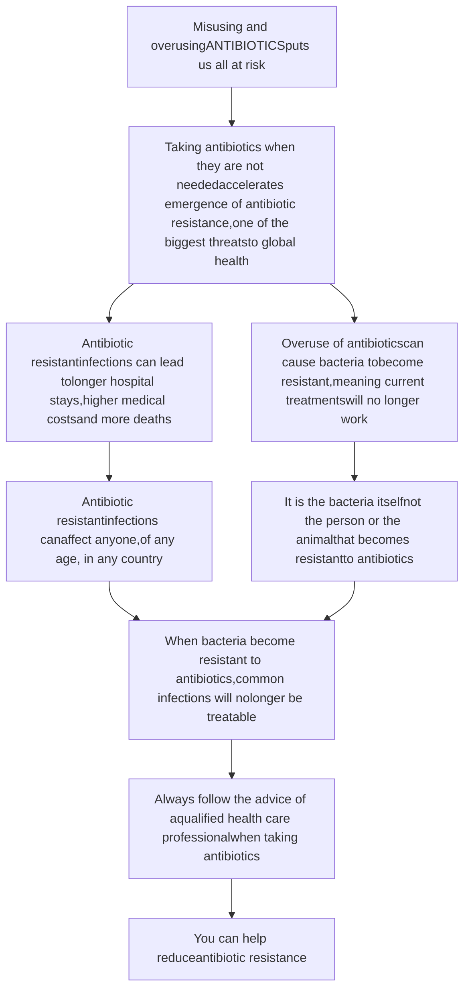

PUBLIC HEALTH BULLETIN-PAKISTAN

Vol. 4 | Week 45
04th Nov— 10th Nov
19th Nov, 2024

# Integrated Disease Surveillance & Response (IDSR) Report

Center of Disease Control
National Institute of Health, Islamabad

http://www.phb.nih.org.pk/

Integrated Disease Surveillance & Response (IDSR) Weekly Public Health Bulletin is your go-to resource for disease trends, outbreak alerts, and crucial public health information. By reading and sharing this bulletin, you can help increase awareness and promote preventive measures within your community.

Public Health Bulletin Pakistan graphic with NIH logos and contact info

Page | 1
1

NIH Logo

UK Health Security Agency Logo

World Health Organization Logo

USAID Logo

---

# Public Health Bulletin - Pakistan.

Public Health Bulletin Pakistan logo

NIH logo

Government of Pakistan logo

*Overview*

**Public Health Bulletin - Pakistan, Week 45, 2024**

*IDSR Reports*

*Evolving from a basic disease registry, Pakistan's Public Health Bulletin has become an indispensable tool for safeguarding public health. By meticulously tracking disease trends, the Bulletin serves as an early warning system, enabling timely interventions to prevent outbreaks.*

*Ongoing Events*

*Beyond data compilation, this week's bulletin also includes updates on a three day review Workshop on national mortality surveillance implementation plan in Pakistan by NIH, Outbreak Investigation of Diphtheria in Balochistan and a knowledge review on AMR*

*Field Reports*

*Stay well-informed about public health matters. Subscribe to the Weekly Bulletin today! By equipping everyone with knowledge, the Public Health Bulletin empowers Pakistanis to build a healthier nation.*

*Sincerely, The Chief Editor*

Page | 2

NIH logo

UK Health Security Agency logo

World Health Organization logo

USAID logo

---

# Overview

* *During week 45, the most frequently reported cases were of Acute Diarrhea (Non-Cholera) followed by Malaria, ILI, TB, ALRI <5 years, dog bite, B. Diarrhea, VH (B, C & D), Typhoid and SARI.*

* *Thirty-one cases of AFP reported from KP, twelve from Punjab, seven from Sindh, six from GB, three from AJK and two from Balochistan. All are suspected cases and need field verification.*

* *Sixteen suspected cases of HIV/ AIDS reported from KP, nine from Punjab, two from Sindh and one from Balochistan. Field investigation required to verify the cases.*

* *Eleven suspected cases of Brucellosis reported from KP and eight from Sindh. Field investigation required to verify the cases.*

* *There is a decrease in number of cases reported for Acute Diarrhea (Non-Cholera), TB, dog bite, B. Diarrhea and Typhoid cases while an increasing trend observed for Malaria, ILI, ALRI <5 years, VH (B, C & D) and SARI cases this week.*

## IDSR compliance attributes

* *The national compliance rate for IDSR reporting in 158 implemented districts is 81%*

* *Gilgit Baltistan and Sindh are the top reporting regions with a compliance rate of 95% and 94%, followed by AJK 93% and ICT 81%*

* *The lowest compliance rate was observed in KPK 75% and Balochistan 70%.*

<table>
  <thead>
    <tr>
        <th>Region</th>
        <th>Expected Reports</th>
        <th>Received Reports</th>
        <th>Compliance (%)</th>
    </tr>
  </thead>
  <tbody>
    <tr>
        <td>Khyber Pakhtunkhwa</td>
<td>2319</td>
<td>1749</td>
<td>75</td>
    </tr>
<tr>
        <td>Azad Jammu Kashmir</td>
<td>405</td>
<td>378</td>
<td>93</td>
    </tr>
<tr>
        <td>Islamabad Capital Territory</td>
<td>36</td>
<td>29</td>
<td>81</td>
    </tr>
<tr>
        <td>Balochistan</td>
<td>1308</td>
<td>835</td>
<td>70</td>
    </tr>
<tr>
        <td>Gilgit Baltistan</td>
<td>407</td>
<td>385</td>
<td>95</td>
    </tr>
<tr>
        <td>Sindh</td>
<td>2094</td>
<td>1974</td>
<td>94</td>
    </tr>
<tr>
        <td>National</td>
<td>6569</td>
<td>5350</td>
<td>81</td>
    </tr>
  </tbody>
</table>

Page | 3

NIH logo

UK Health Security Agency logo

World Health Organization logo

USAID logo

---

Public Health Actions

# Public Health Actions

Federal, Provincial, Regional Health Departments and relevant programs may consider following public health actions to prevent and control diseases.

## ALRI in children < five years

* **Enhance Surveillance:** Strengthen the surveillance of ALRI cases at public health facilities and incorporate data from private sector as well, especially during flu seasons.

* **Strengthen Lab Systems:** Enhance the capacity of laboratory systems to easily detect the circulating strains in the population.

* **Promote Hygiene Practices:** Launch health education campaigns on proper respiratory hygiene (covering coughs, frequent hand washing).

* **Enhance vaccination:** Vaccination in high risk groups (asthmatics, children < 5) for ALRI is advised.

## Brucellosis

* **Strengthen Surveillance and Diagnosis:** Increase detection and reporting of brucellosis cases, particularly in livestock-related regions.

* **Multi sectorial collaboration:** Multi sectorial collaboration between human and animal health departments.

* **Control of Livestock Diseases:** Implement vaccination and disease management programs in livestock populations.

* **Ongoing Community Education:** Promote continuous education on brucellosis prevention, especially in rural areas with high livestock exposure for control of disease at animal interface.

* **Improve Diagnostic Capacity:** Provision of diagnostics and training for healthcare providers in detecting and managing brucellosis.

Page | 4

NIH logo

UK Health Security Agency logo

World Health Organization logo

USAID logo
4

---

Pakistan

**Table 1: Province/Area wise distribution of most frequently reported suspected cases during Week 45, Pakistan.**

<table>
    <thead>
    <tr>
        <th>Diseases</th>
        <th>AJK</th>
        <th>Balochistan</th>
        <th>GB</th>
        <th>ICT</th>
        <th>KP</th>
        <th>Punjab</th>
        <th>Sindh</th>
        <th>Total</th>
    </tr>
    </thead>
    <tr>
        <td>AD (Non-Cholera)</td>
<td>1,114</td>
<td>5,043</td>
<td>729</td>
<td>290</td>
<td>16,810</td>
<td>60,192</td>
<td>33,011</td>
<td>117,189</td>
    </tr>
<tr>
        <td>Malaria</td>
<td>10</td>
<td>5,942</td>
<td>1</td>
<td>3</td>
<td>6,731</td>
<td>2,695</td>
<td>63,206</td>
<td>78,588</td>
    </tr>
<tr>
        <td>ILI</td>
<td>2,406</td>
<td>7,197</td>
<td>357</td>
<td>1,362</td>
<td>4,887</td>
<td>0</td>
<td>28,402</td>
<td>44,611</td>
    </tr>
<tr>
        <td>TB</td>
<td>57</td>
<td>103</td>
<td>75</td>
<td>13</td>
<td>356</td>
<td>8,823</td>
<td>10,783</td>
<td>20,210</td>
    </tr>
<tr>
        <td>ALRI &lt; 5 years</td>
<td>1,084</td>
<td>1,472</td>
<td>950</td>
<td>9</td>
<td>963</td>
<td>1,088</td>
<td>10,733</td>
<td>16,299</td>
    </tr>
<tr>
        <td>Dog Bite</td>
<td>87</td>
<td>131</td>
<td>2</td>
<td>0</td>
<td>466</td>
<td>3,711</td>
<td>1,996</td>
<td>6,393</td>
    </tr>
<tr>
        <td>B.Diarrhea</td>
<td>24</td>
<td>1,186</td>
<td>54</td>
<td>3</td>
<td>822</td>
<td>650</td>
<td>2,850</td>
<td>5,589</td>
    </tr>
<tr>
        <td>VH (B, C & D)</td>
<td>6</td>
<td>194</td>
<td>4</td>
<td>1</td>
<td>78</td>
<td>0</td>
<td>4,986</td>
<td>5,269</td>
    </tr>
<tr>
        <td>Typhoid</td>
<td>18</td>
<td>537</td>
<td>48</td>
<td>0</td>
<td>655</td>
<td>1,803</td>
<td>1,025</td>
<td>4,086</td>
    </tr>
<tr>
        <td>Dengue</td>
<td>27</td>
<td>9</td>
<td>94</td>
<td>16</td>
<td>443</td>
<td>1,922</td>
<td>78</td>
<td>2,589</td>
    </tr>
<tr>
        <td>SARI</td>
<td>143</td>
<td>693</td>
<td>236</td>
<td>1</td>
<td>1,196</td>
<td>0</td>
<td>248</td>
<td>2,517</td>
    </tr>
<tr>
        <td>AWD (S. Cholera)</td>
<td>30</td>
<td>119</td>
<td>10</td>
<td>0</td>
<td>72</td>
<td>925</td>
<td>25</td>
<td>1,181</td>
    </tr>
<tr>
        <td>AVH (A&E)</td>
<td>21</td>
<td>18</td>
<td>9</td>
<td>0</td>
<td>309</td>
<td>0</td>
<td>196</td>
<td>553</td>
    </tr>
<tr>
        <td>Measles</td>
<td>9</td>
<td>19</td>
<td>4</td>
<td>0</td>
<td>225</td>
<td>214</td>
<td>66</td>
<td>537</td>
    </tr>
<tr>
        <td>Chikungunya</td>
<td>0</td>
<td>0</td>
<td>0</td>
<td>0</td>
<td>0</td>
<td>0</td>
<td>336</td>
<td>336</td>
    </tr>
<tr>
        <td>CL</td>
<td>0</td>
<td>75</td>
<td>0</td>
<td>0</td>
<td>156</td>
<td>2</td>
<td>11</td>
<td>244</td>
    </tr>
<tr>
        <td>Mumps</td>
<td>5</td>
<td>67</td>
<td>4</td>
<td>0</td>
<td>76</td>
<td>0</td>
<td>78</td>
<td>230</td>
    </tr>
<tr>
        <td>Chickenpox/ Varicella</td>
<td>3</td>
<td>5</td>
<td>10</td>
<td>1</td>
<td>44</td>
<td>7</td>
<td>6</td>
<td>76</td>
    </tr>
<tr>
        <td>Gonorrhea</td>
<td>0</td>
<td>49</td>
<td>0</td>
<td>0</td>
<td>11</td>
<td>0</td>
<td>10</td>
<td>70</td>
    </tr>
<tr>
        <td>Meningitis</td>
<td>5</td>
<td>10</td>
<td>1</td>
<td>0</td>
<td>2</td>
<td>42</td>
<td>2</td>
<td>62</td>
    </tr>
<tr>
        <td>AFP</td>
<td>3</td>
<td>2</td>
<td>6</td>
<td>0</td>
<td>31</td>
<td>12</td>
<td>7</td>
<td>61</td>
    </tr>
<tr>
        <td>Pertussis</td>
<td>0</td>
<td>37</td>
<td>0</td>
<td>0</td>
<td>8</td>
<td>0</td>
<td>1</td>
<td>46</td>
    </tr>
<tr>
        <td>Diphtheria (Probable)</td>
<td>0</td>
<td>2</td>
<td>0</td>
<td>0</td>
<td>14</td>
<td>6</td>
<td>6</td>
<td>28</td>
    </tr>
<tr>
        <td>HIV/AIDS</td>
<td>0</td>
<td>1</td>
<td>0</td>
<td>0</td>
<td>16</td>
<td>9</td>
<td>2</td>
<td>28</td>
    </tr>
<tr>
        <td>Brucellosis</td>
<td>0</td>
<td>0</td>
<td>0</td>
<td>0</td>
<td>11</td>
<td>0</td>
<td>8</td>
<td>19</td>
    </tr>
<tr>
        <td>NT</td>
<td>0</td>
<td>9</td>
<td>0</td>
<td>0</td>
<td>6</td>
<td>1</td>
<td>1</td>
<td>17</td>
    </tr>
<tr>
        <td>VL</td>
<td>0</td>
<td>1</td>
<td>0</td>
<td>0</td>
<td>0</td>
<td>0</td>
<td>10</td>
<td>11</td>
    </tr>
<tr>
        <td>Syphilis</td>
<td>0</td>
<td>2</td>
<td>0</td>
<td>0</td>
<td>2</td>
<td>0</td>
<td>7</td>
<td>11</td>
    </tr>
<tr>
        <td>Leprosy</td>
<td>0</td>
<td>0</td>
<td>0</td>
<td>0</td>
<td>2</td>
<td>0</td>
<td>8</td>
<td>10</td>
    </tr>
<tr>
        <td>Rubella (CRS)</td>
<td>0</td>
<td>9</td>
<td>0</td>
<td>0</td>
<td>0</td>
<td>0</td>
<td>0</td>
<td>9</td>
    </tr>
</table>

**Figure 1: Most frequently reported suspected cases during Week 45, Pakistan.**

<table>
  <thead>
    <tr>
        <th>Category</th>
        <th>W43</th>
        <th>W44</th>
        <th>W 45</th>
    </tr>
  </thead>
  <tbody>
    <tr>
        <td>AD (Non-Cholera)</td>
<td>145,000</td>
<td>130,000</td>
<td>117,189</td>
    </tr>
<tr>
        <td>Malaria</td>
<td>92,000</td>
<td>78,000</td>
<td>78,588</td>
    </tr>
<tr>
        <td>ILI</td>
<td>50,000</td>
<td>48,000</td>
<td>44,611</td>
    </tr>
<tr>
        <td>TB</td>
<td>22,000</td>
<td>21,000</td>
<td>20,210</td>
    </tr>
<tr>
        <td>ALRI &lt; 5 years</td>
<td>18,000</td>
<td>17,000</td>
<td>16,299</td>
    </tr>
<tr>
        <td>Dog Bite</td>
<td>7,000</td>
<td>6,500</td>
<td>6,393</td>
    </tr>
<tr>
        <td>B. Diarrhea</td>
<td>6,000</td>
<td>5,800</td>
<td>5,589</td>
    </tr>
<tr>
        <td>VH (B, C &amp; D)</td>
<td>5,500</td>
<td>5,400</td>
<td>5,269</td>
    </tr>
<tr>
        <td>Typhoid</td>
<td>4,500</td>
<td>4,200</td>
<td>4,086</td>
    </tr>
<tr>
        <td>SARI</td>
<td>3,000</td>
<td>2,800</td>
<td>2,517</td>
    </tr>
  </tbody>
</table>

Page | 5

NIH Pakistan logo

UK Health Security Agency logo

World Health Organization logo

USAID logo

---

# Sindh
* Malaria cases were maximum followed by AD (Non-Cholera), ILI, TB, ALRI<5 Years, VH (B, C, D), B. Diarrhea, dog bite, Typhoid and Chikungunya.
* Malaria cases are mostly from Larkana, Khairpur and Kamber whereas AD (Non-Cholera) cases are from Khairpur, Badin and Mirpurkhas.
* Seven cases of AFP, Two suspected cases of HIV/ AIDS and Eight suspected cases of Brucellosis reported from Sindh. All are suspected cases and need field verification.
* There is a decrease in numbr of cases reorted observed for AD (Non-Cholera), ILI, TB, B. Diarrhea, dog bite and Chikungunya cases while an increasing trend observed for Malaria, ALRI<5 Years and VH (B, C, D) cases this week.

Table 2: District wise distribution of most frequently reported suspected cases during Week 45, Sindh

<table>
    <thead>
    <tr>
        <th>Districts</th>
        <th>Malaria</th>
        <th>AD (Non-
Cholera)</th>
        <th>ILI</th>
        <th>TB</th>
        <th>ALRI &lt; 5 
years</th>
        <th>VH (B, C 
& D)</th>
        <th>B. 
Diarrhea</th>
        <th>Dog 
Bite</th>
        <th>Typhoid</th>
        <th>AVH 
(A&E)</th>
    </tr>
    </thead>
    <tr>
        <td>Badin</td>
<td>2,327</td>
<td>1,983</td>
<td>2,734</td>
<td>718</td>
<td>418</td>
<td>434</td>
<td>148</td>
<td>124</td>
<td>89</td>
<td>0</td>
    </tr>
<tr>
        <td>Dadu</td>
<td>4,719</td>
<td>1,863</td>
<td>347</td>
<td>423</td>
<td>889</td>
<td>55</td>
<td>407</td>
<td>225</td>
<td>91</td>
<td>0</td>
    </tr>
<tr>
        <td>Ghotki</td>
<td>1,902</td>
<td>775</td>
<td>45</td>
<td>339</td>
<td>454</td>
<td>211</td>
<td>69</td>
<td>90</td>
<td>2</td>
<td>0</td>
    </tr>
<tr>
        <td>Hyderabad</td>
<td>309</td>
<td>849</td>
<td>278</td>
<td>42</td>
<td>36</td>
<td>26</td>
<td>0</td>
<td>0</td>
<td>11</td>
<td>0</td>
    </tr>
<tr>
        <td>Jacobabad</td>
<td>1,673</td>
<td>702</td>
<td>803</td>
<td>106</td>
<td>301</td>
<td>231</td>
<td>105</td>
<td>133</td>
<td>39</td>
<td>0</td>
    </tr>
<tr>
        <td>Jamshoro</td>
<td>2,812</td>
<td>1,511</td>
<td>168</td>
<td>458</td>
<td>324</td>
<td>350</td>
<td>90</td>
<td>65</td>
<td>35</td>
<td>0</td>
    </tr>
<tr>
        <td>Kamber</td>
<td>5,348</td>
<td>1,556</td>
<td>0</td>
<td>801</td>
<td>252</td>
<td>141</td>
<td>104</td>
<td>163</td>
<td>13</td>
<td>0</td>
    </tr>
<tr>
        <td>Karachi Central</td>
<td>43</td>
<td>497</td>
<td>1,554</td>
<td>18</td>
<td>20</td>
<td>5</td>
<td>13</td>
<td>0</td>
<td>90</td>
<td>189</td>
    </tr>
<tr>
        <td>Karachi East</td>
<td>28</td>
<td>266</td>
<td>314</td>
<td>9</td>
<td>18</td>
<td>5</td>
<td>0</td>
<td>9</td>
<td>3</td>
<td>102</td>
    </tr>
<tr>
        <td>Karachi Keamari</td>
<td>3</td>
<td>361</td>
<td>200</td>
<td>0</td>
<td>54</td>
<td>0</td>
<td>7</td>
<td>0</td>
<td>4</td>
<td>16</td>
    </tr>
<tr>
        <td>Karachi Korangi</td>
<td>40</td>
<td>257</td>
<td>0</td>
<td>24</td>
<td>1</td>
<td>0</td>
<td>4</td>
<td>0</td>
<td>2</td>
<td>3</td>
    </tr>
<tr>
        <td>Karachi Malir</td>
<td>501</td>
<td>1,266</td>
<td>3,109</td>
<td>143</td>
<td>348</td>
<td>60</td>
<td>40</td>
<td>52</td>
<td>27</td>
<td>21</td>
    </tr>
<tr>
        <td>Karachi South</td>
<td>30</td>
<td>64</td>
<td>1</td>
<td>0</td>
<td>0</td>
<td>0</td>
<td>0</td>
<td>1</td>
<td>0</td>
<td>5</td>
    </tr>
<tr>
        <td>Karachi West</td>
<td>232</td>
<td>791</td>
<td>1,143</td>
<td>132</td>
<td>180</td>
<td>106</td>
<td>28</td>
<td>41</td>
<td>28</td>
<td>0</td>
    </tr>
<tr>
        <td>Kashmore</td>
<td>2,201</td>
<td>368</td>
<td>709</td>
<td>270</td>
<td>206</td>
<td>25</td>
<td>39</td>
<td>82</td>
<td>4</td>
<td>0</td>
    </tr>
<tr>
        <td>Khairpur</td>
<td>5,944</td>
<td>2,333</td>
<td>6,585</td>
<td>1,048</td>
<td>1,113</td>
<td>221</td>
<td>348</td>
<td>157</td>
<td>200</td>
<td>0</td>
    </tr>
<tr>
        <td>Larkana</td>
<td>6,712</td>
<td>1,722</td>
<td>9</td>
<td>856</td>
<td>542</td>
<td>75</td>
<td>361</td>
<td>33</td>
<td>7</td>
<td>0</td>
    </tr>
<tr>
        <td>Matiari</td>
<td>1,746</td>
<td>1,073</td>
<td>3</td>
<td>503</td>
<td>327</td>
<td>196</td>
<td>43</td>
<td>55</td>
<td>6</td>
<td>0</td>
    </tr>
<tr>
        <td>Mirpurkhas</td>
<td>3,019</td>
<td>1,864</td>
<td>4,781</td>
<td>617</td>
<td>792</td>
<td>225</td>
<td>70</td>
<td>48</td>
<td>23</td>
<td>0</td>
    </tr>
<tr>
        <td>Naushero Feroze</td>
<td>2,270</td>
<td>1,169</td>
<td>781</td>
<td>501</td>
<td>416</td>
<td>24</td>
<td>141</td>
<td>157</td>
<td>99</td>
<td>0</td>
    </tr>
<tr>
        <td>Sanghar</td>
<td>3,551</td>
<td>1,685</td>
<td>56</td>
<td>1,151</td>
<td>575</td>
<td>1,258</td>
<td>72</td>
<td>138</td>
<td>60</td>
<td>0</td>
    </tr>
<tr>
        <td>Shaheed Benazirabad</td>
<td>1,742</td>
<td>1,476</td>
<td>3</td>
<td>337</td>
<td>242</td>
<td>64</td>
<td>49</td>
<td>83</td>
<td>112</td>
<td>0</td>
    </tr>
<tr>
        <td>Shikarpur</td>
<td>3,285</td>
<td>1,096</td>
<td>0</td>
<td>279</td>
<td>250</td>
<td>623</td>
<td>171</td>
<td>137</td>
<td>4</td>
<td>0</td>
    </tr>
<tr>
        <td>Sujawal</td>
<td>877</td>
<td>1,026</td>
<td>0</td>
<td>309</td>
<td>309</td>
<td>65</td>
<td>88</td>
<td>32</td>
<td>5</td>
<td>0</td>
    </tr>
<tr>
        <td>Sukkur</td>
<td>3,747</td>
<td>1,068</td>
<td>1,791</td>
<td>432</td>
<td>625</td>
<td>160</td>
<td>113</td>
<td>112</td>
<td>5</td>
<td>0</td>
    </tr>
<tr>
        <td>Tando Allahyar</td>
<td>1,971</td>
<td>824</td>
<td>1,200</td>
<td>506</td>
<td>195</td>
<td>267</td>
<td>98</td>
<td>39</td>
<td>5</td>
<td>0</td>
    </tr>
<tr>
        <td>Tando Muhammad Khan</td>
<td>1,133</td>
<td>816</td>
<td>4</td>
<td>54</td>
<td>61</td>
<td>3</td>
<td>24</td>
<td>0</td>
<td>4</td>
<td>0</td>
    </tr>
<tr>
        <td>Tharparkar</td>
<td>2,527</td>
<td>1,591</td>
<td>1,372</td>
<td>321</td>
<td>697</td>
<td>62</td>
<td>92</td>
<td>0</td>
<td>16</td>
<td>0</td>
    </tr>
<tr>
        <td>Thatta</td>
<td>638</td>
<td>883</td>
<td>412</td>
<td>27</td>
<td>599</td>
<td>48</td>
<td>63</td>
<td>20</td>
<td>12</td>
<td>0</td>
    </tr>
<tr>
        <td>Umerkot</td>
<td>1,876</td>
<td>1,276</td>
<td>0</td>
<td>359</td>
<td>489</td>
<td>46</td>
<td>63</td>
<td>0</td>
<td>29</td>
<td>0</td>
    </tr>
<tr>
        <td>Total</td>
<td>63,206</td>
<td>33,011</td>
<td>28,402</td>
<td>10,783</td>
<td>10,733</td>
<td>4,986</td>
<td>2,850</td>
<td>1,996</td>
<td>1,025</td>
<td>336</td>
    </tr>
</table>

Figure 2: Most frequently reported suspected cases during Week 45 Sindh

<table>
  <thead>
    <tr>
        <th>Disease</th>
        <th>W43</th>
        <th>W44</th>
        <th>W 45</th>
    </tr>
  </thead>
  <tbody>
    <tr>
        <td>Malaria</td>
<td>74,000</td>
<td>63,000</td>
<td>63,206</td>
    </tr>
<tr>
        <td>AD (Non-Cholera)</td>
<td>40,000</td>
<td>36,000</td>
<td>33,011</td>
    </tr>
<tr>
        <td>ILI</td>
<td>31,000</td>
<td>29,000</td>
<td>28,402</td>
    </tr>
<tr>
        <td>TB</td>
<td>11,000</td>
<td>10,500</td>
<td>10,783</td>
    </tr>
<tr>
        <td>ALRI &lt; 5 years</td>
<td>10,000</td>
<td>10,000</td>
<td>10,733</td>
    </tr>
<tr>
        <td>VH (B, C &amp; D)</td>
<td>5,000</td>
<td>5,000</td>
<td>4,986</td>
    </tr>
<tr>
        <td>B. Diarrhea</td>
<td>3,000</td>
<td>2,500</td>
<td>2,850</td>
    </tr>
<tr>
        <td>Dog Bite</td>
<td>2,000</td>
<td>1,800</td>
<td>1,996</td>
    </tr>
<tr>
        <td>Typhoid</td>
<td>1,000</td>
<td>1,000</td>
<td>1,025</td>
    </tr>
<tr>
        <td>Chikungunya</td>
<td>500</td>
<td>400</td>
<td>336</td>
    </tr>
  </tbody>
</table>

Page | 6

NIH Pakistan logo

UK Health Security Agency logo

World Health Organization logo

USAID logo

---

# Balochistan
* ILI, Malaria, AD (Non-Cholera), ALRI <5 years, B. Diarrhea, SARI, Typhoid, VH (B, C & D), dog bite and AWD (S. Cholera) cases were the most frequently reported diseases from Balochistan province.

* ILI cases are mostly reported from Kech (Turbat), Quetta and Pishin while Malaria cases are mostly reported from Jhal Magsi, Sohbat Pur and Naseerabad.

* Two cases of AFP, One suspected case of HIV/ AIDS reported from Sindh. They are suspected cases and need field verification.

**Table 3: District wise distribution of most frequently reported suspected cases during Week 45, Balochistan**

<table>
  <thead>
    <tr>
      <th>Districts</th>
      <th>AD (Non-
Cholera)</th>
      <th>Malaria</th>
      <th>ILI</th>
      <th>B. 
Diarrhea</th>
      <th>ALRI &lt; 5 
years</th>
      <th>Typhoid</th>
      <th>SARI</th>
      <th>AWD
(S.Cholera)</th>
      <th>TB</th>
      <th>CL</th>
    </tr>
  </thead>
  <tbody>
    <tr>
      <td>Barkhan</td>
<td>81</td>
<td>120</td>
<td>116</td>
<td>18</td>
<td>7</td>
<td>3</td>
<td>34</td>
<td>3</td>
<td>15</td>
<td>0</td>
    </tr>
<tr>
      <td>Chagai</td>
<td>339</td>
<td>201</td>
<td>147</td>
<td>0</td>
<td>52</td>
<td>0</td>
<td>15</td>
<td>0</td>
<td>3</td>
<td>20</td>
    </tr>
<tr>
      <td>Chaman</td>
<td>110</td>
<td>29</td>
<td>53</td>
<td>10</td>
<td>28</td>
<td>33</td>
<td>20</td>
<td>0</td>
<td>0</td>
<td>3</td>
    </tr>
<tr>
      <td>Dera Bugti</td>
<td>72</td>
<td>173</td>
<td>59</td>
<td>31</td>
<td>16</td>
<td>0</td>
<td>20</td>
<td>0</td>
<td>0</td>
<td>0</td>
    </tr>
<tr>
      <td>Duki</td>
<td>46</td>
<td>45</td>
<td>67</td>
<td>16</td>
<td>41</td>
<td>13</td>
<td>4</td>
<td>0</td>
<td>16</td>
<td>0</td>
    </tr>
<tr>
      <td>Gwadar</td>
<td>19</td>
<td>16</td>
<td>6</td>
<td>5</td>
<td>0</td>
<td>1</td>
<td>0</td>
<td>2</td>
<td>0</td>
<td>5</td>
    </tr>
<tr>
      <td>Hub</td>
<td>23</td>
<td>118</td>
<td>62</td>
<td>0</td>
<td>15</td>
<td>0</td>
<td>0</td>
<td>0</td>
<td>0</td>
<td>0</td>
    </tr>
<tr>
      <td>Jaffarabad</td>
<td>58</td>
<td>271</td>
<td>191</td>
<td>31</td>
<td>62</td>
<td>22</td>
<td>4</td>
<td>0</td>
<td>2</td>
<td>0</td>
    </tr>
<tr>
      <td>Jhal Magsi</td>
<td>289</td>
<td>808</td>
<td>245</td>
<td>56</td>
<td>0</td>
<td>0</td>
<td>25</td>
<td>0</td>
<td>10</td>
<td>1</td>
    </tr>
<tr>
      <td>Kalat</td>
<td>0</td>
<td>0</td>
<td>0</td>
<td>0</td>
<td>0</td>
<td>0</td>
<td>0</td>
<td>0</td>
<td>0</td>
<td>0</td>
    </tr>
<tr>
      <td>Kech (Turbat)</td>
<td>1,011</td>
<td>412</td>
<td>245</td>
<td>6</td>
<td>36</td>
<td>NR</td>
<td>1</td>
<td>3</td>
<td>NR</td>
<td>NR</td>
    </tr>
<tr>
      <td>Kharan</td>
<td>416</td>
<td>91</td>
<td>126</td>
<td>0</td>
<td>54</td>
<td>4</td>
<td>6</td>
<td>0</td>
<td>0</td>
<td>0</td>
    </tr>
<tr>
      <td>Khuzdar</td>
<td>544</td>
<td>281</td>
<td>285</td>
<td>2</td>
<td>137</td>
<td>50</td>
<td>73</td>
<td>0</td>
<td>6</td>
<td>21</td>
    </tr>
<tr>
      <td>Killa Saifullah</td>
<td>0</td>
<td>136</td>
<td>137</td>
<td>110</td>
<td>42</td>
<td>0</td>
<td>25</td>
<td>0</td>
<td>0</td>
<td>0</td>
    </tr>
<tr>
      <td>Kohlu</td>
<td>406</td>
<td>134</td>
<td>155</td>
<td>10</td>
<td>61</td>
<td>54</td>
<td>48</td>
<td>NR</td>
<td>NR</td>
<td>2</td>
    </tr>
<tr>
      <td>Lasbella</td>
<td>40</td>
<td>570</td>
<td>297</td>
<td>89</td>
<td>23</td>
<td>1</td>
<td>12</td>
<td>3</td>
<td>10</td>
<td>5</td>
    </tr>
<tr>
      <td>Loralai</td>
<td>298</td>
<td>44</td>
<td>128</td>
<td>46</td>
<td>23</td>
<td>100</td>
<td>13</td>
<td>0</td>
<td>0</td>
<td>0</td>
    </tr>
<tr>
      <td>Mastung</td>
<td>182</td>
<td>75</td>
<td>168</td>
<td>94</td>
<td>43</td>
<td>55</td>
<td>49</td>
<td>41</td>
<td>11</td>
<td>1</td>
    </tr>
<tr>
      <td>Musakhel</td>
<td>48</td>
<td>127</td>
<td>31</td>
<td>9</td>
<td>14</td>
<td>8</td>
<td>10</td>
<td>7</td>
<td>0</td>
<td>7</td>
    </tr>
<tr>
      <td>Naseerabad</td>
<td>50</td>
<td>581</td>
<td>302</td>
<td>67</td>
<td>25</td>
<td>0</td>
<td>45</td>
<td>102</td>
<td>40</td>
<td>1</td>
    </tr>
<tr>
      <td>Nushki</td>
<td>46</td>
<td>51</td>
<td>116</td>
<td>0</td>
<td>35</td>
<td>0</td>
<td>0</td>
<td>0</td>
<td>0</td>
<td>0</td>
    </tr>
<tr>
      <td>Panjgur</td>
<td>217</td>
<td>185</td>
<td>218</td>
<td>139</td>
<td>51</td>
<td>19</td>
<td>12</td>
<td>0</td>
<td>0</td>
<td>28</td>
    </tr>
<tr>
      <td>Pishin</td>
<td>609</td>
<td>56</td>
<td>338</td>
<td>50</td>
<td>169</td>
<td>64</td>
<td>26</td>
<td>0</td>
<td>7</td>
<td>11</td>
    </tr>
<tr>
      <td>Quetta</td>
<td>771</td>
<td>31</td>
<td>352</td>
<td>163</td>
<td>29</td>
<td>100</td>
<td>35</td>
<td>2</td>
<td>0</td>
<td>10</td>
    </tr>
<tr>
      <td>Sherani</td>
<td>56</td>
<td>7</td>
<td>19</td>
<td>2</td>
<td>7</td>
<td>13</td>
<td>2</td>
<td>0</td>
<td>0</td>
<td>0</td>
    </tr>
<tr>
      <td>Sibi</td>
<td>536</td>
<td>156</td>
<td>201</td>
<td>26</td>
<td>11</td>
<td>44</td>
<td>14</td>
<td>0</td>
<td>0</td>
<td>0</td>
    </tr>
<tr>
      <td>Sohbat pur</td>
<td>23</td>
<td>643</td>
<td>225</td>
<td>144</td>
<td>62</td>
<td>14</td>
<td>18</td>
<td>11</td>
<td>7</td>
<td>0</td>
    </tr>
<tr>
      <td>Surab</td>
<td>166</td>
<td>63</td>
<td>62</td>
<td>0</td>
<td>0</td>
<td>0</td>
<td>0</td>
<td>0</td>
<td>0</td>
<td>0</td>
    </tr>
<tr>
      <td>Usta Muhammad</td>
<td>180</td>
<td>246</td>
<td>413</td>
<td>160</td>
<td>36</td>
<td>8</td>
<td>8</td>
<td>20</td>
<td>4</td>
<td>3</td>
    </tr>
<tr>
      <td>Washuk</td>
<td>341</td>
<td>178</td>
<td>179</td>
<td>6</td>
<td>80</td>
<td>7</td>
<td>12</td>
<td>0</td>
<td>0</td>
<td>1</td>
    </tr>
<tr>
      <td>Zhob</td>
<td>220</td>
<td>94</td>
<td>100</td>
<td>182</td>
<td>27</td>
<td>80</td>
<td>6</td>
<td>0</td>
<td>0</td>
<td>0</td>
    </tr>
<tr>
      <td>Total</td>
<td>7,197</td>
<td>5,942</td>
<td>5,043</td>
<td>1,472</td>
<td>1,186</td>
<td>693</td>
<td>537</td>
<td>194</td>
<td>131</td>
<td>119</td>
    </tr>
  </tbody>
</table>

Figure 3: Most frequently reported suspected cases during Week 45, Balochistan

<table>
  <thead>
    <tr>
        <th>Disease</th>
        <th>W43</th>
        <th>W44</th>
        <th>W 45</th>
    </tr>
  </thead>
  <tbody>
    <tr>
        <td>ILI</td>
<td>7500</td>
<td>7800</td>
<td>7197</td>
    </tr>
<tr>
        <td>Malaria</td>
<td>6800</td>
<td>5800</td>
<td>5942</td>
    </tr>
<tr>
        <td>AD (Non-Cholera)</td>
<td>6000</td>
<td>5800</td>
<td>5043</td>
    </tr>
<tr>
        <td>ALRI &lt; 5 years</td>
<td>1500</td>
<td>1600</td>
<td>1472</td>
    </tr>
<tr>
        <td>B. Diarrhea</td>
<td>1200</td>
<td>1300</td>
<td>1186</td>
    </tr>
<tr>
        <td>SARI</td>
<td>500</td>
<td>600</td>
<td>693</td>
    </tr>
<tr>
        <td>Typhoid</td>
<td>400</td>
<td>500</td>
<td>537</td>
    </tr>
<tr>
        <td>VH (B, C &amp; D)</td>
<td>100</td>
<td>150</td>
<td>194</td>
    </tr>
<tr>
        <td>Dog Bite</td>
<td>100</td>
<td>120</td>
<td>131</td>
    </tr>
<tr>
        <td>AWD (S. Cholera)</td>
<td>100</td>
<td>110</td>
<td>119</td>
    </tr>
  </tbody>
</table>

Page | 7

NIH Pakistan logo

UK Health Security Agency logo

World Health Organization logo

USAID logo

---

# Khyber Pakhtunkhwa

* Cases of AD (Non-Cholera) were maximum followed by Malaria, ILI, SARI, ALRI<5 Years, B. Diarrhea, Typhoid, dog bite, TB and AVH (A & E) cases.

* AD (Non-Cholera) ILI and dog bite cases showed a decreasing trend while Malaria, SARI, B. Diarrhea, Typhoid and AVH (A & E) cases showed an increasing trend this week.

* Thirty-one cases of AFP, Sixteen suspected cases of HIV/ AIDS and Eleven suspected cases of Brucellosis reported from KP. All are suspected cases and need field verification.

**Table 4: District wise distribution of most frequently reported suspected cases during Week 45, KP**

<table>
    <thead>
    <tr>
        <th>Districts</th>
        <th>AD (Non-
Cholera)</th>
        <th>Malaria</th>
        <th>ILI</th>
        <th>B.Diarrhea</th>
        <th>SARI</th>
        <th>ALRI &lt;5 Years</th>
        <th>Typhoid</th>
        <th>Dog Bite</th>
        <th>TB</th>
        <th>AVH (A&E)</th>
    </tr>
    </thead>
    <tr>
        <td>Abbottabad</td>
<td>287</td>
<td>36</td>
<td>106</td>
<td>3</td>
<td>46</td>
<td>3</td>
<td>44</td>
<td>4</td>
<td>13</td>
<td>0</td>
    </tr>
<tr>
        <td>Bajaur</td>
<td>869</td>
<td>250</td>
<td>61</td>
<td>58</td>
<td>34</td>
<td>73</td>
<td>6</td>
<td>21</td>
<td>13</td>
<td>82</td>
    </tr>
<tr>
        <td>Bannu</td>
<td>659</td>
<td>1,550</td>
<td>10</td>
<td>9</td>
<td>18</td>
<td>46</td>
<td>89</td>
<td>8</td>
<td>18</td>
<td>3</td>
    </tr>
<tr>
        <td>Battagram</td>
<td>58</td>
<td>48</td>
<td>330</td>
<td>NR</td>
<td>NR</td>
<td>NR</td>
<td>0</td>
<td>14</td>
<td>NR</td>
<td>NR</td>
    </tr>
<tr>
        <td>Buner</td>
<td>209</td>
<td>175</td>
<td>0</td>
<td>0</td>
<td>0</td>
<td>0</td>
<td>5</td>
<td>6</td>
<td>1</td>
<td>0</td>
    </tr>
<tr>
        <td>Charsadda</td>
<td>805</td>
<td>247</td>
<td>624</td>
<td>0</td>
<td>82</td>
<td>23</td>
<td>75</td>
<td>2</td>
<td>6</td>
<td>9</td>
    </tr>
<tr>
        <td>Chitral Lower</td>
<td>185</td>
<td>10</td>
<td>104</td>
<td>19</td>
<td>15</td>
<td>10</td>
<td>7</td>
<td>7</td>
<td>3</td>
<td>2</td>
    </tr>
<tr>
        <td>Chitral Upper</td>
<td>98</td>
<td>1</td>
<td>14</td>
<td>8</td>
<td>16</td>
<td>2</td>
<td>8</td>
<td>3</td>
<td>2</td>
<td>2</td>
    </tr>
<tr>
        <td>D.I. Khan</td>
<td>935</td>
<td>670</td>
<td>0</td>
<td>0</td>
<td>14</td>
<td>15</td>
<td>0</td>
<td>14</td>
<td>40</td>
<td>0</td>
    </tr>
<tr>
        <td>Dir Lower</td>
<td>1,072</td>
<td>250</td>
<td>0</td>
<td>0</td>
<td>81</td>
<td>60</td>
<td>43</td>
<td>32</td>
<td>10</td>
<td>26</td>
    </tr>
<tr>
        <td>Dir Upper</td>
<td>829</td>
<td>10</td>
<td>88</td>
<td>0</td>
<td>5</td>
<td>2</td>
<td>4</td>
<td>0</td>
<td>12</td>
<td>3</td>
    </tr>
<tr>
        <td>Hangu</td>
<td>46</td>
<td>152</td>
<td>0</td>
<td>0</td>
<td>0</td>
<td>2</td>
<td>0</td>
<td>0</td>
<td>4</td>
<td>0</td>
    </tr>
<tr>
        <td>Haripur</td>
<td>544</td>
<td>8</td>
<td>142</td>
<td>3</td>
<td>27</td>
<td>1</td>
<td>5</td>
<td>0</td>
<td>12</td>
<td>16</td>
    </tr>
<tr>
        <td>Karak</td>
<td>233</td>
<td>227</td>
<td>130</td>
<td>154</td>
<td>15</td>
<td>15</td>
<td>5</td>
<td>8</td>
<td>6</td>
<td>0</td>
    </tr>
<tr>
        <td>Khyber</td>
<td>367</td>
<td>248</td>
<td>69</td>
<td>39</td>
<td>25</td>
<td>113</td>
<td>57</td>
<td>21</td>
<td>8</td>
<td>7</td>
    </tr>
<tr>
        <td>Kohat</td>
<td>338</td>
<td>222</td>
<td>108</td>
<td>95</td>
<td>14</td>
<td>18</td>
<td>3</td>
<td>7</td>
<td>0</td>
<td>1</td>
    </tr>
<tr>
        <td>Kohistan Lower</td>
<td>106</td>
<td>5</td>
<td>0</td>
<td>27</td>
<td>5</td>
<td>13</td>
<td>4</td>
<td>0</td>
<td>0</td>
<td>0</td>
    </tr>
<tr>
        <td>Kohistan Upper</td>
<td>351</td>
<td>14</td>
<td>8</td>
<td>0</td>
<td>9</td>
<td>13</td>
<td>10</td>
<td>0</td>
<td>18</td>
<td>0</td>
    </tr>
<tr>
        <td>Kolai Palas</td>
<td>61</td>
<td>3</td>
<td>10</td>
<td>11</td>
<td>3</td>
<td>1</td>
<td>1</td>
<td>0</td>
<td>0</td>
<td>0</td>
    </tr>
<tr>
        <td>L & C Kurram</td>
<td>32</td>
<td>19</td>
<td>38</td>
<td>0</td>
<td>0</td>
<td>18</td>
<td>4</td>
<td>1</td>
<td>0</td>
<td>0</td>
    </tr>
<tr>
        <td>Lakki Marwat</td>
<td>536</td>
<td>435</td>
<td>2</td>
<td>0</td>
<td>24</td>
<td>20</td>
<td>9</td>
<td>56</td>
<td>4</td>
<td>0</td>
    </tr>
<tr>
        <td>Malakand</td>
<td>554</td>
<td>47</td>
<td>43</td>
<td>21</td>
<td>31</td>
<td>69</td>
<td>30</td>
<td>0</td>
<td>2</td>
<td>40</td>
    </tr>
<tr>
        <td>Mansehra</td>
<td>347</td>
<td>5</td>
<td>201</td>
<td>85</td>
<td>6</td>
<td>3</td>
<td>14</td>
<td>4</td>
<td>1</td>
<td>0</td>
    </tr>
<tr>
        <td>Mardan</td>
<td>304</td>
<td>22</td>
<td>0</td>
<td>0</td>
<td>41</td>
<td>1</td>
<td>0</td>
<td>3</td>
<td>6</td>
<td>0</td>
    </tr>
<tr>
        <td>Mohmand</td>
<td>139</td>
<td>340</td>
<td>162</td>
<td>173</td>
<td>2</td>
<td>17</td>
<td>5</td>
<td>7</td>
<td>1</td>
<td>2</td>
    </tr>
<tr>
        <td>North Waziristan</td>
<td>43</td>
<td>15</td>
<td>0</td>
<td>14</td>
<td>8</td>
<td>27</td>
<td>4</td>
<td>0</td>
<td>0</td>
<td>0</td>
    </tr>
<tr>
        <td>Nowshera</td>
<td>1,013</td>
<td>137</td>
<td>47</td>
<td>14</td>
<td>2</td>
<td>25</td>
<td>5</td>
<td>7</td>
<td>5</td>
<td>13</td>
    </tr>
<tr>
        <td>Orakzai</td>
<td>157</td>
<td>28</td>
<td>16</td>
<td>0</td>
<td>2</td>
<td>12</td>
<td>10</td>
<td>8</td>
<td>0</td>
<td>0</td>
    </tr>
<tr>
        <td>Peshawar</td>
<td>2,045</td>
<td>101</td>
<td>983</td>
<td>133</td>
<td>93</td>
<td>125</td>
<td>59</td>
<td>2</td>
<td>13</td>
<td>7</td>
    </tr>
<tr>
        <td>SD Tank</td>
<td>10</td>
<td>12</td>
<td>3</td>
<td>0</td>
<td>0</td>
<td>0</td>
<td>0</td>
<td>0</td>
<td>0</td>
<td>0</td>
    </tr>
<tr>
        <td>Shangla</td>
<td>833</td>
<td>564</td>
<td>0</td>
<td>20</td>
<td>27</td>
<td>9</td>
<td>39</td>
<td>49</td>
<td>90</td>
<td>4</td>
    </tr>
<tr>
        <td>SWA</td>
<td>52</td>
<td>69</td>
<td>173</td>
<td>79</td>
<td>31</td>
<td>20</td>
<td>14</td>
<td>6</td>
<td>2</td>
<td>0</td>
    </tr>
<tr>
        <td>Swabi</td>
<td>860</td>
<td>90</td>
<td>780</td>
<td>51</td>
<td>125</td>
<td>9</td>
<td>7</td>
<td>100</td>
<td>23</td>
<td>31</td>
    </tr>
<tr>
        <td>Swat</td>
<td>1,315</td>
<td>56</td>
<td>201</td>
<td>0</td>
<td>124</td>
<td>15</td>
<td>50</td>
<td>62</td>
<td>7</td>
<td>53</td>
    </tr>
<tr>
        <td>Tank</td>
<td>346</td>
<td>589</td>
<td>197</td>
<td>0</td>
<td>13</td>
<td>6</td>
<td>30</td>
<td>4</td>
<td>34</td>
<td>0</td>
    </tr>
<tr>
        <td>Tor Ghar</td>
<td>39</td>
<td>56</td>
<td>0</td>
<td>7</td>
<td>2</td>
<td>7</td>
<td>0</td>
<td>1</td>
<td>0</td>
<td>8</td>
    </tr>
<tr>
        <td>Upper Kurram</td>
<td>133</td>
<td>20</td>
<td>237</td>
<td>173</td>
<td>23</td>
<td>29</td>
<td>9</td>
<td>9</td>
<td>2</td>
<td>0</td>
    </tr>
<tr>
        <td>Total</td>
<td>16,810</td>
<td>6,731</td>
<td>4,887</td>
<td>1,196</td>
<td>963</td>
<td>822</td>
<td>655</td>
<td>466</td>
<td>356</td>
<td>309</td>
    </tr>
</table>

**Figure 4: Most frequently reported suspected cases during Week 45, KP**

<table>
  <thead>
    <tr>
        <th>Disease</th>
        <th>W43</th>
        <th>W44</th>
        <th>W 45</th>
    </tr>
  </thead>
  <tbody>
    <tr>
        <td>AD (Non-Cholera)</td>
<td>20000</td>
<td>17000</td>
<td>16,810</td>
    </tr>
<tr>
        <td>Malaria</td>
<td>8000</td>
<td>6500</td>
<td>6,731</td>
    </tr>
<tr>
        <td>ILI</td>
<td>5000</td>
<td>4500</td>
<td>4,887</td>
    </tr>
<tr>
        <td>SARI</td>
<td>1500</td>
<td>1200</td>
<td>1,196</td>
    </tr>
<tr>
        <td>ALRI &lt; 5 years</td>
<td>1500</td>
<td>1200</td>
<td>963</td>
    </tr>
<tr>
        <td>B. Diarrhea</td>
<td>800</td>
<td>800</td>
<td>822</td>
    </tr>
<tr>
        <td>Typhoid</td>
<td>600</td>
<td>600</td>
<td>655</td>
    </tr>
<tr>
        <td>Dog Bite</td>
<td>500</td>
<td>500</td>
<td>466</td>
    </tr>
<tr>
        <td>TB</td>
<td>400</td>
<td>400</td>
<td>356</td>
    </tr>
<tr>
        <td>AVH (A &amp; E)</td>
<td>300</td>
<td>300</td>
<td>309</td>
    </tr>
  </tbody>
</table>

Page | 8

NIH CID logo

UK Health Security Agency logo

World Health Organization logo

USAID logo

---

ICT, AJK & GB

**ICT:** The most frequently reported cases from Islamabad were ILI followed by AD (Non-Cholera) and TB. ILI and AD (Non-Cholera) cases showed a decreasing trend while TB cases showed an increasing trend this week.

**AJK:** ILI cases were maximum followed by AD (Non-Cholera), ALRI <5 years, SARI, dog bite, TB, AWD (S. Cholera), Dengue, B. Diarrhea and AVH (A & E) cases. A decreasing trend observed for AD (Non-Cholera), ALRI <5 years, SARI, TB, AWD (S. Cholera), B. Diarrhea and AVH (A & E) cases this week. Three suspected cases of AFP reported from AJK. Field investigation required to verify the cases.

**GB:** ALRI <5 Years cases were the most frequently reported diseases followed by AD (Non-Cholera), ILI, SARI, TB, B. Diarrhea and Typhoid cases. A decreasing trend observed for AD (Non-Cholera), SARI, TB and B. Diarrhea cases while an increasing trend observed for ALRI <5 Years, ILI and Typhoid cases this week. Six suspected cases of AFP reported from GB. Field investigation required to verify the cases..

Figure 5: Most frequently reported suspected cases during Week 45, ICT

<table>
  <thead>
    <tr>
        <th>Disease</th>
        <th>W43</th>
        <th>W44</th>
        <th>W 45</th>
    </tr>
  </thead>
  <tbody>
    <tr>
        <td>ILI</td>
<td>2000</td>
<td>1950</td>
<td>1,362</td>
    </tr>
<tr>
        <td>AD (Non-Cholera)</td>
<td>400</td>
<td>380</td>
<td>290</td>
    </tr>
<tr>
        <td>TB</td>
<td>10</td>
<td>12</td>
<td>13</td>
    </tr>
  </tbody>
</table>

Figure 6: Week wise reported suspected cases of ILI, ICT

<table>
  <thead>
    <tr>
        <th>Week</th>
        <th>ILI Cases</th>
    </tr>
  </thead>
  <tbody>
    <tr>
        <td>W46</td>
<td>1400</td>
    </tr>
<tr>
        <td>W47</td>
<td>1550</td>
    </tr>
<tr>
        <td>W48</td>
<td>1600</td>
    </tr>
<tr>
        <td>W49</td>
<td>450</td>
    </tr>
<tr>
        <td>W50</td>
<td>2450</td>
    </tr>
<tr>
        <td>W51</td>
<td>2400</td>
    </tr>
<tr>
        <td>W52</td>
<td>1800</td>
    </tr>
<tr>
        <td>W1</td>
<td>1400</td>
    </tr>
<tr>
        <td>W2</td>
<td>1100</td>
    </tr>
<tr>
        <td>W3</td>
<td>1150</td>
    </tr>
<tr>
        <td>W4</td>
<td>1200</td>
    </tr>
<tr>
        <td>W5</td>
<td>1300</td>
    </tr>
<tr>
        <td>W6</td>
<td>900</td>
    </tr>
<tr>
        <td>W7</td>
<td>1450</td>
    </tr>
<tr>
        <td>W8</td>
<td>1450</td>
    </tr>
<tr>
        <td>W9</td>
<td>1450</td>
    </tr>
<tr>
        <td>W10</td>
<td>1500</td>
    </tr>
<tr>
        <td>W11</td>
<td>1250</td>
    </tr>
<tr>
        <td>W12</td>
<td>1200</td>
    </tr>
<tr>
        <td>W13</td>
<td>1350</td>
    </tr>
<tr>
        <td>W14</td>
<td>1250</td>
    </tr>
<tr>
        <td>W15</td>
<td>200</td>
    </tr>
<tr>
        <td>W16</td>
<td>1250</td>
    </tr>
<tr>
        <td>W17</td>
<td>1250</td>
    </tr>
<tr>
        <td>W18</td>
<td>1350</td>
    </tr>
<tr>
        <td>W19</td>
<td>1000</td>
    </tr>
<tr>
        <td>W20</td>
<td>1150</td>
    </tr>
<tr>
        <td>W21</td>
<td>1000</td>
    </tr>
<tr>
        <td>W22</td>
<td>200</td>
    </tr>
<tr>
        <td>W23</td>
<td>950</td>
    </tr>
<tr>
        <td>W24</td>
<td>1050</td>
    </tr>
<tr>
        <td>W25</td>
<td>350</td>
    </tr>
<tr>
        <td>W26</td>
<td>750</td>
    </tr>
<tr>
        <td>W27</td>
<td>650</td>
    </tr>
<tr>
        <td>W28</td>
<td>750</td>
    </tr>
<tr>
        <td>W29</td>
<td>650</td>
    </tr>
<tr>
        <td>W30</td>
<td>850</td>
    </tr>
<tr>
        <td>W31</td>
<td>850</td>
    </tr>
<tr>
        <td>W32</td>
<td>1000</td>
    </tr>
<tr>
        <td>W33</td>
<td>1000</td>
    </tr>
<tr>
        <td>W34</td>
<td>1400</td>
    </tr>
<tr>
        <td>W35</td>
<td>950</td>
    </tr>
<tr>
        <td>W36</td>
<td>1300</td>
    </tr>
<tr>
        <td>W37</td>
<td>1350</td>
    </tr>
<tr>
        <td>W38</td>
<td>1300</td>
    </tr>
<tr>
        <td>W39</td>
<td>1250</td>
    </tr>
<tr>
        <td>W40</td>
<td>1250</td>
    </tr>
<tr>
        <td>W41</td>
<td>1850</td>
    </tr>
<tr>
        <td>W42</td>
<td>1700</td>
    </tr>
<tr>
        <td>W43</td>
<td>2000</td>
    </tr>
<tr>
        <td>W44</td>
<td>1900</td>
    </tr>
<tr>
        <td>W45</td>
<td>1362</td>
    </tr>
  </tbody>
</table>

Figure 7: Most frequently reported suspected cases during Week 45, AJK

<table>
  <thead>
    <tr>
        <th>Disease</th>
        <th>W43</th>
        <th>W44</th>
        <th>W 45</th>
    </tr>
  </thead>
  <tbody>
    <tr>
        <td>ILI</td>
<td>2200</td>
<td>2300</td>
<td>2,406</td>
    </tr>
<tr>
        <td>AD (Non-Cholera)</td>
<td>1450</td>
<td>1250</td>
<td>1114</td>
    </tr>
<tr>
        <td>ALRI &lt; 5 years</td>
<td>1150</td>
<td>1250</td>
<td>1084</td>
    </tr>
<tr>
        <td>SARI</td>
<td>300</td>
<td>280</td>
<td>143</td>
    </tr>
<tr>
        <td>Dog Bite</td>
<td>150</td>
<td>120</td>
<td>87</td>
    </tr>
<tr>
        <td>TB</td>
<td>50</td>
<td>60</td>
<td>57</td>
    </tr>
<tr>
        <td>AWD (S. Cholera)</td>
<td>120</td>
<td>100</td>
<td>30</td>
    </tr>
<tr>
        <td>Dengue</td>
<td>20</td>
<td>15</td>
<td>27</td>
    </tr>
<tr>
        <td>B. Diarrhea</td>
<td>30</td>
<td>25</td>
<td>24</td>
    </tr>
<tr>
        <td>AVH (A &amp; E)</td>
<td>25</td>
<td>20</td>
<td>21</td>
    </tr>
  </tbody>
</table>

Page | 9

NIH Pakistan logo

UK Health Security Agency logo

World Health Organization logo

USAID logo

---

Figure 8: Week wise reported suspected cases of ILI and AD (Non-Cholera) AJK

<table>
  <thead>
    <tr>
        <th>Week</th>
        <th>ALRI &lt; 5 years</th>
        <th>ILI</th>
    </tr>
  </thead>
  <tbody>
    <tr>
        <td>W46</td>
<td>1500</td>
<td>3250</td>
    </tr>
<tr>
        <td>W47</td>
<td>1400</td>
<td>3200</td>
    </tr>
<tr>
        <td>W48</td>
<td>1450</td>
<td>3300</td>
    </tr>
<tr>
        <td>W49</td>
<td>1700</td>
<td>3700</td>
    </tr>
<tr>
        <td>W50</td>
<td>1950</td>
<td>4100</td>
    </tr>
<tr>
        <td>W51</td>
<td>2000</td>
<td>3800</td>
    </tr>
<tr>
        <td>W52</td>
<td>1750</td>
<td>3800</td>
    </tr>
<tr>
        <td>W1</td>
<td>2000</td>
<td>3750</td>
    </tr>
<tr>
        <td>W2</td>
<td>1850</td>
<td>3750</td>
    </tr>
<tr>
        <td>W3</td>
<td>1950</td>
<td>4050</td>
    </tr>
<tr>
        <td>W4</td>
<td>2050</td>
<td>3600</td>
    </tr>
<tr>
        <td>W5</td>
<td>1850</td>
<td>2650</td>
    </tr>
<tr>
        <td>W6</td>
<td>1800</td>
<td>3100</td>
    </tr>
<tr>
        <td>W7</td>
<td>1750</td>
<td>3150</td>
    </tr>
<tr>
        <td>W8</td>
<td>1350</td>
<td>2600</td>
    </tr>
<tr>
        <td>W9</td>
<td>1450</td>
<td>2450</td>
    </tr>
<tr>
        <td>W10</td>
<td>1350</td>
<td>2350</td>
    </tr>
<tr>
        <td>W11</td>
<td>1400</td>
<td>2700</td>
    </tr>
<tr>
        <td>W12</td>
<td>1250</td>
<td>2350</td>
    </tr>
<tr>
        <td>W13</td>
<td>1200</td>
<td>2550</td>
    </tr>
<tr>
        <td>W14</td>
<td>1150</td>
<td>2500</td>
    </tr>
<tr>
        <td>W15</td>
<td>650</td>
<td>1200</td>
    </tr>
<tr>
        <td>W16</td>
<td>1100</td>
<td>2550</td>
    </tr>
<tr>
        <td>W17</td>
<td>1250</td>
<td>2600</td>
    </tr>
<tr>
        <td>W18</td>
<td>1100</td>
<td>2100</td>
    </tr>
<tr>
        <td>W19</td>
<td>800</td>
<td>2000</td>
    </tr>
<tr>
        <td>W20</td>
<td>1100</td>
<td>2050</td>
    </tr>
<tr>
        <td>W21</td>
<td>1050</td>
<td>2150</td>
    </tr>
<tr>
        <td>W22</td>
<td>1000</td>
<td>1950</td>
    </tr>
<tr>
        <td>W23</td>
<td>900</td>
<td>2050</td>
    </tr>
<tr>
        <td>W24</td>
<td>800</td>
<td>1850</td>
    </tr>
<tr>
        <td>W25</td>
<td>750</td>
<td>1350</td>
    </tr>
<tr>
        <td>W26</td>
<td>850</td>
<td>1350</td>
    </tr>
<tr>
        <td>W27</td>
<td>850</td>
<td>1200</td>
    </tr>
<tr>
        <td>W28</td>
<td>700</td>
<td>1100</td>
    </tr>
<tr>
        <td>W29</td>
<td>700</td>
<td>950</td>
    </tr>
<tr>
        <td>W30</td>
<td>800</td>
<td>1150</td>
    </tr>
<tr>
        <td>W31</td>
<td>800</td>
<td>1350</td>
    </tr>
<tr>
        <td>W32</td>
<td>900</td>
<td>1250</td>
    </tr>
<tr>
        <td>W33</td>
<td>900</td>
<td>1250</td>
    </tr>
<tr>
        <td>W34</td>
<td>900</td>
<td>1450</td>
    </tr>
<tr>
        <td>W35</td>
<td>900</td>
<td>1450</td>
    </tr>
<tr>
        <td>W36</td>
<td>1000</td>
<td>1750</td>
    </tr>
<tr>
        <td>W37</td>
<td>900</td>
<td>1750</td>
    </tr>
<tr>
        <td>W38</td>
<td>950</td>
<td>1700</td>
    </tr>
<tr>
        <td>W39</td>
<td>950</td>
<td>1950</td>
    </tr>
<tr>
        <td>W40</td>
<td>750</td>
<td>1450</td>
    </tr>
<tr>
        <td>W41</td>
<td>950</td>
<td>1800</td>
    </tr>
<tr>
        <td>W42</td>
<td>1100</td>
<td>2350</td>
    </tr>
<tr>
        <td>W43</td>
<td>1150</td>
<td>2200</td>
    </tr>
<tr>
        <td>W44</td>
<td>1250</td>
<td>2300</td>
    </tr>
<tr>
        <td>W45</td>
<td>1150</td>
<td>2400</td>
    </tr>
  </tbody>
</table>

Figure 9: Most frequent cases reported during Week 45, GB

<table>
  <thead>
    <tr>
        <th>Disease</th>
        <th>W43</th>
        <th>W44</th>
        <th>W 45</th>
    </tr>
  </thead>
  <tbody>
    <tr>
        <td>ALRI &lt; 5 years</td>
<td>650</td>
<td>800</td>
<td>950</td>
    </tr>
<tr>
        <td>AD (Non-Cholera)</td>
<td>1000</td>
<td>850</td>
<td>729</td>
    </tr>
<tr>
        <td>ILI</td>
<td>450</td>
<td>350</td>
<td>357</td>
    </tr>
<tr>
        <td>SARI</td>
<td>320</td>
<td>280</td>
<td>236</td>
    </tr>
<tr>
        <td>TB</td>
<td>110</td>
<td>100</td>
<td>75</td>
    </tr>
<tr>
        <td>B. Diarrhea</td>
<td>80</td>
<td>70</td>
<td>54</td>
    </tr>
<tr>
        <td>Typhoid</td>
<td>70</td>
<td>40</td>
<td>48</td>
    </tr>
  </tbody>
</table>

Figure 10: Week wise reported suspected cases of ALRI <5 years, GB

<table>
  <thead>
    <tr>
        <th>Week</th>
        <th>ALRI &lt; 5 years</th>
    </tr>
  </thead>
  <tbody>
    <tr>
        <td>W46</td>
<td>820</td>
    </tr>
<tr>
        <td>W47</td>
<td>330</td>
    </tr>
<tr>
        <td>W48</td>
<td>550</td>
    </tr>
<tr>
        <td>W49</td>
<td>730</td>
    </tr>
<tr>
        <td>W50</td>
<td>690</td>
    </tr>
<tr>
        <td>W51</td>
<td>770</td>
    </tr>
<tr>
        <td>W52</td>
<td>740</td>
    </tr>
<tr>
        <td>W1</td>
<td>700</td>
    </tr>
<tr>
        <td>W2</td>
<td>940</td>
    </tr>
<tr>
        <td>W3</td>
<td>930</td>
    </tr>
<tr>
        <td>W4</td>
<td>780</td>
    </tr>
<tr>
        <td>W5</td>
<td>880</td>
    </tr>
<tr>
        <td>W6</td>
<td>730</td>
    </tr>
<tr>
        <td>W7</td>
<td>730</td>
    </tr>
<tr>
        <td>W8</td>
<td>750</td>
    </tr>
<tr>
        <td>W9</td>
<td>570</td>
    </tr>
<tr>
        <td>W10</td>
<td>710</td>
    </tr>
<tr>
        <td>W11</td>
<td>680</td>
    </tr>
<tr>
        <td>W12</td>
<td>720</td>
    </tr>
<tr>
        <td>W13</td>
<td>630</td>
    </tr>
<tr>
        <td>W14</td>
<td>540</td>
    </tr>
<tr>
        <td>W15</td>
<td>330</td>
    </tr>
<tr>
        <td>W16</td>
<td>610</td>
    </tr>
<tr>
        <td>W17</td>
<td>700</td>
    </tr>
<tr>
        <td>W18</td>
<td>600</td>
    </tr>
<tr>
        <td>W19</td>
<td>690</td>
    </tr>
<tr>
        <td>W20</td>
<td>600</td>
    </tr>
<tr>
        <td>W21</td>
<td>570</td>
    </tr>
<tr>
        <td>W22</td>
<td>530</td>
    </tr>
<tr>
        <td>W23</td>
<td>580</td>
    </tr>
<tr>
        <td>W24</td>
<td>540</td>
    </tr>
<tr>
        <td>W25</td>
<td>380</td>
    </tr>
<tr>
        <td>W26</td>
<td>420</td>
    </tr>
<tr>
        <td>W27</td>
<td>510</td>
    </tr>
<tr>
        <td>W28</td>
<td>430</td>
    </tr>
<tr>
        <td>W29</td>
<td>560</td>
    </tr>
<tr>
        <td>W30</td>
<td>510</td>
    </tr>
<tr>
        <td>W31</td>
<td>510</td>
    </tr>
<tr>
        <td>W32</td>
<td>560</td>
    </tr>
<tr>
        <td>W33</td>
<td>440</td>
    </tr>
<tr>
        <td>W34</td>
<td>500</td>
    </tr>
<tr>
        <td>W35</td>
<td>410</td>
    </tr>
<tr>
        <td>W36</td>
<td>470</td>
    </tr>
<tr>
        <td>W37</td>
<td>550</td>
    </tr>
<tr>
        <td>W38</td>
<td>590</td>
    </tr>
<tr>
        <td>W39</td>
<td>690</td>
    </tr>
<tr>
        <td>W40</td>
<td>580</td>
    </tr>
<tr>
        <td>W41</td>
<td>780</td>
    </tr>
<tr>
        <td>W42</td>
<td>860</td>
    </tr>
<tr>
        <td>W43</td>
<td>660</td>
    </tr>
<tr>
        <td>W44</td>
<td>810</td>
    </tr>
<tr>
        <td>W45</td>
<td>960</td>
    </tr>
  </tbody>
</table>

Page | 10

NIH logo

UK Health Security Agency logo

World Health Organization logo

USAID logo

---

# Punjab

* AD (Non-Cholera) cases were maximum followed by TB, dog bite, Malaria, Typhoid, ALRI<5 Years, AWD (S. Cholera), B. Diarrhea and Measles cases.

* AD (Non-Cholera), TB, dog bite, Malaria, Typhoid, ALRI<5 Years, AWD (S. Cholera), B. Diarrhea and Measles cases showed a decreasing trend this week.

* Ten cases of AFP and Two suspected cases of HIV/ AIDS reported from Punjab. Field investigation required to verify the cases.

Figure 11: Most frequently reported suspected cases during Week 45, Punjab.

<table>
  <thead>
    <tr>
        <th>Disease</th>
        <th>W43</th>
        <th>W44</th>
        <th>W45</th>
    </tr>
  </thead>
  <tbody>
    <tr>
        <td>AD (Non-Cholera)</td>
<td>74,000</td>
<td>69,000</td>
<td>60,192</td>
    </tr>
<tr>
        <td>TB</td>
<td>10,000</td>
<td>10,000</td>
<td>8,823</td>
    </tr>
<tr>
        <td>Dog Bite</td>
<td>4,000</td>
<td>4,000</td>
<td>3,711</td>
    </tr>
<tr>
        <td>Malaria</td>
<td>3,500</td>
<td>3,500</td>
<td>2,695</td>
    </tr>
<tr>
        <td>Typhoid</td>
<td>2,000</td>
<td>2,000</td>
<td>1,803</td>
    </tr>
<tr>
        <td>ALRI &lt; 5 years</td>
<td>1,500</td>
<td>1,500</td>
<td>1,088</td>
    </tr>
<tr>
        <td>AWD (S. Cholera)</td>
<td>1,500</td>
<td>1,000</td>
<td>925</td>
    </tr>
<tr>
        <td>B. Diarrhea</td>
<td>1,000</td>
<td>1,000</td>
<td>650</td>
    </tr>
<tr>
        <td>Measles</td>
<td>500</td>
<td>500</td>
<td>214</td>
    </tr>
  </tbody>
</table>

Figure 12: Week wise reported suspected cases of AD (Non-Cholera), Punjab.

<table>
  <thead>
    <tr>
        <th>Week</th>
        <th>NUMBER OF CASES</th>
    </tr>
  </thead>
  <tbody>
    <tr>
        <td colspan="2">4th Quarter 2023</td>
    </tr>
<tr>
        <td>W46</td>
<td>83,000</td>
    </tr>
<tr>
        <td>W47</td>
<td>81,000</td>
    </tr>
<tr>
        <td>W48</td>
<td>72,000</td>
    </tr>
<tr>
        <td>W49</td>
<td>78,000</td>
    </tr>
<tr>
        <td>W50</td>
<td>73,000</td>
    </tr>
<tr>
        <td>W51</td>
<td>65,000</td>
    </tr>
<tr>
        <td>W52</td>
<td>55,000</td>
    </tr>
<tr>
        <td colspan="2">1st Quarter 2024</td>
    </tr>
<tr>
        <td>W1</td>
<td>56,000</td>
    </tr>
<tr>
        <td>W2</td>
<td>43,000</td>
    </tr>
<tr>
        <td>W3</td>
<td>54,000</td>
    </tr>
<tr>
        <td>W4</td>
<td>58,000</td>
    </tr>
<tr>
        <td>W5</td>
<td>57,000</td>
    </tr>
<tr>
        <td>W6</td>
<td>34,000</td>
    </tr>
<tr>
        <td>W7</td>
<td>71,000</td>
    </tr>
<tr>
        <td>W8</td>
<td>68,000</td>
    </tr>
<tr>
        <td>W9</td>
<td>59,000</td>
    </tr>
<tr>
        <td>W10</td>
<td>68,000</td>
    </tr>
<tr>
        <td>W11</td>
<td>66,000</td>
    </tr>
<tr>
        <td>W12</td>
<td>60,000</td>
    </tr>
<tr>
        <td>W13</td>
<td>73,000</td>
    </tr>
<tr>
        <td colspan="2">2nd Quarter 2024</td>
    </tr>
<tr>
        <td>W14</td>
<td>78,000</td>
    </tr>
<tr>
        <td>W15</td>
<td>35,000</td>
    </tr>
<tr>
        <td>W16</td>
<td>108,000</td>
    </tr>
<tr>
        <td>W17</td>
<td>111,000</td>
    </tr>
<tr>
        <td>W18</td>
<td>95,000</td>
    </tr>
<tr>
        <td>W19</td>
<td>124,000</td>
    </tr>
<tr>
        <td>W20</td>
<td>129,000</td>
    </tr>
<tr>
        <td>W21</td>
<td>127,000</td>
    </tr>
<tr>
        <td>W22</td>
<td>94,000</td>
    </tr>
<tr>
        <td>W23</td>
<td>99,000</td>
    </tr>
<tr>
        <td>W24</td>
<td>91,000</td>
    </tr>
<tr>
        <td>W25</td>
<td>52,000</td>
    </tr>
<tr>
        <td>W26</td>
<td>100,000</td>
    </tr>
<tr>
        <td colspan="2">3rd Quarter 2024</td>
    </tr>
<tr>
        <td>W27</td>
<td>92,000</td>
    </tr>
<tr>
        <td>W28</td>
<td>96,000</td>
    </tr>
<tr>
        <td>W29</td>
<td>71,000</td>
    </tr>
<tr>
        <td>W30</td>
<td>104,000</td>
    </tr>
<tr>
        <td>W31</td>
<td>102,000</td>
    </tr>
<tr>
        <td>W32</td>
<td>106,000</td>
    </tr>
<tr>
        <td>W33</td>
<td>85,000</td>
    </tr>
<tr>
        <td>W34</td>
<td>105,000</td>
    </tr>
<tr>
        <td>W35</td>
<td>98,000</td>
    </tr>
<tr>
        <td>W36</td>
<td>104,000</td>
    </tr>
<tr>
        <td>W37</td>
<td>95,000</td>
    </tr>
<tr>
        <td>W38</td>
<td>79,000</td>
    </tr>
<tr>
        <td>W39</td>
<td>91,000</td>
    </tr>
<tr>
        <td colspan="2">4th Quarter 2024</td>
    </tr>
<tr>
        <td>W40</td>
<td>87,000</td>
    </tr>
<tr>
        <td>W41</td>
<td>83,000</td>
    </tr>
<tr>
        <td>W42</td>
<td>78,000</td>
    </tr>
<tr>
        <td>W43</td>
<td>74,000</td>
    </tr>
<tr>
        <td>W44</td>
<td>69,000</td>
    </tr>
<tr>
        <td>W45</td>
<td>60,192</td>
    </tr>
  </tbody>
</table>

Page | 11

NIH logo

UK Health Security Agency logo

World Health Organization logo

USAID logo

---

*Public Health Laboratories*

**Table 5: Public Health Laboratories confirmed cases of IDSR Priority Diseases during Epid Week 45**

<table>
    <thead>
    <tr>
        <th rowspan="2">Diseases</th>
        <th colspan="2">Sindh</th>
        <th colspan="2">Balochistan</th>
        <th colspan="2">KPK</th>
        <th colspan="2">ISL</th>
        <th colspan="2">GB</th>
        <th colspan="2">Punjab</th>
        <th colspan="2">AJK</th>
    </tr>
<tr>
        <th>Total 
Test</th>
        <th>Total 
Pos</th>
        <th>Total 
Test</th>
        <th>Total 
Pos</th>
        <th>Total 
Test</th>
        <th>Total 
Pos</th>
        <th>Total 
Test</th>
        <th>Total 
Pos</th>
        <th>Total 
Test</th>
        <th>Total 
Pos</th>
        <th>Total 
Test</th>
        <th>Total 
Pos</th>
        <th>Total 
Test</th>
        <th>Total 
Pos</th>
    </tr>
    </thead>
    <tr>
        <td>AWD (S.
Cholera)</td>
<td>14</td>
<td>0</td>
<td>-</td>
<td>-</td>
<td>1</td>
<td>0</td>
<td>-</td>
<td>-</td>
<td>-</td>
<td>-</td>
<td>-</td>
<td>-</td>
<td>0</td>
<td>0</td>
    </tr>
<tr>
        <td>AD (Non-
Cholera)</td>
<td>73</td>
<td>0</td>
<td>-</td>
<td>-</td>
<td>-</td>
<td>-</td>
<td>-</td>
<td>-</td>
<td>-</td>
<td>-</td>
<td>-</td>
<td>-</td>
<td>0</td>
<td>0</td>
    </tr>
<tr>
        <td>Malaria</td>
<td>954</td>
<td>71</td>
<td>-</td>
<td>-</td>
<td>-</td>
<td>-</td>
<td>-</td>
<td>-</td>
<td>-</td>
<td>-</td>
<td>-</td>
<td>-</td>
<td>235</td>
<td>9</td>
    </tr>
<tr>
        <td>CCHF</td>
<td>-</td>
<td>-</td>
<td>6</td>
<td>0</td>
<td>-</td>
<td>-</td>
<td>0</td>
<td>0</td>
<td>-</td>
<td>-</td>
<td>-</td>
<td>-</td>
<td>0</td>
<td>0</td>
    </tr>
<tr>
        <td>Dengue</td>
<td>895</td>
<td>41</td>
<td>-</td>
<td>-</td>
<td>-</td>
<td>-</td>
<td>65</td>
<td>11</td>
<td>-</td>
<td>-</td>
<td>-</td>
<td>-</td>
<td>242</td>
<td>23</td>
    </tr>
<tr>
        <td>VH (B)</td>
<td>2,698</td>
<td>91</td>
<td>-</td>
<td>-</td>
<td>-</td>
<td>-</td>
<td>-</td>
<td>-</td>
<td>103</td>
<td>1</td>
<td>-</td>
<td>-</td>
<td>1,427</td>
<td>14</td>
    </tr>
<tr>
        <td>VH (C)</td>
<td>2,697</td>
<td>248</td>
<td>90</td>
<td>29</td>
<td>-</td>
<td>-</td>
<td>-</td>
<td>-</td>
<td>103</td>
<td>0</td>
<td>-</td>
<td>-</td>
<td>1,433</td>
<td>37</td>
    </tr>
<tr>
        <td>VH (A&E)</td>
<td>-</td>
<td>-</td>
<td>-</td>
<td>-</td>
<td>2</td>
<td>0</td>
<td>-</td>
<td>-</td>
<td>-</td>
<td>-</td>
<td>-</td>
<td>-</td>
<td>0</td>
<td>0</td>
    </tr>
<tr>
        <td>Covid-19</td>
<td>-</td>
<td>-</td>
<td>16</td>
<td>0</td>
<td>3</td>
<td>0</td>
<td>-</td>
<td>-</td>
<td>-</td>
<td>-</td>
<td>-</td>
<td>-</td>
<td>5</td>
<td>0</td>
    </tr>
<tr>
        <td>HIV</td>
<td>-</td>
<td>-</td>
<td>-</td>
<td>-</td>
<td>-</td>
<td>-</td>
<td>-</td>
<td>-</td>
<td>-</td>
<td>-</td>
<td>-</td>
<td>-</td>
<td>0</td>
<td>0</td>
    </tr>
<tr>
        <td>TB</td>
<td>-</td>
<td>-</td>
<td>-</td>
<td>-</td>
<td>-</td>
<td>-</td>
<td>-</td>
<td>-</td>
<td>-</td>
<td>-</td>
<td>-</td>
<td>-</td>
<td>141</td>
<td>4</td>
    </tr>
<tr>
        <td>Syphilis</td>
<td>-</td>
<td>-</td>
<td>-</td>
<td>-</td>
<td>-</td>
<td>-</td>
<td>-</td>
<td>-</td>
<td>-</td>
<td>-</td>
<td>-</td>
<td>-</td>
<td>10</td>
<td>0</td>
    </tr>
<tr>
        <td>Typhoid</td>
<td>461</td>
<td>9</td>
<td>-</td>
<td>-</td>
<td>-</td>
<td>-</td>
<td>-</td>
<td>-</td>
<td>-</td>
<td>-</td>
<td>-</td>
<td>-</td>
<td>1</td>
<td>0</td>
    </tr>
<tr>
        <td>Diptheria 
(Probabale)</td>
<td>-</td>
<td>-</td>
<td>-</td>
<td>-</td>
<td>3</td>
<td>1</td>
<td>-</td>
<td>-</td>
<td>-</td>
<td>-</td>
<td>-</td>
<td>-</td>
<td>0</td>
<td>0</td>
    </tr>
<tr>
        <td>Pertussis</td>
<td>-</td>
<td>-</td>
<td>-</td>
<td>-</td>
<td>-</td>
<td>-</td>
<td>-</td>
<td>-</td>
<td>-</td>
<td>-</td>
<td>-</td>
<td>-</td>
<td>0</td>
<td>0</td>
    </tr>
<tr>
        <td>M-POX</td>
<td>-</td>
<td>-</td>
<td>0</td>
<td>0</td>
<td>1</td>
<td>0</td>
<td>1</td>
<td>0</td>
<td>-</td>
<td>-</td>
<td>-</td>
<td>-</td>
<td>0</td>
<td>0</td>
    </tr>
<tr>
        <td>Measles</td>
<td>66</td>
<td>24</td>
<td>35</td>
<td>28</td>
<td>236</td>
<td>106</td>
<td>4</td>
<td>2</td>
<td>1</td>
<td>0</td>
<td>169</td>
<td>54</td>
<td>5</td>
<td>3</td>
    </tr>
<tr>
        <td>Rubella</td>
<td>66</td>
<td>3</td>
<td>35</td>
<td>0</td>
<td>236</td>
<td>4</td>
<td>4</td>
<td>0</td>
<td>1</td>
<td>0</td>
<td>169</td>
<td>2</td>
<td>5</td>
<td>0</td>
    </tr>
<tr>
        <td>B.Diarrhea</td>
<td>-</td>
<td>-</td>
<td>-</td>
<td>-</td>
<td>-</td>
<td>-</td>
<td>-</td>
<td>-</td>
<td>-</td>
<td>-</td>
<td>-</td>
<td>-</td>
<td>0</td>
<td>0</td>
    </tr>
<tr>
        <td>Chikungunya</td>
<td>-</td>
<td>-</td>
<td>0</td>
<td>0</td>
<td>-</td>
<td>-</td>
<td>-</td>
<td>-</td>
<td>-</td>
<td>-</td>
<td>-</td>
<td>-</td>
<td>0</td>
<td>0</td>
    </tr>
<tr>
        <td>Out of 
Covid- SARI
19</td>
<td>6</td>
<td>0</td>
<td>0</td>
<td>0</td>
<td>41</td>
<td>0</td>
<td>30</td>
<td>1</td>
<td>11</td>
<td>0</td>
<td>92</td>
<td>3</td>
<td>0</td>
<td>0</td>
    </tr>
<tr>
        <td>Out of 
ILI</td>
<td>0</td>
<td>0</td>
<td>0</td>
<td>0</td>
<td>1</td>
<td>0</td>
<td>58</td>
<td>0</td>
<td>3</td>
<td>0</td>
<td>105</td>
<td>3</td>
<td>0</td>
<td>0</td>
    </tr>
<tr>
        <td>Out of 
Influe SARI
nza A</td>
<td>6</td>
<td>2</td>
<td>0</td>
<td>0</td>
<td>41</td>
<td>5</td>
<td>30</td>
<td>0</td>
<td>11</td>
<td>0</td>
<td>92</td>
<td>3</td>
<td>0</td>
<td>0</td>
    </tr>
<tr>
        <td>Out of 
ILI</td>
<td>0</td>
<td>0</td>
<td>0</td>
<td>0</td>
<td>1</td>
<td>0</td>
<td>58</td>
<td>0</td>
<td>3</td>
<td>0</td>
<td>105</td>
<td>5</td>
<td>0</td>
<td>0</td>
    </tr>
<tr>
        <td>Out of 
Influe SARI
nza B</td>
<td>6</td>
<td>0</td>
<td>0</td>
<td>0</td>
<td>41</td>
<td>0</td>
<td>30</td>
<td>0</td>
<td>11</td>
<td>1</td>
<td>92</td>
<td>2</td>
<td>0</td>
<td>0</td>
    </tr>
<tr>
        <td>Out of 
ILI</td>
<td>0</td>
<td>0</td>
<td>0</td>
<td>0</td>
<td>1</td>
<td>0</td>
<td>58</td>
<td>0</td>
<td>3</td>
<td>0</td>
<td>105</td>
<td>3</td>
<td>0</td>
<td>0</td>
    </tr>
<tr>
        <td>Out of 
RSV SARI</td>
<td>6</td>
<td>0</td>
<td>0</td>
<td>0</td>
<td>41</td>
<td>0</td>
<td>30</td>
<td>0</td>
<td>11</td>
<td>0</td>
<td>92</td>
<td>0</td>
<td>0</td>
<td>0</td>
    </tr>
<tr>
        <td>Out of 
ILI</td>
<td>0</td>
<td>0</td>
<td>0</td>
<td>0</td>
<td>1</td>
<td>0</td>
<td>58</td>
<td>0</td>
<td>3</td>
<td>0</td>
<td>105</td>
<td>0</td>
<td>0</td>
<td>0</td>
    </tr>
</table>

Page | 12

NIH logo

UK Health Security Agency logo

World Health Organization logo

USAID logo

---

# IDSR Reports Compliance

* Out of 158 IDSR implemented districts, compliance is low from KP and Balochistan. Green color highlights >50% compliance while red color highlights <50% compliance

Table 6: IDSR reporting districts Week 45, 2024

<table>
  <thead>
    <tr>
        <th>Provinces/Regions</th>
        <th>Districts</th>
        <th>Total Number of Reporting Sites</th>
        <th>Number of Reported Sites for current week</th>
        <th>Compliance Rate (%)</th>
    </tr>
  </thead>
  <tbody>
    <tr>
        <td rowspan="38">Khyber Pakhtunkhwa</td>
<td>Abbottabad</td>
<td>111</td>
<td>106</td>
<td>95%</td>
    </tr>
<tr>
        <td>Bannu</td>
<td>238</td>
<td>138</td>
<td>58%</td>
    </tr>
<tr>
        <td>Battagram</td>
<td>63</td>
<td>13</td>
<td>21%</td>
    </tr>
<tr>
        <td>Buner</td>
<td>34</td>
<td>29</td>
<td>85%</td>
    </tr>
<tr>
        <td>Bajaur</td>
<td>44</td>
<td>36</td>
<td>82%</td>
    </tr>
<tr>
        <td>Charsadda</td>
<td>59</td>
<td>59</td>
<td>100%</td>
    </tr>
<tr>
        <td>Chitral Upper</td>
<td>34</td>
<td>28</td>
<td>82%</td>
    </tr>
<tr>
        <td>Chitral Lower</td>
<td>35</td>
<td>34</td>
<td>97%</td>
    </tr>
<tr>
        <td>D.I. Khan</td>
<td>114</td>
<td>112</td>
<td>98%</td>
    </tr>
<tr>
        <td>Dir Lower</td>
<td>74</td>
<td>71</td>
<td>96%</td>
    </tr>
<tr>
        <td>Dir Upper</td>
<td>37</td>
<td>32</td>
<td>86%</td>
    </tr>
<tr>
        <td>Hangu</td>
<td>22</td>
<td>10</td>
<td>45%</td>
    </tr>
<tr>
        <td>Haripur</td>
<td>72</td>
<td>68</td>
<td>94%</td>
    </tr>
<tr>
        <td>Karak</td>
<td>35</td>
<td>35</td>
<td>100%</td>
    </tr>
<tr>
        <td>Khyber</td>
<td>52</td>
<td>18</td>
<td>35%</td>
    </tr>
<tr>
        <td>Kohat</td>
<td>61</td>
<td>61</td>
<td>100%</td>
    </tr>
<tr>
        <td>Kohistan Lower</td>
<td>11</td>
<td>11</td>
<td>100%</td>
    </tr>
<tr>
        <td>Kohistan Upper</td>
<td>20</td>
<td>20</td>
<td>100%</td>
    </tr>
<tr>
        <td>Kolai Palas</td>
<td>10</td>
<td>10</td>
<td>100%</td>
    </tr>
<tr>
        <td>Lakki Marwat</td>
<td>70</td>
<td>69</td>
<td>99%</td>
    </tr>
<tr>
        <td>Lower &amp; Central Kurram</td>
<td>42</td>
<td>13</td>
<td>31%</td>
    </tr>
<tr>
        <td>Upper Kurram</td>
<td>41</td>
<td>27</td>
<td>66%</td>
    </tr>
<tr>
        <td>Malakand</td>
<td>42</td>
<td>30</td>
<td>71%</td>
    </tr>
<tr>
        <td>Mansehra</td>
<td>136</td>
<td>110</td>
<td>81%</td>
    </tr>
<tr>
        <td>Mardan</td>
<td>80</td>
<td>73</td>
<td>91%</td>
    </tr>
<tr>
        <td>Nowshera</td>
<td>55</td>
<td>51</td>
<td>93%</td>
    </tr>
<tr>
        <td>North Waziristan</td>
<td>13</td>
<td>3</td>
<td>23%</td>
    </tr>
<tr>
        <td>Peshawar</td>
<td>153</td>
<td>130</td>
<td>85%</td>
    </tr>
<tr>
        <td>Shangla</td>
<td>37</td>
<td>37</td>
<td>100%</td>
    </tr>
<tr>
        <td>Swabi</td>
<td>64</td>
<td>58</td>
<td>91%</td>
    </tr>
<tr>
        <td>Swat</td>
<td>77</td>
<td>69</td>
<td>90%</td>
    </tr>
<tr>
        <td>South Waziristan</td>
<td>135</td>
<td>54</td>
<td>40%</td>
    </tr>
<tr>
        <td>Tank</td>
<td>34</td>
<td>29</td>
<td>85%</td>
    </tr>
<tr>
        <td>Torghar</td>
<td>14</td>
<td>12</td>
<td>86%</td>
    </tr>
<tr>
        <td>Mohmand</td>
<td>68</td>
<td>65</td>
<td>96%</td>
    </tr>
<tr>
        <td>SD Peshawar</td>
<td>5</td>
<td>0</td>
<td>0%</td>
    </tr>
<tr>
        <td>SD Tank</td>
<td>58</td>
<td>5</td>
<td>9%</td>
    </tr>
<tr>
        <td>Orakzai</td>
<td>69</td>
<td>14</td>
<td>20%</td>
    </tr>
<tr>
        <td rowspan="3"> </td>
<td>Mirpur</td>
<td>37</td>
<td>37</td>
<td>100%</td>
    </tr>
<tr>
        <td>Bhimber</td>
<td>42</td>
<td>20</td>
<td>48%</td>
    </tr>
<tr>
        <td>Kotli</td>
<td>60</td>
<td>60</td>
<td>100%</td>
    </tr>
  </tbody>
</table>

Page | 13

NIH logo

UK Health Security Agency logo

World Health Organization logo

USAID logo

---

<table>
  <tbody>
    <tr>
        <td rowspan="7">Azad Jammu Kashmir</td>
<td>Muzaffarabad</td>
<td>45</td>
<td>44</td>
<td>98%</td>
    </tr>
<tr>
        <td>Poonch</td>
<td>46</td>
<td>46</td>
<td>100%</td>
    </tr>
<tr>
        <td>Haveli</td>
<td>40</td>
<td>40</td>
<td>100%</td>
    </tr>
<tr>
        <td>Bagh</td>
<td>40</td>
<td>40</td>
<td>100%</td>
    </tr>
<tr>
        <td>Neelum</td>
<td>39</td>
<td>39</td>
<td>100%</td>
    </tr>
<tr>
        <td>Jhelum Vellay</td>
<td>29</td>
<td>29</td>
<td>100%</td>
    </tr>
<tr>
        <td>Sudhnooti</td>
<td>27</td>
<td>27</td>
<td>100%</td>
    </tr>
<tr>
        <td rowspan="2">Islamabad Capital Territory</td>
<td>ICT</td>
<td>21</td>
<td>21</td>
<td>100%</td>
    </tr>
<tr>
        <td>CDA</td>
<td>15</td>
<td>8</td>
<td>53%</td>
    </tr>
<tr>
        <td rowspan="36">Balochistan</td>
<td>Gwadar</td>
<td>26</td>
<td>1</td>
<td>4%</td>
    </tr>
<tr>
        <td>Kech</td>
<td>44</td>
<td>24</td>
<td>55 %</td>
    </tr>
<tr>
        <td>Khuzdar</td>
<td>74</td>
<td>66</td>
<td>89%</td>
    </tr>
<tr>
        <td>Killa Abdullah</td>
<td>26</td>
<td>0</td>
<td>0%</td>
    </tr>
<tr>
        <td>Lasbella</td>
<td>55</td>
<td>55</td>
<td>100%</td>
    </tr>
<tr>
        <td>Pishin</td>
<td>69</td>
<td>54</td>
<td>78%</td>
    </tr>
<tr>
        <td>Quetta</td>
<td>55</td>
<td>35</td>
<td>64%</td>
    </tr>
<tr>
        <td>Sibi</td>
<td>36</td>
<td>20</td>
<td>56%</td>
    </tr>
<tr>
        <td>Zhob</td>
<td>39</td>
<td>27</td>
<td>69%</td>
    </tr>
<tr>
        <td>Jaffarabad</td>
<td>16</td>
<td>16</td>
<td>100%</td>
    </tr>
<tr>
        <td>Naserabad</td>
<td>32</td>
<td>32</td>
<td>100%</td>
    </tr>
<tr>
        <td>Kharan</td>
<td>30</td>
<td>30</td>
<td>100%</td>
    </tr>
<tr>
        <td>Sherani</td>
<td>15</td>
<td>9</td>
<td>60%</td>
    </tr>
<tr>
        <td>Kohlu</td>
<td>75</td>
<td>45</td>
<td>60%</td>
    </tr>
<tr>
        <td>Chagi</td>
<td>36</td>
<td>26</td>
<td>72%</td>
    </tr>
<tr>
        <td>Kalat</td>
<td>41</td>
<td>40</td>
<td>98%</td>
    </tr>
<tr>
        <td>Harnai</td>
<td>17</td>
<td>0</td>
<td>0%</td>
    </tr>
<tr>
        <td>Kachhi (Bolan)</td>
<td>35</td>
<td>0</td>
<td>0%</td>
    </tr>
<tr>
        <td>Jhal Magsi</td>
<td>28</td>
<td>28</td>
<td>100%</td>
    </tr>
<tr>
        <td>Sohbat pur</td>
<td>25</td>
<td>25</td>
<td>100%</td>
    </tr>
<tr>
        <td>Surab</td>
<td>32</td>
<td>27</td>
<td>84%</td>
    </tr>
<tr>
        <td>Mastung</td>
<td>45</td>
<td>45</td>
<td>100%</td>
    </tr>
<tr>
        <td>Loralai</td>
<td>33</td>
<td>29</td>
<td>88%</td>
    </tr>
<tr>
        <td>Killa Saifullah</td>
<td>28</td>
<td>26</td>
<td>93%</td>
    </tr>
<tr>
        <td>Ziarat</td>
<td>29</td>
<td>0</td>
<td>0%</td>
    </tr>
<tr>
        <td>Duki</td>
<td>31</td>
<td>14</td>
<td>45%</td>
    </tr>
<tr>
        <td>Nushki</td>
<td>32</td>
<td>29</td>
<td>91%</td>
    </tr>
<tr>
        <td>Dera Bugti</td>
<td>45</td>
<td>32</td>
<td>71%</td>
    </tr>
<tr>
        <td>Washuk</td>
<td>46</td>
<td>33</td>
<td>72%</td>
    </tr>
<tr>
        <td>Panjgur</td>
<td>38</td>
<td>24</td>
<td>63%</td>
    </tr>
<tr>
        <td>Awaran</td>
<td>23</td>
<td>0</td>
<td>0%</td>
    </tr>
<tr>
        <td>Chaman</td>
<td>24</td>
<td>24</td>
<td>100%</td>
    </tr>
<tr>
        <td>Barkhan</td>
<td>20</td>
<td>19</td>
<td>95%</td>
    </tr>
<tr>
        <td>Hub</td>
<td>33</td>
<td>13</td>
<td>39%</td>
    </tr>
<tr>
        <td>Musakhel</td>
<td>41</td>
<td>7</td>
<td>17%</td>
    </tr>
<tr>
        <td>Usta Muhammad</td>
<td>34</td>
<td>34</td>
<td>100%</td>
    </tr>
<tr>
        <td rowspan="4">Gilgit Baltistan</td>
<td>Hunza</td>
<td>32</td>
<td>32</td>
<td>100%</td>
    </tr>
<tr>
        <td>Nagar</td>
<td>25</td>
<td>20</td>
<td>80%</td>
    </tr>
<tr>
        <td>Ghizer</td>
<td>40</td>
<td>40</td>
<td>100%</td>
    </tr>
<tr>
        <td>Gilgit</td>
<td>40</td>
<td>40</td>
<td>100%</td>
    </tr>
  </tbody>
</table>

Page | 14

NIH logo

UK Health Security Agency logo

World Health Organization logo

USAID logo

---

<table>
  <tbody>
    <tr>
        <td> </td>
<td>Diamer</td>
<td>62</td>
<td>62</td>
<td>100%</td>
    </tr>
<tr>
        <td> </td>
<td>Astore</td>
<td>54</td>
<td>54</td>
<td>100%</td>
    </tr>
<tr>
        <td> </td>
<td>Shigar</td>
<td>27</td>
<td>25</td>
<td>93%</td>
    </tr>
<tr>
        <td> </td>
<td>Skardu</td>
<td>52</td>
<td>52</td>
<td>100%</td>
    </tr>
<tr>
        <td> </td>
<td>Ganche</td>
<td>29</td>
<td>28</td>
<td>97%</td>
    </tr>
<tr>
        <td> </td>
<td>Kharmang</td>
<td>46</td>
<td>25</td>
<td>54%</td>
    </tr>
<tr>
        <td rowspan="30">Sindh</td>
<td>Hyderabad</td>
<td>74</td>
<td>40</td>
<td>54%</td>
    </tr>
<tr>
        <td>Ghotki</td>
<td>64</td>
<td>64</td>
<td>100%</td>
    </tr>
<tr>
        <td>Umerkot</td>
<td>43</td>
<td>43</td>
<td>100%</td>
    </tr>
<tr>
        <td>Naushahro Feroze</td>
<td>107</td>
<td>96</td>
<td>90%</td>
    </tr>
<tr>
        <td>Tharparkar</td>
<td>276</td>
<td>230</td>
<td>83%</td>
    </tr>
<tr>
        <td>Shikarpur</td>
<td>60</td>
<td>59</td>
<td>98%</td>
    </tr>
<tr>
        <td>Thatta</td>
<td>52</td>
<td>45</td>
<td>87%</td>
    </tr>
<tr>
        <td>Larkana</td>
<td>67</td>
<td>67</td>
<td>100%</td>
    </tr>
<tr>
        <td>Kamber Shadadkot</td>
<td>71</td>
<td>71</td>
<td>100%</td>
    </tr>
<tr>
        <td>Karachi-East</td>
<td>23</td>
<td>19</td>
<td>83%</td>
    </tr>
<tr>
        <td>Karachi-West</td>
<td>20</td>
<td>20</td>
<td>100%</td>
    </tr>
<tr>
        <td>Karachi-Malir</td>
<td>37</td>
<td>31</td>
<td>84%</td>
    </tr>
<tr>
        <td>Karachi-Kemari</td>
<td>18</td>
<td>17</td>
<td>94%</td>
    </tr>
<tr>
        <td>Karachi-Central</td>
<td>11</td>
<td>7</td>
<td>64%</td>
    </tr>
<tr>
        <td>Karachi-Korangi</td>
<td>18</td>
<td>17</td>
<td>94%</td>
    </tr>
<tr>
        <td>Karachi-South</td>
<td>4</td>
<td>4</td>
<td>100%</td>
    </tr>
<tr>
        <td>Sujawal</td>
<td>55</td>
<td>41</td>
<td>75%</td>
    </tr>
<tr>
        <td>Mirpur Khas</td>
<td>106</td>
<td>103</td>
<td>97%</td>
    </tr>
<tr>
        <td>Badin</td>
<td>125</td>
<td>117</td>
<td>94%</td>
    </tr>
<tr>
        <td>Sukkur</td>
<td>64</td>
<td>63</td>
<td>98%</td>
    </tr>
<tr>
        <td>Dadu</td>
<td>90</td>
<td>88</td>
<td>98%</td>
    </tr>
<tr>
        <td>Sanghar</td>
<td>100</td>
<td>100</td>
<td>100%</td>
    </tr>
<tr>
        <td>Jacobabad</td>
<td>44</td>
<td>44</td>
<td>100%</td>
    </tr>
<tr>
        <td>Khairpur</td>
<td>169</td>
<td>167</td>
<td>99%</td>
    </tr>
<tr>
        <td>Kashmore</td>
<td>59</td>
<td>59</td>
<td>100%</td>
    </tr>
<tr>
        <td>Matiari</td>
<td>42</td>
<td>41</td>
<td>98%</td>
    </tr>
<tr>
        <td>Jamshoro</td>
<td>75</td>
<td>74</td>
<td>99%</td>
    </tr>
<tr>
        <td>Tando Allahyar</td>
<td>54</td>
<td>54</td>
<td>100%</td>
    </tr>
<tr>
        <td>Tando Muhammad Khan</td>
<td>41</td>
<td>41</td>
<td>100%</td>
    </tr>
<tr>
        <td>Shaheed Benazirabad</td>
<td>125</td>
<td>122</td>
<td>98%</td>
    </tr>
  </tbody>
</table>

Page | 15

National Institute of Health logo

UK Health Security Agency logo

World Health Organization logo

USAID logo

---

Table 7: IDSR reporting Tertiary care hospital Week 45, 2024

<table>
  <thead>
    <tr>
      <th>Provinces/Regions</th>
      <th>Districts</th>
      <th>Total Number of Reporting 
Sites</th>
      <th>Number of Reported 
Sites for current week</th>
      <th>Compliance Rate (%)</th>
    </tr>
  </thead>
  <tbody>
    <tr>
      <td rowspan="10">AJK</td>
<td>Mirpur</td>
<td>2</td>
<td>2</td>
<td>100%</td>
    </tr>
<tr>
      <td>Bhimber</td>
<td>1</td>
<td>1</td>
<td>100%</td>
    </tr>
<tr>
      <td>Kotli</td>
<td>1</td>
<td>1</td>
<td>100%</td>
    </tr>
<tr>
      <td>Muzaffarabad</td>
<td>2</td>
<td>2</td>
<td>100%</td>
    </tr>
<tr>
      <td>Poonch</td>
<td>2</td>
<td>2</td>
<td>100%</td>
    </tr>
<tr>
      <td>Haveli</td>
<td>1</td>
<td>1</td>
<td>100%</td>
    </tr>
<tr>
      <td>Bagh</td>
<td>1</td>
<td>1</td>
<td>100%</td>
    </tr>
<tr>
      <td>Neelum</td>
<td>1</td>
<td>1</td>
<td>100%</td>
    </tr>
<tr>
      <td>Jhelum Vellay</td>
<td>1</td>
<td>1</td>
<td>100%</td>
    </tr>
<tr>
      <td>Sudhnooti</td>
<td>1</td>
<td>1</td>
<td>100%</td>
    </tr>
<tr>
      <td rowspan="5">Sindh</td>
<td>Karachi-South</td>
<td>1</td>
<td>0</td>
<td>0%</td>
    </tr>
<tr>
      <td>Sukkur</td>
<td>1</td>
<td>1</td>
<td>100%</td>
    </tr>
<tr>
      <td>Shaheed Benazirabad</td>
<td>1</td>
<td>1</td>
<td>100%</td>
    </tr>
<tr>
      <td>Karachi-East</td>
<td>1</td>
<td>1</td>
<td>100%</td>
    </tr>
<tr>
      <td>Karachi-Central</td>
<td>1</td>
<td>0</td>
<td>0%</td>
    </tr>
  </tbody>
</table>

Page | 16

NIH logo

UK Health Security Agency logo

World Health Organization logo

USAID logo

---

# Public Health Events and Surveillance Reports, PHB-Pakistan

A speaker at a podium during the workshop A speaker presenting at the workshop A speaker presenting with a screen in the background

## National Workshop on Implementation of Mortality Surveillance System in Pakistan

The Center for Disease Control (CDC), National Institute of Health (NIH), Islamabad, in collaboration with the UK Health Security Agency (UKHSA), successfully convened a three-day national workshop in Islamabad from November 18th to 20th, 2024. The primary objective of this workshop was to review the implementation plan for establishing a Mortality Surveillance System in Pakistan.

Group photograph of workshop participants

The workshop brought together a diverse group of stakeholders, including senior health authorities, public health professionals, and disease surveillance focal persons from all provincial and regional health departments, as well as senior officials from provincial healthcare commissions.

The workshop focused on reviewing the strategic framework, operational workflows, and key activities necessary for establishing an effective Mortality Surveillance System in Pakistan. Participants engaged in extensive discussions on integrating diverse data sources and aligning the system with practical approaches for implementation considerations.

Participants actively contributed to the discussions, providing valuable feedback and reaffirming their commitment to advancing this initiative. The establishment of a strong Mortality surveillance system will significantly contribute to improving disease prevention and control efforts nationwide and provide a comprehensive overview of prevalent causes of death.

Dr. Muhammad Salman, CEO of NIH, expressed his appreciation for the dedication and efforts of all participants and assured NIH’s full support to provincial and regional health authorities and stakeholders in operationalizing this system. This collaborative effort marks a significant step forward in strengthening Pakistan’s health system and enhancing its capacity to detect and respond to potential public health threats in the country.

### Notes from the field:

Diphtheria Outbreak Investigation in Abdul Wahab Bugti village, Union Council Sanhri, District Sohbatpur from October 16 to October 20, 2024.

Dr. Rasheed Fellow 16th Cohort
Dr. Shahzada Kamran PDSRU Balochistan

### Introduction

Diphtheria is a bacterial disease caused by Corynebacterium diphtheriae, primarily affecting the upper respiratory tract, and can lead to severe complications, including myocarditis and neuropathy. Without proper treatment, diphtheria can be fatal in approximately 30% of cases, particularly among unvaccinated individuals and young children. Risk

Page | 17

NIH Pakistan logo

UK Health Security Agency logo

World Health Organization logo

USAID logo

---

factors for diphtheria transmission include overcrowding, malnutrition, weakened health infrastructure, disruption of health services (such as during natural disasters), and interruptions in routine immunization services.

This report outlines the investigation of a diphtheria outbreak in Abdul Wahab Bugti village, Union Council Sanhri, District Sohbatpur, Balochistan, Pakistan. Following the death of an index case suspected of diphtheria, a team of public health experts conducted an investigation from October 16 to October 20, 2024.

## Objectives

1. To assess the vaccination status of children in Abdul Wahab Bugti village.

2. To conduct active case searches for identification of symptomatic children and confirm the presence of diphtheria cases based on clinical assessment and laboratory testing.

3. To identify potential risk factors associated with the outbreak.

4. To provide recommendations for future prevention.

## Methods

A cross-sectional study was conducted in this outbreak investigation to assess the prevalence of diphtheria cases and the vaccination status of children in Abdul Wahab Bugti village. The study was carried out from October 16 to October 20, 2024, in Abdul Wahab Bugti village, located in Union Council Sanhri, District Sohbatpur, Balochistan, Pakistan.

The investigation focused on children aged 0-12 years residing in Abdul Wahab Bugti village and neighboring areas. Symptomatic children were assessed using the WHO’s standard case definition for probable diphtheria. Specifically, children exhibiting symptoms consistent with diphtheria, such as fever, sore throat, swollen neck, and weakness, were targeted for examination.

Data collection for the outbreak investigation involved administering structured questionnaires to caregivers of identified diphtheria cases, which gathered demographic data, immunization history, and potential risk factors, including vaccination status, recent travel history, and

health-seeking behaviors. Community engagement was essential, with interviews from local leaders providing important information on the outbreak, including additional cases and deaths. Pediatricians conducted clinical assessments on symptomatic children to confirm diphtheria cases, with laboratory testing as needed. Ethical considerations were emphasized, with informed consent obtained from caregivers, ensuring confidentiality and voluntary participation. The study protocol received approval from relevant health authorities to comply with ethical standards.

Descriptive statistical analysis was conducted to check vaccination status, age distribution, and clinical symptoms, aiming to identify patterns related to diphtheria cases, vaccination coverage, malnutrition, and healthcare access.

## Results

The index case was confirmed through laboratory testing, revealing diphtheria-related complications and belonging to Abdul Wahab Bugti village. A total of 17 active cases were identified during the outbreak investigation with total eight deaths in the same and neighboring villages. The median age of the affected children ranged from 5 to 12 years, with 66% cases above the age of 5 years and 34% of cases being under 5 years of age. Notably, all reported cases were zero-dose children who had not received the Pentavalent 1 vaccine. Over 95% of household clusters lacked vaccination cards or had never vaccinated their children. Risk factor analysis revealed presence of malnutrition, poor health-seeking behavior, and inadequate healthcare services as critical contributing factors to the outbreak

## Discussion

The outbreak investigation in Abdul Wahab Bugti village revealed that the primary contributing factor to the diphtheria outbreak was the significantly low vaccination coverage among children. All identified cases were zero-dose children who had not received the Pentavalent 1 vaccine, which includes protection against diphtheria, tetanus, and pertussis. This finding is consistent with previous studies demonstrating that unvaccinated children are at a heightened risk of contracting diphtheria and suffering severe complications, including mortality(1).

Page | 18
18

NIH logo

UK Health Security Agency logo

World Health Organization logo

USAID logo

---

In addition to low vaccination rates, the investigation identified several contributory factors exacerbating the outbreak, including malnutrition, poor health-seeking behavior, overcrowding, and inadequate primary healthcare services. Malnutrition has been widely recognized as a critical risk factor that can weaken immune responses, making affected individuals more susceptible to infectious diseases(2).

Overall, this outbreak serves as a critical reminder of the vulnerabilities present in under-immunized populations and the need for comprehensive public health strategies that address both vaccination coverage and the social determinants of health. Increased immunization rates, coupled with efforts to improve nutrition, healthcare access, and community education, are essential to mitigating the risk of diphtheria and other vaccine-preventable diseases in the future (5).

## Conclusion

The diphtheria outbreak in Abdul Wahab Bugti village was primarily attributed to low vaccination rates within the community. To prevent future outbreaks, it is essential to increase immunization coverage, improve healthcare access, and ensure prompt management and referral of moderate to severe cases. Additionally, addressing underlying issues such as malnutrition, poor health-seeking behavior, and social and economic disparities is vital for improving the overall health and well-being of the population. Community engagement and education will play crucial roles in enhancing awareness and promoting vaccination compliance, ultimately mitigating the risk of diphtheria and other vaccine-preventable diseases.

## Recommendations

To effectively address the diphtheria outbreak in Abdul Wahab Bugti village and prevent future occurrences, the following recommendations are proposed:

1. **Surveillance and Monitoring:** Strengthen surveillance systems to monitor vaccination coverage and detect any new cases of diphtheria or other vaccine-preventable diseases promptly.

2. **Enhanced Vaccination Campaigns:** Implement targeted vaccination drives to increase the coverage of the Pentavalent vaccine among unvaccinated children in the affected areas.

3. **Community Awareness and Education:** Conduct community engagement programs to educate residents about the importance of vaccination and preventive health measures.

4. **Nutrition Support Programs:** Implement nutrition support initiatives to address malnutrition among children and vulnerable populations in the community.

5. **Improving Sanitation and Hygiene:** Enhance sanitation facilities within the community, including access to clean drinking water and proper waste disposal systems.

6. **Inter-sectorial Collaboration:** Enhance collaboration between health, education, and community development sectors to create a comprehensive approach to public health challenges. Engage local leaders and community organizations in the planning and implementation of health initiatives to ensure cultural relevance and community buy-in.

By implementing these recommendations, it is possible to enhance the overall health status of the population in Abdul Wahab Bugti village, reduce the risk of future diphtheria outbreaks, and improve the resilience of the community against infectious diseases.

## References

1. World Health Organization. Diphtheria. Available from: [https://www.who.int/news-room/fact-sheets/detail/diphtheria](https://www.who.int/news-room/fact-sheets/detail/diphtheria)

2. Caulfield LE, de Onis M, Blössner M, et al. Undernutrition among children: a global perspective. Maternal & Child Nutrition. 2004; 1(1): 1- 21.

3. Durrheim DN, Cummings P, Enright J, et al. The impact of natural disasters on health and health care: a review of the literature. Epidemiology and Community Health. 2011; 65(1): 43- 47.

4. Bhan N, Alvi A, Owais A, et al. Increasing vaccination coverage in children: A review of community interventions. BMC Public Health. 2019; 19(1): 1234.

5. Fadlyana E, Khairani M, Syafri K. Addressing Social Determinants of Health to Improve Immunization Coverage in Indonesia: A Systematic Review. Global Health Action. 2021; 14(1): 1868327.

Page | 19

NIH logo

UK Health Security Agency logo

World Health Organization logo

USAID logo

---

# Knowledge hub

## Antimicrobial Resistance (AMR): A Global Health Crisis

Antimicrobial resistance (AMR) is one of the most urgent public health threats of the 21st century. It occurs when bacteria, viruses, fungi, and parasites evolve to resist the effects of the drugs that are intended to kill them. This resistance compromises the effectiveness of antibiotics, antivirals, antifungals, and antiparasitic medications, making infections harder to treat, more expensive to manage, and increasingly deadly. According to the World Health Organization (WHO), AMR is responsible for an estimated 700,000 deaths annually worldwide. If current trends continue, this number could rise to 10 million deaths per year by 2050, surpassing cancer as the leading cause of death globally (WHO, 2023).

## The Impact of AMR on Public Health

AMR affects the treatment of common infections such as pneumonia, urinary tract infections, and tuberculosis (TB), as well as more complex conditions like sepsis and surgical infections. The increasing resistance to antibiotics has led to longer hospital stays, the need for more expensive drugs, and higher mortality rates.

AMR Week, observed globally in November, is a key platform for raising awareness about antimicrobial resistance (AMR).

> *The 2024 theme, "Educate. Advocate. Act Now," emphasizes the need to educate society, advocate for policy changes, and take immediate action against AMR.*

In Pakistan, where AMR awareness is limited, this week provides an opportunity to inform the public, healthcare professionals, and policymakers about the risks of AMR. Public campaigns can correct misconceptions about antibiotics, while healthcare workers must be educated on proper antibiotic prescription and use to help reduce AMR

## Key Drivers of AMR

Several factors contribute to the rise of AMR, including:

*   **Overuse and Misuse of Antibiotics:** The over-prescription and improper use of antibiotics in humans and animals, including self-medication, significantly contribute to AMR. The CDC reports that 30% of outpatient antibiotic prescriptions are unnecessary, accelerating the development of resistant bacteria.

*   **Inadequate Infection Prevention and Control:** Poor infection control in healthcare settings, such as inadequate sanitation and improper sterilization of medical instruments, leads to the spread of resistant pathogens, particularly in hospitals where healthcare-associated infections (HCAIs) are common.

*   **Antibiotics in Agriculture:** The use of antibiotics in livestock for growth promotion or disease prevention fosters the development of resistant bacteria, which can spread to humans through meat consumption or contact with contaminated environments.

*   **Global Travel and Trade:** The movement of people, animals, and goods across borders facilitates the spread of resistant pathogens, making AMR a global health challenge

## The Global Response to AMR

WHO’s Global Action Plan on AMR (2015) focuses on five key areas:

1.  **Awareness and Understanding:** Educating the public on AMR risks and proper antibiotic use.

2.  **Surveillance and Research:** Monitoring resistance trends and developing new antibiotics and vaccines.

3.  **Reducing Antibiotic Use:** Ensuring antibiotics are prescribed only when necessary and correctly.

4.  **Infection Prevention:** Strengthening hygiene and infection control in healthcare settings.

5.  **Regulation and Rational Use:** Regulating antibiotic use in healthcare and agriculture.

Page | 20

NIH Pakistan logo

UK Health Security Agency logo

World Health Organization logo

USAID logo

---

CDC’s Antibiotic Resistance Solutions Initiative includes:

1. **Tracking and Reporting:** Monitoring antibiotic resistance patterns through the National Antimicrobial Resistance Monitoring System (NARMS).

2. **Preventing Infections:** Promoting vaccination, hygiene, and proper wound care to reduce the need for antibiotics.

3. **Improving Antibiotic Use:** Implementing stewardship programs to ensure appropriate antibiotic prescribing.

4. **Developing New Antibiotics:** Supporting the development of new antibiotics and alternative treatments to address resistant infections.

# What Can Be Done to Address AMR?

Combating AMR requires a multifaceted approach involving individuals, healthcare providers, governments, and industries. Here are some strategies to reduce the spread of AMR:

1. **For Individuals:**

    * Avoid self-medicating and only take antibiotics when prescribed by a healthcare provider.

    * Complete the full course of antibiotics as prescribed, even if you feel better before finishing the medication.

    * Practice good hygiene, including regular hand washing and safe food handling, to prevent infections.

    * Get vaccinated to prevent infections that may require antibiotics.

2. **For Healthcare Providers:**

    * Follow evidence-based guidelines for antibiotic prescribing.

    * Implement infection prevention and control measures to reduce the spread of resistant bacteria.

    * Educate patients about the risks of AMR and the importance of adhering to prescribed treatments.

3. **For Policymakers and Governments:**

    * Strengthen regulations on the sale and distribution of antibiotics to ensure they are used appropriately.

    * Invest in AMR surveillance systems and research into new antibiotics and alternatives.

    * Promote global collaboration to address the spread of resistant pathogens, particularly through international travel and trade.

4. **For the Agricultural Industry:**

    * Reduce the use of antibiotics in livestock and poultry farming, especially for growth promotion or disease prevention in healthy animals.

    * Implement better hygiene and biosecurity measures in farms to prevent the spread of infections.

## Key Takeaways

AMR is a complex, global health issue that requires urgent action. The WHO and CDC have made significant strides in raising awareness and developing strategies to combat this growing threat. However, much more needs to be done at every level of society—from individuals to governments—to slow the spread of resistance and ensure that antibiotics remain effective for future generations. Through education, advocacy, and collective action, we can work together to combat AMR and protect the effectiveness of antimicrobial therapies.

## Citations:

* World Health Organization (WHO). (2023). Antimicrobial resistance. Retrieved from [https://www.who.int/news-room/fact-sheets/detail/antimicrobial-resistance](https://www.who.int/news-room/fact-sheets/detail/antimicrobial-resistance)

* Centers for Disease Control and Prevention (CDC). (2021). Antibiotic Use in the United States, 2021. Retrieved from [https://www.cdc.gov/antibiotic-use/index.html](https://www.cdc.gov/antibiotic-use/index.html)

Page | 21
21

NIH logo

UK Health Security Agency logo

World Health Organization logo

USAID logo

---

National Institute of Health logo

UK Health Security Agency logo

World Health Organization logo

# World Health Organization

National Institute of Health
Ministry of National Health Services, Regulations & Coordination
Government of Pakistan

Page 22

CE logo

UK Health Security Agency logo

World Health Organization logo

TATLS USAID logo