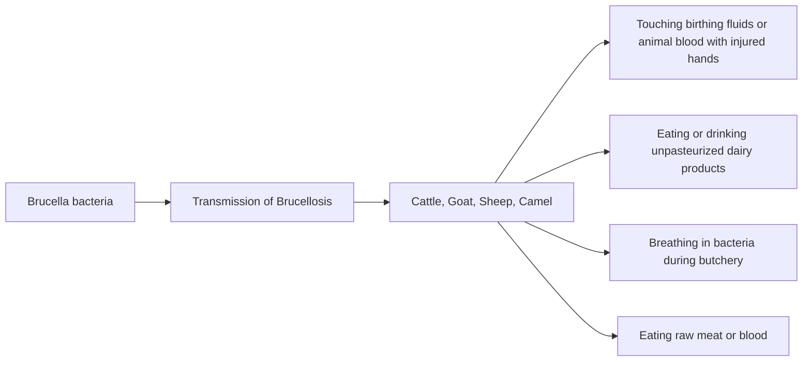

Vol. 4 | Week 48 25th Nov - 1st Nov 8th DEC, 2024

# PUBLIC HEALTH BULLETIN-PAKISTAN

# Integrated Disease Surveillance & Response (IDSR) Report

Center of Disease Control
National Institute of Health, Islamabad

http://www.phb.nih.org.pk/

Integrated Disease Surveillance & Response (IDSR) Weekly Public Health Bulletin is your go-to resource for disease trends, outbreak alerts, and crucial public health information. By reading and sharing this bulletin, you can help increase awareness and promote preventive measures within your community.

Public Health Bulletin Pakistan - Make a difference with your Field work - Share Your Work and Impact Lives - www.phb.nih.org.pk phb@nih.org.pk

Page | 1

NIH Logo

UK Health Security Agency Logo

World Health Organization Logo

USAID Logo

---

# Public Health Bulletin - Pakistan.

Public Health Bulletin PAKISTAN logo

NIH logo

Government of Pakistan logo

*Overview*

**Public Health Bulletin - Pakistan, Week 48, 2024**

*IDSR Reports*

*Evolving from a basic disease registry, Pakistan's Public Health Bulletin has become an indispensable tool for safeguarding public health. By meticulously tracking disease trends, the Bulletin serves as an early warning system, enabling timely interventions to prevent outbreaks.*

*Ongoing Events*

*Beyond data compilation, this week's bulletin also includes updates on NIH Conducting a Multi Hazard Risk Assessment and profiling Workshop in Punjab-Pakistan, Outbreak Investigation of Dengue in District Kech, Balochistan and a knowledge review on Brucellosis*

*Field Reports*

*Stay well-informed about public health matters. Subscribe to the Weekly Bulletin today! By equipping everyone with knowledge, the Public Health Bulletin empowers Pakistanis to build a healthier nation.*

*Sincerely, The Chief Editor*

Page | 2

NIH logo

UK Health Security Agency logo

World Health Organization logo

USAID logo

---

# Overview

* *During week 48, the most frequently reported cases were of Acute Diarrhea (Non-Cholera) followed by Malaria, ILI, TB, ALRI <5 years, dog bite, VH (B, C & D), B. Diarrhea, Typhoid and SARI.*

* *Sixteen cases of AFP reported from Punjab, fifteen from KP, ten from Sindh and five from AJK. All are suspected cases and need field verification.*

* *Forty-two suspected cases of HIV/ AIDS reported from Punjab, seven from KP and six from Sindh. Field investigation required to verify the cases.*

* *Ten suspected cases of Brucellosis reported from KP. Field investigation required to verify the cases.*

## IDSR compliance attributes

* *The national compliance rate for IDSR reporting in 158 implemented districts is 82%*

* *Gilgit Baltistan and AJK are the top reporting regions with a compliance rate of 96, followed by Sindh 94% and ICT 80%*

* *The lowest compliance rate was observed in KP 77% and Balochistan 70%.*

<table>
  <thead>
    <tr>
        <th>Region</th>
        <th>Expected Reports</th>
        <th>Received Reports</th>
        <th>Compliance (%)</th>
    </tr>
  </thead>
  <tbody>
    <tr>
        <td>Khyber Pakhtunkhwa</td>
<td>2319</td>
<td>1740</td>
<td>77</td>
    </tr>
<tr>
        <td>Azad Jammu Kashmir</td>
<td>405</td>
<td>381</td>
<td>96</td>
    </tr>
<tr>
        <td>Islamabad Capital Territory</td>
<td>36</td>
<td>29</td>
<td>80</td>
    </tr>
<tr>
        <td>Balochistan</td>
<td>1307</td>
<td>900</td>
<td>70</td>
    </tr>
<tr>
        <td>Gilgit Baltistan</td>
<td>407</td>
<td>385</td>
<td>96</td>
    </tr>
<tr>
        <td>Sindh</td>
<td>2094</td>
<td>1974</td>
<td>94</td>
    </tr>
<tr>
        <td>National</td>
<td>6568</td>
<td>5409</td>
<td>82</td>
    </tr>
  </tbody>
</table>

Page | 3

NIH logo

UK Health Security Agency logo

World Health Organization logo

USAID logo

---

Public Health Actions

# Public Health Actions

Federal, Provincial, Regional Health Departments and relevant programs may consider following public health actions to prevent and control diseases.

## Typhoid Fever

* **Safe Water and Sanitation:** Improve access to clean water and adequate sanitation facilities.

* **Vaccination of High Risk Population:** Vaccinate children under 15 with typhoid conjugate vaccine (TCV) in high-risk areas to prevent the spread of XDR *Salmonella Typhi* and reduce dependency on antibiotics

* **Food Safety:** Implement food safety practices, such as proper cooking and storage, to prevent foodborne transmission.

* **Community Awareness:** Leverage local health workers and community influencers to hold community awareness sessions.

## Influenza-Like Illness (ILI)

* **Enhance Surveillance:** Strengthen the surveillance of ILI cases at health facilities, especially during flu seasons.

* **Promote Hygiene Practices:** Launch health education campaigns on proper respiratory hygiene (covering coughs, frequent hand washing).

* **Strengthen Lab Systems:** Enhance the capacity of laboratory systems to easily detect the circulating strains in the population.

* **Enhance vaccination:** Vaccination in high-risk groups (elderly, asthmatics, children < 5) for ILI is advised.

Page | 4

NIH logo

UK Health Security Agency logo

World Health Organization logo

USAID logo

---

Pakistan

Table 1: Province/Area wise distribution of most frequently reported suspected cases during Week 48, Pakistan.

<table>
  <thead>
    <tr>
      <th>Diseases</th>
      <th>AJK</th>
      <th>Balochistan</th>
      <th>GB</th>
      <th>ICT</th>
      <th>KP</th>
      <th>Punjab</th>
      <th>Sindh</th>
      <th>Total</th>
    </tr>
  </thead>
  <tbody>
    <tr>
      <td>AD (Non-Cholera)</td>
<td>998</td>
<td>4,799</td>
<td>686</td>
<td>240</td>
<td>16,332</td>
<td>63,539</td>
<td>35,894</td>
<td>122,488</td>
    </tr>
<tr>
      <td>Malaria</td>
<td>3</td>
<td>6,274</td>
<td>3</td>
<td>0</td>
<td>6,052</td>
<td>3,290</td>
<td>63,932</td>
<td>79,554</td>
    </tr>
<tr>
      <td>ILI</td>
<td>2,651</td>
<td>6,989</td>
<td>520</td>
<td>1,403</td>
<td>5,893</td>
<td>36</td>
<td>32,297</td>
<td>49,789</td>
    </tr>
<tr>
      <td>TB</td>
<td>85</td>
<td>133</td>
<td>74</td>
<td>0</td>
<td>534</td>
<td>10,225</td>
<td>12,995</td>
<td>24,046</td>
    </tr>
<tr>
      <td>ALRI &lt; 5 years</td>
<td>1,651</td>
<td>1,571</td>
<td>1,139</td>
<td>0</td>
<td>1,411</td>
<td>1,323</td>
<td>12,450</td>
<td>19,545</td>
    </tr>
<tr>
      <td>Dog Bite</td>
<td>70</td>
<td>198</td>
<td>6</td>
<td>1</td>
<td>568</td>
<td>4,128</td>
<td>2,504</td>
<td>7,475</td>
    </tr>
<tr>
      <td>VH (B, C & D)</td>
<td>30</td>
<td>169</td>
<td>3</td>
<td>0</td>
<td>215</td>
<td>0</td>
<td>5,225</td>
<td>5,642</td>
    </tr>
<tr>
      <td>B. Diarrhea</td>
<td>41</td>
<td>1,070</td>
<td>48</td>
<td>0</td>
<td>709</td>
<td>684</td>
<td>2,989</td>
<td>5,541</td>
    </tr>
<tr>
      <td>Typhoid</td>
<td>21</td>
<td>564</td>
<td>54</td>
<td>0</td>
<td>621</td>
<td>1,921</td>
<td>926</td>
<td>4,107</td>
    </tr>
<tr>
      <td>SARI</td>
<td>346</td>
<td>614</td>
<td>294</td>
<td>1</td>
<td>1,691</td>
<td>0</td>
<td>187</td>
<td>3,133</td>
    </tr>
<tr>
      <td>Dengue</td>
<td>5</td>
<td>6</td>
<td>9</td>
<td>0</td>
<td>120</td>
<td>1,341</td>
<td>200</td>
<td>1,681</td>
    </tr>
<tr>
      <td>AVH (A & E)</td>
<td>30</td>
<td>20</td>
<td>6</td>
<td>0</td>
<td>451</td>
<td>0</td>
<td>693</td>
<td>1,200</td>
    </tr>
<tr>
      <td>AWD (S. Cholera)</td>
<td>32</td>
<td>106</td>
<td>7</td>
<td>0</td>
<td>39</td>
<td>622</td>
<td>23</td>
<td>829</td>
    </tr>
<tr>
      <td>Measles</td>
<td>10</td>
<td>34</td>
<td>1</td>
<td>0</td>
<td>241</td>
<td>151</td>
<td>55</td>
<td>492</td>
    </tr>
<tr>
      <td>Chikungunya</td>
<td>0</td>
<td>5</td>
<td>0</td>
<td>1</td>
<td>46</td>
<td>0</td>
<td>228</td>
<td>280</td>
    </tr>
<tr>
      <td>CL</td>
<td>7</td>
<td>104</td>
<td>0</td>
<td>0</td>
<td>154</td>
<td>2</td>
<td>2</td>
<td>269</td>
    </tr>
<tr>
      <td>Mumps</td>
<td>7</td>
<td>39</td>
<td>10</td>
<td>0</td>
<td>95</td>
<td>0</td>
<td>101</td>
<td>252</td>
    </tr>
<tr>
      <td>Chickenpox/ Varicella</td>
<td>13</td>
<td>3</td>
<td>13</td>
<td>2</td>
<td>68</td>
<td>12</td>
<td>9</td>
<td>120</td>
    </tr>
<tr>
      <td>Meningitis</td>
<td>8</td>
<td>0</td>
<td>1</td>
<td>0</td>
<td>10</td>
<td>80</td>
<td>15</td>
<td>114</td>
    </tr>
<tr>
      <td>Pertussis</td>
<td>1</td>
<td>48</td>
<td>5</td>
<td>0</td>
<td>6</td>
<td>0</td>
<td>1</td>
<td>61</td>
    </tr>
<tr>
      <td>Gonorrhea</td>
<td>0</td>
<td>36</td>
<td>0</td>
<td>0</td>
<td>11</td>
<td>0</td>
<td>13</td>
<td>60</td>
    </tr>
<tr>
      <td>HIV/AIDS</td>
<td>0</td>
<td>0</td>
<td>0</td>
<td>0</td>
<td>7</td>
<td>42</td>
<td>6</td>
<td>55</td>
    </tr>
<tr>
      <td>AFP</td>
<td>5</td>
<td>0</td>
<td>0</td>
<td>0</td>
<td>15</td>
<td>16</td>
<td>10</td>
<td>46</td>
    </tr>
<tr>
      <td>Diphtheria (Probable)</td>
<td>0</td>
<td>4</td>
<td>0</td>
<td>0</td>
<td>13</td>
<td>7</td>
<td>19</td>
<td>43</td>
    </tr>
<tr>
      <td>Syphilis</td>
<td>0</td>
<td>0</td>
<td>0</td>
<td>0</td>
<td>0</td>
<td>0</td>
<td>17</td>
<td>17</td>
    </tr>
<tr>
      <td>Rubella (CRS)</td>
<td>0</td>
<td>7</td>
<td>0</td>
<td>0</td>
<td>0</td>
<td>5</td>
<td>0</td>
<td>12</td>
    </tr>
<tr>
      <td>Brucellosis</td>
<td>0</td>
<td>0</td>
<td>0</td>
<td>0</td>
<td>10</td>
<td>0</td>
<td>0</td>
<td>10</td>
    </tr>
<tr>
      <td>NT</td>
<td>0</td>
<td>0</td>
<td>0</td>
<td>0</td>
<td>8</td>
<td>0</td>
<td>0</td>
<td>8</td>
    </tr>
<tr>
      <td>Leprosy</td>
<td>0</td>
<td>5</td>
<td>0</td>
<td>0</td>
<td>2</td>
<td>0</td>
<td>0</td>
<td>7</td>
    </tr>
<tr>
      <td>VL</td>
<td>0</td>
<td>0</td>
<td>0</td>
<td>0</td>
<td>1</td>
<td>0</td>
<td>0</td>
<td>1</td>
    </tr>
  </tbody>
</table>

Figure 1: Most frequently reported suspected cases during Week 48, Pakistan.

<table>
  <thead>
    <tr>
        <th>Disease</th>
        <th>W46</th>
        <th>W47</th>
        <th>W48</th>
    </tr>
  </thead>
  <tbody>
    <tr>
        <td>AD (Non-Cholera)</td>
<td> </td>
<td> </td>
<td>122,488</td>
    </tr>
<tr>
        <td>Malaria</td>
<td> </td>
<td> </td>
<td>79,554</td>
    </tr>
<tr>
        <td>ILI</td>
<td> </td>
<td> </td>
<td>49,789</td>
    </tr>
<tr>
        <td>TB</td>
<td> </td>
<td> </td>
<td>24,046</td>
    </tr>
<tr>
        <td>ALRI &lt; 5 years</td>
<td> </td>
<td> </td>
<td>19,545</td>
    </tr>
<tr>
        <td>Dog Bite</td>
<td> </td>
<td> </td>
<td>7,475</td>
    </tr>
<tr>
        <td>VH (B, C &amp; D)</td>
<td> </td>
<td> </td>
<td>5,642</td>
    </tr>
<tr>
        <td>B. Diarrhea</td>
<td> </td>
<td> </td>
<td>5,541</td>
    </tr>
<tr>
        <td>Typhoid</td>
<td> </td>
<td> </td>
<td>4,107</td>
    </tr>
<tr>
        <td>SARI</td>
<td> </td>
<td> </td>
<td>3,133</td>
    </tr>
  </tbody>
</table>

Page | 5

NIH CID logo

UK Health Security Agency logo

World Health Organization logo

USAID logo

---

# Sindh
* Malaria cases were maximum followed by AD (Non-Cholera), ILI, TB, ALRI<5 Years, VH (B, C, D), B. Diarrhea, dog bite, Typhoid and AVH (A & E).
* Malaria cases are mostly from Larkana, Khairpur and Dadu whereas AD (Non-Cholera) cases are from Mirpurkhas, Khairpur and Badin.
* Ten cases of AFP reported from Sindh. All are suspected cases and need field verification.
* Six suspected cases of HIV/ AIDS reported from Sindh. Field investigation required to verify the cases.

Table 2: District wise distribution of most frequently reported suspected cases during Week 48, Sindh

<table>
    <thead>
    <tr>
        <th>Districts</th>
        <th>Malaria</th>
        <th>AD (Non-
Cholera)</th>
        <th>ILI</th>
        <th>TB</th>
        <th>ALRI &lt; 5 
years</th>
        <th>VH (B, C 
& D)</th>
        <th>B. 
Diarrhea</th>
        <th>Dog 
Bite</th>
        <th>Typhoid</th>
        <th>AVH 
(A&E)</th>
    </tr>
    </thead>
    <tr>
        <td>Badin</td>
<td>2,135</td>
<td>1,966</td>
<td>3,172</td>
<td>1051</td>
<td>792</td>
<td>320</td>
<td>184</td>
<td>89</td>
<td>55</td>
<td>7</td>
    </tr>
<tr>
        <td>Dadu</td>
<td>4,999</td>
<td>1,768</td>
<td>602</td>
<td>495</td>
<td>827</td>
<td>65</td>
<td>415</td>
<td>211</td>
<td>76</td>
<td>45</td>
    </tr>
<tr>
        <td>Ghotki</td>
<td>1,311</td>
<td>582</td>
<td>108</td>
<td>209</td>
<td>458</td>
<td>194</td>
<td>67</td>
<td>193</td>
<td>3</td>
<td>3</td>
    </tr>
<tr>
        <td>Hyderabad</td>
<td>449</td>
<td>1,383</td>
<td>1,756</td>
<td>69</td>
<td>87</td>
<td>32</td>
<td>0</td>
<td>0</td>
<td>10</td>
<td>0</td>
    </tr>
<tr>
        <td>Jacobabad</td>
<td>1,877</td>
<td>778</td>
<td>758</td>
<td>156</td>
<td>395</td>
<td>247</td>
<td>101</td>
<td>124</td>
<td>39</td>
<td>5</td>
    </tr>
<tr>
        <td>Jamshoro</td>
<td>3,167</td>
<td>1,399</td>
<td>163</td>
<td>630</td>
<td>415</td>
<td>203</td>
<td>82</td>
<td>114</td>
<td>57</td>
<td>5</td>
    </tr>
<tr>
        <td>Kamber</td>
<td>4,491</td>
<td>1,832</td>
<td>0</td>
<td>1105</td>
<td>368</td>
<td>235</td>
<td>136</td>
<td>201</td>
<td>14</td>
<td>0</td>
    </tr>
<tr>
        <td>Karachi Central</td>
<td>12</td>
<td>367</td>
<td>883</td>
<td>13</td>
<td>1</td>
<td>6</td>
<td>3</td>
<td>0</td>
<td>40</td>
<td>0</td>
    </tr>
<tr>
        <td>Karachi East</td>
<td>52</td>
<td>324</td>
<td>624</td>
<td>9</td>
<td>20</td>
<td>6</td>
<td>6</td>
<td>18</td>
<td>2</td>
<td>0</td>
    </tr>
<tr>
        <td>Karachi Keamari</td>
<td>7</td>
<td>380</td>
<td>274</td>
<td>4</td>
<td>33</td>
<td>0</td>
<td>1</td>
<td>0</td>
<td>5</td>
<td>0</td>
    </tr>
<tr>
        <td>Karachi Korangi</td>
<td>30</td>
<td>290</td>
<td>0</td>
<td>18</td>
<td>8</td>
<td>0</td>
<td>3</td>
<td>0</td>
<td>3</td>
<td>2</td>
    </tr>
<tr>
        <td>Karachi Malir</td>
<td>388</td>
<td>934</td>
<td>2,939</td>
<td>186</td>
<td>145</td>
<td>38</td>
<td>29</td>
<td>34</td>
<td>10</td>
<td>5</td>
    </tr>
<tr>
        <td>Karachi South</td>
<td>29</td>
<td>96</td>
<td>0</td>
<td>0</td>
<td>0</td>
<td>0</td>
<td>2</td>
<td>0</td>
<td>0</td>
<td>0</td>
    </tr>
<tr>
        <td>Karachi West</td>
<td>287</td>
<td>817</td>
<td>1,251</td>
<td>142</td>
<td>160</td>
<td>134</td>
<td>28</td>
<td>37</td>
<td>30</td>
<td>6</td>
    </tr>
<tr>
        <td>Kashmore</td>
<td>3,644</td>
<td>488</td>
<td>435</td>
<td>526</td>
<td>258</td>
<td>9</td>
<td>49</td>
<td>156</td>
<td>11</td>
<td>0</td>
    </tr>
<tr>
        <td>Khairpur</td>
<td>6,228</td>
<td>2,561</td>
<td>6,639</td>
<td>1172</td>
<td>1,072</td>
<td>125</td>
<td>310</td>
<td>210</td>
<td>179</td>
<td>4</td>
    </tr>
<tr>
        <td>Larkana</td>
<td>6,648</td>
<td>1,587</td>
<td>9</td>
<td>1032</td>
<td>574</td>
<td>133</td>
<td>344</td>
<td>45</td>
<td>20</td>
<td>6</td>
    </tr>
<tr>
        <td>Matiari</td>
<td>1,863</td>
<td>1,259</td>
<td>6</td>
<td>539</td>
<td>396</td>
<td>239</td>
<td>55</td>
<td>54</td>
<td>10</td>
<td>3</td>
    </tr>
<tr>
        <td>Mirpurkhas</td>
<td>2,814</td>
<td>2,654</td>
<td>4,287</td>
<td>755</td>
<td>781</td>
<td>341</td>
<td>129</td>
<td>111</td>
<td>18</td>
<td>2</td>
    </tr>
<tr>
        <td>Naushero Feroze</td>
<td>2,414</td>
<td>1,128</td>
<td>1,254</td>
<td>520</td>
<td>523</td>
<td>20</td>
<td>124</td>
<td>223</td>
<td>129</td>
<td>1</td>
    </tr>
<tr>
        <td>Sanghar</td>
<td>4,047</td>
<td>1,579</td>
<td>44</td>
<td>1276</td>
<td>892</td>
<td>1,277</td>
<td>53</td>
<td>145</td>
<td>27</td>
<td>3</td>
    </tr>
<tr>
        <td>Shaheed Benazirabad</td>
<td>1,701</td>
<td>1,590</td>
<td>17</td>
<td>367</td>
<td>259</td>
<td>126</td>
<td>72</td>
<td>122</td>
<td>105</td>
<td>0</td>
    </tr>
<tr>
        <td>Shikarpur</td>
<td>3,435</td>
<td>1,101</td>
<td>0</td>
<td>293</td>
<td>214</td>
<td>815</td>
<td>172</td>
<td>131</td>
<td>3</td>
<td>0</td>
    </tr>
<tr>
        <td>Sujawal</td>
<td>896</td>
<td>1,193</td>
<td>0</td>
<td>131</td>
<td>321</td>
<td>3</td>
<td>100</td>
<td>43</td>
<td>4</td>
<td>13</td>
    </tr>
<tr>
        <td>Sukkur</td>
<td>3,500</td>
<td>1,190</td>
<td>1,964</td>
<td>594</td>
<td>537</td>
<td>84</td>
<td>124</td>
<td>92</td>
<td>1</td>
<td>0</td>
    </tr>
<tr>
        <td>Tando Allahyar</td>
<td>1,725</td>
<td>988</td>
<td>1,302</td>
<td>579</td>
<td>358</td>
<td>292</td>
<td>105</td>
<td>44</td>
<td>9</td>
<td>1</td>
    </tr>
<tr>
        <td>Tando Muhammad Khan</td>
<td>999</td>
<td>703</td>
<td>7</td>
<td>130</td>
<td>128</td>
<td>10</td>
<td>50</td>
<td>5</td>
<td>2</td>
<td>0</td>
    </tr>
<tr>
        <td>Tharparkar</td>
<td>1,926</td>
<td>1,913</td>
<td>2,101</td>
<td>482</td>
<td>1,182</td>
<td>122</td>
<td>102</td>
<td>2</td>
<td>16</td>
<td>41</td>
    </tr>
<tr>
        <td>Thatta</td>
<td>1,257</td>
<td>1,475</td>
<td>1,702</td>
<td>66</td>
<td>651</td>
<td>67</td>
<td>61</td>
<td>100</td>
<td>21</td>
<td>538</td>
    </tr>
<tr>
        <td>Umerkot</td>
<td>1,601</td>
<td>1,569</td>
<td>0</td>
<td>446</td>
<td>595</td>
<td>82</td>
<td>82</td>
<td>0</td>
<td>27</td>
<td>3</td>
    </tr>
<tr>
        <td>Total</td>
<td>63,932</td>
<td>35,894</td>
<td>32,297</td>
<td>12,995</td>
<td>12,450</td>
<td>5,225</td>
<td>2,989</td>
<td>2,504</td>
<td>926</td>
<td>693</td>
    </tr>
</table>

Figure 2: Most frequently reported suspected cases during Week 48 Sindh

<table>
  <thead>
    <tr>
        <th>Week</th>
        <th>Malaria</th>
        <th>AD (Non-Cholera)</th>
        <th>ILI</th>
        <th>TB</th>
        <th>ALRI &lt; 5 years</th>
        <th>VH (B, C &amp; D)</th>
        <th>B. Diarrhea</th>
        <th>Dog Bite</th>
        <th>Typhoid</th>
        <th>AVH (A &amp; E)</th>
    </tr>
  </thead>
  <tbody>
    <tr>
        <td>W46</td>
<td>71000</td>
<td>38000</td>
<td>38000</td>
<td>18000</td>
<td>16000</td>
<td>6000</td>
<td>3500</td>
<td>3000</td>
<td>1200</td>
<td>800</td>
    </tr>
<tr>
        <td>W47</td>
<td>69000</td>
<td>37000</td>
<td>36000</td>
<td>17000</td>
<td>15000</td>
<td>5500</td>
<td>3200</td>
<td>2800</td>
<td>1100</td>
<td>750</td>
    </tr>
<tr>
        <td>W48</td>
<td>63932</td>
<td>35894</td>
<td>32297</td>
<td>12995</td>
<td>12450</td>
<td>5225</td>
<td>2989</td>
<td>2504</td>
<td>926</td>
<td>693</td>
    </tr>
  </tbody>
</table>

Page | 6

NIH logo

UK Health Security Agency logo

World Health Organization logo

USAID logo

---

# Balochistan
* ILI, Malaria, AD (Non-Cholera), ALRI <5 years, B. Diarrhea, SARI, Typhoid, dog bite ,VH (B, C & D) and TB cases were the most frequently reported diseases from Balochistan province.

* ILI cases are mostly reported from Gwadar, Quetta and Jhal Magsi while Malaria cases are mostly reported from Jhal Magsi, Jaffarabad and Lasbella.

**Table 3: District wise distribution of most frequently reported suspected cases during Week 48, Balochistan**

<table>
  <thead>
    <tr>
      <th>Districts</th>
      <th>AD (Non-
Cholera)</th>
      <th>Malaria</th>
      <th>ILI</th>
      <th>B. 
Diarrhea</th>
      <th>ALRI &lt; 5 
years</th>
      <th>Typhoid</th>
      <th>SARI</th>
      <th>AWD
(S.Cholera)</th>
      <th>TB</th>
      <th>CL</th>
    </tr>
  </thead>
  <tbody>
    <tr>
      <td>Barkhan</td>
<td>76</td>
<td>84</td>
<td>90</td>
<td>41</td>
<td>14</td>
<td>5</td>
<td>31</td>
<td>19</td>
<td>0</td>
<td>6</td>
    </tr>
<tr>
      <td>Dera Bugti</td>
<td>86</td>
<td>187</td>
<td>63</td>
<td>69</td>
<td>26</td>
<td>7</td>
<td>22</td>
<td>0</td>
<td>0</td>
<td>0</td>
    </tr>
<tr>
      <td>Gwadar</td>
<td>1,530</td>
<td>280</td>
<td>560</td>
<td>18</td>
<td>126</td>
<td>0</td>
<td>25</td>
<td>0</td>
<td>2</td>
<td>0</td>
    </tr>
<tr>
      <td>Hub</td>
<td>55</td>
<td>267</td>
<td>177</td>
<td>12</td>
<td>6</td>
<td>0</td>
<td>3</td>
<td>7</td>
<td>12</td>
<td>3</td>
    </tr>
<tr>
      <td>Jaffarabad</td>
<td>145</td>
<td>843</td>
<td>315</td>
<td>13</td>
<td>64</td>
<td>14</td>
<td>6</td>
<td>27</td>
<td>59</td>
<td>62</td>
    </tr>
<tr>
      <td>Jhal Magsi</td>
<td>542</td>
<td>995</td>
<td>258</td>
<td>291</td>
<td>1</td>
<td>2</td>
<td>17</td>
<td>17</td>
<td>0</td>
<td>11</td>
    </tr>
<tr>
      <td>Kalat</td>
<td>6</td>
<td>22</td>
<td>36</td>
<td>25</td>
<td>7</td>
<td>5</td>
<td>24</td>
<td>0</td>
<td>0</td>
<td>0</td>
    </tr>
<tr>
      <td>Kharan</td>
<td>430</td>
<td>66</td>
<td>140</td>
<td>0</td>
<td>61</td>
<td>6</td>
<td>0</td>
<td>0</td>
<td>0</td>
<td>0</td>
    </tr>
<tr>
      <td>Khuzdar</td>
<td>414</td>
<td>274</td>
<td>251</td>
<td>11</td>
<td>114</td>
<td>58</td>
<td>59</td>
<td>3</td>
<td>0</td>
<td>0</td>
    </tr>
<tr>
      <td>Killa Abdullah</td>
<td>118</td>
<td>18</td>
<td>79</td>
<td>24</td>
<td>29</td>
<td>41</td>
<td>33</td>
<td>0</td>
<td>0</td>
<td>1</td>
    </tr>
<tr>
      <td>Killa Saifullah</td>
<td>0</td>
<td>94</td>
<td>133</td>
<td>133</td>
<td>52</td>
<td>0</td>
<td>15</td>
<td>0</td>
<td>0</td>
<td>0</td>
    </tr>
<tr>
      <td>Kohlu</td>
<td>366</td>
<td>112</td>
<td>153</td>
<td>15</td>
<td>68</td>
<td>53</td>
<td>57</td>
<td>NR</td>
<td>NR</td>
<td>NR</td>
    </tr>
<tr>
      <td>Lasbella</td>
<td>119</td>
<td>703</td>
<td>372</td>
<td>88</td>
<td>56</td>
<td>2</td>
<td>20</td>
<td>14</td>
<td>4</td>
<td>2</td>
    </tr>
<tr>
      <td>Loralai</td>
<td>287</td>
<td>31</td>
<td>128</td>
<td>48</td>
<td>28</td>
<td>114</td>
<td>26</td>
<td>0</td>
<td>0</td>
<td>0</td>
    </tr>
<tr>
      <td>MusaKhel</td>
<td>27</td>
<td>83</td>
<td>19</td>
<td>17</td>
<td>1</td>
<td>12</td>
<td>1</td>
<td>1</td>
<td>0</td>
<td>0</td>
    </tr>
<tr>
      <td>Naseerabad</td>
<td>247</td>
<td>586</td>
<td>350</td>
<td>24</td>
<td>33</td>
<td>3</td>
<td>88</td>
<td>98</td>
<td>60</td>
<td>1</td>
    </tr>
<tr>
      <td>Panjgur</td>
<td>236</td>
<td>216</td>
<td>206</td>
<td>91</td>
<td>39</td>
<td>45</td>
<td>2</td>
<td>0</td>
<td>0</td>
<td>0</td>
    </tr>
<tr>
      <td>Pishin</td>
<td>237</td>
<td>8</td>
<td>54</td>
<td>9</td>
<td>22</td>
<td>2</td>
<td>4</td>
<td>0</td>
<td>0</td>
<td>0</td>
    </tr>
<tr>
      <td>Quetta</td>
<td>969</td>
<td>44</td>
<td>370</td>
<td>100</td>
<td>59</td>
<td>72</td>
<td>56</td>
<td>1</td>
<td>1</td>
<td>1</td>
    </tr>
<tr>
      <td>Sherani</td>
<td>17</td>
<td>1</td>
<td>4</td>
<td>0</td>
<td>0</td>
<td>17</td>
<td>0</td>
<td>0</td>
<td>0</td>
<td>0</td>
    </tr>
<tr>
      <td>Sibi</td>
<td>120</td>
<td>158</td>
<td>70</td>
<td>40</td>
<td>27</td>
<td>51</td>
<td>24</td>
<td>1</td>
<td>1</td>
<td>0</td>
    </tr>
<tr>
      <td>Sohbat pur</td>
<td>21</td>
<td>608</td>
<td>242</td>
<td>163</td>
<td>80</td>
<td>19</td>
<td>29</td>
<td>7</td>
<td>7</td>
<td>10</td>
    </tr>
<tr>
      <td>Surab</td>
<td>165</td>
<td>40</td>
<td>55</td>
<td>0</td>
<td>0</td>
<td>0</td>
<td>0</td>
<td>0</td>
<td>0</td>
<td>0</td>
    </tr>
<tr>
      <td>Usta Muhammad</td>
<td>195</td>
<td>290</td>
<td>416</td>
<td>133</td>
<td>55</td>
<td>16</td>
<td>8</td>
<td>3</td>
<td>20</td>
<td>0</td>
    </tr>
<tr>
      <td>Washuk</td>
<td>405</td>
<td>187</td>
<td>191</td>
<td>3</td>
<td>83</td>
<td>7</td>
<td>9</td>
<td>0</td>
<td>0</td>
<td>0</td>
    </tr>
<tr>
      <td>Zhob</td>
<td>176</td>
<td>77</td>
<td>67</td>
<td>203</td>
<td>19</td>
<td>63</td>
<td>5</td>
<td>0</td>
<td>3</td>
<td>36</td>
    </tr>
<tr>
      <td>Total</td>
<td>6,989</td>
<td>6,274</td>
<td>4,799</td>
<td>1,571</td>
<td>1,070</td>
<td>614</td>
<td>564</td>
<td>198</td>
<td>169</td>
<td>133</td>
    </tr>
  </tbody>
</table>

**Figure 3: Most frequently reported suspected cases during Week 48, Balochistan**

<table>
  <thead>
    <tr>
        <th>Disease</th>
        <th>W46</th>
        <th>W47</th>
        <th>W48</th>
    </tr>
  </thead>
  <tbody>
    <tr>
        <td>ILI</td>
<td>9100</td>
<td>5300</td>
<td>6989</td>
    </tr>
<tr>
        <td>Malaria</td>
<td>8100</td>
<td>4900</td>
<td>6274</td>
    </tr>
<tr>
        <td>AD (Non-Cholera)</td>
<td>6100</td>
<td>3700</td>
<td>4799</td>
    </tr>
<tr>
        <td>ALRI &lt; 5 years</td>
<td>1700</td>
<td>1500</td>
<td>1571</td>
    </tr>
<tr>
        <td>B. Diarrhea</td>
<td>1400</td>
<td>1100</td>
<td>1070</td>
    </tr>
<tr>
        <td>SARI</td>
<td>800</td>
<td>400</td>
<td>614</td>
    </tr>
<tr>
        <td>Typhoid</td>
<td>700</td>
<td>400</td>
<td>564</td>
    </tr>
<tr>
        <td>Dog Bite</td>
<td>200</td>
<td>150</td>
<td>198</td>
    </tr>
<tr>
        <td>VH (B, C &amp; D)</td>
<td>200</td>
<td>150</td>
<td>169</td>
    </tr>
<tr>
        <td>TB</td>
<td>150</td>
<td>100</td>
<td>133</td>
    </tr>
  </tbody>
</table>

Page | 7

NIH logo

UK Health Security Agency logo

World Health Organization logo

USAID logo

---

Khyber Pakhtunkhwa

* Cases of AD (Non-Cholera) were maximum followed by Malaria, ILI, SARI, ALRI<5 Years, B. Diarrhea, Typhoid, dog bite, TB and AVH (A & E) cases.

* Fifteen cases of AFP, Seven suspected cases of HIV/ AIDS, Ten suspected cases of Brucellosis reported from KP. All are suspected cases and need field verification.

**Table 4: District wise distribution of most frequently reported suspected cases during Week 48, KP**

<table>
    <thead>
    <tr>
        <th>Districts</th>
        <th>AD (Non-
Cholera)</th>
        <th>Malaria</th>
        <th>ILI</th>
        <th>B.Diarrhea</th>
        <th>SARI</th>
        <th>ALRI &lt;5 Years</th>
        <th>Typhoid</th>
        <th>Dog Bite</th>
        <th>TB</th>
        <th>AVH (A&E)</th>
    </tr>
    </thead>
    <tr>
        <td>Abbottabad</td>
<td>773</td>
<td>69</td>
<td>317</td>
<td>181</td>
<td>163</td>
<td>6</td>
<td>79</td>
<td>112</td>
<td>179</td>
<td>2</td>
    </tr>
<tr>
        <td>Bajaur</td>
<td>822</td>
<td>192</td>
<td>86</td>
<td>106</td>
<td>44</td>
<td>53</td>
<td>2</td>
<td>46</td>
<td>11</td>
<td>51</td>
    </tr>
<tr>
        <td>Bannu</td>
<td>684</td>
<td>1,729</td>
<td>29</td>
<td>3</td>
<td>18</td>
<td>42</td>
<td>90</td>
<td>3</td>
<td>10</td>
<td>2</td>
    </tr>
<tr>
        <td>Battagram</td>
<td>123</td>
<td>39</td>
<td>563</td>
<td>NR</td>
<td>NR</td>
<td>1</td>
<td>0</td>
<td>17</td>
<td>32</td>
<td>NR</td>
    </tr>
<tr>
        <td>Buner</td>
<td>187</td>
<td>169</td>
<td>25</td>
<td>0</td>
<td>0</td>
<td>0</td>
<td>6</td>
<td>13</td>
<td>1</td>
<td>0</td>
    </tr>
<tr>
        <td>Charsadda</td>
<td>820</td>
<td>391</td>
<td>445</td>
<td>19</td>
<td>234</td>
<td>45</td>
<td>75</td>
<td>4</td>
<td>12</td>
<td>8</td>
    </tr>
<tr>
        <td>Chitral Lower</td>
<td>340</td>
<td>15</td>
<td>209</td>
<td>31</td>
<td>19</td>
<td>23</td>
<td>7</td>
<td>10</td>
<td>2</td>
<td>1</td>
    </tr>
<tr>
        <td>Chitral Upper</td>
<td>101</td>
<td>5</td>
<td>15</td>
<td>8</td>
<td>18</td>
<td>5</td>
<td>9</td>
<td>1</td>
<td>1</td>
<td>0</td>
    </tr>
<tr>
        <td>D.I. Khan</td>
<td>1,111</td>
<td>610</td>
<td>0</td>
<td>0</td>
<td>13</td>
<td>13</td>
<td>0</td>
<td>17</td>
<td>46</td>
<td>0</td>
    </tr>
<tr>
        <td>Dir Lower</td>
<td>941</td>
<td>285</td>
<td>2</td>
<td>0</td>
<td>104</td>
<td>98</td>
<td>52</td>
<td>41</td>
<td>16</td>
<td>27</td>
    </tr>
<tr>
        <td>Dir Upper</td>
<td>449</td>
<td>5</td>
<td>80</td>
<td>0</td>
<td>12</td>
<td>1</td>
<td>4</td>
<td>5</td>
<td>12</td>
<td>175</td>
    </tr>
<tr>
        <td>Hangu</td>
<td>37</td>
<td>1</td>
<td>0</td>
<td>0</td>
<td>5</td>
<td>0</td>
<td>0</td>
<td>0</td>
<td>10</td>
<td>0</td>
    </tr>
<tr>
        <td>Haripur</td>
<td>517</td>
<td>11</td>
<td>285</td>
<td>20</td>
<td>51</td>
<td>3</td>
<td>3</td>
<td>1</td>
<td>11</td>
<td>20</td>
    </tr>
<tr>
        <td>Karak</td>
<td>297</td>
<td>188</td>
<td>81</td>
<td>266</td>
<td>12</td>
<td>0</td>
<td>3</td>
<td>15</td>
<td>9</td>
<td>1</td>
    </tr>
<tr>
        <td>Khyber</td>
<td>374</td>
<td>185</td>
<td>90</td>
<td>38</td>
<td>26</td>
<td>105</td>
<td>56</td>
<td>23</td>
<td>8</td>
<td>3</td>
    </tr>
<tr>
        <td>Kohat</td>
<td>335</td>
<td>160</td>
<td>115</td>
<td>74</td>
<td>3</td>
<td>28</td>
<td>11</td>
<td>4</td>
<td>2</td>
<td>0</td>
    </tr>
<tr>
        <td>Kohistan Lower</td>
<td>60</td>
<td>1</td>
<td>0</td>
<td>0</td>
<td>0</td>
<td>3</td>
<td>2</td>
<td>1</td>
<td>0</td>
<td>0</td>
    </tr>
<tr>
        <td>Kohistan Upper</td>
<td>307</td>
<td>16</td>
<td>3</td>
<td>2</td>
<td>23</td>
<td>10</td>
<td>3</td>
<td>1</td>
<td>0</td>
<td>0</td>
    </tr>
<tr>
        <td>Kolai Palas</td>
<td>63</td>
<td>0</td>
<td>3</td>
<td>8</td>
<td>7</td>
<td>2</td>
<td>2</td>
<td>0</td>
<td>0</td>
<td>0</td>
    </tr>
<tr>
        <td>L & C Kurram</td>
<td>5</td>
<td>12</td>
<td>2</td>
<td>0</td>
<td>0</td>
<td>4</td>
<td>0</td>
<td>2</td>
<td>0</td>
<td>0</td>
    </tr>
<tr>
        <td>Lakki Marwat</td>
<td>621</td>
<td>506</td>
<td>0</td>
<td>0</td>
<td>38</td>
<td>21</td>
<td>4</td>
<td>23</td>
<td>9</td>
<td>0</td>
    </tr>
<tr>
        <td>Malakand</td>
<td>501</td>
<td>26</td>
<td>75</td>
<td>31</td>
<td>41</td>
<td>45</td>
<td>28</td>
<td>0</td>
<td>3</td>
<td>18</td>
    </tr>
<tr>
        <td>Mansehra</td>
<td>308</td>
<td>0</td>
<td>357</td>
<td>101</td>
<td>14</td>
<td>0</td>
<td>1</td>
<td>0</td>
<td>0</td>
<td>0</td>
    </tr>
<tr>
        <td>Mardan</td>
<td>514</td>
<td>33</td>
<td>0</td>
<td>0</td>
<td>101</td>
<td>9</td>
<td>0</td>
<td>13</td>
<td>6</td>
<td>0</td>
    </tr>
<tr>
        <td>Mohmand</td>
<td>110</td>
<td>253</td>
<td>174</td>
<td>128</td>
<td>8</td>
<td>25</td>
<td>5</td>
<td>8</td>
<td>0</td>
<td>1</td>
    </tr>
<tr>
        <td>North Waziristan</td>
<td>6</td>
<td>29</td>
<td>0</td>
<td>0</td>
<td>1</td>
<td>0</td>
<td>2</td>
<td>0</td>
<td>1</td>
<td>0</td>
    </tr>
<tr>
        <td>Nowshera</td>
<td>918</td>
<td>91</td>
<td>40</td>
<td>6</td>
<td>1</td>
<td>10</td>
<td>5</td>
<td>7</td>
<td>8</td>
<td>16</td>
    </tr>
<tr>
        <td>Orakzai</td>
<td>4</td>
<td>5</td>
<td>12</td>
<td>0</td>
<td>0</td>
<td>7</td>
<td>0</td>
<td>9</td>
<td>0</td>
<td>0</td>
    </tr>
<tr>
        <td>Peshawar</td>
<td>2,174</td>
<td>63</td>
<td>1,353</td>
<td>261</td>
<td>88</td>
<td>69</td>
<td>40</td>
<td>4</td>
<td>11</td>
<td>13</td>
    </tr>
<tr>
        <td>SD Tank</td>
<td>5</td>
<td>7</td>
<td>2</td>
<td>0</td>
<td>0</td>
<td>1</td>
<td>0</td>
<td>0</td>
<td>0</td>
<td>0</td>
    </tr>
<tr>
        <td>Shangla</td>
<td>439</td>
<td>248</td>
<td>0</td>
<td>21</td>
<td>16</td>
<td>4</td>
<td>29</td>
<td>13</td>
<td>44</td>
<td>0</td>
    </tr>
<tr>
        <td>SWA</td>
<td>41</td>
<td>33</td>
<td>203</td>
<td>37</td>
<td>4</td>
<td>5</td>
<td>16</td>
<td>4</td>
<td>5</td>
<td>0</td>
    </tr>
<tr>
        <td>Swabi</td>
<td>709</td>
<td>57</td>
<td>782</td>
<td>48</td>
<td>177</td>
<td>5</td>
<td>39</td>
<td>110</td>
<td>58</td>
<td>24</td>
    </tr>
<tr>
        <td>Swat</td>
<td>1,099</td>
<td>31</td>
<td>98</td>
<td>59</td>
<td>134</td>
<td>20</td>
<td>4</td>
<td>28</td>
<td>9</td>
<td>85</td>
    </tr>
<tr>
        <td>Tank</td>
<td>364</td>
<td>518</td>
<td>173</td>
<td>0</td>
<td>16</td>
<td>3</td>
<td>35</td>
<td>0</td>
<td>15</td>
<td>0</td>
    </tr>
<tr>
        <td>Tor Ghar</td>
<td>46</td>
<td>61</td>
<td>0</td>
<td>37</td>
<td>3</td>
<td>19</td>
<td>4</td>
<td>20</td>
<td>0</td>
<td>4</td>
    </tr>
<tr>
        <td>Upper Kurram</td>
<td>119</td>
<td>8</td>
<td>274</td>
<td>206</td>
<td>17</td>
<td>24</td>
<td>5</td>
<td>13</td>
<td>3</td>
<td>0</td>
    </tr>
<tr>
        <td>Total</td>
<td>16,332</td>
<td>6,052</td>
<td>5,893</td>
<td>1,691</td>
<td>1,411</td>
<td>709</td>
<td>621</td>
<td>568</td>
<td>534</td>
<td>451</td>
    </tr>
</table>

Figure 4: Most frequently reported suspected cases during Week 48, KP

<table>
  <thead>
    <tr>
        <th>Disease</th>
        <th>W46</th>
        <th>W47</th>
        <th>W48</th>
    </tr>
  </thead>
  <tbody>
    <tr>
        <td>AD (Non-Cholera)</td>
<td> </td>
<td> </td>
<td>16,332</td>
    </tr>
<tr>
        <td>Malaria</td>
<td> </td>
<td> </td>
<td>6,052</td>
    </tr>
<tr>
        <td>ILI</td>
<td> </td>
<td> </td>
<td>5,893</td>
    </tr>
<tr>
        <td>SARI</td>
<td> </td>
<td> </td>
<td>1,691</td>
    </tr>
<tr>
        <td>ALRI &lt; 5 years</td>
<td> </td>
<td> </td>
<td>1,411</td>
    </tr>
<tr>
        <td>B. Diarrhea</td>
<td> </td>
<td> </td>
<td>709</td>
    </tr>
<tr>
        <td>Typhoid</td>
<td> </td>
<td> </td>
<td>621</td>
    </tr>
<tr>
        <td>Dog Bite</td>
<td> </td>
<td> </td>
<td>568</td>
    </tr>
<tr>
        <td>TB</td>
<td> </td>
<td> </td>
<td>534</td>
    </tr>
<tr>
        <td>AVH (A &amp; E)</td>
<td> </td>
<td> </td>
<td>451</td>
    </tr>
  </tbody>
</table>

Page | 8

NIH CID logo

UK Health Security Agency logo

World Health Organization logo

USAID logo

8

---

# ICT, AJK & GB

**ICT**: The most frequently reported cases from Islamabad were ILI followed by AD (Non-Cholera) and Chikenpox/ Varicella.

**AJK**: ILI cases were maximum followed by ALRI < 5years, AD (Non-Cholera), SARI, TB, dog bite, B. Diarrhea, AWD (S.Cholera), VH (B, C & D) and AVH (A & E) cases. Five suspected cases of AFP reported from AJK. Field investigation required to verify the cases.

**GB**: A ALRI <5 Years cases were the most frequently reported diseases followed by AD (Non-Cholera), ILI, SARI, TB, Typhoid and B. Diarrhea cases.

Figure 5: Most frequently reported suspected cases during Week 48, ICT

<table>
  <thead>
    <tr>
        <th>Disease</th>
        <th>W46</th>
        <th>W47</th>
        <th>W48</th>
    </tr>
  </thead>
  <tbody>
    <tr>
        <td>ILI</td>
<td>1750</td>
<td>1650</td>
<td>1403</td>
    </tr>
<tr>
        <td>AD (Non-Cholera)</td>
<td>300</td>
<td>250</td>
<td>240</td>
    </tr>
<tr>
        <td>Chickenpox/ Varicella</td>
<td>10</td>
<td>10</td>
<td>2</td>
    </tr>
  </tbody>
</table>

Figure 6: Week wise reported suspected cases of ILI, ICT

<table>
  <thead>
    <tr>
        <th>Week</th>
        <th>ILI</th>
    </tr>
  </thead>
  <tbody>
    <tr>
        <td>W49</td>
<td>500</td>
    </tr>
<tr>
        <td>W50</td>
<td>2500</td>
    </tr>
<tr>
        <td>W51</td>
<td>2400</td>
    </tr>
<tr>
        <td>W52</td>
<td>1800</td>
    </tr>
<tr>
        <td>W1</td>
<td>1400</td>
    </tr>
<tr>
        <td>W2</td>
<td>1100</td>
    </tr>
<tr>
        <td>W3</td>
<td>1150</td>
    </tr>
<tr>
        <td>W4</td>
<td>1200</td>
    </tr>
<tr>
        <td>W5</td>
<td>1250</td>
    </tr>
<tr>
        <td>W6</td>
<td>900</td>
    </tr>
<tr>
        <td>W7</td>
<td>1500</td>
    </tr>
<tr>
        <td>W8</td>
<td>1450</td>
    </tr>
<tr>
        <td>W9</td>
<td>1450</td>
    </tr>
<tr>
        <td>W10</td>
<td>1500</td>
    </tr>
<tr>
        <td>W11</td>
<td>1250</td>
    </tr>
<tr>
        <td>W12</td>
<td>1200</td>
    </tr>
<tr>
        <td>W13</td>
<td>1350</td>
    </tr>
<tr>
        <td>W14</td>
<td>1200</td>
    </tr>
<tr>
        <td>W15</td>
<td>250</td>
    </tr>
<tr>
        <td>W16</td>
<td>1250</td>
    </tr>
<tr>
        <td>W17</td>
<td>1250</td>
    </tr>
<tr>
        <td>W18</td>
<td>1350</td>
    </tr>
<tr>
        <td>W19</td>
<td>1000</td>
    </tr>
<tr>
        <td>W20</td>
<td>1150</td>
    </tr>
<tr>
        <td>W21</td>
<td>1000</td>
    </tr>
<tr>
        <td>W22</td>
<td>250</td>
    </tr>
<tr>
        <td>W23</td>
<td>950</td>
    </tr>
<tr>
        <td>W24</td>
<td>1050</td>
    </tr>
<tr>
        <td>W25</td>
<td>300</td>
    </tr>
<tr>
        <td>W26</td>
<td>750</td>
    </tr>
<tr>
        <td>W27</td>
<td>650</td>
    </tr>
<tr>
        <td>W28</td>
<td>780</td>
    </tr>
<tr>
        <td>W29</td>
<td>650</td>
    </tr>
<tr>
        <td>W30</td>
<td>850</td>
    </tr>
<tr>
        <td>W31</td>
<td>900</td>
    </tr>
<tr>
        <td>W32</td>
<td>980</td>
    </tr>
<tr>
        <td>W33</td>
<td>1000</td>
    </tr>
<tr>
        <td>W34</td>
<td>1400</td>
    </tr>
<tr>
        <td>W35</td>
<td>900</td>
    </tr>
<tr>
        <td>W36</td>
<td>1300</td>
    </tr>
<tr>
        <td>W37</td>
<td>1350</td>
    </tr>
<tr>
        <td>W38</td>
<td>1300</td>
    </tr>
<tr>
        <td>W39</td>
<td>1250</td>
    </tr>
<tr>
        <td>W40</td>
<td>1250</td>
    </tr>
<tr>
        <td>W41</td>
<td>1850</td>
    </tr>
<tr>
        <td>W42</td>
<td>1700</td>
    </tr>
<tr>
        <td>W43</td>
<td>1950</td>
    </tr>
<tr>
        <td>W44</td>
<td>1900</td>
    </tr>
<tr>
        <td>W45</td>
<td>1400</td>
    </tr>
<tr>
        <td>W46</td>
<td>1750</td>
    </tr>
<tr>
        <td>W47</td>
<td>1650</td>
    </tr>
<tr>
        <td>W48</td>
<td>1403</td>
    </tr>
  </tbody>
</table>

Figure 7: Most frequently reported suspected cases during Week 48, AJK

<table>
  <thead>
    <tr>
        <th>Disease</th>
        <th>W46</th>
        <th>W47</th>
        <th>W48</th>
    </tr>
  </thead>
  <tbody>
    <tr>
        <td>ILI</td>
<td>2550</td>
<td>2750</td>
<td>2651</td>
    </tr>
<tr>
        <td>ALRI &lt; 5 years</td>
<td>1350</td>
<td>1600</td>
<td>1651</td>
    </tr>
<tr>
        <td>AD (Non-Cholera)</td>
<td>1150</td>
<td>1150</td>
<td>998</td>
    </tr>
<tr>
        <td>SARI</td>
<td>350</td>
<td>450</td>
<td>346</td>
    </tr>
<tr>
        <td>TB</td>
<td>50</td>
<td>50</td>
<td>85</td>
    </tr>
<tr>
        <td>Dog Bite</td>
<td>50</td>
<td>50</td>
<td>70</td>
    </tr>
<tr>
        <td>B. Diarrhea</td>
<td>40</td>
<td>40</td>
<td>41</td>
    </tr>
<tr>
        <td>AWD (S. Cholera)</td>
<td>30</td>
<td>30</td>
<td>32</td>
    </tr>
<tr>
        <td>VH (B, C &amp; D)</td>
<td>30</td>
<td>30</td>
<td>30</td>
    </tr>
<tr>
        <td>AVH (A &amp; E)</td>
<td>30</td>
<td>30</td>
<td>30</td>
    </tr>
  </tbody>
</table>

Page | 9

NIH CID logo

UK Health Security Agency logo

World Health Organization logo

USAID logo

---

Figure 8: Week wise reported suspected cases of ILI and AD (Non-Cholera) AJK

<table>
  <thead>
    <tr>
        <th>Week / Quarter</th>
        <th>ALRI &lt; 5 years</th>
        <th>ILI</th>
    </tr>
  </thead>
  <tbody>
    <tr>
        <td colspan="3">4TH Quarter 2023</td>
    </tr>
<tr>
        <td>W49</td>
<td>1700</td>
<td>3700</td>
    </tr>
<tr>
        <td>W50</td>
<td>2000</td>
<td>4100</td>
    </tr>
<tr>
        <td>W51</td>
<td>2000</td>
<td>3800</td>
    </tr>
<tr>
        <td>W52</td>
<td>1750</td>
<td>3800</td>
    </tr>
<tr>
        <td colspan="3">1st Quarter 2024</td>
    </tr>
<tr>
        <td>W1</td>
<td>1950</td>
<td>3750</td>
    </tr>
<tr>
        <td>W2</td>
<td>1850</td>
<td>3750</td>
    </tr>
<tr>
        <td>W3</td>
<td>1900</td>
<td>4050</td>
    </tr>
<tr>
        <td>W4</td>
<td>2050</td>
<td>3500</td>
    </tr>
<tr>
        <td>W5</td>
<td>1850</td>
<td>2650</td>
    </tr>
<tr>
        <td>W6</td>
<td>1800</td>
<td>3100</td>
    </tr>
<tr>
        <td>W7</td>
<td>1750</td>
<td>3150</td>
    </tr>
<tr>
        <td>W8</td>
<td>1400</td>
<td>2600</td>
    </tr>
<tr>
        <td>W9</td>
<td>1400</td>
<td>2450</td>
    </tr>
<tr>
        <td>W10</td>
<td>1350</td>
<td>2350</td>
    </tr>
<tr>
        <td>W11</td>
<td>1350</td>
<td>2750</td>
    </tr>
<tr>
        <td>W12</td>
<td>1250</td>
<td>2350</td>
    </tr>
<tr>
        <td>W13</td>
<td>1200</td>
<td>2550</td>
    </tr>
<tr>
        <td colspan="3">2nd Quarter 2024</td>
    </tr>
<tr>
        <td>W14</td>
<td>1150</td>
<td>2500</td>
    </tr>
<tr>
        <td>W15</td>
<td>650</td>
<td>1200</td>
    </tr>
<tr>
        <td>W16</td>
<td>1100</td>
<td>2550</td>
    </tr>
<tr>
        <td>W17</td>
<td>1250</td>
<td>2600</td>
    </tr>
<tr>
        <td>W18</td>
<td>1100</td>
<td>2100</td>
    </tr>
<tr>
        <td>W19</td>
<td>800</td>
<td>2000</td>
    </tr>
<tr>
        <td>W20</td>
<td>1100</td>
<td>2050</td>
    </tr>
<tr>
        <td>W21</td>
<td>1050</td>
<td>2150</td>
    </tr>
<tr>
        <td>W22</td>
<td>1000</td>
<td>1950</td>
    </tr>
<tr>
        <td>W23</td>
<td>850</td>
<td>2050</td>
    </tr>
<tr>
        <td>W24</td>
<td>750</td>
<td>1800</td>
    </tr>
<tr>
        <td>W25</td>
<td>700</td>
<td>1350</td>
    </tr>
<tr>
        <td>W26</td>
<td>850</td>
<td>1300</td>
    </tr>
<tr>
        <td colspan="3">3rd Quarter 2024</td>
    </tr>
<tr>
        <td>W27</td>
<td>800</td>
<td>1200</td>
    </tr>
<tr>
        <td>W28</td>
<td>700</td>
<td>1050</td>
    </tr>
<tr>
        <td>W29</td>
<td>650</td>
<td>950</td>
    </tr>
<tr>
        <td>W30</td>
<td>750</td>
<td>1200</td>
    </tr>
<tr>
        <td>W31</td>
<td>850</td>
<td>1350</td>
    </tr>
<tr>
        <td>W32</td>
<td>850</td>
<td>1250</td>
    </tr>
<tr>
        <td>W33</td>
<td>900</td>
<td>1250</td>
    </tr>
<tr>
        <td>W34</td>
<td>950</td>
<td>1450</td>
    </tr>
<tr>
        <td>W35</td>
<td>900</td>
<td>1450</td>
    </tr>
<tr>
        <td>W36</td>
<td>950</td>
<td>1750</td>
    </tr>
<tr>
        <td>W37</td>
<td>900</td>
<td>1750</td>
    </tr>
<tr>
        <td>W38</td>
<td>900</td>
<td>1700</td>
    </tr>
<tr>
        <td>W39</td>
<td>950</td>
<td>1900</td>
    </tr>
<tr>
        <td colspan="3">4th Quarter 2024</td>
    </tr>
<tr>
        <td>W40</td>
<td>800</td>
<td>1450</td>
    </tr>
<tr>
        <td>W41</td>
<td>950</td>
<td>1750</td>
    </tr>
<tr>
        <td>W42</td>
<td>1050</td>
<td>2350</td>
    </tr>
<tr>
        <td>W43</td>
<td>1150</td>
<td>2200</td>
    </tr>
<tr>
        <td>W44</td>
<td>1250</td>
<td>2300</td>
    </tr>
<tr>
        <td>W45</td>
<td>1100</td>
<td>2450</td>
    </tr>
<tr>
        <td>W46</td>
<td>1400</td>
<td>2600</td>
    </tr>
<tr>
        <td>W47</td>
<td>1600</td>
<td>2750</td>
    </tr>
<tr>
        <td>W48</td>
<td>1650</td>
<td>2650</td>
    </tr>
  </tbody>
</table>

Figure 9: Most frequent cases reported during Week 48, GB

<table>
  <thead>
    <tr>
        <th>Disease</th>
        <th>W46</th>
        <th>W47</th>
        <th>W48</th>
    </tr>
  </thead>
  <tbody>
    <tr>
        <td>ALRI &lt; 5 years</td>
<td>1100</td>
<td>1050</td>
<td>1139</td>
    </tr>
<tr>
        <td>AD (Non-Cholera)</td>
<td>780</td>
<td>620</td>
<td>686</td>
    </tr>
<tr>
        <td>ILI</td>
<td>550</td>
<td>460</td>
<td>520</td>
    </tr>
<tr>
        <td>SARI</td>
<td>300</td>
<td>250</td>
<td>294</td>
    </tr>
<tr>
        <td>TB</td>
<td>70</td>
<td>60</td>
<td>74</td>
    </tr>
<tr>
        <td>Typhoid</td>
<td>60</td>
<td>50</td>
<td>54</td>
    </tr>
<tr>
        <td>B. Diarrhea</td>
<td>55</td>
<td>60</td>
<td>48</td>
    </tr>
  </tbody>
</table>

Figure 10: Week wise reported suspected cases of ALRI <5 years, GB

<table>
  <thead>
    <tr>
        <th>Week / Quarter</th>
        <th>ALRI &lt; 5 years</th>
    </tr>
  </thead>
  <tbody>
    <tr>
        <td colspan="2">4TH Quarter 2023</td>
    </tr>
<tr>
        <td>W49</td>
<td>720</td>
    </tr>
<tr>
        <td>W50</td>
<td>700</td>
    </tr>
<tr>
        <td>W51</td>
<td>780</td>
    </tr>
<tr>
        <td>W52</td>
<td>750</td>
    </tr>
<tr>
        <td colspan="2">1st Quarter 2024</td>
    </tr>
<tr>
        <td>W1</td>
<td>700</td>
    </tr>
<tr>
        <td>W2</td>
<td>950</td>
    </tr>
<tr>
        <td>W3</td>
<td>950</td>
    </tr>
<tr>
        <td>W4</td>
<td>800</td>
    </tr>
<tr>
        <td>W5</td>
<td>880</td>
    </tr>
<tr>
        <td>W6</td>
<td>750</td>
    </tr>
<tr>
        <td>W7</td>
<td>750</td>
    </tr>
<tr>
        <td>W8</td>
<td>780</td>
    </tr>
<tr>
        <td>W9</td>
<td>600</td>
    </tr>
<tr>
        <td>W10</td>
<td>720</td>
    </tr>
<tr>
        <td>W11</td>
<td>700</td>
    </tr>
<tr>
        <td>W12</td>
<td>720</td>
    </tr>
<tr>
        <td>W13</td>
<td>620</td>
    </tr>
<tr>
        <td colspan="2">2nd Quarter 2024</td>
    </tr>
<tr>
        <td>W14</td>
<td>550</td>
    </tr>
<tr>
        <td>W15</td>
<td>320</td>
    </tr>
<tr>
        <td>W16</td>
<td>600</td>
    </tr>
<tr>
        <td>W17</td>
<td>700</td>
    </tr>
<tr>
        <td>W18</td>
<td>600</td>
    </tr>
<tr>
        <td>W19</td>
<td>700</td>
    </tr>
<tr>
        <td>W20</td>
<td>620</td>
    </tr>
<tr>
        <td>W21</td>
<td>580</td>
    </tr>
<tr>
        <td>W22</td>
<td>550</td>
    </tr>
<tr>
        <td>W23</td>
<td>580</td>
    </tr>
<tr>
        <td>W24</td>
<td>550</td>
    </tr>
<tr>
        <td>W25</td>
<td>400</td>
    </tr>
<tr>
        <td>W26</td>
<td>420</td>
    </tr>
<tr>
        <td colspan="2">3rd Quarter 2024</td>
    </tr>
<tr>
        <td>W27</td>
<td>520</td>
    </tr>
<tr>
        <td>W28</td>
<td>480</td>
    </tr>
<tr>
        <td>W29</td>
<td>560</td>
    </tr>
<tr>
        <td>W30</td>
<td>520</td>
    </tr>
<tr>
        <td>W31</td>
<td>520</td>
    </tr>
<tr>
        <td>W32</td>
<td>580</td>
    </tr>
<tr>
        <td>W33</td>
<td>450</td>
    </tr>
<tr>
        <td>W34</td>
<td>520</td>
    </tr>
<tr>
        <td>W35</td>
<td>420</td>
    </tr>
<tr>
        <td>W36</td>
<td>480</td>
    </tr>
<tr>
        <td>W37</td>
<td>580</td>
    </tr>
<tr>
        <td>W38</td>
<td>620</td>
    </tr>
<tr>
        <td>W39</td>
<td>700</td>
    </tr>
<tr>
        <td colspan="2">4th Quarter 2024</td>
    </tr>
<tr>
        <td>W40</td>
<td>600</td>
    </tr>
<tr>
        <td>W41</td>
<td>800</td>
    </tr>
<tr>
        <td>W42</td>
<td>880</td>
    </tr>
<tr>
        <td>W43</td>
<td>680</td>
    </tr>
<tr>
        <td>W44</td>
<td>850</td>
    </tr>
<tr>
        <td>W45</td>
<td>980</td>
    </tr>
<tr>
        <td>W46</td>
<td>1100</td>
    </tr>
<tr>
        <td>W47</td>
<td>1050</td>
    </tr>
<tr>
        <td>W48</td>
<td>1139</td>
    </tr>
  </tbody>
</table>

Page | 10

NIH Pakistan logo

UK Health Security Agency logo

World Health Organization logo

USAID logo

---

# Punjab

* AD (Non-Cholera) cases were maximum followed by TB, dog bite, Malaria, Typhoid, ALRI<5 Years, B.Diarrhea, AWD (S. Cholera) and Measles cases.

* Forty-two suspected cases of HIV/ AIDS reported from Punjab. Field investigation required to verify the cases.

* Sixteen cases of AFP reported from Punjab. All are suspected cases and need field verification.

Figure 11: Most frequently reported suspected cases during Week 48, Punjab.

<table>
  <thead>
    <tr>
        <th>Disease</th>
        <th>W46</th>
        <th>W47</th>
        <th>W48</th>
    </tr>
  </thead>
  <tbody>
    <tr>
        <td>AD (Non-Cholera)</td>
<td>64000</td>
<td>60000</td>
<td>63539</td>
    </tr>
<tr>
        <td>TB</td>
<td>11000</td>
<td>11000</td>
<td>10225</td>
    </tr>
<tr>
        <td>Dog Bite</td>
<td>5000</td>
<td>5000</td>
<td>4128</td>
    </tr>
<tr>
        <td>Malaria</td>
<td>4000</td>
<td>4000</td>
<td>3290</td>
    </tr>
<tr>
        <td>Typhoid</td>
<td>2500</td>
<td>2500</td>
<td>1921</td>
    </tr>
<tr>
        <td>ALRI &lt; 5 years</td>
<td>2000</td>
<td>2000</td>
<td>1323</td>
    </tr>
<tr>
        <td>B. Diarrhea</td>
<td>1000</td>
<td>1000</td>
<td>684</td>
    </tr>
<tr>
        <td>AWD (S. Cholera)</td>
<td>1000</td>
<td>1000</td>
<td>622</td>
    </tr>
<tr>
        <td>Measles</td>
<td>500</td>
<td>500</td>
<td>151</td>
    </tr>
  </tbody>
</table>

Figure 12: Week wise reported suspected cases of AD (Non-Cholera), Punjab.

<table>
  <thead>
    <tr>
        <th>Week</th>
        <th>Number of Cases</th>
    </tr>
  </thead>
  <tbody>
    <tr>
        <td colspan="2">4th Quarter 2023</td>
    </tr>
<tr>
        <td>W49</td>
<td>79000</td>
    </tr>
<tr>
        <td>W50</td>
<td>75000</td>
    </tr>
<tr>
        <td>W51</td>
<td>68000</td>
    </tr>
<tr>
        <td>W52</td>
<td>62000</td>
    </tr>
<tr>
        <td colspan="2">1st Quarter 2024</td>
    </tr>
<tr>
        <td>W1</td>
<td>55000</td>
    </tr>
<tr>
        <td>W2</td>
<td>56000</td>
    </tr>
<tr>
        <td>W3</td>
<td>43000</td>
    </tr>
<tr>
        <td>W4</td>
<td>52000</td>
    </tr>
<tr>
        <td>W5</td>
<td>57000</td>
    </tr>
<tr>
        <td>W6</td>
<td>58000</td>
    </tr>
<tr>
        <td>W7</td>
<td>35000</td>
    </tr>
<tr>
        <td>W8</td>
<td>71000</td>
    </tr>
<tr>
        <td>W9</td>
<td>68000</td>
    </tr>
<tr>
        <td>W10</td>
<td>59000</td>
    </tr>
<tr>
        <td>W11</td>
<td>68000</td>
    </tr>
<tr>
        <td>W12</td>
<td>66000</td>
    </tr>
<tr>
        <td>W13</td>
<td>61000</td>
    </tr>
<tr>
        <td>W14</td>
<td>73000</td>
    </tr>
<tr>
        <td>W15</td>
<td>78000</td>
    </tr>
<tr>
        <td>W16</td>
<td>36000</td>
    </tr>
<tr>
        <td colspan="2">2nd Quarter 2024</td>
    </tr>
<tr>
        <td>W17</td>
<td>106000</td>
    </tr>
<tr>
        <td>W18</td>
<td>110000</td>
    </tr>
<tr>
        <td>W19</td>
<td>95000</td>
    </tr>
<tr>
        <td>W20</td>
<td>124000</td>
    </tr>
<tr>
        <td>W21</td>
<td>130000</td>
    </tr>
<tr>
        <td>W22</td>
<td>127000</td>
    </tr>
<tr>
        <td>W23</td>
<td>94000</td>
    </tr>
<tr>
        <td>W24</td>
<td>99000</td>
    </tr>
<tr>
        <td>W25</td>
<td>91000</td>
    </tr>
<tr>
        <td>W26</td>
<td>52000</td>
    </tr>
<tr>
        <td colspan="2">3rd Quarter 2024</td>
    </tr>
<tr>
        <td>W27</td>
<td>100000</td>
    </tr>
<tr>
        <td>W28</td>
<td>92000</td>
    </tr>
<tr>
        <td>W29</td>
<td>96000</td>
    </tr>
<tr>
        <td>W30</td>
<td>71000</td>
    </tr>
<tr>
        <td>W31</td>
<td>104000</td>
    </tr>
<tr>
        <td>W32</td>
<td>102000</td>
    </tr>
<tr>
        <td>W33</td>
<td>106000</td>
    </tr>
<tr>
        <td>W34</td>
<td>84000</td>
    </tr>
<tr>
        <td>W35</td>
<td>105000</td>
    </tr>
<tr>
        <td>W36</td>
<td>98000</td>
    </tr>
<tr>
        <td>W37</td>
<td>104000</td>
    </tr>
<tr>
        <td>W38</td>
<td>95000</td>
    </tr>
<tr>
        <td>W39</td>
<td>80000</td>
    </tr>
<tr>
        <td colspan="2">4th Quarter 2024</td>
    </tr>
<tr>
        <td>W40</td>
<td>91000</td>
    </tr>
<tr>
        <td>W41</td>
<td>88000</td>
    </tr>
<tr>
        <td>W42</td>
<td>83000</td>
    </tr>
<tr>
        <td>W43</td>
<td>78000</td>
    </tr>
<tr>
        <td>W44</td>
<td>72000</td>
    </tr>
<tr>
        <td>W45</td>
<td>61000</td>
    </tr>
<tr>
        <td>W46</td>
<td>64000</td>
    </tr>
<tr>
        <td>W47</td>
<td>60000</td>
    </tr>
<tr>
        <td>W48</td>
<td>64000</td>
    </tr>
  </tbody>
</table>

Page | 11

NIH CID logo

UK Health Security Agency logo

World Health Organization logo

USAID logo

---

*Public Health Laboratories*

**Table 5: Public Health Laboratories confirmed cases of IDSR Priority Diseases during Epid Week 48**

<table>
    <thead>
    <tr>
        <th rowspan="2">Diseases</th>
        <th colspan="2">Sindh</th>
        <th colspan="2">Balochistan</th>
        <th colspan="2">KPK</th>
        <th colspan="2">ISL</th>
        <th colspan="2">GB</th>
        <th colspan="2">Punjab</th>
        <th colspan="2">AJK</th>
    </tr>
<tr>
        <th>Total 
Test</th>
        <th>Total 
Pos</th>
        <th>Total 
Test</th>
        <th>Total 
Pos</th>
        <th>Total 
Test</th>
        <th>Total 
Pos</th>
        <th>Total 
Test</th>
        <th>Total 
Pos</th>
        <th>Total 
Test</th>
        <th>Total 
Pos</th>
        <th>Total 
Test</th>
        <th>Total 
Pos</th>
        <th>Total 
Test</th>
        <th>Total 
Pos</th>
    </tr>
    </thead>
    <tr>
        <td>AWD (S.
Cholera)</td>
<td>11</td>
<td>0</td>
<td>-</td>
<td>-</td>
<td>-</td>
<td>-</td>
<td>0</td>
<td>0</td>
<td>-</td>
<td>-</td>
<td>-</td>
<td>-</td>
<td>12</td>
<td>0</td>
    </tr>
<tr>
        <td>AD (Non-
Cholera)</td>
<td>93</td>
<td>0</td>
<td>-</td>
<td>-</td>
<td>-</td>
<td>-</td>
<td>-</td>
<td>-</td>
<td>-</td>
<td>-</td>
<td>-</td>
<td>-</td>
<td>35</td>
<td>0</td>
    </tr>
<tr>
        <td>Malaria</td>
<td>950</td>
<td>83</td>
<td>-</td>
<td>-</td>
<td>-</td>
<td>-</td>
<td>-</td>
<td>-</td>
<td>-</td>
<td>-</td>
<td>-</td>
<td>-</td>
<td>62</td>
<td>0</td>
    </tr>
<tr>
        <td>CCHF</td>
<td>-</td>
<td>-</td>
<td>-</td>
<td>-</td>
<td>-</td>
<td>-</td>
<td>1</td>
<td>0</td>
<td>-</td>
<td>-</td>
<td>-</td>
<td>-</td>
<td>0</td>
<td>0</td>
    </tr>
<tr>
        <td>Dengue</td>
<td>751</td>
<td>28</td>
<td>-</td>
<td>-</td>
<td>-</td>
<td>-</td>
<td>7</td>
<td>3</td>
<td>-</td>
<td>-</td>
<td>-</td>
<td>-</td>
<td>63</td>
<td>5</td>
    </tr>
<tr>
        <td>VH (B)</td>
<td>2,904</td>
<td>99</td>
<td>-</td>
<td>-</td>
<td>-</td>
<td>-</td>
<td>-</td>
<td>-</td>
<td>180</td>
<td>1</td>
<td>-</td>
<td>-</td>
<td>1,045</td>
<td>5</td>
    </tr>
<tr>
        <td>VH (C)</td>
<td>2,925</td>
<td>202</td>
<td>-</td>
<td>-</td>
<td>-</td>
<td>-</td>
<td>-</td>
<td>-</td>
<td>180</td>
<td>0</td>
<td>-</td>
<td>-</td>
<td>1,046</td>
<td>22</td>
    </tr>
<tr>
        <td>Covid-19</td>
<td>-</td>
<td>-</td>
<td>-</td>
<td>-</td>
<td>-</td>
<td>-</td>
<td>1</td>
<td>0</td>
<td>-</td>
<td>-</td>
<td>-</td>
<td>-</td>
<td>15</td>
<td>0</td>
    </tr>
<tr>
        <td>Chikungunya</td>
<td>-</td>
<td>-</td>
<td>-</td>
<td>-</td>
<td>-</td>
<td>-</td>
<td>1</td>
<td>0</td>
<td>-</td>
<td>-</td>
<td>-</td>
<td>-</td>
<td>0</td>
<td>0</td>
    </tr>
<tr>
        <td>TB</td>
<td>-</td>
<td>-</td>
<td>-</td>
<td>-</td>
<td>-</td>
<td>-</td>
<td>-</td>
<td>-</td>
<td>-</td>
<td>-</td>
<td>-</td>
<td>-</td>
<td>89</td>
<td>3</td>
    </tr>
<tr>
        <td>Syphilis</td>
<td>-</td>
<td>-</td>
<td>-</td>
<td>-</td>
<td>-</td>
<td>-</td>
<td>-</td>
<td>-</td>
<td>-</td>
<td>-</td>
<td>-</td>
<td>-</td>
<td>1</td>
<td>0</td>
    </tr>
<tr>
        <td>B. Diarrhea</td>
<td>-</td>
<td>-</td>
<td>-</td>
<td>-</td>
<td>-</td>
<td>-</td>
<td>-</td>
<td>-</td>
<td>-</td>
<td>-</td>
<td>-</td>
<td>-</td>
<td>14</td>
<td>0</td>
    </tr>
<tr>
        <td>Typhoid</td>
<td>490</td>
<td>7</td>
<td>-</td>
<td>-</td>
<td>-</td>
<td>-</td>
<td>3</td>
<td>0</td>
<td>-</td>
<td>-</td>
<td>-</td>
<td>-</td>
<td>0</td>
<td>0</td>
    </tr>
<tr>
        <td>Diptheria 
(Probabale)</td>
<td>-</td>
<td>-</td>
<td>-</td>
<td>-</td>
<td>-</td>
<td>-</td>
<td>-</td>
<td>-</td>
<td>-</td>
<td>-</td>
<td>-</td>
<td>-</td>
<td>0</td>
<td>0</td>
    </tr>
<tr>
        <td>Pertussis</td>
<td>-</td>
<td>-</td>
<td>-</td>
<td>-</td>
<td>-</td>
<td>-</td>
<td>0</td>
<td>0</td>
<td>-</td>
<td>-</td>
<td>-</td>
<td>-</td>
<td>0</td>
<td>0</td>
    </tr>
<tr>
        <td>M-POX</td>
<td>-</td>
<td>-</td>
<td>-</td>
<td>-</td>
<td>-</td>
<td>-</td>
<td>-</td>
<td>-</td>
<td>-</td>
<td>-</td>
<td>-</td>
<td>-</td>
<td>0</td>
<td>0</td>
    </tr>
<tr>
        <td>Measles</td>
<td>72</td>
<td>29</td>
<td>37</td>
<td>29</td>
<td>227</td>
<td>102</td>
<td>0</td>
<td>0</td>
<td>0</td>
<td>0</td>
<td>181</td>
<td>38</td>
<td>12</td>
<td>4</td>
    </tr>
<tr>
        <td>Rubella</td>
<td>72</td>
<td>1</td>
<td>37</td>
<td>1</td>
<td>227</td>
<td>1</td>
<td>0</td>
<td>0</td>
<td>0</td>
<td>0</td>
<td>181</td>
<td>4</td>
<td>12</td>
<td>1</td>
    </tr>
<tr>
        <td>Out of 
Covid- SARI
19</td>
<td>3</td>
<td>0</td>
<td>0</td>
<td>0</td>
<td>12</td>
<td>0</td>
<td>37</td>
<td>1</td>
<td>0</td>
<td>0</td>
<td>92</td>
<td>0</td>
<td>0</td>
<td>0</td>
    </tr>
<tr>
        <td>Out of 
ILI</td>
<td>0</td>
<td>0</td>
<td>0</td>
<td>0</td>
<td>1</td>
<td>0</td>
<td>47</td>
<td>0</td>
<td>0</td>
<td>0</td>
<td>76</td>
<td>1</td>
<td>0</td>
<td>0</td>
    </tr>
<tr>
        <td>Out of 
Influe SARI
nza A</td>
<td>3</td>
<td>0</td>
<td>0</td>
<td>0</td>
<td>12</td>
<td>0</td>
<td>37</td>
<td>0</td>
<td>0</td>
<td>0</td>
<td>92</td>
<td>5</td>
<td>0</td>
<td>0</td>
    </tr>
<tr>
        <td>Out of 
ILI</td>
<td>0</td>
<td>0</td>
<td>0</td>
<td>0</td>
<td>1</td>
<td>0</td>
<td>47</td>
<td>1</td>
<td>0</td>
<td>0</td>
<td>76</td>
<td>3</td>
<td>0</td>
<td>0</td>
    </tr>
<tr>
        <td>Out of 
Influe SARI
nza B</td>
<td>3</td>
<td>0</td>
<td>0</td>
<td>0</td>
<td>12</td>
<td>0</td>
<td>37</td>
<td>0</td>
<td>0</td>
<td>0</td>
<td>92</td>
<td>5</td>
<td>0</td>
<td>0</td>
    </tr>
<tr>
        <td>Out of 
ILI</td>
<td>0</td>
<td>0</td>
<td>0</td>
<td>0</td>
<td>1</td>
<td>0</td>
<td>47</td>
<td>0</td>
<td>0</td>
<td>0</td>
<td>76</td>
<td>3</td>
<td>0</td>
<td>0</td>
    </tr>
<tr>
        <td>Out of 
RSV SARI</td>
<td>3</td>
<td>0</td>
<td>0</td>
<td>0</td>
<td>12</td>
<td>0</td>
<td>37</td>
<td>0</td>
<td>0</td>
<td>0</td>
<td>92</td>
<td>0</td>
<td>0</td>
<td>0</td>
    </tr>
<tr>
        <td>Out of 
ILI</td>
<td>0</td>
<td>0</td>
<td>0</td>
<td>0</td>
<td>1</td>
<td>0</td>
<td>47</td>
<td>0</td>
<td>0</td>
<td>0</td>
<td>76</td>
<td>0</td>
<td>0</td>
<td>0</td>
    </tr>
</table>

Page | 12

NIH logo

UK Health Security Agency logo

World Health Organization logo

USAID logo

---

# IDSR Reports Compliance

* Out of 158 IDSR implemented districts, compliance is low from KP and Balochistan. Green color highlights >50% compliance while red color highlights <50% compliance

Table 6: IDSR reporting districts Week 48, 2024

<table>
  <thead>
    <tr>
        <th>Provinces/Regions</th>
        <th>Districts</th>
        <th>Total Number of Reporting Sites</th>
        <th>Number of Reported Sites for current week</th>
        <th>Compliance Rate (%)</th>
    </tr>
  </thead>
  <tbody>
    <tr>
        <td rowspan="15">Khyber Pakhtunkhwa</td>
<td>Abbottabad</td>
<td>111</td>
<td>101</td>
<td>91%</td>
    </tr>
<tr>
        <td>Bannu</td>
<td>238</td>
<td>136</td>
<td>57%</td>
    </tr>
<tr>
        <td>Battagram</td>
<td>63</td>
<td>35</td>
<td>56%</td>
    </tr>
<tr>
        <td>Buner</td>
<td>34</td>
<td>31</td>
<td>91%</td>
    </tr>
<tr>
        <td>Bajaur</td>
<td>44</td>
<td>43</td>
<td>98%</td>
    </tr>
<tr>
        <td>Charsadda</td>
<td>59</td>
<td>54</td>
<td>92%</td>
    </tr>
<tr>
        <td>Chitral Upper</td>
<td>34</td>
<td>28</td>
<td>82%</td>
    </tr>
<tr>
        <td>Chitral Lower</td>
<td>35</td>
<td>35</td>
<td>100%</td>
    </tr>
<tr>
        <td>D.I. Khan</td>
<td>114</td>
<td>112</td>
<td>98%</td>
    </tr>
<tr>
        <td>Dir Lower</td>
<td>74</td>
<td>73</td>
<td>99%</td>
    </tr>
<tr>
        <td>Dir Upper</td>
<td>37</td>
<td>24</td>
<td>65%</td>
    </tr>
<tr>
        <td>Hangu</td>
<td>22</td>
<td>3</td>
<td>14%</td>
    </tr>
<tr>
        <td>Haripur</td>
<td>72</td>
<td>65</td>
<td>90%</td>
    </tr>
<tr>
        <td>Karak</td>
<td>35</td>
<td>35</td>
<td>100%</td>
    </tr>
<tr>
        <td>Khyber</td>
<td>52</td>
<td>20</td>
<td>38%</td>
    </tr>
<tr>
        <td> </td>
<td>Kohat</td>
<td>61</td>
<td>61</td>
<td>100%</td>
    </tr>
<tr>
        <td> </td>
<td>Kohistan Lower</td>
<td>11</td>
<td>10</td>
<td>91%</td>
    </tr>
<tr>
        <td rowspan="21"> </td>
<td>Kohistan Upper</td>
<td>20</td>
<td>20</td>
<td>100%</td>
    </tr>
<tr>
        <td>Kolai Palas</td>
<td>10</td>
<td>10</td>
<td>100%</td>
    </tr>
<tr>
        <td>Lakki Marwat</td>
<td>70</td>
<td>68</td>
<td>97%</td>
    </tr>
<tr>
        <td>Lower &amp; Central Kurram</td>
<td>42</td>
<td>11</td>
<td>26%</td>
    </tr>
<tr>
        <td>Upper Kurram</td>
<td>41</td>
<td>27</td>
<td>66%</td>
    </tr>
<tr>
        <td>Malakand</td>
<td>42</td>
<td>32</td>
<td>76%</td>
    </tr>
<tr>
        <td>Mansehra</td>
<td>136</td>
<td>110</td>
<td>81%</td>
    </tr>
<tr>
        <td>Mardan</td>
<td>80</td>
<td>74</td>
<td>93%</td>
    </tr>
<tr>
        <td>Nowshera</td>
<td>55</td>
<td>52</td>
<td>95%</td>
    </tr>
<tr>
        <td>North Waziristan</td>
<td>13</td>
<td>2</td>
<td>15%</td>
    </tr>
<tr>
        <td>Peshawar</td>
<td>154</td>
<td>129</td>
<td>84%</td>
    </tr>
<tr>
        <td>Shangla</td>
<td>37</td>
<td>33</td>
<td>89%</td>
    </tr>
<tr>
        <td>Swabi</td>
<td>64</td>
<td>57</td>
<td>89%</td>
    </tr>
<tr>
        <td>Swat</td>
<td>77</td>
<td>69</td>
<td>90%</td>
    </tr>
<tr>
        <td>South Waziristan</td>
<td>135</td>
<td>55</td>
<td>41%</td>
    </tr>
<tr>
        <td>Tank</td>
<td>34</td>
<td>29</td>
<td>85%</td>
    </tr>
<tr>
        <td>Torghar</td>
<td>14</td>
<td>14</td>
<td>100%</td>
    </tr>
<tr>
        <td>Mohmand</td>
<td>68</td>
<td>54</td>
<td>79%</td>
    </tr>
<tr>
        <td>SD Peshawar</td>
<td>5</td>
<td>0</td>
<td>0%</td>
    </tr>
<tr>
        <td>SD Tank</td>
<td>58</td>
<td>5</td>
<td>9%</td>
    </tr>
<tr>
        <td>Orakzai</td>
<td>69</td>
<td>7</td>
<td>10%</td>
    </tr>
<tr>
        <td rowspan="3"> </td>
<td>Mirpur</td>
<td>37</td>
<td>37</td>
<td>100%</td>
    </tr>
<tr>
        <td>Bhimber</td>
<td>42</td>
<td>20</td>
<td>48%</td>
    </tr>
<tr>
        <td>Kotli</td>
<td>60</td>
<td>60</td>
<td>100%</td>
    </tr>
  </tbody>
</table>

Page | 13

NIH logo

UK Health Security Agency logo

World Health Organization logo

USAID logo

---

<table>
  <tbody>
    <tr>
        <td rowspan="7">Azad Jammu Kashmir</td>
<td>Muzaffarabad</td>
<td>45</td>
<td>42</td>
<td>93%</td>
    </tr>
<tr>
        <td>Poonch</td>
<td>46</td>
<td>46</td>
<td>100%</td>
    </tr>
<tr>
        <td>Haveli</td>
<td>40</td>
<td>40</td>
<td>100%</td>
    </tr>
<tr>
        <td>Bagh</td>
<td>40</td>
<td>40</td>
<td>100%</td>
    </tr>
<tr>
        <td>Neelum</td>
<td>39</td>
<td>28</td>
<td>72%</td>
    </tr>
<tr>
        <td>Jhelum Vellay</td>
<td>29</td>
<td>23</td>
<td>79%</td>
    </tr>
<tr>
        <td>Sudhnooti</td>
<td>27</td>
<td>27</td>
<td>100%</td>
    </tr>
<tr>
        <td rowspan="2">Islamabad Capital Territory</td>
<td>ICT</td>
<td>21</td>
<td>21</td>
<td>100%</td>
    </tr>
<tr>
        <td>CDA</td>
<td>15</td>
<td>8</td>
<td>53%</td>
    </tr>
<tr>
        <td rowspan="14">Balochistan</td>
<td>Gwadar</td>
<td>25</td>
<td>22</td>
<td>88%</td>
    </tr>
<tr>
        <td>Kech</td>
<td>44</td>
<td>0</td>
<td>0%</td>
    </tr>
<tr>
        <td>Khuzdar</td>
<td>74</td>
<td>59</td>
<td>80%</td>
    </tr>
<tr>
        <td>Killa Abdullah</td>
<td>26</td>
<td>18</td>
<td>69%</td>
    </tr>
<tr>
        <td>Lasbella</td>
<td>55</td>
<td>55</td>
<td>100%</td>
    </tr>
<tr>
        <td>Pishin</td>
<td>69</td>
<td>13</td>
<td>19%</td>
    </tr>
<tr>
        <td>Quetta</td>
<td>55</td>
<td>33</td>
<td>60%</td>
    </tr>
<tr>
        <td>Sibi</td>
<td>36</td>
<td>14</td>
<td>39%</td>
    </tr>
<tr>
        <td>Zhob</td>
<td>39</td>
<td>24</td>
<td>62%</td>
    </tr>
<tr>
        <td>Jaffarabad</td>
<td>16</td>
<td>16</td>
<td>100%</td>
    </tr>
<tr>
        <td>Naserabad</td>
<td>32</td>
<td>32</td>
<td>100%</td>
    </tr>
<tr>
        <td>Kharan</td>
<td>30</td>
<td>30</td>
<td>100%</td>
    </tr>
<tr>
        <td>Sherani</td>
<td>15</td>
<td>8</td>
<td>53%</td>
    </tr>
<tr>
        <td>Kohlu</td>
<td>75</td>
<td>42</td>
<td>56%</td>
    </tr>
<tr>
        <td rowspan="22"> </td>
<td>Chagi</td>
<td>36</td>
<td>0</td>
<td>0%</td>
    </tr>
<tr>
        <td>Kalat</td>
<td>41</td>
<td>40</td>
<td>98%</td>
    </tr>
<tr>
        <td>Harnai</td>
<td>17</td>
<td>0</td>
<td>0%</td>
    </tr>
<tr>
        <td>Kachhi (Bolan)</td>
<td>35</td>
<td>0</td>
<td>0%</td>
    </tr>
<tr>
        <td>Jhal Magsi</td>
<td>28</td>
<td>27</td>
<td>96%</td>
    </tr>
<tr>
        <td>Sohbat pur</td>
<td>25</td>
<td>24</td>
<td>96%</td>
    </tr>
<tr>
        <td>Surab</td>
<td>32</td>
<td>26</td>
<td>81%</td>
    </tr>
<tr>
        <td>Mastung</td>
<td>45</td>
<td>0</td>
<td>0%</td>
    </tr>
<tr>
        <td>Loralai</td>
<td>33</td>
<td>22</td>
<td>67%</td>
    </tr>
<tr>
        <td>Killa Saifullah</td>
<td>28</td>
<td>25</td>
<td>89%</td>
    </tr>
<tr>
        <td>Ziarat</td>
<td>29</td>
<td>0</td>
<td>0%</td>
    </tr>
<tr>
        <td>Duki</td>
<td>31</td>
<td>0</td>
<td>0%</td>
    </tr>
<tr>
        <td>Nushki</td>
<td>32</td>
<td>0</td>
<td>0%</td>
    </tr>
<tr>
        <td>Dera Bugti</td>
<td>45</td>
<td>30</td>
<td>67%</td>
    </tr>
<tr>
        <td>Washuk</td>
<td>46</td>
<td>33</td>
<td>72%</td>
    </tr>
<tr>
        <td>Panjgur</td>
<td>38</td>
<td>23</td>
<td>61%</td>
    </tr>
<tr>
        <td>Awaran</td>
<td>23</td>
<td>0</td>
<td>0%</td>
    </tr>
<tr>
        <td>Chaman</td>
<td>24</td>
<td>0</td>
<td>0%</td>
    </tr>
<tr>
        <td>Barkhan</td>
<td>20</td>
<td>18</td>
<td>90%</td>
    </tr>
<tr>
        <td>Hub</td>
<td>33</td>
<td>32</td>
<td>97%</td>
    </tr>
<tr>
        <td>Musakhel</td>
<td>41</td>
<td>6</td>
<td>15%</td>
    </tr>
<tr>
        <td>Usta Muhammad</td>
<td>34</td>
<td>34</td>
<td>100%</td>
    </tr>
<tr>
        <td rowspan="4">Gilgit Baltistan</td>
<td>Hunza</td>
<td>32</td>
<td>32</td>
<td>100%</td>
    </tr>
<tr>
        <td>Nagar</td>
<td>25</td>
<td>20</td>
<td>80%</td>
    </tr>
<tr>
        <td>Ghizer</td>
<td>38</td>
<td>38</td>
<td>100%</td>
    </tr>
<tr>
        <td>Gilgit</td>
<td>40</td>
<td>40</td>
<td>100%</td>
    </tr>
  </tbody>
</table>

Page | 14

National Institute of Health Pakistan logo

UK Health Security Agency logo

World Health Organization logo

USAID logo

---

<table>
  <tbody>
    <tr>
        <td> </td>
<td>Diamer</td>
<td>62</td>
<td>62</td>
<td>100%</td>
    </tr>
<tr>
        <td> </td>
<td>Astore</td>
<td>54</td>
<td>54</td>
<td>100%</td>
    </tr>
<tr>
        <td> </td>
<td>Shigar</td>
<td>27</td>
<td>25</td>
<td>93%</td>
    </tr>
<tr>
        <td> </td>
<td>Skardu</td>
<td>52</td>
<td>52</td>
<td>100%</td>
    </tr>
<tr>
        <td> </td>
<td>Ganche</td>
<td>29</td>
<td>29</td>
<td>100%</td>
    </tr>
<tr>
        <td> </td>
<td>Kharmang</td>
<td>46</td>
<td>25</td>
<td>54%</td>
    </tr>
<tr>
        <td rowspan="30">Sindh</td>
<td>Hyderabad</td>
<td>74</td>
<td>52</td>
<td>70%</td>
    </tr>
<tr>
        <td>Ghotki</td>
<td>64</td>
<td>64</td>
<td>100%</td>
    </tr>
<tr>
        <td>Umerkot</td>
<td>43</td>
<td>43</td>
<td>100%</td>
    </tr>
<tr>
        <td>Naushahro Feroze</td>
<td>107</td>
<td>96</td>
<td>90%</td>
    </tr>
<tr>
        <td>Tharparkar</td>
<td>276</td>
<td>242</td>
<td>88%</td>
    </tr>
<tr>
        <td>Shikarpur</td>
<td>60</td>
<td>59</td>
<td>98%</td>
    </tr>
<tr>
        <td>Thatta</td>
<td>52</td>
<td>52</td>
<td>100%</td>
    </tr>
<tr>
        <td>Larkana</td>
<td>67</td>
<td>67</td>
<td>100%</td>
    </tr>
<tr>
        <td>Kamber Shadadkot</td>
<td>71</td>
<td>71</td>
<td>100%</td>
    </tr>
<tr>
        <td>Karachi-East</td>
<td>23</td>
<td>19</td>
<td>83%</td>
    </tr>
<tr>
        <td>Karachi-West</td>
<td>20</td>
<td>20</td>
<td>100%</td>
    </tr>
<tr>
        <td>Karachi-Malir</td>
<td>37</td>
<td>26</td>
<td>70%</td>
    </tr>
<tr>
        <td>Karachi-Kemari</td>
<td>18</td>
<td>16</td>
<td>89%</td>
    </tr>
<tr>
        <td>Karachi-Central</td>
<td>11</td>
<td>8</td>
<td>73%</td>
    </tr>
<tr>
        <td>Karachi-Korangi</td>
<td>18</td>
<td>16</td>
<td>89%</td>
    </tr>
<tr>
        <td>Karachi-South</td>
<td>4</td>
<td>4</td>
<td>100%</td>
    </tr>
<tr>
        <td>Sujawal</td>
<td>55</td>
<td>55</td>
<td>100%</td>
    </tr>
<tr>
        <td>Mirpur Khas</td>
<td>106</td>
<td>102</td>
<td>96%</td>
    </tr>
<tr>
        <td>Badin</td>
<td>124</td>
<td>124</td>
<td>100%</td>
    </tr>
<tr>
        <td>Sukkur</td>
<td>64</td>
<td>63</td>
<td>98%</td>
    </tr>
<tr>
        <td>Dadu</td>
<td>90</td>
<td>88</td>
<td>98%</td>
    </tr>
<tr>
        <td>Sanghar</td>
<td>100</td>
<td>100</td>
<td>100%</td>
    </tr>
<tr>
        <td>Jacobabad</td>
<td>44</td>
<td>44</td>
<td>100%</td>
    </tr>
<tr>
        <td>Khairpur</td>
<td>170</td>
<td>166</td>
<td>98%</td>
    </tr>
<tr>
        <td>Kashmore</td>
<td>59</td>
<td>59</td>
<td>100%</td>
    </tr>
<tr>
        <td>Matiari</td>
<td>42</td>
<td>41</td>
<td>98%</td>
    </tr>
<tr>
        <td>Jamshoro</td>
<td>75</td>
<td>74</td>
<td>99%</td>
    </tr>
<tr>
        <td>Tando Allahyar</td>
<td>54</td>
<td>54</td>
<td>100%</td>
    </tr>
<tr>
        <td>Tando Muhammad Khan</td>
<td>41</td>
<td>41</td>
<td>100%</td>
    </tr>
<tr>
        <td>Shaheed Benazirabad</td>
<td>125</td>
<td>121</td>
<td>97%</td>
    </tr>
  </tbody>
</table>

Page | 15

National Institute of Health Pakistan logo

UK Health Security Agency logo

World Health Organization logo

USAID logo

---

**Table 7: IDSR reporting Tertiary care hospital Week 48, 2024**

<table>
  <thead>
    <tr>
      <th>Provinces/Regions</th>
      <th>Districts</th>
      <th>Total Number of Reporting 
Sites</th>
      <th>Number of Reported 
Sites for current week</th>
      <th>Compliance Rate (%)</th>
    </tr>
  </thead>
  <tbody>
    <tr>
      <td rowspan="10">AJK</td>
<td>Mirpur</td>
<td>2</td>
<td>2</td>
<td>100%</td>
    </tr>
<tr>
      <td>Bhimber</td>
<td>1</td>
<td>1</td>
<td>100%</td>
    </tr>
<tr>
      <td>Kotli</td>
<td>1</td>
<td>1</td>
<td>100%</td>
    </tr>
<tr>
      <td>Muzaffarabad</td>
<td>2</td>
<td>2</td>
<td>100%</td>
    </tr>
<tr>
      <td>Poonch</td>
<td>2</td>
<td>2</td>
<td>100%</td>
    </tr>
<tr>
      <td>Haveli</td>
<td>1</td>
<td>1</td>
<td>100%</td>
    </tr>
<tr>
      <td>Bagh</td>
<td>1</td>
<td>1</td>
<td>100%</td>
    </tr>
<tr>
      <td>Neelum</td>
<td>1</td>
<td>1</td>
<td>100%</td>
    </tr>
<tr>
      <td>Jhelum Vellay</td>
<td>1</td>
<td>1</td>
<td>100%</td>
    </tr>
<tr>
      <td>Sudhnooti</td>
<td>1</td>
<td>1</td>
<td>100%</td>
    </tr>
<tr>
      <td rowspan="5">Sindh</td>
<td>Karachi-South</td>
<td>1</td>
<td>0</td>
<td>0%</td>
    </tr>
<tr>
      <td>Sukkur</td>
<td>1</td>
<td>0</td>
<td>0%</td>
    </tr>
<tr>
      <td>Shaheed Benazirabad</td>
<td>1</td>
<td>1</td>
<td>100%</td>
    </tr>
<tr>
      <td>Karachi-East</td>
<td>1</td>
<td>1</td>
<td>100%</td>
    </tr>
<tr>
      <td>Karachi-Central</td>
<td>1</td>
<td>0</td>
<td>0%</td>
    </tr>
  </tbody>
</table>

Page | 16
16

NIH logo

UK Health Security Agency logo

World Health Organization logo

USAID logo

---

# Public Health Events and Surveillance Reports, PHB-Pakistan

## NIH conducted Multi-sectorial Workshop on Multi Hazard Public Health Risk Assessment & Profiling – Lahore, Punjab.

Photograph of a speaker at a podium during the Multi-Hazard Public Health Risk Assessment and Profiling Workshop in Lahore

for future public health preparedness and response planning at both national and provincial levels. This initiative aligned with the principles outlined in the International Health Regulations (IHR) 2005, addressing the gaps in public health emergency management (PHEM) identified in the Joint External Evaluation (JEE, 2023). This demonstrates Pakistan's commitment to strengthening its public health infrastructure and building a more resilient nation.

The National Institute of Health (NIH) and the Punjab Health Department, in collaboration with the United Kingdom Health Security Agency (UK-HSA), convened a multi-sectoral workshop in Karachi from December 10-13, 2024. The workshop's primary objective was to conduct a comprehensive strategic risk assessment and profiling of public health hazards and threats of concern in context of Punjab, leveraging the Threat Hazard Identification and Risk Assessment (THIRA) Tool.

The workshop brought together a diverse group of stakeholders, including diverse representatives from government departments, healthcare providers, academic institutions, and non-governmental organizations. Through a series of interactive sessions, participants engaged in discussions on various public health hazards, such as natural disasters, infectious diseases, and environmental contaminants. By applying the THIRA methodology, they were able to assess the likelihood and impact of these risks and identify potential vulnerabilities in the province of Punjab.

Photograph of workshop participants engaged in a group discussion

Collage of photographs showing workshop sessions and presentations

The outcomes of the workshop will inform the development of targeted public health interventions and strategies to handle future crisis situations. These interventions may include early warning systems, emergency response plans, and community-based programs to enhance public health resilience. By addressing the identified risks proactively, Pakistan can better protect its citizens from the adverse

By identifying and prioritizing key risks, the workshop aimed to establish a solid foundation

Page | 17

NIH logo

UK Health Security Agency logo

World Health Organization logo

USAID logo

---

effects of public health emergencies and ensure a safer and healthier future for all.

## Notes from the field:

# Outbreak Investigation of Dengue in UC Absor, Dist. Kech, Balochistan 16 April- 20th May,2024.

## Introduction

Dengue is a viral illness caused by the dengue virus (DENV), which has four distinct serotypes: DEN-1, DEN-2, DEN-3, and DEN-4. The disease is transmitted by Aides aegypti and Aides albopictus mosquitoes and is a significant public health concern in tropical and subtropical regions. Kech district, located in Balochistan, Pakistan, has experienced periodic dengue outbreaks, with the first reported case in 2011. Since 2014, dengue has been endemic in the coastal belts of Mekran. This study aimed to investigate a potential outbreak of dengue in the region during April and May 2024, assess its magnitude, and provide recommendations for controlling future outbreaks.

## Objective

The primary objectives of this investigation were:

1. To confirm the existence of a dengue outbreak in Kech district.

2. To assess the magnitude of the outbreak through a person, place, and time analysis.

3. To conduct entomological surveillance to identify risk factors associated with the outbreak.

4. To provide recommendations for controlling future outbreaks and improving response strategies.

## Methods

This was a descriptive, cross-sectional study conducted in MC Turbat, which includes four union councils (UCs) in Kech district, Balochistan, Pakistan. Data were collected using a combination of active case finding, vector surveillance, and community-based reporting. To identify cases, a standard dengue case investigation form was used, and interviews were conducted with patients and their relatives. A suspected dengue case was defined as any person with acute onset of fever (≥38°C for 2-7 days) and at least three of the following symptoms: vomiting, nausea, retro-orbital pain, low blood pressure, arthralgia, positive tourniquet test, leukopenia, thrombocytopenia, or signs of severe dengue such as mucosal bleeding, haematuria, or hypovolemic shock. Inclusion criteria for the study were any individuals residing in Kech district who met the case definition for suspected dengue during the study period (February 1 to May 20, 2024 Individuals who did not meet the case definition were excluded. Active case finding was performed through door-to-door surveillance in the most affected areas, while vector surveillance involved inspecting households for potential mosquito breeding sites. Additionally, an active dengue surveillance Whatsapp group was established to facilitate real-time reporting of new cases by public and private hospitals. Laboratory and hospital data were also reviewed to capture any dengue-related cases reported in the region. Data was analysed using Microsoft Excel. Descriptive statistics were calculated to assess the number of cases, demographic characteristics of affected individuals, attack rate, and case fatality rate (CFR).

## Results

A total of 20,936 individuals were screened during the investigation, and 5,374 suspected cases of dengue were reported. The age of affected individuals ranged from 1 to 80 years, with the male population representing 55% of the cases and females comprising 45%.The case fatality rate (CFR) was calculated at 0.24%, with 13 deaths attributed to the disease during the study period. The attack rate was 51 cases per 10,000 population, and on average, 105 new cases were reported daily during the outbreak.

Entomological data revealed significant mosquito breeding in the region. In the Absor area, out of 4,070 houses inspected, 348 houses were found to have mosquito breeding sites, resulting in a House Index of 8.6%. In the Shahitump area, 101 containers were inspected,

Page | 18

NIH logo

UK Health Security Agency logo

World Health Organization logo

USAID logo

---

and 7 were found to have positive mosquito breeding sites, yielding a Container Index of 7%. Laboratory analysis of dengue samples identified only DENV-2 in samples. This indicates that DENV-2 was the dominant serotype circulating during the current outbreak in Kech district.

## Community Interventions

* Awareness campaigns through Lady Health Workers (LHWs).

* Community meetings with local notables, imams, and district officials to promote prevention and control measures.

* Social mobilization efforts for better community participation in vector control.

* Active case finding and vector surveillance in collaboration with the Government of Balochistan (GoB) and partner organizations.

* Training for LHWs in affected UCs for larval source management.

## Discussion

The dengue outbreak in Kech district was marked by a significant number of suspected cases, with a notable increase in cases during April and May 2024. This pattern aligns with previous trends, as dengue cases typically increase in the early months of the year before declining due to high temperatures in the summer months. The identification of DEN-2 as the predominant serotype during this outbreak suggests that immunity gaps may exist in the population, particularly among those who were not previously exposed to this serotype.

The entomological data revealed a high level of mosquito breeding in the region, indicating insufficient vector control measures. The House Index of 8.6% in the Absor area and the Container Index of 7% in Shahitump reflect the need for intensified vector surveillance and larviciding efforts to reduce mosquito populations and prevent further transmission.

The community interventions, including awareness campaigns, active case finding, and vector surveillance, were critical in identifying cases and controlling the spread of the disease. However, challenges such as insufficient funding, inadequate surveillance infrastructure, and limited community engagement were evident. Previous studies have shown that early detection, continuous vector control, and community involvement are essential components of successful dengue management (Wilder-Smith et al., 2019).

## Recommendations

1. **Resource Allocation:** A dedicated budget for dengue surveillance and control should be allocated to Kech district to ensure the availability of resources for ongoing prevention and response efforts.

2. **Strengthen Vector Control:** Intensify vector surveillance and control measures, including the reduction of mosquito breeding sites and widespread larviciding efforts.

3. **Community Engagement:** Enhance community participation through volunteer programs and collaboration with local social organizations to improve awareness and vector control activities.

4. **Healthcare Provider Training:** Capacity building of healthcare providers for the early diagnosis and management of dengue should be prioritized.

## References

1. Wilder-Smith, A., Ooi, E. E., Horstick, O., & Wills, B. (2019). Dengue. The Lancet, 393(10169), 452-465. https://doi.org/10.1016/S0140-6736(18)32678-432678-4)

2. World Health Organization. (2023). Dengue and severe dengue. Retrieved from [https://www.who.int/news-room/fact-sheets/detail/dengue-and-severe-dengue](https://www.who.int/news-room/fact-sheets/detail/dengue-and-severe-dengue)

3. Muntaser, M. (2019). Vector surveillance and control of dengue fever in endemic regions. Journal of Epidemiology and Global Health, 9(4), 283-289.

# Knowledge Hub

## Brucellosis: A Zoonotic Threat

Brucellosis, also known as Malta fever or Mediterranean fever, is a zoonotic bacterial

Page | 19

NIH logo

UK Health Security Agency logo

World Health Organization logo

USAID logo

---

infection primarily affecting animals but can be transmitted to humans. It's caused by bacteria in the genus Brucella, which includes several species that infect different animals.

## Transmission

Humans can contract brucellosis through various routes:

**Consumption of contaminated animal products**: Unpasteurized milk and dairy products, undercooked meat from infected animals.

**Direct contact with infected animals or their tissues**: This includes contact with aborted fetuses, placentas, or infected animal fluids.

**Inhalation of contaminated aerosols**: This can occur in occupations involving animal handling or slaughter.

## Symptoms

Brucellosis symptoms are often nonspecific and can vary widely in severity. They may include:

* Fever

* Fatigue

* Chills

* Sweats

* Muscle aches

* Joint pain

* Headache

* Loss of appetite

* Weight loss

* In severe cases, complications can arise, such as:

* Endocarditis (infection of the heart valves)

* Meningitis (infection of the membranes surrounding the brain and spinal cord)

* Osteomyelitis (bone infection)

## Diagnosis

Diagnosing brucellosis can be challenging due to the nonspecific symptoms. Laboratory tests are crucial for confirmation, including:

* Blood tests to detect antibodies against Brucella bacteria

* Culture of blood or other body fluids to isolate the bacteria

## Treatment

Brucellosis is typically treated with a combination of antibiotics, usually for several weeks. The specific antibiotics and duration of treatment may vary depending on the severity of the infection and the individual's response to therapy.

**Preventing brucellosis involves several measures**:

**Pasteurization of milk and dairy products**: This kills the Brucella bacteria.

**Thorough cooking of meat**: Ensure that meat is cooked to a safe internal temperature to kill any bacteria.

**Avoiding direct contact with infected animals or their tissues**: Wear protective gloves and clothing when handling animals or their products.

**Vaccination of livestock**: Vaccination can help reduce the prevalence of brucellosis in animals, thereby reducing the risk of human infection.

**Occupational health measures**: Implement appropriate safety measures in occupations involving animal handling or slaughter to minimize exposure to Brucella bacteria.

## Public Health Significance

Brucellosis remains a significant public health concern in many parts of the world, particularly in regions with a high prevalence of animal infections. Early diagnosis and prompt treatment are essential to prevent complications and reduce transmission. Public health efforts should focus on raising awareness about the disease, promoting preventive measures, and implementing effective control strategies.

**WHO**:

Brucellosis: [https://www.who.int/news-room/fact-sheets/detail/brucellosis](https://www.who.int/news-room/fact-sheets/detail/brucellosis)

Brucellosis in humans and animals: [https://www.who.int/publications/i/item/9789241547130](https://www.who.int/publications/i/item/9789241547130)

Brucellosis - WOAH - World Organisation for Animal Health: [https://www.woah.org/en/disease/brucellosis/](https://www.woah.org/en/disease/brucellosis/)

**CDC**:

About Brucellosis: [https://www.cdc.gov/brucellosis/about/index.html](https://www.cdc.gov/brucellosis/about/index.html)

Page | 20

NIH logo

UK Health Security Agency logo

World Health Organization logo

USAID logo
20

---

Infographic showing the transmission of Brucellosis from bacteria to animals (cow, goat, sheep, camel) and then to humans through various routes: touching birthing fluids/blood, consuming unpasteurized dairy, breathing in bacteria during butchery, and eating raw meat/blood.

Page | 21

NIH logo

UK Health Security Agency logo

World Health Organization logo

USAID logo
