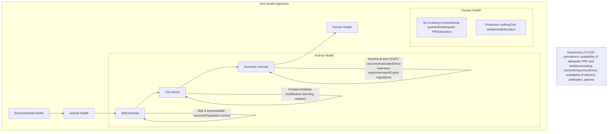

*PUBLIC HEALTH BULLETIN-PAKISTAN* Vol. 3 | Week 43
**07th Oct 2023**

# Integrated Disease Surveillance & Response (IDSR) Report

Center of Disease Control

National Institute of Health, Islamabad PAKISTAN

http://www.phb.nih.org.pk/

Integrated Disease Surveillance & Response (IDSR) Weekly Public Health Bulletin is your go-to resource for disease trends, outbreak alerts, and crucial public health information. By reading and sharing this bulletin, you can help increase awareness and promote preventive measures within your community.

One Health One World illustration featuring a world map composed of various animal silhouettes

One Health is an integrated, unifying approach that aims to sustainably balance and optimize the health of people, animals and ecosystems.

National Institute of Health Pakistan logo UK Health Security Agency logo World Health Organization logo USAID logo safetynet logo

---

Public Health Bulletin - Pakistan.

Public Health Bulletin Pakistan logo

NIH Pakistan logo

Government of Pakistan logo

*Overview*

*IDSR Reports*

*Ongoing Events*

*Field Reports*

**Public Health Bulletin - Pakistan, Week 43, 2023**

This bulletin highlights the most notable public health events in Pakistan during Week 43 of 2023.

Acute Diarrhea (Non-Cholera) was the most frequently reported disease during Week 43, followed by Malaria, Influenza-like Illness (ILI), Acute Lower Respiratory Infection in children under 5 (ALRI <5 years), Viral Hepatitis (B&D), Bloody Diarrhea, Severe Acute Respiratory Infection (SARI), dog bite, and Acute Watery Diarrhea (AWD) (A&E).

Foodborne and waterborne diseases continue to be reported from across the country. All causative agents, modes of spread, and risk factors are known. A multi-sectoral approach is needed to reduce the burden of these diseases.

It is important to note that all reported cases are suspected and require field investigation for verification.

This issue of the Public Health Bulletin also includes information on Role of vaccination in preventing seasonal Flu, Smog Health Emergency in Punjab, Health Week Activities of Rawalpindi and an educational awareness essay on CCHF.

The team reminds the public to stay vigilant and to seek medical attention promptly if they experience any symptoms of the diseases listed above.

Working together, we can safeguard the health of our communities.

Sincerely,
The Chief Editor

NIH logo

UK Health Security Agency

World Health Organization logo

USAID logo

safetynet logo

---

# Overview

* *During week 43, most frequent reported cases were of Acute Diarrhea (Non-Cholera) followed by Malaria, ILI, ALRI <5 years, B. Diarrhea, VH (B, C), Typhoid, SARI, dog bite and AVH (A&E).*

* *Acute Diarrhea (non- Cholera) cases continue to be reported in high numbers from all provinces and regions especially from Punjab, Sindh and KPK. All are suspected cases and need field verification.*

* *A rise in Typhoid cases observed this week which required urgent response through multisectoral coordination.*

## IDSR compliance attributes

* *The national compliance rate for IDSR reporting in 121 implemented districts is 75%*

* *Sindh and AJK are the top reporting region with a compliance rate of 91% and 88% followed by Khyber Pakhtunkhwa with 74%*

* *The lowest compliance rate was observed in Gilgit Baltistan.*

<table>
  <thead>
    <tr>
        <th>Region</th>
        <th>Expected Reports</th>
        <th>Received Reports</th>
        <th>Compliance (%)</th>
    </tr>
  </thead>
  <tbody>
    <tr>
        <td>Khyber Pakhtunkhwa</td>
<td>1865</td>
<td>1382</td>
<td>74</td>
    </tr>
<tr>
        <td>Azad Jammu Kashmir</td>
<td>377</td>
<td>333</td>
<td>88</td>
    </tr>
<tr>
        <td>Islamabad Capital Territory</td>
<td>27</td>
<td>16</td>
<td>59</td>
    </tr>
<tr>
        <td>Balochistan</td>
<td>1304</td>
<td>861</td>
<td>66</td>
    </tr>
<tr>
        <td>Gilgit Baltistan</td>
<td>479</td>
<td>129</td>
<td>27</td>
    </tr>
<tr>
        <td>Sindh</td>
<td>2038</td>
<td>1864</td>
<td>91</td>
    </tr>
<tr>
        <td>National</td>
<td>6090</td>
<td>4585</td>
<td>75</td>
    </tr>
  </tbody>
</table>

NIH logo

UK Health Security Agency logo

World Health Organization logo

USAID logo

safetynet logo

---

Pakistan

**Table 1: Province/Area wise distribution of most frequently reported cases during week 43, Pakistan.**

<table>
    <thead>
    <tr>
        <th>Diseases</th>
        <th>AJK</th>
        <th>Balochistan</th>
        <th>GB</th>
        <th>ICT</th>
        <th>KP</th>
        <th>Punjab</th>
        <th>Sindh</th>
        <th>Total</th>
    </tr>
    </thead>
    <tr>
        <td>AD (Non-Cholera)</td>
<td>1,154</td>
<td>6,550</td>
<td>349</td>
<td>54</td>
<td>18,422</td>
<td>83,404</td>
<td>41,549</td>
<td>151,482</td>
    </tr>
<tr>
        <td>Malaria</td>
<td>69</td>
<td>8,038</td>
<td>0</td>
<td>1</td>
<td>6,338</td>
<td>4,612</td>
<td>90,491</td>
<td>109,549</td>
    </tr>
<tr>
        <td>ILI</td>
<td>2,576</td>
<td>8,110</td>
<td>179</td>
<td>446</td>
<td>4,472</td>
<td>426</td>
<td>19,289</td>
<td>35,498</td>
    </tr>
<tr>
        <td>ALRI &lt; 5 years</td>
<td>1,142</td>
<td>2,313</td>
<td>259</td>
<td>0</td>
<td>1,800</td>
<td>44</td>
<td>13,577</td>
<td>19,135</td>
    </tr>
<tr>
        <td>B. Diarrhea</td>
<td>37</td>
<td>1,752</td>
<td>28</td>
<td>0</td>
<td>725</td>
<td>2,226</td>
<td>3,600</td>
<td>8,368</td>
    </tr>
<tr>
        <td>VH (B, C & D)</td>
<td>7</td>
<td>102</td>
<td>0</td>
<td>0</td>
<td>198</td>
<td>NR</td>
<td>7,168</td>
<td>7,475</td>
    </tr>
<tr>
        <td>Typhoid</td>
<td>27</td>
<td>868</td>
<td>21</td>
<td>0</td>
<td>691</td>
<td>4,405</td>
<td>1,375</td>
<td>7,387</td>
    </tr>
<tr>
        <td>SARI</td>
<td>305</td>
<td>1,073</td>
<td>265</td>
<td>0</td>
<td>802</td>
<td>NR</td>
<td>936</td>
<td>3,381</td>
    </tr>
<tr>
        <td>Dog Bite</td>
<td>37</td>
<td>199</td>
<td>0</td>
<td>0</td>
<td>127</td>
<td>NR</td>
<td>503</td>
<td>866</td>
    </tr>
<tr>
        <td>AVH (A & E)</td>
<td>37</td>
<td>36</td>
<td>3</td>
<td>0</td>
<td>328</td>
<td>NR</td>
<td>443</td>
<td>847</td>
    </tr>
<tr>
        <td>AWD (S. Cholera)</td>
<td>40</td>
<td>423</td>
<td>25</td>
<td>8</td>
<td>109</td>
<td>NR</td>
<td>77</td>
<td>682</td>
    </tr>
<tr>
        <td>Mumps</td>
<td>76</td>
<td>115</td>
<td>40</td>
<td>1</td>
<td>103</td>
<td>NR</td>
<td>329</td>
<td>664</td>
    </tr>
<tr>
        <td>CL</td>
<td>0</td>
<td>121</td>
<td>0</td>
<td>0</td>
<td>430</td>
<td>53</td>
<td>44</td>
<td>648</td>
    </tr>
<tr>
        <td>Measles</td>
<td>9</td>
<td>175</td>
<td>1</td>
<td>0</td>
<td>225</td>
<td>NR</td>
<td>91</td>
<td>501</td>
    </tr>
<tr>
        <td>Dengue</td>
<td>8</td>
<td>3</td>
<td>0</td>
<td>4</td>
<td>75</td>
<td>NR</td>
<td>335</td>
<td>425</td>
    </tr>
<tr>
        <td>Chickenpox/ Varicella</td>
<td>15</td>
<td>14</td>
<td>7</td>
<td>0</td>
<td>107</td>
<td>233</td>
<td>21</td>
<td>397</td>
    </tr>
<tr>
        <td>Pertussis</td>
<td>2</td>
<td>161</td>
<td>13</td>
<td>0</td>
<td>67</td>
<td>NR</td>
<td>13</td>
<td>256</td>
    </tr>
<tr>
        <td>Gonorrhea</td>
<td>0</td>
<td>119</td>
<td>1</td>
<td>0</td>
<td>17</td>
<td>NR</td>
<td>32</td>
<td>169</td>
    </tr>
<tr>
        <td>Rubella (CRS)</td>
<td>0</td>
<td>10</td>
<td>4</td>
<td>0</td>
<td>10</td>
<td>NR</td>
<td>36</td>
<td>60</td>
    </tr>
<tr>
        <td>Meningitis</td>
<td>2</td>
<td>12</td>
<td>8</td>
<td>0</td>
<td>7</td>
<td>NR</td>
<td>25</td>
<td>54</td>
    </tr>
<tr>
        <td>Syphilis</td>
<td>18</td>
<td>1</td>
<td>0</td>
<td>0</td>
<td>0</td>
<td>NR</td>
<td>35</td>
<td>54</td>
    </tr>
<tr>
        <td>AFP</td>
<td>2</td>
<td>4</td>
<td>0</td>
<td>0</td>
<td>32</td>
<td>NR</td>
<td>11</td>
<td>49</td>
    </tr>
<tr>
        <td>Anthrax</td>
<td>0</td>
<td>0</td>
<td>0</td>
<td>0</td>
<td>0</td>
<td>NR</td>
<td>0</td>
<td>0</td>
    </tr>
<tr>
        <td>HIV/AIDS</td>
<td>10</td>
<td>8</td>
<td>0</td>
<td>0</td>
<td>4</td>
<td>NR</td>
<td>10</td>
<td>32</td>
    </tr>
<tr>
        <td>NT</td>
<td>0</td>
<td>1</td>
<td>9</td>
<td>0</td>
<td>15</td>
<td>NR</td>
<td>0</td>
<td>25</td>
    </tr>
<tr>
        <td>Diphtheria (Probable)</td>
<td>0</td>
<td>10</td>
<td>0</td>
<td>0</td>
<td>12</td>
<td>NR</td>
<td>0</td>
<td>22</td>
    </tr>
<tr>
        <td>VL</td>
<td>0</td>
<td>6</td>
<td>0</td>
<td>0</td>
<td>1</td>
<td>NR</td>
<td>8</td>
<td>15</td>
    </tr>
<tr>
        <td>Brucellosis</td>
<td>0</td>
<td>3</td>
<td>0</td>
<td>0</td>
<td>1</td>
<td>NR</td>
<td>0</td>
<td>4</td>
    </tr>
<tr>
        <td>Chikungunya</td>
<td>0</td>
<td>0</td>
<td>0</td>
<td>0</td>
<td>0</td>
<td>NR</td>
<td>2</td>
<td>2</td>
    </tr>
<tr>
        <td>Leprosy</td>
<td>0</td>
<td>0</td>
<td>0</td>
<td>0</td>
<td>0</td>
<td>NR</td>
<td>0</td>
<td>0</td>
    </tr>
<tr>
        <td>CCHF</td>
<td>0</td>
<td>0</td>
<td>0</td>
<td>0</td>
<td>0</td>
<td>NR</td>
<td>0</td>
<td>0</td>
    </tr>
</table>

**Figure 1: Most frequently reported suspected cases during week 43, Pakistan**

<table>
  <thead>
    <tr>
        <th>Disease</th>
        <th>W41 2023</th>
        <th>W42 2023</th>
        <th>W43 2023</th>
    </tr>
  </thead>
  <tbody>
    <tr>
        <td>AD (Non-Cholera)</td>
<td>105000</td>
<td>150000</td>
<td>151482</td>
    </tr>
<tr>
        <td>Malaria</td>
<td>105000</td>
<td>108000</td>
<td>109549</td>
    </tr>
<tr>
        <td>ILI</td>
<td>32000</td>
<td>33000</td>
<td>35498</td>
    </tr>
<tr>
        <td>ALRI &lt; 5 years</td>
<td>18000</td>
<td>18000</td>
<td>19135</td>
    </tr>
<tr>
        <td>VH (B, C &amp; D)</td>
<td>8000</td>
<td>8000</td>
<td>8368</td>
    </tr>
<tr>
        <td>B. Diarrhea</td>
<td>7000</td>
<td>7000</td>
<td>7475</td>
    </tr>
<tr>
        <td>Typhoid</td>
<td>7000</td>
<td>7000</td>
<td>7387</td>
    </tr>
<tr>
        <td>SARI</td>
<td>3000</td>
<td>3000</td>
<td>3381</td>
    </tr>
<tr>
        <td>Dog BiTE</td>
<td>800</td>
<td>800</td>
<td>866</td>
    </tr>
<tr>
        <td>AWD (S. Cholera)</td>
<td>800</td>
<td>800</td>
<td>847</td>
    </tr>
  </tbody>
</table>

NIH logo

UK Health Security Agency logo

World Health Organization logo

USAID logo

safetynet logo

---

# Sindh
* Malaria cases were maximum followed by AD (Non-Cholera), ILI, ALRI<5 Years, VH (B, C ), B. Diarrhea, Typhoid, SARI, dog bite and AVH (A&E).
* SARI cases increased and reported in high numbers from Khairpur, Sanghar and Tharparkar. All are suspected cases and need verification.
* Except for malaria, ILI and AD cases showed an upward trend in cases.
* There is rise in cases of VH (B,C) reported in high numbers from Sanghar, Kambar and Matiari. Field investigation is required to identify the source to control the spread of disease.

Table 2: District wise distribution of most frequently reported suspected cases during week 43, Sindh

<table>
    <thead>
    <tr>
        <th>DISTRICTS</th>
        <th>Malaria</th>
        <th>AD 
(Non-
Cholera)</th>
        <th>ILI</th>
        <th>ALRI &lt; 
5 years</th>
        <th>VH (B, C & D)</th>
        <th>B. Diarrhea</th>
        <th>Typhoid</th>
        <th>SARI</th>
        <th>Dog Bite</th>
        <th>AVH (A & E)</th>
    </tr>
    </thead>
    <tr>
        <td>Badin</td>
<td>6,045</td>
<td>2,841</td>
<td>523</td>
<td>745</td>
<td>339</td>
<td>225</td>
<td>48</td>
<td>11</td>
<td>63</td>
<td>2</td>
    </tr>
<tr>
        <td>Dadu</td>
<td>5,795</td>
<td>2,913</td>
<td>362</td>
<td>1,543</td>
<td>0</td>
<td>452</td>
<td>145</td>
<td>40</td>
<td>0</td>
<td>12</td>
    </tr>
<tr>
        <td>Ghotki</td>
<td>1,861</td>
<td>816</td>
<td>0</td>
<td>631</td>
<td>382</td>
<td>126</td>
<td>0</td>
<td>0</td>
<td>0</td>
<td>0</td>
    </tr>
<tr>
        <td>Hyderabad</td>
<td>586</td>
<td>1,774</td>
<td>388</td>
<td>62</td>
<td>87</td>
<td>24</td>
<td>18</td>
<td>0</td>
<td>2</td>
<td>1</td>
    </tr>
<tr>
        <td>Jacobabad</td>
<td>3,225</td>
<td>1,147</td>
<td>230</td>
<td>1,238</td>
<td>205</td>
<td>150</td>
<td>21</td>
<td>22</td>
<td>56</td>
<td>0</td>
    </tr>
<tr>
        <td>Jamshoro</td>
<td>2,488</td>
<td>1,696</td>
<td>22</td>
<td>213</td>
<td>235</td>
<td>87</td>
<td>52</td>
<td>7</td>
<td>6</td>
<td>0</td>
    </tr>
<tr>
        <td>Kamber</td>
<td>7,547</td>
<td>2,112</td>
<td>0</td>
<td>835</td>
<td>732</td>
<td>237</td>
<td>21</td>
<td>26</td>
<td>0</td>
<td>0</td>
    </tr>
<tr>
        <td>Karachi Central</td>
<td>139</td>
<td>1,314</td>
<td>1,985</td>
<td>94</td>
<td>175</td>
<td>21</td>
<td>161</td>
<td>0</td>
<td>0</td>
<td>23</td>
    </tr>
<tr>
        <td>Karachi East</td>
<td>154</td>
<td>491</td>
<td>122</td>
<td>40</td>
<td>0</td>
<td>19</td>
<td>15</td>
<td>10</td>
<td>0</td>
<td>0</td>
    </tr>
<tr>
        <td>Karachi Keamari</td>
<td>7</td>
<td>328</td>
<td>102</td>
<td>50</td>
<td>0</td>
<td>0</td>
<td>5</td>
<td>0</td>
<td>0</td>
<td>2</td>
    </tr>
<tr>
        <td>Karachi Korangi</td>
<td>42</td>
<td>260</td>
<td>4</td>
<td>4</td>
<td>0</td>
<td>4</td>
<td>3</td>
<td>0</td>
<td>0</td>
<td>0</td>
    </tr>
<tr>
        <td>Karachi Malir</td>
<td>98</td>
<td>658</td>
<td>1,978</td>
<td>160</td>
<td>28</td>
<td>54</td>
<td>26</td>
<td>25</td>
<td>10</td>
<td>8</td>
    </tr>
<tr>
        <td>Karachi South</td>
<td>52</td>
<td>118</td>
<td>0</td>
<td>0</td>
<td>0</td>
<td>0</td>
<td>0</td>
<td>0</td>
<td>0</td>
<td>1</td>
    </tr>
<tr>
        <td>Karachi West</td>
<td>149</td>
<td>946</td>
<td>684</td>
<td>113</td>
<td>32</td>
<td>39</td>
<td>39</td>
<td>42</td>
<td>36</td>
<td>7</td>
    </tr>
<tr>
        <td>Kashmore</td>
<td>2,609</td>
<td>513</td>
<td>717</td>
<td>198</td>
<td>102</td>
<td>69</td>
<td>11</td>
<td>0</td>
<td>0</td>
<td>0</td>
    </tr>
<tr>
        <td>Khairpur</td>
<td>7,654</td>
<td>2,904</td>
<td>1,074</td>
<td>1,211</td>
<td>370</td>
<td>364</td>
<td>210</td>
<td>386</td>
<td>7</td>
<td>1</td>
    </tr>
<tr>
        <td>Larkana</td>
<td>11,743</td>
<td>2,181</td>
<td>7</td>
<td>575</td>
<td>174</td>
<td>437</td>
<td>7</td>
<td>0</td>
<td>0</td>
<td>1</td>
    </tr>
<tr>
        <td>Matiari</td>
<td>2,239</td>
<td>1,443</td>
<td>13</td>
<td>569</td>
<td>696</td>
<td>69</td>
<td>7</td>
<td>1</td>
<td>33</td>
<td>6</td>
    </tr>
<tr>
        <td>Mirpurkhas</td>
<td>5,075</td>
<td>2,147</td>
<td>4,587</td>
<td>591</td>
<td>146</td>
<td>80</td>
<td>18</td>
<td>0</td>
<td>26</td>
<td>6</td>
    </tr>
<tr>
        <td>Naushero Feroze</td>
<td>1,562</td>
<td>1,171</td>
<td>589</td>
<td>142</td>
<td>113</td>
<td>93</td>
<td>68</td>
<td>0</td>
<td>97</td>
<td>0</td>
    </tr>
<tr>
        <td>Sanghar</td>
<td>3,775</td>
<td>1,826</td>
<td>114</td>
<td>782</td>
<td>1,088</td>
<td>104</td>
<td>95</td>
<td>278</td>
<td>0</td>
<td>6</td>
    </tr>
<tr>
        <td>Shaheed 
Benazirabad</td>
<td>2,106</td>
<td>2,084</td>
<td>0</td>
<td>480</td>
<td>222</td>
<td>81</td>
<td>220</td>
<td>4</td>
<td>3</td>
<td>0</td>
    </tr>
<tr>
        <td>Shikarpur</td>
<td>3,940</td>
<td>1,131</td>
<td>2</td>
<td>278</td>
<td>319</td>
<td>100</td>
<td>4</td>
<td>8</td>
<td>110</td>
<td>0</td>
    </tr>
<tr>
        <td>Sujawal</td>
<td>1,900</td>
<td>584</td>
<td>13</td>
<td>29</td>
<td>59</td>
<td>36</td>
<td>20</td>
<td>1</td>
<td>1</td>
<td>51</td>
    </tr>
<tr>
        <td>Sukkur</td>
<td>5,357</td>
<td>1,655</td>
<td>1,851</td>
<td>559</td>
<td>289</td>
<td>214</td>
<td>5</td>
<td>0</td>
<td>0</td>
<td>0</td>
    </tr>
<tr>
        <td>Tando Allahyar</td>
<td>1,724</td>
<td>766</td>
<td>388</td>
<td>354</td>
<td>556</td>
<td>123</td>
<td>10</td>
<td>0</td>
<td>5</td>
<td>4</td>
    </tr>
<tr>
        <td>Tando 
Muhammad Khan</td>
<td>2,061</td>
<td>1,271</td>
<td>0</td>
<td>275</td>
<td>109</td>
<td>97</td>
<td>6</td>
<td>0</td>
<td>2</td>
<td>0</td>
    </tr>
<tr>
        <td>Tharparkar</td>
<td>4,789</td>
<td>1,776</td>
<td>2,462</td>
<td>1,149</td>
<td>291</td>
<td>122</td>
<td>83</td>
<td>60</td>
<td>1</td>
<td>26</td>
    </tr>
<tr>
        <td>Thatta</td>
<td>3,273</td>
<td>1,512</td>
<td>1,072</td>
<td>289</td>
<td>175</td>
<td>106</td>
<td>18</td>
<td>15</td>
<td>45</td>
<td>285</td>
    </tr>
<tr>
        <td>Umerkot</td>
<td>2,496</td>
<td>1,171</td>
<td>0</td>
<td>368</td>
<td>244</td>
<td>67</td>
<td>39</td>
<td>0</td>
<td>0</td>
<td>1</td>
    </tr>
<tr>
        <td>Total</td>
<td>90,491</td>
<td>41,549</td>
<td>19,289</td>
<td>13,577</td>
<td>7,168</td>
<td>3,600</td>
<td>1,375</td>
<td>936</td>
<td>503</td>
<td>443</td>
    </tr>
</table>

Figure 2: Most frequently reported suspected cases during week 43, Sindh

<table>
  <thead>
    <tr>
        <th>Week</th>
        <th>Malaria</th>
        <th>AD (Non-Cholera)</th>
        <th>ILI</th>
        <th>ALRI &lt; 5 years</th>
        <th>VH (B, C &amp; D)</th>
        <th>B. Diarrhea</th>
        <th>Typhoid</th>
        <th>SARI</th>
        <th>Dog Bite</th>
        <th>AVH (A &amp; E)</th>
    </tr>
  </thead>
  <tbody>
    <tr>
        <td>W41</td>
<td>88000</td>
<td>42000</td>
<td>16000</td>
<td>12000</td>
<td>6000</td>
<td>3000</td>
<td>1200</td>
<td>800</td>
<td>400</td>
<td>300</td>
    </tr>
<tr>
        <td>W42</td>
<td>92000</td>
<td>43000</td>
<td>18500</td>
<td>13000</td>
<td>6500</td>
<td>3200</td>
<td>1300</td>
<td>900</td>
<td>450</td>
<td>400</td>
    </tr>
<tr>
        <td>W43</td>
<td>90491</td>
<td>41549</td>
<td>19289</td>
<td>13577</td>
<td>7168</td>
<td>3600</td>
<td>1375</td>
<td>936</td>
<td>503</td>
<td>443</td>
    </tr>
  </tbody>
</table>

NIH logo

UK Health Security Agency logo

World Health Organization logo

USAID logo

safetynet logo

---

# Balochistan

* ILI, Malaria, AD (Non-Cholera), ALRI <5 years, B. Diarrhea, SARI, Typhoid, AWD (S. Cholera), dog bite and Measles were the most frequently reported diseases from Balochistan province.
* Trend for AD and Malaria showed downward trend in cases this week whereas ILI showed an upward trend.
* Quetta, Kech, Gwadar reported ILI cases in high numbers.
* One hundred and thirty-four cases of Measles reported from Chaman this week. An urgent field response is required to verification and clustering of cases if any.

Table 3: District wise distribution of most frequently reported suspected cases during week 43, Balochistan

<table>
  <thead>
    <tr>
      <th>Districts</th>
      <th>ILI</th>
      <th>Malaria</th>
      <th>AD Non-
Cholera)</th>
      <th>ALRI &lt; 5 
years</th>
      <th>B. 
Diarrhea</th>
      <th>SARI</th>
      <th>Typhoid</th>
      <th>AWD 
(S.Cholera)</th>
      <th>Dog Bite</th>
      <th>Measles</th>
    </tr>
  </thead>
  <tbody>
    <tr>
      <td>Barkhan</td>
<td>115</td>
<td>190</td>
<td>102</td>
<td>93</td>
<td>34</td>
<td>23</td>
<td>76</td>
<td>40</td>
<td>10</td>
<td>0</td>
    </tr>
<tr>
      <td>Chagai</td>
<td>279</td>
<td>6</td>
<td>212</td>
<td>0</td>
<td>61</td>
<td>1</td>
<td>26</td>
<td>8</td>
<td>4</td>
<td>0</td>
    </tr>
<tr>
      <td>Chaman</td>
<td>293</td>
<td>103</td>
<td>159</td>
<td>2</td>
<td>123</td>
<td>28</td>
<td>80</td>
<td>64</td>
<td>0</td>
<td>134</td>
    </tr>
<tr>
      <td>Dera Bugti</td>
<td>50</td>
<td>422</td>
<td>76</td>
<td>72</td>
<td>62</td>
<td>44</td>
<td>38</td>
<td>10</td>
<td>1</td>
<td>0</td>
    </tr>
<tr>
      <td>Duki</td>
<td>93</td>
<td>92</td>
<td>109</td>
<td>26</td>
<td>96</td>
<td>97</td>
<td>21</td>
<td>43</td>
<td>0</td>
<td>0</td>
    </tr>
<tr>
      <td>Gwadar</td>
<td>661</td>
<td>91</td>
<td>186</td>
<td>NR</td>
<td>39</td>
<td>NR</td>
<td>3</td>
<td>NR</td>
<td>NR</td>
<td>NR</td>
    </tr>
<tr>
      <td>Harnai</td>
<td>15</td>
<td>117</td>
<td>106</td>
<td>211</td>
<td>112</td>
<td>0</td>
<td>3</td>
<td>12</td>
<td>3</td>
<td>0</td>
    </tr>
<tr>
      <td>Hub</td>
<td>183</td>
<td>319</td>
<td>262</td>
<td>8</td>
<td>44</td>
<td>77</td>
<td>12</td>
<td>9</td>
<td>116</td>
<td>1</td>
    </tr>
<tr>
      <td>Jaffarabad</td>
<td>150</td>
<td>1,745</td>
<td>507</td>
<td>19</td>
<td>69</td>
<td>25</td>
<td>4</td>
<td>0</td>
<td>15</td>
<td>0</td>
    </tr>
<tr>
      <td>Jhal Magsi</td>
<td>200</td>
<td>479</td>
<td>348</td>
<td>52</td>
<td>25</td>
<td>4</td>
<td>1</td>
<td>4</td>
<td>5</td>
<td>2</td>
    </tr>
<tr>
      <td>Kachhi (Bolan)</td>
<td>283</td>
<td>332</td>
<td>352</td>
<td>2</td>
<td>0</td>
<td>0</td>
<td>0</td>
<td>0</td>
<td>0</td>
<td>0</td>
    </tr>
<tr>
      <td>Kalat</td>
<td>27</td>
<td>62</td>
<td>89</td>
<td>14</td>
<td>25</td>
<td>1</td>
<td>56</td>
<td>0</td>
<td>0</td>
<td>1</td>
    </tr>
<tr>
      <td>Kech (Turbat)</td>
<td>643</td>
<td>172</td>
<td>214</td>
<td>89</td>
<td>8</td>
<td>NR</td>
<td>NR</td>
<td>NR</td>
<td>1</td>
<td>8</td>
    </tr>
<tr>
      <td>Kharan</td>
<td>273</td>
<td>65</td>
<td>130</td>
<td>1</td>
<td>61</td>
<td>2</td>
<td>8</td>
<td>1</td>
<td>0</td>
<td>9</td>
    </tr>
<tr>
      <td>Khuzdar</td>
<td>163</td>
<td>126</td>
<td>144</td>
<td>4</td>
<td>32</td>
<td>3</td>
<td>14</td>
<td>0</td>
<td>0</td>
<td>0</td>
    </tr>
<tr>
      <td>Killa Saifullah</td>
<td>3</td>
<td>434</td>
<td>169</td>
<td>149</td>
<td>85</td>
<td>23</td>
<td>30</td>
<td>1</td>
<td>0</td>
<td>0</td>
    </tr>
<tr>
      <td>Kohlu</td>
<td>566</td>
<td>272</td>
<td>226</td>
<td>67</td>
<td>162</td>
<td>176</td>
<td>78</td>
<td>33</td>
<td>1</td>
<td>0</td>
    </tr>
<tr>
      <td>Lasbella</td>
<td>55</td>
<td>689</td>
<td>577</td>
<td>620</td>
<td>11</td>
<td>37</td>
<td>13</td>
<td>0</td>
<td>8</td>
<td>0</td>
    </tr>
<tr>
      <td>Loralai</td>
<td>333</td>
<td>68</td>
<td>183</td>
<td>65</td>
<td>70</td>
<td>132</td>
<td>44</td>
<td>1</td>
<td>0</td>
<td>0</td>
    </tr>
<tr>
      <td>Mastung</td>
<td>232</td>
<td>73</td>
<td>245</td>
<td>18</td>
<td>75</td>
<td>103</td>
<td>62</td>
<td>32</td>
<td>8</td>
<td>0</td>
    </tr>
<tr>
      <td>MusaKhel</td>
<td>30</td>
<td>73</td>
<td>32</td>
<td>17</td>
<td>10</td>
<td>6</td>
<td>12</td>
<td>5</td>
<td>2</td>
<td>3</td>
    </tr>
<tr>
      <td>Nushki</td>
<td>11</td>
<td>39</td>
<td>192</td>
<td>0</td>
<td>78</td>
<td>8</td>
<td>0</td>
<td>5</td>
<td>0</td>
<td>0</td>
    </tr>
<tr>
      <td>Panjgur</td>
<td>55</td>
<td>166</td>
<td>123</td>
<td>4</td>
<td>26</td>
<td>12</td>
<td>52</td>
<td>31</td>
<td>0</td>
<td>0</td>
    </tr>
<tr>
      <td>Pishin</td>
<td>66</td>
<td>1</td>
<td>53</td>
<td>7</td>
<td>28</td>
<td>0</td>
<td>7</td>
<td>0</td>
<td>2</td>
<td>0</td>
    </tr>
<tr>
      <td>Quetta</td>
<td>1,311</td>
<td>34</td>
<td>385</td>
<td>40</td>
<td>51</td>
<td>12</td>
<td>34</td>
<td>2</td>
<td>0</td>
<td>15</td>
    </tr>
<tr>
      <td>Sherani</td>
<td>71</td>
<td>17</td>
<td>36</td>
<td>5</td>
<td>16</td>
<td>37</td>
<td>3</td>
<td>8</td>
<td>0</td>
<td>0</td>
    </tr>
<tr>
      <td>Sibi</td>
<td>897</td>
<td>618</td>
<td>371</td>
<td>101</td>
<td>73</td>
<td>53</td>
<td>67</td>
<td>72</td>
<td>2</td>
<td>0</td>
    </tr>
<tr>
      <td>Surab</td>
<td>89</td>
<td>44</td>
<td>34</td>
<td>13</td>
<td>21</td>
<td>1</td>
<td>17</td>
<td>9</td>
<td>0</td>
<td>0</td>
    </tr>
<tr>
      <td>Usta Muhammad</td>
<td>246</td>
<td>831</td>
<td>481</td>
<td>171</td>
<td>73</td>
<td>25</td>
<td>12</td>
<td>0</td>
<td>2</td>
<td>0</td>
    </tr>
<tr>
      <td>Washuk</td>
<td>310</td>
<td>89</td>
<td>189</td>
<td>2</td>
<td>71</td>
<td>32</td>
<td>10</td>
<td>0</td>
<td>0</td>
<td>0</td>
    </tr>
<tr>
      <td>Zhob</td>
<td>152</td>
<td>220</td>
<td>160</td>
<td>390</td>
<td>56</td>
<td>74</td>
<td>63</td>
<td>10</td>
<td>0</td>
<td>1</td>
    </tr>
<tr>
      <td>Ziarat</td>
<td>255</td>
<td>49</td>
<td>98</td>
<td>51</td>
<td>55</td>
<td>37</td>
<td>22</td>
<td>23</td>
<td>19</td>
<td>1</td>
    </tr>
<tr>
      <td>Total</td>
<td>8110</td>
<td>8038</td>
<td>6550</td>
<td>2313</td>
<td>1752</td>
<td>1073</td>
<td>868</td>
<td>423</td>
<td>199</td>
<td>175</td>
    </tr>
  </tbody>
</table>

Figure 3: Most frequently reported suspected cases during week 43, Balochistan

<table>
  <thead>
    <tr>
        <th>Disease</th>
        <th>W41</th>
        <th>W42</th>
        <th>W43</th>
    </tr>
  </thead>
  <tbody>
    <tr>
        <td>ILI</td>
<td>7800</td>
<td>8800</td>
<td>8110</td>
    </tr>
<tr>
        <td>Malaria</td>
<td>10200</td>
<td>9500</td>
<td>8038</td>
    </tr>
<tr>
        <td>AD (Non-Cholera)</td>
<td>7500</td>
<td>8200</td>
<td>6550</td>
    </tr>
<tr>
        <td>ALRI &lt; 5 years</td>
<td>2800</td>
<td>3500</td>
<td>2313</td>
    </tr>
<tr>
        <td>B. Diarrhea</td>
<td>2200</td>
<td>2100</td>
<td>1752</td>
    </tr>
<tr>
        <td>SARI</td>
<td>1200</td>
<td>1000</td>
<td>1073</td>
    </tr>
<tr>
        <td>Typhoid</td>
<td>1100</td>
<td>1000</td>
<td>868</td>
    </tr>
<tr>
        <td>AWD (S. Cholera)</td>
<td>600</td>
<td>600</td>
<td>423</td>
    </tr>
<tr>
        <td>Dog Bite</td>
<td>200</td>
<td>200</td>
<td>199</td>
    </tr>
<tr>
        <td>Measles</td>
<td>100</td>
<td>100</td>
<td>175</td>
    </tr>
  </tbody>
</table>

NIH logo

UK Health Security Agency logo

World Health Organization logo

USAID logo

safetynet logo

---

# Khyber Pakhtunkhwa
* Cases of AD (Non-Cholera) were maximum followed by Malaria, ILI, ALRI<5 Years, SARI, B. Diarrhea, Typhoid, CL, AVH (A&E) and Measles cases. Trends for Malaria, AD and ILI cases remained same this week.

* Measles cases were reported from Dir Lower, SWA and Khyber.

* Acute Diarrhea cases continue to be reported in high numbers from many districts across the province namely Swat, Peshawar, Nowshera, D.I.Khan and Haripur. Health education and public health intervention are required to control the spread of disease.

* Malaria and AD cases show decline in trend.
* Measles cases reported from Peshawar and Dir Lower with case clustering within health facilities. These are suspected cases and a field investigation is required to verify cases to prevent further spread of disease.

**Table 4: District wise distribution of most frequently reported suspected cases during week 43, KP**

<table>
    <thead>
    <tr>
        <th>Districts</th>
        <th>AD 
(Non-
Cholera)</th>
        <th>Malaria</th>
        <th>ILI</th>
        <th>ALRI &lt;5 Years</th>
        <th>SARI</th>
        <th>B. Diarrhea</th>
        <th>Typhoid</th>
        <th>CL</th>
        <th>AVH (A & 
E)</th>
        <th>Measles</th>
    </tr>
    </thead>
    <tr>
        <td>Abbottabad</td>
<td>427</td>
<td>4</td>
<td>33</td>
<td>21</td>
<td>27</td>
<td>0</td>
<td>10</td>
<td>0</td>
<td>0</td>
<td>0</td>
    </tr>
<tr>
        <td>Bajaur</td>
<td>174</td>
<td>99</td>
<td>5</td>
<td>18</td>
<td>5</td>
<td>29</td>
<td>0</td>
<td>0</td>
<td>0</td>
<td>1</td>
    </tr>
<tr>
        <td>Bannu</td>
<td>769</td>
<td>1,305</td>
<td>42</td>
<td>5</td>
<td>0</td>
<td>4</td>
<td>58</td>
<td>0</td>
<td>1</td>
<td>3</td>
    </tr>
<tr>
        <td>Buner</td>
<td>315</td>
<td>361</td>
<td>0</td>
<td>55</td>
<td>0</td>
<td>0</td>
<td>9</td>
<td>0</td>
<td>0</td>
<td>3</td>
    </tr>
<tr>
        <td>Charsadda</td>
<td>920</td>
<td>349</td>
<td>269</td>
<td>57</td>
<td>63</td>
<td>36</td>
<td>10</td>
<td>34</td>
<td>0</td>
<td>2</td>
    </tr>
<tr>
        <td>Chitral Lower</td>
<td>216</td>
<td>23</td>
<td>113</td>
<td>37</td>
<td>32</td>
<td>20</td>
<td>7</td>
<td>15</td>
<td>8</td>
<td>1</td>
    </tr>
<tr>
        <td>Chitral Upper</td>
<td>105</td>
<td>4</td>
<td>13</td>
<td>13</td>
<td>21</td>
<td>7</td>
<td>27</td>
<td>0</td>
<td>1</td>
<td>0</td>
    </tr>
<tr>
        <td>D.I. Khan</td>
<td>1,023</td>
<td>603</td>
<td>8</td>
<td>4</td>
<td>41</td>
<td>14</td>
<td>2</td>
<td>1</td>
<td>0</td>
<td>1</td>
    </tr>
<tr>
        <td>Dir Lower</td>
<td>960</td>
<td>537</td>
<td>11</td>
<td>199</td>
<td>45</td>
<td>127</td>
<td>50</td>
<td>5</td>
<td>181</td>
<td>27</td>
    </tr>
<tr>
        <td>Dir Upper</td>
<td>618</td>
<td>19</td>
<td>34</td>
<td>35</td>
<td>6</td>
<td>12</td>
<td>28</td>
<td>6</td>
<td>5</td>
<td>19</td>
    </tr>
<tr>
        <td>Hangu</td>
<td>233</td>
<td>473</td>
<td>154</td>
<td>8</td>
<td>60</td>
<td>21</td>
<td>16</td>
<td>28</td>
<td>5</td>
<td>0</td>
    </tr>
<tr>
        <td>Haripur</td>
<td>1,093</td>
<td>43</td>
<td>903</td>
<td>379</td>
<td>40</td>
<td>14</td>
<td>59</td>
<td>0</td>
<td>11</td>
<td>2</td>
    </tr>
<tr>
        <td>Karak</td>
<td>230</td>
<td>239</td>
<td>103</td>
<td>10</td>
<td>0</td>
<td>7</td>
<td>4</td>
<td>47</td>
<td>0</td>
<td>11</td>
    </tr>
<tr>
        <td>Khyber</td>
<td>93</td>
<td>308</td>
<td>65</td>
<td>0</td>
<td>5</td>
<td>34</td>
<td>9</td>
<td>25</td>
<td>2</td>
<td>30</td>
    </tr>
<tr>
        <td>Kohat</td>
<td>72</td>
<td>38</td>
<td>2</td>
<td>1</td>
<td>0</td>
<td>0</td>
<td>0</td>
<td>2</td>
<td>0</td>
<td>0</td>
    </tr>
<tr>
        <td>Kohistan Lower</td>
<td>61</td>
<td>10</td>
<td>2</td>
<td>7</td>
<td>1</td>
<td>16</td>
<td>0</td>
<td>0</td>
<td>0</td>
<td>5</td>
    </tr>
<tr>
        <td>Kohistan Upper</td>
<td>243</td>
<td>23</td>
<td>34</td>
<td>4</td>
<td>12</td>
<td>12</td>
<td>43</td>
<td>0</td>
<td>0</td>
<td>5</td>
    </tr>
<tr>
        <td>Kolai Palas</td>
<td>60</td>
<td>10</td>
<td>0</td>
<td>2</td>
<td>0</td>
<td>8</td>
<td>0</td>
<td>0</td>
<td>0</td>
<td>0</td>
    </tr>
<tr>
        <td>L & C Kurram</td>
<td>5</td>
<td>6</td>
<td>0</td>
<td>0</td>
<td>0</td>
<td>2</td>
<td>1</td>
<td>0</td>
<td>0</td>
<td>1</td>
    </tr>
<tr>
        <td>Lakki Marwat</td>
<td>411</td>
<td>363</td>
<td>0</td>
<td>84</td>
<td>0</td>
<td>10</td>
<td>9</td>
<td>14</td>
<td>0</td>
<td>1</td>
    </tr>
<tr>
        <td>Malakand</td>
<td>549</td>
<td>53</td>
<td>0</td>
<td>63</td>
<td>3</td>
<td>44</td>
<td>29</td>
<td>22</td>
<td>28</td>
<td>12</td>
    </tr>
<tr>
        <td>Mansehra</td>
<td>487</td>
<td>14</td>
<td>631</td>
<td>36</td>
<td>85</td>
<td>7</td>
<td>4</td>
<td>0</td>
<td>0</td>
<td>7</td>
    </tr>
<tr>
        <td>Mardan</td>
<td>764</td>
<td>67</td>
<td>66</td>
<td>212</td>
<td>0</td>
<td>28</td>
<td>0</td>
<td>6</td>
<td>13</td>
<td>0</td>
    </tr>
<tr>
        <td>Mohmand</td>
<td>138</td>
<td>227</td>
<td>41</td>
<td>5</td>
<td>3</td>
<td>11</td>
<td>12</td>
<td>83</td>
<td>0</td>
<td>0</td>
    </tr>
<tr>
        <td>Nowshera</td>
<td>1,732</td>
<td>75</td>
<td>27</td>
<td>1</td>
<td>28</td>
<td>24</td>
<td>9</td>
<td>18</td>
<td>0</td>
<td>0</td>
    </tr>
<tr>
        <td>Peshawar</td>
<td>2,632</td>
<td>96</td>
<td>784</td>
<td>162</td>
<td>145</td>
<td>123</td>
<td>104</td>
<td>23</td>
<td>28</td>
<td>26</td>
    </tr>
<tr>
        <td>SD Bannu</td>
<td>3</td>
<td>5</td>
<td>2</td>
<td>1</td>
<td>0</td>
<td>5</td>
<td>0</td>
<td>0</td>
<td>3</td>
<td>2</td>
    </tr>
<tr>
        <td>SD Lakki</td>
<td>3</td>
<td>5</td>
<td>0</td>
<td>0</td>
<td>0</td>
<td>0</td>
<td>0</td>
<td>0</td>
<td>0</td>
<td>0</td>
    </tr>
<tr>
        <td>Shangla</td>
<td>318</td>
<td>129</td>
<td>0</td>
<td>3</td>
<td>3</td>
<td>1</td>
<td>56</td>
<td>4</td>
<td>0</td>
<td>8</td>
    </tr>
<tr>
        <td>SWA</td>
<td>107</td>
<td>138</td>
<td>99</td>
<td>48</td>
<td>68</td>
<td>49</td>
<td>47</td>
<td>69</td>
<td>6</td>
<td>31</td>
    </tr>
<tr>
        <td>Swabi</td>
<td>1,112</td>
<td>89</td>
<td>602</td>
<td>250</td>
<td>77</td>
<td>14</td>
<td>24</td>
<td>0</td>
<td>15</td>
<td>13</td>
    </tr>
<tr>
        <td>Swat</td>
<td>2,194</td>
<td>67</td>
<td>399</td>
<td>61</td>
<td>0</td>
<td>26</td>
<td>0</td>
<td>0</td>
<td>19</td>
<td>14</td>
    </tr>
<tr>
        <td>Tank</td>
<td>298</td>
<td>439</td>
<td>0</td>
<td>8</td>
<td>0</td>
<td>3</td>
<td>55</td>
<td>21</td>
<td>0</td>
<td>0</td>
    </tr>
<tr>
        <td>Tor Ghar</td>
<td>48</td>
<td>117</td>
<td>0</td>
<td>11</td>
<td>31</td>
<td>15</td>
<td>8</td>
<td>7</td>
<td>2</td>
<td>0</td>
    </tr>
<tr>
        <td>Upper Kurram</td>
<td>9</td>
<td>0</td>
<td>30</td>
<td>0</td>
<td>1</td>
<td>2</td>
<td>1</td>
<td>0</td>
<td>0</td>
<td>0</td>
    </tr>
<tr>
        <td>Total</td>
<td>18,422</td>
<td>6,338</td>
<td>4,472</td>
<td>1,800</td>
<td>802</td>
<td>725</td>
<td>691</td>
<td>430</td>
<td>328</td>
<td>225</td>
    </tr>
</table>

**Figure 4: Most frequently reported suspected cases during week 43, KP**

<table>
  <thead>
    <tr>
        <th>Disease</th>
        <th>W41</th>
        <th>W42</th>
        <th>W43</th>
    </tr>
  </thead>
  <tbody>
    <tr>
        <td>AD (Non-Cholera)</td>
<td>19,500</td>
<td>18,000</td>
<td>18,422</td>
    </tr>
<tr>
        <td>Malaria</td>
<td>6,500</td>
<td>6,500</td>
<td>6,338</td>
    </tr>
<tr>
        <td>ILI</td>
<td>5,500</td>
<td>4,800</td>
<td>4,472</td>
    </tr>
<tr>
        <td>ALRI &lt; 5 years</td>
<td>2,200</td>
<td>2,000</td>
<td>1,800</td>
    </tr>
<tr>
        <td>SARI</td>
<td>1,000</td>
<td>900</td>
<td>802</td>
    </tr>
<tr>
        <td>B. Diarrhea</td>
<td>800</td>
<td>750</td>
<td>725</td>
    </tr>
<tr>
        <td>Typhoid</td>
<td>750</td>
<td>700</td>
<td>691</td>
    </tr>
<tr>
        <td>CL</td>
<td>500</td>
<td>450</td>
<td>430</td>
    </tr>
<tr>
        <td>AVH (A &amp; E)</td>
<td>400</td>
<td>350</td>
<td>328</td>
    </tr>
<tr>
        <td>Measles</td>
<td>300</td>
<td>250</td>
<td>225</td>
    </tr>
  </tbody>
</table>

NIH logo

UK Health Security Agency logo

World Health Organization logo

USAID logo

safetynet logo

---

## ICT, AJK & GB

**ICT**: The most frequently reported cases from Islamabad were ILI followed by AD (Non-Cholera) and AWD. ILI cases showed a decreasing trend in cases this week.

**AJK**: ILI cases were maximum followed by ALRI <5 years, AD (Non-Cholera), SARI, Mumps, Malaria, AWD (S. Cholera), B. Diarrhea and dog bite Trend for ILI cases and ALRI <5 years remained same cases this week.

**GB**: AD (Non. Cholera) cases were the most frequently reported diseases followed by ALRI<5 years, SARI, ILI, Mumps. Diarrhea, AWD and Typhoid. Trend for AD cases showed decline this week.

Figure 6: Week wise reported suspected cases of ILI, ICT

<table>
  <thead>
    <tr>
        <th>Disease</th>
        <th>WK41</th>
        <th>WK42</th>
        <th>WK43</th>
    </tr>
  </thead>
  <tbody>
    <tr>
        <td>ILI</td>
<td>2250</td>
<td>2100</td>
<td>446</td>
    </tr>
<tr>
        <td>AD (Non-Cholera)</td>
<td>350</td>
<td>380</td>
<td>54</td>
    </tr>
<tr>
        <td>AWD (S. Cholera)</td>
<td>10</td>
<td>10</td>
<td>8</td>
    </tr>
  </tbody>
</table>

Figure 6: Week wise reported suspected cases of ILI, ICT

<table>
  <thead>
    <tr>
        <th>Week</th>
        <th>ILI Cases</th>
    </tr>
  </thead>
  <tbody>
    <tr>
        <td>W44</td>
<td>1850</td>
    </tr>
<tr>
        <td>W45</td>
<td>1750</td>
    </tr>
<tr>
        <td>W46</td>
<td>1600</td>
    </tr>
<tr>
        <td>W47</td>
<td>2450</td>
    </tr>
<tr>
        <td>W48</td>
<td>2350</td>
    </tr>
<tr>
        <td>W49</td>
<td>2550</td>
    </tr>
<tr>
        <td>W50</td>
<td>3200</td>
    </tr>
<tr>
        <td>W51</td>
<td>2450</td>
    </tr>
<tr>
        <td>W52</td>
<td>2200</td>
    </tr>
<tr>
        <td>W1</td>
<td>2050</td>
    </tr>
<tr>
        <td>W2</td>
<td>1650</td>
    </tr>
<tr>
        <td>W3</td>
<td>2000</td>
    </tr>
<tr>
        <td>W4</td>
<td>1950</td>
    </tr>
<tr>
        <td>W5</td>
<td>1850</td>
    </tr>
<tr>
        <td>W6</td>
<td>1650</td>
    </tr>
<tr>
        <td>W7</td>
<td>2350</td>
    </tr>
<tr>
        <td>W8</td>
<td>1650</td>
    </tr>
<tr>
        <td>W9</td>
<td>2250</td>
    </tr>
<tr>
        <td>W10</td>
<td>2100</td>
    </tr>
<tr>
        <td>W11</td>
<td>1700</td>
    </tr>
<tr>
        <td>W12</td>
<td>700</td>
    </tr>
<tr>
        <td>W13</td>
<td>1500</td>
    </tr>
<tr>
        <td>W14</td>
<td>1400</td>
    </tr>
<tr>
        <td>W15</td>
<td>1100</td>
    </tr>
<tr>
        <td>W16</td>
<td>700</td>
    </tr>
<tr>
        <td>W17</td>
<td>1150</td>
    </tr>
<tr>
        <td>W18</td>
<td>950</td>
    </tr>
<tr>
        <td>W19</td>
<td>1550</td>
    </tr>
<tr>
        <td>W20</td>
<td>800</td>
    </tr>
<tr>
        <td>W21</td>
<td>1200</td>
    </tr>
<tr>
        <td>W22</td>
<td>1150</td>
    </tr>
<tr>
        <td>W23</td>
<td>750</td>
    </tr>
<tr>
        <td>W24</td>
<td>1050</td>
    </tr>
<tr>
        <td>W25</td>
<td>900</td>
    </tr>
<tr>
        <td>W26</td>
<td>250</td>
    </tr>
<tr>
        <td>W27</td>
<td>700</td>
    </tr>
<tr>
        <td>W28</td>
<td>900</td>
    </tr>
<tr>
        <td>W29</td>
<td>500</td>
    </tr>
<tr>
        <td>W30</td>
<td>800</td>
    </tr>
<tr>
        <td>W31</td>
<td>1000</td>
    </tr>
<tr>
        <td>W32</td>
<td>1150</td>
    </tr>
<tr>
        <td>W33</td>
<td>1050</td>
    </tr>
<tr>
        <td>W34</td>
<td>1400</td>
    </tr>
<tr>
        <td>W35</td>
<td>1450</td>
    </tr>
<tr>
        <td>W36</td>
<td>1450</td>
    </tr>
<tr>
        <td>W37</td>
<td>1350</td>
    </tr>
<tr>
        <td>W38</td>
<td>1200</td>
    </tr>
<tr>
        <td>W39</td>
<td>2250</td>
    </tr>
<tr>
        <td>W40</td>
<td>2300</td>
    </tr>
<tr>
        <td>W41</td>
<td>2300</td>
    </tr>
<tr>
        <td>W42</td>
<td>2150</td>
    </tr>
<tr>
        <td>W43</td>
<td>446</td>
    </tr>
  </tbody>
</table>

Figure 7: Most frequently reported suspected cases during week 42, AJK

<table>
  <thead>
    <tr>
        <th>Disease</th>
        <th>WK 41</th>
        <th>WK 42</th>
        <th>WK 43</th>
    </tr>
  </thead>
  <tbody>
    <tr>
        <td>ILI</td>
<td>2950</td>
<td>2576</td>
<td>2600</td>
    </tr>
<tr>
        <td>ALRI &lt; 5 years</td>
<td>1100</td>
<td>1142</td>
<td>1100</td>
    </tr>
<tr>
        <td>AD (Non-Cholera)</td>
<td>1550</td>
<td>1154</td>
<td>1350</td>
    </tr>
<tr>
        <td>SARI</td>
<td>300</td>
<td>305</td>
<td>300</td>
    </tr>
<tr>
        <td>Mumps</td>
<td>50</td>
<td>76</td>
<td>50</td>
    </tr>
<tr>
        <td>Malaria</td>
<td>50</td>
<td>69</td>
<td>50</td>
    </tr>
<tr>
        <td>AWD (S. Cholera)</td>
<td>50</td>
<td>40</td>
<td>50</td>
    </tr>
<tr>
        <td>AVH (A &amp; E)</td>
<td>50</td>
<td>37</td>
<td>50</td>
    </tr>
<tr>
        <td>B. Diarrhea</td>
<td>50</td>
<td>37</td>
<td>50</td>
    </tr>
<tr>
        <td>Dog Bite</td>
<td>50</td>
<td>37</td>
<td>50</td>
    </tr>
  </tbody>
</table>

NIH Pakistan logo

UK Health Security Agency logo

World Health Organization logo

USAID logo

safetynet logo

---

Figure 8: Week wise reported suspected cases of AD (Non-Cholera) and ILI, AJK

<table>
  <thead>
    <tr>
        <th>Week</th>
        <th>ILI</th>
        <th>ALRI &lt; 5 years</th>
    </tr>
  </thead>
  <tbody>
    <tr>
        <td>W44</td>
<td>1000</td>
<td>550</td>
    </tr>
<tr>
        <td>W45</td>
<td>1000</td>
<td>500</td>
    </tr>
<tr>
        <td>W46</td>
<td>1100</td>
<td>500</td>
    </tr>
<tr>
        <td>W47</td>
<td>1700</td>
<td>700</td>
    </tr>
<tr>
        <td>W48</td>
<td>1350</td>
<td>650</td>
    </tr>
<tr>
        <td>W49</td>
<td>1250</td>
<td>450</td>
    </tr>
<tr>
        <td>W50</td>
<td>1700</td>
<td>650</td>
    </tr>
<tr>
        <td>W51</td>
<td>2600</td>
<td>1000</td>
    </tr>
<tr>
        <td>W52</td>
<td>2150</td>
<td>1200</td>
    </tr>
<tr>
        <td>W1</td>
<td>2250</td>
<td>950</td>
    </tr>
<tr>
        <td>W2</td>
<td>2050</td>
<td>1300</td>
    </tr>
<tr>
        <td>W3</td>
<td>1650</td>
<td>1100</td>
    </tr>
<tr>
        <td>W4</td>
<td>1700</td>
<td>1000</td>
    </tr>
<tr>
        <td>W5</td>
<td>1800</td>
<td>900</td>
    </tr>
<tr>
        <td>W6</td>
<td>1900</td>
<td>1000</td>
    </tr>
<tr>
        <td>W7</td>
<td>2400</td>
<td>1050</td>
    </tr>
<tr>
        <td>W8</td>
<td>2050</td>
<td>800</td>
    </tr>
<tr>
        <td>W9</td>
<td>1850</td>
<td>1050</td>
    </tr>
<tr>
        <td>W10</td>
<td>2250</td>
<td>1000</td>
    </tr>
<tr>
        <td>W11</td>
<td>2200</td>
<td>900</td>
    </tr>
<tr>
        <td>W12</td>
<td>2100</td>
<td>1000</td>
    </tr>
<tr>
        <td>W13</td>
<td>2350</td>
<td>1200</td>
    </tr>
<tr>
        <td>W14</td>
<td>2250</td>
<td>900</td>
    </tr>
<tr>
        <td>W15</td>
<td>2150</td>
<td>850</td>
    </tr>
<tr>
        <td>W16</td>
<td>1450</td>
<td>500</td>
    </tr>
<tr>
        <td>W17</td>
<td>1850</td>
<td>750</td>
    </tr>
<tr>
        <td>W18</td>
<td>2100</td>
<td>900</td>
    </tr>
<tr>
        <td>W19</td>
<td>2750</td>
<td>950</td>
    </tr>
<tr>
        <td>W20</td>
<td>2450</td>
<td>900</td>
    </tr>
<tr>
        <td>W21</td>
<td>2550</td>
<td>1000</td>
    </tr>
<tr>
        <td>W22</td>
<td>2600</td>
<td>1150</td>
    </tr>
<tr>
        <td>W23</td>
<td>2550</td>
<td>850</td>
    </tr>
<tr>
        <td>W24</td>
<td>2750</td>
<td>950</td>
    </tr>
<tr>
        <td>W25</td>
<td>2400</td>
<td>900</td>
    </tr>
<tr>
        <td>W26</td>
<td>1100</td>
<td>450</td>
    </tr>
<tr>
        <td>W27</td>
<td>2100</td>
<td>750</td>
    </tr>
<tr>
        <td>W28</td>
<td>2350</td>
<td>700</td>
    </tr>
<tr>
        <td>W29</td>
<td>2400</td>
<td>800</td>
    </tr>
<tr>
        <td>W30</td>
<td>2150</td>
<td>600</td>
    </tr>
<tr>
        <td>W31</td>
<td>2400</td>
<td>750</td>
    </tr>
<tr>
        <td>W32</td>
<td>2750</td>
<td>800</td>
    </tr>
<tr>
        <td>W33</td>
<td>2750</td>
<td>800</td>
    </tr>
<tr>
        <td>W34</td>
<td>2800</td>
<td>900</td>
    </tr>
<tr>
        <td>W35</td>
<td>2900</td>
<td>1000</td>
    </tr>
<tr>
        <td>W36</td>
<td>2850</td>
<td>900</td>
    </tr>
<tr>
        <td>W37</td>
<td>2850</td>
<td>1050</td>
    </tr>
<tr>
        <td>W38</td>
<td>2650</td>
<td>1000</td>
    </tr>
<tr>
        <td>W39</td>
<td>2750</td>
<td>1000</td>
    </tr>
<tr>
        <td>W40</td>
<td>2600</td>
<td>950</td>
    </tr>
<tr>
        <td>W41</td>
<td>2950</td>
<td>1100</td>
    </tr>
<tr>
        <td>W42</td>
<td>2700</td>
<td>1200</td>
    </tr>
<tr>
        <td>W43</td>
<td>2600</td>
<td>1150</td>
    </tr>
  </tbody>
</table>

Figure 9: Most frequent cases reported during WK 43, GB

<table>
  <thead>
    <tr>
        <th>Disease</th>
        <th>WK 41</th>
        <th>WK 42</th>
        <th>WK 43</th>
    </tr>
  </thead>
  <tbody>
    <tr>
        <td>AD (Non-Cholera)</td>
<td>680</td>
<td>530</td>
<td>349</td>
    </tr>
<tr>
        <td>SARI</td>
<td>250</td>
<td>245</td>
<td>265</td>
    </tr>
<tr>
        <td>ALRI &lt; 5 years</td>
<td>410</td>
<td>380</td>
<td>259</td>
    </tr>
<tr>
        <td>ILI</td>
<td>300</td>
<td>255</td>
<td>179</td>
    </tr>
<tr>
        <td>Mumps</td>
<td>50</td>
<td>60</td>
<td>40</td>
    </tr>
<tr>
        <td>B. Diarrhea</td>
<td>80</td>
<td>60</td>
<td>28</td>
    </tr>
<tr>
        <td>AWD (S. Cholera)</td>
<td>80</td>
<td>45</td>
<td>25</td>
    </tr>
<tr>
        <td>Typhoid</td>
<td>60</td>
<td>45</td>
<td>21</td>
    </tr>
  </tbody>
</table>

Figure 10: Week wise reported suspected cases of AD (Non-Cholera), GB

<table>
  <thead>
    <tr>
        <th>Week</th>
        <th>AD (Non-Cholera)</th>
    </tr>
  </thead>
  <tbody>
    <tr>
        <td>W44</td>
<td>50</td>
    </tr>
<tr>
        <td>W45</td>
<td>20</td>
    </tr>
<tr>
        <td>W46</td>
<td>15</td>
    </tr>
<tr>
        <td>W47</td>
<td>10</td>
    </tr>
<tr>
        <td>W48</td>
<td>10</td>
    </tr>
<tr>
        <td>W49</td>
<td>10</td>
    </tr>
<tr>
        <td>W50</td>
<td>10</td>
    </tr>
<tr>
        <td>W51</td>
<td>5</td>
    </tr>
<tr>
        <td>W52</td>
<td>5</td>
    </tr>
<tr>
        <td>W1</td>
<td>5</td>
    </tr>
<tr>
        <td>W2</td>
<td>5</td>
    </tr>
<tr>
        <td>W3</td>
<td>5</td>
    </tr>
<tr>
        <td>W4</td>
<td>5</td>
    </tr>
<tr>
        <td>W5</td>
<td>5</td>
    </tr>
<tr>
        <td>W6</td>
<td>5</td>
    </tr>
<tr>
        <td>W7</td>
<td>5</td>
    </tr>
<tr>
        <td>W8</td>
<td>5</td>
    </tr>
<tr>
        <td>W9</td>
<td>5</td>
    </tr>
<tr>
        <td>W10</td>
<td>10</td>
    </tr>
<tr>
        <td>W11</td>
<td>10</td>
    </tr>
<tr>
        <td>W12</td>
<td>15</td>
    </tr>
<tr>
        <td>W13</td>
<td>15</td>
    </tr>
<tr>
        <td>W14</td>
<td>40</td>
    </tr>
<tr>
        <td>W15</td>
<td>20</td>
    </tr>
<tr>
        <td>W16</td>
<td>15</td>
    </tr>
<tr>
        <td>W17</td>
<td>15</td>
    </tr>
<tr>
        <td>W18</td>
<td>15</td>
    </tr>
<tr>
        <td>W19</td>
<td>15</td>
    </tr>
<tr>
        <td>W20</td>
<td>20</td>
    </tr>
<tr>
        <td>W21</td>
<td>20</td>
    </tr>
<tr>
        <td>W22</td>
<td>20</td>
    </tr>
<tr>
        <td>W23</td>
<td>150</td>
    </tr>
<tr>
        <td>W24</td>
<td>220</td>
    </tr>
<tr>
        <td>W25</td>
<td>200</td>
    </tr>
<tr>
        <td>W26</td>
<td>160</td>
    </tr>
<tr>
        <td>W27</td>
<td>260</td>
    </tr>
<tr>
        <td>W28</td>
<td>320</td>
    </tr>
<tr>
        <td>W29</td>
<td>440</td>
    </tr>
<tr>
        <td>W30</td>
<td>480</td>
    </tr>
<tr>
        <td>W31</td>
<td>500</td>
    </tr>
<tr>
        <td>W32</td>
<td>450</td>
    </tr>
<tr>
        <td>W33</td>
<td>470</td>
    </tr>
<tr>
        <td>W34</td>
<td>520</td>
    </tr>
<tr>
        <td>W35</td>
<td>1150</td>
    </tr>
<tr>
        <td>W36</td>
<td>1000</td>
    </tr>
<tr>
        <td>W37</td>
<td>800</td>
    </tr>
<tr>
        <td>W38</td>
<td>1020</td>
    </tr>
<tr>
        <td>W39</td>
<td>580</td>
    </tr>
<tr>
        <td>W40</td>
<td>550</td>
    </tr>
<tr>
        <td>W41</td>
<td>680</td>
    </tr>
<tr>
        <td>W42</td>
<td>530</td>
    </tr>
<tr>
        <td>W43</td>
<td>349</td>
    </tr>
  </tbody>
</table>

NIH logo

UK Health Security Agency logo

World Health Organization logo

USAID logo

safetynet logo

---

# Punjab

* Cases of AD (Non-Cholera) were maximum followed by Malaria, Typhoid, B. Diarrhea and Chickenpox. AD (Non Cholera) showed a rising trend in cases this week.

Figure 11: District wise distribution of most frequently reported suspected cases during week 43, Punjab

<table>
  <thead>
    <tr>
        <th>Disease</th>
        <th>WK 41</th>
        <th>WK 42</th>
        <th>WK 43</th>
    </tr>
  </thead>
  <tbody>
    <tr>
        <td>AD (Non-Cholera)</td>
<td> </td>
<td> </td>
<td>83,404</td>
    </tr>
<tr>
        <td>Malaria</td>
<td> </td>
<td> </td>
<td>4,612</td>
    </tr>
<tr>
        <td>Typhoid</td>
<td> </td>
<td> </td>
<td>4,405</td>
    </tr>
<tr>
        <td>B. Diarrhea</td>
<td> </td>
<td> </td>
<td>2,226</td>
    </tr>
<tr>
        <td>ILI</td>
<td> </td>
<td> </td>
<td>426</td>
    </tr>
<tr>
        <td>Chickenpox/ Varicella</td>
<td> </td>
<td> </td>
<td>233</td>
    </tr>
  </tbody>
</table>

Table 5: Public Health Laboratories confirmed cases of IDSR Priority Diseases during Epid Week 43

<table>
  <thead>
    <tr>
        <th>Diseases</th>
        <th>Sindh</th>
        <th>Balochistan</th>
        <th>Punjab</th>
        <th>KPK</th>
        <th>ISL</th>
        <th>Gilgit</th>
    </tr>
  </thead>
  <tbody>
    <tr>
        <td>Acute Watery Diarrhoea (S. Cholera)</td>
<td>0</td>
<td>-</td>
<td>-</td>
<td>0</td>
<td>-</td>
<td>-</td>
    </tr>
<tr>
        <td>Acute diarrhea(non-cholera)</td>
<td>0</td>
<td>-</td>
<td>0</td>
<td>-</td>
<td>-</td>
<td>-</td>
    </tr>
<tr>
        <td>Malaria</td>
<td>214</td>
<td>-</td>
<td>-</td>
<td>0</td>
<td>0</td>
<td>0</td>
    </tr>
<tr>
        <td>CCHF</td>
<td>-</td>
<td>2</td>
<td>--</td>
<td>0</td>
<td>--</td>
<td>-</td>
    </tr>
<tr>
        <td>Dengue</td>
<td>26</td>
<td>0</td>
<td>-</td>
<td>0</td>
<td>-</td>
<td>-</td>
    </tr>
<tr>
        <td>MPOX</td>
<td>0</td>
<td>-</td>
<td>-</td>
<td>0</td>
<td>-</td>
<td>-</td>
    </tr>
<tr>
        <td>Acute Viral Hepatitis(B)</td>
<td>110</td>
<td>0</td>
<td>-</td>
<td>-</td>
<td>-</td>
<td>8</td>
    </tr>
<tr>
        <td>Acute Viral Hepatitis(C)</td>
<td>294</td>
<td>8</td>
<td>0</td>
<td>0</td>
<td>2</td>
<td>4</td>
    </tr>
<tr>
        <td>Acute Viral Hepatitis(E)</td>
<td>0</td>
<td>-</td>
<td>-</td>
<td>2</td>
<td>-</td>
<td>-</td>
    </tr>
<tr>
        <td>Typhoid</td>
<td>5</td>
<td>-</td>
<td>-</td>
<td>0</td>
<td>0</td>
<td>6</td>
    </tr>
<tr>
        <td>Covid 19</td>
<td>0</td>
<td>0</td>
<td>-</td>
<td>0</td>
<td>-</td>
<td>-</td>
    </tr>
<tr>
        <td>Tb</td>
<td>-</td>
<td>-</td>
<td>1</td>
<td>-</td>
<td>-</td>
<td>5</td>
    </tr>
  </tbody>
</table>

NIH logo

UK Health Security Agency logo

World Health Organization logo

USAID logo

safetynet logo

---

# IDSR Reports Compliance

* Out OF 120 IDSR implemented districts, compliance is low from Gilgit Baltistan districts. Green color showing >50% compliance while red color is <50% compliance

**Table 6: IDSR reporting districts Week 43**

<table>
  <thead>
    <tr>
      <th>Provinces/Regions</th>
      <th>Districts</th>
      <th>Total Number of 
Reporting Sites</th>
      <th>Number of 
Agreed 
Reporting Sites</th>
      <th>Number of 
Reported Sites
for current week</th>
      <th>Compliance Rate 
(%)</th>
    </tr>
  </thead>
  <tbody>
    <tr>
      <td rowspan="34">Khyber Pakhtunkhwa</td>
<td>Abbottabad</td>
<td>110</td>
<td>110</td>
<td>104</td>
<td>95%</td>
    </tr>
<tr>
      <td>Bannu</td>
<td>92</td>
<td>92</td>
<td>81</td>
<td>88%</td>
    </tr>
<tr>
      <td>Battagram</td>
<td>43</td>
<td>43</td>
<td>0</td>
<td>0%</td>
    </tr>
<tr>
      <td>Buner</td>
<td>34</td>
<td>34</td>
<td>9</td>
<td>26%</td>
    </tr>
<tr>
      <td>Bajaur</td>
<td>44</td>
<td>44</td>
<td>19</td>
<td>43%</td>
    </tr>
<tr>
      <td>Charsadda</td>
<td>61</td>
<td>61</td>
<td>51</td>
<td>84%</td>
    </tr>
<tr>
      <td>Chitral Upper</td>
<td>33</td>
<td>33</td>
<td>27</td>
<td>82%</td>
    </tr>
<tr>
      <td>Chitral Lower</td>
<td>35</td>
<td>35</td>
<td>34</td>
<td>97%</td>
    </tr>
<tr>
      <td>D.I. Khan</td>
<td>89</td>
<td>89</td>
<td>86</td>
<td>97%</td>
    </tr>
<tr>
      <td>Dir Lower</td>
<td>75</td>
<td>75</td>
<td>70</td>
<td>93%</td>
    </tr>
<tr>
      <td>Dir Upper</td>
<td>55</td>
<td>55</td>
<td>46</td>
<td>84%</td>
    </tr>
<tr>
      <td>Hangu</td>
<td>22</td>
<td>22</td>
<td>22</td>
<td>100%</td>
    </tr>
<tr>
      <td>Haripur</td>
<td>69</td>
<td>69</td>
<td>66</td>
<td>96%</td>
    </tr>
<tr>
      <td>Karak</td>
<td>39</td>
<td>39</td>
<td>39</td>
<td>100%</td>
    </tr>
<tr>
      <td>Khyber</td>
<td>40</td>
<td>40</td>
<td>12</td>
<td>30%</td>
    </tr>
<tr>
      <td>Kohat</td>
<td>59</td>
<td>59</td>
<td>59</td>
<td>100%</td>
    </tr>
<tr>
      <td>Kohistan Lower</td>
<td>11</td>
<td>11</td>
<td>11</td>
<td>100%</td>
    </tr>
<tr>
      <td>Kohistan Upper</td>
<td>20</td>
<td>20</td>
<td>19</td>
<td>95%</td>
    </tr>
<tr>
      <td>Kolai Palas</td>
<td>10</td>
<td>10</td>
<td>10</td>
<td>100%</td>
    </tr>
<tr>
      <td>Lakki Marwat</td>
<td>49</td>
<td>49</td>
<td>49</td>
<td>100%</td>
    </tr>
<tr>
      <td>Lower & Central Kurram</td>
<td>40</td>
<td>40</td>
<td>2</td>
<td>5%</td>
    </tr>
<tr>
      <td>Upper Kurram</td>
<td>42</td>
<td>42</td>
<td>1</td>
<td>2%</td>
    </tr>
<tr>
      <td>Malakand</td>
<td>42</td>
<td>42</td>
<td>37</td>
<td>88%</td>
    </tr>
<tr>
      <td>Mansehra</td>
<td>133</td>
<td>133</td>
<td>85</td>
<td>64%</td>
    </tr>
<tr>
      <td>Mardan</td>
<td>84</td>
<td>84</td>
<td>62</td>
<td>74%</td>
    </tr>
<tr>
      <td>Nowshera</td>
<td>54</td>
<td>54</td>
<td>53</td>
<td>98%</td>
    </tr>
<tr>
      <td>North Waziristan</td>
<td>22</td>
<td>22</td>
<td>0</td>
<td>0%</td>
    </tr>
<tr>
      <td>Peshawar</td>
<td>101</td>
<td>101</td>
<td>101</td>
<td>100%</td>
    </tr>
<tr>
      <td>Shangla</td>
<td>64</td>
<td>64</td>
<td>9</td>
<td>14%</td>
    </tr>
<tr>
      <td>Swabi</td>
<td>67</td>
<td>67</td>
<td>66</td>
<td>99%</td>
    </tr>
<tr>
      <td>Swat</td>
<td>76</td>
<td>76</td>
<td>63</td>
<td>83%</td>
    </tr>
<tr>
      <td>South Waziristan</td>
<td>78</td>
<td>78</td>
<td>44</td>
<td>56%</td>
    </tr>
<tr>
      <td>Tank</td>
<td>54</td>
<td>54</td>
<td>27</td>
<td>50%</td>
    </tr>
<tr>
      <td>Torghar</td>
<td>18</td>
<td>18</td>
<td>18</td>
<td>100%</td>
    </tr>
<tr>
      <td rowspan="9">Azad Jammu Kashmir</td>
<td>Mirpur</td>
<td>37</td>
<td>37</td>
<td>37</td>
<td>100%</td>
    </tr>
<tr>
      <td>Bhimber</td>
<td>20</td>
<td>20</td>
<td>17</td>
<td>85%</td>
    </tr>
<tr>
      <td>Kotli</td>
<td>60</td>
<td>60</td>
<td>59</td>
<td>98%</td>
    </tr>
<tr>
      <td>Muzaffarabad</td>
<td>43</td>
<td>45</td>
<td>42</td>
<td>93%</td>
    </tr>
<tr>
      <td>Poonch</td>
<td>46</td>
<td>46</td>
<td>46</td>
<td>100%</td>
    </tr>
<tr>
      <td>Haveli</td>
<td>34</td>
<td>34</td>
<td>18</td>
<td>53%</td>
    </tr>
<tr>
      <td>Bagh</td>
<td>40</td>
<td>40</td>
<td>35</td>
<td>88%</td>
    </tr>
<tr>
      <td>Neelum</td>
<td>39</td>
<td>39</td>
<td>24</td>
<td>62%</td>
    </tr>
<tr>
      <td>Jhelum Vellay</td>
<td>29</td>
<td>29</td>
<td>28</td>
<td>97%</td>
    </tr>
  </tbody>
</table>

NIH logo

UK Health Security Agency

World Health Organization logo

USAID logo

safetynet logo

---

<table>
    <thead>
    <tr>
        <th></th>
        <th>Sudhnooti</th>
        <th>27</th>
        <th>27</th>
        <th>27</th>
        <th>100%</th>
    </tr>
    </thead>
    <tr>
        <td>Islamabad Capital</td>
<td>ICT</td>
<td>18</td>
<td>18</td>
<td>8</td>
<td>44%</td>
    </tr>
<tr>
        <td>Territory</td>
<td>CDA</td>
<td>9</td>
<td>9</td>
<td>8</td>
<td>89%</td>
    </tr>
<tr>
        <td rowspan="35">Balochistan</td>
<td>Gwadar</td>
<td>24</td>
<td>24</td>
<td>19</td>
<td>79%</td>
    </tr>
<tr>
        <td>Kech</td>
<td>78</td>
<td>44</td>
<td>13</td>
<td>30%</td>
    </tr>
<tr>
        <td>Khuzdar</td>
<td>136</td>
<td>20</td>
<td>20</td>
<td>100%</td>
    </tr>
<tr>
        <td>Killa Abdullah</td>
<td>50</td>
<td>32</td>
<td>0</td>
<td>0%</td>
    </tr>
<tr>
        <td>Lasbella</td>
<td>85</td>
<td>85</td>
<td>55</td>
<td>65%</td>
    </tr>
<tr>
        <td>Pishin</td>
<td>118</td>
<td>23</td>
<td>6</td>
<td>26%</td>
    </tr>
<tr>
        <td>Quetta</td>
<td>77</td>
<td>77</td>
<td>18</td>
<td>23%</td>
    </tr>
<tr>
        <td>Sibi</td>
<td>36</td>
<td>36</td>
<td>33</td>
<td>92%</td>
    </tr>
<tr>
        <td>Zhob</td>
<td>37</td>
<td>37</td>
<td>34</td>
<td>92%</td>
    </tr>
<tr>
        <td>Jaffarabad</td>
<td>47</td>
<td>47</td>
<td>16</td>
<td>34%</td>
    </tr>
<tr>
        <td>Naserabad</td>
<td>37</td>
<td>37</td>
<td>22</td>
<td>59%</td>
    </tr>
<tr>
        <td>Kharan</td>
<td>32</td>
<td>32</td>
<td>28</td>
<td>88%</td>
    </tr>
<tr>
        <td>Sherani</td>
<td>32</td>
<td>32</td>
<td>15</td>
<td>47%</td>
    </tr>
<tr>
        <td>Kohlu</td>
<td>75</td>
<td>75</td>
<td>70</td>
<td>93%</td>
    </tr>
<tr>
        <td>Chagi</td>
<td>35</td>
<td>35</td>
<td>25</td>
<td>71%</td>
    </tr>
<tr>
        <td>Kalat</td>
<td>65</td>
<td>65</td>
<td>38</td>
<td>58%</td>
    </tr>
<tr>
        <td>Harnai</td>
<td>18</td>
<td>18</td>
<td>17</td>
<td>94%</td>
    </tr>
<tr>
        <td>Kachhi (Bolan)</td>
<td>35</td>
<td>35</td>
<td>34</td>
<td>97%</td>
    </tr>
<tr>
        <td>Jhal Magsi</td>
<td>39</td>
<td>39</td>
<td>25</td>
<td>64%</td>
    </tr>
<tr>
        <td>Sohbat pur</td>
<td>25</td>
<td>25</td>
<td>0</td>
<td>0%</td>
    </tr>
<tr>
        <td>Surab</td>
<td>33</td>
<td>33</td>
<td>25</td>
<td>76%</td>
    </tr>
<tr>
        <td>Mastung</td>
<td>45</td>
<td>45</td>
<td>45</td>
<td>100%</td>
    </tr>
<tr>
        <td>Loralai</td>
<td>33</td>
<td>33</td>
<td>28</td>
<td>85%</td>
    </tr>
<tr>
        <td>Killa Saifullah</td>
<td>31</td>
<td>31</td>
<td>26</td>
<td>84%</td>
    </tr>
<tr>
        <td>Ziarat</td>
<td>42</td>
<td>42</td>
<td>24</td>
<td>57%</td>
    </tr>
<tr>
        <td>Duki</td>
<td>31</td>
<td>31</td>
<td>29</td>
<td>94%</td>
    </tr>
<tr>
        <td>Nushki</td>
<td>32</td>
<td>32</td>
<td>30</td>
<td>94%</td>
    </tr>
<tr>
        <td>Dera Bugti</td>
<td>45</td>
<td>45</td>
<td>29</td>
<td>64%</td>
    </tr>
<tr>
        <td>Washuk</td>
<td>25</td>
<td>25</td>
<td>25</td>
<td>100%</td>
    </tr>
<tr>
        <td>Panjgur</td>
<td>38</td>
<td>38</td>
<td>9</td>
<td>24%</td>
    </tr>
<tr>
        <td>Awaran</td>
<td>23</td>
<td>23</td>
<td>0</td>
<td>0%</td>
    </tr>
<tr>
        <td>Chaman</td>
<td>22</td>
<td>22</td>
<td>21</td>
<td>95%</td>
    </tr>
<tr>
        <td>Barkhan</td>
<td>19</td>
<td>19</td>
<td>19</td>
<td>100%</td>
    </tr>
<tr>
        <td>Hub</td>
<td>33</td>
<td>33</td>
<td>30</td>
<td>91%</td>
    </tr>
<tr>
        <td>Usta Muhammad</td>
<td>34</td>
<td>34</td>
<td>33</td>
<td>97%</td>
    </tr>
<tr>
        <td rowspan="10">Gilgit Baltistan</td>
<td>Hunza</td>
<td>31</td>
<td>31</td>
<td>27</td>
<td>87%</td>
    </tr>
<tr>
        <td>Nagar</td>
<td>6</td>
<td>6</td>
<td>0</td>
<td>0%</td>
    </tr>
<tr>
        <td>Ghizer</td>
<td>62</td>
<td>62</td>
<td>2</td>
<td>3%</td>
    </tr>
<tr>
        <td>Gilgit</td>
<td>48</td>
<td>48</td>
<td>37</td>
<td>77%</td>
    </tr>
<tr>
        <td>Diamer</td>
<td>79</td>
<td>79</td>
<td>4</td>
<td>5%</td>
    </tr>
<tr>
        <td>Astore</td>
<td>53</td>
<td>53</td>
<td>2</td>
<td>4%</td>
    </tr>
<tr>
        <td>Shigar</td>
<td>24</td>
<td>24</td>
<td>8</td>
<td>33%</td>
    </tr>
<tr>
        <td>Skardu</td>
<td>51</td>
<td>51</td>
<td>29</td>
<td>57%</td>
    </tr>
<tr>
        <td>Ganche</td>
<td>79</td>
<td>79</td>
<td>13</td>
<td>16%</td>
    </tr>
<tr>
        <td>Kharmang</td>
<td>46</td>
<td>46</td>
<td>7</td>
<td>15%</td>
    </tr>
</table>

NIH logo

UK Health Security Agency logo

World Health Organization logo

USAID logo

safetynet logo

---

<table>
  <tbody>
    <tr>
        <td rowspan="30">Sindh</td>
<td>Hyderabad</td>
<td>71</td>
<td>71</td>
<td>40</td>
<td>56%</td>
    </tr>
<tr>
        <td>Ghotki</td>
<td>64</td>
<td>64</td>
<td>64</td>
<td>100%</td>
    </tr>
<tr>
        <td>Umerkot</td>
<td>98</td>
<td>43</td>
<td>33</td>
<td>77%</td>
    </tr>
<tr>
        <td>Naushahro Feroze</td>
<td>68</td>
<td>68</td>
<td>62</td>
<td>91%</td>
    </tr>
<tr>
        <td>Tharparkar</td>
<td>278</td>
<td>278</td>
<td>257</td>
<td>92%</td>
    </tr>
<tr>
        <td>Shikarpur</td>
<td>60</td>
<td>60</td>
<td>60</td>
<td>100%</td>
    </tr>
<tr>
        <td>Thatta</td>
<td>53</td>
<td>53</td>
<td>52</td>
<td>98%</td>
    </tr>
<tr>
        <td>Larkana</td>
<td>67</td>
<td>67</td>
<td>66</td>
<td>99%</td>
    </tr>
<tr>
        <td>Kamber Shadadkot</td>
<td>71</td>
<td>71</td>
<td>70</td>
<td>99%</td>
    </tr>
<tr>
        <td>Karachi-East</td>
<td>14</td>
<td>14</td>
<td>13</td>
<td>93%</td>
    </tr>
<tr>
        <td>Karachi-West</td>
<td>23</td>
<td>23</td>
<td>20</td>
<td>87%</td>
    </tr>
<tr>
        <td>Karachi-Malir</td>
<td>37</td>
<td>37</td>
<td>19</td>
<td>51%</td>
    </tr>
<tr>
        <td>Karachi-Kemari</td>
<td>18</td>
<td>18</td>
<td>11</td>
<td>61%</td>
    </tr>
<tr>
        <td>Karachi-Central</td>
<td>11</td>
<td>11</td>
<td>11</td>
<td>100%</td>
    </tr>
<tr>
        <td>Karachi-Korangi</td>
<td>18</td>
<td>18</td>
<td>12</td>
<td>67%</td>
    </tr>
<tr>
        <td>Karachi-South</td>
<td>4</td>
<td>4</td>
<td>4</td>
<td>100%</td>
    </tr>
<tr>
        <td>Sujawal</td>
<td>54</td>
<td>54</td>
<td>53</td>
<td>98%</td>
    </tr>
<tr>
        <td>Mirpur Khas</td>
<td>104</td>
<td>104</td>
<td>82</td>
<td>79%</td>
    </tr>
<tr>
        <td>Badin</td>
<td>124</td>
<td>124</td>
<td>110</td>
<td>89%</td>
    </tr>
<tr>
        <td>Sukkur</td>
<td>64</td>
<td>64</td>
<td>64</td>
<td>100%</td>
    </tr>
<tr>
        <td>Dadu</td>
<td>90</td>
<td>90</td>
<td>87</td>
<td>97%</td>
    </tr>
<tr>
        <td>Sanghar</td>
<td>101</td>
<td>101</td>
<td>100</td>
<td>99%</td>
    </tr>
<tr>
        <td>Jacobabad</td>
<td>43</td>
<td>43</td>
<td>43</td>
<td>100%</td>
    </tr>
<tr>
        <td>Khairpur</td>
<td>168</td>
<td>168</td>
<td>162</td>
<td>96%</td>
    </tr>
<tr>
        <td>Kashmore</td>
<td>59</td>
<td>59</td>
<td>59</td>
<td>100%</td>
    </tr>
<tr>
        <td>Matiari</td>
<td>42</td>
<td>42</td>
<td>40</td>
<td>95%</td>
    </tr>
<tr>
        <td>Jamshoro</td>
<td>70</td>
<td>70</td>
<td>68</td>
<td>97%</td>
    </tr>
<tr>
        <td>Tando Allahyar</td>
<td>54</td>
<td>54</td>
<td>42</td>
<td>78%</td>
    </tr>
<tr>
        <td>Tando Muhammad Khan</td>
<td>41</td>
<td>41</td>
<td>40</td>
<td>98%</td>
    </tr>
<tr>
        <td>Shaheed Benazirabad</td>
<td>124</td>
<td>124</td>
<td>120</td>
<td>97%</td>
    </tr>
  </tbody>
</table>

NIH Pakistan logo

UK Health Security Agency logo

World Health Organization logo

USAID logo

safetynet logo

---

# <u>Public Health Events and Surveillance Reports</u>
# <u>PHB -Pakistan</u>

## H1N1 Flu: A Persistent Threat and the Need for Vaccination

Influenza A, often known as the seasonal flu or swine flu, is a respiratory illness caused by the H1N1 influenza virus. It is one of the three influenza viruses that are to blame for seasonal flu. The H1N1 flu can produce a range of symptoms, from mild to severe, and can lead to serious complications such as pneumonia, bronchitis, and even death.

Although the H1N1 flu is most common during the winter months, it can occur at any time of year. The most effective way to protect yourself from the H1N1 flu is to receive a flu shot annually. The flu shot is a safe and effective vaccine that protects against the most prevalent flu virus strains, including the H1N1 flu.

Here are a few reasons why it is now the ideal time to receive a H1N1 flu shot:

* The H1N1 flu is still a threat. While the 2009-2010 H1N1 flu pandemic has ended, the virus is still circulating and can cause illness. In fact, the H1N1 flu was one of the most prevalent flu virus strains circulating during the 2022-2023 flu season.

* The H1N1 flu can be severe. While most people who contract the H1N1 flu recover without any complications, some people may develop serious health problems such as pneumonia and bronchitis. The H1N1 flu can also be fatal, especially in young children, older adults, and people with chronic health conditions.

* The flu shot is safe and effective. The flu shot is one of the safest and most effective vaccines available. It is made from a weakened or inactivated form of the flu virus, which means it cannot give you the flu. The flu shot is also very effective at preventing the flu, especially in children and adults under the age of 65.

If you are considering getting a H1N1 flu shot, there are a few things to keep in mind. First, the flu shot is recommended for everyone over the age of 6 months. Second, the flu shot should be administered annually to ensure that you are protected against the most common flu virus strains. Third, the flu shot is safe for pregnant women and people with chronic health conditions.

In conclusion, it is the right time to get a H1N1 flu shot because the virus is still circulating and can cause serious illness. The flu shot is a safe and effective way to protect yourself from the H1N1 flu and other strains of the flu virus.

## A Note from Field Activities.

*From the desk of Chief Editor*

## Lahore, Pakistan, Imposes Health Emergency as Smog Engulfs the City

Amidst a blanket of toxic haze, Lahore, Pakistan's second-most populous city, was compelled to declare a health emergency on Tuesday. This drastic measure was taken in response to the city's deteriorating air quality, which has soared to alarming levels, reaching a hazardous air quality index (AQI) of 400.

In an effort to mitigate the health risks posed by the severe smog, the interim chief minister of Punjab province, announced a four-day workweek for public institutions. Schools, colleges, cinemas, parks, and other public places will remain closed on Thursdays, Fridays, and Saturdays, in addition to the regular Sunday off. Markets, however, will be allowed to operate on Saturdays, albeit with reduced hours.

The chief minister emphasized the urgency of addressing the smog crisis, declaring, "Due to the escalating smog levels, the government is enforcing a health emergency in Lahore, Gujranwala, Hafizabad, and Nankana Sahib districts until the situation improves."

Authorities have directed the administration to intensify efforts to combat the sources of smog,

NIH Pakistan logo

UK Health Security Agency logo

World Health Organization logo

USAID logo

safetynet logo

---

including crop burning and other pollution-causing activities.

Lahore, with its population of nearly 14 million, is currently among the world's most polluted cities, joining the ranks of New Delhi and Dhaka. The suffocating smog, a cocktail of harmful pollutants, has caused widespread respiratory ailments, prompting doctors to advise the public to stay indoors, drink plenty of fluids, and seek medical attention if symptoms persist.

The health emergency in Lahore underscores the urgent need for comprehensive measures to address air pollution, not only in Pakistan but also globally. The well-being of millions of people hinges on the collective efforts of governments, industries, and individuals to protect the environment and safeguard public health.

**Letter to the Editor:**

DDSRU Raises Awareness of Smog and its Health Effects in Rawalpindi, Pakistan

**Dr. Muhammad Ali Mirza**
**District Surveillance**
**coordinator**
**Rawalpindi.**

Photograph of Dr. Muhammad Ali Mirza

Smog, a major environmental challenge in Punjab, Pakistan, is caused by a variety of factors, including vehicle emissions, industrial pollution, and dust. It can have a significant impact on human health, causing respiratory problems, heart disease, and cancer.

To raise awareness and educate the public about smog and its health effects, a team from the District Disease Surveillance and Response Unit (DDSRU), in collaboration with city traffic police Rawalpindi, recently conducted a series of activities in Rawalpindi. These activities included a public awareness campaign, school visits, and community outreach events.

The public awareness campaign reached over 10,000 people, the school visits reached over 5,000 students, and the community outreach events

reached over 2,000 people. Feedback from participants was positive, with many people expressing that they learned something new about smog and its health effects.

The DDSRU team distributed educational pamphlets and posters on smog in high-traffic areas, such as markets and bus stops, and engaged in one-on-one conversations to answer questions and provide information on preventive measures. During the school visits, the team delivered educational presentations on smog to students, covering topics such as the causes and effects of smog, the health risks associated with smog exposure, and preventive measures.

The community outreach events featured educational activities, such as awareness walks and

Photograph of a public awareness activity with people and traffic

Photograph of educational materials being distributed

Photograph of a meeting or presentation

Photograph of people walking outdoors

Photograph of a large group of people with a banner about smog awareness

seminars on smog, and the team also provided information on preventive measures, such as wearing masks and avoiding outdoor activities during peak smog hours.

NIH logo

UK Health Security Agency logo

World Health Organization logo

USAID logo

safetynet logo

---

The field activity report shows that there is a high level of awareness about smog among the public in Rawalpindi. However, there is still a need for more education and outreach to ensure that everyone understands the health risks associated with smog exposure and knows how to protect themselves.

## Letter to the Editor:

**Health Week in Rawalpindi: Empowering Community Health and Well-being**

**Dr. Ehsan Ghani**
DHO (Preventive Services)

Photograph of Dr. Ehsan Ghani

The recently concluded Health Week in Rawalpindi, Pakistan, have proven to be an outstanding success, reaching an impressive 24,915 individuals across various primary and secondary healthcare facilities within the district. This remarkable accomplishment reflects the unwavering dedication of the health department in providing essential services to the community and underscores the community's high level of awareness and engagement with health initiatives.

The Health Weeks effectively reached a diverse and widespread population, attracting individuals from all ages, genders, and backgrounds. Notably, a significant proportion of those served fell within the 25-44 age group, indicating a strong focus on preventive care for the working-age population. The near-equal distribution of male and female participants further emphasizes the program's commitment to providing healthcare services to all genders.

## Enhancing Access to Essential Health Services

The Health Weeks provided a convenient and accessible platform for individuals to receive various health screenings, tests, and counseling services. This accessibility proved to be a key factor in the program's success, as it enabled individuals to

seek necessary healthcare without facing barriers such as cost, transportation, or time constraints.

To highlight the program's impact, 14,411 individuals underwent serological tests for the detection of viral hepatitis, while 5,493 individuals were screened for tuberculosis. Suspected TB individuals and 435 those who tested positive for viral hepatitis were enrolled in treatment programs for disease management.

## Promoting Preventive Care and Healthy Lifestyles

The Health Weeks extended beyond providing immediate medical attention; they also played a crucial role in raising awareness about preventive care and promoting healthy lifestyles. A total of 10,848 individuals received counseling on adopting healthy lifestyles, encompassing nutrition, physical health, and stress management. Outreach efforts and educational activities effectively informed participants about the importance of early detection of health issues and encouraged them to adopt healthy habits such as nutrition, exercise, and stress management.

## A Testament to Community-Based Health Initiatives

The Health Weeks in Rawalpindi stand as a testament to the power of community-based health initiatives. By providing essential services, promoting preventive care, and empowering individuals to adopt healthy lifestyles, these programs have made a significant contribution to the overall health and well-being of the community. By incorporating the suggested recommendations, future Health Weeks can continue to build upon this success and further enhance the health outcomes of Rawalpindi residents.

# Knowledge Hub

## What is CCHF?

Crimean-Congo hemorrhagic fever (CCHF) is a viral illness that can be fatal. It is caused by a virus called Crimean-Congo hemorrhagic fever virus (CCHFV), which is spread to humans through contact with the

NIH logo

UK Health Security Agency logo

World Health Organization logo

USAID iDE logo

safetynet logo

---

blood or tissues of infected animals, such as livestock (e.g., sheep, goats, cattle), ticks, or humans.

## Symptoms of CCHF

The symptoms of CCHF typically appear 2 to 14 days after infection. They can include fever, headache, muscle pain, backache, fatigue, sore throat, and gastrointestinal symptoms such as nausea, vomiting, and diarrhea. In some cases, patients may also experience bleeding from the eyes, nose, gums, or other orifices.

## Treatment for CCHF

There is no specific treatment for CCHF. Treatment is supportive and may include measures such as providing fluids, oxygen, and medications to manage symptoms.

## Prevention of CCHF

The best way to prevent CCHF is to avoid contact with infected animals and ticks. This can be done by:

*   Avoiding contact with livestock, especially during birthing and slaughtering.

*   Wearing protective clothing when working with livestock or in areas where ticks are common.

*   Using insect repellent when outdoors in areas where ticks are common.

*   Checking for ticks after being outdoors and removing any ticks that are found.

*   **Getting vaccinated against CCHF.**

## Health education and public awareness message

CCHF is a serious illness that can be fatal. However, it can be prevented by taking steps to avoid contact with infected animals and ticks. Here are some important messages to raise public awareness about CCHF:

*   CCHF is a viral illness that can be spread to humans through contact with the blood or tissues of infected animals, such as livestock (e.g., sheep, goats, cattle), ticks, or humans.

*   The symptoms of CCHF typically appear 2 to 14 days after infection and can include fever, headache, muscle pain, backache, fatigue, sore throat, and gastrointestinal symptoms such as nausea, vomiting, and diarrhea. In some cases, patients may also experience bleeding from the eyes, nose, gums, or other orifices.

*   There is no specific treatment for CCHF. Treatment is supportive and may include measures such as providing fluids, oxygen, and medications to manage symptoms.

*   The best way to prevent CCHF is to avoid contact with infected animals and ticks. This can be done by wearing protective clothing, using insect repellent, checking for ticks after being outdoors, and getting vaccinated against CCHF.

If you think you may have been exposed to CCHF, it is important to seek medical attention immediately.

Photograph of a tick from above

Photograph of a tick from above

### Environmental Health
Land use/fragmentation
Climate change
Expansion of ticks & hosts

National Institute of Health Pakistan logo

UK Health Security Agency logo

World Health Organization logo

USAID logo

safetynet logo

---

# PHB, Pakistan: Submission Guidelines

**Notes from the Field**

* These abbreviated reports aim to inform the public health community of ongoing or recent events of concern without awaiting the development of a full report.

* Events of concern include outbreaks, unusual disease clusters, poisoning, and notable public health-related case reports.

* These reports may contain preliminary results and hypotheses regarding risk factors and exposures. Definitive conclusions are not required.

* Ideal length: 500 words. Longer submissions may be accepted, but the justification should be discussed with the managing editor beforehand.

**Structure:**

* Brief introduction describing the onset of the event and its identification

* Description of the investigation, magnitude, and extent of the event

* Outcomes (e.g., hospitalizations or deaths) and any preliminary conclusions

* Public health actions taken to control the situation and recommendations for preventing future recurrences

* Illustrations are encouraged.

* Report laboratory and epidemiologic results within a public health perspective, explaining their significance and placing them in a broader context.

* Tables and figures: One table, one figure, and one summary box may be included, especially if they can shorten the text.

* References: Keep references relevant and recent. (See details in Author Submission Checklist and Submission Formats)

* Criteria for authors: Attribution should be strictly limited to those persons or organizations responsible for writing the report or to whom public inquiries should be directed.

* Web icon [https://phb.nih.org.pk/](https://phb.nih.org.pk/)
* Twitter icon https://twitter.com/NIH_Pakistan
* Email icon phb@nih.org.pk
* Facebook icon https://www.facebook.com/NIH.PK/

NIH Pakistan logo

UK Health Security Agency logo

World Health Organization logo

USAID logo

safetynet logo
