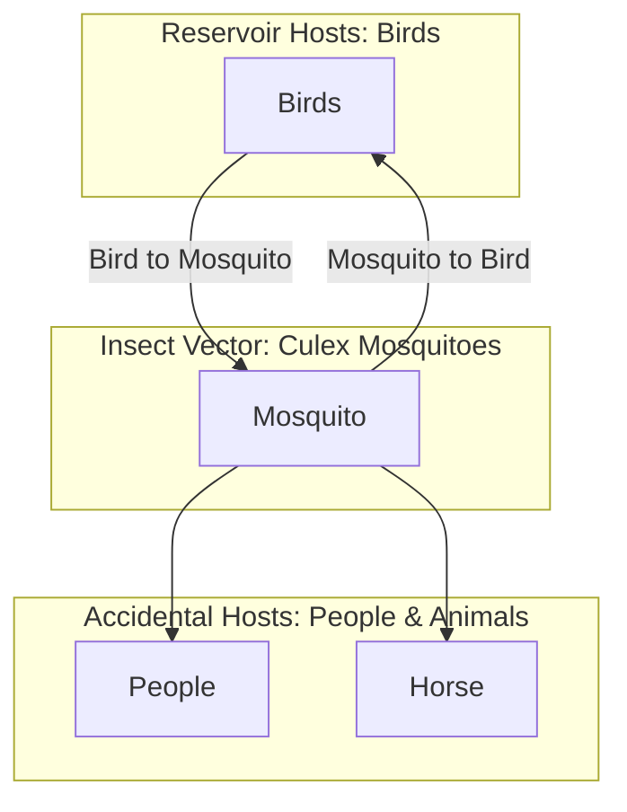

PUBLIC HEALTH BULLETIN-PAKISTAN

Vol. 3 | Week 44
14th Nov 2023

# Integrated Disease Surveillance & Response (IDSR) Report

Center of Disease Control

National Institute of Health, Islamabad PAKISTAN

http://www.phb.nih.org.pk/

Integrated Disease Surveillance & Response (IDSR) Weekly Public Health Bulletin is your go-to resource for disease trends, outbreak alerts, and crucial public health information. By reading and sharing this bulletin, you can help increase awareness and promote preventive measures within your community.

Public Health Bulletin Pakistan - Make a difference with your Field work. Share Your Work and Impact Lives. www.phb.nih.org.pk phb@nih.org.pk

Globe icon

NIH logo

Public Health Bulletin logo

NIH logo

UK Health Security Agency logo

World Health Organization logo

USAID logo

safetynet logo

---

Public Health Bulletin - Pakistan.

Public Health Bulletin Pakistan logo

National Institute of Health Pakistan logo

Government of Pakistan logo

*Overview*

*IDSR Reports*

*Ongoing Events*

*Field Reports*

**Public Health Bulletin - Pakistan, Week 44, 2023**

This bulletin highlights the most notable public health events in Pakistan during Week 44 of 2023.

During Week 44, Acute Diarrhea (Non-Cholera) emerged as the most frequently reported disease, followed by Malaria, Influenza-Like Illness (ILI), Acute Respiratory Infection (ALRI) in children under five years of age, B. Diarrhea, Typhoid, Viral Hepatitis (B&C), Severe Acute Respiratory Infection (SARI), dog bites, and Acute Watery Diarrhea (AWD). A notable increase in Measles and Mumps cases has been observed, particularly in Balochistan, Sindh, and Khyber Pakhtunkhwa (KPK). Fifty suspected Diphtheria cases have been reported from Gilgit-Baltistan (GB). All reported cases are suspected and require field verification for rapid response. Acute Diarrhea cases continue to be reported from across the country, necessitating field investigations to verify these cases.

This issue of the Public Health Bulletin also includes information on enigmatic West Nile fever case of KPK, a field activity report on National Consultative Workshop on IDSR Road Map, Polio resurgence in Pakistan, Dengue fever cases surge in Punjab, and educational awareness essay on Understanding the Threat and Protecting Ourselves against West Nile Virus.

The team reminds the public to stay vigilant and to seek medical attention promptly if they experience any symptoms of the diseases listed above.

Working together, we can safeguard the health of our communities.

Sincerely,
The Chief Editor

NIH logo

UK Health Security Agency logo

World Health Organization logo

USAID logo

safetynet logo

---

# Overview

* *During week 44, most frequent reported cases were of Acute Diarrhea (Non-Cholera) followed by Malaria, ILI, ALRI <5 years, B. Diarrhea, Typhoid, VH (B&C), SARI, dog bite and AWD (S. Cholera).*

* *There is an overall increase in reported cases of Measles and Mumps especially from Balochistan, Sindh and KPK. Fifty cases of Diphtheria cases alone reported from GB. All are suspected cases and need field verification for rapid response.*

* *Acute diarrhea cases continued to be reported from across the country. Field investigation required to verify cases.*

## IDSR compliance attributes

* The national compliance rate for IDSR reporting in 121 implemented districts is 75%

* Sindh and AJK are the top reporting region with a compliance rate of 92% and 74% followed by Khyber Pakhtunkhwa AND BOLACHISTAN with 70%

* The lowest compliance rate was observed in ICT and Gilgit Baltistan.

<table>
  <thead>
    <tr>
        <th>Region</th>
        <th>Expected Reports</th>
        <th>Received Reports</th>
        <th>Compliance (%)</th>
    </tr>
  </thead>
  <tbody>
    <tr>
        <td>Khyber Pakhtunkhwa</td>
<td>2013</td>
<td>1418</td>
<td>70</td>
    </tr>
<tr>
        <td>Azad Jammu Kashmir</td>
<td>380</td>
<td>282</td>
<td>74</td>
    </tr>
<tr>
        <td>Islamabad Capital Territory</td>
<td>27</td>
<td>4</td>
<td>15</td>
    </tr>
<tr>
        <td>Balochistan</td>
<td>1270</td>
<td>889</td>
<td>70</td>
    </tr>
<tr>
        <td>Gilgit Baltistan</td>
<td>440</td>
<td>158</td>
<td>36</td>
    </tr>
<tr>
        <td>Sindh</td>
<td>2038</td>
<td>1881</td>
<td>92</td>
    </tr>
<tr>
        <td>National</td>
<td>6168</td>
<td>4632</td>
<td>75</td>
    </tr>
  </tbody>
</table>

NIH logo

UK Health Security Agency

World Health Organization logo

USAID logo

safetynet logo

---

Pakistan

**Table 1: Province/Area wise distribution of most frequently reported cases during week 44, Pakistan.**

<table>
    <thead>
    <tr>
        <th>Diseases</th>
        <th>AJK</th>
        <th>Balochistan</th>
        <th>GB</th>
        <th>ICT</th>
        <th>KP</th>
        <th>Punjab</th>
        <th>Sindh</th>
        <th>Total</th>
    </tr>
    </thead>
    <tr>
        <td>AD (Non-Cholera)</td>
<td>1,050</td>
<td>7,115</td>
<td>295</td>
<td>38</td>
<td>18,076</td>
<td>88,321</td>
<td>38,965</td>
<td>153,860</td>
    </tr>
<tr>
        <td>Malaria</td>
<td>73</td>
<td>8,922</td>
<td>2</td>
<td>0</td>
<td>5,519</td>
<td>4,072</td>
<td>81,046</td>
<td>99,643</td>
    </tr>
<tr>
        <td>ILI</td>
<td>2,129</td>
<td>8,861</td>
<td>229</td>
<td>304</td>
<td>4,700</td>
<td>8</td>
<td>20,648</td>
<td>36,879</td>
    </tr>
<tr>
        <td>ALRI &lt; 5 years</td>
<td>994</td>
<td>2,122</td>
<td>372</td>
<td>0</td>
<td>1,834</td>
<td>NR</td>
<td>11,817</td>
<td>17,139</td>
    </tr>
<tr>
        <td>B. Diarrhea</td>
<td>50</td>
<td>1,860</td>
<td>27</td>
<td>0</td>
<td>844</td>
<td>2,612</td>
<td>3,032</td>
<td>8,425</td>
    </tr>
<tr>
        <td>Typhoid</td>
<td>55</td>
<td>1,095</td>
<td>23</td>
<td>0</td>
<td>733</td>
<td>5,223</td>
<td>1,172</td>
<td>8,301</td>
    </tr>
<tr>
        <td>VH (B, C & D)</td>
<td>9</td>
<td>66</td>
<td>2</td>
<td>0</td>
<td>103</td>
<td>NR</td>
<td>6,239</td>
<td>6,419</td>
    </tr>
<tr>
        <td>SARI</td>
<td>293</td>
<td>1,240</td>
<td>312</td>
<td>0</td>
<td>900</td>
<td>NR</td>
<td>514</td>
<td>3,259</td>
    </tr>
<tr>
        <td>Dog Bite</td>
<td>46</td>
<td>254</td>
<td>0</td>
<td>0</td>
<td>209</td>
<td>NR</td>
<td>676</td>
<td>1,185</td>
    </tr>
<tr>
        <td>AWD (S. Cholera)</td>
<td>80</td>
<td>441</td>
<td>31</td>
<td>0</td>
<td>70</td>
<td>NR</td>
<td>121</td>
<td>743</td>
    </tr>
<tr>
        <td>Mumps</td>
<td>82</td>
<td>154</td>
<td>47</td>
<td>0</td>
<td>109</td>
<td>NR</td>
<td>292</td>
<td>684</td>
    </tr>
<tr>
        <td>AVH (A & E)</td>
<td>12</td>
<td>30</td>
<td>8</td>
<td>0</td>
<td>214</td>
<td>NR</td>
<td>272</td>
<td>536</td>
    </tr>
<tr>
        <td>CL</td>
<td>3</td>
<td>182</td>
<td>1</td>
<td>0</td>
<td>291</td>
<td>32</td>
<td>0</td>
<td>509</td>
    </tr>
<tr>
        <td>Dengue</td>
<td>8</td>
<td>38</td>
<td>0</td>
<td>2</td>
<td>56</td>
<td>NR</td>
<td>287</td>
<td>391</td>
    </tr>
<tr>
        <td>Measles</td>
<td>19</td>
<td>152</td>
<td>4</td>
<td>0</td>
<td>161</td>
<td>NR</td>
<td>51</td>
<td>387</td>
    </tr>
<tr>
        <td>Chickenpox/ Varicella</td>
<td>22</td>
<td>6</td>
<td>5</td>
<td>0</td>
<td>88</td>
<td>79</td>
<td>17</td>
<td>217</td>
    </tr>
<tr>
        <td>Pertussis</td>
<td>1</td>
<td>164</td>
<td>7</td>
<td>0</td>
<td>28</td>
<td>NR</td>
<td>6</td>
<td>206</td>
    </tr>
<tr>
        <td>Gonorrhea</td>
<td>1</td>
<td>100</td>
<td>0</td>
<td>0</td>
<td>16</td>
<td>NR</td>
<td>20</td>
<td>137</td>
    </tr>
<tr>
        <td>Syphilis</td>
<td>0</td>
<td>17</td>
<td>0</td>
<td>0</td>
<td>16</td>
<td>NR</td>
<td>70</td>
<td>103</td>
    </tr>
<tr>
        <td>AFP</td>
<td>3</td>
<td>0</td>
<td>0</td>
<td>0</td>
<td>18</td>
<td>NR</td>
<td>58</td>
<td>79</td>
    </tr>
<tr>
        <td>Diphtheria (Probable)</td>
<td>0</td>
<td>0</td>
<td>50</td>
<td>0</td>
<td>6</td>
<td>NR</td>
<td>0</td>
<td>56</td>
    </tr>
<tr>
        <td>VL</td>
<td>0</td>
<td>13</td>
<td>0</td>
<td>0</td>
<td>27</td>
<td>NR</td>
<td>0</td>
<td>40</td>
    </tr>
<tr>
        <td>Leprosy</td>
<td>0</td>
<td>6</td>
<td>0</td>
<td>0</td>
<td>23</td>
<td>NR</td>
<td>0</td>
<td>29</td>
    </tr>
<tr>
        <td>Meningitis</td>
<td>2</td>
<td>10</td>
<td>3</td>
<td>0</td>
<td>2</td>
<td>NR</td>
<td>3</td>
<td>20</td>
    </tr>
<tr>
        <td>Brucellosis</td>
<td>0</td>
<td>9</td>
<td>0</td>
<td>0</td>
<td>8</td>
<td>NR</td>
<td>0</td>
<td>17</td>
    </tr>
<tr>
        <td>Rubella (CRS)</td>
<td>0</td>
<td>9</td>
<td>0</td>
<td>0</td>
<td>0</td>
<td>NR</td>
<td>0</td>
<td>9</td>
    </tr>
<tr>
        <td>HIV/AIDS</td>
<td>0</td>
<td>0</td>
<td>0</td>
<td>0</td>
<td>1</td>
<td>NR</td>
<td>4</td>
<td>5</td>
    </tr>
<tr>
        <td>Anthrax</td>
<td>0</td>
<td>0</td>
<td>0</td>
<td>0</td>
<td>0</td>
<td>NR</td>
<td>0</td>
<td>0</td>
    </tr>
<tr>
        <td>NT</td>
<td>1</td>
<td>0</td>
<td>0</td>
<td>0</td>
<td>2</td>
<td>NR</td>
<td>1</td>
<td>4</td>
    </tr>
<tr>
        <td>Chikungunya</td>
<td>0</td>
<td>0</td>
<td>0</td>
<td>0</td>
<td>0</td>
<td>NR</td>
<td>0</td>
<td>0</td>
    </tr>
<tr>
        <td>CCHF</td>
<td>0</td>
<td>0</td>
<td>0</td>
<td>0</td>
<td>0</td>
<td>NR</td>
<td>0</td>
<td>0</td>
    </tr>
</table>

**Figure 1: Most frequently reported suspected cases during week 44, Pakistan**

<table>
  <thead>
    <tr>
        <th>Disease</th>
        <th>W42 2023</th>
        <th>W43 2023</th>
        <th>W44 2023</th>
    </tr>
  </thead>
  <tbody>
    <tr>
        <td>Malaria</td>
<td>150000</td>
<td>152000</td>
<td>153860</td>
    </tr>
<tr>
        <td>AD (Non-Cholera)</td>
<td>110000</td>
<td>115000</td>
<td>99643</td>
    </tr>
<tr>
        <td>ILI</td>
<td>35000</td>
<td>36000</td>
<td>36879</td>
    </tr>
<tr>
        <td>ALRI &lt; 5 years</td>
<td>15000</td>
<td>16000</td>
<td>17139</td>
    </tr>
<tr>
        <td>VH (B, C &amp; D)</td>
<td>8000</td>
<td>8200</td>
<td>8425</td>
    </tr>
<tr>
        <td>B. Diarrhea</td>
<td>8000</td>
<td>8100</td>
<td>8301</td>
    </tr>
<tr>
        <td>Typhoid</td>
<td>6000</td>
<td>6200</td>
<td>6419</td>
    </tr>
<tr>
        <td>SARI</td>
<td>3000</td>
<td>3100</td>
<td>3259</td>
    </tr>
<tr>
        <td>Dog BiTE</td>
<td>1000</td>
<td>1100</td>
<td>1185</td>
    </tr>
<tr>
        <td>AWD (S. Cholera)</td>
<td>600</td>
<td>700</td>
<td>743</td>
    </tr>
  </tbody>
</table>

NIH logo

UK Health Security Agency logo

World Health Organization logo

USAID logo

safetynet logo

---

# Sindh

* Malaria cases were maximum followed by AD (Non-Cholera), ILI, ALRI<5 Years, VH (B, C, D), B. Diarrhea, Typhoid, SARI and Mumps.
* Trends for ILI cases showed a slight rise this week.
* One hundred and twenty-five Mumps cases with clustering reported from Tharparkar. These are suspected cases and require urgent field verification.
* Kambar (1199) and Sanghar (948) reported highest cases of VH (B&C). Field investigation is required to identify the source to control the spread of disease.

Table 2: District wise distribution of most frequently reported suspected cases during week 44, Sindh

<table>
    <thead>
    <tr>
        <th>DISTRICTS</th>
        <th>Malaria</th>
        <th>AD 
(Non-
Cholera)</th>
        <th>ILI</th>
        <th>ALRI &lt; 
5 years</th>
        <th>VH (B, C & D)</th>
        <th>B. Diarrhea</th>
        <th>Typhoid</th>
        <th>Dog Bite</th>
        <th>SARI</th>
        <th>Mumps</th>
    </tr>
    </thead>
    <tr>
        <td>Badin</td>
<td>4,706</td>
<td>2,497</td>
<td>621</td>
<td>751</td>
<td>184</td>
<td>279</td>
<td>48</td>
<td>51</td>
<td>3</td>
<td>16</td>
    </tr>
<tr>
        <td>Dadu</td>
<td>3,608</td>
<td>1,283</td>
<td>0</td>
<td>938</td>
<td>0</td>
<td>189</td>
<td>123</td>
<td>100</td>
<td>0</td>
<td>0</td>
    </tr>
<tr>
        <td>Ghotki</td>
<td>1,349</td>
<td>741</td>
<td>0</td>
<td>545</td>
<td>348</td>
<td>95</td>
<td>0</td>
<td>0</td>
<td>0</td>
<td>0</td>
    </tr>
<tr>
        <td>Hyderabad</td>
<td>573</td>
<td>1,897</td>
<td>454</td>
<td>80</td>
<td>60</td>
<td>30</td>
<td>20</td>
<td>0</td>
<td>0</td>
<td>17</td>
    </tr>
<tr>
        <td>Jacobabad</td>
<td>3,145</td>
<td>1,059</td>
<td>222</td>
<td>1,306</td>
<td>196</td>
<td>122</td>
<td>9</td>
<td>42</td>
<td>56</td>
<td>4</td>
    </tr>
<tr>
        <td>Jamshoro</td>
<td>2,320</td>
<td>1,522</td>
<td>21</td>
<td>176</td>
<td>123</td>
<td>79</td>
<td>39</td>
<td>13</td>
<td>6</td>
<td>0</td>
    </tr>
<tr>
        <td>Kamber</td>
<td>6,530</td>
<td>2,101</td>
<td>0</td>
<td>487</td>
<td>1,199</td>
<td>165</td>
<td>44</td>
<td>30</td>
<td>0</td>
<td>0</td>
    </tr>
<tr>
        <td>Karachi Central</td>
<td>60</td>
<td>991</td>
<td>2,077</td>
<td>82</td>
<td>132</td>
<td>17</td>
<td>151</td>
<td>0</td>
<td>0</td>
<td>0</td>
    </tr>
<tr>
        <td>Karachi East</td>
<td>139</td>
<td>421</td>
<td>38</td>
<td>20</td>
<td>0</td>
<td>7</td>
<td>7</td>
<td>0</td>
<td>2</td>
<td>0</td>
    </tr>
<tr>
        <td>Karachi Keamari</td>
<td>4</td>
<td>367</td>
<td>363</td>
<td>49</td>
<td>0</td>
<td>1</td>
<td>3</td>
<td>0</td>
<td>0</td>
<td>1</td>
    </tr>
<tr>
        <td>Karachi Korangi</td>
<td>78</td>
<td>241</td>
<td>5</td>
<td>2</td>
<td>0</td>
<td>2</td>
<td>0</td>
<td>0</td>
<td>0</td>
<td>1</td>
    </tr>
<tr>
        <td>Karachi Malir</td>
<td>161</td>
<td>893</td>
<td>2,456</td>
<td>331</td>
<td>27</td>
<td>74</td>
<td>38</td>
<td>19</td>
<td>79</td>
<td>4</td>
    </tr>
<tr>
        <td>Karachi South</td>
<td>35</td>
<td>116</td>
<td>0</td>
<td>0</td>
<td>0</td>
<td>0</td>
<td>1</td>
<td>0</td>
<td>0</td>
<td>0</td>
    </tr>
<tr>
        <td>Karachi West</td>
<td>161</td>
<td>943</td>
<td>843</td>
<td>142</td>
<td>24</td>
<td>41</td>
<td>34</td>
<td>33</td>
<td>38</td>
<td>0</td>
    </tr>
<tr>
        <td>Kashmore</td>
<td>2,717</td>
<td>579</td>
<td>730</td>
<td>194</td>
<td>72</td>
<td>74</td>
<td>12</td>
<td>12</td>
<td>0</td>
<td>4</td>
    </tr>
<tr>
        <td>Khairpur</td>
<td>7,257</td>
<td>2,599</td>
<td>801</td>
<td>1,244</td>
<td>331</td>
<td>314</td>
<td>188</td>
<td>32</td>
<td>147</td>
<td>12</td>
    </tr>
<tr>
        <td>Larkana</td>
<td>11,866</td>
<td>2,041</td>
<td>1</td>
<td>534</td>
<td>181</td>
<td>300</td>
<td>5</td>
<td>0</td>
<td>0</td>
<td>2</td>
    </tr>
<tr>
        <td>Matiari</td>
<td>1,818</td>
<td>1,388</td>
<td>26</td>
<td>350</td>
<td>205</td>
<td>76</td>
<td>8</td>
<td>26</td>
<td>2</td>
<td>11</td>
    </tr>
<tr>
        <td>Mirpurkhas</td>
<td>5,658</td>
<td>2,405</td>
<td>4,660</td>
<td>598</td>
<td>144</td>
<td>100</td>
<td>28</td>
<td>21</td>
<td>76</td>
<td>11</td>
    </tr>
<tr>
        <td>Naushero Feroze</td>
<td>1,438</td>
<td>1,188</td>
<td>547</td>
<td>129</td>
<td>70</td>
<td>24</td>
<td>48</td>
<td>74</td>
<td>0</td>
<td>1</td>
    </tr>
<tr>
        <td>Sanghar</td>
<td>3,452</td>
<td>1,977</td>
<td>100</td>
<td>596</td>
<td>948</td>
<td>83</td>
<td>13</td>
<td>72</td>
<td>0</td>
<td>14</td>
    </tr>
<tr>
        <td>Shaheed 
Benazirabad</td>
<td>1,726</td>
<td>1,938</td>
<td>2</td>
<td>509</td>
<td>226</td>
<td>107</td>
<td>184</td>
<td>14</td>
<td>0</td>
<td>8</td>
    </tr>
<tr>
        <td>Shikarpur</td>
<td>3,714</td>
<td>1,089</td>
<td>2</td>
<td>247</td>
<td>269</td>
<td>135</td>
<td>1</td>
<td>90</td>
<td>13</td>
<td>14</td>
    </tr>
<tr>
        <td>Sujawal</td>
<td>770</td>
<td>607</td>
<td>0</td>
<td>68</td>
<td>4</td>
<td>28</td>
<td>14</td>
<td>0</td>
<td>0</td>
<td>0</td>
    </tr>
<tr>
        <td>Sukkur</td>
<td>4,648</td>
<td>1,540</td>
<td>1,855</td>
<td>365</td>
<td>301</td>
<td>198</td>
<td>8</td>
<td>2</td>
<td>0</td>
<td>4</td>
    </tr>
<tr>
        <td>Tando Allahyar</td>
<td>1,864</td>
<td>1,397</td>
<td>1,123</td>
<td>333</td>
<td>311</td>
<td>98</td>
<td>11</td>
<td>6</td>
<td>0</td>
<td>21</td>
    </tr>
<tr>
        <td>Tando 
Muhammad Khan</td>
<td>2,018</td>
<td>1,215</td>
<td>2</td>
<td>294</td>
<td>268</td>
<td>98</td>
<td>1</td>
<td>0</td>
<td>0</td>
<td>0</td>
    </tr>
<tr>
        <td>Tharparkar</td>
<td>3,635</td>
<td>1,633</td>
<td>2,524</td>
<td>1,060</td>
<td>125</td>
<td>159</td>
<td>56</td>
<td>3</td>
<td>57</td>
<td>125</td>
    </tr>
<tr>
        <td>Thatta</td>
<td>3,079</td>
<td>1,189</td>
<td>1,165</td>
<td>119</td>
<td>270</td>
<td>69</td>
<td>26</td>
<td>36</td>
<td>19</td>
<td>4</td>
    </tr>
<tr>
        <td>Umerkot</td>
<td>2,517</td>
<td>1,108</td>
<td>10</td>
<td>268</td>
<td>221</td>
<td>68</td>
<td>52</td>
<td>0</td>
<td>16</td>
<td>18</td>
    </tr>
<tr>
        <td>Total</td>
<td>81,046</td>
<td>38,965</td>
<td>20,648</td>
<td>11,817</td>
<td>6,239</td>
<td>3,032</td>
<td>1,172</td>
<td>676</td>
<td>514</td>
<td>292</td>
    </tr>
</table>

Figure 2: Most frequently reported suspected cases during week 44 Sindh

<table>
  <thead>
    <tr>
        <th>Disease</th>
        <th>W42</th>
        <th>W43</th>
        <th>W44</th>
    </tr>
  </thead>
  <tbody>
    <tr>
        <td>Malaria</td>
<td>85000</td>
<td>85000</td>
<td>81046</td>
    </tr>
<tr>
        <td>AD (Non-Cholera)</td>
<td>42000</td>
<td>43000</td>
<td>38965</td>
    </tr>
<tr>
        <td>ILI</td>
<td>18000</td>
<td>20000</td>
<td>20648</td>
    </tr>
<tr>
        <td>ALRI &lt; 5 years</td>
<td>12000</td>
<td>12000</td>
<td>11817</td>
    </tr>
<tr>
        <td>VH (B, C &amp; D)</td>
<td>6000</td>
<td>6000</td>
<td>6239</td>
    </tr>
<tr>
        <td>B. Diarrhea</td>
<td>3000</td>
<td>3000</td>
<td>3032</td>
    </tr>
<tr>
        <td>Typhoid</td>
<td>1000</td>
<td>1000</td>
<td>1172</td>
    </tr>
<tr>
        <td>Dog Bite</td>
<td>500</td>
<td>500</td>
<td>676</td>
    </tr>
<tr>
        <td>SARI</td>
<td>500</td>
<td>500</td>
<td>514</td>
    </tr>
<tr>
        <td>Mumps</td>
<td>200</td>
<td>200</td>
<td>292</td>
    </tr>
  </tbody>
</table>

NIH logo UK Health Security Agency logo World Health Organization logo USAID logo safetynet logo

---

# Balochistan

* Malaria, ILI, AD (Non-Cholera), ALRI <5 years, B. Diarrhea, SARI, Typhoid, AWD (S. Cholera), dog bite and CL were the most frequently reported diseases from Balochistan province.
* Trend for ILI showed rise in cases whereas AD and Malaria cases declined this week.
* Kohlu, Panjgur and Sohbat pur cases of SARI were reported in high numbers. All are suspected cases and need field investigation to verify the cases.

Table 3: District wise distribution of most frequently reported suspected cases during week 44, Balochistan

<table>
    <thead>
    <tr>
        <th>Districts</th>
        <th>Malaria</th>
        <th>ILI</th>
        <th>AD Non-
Cholera)</th>
        <th>ALRI &lt; 5 
years</th>
        <th>B. 
Diarrhea</th>
        <th>SARI</th>
        <th>Typhoid</th>
        <th>AWD 
(S.Cholera)</th>
        <th>Dog Bite</th>
        <th>CL</th>
    </tr>
    </thead>
    <tr>
        <td>Barkhan</td>
<td>132</td>
<td>135</td>
<td>116</td>
<td>113</td>
<td>41</td>
<td>21</td>
<td>130</td>
<td>49</td>
<td>23</td>
<td>0</td>
    </tr>
<tr>
        <td>Chagai</td>
<td>23</td>
<td>352</td>
<td>223</td>
<td>0</td>
<td>71</td>
<td>0</td>
<td>31</td>
<td>27</td>
<td>0</td>
<td>10</td>
    </tr>
<tr>
        <td>Chaman</td>
<td>20</td>
<td>314</td>
<td>78</td>
<td>2</td>
<td>159</td>
<td>44</td>
<td>80</td>
<td>38</td>
<td>12</td>
<td>41</td>
    </tr>
<tr>
        <td>Dera Bugti</td>
<td>254</td>
<td>52</td>
<td>57</td>
<td>42</td>
<td>42</td>
<td>14</td>
<td>26</td>
<td>0</td>
<td>0</td>
<td>0</td>
    </tr>
<tr>
        <td>Duki</td>
<td>86</td>
<td>58</td>
<td>96</td>
<td>9</td>
<td>71</td>
<td>37</td>
<td>13</td>
<td>36</td>
<td>2</td>
<td>3</td>
    </tr>
<tr>
        <td>Gwadar</td>
<td>117</td>
<td>792</td>
<td>402</td>
<td>32</td>
<td>82</td>
<td>5</td>
<td>27</td>
<td>0</td>
<td>0</td>
<td>1</td>
    </tr>
<tr>
        <td>Harnai</td>
<td>97</td>
<td>22</td>
<td>121</td>
<td>225</td>
<td>58</td>
<td>0</td>
<td>11</td>
<td>4</td>
<td>4</td>
<td>0</td>
    </tr>
<tr>
        <td>Hub</td>
<td>82</td>
<td>129</td>
<td>80</td>
<td>37</td>
<td>20</td>
<td>19</td>
<td>0</td>
<td>0</td>
<td>0</td>
<td>0</td>
    </tr>
<tr>
        <td>Jaffarabad</td>
<td>2,057</td>
<td>96</td>
<td>522</td>
<td>57</td>
<td>62</td>
<td>31</td>
<td>6</td>
<td>0</td>
<td>12</td>
<td>9</td>
    </tr>
<tr>
        <td>Jhal Magsi</td>
<td>778</td>
<td>248</td>
<td>542</td>
<td>43</td>
<td>18</td>
<td>0</td>
<td>17</td>
<td>6</td>
<td>4</td>
<td>7</td>
    </tr>
<tr>
        <td>Kachhi (Bolan)</td>
<td>443</td>
<td>326</td>
<td>371</td>
<td>20</td>
<td>37</td>
<td>83</td>
<td>53</td>
<td>20</td>
<td>20</td>
<td>5</td>
    </tr>
<tr>
        <td>Kalat</td>
<td>74</td>
<td>34</td>
<td>60</td>
<td>18</td>
<td>11</td>
<td>2</td>
<td>61</td>
<td>0</td>
<td>0</td>
<td>3</td>
    </tr>
<tr>
        <td>Kech (Turbat)</td>
<td>253</td>
<td>1,082</td>
<td>353</td>
<td>100</td>
<td>46</td>
<td>22</td>
<td>5</td>
<td>NR</td>
<td>NR</td>
<td>NR</td>
    </tr>
<tr>
        <td>Kharan</td>
<td>81</td>
<td>386</td>
<td>140</td>
<td>4</td>
<td>67</td>
<td>1</td>
<td>3</td>
<td>4</td>
<td>0</td>
<td>0</td>
    </tr>
<tr>
        <td>Khuzdar</td>
<td>136</td>
<td>139</td>
<td>143</td>
<td>11</td>
<td>86</td>
<td>8</td>
<td>42</td>
<td>0</td>
<td>7</td>
<td>12</td>
    </tr>
<tr>
        <td>Killa Saifullah</td>
<td>233</td>
<td>1</td>
<td>173</td>
<td>168</td>
<td>62</td>
<td>18</td>
<td>33</td>
<td>2</td>
<td>0</td>
<td>11</td>
    </tr>
<tr>
        <td>Kohlu</td>
<td>222</td>
<td>628</td>
<td>239</td>
<td>58</td>
<td>143</td>
<td>175</td>
<td>48</td>
<td>36</td>
<td>0</td>
<td>0</td>
    </tr>
<tr>
        <td>Lasbella</td>
<td>457</td>
<td>116</td>
<td>389</td>
<td>122</td>
<td>17</td>
<td>43</td>
<td>6</td>
<td>3</td>
<td>6</td>
<td>0</td>
    </tr>
<tr>
        <td>Loralai</td>
<td>61</td>
<td>305</td>
<td>138</td>
<td>65</td>
<td>56</td>
<td>93</td>
<td>30</td>
<td>0</td>
<td>0</td>
<td>0</td>
    </tr>
<tr>
        <td>Mastung</td>
<td>84</td>
<td>122</td>
<td>349</td>
<td>26</td>
<td>67</td>
<td>76</td>
<td>47</td>
<td>28</td>
<td>0</td>
<td>0</td>
    </tr>
<tr>
        <td>Naseerabad</td>
<td>494</td>
<td>0</td>
<td>183</td>
<td>6</td>
<td>10</td>
<td>0</td>
<td>36</td>
<td>0</td>
<td>140</td>
<td>1</td>
    </tr>
<tr>
        <td>Nushki</td>
<td>26</td>
<td>4</td>
<td>191</td>
<td>0</td>
<td>83</td>
<td>2</td>
<td>0</td>
<td>7</td>
<td>0</td>
<td>0</td>
    </tr>
<tr>
        <td>Panjgur</td>
<td>140</td>
<td>42</td>
<td>150</td>
<td>8</td>
<td>32</td>
<td>101</td>
<td>104</td>
<td>10</td>
<td>0</td>
<td>6</td>
    </tr>
<tr>
        <td>Pishin</td>
<td>2</td>
<td>125</td>
<td>52</td>
<td>19</td>
<td>27</td>
<td>0</td>
<td>7</td>
<td>0</td>
<td>2</td>
<td>9</td>
    </tr>
<tr>
        <td>Quetta</td>
<td>36</td>
<td>1,254</td>
<td>374</td>
<td>44</td>
<td>73</td>
<td>11</td>
<td>36</td>
<td>82</td>
<td>0</td>
<td>32</td>
    </tr>
<tr>
        <td>Sherani</td>
<td>3</td>
<td>82</td>
<td>55</td>
<td>0</td>
<td>20</td>
<td>78</td>
<td>13</td>
<td>0</td>
<td>0</td>
<td>7</td>
    </tr>
<tr>
        <td>Sibi</td>
<td>543</td>
<td>1,038</td>
<td>369</td>
<td>75</td>
<td>67</td>
<td>53</td>
<td>32</td>
<td>56</td>
<td>7</td>
<td>9</td>
    </tr>
<tr>
        <td>Sohbat pur</td>
<td>832</td>
<td>42</td>
<td>261</td>
<td>181</td>
<td>96</td>
<td>80</td>
<td>79</td>
<td>3</td>
<td>4</td>
<td>10</td>
    </tr>
<tr>
        <td>Surab</td>
<td>95</td>
<td>91</td>
<td>44</td>
<td>24</td>
<td>5</td>
<td>14</td>
<td>35</td>
<td>0</td>
<td>0</td>
<td>5</td>
    </tr>
<tr>
        <td>Usta Muhammad</td>
<td>782</td>
<td>178</td>
<td>435</td>
<td>173</td>
<td>39</td>
<td>40</td>
<td>9</td>
<td>0</td>
<td>2</td>
<td>0</td>
    </tr>
<tr>
        <td>Washuk</td>
<td>70</td>
<td>289</td>
<td>197</td>
<td>13</td>
<td>101</td>
<td>20</td>
<td>28</td>
<td>0</td>
<td>0</td>
<td>0</td>
    </tr>
<tr>
        <td>Zhob</td>
<td>164</td>
<td>188</td>
<td>121</td>
<td>390</td>
<td>44</td>
<td>115</td>
<td>19</td>
<td>8</td>
<td>0</td>
<td>0</td>
    </tr>
<tr>
        <td>Ziarat</td>
<td>45</td>
<td>191</td>
<td>91</td>
<td>37</td>
<td>47</td>
<td>34</td>
<td>28</td>
<td>22</td>
<td>9</td>
<td>1</td>
    </tr>
<tr>
        <td>Total</td>
<td>8922</td>
<td>8861</td>
<td>7115</td>
<td>2122</td>
<td>1860</td>
<td>1240</td>
<td>1095</td>
<td>441</td>
<td>254</td>
<td>182</td>
    </tr>
</table>

Figure 3: Most frequently reported suspected cases during week 44, Balochistan

<table>
  <thead>
    <tr>
        <th>Disease</th>
        <th>W42</th>
        <th>W43</th>
        <th>W44</th>
    </tr>
  </thead>
  <tbody>
    <tr>
        <td>Malaria</td>
<td>9500</td>
<td>10000</td>
<td>8922</td>
    </tr>
<tr>
        <td>ILI</td>
<td>8500</td>
<td>8300</td>
<td>8861</td>
    </tr>
<tr>
        <td>AD (Non-Cholera)</td>
<td>8000</td>
<td>7200</td>
<td>7115</td>
    </tr>
<tr>
        <td>ALRI &lt; 5 years</td>
<td>2200</td>
<td>2100</td>
<td>2122</td>
    </tr>
<tr>
        <td>B. Diarrhea</td>
<td>2000</td>
<td>1900</td>
<td>1860</td>
    </tr>
<tr>
        <td>SARI</td>
<td>1000</td>
<td>1200</td>
<td>1240</td>
    </tr>
<tr>
        <td>Typhoid</td>
<td>1100</td>
<td>1100</td>
<td>1095</td>
    </tr>
<tr>
        <td>AWD (S. Cholera)</td>
<td>500</td>
<td>450</td>
<td>441</td>
    </tr>
<tr>
        <td>Dog Bite</td>
<td>300</td>
<td>280</td>
<td>254</td>
    </tr>
<tr>
        <td>CL</td>
<td>200</td>
<td>190</td>
<td>182</td>
    </tr>
  </tbody>
</table>

NIH logo

UK Health Security Agency logo

World Health Organization logo

USAID logo

safetynet logo

---

# Khyber Pakhtunkhwa

* Cases of AD (Non-Cholera) were maximum followed by Malaria, ILI, ALRI<5 Years, SARI, B. Diarrhea, Typhoid, CL, AVH (A&E) and dog bite cases.
* Malaria, ILI and Acute Diarrhea cases showed declined this week.
* Peshawar and upper Kurrem reported increased number of Typhoid cases. Further, Acute diarrhea (AD) cases continue to be reported in high numbers from Dir lower, Peshawar, Swat, Nowshera and Haripur.

Table 4: District wise distribution of most frequently reported suspected cases during week 44, KP

<table>
    <thead>
    <tr>
        <th>Districts</th>
        <th>AD 
(Non-
Cholera)</th>
        <th>Malaria</th>
        <th>ILI</th>
        <th>ALRI &lt;5 Years</th>
        <th>SARI</th>
        <th>B. Diarrhea</th>
        <th>Typhoid</th>
        <th>CL</th>
        <th>AVH (A & 
E)</th>
        <th>Measles</th>
    </tr>
    </thead>
    <tr>
        <td>Abbottabad</td>
<td>437</td>
<td>3</td>
<td>38</td>
<td>23</td>
<td>24</td>
<td>3</td>
<td>11</td>
<td>0</td>
<td>0</td>
<td>2</td>
    </tr>
<tr>
        <td>Bajaur</td>
<td>109</td>
<td>83</td>
<td>25</td>
<td>30</td>
<td>15</td>
<td>11</td>
<td>0</td>
<td>1</td>
<td>0</td>
<td>0</td>
    </tr>
<tr>
        <td>Bannu</td>
<td>659</td>
<td>906</td>
<td>2</td>
<td>2</td>
<td>0</td>
<td>8</td>
<td>30</td>
<td>0</td>
<td>2</td>
<td>0</td>
    </tr>
<tr>
        <td>Battagram</td>
<td>181</td>
<td>201</td>
<td>226</td>
<td>0</td>
<td>3</td>
<td>1</td>
<td>0</td>
<td>2</td>
<td>2</td>
<td>0</td>
    </tr>
<tr>
        <td>Buner</td>
<td>273</td>
<td>378</td>
<td>0</td>
<td>59</td>
<td>0</td>
<td>0</td>
<td>5</td>
<td>0</td>
<td>0</td>
<td>0</td>
    </tr>
<tr>
        <td>Charsadda</td>
<td>875</td>
<td>420</td>
<td>190</td>
<td>57</td>
<td>101</td>
<td>30</td>
<td>16</td>
<td>9</td>
<td>6</td>
<td>31</td>
    </tr>
<tr>
        <td>Chitral Lower</td>
<td>192</td>
<td>17</td>
<td>53</td>
<td>19</td>
<td>21</td>
<td>14</td>
<td>7</td>
<td>6</td>
<td>7</td>
<td>2</td>
    </tr>
<tr>
        <td>Chitral Upper</td>
<td>104</td>
<td>7</td>
<td>9</td>
<td>13</td>
<td>7</td>
<td>4</td>
<td>28</td>
<td>0</td>
<td>1</td>
<td>0</td>
    </tr>
<tr>
        <td>D.I. Khan</td>
<td>935</td>
<td>388</td>
<td>6</td>
<td>5</td>
<td>33</td>
<td>4</td>
<td>4</td>
<td>3</td>
<td>0</td>
<td>4</td>
    </tr>
<tr>
        <td>Dir Lower</td>
<td>1,037</td>
<td>562</td>
<td>4</td>
<td>157</td>
<td>0</td>
<td>112</td>
<td>42</td>
<td>2</td>
<td>39</td>
<td>15</td>
    </tr>
<tr>
        <td>Dir Upper</td>
<td>571</td>
<td>14</td>
<td>35</td>
<td>34</td>
<td>0</td>
<td>5</td>
<td>19</td>
<td>5</td>
<td>6</td>
<td>0</td>
    </tr>
<tr>
        <td>Hangu</td>
<td>227</td>
<td>401</td>
<td>126</td>
<td>9</td>
<td>44</td>
<td>10</td>
<td>3</td>
<td>29</td>
<td>7</td>
<td>29</td>
    </tr>
<tr>
        <td>Haripur</td>
<td>1,303</td>
<td>36</td>
<td>1,034</td>
<td>260</td>
<td>23</td>
<td>1</td>
<td>51</td>
<td>0</td>
<td>18</td>
<td>0</td>
    </tr>
<tr>
        <td>Karak</td>
<td>244</td>
<td>161</td>
<td>72</td>
<td>9</td>
<td>8</td>
<td>0</td>
<td>2</td>
<td>34</td>
<td>0</td>
<td>24</td>
    </tr>
<tr>
        <td>Khyber</td>
<td>119</td>
<td>221</td>
<td>58</td>
<td>32</td>
<td>3</td>
<td>28</td>
<td>11</td>
<td>7</td>
<td>3</td>
<td>2</td>
    </tr>
<tr>
        <td>Kohat</td>
<td>48</td>
<td>21</td>
<td>0</td>
<td>0</td>
<td>0</td>
<td>0</td>
<td>0</td>
<td>1</td>
<td>0</td>
<td>1</td>
    </tr>
<tr>
        <td>Kohistan Lower</td>
<td>102</td>
<td>2</td>
<td>0</td>
<td>13</td>
<td>2</td>
<td>7</td>
<td>0</td>
<td>1</td>
<td>0</td>
<td>0</td>
    </tr>
<tr>
        <td>Kohistan Upper</td>
<td>124</td>
<td>16</td>
<td>34</td>
<td>2</td>
<td>6</td>
<td>4</td>
<td>15</td>
<td>0</td>
<td>0</td>
<td>0</td>
    </tr>
<tr>
        <td>Kolai Palas</td>
<td>37</td>
<td>4</td>
<td>0</td>
<td>3</td>
<td>0</td>
<td>7</td>
<td>0</td>
<td>0</td>
<td>0</td>
<td>0</td>
    </tr>
<tr>
        <td>L & C Kurram</td>
<td>30</td>
<td>13</td>
<td>140</td>
<td>0</td>
<td>0</td>
<td>5</td>
<td>2</td>
<td>0</td>
<td>0</td>
<td>0</td>
    </tr>
<tr>
        <td>Lakki Marwat</td>
<td>399</td>
<td>314</td>
<td>0</td>
<td>67</td>
<td>0</td>
<td>8</td>
<td>8</td>
<td>21</td>
<td>0</td>
<td>0</td>
    </tr>
<tr>
        <td>Malakand</td>
<td>545</td>
<td>37</td>
<td>0</td>
<td>31</td>
<td>6</td>
<td>39</td>
<td>13</td>
<td>19</td>
<td>29</td>
<td>0</td>
    </tr>
<tr>
        <td>Mansehra</td>
<td>264</td>
<td>5</td>
<td>276</td>
<td>113</td>
<td>9</td>
<td>13</td>
<td>1</td>
<td>0</td>
<td>4</td>
<td>0</td>
    </tr>
<tr>
        <td>Mardan</td>
<td>780</td>
<td>41</td>
<td>125</td>
<td>377</td>
<td>0</td>
<td>30</td>
<td>0</td>
<td>7</td>
<td>0</td>
<td>0</td>
    </tr>
<tr>
        <td>Mohmand</td>
<td>112</td>
<td>106</td>
<td>57</td>
<td>10</td>
<td>10</td>
<td>17</td>
<td>15</td>
<td>85</td>
<td>1</td>
<td>10</td>
    </tr>
<tr>
        <td>Nowshera</td>
<td>1,677</td>
<td>69</td>
<td>4</td>
<td>1</td>
<td>21</td>
<td>24</td>
<td>13</td>
<td>10</td>
<td>0</td>
<td>0</td>
    </tr>
<tr>
        <td>Peshawar</td>
<td>2,768</td>
<td>112</td>
<td>826</td>
<td>85</td>
<td>212</td>
<td>247</td>
<td>122</td>
<td>17</td>
<td>40</td>
<td>6</td>
    </tr>
<tr>
        <td>SD Bannu</td>
<td>12</td>
<td>69</td>
<td>15</td>
<td>3</td>
<td>3</td>
<td>9</td>
<td>2</td>
<td>0</td>
<td>2</td>
<td>0</td>
    </tr>
<tr>
        <td>SD Lakki</td>
<td>10</td>
<td>7</td>
<td>0</td>
<td>0</td>
<td>0</td>
<td>1</td>
<td>0</td>
<td>1</td>
<td>0</td>
<td>0</td>
    </tr>
<tr>
        <td>Shangla</td>
<td>125</td>
<td>100</td>
<td>12</td>
<td>4</td>
<td>17</td>
<td>2</td>
<td>14</td>
<td>0</td>
<td>2</td>
<td>9</td>
    </tr>
<tr>
        <td>SWA</td>
<td>79</td>
<td>205</td>
<td>270</td>
<td>203</td>
<td>86</td>
<td>26</td>
<td>41</td>
<td>14</td>
<td>3</td>
<td>11</td>
    </tr>
<tr>
        <td>Swabi</td>
<td>1,048</td>
<td>69</td>
<td>610</td>
<td>121</td>
<td>21</td>
<td>12</td>
<td>36</td>
<td>0</td>
<td>12</td>
<td>0</td>
    </tr>
<tr>
        <td>Swat</td>
<td>2,120</td>
<td>53</td>
<td>162</td>
<td>45</td>
<td>0</td>
<td>23</td>
<td>0</td>
<td>0</td>
<td>24</td>
<td>34</td>
    </tr>
<tr>
        <td>Tank</td>
<td>265</td>
<td>340</td>
<td>0</td>
<td>17</td>
<td>0</td>
<td>2</td>
<td>38</td>
<td>9</td>
<td>0</td>
<td>0</td>
    </tr>
<tr>
        <td>Tor Ghar</td>
<td>53</td>
<td>121</td>
<td>0</td>
<td>8</td>
<td>7</td>
<td>22</td>
<td>10</td>
<td>8</td>
<td>2</td>
<td>10</td>
    </tr>
<tr>
        <td>Upper Kurram</td>
<td>212</td>
<td>17</td>
<td>291</td>
<td>22</td>
<td>218</td>
<td>115</td>
<td>174</td>
<td>0</td>
<td>4</td>
<td>19</td>
    </tr>
<tr>
        <td>Total</td>
<td>18,076</td>
<td>5,519</td>
<td>4,700</td>
<td>1,834</td>
<td>900</td>
<td>844</td>
<td>733</td>
<td>291</td>
<td>214</td>
<td>209</td>
    </tr>
</table>

Figure 4: Most frequently reported suspected cases during week 44, KP

<table>
  <thead>
    <tr>
        <th>Disease</th>
        <th>W42</th>
        <th>W43</th>
        <th>W44</th>
    </tr>
  </thead>
  <tbody>
    <tr>
        <td>AD (Non-Cholera)</td>
<td>18500</td>
<td>19500</td>
<td>18076</td>
    </tr>
<tr>
        <td>Malaria</td>
<td>5500</td>
<td>6000</td>
<td>5519</td>
    </tr>
<tr>
        <td>ILI</td>
<td>4500</td>
<td>5500</td>
<td>4700</td>
    </tr>
<tr>
        <td>ALRI &lt; 5 years</td>
<td>1800</td>
<td>1800</td>
<td>1834</td>
    </tr>
<tr>
        <td>SARI</td>
<td>1000</td>
<td>1000</td>
<td>900</td>
    </tr>
<tr>
        <td>B. Diarrhea</td>
<td>800</td>
<td>900</td>
<td>844</td>
    </tr>
<tr>
        <td>Typhoid</td>
<td>600</td>
<td>700</td>
<td>733</td>
    </tr>
<tr>
        <td>CL</td>
<td>200</td>
<td>250</td>
<td>291</td>
    </tr>
<tr>
        <td>AVH (A &amp; E)</td>
<td>200</td>
<td>200</td>
<td>214</td>
    </tr>
<tr>
        <td>Dog Bite</td>
<td>200</td>
<td>200</td>
<td>209</td>
    </tr>
  </tbody>
</table>

NIH logo

UK Health Security Agency logo

World Health Organization logo

USAID logo

safetynet logo

---

# ICT, AJK & GB

**ICT**: The most frequently reported cases from Islamabad were ILI followed by AD (Non-Cholera) and AWD. ILI cases showed a decreasing trend in cases this week.

**AJK**: ILI cases were the most frequently reported followed by AD (Non-Cholera), ALRI <5 years, SARI, Mumps, AWD (S. Cholera), Malaria, Typhoid, B. Diarrhea and dog bite. Trend for ILI, AD and ILI cases showed a downward trend in cases this week.

**GB**: ALRI<5 years cases were the most frequently reported diseases followed by SARI, AD (Non. Cholera), ILI, Diphtheria, Mumps, AWD and B. Diarrhea. There is a continuous rising trend in ALRI<5 years cases this week.

Figure 5: Week wise reported suspected cases of ILI, ICT

<table>
  <thead>
    <tr>
        <th>Disease</th>
        <th>W42</th>
        <th>W43</th>
        <th>W44</th>
    </tr>
  </thead>
  <tbody>
    <tr>
        <td>ILI</td>
<td>2100</td>
<td>450</td>
<td>304</td>
    </tr>
<tr>
        <td>AD (Non-Cholera)</td>
<td>350</td>
<td>50</td>
<td>38</td>
    </tr>
<tr>
        <td>Dengue</td>
<td>100</td>
<td>10</td>
<td>2</td>
    </tr>
  </tbody>
</table>

Figure 6: Week wise reported suspected cases of ILI, ICT

<table>
  <thead>
    <tr>
        <th>Week</th>
        <th>ILI</th>
    </tr>
  </thead>
  <tbody>
    <tr>
        <td>W45</td>
<td>1700</td>
    </tr>
<tr>
        <td>W46</td>
<td>1550</td>
    </tr>
<tr>
        <td>W47</td>
<td>2450</td>
    </tr>
<tr>
        <td>W48</td>
<td>2350</td>
    </tr>
<tr>
        <td>W49</td>
<td>2600</td>
    </tr>
<tr>
        <td>W50</td>
<td>3200</td>
    </tr>
<tr>
        <td>W51</td>
<td>2500</td>
    </tr>
<tr>
        <td>W52</td>
<td>2200</td>
    </tr>
<tr>
        <td>W1</td>
<td>2050</td>
    </tr>
<tr>
        <td>W2</td>
<td>1650</td>
    </tr>
<tr>
        <td>W3</td>
<td>2000</td>
    </tr>
<tr>
        <td>W4</td>
<td>1900</td>
    </tr>
<tr>
        <td>W5</td>
<td>1850</td>
    </tr>
<tr>
        <td>W6</td>
<td>1600</td>
    </tr>
<tr>
        <td>W7</td>
<td>2350</td>
    </tr>
<tr>
        <td>W8</td>
<td>1650</td>
    </tr>
<tr>
        <td>W9</td>
<td>2250</td>
    </tr>
<tr>
        <td>W10</td>
<td>2100</td>
    </tr>
<tr>
        <td>W11</td>
<td>1700</td>
    </tr>
<tr>
        <td>W12</td>
<td>700</td>
    </tr>
<tr>
        <td>W13</td>
<td>1450</td>
    </tr>
<tr>
        <td>W14</td>
<td>1350</td>
    </tr>
<tr>
        <td>W15</td>
<td>1100</td>
    </tr>
<tr>
        <td>W16</td>
<td>650</td>
    </tr>
<tr>
        <td>W17</td>
<td>1100</td>
    </tr>
<tr>
        <td>W18</td>
<td>1000</td>
    </tr>
<tr>
        <td>W19</td>
<td>1500</td>
    </tr>
<tr>
        <td>W20</td>
<td>750</td>
    </tr>
<tr>
        <td>W21</td>
<td>1200</td>
    </tr>
<tr>
        <td>W22</td>
<td>1150</td>
    </tr>
<tr>
        <td>W23</td>
<td>700</td>
    </tr>
<tr>
        <td>W24</td>
<td>1050</td>
    </tr>
<tr>
        <td>W25</td>
<td>850</td>
    </tr>
<tr>
        <td>W26</td>
<td>250</td>
    </tr>
<tr>
        <td>W27</td>
<td>650</td>
    </tr>
<tr>
        <td>W28</td>
<td>900</td>
    </tr>
<tr>
        <td>W29</td>
<td>400</td>
    </tr>
<tr>
        <td>W30</td>
<td>750</td>
    </tr>
<tr>
        <td>W31</td>
<td>950</td>
    </tr>
<tr>
        <td>W32</td>
<td>1100</td>
    </tr>
<tr>
        <td>W33</td>
<td>1000</td>
    </tr>
<tr>
        <td>W34</td>
<td>1400</td>
    </tr>
<tr>
        <td>W35</td>
<td>1400</td>
    </tr>
<tr>
        <td>W36</td>
<td>1450</td>
    </tr>
<tr>
        <td>W37</td>
<td>1300</td>
    </tr>
<tr>
        <td>W38</td>
<td>1200</td>
    </tr>
<tr>
        <td>W39</td>
<td>2250</td>
    </tr>
<tr>
        <td>W40</td>
<td>2250</td>
    </tr>
<tr>
        <td>W41</td>
<td>2250</td>
    </tr>
<tr>
        <td>W42</td>
<td>2100</td>
    </tr>
<tr>
        <td>W43</td>
<td>450</td>
    </tr>
<tr>
        <td>W44</td>
<td>304</td>
    </tr>
  </tbody>
</table>

Figure 7: Most frequently reported suspected cases during week 44, AJK

<table>
  <thead>
    <tr>
        <th>Disease</th>
        <th>W42</th>
        <th>W43</th>
        <th>W44</th>
    </tr>
  </thead>
  <tbody>
    <tr>
        <td>ILI</td>
<td>2700</td>
<td>2850</td>
<td>2129</td>
    </tr>
<tr>
        <td>AD (Non-Cholera)</td>
<td>1350</td>
<td>1350</td>
<td>1050</td>
    </tr>
<tr>
        <td>ALRI &lt; 5 years</td>
<td>1200</td>
<td>1250</td>
<td>994</td>
    </tr>
<tr>
        <td>SARI</td>
<td>300</td>
<td>350</td>
<td>293</td>
    </tr>
<tr>
        <td>Mumps</td>
<td>100</td>
<td>100</td>
<td>82</td>
    </tr>
<tr>
        <td>AWD (S. Cholera)</td>
<td>100</td>
<td>100</td>
<td>80</td>
    </tr>
<tr>
        <td>Malaria</td>
<td>100</td>
<td>100</td>
<td>73</td>
    </tr>
<tr>
        <td>Typhoid</td>
<td>100</td>
<td>100</td>
<td>55</td>
    </tr>
<tr>
        <td>B. Diarrhea</td>
<td>100</td>
<td>100</td>
<td>50</td>
    </tr>
<tr>
        <td>Dog Bite</td>
<td>100</td>
<td>100</td>
<td>46</td>
    </tr>
  </tbody>
</table>

NIH Pakistan logo

UK Health Security Agency logo

World Health Organization logo

USAID logo

safetynet logo

---

Figure 8: Week wise reported suspected cases of ALRI and ILI, AJK

<table>
  <thead>
    <tr>
        <th>Week</th>
        <th>ILI</th>
        <th>ALRI &lt; 5 years</th>
    </tr>
  </thead>
  <tbody>
    <tr>
        <td>W45</td>
<td>1000</td>
<td>500</td>
    </tr>
<tr>
        <td>W46</td>
<td>1050</td>
<td>500</td>
    </tr>
<tr>
        <td>W47</td>
<td>1700</td>
<td>650</td>
    </tr>
<tr>
        <td>W48</td>
<td>1350</td>
<td>600</td>
    </tr>
<tr>
        <td>W49</td>
<td>1200</td>
<td>450</td>
    </tr>
<tr>
        <td>W50</td>
<td>1750</td>
<td>650</td>
    </tr>
<tr>
        <td>W51</td>
<td>2600</td>
<td>1000</td>
    </tr>
<tr>
        <td>W52</td>
<td>2150</td>
<td>1200</td>
    </tr>
<tr>
        <td>W1</td>
<td>2200</td>
<td>950</td>
    </tr>
<tr>
        <td>W2</td>
<td>2000</td>
<td>1250</td>
    </tr>
<tr>
        <td>W3</td>
<td>1650</td>
<td>1000</td>
    </tr>
<tr>
        <td>W4</td>
<td>1700</td>
<td>950</td>
    </tr>
<tr>
        <td>W5</td>
<td>1800</td>
<td>850</td>
    </tr>
<tr>
        <td>W6</td>
<td>1850</td>
<td>1000</td>
    </tr>
<tr>
        <td>W7</td>
<td>2400</td>
<td>1050</td>
    </tr>
<tr>
        <td>W8</td>
<td>2050</td>
<td>800</td>
    </tr>
<tr>
        <td>W9</td>
<td>1850</td>
<td>1050</td>
    </tr>
<tr>
        <td>W10</td>
<td>2250</td>
<td>950</td>
    </tr>
<tr>
        <td>W11</td>
<td>2150</td>
<td>900</td>
    </tr>
<tr>
        <td>W12</td>
<td>2050</td>
<td>1000</td>
    </tr>
<tr>
        <td>W13</td>
<td>2350</td>
<td>1150</td>
    </tr>
<tr>
        <td>W14</td>
<td>2250</td>
<td>900</td>
    </tr>
<tr>
        <td>W15</td>
<td>2150</td>
<td>850</td>
    </tr>
<tr>
        <td>W16</td>
<td>1450</td>
<td>500</td>
    </tr>
<tr>
        <td>W17</td>
<td>1800</td>
<td>750</td>
    </tr>
<tr>
        <td>W18</td>
<td>2050</td>
<td>850</td>
    </tr>
<tr>
        <td>W19</td>
<td>2750</td>
<td>900</td>
    </tr>
<tr>
        <td>W20</td>
<td>2450</td>
<td>850</td>
    </tr>
<tr>
        <td>W21</td>
<td>2550</td>
<td>950</td>
    </tr>
<tr>
        <td>W22</td>
<td>2600</td>
<td>1100</td>
    </tr>
<tr>
        <td>W23</td>
<td>2600</td>
<td>850</td>
    </tr>
<tr>
        <td>W24</td>
<td>2750</td>
<td>900</td>
    </tr>
<tr>
        <td>W25</td>
<td>2350</td>
<td>900</td>
    </tr>
<tr>
        <td>W26</td>
<td>1100</td>
<td>400</td>
    </tr>
<tr>
        <td>W27</td>
<td>2050</td>
<td>700</td>
    </tr>
<tr>
        <td>W28</td>
<td>2300</td>
<td>700</td>
    </tr>
<tr>
        <td>W29</td>
<td>2350</td>
<td>800</td>
    </tr>
<tr>
        <td>W30</td>
<td>2150</td>
<td>550</td>
    </tr>
<tr>
        <td>W31</td>
<td>2350</td>
<td>650</td>
    </tr>
<tr>
        <td>W32</td>
<td>2700</td>
<td>800</td>
    </tr>
<tr>
        <td>W33</td>
<td>2700</td>
<td>800</td>
    </tr>
<tr>
        <td>W34</td>
<td>2800</td>
<td>850</td>
    </tr>
<tr>
        <td>W35</td>
<td>2850</td>
<td>950</td>
    </tr>
<tr>
        <td>W36</td>
<td>2850</td>
<td>850</td>
    </tr>
<tr>
        <td>W37</td>
<td>2850</td>
<td>1000</td>
    </tr>
<tr>
        <td>W38</td>
<td>2600</td>
<td>1000</td>
    </tr>
<tr>
        <td>W39</td>
<td>2750</td>
<td>950</td>
    </tr>
<tr>
        <td>W40</td>
<td>2550</td>
<td>900</td>
    </tr>
<tr>
        <td>W41</td>
<td>2950</td>
<td>1100</td>
    </tr>
<tr>
        <td>W42</td>
<td>2700</td>
<td>1150</td>
    </tr>
<tr>
        <td>W43</td>
<td>2800</td>
<td>1250</td>
    </tr>
<tr>
        <td>W44</td>
<td>2150</td>
<td>950</td>
    </tr>
  </tbody>
</table>

Figure 9: Most frequent cases reported during WK 44, GB

<table>
  <thead>
    <tr>
        <th>Disease</th>
        <th>W42</th>
        <th>W43</th>
        <th>W44</th>
    </tr>
  </thead>
  <tbody>
    <tr>
        <td>ALRI &lt; 5 years</td>
<td>375</td>
<td>325</td>
<td>372</td>
    </tr>
<tr>
        <td>SARI</td>
<td>235</td>
<td>300</td>
<td>312</td>
    </tr>
<tr>
        <td>AD (Non-Cholera)</td>
<td>540</td>
<td>425</td>
<td>295</td>
    </tr>
<tr>
        <td>ILI</td>
<td>250</td>
<td>220</td>
<td>229</td>
    </tr>
<tr>
        <td>Diphtheria (Probable)</td>
<td>0</td>
<td>0</td>
<td>50</td>
    </tr>
<tr>
        <td>Mumps</td>
<td>60</td>
<td>65</td>
<td>47</td>
    </tr>
<tr>
        <td>AWD (S. Cholera)</td>
<td>45</td>
<td>35</td>
<td>31</td>
    </tr>
<tr>
        <td>B. Diarrhea</td>
<td>60</td>
<td>50</td>
<td>27</td>
    </tr>
  </tbody>
</table>

Figure 10: Week wise reported suspected cases of ALRI, GB

<table>
  <thead>
    <tr>
        <th>Week</th>
        <th>ALRI &lt; 5 years</th>
    </tr>
  </thead>
  <tbody>
    <tr>
        <td>W45</td>
<td>25</td>
    </tr>
<tr>
        <td>W46</td>
<td>15</td>
    </tr>
<tr>
        <td>W47</td>
<td>10</td>
    </tr>
<tr>
        <td>W48</td>
<td>15</td>
    </tr>
<tr>
        <td>W49</td>
<td>10</td>
    </tr>
<tr>
        <td>W50</td>
<td>15</td>
    </tr>
<tr>
        <td>W51</td>
<td>20</td>
    </tr>
<tr>
        <td>W52</td>
<td>15</td>
    </tr>
<tr>
        <td>W1</td>
<td>10</td>
    </tr>
<tr>
        <td>W2</td>
<td>10</td>
    </tr>
<tr>
        <td>W3</td>
<td>10</td>
    </tr>
<tr>
        <td>W4</td>
<td>10</td>
    </tr>
<tr>
        <td>W5</td>
<td>10</td>
    </tr>
<tr>
        <td>W6</td>
<td>15</td>
    </tr>
<tr>
        <td>W7</td>
<td>15</td>
    </tr>
<tr>
        <td>W8</td>
<td>15</td>
    </tr>
<tr>
        <td>W9</td>
<td>5</td>
    </tr>
<tr>
        <td>W10</td>
<td>25</td>
    </tr>
<tr>
        <td>W11</td>
<td>10</td>
    </tr>
<tr>
        <td>W12</td>
<td>15</td>
    </tr>
<tr>
        <td>W13</td>
<td>15</td>
    </tr>
<tr>
        <td>W14</td>
<td>10</td>
    </tr>
<tr>
        <td>W15</td>
<td>15</td>
    </tr>
<tr>
        <td>W16</td>
<td>5</td>
    </tr>
<tr>
        <td>W17</td>
<td>15</td>
    </tr>
<tr>
        <td>W18</td>
<td>15</td>
    </tr>
<tr>
        <td>W19</td>
<td>25</td>
    </tr>
<tr>
        <td>W20</td>
<td>30</td>
    </tr>
<tr>
        <td>W21</td>
<td>15</td>
    </tr>
<tr>
        <td>W22</td>
<td>20</td>
    </tr>
<tr>
        <td>W23</td>
<td>65</td>
    </tr>
<tr>
        <td>W24</td>
<td>110</td>
    </tr>
<tr>
        <td>W25</td>
<td>105</td>
    </tr>
<tr>
        <td>W26</td>
<td>55</td>
    </tr>
<tr>
        <td>W27</td>
<td>95</td>
    </tr>
<tr>
        <td>W28</td>
<td>115</td>
    </tr>
<tr>
        <td>W29</td>
<td>145</td>
    </tr>
<tr>
        <td>W30</td>
<td>110</td>
    </tr>
<tr>
        <td>W31</td>
<td>130</td>
    </tr>
<tr>
        <td>W32</td>
<td>130</td>
    </tr>
<tr>
        <td>W33</td>
<td>135</td>
    </tr>
<tr>
        <td>W34</td>
<td>165</td>
    </tr>
<tr>
        <td>W35</td>
<td>270</td>
    </tr>
<tr>
        <td>W36</td>
<td>225</td>
    </tr>
<tr>
        <td>W37</td>
<td>255</td>
    </tr>
<tr>
        <td>W38</td>
<td>330</td>
    </tr>
<tr>
        <td>W39</td>
<td>265</td>
    </tr>
<tr>
        <td>W40</td>
<td>315</td>
    </tr>
<tr>
        <td>W41</td>
<td>410</td>
    </tr>
<tr>
        <td>W42</td>
<td>375</td>
    </tr>
<tr>
        <td>W43</td>
<td>325</td>
    </tr>
<tr>
        <td>W44</td>
<td>372</td>
    </tr>
  </tbody>
</table>

NIH logo

UK Health Security Agency logo

World Health Organization logo

USAID logo

safetynet logo

---

# Punjab

* Cases of AD (Non-Cholera) were the most frequently reported followed by Typhoid, Malaria and B. Diarrhea. Ad (Non-cholera) cases showed a slight upward trend this week.

Figure 11: District wise distribution of most frequently reported suspected cases during week 44, Punjab

<table>
  <thead>
    <tr>
        <th>Disease</th>
        <th>W42</th>
        <th>W43</th>
        <th>W44</th>
    </tr>
  </thead>
  <tbody>
    <tr>
        <td>AD (Non-Cholera)</td>
<td>80000</td>
<td>83000</td>
<td>88321</td>
    </tr>
<tr>
        <td>Typhoid</td>
<td>4000</td>
<td>4500</td>
<td>5223</td>
    </tr>
<tr>
        <td>Malaria</td>
<td>4200</td>
<td>4500</td>
<td>4072</td>
    </tr>
<tr>
        <td>B. Diarrhea</td>
<td>2000</td>
<td>2200</td>
<td>2612</td>
    </tr>
  </tbody>
</table>

**Table 5: Public Health Laboratories confirmed cases of IDSR Priority Diseases during Epid Week 44**

<table>
  <thead>
    <tr>
        <th>Diseases</th>
        <th>Sindh</th>
        <th>Balochistan</th>
        <th>Punjab</th>
        <th>KPK</th>
        <th>ISL</th>
        <th>Gilgit</th>
    </tr>
  </thead>
  <tbody>
    <tr>
        <td>Acute Watery Diarrhea (S. Cholera)</td>
<td>0</td>
<td>-</td>
<td>-</td>
<td>0</td>
<td>-</td>
<td>-</td>
    </tr>
<tr>
        <td>Acute diarrhea(non-cholera)</td>
<td>0</td>
<td>-</td>
<td>0</td>
<td>-</td>
<td>-</td>
<td>-</td>
    </tr>
<tr>
        <td>Malaria</td>
<td>214</td>
<td>-</td>
<td>-</td>
<td>0</td>
<td>0</td>
<td>0</td>
    </tr>
<tr>
        <td>CCHF</td>
<td>-</td>
<td>2</td>
<td>--</td>
<td>0</td>
<td>--</td>
<td>-</td>
    </tr>
<tr>
        <td>Dengue</td>
<td>26</td>
<td>0</td>
<td>-</td>
<td>0</td>
<td>-</td>
<td>-</td>
    </tr>
<tr>
        <td>MPOX</td>
<td>0</td>
<td>-</td>
<td>-</td>
<td>0</td>
<td>-</td>
<td>-</td>
    </tr>
<tr>
        <td>Acute Viral Hepatitis(B)</td>
<td>0</td>
<td>0</td>
<td>-</td>
<td>-</td>
<td>-</td>
<td>8</td>
    </tr>
<tr>
        <td>Acute Viral Hepatitis(C)</td>
<td>0</td>
<td>8</td>
<td>0</td>
<td>0</td>
<td>2</td>
<td>4</td>
    </tr>
<tr>
        <td>Acute Viral Hepatitis(E)</td>
<td>0</td>
<td>-</td>
<td>-</td>
<td>2</td>
<td>-</td>
<td>-</td>
    </tr>
<tr>
        <td>Typhoid</td>
<td>5</td>
<td>-</td>
<td>-</td>
<td>0</td>
<td>0</td>
<td>6</td>
    </tr>
<tr>
        <td>Covid 19</td>
<td>0</td>
<td>0</td>
<td>-</td>
<td>0</td>
<td>-</td>
<td>-</td>
    </tr>
<tr>
        <td>Tb</td>
<td>-</td>
<td>-</td>
<td>1</td>
<td>-</td>
<td>-</td>
<td>5</td>
    </tr>
  </tbody>
</table>

NIH logo

**UK Health Security Agency**

World Health Organization logo

USAID logo

safetynet logo

---

# IDSR Reports Compliance

* Out OF 120 IDSR implemented districts, compliance is low from Gilgit Baltistan districts. Green color showing >50% compliance while red color is <50% compliance

**Table 6: IDSR reporting districts Week 44**

<table>
  <thead>
    <tr>
        <th>Provinces/Regions</th>
        <th>Districts</th>
        <th>Total Number of Reporting Sites</th>
        <th>Number of Reported Sites for current week</th>
        <th>Compliance Rate (%)</th>
    </tr>
  </thead>
  <tbody>
    <tr>
        <td rowspan="34">Khyber Pakhtunkhwa</td>
<td>Abbottabad</td>
<td>110</td>
<td>96</td>
<td>87%</td>
    </tr>
<tr>
        <td>Bannu</td>
<td>111</td>
<td>79</td>
<td>71%</td>
    </tr>
<tr>
        <td>Battagram</td>
<td>63</td>
<td>19</td>
<td>30%</td>
    </tr>
<tr>
        <td>Buner</td>
<td>32</td>
<td>24</td>
<td>75%</td>
    </tr>
<tr>
        <td>Bajaur</td>
<td>44</td>
<td>22</td>
<td>50%</td>
    </tr>
<tr>
        <td>Charsadda</td>
<td>59</td>
<td>52</td>
<td>88%</td>
    </tr>
<tr>
        <td>Chitral Upper</td>
<td>34</td>
<td>27</td>
<td>79%</td>
    </tr>
<tr>
        <td>Chitral Lower</td>
<td>35</td>
<td>33</td>
<td>94%</td>
    </tr>
<tr>
        <td>D.I. Khan</td>
<td>94</td>
<td>86</td>
<td>91%</td>
    </tr>
<tr>
        <td>Dir Lower</td>
<td>74</td>
<td>73</td>
<td>99%</td>
    </tr>
<tr>
        <td>Dir Upper</td>
<td>61</td>
<td>40</td>
<td>66%</td>
    </tr>
<tr>
        <td>Hangu</td>
<td>22</td>
<td>22</td>
<td>100%</td>
    </tr>
<tr>
        <td>Haripur</td>
<td>71</td>
<td>64</td>
<td>90%</td>
    </tr>
<tr>
        <td>Karak</td>
<td>39</td>
<td>39</td>
<td>100%</td>
    </tr>
<tr>
        <td>Khyber</td>
<td>64</td>
<td>14</td>
<td>22%</td>
    </tr>
<tr>
        <td>Kohat</td>
<td>96</td>
<td>61</td>
<td>64%</td>
    </tr>
<tr>
        <td>Kohistan Lower</td>
<td>11</td>
<td>11</td>
<td>100%</td>
    </tr>
<tr>
        <td>Kohistan Upper</td>
<td>20</td>
<td>18</td>
<td>90%</td>
    </tr>
<tr>
        <td>Kolai Palas</td>
<td>10</td>
<td>10</td>
<td>100%</td>
    </tr>
<tr>
        <td>Lakki Marwat</td>
<td>49</td>
<td>49</td>
<td>100%</td>
    </tr>
<tr>
        <td>Lower &amp; Central Kurram</td>
<td>40</td>
<td>7</td>
<td>18%</td>
    </tr>
<tr>
        <td>Upper Kurram</td>
<td>42</td>
<td>15</td>
<td>36%</td>
    </tr>
<tr>
        <td>Malakand</td>
<td>48</td>
<td>37</td>
<td>77%</td>
    </tr>
<tr>
        <td>Mansehra</td>
<td>150</td>
<td>43</td>
<td>29%</td>
    </tr>
<tr>
        <td>Mardan</td>
<td>80</td>
<td>70</td>
<td>88%</td>
    </tr>
<tr>
        <td>Nowshera</td>
<td>54</td>
<td>53</td>
<td>98%</td>
    </tr>
<tr>
        <td>North Waziristan</td>
<td>22</td>
<td>0</td>
<td>0%</td>
    </tr>
<tr>
        <td>Peshawar</td>
<td>121</td>
<td>115</td>
<td>95%</td>
    </tr>
<tr>
        <td>Shangla</td>
<td>64</td>
<td>15</td>
<td>23%</td>
    </tr>
<tr>
        <td>Swabi</td>
<td>67</td>
<td>65</td>
<td>97%</td>
    </tr>
<tr>
        <td>Swat</td>
<td>76</td>
<td>64</td>
<td>84%</td>
    </tr>
<tr>
        <td>South Waziristan</td>
<td>78</td>
<td>49</td>
<td>63%</td>
    </tr>
<tr>
        <td>Tank</td>
<td>54</td>
<td>28</td>
<td>52%</td>
    </tr>
<tr>
        <td>Torghar</td>
<td>18</td>
<td>18</td>
<td>100%</td>
    </tr>
<tr>
        <td rowspan="7"> </td>
<td>Mirpur</td>
<td>37</td>
<td>33</td>
<td>89%</td>
    </tr>
<tr>
        <td>Bhimber</td>
<td>20</td>
<td>16</td>
<td>80%</td>
    </tr>
<tr>
        <td>Kotli</td>
<td>60</td>
<td>11</td>
<td>18%</td>
    </tr>
<tr>
        <td>Muzaffarabad</td>
<td>43</td>
<td>42</td>
<td>98%</td>
    </tr>
<tr>
        <td>Poonch</td>
<td>46</td>
<td>46</td>
<td>100%</td>
    </tr>
<tr>
        <td>Haveli</td>
<td>39</td>
<td>19</td>
<td>49%</td>
    </tr>
<tr>
        <td>Bagh</td>
<td>40</td>
<td>28</td>
<td>70%</td>
    </tr>
  </tbody>
</table>

NIH logo

UK Health Security Agency logo

World Health Organization logo

USAID logo

safetynet logo

---

<table>
  <thead>
    <tr>
      <th rowspan="3">Azad Jammu 
Kashmir</th>
      <th>Neelum</th>
      <th>39</th>
      <th>33</th>
      <th>85%</th>
    </tr>
  </thead>
  <tbody>
    <tr>
      <td>Jhelum Vellay</td>
<td>29</td>
<td>27</td>
<td>93%</td>
    </tr>
<tr>
      <td>Sudhnooti</td>
<td>27</td>
<td>27</td>
<td>100%</td>
    </tr>
<tr>
      <td rowspan="2">Islamabad Capital 
Territory</td>
<td>ICT</td>
<td>35</td>
<td>2</td>
<td>6%</td>
    </tr>
<tr>
      <td>CDA</td>
<td>35</td>
<td>2</td>
<td>6%</td>
    </tr>
<tr>
      <td rowspan="35">Balochistan</td>
<td>Gwadar</td>
<td>73</td>
<td>25</td>
<td>34%</td>
    </tr>
<tr>
      <td>Kech</td>
<td>39</td>
<td>23</td>
<td>59%</td>
    </tr>
<tr>
      <td>Khuzdar</td>
<td>20</td>
<td>20</td>
<td>100%</td>
    </tr>
<tr>
      <td>Killa Abdullah</td>
<td>20</td>
<td>0</td>
<td>0%</td>
    </tr>
<tr>
      <td>Lasbella</td>
<td>55</td>
<td>49</td>
<td>89%</td>
    </tr>
<tr>
      <td>Pishin</td>
<td>62</td>
<td>7</td>
<td>11%</td>
    </tr>
<tr>
      <td>Quetta</td>
<td>43</td>
<td>19</td>
<td>44%</td>
    </tr>
<tr>
      <td>Sibi</td>
<td>36</td>
<td>35</td>
<td>97%</td>
    </tr>
<tr>
      <td>Zhob</td>
<td>39</td>
<td>33</td>
<td>85%</td>
    </tr>
<tr>
      <td>Jaffarabad</td>
<td>47</td>
<td>16</td>
<td>34%</td>
    </tr>
<tr>
      <td>Naserabad</td>
<td>37</td>
<td>36</td>
<td>97%</td>
    </tr>
<tr>
      <td>Kharan</td>
<td>33</td>
<td>29</td>
<td>88%</td>
    </tr>
<tr>
      <td>Sherani</td>
<td>18</td>
<td>15</td>
<td>83%</td>
    </tr>
<tr>
      <td>Kohlu</td>
<td>75</td>
<td>70</td>
<td>93%</td>
    </tr>
<tr>
      <td>Chagi</td>
<td>35</td>
<td>27</td>
<td>77%</td>
    </tr>
<tr>
      <td>Kalat</td>
<td>41</td>
<td>36</td>
<td>88%</td>
    </tr>
<tr>
      <td>Harnai</td>
<td>18</td>
<td>17</td>
<td>94%</td>
    </tr>
<tr>
      <td>Kachhi (Bolan)</td>
<td>35</td>
<td>35</td>
<td>100%</td>
    </tr>
<tr>
      <td>Jhal Magsi</td>
<td>26</td>
<td>25</td>
<td>96%</td>
    </tr>
<tr>
      <td>Sohbat pur</td>
<td>25</td>
<td>25</td>
<td>100%</td>
    </tr>
<tr>
      <td>Surab</td>
<td>32</td>
<td>17</td>
<td>53%</td>
    </tr>
<tr>
      <td>Mastung</td>
<td>45</td>
<td>45</td>
<td>100%</td>
    </tr>
<tr>
      <td>Loralai</td>
<td>33</td>
<td>24</td>
<td>73%</td>
    </tr>
<tr>
      <td>Killa Saifullah</td>
<td>28</td>
<td>27</td>
<td>96%</td>
    </tr>
<tr>
      <td>Ziarat</td>
<td>29</td>
<td>22</td>
<td>76%</td>
    </tr>
<tr>
      <td>Duki</td>
<td>31</td>
<td>22</td>
<td>71%</td>
    </tr>
<tr>
      <td>Nushki</td>
<td>32</td>
<td>30</td>
<td>94%</td>
    </tr>
<tr>
      <td>Dera Bugti</td>
<td>45</td>
<td>22</td>
<td>49%</td>
    </tr>
<tr>
      <td>Washuk</td>
<td>46</td>
<td>23</td>
<td>50%</td>
    </tr>
<tr>
      <td>Panjgur</td>
<td>38</td>
<td>10</td>
<td>26%</td>
    </tr>
<tr>
      <td>Awaran</td>
<td>23</td>
<td>0</td>
<td>0%</td>
    </tr>
<tr>
      <td>Chaman</td>
<td>24</td>
<td>22</td>
<td>92%</td>
    </tr>
<tr>
      <td>Barkhan</td>
<td>20</td>
<td>19</td>
<td>95%</td>
    </tr>
<tr>
      <td>Hub</td>
<td>33</td>
<td>30</td>
<td>91%</td>
    </tr>
<tr>
      <td>Usta Muhammad</td>
<td>34</td>
<td>34</td>
<td>100%</td>
    </tr>
<tr>
      <td rowspan="5">Gilgit Baltistan</td>
<td>Hunza</td>
<td>32</td>
<td>32</td>
<td>100%</td>
    </tr>
<tr>
      <td>Nagar</td>
<td>20</td>
<td>0</td>
<td>0%</td>
    </tr>
<tr>
      <td>Ghizer</td>
<td>62</td>
<td>1</td>
<td>2%</td>
    </tr>
<tr>
      <td>Gilgit</td>
<td>40</td>
<td>38</td>
<td>95%</td>
    </tr>
<tr>
      <td>Diamer</td>
<td>78</td>
<td>3</td>
<td>4%</td>
    </tr>
  </tbody>
</table>

NIH logo

UK Health Security Agency

World Health Organization logo

USAID logo

safetynet logo

---

<table>
  
  <tbody>
    <tr>
      <td>Astore</td>
<td>54</td>
<td>1</td>
<td>2%</td>
    </tr>
<tr>
      <td>Shigar</td>
<td>27</td>
<td>26</td>
<td>96%</td>
    </tr>
<tr>
      <td>Skardu</td>
<td>52</td>
<td>37</td>
<td>71%</td>
    </tr>
<tr>
      <td>Ganche</td>
<td>29</td>
<td>13</td>
<td>45%</td>
    </tr>
<tr>
      <td>Kharmang</td>
<td>46</td>
<td>7</td>
<td>15%</td>
    </tr>
<tr>
      <td>Hyderabad</td>
<td>73</td>
<td>48</td>
<td>66%</td>
    </tr>
<tr>
      <td>Ghotki</td>
<td>64</td>
<td>63</td>
<td>98%</td>
    </tr>
<tr>
      <td>Umerkot</td>
<td>43</td>
<td>33</td>
<td>77%</td>
    </tr>
<tr>
      <td>Naushahro Feroze</td>
<td>107</td>
<td>62</td>
<td>58%</td>
    </tr>
<tr>
      <td>Tharparkar</td>
<td>282</td>
<td>253</td>
<td>90%</td>
    </tr>
<tr>
      <td>Shikarpur</td>
<td>60</td>
<td>60</td>
<td>100%</td>
    </tr>
<tr>
      <td>Thatta</td>
<td>53</td>
<td>52</td>
<td>98%</td>
    </tr>
<tr>
      <td>Larkana</td>
<td>66</td>
<td>64</td>
<td>97%</td>
    </tr>
<tr>
      <td>Kamber Shadadkot</td>
<td>71</td>
<td>70</td>
<td>99%</td>
    </tr>
<tr>
      <td>Karachi-East</td>
<td>23</td>
<td>20</td>
<td>87%</td>
    </tr>
<tr>
      <td>Karachi-West</td>
<td>20</td>
<td>20</td>
<td>100%</td>
    </tr>
<tr>
      <td>Karachi-Malir</td>
<td>37</td>
<td>19</td>
<td>51%</td>
    </tr>
<tr>
      <td>Karachi-Kemari</td>
<td>18</td>
<td>11</td>
<td>61%</td>
    </tr>
<tr>
      <td>Karachi-Central</td>
<td>11</td>
<td>11</td>
<td>100%</td>
    </tr>
<tr>
      <td>Karachi-Korangi</td>
<td>18</td>
<td>11</td>
<td>61%</td>
    </tr>
<tr>
      <td>Karachi-South</td>
<td>4</td>
<td>4</td>
<td>100%</td>
    </tr>
<tr>
      <td>Sujawal</td>
<td>54</td>
<td>42</td>
<td>78%</td>
    </tr>
<tr>
      <td>Mirpur Khas</td>
<td>106</td>
<td>103</td>
<td>97%</td>
    </tr>
<tr>
      <td>Badin</td>
<td>124</td>
<td>102</td>
<td>82%</td>
    </tr>
<tr>
      <td>Sukkur</td>
<td>64</td>
<td>64</td>
<td>100%</td>
    </tr>
<tr>
      <td>Dadu</td>
<td>90</td>
<td>83</td>
<td>92%</td>
    </tr>
<tr>
      <td>Sanghar</td>
<td>100</td>
<td>100</td>
<td>100%</td>
    </tr>
<tr>
      <td>Jacobabad</td>
<td>44</td>
<td>43</td>
<td>98%</td>
    </tr>
<tr>
      <td>Khairpur</td>
<td>168</td>
<td>159</td>
<td>95%</td>
    </tr>
<tr>
      <td>Kashmore</td>
<td>59</td>
<td>59</td>
<td>100%</td>
    </tr>
<tr>
      <td>Matiari</td>
<td>42</td>
<td>41</td>
<td>98%</td>
    </tr>
<tr>
      <td>Jamshoro</td>
<td>68</td>
<td>68</td>
<td>100%</td>
    </tr>
<tr>
      <td>Tando Allahyar</td>
<td>54</td>
<td>52</td>
<td>96%</td>
    </tr>
<tr>
      <td>Tando Muhammad Khan</td>
<td>40</td>
<td>40</td>
<td>100%</td>
    </tr>
<tr>
      <td>Shaheed Benazirabad</td>
<td>124</td>
<td>124</td>
<td>100%</td>
    </tr>
  </tbody>
</table>

Sindh

NIH logo

UK Health Security Agency logo

World Health Organization logo

USAID logo

safetynet logo

---

# Public Health Events and Surveillance Reports
# PHB -Pakistan

## A note from Field Activities.

Source: DHIS-2 Reports
[https://dhis2.nih.org.pk/dhis-web-event-reports/](https://dhis2.nih.org.pk/dhis-web-event-reports/)

## West Nile Virus: An Enigmatic Flavivirus

West Nile virus (WNV), a member of the flavivirus family, has established a persistent presence in nature through a complex enzootic cycle involving birds and Culex mosquitoes, the primary vectors of transmission. This virus, with its widespread distribution and varying levels of activity across different regions, poses a significant public health threat.

The first encounter with WNV occurred in 1937 in Uganda, and since then, the virus has expanded its reach, encompassing regions in Africa, Europe, the Middle East, and North America. The alarming rise in WNV cases is evident in the global tally of 58,648 cases, with an additional 2,073 cases reported in a single year.

The presence of WNV has also been confirmed in Pakistan and its neighboring countries, including Iran, Afghanistan, and India, where it has been identified as the causative agent of human encephalitic disease. Serological evidence of WNV in humans and the vector competence for the virus in Pakistan dates back to 1982.

Studies conducted in these neighboring regions have revealed the circulation of WNV in various Culex mosquito species, as well as in a diverse range of birds, including wild, migratory, and domestic species. Water sources have also been implicated in the virus's transmission cycle.

While approximately 80% of infected individuals remain asymptomatic, the remaining 20% develop West Nile fever, characterized by symptoms such as fever, headache, fatigue, body aches, nausea, vomiting, occasional skin rash, and swollen lymph glands. In more severe cases, WNV can lead to neuro invasive diseases such as West Nile encephalitis and meningitis, manifesting with symptoms like headache, high fever, neck stiffness, stupor, disorientation, coma, tremors, convulsions, muscle weakness, and paralysis.

The risk of developing severe WNV infection is approximately 1 in 150 infected individuals. Older individuals above the age of 50 and those with compromised immune systems are more susceptible to severe complications. The incubation period for WNV infection typically ranges from 3 to 14 days.

The first case of WNV infection in Khyber Pakhtunkhwa, Pakistan, emerged from UC Adezei. The patient presented with severe encephalitic symptoms at Hayatabad Medical Complex (MTI), and subsequent analyses of specimens sent to the National Institute of Health confirmed the presence of West Nile virus. This was the first confirmed case of WNV in the region. A team of public health specialists was assembled to investigate the origin of the infection, identify any additional cases, and implement control and prevention measures.

## Investigation Findings

The primary case presented with symptoms consistent with WNV, including fever, headache, body aches, and joint pain. An active case search was conducted in the area, but no other individuals were identified with symptoms of WNV. No evidence of a wider outbreak was found. A potential mosquito breeding site was identified near the primary case. No unusual incidents or events related to the deaths of birds in the area were reported.

A swab test administered to the primary case raised concerns and a plaque reduction neutralization test was needed to further confirm the diagnosis, but the primary case passed away before the test could be performed.

The emergence of WNV in Pakistan highlights the need for heightened surveillance and preventive measures to mitigate the risk of further transmission and outbreaks. Public awareness campaigns should emphasize personal protection strategies, such as mosquito avoidance and the use of insect repellents, to minimize individual exposure to the virus.

NIH Pakistan logo

UK Health Security Agency logo

World Health Organization logo

USAID logo

safetynet logo

---

Effective mosquito control programs, including larvicide application and the elimination of mosquito breeding sites, are crucial for reducing mosquito populations and interrupting the virus's transmission cycle. Strengthening healthcare infrastructure and ensuring the availability of diagnostic tools and treatment modalities are essential components of a comprehensive WNV management strategy.

The enigmatic nature of WNV, with its ability to cause asymptomatic infections and severe neurological complications, underscores the importance of continuous research efforts. Understanding the virus's genetic diversity, ecological factors influencing transmission, and the host immune response can inform the development of more effective vaccines and therapeutic interventions.

In conclusion, West Nile virus, a flavivirus with a global presence, poses a significant public health threat. Its ability to cause asymptomatic infections and severe neurological complications necessitates comprehensive surveillance, prevention, and treatment strategies. By raising public awareness, implementing effective mosquito control measures, and fostering ongoing research efforts, we can better protect individuals and communities from the adverse effects of WNV infection.

## A Note from Field Activities.

**National Consultative Workshop on IDSR Road Map: Charting the Course for Effective Disease Surveillance and Response in Pakistan.**

**Dr. Shahban Nadeem**
**Manager Operations,**
**CD&EPC, Punjab**

Portrait of Dr. Shahban Nadeem

The National Consultative Workshop on IDSR Road Map convened at PC Bhurban from November 7th to 9th, bringing together representatives from all provinces and federating units, including Punjab, Sindh, KPK, Balochistan, AJK, and GB. Chaired by Dr. Salman, CEO of NIH, and co-chaired by Dr. Safi Malik, Representative of MONHSR&C, the workshop aimed to deliberate and finalize the IDSR road map for the

next five years, establishing a comprehensive framework to strengthen the Integrated Disease Surveillance and Response (IDSR) system in Pakistan.

A speaker presenting at the National Consultative Workshop on IDSR Road Map

Group photo of participants at the National Consultative Workshop on IDSR Road Map

Participants in a discussion during the workshop

The workshop delved into a broad spectrum of IDSR-related topics, encompassing:

* A thorough assessment of the current state of IDSR in Pakistan

* Identification of challenges and opportunities for IDSR enhancement

* Formulation of strategies to reinforce IDSR effectiveness

* Implementation of mechanisms for IDSR monitoring and evaluation

Participants actively shared their experiences and insights gained from their respective provinces and federating units, fostering a collaborative learning environment and enabling the identification of best practices.

The Punjab Health Department's unwavering commitment to IDSR was acknowledged and commended throughout the workshop. The Punjab team, comprising Dr. Mohsin Watto, Dr. Anzaar, Dr. Saeed, and Dr. Shahban presented insightful findings that were well-received by the participants. Additionally, the Punjab team engaged in a separate

National Institute of Health (NIH) Pakistan logo

UK Health Security Agency logo

World Health Organization logo

USAID logo

safetynet logo

---

meeting with experts to explore the application of R technology for data analysis of DHIS2.

The workshop provided a valuable platform for representatives from various provinces to engage in a SWOT analysis of IDSR, fostering a collaborative approach to address challenges and identify opportunities for improvement. The active participation of stakeholders and donor agencies/development partners, including UK-HSA, JSI-USAID, WHO, Chemonics, NIH, and MONHSR&C, further strengthened the workshop's outcomes.

The National Consultative Workshop on IDSR Road Map emerged as a resounding success, laying the groundwork for a more robust and effective IDSR system in Pakistan. The workshop culminated in the formulation of key recommendations:

*   Expeditious finalization and implementation of the IDSR road map

*   Allocation of adequate government resources to facilitate IDSR road map implementation

*   Prioritization of training and capacity building for IDSR personnel

*   Establishment of a regular monitoring and evaluation framework for the IDSR system

The National Consultative Workshop on IDSR Road Map stands as a significant step towards bolstering Pakistan's IDSR system. The workshop's outcomes, coupled with the dedication of the participants, pave the way for a more resilient and effective response to disease outbreaks in Pakistan. The organizers are commended for their unwavering efforts in convening this impactful event.

<u>Letter to the Editor:</u>

<u>Pakistan Grapples with Polio Resurgence Amidst Vaccination Drive</u>

**Dr. Muhammad Ali Mirza**
**District Surveillance**
**coordinator**
**Rawalpindi.**

Photograph of Dr. Muhammad Ali Mirza

The persistent presence of wild poliovirus in Pakistan, as evidenced by its detection through the AFP surveillance system and the confirmation of an additional paralysis case in Karachi East, highlights the ongoing challenges faced by the country in achieving polio-free status. The robust AFP surveillance system 

 has been instrumental in uncovering the virus's presence in environmental samples, while the confirmation of a new paralysis case underscores the importance of continued vigilance and comprehensive measures to eradicate polio from Pakistan. These findings serve as stark reminders of the need to address the underlying challenges hindering polio eradication efforts.

In response to these concerning developments, heath administration urged parents to vaccinate their children during the upcoming vaccination drive, emphasizing that the polio vaccine is the only way to ensure lifelong protection against this crippling disease. Polio has no cure, and any paralysis caused by it is irreversible.

Coordinator of the National Emergency Center for Polio Eradication, acknowledged Karachi as a high-priority area for the Polio Program due to its history as a core reservoir for the virus and the significant movement of people within and outside the country. He emphasized the need for a thorough investigation to identify the origin of the virus and any unvaccinated populations.

Pakistan has made significant progress in its polio eradication efforts, but these recent cases highlight the need for continued vigilance and comprehensive vaccination campaigns. The upcoming vaccination drive is crucial to ensure that all children are protected from this preventable disease.

Targeted vaccination campaigns are being conducted in all areas where the virus has been detected, and all parents are advised to cooperate by getting their children vaccinated.

The District Health Authority of Rawalpindi responded swiftly and effectively to the detection of wild poliovirus type 1 (WPV-1) in an environmental sample from the Safdarabad drainage site by conducting a comprehensive outbreak response immunization campaign.

It is noteworthy that the District Health Authority of Rawalpindi has consistently demonstrated exceptional performance in E-LQAS and PCM evaluations for polio campaigns, including the recent OBR Nov-2023 campaign. These outstanding achievements are a direct reflection of

NIH Pakistan logo

UK Health Security Agency logo

World Health Organization logo

USAID logo

safetynet logo

---

the dedicated efforts of the field staff and the unwavering leadership of the district health authority. efforts of frontline workers, and the dedication of all supervisory staff.

Collage of photographs showing health workers administering polio vaccines to children

## Letter to the Editor:

### Dengue Fever Tightens Grip on Punjab as Cases Soar

**Dr. Sajjad Mahmood**
DSC (EP & C)
Portrait of Dr. Sajjad Mahmood

Punjab province remains in the firm grasp of dengue fever, with 215 new cases reported on Wednesday. This brings the total number of confirmed cases this year to a staggering 10,758 across 36 districts.

Lahore stands as the epicenter of the outbreak, with a staggering 4,675 cases recorded so far. Rawalpindi follows closely with 2,414 cases, while Multan, Faisalabad, and Gujranwala have reported 1,069, 518, and 969 cases, respectively.

A worrying spike in new Dengue cases has been observed in recent times, with Lahore accounting for 117 cases, Rawalpindi 31, Multan 9, Gujranwala 29, Faisalabad 14, Sheikhupura 5, and Rahim Yar Khan 2. Currently, 192 dengue fever patients are receiving treatment in various hospitals across Punjab, with 103 of them admitted to district hospitals in Lahore.

The E-LQAS assessment revealed that out of 32 evaluations conducted, 30 achieved a perfect score of 100%, while only two were categorized as intermediate. Similarly, the PCM evaluation demonstrated the exceptional competence of our frontline workers. Out of 20 PCM assessments, 18 were passed, with only two categorized as intermediate. This remarkable outcome speaks volumes about the dedication and expertise of our team in ensuring the effective implementation of the polio vaccination campaign.

In a fervent appeal to citizens, Govt of Punjab, Health Department has urged everyone to take proactive measures to combat dengue fever. They emphasized the importance of maintaining clean and dry surroundings to prevent the breeding of mosquitoes, the primary vectors of the disease.

The unprecedented number of E-LQAS and PCM evaluations conducted in District Rawalpindi is a testament to the unwavering support and guidance provided by the District Administration, the tireless relentless spread of dengue fever underscores the urgent need for intensified preventive measures and public awareness campaigns. By adopting simple yet effective measures, such as eliminating stagnant water and using mosquito repellents, individuals can

NIH logo

UK Health Security Agency logo

World Health Organization logo

USAID logo

safetynet logo

---

significantly contribute to curbing the spread of this infectious disease.

To address the increasing dengue crisis, the health administration in Rawalpindi has mandated the use of full-sleeved shirts in schools to protect children. This emphasizes the urgency to control the disease.

District Coordinator for Epidemics Prevention and Control (DCEPC), disclosed that new cases are emerging from specific areas and stressed the importance of taking precautions in November to avoid mosquito bites. The initial strategy to confine dengue mosquitoes to hotspot areas has proven ineffective, leading to a multi-pronged approach including intensified fogging campaigns and targeted awareness efforts, especially in schools. Close coordination between the health department and allied hospitals has been crucial in the recovery of 419 patients, demonstrating the effectiveness of improved strategies.

The District Health Authority (DHA) has enforced strict measures, including registering FIRs and sealing premises for violating anti-dengue SOPs, as well as identifying high-risk zones for dengue within the city. The

administration's commitment to combating the dengue crisis is evident through comprehensive measures such as issuing tickets for non-compliance with anti-dengue regulations. The goal is to safeguard public health and bring the dengue situation under control.

# Knowledge Hub

## West Nile Virus: Understanding the Threat and Protecting Ourselves

West Nile virus (WNV), an arbovirus, is a type of virus transmitted through the bite of infected mosquitoes. Belonging to the flavivirus family, it shares kinship with Zika virus, yellow fever virus, and dengue virus. WNV is prevalent in Africa, Asia, Europe, the Middle East, Oceania, and North America.

### Transmission and Symptoms

The primary route of WNV transmission to humans is through the bite of an infected Aedes or Culex mosquito. These mosquitoes acquire the virus by feeding on birds that harbor the virus. Casual contact between individuals does not facilitate WNV transmission.

While most WNV infections remain asymptomatic, approximately 20% of infected individuals develop West Nile fever, characterized by symptoms such as fever, headache, fatigue, body aches, nausea, vomiting, skin rash, and swollen lymph glands. In severe cases, WNV can lead to encephalitis (brain inflammation) or meningitis (inflammation of the brain and spinal cord linings).

### Risk Factors and Prevention

Older adults and individuals with weakened immune systems are at a higher risk of developing severe WNV infection. Although there is no vaccine available for WNV, several measures can be taken to reduce the risk of infection:

1. Minimize Mosquito Bites: This is the cornerstone of WNV prevention. When venturing outdoors, apply insect repellent containing DEET, picaridin, or IR3535. Wear long-sleeved shirts and pants, especially during dawn and dusk when mosquito activity is at its peak.

2. Eliminate Mosquito Breeding Grounds: Mosquitoes thrive in standing water.

Person performing mosquito fogging in an outdoor area

Fogging activity near a brick wall

Health worker using a fogging machine

Fogging operation in a residential or urban setting

Intense fogging in an open area

Worker conducting fogging near buildings

NIH Pakistan logo

UK Health Security Agency logo

World Health Organization logo

USAID logo

safetynet logo

---

Regularly empty containers that hold water, such as flower pots, buckets, and trash cans. Change the water in bird baths and fountains every week.

3. Utilize Mosquito Nets: When sleeping outdoors, particularly in areas with high WNV prevalence, use a mosquito net to minimize exposure to mosquitoes.

## Diagnosis and Treatment

No specific treatment exists for WNV infection. Most individuals recover fully within a few weeks. However, severe cases may require hospitalization for supportive care.

If you suspect you have WNV infection, seek immediate medical attention. Your doctor will conduct tests to confirm the diagnosis and recommend appropriate supportive care measures.

## Protecting Ourselves and Communities

WNV poses a significant public health threat, but it is preventable. By taking proactive steps to avoid mosquito bites and eliminate mosquito breeding sites, we can collectively safeguard ourselves and our communities from this disease.

# West Nile Virus Transmission Cycle

NIH Logo

UK Health Security Agency Logo

World Health Organization Logo

USAID Logo

safetynet Logo

---

Infographic header showing a person with highlighted lungs and a world map background

# WORLD PNEUMONIA DAY NOV 12

## WHAT IS PNEUMONIA

Pneumonia is an infection caused by bacteria, viruses, or fungi. It leads to inflammation in the air sacs of one or both lungs. These sacs, called alveoli, fill with fluid or pus, making it difficult to breathe.

## SYMPTOMS

* Coughing

* Fever

* Sweating or chills

* Shortness of breath

* Chest Pain

* Fatigue

* Loss of appetite

* Nausea or vomitting

* Headaches

## PREVENTION

### Simple, proven solutions

Icon of a mother breastfeeding

Exclusive breastfeeding for baby's first 6 months

Icon of a syringe

Vaccination

Icon of a water tap

Safe drinking water and good sanitation

Icon of hands being washed

Frequent hand washing with soap

Icon of a plate and cutlery

Good nutrition, especially for kids aged 6 months to 2 years

Icon of a window for ventilation

Adequate indoor ventilation

* Web icon [https://phb.nih.org.pk/](https://phb.nih.org.pk/)

* Twitter icon https://twitter.com/NIH_Pakistan

* Email icon phb@nih.org.pk

* Facebook icon https://www.facebook.com/NIH.PK/

NIH Pakistan logo

**UK Health Security Agency**

World Health Organization logo

USAID logo

safetynet logo