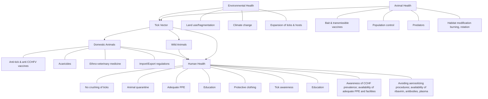

PUBLIC HEALTH BULLETIN-PAKISTAN

Vol. 3 | Week 25 3rd July 2023

# Integrated Disease Surveillance & Response (IDSR) Report

Center of Disease Control
National Institute of Health, Islamabad

NIH Pakistan logo Government of Pakistan logo

**PAKISTAN**

http://www.phb.nih.org.pk/

* The Integrated Disease Surveillance & Response (IDSR) Weekly Public Health Bulletin provides an overview of disease trends, outbreak alerts, and other important public health information. We hope to increase awareness and promote preventive measures by sharing this information.

* We encourage you to read the bulletin and share it with your colleagues, family, and friends. Together, we can work towards a healthier community.

Public Health Bulletin Pakistan logo

# OUR TIME WITH ANTIBIOTICS IS RUNNING OUT

Illustration of bacteria

CHANGE CAN'T WAIT

Hourglass inside a capsule pill

www.phb.nih.org.pk

NIH logo

UK Health Security Agency logo

World Health Organization logo

USAID logo

---

Public Health Bulletin Pakistan logo

NIH logo

Government of Pakistan logo

*Greetings*
*Team PHB-Pakistan*

### Overview

### IDSR Reports

### Ongoing Events

### Field Reports

## Preface

Stay informed and stay ahead with the Weekly Public Health Bulletin-Pakistan!

Discover the latest disease trends, outbreak alerts, and crucial public health data in one comprehensive issue. In this week's edition, we delve into the most prevalent reported cases, including acute diarrhea, malaria, influenza-like illness, and more.

Be updated on the overall decrease in disease cases from IDSR districts during week 25 while also gaining insights into the increased number of reported mumps and HIV/AIDS cases.

Furthermore, our response section features reports on significant immunization drives, such as the measles outbreak immunization drive in Punjab. Learn about XDR typhoid cases in KPK and neonatal tetanus from Rawalpindi Punjab, for a complete understanding of current health concerns.

As a bonus, this week's bulletin includes a knowledge review on CCHF disease and closing remarks on international group B strep disease awareness month. Don't miss out on this valuable resource for staying well-informed about public health matters. Subscribe to the Weekly Bulletin today!

Sincerely,
The Chief Editor

NIH logo

UK Health Security Agency logo

World Health Organization logo

USAID logo

---

# Overview

* During Week 25, the most common reported cases were acute diarrhea (non-cholera), followed by malaria, influenza-like illness (ILI), acute lower respiratory infection (ALRI) in children under 5 years old, bacterial diarrhea, severe acute respiratory infection (SARI), viral hepatitis (B, C, and D), typhoid fever, cholera, and mumps.

* In week 25, number of suspected cases reported in Disease Surveillance and Response (IDSR) system has been decreased as compared to last two weeks.

* Among Vaccine-preventable diseases (VPDs) a total of 668 suspected cases of mumps were reported, mainly from Sindh, Azad Jammu and Kashmir (AJK), and Khyber Pakhtunkhwa (KPK). All of these cases needs to be verified.

* The suspected cases of HIV/AIDS have been reported from Sindh and KPK. Field investigations are underway and blood samples are being collected.

All are suspected cases and need field verification.

Process flow diagram showing Data collection, Analysis, Sharing, Reporting, and Warehousing

National Institute of Health Pakistan logo

UK Health Security Agency logo

World Health Organization logo

USAID logo

---

# Overview

**IDSR compliance attributes**

* The national compliance rate for IDSR reporting in 125 implemented districts has increased from 68% to 75% for this week. The overall compliance rate is good, but there is still need for improvement.

* Islamabad Capital Territory is the only region with a compliance rate of 100% followed by Sindh province with 83%.

* The lowest compliance rate was observed in Balochistan province and Gilgit Baltistan.

<table>
  <thead>
    <tr>
        <th>Region</th>
        <th>Expected Reports</th>
        <th>Received Reports</th>
        <th>Compliance (%)</th>
    </tr>
  </thead>
  <tbody>
    <tr>
        <td>Khyber Pakhtunkhwa</td>
<td>1570</td>
<td>1217</td>
<td>78</td>
    </tr>
<tr>
        <td>Azad Jammu Kashmir</td>
<td>397</td>
<td>306</td>
<td>77</td>
    </tr>
<tr>
        <td>Islamabad Capital Territory</td>
<td>18</td>
<td>18</td>
<td>100</td>
    </tr>
<tr>
        <td>Balochistan</td>
<td>1160</td>
<td>694</td>
<td>60</td>
    </tr>
<tr>
        <td>Gilgit Baltistan</td>
<td>93</td>
<td>42</td>
<td>45</td>
    </tr>
<tr>
        <td>Sindh</td>
<td>1901</td>
<td>1586</td>
<td>83</td>
    </tr>
<tr>
        <td><strong>National</strong></td>
<td><strong>5139</strong></td>
<td><strong>3863</strong></td>
<td><strong>75</strong></td>
    </tr>
  </tbody>
</table>

NIH logo

UK Health Security Agency logo

World Health Organization logo

USAID logo

---

Pakistan

**Table 1: Province/Area wise distribution of most frequently reported cases during week 25, Pakistan.**

<table>
    <thead>
    <tr>
        <th>Diseases</th>
        <th>AJK</th>
        <th>Balochistan</th>
        <th>GB</th>
        <th>ICT</th>
        <th>KP</th>
        <th>Punjab</th>
        <th>Sindh</th>
        <th>Total</th>
    </tr>
    </thead>
    <tr>
        <td>ILI</td>
<td>2,313</td>
<td>4,832</td>
<td>45</td>
<td>756</td>
<td>5,193</td>
<td>NR</td>
<td>12,454</td>
<td>25,593</td>
    </tr>
<tr>
        <td>AD (Non-Cholera)</td>
<td>2,140</td>
<td>7,964</td>
<td>54</td>
<td>398</td>
<td>26,921</td>
<td>NR</td>
<td>43,608</td>
<td>81,085</td>
    </tr>
<tr>
        <td>Malaria</td>
<td>119</td>
<td>8,969</td>
<td>0</td>
<td>3</td>
<td>5,816</td>
<td>NR</td>
<td>56,112</td>
<td>71,019</td>
    </tr>
<tr>
        <td>B. Diarrhea</td>
<td>110</td>
<td>1,879</td>
<td>4</td>
<td>13</td>
<td>947</td>
<td>NR</td>
<td>2,931</td>
<td>5,884</td>
    </tr>
<tr>
        <td>Typhoid</td>
<td>49</td>
<td>1,452</td>
<td>8</td>
<td>2</td>
<td>1006</td>
<td>NR</td>
<td>1,722</td>
<td>4,239</td>
    </tr>
<tr>
        <td>SARI</td>
<td>427</td>
<td>932</td>
<td>51</td>
<td>0</td>
<td>1827</td>
<td>NR</td>
<td>368</td>
<td>3,605</td>
    </tr>
<tr>
        <td>ALRI &lt; 5 years</td>
<td>842</td>
<td>2,158</td>
<td>51</td>
<td>2</td>
<td>1373</td>
<td>NR</td>
<td>8,973</td>
<td>13,399</td>
    </tr>
<tr>
        <td>CL</td>
<td>3</td>
<td>108</td>
<td>0</td>
<td>0</td>
<td>571</td>
<td>NR</td>
<td>0</td>
<td>682</td>
    </tr>
<tr>
        <td>AWD (S. Cholera)</td>
<td>111</td>
<td>494</td>
<td>12</td>
<td>0</td>
<td>56</td>
<td>NR</td>
<td>25</td>
<td>698</td>
    </tr>
<tr>
        <td>Measles</td>
<td>29</td>
<td>73</td>
<td>0</td>
<td>2</td>
<td>243</td>
<td>NR</td>
<td>40</td>
<td>387</td>
    </tr>
<tr>
        <td>Dog Bite</td>
<td>61</td>
<td>160</td>
<td>0</td>
<td>0</td>
<td>158</td>
<td>NR</td>
<td>584</td>
<td>963</td>
    </tr>
<tr>
        <td>Dengue</td>
<td>0</td>
<td>44</td>
<td>0</td>
<td>0</td>
<td>8</td>
<td>NR</td>
<td>41</td>
<td>93</td>
    </tr>
<tr>
        <td>VH (B, C & D)</td>
<td>10</td>
<td>124</td>
<td>0</td>
<td>0</td>
<td>86</td>
<td>NR</td>
<td>4,345</td>
<td>4,565</td>
    </tr>
<tr>
        <td>Gonorrhea</td>
<td>0</td>
<td>80</td>
<td>0</td>
<td>0</td>
<td>3</td>
<td>NR</td>
<td>39</td>
<td>122</td>
    </tr>
<tr>
        <td>Pertussis</td>
<td>6</td>
<td>162</td>
<td>0</td>
<td>0</td>
<td>8</td>
<td>NR</td>
<td>15</td>
<td>191</td>
    </tr>
<tr>
        <td>VL</td>
<td>0</td>
<td>23</td>
<td>0</td>
<td>0</td>
<td>0</td>
<td>NR</td>
<td>1</td>
<td>24</td>
    </tr>
<tr>
        <td>NT</td>
<td>1</td>
<td>0</td>
<td>0</td>
<td>0</td>
<td>4</td>
<td>NR</td>
<td>0</td>
<td>5</td>
    </tr>
<tr>
        <td>Mumps</td>
<td>109</td>
<td>153</td>
<td>8</td>
<td>3</td>
<td>115</td>
<td>NR</td>
<td>553</td>
<td>941</td>
    </tr>
<tr>
        <td>AFP</td>
<td>3</td>
<td>1</td>
<td>0</td>
<td>0</td>
<td>21</td>
<td>NR</td>
<td>12</td>
<td>37</td>
    </tr>
<tr>
        <td>Chickenpox/ Varicella</td>
<td>15</td>
<td>47</td>
<td>5</td>
<td>4</td>
<td>170</td>
<td>NR</td>
<td>53</td>
<td>294</td>
    </tr>
<tr>
        <td>AVH (A & E)</td>
<td>27</td>
<td>36</td>
<td>5</td>
<td>0</td>
<td>322</td>
<td>NR</td>
<td>585</td>
<td>975</td>
    </tr>
<tr>
        <td>Meningitis</td>
<td>0</td>
<td>6</td>
<td>0</td>
<td>0</td>
<td>1</td>
<td>NR</td>
<td>5</td>
<td>12</td>
    </tr>
<tr>
        <td>Syphilis</td>
<td>0</td>
<td>10</td>
<td>0</td>
<td>0</td>
<td>0</td>
<td>NR</td>
<td>4</td>
<td>14</td>
    </tr>
<tr>
        <td>Leprosy</td>
<td>0</td>
<td>11</td>
<td>0</td>
<td>0</td>
<td>15</td>
<td>NR</td>
<td>1</td>
<td>27</td>
    </tr>
<tr>
        <td>Diphtheria (Probable)</td>
<td>1</td>
<td>13</td>
<td>1</td>
<td>0</td>
<td>1</td>
<td>NR</td>
<td>0</td>
<td>16</td>
    </tr>
<tr>
        <td>Chikungunya</td>
<td>0</td>
<td>1</td>
<td>0</td>
<td>0</td>
<td>0</td>
<td>NR</td>
<td>0</td>
<td>1</td>
    </tr>
<tr>
        <td>Anthrax</td>
<td>0</td>
<td>16</td>
<td>0</td>
<td>0</td>
<td>0</td>
<td>NR</td>
<td>0</td>
<td>16</td>
    </tr>
<tr>
        <td>Brucellosis</td>
<td>0</td>
<td>25</td>
<td>0</td>
<td>0</td>
<td>15</td>
<td>NR</td>
<td>0</td>
<td>40</td>
    </tr>
<tr>
        <td>CCHF</td>
<td>0</td>
<td>0</td>
<td>0</td>
<td>0</td>
<td>0</td>
<td>NR</td>
<td>0</td>
<td>0</td>
    </tr>
<tr>
        <td>Rubella (CRS)</td>
<td>0</td>
<td>1</td>
<td>0</td>
<td>0</td>
<td>0</td>
<td>NR</td>
<td>0</td>
<td>1</td>
    </tr>
<tr>
        <td>HIV/AIDS</td>
<td>0</td>
<td>0</td>
<td>0</td>
<td>0</td>
<td>1</td>
<td>NR</td>
<td>6</td>
<td>7</td>
    </tr>
</table>

**Figure 1: Most frequently reported suspected cases during week 25, Pakistan**

<table>
  <thead>
    <tr>
        <th>Disease</th>
        <th>WK 23</th>
        <th>WK 24</th>
        <th>WK 25</th>
    </tr>
  </thead>
  <tbody>
    <tr>
        <td>AD (Non-Cholera)</td>
<td>85,000</td>
<td>85,000</td>
<td>81,085</td>
    </tr>
<tr>
        <td>Malaria</td>
<td>71,000</td>
<td>75,000</td>
<td>71,019</td>
    </tr>
<tr>
        <td>ILI</td>
<td>28,000</td>
<td>28,000</td>
<td>25,593</td>
    </tr>
<tr>
        <td>ALRI &lt; 5 years</td>
<td>12,000</td>
<td>13,000</td>
<td>13,399</td>
    </tr>
<tr>
        <td>B. Diarrhea</td>
<td>5,000</td>
<td>5,000</td>
<td>5,884</td>
    </tr>
<tr>
        <td>VH (B, C &amp; D)</td>
<td>4,000</td>
<td>4,000</td>
<td>4,565</td>
    </tr>
<tr>
        <td>Typhoid</td>
<td>4,000</td>
<td>4,000</td>
<td>4,239</td>
    </tr>
<tr>
        <td>SARI</td>
<td>3,000</td>
<td>3,000</td>
<td>3,605</td>
    </tr>
<tr>
        <td>AVH (A &amp; E)</td>
<td>1,000</td>
<td>1,000</td>
<td>975</td>
    </tr>
<tr>
        <td>Dog Bite</td>
<td>1,000</td>
<td>1,000</td>
<td>963</td>
    </tr>
  </tbody>
</table>

NIH logo

UK Health Security Agency logo

World Health Organization logo

USAID logo

---

# Sindh

* Malaria cases were maximum followed by AD (Non-Cholera), ILI, ALRI<5 Years, VH (B, C, D), B. Diarrhea, Typhoid, SARI, dog bite and Mumps.
* There is decline in all cases reported this week from Sindh province.
* Malaria cases are from Kamber, Larkana, Umerkot and Sanghar whereas AD cases are mostly from Badin, Dadu, Sanghar, Khairpur and Shaheed Banazirabad.
* Cases of VH (B, C, D) are on rise and mostly reported from Matiari and Sanghar. Epidemiological investigations are required to verify cases and to control the disease.

Table 2: District wise distribution of most frequently reported suspected cases during week 25, Sindh

<table>
    <thead>
    <tr>
        <th>DISTRICTS</th>
        <th>AD (Non-
Cholera)</th>
        <th>Malaria</th>
        <th>ILI</th>
        <th>ALRI &lt; 
5 
years</th>
        <th>B. 
Diarrhea</th>
        <th>Typhoid</th>
        <th>SARI</th>
        <th>Measles</th>
        <th>VH (B, C 
& D)</th>
        <th>Dengue</th>
        <th>Dog Bite</th>
    </tr>
    </thead>
    <tr>
        <td>Badin</td>
<td>2,636</td>
<td>2,894</td>
<td>99</td>
<td>565</td>
<td>152</td>
<td>44</td>
<td>0</td>
<td>5</td>
<td>102</td>
<td>0</td>
<td>75</td>
    </tr>
<tr>
        <td>Dadu</td>
<td>3,768</td>
<td>4,251</td>
<td>80</td>
<td>886</td>
<td>232</td>
<td>241</td>
<td>35</td>
<td>2</td>
<td>0</td>
<td>0</td>
<td>0</td>
    </tr>
<tr>
        <td>Ghotki</td>
<td>1,035</td>
<td>843</td>
<td>0</td>
<td>327</td>
<td>117</td>
<td>34</td>
<td>0</td>
<td>3</td>
<td>362</td>
<td>0</td>
<td>0</td>
    </tr>
<tr>
        <td>Hyderabad</td>
<td>1,818</td>
<td>404</td>
<td>356</td>
<td>39</td>
<td>11</td>
<td>31</td>
<td>1</td>
<td>5</td>
<td>58</td>
<td>0</td>
<td>0</td>
    </tr>
<tr>
        <td>Jacobabad</td>
<td>2,006</td>
<td>1,299</td>
<td>20</td>
<td>1,136</td>
<td>174</td>
<td>12</td>
<td>1</td>
<td>3</td>
<td>187</td>
<td>0</td>
<td>62</td>
    </tr>
<tr>
        <td>Jamshoro</td>
<td>92</td>
<td>112</td>
<td>0</td>
<td>6</td>
<td>3</td>
<td>5</td>
<td>0</td>
<td>0</td>
<td>0</td>
<td>0</td>
<td>0</td>
    </tr>
<tr>
        <td>Kamber</td>
<td>2,258</td>
<td>6,058</td>
<td>0</td>
<td>245</td>
<td>131</td>
<td>13</td>
<td>0</td>
<td>0</td>
<td>57</td>
<td>0</td>
<td>0</td>
    </tr>
<tr>
        <td>Karachi Central</td>
<td>1,260</td>
<td>87</td>
<td>1,347</td>
<td>12</td>
<td>32</td>
<td>123</td>
<td>0</td>
<td>4</td>
<td>170</td>
<td>3</td>
<td>1</td>
    </tr>
<tr>
        <td>Karachi East</td>
<td>281</td>
<td>51</td>
<td>67</td>
<td>1</td>
<td>9</td>
<td>5</td>
<td>0</td>
<td>1</td>
<td>0</td>
<td>15</td>
<td>0</td>
    </tr>
<tr>
        <td>Karachi Keamari</td>
<td>416</td>
<td>7</td>
<td>184</td>
<td>23</td>
<td>2</td>
<td>5</td>
<td>0</td>
<td>0</td>
<td>0</td>
<td>0</td>
<td>0</td>
    </tr>
<tr>
        <td>Karachi Korangi</td>
<td>323</td>
<td>71</td>
<td>14</td>
<td>0</td>
<td>7</td>
<td>2</td>
<td>0</td>
<td>1</td>
<td>0</td>
<td>6</td>
<td>0</td>
    </tr>
<tr>
        <td>Karachi Malir</td>
<td>1,255</td>
<td>75</td>
<td>1,114</td>
<td>373</td>
<td>53</td>
<td>33</td>
<td>77</td>
<td>0</td>
<td>21</td>
<td>1</td>
<td>6</td>
    </tr>
<tr>
        <td>Karachi South</td>
<td>106</td>
<td>29</td>
<td>0</td>
<td>0</td>
<td>1</td>
<td>0</td>
<td>0</td>
<td>0</td>
<td>0</td>
<td>0</td>
<td>0</td>
    </tr>
<tr>
        <td>Karachi West</td>
<td>619</td>
<td>86</td>
<td>421</td>
<td>191</td>
<td>46</td>
<td>21</td>
<td>47</td>
<td>1</td>
<td>24</td>
<td>11</td>
<td>33</td>
    </tr>
<tr>
        <td>Kashmore</td>
<td>634</td>
<td>1,705</td>
<td>283</td>
<td>213</td>
<td>78</td>
<td>13</td>
<td>6</td>
<td>0</td>
<td>56</td>
<td>0</td>
<td>3</td>
    </tr>
<tr>
        <td>Khairpur</td>
<td>2,729</td>
<td>4,260</td>
<td>323</td>
<td>680</td>
<td>332</td>
<td>247</td>
<td>65</td>
<td>0</td>
<td>139</td>
<td>0</td>
<td>31</td>
    </tr>
<tr>
        <td>Larkana</td>
<td>1,977</td>
<td>9,281</td>
<td>0</td>
<td>204</td>
<td>230</td>
<td>18</td>
<td>2</td>
<td>0</td>
<td>542</td>
<td>0</td>
<td>0</td>
    </tr>
<tr>
        <td>Matiari</td>
<td>1,807</td>
<td>1,126</td>
<td>0</td>
<td>163</td>
<td>110</td>
<td>75</td>
<td>19</td>
<td>1</td>
<td>504</td>
<td>5</td>
<td>16</td>
    </tr>
<tr>
        <td>Mirpurkhas</td>
<td>2,861</td>
<td>3,174</td>
<td>2,722</td>
<td>310</td>
<td>110</td>
<td>37</td>
<td>39</td>
<td>0</td>
<td>73</td>
<td>0</td>
<td>2</td>
    </tr>
<tr>
        <td>Naushero Feroze</td>
<td>1,929</td>
<td>1,925</td>
<td>897</td>
<td>719</td>
<td>81</td>
<td>252</td>
<td>0</td>
<td>0</td>
<td>57</td>
<td>0</td>
<td>25</td>
    </tr>
<tr>
        <td>Sanghar</td>
<td>2,391</td>
<td>1,739</td>
<td>99</td>
<td>507</td>
<td>131</td>
<td>77</td>
<td>22</td>
<td>2</td>
<td>727</td>
<td>0</td>
<td>173</td>
    </tr>
<tr>
        <td>Shaheed 
Benazirabad</td>
<td>2,152</td>
<td>1,819</td>
<td>32</td>
<td>378</td>
<td>90</td>
<td>287</td>
<td>0</td>
<td>1</td>
<td>158</td>
<td>0</td>
<td>0</td>
    </tr>
<tr>
        <td>Shikarpur</td>
<td>1,212</td>
<td>1,302</td>
<td>0</td>
<td>145</td>
<td>101</td>
<td>4</td>
<td>0</td>
<td>3</td>
<td>174</td>
<td>0</td>
<td>0</td>
    </tr>
<tr>
        <td>Sujawal</td>
<td>608</td>
<td>669</td>
<td>0</td>
<td>66</td>
<td>18</td>
<td>0</td>
<td>0</td>
<td>0</td>
<td>0</td>
<td>0</td>
<td>0</td>
    </tr>
<tr>
        <td>Sukkur</td>
<td>1,835</td>
<td>2,703</td>
<td>1,628</td>
<td>339</td>
<td>236</td>
<td>14</td>
<td>1</td>
<td>5</td>
<td>416</td>
<td>0</td>
<td>0</td>
    </tr>
<tr>
        <td>Tando Allahyar</td>
<td>1,030</td>
<td>1,077</td>
<td>304</td>
<td>178</td>
<td>93</td>
<td>25</td>
<td>1</td>
<td>0</td>
<td>190</td>
<td>0</td>
<td>48</td>
    </tr>
<tr>
        <td>Tando 
Muhammad Khan</td>
<td>411</td>
<td>365</td>
<td>0</td>
<td>58</td>
<td>22</td>
<td>1</td>
<td>0</td>
<td>0</td>
<td>22</td>
<td>0</td>
<td>48</td>
    </tr>
<tr>
        <td>Tharparkar</td>
<td>1,222</td>
<td>1,918</td>
<td>1,288</td>
<td>358</td>
<td>96</td>
<td>23</td>
<td>0</td>
<td>0</td>
<td>47</td>
<td>0</td>
<td>0</td>
    </tr>
<tr>
        <td>Thatta</td>
<td>1,553</td>
<td>2,838</td>
<td>1,176</td>
<td>322</td>
<td>176</td>
<td>26</td>
<td>22</td>
<td>1</td>
<td>131</td>
<td>0</td>
<td>61</td>
    </tr>
<tr>
        <td>Umerkot</td>
<td>1,384</td>
<td>3,944</td>
<td>0</td>
<td>529</td>
<td>57</td>
<td>54</td>
<td>30</td>
<td>2</td>
<td>128</td>
<td>0</td>
<td>0</td>
    </tr>
<tr>
        <td>Total</td>
<td>43,608</td>
<td>56,112</td>
<td>12,454</td>
<td>8,973</td>
<td>2,931</td>
<td>1,722</td>
<td>368</td>
<td>40</td>
<td>4,345</td>
<td>41</td>
<td>584</td>
    </tr>
</table>

Figure 2: Most frequently reported suspected cases during week 25, Sindh

<table>
  <thead>
    <tr>
        <th>Disease</th>
        <th>WK 23</th>
        <th>WK 24</th>
        <th>WK 25</th>
    </tr>
  </thead>
  <tbody>
    <tr>
        <td>Malaria</td>
<td>52000</td>
<td>58000</td>
<td>56112</td>
    </tr>
<tr>
        <td>AD (Non-Cholera)</td>
<td>42000</td>
<td>44000</td>
<td>43608</td>
    </tr>
<tr>
        <td>ILI</td>
<td>12000</td>
<td>11000</td>
<td>12454</td>
    </tr>
<tr>
        <td>ALRI &lt; 5 years</td>
<td>8000</td>
<td>8000</td>
<td>8973</td>
    </tr>
<tr>
        <td>VH (B, C &amp; D)</td>
<td>3000</td>
<td>3000</td>
<td>4345</td>
    </tr>
<tr>
        <td>B. Diarrhea</td>
<td>2500</td>
<td>2500</td>
<td>2931</td>
    </tr>
<tr>
        <td>Typhoid</td>
<td>1500</td>
<td>1500</td>
<td>1722</td>
    </tr>
<tr>
        <td>AVH (A &amp; E)</td>
<td>500</td>
<td>500</td>
<td>585</td>
    </tr>
<tr>
        <td>Dog Bite</td>
<td>500</td>
<td>500</td>
<td>584</td>
    </tr>
<tr>
        <td>Mumps</td>
<td>500</td>
<td>500</td>
<td>553</td>
    </tr>
  </tbody>
</table>

National Institute of Health Pakistan logo

UK Health Security Agency logo

World Health Organization logo

USAID logo

---

# Balochistan

* Malaria, AD (Non-Cholera), ILI, ALRI <5 years, B. Diarrhea, SARI, Typhoid, AWD (S. Cholera), Pertussis and Gonorrhea were the most frequently reported diseases from Balochistan province.
* Cases of ILI, AD and Malaria showed a decline trend this week.
* This week AWD (S. Cholera) cases are reported in high numbers from Mastug and Quetta districts, all are suspected cases and demand urgent field investigation...

Table3: District wise distribution of most frequently reported suspected cases during week 25, Balochistan

<table>
    <thead>
    <tr>
        <th>Districts</th>
        <th>ILI</th>
        <th>Malaria</th>
        <th>AD (Non-
Cholera)</th>
        <th>ALRI &lt; 5 
years</th>
        <th>SARI</th>
        <th>B. 
Diarrhea</th>
        <th>Typhoid</th>
        <th>CL</th>
        <th>Dog Bite</th>
        <th>AWD (S. 
Cholera)</th>
    </tr>
    </thead>
    <tr>
        <td>Awaran</td>
<td>38</td>
<td>474</td>
<td>63</td>
<td>30</td>
<td>20</td>
<td>48</td>
<td>27</td>
<td>3</td>
<td>1</td>
<td>47</td>
    </tr>
<tr>
        <td>Chagai</td>
<td>248</td>
<td>40</td>
<td>145</td>
<td>0</td>
<td>0</td>
<td>50</td>
<td>23</td>
<td>0</td>
<td>0</td>
<td>8</td>
    </tr>
<tr>
        <td>Duki</td>
<td>87</td>
<td>135</td>
<td>195</td>
<td>30</td>
<td>62</td>
<td>113</td>
<td>25</td>
<td>7</td>
<td>0</td>
<td>54</td>
    </tr>
<tr>
        <td>Gwadar</td>
<td>434</td>
<td>152</td>
<td>328</td>
<td>52</td>
<td>2</td>
<td>70</td>
<td>57</td>
<td>1</td>
<td>3</td>
<td>NR</td>
    </tr>
<tr>
        <td>Harnai</td>
<td>14</td>
<td>128</td>
<td>398</td>
<td>452</td>
<td>0</td>
<td>97</td>
<td>8</td>
<td>0</td>
<td>1</td>
<td>27</td>
    </tr>
<tr>
        <td>Jaffarabad</td>
<td>168</td>
<td>2,465</td>
<td>1,423</td>
<td>180</td>
<td>89</td>
<td>160</td>
<td>628</td>
<td>9</td>
<td>14</td>
<td>0</td>
    </tr>
<tr>
        <td>Jhal Magsi</td>
<td>0</td>
<td>869</td>
<td>353</td>
<td>49</td>
<td>4</td>
<td>19</td>
<td>18</td>
<td>0</td>
<td>32</td>
<td>14</td>
    </tr>
<tr>
        <td>Kachhi (Bolan)</td>
<td>20</td>
<td>129</td>
<td>139</td>
<td>8</td>
<td>26</td>
<td>10</td>
<td>58</td>
<td>0</td>
<td>0</td>
<td>0</td>
    </tr>
<tr>
        <td>Kalat</td>
<td>16</td>
<td>18</td>
<td>30</td>
<td>16</td>
<td>0</td>
<td>11</td>
<td>4</td>
<td>0</td>
<td>0</td>
<td>0</td>
    </tr>
<tr>
        <td>Kech (Turbat)</td>
<td>787</td>
<td>456</td>
<td>478</td>
<td>78</td>
<td>3</td>
<td>83</td>
<td>4</td>
<td>0</td>
<td>0</td>
<td>6</td>
    </tr>
<tr>
        <td>Kharan</td>
<td>176</td>
<td>149</td>
<td>123</td>
<td>0</td>
<td>0</td>
<td>76</td>
<td>7</td>
<td>0</td>
<td>0</td>
<td>2</td>
    </tr>
<tr>
        <td>Khuzdar</td>
<td>128</td>
<td>185</td>
<td>143</td>
<td>0</td>
<td>11</td>
<td>54</td>
<td>13</td>
<td>1</td>
<td>0</td>
<td>4</td>
    </tr>
<tr>
        <td>Killa Abdullah</td>
<td>21</td>
<td>0</td>
<td>26</td>
<td>0</td>
<td>16</td>
<td>1</td>
<td>0</td>
<td>9</td>
<td>0</td>
<td>2</td>
    </tr>
<tr>
        <td>Killa Saifullah</td>
<td>2</td>
<td>256</td>
<td>283</td>
<td>118</td>
<td>15</td>
<td>103</td>
<td>52</td>
<td>23</td>
<td>0</td>
<td>28</td>
    </tr>
<tr>
        <td>Kohlu</td>
<td>110</td>
<td>114</td>
<td>85</td>
<td>15</td>
<td>34</td>
<td>68</td>
<td>35</td>
<td>2</td>
<td>0</td>
<td>2</td>
    </tr>
<tr>
        <td>Lasbella</td>
<td>96</td>
<td>952</td>
<td>768</td>
<td>180</td>
<td>279</td>
<td>113</td>
<td>34</td>
<td>5</td>
<td>45</td>
<td>1</td>
    </tr>
<tr>
        <td>Loralai</td>
<td>271</td>
<td>67</td>
<td>230</td>
<td>41</td>
<td>111</td>
<td>87</td>
<td>36</td>
<td>0</td>
<td>0</td>
<td>3</td>
    </tr>
<tr>
        <td>Mastung</td>
<td>536</td>
<td>269</td>
<td>798</td>
<td>313</td>
<td>96</td>
<td>107</td>
<td>74</td>
<td>17</td>
<td>27</td>
<td>45</td>
    </tr>
<tr>
        <td>Musa Khail</td>
<td>85</td>
<td>245</td>
<td>74</td>
<td>9</td>
<td>1</td>
<td>22</td>
<td>25</td>
<td>0</td>
<td>6</td>
<td>30</td>
    </tr>
<tr>
        <td>Naseerabad</td>
<td>0</td>
<td>700</td>
<td>200</td>
<td>2</td>
<td>0</td>
<td>12</td>
<td>63</td>
<td>0</td>
<td>2</td>
<td>6</td>
    </tr>
<tr>
        <td>Nushki</td>
<td>0</td>
<td>152</td>
<td>214</td>
<td>0</td>
<td>13</td>
<td>87</td>
<td>0</td>
<td>0</td>
<td>0</td>
<td>40</td>
    </tr>
<tr>
        <td>Panjgur</td>
<td>85</td>
<td>207</td>
<td>207</td>
<td>88</td>
<td>1</td>
<td>53</td>
<td>42</td>
<td>3</td>
<td>0</td>
<td>14</td>
    </tr>
<tr>
        <td>Pishin</td>
<td>87</td>
<td>20</td>
<td>175</td>
<td>21</td>
<td>0</td>
<td>117</td>
<td>22</td>
<td>8</td>
<td>3</td>
<td>0</td>
    </tr>
<tr>
        <td>Quetta</td>
<td>822</td>
<td>27</td>
<td>423</td>
<td>44</td>
<td>13</td>
<td>123</td>
<td>46</td>
<td>9</td>
<td>0</td>
<td>88</td>
    </tr>
<tr>
        <td>Sherani</td>
<td>22</td>
<td>17</td>
<td>13</td>
<td>2</td>
<td>3</td>
<td>13</td>
<td>11</td>
<td>4</td>
<td>0</td>
<td>0</td>
    </tr>
<tr>
        <td>Sibi</td>
<td>84</td>
<td>450</td>
<td>198</td>
<td>32</td>
<td>25</td>
<td>35</td>
<td>76</td>
<td>3</td>
<td>21</td>
<td>26</td>
    </tr>
<tr>
        <td>SURAB</td>
<td>0</td>
<td>4</td>
<td>8</td>
<td>0</td>
<td>0</td>
<td>0</td>
<td>2</td>
<td>0</td>
<td>0</td>
<td>0</td>
    </tr>
<tr>
        <td>Washuk</td>
<td>173</td>
<td>124</td>
<td>113</td>
<td>8</td>
<td>40</td>
<td>30</td>
<td>27</td>
<td>4</td>
<td>0</td>
<td>9</td>
    </tr>
<tr>
        <td>Zhob</td>
<td>130</td>
<td>127</td>
<td>204</td>
<td>357</td>
<td>58</td>
<td>85</td>
<td>21</td>
<td>0</td>
<td>0</td>
<td>1</td>
    </tr>
<tr>
        <td>Ziarat</td>
<td>192</td>
<td>38</td>
<td>127</td>
<td>33</td>
<td>10</td>
<td>32</td>
<td>14</td>
<td>0</td>
<td>5</td>
<td>37</td>
    </tr>
<tr>
        <td>Total</td>
<td>4,832</td>
<td>8,969</td>
<td>7,964</td>
<td>2,158</td>
<td>932</td>
<td>1,879</td>
<td>1,452</td>
<td>108</td>
<td>160</td>
<td>494</td>
    </tr>
</table>

Figure 3: Most frequently reported suspected cases during week 25, Balochistan

<table>
  <thead>
    <tr>
        <th>Disease</th>
        <th>WK 23</th>
        <th>WK 24</th>
        <th>WK 25</th>
    </tr>
  </thead>
  <tbody>
    <tr>
        <td>AD (Non-Cholera)</td>
<td>29500</td>
<td>29000</td>
<td>26921</td>
    </tr>
<tr>
        <td>Malaria</td>
<td>6200</td>
<td>6000</td>
<td>5816</td>
    </tr>
<tr>
        <td>ILI</td>
<td>7100</td>
<td>6300</td>
<td>5193</td>
    </tr>
<tr>
        <td>SARI</td>
<td>2800</td>
<td>2500</td>
<td>1827</td>
    </tr>
<tr>
        <td>ALRI &lt; 5 years</td>
<td>1900</td>
<td>1800</td>
<td>1373</td>
    </tr>
<tr>
        <td>Typhoid</td>
<td>1200</td>
<td>1100</td>
<td>1006</td>
    </tr>
<tr>
        <td>B. Diarrhea</td>
<td>1100</td>
<td>1000</td>
<td>947</td>
    </tr>
<tr>
        <td>CL</td>
<td>700</td>
<td>650</td>
<td>571</td>
    </tr>
<tr>
        <td>AVH (A &amp; E)</td>
<td>400</td>
<td>350</td>
<td>322</td>
    </tr>
<tr>
        <td>Measles</td>
<td>300</td>
<td>280</td>
<td>243</td>
    </tr>
  </tbody>
</table>

NIH logo

UK Health Security Agency logo

World Health Organization logo

USAID logo

---

# Khyber Pakhtunkhwa

* Cases of AD (Non-Cholera) were maximum followed by ILI, Malaria, SARI, ALRI<5 Years, Typhoid, B. Diarrhea, CL, AVH (A&E) and Measles cases.

* AD showed downward trend in cases this week whereas ILI and Malaria has upward trend.

* Cases of B. Diarrhea were mostly reported from Peshawar and Dir Lower. Further, 15 cases of suspected Cholera reported from Kohistan Upper.

Table 4: District wise distribution of most frequently reported suspected cases during week 25, KP

<table>
    <thead>
    <tr>
        <th>Diseases</th>
        <th>AD (Non-
Cholera)</th>
        <th>Malaria</th>
        <th>ILI</th>
        <th>SARI</th>
        <th>ALRI &lt; 5 
years</th>
        <th>B. Diarrhea</th>
        <th>Typhoid</th>
        <th>Dog Bite</th>
        <th>AWD (S. 
Cholera)</th>
        <th>AVH (A & 
E)</th>
    </tr>
    </thead>
    <tr>
        <td>Abbottabad</td>
<td>668</td>
<td>1</td>
<td>10</td>
<td>6</td>
<td>2</td>
<td>3</td>
<td>12</td>
<td>2</td>
<td>0</td>
<td>0</td>
    </tr>
<tr>
        <td>Bannu</td>
<td>623</td>
<td>1,014</td>
<td>77</td>
<td>0</td>
<td>6</td>
<td>10</td>
<td>40</td>
<td>0</td>
<td>0</td>
<td>0</td>
    </tr>
<tr>
        <td>Battagram</td>
<td>292</td>
<td>43</td>
<td>513</td>
<td>0</td>
<td>0</td>
<td>0</td>
<td>1</td>
<td>23</td>
<td>0</td>
<td>4</td>
    </tr>
<tr>
        <td>Buner</td>
<td>614</td>
<td>640</td>
<td>0</td>
<td>0</td>
<td>0</td>
<td>36</td>
<td>16</td>
<td>3</td>
<td>0</td>
<td>0</td>
    </tr>
<tr>
        <td>Charsadda</td>
<td>1,222</td>
<td>75</td>
<td>159</td>
<td>32</td>
<td>10</td>
<td>0</td>
<td>0</td>
<td>0</td>
<td>0</td>
<td>0</td>
    </tr>
<tr>
        <td>Chitral Lower</td>
<td>663</td>
<td>9</td>
<td>70</td>
<td>561</td>
<td>0</td>
<td>0</td>
<td>4</td>
<td>9</td>
<td>0</td>
<td>0</td>
    </tr>
<tr>
        <td>Chitral Upper</td>
<td>152</td>
<td>6</td>
<td>2</td>
<td>192</td>
<td>0</td>
<td>0</td>
<td>20</td>
<td>1</td>
<td>0</td>
<td>0</td>
    </tr>
<tr>
        <td>D.I. Khan</td>
<td>1,034</td>
<td>465</td>
<td>26</td>
<td>41</td>
<td>19</td>
<td>19</td>
<td>22</td>
<td>40</td>
<td>0</td>
<td>0</td>
    </tr>
<tr>
        <td>Dir Lower</td>
<td>2,058</td>
<td>825</td>
<td>171</td>
<td>209</td>
<td>228</td>
<td>154</td>
<td>88</td>
<td>22</td>
<td>0</td>
<td>135</td>
    </tr>
<tr>
        <td>Dir Upper</td>
<td>725</td>
<td>7</td>
<td>40</td>
<td>0</td>
<td>27</td>
<td>37</td>
<td>42</td>
<td>0</td>
<td>0</td>
<td>9</td>
    </tr>
<tr>
        <td>Hangu</td>
<td>293</td>
<td>210</td>
<td>409</td>
<td>173</td>
<td>9</td>
<td>16</td>
<td>20</td>
<td>1</td>
<td>0</td>
<td>18</td>
    </tr>
<tr>
        <td>Haripur</td>
<td>1,385</td>
<td>47</td>
<td>259</td>
<td>25</td>
<td>54</td>
<td>10</td>
<td>57</td>
<td>0</td>
<td>0</td>
<td>52</td>
    </tr>
<tr>
        <td>Karak</td>
<td>444</td>
<td>94</td>
<td>65</td>
<td>16</td>
<td>21</td>
<td>1</td>
<td>8</td>
<td>13</td>
<td>4</td>
<td>0</td>
    </tr>
<tr>
        <td>Khyber</td>
<td>10</td>
<td>13</td>
<td>72</td>
<td>2</td>
<td>1</td>
<td>7</td>
<td>6</td>
<td>0</td>
<td>0</td>
<td>1</td>
    </tr>
<tr>
        <td>Kohat</td>
<td>62</td>
<td>32</td>
<td>26</td>
<td>2</td>
<td>1</td>
<td>0</td>
<td>0</td>
<td>4</td>
<td>8</td>
<td>0</td>
    </tr>
<tr>
        <td>Kohistan Lower</td>
<td>75</td>
<td>4</td>
<td>0</td>
<td>189</td>
<td>10</td>
<td>18</td>
<td>0</td>
<td>0</td>
<td>1</td>
<td>0</td>
    </tr>
<tr>
        <td>Kohistan Upper</td>
<td>426</td>
<td>0</td>
<td>44</td>
<td>51</td>
<td>0</td>
<td>28</td>
<td>78</td>
<td>0</td>
<td>1</td>
<td>0</td>
    </tr>
<tr>
        <td>Kolai Palas</td>
<td>91</td>
<td>3</td>
<td>0</td>
<td>10</td>
<td>8</td>
<td>16</td>
<td>0</td>
<td>0</td>
<td>9</td>
<td>0</td>
    </tr>
<tr>
        <td>L & C Kurram</td>
<td>25</td>
<td>20</td>
<td>72</td>
<td>0</td>
<td>0</td>
<td>2</td>
<td>1</td>
<td>2</td>
<td>0</td>
<td>0</td>
    </tr>
<tr>
        <td>Lakki Marwat</td>
<td>719</td>
<td>1,140</td>
<td>0</td>
<td>0</td>
<td>20</td>
<td>16</td>
<td>25</td>
<td>0</td>
<td>0</td>
<td>0</td>
    </tr>
<tr>
        <td>Malakand</td>
<td>1,919</td>
<td>92</td>
<td>34</td>
<td>21</td>
<td>92</td>
<td>132</td>
<td>10</td>
<td>1</td>
<td>0</td>
<td>13</td>
    </tr>
<tr>
        <td>Mansehra</td>
<td>1,026</td>
<td>84</td>
<td>648</td>
<td>50</td>
<td>86</td>
<td>24</td>
<td>139</td>
<td>0</td>
<td>19</td>
<td>10</td>
    </tr>
<tr>
        <td>Mardan</td>
<td>1,184</td>
<td>36</td>
<td>594</td>
<td>20</td>
<td>231</td>
<td>47</td>
<td>6</td>
<td>2</td>
<td>2</td>
<td>2</td>
    </tr>
<tr>
        <td>Nowshera</td>
<td>1,560</td>
<td>39</td>
<td>64</td>
<td>9</td>
<td>6</td>
<td>44</td>
<td>16</td>
<td>0</td>
<td>0</td>
<td>7</td>
    </tr>
<tr>
        <td>Peshawar</td>
<td>2,924</td>
<td>76</td>
<td>818</td>
<td>39</td>
<td>266</td>
<td>216</td>
<td>128</td>
<td>6</td>
<td>0</td>
<td>13</td>
    </tr>
<tr>
        <td>Shangla</td>
<td>354</td>
<td>386</td>
<td>0</td>
<td>4</td>
<td>2</td>
<td>1</td>
<td>14</td>
<td>10</td>
<td>11</td>
<td>0</td>
    </tr>
<tr>
        <td>Swabi</td>
<td>1,931</td>
<td>38</td>
<td>958</td>
<td>70</td>
<td>210</td>
<td>24</td>
<td>51</td>
<td>1</td>
<td>0</td>
<td>38</td>
    </tr>
<tr>
        <td>Swat</td>
<td>4,060</td>
<td>49</td>
<td>62</td>
<td>86</td>
<td>62</td>
<td>35</td>
<td>185</td>
<td>7</td>
<td>0</td>
<td>19</td>
    </tr>
<tr>
        <td>Tank</td>
<td>279</td>
<td>224</td>
<td>0</td>
<td>0</td>
<td>0</td>
<td>23</td>
<td>5</td>
<td>0</td>
<td>0</td>
<td>0</td>
    </tr>
<tr>
        <td>Tor Ghar</td>
<td>103</td>
<td>144</td>
<td>0</td>
<td>19</td>
<td>2</td>
<td>28</td>
<td>12</td>
<td>11</td>
<td>1</td>
<td>1</td>
    </tr>
<tr>
        <td>Total</td>
<td>26,921</td>
<td>5,816</td>
<td>5,193</td>
<td>1,827</td>
<td>1,373</td>
<td>947</td>
<td>1,006</td>
<td>158</td>
<td>56</td>
<td>322</td>
    </tr>
</table>

Figure 4: Most frequently reported suspected cases during week 25, KP

<table>
  <thead>
    <tr>
        <th>Disease Category</th>
        <th>WK 23</th>
        <th>WK 24</th>
        <th>WK 25</th>
    </tr>
  </thead>
  <tbody>
    <tr>
        <td>AD (Non-Cholera)</td>
<td>29000</td>
<td>28500</td>
<td>26,921</td>
    </tr>
<tr>
        <td>Malaria</td>
<td>6000</td>
<td>5900</td>
<td>5,816</td>
    </tr>
<tr>
        <td>ILI</td>
<td>6500</td>
<td>6000</td>
<td>5,193</td>
    </tr>
<tr>
        <td>SARI</td>
<td>2000</td>
<td>1900</td>
<td>1,827</td>
    </tr>
<tr>
        <td>ALRI &lt; 5 years</td>
<td>1500</td>
<td>1450</td>
<td>1,373</td>
    </tr>
<tr>
        <td>Typhoid</td>
<td>1100</td>
<td>1050</td>
<td>1,006</td>
    </tr>
<tr>
        <td>B. Diarrhea</td>
<td>1000</td>
<td>980</td>
<td>947</td>
    </tr>
<tr>
        <td>CL</td>
<td>600</td>
<td>580</td>
<td>571</td>
    </tr>
<tr>
        <td>AVH (A &amp; E)</td>
<td>350</td>
<td>330</td>
<td>322</td>
    </tr>
<tr>
        <td>Measles</td>
<td>250</td>
<td>245</td>
<td>243</td>
    </tr>
  </tbody>
</table>

NIH logo

UK Health Security Agency logo

World Health Organization logo

USAID logo

---

# ICT, AJK & GB

*   *ICT*: The most frequently reported cases from Islamabad were ILI followed by AD (Non-Cholera). ILI cases showed steady trend in cases this week.

*   *AJK*: ILI cases were maximum followed by AD (Non-Cholera), ALRI <5 years, SARI, B. Diarrhea, Mumps, AWD (S. Cholera), Malaria, CL and Typhoid. Both ILI and ALRI <5 years cases showed a downward trend in cases this week.

*   *GB*: ALRI<5 years cases were maximum followed by AD (Non. Cholera) and SARI. ALRI <5 years cases showed slight upward trend in cases this week.

Figure 5: Most frequently reported suspected cases during week 25, ICT

<table>
  <thead>
    <tr>
        <th>Category</th>
        <th>WK23</th>
        <th>WK24</th>
        <th>WK25</th>
    </tr>
  </thead>
  <tbody>
    <tr>
        <td>ILI</td>
<td>670</td>
<td>1020</td>
<td>756</td>
    </tr>
<tr>
        <td>AD (Non-Cholera)</td>
<td>350</td>
<td>470</td>
<td>398</td>
    </tr>
<tr>
        <td>B. Diarrhea</td>
<td>15</td>
<td>10</td>
<td>13</td>
    </tr>
  </tbody>
</table>

Figure 6: Week wise reported suspected cases of ILI, ICT

<table>
  <thead>
    <tr>
        <th>Week</th>
        <th>ILI</th>
    </tr>
  </thead>
  <tbody>
    <tr>
        <td>W26</td>
<td>1000</td>
    </tr>
<tr>
        <td>W27</td>
<td>650</td>
    </tr>
<tr>
        <td>W28</td>
<td>620</td>
    </tr>
<tr>
        <td>W29</td>
<td>850</td>
    </tr>
<tr>
        <td>W30</td>
<td>1100</td>
    </tr>
<tr>
        <td>W31</td>
<td>1300</td>
    </tr>
<tr>
        <td>W32</td>
<td>1350</td>
    </tr>
<tr>
        <td>W33</td>
<td>1250</td>
    </tr>
<tr>
        <td>W34</td>
<td>400</td>
    </tr>
<tr>
        <td>W35</td>
<td>1450</td>
    </tr>
<tr>
        <td>W36</td>
<td>150</td>
    </tr>
<tr>
        <td>W37</td>
<td>100</td>
    </tr>
<tr>
        <td>W38</td>
<td>1250</td>
    </tr>
<tr>
        <td>W39</td>
<td>1000</td>
    </tr>
<tr>
        <td>W40</td>
<td>2150</td>
    </tr>
<tr>
        <td>W41</td>
<td>2350</td>
    </tr>
<tr>
        <td>W42</td>
<td>2700</td>
    </tr>
<tr>
        <td>W43</td>
<td>2600</td>
    </tr>
<tr>
        <td>W44</td>
<td>1850</td>
    </tr>
<tr>
        <td>W45</td>
<td>1700</td>
    </tr>
<tr>
        <td>W46</td>
<td>1550</td>
    </tr>
<tr>
        <td>W47</td>
<td>2450</td>
    </tr>
<tr>
        <td>W48</td>
<td>2350</td>
    </tr>
<tr>
        <td>W49</td>
<td>2550</td>
    </tr>
<tr>
        <td>W50</td>
<td>3200</td>
    </tr>
<tr>
        <td>W51</td>
<td>2500</td>
    </tr>
<tr>
        <td>W52</td>
<td>2200</td>
    </tr>
<tr>
        <td>W1</td>
<td>2100</td>
    </tr>
<tr>
        <td>W2</td>
<td>1650</td>
    </tr>
<tr>
        <td>W3</td>
<td>2000</td>
    </tr>
<tr>
        <td>W4</td>
<td>2000</td>
    </tr>
<tr>
        <td>W5</td>
<td>2000</td>
    </tr>
<tr>
        <td>W6</td>
<td>1600</td>
    </tr>
<tr>
        <td>W7</td>
<td>2350</td>
    </tr>
<tr>
        <td>W8</td>
<td>1600</td>
    </tr>
<tr>
        <td>W9</td>
<td>2250</td>
    </tr>
<tr>
        <td>W10</td>
<td>2100</td>
    </tr>
<tr>
        <td>W11</td>
<td>1700</td>
    </tr>
<tr>
        <td>W12</td>
<td>750</td>
    </tr>
<tr>
        <td>W13</td>
<td>1500</td>
    </tr>
<tr>
        <td>W14</td>
<td>1500</td>
    </tr>
<tr>
        <td>W15</td>
<td>1100</td>
    </tr>
<tr>
        <td>W16</td>
<td>650</td>
    </tr>
<tr>
        <td>W17</td>
<td>1150</td>
    </tr>
<tr>
        <td>W18</td>
<td>950</td>
    </tr>
<tr>
        <td>W19</td>
<td>1500</td>
    </tr>
<tr>
        <td>W20</td>
<td>750</td>
    </tr>
<tr>
        <td>W21</td>
<td>1150</td>
    </tr>
<tr>
        <td>W22</td>
<td>1150</td>
    </tr>
<tr>
        <td>W23</td>
<td>650</td>
    </tr>
<tr>
        <td>W24</td>
<td>1000</td>
    </tr>
<tr>
        <td>W25</td>
<td>750</td>
    </tr>
  </tbody>
</table>

Figure 7: Most frequently reported suspected cases during week 25, AJK

<table>
  <thead>
    <tr>
        <th>Category</th>
        <th>WK 23</th>
        <th>WK 24</th>
        <th>WK 25</th>
    </tr>
  </thead>
  <tbody>
    <tr>
        <td>ILI</td>
<td>2600</td>
<td>2750</td>
<td>2313</td>
    </tr>
<tr>
        <td>AD (Non-Cholera)</td>
<td>2200</td>
<td>2350</td>
<td>2140</td>
    </tr>
<tr>
        <td>ALRI &lt; 5 years</td>
<td>820</td>
<td>920</td>
<td>842</td>
    </tr>
<tr>
        <td>SARI</td>
<td>480</td>
<td>530</td>
<td>427</td>
    </tr>
<tr>
        <td>Malaria</td>
<td>150</td>
<td>180</td>
<td>119</td>
    </tr>
<tr>
        <td>AWD (S. Cholera)</td>
<td>120</td>
<td>140</td>
<td>111</td>
    </tr>
<tr>
        <td>B. Diarrhea</td>
<td>110</td>
<td>130</td>
<td>110</td>
    </tr>
<tr>
        <td>Mumps</td>
<td>100</td>
<td>120</td>
<td>109</td>
    </tr>
<tr>
        <td>Dog Bite</td>
<td>50</td>
<td>60</td>
<td>61</td>
    </tr>
<tr>
        <td>Typhoid</td>
<td>40</td>
<td>50</td>
<td>49</td>
    </tr>
  </tbody>
</table>

National Institute of Health Pakistan logo

UK Health Security Agency logo

World Health Organization logo

USAID logo

---

*Figure 8: Week wise reported suspected cases of AD (Non-Cholera) and ALRI <5 years, AJK*

<table>
  <thead>
    <tr>
        <th>Week</th>
        <th>Quarter</th>
        <th>AD (Non-Cholera)</th>
        <th>ILI</th>
    </tr>
  </thead>
  <tbody>
    <tr>
        <td>W26</td>
<td>2nd Quarter 2022</td>
<td>150</td>
<td>50</td>
    </tr>
<tr>
        <td>W27</td>
<td>3rd Quarter 2022</td>
<td>50</td>
<td>20</td>
    </tr>
<tr>
        <td>W28</td>
<td>3rd Quarter 2022</td>
<td>100</td>
<td>30</td>
    </tr>
<tr>
        <td>W29</td>
<td>3rd Quarter 2022</td>
<td>110</td>
<td>40</td>
    </tr>
<tr>
        <td>W30</td>
<td>3rd Quarter 2022</td>
<td>120</td>
<td>50</td>
    </tr>
<tr>
        <td>W31</td>
<td>3rd Quarter 2022</td>
<td>130</td>
<td>40</td>
    </tr>
<tr>
        <td>W32</td>
<td>3rd Quarter 2022</td>
<td>140</td>
<td>30</td>
    </tr>
<tr>
        <td>W33</td>
<td>3rd Quarter 2022</td>
<td>150</td>
<td>20</td>
    </tr>
<tr>
        <td>W34</td>
<td>3rd Quarter 2022</td>
<td>160</td>
<td>30</td>
    </tr>
<tr>
        <td>W35</td>
<td>3rd Quarter 2022</td>
<td>170</td>
<td>60</td>
    </tr>
<tr>
        <td>W36</td>
<td>3rd Quarter 2022</td>
<td>150</td>
<td>50</td>
    </tr>
<tr>
        <td>W37</td>
<td>3rd Quarter 2022</td>
<td>140</td>
<td>40</td>
    </tr>
<tr>
        <td>W38</td>
<td>3rd Quarter 2022</td>
<td>130</td>
<td>30</td>
    </tr>
<tr>
        <td>W39</td>
<td>3rd Quarter 2022</td>
<td>180</td>
<td>150</td>
    </tr>
<tr>
        <td>W40</td>
<td>4th Quarter 2022</td>
<td>250</td>
<td>300</td>
    </tr>
<tr>
        <td>W41</td>
<td>4th Quarter 2022</td>
<td>450</td>
<td>700</td>
    </tr>
<tr>
        <td>W42</td>
<td>4th Quarter 2022</td>
<td>400</td>
<td>800</td>
    </tr>
<tr>
        <td>W43</td>
<td>4th Quarter 2022</td>
<td>420</td>
<td>800</td>
    </tr>
<tr>
        <td>W44</td>
<td>4th Quarter 2022</td>
<td>450</td>
<td>950</td>
    </tr>
<tr>
        <td>W45</td>
<td>4th Quarter 2022</td>
<td>450</td>
<td>1000</td>
    </tr>
<tr>
        <td>W46</td>
<td>4th Quarter 2022</td>
<td>300</td>
<td>1050</td>
    </tr>
<tr>
        <td>W47</td>
<td>4th Quarter 2022</td>
<td>450</td>
<td>1700</td>
    </tr>
<tr>
        <td>W48</td>
<td>4th Quarter 2022</td>
<td>300</td>
<td>1350</td>
    </tr>
<tr>
        <td>W49</td>
<td>4th Quarter 2022</td>
<td>350</td>
<td>1250</td>
    </tr>
<tr>
        <td>W50</td>
<td>4th Quarter 2022</td>
<td>400</td>
<td>1750</td>
    </tr>
<tr>
        <td>W51</td>
<td>4th Quarter 2022</td>
<td>550</td>
<td>2600</td>
    </tr>
<tr>
        <td>W52</td>
<td>4th Quarter 2022</td>
<td>650</td>
<td>2150</td>
    </tr>
<tr>
        <td>W1</td>
<td>1st Quarter 2023</td>
<td>750</td>
<td>2250</td>
    </tr>
<tr>
        <td>W2</td>
<td>1st Quarter 2023</td>
<td>800</td>
<td>2000</td>
    </tr>
<tr>
        <td>W3</td>
<td>1st Quarter 2023</td>
<td>600</td>
<td>1650</td>
    </tr>
<tr>
        <td>W4</td>
<td>1st Quarter 2023</td>
<td>650</td>
<td>1700</td>
    </tr>
<tr>
        <td>W5</td>
<td>1st Quarter 2023</td>
<td>750</td>
<td>1800</td>
    </tr>
<tr>
        <td>W6</td>
<td>1st Quarter 2023</td>
<td>900</td>
<td>1850</td>
    </tr>
<tr>
        <td>W7</td>
<td>1st Quarter 2023</td>
<td>980</td>
<td>2350</td>
    </tr>
<tr>
        <td>W8</td>
<td>1st Quarter 2023</td>
<td>1020</td>
<td>2000</td>
    </tr>
<tr>
        <td>W9</td>
<td>1st Quarter 2023</td>
<td>1100</td>
<td>1850</td>
    </tr>
<tr>
        <td>W10</td>
<td>1st Quarter 2023</td>
<td>1200</td>
<td>2250</td>
    </tr>
<tr>
        <td>W11</td>
<td>1st Quarter 2023</td>
<td>1200</td>
<td>2150</td>
    </tr>
<tr>
        <td>W12</td>
<td>1st Quarter 2023</td>
<td>1000</td>
<td>2050</td>
    </tr>
<tr>
        <td>W13</td>
<td>1st Quarter 2023</td>
<td>1250</td>
<td>2350</td>
    </tr>
<tr>
        <td>W14</td>
<td>1st Quarter 2023</td>
<td>1350</td>
<td>2250</td>
    </tr>
<tr>
        <td>W15</td>
<td>1st Quarter 2023</td>
<td>1250</td>
<td>2200</td>
    </tr>
<tr>
        <td>W16</td>
<td>2nd Quarter 2023</td>
<td>950</td>
<td>1450</td>
    </tr>
<tr>
        <td>W17</td>
<td>2nd Quarter 2023</td>
<td>1500</td>
<td>1850</td>
    </tr>
<tr>
        <td>W18</td>
<td>2nd Quarter 2023</td>
<td>1750</td>
<td>2050</td>
    </tr>
<tr>
        <td>W19</td>
<td>2nd Quarter 2023</td>
<td>2100</td>
<td>2700</td>
    </tr>
<tr>
        <td>W20</td>
<td>2nd Quarter 2023</td>
<td>2300</td>
<td>2450</td>
    </tr>
<tr>
        <td>W21</td>
<td>2nd Quarter 2023</td>
<td>2250</td>
<td>2550</td>
    </tr>
<tr>
        <td>W22</td>
<td>2nd Quarter 2023</td>
<td>2150</td>
<td>2600</td>
    </tr>
<tr>
        <td>W23</td>
<td>2nd Quarter 2023</td>
<td>2200</td>
<td>2600</td>
    </tr>
<tr>
        <td>W24</td>
<td>2nd Quarter 2023</td>
<td>2300</td>
<td>2750</td>
    </tr>
<tr>
        <td>W25</td>
<td>2nd Quarter 2023</td>
<td>2150</td>
<td>2350</td>
    </tr>
  </tbody>
</table>

*Figure 9: Most frequent cases reported during WK 25, GB*

<table>
  <thead>
    <tr>
        <th>Disease</th>
        <th>WK 23</th>
        <th>WK 24</th>
        <th>WK 25</th>
    </tr>
  </thead>
  <tbody>
    <tr>
        <td>AD (Non-Cholera)</td>
<td>70</td>
<td>140</td>
<td>54</td>
    </tr>
<tr>
        <td>ALRI &lt; 5 years</td>
<td>45</td>
<td>92</td>
<td>51</td>
    </tr>
<tr>
        <td>SARI</td>
<td>85</td>
<td>88</td>
<td>51</td>
    </tr>
<tr>
        <td>ILI</td>
<td>52</td>
<td>68</td>
<td>45</td>
    </tr>
<tr>
        <td>AWD (S. Cholera)</td>
<td>35</td>
<td>8</td>
<td>12</td>
    </tr>
<tr>
        <td>Typhoid</td>
<td>28</td>
<td>35</td>
<td>8</td>
    </tr>
  </tbody>
</table>

*Figure 10: Week wise reported suspected cases of ALRI < 5 years, GB*

<table>
  <thead>
    <tr>
        <th>Week</th>
        <th>Quarter</th>
        <th>AD (Non-Cholera)</th>
    </tr>
  </thead>
  <tbody>
    <tr>
        <td>W26</td>
<td>2nd Quarter 2022</td>
<td>15</td>
    </tr>
<tr>
        <td>W27</td>
<td>3rd Quarter 2022</td>
<td>2</td>
    </tr>
<tr>
        <td>W28</td>
<td>3rd Quarter 2022</td>
<td>40</td>
    </tr>
<tr>
        <td>W29</td>
<td>3rd Quarter 2022</td>
<td>30</td>
    </tr>
<tr>
        <td>W30</td>
<td>3rd Quarter 2022</td>
<td>48</td>
    </tr>
<tr>
        <td>W31</td>
<td>3rd Quarter 2022</td>
<td>38</td>
    </tr>
<tr>
        <td>W32</td>
<td>3rd Quarter 2022</td>
<td>32</td>
    </tr>
<tr>
        <td>W33</td>
<td>3rd Quarter 2022</td>
<td>25</td>
    </tr>
<tr>
        <td>W34</td>
<td>3rd Quarter 2022</td>
<td>15</td>
    </tr>
<tr>
        <td>W35</td>
<td>3rd Quarter 2022</td>
<td>18</td>
    </tr>
<tr>
        <td>W36</td>
<td>3rd Quarter 2022</td>
<td>15</td>
    </tr>
<tr>
        <td>W37</td>
<td>3rd Quarter 2022</td>
<td>22</td>
    </tr>
<tr>
        <td>W38</td>
<td>3rd Quarter 2022</td>
<td>24</td>
    </tr>
<tr>
        <td>W39</td>
<td>3rd Quarter 2022</td>
<td>12</td>
    </tr>
<tr>
        <td>W40</td>
<td>4th Quarter 2022</td>
<td>22</td>
    </tr>
<tr>
        <td>W41</td>
<td>4th Quarter 2022</td>
<td>1</td>
    </tr>
<tr>
        <td>W42</td>
<td>4th Quarter 2022</td>
<td>5</td>
    </tr>
<tr>
        <td>W43</td>
<td>4th Quarter 2022</td>
<td>15</td>
    </tr>
<tr>
        <td>W44</td>
<td>4th Quarter 2022</td>
<td>48</td>
    </tr>
<tr>
        <td>W45</td>
<td>4th Quarter 2022</td>
<td>2</td>
    </tr>
<tr>
        <td>W46</td>
<td>4th Quarter 2022</td>
<td>2</td>
    </tr>
<tr>
        <td>W47</td>
<td>4th Quarter 2022</td>
<td>2</td>
    </tr>
<tr>
        <td>W48</td>
<td>4th Quarter 2022</td>
<td>2</td>
    </tr>
<tr>
        <td>W49</td>
<td>4th Quarter 2022</td>
<td>8</td>
    </tr>
<tr>
        <td>W50</td>
<td>4th Quarter 2022</td>
<td>18</td>
    </tr>
<tr>
        <td>W51</td>
<td>4th Quarter 2022</td>
<td>5</td>
    </tr>
<tr>
        <td>W52</td>
<td>4th Quarter 2022</td>
<td>2</td>
    </tr>
<tr>
        <td>W1</td>
<td>1st Quarter 2023</td>
<td>1</td>
    </tr>
<tr>
        <td>W2</td>
<td>1st Quarter 2023</td>
<td>1</td>
    </tr>
<tr>
        <td>W3</td>
<td>1st Quarter 2023</td>
<td>1</td>
    </tr>
<tr>
        <td>W4</td>
<td>1st Quarter 2023</td>
<td>1</td>
    </tr>
<tr>
        <td>W5</td>
<td>1st Quarter 2023</td>
<td>1</td>
    </tr>
<tr>
        <td>W6</td>
<td>1st Quarter 2023</td>
<td>1</td>
    </tr>
<tr>
        <td>W7</td>
<td>1st Quarter 2023</td>
<td>1</td>
    </tr>
<tr>
        <td>W8</td>
<td>1st Quarter 2023</td>
<td>1</td>
    </tr>
<tr>
        <td>W9</td>
<td>1st Quarter 2023</td>
<td>6</td>
    </tr>
<tr>
        <td>W10</td>
<td>1st Quarter 2023</td>
<td>5</td>
    </tr>
<tr>
        <td>W11</td>
<td>1st Quarter 2023</td>
<td>3</td>
    </tr>
<tr>
        <td>W12</td>
<td>1st Quarter 2023</td>
<td>10</td>
    </tr>
<tr>
        <td>W13</td>
<td>1st Quarter 2023</td>
<td>8</td>
    </tr>
<tr>
        <td>W14</td>
<td>1st Quarter 2023</td>
<td>35</td>
    </tr>
<tr>
        <td>W15</td>
<td>1st Quarter 2023</td>
<td>12</td>
    </tr>
<tr>
        <td>W16</td>
<td>2nd Quarter 2023</td>
<td>15</td>
    </tr>
<tr>
        <td>W17</td>
<td>2nd Quarter 2023</td>
<td>28</td>
    </tr>
<tr>
        <td>W18</td>
<td>2nd Quarter 2023</td>
<td>28</td>
    </tr>
<tr>
        <td>W19</td>
<td>2nd Quarter 2023</td>
<td>24</td>
    </tr>
<tr>
        <td>W20</td>
<td>2nd Quarter 2023</td>
<td>32</td>
    </tr>
<tr>
        <td>W21</td>
<td>2nd Quarter 2023</td>
<td>32</td>
    </tr>
<tr>
        <td>W22</td>
<td>2nd Quarter 2023</td>
<td>45</td>
    </tr>
<tr>
        <td>W23</td>
<td>2nd Quarter 2023</td>
<td>70</td>
    </tr>
<tr>
        <td>W24</td>
<td>2nd Quarter 2023</td>
<td>140</td>
    </tr>
<tr>
        <td>W25</td>
<td>2nd Quarter 2023</td>
<td>54</td>
    </tr>
  </tbody>
</table>

NIH logo UK Health Security Agency logo World Health Organization logo USAID logo

---

# Laboratory Confirmed Cases

**Table 5: Public Health Laboratories confirmed cases of IDSR Priority Diseases during Epi week 25**

<table>
  <thead>
    <tr>
        <th>Diseases</th>
        <th>Sindh</th>
        <th>KP</th>
        <th>Balochistan</th>
        <th>Punjab</th>
        <th>Gilgit</th>
    </tr>
  </thead>
  <tbody>
    <tr>
        <td><strong>Acute Watery Diarrhoea (S. Cholera)</strong></td>
<td>3</td>
<td>-</td>
<td>-</td>
<td>-</td>
<td>-</td>
    </tr>
<tr>
        <td><strong>Acute diarrhea(non-cholera)</strong></td>
<td>2</td>
<td>-</td>
<td>-</td>
<td>-</td>
<td>-</td>
    </tr>
<tr>
        <td><strong>Malaria</strong></td>
<td>216</td>
<td>-</td>
<td>-</td>
<td>-</td>
<td>1</td>
    </tr>
<tr>
        <td><strong>Dengue</strong></td>
<td>18</td>
<td>-</td>
<td>-</td>
<td>-</td>
<td>-</td>
    </tr>
<tr>
        <td><strong>Acute Viral Hepatitis(A)</strong></td>
<td>1</td>
<td>1</td>
<td>-</td>
<td>-</td>
<td>-</td>
    </tr>
<tr>
        <td><strong>Acute Viral Hepatitis(B)</strong></td>
<td>95</td>
<td>-</td>
<td>-</td>
<td>-</td>
<td>1</td>
    </tr>
<tr>
        <td><strong>Acute Viral Hepatitis(C)</strong></td>
<td>142</td>
<td>-</td>
<td>4</td>
<td>-</td>
<td>-</td>
    </tr>
<tr>
        <td><strong>Acute Viral Hepatitis(E)</strong></td>
<td>14</td>
<td>-</td>
<td>-</td>
<td>-</td>
<td>-</td>
    </tr>
<tr>
        <td><strong>Covid-19</strong></td>
<td>0</td>
<td>-</td>
<td>0</td>
<td>0</td>
<td>-</td>
    </tr>
  </tbody>
</table>

NIH logo

UK Health Security Agency logo

World Health Organization logo

USAID logo

---

IDSR Reports Compliance

Table 6: IDSR reporting districts Week 25

<table>
  <thead>
    <tr>
        <th>Provinces/Regions</th>
        <th>Districts</th>
        <th>Total Number of Reporting Sites</th>
        <th>Number of Agreed Reporting Sites</th>
        <th>Number of Reported Sites for current week</th>
        <th>Compliance Rate (%)</th>
    </tr>
  </thead>
  <tbody>
    <tr>
        <td rowspan="29">Khyber Pakhtunkhwa</td>
<td>Abbottabad</td>
<td>110</td>
<td>110</td>
<td>100</td>
<td>91%</td>
    </tr>
<tr>
        <td>Bannu</td>
<td>92</td>
<td>92</td>
<td>63</td>
<td>68%</td>
    </tr>
<tr>
        <td>Battagram</td>
<td>43</td>
<td>43</td>
<td>11</td>
<td>26%</td>
    </tr>
<tr>
        <td>Buner</td>
<td>34</td>
<td>34</td>
<td>29</td>
<td>85%</td>
    </tr>
<tr>
        <td>Charsadda</td>
<td>61</td>
<td>61</td>
<td>50</td>
<td>82%</td>
    </tr>
<tr>
        <td>Chitral Upper</td>
<td>33</td>
<td>33</td>
<td>9</td>
<td>27%</td>
    </tr>
<tr>
        <td>Chitral Lower</td>
<td>35</td>
<td>35</td>
<td>29</td>
<td>83%</td>
    </tr>
<tr>
        <td>D.I. Khan</td>
<td>89</td>
<td>89</td>
<td>72</td>
<td>81%</td>
    </tr>
<tr>
        <td>Dir Lower</td>
<td>75</td>
<td>75</td>
<td>72</td>
<td>96%</td>
    </tr>
<tr>
        <td>Dir Upper</td>
<td>55</td>
<td>55</td>
<td>39</td>
<td>71%</td>
    </tr>
<tr>
        <td>Hangu</td>
<td>22</td>
<td>22</td>
<td>21</td>
<td>95%</td>
    </tr>
<tr>
        <td>Haripur</td>
<td>69</td>
<td>69</td>
<td>61</td>
<td>88%</td>
    </tr>
<tr>
        <td>Karak</td>
<td>34</td>
<td>34</td>
<td>34</td>
<td>100%</td>
    </tr>
<tr>
        <td>Khyber</td>
<td>40</td>
<td>40</td>
<td>5</td>
<td>13%</td>
    </tr>
<tr>
        <td>Kohat</td>
<td>59</td>
<td>59</td>
<td>58</td>
<td>98%</td>
    </tr>
<tr>
        <td>Kohistan Lower</td>
<td>11</td>
<td>11</td>
<td>11</td>
<td>100%</td>
    </tr>
<tr>
        <td>Kohistan Upper</td>
<td>20</td>
<td>20</td>
<td>20</td>
<td>100%</td>
    </tr>
<tr>
        <td>Kolai Palas</td>
<td>10</td>
<td>10</td>
<td>10</td>
<td>100%</td>
    </tr>
<tr>
        <td>Lakki Marwat</td>
<td>49</td>
<td>49</td>
<td>49</td>
<td>100%</td>
    </tr>
<tr>
        <td>Malakand</td>
<td>42</td>
<td>42</td>
<td>33</td>
<td>79%</td>
    </tr>
<tr>
        <td>Mansehra</td>
<td>133</td>
<td>133</td>
<td>78</td>
<td>59%</td>
    </tr>
<tr>
        <td>Mardan</td>
<td>84</td>
<td>84</td>
<td>51</td>
<td>61%</td>
    </tr>
<tr>
        <td>Nowshera</td>
<td>52</td>
<td>52</td>
<td>51</td>
<td>98%</td>
    </tr>
<tr>
        <td>Peshawar</td>
<td>101</td>
<td>101</td>
<td>85</td>
<td>84%</td>
    </tr>
<tr>
        <td>Shangla</td>
<td>36</td>
<td>36</td>
<td>6</td>
<td>17%</td>
    </tr>
<tr>
        <td>Swabi</td>
<td>60</td>
<td>60</td>
<td>57</td>
<td>95%</td>
    </tr>
<tr>
        <td>Swat</td>
<td>77</td>
<td>77</td>
<td>72</td>
<td>94%</td>
    </tr>
<tr>
        <td>Tank</td>
<td>34</td>
<td>34</td>
<td>31</td>
<td>91%</td>
    </tr>
<tr>
        <td>Torghar</td>
<td>10</td>
<td>10</td>
<td>10</td>
<td>100%</td>
    </tr>
<tr>
        <td rowspan="9">Azad Jammu Kashmir</td>
<td>Mirpur</td>
<td>37</td>
<td>37</td>
<td>34</td>
<td>100%</td>
    </tr>
<tr>
        <td>Bhimber</td>
<td>20</td>
<td>20</td>
<td>18</td>
<td>90%</td>
    </tr>
<tr>
        <td>Kotli</td>
<td>60</td>
<td>60</td>
<td>48</td>
<td>80%</td>
    </tr>
<tr>
        <td>Muzaffarabad</td>
<td>43</td>
<td>43</td>
<td>43</td>
<td>100%</td>
    </tr>
<tr>
        <td>Poonch</td>
<td>46</td>
<td>46</td>
<td>45</td>
<td>98%</td>
    </tr>
<tr>
        <td>Bagh</td>
<td>41</td>
<td>41</td>
<td>29</td>
<td>71%</td>
    </tr>
<tr>
        <td>Neelum</td>
<td>33</td>
<td>33</td>
<td>33</td>
<td>100%</td>
    </tr>
<tr>
        <td>Jhelum Vellay</td>
<td>49</td>
<td>49</td>
<td>29</td>
<td>59%</td>
    </tr>
<tr>
        <td>Sudhnooti</td>
<td>68</td>
<td>68</td>
<td>27</td>
<td>40%</td>
    </tr>
<tr>
        <td>Islamabad Capital Territory</td>
<td>ICT</td>
<td>18</td>
<td>18</td>
<td>18</td>
<td>100%</td>
    </tr>
<tr>
        <td rowspan="14">Balochistan</td>
<td>Gwadar</td>
<td>24</td>
<td>24</td>
<td>22</td>
<td>92%</td>
    </tr>
<tr>
        <td>Kech</td>
<td>78</td>
<td>44</td>
<td>37</td>
<td>84%</td>
    </tr>
<tr>
        <td>Khuzdar</td>
<td>136</td>
<td>20</td>
<td>17</td>
<td>85%</td>
    </tr>
<tr>
        <td>Killa Abdullah</td>
<td>50</td>
<td>32</td>
<td>2</td>
<td>6%</td>
    </tr>
<tr>
        <td>Lasbella</td>
<td>85</td>
<td>85</td>
<td>85</td>
<td>100%</td>
    </tr>
<tr>
        <td>Pishin</td>
<td>118</td>
<td>23</td>
<td>9</td>
<td>39%</td>
    </tr>
<tr>
        <td>Quetta</td>
<td>77</td>
<td>22</td>
<td>16</td>
<td>73%</td>
    </tr>
<tr>
        <td>Sibi</td>
<td>42</td>
<td>42</td>
<td>22</td>
<td>52%</td>
    </tr>
<tr>
        <td>Zhob</td>
<td>37</td>
<td>37</td>
<td>28</td>
<td>76%</td>
    </tr>
<tr>
        <td>Jaffarabad</td>
<td>47</td>
<td>47</td>
<td>47</td>
<td>100%</td>
    </tr>
<tr>
        <td>Naserabad</td>
<td>45</td>
<td>45</td>
<td>37</td>
<td>82%</td>
    </tr>
<tr>
        <td>kharan</td>
<td>32</td>
<td>32</td>
<td>28</td>
<td>88%</td>
    </tr>
<tr>
        <td>sherani</td>
<td>32</td>
<td>32</td>
<td>4</td>
<td>13%</td>
    </tr>
<tr>
        <td>kohlu</td>
<td>75</td>
<td>75</td>
<td>20</td>
<td>27%</td>
    </tr>
  </tbody>
</table>

NIH logo

UK Health Security Agency logo

World Health Organization logo

USAID logo

---

<table>
  <tbody>
    <tr>
        <td> </td>
<td>Chagi</td>
<td>65</td>
<td>65</td>
<td>22</td>
<td>34%</td>
    </tr>
<tr>
        <td> </td>
<td>kalat</td>
<td>65</td>
<td>65</td>
<td>8</td>
<td>12%</td>
    </tr>
<tr>
        <td> </td>
<td>Musa khail</td>
<td>68</td>
<td>68</td>
<td>16</td>
<td>24%</td>
    </tr>
<tr>
        <td> </td>
<td>Harnai</td>
<td>36</td>
<td>36</td>
<td>17</td>
<td>47%</td>
    </tr>
<tr>
        <td> </td>
<td>Kachhi (Bolan)</td>
<td>35</td>
<td>35</td>
<td>13</td>
<td>37%</td>
    </tr>
<tr>
        <td> </td>
<td>Jhal Magsi</td>
<td>39</td>
<td>39</td>
<td>26</td>
<td>67%</td>
    </tr>
<tr>
        <td> </td>
<td>Mastung</td>
<td>45</td>
<td>45</td>
<td>42</td>
<td>93%</td>
    </tr>
<tr>
        <td> </td>
<td>Loralai</td>
<td>25</td>
<td>25</td>
<td>24</td>
<td>96%</td>
    </tr>
<tr>
        <td> </td>
<td>Killa Saifullah</td>
<td>31</td>
<td>31</td>
<td>26</td>
<td>84%</td>
    </tr>
<tr>
        <td> </td>
<td>Ziarat</td>
<td>42</td>
<td>42</td>
<td>11</td>
<td>26%</td>
    </tr>
<tr>
        <td> </td>
<td>Duki</td>
<td>31</td>
<td>31</td>
<td>30</td>
<td>97%</td>
    </tr>
<tr>
        <td> </td>
<td>Nushki</td>
<td>32</td>
<td>32</td>
<td>29</td>
<td>91%</td>
    </tr>
<tr>
        <td> </td>
<td>Washuk</td>
<td>25</td>
<td>25</td>
<td>14</td>
<td>56%</td>
    </tr>
<tr>
        <td> </td>
<td>Panjgur</td>
<td>38</td>
<td>38</td>
<td>24</td>
<td>63%</td>
    </tr>
<tr>
        <td> </td>
<td>Awaran</td>
<td>23</td>
<td>23</td>
<td>18</td>
<td>78%</td>
    </tr>
<tr>
        <td rowspan="2">Gilgit Baltistan</td>
<td>Hunza</td>
<td>31</td>
<td>31</td>
<td>31</td>
<td>100%</td>
    </tr>
<tr>
        <td>Ghizer</td>
<td>62</td>
<td>62</td>
<td>11</td>
<td>18%</td>
    </tr>
<tr>
        <td rowspan="30">Sindh</td>
<td>Hyderabad</td>
<td>63</td>
<td>63</td>
<td>24</td>
<td>38%</td>
    </tr>
<tr>
        <td>Ghotki</td>
<td>65</td>
<td>65</td>
<td>65</td>
<td>100%</td>
    </tr>
<tr>
        <td>Umerkot</td>
<td>98</td>
<td>43</td>
<td>42</td>
<td>98%</td>
    </tr>
<tr>
        <td>Naushahro Feroze</td>
<td>120</td>
<td>52</td>
<td>50</td>
<td>96%</td>
    </tr>
<tr>
        <td>Tharparkar</td>
<td>292</td>
<td>100</td>
<td>97</td>
<td>97%</td>
    </tr>
<tr>
        <td>Shikarpur</td>
<td>64</td>
<td>64</td>
<td>60</td>
<td>94%</td>
    </tr>
<tr>
        <td>Thatta</td>
<td>53</td>
<td>53</td>
<td>52</td>
<td>98%</td>
    </tr>
<tr>
        <td>Larkana</td>
<td>67</td>
<td>67</td>
<td>67</td>
<td>100%</td>
    </tr>
<tr>
        <td>Kamber Shadadkot</td>
<td>71</td>
<td>71</td>
<td>70</td>
<td>99%</td>
    </tr>
<tr>
        <td>Karachi-East</td>
<td>14</td>
<td>14</td>
<td>11</td>
<td>79%</td>
    </tr>
<tr>
        <td>Karachi-West</td>
<td>20</td>
<td>20</td>
<td>20</td>
<td>100%</td>
    </tr>
<tr>
        <td>Karachi-Malir</td>
<td>37</td>
<td>37</td>
<td>16</td>
<td>43%</td>
    </tr>
<tr>
        <td>Karachi-Kemari</td>
<td>17</td>
<td>17</td>
<td>7</td>
<td>41%</td>
    </tr>
<tr>
        <td>Karachi-Central</td>
<td>12</td>
<td>12</td>
<td>9</td>
<td>75%</td>
    </tr>
<tr>
        <td>Karachi-Korangi</td>
<td>17</td>
<td>17</td>
<td>8</td>
<td>47%</td>
    </tr>
<tr>
        <td>Karachi-South</td>
<td>4</td>
<td>4</td>
<td>2</td>
<td>50%</td>
    </tr>
<tr>
        <td>Sujawal</td>
<td>31</td>
<td>31</td>
<td>31</td>
<td>100%</td>
    </tr>
<tr>
        <td>Mirpur Khas</td>
<td>124</td>
<td>124</td>
<td>104</td>
<td>84%</td>
    </tr>
<tr>
        <td>Badin</td>
<td>144</td>
<td>144</td>
<td>107</td>
<td>74%</td>
    </tr>
<tr>
        <td>Sukkur</td>
<td>65</td>
<td>65</td>
<td>64</td>
<td>98%</td>
    </tr>
<tr>
        <td>Dadu</td>
<td>90</td>
<td>90</td>
<td>87</td>
<td>97%</td>
    </tr>
<tr>
        <td>Sanghar</td>
<td>101</td>
<td>101</td>
<td>100</td>
<td>99%</td>
    </tr>
<tr>
        <td>Jacobabad</td>
<td>54</td>
<td>54</td>
<td>40</td>
<td>74%</td>
    </tr>
<tr>
        <td>Khairpur</td>
<td>203</td>
<td>203</td>
<td>164</td>
<td>81%</td>
    </tr>
<tr>
        <td>kashmore</td>
<td>59</td>
<td>59</td>
<td>59</td>
<td>100%</td>
    </tr>
<tr>
        <td>Matiari</td>
<td>42</td>
<td>42</td>
<td>38</td>
<td>90%</td>
    </tr>
<tr>
        <td>Jamshoro</td>
<td>70</td>
<td>70</td>
<td>10</td>
<td>14%</td>
    </tr>
<tr>
        <td>Tando Allahyar</td>
<td>54</td>
<td>54</td>
<td>47</td>
<td>87%</td>
    </tr>
<tr>
        <td>Tando Muhammad Khan</td>
<td>41</td>
<td>41</td>
<td>11</td>
<td>27%</td>
    </tr>
<tr>
        <td>Shaheed Benazirabad</td>
<td>124</td>
<td>124</td>
<td>124</td>
<td>100%</td>
    </tr>
  </tbody>
</table>

NIH logo

UK Health Security Agency logo

World Health Organization logo

USAID logo

---

# GUIDELINES FOR PUBLICATION

## Outbreak Investigation reports

# <u>Public Health Bulletin (PHB) Pakistan</u>

## Author Submission Checklist and Submission Formats

### TYPES OF ARTICLES

The following types of articles are published in the PHB, Pakistan:

1. Surveillance Summary Reports

2. Outbreak investigation reports

3. Notes from the field

In this issue of bulletin, we will discuss Notes from the field

### Notes from the field:

These are abbreviated reports intended to advise target audience of ongoing or recent events of concern to the public health community without waiting for development of a Full Report. Events of concern include outbreaks, unusual disease clusters, poisoning and notable public health-related case reports. These reports may contain preliminary results and hypotheses regarding risk factors and exposures. No definitive conclusions need to be presented in these notes.

Text:

Always use a new Microsoft Word document to create your article. Do not use a previously created Word document as the basis (i.e., a template) for your article. All previous articles have underlying (often irremovable) coding that interferes with processing; making your article unusable. Maximum length of articles depends upon article type and excludes title, reported by, footnotes, references, and acknowledgments. Surveillance summary and outbreak investigation reports should not exceed 3,500 words in the main body of the text. Use of subheadings in the main body of the text is recommended. Illustrations are encouraged.

Report laboratory and epidemiologic results within a public health perspective. Explain the value of the reports in public health terms and place the findings in a larger perspective (i.e. "Here is what we found, and here is what the findings mean")

a. *Format*: The ideal length of the text is 500 words. Longer submission might be accepted but the justification for exceeding the 500-word limit should be discussed with the managing editor before submission. Notes from the field should contain a brief introduction describing the onset of the event and when and how it was identified, followed by description of the investigation, magnitude, and extent of the event (eg, number of known cases or geographical occurrence), outcomes (e.g., hospitalizations or deaths), and any preliminary conclusions. Public health actions that have been taken to control the current situation and recommendations given to the concerned authorities for preventing recurrences in future should be incorporated in the notes as well. Contributors should check previously published articles similar to their proposed submission to determine its optimal format and structure.

References and Endnotes:

Keep references preferably up to forty (40) with the most relevant and latest one. These are numbered in the order in which they are cited, first through the text, then through the figure and finally through the table legends.

b. *Tables and figures*. One table, one figure and one summary box will be included particularly if text could be shortened.

Place citation numbers for references and endnotes within parentheses, italicized: *(18, 19) (18-20) (18, 20-22)*. There should be only one reference list covering citations in the paper.

c. *References*: These should be kept relevant and the latest one. (See details in Author submission checklist and submission formats)

Each reference should have a unique number; do not combine references or embed references in notes. Any references to in-press manuscripts at the time of submission should be given a number in the text and placed, in correct sequence, in the references and notes.

d. *Criteria for authors*: Because these reports are abbreviated, attribution should be strictly limited to those persons or organizations responsible for writing the report or to whom public inquiries should be directed.

Use Endnotes for information aimed at the specialist (e.g., procedures) or to provide definitions or further information to the general reader that are not essential to the data or arguments. Notes can cite other references (by number). Journal article references should be complete, including the full list of authors, the full titles, and the inclusive pagination. Titles are displayed in the online HTML version, but not in the print or the PDF versions of papers.

NIH logo

UK Health Security Agency logo

World Health Organization logo

USAID logo

---

# Measles/Rubella Outbreak Case Response Investigation and vaccination Campaign in District Lahore, 19th-24th June, 2023

**Report by:**
Dr. M Mohsan Watto,
*Epidemiologist MIS Punjab*

Photograph of Dr. M Mohsan Watto

## Background:

On 19th June 2023, Measles outbreak case response campaign for children aged 6 month upto 5 years was carried out in 10 districts of Punjab including Gujranawala, Hafizabad, Jhang, Kasur, Lahore, Narrowal, Rawalpindi, Sheikhupura, Sialkot and TT Singh. In response to this, Director General Health Services constituted a team comprising of Epidemiologist/Additional Director Health Services (ADHS) MIS Punjab, Medical Officer (MO) EPI, and Director General Health Management team Punjab. Objectives of the field visit and outbreak investigation were to determine the magnitude of outbreak, to explore the risk factors and to formulate recommendations for prevention and control.

## Methodology:

**Field visit Setting:** The Measles/Rubella (MR) Outbreak Case Response Campaign in District Lahore Punjab.

**Duration:** The field visit was conducted from 19-24th June 2023.

**Case Definition:** Sudden onset of fever and maculopapular rash and any one of the following signs and symptoms of cough, coryza and conjunctivitis with laboratory confirmation” presenting between 1st January, 2023 to 19th June 2023 in a resident of District Lahore.

Active case finding was carried out in the respective union council and surrounding vicinity. The data was collected using a semi-structured questionnaire from house to house-active case finding search. Pre-tested questionnaire was adopted to collect demographic, clinical, Vaccination history and risk factor information. Hospital records and vaccination cards were also reviewed. Descriptive analysis was done on Epi Info 7.0®. Data was presented in the form of tables, charts and graphs.

## Results:

Total 1140 Suspected cases and 495 confirmed cases were identified in the district Lahore by district line listing and active case finding. Town wise geographical distribution of cases was as below

Union Council wise distribution of Suspected / Confirmed Measles / Rubella Cases in District Lahore from 1 Jan to 19 June 2023

<table>
  <thead>
    <tr>
        <th>Outbreak UC's</th>
        <th>Cases</th>
    </tr>
  </thead>
  <tbody>
    <tr>
        <td>Allama iqbal</td>
<td>13</td>
    </tr>
<tr>
        <td>Aziz Bhati</td>
<td>8</td>
    </tr>
<tr>
        <td>Cantt</td>
<td>9</td>
    </tr>
<tr>
        <td>Data Ganj Bakhash</td>
<td>9</td>
    </tr>
<tr>
        <td>Gulberg</td>
<td>7</td>
    </tr>
<tr>
        <td>Nishter</td>
<td>12</td>
    </tr>
<tr>
        <td>Ravi</td>
<td>9</td>
    </tr>
<tr>
        <td>Samnabad</td>
<td>14</td>
    </tr>
<tr>
        <td>Shalimar</td>
<td>7</td>
    </tr>
<tr>
        <td>Whaga</td>
<td>7</td>
    </tr>
  </tbody>
</table>

Most of the cases were reported from Samanabad town (265) followed by Allama Iqbal town (123)

Suspected / Confirmed Measles / Rubella Cases in District Lahore from 1 Jan to 19 June 2023

<table>
  <thead>
    <tr>
        <th>Town</th>
        <th>Suspected</th>
        <th>Measles Confirm Cases</th>
    </tr>
  </thead>
  <tbody>
    <tr>
        <td>Allama iqbal</td>
<td>123</td>
<td>58</td>
    </tr>
<tr>
        <td>Aziz Bhati</td>
<td>116</td>
<td>36</td>
    </tr>
<tr>
        <td>Cantt</td>
<td>92</td>
<td>43</td>
    </tr>
<tr>
        <td>Data Ganj...</td>
<td>78</td>
<td>40</td>
    </tr>
<tr>
        <td>Gulberg</td>
<td>68</td>
<td>34</td>
    </tr>
<tr>
        <td>Nishter</td>
<td>167</td>
<td>80</td>
    </tr>
<tr>
        <td>Ravi</td>
<td>86</td>
<td>31</td>
    </tr>
<tr>
        <td>Samnabad</td>
<td>265</td>
<td>115</td>
    </tr>
<tr>
        <td>Shalimar</td>
<td>82</td>
<td>37</td>
    </tr>
<tr>
        <td>Whaga</td>
<td>63</td>
<td>21</td>
    </tr>
  </tbody>
</table>

In response to the outbreak, a response immunization was organized with the support of Directorate General Health Services, Punjab. A response immunization involving 989,491 children from 6 to 59 was implemented and overall coverage of 99% (range: 95% - 105%) was achieved.

<table>
  <thead>
    <tr>
        <th colspan="5">Measles / Rubella Outbreak Cases Response Campaign from 19-24 June 2023</th>
    </tr>
<tr>
        <th>District</th>
        <th>Total UCs</th>
        <th>Cumulative 6 days target</th>
        <th>Target Children Vaccinated 6-59 Months</th>
        <th>%</th>
    </tr>
  </thead>
  <tbody>
    <tr>
        <td>Lahore</td>
<td>80</td>
<td>1,002,923</td>
<td>989,491</td>
<td>99%</td>
    </tr>
  </tbody>
</table>

NIH logo

UK Health Security Agency logo

World Health Organization logo

USAID logo

---

<table>
    <tr>
        <th>WHAT IS KNOWN</th>
        <th>WHAT IS ADDED</th>
        <th>HEALTH IMPLICATIONS</th>
    </tr>
</table>

<table>
    <tr>
        <th>• Measles is a highly contagious viral illness that can cause serious complications, including pneumonia, encephalitis, and death. • Measles vaccine is one of the safest and most effective vaccines available.</th>
        <th>

 • Total covered UC’s in Lahore are 80 &amp; Cumulative 6 days target was **1,002,923** out of which 989,491 Target Children Vaccinated 6-59 Months which is around 99%</th>
        <th>

 • *Measles outbreak in Lahore, was largely due to increased susceptible children in the community.* • *Policy level interventions are needed to address the gaps in surveillance and routine immunization*</th>
    </tr>
</table>

Collage of photographs showing health officials in meetings and conducting field investigations

CONCLUSION:

The investigator reported that measles outbreak in Union Councils, Tehsil & District Lahore, was largely due to increased susceptible children in the community. The susceptible children were unvaccinated which are highly at risk might be the probable cause of outbreak in the affected Union Council and the surrounding vicinity. Lack of effective monitoring mechanisms and VPD surveillance together also lead to such a massive outbreak.

# Response Report of UC Babuzai on Fever of Unknown Origin (FUO)

Reported by:
District Health officer Mardan, KPK

Recommendations

## Introduction

Mop-up activities by DHMT must be done in the affected Union Councils and surrounding vicinity of in the Union Council, Vitamin A shall be given to all the eligible children. Further it is highly recommended and advised to district team to established a health camp in union councils and surroundings in which the supplementary and routine immunization activities must be expedite to prevent future outbreaks and other VPDs and there should be strong surveillance activities accompanied monitoring and supervision by DHMT. Policy level interventions are needed to address the gaps in surveillance and routine immunization if such outbreaks are to be prevented in the future

A fever of unknown origin (FUO) outbreak has been reported in UC Babuzai, District Mardan, Pakistan. The outbreak began on June 13, 2023, and as of June 26, 2023, a total of 41 cases have been reported. The cases are all from UC Babuzai, and the majority of the patients are children.

## Methods

The District Health Department team conducted the investigation. The team visited the homes of the patients, interviewed them, and collected blood samples. The blood samples were tested for Salmonella Typhi, the bacteria that causes typhoid fever.

## Results

Of the 41 blood samples, 06 were found positive for Salmonella Typhi. All positive patients were diagnosed with XDR typhoid. The remaining 35 blood samples were negative for Salmonella Typhi.

## Discussion

The probable source of the outbreak is the water contamination in pipelines connected with a local spring. The residents of UC Babuzai for drinking and

National Institute of Health logo

UK Health Security Agency logo

World Health Organization logo

USAID logo

---

cooking use the water from this spring. The water samples that were collected from the spring were tested for Salmonella Bacteria, and the results are still pending.

<table>
  <thead>
    <tr>
        <th>Classification</th>
        <th>Case Definition</th>
    </tr>
  </thead>
  <tbody>
    <tr>
        <td>Non-resistant Typhoid fever</td>
<td>Typhoid fever caused by Salmonella Typhi and/or Salmonella Paratyphi A, B or C strains which are sensitive to first-line drugs1 and third generation cephalosporins2, with or without resistance to second-line drugs3.</td>
    </tr>
<tr>
        <td>Multi-drug resistant (MDR) Typhoid fever</td>
<td>Typhoid fever caused by Salmonella Typhi and/or Salmonella Paratyphi A, B or C strains which are resistant to the first-line recommended drugs for treatment, with or without resistance to second-line drugs.</td>
    </tr>
<tr>
        <td>Extensive Drug Resistant (XDR) Typhoid fever</td>
<td>Typhoid fever caused by Salmonella Typhi strain which are resistant to all the recommended antibiotics for typhoid fever4.</td>
    </tr>
  </tbody>
</table>

1. Chloramphenicol, ampicillin, trimethoprim

2. Cefixime, Ceftriaxone.

3. Fluoroquinolones

4. First and second-line drugs and third generation cephalosporin

## Conclusion

The District Health Department team is taking the following actions to control the outbreak:

* Providing health education to the local community on clean drinking water and personal hygiene practices.

* Disseminating information regarding the prevention of enteric fever through Jummah sermons and elders of the community.

* Meeting with District Health Department team, District Administration and local elders in which sign, symptoms and preventive measures were thoroughly explained.

* Directing the Public Health Engineering Department to clean the water reservoirs of UC Babuzai.

* Providing AquaTabs to effected families.

* Increasing the number of samplings for Salmonella Typhi.

## Way Forward

The District Health Department team will continue to monitor the outbreak and take all necessary measures to control it. The team will also work with the Public Health Engineering Department to ensure that the water supply in UC Babuzai is safe to drink.

# Outbreak Investigation Report on Neonatal Tetanus in Rawalpindi, 2023

Reported by:
Dr. Ehsan Ghani, DHO (Preventive Services), Rawalpindi, Punjab

Photograph of Dr. Ehsan Ghani

## Introduction

Neonatal tetanus is a severe illness that can be fatal for newborns. It is caused by a bacterium called Clostridium tetani, which can live in soil and dust. The bacterium enters the body through a break in the skin, such as a cut or tear. Once inside the body, the bacterium produces a toxin that causes muscle spasms. These spasms can be so severe that they can cause death.

A recent outbreak of neonatal tetanus in Rawalpindi has raised concerns and warrants an investigation. This report describes the findings of the outbreak investigation on neonatal tetanus cases in Rawalpindi.

## Methods

A retrospective review of 20 cases of neonatal tetanus during the outbreak period was conducted. The data collected included demographic information (age and gender), mortality, and type of health professional attending the delivery, place of delivery, instrument used for cutting the umbilical cord, and maternal vaccination status.

## Results

A total of 20 cases of neonatal tetanus were reported. The mean age of the affected neonates was 7 days with a standard deviation of 2.26 days. Among the cases, 15 (75%) were male and 5 (25%) were female. Of the total cases reported, 14 (70%) died. In 15 (75%) of the cases, delivery was attended by a dai, whereas a doctor attended only 5 (25%) cases. Home delivery was reported for 14 (70%) cases while hospital deliveries accounted for the remaining 6 (30%). In 14 (70%) cases, a blade was used to cut the umbilical cord, while scissors were used in 6 (30%) cases. Maternal vaccination against tetanus was reported in only three (15%) mothers; the remaining 17 (85%) had not received a tetanus vaccine.

## Discussion

The results of this investigation suggest that the recent outbreak of neonatal tetanus in Rawalpindi

NIH logo

UK Health Security Agency logo

World Health Organization logo

USAID logo

---

was likely caused by a combination of factors, including:

* Low maternal vaccination coverage against tetanus.

* Inadequate hygiene practices during childbirth, such as cutting the umbilical cord with an unsterilized blade.

* Delivery at home by traditional birth attendants who may not have been trained in safe delivery practices.

To prevent future outbreaks of neonatal tetanus, it is important to:

* Increase maternal vaccination coverage against tetanus.

* Promote safe delivery practices, such as cutting the umbilical cord with a sterile blade and washing hands with soap and water before and after delivery.

* Provide training to traditional birth attendants on safe delivery practices.

## Conclusion

This outbreak investigation report has identified a number of factors that may have contributed to the recent outbreak of neonatal tetanus in Rawalpindi. By taking steps to address these factors, we can help to prevent future outbreaks and save the lives of children.

Photograph of health workers talking to a family outside a home

Photograph of health workers in an alleyway

Photograph of health workers entering a building

Photograph of health workers conducting an interview outdoors

NIH logo

UK Health Security Agency logo

World Health Organization logo

USAID logo

---

# Knowledge Hub: Crimean-Congo hemorrhagic fever (CCHF)

*What is CCHF?*

Crimean-Congo hemorrhagic fever (CCHF) is a viral illness that can be fatal. It is caused by a virus called Crimean-Congo hemorrhagic fever virus (CCHFV), which is spread to humans through contact with the blood or tissues of infected animals, such as livestock (e.g., sheep, goats, cattle), ticks, or humans.

such as nausea, vomiting, and diarrhea. In some cases, patients may also experience bleeding from the eyes, nose, gums, or other orifices.

*Symptoms of CCHF*

The symptoms of CCHF typically appear 2 to 14 days after infection. They can include fever, headache, muscle pain, backache, fatigue, sore throat, and gastrointestinal symptoms such as nausea, vomiting, and diarrhea. In some cases, patients may also experience bleeding from the eyes, nose, gums, or other orifices.

* There is no specific treatment for CCHF. Treatment is supportive and may include measures such as providing fluids, oxygen, and medications to manage symptoms.

*Treatment for CCHF*

There is no specific treatment for CCHF. Treatment is supportive and may include measures such as providing fluids, oxygen, and medications to manage symptoms.

* The best way to prevent CCHF is to avoid contact with infected animals and ticks. This can be done by wearing protective clothing, using insect repellent, checking for ticks after being outdoors, and getting vaccinated against CCHF.

*Prevention of CCHF*

The best way to prevent CCHF is to avoid contact with infected animals and ticks. This can be done by:

* Avoiding contact with livestock, especially during birthing and slaughtering.

* Wearing protective clothing when working with livestock or in areas where ticks are common.

* Using insect repellent when outdoors in areas where ticks are common.

* Checking for ticks after being outdoors and removing any ticks that are found.

* Getting vaccinated against CCHF.

If you think you may have been exposed to CCHF, it is important to seek medical attention immediately.

*Health education and public awareness message*

CCHF is a serious illness that can be fatal. However, it can be prevented by taking steps to avoid contact with infected animals and ticks. Here are some important messages to raise public awareness about CCHF:

* CCHF is a viral illness that can be spread to humans through contact with the blood or tissues of infected animals, such as livestock (e.g., sheep, goats, cattle), ticks, or humans.

* The symptoms of CCHF typically appear 2 to 14 days after infection and can include fever, headache, muscle pain, backache, fatigue, sore throat, and gastrointestinal symptoms

Ventral view of Hyaloma Tick

Dorsal view of Hyaloma Tick

File picture of Hyaloma Tick

NIH Logo

UK Health Security Agency Logo

World Health Organization Logo

USAID Logo

---

# Help Protect Your Baby from Group B Strep

Group B Streptococcus (GBS) bacteria are the leading cause of bacteremia, sepsis, pneumonia, and meningitis in newborns

# July is International Group B strep disease Awareness Month!

➢ About 1 in 4 pregnant women "carry" or are "colonized" with group B strep

➢ There are three types of perinatal Group B Strep disease, each with their own prevention challenges:

✓ Prenatal-onset (before birth)

✓ Early-onset (EOS first 6 days of life)

✓ Late-onset (7 days of age through usually 3 months of age)

➢ **GROUP B STREP DISEASE is a leading cause of sepsis and meningitis in newborns according to the U.S Centers for Disease Control and Prevention (CDC)**

➢ It is now recommended as standard of care in several countries for all pregnant women to be routinely tested for Group B strep disease with a vaginal/rectal swab test during the 36th or 37th week during **each** pregnancy unless their urine already cultured positive in the current pregnancy

➢ Group B strep disease colonization is transient which means that a woman could test negative, but be colonized later in pregnancy and vice versa

➢ Group B strep disease is a fast-acting type of bacteria so it is imperative that **everyone** who takes care of baby knows the symptoms of possible Group B strep disease infection in babies and how to respond it.

## Body temperature

* Fever or low or unstable temperature
* Hands and feet may still feel cold even with a fever

Thermometer icon

## Sounds

* High-pitched cry
* Shrill moaning
* Whimpering
* Inconsolable crying
* Constant grunting or moaning as if constipated or in distress

Crying baby in a stroller icon

## Eating Habits

* Feeds poorly or refuses to eat
* Not waking for feedings

Baby being fed icon

## Behavior

* Marked irritability
* Projectile vomiting
* Reacting as if skin is tender when touched
* Listless
* Floppy
* Not moving an arm or leg
* Blank stare
* Body stiffening
* Uncontrollable jerking

Irritable baby icon

## Sleeping Habits

* Sleeping too much
* Difficulty being aroused

Sleeping baby in a crib icon

## Appearance of skin

* Blue, gray, or pale skin due to lack of oxygen
* Blotchy or red skin
* Tense or bulgy spot on top of head (fontanel)
* Infection (pus and/or red skin) at base of umbilical cord or in puncture on head from an internal fetal monitor

Hand icon

## Breathing

* Fast, slow, or difficult breathing
(Note: Being unable to latch can be a sign of breathing difficulties)

Lungs icon

Web icon

[https://phb.nih.org.pk/](https://phb.nih.org.pk/)

Twitter icon

https://twitter.com/NIH_Pakistan

Email icon

idsr-pak@nih.org.pk

Facebook icon

https://www.facebook.com/NIH.PK/

National Institute of Health Pakistan logo

UK Health Security Agency logo

World Health Organization logo

USAID logo