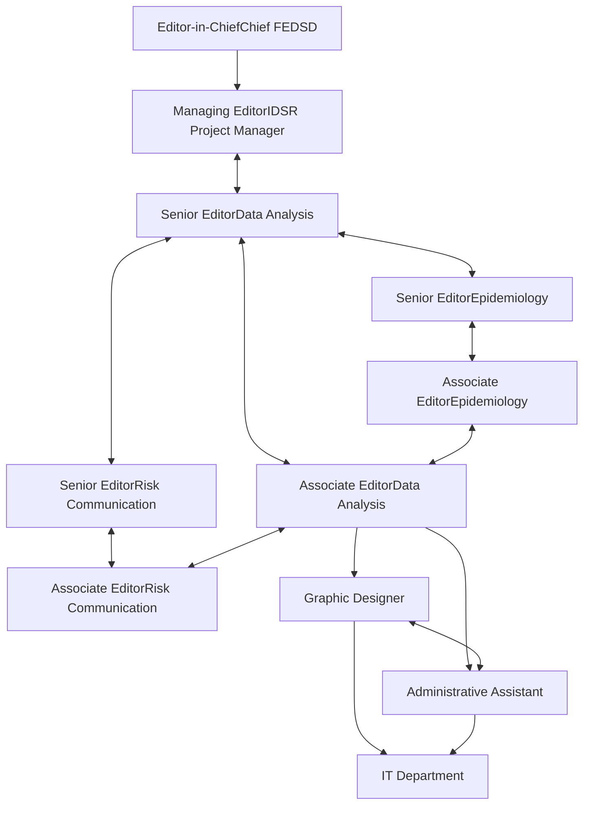

PUBLIC HEALTH BULLETIN-PAKISTAN

Vol. 3 | Week 26 10th July 2023

# Integrated Disease Surveillance & Response (IDSR) Report

Center of Disease Control
National Institute of Health, Islamabad

**PAKISTAN**

NIH Logo Government of Pakistan Logo

http://www.phb.nih.org.pk/

Integrated Disease Surveillance & Response (IDSR) Weekly Public Health Bulletin is your go-to resource for disease trends, outbreak alerts, and crucial public health information. By reading and sharing this bulletin, you can help increase awareness and promote preventive measures within your community.

Together, let's build a safer, more resilient and healthier future for everyone. What are you adding to the world today?

## Make a difference with your field work.
## Write for PHB-Pakistan and impact lives!

Join us in making a difference. Communicate your Feild investigation work, become a contributor and share your insights

Public Health Bulletin Pakistan Logo

Submit your article now
phb@nih.org.pk

UK Health Security Agency Logo

NIH Logo

UK Health Security Agency Logo

World Health Organization Logo

USAID Logo

---

# Greetings
# Team PHB-Pakistan

Public Health Bulletin Pakistan logo

NIH logo

Government of Pakistan logo

### Overview

### IDSR Reports

### Ongoing Events

### Field Reports

## Preface

Stay informed and stay ahead with the Weekly Public Health Bulletin-Pakistan!

The Public Health Bulletin (PHB) for Week 26 of 2023 reports a decrease in the number of suspected cases reported in the Disease Surveillance and Response (IDSR) system. This may be attributed to the Eid holidays. However, there are still high numbers of cases of Acute Diarrhea (AD) and Acute Watery Diarrhea (AWD), which need to be investigated to confirm the existence of an outbreak. Typhoid cases are also reported from all provinces, but all are suspected cases and need field verification and lab confirmation.

The PHB team would like to thank all of the health workers who have contributed to the reporting of these cases. We would also like to remind the public to stay vigilant and to seek medical attention if they experience any symptoms of these diseases.

The PHB will continue to monitor the disease burden in Pakistan and will provide updates on the situation in future issues.

This week's bulletin also includes a knowledge review on Naeglaria floweri disease and information on Local Hepatitis Elimination and Prevention Program in Rawalpindi, Punjab. Stay well-informed about public health matters. Subscribe to the Weekly Bulletin today!

Sincerely,
The Chief Editor

NIH logo

UK Health Security Agency logo

World Health Organization logo

USAID logo

---

# Overview

* During Week 26, the most common reported cases were Acute Diarrhea (Non-Cholera) followed by Malaria, ILI, ALRI <5 years, B. Diarrhea, Typhoid, VH (B, C, D), SARI, dog bite and AVH (A&E).

* In week 26, number of suspected cases reported in Disease Surveillance and Response (IDSR) system has been decreased as may be attributed to Eid Holidays.

* Typhoid cases are reported from all provinces including Balochistan, Sindh and KPK. All are suspected cases and need field verification and lab confirmation.

* Cases of AD and AWD are reported in high numbers and need investigations to confirm the existence of outbreak

    * All are suspected cases and need field verification.

Data lifecycle diagram: Data collection, Analysis, Sharing, Reporting, Warehousing

National Institute of Health logo

UK Health Security Agency logo

World Health Organization logo

USAID logo

---

# Overview

## IDSR compliance attributes

* The national compliance rate for IDSR reporting in 125 implemented districts *is 69%* for this week. The *decline in compliance rate can be attributed to Eid Holidays*

* Sindh province is the top reporting region with a compliance rate of 88% followed by ICT with 78%.

* The lowest compliance rate was observed in Gilgit Baltistan and Balochistan province.

<table>
  <thead>
    <tr>
        <th>Region</th>
        <th>Expected Reports</th>
        <th>Received Reports</th>
        <th>Compliance (%)</th>
    </tr>
  </thead>
  <tbody>
    <tr>
        <td>Khyber Pakhtunkhwa</td>
<td>1570</td>
<td>1049</td>
<td>67</td>
    </tr>
<tr>
        <td>Azad Jammu Kashmir</td>
<td>440</td>
<td>282</td>
<td>64</td>
    </tr>
<tr>
        <td>Islamabad Capital Territory</td>
<td>27</td>
<td>21</td>
<td>78</td>
    </tr>
<tr>
        <td>Balochistan</td>
<td>1264</td>
<td>574</td>
<td>45</td>
    </tr>
<tr>
        <td>Gilgit Baltistan</td>
<td>99</td>
<td>33</td>
<td>33</td>
    </tr>
<tr>
        <td>Sindh</td>
<td>1901</td>
<td>1680</td>
<td>88</td>
    </tr>
<tr>
        <td>National</td>
<td>5301</td>
<td>3639</td>
<td>69</td>
    </tr>
  </tbody>
</table>

NIH logo UK Health Security Agency logo World Health Organization logo USAID logo

---

# Pakistan

Table 1: Province/Area wise distribution of most frequently reported cases during week 26, Pakistan.

<table>
  <thead>
    <tr>
        <th>Diseases</th>
        <th>AJK</th>
        <th>Balochistan</th>
        <th>GB</th>
        <th>ICT</th>
        <th>KP</th>
        <th>Punjab</th>
        <th>Sindh</th>
        <th>Total</th>
    </tr>
  </thead>
  <tbody>
    <tr>
        <td>ILI</td>
<td>1,024</td>
<td>1,334</td>
<td>7</td>
<td>192</td>
<td>2,678</td>
<td>NR</td>
<td>5,082</td>
<td>10,317</td>
    </tr>
<tr>
        <td>AD (Non-Cholera)</td>
<td>1,422</td>
<td>3,696</td>
<td>29</td>
<td>116</td>
<td>13,849</td>
<td>1,274</td>
<td>23,540</td>
<td>43,926</td>
    </tr>
<tr>
        <td>Malaria</td>
<td>55</td>
<td>3,558</td>
<td>0</td>
<td>0</td>
<td>3,039</td>
<td>NR</td>
<td>24,030</td>
<td>30,682</td>
    </tr>
<tr>
        <td>B. Diarrhea</td>
<td>141</td>
<td>1,051</td>
<td>5</td>
<td>2</td>
<td>750</td>
<td>NR</td>
<td>1,371</td>
<td>3,320</td>
    </tr>
<tr>
        <td>Typhoid</td>
<td>40</td>
<td>744</td>
<td>8</td>
<td>0</td>
<td>394</td>
<td>NR</td>
<td>765</td>
<td>1,951</td>
    </tr>
<tr>
        <td>SARI</td>
<td>256</td>
<td>294</td>
<td>15</td>
<td>0</td>
<td>958</td>
<td>NR</td>
<td>241</td>
<td>1,764</td>
    </tr>
<tr>
        <td>ALRI &lt; 5 years</td>
<td>396</td>
<td>755</td>
<td>20</td>
<td>0</td>
<td>601</td>
<td>NR</td>
<td>4,115</td>
<td>5,887</td>
    </tr>
<tr>
        <td>CL</td>
<td>0</td>
<td>71</td>
<td>0</td>
<td>0</td>
<td>272</td>
<td>NR</td>
<td>0</td>
<td>343</td>
    </tr>
<tr>
        <td>AWD (S. Cholera)</td>
<td>21</td>
<td>165</td>
<td>19</td>
<td>0</td>
<td>27</td>
<td>NR</td>
<td>41</td>
<td>273</td>
    </tr>
<tr>
        <td>Measles</td>
<td>9</td>
<td>33</td>
<td>2</td>
<td>3</td>
<td>84</td>
<td>NR</td>
<td>22</td>
<td>153</td>
    </tr>
<tr>
        <td>Dog Bite</td>
<td>53</td>
<td>47</td>
<td>0</td>
<td>0</td>
<td>127</td>
<td>NR</td>
<td>477</td>
<td>704</td>
    </tr>
<tr>
        <td>Dengue</td>
<td>0</td>
<td>14</td>
<td>0</td>
<td>0</td>
<td>8</td>
<td>NR</td>
<td>47</td>
<td>69</td>
    </tr>
<tr>
        <td>VH (B, C &amp; D)</td>
<td>8</td>
<td>69</td>
<td>0</td>
<td>0</td>
<td>31</td>
<td>NR</td>
<td>1,699</td>
<td>1,807</td>
    </tr>
<tr>
        <td>Gonorrhea</td>
<td>0</td>
<td>49</td>
<td>0</td>
<td>0</td>
<td>2</td>
<td>NR</td>
<td>20</td>
<td>71</td>
    </tr>
<tr>
        <td>Pertussis</td>
<td>5</td>
<td>35</td>
<td>0</td>
<td>0</td>
<td>0</td>
<td>NR</td>
<td>3</td>
<td>43</td>
    </tr>
<tr>
        <td>VL</td>
<td>0</td>
<td>12</td>
<td>0</td>
<td>0</td>
<td>4</td>
<td>NR</td>
<td>0</td>
<td>16</td>
    </tr>
<tr>
        <td>NT</td>
<td>0</td>
<td>0</td>
<td>0</td>
<td>0</td>
<td>3</td>
<td>NR</td>
<td>0</td>
<td>3</td>
    </tr>
<tr>
        <td>Mumps</td>
<td>64</td>
<td>60</td>
<td>0</td>
<td>2</td>
<td>81</td>
<td>NR</td>
<td>261</td>
<td>468</td>
    </tr>
<tr>
        <td>AFP</td>
<td>0</td>
<td>2</td>
<td>0</td>
<td>0</td>
<td>7</td>
<td>NR</td>
<td>5</td>
<td>14</td>
    </tr>
<tr>
        <td>Chickenpox/ Varicella</td>
<td>8</td>
<td>17</td>
<td>0</td>
<td>2</td>
<td>46</td>
<td>NR</td>
<td>29</td>
<td>102</td>
    </tr>
<tr>
        <td>AVH (A &amp; E)</td>
<td>14</td>
<td>7</td>
<td>3</td>
<td>0</td>
<td>176</td>
<td>NR</td>
<td>358</td>
<td>558</td>
    </tr>
<tr>
        <td>Meningitis</td>
<td>3</td>
<td>1</td>
<td>0</td>
<td>0</td>
<td>1</td>
<td>NR</td>
<td>16</td>
<td>21</td>
    </tr>
<tr>
        <td>Syphilis</td>
<td>1</td>
<td>0</td>
<td>0</td>
<td>0</td>
<td>0</td>
<td>NR</td>
<td>2</td>
<td>2</td>
    </tr>
<tr>
        <td>Leprosy</td>
<td>0</td>
<td>0</td>
<td>0</td>
<td>0</td>
<td>0</td>
<td>NR</td>
<td>2</td>
<td>2</td>
    </tr>
<tr>
        <td>Diphtheria (Probable)</td>
<td>0</td>
<td>2</td>
<td>0</td>
<td>0</td>
<td>0</td>
<td>NR</td>
<td>0</td>
<td>2</td>
    </tr>
<tr>
        <td>Chikungunya</td>
<td>0</td>
<td>0</td>
<td>0</td>
<td>0</td>
<td>0</td>
<td>NR</td>
<td>0</td>
<td>0</td>
    </tr>
<tr>
        <td>Anthrax</td>
<td>0</td>
<td>0</td>
<td>0</td>
<td>0</td>
<td>0</td>
<td>NR</td>
<td>0</td>
<td>0</td>
    </tr>
<tr>
        <td>Brucellosis</td>
<td>0</td>
<td>4</td>
<td>0</td>
<td>0</td>
<td>0</td>
<td>NR</td>
<td>0</td>
<td>4</td>
    </tr>
<tr>
        <td>CCHF</td>
<td>0</td>
<td>0</td>
<td>0</td>
<td>0</td>
<td>0</td>
<td>NR</td>
<td>1</td>
<td>1</td>
    </tr>
<tr>
        <td>Rubella (CRS)</td>
<td>0</td>
<td>0</td>
<td>0</td>
<td>0</td>
<td>0</td>
<td>NR</td>
<td>1</td>
<td>1</td>
    </tr>
<tr>
        <td>HIV/AIDS</td>
<td>0</td>
<td>0</td>
<td>0</td>
<td>0</td>
<td>3</td>
<td>NR</td>
<td>4</td>
<td>7</td>
    </tr>
  </tbody>
</table>

Figure 1: Most frequently reported suspected cases during week 26, Pakistan

<table>
  <thead>
    <tr>
        <th>Disease</th>
        <th>WK 24</th>
        <th>WK 25</th>
        <th>WK 26</th>
    </tr>
  </thead>
  <tbody>
    <tr>
        <td>AD (Non-Cholera)</td>
<td>86000</td>
<td>85000</td>
<td>43,926</td>
    </tr>
<tr>
        <td>Malaria</td>
<td>75000</td>
<td>74000</td>
<td>30,682</td>
    </tr>
<tr>
        <td>ILI</td>
<td>27000</td>
<td>27000</td>
<td>10,317</td>
    </tr>
<tr>
        <td>ALRI &lt; 5 years</td>
<td>15000</td>
<td>14000</td>
<td>5,887</td>
    </tr>
<tr>
        <td>B. Diarrhea</td>
<td>8000</td>
<td>7500</td>
<td>3,320</td>
    </tr>
<tr>
        <td>Typhoid</td>
<td>5000</td>
<td>4500</td>
<td>1,951</td>
    </tr>
<tr>
        <td>VH (B, C &amp; D)</td>
<td>4000</td>
<td>3500</td>
<td>1,807</td>
    </tr>
<tr>
        <td>SARI</td>
<td>4000</td>
<td>3500</td>
<td>1,764</td>
    </tr>
<tr>
        <td>Dog Bite</td>
<td>2000</td>
<td>1800</td>
<td>704</td>
    </tr>
<tr>
        <td>AVH (A &amp; E)</td>
<td>1500</td>
<td>1200</td>
<td>558</td>
    </tr>
  </tbody>
</table>

NIH Pakistan logo

UK Health Security Agency logo

World Health Organization logo

USAID logo

---

# Sindh
* Malaria cases were maximum followed by AD (Non-Cholera), ILI, ALRI<5 Years, VH (B, C, D), B. Diarrhea, Typhoid, dog bite, AVH (A&E) and Mumps.
* Due to Eid holidays, there is decline in all cases reported this week from Sindh province.
* Dog bite cases are reported mostly from Sanghar and Jacobabad districts.
* Cases of AD and B. Diarrhea are reported in high numbers and need field verification and lab confirmation for appropriate response.

**Table 2: District wise distribution of most frequently reported suspected cases during week 26, Sindh**

<table>
    <thead>
    <tr>
        <th>DISTRICTS</th>
        <th>AD (Non-
Cholera)</th>
        <th>Malaria</th>
        <th>ILI</th>
        <th>ALRI &lt; 
5 
years</th>
        <th>B. 
Diarrhea</th>
        <th>Typhoid</th>
        <th>SARI</th>
        <th>Measles</th>
        <th>VH (B, C 
& D)</th>
        <th>Dengue</th>
        <th>Dog Bite</th>
    </tr>
    </thead>
    <tr>
        <td>Badin</td>
<td>1,770</td>
<td>1,377</td>
<td>56</td>
<td>273</td>
<td>117</td>
<td>25</td>
<td>0</td>
<td>0</td>
<td>46</td>
<td>0</td>
<td>91</td>
    </tr>
<tr>
        <td>Dadu</td>
<td>2,025</td>
<td>1,392</td>
<td>1</td>
<td>181</td>
<td>68</td>
<td>61</td>
<td>0</td>
<td>0</td>
<td>4</td>
<td>0</td>
<td>0</td>
    </tr>
<tr>
        <td>Ghotki</td>
<td>480</td>
<td>359</td>
<td>0</td>
<td>187</td>
<td>54</td>
<td>5</td>
<td>0</td>
<td>2</td>
<td>228</td>
<td>0</td>
<td>0</td>
    </tr>
<tr>
        <td>Hyderabad</td>
<td>934</td>
<td>161</td>
<td>99</td>
<td>11</td>
<td>3</td>
<td>19</td>
<td>0</td>
<td>1</td>
<td>44</td>
<td>0</td>
<td>0</td>
    </tr>
<tr>
        <td>Jacobabad</td>
<td>1,073</td>
<td>632</td>
<td>10</td>
<td>538</td>
<td>67</td>
<td>31</td>
<td>0</td>
<td>0</td>
<td>28</td>
<td>0</td>
<td>47</td>
    </tr>
<tr>
        <td>Jamshoro</td>
<td>464</td>
<td>720</td>
<td>0</td>
<td>126</td>
<td>45</td>
<td>57</td>
<td>2</td>
<td>12</td>
<td>48</td>
<td>0</td>
<td>25</td>
    </tr>
<tr>
        <td>Kamber</td>
<td>1,720</td>
<td>2,287</td>
<td>0</td>
<td>49</td>
<td>48</td>
<td>5</td>
<td>0</td>
<td>0</td>
<td>22</td>
<td>0</td>
<td>0</td>
    </tr>
<tr>
        <td>Karachi Central</td>
<td>664</td>
<td>41</td>
<td>638</td>
<td>39</td>
<td>27</td>
<td>46</td>
<td>0</td>
<td>2</td>
<td>58</td>
<td>1</td>
<td>0</td>
    </tr>
<tr>
        <td>Karachi East</td>
<td>89</td>
<td>24</td>
<td>9</td>
<td>0</td>
<td>0</td>
<td>0</td>
<td>0</td>
<td>0</td>
<td>0</td>
<td>4</td>
<td>0</td>
    </tr>
<tr>
        <td>Karachi Keamari</td>
<td>129</td>
<td>0</td>
<td>39</td>
<td>6</td>
<td>0</td>
<td>1</td>
<td>0</td>
<td>0</td>
<td>0</td>
<td>0</td>
<td>0</td>
    </tr>
<tr>
        <td>Karachi Korangi</td>
<td>132</td>
<td>20</td>
<td>10</td>
<td>0</td>
<td>1</td>
<td>1</td>
<td>0</td>
<td>1</td>
<td>0</td>
<td>0</td>
<td>0</td>
    </tr>
<tr>
        <td>Karachi Malir</td>
<td>456</td>
<td>32</td>
<td>361</td>
<td>182</td>
<td>23</td>
<td>3</td>
<td>46</td>
<td>0</td>
<td>7</td>
<td>0</td>
<td>2</td>
    </tr>
<tr>
        <td>Karachi South</td>
<td>35</td>
<td>11</td>
<td>0</td>
<td>0</td>
<td>0</td>
<td>1</td>
<td>0</td>
<td>0</td>
<td>0</td>
<td>0</td>
<td>0</td>
    </tr>
<tr>
        <td>Karachi West</td>
<td>378</td>
<td>74</td>
<td>207</td>
<td>114</td>
<td>37</td>
<td>18</td>
<td>44</td>
<td>0</td>
<td>20</td>
<td>12</td>
<td>30</td>
    </tr>
<tr>
        <td>Kashmore</td>
<td>290</td>
<td>703</td>
<td>133</td>
<td>85</td>
<td>21</td>
<td>2</td>
<td>1</td>
<td>0</td>
<td>58</td>
<td>0</td>
<td>0</td>
    </tr>
<tr>
        <td>Khairpur</td>
<td>1,804</td>
<td>2,438</td>
<td>117</td>
<td>436</td>
<td>134</td>
<td>94</td>
<td>93</td>
<td>0</td>
<td>60</td>
<td>0</td>
<td>21</td>
    </tr>
<tr>
        <td>Larkana</td>
<td>954</td>
<td>4,087</td>
<td>0</td>
<td>93</td>
<td>97</td>
<td>1</td>
<td>4</td>
<td>0</td>
<td>61</td>
<td>0</td>
<td>0</td>
    </tr>
<tr>
        <td>Matiari</td>
<td>803</td>
<td>421</td>
<td>0</td>
<td>69</td>
<td>26</td>
<td>22</td>
<td>0</td>
<td>0</td>
<td>134</td>
<td>2</td>
<td>38</td>
    </tr>
<tr>
        <td>Mirpurkhas</td>
<td>1,407</td>
<td>1,056</td>
<td>917</td>
<td>258</td>
<td>23</td>
<td>17</td>
<td>0</td>
<td>0</td>
<td>12</td>
<td>0</td>
<td>5</td>
    </tr>
<tr>
        <td>Naushero Feroze</td>
<td>854</td>
<td>808</td>
<td>297</td>
<td>193</td>
<td>96</td>
<td>97</td>
<td>0</td>
<td>0</td>
<td>37</td>
<td>0</td>
<td>6</td>
    </tr>
<tr>
        <td>Sanghar</td>
<td>1,249</td>
<td>594</td>
<td>43</td>
<td>175</td>
<td>62</td>
<td>28</td>
<td>10</td>
<td>0</td>
<td>211</td>
<td>0</td>
<td>111</td>
    </tr>
<tr>
        <td>Shaheed 
Benazirabad</td>
<td>1,195</td>
<td>917</td>
<td>5</td>
<td>191</td>
<td>30</td>
<td>144</td>
<td>0</td>
<td>0</td>
<td>52</td>
<td>0</td>
<td>0</td>
    </tr>
<tr>
        <td>Shikarpur</td>
<td>575</td>
<td>447</td>
<td>0</td>
<td>55</td>
<td>56</td>
<td>0</td>
<td>0</td>
<td>2</td>
<td>40</td>
<td>0</td>
<td>1</td>
    </tr>
<tr>
        <td>Sujawal</td>
<td>194</td>
<td>176</td>
<td>0</td>
<td>60</td>
<td>28</td>
<td>6</td>
<td>0</td>
<td>0</td>
<td>0</td>
<td>0</td>
<td>0</td>
    </tr>
<tr>
        <td>Sukkur</td>
<td>732</td>
<td>1,156</td>
<td>748</td>
<td>137</td>
<td>91</td>
<td>5</td>
<td>1</td>
<td>2</td>
<td>242</td>
<td>0</td>
<td>0</td>
    </tr>
<tr>
        <td>Tando Allahyar</td>
<td>465</td>
<td>415</td>
<td>244</td>
<td>77</td>
<td>35</td>
<td>4</td>
<td>0</td>
<td>0</td>
<td>109</td>
<td>0</td>
<td>16</td>
    </tr>
<tr>
        <td>Tando 
Muhammad Khan</td>
<td>177</td>
<td>144</td>
<td>0</td>
<td>15</td>
<td>10</td>
<td>0</td>
<td>0</td>
<td>0</td>
<td>0</td>
<td>0</td>
<td>11</td>
    </tr>
<tr>
        <td>Tharparkar</td>
<td>678</td>
<td>927</td>
<td>719</td>
<td>286</td>
<td>55</td>
<td>19</td>
<td>27</td>
<td>0</td>
<td>23</td>
<td>28</td>
<td>2</td>
    </tr>
<tr>
        <td>Thatta</td>
<td>904</td>
<td>1,202</td>
<td>429</td>
<td>94</td>
<td>48</td>
<td>19</td>
<td>11</td>
<td>0</td>
<td>22</td>
<td>0</td>
<td>71</td>
    </tr>
<tr>
        <td>Umerkot</td>
<td>910</td>
<td>1,409</td>
<td>0</td>
<td>185</td>
<td>69</td>
<td>34</td>
<td>2</td>
<td>0</td>
<td>133</td>
<td>0</td>
<td>0</td>
    </tr>
<tr>
        <td>Total</td>
<td>23,540</td>
<td>24,030</td>
<td>5,082</td>
<td>4,115</td>
<td>1,371</td>
<td>765</td>
<td>241</td>
<td>22</td>
<td>1,699</td>
<td>47</td>
<td>477</td>
    </tr>
</table>

**Figure 2: Most frequently reported suspected cases during week 26, Sindh**

<table>
  <thead>
    <tr>
        <th>Disease</th>
        <th>WK 24</th>
        <th>WK 25</th>
        <th>WK 26</th>
    </tr>
  </thead>
  <tbody>
    <tr>
        <td>Malaria</td>
<td>59000</td>
<td>57000</td>
<td>24030</td>
    </tr>
<tr>
        <td>AD (Non-Cholera)</td>
<td>45000</td>
<td>46000</td>
<td>23540</td>
    </tr>
<tr>
        <td>ILI</td>
<td>13000</td>
<td>14000</td>
<td>5082</td>
    </tr>
<tr>
        <td>ALRI &lt; 5 years</td>
<td>8000</td>
<td>9000</td>
<td>4115</td>
    </tr>
<tr>
        <td>VH (B, C &amp; D)</td>
<td>5000</td>
<td>6000</td>
<td>1699</td>
    </tr>
<tr>
        <td>B. Diarrhea</td>
<td>4000</td>
<td>5000</td>
<td>1371</td>
    </tr>
<tr>
        <td>Typhoid</td>
<td>2000</td>
<td>3000</td>
<td>765</td>
    </tr>
<tr>
        <td>Dog Bite</td>
<td>1500</td>
<td>2000</td>
<td>477</td>
    </tr>
<tr>
        <td>AVH (A &amp; E)</td>
<td>1000</td>
<td>1500</td>
<td>358</td>
    </tr>
<tr>
        <td>Mumps</td>
<td>500</td>
<td>1000</td>
<td>261</td>
    </tr>
  </tbody>
</table>

NIH Pakistan logo

UK Health Security Agency logo

World Health Organization logo

USAID logo

---

# Balochistan

* Malaria, AD (Non-Cholera), Malaria, ILI, B. Diarrhea, ALRI <5 years, Typhoid, SARI, AWD (S. Cholera), CL and VH (B,C) were the most frequently reported diseases from Balochistan province.
* Cases of ILI, AD and Malaria showed a decline trend this week.
* This week AWD (S. Cholera) cases are reported in high numbers from Killla Saifullah and Surab districts, all are suspected cases and demand urgent field investigation.

Table3: District wise distribution of most frequently reported suspected cases during week 26, Balochistan

<table>
    <thead>
    <tr>
        <th>Districts</th>
        <th>ILI</th>
        <th>Malaria</th>
        <th>AD (Non-
Cholera)</th>
        <th>ALRI &lt; 5 
years</th>
        <th>SARI</th>
        <th>B. 
Diarrhea</th>
        <th>Typhoid</th>
        <th>CL</th>
        <th>Dog Bite</th>
        <th>AWD (S. 
Cholera)</th>
    </tr>
    </thead>
    <tr>
        <td>Chagai</td>
<td>126</td>
<td>16</td>
<td>93</td>
<td>0</td>
<td>0</td>
<td>30</td>
<td>7</td>
<td>0</td>
<td>1</td>
<td>5</td>
    </tr>
<tr>
        <td>Duki</td>
<td>22</td>
<td>72</td>
<td>108</td>
<td>30</td>
<td>20</td>
<td>85</td>
<td>18</td>
<td>2</td>
<td>0</td>
<td>37</td>
    </tr>
<tr>
        <td>Harnai</td>
<td>2</td>
<td>52</td>
<td>118</td>
<td>255</td>
<td>0</td>
<td>207</td>
<td>3</td>
<td>0</td>
<td>1</td>
<td>13</td>
    </tr>
<tr>
        <td>Jaffarabad</td>
<td>34</td>
<td>852</td>
<td>695</td>
<td>76</td>
<td>12</td>
<td>73</td>
<td>390</td>
<td>1</td>
<td>1</td>
<td>1</td>
    </tr>
<tr>
        <td>Jhal Magsi</td>
<td>0</td>
<td>312</td>
<td>228</td>
<td>28</td>
<td>3</td>
<td>8</td>
<td>5</td>
<td>0</td>
<td>5</td>
<td>7</td>
    </tr>
<tr>
        <td>Kachhi (Bolan)</td>
<td>8</td>
<td>65</td>
<td>45</td>
<td>1</td>
<td>4</td>
<td>11</td>
<td>17</td>
<td>0</td>
<td>0</td>
<td>0</td>
    </tr>
<tr>
        <td>Kalat</td>
<td>5</td>
<td>1</td>
<td>6</td>
<td>0</td>
<td>0</td>
<td>2</td>
<td>1</td>
<td>0</td>
<td>0</td>
<td>0</td>
    </tr>
<tr>
        <td>Kharan</td>
<td>93</td>
<td>60</td>
<td>67</td>
<td>0</td>
<td>0</td>
<td>37</td>
<td>3</td>
<td>0</td>
<td>0</td>
<td>3</td>
    </tr>
<tr>
        <td>Khuzdar</td>
<td>74</td>
<td>47</td>
<td>68</td>
<td>0</td>
<td>11</td>
<td>49</td>
<td>28</td>
<td>0</td>
<td>0</td>
<td>0</td>
    </tr>
<tr>
        <td>Killa Saifullah</td>
<td>0</td>
<td>98</td>
<td>116</td>
<td>68</td>
<td>2</td>
<td>37</td>
<td>14</td>
<td>11</td>
<td>0</td>
<td>21</td>
    </tr>
<tr>
        <td>Kohlu</td>
<td>94</td>
<td>65</td>
<td>56</td>
<td>9</td>
<td>19</td>
<td>34</td>
<td>24</td>
<td>1</td>
<td>0</td>
<td>1</td>
    </tr>
<tr>
        <td>Lasbella</td>
<td>32</td>
<td>352</td>
<td>307</td>
<td>48</td>
<td>46</td>
<td>63</td>
<td>10</td>
<td>0</td>
<td>14</td>
<td>0</td>
    </tr>
<tr>
        <td>Loralai</td>
<td>86</td>
<td>41</td>
<td>89</td>
<td>21</td>
<td>47</td>
<td>33</td>
<td>15</td>
<td>0</td>
<td>0</td>
<td>8</td>
    </tr>
<tr>
        <td>Mastung</td>
<td>46</td>
<td>59</td>
<td>651</td>
<td>26</td>
<td>21</td>
<td>61</td>
<td>60</td>
<td>6</td>
<td>2</td>
<td>0</td>
    </tr>
<tr>
        <td>Naseerabad</td>
<td>0</td>
<td>400</td>
<td>134</td>
<td>6</td>
<td>0</td>
<td>8</td>
<td>38</td>
<td>0</td>
<td>3</td>
<td>8</td>
    </tr>
<tr>
        <td>Nushki</td>
<td>0</td>
<td>76</td>
<td>123</td>
<td>0</td>
<td>2</td>
<td>43</td>
<td>0</td>
<td>0</td>
<td>0</td>
<td>10</td>
    </tr>
<tr>
        <td>Panjgur</td>
<td>39</td>
<td>160</td>
<td>94</td>
<td>54</td>
<td>11</td>
<td>55</td>
<td>13</td>
<td>0</td>
<td>0</td>
<td>9</td>
    </tr>
<tr>
        <td>Pishin</td>
<td>105</td>
<td>44</td>
<td>118</td>
<td>18</td>
<td>2</td>
<td>72</td>
<td>25</td>
<td>14</td>
<td>16</td>
<td>0</td>
    </tr>
<tr>
        <td>Quetta</td>
<td>276</td>
<td>6</td>
<td>176</td>
<td>25</td>
<td>0</td>
<td>36</td>
<td>5</td>
<td>32</td>
<td>0</td>
<td>2</td>
    </tr>
<tr>
        <td>Sibi</td>
<td>101</td>
<td>108</td>
<td>115</td>
<td>16</td>
<td>13</td>
<td>16</td>
<td>13</td>
<td>0</td>
<td>1</td>
<td>0</td>
    </tr>
<tr>
        <td>Sohbat pur</td>
<td>4</td>
<td>581</td>
<td>195</td>
<td>55</td>
<td>49</td>
<td>41</td>
<td>40</td>
<td>2</td>
<td>0</td>
<td>1</td>
    </tr>
<tr>
        <td>SURAB</td>
<td>10</td>
<td>14</td>
<td>7</td>
<td>5</td>
<td>8</td>
<td>4</td>
<td>7</td>
<td>0</td>
<td>1</td>
<td>12</td>
    </tr>
<tr>
        <td>Washuk</td>
<td>116</td>
<td>49</td>
<td>65</td>
<td>10</td>
<td>23</td>
<td>18</td>
<td>4</td>
<td>2</td>
<td>0</td>
<td>0</td>
    </tr>
<tr>
        <td>Ziarat</td>
<td>61</td>
<td>28</td>
<td>22</td>
<td>4</td>
<td>1</td>
<td>28</td>
<td>4</td>
<td>0</td>
<td>2</td>
<td>27</td>
    </tr>
<tr>
        <td>Total</td>
<td>1,334</td>
<td>3,558</td>
<td>3,696</td>
<td>755</td>
<td>294</td>
<td>1,051</td>
<td>744</td>
<td>71</td>
<td>47</td>
<td>165</td>
    </tr>
</table>

Figure 3: Most frequently reported suspected cases during week 26, Balochistan

<table>
  <thead>
    <tr>
        <th>Disease</th>
        <th>WK 24</th>
        <th>WK 25</th>
        <th>WK 26</th>
    </tr>
  </thead>
  <tbody>
    <tr>
        <td>AD (Non-Cholera)</td>
<td>7800</td>
<td>8600</td>
<td>3696</td>
    </tr>
<tr>
        <td>Malaria</td>
<td>10000</td>
<td>11000</td>
<td>3558</td>
    </tr>
<tr>
        <td>ILI</td>
<td>4600</td>
<td>5000</td>
<td>1334</td>
    </tr>
<tr>
        <td>B. Diarrhea</td>
<td>2000</td>
<td>2200</td>
<td>1051</td>
    </tr>
<tr>
        <td>ALRI &lt; 5 years</td>
<td>2300</td>
<td>2400</td>
<td>755</td>
    </tr>
<tr>
        <td>Typhoid</td>
<td>1500</td>
<td>1700</td>
<td>744</td>
    </tr>
<tr>
        <td>SARI</td>
<td>1100</td>
<td>1100</td>
<td>294</td>
    </tr>
<tr>
        <td>AWD (S. Cholera)</td>
<td>600</td>
<td>700</td>
<td>165</td>
    </tr>
<tr>
        <td>CL</td>
<td>100</td>
<td>100</td>
<td>71</td>
    </tr>
<tr>
        <td>VH (B, C &amp; D)</td>
<td>100</td>
<td>100</td>
<td>69</td>
    </tr>
  </tbody>
</table>

NIH logo

UK Health Security Agency logo

World Health Organization logo

USAID logo

---

# Khyber Pakhtunkhwa

* Cases of AD (Non-Cholera) were maximum followed by Malaria, ILI, SARI, B. Diarrhea, ALRI<5 Years, Typhoid, CL, AVH (A&E) and dog bite cases.

* Cases of AD, ILI and Malaria showed a downward trend this week.

* Cases of AD were mostly reported from Malakand, Swat and Dir Lower. Need field investigation to know the actual burden of disease.

Table 4: District wise distribution of most frequently reported suspected cases during week 26, KP

<table>
    <thead>
    <tr>
        <th>Diseases</th>
        <th>AD (Non-
Cholera)</th>
        <th>Malaria</th>
        <th>ILI</th>
        <th>SARI</th>
        <th>ALRI &lt; 5 
years</th>
        <th>B. Diarrhea</th>
        <th>Typhoid</th>
        <th>Dog Bite</th>
        <th>AWD (S. 
Cholera)</th>
        <th>AVH (A & 
E)</th>
    </tr>
    </thead>
    <tr>
        <td>Abbottabad</td>
<td>442</td>
<td>0</td>
<td>7</td>
<td>1</td>
<td>0</td>
<td>2</td>
<td>10</td>
<td>2</td>
<td>0</td>
<td>0</td>
    </tr>
<tr>
        <td>Bannu</td>
<td>355</td>
<td>545</td>
<td>50</td>
<td>0</td>
<td>1</td>
<td>4</td>
<td>20</td>
<td>0</td>
<td>0</td>
<td>0</td>
    </tr>
<tr>
        <td>Battagram</td>
<td>143</td>
<td>23</td>
<td>320</td>
<td>0</td>
<td>7</td>
<td>0</td>
<td>0</td>
<td>5</td>
<td>0</td>
<td>0</td>
    </tr>
<tr>
        <td>Buner</td>
<td>375</td>
<td>286</td>
<td>0</td>
<td>0</td>
<td>6</td>
<td>18</td>
<td>13</td>
<td>0</td>
<td>0</td>
<td>2</td>
    </tr>
<tr>
        <td>Charsadda</td>
<td>790</td>
<td>34</td>
<td>136</td>
<td>7</td>
<td>5</td>
<td>0</td>
<td>0</td>
<td>0</td>
<td>0</td>
<td>0</td>
    </tr>
<tr>
        <td>Chitral Lower</td>
<td>446</td>
<td>2</td>
<td>43</td>
<td>377</td>
<td>2</td>
<td>0</td>
<td>9</td>
<td>7</td>
<td>0</td>
<td>0</td>
    </tr>
<tr>
        <td>Chitral Upper</td>
<td>25</td>
<td>1</td>
<td>0</td>
<td>76</td>
<td>0</td>
<td>0</td>
<td>2</td>
<td>0</td>
<td>0</td>
<td>2</td>
    </tr>
<tr>
        <td>D.I. Khan</td>
<td>654</td>
<td>329</td>
<td>21</td>
<td>40</td>
<td>5</td>
<td>24</td>
<td>0</td>
<td>35</td>
<td>0</td>
<td>0</td>
    </tr>
<tr>
        <td>Dir Lower</td>
<td>1,427</td>
<td>339</td>
<td>72</td>
<td>92</td>
<td>98</td>
<td>125</td>
<td>59</td>
<td>10</td>
<td>0</td>
<td>113</td>
    </tr>
<tr>
        <td>Dir Upper</td>
<td>412</td>
<td>2</td>
<td>67</td>
<td>0</td>
<td>19</td>
<td>36</td>
<td>25</td>
<td>0</td>
<td>0</td>
<td>8</td>
    </tr>
<tr>
        <td>Hangu</td>
<td>253</td>
<td>237</td>
<td>309</td>
<td>102</td>
<td>4</td>
<td>20</td>
<td>15</td>
<td>5</td>
<td>0</td>
<td>10</td>
    </tr>
<tr>
        <td>Haripur</td>
<td>344</td>
<td>7</td>
<td>42</td>
<td>0</td>
<td>30</td>
<td>0</td>
<td>2</td>
<td>0</td>
<td>0</td>
<td>0</td>
    </tr>
<tr>
        <td>Karak</td>
<td>241</td>
<td>64</td>
<td>32</td>
<td>4</td>
<td>18</td>
<td>0</td>
<td>2</td>
<td>18</td>
<td>4</td>
<td>0</td>
    </tr>
<tr>
        <td>Khyber</td>
<td>8</td>
<td>16</td>
<td>64</td>
<td>3</td>
<td>1</td>
<td>6</td>
<td>4</td>
<td>0</td>
<td>0</td>
<td>0</td>
    </tr>
<tr>
        <td>Kohat</td>
<td>47</td>
<td>21</td>
<td>12</td>
<td>2</td>
<td>2</td>
<td>0</td>
<td>0</td>
<td>4</td>
<td>0</td>
<td>0</td>
    </tr>
<tr>
        <td>Kohistan Lower</td>
<td>76</td>
<td>1</td>
<td>0</td>
<td>47</td>
<td>0</td>
<td>35</td>
<td>0</td>
<td>1</td>
<td>0</td>
<td>0</td>
    </tr>
<tr>
        <td>Kohistan Upper</td>
<td>311</td>
<td>0</td>
<td>7</td>
<td>15</td>
<td>10</td>
<td>10</td>
<td>18</td>
<td>0</td>
<td>0</td>
<td>0</td>
    </tr>
<tr>
        <td>Kolai Palas</td>
<td>55</td>
<td>0</td>
<td>0</td>
<td>0</td>
<td>9</td>
<td>15</td>
<td>0</td>
<td>0</td>
<td>5</td>
<td>0</td>
    </tr>
<tr>
        <td>L & C Kurram</td>
<td>26</td>
<td>27</td>
<td>16</td>
<td>0</td>
<td>0</td>
<td>5</td>
<td>3</td>
<td>0</td>
<td>0</td>
<td>0</td>
    </tr>
<tr>
        <td>Lakki Marwat</td>
<td>365</td>
<td>539</td>
<td>0</td>
<td>0</td>
<td>5</td>
<td>14</td>
<td>13</td>
<td>0</td>
<td>0</td>
<td>0</td>
    </tr>
<tr>
        <td>Malakand</td>
<td>1,213</td>
<td>46</td>
<td>27</td>
<td>31</td>
<td>45</td>
<td>151</td>
<td>29</td>
<td></td>
<td>0</td>
<td>15</td>
    </tr>
<tr>
        <td>Mansehra</td>
<td>414</td>
<td>0</td>
<td>193</td>
<td>35</td>
<td>29</td>
<td>13</td>
<td>50</td>
<td>0</td>
<td>13</td>
<td>2</td>
    </tr>
<tr>
        <td>Mardan</td>
<td>552</td>
<td>12</td>
<td>209</td>
<td>60</td>
<td>98</td>
<td>33</td>
<td>2</td>
<td>0</td>
<td>0</td>
<td>5</td>
    </tr>
<tr>
        <td>Nowshera</td>
<td>828</td>
<td>27</td>
<td>37</td>
<td>6</td>
<td>12</td>
<td>25</td>
<td>7</td>
<td>0</td>
<td>0</td>
<td>6</td>
    </tr>
<tr>
        <td>Peshawar</td>
<td>1,114</td>
<td>9</td>
<td>283</td>
<td>22</td>
<td>23</td>
<td>115</td>
<td>19</td>
<td>3</td>
<td>0</td>
<td>3</td>
    </tr>
<tr>
        <td>Shangla</td>
<td>404</td>
<td>313</td>
<td>0</td>
<td>0</td>
<td>6</td>
<td>4</td>
<td>11</td>
<td>15</td>
<td>2</td>
<td>0</td>
    </tr>
<tr>
        <td>Swabi</td>
<td>800</td>
<td>13</td>
<td>627</td>
<td>17</td>
<td>111</td>
<td>10</td>
<td>23</td>
<td>0</td>
<td>0</td>
<td>7</td>
    </tr>
<tr>
        <td>Swat</td>
<td>1,533</td>
<td>14</td>
<td>104</td>
<td>0</td>
<td>48</td>
<td>51</td>
<td>38</td>
<td>10</td>
<td>0</td>
<td>3</td>
    </tr>
<tr>
        <td>Tank</td>
<td>101</td>
<td>56</td>
<td>0</td>
<td>0</td>
<td>0</td>
<td>5</td>
<td>1</td>
<td>0</td>
<td>0</td>
<td>0</td>
    </tr>
<tr>
        <td>Tor Ghar</td>
<td>95</td>
<td>46</td>
<td>0</td>
<td>21</td>
<td>7</td>
<td>29</td>
<td>9</td>
<td>12</td>
<td>3</td>
<td>0</td>
    </tr>
<tr>
        <td>Total</td>
<td>13,849</td>
<td>3,009</td>
<td>2,678</td>
<td>958</td>
<td>601</td>
<td>750</td>
<td>384</td>
<td>127</td>
<td>27</td>
<td>176</td>
    </tr>
</table>

Figure 4: Most frequently reported suspected cases during week 26, KP

<table>
  <thead>
    <tr>
        <th>Week</th>
        <th>AD (Non-Cholera)</th>
        <th>Malaria</th>
        <th>ILI</th>
        <th>SARI</th>
        <th>B. Diarrhea</th>
        <th>ALRI &lt; 5 years</th>
        <th>Typhoid</th>
        <th>CL</th>
        <th>AVH (A &amp; E)</th>
        <th>Dog Bite</th>
    </tr>
  </thead>
  <tbody>
    <tr>
        <td>WK 24</td>
<td>29000</td>
<td>6000</td>
<td>6500</td>
<td>2500</td>
<td>1500</td>
<td>1500</td>
<td>1000</td>
<td>500</td>
<td>500</td>
<td>500</td>
    </tr>
<tr>
        <td>WK 25</td>
<td>27000</td>
<td>6000</td>
<td>6000</td>
<td>2000</td>
<td>1200</td>
<td>1200</td>
<td>800</td>
<td>400</td>
<td>400</td>
<td>400</td>
    </tr>
<tr>
        <td>WK 26</td>
<td>13849</td>
<td>3039</td>
<td>2678</td>
<td>958</td>
<td>750</td>
<td>601</td>
<td>394</td>
<td>272</td>
<td>176</td>
<td>127</td>
    </tr>
  </tbody>
</table>

NIH logo

UK Health Security Agency logo

World Health Organization logo

USAID logo

---

# ICT, AJK & GB

**ICT**: The most frequently reported cases from Islamabad were ILI followed by AD (Non-Cholera). ILI cases showed decline trend in cases this week.

**AJK**: AD (Non-Cholera) cases were maximum followed by ILI, ALRI <5 years, SARI, B. Diarrhea, Mumps, Malaria, dog bite, Typhoid and AWD (S. Cholera). Both ILI and ALRI <5 years cases showed a downward trend in cases this week.

**GB**: ALRI<5 years cases were maximum followed by AD (Non. Cholera) and SARI. AD (Non-Cholera) cases showed decline trend in cases this week.

Figure 5: Most frequently reported suspected cases during week 26, ICT

<table>
  <thead>
    <tr>
        <th>Disease</th>
        <th>WK24</th>
        <th>WK25</th>
        <th>WK26</th>
    </tr>
  </thead>
  <tbody>
    <tr>
        <td>ILI</td>
<td>1050</td>
<td>850</td>
<td>192</td>
    </tr>
<tr>
        <td>AD (Non-Cholera)</td>
<td>480</td>
<td>450</td>
<td>116</td>
    </tr>
<tr>
        <td>Measles</td>
<td>10</td>
<td>5</td>
<td>3</td>
    </tr>
  </tbody>
</table>

Figure 6: Week wise reported suspected cases of ILI, ICT

<table>
  <thead>
    <tr>
        <th>Week</th>
        <th>ILI</th>
    </tr>
  </thead>
  <tbody>
    <tr>
        <td>W27</td>
<td>650</td>
    </tr>
<tr>
        <td>W28</td>
<td>620</td>
    </tr>
<tr>
        <td>W29</td>
<td>900</td>
    </tr>
<tr>
        <td>W30</td>
<td>1100</td>
    </tr>
<tr>
        <td>W31</td>
<td>1350</td>
    </tr>
<tr>
        <td>W32</td>
<td>1350</td>
    </tr>
<tr>
        <td>W33</td>
<td>1250</td>
    </tr>
<tr>
        <td>W34</td>
<td>400</td>
    </tr>
<tr>
        <td>W35</td>
<td>1450</td>
    </tr>
<tr>
        <td>W36</td>
<td>150</td>
    </tr>
<tr>
        <td>W37</td>
<td>100</td>
    </tr>
<tr>
        <td>W38</td>
<td>1250</td>
    </tr>
<tr>
        <td>W39</td>
<td>1000</td>
    </tr>
<tr>
        <td>W40</td>
<td>2150</td>
    </tr>
<tr>
        <td>W41</td>
<td>2350</td>
    </tr>
<tr>
        <td>W42</td>
<td>2700</td>
    </tr>
<tr>
        <td>W43</td>
<td>2650</td>
    </tr>
<tr>
        <td>W44</td>
<td>1900</td>
    </tr>
<tr>
        <td>W45</td>
<td>1750</td>
    </tr>
<tr>
        <td>W46</td>
<td>1550</td>
    </tr>
<tr>
        <td>W47</td>
<td>2450</td>
    </tr>
<tr>
        <td>W48</td>
<td>2350</td>
    </tr>
<tr>
        <td>W49</td>
<td>2600</td>
    </tr>
<tr>
        <td>W50</td>
<td>3250</td>
    </tr>
<tr>
        <td>W51</td>
<td>2650</td>
    </tr>
<tr>
        <td>W52</td>
<td>2200</td>
    </tr>
<tr>
        <td>W1</td>
<td>2150</td>
    </tr>
<tr>
        <td>W2</td>
<td>1650</td>
    </tr>
<tr>
        <td>W3</td>
<td>2000</td>
    </tr>
<tr>
        <td>W4</td>
<td>2000</td>
    </tr>
<tr>
        <td>W5</td>
<td>1950</td>
    </tr>
<tr>
        <td>W6</td>
<td>1550</td>
    </tr>
<tr>
        <td>W7</td>
<td>2350</td>
    </tr>
<tr>
        <td>W8</td>
<td>1600</td>
    </tr>
<tr>
        <td>W9</td>
<td>2250</td>
    </tr>
<tr>
        <td>W10</td>
<td>2150</td>
    </tr>
<tr>
        <td>W11</td>
<td>1750</td>
    </tr>
<tr>
        <td>W12</td>
<td>750</td>
    </tr>
<tr>
        <td>W13</td>
<td>1550</td>
    </tr>
<tr>
        <td>W14</td>
<td>1500</td>
    </tr>
<tr>
        <td>W15</td>
<td>1050</td>
    </tr>
<tr>
        <td>W16</td>
<td>650</td>
    </tr>
<tr>
        <td>W17</td>
<td>1150</td>
    </tr>
<tr>
        <td>W18</td>
<td>950</td>
    </tr>
<tr>
        <td>W19</td>
<td>1550</td>
    </tr>
<tr>
        <td>W20</td>
<td>800</td>
    </tr>
<tr>
        <td>W21</td>
<td>1200</td>
    </tr>
<tr>
        <td>W22</td>
<td>1150</td>
    </tr>
<tr>
        <td>W23</td>
<td>700</td>
    </tr>
<tr>
        <td>W24</td>
<td>1050</td>
    </tr>
<tr>
        <td>W25</td>
<td>850</td>
    </tr>
<tr>
        <td>W26</td>
<td>250</td>
    </tr>
  </tbody>
</table>

Figure 7: Most frequently reported suspected cases during week 26, AJK

<table>
  <thead>
    <tr>
        <th>Disease</th>
        <th>WK 24</th>
        <th>WK 25</th>
        <th>WK 26</th>
    </tr>
  </thead>
  <tbody>
    <tr>
        <td>AD (Non-Cholera)</td>
<td>2350</td>
<td>2250</td>
<td>1422</td>
    </tr>
<tr>
        <td>ILI</td>
<td>2750</td>
<td>2400</td>
<td>1024</td>
    </tr>
<tr>
        <td>ALRI &lt; 5 years</td>
<td>950</td>
<td>900</td>
<td>396</td>
    </tr>
<tr>
        <td>SARI</td>
<td>550</td>
<td>450</td>
<td>256</td>
    </tr>
<tr>
        <td>B. Diarrhea</td>
<td>100</td>
<td>120</td>
<td>141</td>
    </tr>
<tr>
        <td>Mumps</td>
<td>120</td>
<td>110</td>
<td>64</td>
    </tr>
<tr>
        <td>Malaria</td>
<td>150</td>
<td>100</td>
<td>55</td>
    </tr>
<tr>
        <td>Dog Bite</td>
<td>50</td>
<td>40</td>
<td>53</td>
    </tr>
<tr>
        <td>Typhoid</td>
<td>30</td>
<td>20</td>
<td>40</td>
    </tr>
<tr>
        <td>AWD (S. Cholera)</td>
<td>80</td>
<td>70</td>
<td>21</td>
    </tr>
  </tbody>
</table>

NIH Pakistan logo

UK Health Security Agency logo

World Health Organization logo

USAID logo

---

Figure 8: Week wise reported suspected cases of AD (Non-Cholera) and ALRI <5 years, AJK

<table>
  <thead>
    <tr>
        <th>Week</th>
        <th>AD (Non-Cholera)</th>
        <th>ILI</th>
    </tr>
  </thead>
  <tbody>
    <tr>
        <td>W27</td>
<td>100</td>
<td>50</td>
    </tr>
<tr>
        <td>W28</td>
<td>120</td>
<td>60</td>
    </tr>
<tr>
        <td>W29</td>
<td>150</td>
<td>70</td>
    </tr>
<tr>
        <td>W30</td>
<td>160</td>
<td>80</td>
    </tr>
<tr>
        <td>W31</td>
<td>170</td>
<td>90</td>
    </tr>
<tr>
        <td>W32</td>
<td>180</td>
<td>100</td>
    </tr>
<tr>
        <td>W33</td>
<td>190</td>
<td>110</td>
    </tr>
<tr>
        <td>W34</td>
<td>200</td>
<td>120</td>
    </tr>
<tr>
        <td>W35</td>
<td>210</td>
<td>130</td>
    </tr>
<tr>
        <td>W36</td>
<td>220</td>
<td>140</td>
    </tr>
<tr>
        <td>W37</td>
<td>210</td>
<td>150</td>
    </tr>
<tr>
        <td>W38</td>
<td>200</td>
<td>160</td>
    </tr>
<tr>
        <td>W39</td>
<td>250</td>
<td>200</td>
    </tr>
<tr>
        <td>W40</td>
<td>300</td>
<td>350</td>
    </tr>
<tr>
        <td>W41</td>
<td>500</td>
<td>750</td>
    </tr>
<tr>
        <td>W42</td>
<td>450</td>
<td>850</td>
    </tr>
<tr>
        <td>W43</td>
<td>480</td>
<td>900</td>
    </tr>
<tr>
        <td>W44</td>
<td>500</td>
<td>1000</td>
    </tr>
<tr>
        <td>W45</td>
<td>500</td>
<td>1050</td>
    </tr>
<tr>
        <td>W46</td>
<td>350</td>
<td>1100</td>
    </tr>
<tr>
        <td>W47</td>
<td>500</td>
<td>1700</td>
    </tr>
<tr>
        <td>W48</td>
<td>350</td>
<td>1400</td>
    </tr>
<tr>
        <td>W49</td>
<td>380</td>
<td>1300</td>
    </tr>
<tr>
        <td>W50</td>
<td>450</td>
<td>1700</td>
    </tr>
<tr>
        <td>W51</td>
<td>650</td>
<td>2600</td>
    </tr>
<tr>
        <td>W52</td>
<td>700</td>
<td>2200</td>
    </tr>
<tr>
        <td>W1</td>
<td>800</td>
<td>2250</td>
    </tr>
<tr>
        <td>W2</td>
<td>850</td>
<td>2000</td>
    </tr>
<tr>
        <td>W3</td>
<td>650</td>
<td>1700</td>
    </tr>
<tr>
        <td>W4</td>
<td>700</td>
<td>1700</td>
    </tr>
<tr>
        <td>W5</td>
<td>800</td>
<td>1850</td>
    </tr>
<tr>
        <td>W6</td>
<td>1000</td>
<td>1900</td>
    </tr>
<tr>
        <td>W7</td>
<td>1050</td>
<td>2400</td>
    </tr>
<tr>
        <td>W8</td>
<td>1100</td>
<td>2000</td>
    </tr>
<tr>
        <td>W9</td>
<td>1150</td>
<td>1900</td>
    </tr>
<tr>
        <td>W10</td>
<td>1250</td>
<td>2250</td>
    </tr>
<tr>
        <td>W11</td>
<td>1250</td>
<td>2200</td>
    </tr>
<tr>
        <td>W12</td>
<td>1050</td>
<td>2100</td>
    </tr>
<tr>
        <td>W13</td>
<td>1300</td>
<td>2350</td>
    </tr>
<tr>
        <td>W14</td>
<td>1400</td>
<td>2250</td>
    </tr>
<tr>
        <td>W15</td>
<td>1300</td>
<td>2200</td>
    </tr>
<tr>
        <td>W16</td>
<td>1000</td>
<td>1500</td>
    </tr>
<tr>
        <td>W17</td>
<td>1500</td>
<td>1900</td>
    </tr>
<tr>
        <td>W18</td>
<td>1700</td>
<td>2100</td>
    </tr>
<tr>
        <td>W19</td>
<td>2100</td>
<td>2750</td>
    </tr>
<tr>
        <td>W20</td>
<td>2300</td>
<td>2500</td>
    </tr>
<tr>
        <td>W21</td>
<td>2250</td>
<td>2550</td>
    </tr>
<tr>
        <td>W22</td>
<td>2200</td>
<td>2600</td>
    </tr>
<tr>
        <td>W23</td>
<td>2250</td>
<td>2600</td>
    </tr>
<tr>
        <td>W24</td>
<td>2350</td>
<td>2750</td>
    </tr>
<tr>
        <td>W25</td>
<td>2250</td>
<td>2400</td>
    </tr>
<tr>
        <td>W26</td>
<td>1500</td>
<td>1100</td>
    </tr>
  </tbody>
</table>

Figure 9: Most frequent cases reported during WK 26, GB

<table>
  <thead>
    <tr>
        <th>Disease</th>
        <th>WK 24</th>
        <th>WK 25</th>
        <th>WK 26</th>
    </tr>
  </thead>
  <tbody>
    <tr>
        <td>AD (Non-Cholera)</td>
<td>140</td>
<td>90</td>
<td>29</td>
    </tr>
<tr>
        <td>ALRI &lt; 5 years</td>
<td>92</td>
<td>73</td>
<td>20</td>
    </tr>
<tr>
        <td>AWD (S. Cholera)</td>
<td>8</td>
<td>16</td>
<td>19</td>
    </tr>
<tr>
        <td>SARI</td>
<td>91</td>
<td>55</td>
<td>15</td>
    </tr>
<tr>
        <td>Typhoid</td>
<td>35</td>
<td>12</td>
<td>8</td>
    </tr>
<tr>
        <td>ILI</td>
<td>68</td>
<td>58</td>
<td>7</td>
    </tr>
  </tbody>
</table>

Figure 10: Week wise reported suspected cases of ALRI < 5 years, GB

<table>
  <thead>
    <tr>
        <th>Week</th>
        <th>AD (Non-Cholera)</th>
    </tr>
  </thead>
  <tbody>
    <tr>
        <td>W27</td>
<td>40</td>
    </tr>
<tr>
        <td>W28</td>
<td>30</td>
    </tr>
<tr>
        <td>W29</td>
<td>50</td>
    </tr>
<tr>
        <td>W30</td>
<td>40</td>
    </tr>
<tr>
        <td>W31</td>
<td>35</td>
    </tr>
<tr>
        <td>W32</td>
<td>30</td>
    </tr>
<tr>
        <td>W33</td>
<td>20</td>
    </tr>
<tr>
        <td>W34</td>
<td>15</td>
    </tr>
<tr>
        <td>W35</td>
<td>20</td>
    </tr>
<tr>
        <td>W36</td>
<td>18</td>
    </tr>
<tr>
        <td>W37</td>
<td>25</td>
    </tr>
<tr>
        <td>W38</td>
<td>25</td>
    </tr>
<tr>
        <td>W39</td>
<td>15</td>
    </tr>
<tr>
        <td>W40</td>
<td>22</td>
    </tr>
<tr>
        <td colspan="2">W41</td>
    </tr>
<tr>
        <td>W42</td>
<td>5</td>
    </tr>
<tr>
        <td>W43</td>
<td>20</td>
    </tr>
<tr>
        <td>W44</td>
<td>48</td>
    </tr>
<tr>
        <td>W45</td>
<td>5</td>
    </tr>
<tr>
        <td>W46</td>
<td>5</td>
    </tr>
<tr>
        <td>W47</td>
<td>5</td>
    </tr>
<tr>
        <td>W48</td>
<td>5</td>
    </tr>
<tr>
        <td>W49</td>
<td>10</td>
    </tr>
<tr>
        <td>W50</td>
<td>20</td>
    </tr>
<tr>
        <td>W51</td>
<td>5</td>
    </tr>
<tr>
        <td>W52</td>
<td>5</td>
    </tr>
<tr>
        <td>W1</td>
<td>2</td>
    </tr>
<tr>
        <td>W2</td>
<td>3</td>
    </tr>
<tr>
        <td>W3</td>
<td>2</td>
    </tr>
<tr>
        <td>W4</td>
<td>3</td>
    </tr>
<tr>
        <td>W5</td>
<td>2</td>
    </tr>
<tr>
        <td>W6</td>
<td>5</td>
    </tr>
<tr>
        <td>W7</td>
<td>2</td>
    </tr>
<tr>
        <td>W8</td>
<td>2</td>
    </tr>
<tr>
        <td>W9</td>
<td>8</td>
    </tr>
<tr>
        <td>W10</td>
<td>6</td>
    </tr>
<tr>
        <td>W11</td>
<td>5</td>
    </tr>
<tr>
        <td>W12</td>
<td>12</td>
    </tr>
<tr>
        <td>W13</td>
<td>10</td>
    </tr>
<tr>
        <td>W14</td>
<td>35</td>
    </tr>
<tr>
        <td>W15</td>
<td>12</td>
    </tr>
<tr>
        <td>W16</td>
<td>18</td>
    </tr>
<tr>
        <td>W17</td>
<td>30</td>
    </tr>
<tr>
        <td>W18</td>
<td>28</td>
    </tr>
<tr>
        <td>W19</td>
<td>25</td>
    </tr>
<tr>
        <td>W20</td>
<td>35</td>
    </tr>
<tr>
        <td>W21</td>
<td>35</td>
    </tr>
<tr>
        <td>W22</td>
<td>42</td>
    </tr>
<tr>
        <td>W23</td>
<td>70</td>
    </tr>
<tr>
        <td>W24</td>
<td>140</td>
    </tr>
<tr>
        <td>W25</td>
<td>90</td>
    </tr>
<tr>
        <td>W26</td>
<td>30</td>
    </tr>
  </tbody>
</table>

NID logo UK Health Security Agency logo World Health Organization logo USAID logo

---

# Laboratory Confirmed Cases

**Table 5: Public Health Laboratories confirmed cases of IDSR Priority Diseases during Epi week 26**

<table>
  <thead>
    <tr>
        <th>Diseases</th>
        <th>Sindh</th>
        <th>KP</th>
        <th>Balochistan</th>
        <th>Punjab</th>
        <th>Gilgit</th>
    </tr>
  </thead>
  <tbody>
    <tr>
        <td>Acute Watery Diarrhoea (S. Cholera)</td>
<td>3</td>
<td>-</td>
<td>-</td>
<td>-</td>
<td>-</td>
    </tr>
<tr>
        <td>Acute diarrhea(non-cholera)</td>
<td>2</td>
<td>-</td>
<td>-</td>
<td>-</td>
<td>-</td>
    </tr>
<tr>
        <td>Malaria</td>
<td>216</td>
<td>-</td>
<td>-</td>
<td>-</td>
<td>1</td>
    </tr>
<tr>
        <td>Dengue</td>
<td>18</td>
<td>-</td>
<td>-</td>
<td>-</td>
<td>-</td>
    </tr>
<tr>
        <td>Acute Viral Hepatitis(A)</td>
<td>1</td>
<td>1</td>
<td>-</td>
<td>-</td>
<td>-</td>
    </tr>
<tr>
        <td>Acute Viral Hepatitis(B)</td>
<td>95</td>
<td>-</td>
<td>-</td>
<td>-</td>
<td>1</td>
    </tr>
<tr>
        <td>Acute Viral Hepatitis(C)</td>
<td>142</td>
<td>-</td>
<td>4</td>
<td>-</td>
<td>-</td>
    </tr>
<tr>
        <td>Acute Viral Hepatitis(E)</td>
<td>14</td>
<td>-</td>
<td>-</td>
<td>-</td>
<td>-</td>
    </tr>
<tr>
        <td>Covid-19</td>
<td>0</td>
<td>-</td>
<td>0</td>
<td>0</td>
<td>-</td>
    </tr>
  </tbody>
</table>

NIH logo

UK Health Security Agency logo

World Health Organization logo

USAID logo

---

IDSR Reports Compliance

**Table 6: IDSR reporting districts Week 26**

<table>
  <thead>
    <tr>
        <th>Provinces/Regions</th>
        <th>Districts</th>
        <th>Total Number of Reporting Sites</th>
        <th>Number of Agreed Reporting Sites</th>
        <th>Number of Reported Sites for current week</th>
        <th>Compliance Rate (%)</th>
    </tr>
  </thead>
  <tbody>
    <tr>
        <td rowspan="29">Khyber Pakhtunkhwa</td>
<td>Abbottabad</td>
<td>110</td>
<td>110</td>
<td>96</td>
<td>87%</td>
    </tr>
<tr>
        <td>Bannu</td>
<td>92</td>
<td>92</td>
<td>60</td>
<td>65%</td>
    </tr>
<tr>
        <td>Battagram</td>
<td>43</td>
<td>43</td>
<td>25</td>
<td>58%</td>
    </tr>
<tr>
        <td>Buner</td>
<td>34</td>
<td>34</td>
<td>22</td>
<td>65%</td>
    </tr>
<tr>
        <td>Charsadda</td>
<td>61</td>
<td>61</td>
<td>44</td>
<td>72%</td>
    </tr>
<tr>
        <td>Chitral Upper</td>
<td>33</td>
<td>33</td>
<td>7</td>
<td>21%</td>
    </tr>
<tr>
        <td>Chitral Lower</td>
<td>35</td>
<td>35</td>
<td>30</td>
<td>86%</td>
    </tr>
<tr>
        <td>D.I. Khan</td>
<td>89</td>
<td>89</td>
<td>74</td>
<td>83%</td>
    </tr>
<tr>
        <td>Dir Lower</td>
<td>75</td>
<td>75</td>
<td>60</td>
<td>80%</td>
    </tr>
<tr>
        <td>Dir Upper</td>
<td>55</td>
<td>55</td>
<td>21</td>
<td>38%</td>
    </tr>
<tr>
        <td>Hangu</td>
<td>22</td>
<td>22</td>
<td>21</td>
<td>95%</td>
    </tr>
<tr>
        <td>Haripur</td>
<td>69</td>
<td>69</td>
<td>44</td>
<td>64%</td>
    </tr>
<tr>
        <td>Karak</td>
<td>34</td>
<td>34</td>
<td>34</td>
<td>100%</td>
    </tr>
<tr>
        <td>Khyber</td>
<td>40</td>
<td>40</td>
<td>5</td>
<td>13%</td>
    </tr>
<tr>
        <td>Kohat</td>
<td>59</td>
<td>59</td>
<td>58</td>
<td>98%</td>
    </tr>
<tr>
        <td>Kohistan Lower</td>
<td>11</td>
<td>11</td>
<td>11</td>
<td>100%</td>
    </tr>
<tr>
        <td>Kohistan Upper</td>
<td>20</td>
<td>20</td>
<td>19</td>
<td>95%</td>
    </tr>
<tr>
        <td>Kolai Palas</td>
<td>10</td>
<td>10</td>
<td>10</td>
<td>100%</td>
    </tr>
<tr>
        <td>Lakki Marwat</td>
<td>49</td>
<td>49</td>
<td>48</td>
<td>98%</td>
    </tr>
<tr>
        <td>Malakand</td>
<td>42</td>
<td>42</td>
<td>15</td>
<td>36%</td>
    </tr>
<tr>
        <td>Mansehra</td>
<td>133</td>
<td>133</td>
<td>32</td>
<td>24%</td>
    </tr>
<tr>
        <td>Mardan</td>
<td>84</td>
<td>84</td>
<td>78</td>
<td>93%</td>
    </tr>
<tr>
        <td>Nowshera</td>
<td>52</td>
<td>52</td>
<td>44</td>
<td>85%</td>
    </tr>
<tr>
        <td>Peshawar</td>
<td>101</td>
<td>101</td>
<td>52</td>
<td>51%</td>
    </tr>
<tr>
        <td>Shangla</td>
<td>36</td>
<td>36</td>
<td>36</td>
<td>100%</td>
    </tr>
<tr>
        <td>Swabi</td>
<td>60</td>
<td>60</td>
<td>5</td>
<td>8%</td>
    </tr>
<tr>
        <td>Swat</td>
<td>77</td>
<td>77</td>
<td>54</td>
<td>70%</td>
    </tr>
<tr>
        <td>Tank</td>
<td>34</td>
<td>34</td>
<td>34</td>
<td>100%</td>
    </tr>
<tr>
        <td>Torghar</td>
<td>10</td>
<td>10</td>
<td>10</td>
<td>100%</td>
    </tr>
<tr>
        <td rowspan="10">Azad Jammu Kashmir</td>
<td>Mirpur</td>
<td>37</td>
<td>37</td>
<td>10</td>
<td>100%</td>
    </tr>
<tr>
        <td>Bhimber</td>
<td>20</td>
<td>20</td>
<td>18</td>
<td>90%</td>
    </tr>
<tr>
        <td>Kotli</td>
<td>60</td>
<td>60</td>
<td>48</td>
<td>80%</td>
    </tr>
<tr>
        <td>Muzaffarabad</td>
<td>43</td>
<td>43</td>
<td>43</td>
<td>100%</td>
    </tr>
<tr>
        <td>Poonch</td>
<td>46</td>
<td>46</td>
<td>46</td>
<td>100%</td>
    </tr>
<tr>
        <td>Haveli</td>
<td>43</td>
<td>43</td>
<td>0</td>
<td>0%</td>
    </tr>
<tr>
        <td>Bagh</td>
<td>41</td>
<td>41</td>
<td>34</td>
<td>83%</td>
    </tr>
<tr>
        <td>Neelum</td>
<td>33</td>
<td>33</td>
<td>28</td>
<td>85%</td>
    </tr>
<tr>
        <td>Jhelum Vellay</td>
<td>49</td>
<td>49</td>
<td>28</td>
<td>57%</td>
    </tr>
<tr>
        <td>Sudhnooti</td>
<td>68</td>
<td>68</td>
<td>27</td>
<td>40%</td>
    </tr>
<tr>
        <td rowspan="2">Islamabad Capital Territory</td>
<td>ICT</td>
<td>18</td>
<td>18</td>
<td>16</td>
<td>89%</td>
    </tr>
<tr>
        <td>CDA</td>
<td>9</td>
<td>9</td>
<td>5</td>
<td>56%</td>
    </tr>
<tr>
        <td rowspan="2">Balochistan</td>
<td>Gwadar</td>
<td>24</td>
<td>24</td>
<td>0</td>
<td>0%</td>
    </tr>
<tr>
        <td>Kech</td>
<td>78</td>
<td>44</td>
<td>0</td>
<td>0%</td>
    </tr>
  </tbody>
</table>

NIH logo

UK Health Security Agency logo

World Health Organization logo

USAID logo

---

<table>
  <tbody>
    <tr>
        <td rowspan="30"> </td>
<td>Khuzdar</td>
<td>136</td>
<td>20</td>
<td>17</td>
<td>85%</td>
    </tr>
<tr>
        <td>Killa Abdullah</td>
<td>50</td>
<td>32</td>
<td>0</td>
<td>0%</td>
    </tr>
<tr>
        <td>Lasbella</td>
<td>85</td>
<td>85</td>
<td>84</td>
<td>99%</td>
    </tr>
<tr>
        <td>Pishin</td>
<td>118</td>
<td>23</td>
<td>13</td>
<td>57%</td>
    </tr>
<tr>
        <td>Quetta</td>
<td>77</td>
<td>22</td>
<td>13</td>
<td>59%</td>
    </tr>
<tr>
        <td>Sibi</td>
<td>42</td>
<td>42</td>
<td>14</td>
<td>33%</td>
    </tr>
<tr>
        <td>Zhob</td>
<td>37</td>
<td>37</td>
<td>0</td>
<td>0%</td>
    </tr>
<tr>
        <td>Jaffarabad</td>
<td>47</td>
<td>47</td>
<td>51</td>
<td>109%</td>
    </tr>
<tr>
        <td>Naserabad</td>
<td>45</td>
<td>45</td>
<td>37</td>
<td>82%</td>
    </tr>
<tr>
        <td>kharan</td>
<td>32</td>
<td>32</td>
<td>27</td>
<td>84%</td>
    </tr>
<tr>
        <td>sherani</td>
<td>32</td>
<td>32</td>
<td>0</td>
<td>0%</td>
    </tr>
<tr>
        <td>kohlu</td>
<td>75</td>
<td>75</td>
<td>14</td>
<td>19%</td>
    </tr>
<tr>
        <td>Chagi</td>
<td>65</td>
<td>65</td>
<td>20</td>
<td>31%</td>
    </tr>
<tr>
        <td>kalat</td>
<td>65</td>
<td>65</td>
<td>5</td>
<td>8%</td>
    </tr>
<tr>
        <td>Musa khail</td>
<td>68</td>
<td>68</td>
<td>0</td>
<td>0%</td>
    </tr>
<tr>
        <td>Harnai</td>
<td>36</td>
<td>36</td>
<td>17</td>
<td>47%</td>
    </tr>
<tr>
        <td>Kachhi (Bolan)</td>
<td>35</td>
<td>35</td>
<td>10</td>
<td>29%</td>
    </tr>
<tr>
        <td>Jhal Magsi</td>
<td>39</td>
<td>39</td>
<td>22</td>
<td>56%</td>
    </tr>
<tr>
        <td>Sohbat pur</td>
<td>26</td>
<td>26</td>
<td>23</td>
<td>88%</td>
    </tr>
<tr>
        <td>Surab</td>
<td>33</td>
<td>33</td>
<td>6</td>
<td>18%</td>
    </tr>
<tr>
        <td>Mastung</td>
<td>45</td>
<td>45</td>
<td>45</td>
<td>100%</td>
    </tr>
<tr>
        <td>Loralai</td>
<td>25</td>
<td>25</td>
<td>23</td>
<td>92%</td>
    </tr>
<tr>
        <td>Killa Saifullah</td>
<td>31</td>
<td>31</td>
<td>26</td>
<td>84%</td>
    </tr>
<tr>
        <td>Ziarat</td>
<td>42</td>
<td>42</td>
<td>10</td>
<td>24%</td>
    </tr>
<tr>
        <td>Duki</td>
<td>31</td>
<td>31</td>
<td>29</td>
<td>94%</td>
    </tr>
<tr>
        <td>Nushki</td>
<td>32</td>
<td>32</td>
<td>29</td>
<td>91%</td>
    </tr>
<tr>
        <td>Dera Bugti</td>
<td>45</td>
<td>45</td>
<td>0</td>
<td>0%</td>
    </tr>
<tr>
        <td>Washuk</td>
<td>25</td>
<td>25</td>
<td>9</td>
<td>36%</td>
    </tr>
<tr>
        <td>Panjgur</td>
<td>38</td>
<td>38</td>
<td>30</td>
<td>79%</td>
    </tr>
<tr>
        <td>Awaran</td>
<td>23</td>
<td>23</td>
<td>0</td>
<td>0%</td>
    </tr>
<tr>
        <td rowspan="3"><strong>Gilgit Baltistan</strong></td>
<td>Hunza</td>
<td>31</td>
<td>31</td>
<td>31</td>
<td>100%</td>
    </tr>
<tr>
        <td>Nagar</td>
<td>6</td>
<td>6</td>
<td>0</td>
<td>0%</td>
    </tr>
<tr>
        <td>Ghizer</td>
<td>62</td>
<td>62</td>
<td>2</td>
<td>3%</td>
    </tr>
<tr>
        <td rowspan="16"><strong>Sindh</strong></td>
<td>Diamer</td>
<td>79</td>
<td>79</td>
<td>10</td>
<td>13%</td>
    </tr>
<tr>
        <td>Hyderabad</td>
<td>63</td>
<td>63</td>
<td>24</td>
<td>38%</td>
    </tr>
<tr>
        <td>Ghotki</td>
<td>65</td>
<td>65</td>
<td>65</td>
<td>100%</td>
    </tr>
<tr>
        <td>Umerkot</td>
<td>98</td>
<td>43</td>
<td>43</td>
<td>100%</td>
    </tr>
<tr>
        <td>Naushahro Feroze</td>
<td>120</td>
<td>52</td>
<td>50</td>
<td>96%</td>
    </tr>
<tr>
        <td>Tharparkar</td>
<td>292</td>
<td>100</td>
<td>97</td>
<td>97%</td>
    </tr>
<tr>
        <td>Shikarpur</td>
<td>64</td>
<td>64</td>
<td>60</td>
<td>94%</td>
    </tr>
<tr>
        <td>Thatta</td>
<td>53</td>
<td>53</td>
<td>52</td>
<td>98%</td>
    </tr>
<tr>
        <td>Larkana</td>
<td>67</td>
<td>67</td>
<td>67</td>
<td>100%</td>
    </tr>
<tr>
        <td>Kamber Shadadkot</td>
<td>71</td>
<td>71</td>
<td>70</td>
<td>99%</td>
    </tr>
<tr>
        <td>Karachi-East</td>
<td>14</td>
<td>14</td>
<td>11</td>
<td>79%</td>
    </tr>
<tr>
        <td>Karachi-West</td>
<td>20</td>
<td>20</td>
<td>20</td>
<td>100%</td>
    </tr>
<tr>
        <td>Karachi-Malir</td>
<td>37</td>
<td>37</td>
<td>16</td>
<td>43%</td>
    </tr>
<tr>
        <td>Karachi-Kemari</td>
<td>17</td>
<td>17</td>
<td>7</td>
<td>41%</td>
    </tr>
<tr>
        <td>Karachi-Central</td>
<td>12</td>
<td>12</td>
<td>9</td>
<td>75%</td>
    </tr>
<tr>
        <td>Karachi-Korangi</td>
<td>17</td>
<td>17</td>
<td>8</td>
<td>47%</td>
    </tr>
  </tbody>
</table>

NIH logo

UK Health Security Agency logo

World Health Organization logo

USAID logo

---

<table>
  <tbody>
    <tr>
        <td>Karachi-South</td>
<td>4</td>
<td>4</td>
<td>2</td>
<td>50%</td>
    </tr>
<tr>
        <td>Sujawal</td>
<td>31</td>
<td>31</td>
<td>25</td>
<td>81%</td>
    </tr>
<tr>
        <td>Mirpur Khas</td>
<td>124</td>
<td>124</td>
<td>104</td>
<td>84%</td>
    </tr>
<tr>
        <td>Badin</td>
<td>144</td>
<td>144</td>
<td>107</td>
<td>74%</td>
    </tr>
<tr>
        <td>Sukkur</td>
<td>65</td>
<td>65</td>
<td>64</td>
<td>98%</td>
    </tr>
<tr>
        <td>Dadu</td>
<td>90</td>
<td>90</td>
<td>87</td>
<td>97%</td>
    </tr>
<tr>
        <td>Sanghar</td>
<td>101</td>
<td>101</td>
<td>100</td>
<td>99%</td>
    </tr>
<tr>
        <td>Jacobabad</td>
<td>54</td>
<td>54</td>
<td>38</td>
<td>70%</td>
    </tr>
<tr>
        <td>Khairpur</td>
<td>203</td>
<td>203</td>
<td>164</td>
<td>81%</td>
    </tr>
<tr>
        <td>kashmore</td>
<td>59</td>
<td>59</td>
<td>59</td>
<td>100%</td>
    </tr>
<tr>
        <td>Matiari</td>
<td>42</td>
<td>42</td>
<td>38</td>
<td>90%</td>
    </tr>
<tr>
        <td>Jamshoro</td>
<td>70</td>
<td>70</td>
<td>50</td>
<td>71%</td>
    </tr>
<tr>
        <td>Tando Allahyar</td>
<td>54</td>
<td>54</td>
<td>47</td>
<td>87%</td>
    </tr>
<tr>
        <td>Tando Muhammad Khan</td>
<td>41</td>
<td>41</td>
<td>11</td>
<td>27%</td>
    </tr>
<tr>
        <td>Shaheed Benazirabad</td>
<td>124</td>
<td>124</td>
<td>124</td>
<td>100%</td>
    </tr>
  </tbody>
</table>

National Institute of Health (NIH) Pakistan logo

UK Health Security Agency logo

World Health Organization logo

USAID logo

---

# GUIDELINES FOR PUBLICATION

Public Health Bulletin

# <u>Public Health Bulletin (PHB) Pakistan</u>

## SOP of Public Health Bulletin

### 1. Purpose:

PHB is a communication tool produced by CDC, NIH to disseminate timely info on priority diseases in Pakistan & build capacity of health professionals..

### 1.1. Scope:

PHB is a weekly publication that provides data-driven insights on priority diseases in Pakistan, informs public health interventions, and supports real-time surveillance..

### 2. Objectives:

* To communicate the burden of IDSR priority diseases throughout Pakistan.

* To communicate important new findings and suggestions for response to decrease public health threats.

* To build national public health capacity to report data to improve public health.

### 3. Governance Structure for PHB

Working Mechanism for IDSR Reporting

**Receipt of data**:
* Ensure availability and maintenance of DHIS-2 software
* Administrative Assistant and IT department

**Initial desk review**:
* Extract and analyze data of IDSR reporting districts
* Associate and Senior Editors (Data Analysis)

**Content writing**:
* Updating epidemiological highlights and recommendations.
* Associate Editors (Epidemiology and Risk communication)

**Technical review**:
* Reviewing technical aspects
* Senior Editors (Data analysis, Epidemiology and Risk communication)

**Graphic designing/Copy editing/Proof reading**:
* Formatting, copy editing and proof reading
* Graphic designer

**Approval**:
* Final Review and Approval
* Managing Editor and Editor in Chief

**Dissemination**:
* Publication and Dissemination
* Administrative Assistant and IT Team

### 3.1. Working Mechanism for Publishing Articles

1.
* Writing articles and sharing with the Faculty of Pakistan Public Health Bulletin
* FETP Fellows, Graduates and Alumini

2.
* Reviewing the statistical contents in the articles
* Associate and Senior Editors (Data Analysis)

3.
* Reviewing the epidemiological contents and following scientific writing standards in the articles
* Associate and Senior Editors (Epidemiology)

4.
* Formatting, copy editing and proof reading
* Graphic Designer and IT Team

5.
* Final Review and Approval
* Managing Editor and Editor in Chief

6.
* Publication and Dissemination
* Administrative Assistant and IT Team

NIH logo

UK Health Security Agency logo

World Health Organization logo

USAID logo

---

# 4. Procedure:

IDSR Reporting

a) IT team will ensure the availability and maintenance of DHIS-2 software for uninterrupted workflow.

b) Associate Editor (Data Analysis) will extract and analyze data from DHIS-2 software regarding IDSR priority diseases on every Wednesday during 09:00 am to 12:00 pm.

c) Senior Editor (Data Analysis) will review the analyzed data on every Wednesday during 12:00 pm to 01:00 pm.

d) Associate Editor (Epidemiology) will update the epidemiological highlights and interpret the visual data on every Wednesday from 01:00 pm to 03:00 pm.

e) Associate Editor (Risk communication) will give recommendations for the most commonly reported IDSR priority diseases on every Wednesday during 03:00 pm to 04:00 pm.

f) Senior Editors (Epidemiology and Risk Communication) will review the content material on every Thursday during 09:00 am to 11:00 am.

g) Graphic designer will format, copy edit and proof read the technically reviewed PHB draft on every Thursday during 11:00 am to 01:00 pm.

h) Managing Editor will finalize the bulletin and Editor in Chief will give the final approval for dissemination and publication on every Thursday during 01:00 pm to 03:00 pm.

i) Administrative Assistant and IT department will publish and disseminate the final approved PHB document on every Thursday during 01:00 pm to 03:00 pm.

## 4.1. Publishing Articles

a) FETP Fellows, Graduates and Alumni will write articles regarding outbreak investigations and disease surveillance and share them with the faculty of Pakistan Public Health Bulletin.

b) Associate and Senior Editors (Data Analysis) will review the data and statistical inference in the articles.

c) Associate and Senior Editors (Epidemiology) will review the articles for epidemiological contents and will ensure that the articles will be up to the scientific writing standards.

d) Graphic designer will format, copy edit and proof read the technically reviewed articles when incorporating them in the bulletin.

e) Managing Editor will finalize the bulletin and Editor in Chief will give the final approval for dissemination and publication.

f) Administrative Assistant and IT department will publish and disseminate the finally approved PHB document.

# 5. Responsibilities:

a) Editor in Chief (Chief FEDSD) will review the developed PHB document and give approval for publication and dissemination.

b) Managing Editor (IDSR Project Manager) will review scheme, data and epidemiological information in the document and approve the document after correction if needed.

c) Senior Editor (Epidemiology) (Senior Scientific Officer) will review the draft after interpretation of data, recommendations and articles.

d) Senior Editor (Data Analysis) (Senior Scientific Officer) will review the data and statistical inference in PHB draft.

e) Associate and Senior Editors (Risk Communication) (Health Education Officer) will incorporate the public health events, prevention and control section for each priority public health issues in the bulletin draft

f) Associate Editor (Epidemiology) (Scientific Officer) will highlight the epidemiological findings of significance and interpret the visual data. Moreover, the undersigned will be responsible for reviewing the epidemiological contents and writing standards of the articles.

g) Associate Editor (Data analysis) (Statistical Officer) will perform all tasks related to data extraction, analysis and statistical information in prescribed format for article writing.

National Institute of Health Pakistan logo

UK Health Security Agency logo

World Health Organization logo

USAID logo

---

h) Graphic Designer (Temporarily hired from donning agency) will bring the PHB draft document in prescribed design format along with data and figures. Furthermore, the undersigned will be responsible for copy editing and proof reading.

i) Administrative Assistant will make necessary arrangements for printing, publishing and disseminating the developed document.

j) IT department will be responsible for managing systems, software, internet, log in IDs and passwords for the assigned personnel at the district, province and federal level and troubleshooting technical errors.

**6. Key Stakeholders:**

a) Secretary DG Office National level Health Department

b) National Institute of Health (NIH)

c) Secretary DG Office Subnational level Health Department

d) District Health Offices

e) National, provincial and regional Health Education Offices

f) UK Health Security Agency (Former Public Health England-PHE)

g) World Health Organization (WHO)

h) John Snow Institute- JSI

i) US-CDC

j) UNICEF

k) Social Media

l) Electronic and Print Media

m) Ministries and departments other than health

n) Law Enforcement Agencies

o) Vertical Programs (EPI, NTBCP, Malaria, AIDS, etc.)

p) Specific interest groups including religious, community and social leaders

**7. Records:**

1. PHB File Records

2. PHB email records for dissemination

A note from Field Activities..

# LHEAP Program Launched To Make Rawalpindi City Hepatitis-Free

**Reported by Dr. Ansar Ishaq**
***Director Health Services***
***Rawalpindi***

Photograph of Dr. Ansar Ishaq

The District Health Authority Rawalpindi is launching a special project for elimination and prevention of hepatitis B and C from Monday under which a total of 100,000 individuals would be screened for hepatitis in as many as four union councils of Rawal Town initially and the persons tested positive for the infection would be given free of cost treatment as well.

Local Hepatitis Elimination and Prevention (LHEAP) project is being launched exclusively for the population of Rawalpindi district in coalition with Global Hepatitis Elimination Task Force. Initially, the project would cover population in four union councils in Rawal Town however, after completion of the project in the selected UCs, the project may be extended to cover the whole population of the district.

*The District Health Authority Rawalpindi has launched a project to eliminate hepatitis B and C from the city. The project, called the Local Hepatitis Elimination and Prevention (LHEAP) program, will initially focus on four union councils in Rawal Town. A total of 100,000 individuals will be screened for hepatitis, and those who are found to be positive will be given free treatment. The project is funded by Coalition for Global Hepatitis Elimination (CGHE) and is expected to be extended to other parts of the city in the future.*

Photograph of Dr Jamal Nasir addressing the ceremony

*Provincial Minister for Health Punjab Dr Jamal Nasir addressing Launching Ceremony of LHEAP*

It is important that in the first phase of the project being launched by the DHA Rawalpindi, as many as 10000 people would be screened and tested for hepatitis B and C in Union Council 10 in Rawal Town

NIH logo

UK Health Security Agency logo

World Health Organization logo

USAID logo

---

from July 10 to 17 while in the second phase, the population in union councils 11, 14 and 15 would be covered.

Under the project with Coalition for Global Hepatitis Elimination (CGHE) door to door screening and testing would be conducted with the help of the staff available to the health department for the first phase, from July 10 to July 17 however, for the second phase, vaccinators and dispensers would be hired under the project.

The testing and treatment for hepatitis B and C would be given free of cost to the targeted population and the whole process would be supervised by medical specialists at Municipal Medical Centre in Satellite Town, the Red Crescent Complex. PCR testing facility would also be provided free of cost to the patients tested positive during screening at the laboratory of the institution as and when required.

Photograph of medical screening process

Photograph of a meeting or training session

Photograph of a panel of medical professionals

# Knowledge Hub
## Naegleria fowleri

The symptoms of Naegleria fowleri infection usually start 1 to 7 days after exposure to the amoeba. The first symptoms are usually fever, headache, and nausea. As the infection progresses, people may experience stiff neck, vomiting, seizures, and changes in mental status.

In some cases, people may also experience a rash or skin lesions.

*How is Naegleria fowleri infection diagnosed?*

Naegleria fowleri infection can be diagnosed by testing a sample of the cerebrospinal fluid (CSF) for the presence of the amoeba. CSF is the fluid that surrounds the brain and spinal cord.

*How is Naegleria fowleri infection treated?*

There is no specific treatment for Naegleria fowleri infection. Treatment typically involves using a combination of antibiotics and antifungal medications. However, these medications are not always effective, and the infection is often fatal.

Microscopic image of Naegleria fowleri

File picture of Hyaloma Tick

### How does it infect humans?

* The amoeba enters the human body through the nose and then travels up to the brain.
* This can usually happen when someone goes for a swim, or dive or even when they dip their head in a freshwater body.
* In some cases, people get infected when they cleaned their nostrils with contaminated water.
* There is 'no' evidence of the spreading of Naegleria fowleri through water vapour or aerosol droplets.

Flow chart of Naegleria fowleri life cycle

NIH Pakistan logo

UK Health Security Agency logo

World Health Organization logo

USAID logo

---

Infographic about Naegleria fowleri

# Naegleria fowleri

Microscopic view of Naegleria fowleri

"the brain-eating amoeba"

Naegleria Fowleri is a free-living amoeba that can cause a rare and deadly brain infection called primary amebic meningoencephalitis (PAM).

**PAM is rapidly progressing disease and is 99% Fatal but 100% Preventable.**

## Be aware, before you dare!

Illustration of people swimming and amoebas in water
Illustration of amoebas

Public Health Bulletin Pakistan logo

**PREVENTION IS THE ONLY CURE**

NIH Pakistan logo

www.phb.nih.org.pk.com

* Website icon [https://phb.nih.org.pk/](https://phb.nih.org.pk/)
* Twitter icon https://twitter.com/NIH_Pakistan
* Email icon [phb@nih.org.pk](phb@nih.org.pk)
* Facebook icon https://www.facebook.com/NIH.PK/

NIH logo

UK Health Security Agency logo

World Health Organization logo

USAID logo