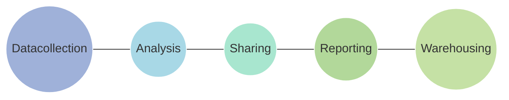

PUBLIC HEALTH BULLETIN-PAKISTAN

Vol. 3 | Week 28 25th July 2023

# Integrated Disease Surveillance & Response (IDSR) Report

**Center of Disease Control**
**National Institute of Health, Islamabad**

**PAKISTAN**

http://www.phb.nih.org.pk/

National Institute of Health logo Government of Pakistan logo

Integrated Disease Surveillance & Response (IDSR) Weekly Public Health Bulletin is your go-to resource for disease trends, outbreak alerts, and crucial public health information. By reading and sharing this bulletin, you can help increase awareness and promote preventive measures within your community. Together, let's build a safer, more resilient and healthier future for everyone.

Group photograph of workshop participants at the National Institute of Health

National Institute of Health under the Ministry of NHSR&C, in collaboration with all provincial and regional Health Departments, and with the support of UKHSA organized a 3-day workshop to finalize the "Training Manual for Integrated Disease Surveillance and Response (IDSR) – July 11-13, 2023"

NIH logo

UK Health Security Agency logo

World Health Organization logo

USAID logo

safetynet logo

---

# Greetings
# Team PHB-Pakistan

Public Health Bulletin Pakistan logo

National Institute of Health Pakistan logo

Government of Pakistan logo

*   *Overview*

*   *IDSR Reports*

*   *Ongoing Events*

*   *Field Reports*

## Preface

Stay informed and stay ahead with the Weekly Public Health Bulletin-Pakistan!

The epidemiological surveillance report for week 28, 2023, found that the most frequent reported cases were of Acute Diarrhea (Non-Cholera) followed by Malaria, ILI, ALRI <5 years, B. Diarrhea, SARI, Typhoid, dog bite, and AVH (A&E). Eight cases of Crimean-Congo hemorrhagic fever (CCHF) were reported from Balochistan, all of which are suspected and need to be verified through field investigation. There is an overall increase in cases of ILI and SARI in Sindh, Khyber Pakhtunkhwa, and Balochistan, and further field investigation is required to verify these cases. The National Institute of Health (NIH) is closely monitoring the situation and will continue to provide updates as more information becomes available.

The PHB team would like to express its sincere gratitude to all of the health workers who have contributed to the reporting of these cases. We would also like to remind the public to stay vigilant and to seek medical attention immediately if they experience any symptoms of these diseases.

This week's bulletin also includes an update on IDSR activities, editors commentary on vaccinations and vaccine preventable diseases, Dengue Day activities and a knowledge review on Viral Monkey pox Disease. Stay well-informed about public health matters. Subscribe to the Weekly Bulletin today!

Sincerely,
The Chief Editor

NIH logo

UK Health Security Agency logo

World Health Organization logo

USAID logo

safetynet logo

---

Overview

* During week 28, most frequent reported cases were of Acute Diarrhea (Non-Cholera) followed by Malaria, ILI, ALRI <5 years, B. Diarrhea, SARI, Typhoid, dog bite and AVH (A&E).

* Eight cases of CCHF reported from Balochistan. All are suspected cases and need field verification.

* There is overall an increase in cases of ILI and SARI Sindh, KPK and Balochistan. Field investigation required to verify cases.

<u>All are suspected cases and need field verification.</u>

NIH logo UK Health Security Agency logo World Health Organization logo USAID logo safetynet logo

---

# Overview

**IDSR compliance attributes**

* The national compliance rate for IDSR reporting in 125 implemented districts *is 71%*

* ICT and Sindh province are the top reporting region with a compliance rate of 85% followed by Khyber Pakhtunkhwa with 75%.

* The lowest compliance rate was observed in Gilgit Baltistan and Balochistan province.

<table>
  <thead>
    <tr>
        <th>Region</th>
        <th>Expected Reports</th>
        <th>Received Reports</th>
        <th>Compliance (%)</th>
    </tr>
  </thead>
  <tbody>
    <tr>
        <td>Khyber Pakhtunkhwa</td>
<td>1610</td>
<td>1206</td>
<td>75</td>
    </tr>
<tr>
        <td>Azad Jammu Kashmir</td>
<td>440</td>
<td>304</td>
<td>69</td>
    </tr>
<tr>
        <td>Islamabad Capital Territory</td>
<td>27</td>
<td>23</td>
<td>85</td>
    </tr>
<tr>
        <td>Balochistan</td>
<td>1285</td>
<td>685</td>
<td>53</td>
    </tr>
<tr>
        <td>Gilgit Baltistan</td>
<td>147</td>
<td>41</td>
<td>28</td>
    </tr>
<tr>
        <td>Sindh</td>
<td>1901</td>
<td>1619</td>
<td>85</td>
    </tr>
<tr>
        <td><strong>National</strong></td>
<td><strong>5489</strong></td>
<td><strong>3878</strong></td>
<td><strong>71</strong></td>
    </tr>
  </tbody>
</table>

NIH logo

UK Health Security Agency logo

World Health Organization logo

USAID logo

safetynet logo

---

Pakistan

**Table 1: Province/Area wise distribution of most frequently reported cases during week 28, Pakistan.**

<table>
    <thead>
    <tr>
        <th>Diseases</th>
        <th>AJK</th>
        <th>Balochistan</th>
        <th>GB</th>
        <th>ICT</th>
        <th>KP</th>
        <th>Punjab</th>
        <th>Sindh</th>
        <th>Total</th>
    </tr>
    </thead>
    <tr>
        <td>AD (Non-Cholera)</td>
<td>2522</td>
<td>6,960</td>
<td>76</td>
<td>458</td>
<td>30,395</td>
<td>93,877</td>
<td>48,647</td>
<td>89,058</td>
    </tr>
<tr>
        <td>Malaria</td>
<td>109</td>
<td>7,871</td>
<td>0</td>
<td>0</td>
<td>6,494</td>
<td>6,031</td>
<td>67,301</td>
<td>81,775</td>
    </tr>
<tr>
        <td>ILI</td>
<td>2,226</td>
<td>3,509</td>
<td>33</td>
<td>802</td>
<td>5,125</td>
<td>397</td>
<td>13,787</td>
<td>25,482</td>
    </tr>
<tr>
        <td>ALRI &lt; 5 years</td>
<td>614</td>
<td>2477</td>
<td>40</td>
<td>0</td>
<td>1454</td>
<td>NR</td>
<td>7703</td>
<td>12,288</td>
    </tr>
<tr>
        <td>B. Diarrhea</td>
<td>86</td>
<td>1990</td>
<td>7</td>
<td>3</td>
<td>1170</td>
<td>3,292</td>
<td>3,225</td>
<td>6,481</td>
    </tr>
<tr>
        <td>VH (B, C & D)</td>
<td>2</td>
<td>162</td>
<td>0</td>
<td>0</td>
<td>102</td>
<td>NR</td>
<td>4352</td>
<td>4,618</td>
    </tr>
<tr>
        <td>SARI</td>
<td>341</td>
<td>1000</td>
<td>24</td>
<td>0</td>
<td>2108</td>
<td>NR</td>
<td>699</td>
<td>4,172</td>
    </tr>
<tr>
        <td>Typhoid</td>
<td>84</td>
<td>1,061</td>
<td>15</td>
<td>0</td>
<td>1020</td>
<td>4,951</td>
<td>1,605</td>
<td>3,785</td>
    </tr>
<tr>
        <td>Dog Bite</td>
<td>71</td>
<td>79</td>
<td>0</td>
<td>0</td>
<td>195</td>
<td>NR</td>
<td>513</td>
<td>858</td>
    </tr>
<tr>
        <td>AVH (A & E)</td>
<td>30</td>
<td>29</td>
<td>0</td>
<td>0</td>
<td>303</td>
<td>NR</td>
<td>453</td>
<td>815</td>
    </tr>
<tr>
        <td>Mumps</td>
<td>92</td>
<td>106</td>
<td>1</td>
<td>2</td>
<td>127</td>
<td>NR</td>
<td>363</td>
<td>691</td>
    </tr>
<tr>
        <td>AWD (S. Cholera)</td>
<td>77</td>
<td>419</td>
<td>11</td>
<td>0</td>
<td>94</td>
<td>NR</td>
<td>48</td>
<td>649</td>
    </tr>
<tr>
        <td>CL</td>
<td>0</td>
<td>115</td>
<td>0</td>
<td>1</td>
<td>396</td>
<td>100</td>
<td>0</td>
<td>512</td>
    </tr>
<tr>
        <td>Measles</td>
<td>15</td>
<td>33</td>
<td>0</td>
<td>0</td>
<td>198</td>
<td>37</td>
<td>54</td>
<td>300</td>
    </tr>
<tr>
        <td>Gonorrhea</td>
<td>4</td>
<td>135</td>
<td>0</td>
<td>0</td>
<td>4</td>
<td>NR</td>
<td>51</td>
<td>194</td>
    </tr>
<tr>
        <td>Chickenpox/ Varicella</td>
<td>7</td>
<td>28</td>
<td>1</td>
<td>2</td>
<td>113</td>
<td>143</td>
<td>40</td>
<td>191</td>
    </tr>
<tr>
        <td>Pertussis</td>
<td>15</td>
<td>75</td>
<td>2</td>
<td>0</td>
<td>9</td>
<td>02</td>
<td>18</td>
<td>119</td>
    </tr>
<tr>
        <td>Dengue</td>
<td>3</td>
<td>0</td>
<td>0</td>
<td>0</td>
<td>19</td>
<td>456</td>
<td>93</td>
<td>115</td>
    </tr>
<tr>
        <td>Leprosy</td>
<td>0</td>
<td>6</td>
<td>0</td>
<td>0</td>
<td>90</td>
<td>NR</td>
<td>19</td>
<td>115</td>
    </tr>
<tr>
        <td>Brucellosis</td>
<td>0</td>
<td>18</td>
<td>0</td>
<td>0</td>
<td>72</td>
<td>NR</td>
<td>0</td>
<td>90</td>
    </tr>
<tr>
        <td>AFP</td>
<td>1</td>
<td>1</td>
<td>0</td>
<td>0</td>
<td>56</td>
<td>11</td>
<td>16</td>
<td>74</td>
    </tr>
<tr>
        <td>Meningitis</td>
<td>2</td>
<td>3</td>
<td>0</td>
<td>0</td>
<td>19</td>
<td>59</td>
<td>7</td>
<td>31</td>
    </tr>
<tr>
        <td>Syphilis</td>
<td>0</td>
<td>16</td>
<td>0</td>
<td>0</td>
<td>2</td>
<td>NR</td>
<td>8</td>
<td>26</td>
    </tr>
<tr>
        <td>NT</td>
<td>0</td>
<td>2</td>
<td>0</td>
<td>0</td>
<td>3</td>
<td>0</td>
<td>20</td>
<td>25</td>
    </tr>
<tr>
        <td>Rubella (CRS)</td>
<td>0</td>
<td>0</td>
<td>0</td>
<td>0</td>
<td>10</td>
<td>NR</td>
<td>5</td>
<td>15</td>
    </tr>
<tr>
        <td>HIV/AIDS</td>
<td>0</td>
<td>4</td>
<td>0</td>
<td>0</td>
<td>1</td>
<td>NR</td>
<td>9</td>
<td>14</td>
    </tr>
<tr>
        <td>Anthrax</td>
<td>0</td>
<td>0</td>
<td>0</td>
<td>0</td>
<td>0</td>
<td>NR</td>
<td>0</td>
<td>0</td>
    </tr>
<tr>
        <td>Chikungunya</td>
<td>0</td>
<td>0</td>
<td>0</td>
<td>0</td>
<td>8</td>
<td>NR</td>
<td>0</td>
<td>8</td>
    </tr>
<tr>
        <td>CCHF</td>
<td>0</td>
<td>8</td>
<td>0</td>
<td>0</td>
<td>0</td>
<td>02</td>
<td>0</td>
<td>8</td>
    </tr>
<tr>
        <td>Diphtheria (Probable)</td>
<td>2</td>
<td>0</td>
<td>4</td>
<td>0</td>
<td>0</td>
<td>NR</td>
<td>0</td>
<td>6</td>
    </tr>
<tr>
        <td>VL</td>
<td>0</td>
<td>5</td>
<td>0</td>
<td>0</td>
<td>0</td>
<td>NR</td>
<td>0</td>
<td>5</td>
    </tr>
</table>

**Figure 1: Most frequently reported suspected cases during week 28, Pakistan**

<table>
  <thead>
    <tr>
        <th>Disease Category</th>
        <th>WK 26</th>
        <th>WK 27</th>
        <th>WK 28</th>
    </tr>
  </thead>
  <tbody>
    <tr>
        <td>AD (Non-Cholera)</td>
<td>85,000</td>
<td>46,000</td>
<td>89,058</td>
    </tr>
<tr>
        <td>Malaria</td>
<td>74,000</td>
<td>32,000</td>
<td>81,775</td>
    </tr>
<tr>
        <td>ILI</td>
<td>26,000</td>
<td>12,000</td>
<td>25,482</td>
    </tr>
<tr>
        <td>ALRI &lt; 5 years</td>
<td>14,000</td>
<td>7,000</td>
<td>12,288</td>
    </tr>
<tr>
        <td>B. Diarrhea</td>
<td>7,000</td>
<td>3,000</td>
<td>6,481</td>
    </tr>
<tr>
        <td>VH (B, C &amp; D)</td>
<td>5,000</td>
<td>2,000</td>
<td>4,618</td>
    </tr>
<tr>
        <td>SARI</td>
<td>4,000</td>
<td>2,000</td>
<td>4,172</td>
    </tr>
<tr>
        <td>Typhoid</td>
<td>4,000</td>
<td>2,000</td>
<td>3,785</td>
    </tr>
<tr>
        <td>AVH (A &amp; E)</td>
<td>1,000</td>
<td>500</td>
<td>815</td>
    </tr>
<tr>
        <td>Dog Bite</td>
<td>1,000</td>
<td>500</td>
<td>858</td>
    </tr>
  </tbody>
</table>

NIH Pakistan logo

UK Health Security Agency logo

World Health Organization logo

USAID logo

safetynet logo

---

# Sindh
* Malaria cases were maximum followed by AD (Non-Cholera), ILI, ALRI<5 Years, VH (B, C, D), B. Diarrhea, Typhoid, SARI, dog bite and AVH (A&E).

* Malaria cases are from Larkana, Kambar and Badin whereas AD cases are mostly from Badin, Matiari and and Mirpurkhas.

* Typhoid cases are regularly reported and mostly reported from Shaheed Benazirabad and Karachi Central. Field investigation is required to identify the source to control the spread of disease.

Table 2: District wise distribution of most frequently reported suspected cases during week 28, Sindh

<table>
    <thead>
    <tr>
        <th>DISTRICTS</th>
        <th>Malaria</th>
        <th>AD (Non-
Cholera)</th>
        <th>ILI</th>
        <th>ALRI &lt; 
5 
years</th>
        <th>B. 
Diarrhea</th>
        <th>Typhoid</th>
        <th>SARI</th>
        <th>Measles</th>
        <th>VH (B, C 
& D)</th>
        <th>Dengue</th>
        <th>Dog Bite</th>
    </tr>
    </thead>
    <tr>
        <td>Badin</td>
<td>5,666</td>
<td>5,219</td>
<td>350</td>
<td>590</td>
<td>242</td>
<td>54</td>
<td>0</td>
<td>5</td>
<td>432</td>
<td>0</td>
<td>86</td>
    </tr>
<tr>
        <td>Dadu</td>
<td>4,576</td>
<td>3,024</td>
<td>10</td>
<td>710</td>
<td>346</td>
<td>124</td>
<td>15</td>
<td>0</td>
<td>5</td>
<td>0</td>
<td>0</td>
    </tr>
<tr>
        <td>Ghotki</td>
<td>724</td>
<td>1,125</td>
<td>0</td>
<td>337</td>
<td>86</td>
<td>20</td>
<td>0</td>
<td>1</td>
<td>326</td>
<td>0</td>
<td>0</td>
    </tr>
<tr>
        <td>Hyderabad</td>
<td>332</td>
<td>1,729</td>
<td>410</td>
<td>48</td>
<td>15</td>
<td>22</td>
<td>0</td>
<td>3</td>
<td>40</td>
<td>0</td>
<td>0</td>
    </tr>
<tr>
        <td>Jacobabad</td>
<td>1,697</td>
<td>1,806</td>
<td>120</td>
<td>915</td>
<td>202</td>
<td>49</td>
<td>179</td>
<td>4</td>
<td>180</td>
<td>0</td>
<td>22</td>
    </tr>
<tr>
        <td>Jamshoro</td>
<td>108</td>
<td>110</td>
<td>0</td>
<td>11</td>
<td>6</td>
<td>12</td>
<td>0</td>
<td>0</td>
<td>0</td>
<td>0</td>
<td>0</td>
    </tr>
<tr>
        <td>Kamber</td>
<td>7,152</td>
<td>2,867</td>
<td>5</td>
<td>363</td>
<td>176</td>
<td>16</td>
<td>0</td>
<td>1</td>
<td>121</td>
<td>0</td>
<td>0</td>
    </tr>
<tr>
        <td>Karachi Central</td>
<td>44</td>
<td>1,226</td>
<td>1,283</td>
<td>36</td>
<td>73</td>
<td>277</td>
<td>1</td>
<td>9</td>
<td>154</td>
<td>3</td>
<td>0</td>
    </tr>
<tr>
        <td>Karachi East</td>
<td>49</td>
<td>324</td>
<td>40</td>
<td>0</td>
<td>2</td>
<td>1</td>
<td>0</td>
<td>1</td>
<td>0</td>
<td>11</td>
<td>0</td>
    </tr>
<tr>
        <td>Karachi Keamari</td>
<td>5</td>
<td>437</td>
<td>91</td>
<td>15</td>
<td>3</td>
<td>1</td>
<td>0</td>
<td>0</td>
<td>0</td>
<td>0</td>
<td>0</td>
    </tr>
<tr>
        <td>Karachi Korangi</td>
<td>55</td>
<td>330</td>
<td>0</td>
<td>0</td>
<td>3</td>
<td>1</td>
<td>0</td>
<td>1</td>
<td>0</td>
<td>7</td>
<td>0</td>
    </tr>
<tr>
        <td>Karachi Malir</td>
<td>96</td>
<td>1,562</td>
<td>1,484</td>
<td>300</td>
<td>56</td>
<td>25</td>
<td>43</td>
<td>2</td>
<td>43</td>
<td>4</td>
<td>17</td>
    </tr>
<tr>
        <td>Karachi South</td>
<td>26</td>
<td>131</td>
<td>0</td>
<td>0</td>
<td>9</td>
<td>1</td>
<td>0</td>
<td>0</td>
<td>0</td>
<td>0</td>
<td>0</td>
    </tr>
<tr>
        <td>Karachi West</td>
<td>116</td>
<td>645</td>
<td>499</td>
<td>229</td>
<td>58</td>
<td>25</td>
<td>73</td>
<td>0</td>
<td>19</td>
<td>9</td>
<td>44</td>
    </tr>
<tr>
        <td>Kashmore</td>
<td>1,425</td>
<td>586</td>
<td>291</td>
<td>158</td>
<td>86</td>
<td>7</td>
<td>0</td>
<td>1</td>
<td>46</td>
<td>0</td>
<td>34</td>
    </tr>
<tr>
        <td>Khairpur</td>
<td>3,631</td>
<td>2,693</td>
<td>403</td>
<td>536</td>
<td>296</td>
<td>211</td>
<td>286</td>
<td>0</td>
<td>128</td>
<td>0</td>
<td>29</td>
    </tr>
<tr>
        <td>Larkana</td>
<td>11,384</td>
<td>1,834</td>
<td>0</td>
<td>139</td>
<td>200</td>
<td>12</td>
<td>7</td>
<td>0</td>
<td>126</td>
<td>0</td>
<td>0</td>
    </tr>
<tr>
        <td>Matiari</td>
<td>1,346</td>
<td>2,198</td>
<td>0</td>
<td>183</td>
<td>84</td>
<td>51</td>
<td>0</td>
<td>1</td>
<td>634</td>
<td>9</td>
<td>21</td>
    </tr>
<tr>
        <td>Mirpurkhas</td>
<td>4,390</td>
<td>3,648</td>
<td>2,977</td>
<td>560</td>
<td>127</td>
<td>36</td>
<td>0</td>
<td>0</td>
<td>70</td>
<td>0</td>
<td>1</td>
    </tr>
<tr>
        <td>Naushero Feroze</td>
<td>2,423</td>
<td>2,159</td>
<td>555</td>
<td>200</td>
<td>110</td>
<td>139</td>
<td>0</td>
<td>0</td>
<td>50</td>
<td>0</td>
<td>4</td>
    </tr>
<tr>
        <td>Sanghar</td>
<td>1,486</td>
<td>2,375</td>
<td>104</td>
<td>408</td>
<td>131</td>
<td>77</td>
<td>34</td>
<td>5</td>
<td>585</td>
<td>0</td>
<td>147</td>
    </tr>
<tr>
        <td>Shaheed 
Benazirabad</td>
<td>1,843</td>
<td>2,088</td>
<td>35</td>
<td>324</td>
<td>76</td>
<td>295</td>
<td>3</td>
<td>9</td>
<td>154</td>
<td>0</td>
<td>0</td>
    </tr>
<tr>
        <td>Shikarpur</td>
<td>1,319</td>
<td>1,142</td>
<td>0</td>
<td>95</td>
<td>119</td>
<td>2</td>
<td>2</td>
<td>3</td>
<td>178</td>
<td>0</td>
<td>0</td>
    </tr>
<tr>
        <td>Sujawal</td>
<td>858</td>
<td>285</td>
<td>0</td>
<td>60</td>
<td>34</td>
<td>8</td>
<td>0</td>
<td>0</td>
<td>0</td>
<td>0</td>
<td>0</td>
    </tr>
<tr>
        <td>Sukkur</td>
<td>2,844</td>
<td>1,706</td>
<td>1,752</td>
<td>284</td>
<td>190</td>
<td>16</td>
<td>0</td>
<td>4</td>
<td>432</td>
<td>0</td>
<td>0</td>
    </tr>
<tr>
        <td>Tando Allahyar</td>
<td>1,409</td>
<td>1,247</td>
<td>240</td>
<td>202</td>
<td>97</td>
<td>29</td>
<td>0</td>
<td>0</td>
<td>207</td>
<td>0</td>
<td>5</td>
    </tr>
<tr>
        <td>Tando 
Muhammad Khan</td>
<td>359</td>
<td>425</td>
<td>0</td>
<td>42</td>
<td>24</td>
<td>0</td>
<td>0</td>
<td>0</td>
<td>8</td>
<td>0</td>
<td>26</td>
    </tr>
<tr>
        <td>Tharparkar</td>
<td>2,344</td>
<td>1,596</td>
<td>1,775</td>
<td>436</td>
<td>143</td>
<td>31</td>
<td>9</td>
<td>1</td>
<td>116</td>
<td>50</td>
<td>4</td>
    </tr>
<tr>
        <td>Thatta</td>
<td>4,562</td>
<td>2,037</td>
<td>1,363</td>
<td>296</td>
<td>162</td>
<td>14</td>
<td>47</td>
<td>1</td>
<td>156</td>
<td>0</td>
<td>72</td>
    </tr>
<tr>
        <td>Umerkot</td>
<td>5,032</td>
<td>2,093</td>
<td>0</td>
<td>226</td>
<td>69</td>
<td>49</td>
<td>0</td>
<td>2</td>
<td>142</td>
<td>0</td>
<td>1</td>
    </tr>
<tr>
        <td>Total</td>
<td>67,301</td>
<td>48,647</td>
<td>13,787</td>
<td>7,703</td>
<td>3,225</td>
<td>1,605</td>
<td>699</td>
<td>54</td>
<td>4,352</td>
<td>93</td>
<td>513</td>
    </tr>
</table>

Figure 2: Most frequently reported suspected cases during week 28, Sindh

<table>
  <thead>
    <tr>
        <th>Disease</th>
        <th>WK 26</th>
        <th>WK 27</th>
        <th>WK 28</th>
    </tr>
  </thead>
  <tbody>
    <tr>
        <td>Malaria</td>
<td>25000</td>
<td>58000</td>
<td>67301</td>
    </tr>
<tr>
        <td>AD (Non-Cholera)</td>
<td>24500</td>
<td>46000</td>
<td>48647</td>
    </tr>
<tr>
        <td>ILI</td>
<td>6000</td>
<td>13500</td>
<td>13787</td>
    </tr>
<tr>
        <td>ALRI &lt; 5 years</td>
<td>3500</td>
<td>8000</td>
<td>7703</td>
    </tr>
<tr>
        <td>VH (B, C &amp; D)</td>
<td>1500</td>
<td>2500</td>
<td>4352</td>
    </tr>
<tr>
        <td>B. Diarrhea</td>
<td>1200</td>
<td>2800</td>
<td>3225</td>
    </tr>
<tr>
        <td>Typhoid</td>
<td>1000</td>
<td>1400</td>
<td>1605</td>
    </tr>
<tr>
        <td>SARI</td>
<td>400</td>
<td>600</td>
<td>699</td>
    </tr>
<tr>
        <td>Dog Bite</td>
<td>300</td>
<td>450</td>
<td>513</td>
    </tr>
<tr>
        <td>AVH (A &amp; E)</td>
<td>200</td>
<td>350</td>
<td>453</td>
    </tr>
  </tbody>
</table>

NIH logo

UK Health Security Agency logo

World Health Organization logo

USAID logo

safetynet logo

---

# Balochistan

* Malaria, AD (Non-Cholera), ILI, ALRI <5 years, B. Diarrhea, Typhoid, SARI, AWD (S. Cholera), VH (A&E) and Gonorrhea were the most frequently reported diseases from Balochistan province.
* Trend for ILI, AD and Malaria cases remained same this week.
* Cases of ALRI <5 years were reported in high numbers from Lesbella, Harnai and Panjgur. All are suspected cases and need field investigation to verify the cases.

Table 3: District wise distribution of most frequently reported suspected cases during week 28, Balochistan

<table>
    <thead>
    <tr>
        <th>Districts</th>
        <th>Malaria</th>
        <th>AD (Non-
Cholera)</th>
        <th>ILI</th>
        <th>B. 
Diarrhea</th>
        <th>ALRI &lt; 5 
Years</th>
        <th>Typhoid</th>
        <th>SARI</th>
        <th>CL</th>
        <th>Dog Bite</th>
        <th>AWD (S. 
Cholera)</th>
    </tr>
    </thead>
    <tr>
        <td>Awaran</td>
<td>448</td>
<td>69</td>
<td>31</td>
<td>39</td>
<td>22</td>
<td>20</td>
<td>5</td>
<td>1</td>
<td>0</td>
<td>29</td>
    </tr>
<tr>
        <td>Chagai</td>
<td>32</td>
<td>183</td>
<td>274</td>
<td>43</td>
<td>0</td>
<td>45</td>
<td>0</td>
<td>0</td>
<td>1</td>
<td>14</td>
    </tr>
<tr>
        <td>Chaman</td>
<td>0</td>
<td>30</td>
<td>0</td>
<td>15</td>
<td>0</td>
<td>9</td>
<td>0</td>
<td>0</td>
<td>0</td>
<td>0</td>
    </tr>
<tr>
        <td>Duki</td>
<td>103</td>
<td>200</td>
<td>60</td>
<td>96</td>
<td>16</td>
<td>25</td>
<td>39</td>
<td>4</td>
<td>0</td>
<td>38</td>
    </tr>
<tr>
        <td>Harnai</td>
<td>97</td>
<td>247</td>
<td>11</td>
<td>311</td>
<td>435</td>
<td>6</td>
<td>0</td>
<td>2</td>
<td>2</td>
<td>18</td>
    </tr>
<tr>
        <td>Jaffarabad</td>
<td>1,740</td>
<td>854</td>
<td>150</td>
<td>118</td>
<td>104</td>
<td>264</td>
<td>59</td>
<td>0</td>
<td>4</td>
<td>9</td>
    </tr>
<tr>
        <td>Jhal Magsi</td>
<td>668</td>
<td>357</td>
<td>0</td>
<td>25</td>
<td>75</td>
<td>26</td>
<td>1</td>
<td>0</td>
<td>11</td>
<td>41</td>
    </tr>
<tr>
        <td>Kachhi (Bolan)</td>
<td>114</td>
<td>108</td>
<td>22</td>
<td>23</td>
<td>7</td>
<td>46</td>
<td>15</td>
<td>0</td>
<td>0</td>
<td>2</td>
    </tr>
<tr>
        <td>Kech (Turbat)</td>
<td>377</td>
<td>362</td>
<td>588</td>
<td>70</td>
<td>73</td>
<td>5</td>
<td>0</td>
<td>0</td>
<td>0</td>
<td>0</td>
    </tr>
<tr>
        <td>Kharan</td>
<td>82</td>
<td>86</td>
<td>193</td>
<td>76</td>
<td>0</td>
<td>5</td>
<td>0</td>
<td>0</td>
<td>0</td>
<td>5</td>
    </tr>
<tr>
        <td>Khuzdar</td>
<td>76</td>
<td>92</td>
<td>69</td>
<td>50</td>
<td>2</td>
<td>14</td>
<td>2</td>
<td>NR</td>
<td>NR</td>
<td>NR</td>
    </tr>
<tr>
        <td>Killa Saifullah</td>
<td>280</td>
<td>264</td>
<td>0</td>
<td>112</td>
<td>226</td>
<td>47</td>
<td>40</td>
<td>21</td>
<td>0</td>
<td>54</td>
    </tr>
<tr>
        <td>Kohlu</td>
<td>113</td>
<td>91</td>
<td>145</td>
<td>84</td>
<td>14</td>
<td>23</td>
<td>39</td>
<td>3</td>
<td>10</td>
<td>6</td>
    </tr>
<tr>
        <td>Lasbella</td>
<td>899</td>
<td>722</td>
<td>111</td>
<td>127</td>
<td>477</td>
<td>40</td>
<td>291</td>
<td>4</td>
<td>9</td>
<td>3</td>
    </tr>
<tr>
        <td>Loralai</td>
<td>78</td>
<td>278</td>
<td>223</td>
<td>59</td>
<td>92</td>
<td>35</td>
<td>98</td>
<td>0</td>
<td>0</td>
<td>10</td>
    </tr>
<tr>
        <td>Mastung</td>
<td>136</td>
<td>747</td>
<td>171</td>
<td>86</td>
<td>98</td>
<td>80</td>
<td>101</td>
<td>10</td>
<td>28</td>
<td>54</td>
    </tr>
<tr>
        <td>Naseerabad</td>
<td>535</td>
<td>223</td>
<td>3</td>
<td>25</td>
<td>17</td>
<td>73</td>
<td>4</td>
<td>2</td>
<td>1</td>
<td>7</td>
    </tr>
<tr>
        <td>Nushki</td>
<td>110</td>
<td>206</td>
<td>4</td>
<td>111</td>
<td>2</td>
<td>0</td>
<td>21</td>
<td>0</td>
<td>0</td>
<td>31</td>
    </tr>
<tr>
        <td>Panjgur</td>
<td>426</td>
<td>297</td>
<td>83</td>
<td>92</td>
<td>148</td>
<td>62</td>
<td>43</td>
<td>1</td>
<td>0</td>
<td>33</td>
    </tr>
<tr>
        <td>Pishin</td>
<td>14</td>
<td>168</td>
<td>127</td>
<td>85</td>
<td>16</td>
<td>22</td>
<td>6</td>
<td>21</td>
<td>5</td>
<td>0</td>
    </tr>
<tr>
        <td>Quetta</td>
<td>38</td>
<td>408</td>
<td>784</td>
<td>132</td>
<td>99</td>
<td>48</td>
<td>53</td>
<td>9</td>
<td>0</td>
<td>27</td>
    </tr>
<tr>
        <td>Sherani</td>
<td>7</td>
<td>7</td>
<td>41</td>
<td>12</td>
<td>0</td>
<td>10</td>
<td>2</td>
<td>18</td>
<td>0</td>
<td>0</td>
    </tr>
<tr>
        <td>Sibi</td>
<td>356</td>
<td>130</td>
<td>117</td>
<td>23</td>
<td>15</td>
<td>44</td>
<td>16</td>
<td>12</td>
<td>4</td>
<td>24</td>
    </tr>
<tr>
        <td>Sohbat pur</td>
<td>905</td>
<td>450</td>
<td>12</td>
<td>82</td>
<td>172</td>
<td>80</td>
<td>113</td>
<td>7</td>
<td>0</td>
<td>4</td>
    </tr>
<tr>
        <td>SURAB</td>
<td>13</td>
<td>4</td>
<td>0</td>
<td>0</td>
<td>0</td>
<td>2</td>
<td>0</td>
<td>0</td>
<td>0</td>
<td>0</td>
    </tr>
<tr>
        <td>Washuk</td>
<td>63</td>
<td>29</td>
<td>60</td>
<td>5</td>
<td>1</td>
<td>3</td>
<td>0</td>
<td>0</td>
<td>1</td>
<td>0</td>
    </tr>
<tr>
        <td>Zhob</td>
<td>134</td>
<td>237</td>
<td>135</td>
<td>71</td>
<td>353</td>
<td>16</td>
<td>49</td>
<td>0</td>
<td>0</td>
<td>1</td>
    </tr>
<tr>
        <td>Ziarat</td>
<td>27</td>
<td>111</td>
<td>95</td>
<td>18</td>
<td>13</td>
<td>11</td>
<td>3</td>
<td>0</td>
<td>3</td>
<td>9</td>
    </tr>
<tr>
        <td>Total</td>
<td>7,871</td>
<td>6,960</td>
<td>3,509</td>
<td>1,990</td>
<td>2,477</td>
<td>1,061</td>
<td>1,000</td>
<td>115</td>
<td>79</td>
<td>419</td>
    </tr>
</table>

Figure 3: Most frequently reported suspected cases during week 28, Balochistan

<table>
  <thead>
    <tr>
        <th>Disease</th>
        <th>WK 26</th>
        <th>WK 27</th>
        <th>WK 28</th>
    </tr>
  </thead>
  <tbody>
    <tr>
        <td>Malaria</td>
<td>4000</td>
<td>8100</td>
<td>7871</td>
    </tr>
<tr>
        <td>AD (Non-Cholera)</td>
<td>4000</td>
<td>7000</td>
<td>6960</td>
    </tr>
<tr>
        <td>ILI</td>
<td>1500</td>
<td>3100</td>
<td>3509</td>
    </tr>
<tr>
        <td>ALRI &lt; 5 years</td>
<td>800</td>
<td>1800</td>
<td>2477</td>
    </tr>
<tr>
        <td>B. Diarrhea</td>
<td>1200</td>
<td>1900</td>
<td>1990</td>
    </tr>
<tr>
        <td>Typhoid</td>
<td>800</td>
<td>1100</td>
<td>1061</td>
    </tr>
<tr>
        <td>SARI</td>
<td>400</td>
<td>900</td>
<td>1000</td>
    </tr>
<tr>
        <td>AWD (S. Cholera)</td>
<td>200</td>
<td>400</td>
<td>419</td>
    </tr>
<tr>
        <td>VH (B, C &amp; D)</td>
<td>100</td>
<td>150</td>
<td>162</td>
    </tr>
<tr>
        <td>Gonorrhea</td>
<td>50</td>
<td>100</td>
<td>135</td>
    </tr>
  </tbody>
</table>

NIH logo

UK Health Security Agency logo

World Health Organization logo

USAID logo

safetynet logo

---

# Khyber Pakhtunkhwa

* Cases of AD (Non-Cholera) were maximum followed by Malaria, ILI, SARI, ALRI<5 Years, B. Diarrhea, Typhoid, CL, AVH (A&E) and Measles cases.

* Malaria cases showed a sharp rise this week.

* Ninety-three Typhoid cases and 110 cases of VH (A&E) were reported from Dir Lower. These are suspected cases and a field investigation is required to verify cases.

**Table 4: District wise distribution of most frequently reported suspected cases during week 28, KP**

<table>
    <thead>
    <tr>
        <th>Diseases</th>
        <th>AD (Non-
Cholera)</th>
        <th>Malaria</th>
        <th>ILI</th>
        <th>SARI</th>
        <th>ALRI &lt; 5 
years</th>
        <th>B. Diarrhea</th>
        <th>Typhoid</th>
        <th>Dog Bite</th>
        <th>AWD (S. 
Cholera)</th>
        <th>AVH (A & 
E)</th>
    </tr>
    </thead>
    <tr>
        <td>Abbottabad</td>
<td>719</td>
<td>2</td>
<td>6</td>
<td>5</td>
<td>1</td>
<td>0</td>
<td>13</td>
<td>2</td>
<td>0</td>
<td>0</td>
    </tr>
<tr>
        <td>Bannu</td>
<td>892</td>
<td>1,111</td>
<td>94</td>
<td>25</td>
<td>1</td>
<td>15</td>
<td>53</td>
<td>2</td>
<td>17</td>
<td>3</td>
    </tr>
<tr>
        <td>Buner</td>
<td>682</td>
<td>485</td>
<td>0</td>
<td>0</td>
<td>18</td>
<td>18</td>
<td>11</td>
<td>3</td>
<td>0</td>
<td>0</td>
    </tr>
<tr>
        <td>Charsadda</td>
<td>1,508</td>
<td>82</td>
<td>155</td>
<td>21</td>
<td>2</td>
<td>0</td>
<td>0</td>
<td>0</td>
<td>0</td>
<td>0</td>
    </tr>
<tr>
        <td>Chitral Lower</td>
<td>867</td>
<td>9</td>
<td>92</td>
<td>726</td>
<td>4</td>
<td>5</td>
<td>8</td>
<td>8</td>
<td>0</td>
<td>2</td>
    </tr>
<tr>
        <td>Chitral Upper</td>
<td>156</td>
<td>2</td>
<td>2</td>
<td>255</td>
<td>0</td>
<td>0</td>
<td>29</td>
<td>0</td>
<td>0</td>
<td>3</td>
    </tr>
<tr>
        <td>D.I. Khan</td>
<td>1,098</td>
<td>512</td>
<td>21</td>
<td>39</td>
<td>11</td>
<td>24</td>
<td>3</td>
<td>8</td>
<td>0</td>
<td>0</td>
    </tr>
<tr>
        <td>Dir Lower</td>
<td>2,399</td>
<td>931</td>
<td>169</td>
<td>234</td>
<td>138</td>
<td>232</td>
<td>93</td>
<td>17</td>
<td>0</td>
<td>110</td>
    </tr>
<tr>
        <td>Dir Upper</td>
<td>922</td>
<td>7</td>
<td>86</td>
<td>0</td>
<td>85</td>
<td>38</td>
<td>32</td>
<td>0</td>
<td>0</td>
<td>6</td>
    </tr>
<tr>
        <td>Hangu</td>
<td>397</td>
<td>441</td>
<td>441</td>
<td>155</td>
<td>5</td>
<td>33</td>
<td>17</td>
<td>14</td>
<td>0</td>
<td>10</td>
    </tr>
<tr>
        <td>Haripur</td>
<td>1,406</td>
<td>49</td>
<td>273</td>
<td>5</td>
<td>196</td>
<td>5</td>
<td>57</td>
<td>10</td>
<td>0</td>
<td>28</td>
    </tr>
<tr>
        <td>Karak</td>
<td>359</td>
<td>155</td>
<td>41</td>
<td>11</td>
<td>17</td>
<td>0</td>
<td>12</td>
<td>26</td>
<td>6</td>
<td>0</td>
    </tr>
<tr>
        <td>Khyber</td>
<td>6</td>
<td>35</td>
<td>132</td>
<td>1</td>
<td>1</td>
<td>2</td>
<td>3</td>
<td>1</td>
<td>0</td>
<td>1</td>
    </tr>
<tr>
        <td>Kohat</td>
<td>89</td>
<td>44</td>
<td>16</td>
<td>2</td>
<td>1</td>
<td>0</td>
<td>2</td>
<td>2</td>
<td>0</td>
<td>0</td>
    </tr>
<tr>
        <td>Kohistan Lower</td>
<td>205</td>
<td>5</td>
<td>0</td>
<td>211</td>
<td>7</td>
<td>40</td>
<td>0</td>
<td>0</td>
<td>5</td>
<td>0</td>
    </tr>
<tr>
        <td>Kohistan Upper</td>
<td>384</td>
<td>0</td>
<td>36</td>
<td>9</td>
<td>35</td>
<td>14</td>
<td>37</td>
<td>0</td>
<td>0</td>
<td>0</td>
    </tr>
<tr>
        <td>Kolai Palas</td>
<td>86</td>
<td>1</td>
<td>0</td>
<td>5</td>
<td>2</td>
<td>12</td>
<td>5</td>
<td>0</td>
<td>7</td>
<td>0</td>
    </tr>
<tr>
        <td>L & C Kurram</td>
<td>24</td>
<td>33</td>
<td>11</td>
<td>0</td>
<td>0</td>
<td>2</td>
<td>1</td>
<td>0</td>
<td>0</td>
<td>0</td>
    </tr>
<tr>
        <td>Lakki Marwat</td>
<td>659</td>
<td>1,003</td>
<td>0</td>
<td>0</td>
<td>15</td>
<td>8</td>
<td>36</td>
<td>0</td>
<td>0</td>
<td>0</td>
    </tr>
<tr>
        <td>Malakand</td>
<td>1,316</td>
<td>87</td>
<td>26</td>
<td>104</td>
<td>67</td>
<td>153</td>
<td>51</td>
<td>8</td>
<td>0</td>
<td>40</td>
    </tr>
<tr>
        <td>Mansehra</td>
<td>1,067</td>
<td>5</td>
<td>632</td>
<td>47</td>
<td>77</td>
<td>42</td>
<td>45</td>
<td>0</td>
<td>42</td>
<td>8</td>
    </tr>
<tr>
        <td>Mardan</td>
<td>1,069</td>
<td>126</td>
<td>559</td>
<td>130</td>
<td>408</td>
<td>63</td>
<td>42</td>
<td>55</td>
<td>0</td>
<td>5</td>
    </tr>
<tr>
        <td>Nowshera</td>
<td>2,278</td>
<td>136</td>
<td>53</td>
<td>12</td>
<td>3</td>
<td>57</td>
<td>23</td>
<td>0</td>
<td>0</td>
<td>6</td>
    </tr>
<tr>
        <td>Peshawar</td>
<td>2,941</td>
<td>72</td>
<td>1,234</td>
<td>21</td>
<td>77</td>
<td>223</td>
<td>127</td>
<td>3</td>
<td>3</td>
<td>28</td>
    </tr>
<tr>
        <td>Shangla</td>
<td>573</td>
<td>565</td>
<td>0</td>
<td>0</td>
<td>3</td>
<td>0</td>
<td>8</td>
<td>4</td>
<td>0</td>
<td>0</td>
    </tr>
<tr>
        <td>Swabi</td>
<td>2,034</td>
<td>39</td>
<td>649</td>
<td>61</td>
<td>93</td>
<td>27</td>
<td>23</td>
<td>0</td>
<td>0</td>
<td>36</td>
    </tr>
<tr>
        <td>Swat</td>
<td>5,657</td>
<td>83</td>
<td>397</td>
<td>0</td>
<td>126</td>
<td>109</td>
<td>174</td>
<td>18</td>
<td>0</td>
<td>7</td>
    </tr>
<tr>
        <td>Tank</td>
<td>478</td>
<td>347</td>
<td>0</td>
<td>0</td>
<td>52</td>
<td>14</td>
<td>92</td>
<td>1</td>
<td>9</td>
<td>9</td>
    </tr>
<tr>
        <td>Tor Ghar</td>
<td>124</td>
<td>127</td>
<td>0</td>
<td>29</td>
<td>9</td>
<td>34</td>
<td>23</td>
<td>13</td>
<td>5</td>
<td>1</td>
    </tr>
<tr>
        <td>Total</td>
<td>30,395</td>
<td>6,494</td>
<td>5,125</td>
<td>2,108</td>
<td>1,454</td>
<td>1,170</td>
<td>1,020</td>
<td>195</td>
<td>94</td>
<td>303</td>
    </tr>
</table>

Figure 4: Most frequently reported suspected cases during week 28, KP

<table>
  <thead>
    <tr>
        <th>Disease</th>
        <th>WK 26</th>
        <th>WK 27</th>
        <th>WK 28</th>
    </tr>
  </thead>
  <tbody>
    <tr>
        <td>AD (Non-Cholera)</td>
<td>15000</td>
<td>28000</td>
<td>30395</td>
    </tr>
<tr>
        <td>Malaria</td>
<td>3000</td>
<td>6000</td>
<td>6494</td>
    </tr>
<tr>
        <td>ILI</td>
<td>2500</td>
<td>4500</td>
<td>5125</td>
    </tr>
<tr>
        <td>SARI</td>
<td>1000</td>
<td>1500</td>
<td>2108</td>
    </tr>
<tr>
        <td>ALRI &lt; 5 years</td>
<td>500</td>
<td>1000</td>
<td>1454</td>
    </tr>
<tr>
        <td>B. Diarrhea</td>
<td>500</td>
<td>800</td>
<td>1170</td>
    </tr>
<tr>
        <td>Typhoid</td>
<td>400</td>
<td>700</td>
<td>1020</td>
    </tr>
<tr>
        <td>CL</td>
<td>200</td>
<td>300</td>
<td>396</td>
    </tr>
<tr>
        <td>AVH (A &amp; E)</td>
<td>150</td>
<td>250</td>
<td>303</td>
    </tr>
<tr>
        <td>Measles</td>
<td>100</td>
<td>150</td>
<td>198</td>
    </tr>
  </tbody>
</table>

NIH logo

UK Health Security Agency logo

World Health Organization logo

USAID logo

safetynet logo

---

# ICT, AJK & GB

**ICT**: The most frequently reported cases from Islamabad were ILI followed by AD (Non-Cholera). ILI cases showed an upward trend in cases this week.
**AJK**: AD (Non-Cholera) cases were maximum followed by ILI, ALRI <5 years, SARI, Malaria, Mumps. Diarrhea, Typhoid, AWD (S. Cholera), and dog bite. Both ILI and ALRI <5 years cases showed an upward trend in cases this week.
**GB**: AD (Non. Cholera) cases were maximum followed by ALRI<5 years, ILI and SARI.

Figure 6: Week wise reported suspected cases of ILI, ICT

<table>
  <thead>
    <tr>
        <th>Category</th>
        <th>WK26</th>
        <th>WK27</th>
        <th>WK28</th>
    </tr>
  </thead>
  <tbody>
    <tr>
        <td>ILI</td>
<td>190</td>
<td>630</td>
<td>802</td>
    </tr>
<tr>
        <td>AD (Non-Cholera)</td>
<td>120</td>
<td>430</td>
<td>458</td>
    </tr>
  </tbody>
</table>

Figure 6: Week wise reported suspected cases of ILI, ICT

<table>
  <thead>
    <tr>
        <th>Week</th>
        <th>ILI</th>
    </tr>
  </thead>
  <tbody>
    <tr>
        <td>W29</td>
<td>900</td>
    </tr>
<tr>
        <td>W30</td>
<td>1150</td>
    </tr>
<tr>
        <td>W31</td>
<td>1300</td>
    </tr>
<tr>
        <td>W32</td>
<td>1350</td>
    </tr>
<tr>
        <td>W33</td>
<td>1250</td>
    </tr>
<tr>
        <td>W34</td>
<td>450</td>
    </tr>
<tr>
        <td>W35</td>
<td>1450</td>
    </tr>
<tr>
        <td>W36</td>
<td>100</td>
    </tr>
<tr>
        <td>W37</td>
<td>50</td>
    </tr>
<tr>
        <td>W38</td>
<td>1200</td>
    </tr>
<tr>
        <td>W39</td>
<td>950</td>
    </tr>
<tr>
        <td>W40</td>
<td>2150</td>
    </tr>
<tr>
        <td>W41</td>
<td>2350</td>
    </tr>
<tr>
        <td>W42</td>
<td>2650</td>
    </tr>
<tr>
        <td>W43</td>
<td>2600</td>
    </tr>
<tr>
        <td>W44</td>
<td>1850</td>
    </tr>
<tr>
        <td>W45</td>
<td>1700</td>
    </tr>
<tr>
        <td>W46</td>
<td>1550</td>
    </tr>
<tr>
        <td>W47</td>
<td>2450</td>
    </tr>
<tr>
        <td>W48</td>
<td>2350</td>
    </tr>
<tr>
        <td>W49</td>
<td>2550</td>
    </tr>
<tr>
        <td>W50</td>
<td>3200</td>
    </tr>
<tr>
        <td>W51</td>
<td>2550</td>
    </tr>
<tr>
        <td>W52</td>
<td>2150</td>
    </tr>
<tr>
        <td>W1</td>
<td>2100</td>
    </tr>
<tr>
        <td>W2</td>
<td>1600</td>
    </tr>
<tr>
        <td>W3</td>
<td>1950</td>
    </tr>
<tr>
        <td>W4</td>
<td>1950</td>
    </tr>
<tr>
        <td>W5</td>
<td>1950</td>
    </tr>
<tr>
        <td>W6</td>
<td>1550</td>
    </tr>
<tr>
        <td>W7</td>
<td>2300</td>
    </tr>
<tr>
        <td>W8</td>
<td>1600</td>
    </tr>
<tr>
        <td>W9</td>
<td>2250</td>
    </tr>
<tr>
        <td>W10</td>
<td>2100</td>
    </tr>
<tr>
        <td>W11</td>
<td>1650</td>
    </tr>
<tr>
        <td>W12</td>
<td>750</td>
    </tr>
<tr>
        <td>W13</td>
<td>1500</td>
    </tr>
<tr>
        <td>W14</td>
<td>1450</td>
    </tr>
<tr>
        <td>W15</td>
<td>1000</td>
    </tr>
<tr>
        <td>W16</td>
<td>650</td>
    </tr>
<tr>
        <td>W17</td>
<td>1150</td>
    </tr>
<tr>
        <td>W18</td>
<td>950</td>
    </tr>
<tr>
        <td>W19</td>
<td>1500</td>
    </tr>
<tr>
        <td>W20</td>
<td>750</td>
    </tr>
<tr>
        <td>W21</td>
<td>1150</td>
    </tr>
<tr>
        <td>W22</td>
<td>1150</td>
    </tr>
<tr>
        <td>W23</td>
<td>650</td>
    </tr>
<tr>
        <td>W24</td>
<td>1000</td>
    </tr>
<tr>
        <td>W25</td>
<td>850</td>
    </tr>
<tr>
        <td>W26</td>
<td>150</td>
    </tr>
<tr>
        <td>W27</td>
<td>650</td>
    </tr>
<tr>
        <td>W28</td>
<td>800</td>
    </tr>
  </tbody>
</table>

Figure 7: Most frequently reported suspected cases during week 28, AJK

<table>
  <thead>
    <tr>
        <th>Disease</th>
        <th>WK 26</th>
        <th>WK 27</th>
        <th>WK 28</th>
    </tr>
  </thead>
  <tbody>
    <tr>
        <td>AD (Non-Cholera)</td>
<td>1500</td>
<td>2550</td>
<td>2522</td>
    </tr>
<tr>
        <td>ILI</td>
<td>1050</td>
<td>2000</td>
<td>2226</td>
    </tr>
<tr>
        <td>ALRI &lt; 5 years</td>
<td>450</td>
<td>700</td>
<td>614</td>
    </tr>
<tr>
        <td>SARI</td>
<td>250</td>
<td>300</td>
<td>341</td>
    </tr>
<tr>
        <td>Malaria</td>
<td>100</td>
<td>120</td>
<td>109</td>
    </tr>
<tr>
        <td>Mumps</td>
<td>80</td>
<td>150</td>
<td>92</td>
    </tr>
<tr>
        <td>B. Diarrhea</td>
<td>150</td>
<td>120</td>
<td>86</td>
    </tr>
<tr>
        <td>Typhoid</td>
<td>100</td>
<td>100</td>
<td>84</td>
    </tr>
<tr>
        <td>AWD (S. Cholera)</td>
<td>50</td>
<td>60</td>
<td>77</td>
    </tr>
<tr>
        <td>Dog Bite</td>
<td>60</td>
<td>50</td>
<td>71</td>
    </tr>
  </tbody>
</table>

NIH logo

UK Health Security Agency logo

World Health Organization logo

USAID logo

safetynet logo

---

**Figure 8: Week wise reported suspected cases of AD (Non-Cholera) and ALRI <5 years, AJK**

<table>
  <thead>
    <tr>
        <th>Week</th>
        <th>AD (Non-Cholera)</th>
        <th>ILI</th>
    </tr>
  </thead>
  <tbody>
    <tr>
        <td>W29</td>
<td>150</td>
<td>50</td>
    </tr>
<tr>
        <td>W31</td>
<td>160</td>
<td>60</td>
    </tr>
<tr>
        <td>W33</td>
<td>180</td>
<td>70</td>
    </tr>
<tr>
        <td>W35</td>
<td>190</td>
<td>80</td>
    </tr>
<tr>
        <td>W37</td>
<td>180</td>
<td>90</td>
    </tr>
<tr>
        <td>W39</td>
<td>150</td>
<td>100</td>
    </tr>
<tr>
        <td>W41</td>
<td>450</td>
<td>800</td>
    </tr>
<tr>
        <td>W43</td>
<td>420</td>
<td>850</td>
    </tr>
<tr>
        <td>W45</td>
<td>450</td>
<td>1000</td>
    </tr>
<tr>
        <td>W47</td>
<td>280</td>
<td>1050</td>
    </tr>
<tr>
        <td>W49</td>
<td>450</td>
<td>1700</td>
    </tr>
<tr>
        <td>W51</td>
<td>320</td>
<td>1250</td>
    </tr>
<tr>
        <td>W1</td>
<td>750</td>
<td>2600</td>
    </tr>
<tr>
        <td>W3</td>
<td>600</td>
<td>2150</td>
    </tr>
<tr>
        <td>W5</td>
<td>650</td>
<td>1700</td>
    </tr>
<tr>
        <td>W7</td>
<td>950</td>
<td>1850</td>
    </tr>
<tr>
        <td>W9</td>
<td>1050</td>
<td>2400</td>
    </tr>
<tr>
        <td>W11</td>
<td>1200</td>
<td>1850</td>
    </tr>
<tr>
        <td>W13</td>
<td>1000</td>
<td>2250</td>
    </tr>
<tr>
        <td>W15</td>
<td>1300</td>
<td>2100</td>
    </tr>
<tr>
        <td>W17</td>
<td>1000</td>
<td>2350</td>
    </tr>
<tr>
        <td>W19</td>
<td>1500</td>
<td>1500</td>
    </tr>
<tr>
        <td>W21</td>
<td>2250</td>
<td>2750</td>
    </tr>
<tr>
        <td>W23</td>
<td>2150</td>
<td>2500</td>
    </tr>
<tr>
        <td>W25</td>
<td>2300</td>
<td>2750</td>
    </tr>
<tr>
        <td>W27</td>
<td>2550</td>
<td>1100</td>
    </tr>
  </tbody>
</table>

**Figure 9: Most frequent cases reported during WK 28, GB**

<table>
  <thead>
    <tr>
        <th>Disease</th>
        <th>WK 26</th>
        <th>WK 27</th>
        <th>WK 28</th>
    </tr>
  </thead>
  <tbody>
    <tr>
        <td>AD (Non-Cholera)</td>
<td>98</td>
<td>145</td>
<td>76</td>
    </tr>
<tr>
        <td>ALRI &lt; 5 years</td>
<td>35</td>
<td>80</td>
<td>40</td>
    </tr>
<tr>
        <td>ILI</td>
<td>30</td>
<td>20</td>
<td>33</td>
    </tr>
<tr>
        <td>SARI</td>
<td>30</td>
<td>58</td>
<td>24</td>
    </tr>
<tr>
        <td>Typhoid</td>
<td>12</td>
<td>18</td>
<td>15</td>
    </tr>
<tr>
        <td>AWD (S. Cholera)</td>
<td>25</td>
<td>98</td>
<td>11</td>
    </tr>
<tr>
        <td>B. Diarrhea</td>
<td>12</td>
<td>20</td>
<td>7</td>
    </tr>
<tr>
        <td>Diphtheria (Probable)</td>
<td>2</td>
<td>2</td>
<td>4</td>
    </tr>
<tr>
        <td>Pertussis</td>
<td>2</td>
<td>2</td>
<td>2</td>
    </tr>
  </tbody>
</table>

**Figure 10: Week wise reported suspected cases of ALRI < 5 years, GB**

<table>
  <thead>
    <tr>
        <th>Week</th>
        <th>Cases</th>
    </tr>
  </thead>
  <tbody>
    <tr>
        <td>W29</td>
<td>25</td>
    </tr>
<tr>
        <td>W31</td>
<td>48</td>
    </tr>
<tr>
        <td>W33</td>
<td>35</td>
    </tr>
<tr>
        <td>W35</td>
<td>25</td>
    </tr>
<tr>
        <td>W37</td>
<td>15</td>
    </tr>
<tr>
        <td>W39</td>
<td>18</td>
    </tr>
<tr>
        <td>W41</td>
<td>15</td>
    </tr>
<tr>
        <td>W43</td>
<td>25</td>
    </tr>
<tr>
        <td>W45</td>
<td>12</td>
    </tr>
<tr>
        <td>W47</td>
<td>22</td>
    </tr>
<tr>
        <td>W49</td>
<td>2</td>
    </tr>
<tr>
        <td>W51</td>
<td>48</td>
    </tr>
<tr>
        <td>W1</td>
<td>5</td>
    </tr>
<tr>
        <td>W3</td>
<td>5</td>
    </tr>
<tr>
        <td>W5</td>
<td>18</td>
    </tr>
<tr>
        <td>W7</td>
<td>2</td>
    </tr>
<tr>
        <td>W9</td>
<td>5</td>
    </tr>
<tr>
        <td>W11</td>
<td>12</td>
    </tr>
<tr>
        <td>W13</td>
<td>10</td>
    </tr>
<tr>
        <td>W15</td>
<td>35</td>
    </tr>
<tr>
        <td>W17</td>
<td>12</td>
    </tr>
<tr>
        <td>W19</td>
<td>28</td>
    </tr>
<tr>
        <td>W21</td>
<td>25</td>
    </tr>
<tr>
        <td>W23</td>
<td>35</td>
    </tr>
<tr>
        <td>W25</td>
<td>32</td>
    </tr>
<tr>
        <td>W27</td>
<td>150</td>
    </tr>
  </tbody>
</table>

NIH logo

UK Health Security Agency logo

World Health Organization logo

USAID logo

safetynet logo

---

# Punjab

* ALRI<5 years cases were maximum followed by AD (Non. Cholera) and Tuberculosis.

* Diarrhea cases were reported in high numbers from Lahore, Faisalabad, and Gujranwala. All are suspected cases and need verification.

**Table 5: District wise distribution of most frequently reported suspected cases during week 28, Punjab**

<table>
  <thead>
    <tr>
        <th>Diseases</th>
        <th>ARI</th>
        <th>Diarrhea/ Gastroenteritis</th>
        <th>Presumptive TB</th>
        <th>Malaria</th>
    </tr>
  </thead>
  <tbody>
    <tr>
        <td><strong>Attock</strong></td>
<td>3,126</td>
<td>74</td>
<td>18</td>
<td>89</td>
    </tr>
<tr>
        <td><strong>Bahawalnagar</strong></td>
<td>1,678</td>
<td>335</td>
<td>70</td>
<td>107</td>
    </tr>
<tr>
        <td><strong>Bahawalpur</strong></td>
<td>3,260</td>
<td>888</td>
<td>71</td>
<td>421</td>
    </tr>
<tr>
        <td><strong>Bhakkar</strong></td>
<td>1,063</td>
<td>54</td>
<td>1</td>
<td>39</td>
    </tr>
<tr>
        <td><strong>Chakwal</strong></td>
<td>1,843</td>
<td>1</td>
<td>43</td>
<td>57</td>
    </tr>
<tr>
        <td><strong>Chiniot</strong></td>
<td>1,985</td>
<td>143</td>
<td>86</td>
<td>196</td>
    </tr>
<tr>
        <td><strong>D.G Khan</strong></td>
<td>1,875</td>
<td>429</td>
<td>58</td>
<td>12</td>
    </tr>
<tr>
        <td><strong>Faisalabad</strong></td>
<td>6,452</td>
<td>78</td>
<td>30</td>
<td>277</td>
    </tr>
<tr>
        <td><strong>Gujranwala</strong></td>
<td>5,527</td>
<td>772</td>
<td>121</td>
<td>5</td>
    </tr>
<tr>
        <td><strong>Gujrat</strong></td>
<td>1,944</td>
<td>23</td>
<td>134</td>
<td>19</td>
    </tr>
<tr>
        <td><strong>Hafizabad</strong></td>
<td>855</td>
<td>1</td>
<td>21</td>
<td>13</td>
    </tr>
<tr>
        <td><strong>Jhang</strong></td>
<td>1,082</td>
<td>169</td>
<td>18</td>
<td>15</td>
    </tr>
<tr>
        <td><strong>Jhelum</strong></td>
<td>1,274</td>
<td>322</td>
<td>13</td>
<td> </td>
    </tr>
<tr>
        <td><strong>Kasur</strong></td>
<td>4,417</td>
<td>5</td>
<td>82</td>
<td>13</td>
    </tr>
<tr>
        <td><strong>Khanewal</strong></td>
<td>1,592</td>
<td>12</td>
<td>41</td>
<td>132</td>
    </tr>
<tr>
        <td><strong>Khushab</strong></td>
<td>1,154</td>
<td>2</td>
<td>9</td>
<td>17</td>
    </tr>
<tr>
        <td><strong>Lahore</strong></td>
<td>10,273</td>
<td>359</td>
<td>1,386</td>
<td>163</td>
    </tr>
<tr>
        <td><strong>Layyah</strong></td>
<td>1,829</td>
<td>116</td>
<td>190</td>
<td>44</td>
    </tr>
<tr>
        <td><strong>Lodhran</strong></td>
<td>1,358</td>
<td>1</td>
<td>78</td>
<td>117</td>
    </tr>
<tr>
        <td><strong>Mandi Bahauddin</strong></td>
<td>654</td>
<td>53</td>
<td>2</td>
<td>22</td>
    </tr>
<tr>
        <td><strong>Mianwali</strong></td>
<td>2,277</td>
<td>179</td>
<td>162</td>
<td>52</td>
    </tr>
<tr>
        <td><strong>Multan</strong></td>
<td>4,973</td>
<td>22</td>
<td>75</td>
<td>12</td>
    </tr>
<tr>
        <td><strong>Muzaffargarh</strong></td>
<td>5,572</td>
<td>686</td>
<td>253</td>
<td>96</td>
    </tr>
<tr>
        <td><strong>Nankana Sahib</strong></td>
<td>1,870</td>
<td>34</td>
<td>50</td>
<td>41</td>
    </tr>
<tr>
        <td><strong>Narowal</strong></td>
<td>1,241</td>
<td>107</td>
<td>252</td>
<td>13</td>
    </tr>
<tr>
        <td><strong>Okara</strong></td>
<td>2,256</td>
<td>79</td>
<td>110</td>
<td>90</td>
    </tr>
<tr>
        <td><strong>Pakpattan</strong></td>
<td>1,396</td>
<td>8</td>
<td>328</td>
<td>367</td>
    </tr>
<tr>
        <td><strong>Rahimyar Khan</strong></td>
<td>2,816</td>
<td>157</td>
<td>120</td>
<td>157</td>
    </tr>
<tr>
        <td><strong>Rajanpur</strong></td>
<td>1,709</td>
<td>202</td>
<td>1</td>
<td>2</td>
    </tr>
<tr>
        <td><strong>Rawalpindi</strong></td>
<td>3,182</td>
<td>153</td>
<td>224</td>
<td>97</td>
    </tr>
<tr>
        <td><strong>Sahiwal</strong></td>
<td>2,081</td>
<td>88</td>
<td>104</td>
<td>84</td>
    </tr>
<tr>
        <td><strong>Sargodha</strong></td>
<td>2,294</td>
<td>145</td>
<td>96</td>
<td>32</td>
    </tr>
<tr>
        <td><strong>Sheikhupura</strong></td>
<td>3,955</td>
<td>130</td>
<td>233</td>
<td>23</td>
    </tr>
<tr>
        <td><strong>Sialkot</strong></td>
<td>1,331</td>
<td>57</td>
<td>401</td>
<td>314</td>
    </tr>
<tr>
        <td><strong>Toba Tek Singh</strong></td>
<td>1,548</td>
<td>64</td>
<td>43</td>
<td>12</td>
    </tr>
<tr>
        <td><strong>Vehari</strong></td>
<td>2,135</td>
<td>83</td>
<td>27</td>
<td>142</td>
    </tr>
<tr>
        <td><strong>Total</strong></td>
<td>93,877</td>
<td>6,031</td>
<td>4,951</td>
<td>3,292</td>
    </tr>
  </tbody>
</table>

NIH logo

UK Health Security Agency logo

World Health Organization logo

USAID logo

safetynet logo

---

Figure 13: Most frequent cases reported during WK 27, Punjab

<table>
  <thead>
    <tr>
        <th>Disease</th>
        <th>Number of Cases</th>
    </tr>
  </thead>
  <tbody>
    <tr>
        <td>Diarrhea</td>
<td>93,877</td>
    </tr>
<tr>
        <td>Malaria</td>
<td>6,031</td>
    </tr>
<tr>
        <td>Typhoid Fever</td>
<td>4,951</td>
    </tr>
<tr>
        <td>B. Diarrhea</td>
<td>3,292</td>
    </tr>
<tr>
        <td>Dengue fever</td>
<td>456</td>
    </tr>
<tr>
        <td>ILI</td>
<td>397</td>
    </tr>
<tr>
        <td>Chicken Pox</td>
<td>143</td>
    </tr>
<tr>
        <td>CL</td>
<td>100</td>
    </tr>
<tr>
        <td>Meningitis</td>
<td>59</td>
    </tr>
<tr>
        <td>COVID-19</td>
<td>43</td>
    </tr>
  </tbody>
</table>

**Table 6: Public Health Laboratories confirmed cases of IDSR Priority Diseases during Epi week 27**

<table>
  <thead>
    <tr>
      <th>Diseases</th>
      <th>Sindh</th>
      <th>Balochistan</th>
      <th>Punjab</th>
      <th>Gilgit</th>
    </tr>
  </thead>
  <tbody>
    <tr>
      <td>Acute Watery Diarrhoea (S. Cholera)</td>
<td>0</td>
<td>-</td>
<td>-</td>
<td>-</td>
    </tr>
<tr>
      <td>Acute diarrhea(non-cholera)</td>
<td>5</td>
<td>-</td>
<td>0</td>
<td>0</td>
    </tr>
<tr>
      <td>Malaria</td>
<td>31</td>
<td>-</td>
<td>-</td>
<td>-</td>
    </tr>
<tr>
      <td>CCHF</td>
<td>-</td>
<td>3</td>
<td>-</td>
<td>-</td>
    </tr>
<tr>
      <td>Dengue</td>
<td>18</td>
<td>-</td>
<td>-</td>
<td>-</td>
    </tr>
<tr>
      <td>Acute Viral Hepatitis(A)</td>
<td>1</td>
<td>-</td>
<td>-</td>
<td>-</td>
    </tr>
<tr>
      <td>Acute Viral Hepatitis(B)</td>
<td>97</td>
<td>-</td>
<td>-</td>
<td>1</td>
    </tr>
<tr>
      <td>Acute Viral Hepatitis(C)</td>
<td>285</td>
<td>5</td>
<td>0</td>
<td>2</td>
    </tr>
<tr>
      <td>Acute Viral Hepatitis(E)</td>
<td>93</td>
<td>-</td>
<td>-</td>
<td>-</td>
    </tr>
<tr>
      <td>Typhoid</td>
<td>12</td>
<td>-</td>
<td>-</td>
<td>-</td>
    </tr>
  </tbody>
</table>

NIH logo

UK Health Security Agency logo

World Health Organization logo

USAID logo

safetynet logo

---

*IDSR Reports Compliance*

**Table 7: IDSR reporting districts Week 27**

<table>
  <thead>
    <tr>
      <th>Provinces/Regions</th>
      <th>Districts</th>
      <th>Total Number of 
Reporting Sites</th>
      <th>Number of 
Agreed Reporting 
Sites</th>
      <th>Number of 
Reported Sites 
for current week</th>
      <th>Compliance Rate 
(%)</th>
    </tr>
  </thead>
  <tbody>
    <tr>
      <td rowspan="30">Khyber Pakhtunkhwa</td>
<td>Abbottabad</td>
<td>110</td>
<td>110</td>
<td>100</td>
<td>91%</td>
    </tr>
<tr>
      <td>Bannu</td>
<td>92</td>
<td>92</td>
<td>75</td>
<td>82%</td>
    </tr>
<tr>
      <td>Battagram</td>
<td>43</td>
<td>43</td>
<td>0</td>
<td>0%</td>
    </tr>
<tr>
      <td>Buner</td>
<td>34</td>
<td>34</td>
<td>25</td>
<td>74%</td>
    </tr>
<tr>
      <td>Charsadda</td>
<td>61</td>
<td>61</td>
<td>51</td>
<td>84%</td>
    </tr>
<tr>
      <td>Chitral Upper</td>
<td>33</td>
<td>33</td>
<td>10</td>
<td>30%</td>
    </tr>
<tr>
      <td>Chitral Lower</td>
<td>35</td>
<td>35</td>
<td>32</td>
<td>91%</td>
    </tr>
<tr>
      <td>D.I. Khan</td>
<td>89</td>
<td>89</td>
<td>69</td>
<td>78%</td>
    </tr>
<tr>
      <td>Dir Lower</td>
<td>75</td>
<td>75</td>
<td>59</td>
<td>79%</td>
    </tr>
<tr>
      <td>Dir Upper</td>
<td>55</td>
<td>55</td>
<td>42</td>
<td>76%</td>
    </tr>
<tr>
      <td>Hangu</td>
<td>22</td>
<td>22</td>
<td>22</td>
<td>100%</td>
    </tr>
<tr>
      <td>Haripur</td>
<td>69</td>
<td>69</td>
<td>62</td>
<td>90%</td>
    </tr>
<tr>
      <td>Karak</td>
<td>34</td>
<td>34</td>
<td>34</td>
<td>100%</td>
    </tr>
<tr>
      <td>Khyber</td>
<td>40</td>
<td>40</td>
<td>1</td>
<td>3%</td>
    </tr>
<tr>
      <td>Kohat</td>
<td>59</td>
<td>59</td>
<td>59</td>
<td>100%</td>
    </tr>
<tr>
      <td>Kohistan Lower</td>
<td>11</td>
<td>11</td>
<td>11</td>
<td>100%</td>
    </tr>
<tr>
      <td>Kohistan Upper</td>
<td>20</td>
<td>20</td>
<td>20</td>
<td>100%</td>
    </tr>
<tr>
      <td>Kolai Palas</td>
<td>10</td>
<td>10</td>
<td>10</td>
<td>100%</td>
    </tr>
<tr>
      <td>Lakki Marwat</td>
<td>49</td>
<td>49</td>
<td>48</td>
<td>98%</td>
    </tr>
<tr>
      <td>Lower & Central Kurram</td>
<td>40</td>
<td>40</td>
<td>7</td>
<td>18%</td>
    </tr>
<tr>
      <td>Malakand</td>
<td>42</td>
<td>42</td>
<td>33</td>
<td>79%</td>
    </tr>
<tr>
      <td>Mansehra</td>
<td>133</td>
<td>133</td>
<td>72</td>
<td>54%</td>
    </tr>
<tr>
      <td>Mardan</td>
<td>84</td>
<td>84</td>
<td>40</td>
<td>48%</td>
    </tr>
<tr>
      <td>Nowshera</td>
<td>52</td>
<td>52</td>
<td>52</td>
<td>100%</td>
    </tr>
<tr>
      <td>Peshawar</td>
<td>101</td>
<td>101</td>
<td>96</td>
<td>95%</td>
    </tr>
<tr>
      <td>Shangla</td>
<td>36</td>
<td>36</td>
<td>6</td>
<td>17%</td>
    </tr>
<tr>
      <td>Swabi</td>
<td>60</td>
<td>60</td>
<td>57</td>
<td>95%</td>
    </tr>
<tr>
      <td>Swat</td>
<td>77</td>
<td>77</td>
<td>72</td>
<td>94%</td>
    </tr>
<tr>
      <td>Tank</td>
<td>34</td>
<td>34</td>
<td>30</td>
<td>88%</td>
    </tr>
<tr>
      <td>Torghar</td>
<td>10</td>
<td>10</td>
<td>11</td>
<td>110%</td>
    </tr>
<tr>
      <td rowspan="10">Azad Jammu Kashmir</td>
<td>Mirpur</td>
<td>37</td>
<td>37</td>
<td>33</td>
<td>100%</td>
    </tr>
<tr>
      <td>Bhimber</td>
<td>20</td>
<td>20</td>
<td>17</td>
<td>85%</td>
    </tr>
<tr>
      <td>Kotli</td>
<td>60</td>
<td>60</td>
<td>33</td>
<td>55%</td>
    </tr>
<tr>
      <td>Muzaffarabad</td>
<td>43</td>
<td>43</td>
<td>43</td>
<td>100%</td>
    </tr>
<tr>
      <td>Poonch</td>
<td>46</td>
<td>46</td>
<td>46</td>
<td>100%</td>
    </tr>
<tr>
      <td>Haveli</td>
<td>43</td>
<td>43</td>
<td>16</td>
<td>37%</td>
    </tr>
<tr>
      <td>Bagh</td>
<td>41</td>
<td>41</td>
<td>34</td>
<td>83%</td>
    </tr>
<tr>
      <td>Neelum</td>
<td>33</td>
<td>33</td>
<td>33</td>
<td>100%</td>
    </tr>
<tr>
      <td>Jhelum Vellay</td>
<td>49</td>
<td>49</td>
<td>23</td>
<td>47%</td>
    </tr>
<tr>
      <td>Sudhnooti</td>
<td>68</td>
<td>68</td>
<td>26</td>
<td>38%</td>
    </tr>
<tr>
      <td rowspan="2">Islamabad Capital Territory</td>
<td>ICT</td>
<td>18</td>
<td>18</td>
<td>16</td>
<td>89%</td>
    </tr>
<tr>
      <td>CDA</td>
<td>9</td>
<td>9</td>
<td>7</td>
<td>78%</td>
    </tr>
  </tbody>
</table>

NIH logo UK Health Security Agency logo World Health Organization logo USAID logo safetynet logo

---

<table>
  <thead>
    <tr>
      <th rowspan="33">Balochistan</th>
      <th>Gwadar</th>
      <th>24</th>
      <th>24</th>
      <th>0</th>
      <th>0%</th>
    </tr>
  </thead>
  <tbody>
    <tr>
      <td>Kech</td>
<td>78</td>
<td>44</td>
<td>33</td>
<td>75%</td>
    </tr>
<tr>
      <td>Khuzdar</td>
<td>136</td>
<td>20</td>
<td>17</td>
<td>85%</td>
    </tr>
<tr>
      <td>Killa Abdullah</td>
<td>50</td>
<td>32</td>
<td>0</td>
<td>0%</td>
    </tr>
<tr>
      <td>Lasbella</td>
<td>85</td>
<td>85</td>
<td>84</td>
<td>99%</td>
    </tr>
<tr>
      <td>Pishin</td>
<td>118</td>
<td>23</td>
<td>10</td>
<td>43%</td>
    </tr>
<tr>
      <td>Quetta</td>
<td>77</td>
<td>22</td>
<td>18</td>
<td>82%</td>
    </tr>
<tr>
      <td>Sibi</td>
<td>42</td>
<td>42</td>
<td>18</td>
<td>43%</td>
    </tr>
<tr>
      <td>Zhob</td>
<td>37</td>
<td>37</td>
<td>30</td>
<td>81%</td>
    </tr>
<tr>
      <td>Jaffarabad</td>
<td>47</td>
<td>47</td>
<td>51</td>
<td>109%</td>
    </tr>
<tr>
      <td>Naserabad</td>
<td>45</td>
<td>45</td>
<td>36</td>
<td>80%</td>
    </tr>
<tr>
      <td>Kharan</td>
<td>32</td>
<td>32</td>
<td>30</td>
<td>94%</td>
    </tr>
<tr>
      <td>Sherani</td>
<td>32</td>
<td>32</td>
<td>3</td>
<td>9%</td>
    </tr>
<tr>
      <td>Kohlu</td>
<td>75</td>
<td>75</td>
<td>22</td>
<td>29%</td>
    </tr>
<tr>
      <td>Chagi</td>
<td>65</td>
<td>65</td>
<td>24</td>
<td>37%</td>
    </tr>
<tr>
      <td>Kalat</td>
<td>65</td>
<td>65</td>
<td>9</td>
<td>14%</td>
    </tr>
<tr>
      <td>Musa khail</td>
<td>68</td>
<td>68</td>
<td>0</td>
<td>0%</td>
    </tr>
<tr>
      <td>Harnai</td>
<td>36</td>
<td>36</td>
<td>16</td>
<td>44%</td>
    </tr>
<tr>
      <td>Kachhi (Bolan)</td>
<td>35</td>
<td>35</td>
<td>12</td>
<td>34%</td>
    </tr>
<tr>
      <td>Jhal Magsi</td>
<td>39</td>
<td>39</td>
<td>26</td>
<td>67%</td>
    </tr>
<tr>
      <td>Sohbat pur</td>
<td>26</td>
<td>26</td>
<td>22</td>
<td>85%</td>
    </tr>
<tr>
      <td>Surab</td>
<td>33</td>
<td>33</td>
<td>2</td>
<td>6%</td>
    </tr>
<tr>
      <td>Mastung</td>
<td>45</td>
<td>45</td>
<td>45</td>
<td>100%</td>
    </tr>
<tr>
      <td>Loralai</td>
<td>25</td>
<td>25</td>
<td>25</td>
<td>100%</td>
    </tr>
<tr>
      <td>Killa Saifullah</td>
<td>31</td>
<td>31</td>
<td>24</td>
<td>77%</td>
    </tr>
<tr>
      <td>Ziarat</td>
<td>42</td>
<td>42</td>
<td>8</td>
<td>19%</td>
    </tr>
<tr>
      <td>Duki</td>
<td>31</td>
<td>31</td>
<td>30</td>
<td>97%</td>
    </tr>
<tr>
      <td>Nushki</td>
<td>32</td>
<td>32</td>
<td>30</td>
<td>94%</td>
    </tr>
<tr>
      <td>Dera Bugti</td>
<td>45</td>
<td>45</td>
<td>0</td>
<td>0%</td>
    </tr>
<tr>
      <td>Washuk</td>
<td>25</td>
<td>25</td>
<td>5</td>
<td>20%</td>
    </tr>
<tr>
      <td>Panjgur</td>
<td>38</td>
<td>38</td>
<td>33</td>
<td>87%</td>
    </tr>
<tr>
      <td>Awaran</td>
<td>23</td>
<td>23</td>
<td>18</td>
<td>78%</td>
    </tr>
<tr>
      <td>Chaman</td>
<td>22</td>
<td>22</td>
<td>4</td>
<td>18%</td>
    </tr>
<tr>
      <td rowspan="4">Gilgit Baltistan</td>
<td>Hunza</td>
<td>31</td>
<td>31</td>
<td>31</td>
<td>100%</td>
    </tr>
<tr>
      <td>Nagar</td>
<td>6</td>
<td>6</td>
<td>0</td>
<td>0%</td>
    </tr>
<tr>
      <td>Ghizer</td>
<td>62</td>
<td>62</td>
<td>5</td>
<td>8%</td>
    </tr>
<tr>
      <td>Gilgit</td>
<td>48</td>
<td>48</td>
<td>5</td>
<td>8%</td>
    </tr>
<tr>
      <td rowspan="12">Sindh</td>
<td>Diamer</td>
<td>79</td>
<td>79</td>
<td>0</td>
<td>0%</td>
    </tr>
<tr>
      <td>Hyderabad</td>
<td>63</td>
<td>63</td>
<td>29</td>
<td>46%</td>
    </tr>
<tr>
      <td>Ghotki</td>
<td>65</td>
<td>65</td>
<td>65</td>
<td>100%</td>
    </tr>
<tr>
      <td>Umerkot</td>
<td>98</td>
<td>43</td>
<td>43</td>
<td>100%</td>
    </tr>
<tr>
      <td>Naushahro Feroze</td>
<td>120</td>
<td>52</td>
<td>62</td>
<td>119%</td>
    </tr>
<tr>
      <td>Tharparkar</td>
<td>292</td>
<td>100</td>
<td>99</td>
<td>99%</td>
    </tr>
<tr>
      <td>Shikarpur</td>
<td>64</td>
<td>64</td>
<td>60</td>
<td>94%</td>
    </tr>
<tr>
      <td>Thatta</td>
<td>53</td>
<td>53</td>
<td>50</td>
<td>94%</td>
    </tr>
<tr>
      <td>Larkana</td>
<td>67</td>
<td>67</td>
<td>67</td>
<td>100%</td>
    </tr>
<tr>
      <td>Kamber Shadadkot</td>
<td>71</td>
<td>71</td>
<td>71</td>
<td>100%</td>
    </tr>
<tr>
      <td>Karachi-East</td>
<td>14</td>
<td>14</td>
<td>14</td>
<td>100%</td>
    </tr>
<tr>
      <td>Karachi-West</td>
<td>20</td>
<td>20</td>
<td>20</td>
<td>100%</td>
    </tr>
  </tbody>
</table>

National Institute of Health Pakistan logo
UK Health Security Agency logo
World Health Organization logo
USAID logo
safetynet logo

---

<table>
  
  <tbody>
    <tr>
      <td>Karachi-Malir</td>
<td>37</td>
<td>37</td>
<td>22</td>
<td>59%</td>
    </tr>
<tr>
      <td>Karachi-Kemari</td>
<td>17</td>
<td>17</td>
<td>10</td>
<td>59%</td>
    </tr>
<tr>
      <td>Karachi-Central</td>
<td>12</td>
<td>12</td>
<td>11</td>
<td>92%</td>
    </tr>
<tr>
      <td>Karachi-Korangi</td>
<td>17</td>
<td>17</td>
<td>14</td>
<td>82%</td>
    </tr>
<tr>
      <td>Karachi-South</td>
<td>4</td>
<td>4</td>
<td>4</td>
<td>100%</td>
    </tr>
<tr>
      <td>Sujawal</td>
<td>31</td>
<td>31</td>
<td>15</td>
<td>48%</td>
    </tr>
<tr>
      <td>Mirpur Khas</td>
<td>124</td>
<td>124</td>
<td>104</td>
<td>84%</td>
    </tr>
<tr>
      <td>Badin</td>
<td>144</td>
<td>144</td>
<td>110</td>
<td>76%</td>
    </tr>
<tr>
      <td>Sukkur</td>
<td>65</td>
<td>65</td>
<td>64</td>
<td>98%</td>
    </tr>
<tr>
      <td>Dadu</td>
<td>90</td>
<td>90</td>
<td>89</td>
<td>99%</td>
    </tr>
<tr>
      <td>Sanghar</td>
<td>101</td>
<td>101</td>
<td>97</td>
<td>96%</td>
    </tr>
<tr>
      <td>Jacobabad</td>
<td>54</td>
<td>54</td>
<td>43</td>
<td>80%</td>
    </tr>
<tr>
      <td>Khairpur</td>
<td>203</td>
<td>203</td>
<td>163</td>
<td>80%</td>
    </tr>
<tr>
      <td>Kashmore</td>
<td>59</td>
<td>59</td>
<td>59</td>
<td>100%</td>
    </tr>
<tr>
      <td>Matiari</td>
<td>42</td>
<td>42</td>
<td>41</td>
<td>98%</td>
    </tr>
<tr>
      <td>Jamshoro</td>
<td>70</td>
<td>70</td>
<td>10</td>
<td>14%</td>
    </tr>
<tr>
      <td>Tando Allahyar</td>
<td>54</td>
<td>54</td>
<td>49</td>
<td>91%</td>
    </tr>
<tr>
      <td>Tando Muhammad Khan</td>
<td>41</td>
<td>41</td>
<td>10</td>
<td>24%</td>
    </tr>
<tr>
      <td>Shaheed Benazirabad</td>
<td>124</td>
<td>124</td>
<td>124</td>
<td>100%</td>
    </tr>
  </tbody>
</table>

National Institute of Health Pakistan logo
UK Health Security Agency logo
World Health Organization logo
USAID logo
safetynet logo

---

# Public Health Bulletin (PHB) Pakistan

## National IDSR Consultative Workshop on Training Module and Case Definition: 11th – 13th July, 2023

NIH, in collaboration with all provincial and regional health departments, and with the support of UKHSA, organized a 3-day workshop to finalize the IDSR training manual at Ramada Resorts Murree from July 11-13, 2023.

Over 35 participants from all over the country, including representatives from the Ministry of Health, the provincial and regional Health Departments, and the UKHSA, attended the workshop.

The main objective of the workshop was to finalize the training manual for IDSR, a national program that aims to improve the surveillance and response to infectious diseases in Pakistan. The manual provides guidance on how to identify, report, and investigate potential public health threats.

The workshop was divided into six modules:

* Module 1: What is IDSR and why is it important?

* Module 2: Priority diseases, case definitions, and data flow.

* Module 3: Public health laboratories and their role in IDSR.

* Module 4: Risk assessment and risk communication in IDSR.

* Module 5: Outbreak investigation and outbreak response.

* Module 6: Leadership in IDSR.

The participants of the workshop provided valuable feedback on the training manual. This feedback was taken into consideration by the authors of the manual, for the final version of the manual. The manual will be an important resource for health professionals in Pakistan and it will help them to improve the surveillance and response to infectious diseases in the country.

In addition to the workshop, the National Institutes of Health (NIH) also organized two sessions to introduce the Public Health Bulletin (PHB) The PHB is a weekly publication that provides information on a variety of public health topics, including response reports from IDSR. The PHB is distributed to a wide audience, including health care providers, government officials, and members of the public.

* In the first session of the workshop, the participants were introduced to the PHB and its role in disseminating information. The participants were given a detailed overview

of the PHB, including its content, format, and distribution channels.

* In the second session, the participants were updated on the list of stakeholders who receive the PHB. The participants were also presented with the analytics of the dissemination of the PHB using MailChimp. The analytics showed that the PHB was being distributed to a wide audience.

* The participants were also given the opportunity to provide feedback on the PHB. The feedback was used to improve the content and design of the PHB.

The NIH is committed to supporting the development of IDSR in Pakistan. The training manual is an important step in this process, and the NIH will continue to work with partners to improve the surveillance and response to infectious diseases in the country.

Photograph of participants at the National Consultative Workshop on Review of IDSR Training Manual

Photograph of workshop participants in a group discussion

Photograph of workshop participants seated at a table

Photograph of workshop participants in a meeting room

Photograph of a presenter at the workshop

NIH Pakistan logo

UK Health Security Agency logo

World Health Organization logo

USAID logo

safetynet logo

---

# Commentary.

Vaccination: A critical tool for protecting health

**Dr. Waqar Ahmed**
**Public Health Advisor,**
**Safetynet**

Photograph of Dr. Waqar Ahmed

Vaccination is the process of introducing a vaccine into the body to produce immunity to a specific disease. Vaccines work by exposing the body to a weakened or inactive form of the disease, which helps the body's immune system learn to fight off the disease if it ever encounters it in the future.

Vaccination is one of the most effective ways to prevent disease. Vaccines have helped to eradicate smallpox, and they have greatly reduced the incidence of other diseases such as measles, mumps, rubella, tetanus, diphtheria, pertussis, polio, and hepatitis B.

Vaccination is safe and effective for most people. However, there are some rare and serious side effects that can occur after vaccination. The most common side effects are mild and go away on their own within a few days. These side effects can include pain, redness, and swelling at the injection site, as well as fever, fatigue, and headache.

The benefits of vaccination far outweigh the risks. Vaccination is essential for protecting individuals and communities from serious diseases.
Here are some specific examples of how vaccination has protected individuals from serious diseases:

* Measles is a highly contagious disease that can cause serious complications, including ear infection, diarrhea, pneumonia, and encephalitis. Before the introduction of the measles vaccine, measles was one of the leading causes of death among children. Today, thanks to vaccination, measles is a rare disease in most parts of the world.

* Diphtheria is a serious bacterial infection that can cause inflammation of the throat and airways. It can also lead to heart failure, paralysis, and death. Before the introduction of the diphtheria vaccine, diphtheria was a common and deadly disease. Today, thanks to vaccination, diphtheria is a rare disease in most parts of the world.

* Rubella is a viral infection that can cause miscarriage, stillbirth, and congenital rubella syndrome (CRS) in babies born to mothers who are infected with rubella during pregnancy. CRS can cause a range of serious birth defects, including deafness, heart defects, and intellectual disabilities. Before the introduction of the rubella vaccine, CRS was a major public health problem. Today, thanks to vaccination, CRS is a rare disease in most parts of the world.

* Meningococcal disease is a serious bacterial infection that can cause meningitis (inflammation of the lining of the brain and spinal cord) and sepsis (blood poisoning). Meningococcal disease can be fatal, and even survivors can suffer from long-term health problems. Before the introduction of the meningococcal vaccine, meningococcal disease was a leading cause of death among children. Today, thanks to vaccination, meningococcal disease is a rare disease in most parts of the world.

* Pertussis (whooping cough) is a highly contagious bacterial infection that can cause severe coughing spells. Pertussis can be particularly serious in infants, and it can lead to pneumonia, seizures, and even death. Before the introduction of the pertussis vaccine, pertussis was a common and deadly disease. Today, thanks to vaccination, pertussis is a rare disease in most parts of the world.

Vaccination is an essential public health tool that has saved millions of lives. It is safe and effective for most people, and it is the best way to protect individuals and communities from serious diseases.

Infographic titled "Don't wait, VACCINATE!" showing types of vaccine, immune response, and herd immunity. It states "Vaccines save per year 2-3 Million lives".

Illustration of vaccine types

Illustration of immune response

File picture : patients.eaaci.org

NIH logo

UK Health Security Agency logo

World Health Organization logo

USAID logo

Safetynet logo

---

# A note from Field Activities.

Dengue Extended
Sweep-up Activities
Date: July 20-23,
2023,
UC 45, Rawalpindi

**Reported by Dr. Hussain
Shah Tirmazi
DDHO Rawal Town
Rawalpindi**

Photograph of Dr. Hussain Shah Tirmazi

## Introduction

Dengue is a mosquito-borne viral disease that can be fatal. It is caused by the dengue virus, which is transmitted to humans through the bite of an infected Aedes aegypti mosquito. The virus is found in tropical and subtropical regions around the world.

## Objective:

To monitor and enhance the extended sweep-up activities of outdoor and indoor vector surveillance being implemented in the area.

## Team:

* Dr. Hussain Tirmazi, DDHO Rawal Town

* Mr. Adnan Rafi, Town Entomologist

* Notable persons of concern from UC 45

* Indoor and outdoor Dengue surveillance teams

## Methods:

The team visited different parts of UC 45 and inspected homes, businesses, and other public places for mosquito breeding sites. The team also conducted awareness sessions with community members about dengue prevention. Additionally, the team conducted outdoor and indoor vector surveillance to identify and monitor mosquito populations.

## Findings:

* The team found a number of mosquito breeding sites in UC 45. These sites included waterlogged containers, discarded tires, and flower pots.

* The team also found that some community members were not aware of the signs and symptoms of dengue, or the ways to prevent the disease.

* During outdoor vector surveillance, the team found that mosquito populations were highest in areas with stagnant water, such as near drains and canals. The team also found that mosquito populations were higher during the rainy season.

* During indoor vector surveillance, the team found that mosquito populations were highest in homes with poor sanitation. The team also found that mosquito populations were higher in homes with open windows and doors.

## Actions Taken:

The team cleared all of the mosquito breeding sites that they found by removing waterlogged containers, discarded tires, and flower pots. They also distributed mosquito nets and other preventive measures to community members, such as insect repellent, bed nets, and information about how to prevent mosquito bites. Additionally, they conducted awareness sessions with community members about dengue prevention. They discussed the signs and symptoms of dengue, as well as the ways to prevent the disease. Finally, they recommended that the local government improve sanitation in the area and educate community members about the importance of mosquito control. This includes improving drainage systems, cleaning up garbage, and educating community members about the importance of disposing of waste properly.

## Recommendations:

The team recommended that the frequency and scale of sweep-up activities and vector surveillance be increased to identify and remove mosquito breeding sites more quickly and effectively. The team also recommended that the number of health workers involved in these activities be increased to provide comprehensive and efficient coverage of the area. It is further recommended that the team work with community leaders to improve community participation in these activities to ensure that the community is aware of the importance of these activities and is willing to participate in them. More information and education about dengue prevention be provided to community members to raise awareness of the disease and the ways to prevent it. Additionally, it is recommended that more mosquito nets and other preventive measures be provided to community members to protect them from mosquito bites.

NIH Logo

UK Health Security Agency Logo

World Health Organization Logo

USAID Logo

safetynet Logo

---

**Conclusion:**

The field activity was a success in monitoring and enhancing the extended sweep-up activities of outdoor and indoor vector surveillance in UC 45. The team's recommendations will help to further improve the effectiveness of these activities and reduce the risk of dengue in the area.

Photograph of a group of men gathered outdoors around a container

Collage of four photographs showing field activities and interactions in a community setting
Collage of four photographs showing field activities and interactions in a community setting
Collage of four photographs showing field activities and interactions in a community setting
Collage of four photographs showing field activities and interactions in a community setting

**Knowledge Hub**
*Viral Monkeypox: What you need to know*

Monkeypox is a rare but serious viral illness that can be transmitted from animals to humans and from person to person. The symptoms of monkeypox can be similar to those of smallpox, but they are usually milder. Symptoms can include fever, headache, muscle aches, backache, swollen lymph nodes, chills, exhaustion, and a rash. The rash usually starts on the face and then spreads to other parts of the body. The rash can look like pimples or blisters and can be painful or itchy.

Monkeypox is spread through contact with the body fluids of an infected animal or person, or with objects that have been contaminated with the virus.

There is no specific treatment for monkeypox, but the symptoms can be managed with supportive care. In most cases, monkeypox goes away on its own within a few weeks. However, monkeypox can be more serious in people with weakened immune systems.

Here are some tips to help prevent the spread of monkeypox:

> Avoid contact with animals that may be infected with monkeypox, such as rodents, monkeys, and apes.

> If you come into contact with an animal that may be infected with monkeypox, wash your hands thoroughly with soap and water.

> Avoid contact with people who are sick with monkeypox.

Here are some additional resources for more information about monkeypox:

Centers for Disease Control and Prevention:
https://www.cdc.gov/poxvirus/mpox/index.html

World Health Organization:
https://www.who.int/news-room/fact-sheets/detail/monkeypox

National Institutes of Health:
https://www.cdc.gov/poxvirus/mpox/index.html

Stay informed and stay safe!

Infographic showing a hand with a red rash and text "HOW TO PREVENT MONKEYPOX VIRUS?"

**HOW TO PREVENT MONKEYPOX VIRUS?**
* Raise awareness
* Educate people
* Take precautions

File picture :

National Institute of Health logo

UK Health Security Agency logo

World Health Organization logo

USAID logo

safetynet logo

---

Infographic showing various health and medical icons including a shield with a cross, a camera, a microscope, a family, a syringe and vaccine vial, and a handshake.

HP **V**
ME **A** SLES
WHOOPING **C** OUGH
PNEUMOCOCC **C** AL INFECTION
**I** NFLUENZA
ME **N** INGITIS
RUBELL **A**
HEPA **T** ITIS B
D **I** PTHERIA
POLI **O**
TETA **N** US

Public Health Bulletin Pakistan logo

National Institute of Health Pakistan logo

After clean water, vaccinations are the most effective public health intervention in the world for saving lives, promoting good health and preventing serious illness.

Website icon [https://phb.nih.org.pk/](https://phb.nih.org.pk/)

Twitter icon https://twitter.com/NIH_Pakistan

Email icon phb@nih.org.pk

Facebook icon https://www.facebook.com/NIH.PK/

National Institute of Health logo

UK Health Security Agency logo

World Health Organization logo

USAID logo

safetynet logo

---

NIH logo

UK Health Security Agency logo

World Health Organization logo

USAID logo

safetynet logo