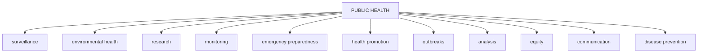

PUBLIC HEALTH BULLETIN-PAKISTAN

Vol. 3 | Week 29 01st Aug 2023

# Integrated Disease Surveillance & Response (IDSR) Report

Center of Disease Control
National Institute of Health, Islamabad

**PAKISTAN**

National Institute of Health logo

Government of Pakistan logo

http://www.phb.nih.org.pk/

Integrated Disease Surveillance & Response (IDSR) Weekly Public Health Bulletin is your go-to resource for disease trends, outbreak alerts, and crucial public health information. By reading and sharing this bulletin, you can help increase awareness and promote preventive measures within your community. Together, let's build a safer, more resilient and healthier future for everyone.

# PROUD TO BE IN PUBLIC HEALTH

# Make a difference with your field work.
# Write for PHB-Pakistan and impact lives!

PUBLIC HEALTH BULLETIN PAKISTAN logo

Submit your achievements and field work
phb@nih.org

National Institute of Health logo

National Institute of Health logo

UK Health Security Agency logo

World Health Organization logo

USAID logo

safetynet logo

---

# Greetings
# Team PHB-Pakistan

Public Health Bulletin Pakistan logo

National Institute of Health Pakistan logo

Government of Pakistan logo

*Overview*

*IDSR Reports*

*Ongoing Events*

*Field Reports*

## Preface

The Weekly Public Health Bulletin-Pakistan provides an overview of the most important public health events that occurred during week 29 of 2023. The most common reported cases were acute diarrhea (non-cholera), followed by malaria, ILI, ALRI in children under 5 years old, bacterial diarrhea, viral hepatitis (B, C, and D), typhoid, SARI, dog bites, and AVH. Mumps and diphtheria cases have increased, mostly in Balochistan. HIV/AIDS cases have been reported from KPK and Sindh. Additionally, 11 suspected cases of CCHF have been reported, 5 from Balochistan and 6 from KPK.

The data presented in this bulletin highlights the importance of continued surveillance and monitoring of public health events. The Ministry of Health and other relevant agencies are working to address the increase in Mumps and Diphtheria cases, as well as the suspected cases of CCHF.

The PHB team would like to express its sincere gratitude to all of the health workers who have contributed to the reporting of these cases. We would also like to remind the public to stay vigilant and to seek medical attention immediately if they experience any symptoms of these diseases.

This week's bulletin also includes an update on PHB activities, surveillance summary of vaccine preventable diseases in Rawalpindi, Punjab, outbreak response immunization activities and a knowledge review on lung cancer

Stay well-informed about public health matters. Subscribe to the Weekly Bulletin today!

Sincerely,
The Chief Editor

NIH logo

UK Health Security Agency logo

World Health Organization logo

USAID logo

safetynet logo

---

# Overview

* During week 29, most frequent reported cases were of Acute Diarrhea (Non-Cholera) followed by Malaria, ILI, ALRI <5 years, B. Diarrhea, VH (B,C,D), Typhoid, SARI, dog bite and AVH (A&E).

* Mumps cases are reported in increased number from all provinces and regions. Further, Diphtheria cases are also increased mostly from Balochistan. Cases need to be verified for timely control measures.

* HIV/AIDS cases are reported from KPK and Sindh. In addition, 11 cases of CCHF reported this week; 05 from Balochistan and 06 from KPK. All are suspected cases and require field investigations.

    * All are suspected cases and need field verification.

## IDSR compliance attributes

* The national compliance rate for IDSR reporting in 125 implemented districts is 74% ICT and Sindh province are the top reporting region with a compliance rate of 80% followed by Khyber Pakhtunkhwa with 77% and AJK 73%

* The lowest compliance rate was observed in Gilgit Baltistan.

<table>
  <thead>
    <tr>
        <th>Region</th>
        <th>Expected Reports</th>
        <th>Received Reports</th>
        <th>Compliance (%)</th>
    </tr>
  </thead>
  <tbody>
    <tr>
        <td>Khyber Pakhtunkhwa</td>
<td>1568</td>
<td>1203</td>
<td>77</td>
    </tr>
<tr>
        <td>Azad Jammu Kashmir</td>
<td>440</td>
<td>321</td>
<td>73</td>
    </tr>
<tr>
        <td>Islamabad Capital Territory</td>
<td>27</td>
<td>23</td>
<td>85</td>
    </tr>
<tr>
        <td>Balochistan</td>
<td>978</td>
<td>607</td>
<td>62</td>
    </tr>
<tr>
        <td>Gilgit Baltistan</td>
<td>141</td>
<td>43</td>
<td>30</td>
    </tr>
<tr>
        <td>Sindh</td>
<td>1901</td>
<td>1521</td>
<td>80</td>
    </tr>
<tr>
        <td>National</td>
<td>5055</td>
<td>3718</td>
<td>74</td>
    </tr>
  </tbody>
</table>

NIH logo

UK Health Security Agency logo

World Health Organization logo

USAID FROM THE AMERICAN PEOPLE logo

safetynet logo

---

Pakistan

Table 1: Province/Area wise distribution of most frequently reported cases during week 29, Pakistan.

<table>
    <thead>
    <tr>
        <th>Diseases</th>
        <th>AJK</th>
        <th>Balochistan</th>
        <th>GB</th>
        <th>ICT</th>
        <th>KP</th>
        <th>Punjab</th>
        <th>Sindh</th>
        <th>Total</th>
    </tr>
    </thead>
    <tr>
        <td>ILI</td>
<td>2300</td>
<td>2,960</td>
<td>43</td>
<td>215</td>
<td>4,017</td>
<td>356</td>
<td>13,642</td>
<td>23,533</td>
    </tr>
<tr>
        <td>AD (Non-Cholera)</td>
<td>2,646</td>
<td>6,581</td>
<td>189</td>
<td>83</td>
<td>28,564</td>
<td>91,687</td>
<td>44,827</td>
<td>174,577</td>
    </tr>
<tr>
        <td>Malaria</td>
<td>90</td>
<td>7,233</td>
<td>0</td>
<td>0</td>
<td>5,648</td>
<td>5,350</td>
<td>57,426</td>
<td>75,747</td>
    </tr>
<tr>
        <td>B. Diarrhea</td>
<td>125</td>
<td>1907</td>
<td>11</td>
<td>0</td>
<td>1061</td>
<td>3,277</td>
<td>3039</td>
<td>9,420</td>
    </tr>
<tr>
        <td>Typhoid</td>
<td>118</td>
<td>1186</td>
<td>9</td>
<td>1</td>
<td>849</td>
<td>4,676</td>
<td>1,291</td>
<td>8,130</td>
    </tr>
<tr>
        <td>SARI</td>
<td>356</td>
<td>849</td>
<td>74</td>
<td>0</td>
<td>1,443</td>
<td>NR</td>
<td>367</td>
<td>3,089</td>
    </tr>
<tr>
        <td>ALRI &lt; 5 years</td>
<td>770</td>
<td>2127</td>
<td>54</td>
<td>0</td>
<td>1132</td>
<td>NR</td>
<td>6,935</td>
<td>11,018</td>
    </tr>
<tr>
        <td>CL</td>
<td>0</td>
<td>144</td>
<td>0</td>
<td>0</td>
<td>281</td>
<td>8</td>
<td>0</td>
<td>433</td>
    </tr>
<tr>
        <td>AWD (S. Cholera)</td>
<td>65</td>
<td>255</td>
<td>31</td>
<td>0</td>
<td>142</td>
<td>NR</td>
<td>34</td>
<td>527</td>
    </tr>
<tr>
        <td>Measles</td>
<td>17</td>
<td>23</td>
<td>2</td>
<td>0</td>
<td>181</td>
<td>161</td>
<td>41</td>
<td>425</td>
    </tr>
<tr>
        <td>Dog Bite</td>
<td>69</td>
<td>52</td>
<td>0</td>
<td>0</td>
<td>218</td>
<td>NR</td>
<td>480</td>
<td>819</td>
    </tr>
<tr>
        <td>Dengue</td>
<td>2</td>
<td>1</td>
<td>0</td>
<td>0</td>
<td>1</td>
<td>508</td>
<td>95</td>
<td>607</td>
    </tr>
<tr>
        <td>VH (B, C & D)</td>
<td>22</td>
<td>183</td>
<td>0</td>
<td>0</td>
<td>97</td>
<td>NR</td>
<td>3799</td>
<td>4,101</td>
    </tr>
<tr>
        <td>Gonorrhea</td>
<td>5</td>
<td>114</td>
<td>0</td>
<td>0</td>
<td>5</td>
<td>NR</td>
<td>38</td>
<td>162</td>
    </tr>
<tr>
        <td>Pertussis</td>
<td>15</td>
<td>85</td>
<td>1</td>
<td>0</td>
<td>0</td>
<td>21</td>
<td>50</td>
<td>172</td>
    </tr>
<tr>
        <td>VL</td>
<td>0</td>
<td>3</td>
<td>0</td>
<td>0</td>
<td>6</td>
<td>NR</td>
<td>3</td>
<td>12</td>
    </tr>
<tr>
        <td>NT</td>
<td>0</td>
<td>3</td>
<td>0</td>
<td>0</td>
<td>11</td>
<td>NR</td>
<td>1</td>
<td>15</td>
    </tr>
<tr>
        <td>Mumps</td>
<td>102</td>
<td>111</td>
<td>7</td>
<td>0</td>
<td>113</td>
<td>NR</td>
<td>334</td>
<td>667</td>
    </tr>
<tr>
        <td>AFP</td>
<td>4</td>
<td>0</td>
<td>0</td>
<td>0</td>
<td>19</td>
<td>32</td>
<td>15</td>
<td>70</td>
    </tr>
<tr>
        <td>Chickenpox/ Varicella</td>
<td>35</td>
<td>23</td>
<td>11</td>
<td>1</td>
<td>138</td>
<td>110</td>
<td>29</td>
<td>347</td>
    </tr>
<tr>
        <td>AVH (A & E)</td>
<td>28</td>
<td>29</td>
<td>0</td>
<td>0</td>
<td>283</td>
<td>NR</td>
<td>341</td>
<td>681</td>
    </tr>
<tr>
        <td>Meningitis</td>
<td>1</td>
<td>11</td>
<td>0</td>
<td>0</td>
<td>1</td>
<td>52</td>
<td>11</td>
<td>76</td>
    </tr>
<tr>
        <td>Syphilis</td>
<td>0</td>
<td>60</td>
<td>0</td>
<td>0</td>
<td>1</td>
<td>NR</td>
<td>8</td>
<td>69</td>
    </tr>
<tr>
        <td>Leprosy</td>
<td>0</td>
<td>17</td>
<td>1</td>
<td>0</td>
<td>72</td>
<td>NR</td>
<td>0</td>
<td>90</td>
    </tr>
<tr>
        <td>Diphtheria (Probable)</td>
<td>2</td>
<td>56</td>
<td>1</td>
<td>0</td>
<td>1</td>
<td>NR</td>
<td>0</td>
<td>60</td>
    </tr>
<tr>
        <td>Chikungunya</td>
<td>0</td>
<td>0</td>
<td>0</td>
<td>0</td>
<td>0</td>
<td>NR</td>
<td>0</td>
<td>0</td>
    </tr>
<tr>
        <td>Anthrax</td>
<td>0</td>
<td>0</td>
<td>0</td>
<td>0</td>
<td>0</td>
<td>NR</td>
<td>0</td>
<td>0</td>
    </tr>
<tr>
        <td>Brucellosis</td>
<td>0</td>
<td>7</td>
<td>0</td>
<td>0</td>
<td>15</td>
<td>NR</td>
<td>0</td>
<td>22</td>
    </tr>
<tr>
        <td>CCHF</td>
<td>0</td>
<td>5</td>
<td>0</td>
<td>0</td>
<td>6</td>
<td>NR</td>
<td>0</td>
<td>11</td>
    </tr>
<tr>
        <td>Rubella (CRS)</td>
<td>0</td>
<td>0</td>
<td>0</td>
<td>0</td>
<td>0</td>
<td>NR</td>
<td>0</td>
<td>0</td>
    </tr>
<tr>
        <td>HIV/AIDS</td>
<td>0</td>
<td>1</td>
<td>0</td>
<td>0</td>
<td>9</td>
<td>NR</td>
<td>12</td>
<td>22</td>
    </tr>
</table>

Figure 1: Most frequently reported suspected cases during week 29, Pakistan

<table>
  <thead>
    <tr>
        <th>Disease</th>
        <th>WK 27</th>
        <th>WK 28</th>
        <th>WK 29</th>
    </tr>
  </thead>
  <tbody>
    <tr>
        <td>AD (Non-Cholera)</td>
<td>85000</td>
<td>185000</td>
<td>174577</td>
    </tr>
<tr>
        <td>Malaria</td>
<td>70000</td>
<td>88000</td>
<td>75747</td>
    </tr>
<tr>
        <td>ILI</td>
<td>15000</td>
<td>25000</td>
<td>23533</td>
    </tr>
<tr>
        <td>ALRI &lt; 5 years</td>
<td>10000</td>
<td>12000</td>
<td>11018</td>
    </tr>
<tr>
        <td>B. Diarrhea</td>
<td>5000</td>
<td>10000</td>
<td>9420</td>
    </tr>
<tr>
        <td>VH (B, C &amp; D)</td>
<td>2000</td>
<td>3000</td>
<td>4101</td>
    </tr>
<tr>
        <td>Typhoid</td>
<td>3000</td>
<td>9000</td>
<td>8130</td>
    </tr>
<tr>
        <td>SARI</td>
<td>2000</td>
<td>5000</td>
<td>3089</td>
    </tr>
<tr>
        <td>Dog Bite</td>
<td>500</td>
<td>1000</td>
<td>819</td>
    </tr>
<tr>
        <td>AVH (A &amp; E)</td>
<td>400</td>
<td>500</td>
<td>681</td>
    </tr>
  </tbody>
</table>

NIH Pakistan logo

UK Health Security Agency logo

World Health Organization logo

USAID logo

safetynet logo

---

# Sindh
* Malaria cases were maximum followed by AD (Non-Cholera), ILI, ALRI<5 Years, VH (B, C, D), B. Diarrhea, Typhoid, dog bite, SARI, and AVH (A&E).

* Malaria cases are reported from Tando Allahyar, Larkana, Kambar and Badin whereas AD cases are mostly from Badin, Khairpur and Shaheed Benazirabad. These are Malaria endemic areas however, awareness about disease and vector control measures need to be implemented to reduce the burden.

* Increased number of VH (B & C) cases reported mostly from Sanghar, Matiari and Hyderabad. Field investigations required to identify the source to control the spread of disease.

Table 2: District wise distribution of most frequently reported suspected cases during week 29, Sindh

<table>
    <thead>
    <tr>
        <th>DISTRICTS</th>
        <th>Malaria</th>
        <th>AD (Non-
Cholera)</th>
        <th>ILI</th>
        <th>ALRI &lt; 5 
years</th>
        <th>B. 
Diarrhea</th>
        <th>Typhoid</th>
        <th>SARI</th>
        <th>Measles</th>
        <th>VH (B, C 
& D)</th>
        <th>Dengue</th>
        <th>Dog Bite</th>
    </tr>
    </thead>
    <tr>
        <td>Badin</td>
<td>5,395</td>
<td>5,152</td>
<td>208</td>
<td>562</td>
<td>296</td>
<td>63</td>
<td>27</td>
<td>7</td>
<td>240</td>
<td>1</td>
<td>48</td>
    </tr>
<tr>
        <td>Dadu</td>
<td>3,805</td>
<td>2,380</td>
<td>60</td>
<td>889</td>
<td>292</td>
<td>94</td>
<td>35</td>
<td>0</td>
<td>2</td>
<td>0</td>
<td>0</td>
    </tr>
<tr>
        <td>Ghotki</td>
<td>697</td>
<td>878</td>
<td>0</td>
<td>152</td>
<td>94</td>
<td>26</td>
<td>0</td>
<td>0</td>
<td>359</td>
<td>0</td>
<td>0</td>
    </tr>
<tr>
        <td>Hyderabad</td>
<td>323</td>
<td>1,778</td>
<td>243</td>
<td>30</td>
<td>3</td>
<td>19</td>
<td>0</td>
<td>2</td>
<td>48</td>
<td>0</td>
<td>0</td>
    </tr>
<tr>
        <td>Jacobabad</td>
<td>1,521</td>
<td>1,351</td>
<td>89</td>
<td>887</td>
<td>133</td>
<td>18</td>
<td>51</td>
<td>0</td>
<td>229</td>
<td>0</td>
<td>44</td>
    </tr>
<tr>
        <td>Jamshoro</td>
<td>117</td>
<td>87</td>
<td>0</td>
<td>0</td>
<td>1</td>
<td>5</td>
<td>0</td>
<td>0</td>
<td>0</td>
<td>0</td>
<td>0</td>
    </tr>
<tr>
        <td>Kamber</td>
<td>4,957</td>
<td>1,424</td>
<td>0</td>
<td>298</td>
<td>204</td>
<td>15</td>
<td>0</td>
<td>0</td>
<td>46</td>
<td>0</td>
<td>0</td>
    </tr>
<tr>
        <td>Karachi Central</td>
<td>96</td>
<td>1,187</td>
<td>1,495</td>
<td>41</td>
<td>61</td>
<td>164</td>
<td>0</td>
<td>13</td>
<td>154</td>
<td>1</td>
<td>0</td>
    </tr>
<tr>
        <td>Karachi East</td>
<td>53</td>
<td>302</td>
<td>23</td>
<td>2</td>
<td>3</td>
<td>0</td>
<td>0</td>
<td>0</td>
<td>1</td>
<td>17</td>
<td>1</td>
    </tr>
<tr>
        <td>Karachi Keamari</td>
<td>4</td>
<td>476</td>
<td>150</td>
<td>22</td>
<td>3</td>
<td>5</td>
<td>0</td>
<td>0</td>
<td>0</td>
<td>0</td>
<td>0</td>
    </tr>
<tr>
        <td>Karachi Korangi</td>
<td>64</td>
<td>471</td>
<td>21</td>
<td>0</td>
<td>3</td>
<td>4</td>
<td>0</td>
<td>1</td>
<td>0</td>
<td>6</td>
<td>0</td>
    </tr>
<tr>
        <td>Karachi Malir</td>
<td>81</td>
<td>1,491</td>
<td>1,365</td>
<td>304</td>
<td>49</td>
<td>25</td>
<td>57</td>
<td>0</td>
<td>38</td>
<td>3</td>
<td>23</td>
    </tr>
<tr>
        <td>Karachi South</td>
<td>26</td>
<td>146</td>
<td>0</td>
<td>0</td>
<td>0</td>
<td>1</td>
<td>0</td>
<td>0</td>
<td>0</td>
<td>0</td>
<td>0</td>
    </tr>
<tr>
        <td>Karachi West</td>
<td>119</td>
<td>811</td>
<td>511</td>
<td>231</td>
<td>69</td>
<td>45</td>
<td>77</td>
<td>6</td>
<td>24</td>
<td>12</td>
<td>43</td>
    </tr>
<tr>
        <td>Kashmore</td>
<td>1,445</td>
<td>598</td>
<td>272</td>
<td>176</td>
<td>91</td>
<td>19</td>
<td>0</td>
<td>0</td>
<td>28</td>
<td>0</td>
<td>0</td>
    </tr>
<tr>
        <td>Khairpur</td>
<td>3,595</td>
<td>3,127</td>
<td>507</td>
<td>584</td>
<td>307</td>
<td>209</td>
<td>46</td>
<td>0</td>
<td>100</td>
<td>0</td>
<td>31</td>
    </tr>
<tr>
        <td>Larkana</td>
<td>9,632</td>
<td>1,786</td>
<td>0</td>
<td>190</td>
<td>220</td>
<td>4</td>
<td>0</td>
<td>0</td>
<td>84</td>
<td>0</td>
<td>0</td>
    </tr>
<tr>
        <td>Matiari</td>
<td>907</td>
<td>1,783</td>
<td>0</td>
<td>169</td>
<td>79</td>
<td>16</td>
<td>1</td>
<td>0</td>
<td>368</td>
<td>2</td>
<td>24</td>
    </tr>
<tr>
        <td>Mirpurkhas</td>
<td>3,336</td>
<td>2,959</td>
<td>2,563</td>
<td>376</td>
<td>98</td>
<td>27</td>
<td>0</td>
<td>0</td>
<td>29</td>
<td>2</td>
<td>0</td>
    </tr>
<tr>
        <td>Naushero Feroze</td>
<td>1,831</td>
<td>1,919</td>
<td>515</td>
<td>120</td>
<td>53</td>
<td>70</td>
<td>0</td>
<td>0</td>
<td>124</td>
<td>0</td>
<td>0</td>
    </tr>
<tr>
        <td>Sanghar</td>
<td>1,135</td>
<td>2,118</td>
<td>8</td>
<td>71</td>
<td>30</td>
<td>5</td>
<td>5</td>
<td>1</td>
<td>536</td>
<td>0</td>
<td>145</td>
    </tr>
<tr>
        <td>Shaheed 
Benazirabad</td>
<td>1,614</td>
<td>2,179</td>
<td>41</td>
<td>384</td>
<td>97</td>
<td>282</td>
<td>3</td>
<td>0</td>
<td>184</td>
<td>0</td>
<td>0</td>
    </tr>
<tr>
        <td>Shikarpur</td>
<td>1,333</td>
<td>1,226</td>
<td>2</td>
<td>110</td>
<td>148</td>
<td>2</td>
<td>3</td>
<td>0</td>
<td>193</td>
<td>0</td>
<td>1</td>
    </tr>
<tr>
        <td>Sujawal</td>
<td>828</td>
<td>440</td>
<td>0</td>
<td>114</td>
<td>61</td>
<td>6</td>
<td>0</td>
<td>0</td>
<td>2</td>
<td>0</td>
<td>1</td>
    </tr>
<tr>
        <td>Sukkur</td>
<td>2,886</td>
<td>1,735</td>
<td>1,680</td>
<td>320</td>
<td>201</td>
<td>15</td>
<td>0</td>
<td>2</td>
<td>395</td>
<td>1</td>
<td>0</td>
    </tr>
<tr>
        <td>Tando Allahyar</td>
<td>1,506</td>
<td>1,379</td>
<td>487</td>
<td>205</td>
<td>113</td>
<td>34</td>
<td>0</td>
<td>0</td>
<td>184</td>
<td>0</td>
<td>21</td>
    </tr>
<tr>
        <td>Tando Muhammad 
Khan</td>
<td>303</td>
<td>382</td>
<td>0</td>
<td>47</td>
<td>22</td>
<td>0</td>
<td>0</td>
<td>5</td>
<td>20</td>
<td>0</td>
<td>26</td>
    </tr>
<tr>
        <td>Tharparkar</td>
<td>3,301</td>
<td>1,629</td>
<td>1,502</td>
<td>366</td>
<td>133</td>
<td>38</td>
<td>30</td>
<td>4</td>
<td>97</td>
<td>50</td>
<td>8</td>
    </tr>
<tr>
        <td>Thatta</td>
<td>2,406</td>
<td>1,584</td>
<td>1,900</td>
<td>44</td>
<td>76</td>
<td>25</td>
<td>29</td>
<td>0</td>
<td>158</td>
<td>0</td>
<td>64</td>
    </tr>
<tr>
        <td>Umerkot</td>
<td>4,110</td>
<td>2,049</td>
<td>0</td>
<td>241</td>
<td>99</td>
<td>55</td>
<td>3</td>
<td>0</td>
<td>156</td>
<td>0</td>
<td>0</td>
    </tr>
<tr>
        <td>Total</td>
<td>57,426</td>
<td>44,827</td>
<td>13,642</td>
<td>6,935</td>
<td>3,039</td>
<td>1,291</td>
<td>367</td>
<td>41</td>
<td>3,799</td>
<td>95</td>
<td>480</td>
    </tr>
</table>

Figure 2: Most frequently reported suspected cases during week 29, Sindh

<table>
  <thead>
    <tr>
        <th>Disease</th>
        <th>WK 27</th>
        <th>WK 28</th>
        <th>WK 29</th>
    </tr>
  </thead>
  <tbody>
    <tr>
        <td>Malaria</td>
<td>58000</td>
<td>69000</td>
<td>57426</td>
    </tr>
<tr>
        <td>AD (Non-Cholera)</td>
<td>46000</td>
<td>50000</td>
<td>44827</td>
    </tr>
<tr>
        <td>ILI</td>
<td>13000</td>
<td>14500</td>
<td>13642</td>
    </tr>
<tr>
        <td>ALRI &lt; 5 years</td>
<td>7500</td>
<td>8000</td>
<td>6935</td>
    </tr>
<tr>
        <td>VH (B, C &amp; D)</td>
<td>3500</td>
<td>4000</td>
<td>3799</td>
    </tr>
<tr>
        <td>B. Diarrhea</td>
<td>2800</td>
<td>3200</td>
<td>3039</td>
    </tr>
<tr>
        <td>Typhoid</td>
<td>1100</td>
<td>1300</td>
<td>1291</td>
    </tr>
<tr>
        <td>Dog Bite</td>
<td>450</td>
<td>500</td>
<td>480</td>
    </tr>
<tr>
        <td>SARI</td>
<td>350</td>
<td>400</td>
<td>367</td>
    </tr>
<tr>
        <td>AVH (A &amp; E)</td>
<td>300</td>
<td>350</td>
<td>341</td>
    </tr>
  </tbody>
</table>

NIH logo

UK Health Security Agency logo

World Health Organization logo

USAID logo

safetynet logo

---

# Balochistan

* Malaria, AD (Non-Cholera), ILI, ALRI <5 years, B. Diarrhea, Typhoid, SARI, AWD (S. Cholera), VH (A&E) and CL were the most frequently reported diseases.

* There is a decline trend observed for ILI, AD and Malaria cases this week.

* Increased number of CL cases reported mostly from Pishin and Sherani . Cases of AWD (Suspected Cholera) reported Harnai, Jafferabad, Awaran, and Mastung. All are suspected cases and need field investigation to verify the cases.

Table 3: District wise distribution of most frequently reported suspected cases during week 29, Balochistan

<table>
    <thead>
    <tr>
        <th>Districts</th>
        <th>Malaria</th>
        <th>AD (Non-
Cholera)</th>
        <th>ILI</th>
        <th>B. 
Diarrhea</th>
        <th>ALRI &lt; 5 
Years</th>
        <th>Typhoid</th>
        <th>SARI</th>
        <th>CL</th>
        <th>Dog Bite</th>
        <th>AWD (S. 
Cholera)</th>
    </tr>
    </thead>
    <tr>
        <td>Awaran</td>
<td>365</td>
<td>68</td>
<td>28</td>
<td>39</td>
<td>42</td>
<td>19</td>
<td>8</td>
<td>4</td>
<td>0</td>
<td>27</td>
    </tr>
<tr>
        <td>Chagai</td>
<td>27</td>
<td>213</td>
<td>266</td>
<td>61</td>
<td>0</td>
<td>27</td>
<td>0</td>
<td>0</td>
<td>0</td>
<td>14</td>
    </tr>
<tr>
        <td>Duki</td>
<td>110</td>
<td>108</td>
<td>25</td>
<td>60</td>
<td>7</td>
<td>19</td>
<td>22</td>
<td>2</td>
<td>0</td>
<td>31</td>
    </tr>
<tr>
        <td>Harnai</td>
<td>119</td>
<td>170</td>
<td>12</td>
<td>280</td>
<td>362</td>
<td>12</td>
<td>0</td>
<td>1</td>
<td>2</td>
<td>36</td>
    </tr>
<tr>
        <td>Jaffarabad</td>
<td>1,936</td>
<td>1,149</td>
<td>102</td>
<td>201</td>
<td>147</td>
<td>440</td>
<td>30</td>
<td>13</td>
<td>14</td>
<td>10</td>
    </tr>
<tr>
        <td>Jhal Magsi</td>
<td>674</td>
<td>338</td>
<td>0</td>
<td>20</td>
<td>60</td>
<td>13</td>
<td>1</td>
<td>0</td>
<td>1</td>
<td>8</td>
    </tr>
<tr>
        <td>Kachhi (Bolan)</td>
<td>104</td>
<td>113</td>
<td>45</td>
<td>17</td>
<td>9</td>
<td>41</td>
<td>21</td>
<td>1</td>
<td>0</td>
<td>0</td>
    </tr>
<tr>
        <td>Kalat</td>
<td>13</td>
<td>11</td>
<td>13</td>
<td>6</td>
<td>1</td>
<td>1</td>
<td>0</td>
<td>0</td>
<td>0</td>
<td>0</td>
    </tr>
<tr>
        <td>Kharan</td>
<td>92</td>
<td>118</td>
<td>217</td>
<td>75</td>
<td>2</td>
<td>10</td>
<td>0</td>
<td>0</td>
<td>0</td>
<td>6</td>
    </tr>
<tr>
        <td>Khuzdar</td>
<td>112</td>
<td>166</td>
<td>140</td>
<td>58</td>
<td>7</td>
<td>12</td>
<td>26</td>
<td>8</td>
<td>12</td>
<td>1</td>
    </tr>
<tr>
        <td>Kohlu</td>
<td>151</td>
<td>142</td>
<td>312</td>
<td>108</td>
<td>24</td>
<td>61</td>
<td>56</td>
<td>13</td>
<td>0</td>
<td>31</td>
    </tr>
<tr>
        <td>Lasbella</td>
<td>944</td>
<td>789</td>
<td>79</td>
<td>155</td>
<td>480</td>
<td>22</td>
<td>181</td>
<td>0</td>
<td>10</td>
<td>2</td>
    </tr>
<tr>
        <td>Loralai</td>
<td>96</td>
<td>309</td>
<td>267</td>
<td>75</td>
<td>90</td>
<td>39</td>
<td>115</td>
<td>0</td>
<td>0</td>
<td>6</td>
    </tr>
<tr>
        <td>Mastung</td>
<td>282</td>
<td>740</td>
<td>128</td>
<td>78</td>
<td>63</td>
<td>108</td>
<td>65</td>
<td>17</td>
<td>7</td>
<td>33</td>
    </tr>
<tr>
        <td>Naseerabad</td>
<td>496</td>
<td>176</td>
<td>0</td>
<td>14</td>
<td>9</td>
<td>69</td>
<td>1</td>
<td>0</td>
<td>2</td>
<td>2</td>
    </tr>
<tr>
        <td>Nushki</td>
<td>93</td>
<td>217</td>
<td>0</td>
<td>98</td>
<td>0</td>
<td>0</td>
<td>0</td>
<td>0</td>
<td>0</td>
<td>20</td>
    </tr>
<tr>
        <td>Panjgur</td>
<td>359</td>
<td>339</td>
<td>82</td>
<td>117</td>
<td>257</td>
<td>61</td>
<td>46</td>
<td>2</td>
<td>0</td>
<td>21</td>
    </tr>
<tr>
        <td>Pishin</td>
<td>21</td>
<td>139</td>
<td>118</td>
<td>95</td>
<td>20</td>
<td>16</td>
<td>0</td>
<td>28</td>
<td>3</td>
<td>0</td>
    </tr>
<tr>
        <td>Quetta</td>
<td>47</td>
<td>473</td>
<td>841</td>
<td>144</td>
<td>33</td>
<td>54</td>
<td>60</td>
<td>20</td>
<td>0</td>
<td>0</td>
    </tr>
<tr>
        <td>Sherani</td>
<td>14</td>
<td>11</td>
<td>38</td>
<td>16</td>
<td>2</td>
<td>11</td>
<td>2</td>
<td>23</td>
<td>0</td>
<td>0</td>
    </tr>
<tr>
        <td>Sibi</td>
<td>111</td>
<td>42</td>
<td>22</td>
<td>11</td>
<td>12</td>
<td>13</td>
<td>18</td>
<td>2</td>
<td>1</td>
<td>2</td>
    </tr>
<tr>
        <td>Sohbat pur</td>
<td>813</td>
<td>471</td>
<td>0</td>
<td>88</td>
<td>170</td>
<td>59</td>
<td>152</td>
<td>10</td>
<td>0</td>
<td>0</td>
    </tr>
<tr>
        <td>SURAB</td>
<td>10</td>
<td>6</td>
<td>0</td>
<td>0</td>
<td>0</td>
<td>1</td>
<td>0</td>
<td>0</td>
<td>0</td>
<td>0</td>
    </tr>
<tr>
        <td>Washuk</td>
<td>112</td>
<td>40</td>
<td>75</td>
<td>22</td>
<td>1</td>
<td>3</td>
<td>0</td>
<td>0</td>
<td>0</td>
<td>3</td>
    </tr>
<tr>
        <td>Zhob</td>
<td>132</td>
<td>233</td>
<td>150</td>
<td>69</td>
<td>329</td>
<td>75</td>
<td>45</td>
<td>0</td>
<td>0</td>
<td>2</td>
    </tr>
<tr>
        <td>Total</td>
<td>7,233</td>
<td>6,581</td>
<td>2,960</td>
<td>1,907</td>
<td>2,127</td>
<td>1,186</td>
<td>849</td>
<td>144</td>
<td>52</td>
<td>255</td>
    </tr>
</table>

Figure 3: Most frequently reported suspected cases during week 29, Balochistan

<table>
  <thead>
    <tr>
        <th>Disease</th>
        <th>WK 27</th>
        <th>WK 28</th>
        <th>WK 29</th>
    </tr>
  </thead>
  <tbody>
    <tr>
        <td>Malaria</td>
<td>8100</td>
<td>8200</td>
<td>7,233</td>
    </tr>
<tr>
        <td>AD (Non-Cholera)</td>
<td>7000</td>
<td>7200</td>
<td>6,581</td>
    </tr>
<tr>
        <td>ILI</td>
<td>3100</td>
<td>3800</td>
<td>2,960</td>
    </tr>
<tr>
        <td>ALRI &lt; 5 years</td>
<td>1800</td>
<td>2500</td>
<td>2,127</td>
    </tr>
<tr>
        <td>B. Diarrhea</td>
<td>1900</td>
<td>2100</td>
<td>1,907</td>
    </tr>
<tr>
        <td>Typhoid</td>
<td>1100</td>
<td>1100</td>
<td>1,186</td>
    </tr>
<tr>
        <td>SARI</td>
<td>900</td>
<td>1100</td>
<td>849</td>
    </tr>
<tr>
        <td>AWD (S. Cholera)</td>
<td>400</td>
<td>500</td>
<td>255</td>
    </tr>
<tr>
        <td>VH (B, C &amp; D)</td>
<td>100</td>
<td>200</td>
<td>183</td>
    </tr>
<tr>
        <td>CL</td>
<td>100</td>
<td>100</td>
<td>144</td>
    </tr>
  </tbody>
</table>

NIH Pakistan logo

UK Health Security Agency logo

World Health Organization logo

USAID logo

safetynet logo

---

# Khyber Pakhtunkhwa

* Cases of AD (Non-Cholera) were maximum followed by Malaria, ILI, SARI, ALRI<5 Years, B. Diarrhea, Typhoid, CL, AVH (A&E) and Measles cases.

* Malaria cases showed a sharp rise this week.

* Ninety-three Typhoid cases and 110 cases of VH (A&E) were reported from Dir Lower. These are suspected cases and a field investigation is required to verify cases.

Table 4: District wise distribution of most frequently reported suspected cases during week 29, KP

<table>
    <thead>
    <tr>
        <th>Diseases</th>
        <th>AD (Non-
Cholera)</th>
        <th>Malaria</th>
        <th>ILI</th>
        <th>SARI</th>
        <th>ALRI &lt; 5 
years</th>
        <th>B. Diarrhea</th>
        <th>Typhoid</th>
        <th>Dog Bite</th>
        <th>AWD (S. 
Cholera)</th>
        <th>AVH (A & 
E)</th>
    </tr>
    </thead>
    <tr>
        <td>Abbottabad</td>
<td>831</td>
<td>2</td>
<td>8</td>
<td>7</td>
<td>6</td>
<td>2</td>
<td>13</td>
<td>2</td>
<td>0</td>
<td>0</td>
    </tr>
<tr>
        <td>Bajaur</td>
<td>0</td>
<td>2</td>
<td>0</td>
<td>0</td>
<td>0</td>
<td>0</td>
<td>0</td>
<td>0</td>
<td>0</td>
<td>0</td>
    </tr>
<tr>
        <td>Bannu</td>
<td>714</td>
<td>953</td>
<td>97</td>
<td>0</td>
<td>4</td>
<td>2</td>
<td>33</td>
<td>1</td>
<td>0</td>
<td>0</td>
    </tr>
<tr>
        <td>Buner</td>
<td>675</td>
<td>437</td>
<td>0</td>
<td>0</td>
<td>6</td>
<td>29</td>
<td>14</td>
<td>18</td>
<td>0</td>
<td>5</td>
    </tr>
<tr>
        <td>Charsadda</td>
<td>1,245</td>
<td>45</td>
<td>202</td>
<td>21</td>
<td>0</td>
<td>0</td>
<td>0</td>
<td>0</td>
<td>0</td>
<td>0</td>
    </tr>
<tr>
        <td>Chitral Lower</td>
<td>665</td>
<td>7</td>
<td>75</td>
<td>515</td>
<td>7</td>
<td>19</td>
<td>5</td>
<td>6</td>
<td>0</td>
<td>0</td>
    </tr>
<tr>
        <td>Chitral Upper</td>
<td>149</td>
<td>7</td>
<td>2</td>
<td>161</td>
<td>0</td>
<td>0</td>
<td>19</td>
<td>1</td>
<td>0</td>
<td>0</td>
    </tr>
<tr>
        <td>D.I. Khan</td>
<td>1,010</td>
<td>419</td>
<td>19</td>
<td>45</td>
<td>9</td>
<td>6</td>
<td>0</td>
<td>11</td>
<td>0</td>
<td>0</td>
    </tr>
<tr>
        <td>Dir Lower</td>
<td>2,334</td>
<td>707</td>
<td>107</td>
<td>161</td>
<td>176</td>
<td>119</td>
<td>49</td>
<td>24</td>
<td>1</td>
<td>57</td>
    </tr>
<tr>
        <td>Dir Upper</td>
<td>781</td>
<td>10</td>
<td>63</td>
<td>0</td>
<td>25</td>
<td>34</td>
<td>40</td>
<td>0</td>
<td>0</td>
<td>6</td>
    </tr>
<tr>
        <td>Hangu</td>
<td>416</td>
<td>394</td>
<td>468</td>
<td>123</td>
<td>8</td>
<td>24</td>
<td>13</td>
<td>13</td>
<td>0</td>
<td>16</td>
    </tr>
<tr>
        <td>Haripur</td>
<td>1,046</td>
<td>35</td>
<td>24</td>
<td>7</td>
<td>138</td>
<td>0</td>
<td>79</td>
<td>11</td>
<td>0</td>
<td>27</td>
    </tr>
<tr>
        <td>Karak</td>
<td>319</td>
<td>152</td>
<td>91</td>
<td>15</td>
<td>11</td>
<td>2</td>
<td>6</td>
<td>15</td>
<td>3</td>
<td>0</td>
    </tr>
<tr>
        <td>Khyber</td>
<td>10</td>
<td>34</td>
<td>153</td>
<td>1</td>
<td>9</td>
<td>6</td>
<td>5</td>
<td>0</td>
<td>0</td>
<td>0</td>
    </tr>
<tr>
        <td>Kohat</td>
<td>57</td>
<td>28</td>
<td>2</td>
<td>3</td>
<td>0</td>
<td>0</td>
<td>0</td>
<td>6</td>
<td>0</td>
<td>0</td>
    </tr>
<tr>
        <td>Kohistan Lower</td>
<td>209</td>
<td>3</td>
<td>0</td>
<td>125</td>
<td>5</td>
<td>51</td>
<td>0</td>
<td>0</td>
<td>2</td>
<td>0</td>
    </tr>
<tr>
        <td>Kohistan Upper</td>
<td>523</td>
<td>5</td>
<td>54</td>
<td>17</td>
<td>3</td>
<td>41</td>
<td>81</td>
<td>1</td>
<td>0</td>
<td>0</td>
    </tr>
<tr>
        <td>Kolai Palas</td>
<td>86</td>
<td>4</td>
<td>0</td>
<td>23</td>
<td>5</td>
<td>8</td>
<td>0</td>
<td>0</td>
<td>5</td>
<td>0</td>
    </tr>
<tr>
        <td>L & C Kurram</td>
<td>16</td>
<td>9</td>
<td>3</td>
<td>0</td>
<td>0</td>
<td>3</td>
<td>1</td>
<td>0</td>
<td>0</td>
<td>0</td>
    </tr>
<tr>
        <td>Lakki Marwat</td>
<td>665</td>
<td>1,109</td>
<td>0</td>
<td>0</td>
<td>23</td>
<td>5</td>
<td>40</td>
<td>1</td>
<td>0</td>
<td>0</td>
    </tr>
<tr>
        <td>Malakand</td>
<td>1,229</td>
<td>78</td>
<td>36</td>
<td>24</td>
<td>99</td>
<td>102</td>
<td>37</td>
<td>0</td>
<td>105</td>
<td>74</td>
    </tr>
<tr>
        <td>Mansehra</td>
<td>801</td>
<td>4</td>
<td>494</td>
<td>31</td>
<td>64</td>
<td>14</td>
<td>9</td>
<td>0</td>
<td>25</td>
<td>2</td>
    </tr>
<tr>
        <td>Mardan</td>
<td>1,390</td>
<td>110</td>
<td>495</td>
<td>93</td>
<td>248</td>
<td>41</td>
<td>0</td>
<td>68</td>
<td>0</td>
<td>38</td>
    </tr>
<tr>
        <td>Nowshera</td>
<td>2,498</td>
<td>115</td>
<td>40</td>
<td>13</td>
<td>3</td>
<td>42</td>
<td>28</td>
<td>0</td>
<td>0</td>
<td>7</td>
    </tr>
<tr>
        <td>Peshawar</td>
<td>2,965</td>
<td>49</td>
<td>714</td>
<td>33</td>
<td>91</td>
<td>185</td>
<td>91</td>
<td>5</td>
<td>0</td>
<td>14</td>
    </tr>
<tr>
        <td>Shangla</td>
<td>424</td>
<td>364</td>
<td>0</td>
<td>0</td>
<td>5</td>
<td>2</td>
<td>2</td>
<td>9</td>
<td>1</td>
<td>2</td>
    </tr>
<tr>
        <td>Swabi</td>
<td>1,783</td>
<td>45</td>
<td>537</td>
<td>9</td>
<td>79</td>
<td>224</td>
<td>27</td>
<td>0</td>
<td>0</td>
<td>25</td>
    </tr>
<tr>
        <td>Swat</td>
<td>5,291</td>
<td>50</td>
<td>333</td>
<td>0</td>
<td>43</td>
<td>73</td>
<td>198</td>
<td>13</td>
<td>0</td>
<td>10</td>
    </tr>
<tr>
        <td>Tank</td>
<td>322</td>
<td>345</td>
<td>0</td>
<td>0</td>
<td>37</td>
<td>1</td>
<td>88</td>
<td>0</td>
<td>0</td>
<td>0</td>
    </tr>
<tr>
        <td>Tor Ghar</td>
<td>110</td>
<td>126</td>
<td>0</td>
<td>16</td>
<td>28</td>
<td>26</td>
<td>16</td>
<td>13</td>
<td>0</td>
<td>0</td>
    </tr>
<tr>
        <td>Total</td>
<td>28,564</td>
<td>5,648</td>
<td>4,017</td>
<td>1,443</td>
<td>1,132</td>
<td>1,061</td>
<td>894</td>
<td>218</td>
<td>142</td>
<td>283</td>
    </tr>
</table>

Figure 4: Most frequently reported suspected cases during week 29, KP

<table>
  <thead>
    <tr>
        <th>Disease</th>
        <th>WK 27</th>
        <th>WK 28</th>
        <th>WK 29</th>
    </tr>
  </thead>
  <tbody>
    <tr>
        <td>AD (Non-Cholera)</td>
<td>28000</td>
<td>31000</td>
<td>28564</td>
    </tr>
<tr>
        <td>Malaria</td>
<td>3000</td>
<td>6500</td>
<td>5648</td>
    </tr>
<tr>
        <td>ILI</td>
<td>4000</td>
<td>5000</td>
<td>4017</td>
    </tr>
<tr>
        <td>SARI</td>
<td>1000</td>
<td>1200</td>
<td>1443</td>
    </tr>
<tr>
        <td>ALRI &lt; 5 years</td>
<td>800</td>
<td>1000</td>
<td>1132</td>
    </tr>
<tr>
        <td>B. Diarrhea</td>
<td>900</td>
<td>1000</td>
<td>1061</td>
    </tr>
<tr>
        <td>Typhoid</td>
<td>700</td>
<td>800</td>
<td>894</td>
    </tr>
<tr>
        <td>AVH (A &amp; E)</td>
<td>200</td>
<td>250</td>
<td>283</td>
    </tr>
<tr>
        <td>CL</td>
<td>200</td>
<td>250</td>
<td>281</td>
    </tr>
<tr>
        <td>Dog Bite</td>
<td>150</td>
<td>200</td>
<td>218</td>
    </tr>
  </tbody>
</table>

NIH logo

UK Health Security Agency logo

World Health Organization logo

USAID logo

safetynet logo

---

# ICT, AJK & GB

**ICT**: The most frequently reported cases from Islamabad were ILI followed by AD (Non-Cholera). ILI cases showed an upward trend in cases this week.
**AJK**: AD (Non-Cholera) cases were maximum followed by ILI, ALRI <5 years, SARI, Malaria, Mumps. Diarrhea, Typhoid, AWD (S. Cholera), and dog bite. Both ILI and ALRI <5 years cases showed an upward trend in cases this week.
**GB**: AD (Non. Cholera) cases were maximum followed by ALRI<5 years, ILI and SARI.

Figure 5:
Figure 6: Week wise reported suspected cases of ILI, ICT

<table>
  <thead>
    <tr>
        <th>Category</th>
        <th>WK27</th>
        <th>WK28</th>
        <th>WK29</th>
    </tr>
  </thead>
  <tbody>
    <tr>
        <td>ILI</td>
<td>630</td>
<td>900</td>
<td>215</td>
    </tr>
<tr>
        <td>AD (Non-Cholera)</td>
<td>430</td>
<td>490</td>
<td>83</td>
    </tr>
  </tbody>
</table>

Figure 6: Week wise reported suspected cases of ILI, ICT

<table>
  <thead>
    <tr>
        <th>Week</th>
        <th>ILI</th>
    </tr>
  </thead>
  <tbody>
    <tr>
        <td>W30</td>
<td>1100</td>
    </tr>
<tr>
        <td>W31</td>
<td>1300</td>
    </tr>
<tr>
        <td>W32</td>
<td>1350</td>
    </tr>
<tr>
        <td>W33</td>
<td>1300</td>
    </tr>
<tr>
        <td>W34</td>
<td>400</td>
    </tr>
<tr>
        <td>W35</td>
<td>1450</td>
    </tr>
<tr>
        <td>W36</td>
<td>150</td>
    </tr>
<tr>
        <td>W37</td>
<td>50</td>
    </tr>
<tr>
        <td>W38</td>
<td>1200</td>
    </tr>
<tr>
        <td>W39</td>
<td>1000</td>
    </tr>
<tr>
        <td>W40</td>
<td>2150</td>
    </tr>
<tr>
        <td>W41</td>
<td>2300</td>
    </tr>
<tr>
        <td>W42</td>
<td>2650</td>
    </tr>
<tr>
        <td>W43</td>
<td>2600</td>
    </tr>
<tr>
        <td>W44</td>
<td>1850</td>
    </tr>
<tr>
        <td>W45</td>
<td>1700</td>
    </tr>
<tr>
        <td>W46</td>
<td>1550</td>
    </tr>
<tr>
        <td>W47</td>
<td>2450</td>
    </tr>
<tr>
        <td>W48</td>
<td>2300</td>
    </tr>
<tr>
        <td>W49</td>
<td>2550</td>
    </tr>
<tr>
        <td>W50</td>
<td>3200</td>
    </tr>
<tr>
        <td>W51</td>
<td>2500</td>
    </tr>
<tr>
        <td>W52</td>
<td>2200</td>
    </tr>
<tr>
        <td>W1</td>
<td>2100</td>
    </tr>
<tr>
        <td>W2</td>
<td>1650</td>
    </tr>
<tr>
        <td>W3</td>
<td>1950</td>
    </tr>
<tr>
        <td>W4</td>
<td>1950</td>
    </tr>
<tr>
        <td>W5</td>
<td>1950</td>
    </tr>
<tr>
        <td>W6</td>
<td>1600</td>
    </tr>
<tr>
        <td>W7</td>
<td>2300</td>
    </tr>
<tr>
        <td>W8</td>
<td>1600</td>
    </tr>
<tr>
        <td>W9</td>
<td>2250</td>
    </tr>
<tr>
        <td>W10</td>
<td>2100</td>
    </tr>
<tr>
        <td>W11</td>
<td>1700</td>
    </tr>
<tr>
        <td>W12</td>
<td>750</td>
    </tr>
<tr>
        <td>W13</td>
<td>1500</td>
    </tr>
<tr>
        <td>W14</td>
<td>1500</td>
    </tr>
<tr>
        <td>W15</td>
<td>1100</td>
    </tr>
<tr>
        <td>W16</td>
<td>650</td>
    </tr>
<tr>
        <td>W17</td>
<td>1150</td>
    </tr>
<tr>
        <td>W18</td>
<td>950</td>
    </tr>
<tr>
        <td>W19</td>
<td>1500</td>
    </tr>
<tr>
        <td>W20</td>
<td>750</td>
    </tr>
<tr>
        <td>W21</td>
<td>1150</td>
    </tr>
<tr>
        <td>W22</td>
<td>1150</td>
    </tr>
<tr>
        <td>W23</td>
<td>700</td>
    </tr>
<tr>
        <td>W24</td>
<td>1050</td>
    </tr>
<tr>
        <td>W25</td>
<td>850</td>
    </tr>
<tr>
        <td>W26</td>
<td>150</td>
    </tr>
<tr>
        <td>W27</td>
<td>700</td>
    </tr>
<tr>
        <td>W28</td>
<td>900</td>
    </tr>
<tr>
        <td>W29</td>
<td>215</td>
    </tr>
  </tbody>
</table>

Figure 7: Most frequently reported suspected cases during week 29, AJK

<table>
  <thead>
    <tr>
        <th>Disease</th>
        <th>WK 27</th>
        <th>WK 28</th>
        <th>WK 29</th>
    </tr>
  </thead>
  <tbody>
    <tr>
        <td>AD (Non-Cholera)</td>
<td>2550</td>
<td>2700</td>
<td>2646</td>
    </tr>
<tr>
        <td>ILI</td>
<td>2050</td>
<td>2350</td>
<td>2300</td>
    </tr>
<tr>
        <td>ALRI &lt; 5 years</td>
<td>720</td>
<td>720</td>
<td>770</td>
    </tr>
<tr>
        <td>SARI</td>
<td>320</td>
<td>380</td>
<td>356</td>
    </tr>
<tr>
        <td>B. Diarrhea</td>
<td>100</td>
<td>110</td>
<td>125</td>
    </tr>
<tr>
        <td>Typhoid</td>
<td>100</td>
<td>110</td>
<td>118</td>
    </tr>
<tr>
        <td>Mumps</td>
<td>90</td>
<td>100</td>
<td>102</td>
    </tr>
<tr>
        <td>Malaria</td>
<td>80</td>
<td>90</td>
<td>90</td>
    </tr>
<tr>
        <td>Dog Bite</td>
<td>60</td>
<td>70</td>
<td>69</td>
    </tr>
<tr>
        <td>AWD (S. Cholera)</td>
<td>50</td>
<td>60</td>
<td>65</td>
    </tr>
  </tbody>
</table>

NIH Pakistan logo

UK Health Security Agency logo

World Health Organization logo

USAID logo

safetynet logo

---

Figure 8: Week wise reported suspected cases of AD (Non-Cholera) and ALRI <5 years, AJK

<table>
  <thead>
    <tr>
        <th>Week</th>
        <th>Quarter</th>
        <th>AD (Non-Cholera)</th>
        <th>ILI</th>
    </tr>
  </thead>
  <tbody>
    <tr>
        <td>W30</td>
<td>3rd Quarter 2022</td>
<td>150</td>
<td>50</td>
    </tr>
<tr>
        <td>W31</td>
<td>3rd Quarter 2022</td>
<td>140</td>
<td>40</td>
    </tr>
<tr>
        <td>W32</td>
<td>3rd Quarter 2022</td>
<td>130</td>
<td>30</td>
    </tr>
<tr>
        <td>W33</td>
<td>3rd Quarter 2022</td>
<td>120</td>
<td>20</td>
    </tr>
<tr>
        <td>W34</td>
<td>3rd Quarter 2022</td>
<td>110</td>
<td>10</td>
    </tr>
<tr>
        <td>W35</td>
<td>3rd Quarter 2022</td>
<td>100</td>
<td>10</td>
    </tr>
<tr>
        <td>W36</td>
<td>3rd Quarter 2022</td>
<td>100</td>
<td>10</td>
    </tr>
<tr>
        <td>W37</td>
<td>3rd Quarter 2022</td>
<td>100</td>
<td>10</td>
    </tr>
<tr>
        <td>W38</td>
<td>3rd Quarter 2022</td>
<td>100</td>
<td>10</td>
    </tr>
<tr>
        <td>W39</td>
<td>3rd Quarter 2022</td>
<td>150</td>
<td>150</td>
    </tr>
<tr>
        <td>W40</td>
<td>4th Quarter 2022</td>
<td>250</td>
<td>250</td>
    </tr>
<tr>
        <td>W41</td>
<td>4th Quarter 2022</td>
<td>450</td>
<td>700</td>
    </tr>
<tr>
        <td>W42</td>
<td>4th Quarter 2022</td>
<td>400</td>
<td>800</td>
    </tr>
<tr>
        <td>W43</td>
<td>4th Quarter 2022</td>
<td>450</td>
<td>800</td>
    </tr>
<tr>
        <td>W44</td>
<td>4th Quarter 2022</td>
<td>450</td>
<td>1000</td>
    </tr>
<tr>
        <td>W45</td>
<td>4th Quarter 2022</td>
<td>450</td>
<td>1000</td>
    </tr>
<tr>
        <td>W46</td>
<td>4th Quarter 2022</td>
<td>250</td>
<td>1100</td>
    </tr>
<tr>
        <td>W47</td>
<td>4th Quarter 2022</td>
<td>450</td>
<td>1700</td>
    </tr>
<tr>
        <td>W48</td>
<td>4th Quarter 2022</td>
<td>300</td>
<td>1400</td>
    </tr>
<tr>
        <td>W49</td>
<td>4th Quarter 2022</td>
<td>300</td>
<td>1200</td>
    </tr>
<tr>
        <td>W50</td>
<td>4th Quarter 2022</td>
<td>400</td>
<td>1600</td>
    </tr>
<tr>
        <td>W51</td>
<td>4th Quarter 2022</td>
<td>550</td>
<td>2600</td>
    </tr>
<tr>
        <td>W52</td>
<td>4th Quarter 2022</td>
<td>600</td>
<td>2200</td>
    </tr>
<tr>
        <td>W1</td>
<td>1st Quarter 2023</td>
<td>750</td>
<td>2200</td>
    </tr>
<tr>
        <td>W2</td>
<td>1st Quarter 2023</td>
<td>800</td>
<td>2000</td>
    </tr>
<tr>
        <td>W3</td>
<td>1st Quarter 2023</td>
<td>600</td>
<td>1700</td>
    </tr>
<tr>
        <td>W4</td>
<td>1st Quarter 2023</td>
<td>650</td>
<td>1650</td>
    </tr>
<tr>
        <td>W5</td>
<td>1st Quarter 2023</td>
<td>750</td>
<td>1750</td>
    </tr>
<tr>
        <td>W6</td>
<td>1st Quarter 2023</td>
<td>900</td>
<td>1850</td>
    </tr>
<tr>
        <td>W7</td>
<td>1st Quarter 2023</td>
<td>1000</td>
<td>2400</td>
    </tr>
<tr>
        <td>W8</td>
<td>1st Quarter 2023</td>
<td>1050</td>
<td>2050</td>
    </tr>
<tr>
        <td>W9</td>
<td>1st Quarter 2023</td>
<td>1100</td>
<td>1850</td>
    </tr>
<tr>
        <td>W10</td>
<td>1st Quarter 2023</td>
<td>1200</td>
<td>2250</td>
    </tr>
<tr>
        <td>W11</td>
<td>1st Quarter 2023</td>
<td>1200</td>
<td>2200</td>
    </tr>
<tr>
        <td>W12</td>
<td>1st Quarter 2023</td>
<td>1000</td>
<td>2050</td>
    </tr>
<tr>
        <td>W13</td>
<td>1st Quarter 2023</td>
<td>1250</td>
<td>2350</td>
    </tr>
<tr>
        <td>W14</td>
<td>1st Quarter 2023</td>
<td>1350</td>
<td>2300</td>
    </tr>
<tr>
        <td>W15</td>
<td>1st Quarter 2023</td>
<td>1250</td>
<td>2200</td>
    </tr>
<tr>
        <td>W16</td>
<td>1st Quarter 2023</td>
<td>950</td>
<td>1450</td>
    </tr>
<tr>
        <td>W17</td>
<td>2nd Quarter 2023</td>
<td>1500</td>
<td>1800</td>
    </tr>
<tr>
        <td>W18</td>
<td>2nd Quarter 2023</td>
<td>1700</td>
<td>2100</td>
    </tr>
<tr>
        <td>W19</td>
<td>2nd Quarter 2023</td>
<td>2000</td>
<td>2750</td>
    </tr>
<tr>
        <td>W20</td>
<td>2nd Quarter 2023</td>
<td>2300</td>
<td>2450</td>
    </tr>
<tr>
        <td>W21</td>
<td>2nd Quarter 2023</td>
<td>2200</td>
<td>2550</td>
    </tr>
<tr>
        <td>W22</td>
<td>2nd Quarter 2023</td>
<td>2150</td>
<td>2600</td>
    </tr>
<tr>
        <td>W23</td>
<td>2nd Quarter 2023</td>
<td>2250</td>
<td>2600</td>
    </tr>
<tr>
        <td>W24</td>
<td>2nd Quarter 2023</td>
<td>2350</td>
<td>2750</td>
    </tr>
<tr>
        <td>W25</td>
<td>2nd Quarter 2023</td>
<td>2350</td>
<td>2400</td>
    </tr>
<tr>
        <td>W26</td>
<td>2nd Quarter 2023</td>
<td>1500</td>
<td>1100</td>
    </tr>
<tr>
        <td>W27</td>
<td>3rd Quarter 2023</td>
<td>2500</td>
<td>2000</td>
    </tr>
<tr>
        <td>W28</td>
<td>3rd Quarter 2023</td>
<td>2700</td>
<td>2350</td>
    </tr>
<tr>
        <td>W29</td>
<td>3rd Quarter 2023</td>
<td>2650</td>
<td>2300</td>
    </tr>
  </tbody>
</table>

Figure 9: Most frequent cases reported during WK 29, GB

<table>
  <thead>
    <tr>
        <th>Disease</th>
        <th>WK 27</th>
        <th>WK 28</th>
        <th>WK 29</th>
    </tr>
  </thead>
  <tbody>
    <tr>
        <td>AD (Non-Cholera)</td>
<td>145</td>
<td>138</td>
<td>189</td>
    </tr>
<tr>
        <td>SARI</td>
<td>63</td>
<td>78</td>
<td>74</td>
    </tr>
<tr>
        <td>ALRI &lt; 5 years</td>
<td>79</td>
<td>66</td>
<td>54</td>
    </tr>
<tr>
        <td>ILI</td>
<td>18</td>
<td>46</td>
<td>43</td>
    </tr>
<tr>
        <td>AWD (S. Cholera)</td>
<td>97</td>
<td>22</td>
<td>31</td>
    </tr>
<tr>
        <td>B. Diarrhea</td>
<td>18</td>
<td>10</td>
<td>11</td>
    </tr>
<tr>
        <td>Chickenpox/Varicella</td>
<td>3</td>
<td>2</td>
<td>11</td>
    </tr>
<tr>
        <td>Typhoid</td>
<td>16</td>
<td>23</td>
<td>9</td>
    </tr>
<tr>
        <td>Mumps</td>
<td>5</td>
<td>1</td>
<td>7</td>
    </tr>
  </tbody>
</table>

Figure 10: Week wise reported suspected cases of ALRI < 5 years, GB

<table>
  <thead>
    <tr>
        <th>Week</th>
        <th>Quarter</th>
        <th>AD (Non-Cholera)</th>
    </tr>
  </thead>
  <tbody>
    <tr>
        <td>W30</td>
<td>3rd Quarter 2022</td>
<td>45</td>
    </tr>
<tr>
        <td>W31</td>
<td>3rd Quarter 2022</td>
<td>35</td>
    </tr>
<tr>
        <td>W32</td>
<td>3rd Quarter 2022</td>
<td>30</td>
    </tr>
<tr>
        <td>W33</td>
<td>3rd Quarter 2022</td>
<td>20</td>
    </tr>
<tr>
        <td>W34</td>
<td>3rd Quarter 2022</td>
<td>15</td>
    </tr>
<tr>
        <td>W35</td>
<td>3rd Quarter 2022</td>
<td>18</td>
    </tr>
<tr>
        <td>W36</td>
<td>3rd Quarter 2022</td>
<td>15</td>
    </tr>
<tr>
        <td>W37</td>
<td>3rd Quarter 2022</td>
<td>20</td>
    </tr>
<tr>
        <td>W38</td>
<td>3rd Quarter 2022</td>
<td>22</td>
    </tr>
<tr>
        <td>W39</td>
<td>3rd Quarter 2022</td>
<td>10</td>
    </tr>
<tr>
        <td>W40</td>
<td>4th Quarter 2022</td>
<td>20</td>
    </tr>
<tr>
        <td>W41</td>
<td>4th Quarter 2022</td>
<td>0</td>
    </tr>
<tr>
        <td>W42</td>
<td>4th Quarter 2022</td>
<td>5</td>
    </tr>
<tr>
        <td>W43</td>
<td>4th Quarter 2022</td>
<td>15</td>
    </tr>
<tr>
        <td>W44</td>
<td>4th Quarter 2022</td>
<td>45</td>
    </tr>
<tr>
        <td>W45</td>
<td>4th Quarter 2022</td>
<td>0</td>
    </tr>
<tr>
        <td>W46</td>
<td>4th Quarter 2022</td>
<td>0</td>
    </tr>
<tr>
        <td>W47</td>
<td>4th Quarter 2022</td>
<td>0</td>
    </tr>
<tr>
        <td>W48</td>
<td>4th Quarter 2022</td>
<td>5</td>
    </tr>
<tr>
        <td>W49</td>
<td>4th Quarter 2022</td>
<td>18</td>
    </tr>
<tr>
        <td>W50</td>
<td>4th Quarter 2022</td>
<td>5</td>
    </tr>
<tr>
        <td>W51</td>
<td>4th Quarter 2022</td>
<td>0</td>
    </tr>
<tr>
        <td>W52</td>
<td>4th Quarter 2022</td>
<td>0</td>
    </tr>
<tr>
        <td>W1</td>
<td>1st Quarter 2023</td>
<td>0</td>
    </tr>
<tr>
        <td>W2</td>
<td>1st Quarter 2023</td>
<td>15</td>
    </tr>
<tr>
        <td>W3</td>
<td>1st Quarter 2023</td>
<td>10</td>
    </tr>
<tr>
        <td>W4</td>
<td>1st Quarter 2023</td>
<td>5</td>
    </tr>
<tr>
        <td>W5</td>
<td>1st Quarter 2023</td>
<td>0</td>
    </tr>
<tr>
        <td>W6</td>
<td>1st Quarter 2023</td>
<td>0</td>
    </tr>
<tr>
        <td>W7</td>
<td>1st Quarter 2023</td>
<td>5</td>
    </tr>
<tr>
        <td>W8</td>
<td>1st Quarter 2023</td>
<td>10</td>
    </tr>
<tr>
        <td>W9</td>
<td>1st Quarter 2023</td>
<td>10</td>
    </tr>
<tr>
        <td>W10</td>
<td>1st Quarter 2023</td>
<td>5</td>
    </tr>
<tr>
        <td>W11</td>
<td>1st Quarter 2023</td>
<td>5</td>
    </tr>
<tr>
        <td>W12</td>
<td>1st Quarter 2023</td>
<td>12</td>
    </tr>
<tr>
        <td>W13</td>
<td>1st Quarter 2023</td>
<td>12</td>
    </tr>
<tr>
        <td>W14</td>
<td>1st Quarter 2023</td>
<td>35</td>
    </tr>
<tr>
        <td>W15</td>
<td>1st Quarter 2023</td>
<td>10</td>
    </tr>
<tr>
        <td>W16</td>
<td>1st Quarter 2023</td>
<td>15</td>
    </tr>
<tr>
        <td>W17</td>
<td>2nd Quarter 2023</td>
<td>28</td>
    </tr>
<tr>
        <td>W18</td>
<td>2nd Quarter 2023</td>
<td>25</td>
    </tr>
<tr>
        <td>W19</td>
<td>2nd Quarter 2023</td>
<td>22</td>
    </tr>
<tr>
        <td>W20</td>
<td>2nd Quarter 2023</td>
<td>33</td>
    </tr>
<tr>
        <td>W21</td>
<td>2nd Quarter 2023</td>
<td>33</td>
    </tr>
<tr>
        <td>W22</td>
<td>2nd Quarter 2023</td>
<td>42</td>
    </tr>
<tr>
        <td>W23</td>
<td>2nd Quarter 2023</td>
<td>75</td>
    </tr>
<tr>
        <td>W24</td>
<td>2nd Quarter 2023</td>
<td>150</td>
    </tr>
<tr>
        <td>W25</td>
<td>2nd Quarter 2023</td>
<td>95</td>
    </tr>
<tr>
        <td>W26</td>
<td>2nd Quarter 2023</td>
<td>100</td>
    </tr>
<tr>
        <td>W27</td>
<td>3rd Quarter 2023</td>
<td>145</td>
    </tr>
<tr>
        <td>W28</td>
<td>3rd Quarter 2023</td>
<td>138</td>
    </tr>
<tr>
        <td>W29</td>
<td>3rd Quarter 2023</td>
<td>189</td>
    </tr>
  </tbody>
</table>

NIH logo UK Health Security Agency logo World Health Organization logo USAID logo safetynet logo

---

# Punjab

* AD (Non. Cholera) cases were maximum followed by Malaria and Typhoid.

* Diarrhea cases were reported in high numbers from Lahore, Faisalabad, and Gujranwala. All are suspected cases and need verification.

Table 5: District wise distribution of most frequently reported suspected cases during week 29, Punjab

<table>
  <thead>
    <tr>
        <th>Disease</th>
        <th>WEEK 28</th>
        <th>WEEK 29</th>
    </tr>
  </thead>
  <tbody>
    <tr>
        <td>AD (Non-Cholera)</td>
<td> </td>
<td>91,687</td>
    </tr>
<tr>
        <td>Malaria</td>
<td>6,000</td>
<td>5,350</td>
    </tr>
<tr>
        <td>Typhoid</td>
<td>5,000</td>
<td>4,676</td>
    </tr>
<tr>
        <td>B. Diarrhea</td>
<td>3,500</td>
<td>3,277</td>
    </tr>
<tr>
        <td>Dengue</td>
<td>500</td>
<td>508</td>
    </tr>
<tr>
        <td>ILI</td>
<td>450</td>
<td>356</td>
    </tr>
<tr>
        <td>Measles</td>
<td> </td>
<td>161</td>
    </tr>
<tr>
        <td>Chickenpo...</td>
<td> </td>
<td>110</td>
    </tr>
<tr>
        <td>Meningitis</td>
<td> </td>
<td>52</td>
    </tr>
<tr>
        <td>AFP</td>
<td> </td>
<td>32</td>
    </tr>
<tr>
        <td>Pertussis</td>
<td> </td>
<td>21</td>
    </tr>
  </tbody>
</table>

Table 6: Public Health Laboratories confirmed cases of IDSR Priority Diseases during Epid Week 29

<table>
  <thead>
    <tr>
        <th>Diseases</th>
        <th>KPK</th>
        <th>Sindh</th>
        <th>Balochistan</th>
        <th>Punjab</th>
        <th>Gilgit</th>
    </tr>
  </thead>
  <tbody>
    <tr>
        <td>Acute Watery Diarrhoea (S. Cholera)</td>
<td>03</td>
<td>01</td>
<td>-</td>
<td>-</td>
<td>-</td>
    </tr>
<tr>
        <td>Acute diarrhea(non-cholera)</td>
<td>-</td>
<td>03</td>
<td>-</td>
<td>0</td>
<td>0</td>
    </tr>
<tr>
        <td>Malaria</td>
<td>--</td>
<td>205</td>
<td>-</td>
<td>-</td>
<td>-</td>
    </tr>
<tr>
        <td>CCHF</td>
<td>07</td>
<td>-</td>
<td>08</td>
<td>-</td>
<td>-</td>
    </tr>
<tr>
        <td>Dengue</td>
<td> </td>
<td>09</td>
<td>-</td>
<td>-</td>
<td>-</td>
    </tr>
<tr>
        <td>Acute Viral Hepatitis(A)</td>
<td>-</td>
<td>1</td>
<td>-</td>
<td>-</td>
<td>-</td>
    </tr>
<tr>
        <td>Acute Viral Hepatitis(B)</td>
<td>-</td>
<td>76</td>
<td>-</td>
<td>-</td>
<td>1</td>
    </tr>
<tr>
        <td>Acute Viral Hepatitis(C)</td>
<td>-</td>
<td>189</td>
<td>0</td>
<td>0</td>
<td>1</td>
    </tr>
<tr>
        <td>Acute Viral Hepatitis(E)</td>
<td>-</td>
<td>85</td>
<td>-</td>
<td>-</td>
<td>-</td>
    </tr>
<tr>
        <td>Typhoid</td>
<td>16</td>
<td>06</td>
<td>-</td>
<td>-</td>
<td>-</td>
    </tr>
  </tbody>
</table>

NIH Pakistan logo

UK Health Security Agency logo

World Health Organization logo

USAID logo

safetynet logo

---

IDSR Reports Compliance

**Table 7: IDSR reporting districts Week 29**

<table>
  <thead>
    <tr>
        <th>Provinces/Regions</th>
        <th>Districts</th>
        <th>Total Number of Reporting Sites</th>
        <th>Number of Agreed Reporting Sites</th>
        <th>Number of Reported Sites for current week</th>
        <th>Compliance Rate (%)</th>
    </tr>
  </thead>
  <tbody>
    <tr>
        <td rowspan="29">Khyber Pakhtunkhwa</td>
<td>Abbottabad</td>
<td>110</td>
<td>110</td>
<td>101</td>
<td>92%</td>
    </tr>
<tr>
        <td>Bannu</td>
<td>92</td>
<td>92</td>
<td>72</td>
<td>78%</td>
    </tr>
<tr>
        <td>Buner</td>
<td>34</td>
<td>34</td>
<td>26</td>
<td>76%</td>
    </tr>
<tr>
        <td>Charsadda</td>
<td>61</td>
<td>61</td>
<td>49</td>
<td>80%</td>
    </tr>
<tr>
        <td>Chitral Upper</td>
<td>33</td>
<td>33</td>
<td>9</td>
<td>27%</td>
    </tr>
<tr>
        <td>Chitral Lower</td>
<td>35</td>
<td>35</td>
<td>31</td>
<td>89%</td>
    </tr>
<tr>
        <td>D.I. Khan</td>
<td>89</td>
<td>89</td>
<td>71</td>
<td>80%</td>
    </tr>
<tr>
        <td>Dir Lower</td>
<td>75</td>
<td>75</td>
<td>59</td>
<td>79%</td>
    </tr>
<tr>
        <td>Dir Upper</td>
<td>55</td>
<td>55</td>
<td>34</td>
<td>62%</td>
    </tr>
<tr>
        <td>Hangu</td>
<td>22</td>
<td>22</td>
<td>22</td>
<td>100%</td>
    </tr>
<tr>
        <td>Haripur</td>
<td>69</td>
<td>69</td>
<td>62</td>
<td>90%</td>
    </tr>
<tr>
        <td>Karak</td>
<td>34</td>
<td>34</td>
<td>34</td>
<td>100%</td>
    </tr>
<tr>
        <td>Khyber</td>
<td>40</td>
<td>40</td>
<td>1</td>
<td>3%</td>
    </tr>
<tr>
        <td>Kohat</td>
<td>59</td>
<td>59</td>
<td>59</td>
<td>100%</td>
    </tr>
<tr>
        <td>Kohistan Lower</td>
<td>11</td>
<td>11</td>
<td>11</td>
<td>100%</td>
    </tr>
<tr>
        <td>Kohistan Upper</td>
<td>20</td>
<td>20</td>
<td>20</td>
<td>100%</td>
    </tr>
<tr>
        <td>Kolai Palas</td>
<td>10</td>
<td>10</td>
<td>10</td>
<td>100%</td>
    </tr>
<tr>
        <td>Lakki Marwat</td>
<td>49</td>
<td>49</td>
<td>48</td>
<td>98%</td>
    </tr>
<tr>
        <td>Lower &amp; Central Kurram</td>
<td>40</td>
<td>40</td>
<td>5</td>
<td>13%</td>
    </tr>
<tr>
        <td>Malakand</td>
<td>42</td>
<td>42</td>
<td>33</td>
<td>79%</td>
    </tr>
<tr>
        <td>Mansehra</td>
<td>133</td>
<td>133</td>
<td>72</td>
<td>54%</td>
    </tr>
<tr>
        <td>Mardan</td>
<td>84</td>
<td>84</td>
<td>52</td>
<td>62%</td>
    </tr>
<tr>
        <td>Nowshera</td>
<td>52</td>
<td>52</td>
<td>52</td>
<td>100%</td>
    </tr>
<tr>
        <td>Peshawar</td>
<td>101</td>
<td>101</td>
<td>92</td>
<td>91%</td>
    </tr>
<tr>
        <td>Shangla</td>
<td>36</td>
<td>36</td>
<td>6</td>
<td>17%</td>
    </tr>
<tr>
        <td>Swabi</td>
<td>60</td>
<td>60</td>
<td>58</td>
<td>97%</td>
    </tr>
<tr>
        <td>Swat</td>
<td>77</td>
<td>77</td>
<td>72</td>
<td>94%</td>
    </tr>
<tr>
        <td>Tank</td>
<td>34</td>
<td>34</td>
<td>31</td>
<td>91%</td>
    </tr>
<tr>
        <td>Torghar</td>
<td>11</td>
<td>11</td>
<td>11</td>
<td>100%</td>
    </tr>
  </tbody>
</table>

NIH logo

UK Health Security Agency logo

World Health Organization logo

USAID logo

safetynet logo

---

<table>
  <thead>
    <tr>
      <th rowspan="10">Azad Jammu 
Kashmir</th>
      <th>Mirpur</th>
      <th>37</th>
      <th>37</th>
      <th>37</th>
      <th>100%</th>
    </tr>
  </thead>
  <tbody>
    <tr>
      <td>Bhimber</td>
<td>20</td>
<td>20</td>
<td>20</td>
<td>100%</td>
    </tr>
<tr>
      <td>Kotli</td>
<td>60</td>
<td>60</td>
<td>42</td>
<td>70%</td>
    </tr>
<tr>
      <td>Muzaffarabad</td>
<td>43</td>
<td>43</td>
<td>42</td>
<td>98%</td>
    </tr>
<tr>
      <td>Poonch</td>
<td>46</td>
<td>46</td>
<td>45</td>
<td>98%</td>
    </tr>
<tr>
      <td>Haveli</td>
<td>43</td>
<td>43</td>
<td>17</td>
<td>40%</td>
    </tr>
<tr>
      <td>Bagh</td>
<td>41</td>
<td>41</td>
<td>31</td>
<td>76%</td>
    </tr>
<tr>
      <td>Neelum</td>
<td>33</td>
<td>33</td>
<td>33</td>
<td>100%</td>
    </tr>
<tr>
      <td>Jhelum Vellay</td>
<td>49</td>
<td>49</td>
<td>28</td>
<td>57%</td>
    </tr>
<tr>
      <td>Sudhnooti</td>
<td>68</td>
<td>68</td>
<td>26</td>
<td>38%</td>
    </tr>
<tr>
      <td rowspan="2">Islamabad Capital 
Territory</td>
<td>ICT</td>
<td>18</td>
<td>18</td>
<td>16</td>
<td>89%</td>
    </tr>
<tr>
      <td>CDA</td>
<td>9</td>
<td>9</td>
<td>7</td>
<td>78%</td>
    </tr>
<tr>
      <td rowspan="25">Balochistan</td>
<td>Khuzdar</td>
<td>136</td>
<td>20</td>
<td>19</td>
<td>95%</td>
    </tr>
<tr>
      <td>Lasbella</td>
<td>85</td>
<td>85</td>
<td>85</td>
<td>100%</td>
    </tr>
<tr>
      <td>Pishin</td>
<td>118</td>
<td>23</td>
<td>9</td>
<td>39%</td>
    </tr>
<tr>
      <td>Quetta</td>
<td>77</td>
<td>22</td>
<td>19</td>
<td>86%</td>
    </tr>
<tr>
      <td>Sibi</td>
<td>42</td>
<td>42</td>
<td>11</td>
<td>26%</td>
    </tr>
<tr>
      <td>Zhob</td>
<td>37</td>
<td>37</td>
<td>29</td>
<td>78%</td>
    </tr>
<tr>
      <td>Jaffarabad</td>
<td>47</td>
<td>47</td>
<td>50</td>
<td>106%</td>
    </tr>
<tr>
      <td>Naserabad</td>
<td>45</td>
<td>45</td>
<td>37</td>
<td>82%</td>
    </tr>
<tr>
      <td>Kharan</td>
<td>32</td>
<td>32</td>
<td>27</td>
<td>84%</td>
    </tr>
<tr>
      <td>Sherani</td>
<td>32</td>
<td>32</td>
<td>4</td>
<td>13%</td>
    </tr>
<tr>
      <td>Kohlu</td>
<td>75</td>
<td>75</td>
<td>43</td>
<td>57%</td>
    </tr>
<tr>
      <td>Chagi</td>
<td>65</td>
<td>65</td>
<td>25</td>
<td>38%</td>
    </tr>
<tr>
      <td>Kalat</td>
<td>65</td>
<td>65</td>
<td>6</td>
<td>9%</td>
    </tr>
<tr>
      <td>Harnai</td>
<td>36</td>
<td>36</td>
<td>16</td>
<td>44%</td>
    </tr>
<tr>
      <td>Kachhi (Bolan)</td>
<td>35</td>
<td>35</td>
<td>12</td>
<td>34%</td>
    </tr>
<tr>
      <td>Jhal Magsi</td>
<td>39</td>
<td>39</td>
<td>25</td>
<td>64%</td>
    </tr>
<tr>
      <td>Sohbat pur</td>
<td>26</td>
<td>26</td>
<td>21</td>
<td>81%</td>
    </tr>
<tr>
      <td>Surab</td>
<td>33</td>
<td>33</td>
<td>2</td>
<td>6%</td>
    </tr>
<tr>
      <td>Mastung</td>
<td>45</td>
<td>45</td>
<td>45</td>
<td>100%</td>
    </tr>
<tr>
      <td>Loralai</td>
<td>25</td>
<td>25</td>
<td>25</td>
<td>100%</td>
    </tr>
<tr>
      <td>Duki</td>
<td>31</td>
<td>31</td>
<td>14</td>
<td>45%</td>
    </tr>
<tr>
      <td>Nushki</td>
<td>32</td>
<td>32</td>
<td>29</td>
<td>91%</td>
    </tr>
<tr>
      <td>Washuk</td>
<td>25</td>
<td>25</td>
<td>3</td>
<td>12%</td>
    </tr>
<tr>
      <td>Panjgur</td>
<td>38</td>
<td>38</td>
<td>33</td>
<td>87%</td>
    </tr>
<tr>
      <td>Awaran</td>
<td>23</td>
<td>23</td>
<td>18</td>
<td>78%</td>
    </tr>
<tr>
      <td rowspan="3">Gilgit Baltistan</td>
<td>Hunza</td>
<td>31</td>
<td>31</td>
<td>28</td>
<td>90%</td>
    </tr>
<tr>
      <td>Ghizer</td>
<td>62</td>
<td>62</td>
<td>4</td>
<td>6%</td>
    </tr>
<tr>
      <td>Gilgit</td>
<td>48</td>
<td>48</td>
<td>11</td>
<td>6%</td>
    </tr>
  </tbody>
</table>

National Institute of Health logo UK Health Security Agency logo World Health Organization logo USAID logo safetynet logo

---

<table>
  <tbody>
    <tr>
        <td rowspan="30">Sindh</td>
<td>Hyderabad</td>
<td>63</td>
<td>63</td>
<td>25</td>
<td>40%</td>
    </tr>
<tr>
        <td>Ghotki</td>
<td>65</td>
<td>65</td>
<td>65</td>
<td>100%</td>
    </tr>
<tr>
        <td>Umerkot</td>
<td>98</td>
<td>43</td>
<td>43</td>
<td>100%</td>
    </tr>
<tr>
        <td>Naushahro Feroze</td>
<td>120</td>
<td>52</td>
<td>52</td>
<td>100%</td>
    </tr>
<tr>
        <td>Tharparkar</td>
<td>292</td>
<td>100</td>
<td>100</td>
<td>100%</td>
    </tr>
<tr>
        <td>Shikarpur</td>
<td>64</td>
<td>64</td>
<td>60</td>
<td>94%</td>
    </tr>
<tr>
        <td>Thatta</td>
<td>53</td>
<td>53</td>
<td>31</td>
<td>58%</td>
    </tr>
<tr>
        <td>Larkana</td>
<td>67</td>
<td>67</td>
<td>67</td>
<td>100%</td>
    </tr>
<tr>
        <td>Kamber Shadadkot</td>
<td>71</td>
<td>71</td>
<td>64</td>
<td>90%</td>
    </tr>
<tr>
        <td>Karachi-East</td>
<td>14</td>
<td>14</td>
<td>14</td>
<td>100%</td>
    </tr>
<tr>
        <td>Karachi-West</td>
<td>20</td>
<td>20</td>
<td>20</td>
<td>100%</td>
    </tr>
<tr>
        <td>Karachi-Malir</td>
<td>37</td>
<td>37</td>
<td>1</td>
<td>3%</td>
    </tr>
<tr>
        <td>Karachi-Kemari</td>
<td>17</td>
<td>17</td>
<td>17</td>
<td>100%</td>
    </tr>
<tr>
        <td>Karachi-Central</td>
<td>12</td>
<td>12</td>
<td>11</td>
<td>92%</td>
    </tr>
<tr>
        <td>Karachi-Korangi</td>
<td>17</td>
<td>17</td>
<td>13</td>
<td>76%</td>
    </tr>
<tr>
        <td>Karachi-South</td>
<td>4</td>
<td>4</td>
<td>4</td>
<td>100%</td>
    </tr>
<tr>
        <td>Sujawal</td>
<td>31</td>
<td>31</td>
<td>23</td>
<td>74%</td>
    </tr>
<tr>
        <td>Mirpur Khas</td>
<td>124</td>
<td>124</td>
<td>74</td>
<td>60%</td>
    </tr>
<tr>
        <td>Badin</td>
<td>144</td>
<td>144</td>
<td>110</td>
<td>76%</td>
    </tr>
<tr>
        <td>Sukkur</td>
<td>65</td>
<td>65</td>
<td>64</td>
<td>98%</td>
    </tr>
<tr>
        <td>Dadu</td>
<td>90</td>
<td>90</td>
<td>75</td>
<td>83%</td>
    </tr>
<tr>
        <td>Sanghar</td>
<td>101</td>
<td>101</td>
<td>98</td>
<td>97%</td>
    </tr>
<tr>
        <td>Jacobabad</td>
<td>54</td>
<td>54</td>
<td>43</td>
<td>80%</td>
    </tr>
<tr>
        <td>Khairpur</td>
<td>203</td>
<td>203</td>
<td>163</td>
<td>80%</td>
    </tr>
<tr>
        <td>Kashmore</td>
<td>59</td>
<td>59</td>
<td>59</td>
<td>100%</td>
    </tr>
<tr>
        <td>Matiari</td>
<td>42</td>
<td>42</td>
<td>39</td>
<td>93%</td>
    </tr>
<tr>
        <td>Jamshoro</td>
<td>70</td>
<td>70</td>
<td>8</td>
<td>11%</td>
    </tr>
<tr>
        <td>Tando Allahyar</td>
<td>54</td>
<td>54</td>
<td>46</td>
<td>85%</td>
    </tr>
<tr>
        <td>Tando Muhammad Khan</td>
<td>41</td>
<td>41</td>
<td>8</td>
<td>20%</td>
    </tr>
<tr>
        <td>Shaheed Benazirabad</td>
<td>124</td>
<td>124</td>
<td>124</td>
<td>100%</td>
    </tr>
  </tbody>
</table>

National Institute of Health logo

UK Health Security Agency logo

World Health Organization logo

USAID logo

safetynet logo

---

# Public Health Bulletin (PHB) Pakistan

## Public Health bulletin Pakistan.

The Pakistan Public Health Bulletin made significant progress during the quarter in improving data reporting, dissemination of surveillance information, and audience engagement. These achievements will help to ensure that the PHB continues to be a valuable resource for public health professionals and stakeholders in Pakistan.

## Key Achievements

* Improved data reporting from district to provincial and national levels.

* Enhanced the epidemiological bulletin's standards, content, and format across all levels.

* Delivered timely, accurate, and relevant content.

* Developed a comprehensive plan for audience engagement.

* Facilitated the bulletin's broader reach and increased its impact.

* Ensured quality control, timeliness, evaluation, and optimization of editorial processes.

* Managed the review process for surveillance publications.

* Monitored disease trends and identified disease alerts and outbreaks.

* Engaged health departments for response conduction.

* Acquired report submissions for inclusion in the bulletin.

* Supervised and kept the Pakistan Public Health Bulletin website up-to-date.

* Ensured stakeholder engagement through timely dissemination of the bulletin.

Public Health Vaccine Preventable Disease infographic

## Surveillance Summary.

### Preventing Disease, Protecting Lives: Surveillance for Vaccine Preventable Diseases in Rawalpindi District, 2022

Portrait of Dr. Waqar Ahmed

**Dr. Waqar Ahmed**
**Public Health Advisor, Safetynet**

**Introduction:** Vaccine-preventable diseases (VPDs) are a major cause of childhood death and disability worldwide. The surveillance system for VPDs in Rawalpindi district tracks VPDs and informs public health actions

**Objectives:** To delineate outcomes of monitoring for vaccine-preventable diseases (VPDs) in Rawalpindi district of Pakistan throughout 2022.

**Methods:** A descriptive study was conducted from July 1 to 14, 2023, at District Surveillance and response Unit, Rawalpindi. Data was amassed from the district VPD line list and outbreak response immunization (ORI) records. Demographic information, clinical progression, outcomes and responses were evaluated for all VPDs

**Results:** 1,081 suspected MR cases were identified, including 552 lab-confirmed measles and 26 lab-confirmed rubella cases. The incidence rates for measles and rubella were 90 and 4.25 per million population, respectively, with a non-measles non-rubella reporting rate of 8.38 per 100,000 population. Surveillance indicators for measles were 98% with 100% case response rate. In 60 measles outbreaks, 21,057 children were vaccinated with the MR vaccine during outbreak response immunizations (ORI) in 32,310 households.

In addition to measles and rubella cases, the study also found six suspected diphtheria, four suspected pertussis, 41 suspected Neonatal Tetanus, and 138 childhood TB cases during this timeframe. Vaccination coverage was provided to 439 due and defaulter children during ORI in 180 households for diphtheria, 28 due and defaulter children during ORI in 120 households for pertussis, 1128 women aged 15-49 during ORI in 1230 households for NT.

National Institute of Health Pakistan logo

UK Health Security Agency logo

World Health Organization logo

USAID logo

safetynet logo

---

<u>There were no AEFI-related fatalities reported. However, four minor AEFI cases (three coincidental and one vaccine product related) were reported. There were also 14 measles deaths (CFR 3%) and 31 Neonatal Tetanus (CFR 84%) deaths. Additionally, 438 suspected AFP cases were reported and adequately investigated, with no lab-confirmed AFP.</u>

<u>Conclusion: The surveillance system for vaccine-preventable diseases (VPDs) in Rawalpindi district is a continuous process that collects data to inform public health initiatives. The high incidence of VPDs in Rawalpindi indicates that the surveillance system should be enhanced to more effectively track the VPDs in the district.</u>

# A note from Field Activities.

Measles Outbreak Response Immunization and Investigation Report UC No. CTR 10, Rawalpindi, July 2023

Photograph of Dr. Muhammad Ali Mirza

Reported by Dr. **Muhammad Ali Mirza**
*Surveillance Coordinator Rawalpindi*

**Introduction**: Three lab-confirmed measles cases were reported within one month in UC No. CTR 10, indicating an outbreak in this area.

**Materials and Methods**: Data on confirmed measles cases, vaccination statuses, and mop-up campaign activities were analyzed to assess the scope of the outbreak and evaluate response efforts.

**Results**: Of the three lab-confirmed measles cases, one child above 15 months had received two documented doses of MR vaccine but had no EPI card; another child above 15 months had received one MR vaccine dose as per parent's recall but also lacked an EPI card; and the third child at 13 months old had one dose of MR vaccine verified with an EPI card.

The investigation found that the three cases had all been in contact with each other. The source of the outbreak was likely a common exposure to a measles-infected person. No other potential cases were identified during the investigation. An outbreak response immunization campaign was conducted in the UC from July 17 to July 19, 2023. The target population was 6,423. Covering both residential and urban areas, a total of 2,665 children aged 6 months to less than 24 months and 3,287 children aged 24 months to 59 months were targeted. The coverage percentage reached was 93%, totaling 5,952 children inoculated with MR vaccine. No other Vaccine Preventable Disease (VPD) cases (AFP/Diphtheria/Pertussis) or

# What is disease surveillance?

<table>
    <tr>
        <th>

 Icon: Building blocks</th>
        <th>

 Icon: Magnifying glass over data</th>
        <th>

 Icon: Shield with mobile phone</th>
    </tr>
<tr>
        <td>**Surveillance is the most effective way** to prevent outbreaks before they spread</td>
<td>**Surveillance data is used** to detect and respond to outbreaks</td>
<td>**Strong surveillance systems are critical** to protect populations from disease</td>
    </tr>
</table>

# How is disease surveillance done?

Core functions of disease surveillance include:

<table>
    <tr>
        <th>

 Icon: Target</th>
        <th>

 Icon: Magnifying glass</th>
        <th>

 Icon: Document</th>
    </tr>
<tr>
        <td>**Case detection** to identify cases of priority diseases and conditions</td>
<td>**Investigation &amp; confirmation** of suspected cases and outbreaks</td>
<td>**Reporting** of priority diseases and conditions</td>
    </tr>
<tr>
        <td>

 Icon: Bar chart</td>
<td></td>
<td>

 Icon: Circular arrows</td>
    </tr>
<tr>
        <td>**Analysis &amp; interpretation** of findings are presented to health officials</td>
<td></td>
<td>**Response** to outbreaks and other public health problems</td>
    </tr>
</table>

# Why is it important?

There are significant consequences for weak disease surveillance:

<table>
    <tr>
        <th>

 Icon: Line chart</th>
        <th>

 Icon: Money bag</th>
        <th>

 Icon: Reversing arrows</th>
    </tr>
<tr>
        <td>**Outbreaks** will have direct impact on local economies by reducing trade, productivity and household consumption</td>
<td>**$13 billion** is estimated as the annual economic burden as a result of vaccine-preventable diseases</td>
<td>**Risk of reversing progress** if current efforts are not maintained</td>
    </tr>
</table>

File picture : WHO EMRO

NIH Pakistan logo

UK Health Security Agency logo

World Health Organization logo

USAID logo

safetynet logo

---

Adverse Events Following Immunization (AEFI) were reported during the mop-up campaign.

<u>Conclusion:</u> The measles outbreak in UC No. CTR 10 was successfully contained. The mop-up campaign achieved a high coverage rate, and no other cases were reported.

<u>Recommendations:</u> Continue to monitor the situation for any new cases. Promote vaccination coverage in the community and Educate the community about the importance of vaccination

A man standing in front of a banner during a vaccination campaign

Health workers preparing for vaccination

Health workers reviewing a chart

A health worker writing on a wall

A health worker administering a vaccine

A health worker recording data

A health worker marking a child's finger

# Knowledge Hub
## "Protect Your Lungs, Save Your Life: Early Detection and Prevention of Lung Cancer"

Lung cancer is a severe health risk that affects millions worldwide. To reduce its impact, we must embrace preventive measures and strive for early detection. Here are some steps you can take to protect your lungs and potentially save your life:

1. Kick the smoking habit: Smoking is the leading cause of lung cancer. Quitting smoking, or avoiding starting in the first place, significantly reduces your risk.

2. Avoid exposure to secondhand smoke: Limit your exposure to environments with tobacco smoke as secondhand smoke is harmful to your lungs and has been linked to lung cancer.

3. Test for radon: A naturally occurring radioactive gas, radon can contribute to lung cancer if it builds up in your home. Have your home tested and use mitigation techniques, if necessary.

4. Protect against workplace hazards: In certain jobs, workers might be exposed to harmful substances like asbestos, arsenic, or diesel exhaust. Follow safety regulations and use protective equipment whenever necessary.

5. Maintain a healthy lifestyle: Eating a well-balanced diet, exercising regularly, and adopting good habits promote overall wellness which can lower the risk of developing lung cancer.

6. Pay attention to lung health: Be aware of any persistent coughs, shortness of breath, chest pain, or unexplained weight loss – these could be signs of lung cancer – and consult a physician immediately when such symptoms occur.

Early detection is vital in the fight against lung cancer. Regular screenings with low-dose CT scans are encouraged for high-risk individuals like smokers or those with occupational exposure to hazardous materials. Stay vigilant and proactive in safeguarding your lungs – it could mean the difference between life and death!

Stay informed and stay safe!

# LUNG CANCER
## KNOW THE SYMPTOMS

* B icon Blood when you cough or spit

* R icon Recurring respiratory infections

* E icon Enduring cough that is new or different

* A icon Ache or pain in shoulder, back or chest

* T icon Trouble breathing

* H icon Hoarseness or wheezing

* E icon Exhaustion, weakness or loss of appetite

If any of these symptoms are troubling you, see your doctor.

**File picture**: <u>Lung Foundation</u>

NIH logo

UK Health Security Agency logo

World Health Organization logo

USAID logo

safetynet logo

---

Public Health Bulletin Pakistan logo Lungs illustration

AUGUST 1
**WORLD LUNG CANCER DAY**

Smoking icon 80% smoking

Environment icon 30% environment

Radiation icon 40% radiation

Passive smoking icon 10% passive smoking

NIH logo

# RISK FACTORS

chest pain | coughing up blood | weight loss | tingling fingers | persistent cough
---|---|---|---|---

Chest pain icon Coughing up blood icon Weight loss icon Tingling fingers icon Persistent cough icon

# SYMPTOMS

**GENDER**
female [ ] male [ ]

**AGE**
0-45 (10%) 46-60 (52%) 51-75 (38%) Age icon

# LUNG CANCER PREVENTION TIPS

Eat a variety of fruits, vegetables, whole grains and legumes
Healthy food icon

Exercise regularly
Exercise icon

Avoid smoking and passive smoking
No smoking icon

Check your home for radon
Radon check icon

<table>
  <tbody>
    <tr>
        <td>Website icon</td>
<td>[https://phb.nih.org.pk/](https://phb.nih.org.pk/)</td>
<td>Twitter icon</td>
<td>https://twitter.com/NIH_Pakistan</td>
    </tr>
<tr>
        <td>Email icon</td>
<td>phb@nih.org.pk</td>
<td>Facebook icon</td>
<td>https://www.facebook.com/NIH.PK/</td>
    </tr>
  </tbody>
</table>

NIH Pakistan logo UK Health Security Agency logo World Health Organization logo USAID logo safetynet logo