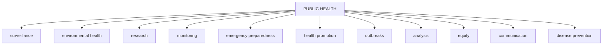

PUBLIC HEALTH BULLETIN-PAKISTAN

Vol. 3 | Week 30
08th Aug 2023

# Integrated Disease Surveillance & Response (IDSR) Report

Center of Disease Control
National Institute of Health, Islamabad

PAKISTAN

http://www.phb.nih.org.pk/

NIH logo

Government of Pakistan logo

Integrated Disease Surveillance & Response (IDSR) Weekly Public Health Bulletin is your go-to resource for disease trends, outbreak alerts, and crucial public health information. By reading and sharing this bulletin, you can help increase awareness and promote preventive measures within your community. Together, let's build a safer, more resilient and healthier future for everyone.

# PROUD TO BE IN PUBLIC HEALTH

## Make a difference with your field work. Write for PHB-Pakistan and impact lives!

Public Health Bulletin Pakistan logo

Submit your achievements and field work
phb@nih.org

NIH Pakistan logo

NIH logo

UK Health Security Agency logo

World Health Organization logo

USAID logo

safetynet logo

---

Public Health Bulletin Pakistan logo NIH logo Government of Pakistan logo

# Greetings
# Team PHB-Pakistan

## Overview

## IDSR Reports

## Ongoing Events

## Field Reports

## Preface

The Weekly Public Health Bulletin-Pakistan provides an overview of the most important public health events that occurred during week 30 of 2023. The most reported diseases during the week were Acute Diarrhea, Malaria, ILI, ALRI, B. Diarrhea, Typhoid, VH (B&C), SARI, AWD, AVH (A&E). There are a high number of suspected VH (B&C) cases reported from Sindh. Cases of CL were reported mostly from KP and Balochistan. Overall number of reported cases decreased this week compared to the previous week. We need to remain vigilant and continue to monitor the situation.

The PHB team would like to express its sincere gratitude to all of the health workers who have contributed to the reporting of these cases. We would also like to remind the public to stay vigilant and to seek medical attention immediately if they experience any symptoms of these diseases.

This week's bulletin also includes an update on PHB activities, on field activities and surveillance reports on Measles cases of Karak and acute watery diarrhea cases of Malakand. Polio case response activities in district Rawalpindi and a knowledge review on acute flaccid Paralysis.

Stay well-informed about public health matters. Subscribe to the Weekly Bulletin today!

Sincerely,
The Chief Editor

NIH logo UK Health Security Agency logo World Health Organization logo USAID logo safetynet logo

---

# Overview

* During week 30, most frequent reported cases were of Acute Diarrhea (Non-Cholera) followed by Malaria, ILI, ALRI <5 years, B. Diarrhea, Typhoid, VH (B, C), SARI, AWD (suspected Cholera) and AVH (A&E).

* There is overall decrease in number of disease cases observed this week.

* High Number of VH (B&C) cases reported from Sindh. All are suspected cases and need field verification.

* Cases of Cutaneous Leishmaniasis (CL) reported mostly from KP and Balochistan. Case categorization is required to distinguish between old and new cases for management and control.

* All are suspected cases and need field verification.

## IDSR compliance attributes

* The national compliance rate for IDSR reporting in 125 implemented districts is 74% AJK and Sindh province are the top reporting region with a compliance rate of above 85% followed by Khyber Pakhtunkhwa with 77% and ICT 74%

* The lowest compliance rate was observed in Gilgit Baltistan.

<table>
  <thead>
    <tr>
        <th>Region</th>
        <th>Expected Reports</th>
        <th>Received Reports</th>
        <th>Compliance (%)</th>
    </tr>
  </thead>
  <tbody>
    <tr>
        <td><strong>Khyber Pakhtunkhwa</strong></td>
<td>1570</td>
<td>1207</td>
<td>77</td>
    </tr>
<tr>
        <td><strong>Azad Jammu Kashmir</strong></td>
<td>380</td>
<td>356</td>
<td>94</td>
    </tr>
<tr>
        <td><strong>Islamabad Capital Territory</strong></td>
<td>27</td>
<td>20</td>
<td>74</td>
    </tr>
<tr>
        <td><strong>Balochistan</strong></td>
<td>1101</td>
<td>550</td>
<td>50</td>
    </tr>
<tr>
        <td><strong>Gilgit Baltistan</strong></td>
<td>99</td>
<td>47</td>
<td>47</td>
    </tr>
<tr>
        <td><strong>Sindh</strong></td>
<td>1846</td>
<td>1546</td>
<td>85</td>
    </tr>
<tr>
        <td><strong>National</strong></td>
<td>5023</td>
<td>3726</td>
<td>74</td>
    </tr>
  </tbody>
</table>

NIH logo

UK Health Security Agency logo

World Health Organization logo

USAID logo

safetynet logo

---

# Pakistan

Table 1: Province/Area wise distribution of most frequently reported cases during week 30, Pakistan.

<table>
    <thead>
    <tr>
        <th>Diseases</th>
        <th>AJK</th>
        <th>Balochistan</th>
        <th>GB</th>
        <th>ICT</th>
        <th>KP</th>
        <th>Punjab</th>
        <th>Sindh</th>
        <th>Total</th>
    </tr>
    </thead>
    <tr>
        <td>ILI</td>
<td>2011</td>
<td>2,360</td>
<td>37</td>
<td>668</td>
<td>3,585</td>
<td>317</td>
<td>9,745</td>
<td>18,723</td>
    </tr>
<tr>
        <td>AD (Non-Cholera)</td>
<td>2,298</td>
<td>4,807</td>
<td>219</td>
<td>349</td>
<td>26,347</td>
<td>79,966</td>
<td>34,573</td>
<td>148,559</td>
    </tr>
<tr>
        <td>Malaria</td>
<td>98</td>
<td>4,793</td>
<td>0</td>
<td>7</td>
<td>5,454</td>
<td>3,601</td>
<td>43,452</td>
<td>57,405</td>
    </tr>
<tr>
        <td>B. Diarrhea</td>
<td>110</td>
<td>1490</td>
<td>29</td>
<td>7</td>
<td>874</td>
<td>2,386</td>
<td>2159</td>
<td>7,055</td>
    </tr>
<tr>
        <td>Typhoid</td>
<td>111</td>
<td>591</td>
<td>9</td>
<td>0</td>
<td>699</td>
<td>3,734</td>
<td>1,397</td>
<td>6,541</td>
    </tr>
<tr>
        <td>SARI</td>
<td>288</td>
<td>736</td>
<td>38</td>
<td>0</td>
<td>1,181</td>
<td>NR</td>
<td>535</td>
<td>2,778</td>
    </tr>
<tr>
        <td>ALRI &lt; 5 years</td>
<td>461</td>
<td>1272</td>
<td>48</td>
<td>0</td>
<td>733</td>
<td>2,636</td>
<td>6,312</td>
<td>11,462</td>
    </tr>
<tr>
        <td>CL</td>
<td>0</td>
<td>72</td>
<td>0</td>
<td>0</td>
<td>255</td>
<td>7</td>
<td>0</td>
<td>334</td>
    </tr>
<tr>
        <td>AWD (S. Cholera)</td>
<td>91</td>
<td>184</td>
<td>25</td>
<td>22</td>
<td>73</td>
<td>2,356</td>
<td>51</td>
<td>2,802</td>
    </tr>
<tr>
        <td>Measles</td>
<td>17</td>
<td>31</td>
<td>3</td>
<td>0</td>
<td>119</td>
<td>NR</td>
<td>64</td>
<td>234</td>
    </tr>
<tr>
        <td>Dog Bite</td>
<td>70</td>
<td>73</td>
<td>0</td>
<td>0</td>
<td>90</td>
<td>NR</td>
<td>316</td>
<td>549</td>
    </tr>
<tr>
        <td>Dengue</td>
<td>0</td>
<td>1</td>
<td>0</td>
<td>0</td>
<td>5</td>
<td>NR</td>
<td>71</td>
<td>77</td>
    </tr>
<tr>
        <td>VH (B & C))</td>
<td>7</td>
<td>76</td>
<td>0</td>
<td>0</td>
<td>59</td>
<td>NR</td>
<td>2636</td>
<td>2,778</td>
    </tr>
<tr>
        <td>Gonorrhea</td>
<td>11</td>
<td>99</td>
<td>0</td>
<td>0</td>
<td>5</td>
<td>NR</td>
<td>34</td>
<td>149</td>
    </tr>
<tr>
        <td>Pertussis</td>
<td>7</td>
<td>66</td>
<td>0</td>
<td>0</td>
<td>4</td>
<td>NR</td>
<td>12</td>
<td>89</td>
    </tr>
<tr>
        <td>VL</td>
<td>0</td>
<td>0</td>
<td>0</td>
<td>0</td>
<td>0</td>
<td>NR</td>
<td>0</td>
<td>0</td>
    </tr>
<tr>
        <td>NT</td>
<td>0</td>
<td>3</td>
<td>0</td>
<td>0</td>
<td>6</td>
<td>NR</td>
<td>8</td>
<td>17</td>
    </tr>
<tr>
        <td>Mumps</td>
<td>94</td>
<td>81</td>
<td>9</td>
<td>5</td>
<td>113</td>
<td>NR</td>
<td>275</td>
<td>577</td>
    </tr>
<tr>
        <td>AFP</td>
<td>6</td>
<td>0</td>
<td>0</td>
<td>0</td>
<td>20</td>
<td>NR</td>
<td>8</td>
<td>34</td>
    </tr>
<tr>
        <td>Chickenpox/ Varicella</td>
<td>28</td>
<td>21</td>
<td>0</td>
<td>4</td>
<td>101</td>
<td>67</td>
<td>9</td>
<td>230</td>
    </tr>
<tr>
        <td>AVH (A & E)</td>
<td>34</td>
<td>25</td>
<td>0</td>
<td>1</td>
<td>222</td>
<td>NR</td>
<td>298</td>
<td>580</td>
    </tr>
<tr>
        <td>Meningitis</td>
<td>1</td>
<td>5</td>
<td>0</td>
<td>0</td>
<td>7</td>
<td>NR</td>
<td>14</td>
<td>27</td>
    </tr>
<tr>
        <td>Syphilis</td>
<td>0</td>
<td>1</td>
<td>0</td>
<td>0</td>
<td>0</td>
<td>NR</td>
<td>10</td>
<td>11</td>
    </tr>
<tr>
        <td>Leprosy</td>
<td>0</td>
<td>13</td>
<td>0</td>
<td>0</td>
<td>0</td>
<td>NR</td>
<td>0</td>
<td>13</td>
    </tr>
<tr>
        <td>Diphtheria (Probable)</td>
<td>2</td>
<td>3</td>
<td>0</td>
<td>0</td>
<td>0</td>
<td>NR</td>
<td>0</td>
<td>5</td>
    </tr>
<tr>
        <td>Chikungunya</td>
<td>0</td>
<td>0</td>
<td>0</td>
<td>0</td>
<td>0</td>
<td>NR</td>
<td>0</td>
<td>0</td>
    </tr>
<tr>
        <td>Anthrax</td>
<td>2</td>
<td>7</td>
<td>0</td>
<td>0</td>
<td>0</td>
<td>NR</td>
<td>0</td>
<td>9</td>
    </tr>
<tr>
        <td>Brucellosis</td>
<td>0</td>
<td>4</td>
<td>0</td>
<td>0</td>
<td>0</td>
<td>NR</td>
<td>0</td>
<td>4</td>
    </tr>
<tr>
        <td>CCHF</td>
<td>0</td>
<td>0</td>
<td>0</td>
<td>0</td>
<td>0</td>
<td>NR</td>
<td>0</td>
<td>0</td>
    </tr>
<tr>
        <td>Rubella (CRS)</td>
<td>0</td>
<td>0</td>
<td>0</td>
<td>0</td>
<td>0</td>
<td>NR</td>
<td>0</td>
<td>0</td>
    </tr>
<tr>
        <td>HIV/AIDS</td>
<td>3</td>
<td>1</td>
<td>0</td>
<td>0</td>
<td>0</td>
<td>NR</td>
<td>7</td>
<td>11</td>
    </tr>
</table>

Figure 1: Most frequently reported suspected cases during week 30, Pakistan

<table>
  <thead>
    <tr>
        <th>Disease</th>
        <th>WK 28</th>
        <th>WK 29</th>
        <th>WK 30</th>
    </tr>
  </thead>
  <tbody>
    <tr>
        <td>AD (Non-Cholera)</td>
<td> </td>
<td> </td>
<td>148,559</td>
    </tr>
<tr>
        <td>Malaria</td>
<td> </td>
<td> </td>
<td>57,405</td>
    </tr>
<tr>
        <td>ILI</td>
<td> </td>
<td> </td>
<td>18,723</td>
    </tr>
<tr>
        <td>ALRI &lt; 5 years</td>
<td> </td>
<td> </td>
<td>11,462</td>
    </tr>
<tr>
        <td>B. Diarrhea</td>
<td> </td>
<td> </td>
<td>7,055</td>
    </tr>
<tr>
        <td>VH (B, C &amp; D)</td>
<td> </td>
<td> </td>
<td>6,541</td>
    </tr>
<tr>
        <td>Typhoid</td>
<td> </td>
<td> </td>
<td>2,778</td>
    </tr>
<tr>
        <td>SARI</td>
<td> </td>
<td> </td>
<td>2,778</td>
    </tr>
<tr>
        <td>AVH (A &amp; E)</td>
<td> </td>
<td> </td>
<td>580</td>
    </tr>
<tr>
        <td>Mumps</td>
<td> </td>
<td> </td>
<td>577</td>
    </tr>
  </tbody>
</table>

NIH Pakistan logo

UK Health Security Agency logo

World Health Organization logo

USAID logo

safetynet logo

---

# Sindh

* Malaria cases were most frequently reported cases, followed by AD (Non-Cholera), ILI, ALRI<5 Years, VH (B, C), B. Diarrhea, Typhoid, SARI, AWD (susp. Cholera) and dog bite.
* Malaria cases are from Larkana, Kambar, Khairpur, Dadu and Badin whereas AD cases are mostly from Badin, Dadu and Khairpur however, overall number of cases decreased this week.
* VH (B & C) cases reported in high numbers mostly reported from Sanghar, Badin, Sukkar and Jacobabad. Field investigation along with lab confirmation is required to identify the source to control the spread of disease.

Table 2: District wise distribution of most frequently reported suspected cases during week 30, Sindh

<table>
    <thead>
    <tr>
        <th>DISTRICTS</th>
        <th>Malaria</th>
        <th>AD (Non-
Cholera)</th>
        <th>ILI</th>
        <th>ALRI &lt; 5 
years</th>
        <th>B. 
Diarrhea</th>
        <th>Typhoid</th>
        <th>SARI</th>
        <th>Measles</th>
        <th>VH (B, C 
& D)</th>
        <th>Dengue</th>
        <th>Dog Bite</th>
    </tr>
    </thead>
    <tr>
        <td>Badin</td>
<td>3,852</td>
<td>3,343</td>
<td>208</td>
<td>502</td>
<td>230</td>
<td>46</td>
<td>0</td>
<td>10</td>
<td>182</td>
<td>0</td>
<td>59</td>
    </tr>
<tr>
        <td>Dadu</td>
<td>2,198</td>
<td>2,283</td>
<td>10</td>
<td>517</td>
<td>140</td>
<td>85</td>
<td>2</td>
<td>0</td>
<td>3</td>
<td>0</td>
<td>0</td>
    </tr>
<tr>
        <td>Ghotki</td>
<td>540</td>
<td>777</td>
<td>0</td>
<td>252</td>
<td>71</td>
<td>38</td>
<td>0</td>
<td>1</td>
<td>299</td>
<td>0</td>
<td>0</td>
    </tr>
<tr>
        <td>Hyderabad</td>
<td>293</td>
<td>1,315</td>
<td>179</td>
<td>32</td>
<td>5</td>
<td>24</td>
<td>0</td>
<td>5</td>
<td>29</td>
<td>0</td>
<td>0</td>
    </tr>
<tr>
        <td>Jacobabad</td>
<td>1,078</td>
<td>911</td>
<td>58</td>
<td>960</td>
<td>94</td>
<td>38</td>
<td>23</td>
<td>41</td>
<td>140</td>
<td>0</td>
<td>26</td>
    </tr>
<tr>
        <td>Jamshoro</td>
<td>93</td>
<td>71</td>
<td>0</td>
<td>2</td>
<td>1</td>
<td>9</td>
<td>0</td>
<td>0</td>
<td>0</td>
<td>0</td>
<td>0</td>
    </tr>
<tr>
        <td>Kamber</td>
<td>3,731</td>
<td>1,863</td>
<td>0</td>
<td>172</td>
<td>63</td>
<td>11</td>
<td>0</td>
<td>0</td>
<td>39</td>
<td>0</td>
<td>0</td>
    </tr>
<tr>
        <td>Karachi Central</td>
<td>71</td>
<td>767</td>
<td>824</td>
<td>30</td>
<td>40</td>
<td>261</td>
<td>0</td>
<td>1</td>
<td>69</td>
<td>0</td>
<td>0</td>
    </tr>
<tr>
        <td>Karachi East</td>
<td>58</td>
<td>214</td>
<td>36</td>
<td>0</td>
<td>1</td>
<td>0</td>
<td>0</td>
<td>0</td>
<td>4</td>
<td>9</td>
<td>1</td>
    </tr>
<tr>
        <td>Karachi Keamari</td>
<td>3</td>
<td>228</td>
<td>74</td>
<td>20</td>
<td>0</td>
<td>2</td>
<td>0</td>
<td>1</td>
<td>0</td>
<td>0</td>
<td>0</td>
    </tr>
<tr>
        <td>Karachi Korangi</td>
<td>52</td>
<td>280</td>
<td>0</td>
<td>2</td>
<td>3</td>
<td>0</td>
<td>0</td>
<td>0</td>
<td>0</td>
<td>2</td>
<td>0</td>
    </tr>
<tr>
        <td>Karachi Malir</td>
<td>38</td>
<td>688</td>
<td>673</td>
<td>181</td>
<td>17</td>
<td>3</td>
<td>36</td>
<td>0</td>
<td>43</td>
<td>0</td>
<td>3</td>
    </tr>
<tr>
        <td>Karachi South</td>
<td>21</td>
<td>94</td>
<td>0</td>
<td>0</td>
<td>0</td>
<td>2</td>
<td>0</td>
<td>0</td>
<td>0</td>
<td>0</td>
<td>0</td>
    </tr>
<tr>
        <td>Karachi West</td>
<td>82</td>
<td>516</td>
<td>346</td>
<td>208</td>
<td>39</td>
<td>25</td>
<td>31</td>
<td>0</td>
<td>23</td>
<td>9</td>
<td>35</td>
    </tr>
<tr>
        <td>Kashmore</td>
<td>888</td>
<td>472</td>
<td>308</td>
<td>112</td>
<td>79</td>
<td>3</td>
<td>0</td>
<td>0</td>
<td>31</td>
<td>0</td>
<td>0</td>
    </tr>
<tr>
        <td>Khairpur</td>
<td>3,220</td>
<td>2,685</td>
<td>436</td>
<td>701</td>
<td>296</td>
<td>277</td>
<td>354</td>
<td>0</td>
<td>112</td>
<td>0</td>
<td>29</td>
    </tr>
<tr>
        <td>Larkana</td>
<td>7,288</td>
<td>1,197</td>
<td>0</td>
<td>191</td>
<td>167</td>
<td>0</td>
<td>0</td>
<td>0</td>
<td>64</td>
<td>0</td>
<td>0</td>
    </tr>
<tr>
        <td>Matiari</td>
<td>465</td>
<td>1,185</td>
<td>0</td>
<td>114</td>
<td>36</td>
<td>6</td>
<td>0</td>
<td>0</td>
<td>124</td>
<td>0</td>
<td>7</td>
    </tr>
<tr>
        <td>Mirpurkhas</td>
<td>2,882</td>
<td>1,765</td>
<td>1,924</td>
<td>185</td>
<td>63</td>
<td>53</td>
<td>0</td>
<td>0</td>
<td>34</td>
<td>0</td>
<td>0</td>
    </tr>
<tr>
        <td>Naushero Feroze</td>
<td>1,686</td>
<td>1,761</td>
<td>339</td>
<td>201</td>
<td>64</td>
<td>98</td>
<td>0</td>
<td>0</td>
<td>69</td>
<td>0</td>
<td>0</td>
    </tr>
<tr>
        <td>Sanghar</td>
<td>949</td>
<td>1,814</td>
<td>53</td>
<td>204</td>
<td>49</td>
<td>34</td>
<td>42</td>
<td>0</td>
<td>471</td>
<td>0</td>
<td>54</td>
    </tr>
<tr>
        <td>Shaheed 
Benazirabad</td>
<td>1,546</td>
<td>1,786</td>
<td>23</td>
<td>287</td>
<td>63</td>
<td>250</td>
<td>1</td>
<td>0</td>
<td>108</td>
<td>0</td>
<td>0</td>
    </tr>
<tr>
        <td>Shikarpur</td>
<td>926</td>
<td>874</td>
<td>0</td>
<td>104</td>
<td>81</td>
<td>1</td>
<td>2</td>
<td>1</td>
<td>106</td>
<td>0</td>
<td>0</td>
    </tr>
<tr>
        <td>Sujawal</td>
<td>1,052</td>
<td>437</td>
<td>0</td>
<td>168</td>
<td>51</td>
<td>0</td>
<td>0</td>
<td>0</td>
<td>3</td>
<td>0</td>
<td>2</td>
    </tr>
<tr>
        <td>Sukkur</td>
<td>1,834</td>
<td>1,390</td>
<td>1,315</td>
<td>266</td>
<td>192</td>
<td>21</td>
<td>1</td>
<td>1</td>
<td>212</td>
<td>0</td>
<td>0</td>
    </tr>
<tr>
        <td>Tando Allahyar</td>
<td>1,001</td>
<td>960</td>
<td>198</td>
<td>165</td>
<td>68</td>
<td>17</td>
<td>0</td>
<td>0</td>
<td>140</td>
<td>0</td>
<td>4</td>
    </tr>
<tr>
        <td>Tando Muhammad 
Khan</td>
<td>369</td>
<td>262</td>
<td>0</td>
<td>18</td>
<td>11</td>
<td>1</td>
<td>0</td>
<td>0</td>
<td>0</td>
<td>0</td>
<td>18</td>
    </tr>
<tr>
        <td>Tharparkar</td>
<td>2,144</td>
<td>1,308</td>
<td>1,129</td>
<td>436</td>
<td>124</td>
<td>14</td>
<td>11</td>
<td>1</td>
<td>61</td>
<td>51</td>
<td>3</td>
    </tr>
<tr>
        <td>Thatta</td>
<td>1,809</td>
<td>1,421</td>
<td>1,612</td>
<td>33</td>
<td>25</td>
<td>16</td>
<td>28</td>
<td>0</td>
<td>117</td>
<td>0</td>
<td>75</td>
    </tr>
<tr>
        <td>Umerkot</td>
<td>3,283</td>
<td>1,906</td>
<td>0</td>
<td>249</td>
<td>86</td>
<td>62</td>
<td>4</td>
<td>2</td>
<td>153</td>
<td>0</td>
<td>0</td>
    </tr>
<tr>
        <td>Total</td>
<td>43,452</td>
<td>34,573</td>
<td>9,745</td>
<td>6,312</td>
<td>2,159</td>
<td>1,397</td>
<td>535</td>
<td>64</td>
<td>2,636</td>
<td>71</td>
<td>316</td>
    </tr>
</table>

Figure 2: Most frequently reported suspected cases during week 30, Sindh

<table>
  <thead>
    <tr>
        <th>Disease</th>
        <th>WK 28</th>
        <th>WK 29</th>
        <th>WK 30</th>
    </tr>
  </thead>
  <tbody>
    <tr>
        <td>Malaria</td>
<td>68000</td>
<td>62000</td>
<td>43,452</td>
    </tr>
<tr>
        <td>AD (Non-Cholera)</td>
<td>50000</td>
<td>47000</td>
<td>34,573</td>
    </tr>
<tr>
        <td>ILI</td>
<td>14000</td>
<td>14000</td>
<td>9,745</td>
    </tr>
<tr>
        <td>ALRI &lt; 5 years</td>
<td>8000</td>
<td>8000</td>
<td>6,312</td>
    </tr>
<tr>
        <td>VH (B, C &amp; D)</td>
<td>3000</td>
<td>3000</td>
<td>2,636</td>
    </tr>
<tr>
        <td>B. Diarrhea</td>
<td>2500</td>
<td>2500</td>
<td>2,159</td>
    </tr>
<tr>
        <td>Typhoid</td>
<td>1500</td>
<td>1500</td>
<td>1,397</td>
    </tr>
<tr>
        <td>SARI</td>
<td>600</td>
<td>600</td>
<td>535</td>
    </tr>
<tr>
        <td>AWD (S. Cholera)</td>
<td>500</td>
<td>500</td>
<td>476</td>
    </tr>
<tr>
        <td>Dog Bite</td>
<td>400</td>
<td>400</td>
<td>316</td>
    </tr>
  </tbody>
</table>

NIH logo

UK Health Security Agency logo

World Health Organization logo

USAID logo

safetynet logo

---

# Balochistan

* AD (Non-Cholera), Malaria, ILI, B. Diarrhea, ALRI <5 years, SARI, Typhoid, AWD (S. Cholera), Gonorrhea and Mumps were the most frequently reported diseases from Balochistan province.

* There was overall downward trend for ILI, AD and Malaria cases this week.

* Cases of Typhoid reported from Lesbella, Panjgur, Mastung and Sobatpur. All are suspected cases and need field investigation to verify the cases.

Table 3: District wise distribution of most frequently reported suspected cases during week 30, Balochistan

<table>
  <thead>
    <tr>
      <th>Districts</th>
      <th>Malaria</th>
      <th>AD (Non-
Cholera)</th>
      <th>ILI</th>
      <th>B. 
Diarrhea</th>
      <th>ALRI &lt; 5 
Years</th>
      <th>Typhoid</th>
      <th>SARI</th>
      <th>CL</th>
      <th>Dog Bite</th>
      <th>AWD (S. 
Cholera)</th>
    </tr>
  </thead>
  <tbody>
    <tr>
      <td>Awaran</td>
<td>283</td>
<td>68</td>
<td>36</td>
<td>33</td>
<td>28</td>
<td>30</td>
<td>7</td>
<td>3</td>
<td>0</td>
<td>25</td>
    </tr>
<tr>
      <td>Chagai</td>
<td>10</td>
<td>150</td>
<td>169</td>
<td>39</td>
<td>0</td>
<td>26</td>
<td>3</td>
<td>0</td>
<td>1</td>
<td>3</td>
    </tr>
<tr>
      <td>Dera Bugti</td>
<td>245</td>
<td>42</td>
<td>15</td>
<td>37</td>
<td>21</td>
<td>20</td>
<td>15</td>
<td>0</td>
<td>1</td>
<td>9</td>
    </tr>
<tr>
      <td>Duki</td>
<td>16</td>
<td>23</td>
<td>19</td>
<td>21</td>
<td>1</td>
<td>7</td>
<td>6</td>
<td>2</td>
<td>0</td>
<td>3</td>
    </tr>
<tr>
      <td>Harnai</td>
<td>126</td>
<td>161</td>
<td>9</td>
<td>287</td>
<td>283</td>
<td>4</td>
<td>0</td>
<td>0</td>
<td>5</td>
<td>15</td>
    </tr>
<tr>
      <td>Jhal Magsi</td>
<td>591</td>
<td>314</td>
<td>0</td>
<td>15</td>
<td>40</td>
<td>8</td>
<td>13</td>
<td>0</td>
<td>13</td>
<td>29</td>
    </tr>
<tr>
      <td>Kachhi (Bolan)</td>
<td>83</td>
<td>74</td>
<td>28</td>
<td>29</td>
<td>7</td>
<td>27</td>
<td>24</td>
<td>0</td>
<td>0</td>
<td>3</td>
    </tr>
<tr>
      <td>Kech (Turbat)</td>
<td>102</td>
<td>138</td>
<td>252</td>
<td>11</td>
<td>56</td>
<td>1</td>
<td>0</td>
<td>0</td>
<td>0</td>
<td>0</td>
    </tr>
<tr>
      <td>Khuzdar</td>
<td>151</td>
<td>96</td>
<td>59</td>
<td>56</td>
<td>0</td>
<td>18</td>
<td>17</td>
<td>6</td>
<td>13</td>
<td>0</td>
    </tr>
<tr>
      <td>Kohlu</td>
<td>120</td>
<td>58</td>
<td>148</td>
<td>75</td>
<td>8</td>
<td>22</td>
<td>26</td>
<td>1</td>
<td>0</td>
<td>2</td>
    </tr>
<tr>
      <td>Lasbella</td>
<td>582</td>
<td>503</td>
<td>22</td>
<td>78</td>
<td>113</td>
<td>19</td>
<td>163</td>
<td>1</td>
<td>9</td>
<td>0</td>
    </tr>
<tr>
      <td>Loralai</td>
<td>73</td>
<td>210</td>
<td>178</td>
<td>43</td>
<td>43</td>
<td>26</td>
<td>75</td>
<td>0</td>
<td>0</td>
<td>8</td>
    </tr>
<tr>
      <td>Mastung</td>
<td>124</td>
<td>815</td>
<td>91</td>
<td>87</td>
<td>23</td>
<td>92</td>
<td>45</td>
<td>2</td>
<td>10</td>
<td>11</td>
    </tr>
<tr>
      <td>Naseerabad</td>
<td>475</td>
<td>167</td>
<td>0</td>
<td>12</td>
<td>7</td>
<td>44</td>
<td>1</td>
<td>0</td>
<td>4</td>
<td>3</td>
    </tr>
<tr>
      <td>Nushki</td>
<td>58</td>
<td>182</td>
<td>0</td>
<td>65</td>
<td>0</td>
<td>0</td>
<td>0</td>
<td>0</td>
<td>0</td>
<td>10</td>
    </tr>
<tr>
      <td>Panjgur</td>
<td>355</td>
<td>300</td>
<td>87</td>
<td>86</td>
<td>104</td>
<td>62</td>
<td>41</td>
<td>1</td>
<td>8</td>
<td>13</td>
    </tr>
<tr>
      <td>Pishin</td>
<td>18</td>
<td>157</td>
<td>140</td>
<td>72</td>
<td>22</td>
<td>13</td>
<td>3</td>
<td>21</td>
<td>3</td>
<td>0</td>
    </tr>
<tr>
      <td>Quetta</td>
<td>34</td>
<td>381</td>
<td>548</td>
<td>109</td>
<td>30</td>
<td>36</td>
<td>57</td>
<td>12</td>
<td>0</td>
<td>4</td>
    </tr>
<tr>
      <td>Sherani</td>
<td>13</td>
<td>13</td>
<td>28</td>
<td>8</td>
<td>0</td>
<td>7</td>
<td>2</td>
<td>8</td>
<td>2</td>
<td>2</td>
    </tr>
<tr>
      <td>Sibi</td>
<td>265</td>
<td>124</td>
<td>95</td>
<td>29</td>
<td>16</td>
<td>31</td>
<td>16</td>
<td>8</td>
<td>1</td>
<td>20</td>
    </tr>
<tr>
      <td>Sohbat pur</td>
<td>695</td>
<td>321</td>
<td>9</td>
<td>105</td>
<td>108</td>
<td>63</td>
<td>165</td>
<td>7</td>
<td>0</td>
<td>0</td>
    </tr>
<tr>
      <td>SURAB</td>
<td>2</td>
<td>1</td>
<td>0</td>
<td>0</td>
<td>0</td>
<td>0</td>
<td>0</td>
<td>0</td>
<td>0</td>
<td>0</td>
    </tr>
<tr>
      <td>Washuk</td>
<td>154</td>
<td>214</td>
<td>246</td>
<td>110</td>
<td>1</td>
<td>3</td>
<td>20</td>
<td>0</td>
<td>0</td>
<td>1</td>
    </tr>
<tr>
      <td>Zhob</td>
<td>190</td>
<td>225</td>
<td>102</td>
<td>62</td>
<td>341</td>
<td>26</td>
<td>32</td>
<td>0</td>
<td>0</td>
<td>10</td>
    </tr>
<tr>
      <td>Ziarat</td>
<td>28</td>
<td>70</td>
<td>79</td>
<td>21</td>
<td>20</td>
<td>6</td>
<td>5</td>
<td>0</td>
<td>3</td>
<td>13</td>
    </tr>
<tr>
      <td>Total</td>
<td>4,793</td>
<td>4,807</td>
<td>2,360</td>
<td>1,490</td>
<td>1,272</td>
<td>591</td>
<td>736</td>
<td>72</td>
<td>73</td>
<td>184</td>
    </tr>
  </tbody>
</table>

Figure 3: Most frequently reported suspected cases during week 30, Balochistan

<table>
  <thead>
    <tr>
        <th>Disease</th>
        <th>WK 28</th>
        <th>WK 29</th>
        <th>WK 30</th>
    </tr>
  </thead>
  <tbody>
    <tr>
        <td>AD (Non-Cholera)</td>
<td>7200</td>
<td>7600</td>
<td>4807</td>
    </tr>
<tr>
        <td>Malaria</td>
<td>8300</td>
<td>8400</td>
<td>4793</td>
    </tr>
<tr>
        <td>ILI</td>
<td>3800</td>
<td>3800</td>
<td>2360</td>
    </tr>
<tr>
        <td>B. Diarrhea</td>
<td>2100</td>
<td>2200</td>
<td>1490</td>
    </tr>
<tr>
        <td>ALRI &lt; 5 years</td>
<td>2500</td>
<td>2600</td>
<td>1272</td>
    </tr>
<tr>
        <td>SARI</td>
<td>1100</td>
<td>1000</td>
<td>736</td>
    </tr>
<tr>
        <td>Typhoid</td>
<td>1200</td>
<td>1300</td>
<td>591</td>
    </tr>
<tr>
        <td>AWD (S. Cholera)</td>
<td>500</td>
<td>400</td>
<td>184</td>
    </tr>
<tr>
        <td>Gonorrhea</td>
<td>150</td>
<td>150</td>
<td>99</td>
    </tr>
<tr>
        <td>Mumps</td>
<td>100</td>
<td>100</td>
<td>81</td>
    </tr>
  </tbody>
</table>

NIH logo

UK Health Security Agency logo

World Health Organization logo

USAID logo

safetynet logo

---

# Khyber Pakhtunkhwa

* Cases of AD (Non-Cholera) were the most frequently reported followed by Malaria, ILI, SARI, B. Diarrhea, ALRI<5 Years, Typhoid, CL, AVH (A&E) and Measles cases.

* There is decline trend for AD cases whereas Malaria and ILI cases remained same this week.

* Typhoid cases reported from Peshawar and Swat. These are suspected cases and a field investigation is required to verify the numbers.

* AD cases are endemic and public health measures are enhanced the province due to ongoing rains. Field investigation along with control measures are taking place in the affected districts of the province.

Table 4: District wise distribution of most frequently reported suspected cases during week 30, KP

<table>
    <thead>
    <tr>
        <th>Diseases</th>
        <th>AD (Non-
Cholera)</th>
        <th>Malaria</th>
        <th>ILI</th>
        <th>SARI</th>
        <th>ALRI &lt; 5 
years</th>
        <th>B. Diarrhea</th>
        <th>Typhoid</th>
        <th>Dog Bite</th>
        <th>AWD (S. 
Cholera)</th>
        <th>AVH (A & 
E)</th>
    </tr>
    </thead>
    <tr>
        <td>Abbottabad</td>
<td>772</td>
<td>3</td>
<td>5</td>
<td>6</td>
<td>7</td>
<td>1</td>
<td>16</td>
<td>1</td>
<td>0</td>
<td>0</td>
    </tr>
<tr>
        <td>Bajaur</td>
<td>82</td>
<td>46</td>
<td>1</td>
<td>0</td>
<td>0</td>
<td>3</td>
<td>2</td>
<td>0</td>
<td>3</td>
<td>0</td>
    </tr>
<tr>
        <td>Bannu</td>
<td>741</td>
<td>1,078</td>
<td>122</td>
<td>1</td>
<td>3</td>
<td>4</td>
<td>43</td>
<td>0</td>
<td>0</td>
<td>0</td>
    </tr>
<tr>
        <td>Buner</td>
<td>509</td>
<td>459</td>
<td>0</td>
<td>0</td>
<td>0</td>
<td>8</td>
<td>9</td>
<td>7</td>
<td>0</td>
<td>0</td>
    </tr>
<tr>
        <td>Charsadda</td>
<td>1,224</td>
<td>74</td>
<td>157</td>
<td>33</td>
<td>0</td>
<td>0</td>
<td>0</td>
<td>0</td>
<td>0</td>
<td>0</td>
    </tr>
<tr>
        <td>Chitral Lower</td>
<td>760</td>
<td>9</td>
<td>58</td>
<td>412</td>
<td>4</td>
<td>0</td>
<td>2</td>
<td>0</td>
<td>0</td>
<td>3</td>
    </tr>
<tr>
        <td>Chitral Upper</td>
<td>93</td>
<td>5</td>
<td>0</td>
<td>114</td>
<td>0</td>
<td>0</td>
<td>17</td>
<td>0</td>
<td>0</td>
<td>0</td>
    </tr>
<tr>
        <td>D.I. Khan</td>
<td>999</td>
<td>351</td>
<td>15</td>
<td>36</td>
<td>15</td>
<td>19</td>
<td>1</td>
<td>5</td>
<td>0</td>
<td>0</td>
    </tr>
<tr>
        <td>Dir Lower</td>
<td>2,247</td>
<td>588</td>
<td>76</td>
<td>2</td>
<td>75</td>
<td>128</td>
<td>47</td>
<td>8</td>
<td>0</td>
<td>3</td>
    </tr>
<tr>
        <td>Dir Upper</td>
<td>786</td>
<td>8</td>
<td>83</td>
<td>0</td>
<td>16</td>
<td>36</td>
<td>40</td>
<td>0</td>
<td>16</td>
<td>5</td>
    </tr>
<tr>
        <td>Hangu</td>
<td>395</td>
<td>384</td>
<td>467</td>
<td>117</td>
<td>7</td>
<td>36</td>
<td>15</td>
<td>2</td>
<td>0</td>
<td>10</td>
    </tr>
<tr>
        <td>Haripur</td>
<td>1,183</td>
<td>32</td>
<td>374</td>
<td>11</td>
<td>115</td>
<td>2</td>
<td>57</td>
<td>0</td>
<td>0</td>
<td>60</td>
    </tr>
<tr>
        <td>Karak</td>
<td>341</td>
<td>137</td>
<td>25</td>
<td>18</td>
<td>15</td>
<td>4</td>
<td>10</td>
<td>28</td>
<td>15</td>
<td>0</td>
    </tr>
<tr>
        <td>Khyber</td>
<td>10</td>
<td>44</td>
<td>62</td>
<td>3</td>
<td>3</td>
<td>4</td>
<td>5</td>
<td>0</td>
<td>1</td>
<td>0</td>
    </tr>
<tr>
        <td>Kohat</td>
<td>67</td>
<td>35</td>
<td>1</td>
<td>1</td>
<td>2</td>
<td>0</td>
<td>1</td>
<td>3</td>
<td>0</td>
<td>0</td>
    </tr>
<tr>
        <td>Kohistan Lower</td>
<td>120</td>
<td>8</td>
<td>0</td>
<td>140</td>
<td>7</td>
<td>27</td>
<td>0</td>
<td>0</td>
<td>0</td>
<td>0</td>
    </tr>
<tr>
        <td>Kohistan Upper</td>
<td>530</td>
<td>1</td>
<td>42</td>
<td>23</td>
<td>1</td>
<td>9</td>
<td>16</td>
<td>0</td>
<td>2</td>
<td>0</td>
    </tr>
<tr>
        <td>Kolai Palas</td>
<td>91</td>
<td>3</td>
<td>0</td>
<td>14</td>
<td>4</td>
<td>16</td>
<td>0</td>
<td>0</td>
<td>3</td>
<td>0</td>
    </tr>
<tr>
        <td>L & C Kurram</td>
<td>9</td>
<td>10</td>
<td>12</td>
<td>0</td>
<td>0</td>
<td>4</td>
<td>3</td>
<td>0</td>
<td>0</td>
<td>0</td>
    </tr>
<tr>
        <td>Lakki Marwat</td>
<td>507</td>
<td>881</td>
<td>0</td>
<td>0</td>
<td>11</td>
<td>13</td>
<td>28</td>
<td>0</td>
<td>0</td>
<td>0</td>
    </tr>
<tr>
        <td>Malakand</td>
<td>945</td>
<td>79</td>
<td>0</td>
<td>52</td>
<td>25</td>
<td>165</td>
<td>39</td>
<td>0</td>
<td>5</td>
<td>48</td>
    </tr>
<tr>
        <td>Mansehra</td>
<td>1,027</td>
<td>7</td>
<td>384</td>
<td>37</td>
<td>52</td>
<td>43</td>
<td>56</td>
<td>0</td>
<td>13</td>
<td>9</td>
    </tr>
<tr>
        <td>Mardan</td>
<td>1,316</td>
<td>49</td>
<td>539</td>
<td>48</td>
<td>137</td>
<td>30</td>
<td>0</td>
<td>0</td>
<td>0</td>
<td>7</td>
    </tr>
<tr>
        <td>Nowshera</td>
<td>2,162</td>
<td>108</td>
<td>50</td>
<td>14</td>
<td>0</td>
<td>33</td>
<td>22</td>
<td>0</td>
<td>0</td>
<td>11</td>
    </tr>
<tr>
        <td>Peshawar</td>
<td>2,734</td>
<td>124</td>
<td>474</td>
<td>35</td>
<td>71</td>
<td>145</td>
<td>101</td>
<td>3</td>
<td>0</td>
<td>17</td>
    </tr>
<tr>
        <td>Shangla</td>
<td>572</td>
<td>465</td>
<td>0</td>
<td>0</td>
<td>0</td>
<td>6</td>
<td>2</td>
<td>18</td>
<td>15</td>
<td>0</td>
    </tr>
<tr>
        <td>Swabi</td>
<td>1,592</td>
<td>30</td>
<td>370</td>
<td>44</td>
<td>82</td>
<td>11</td>
<td>21</td>
<td>7</td>
<td>0</td>
<td>35</td>
    </tr>
<tr>
        <td>Swat</td>
<td>4,275</td>
<td>81</td>
<td>266</td>
<td>0</td>
<td>81</td>
<td>92</td>
<td>127</td>
<td>3</td>
<td>0</td>
<td>7</td>
    </tr>
<tr>
        <td>Tank</td>
<td>156</td>
<td>235</td>
<td>0</td>
<td>0</td>
<td>0</td>
<td>3</td>
<td>6</td>
<td>0</td>
<td>0</td>
<td>0</td>
    </tr>
<tr>
        <td>Tor Ghar</td>
<td>102</td>
<td>120</td>
<td>2</td>
<td>20</td>
<td>0</td>
<td>32</td>
<td>13</td>
<td>5</td>
<td>0</td>
<td>7</td>
    </tr>
<tr>
        <td>Total</td>
<td>26,347</td>
<td>5,454</td>
<td>3,585</td>
<td>1,181</td>
<td>733</td>
<td>874</td>
<td>699</td>
<td>90</td>
<td>73</td>
<td>222</td>
    </tr>
</table>

Figure 4: Most frequently reported suspected cases during week 30, KP

<table>
  <thead>
    <tr>
        <th>Week</th>
        <th>AD (Non-Cholera)</th>
        <th>Malaria</th>
        <th>ILI</th>
        <th>SARI</th>
        <th>B. Diarrhea</th>
        <th>ALRI &lt; 5 years</th>
        <th>Typhoid</th>
        <th>CL</th>
        <th>AVH (A &amp; E)</th>
        <th>Measles</th>
    </tr>
  </thead>
  <tbody>
    <tr>
        <td>WK 28</td>
<td>31,000</td>
<td>6,500</td>
<td>5,000</td>
<td>2,000</td>
<td>1,200</td>
<td>1,200</td>
<td>1,000</td>
<td>400</td>
<td>300</td>
<td>150</td>
    </tr>
<tr>
        <td>WK 29</td>
<td>29,000</td>
<td>6,000</td>
<td>4,500</td>
<td>1,500</td>
<td>1,000</td>
<td>1,000</td>
<td>800</td>
<td>300</td>
<td>250</td>
<td>130</td>
    </tr>
<tr>
        <td>WK 30</td>
<td>26,347</td>
<td>5,454</td>
<td>3,585</td>
<td>1,181</td>
<td>874</td>
<td>733</td>
<td>699</td>
<td>255</td>
<td>222</td>
<td>119</td>
    </tr>
  </tbody>
</table>

NIH logo

UK Health Security Agency logo

World Health Organization logo

USAID logo

safetynet logo

---

# ICT, AJK & GB

**ICT**: The most frequently reported cases were of ILI followed by AD (Non-Cholera). ILI cases showed an upward trend in cases this week.

**AJK**: AD (Non-Cholera), ILI, ALRI <5 years, SARI, Typhoid, B. Diarrhea, Malaria, Mumps, AWD (S. Cholera), and dogbite were the most frequently reported diseases this week. Both ILI and ALRI <5 years cases showed a downward trend in cases this week.

**GB**: AD (Non. Cholera), ALRI<5 years, SARI, ILI, B. Diarrhea, AWD (susp. Cholera), typhoid, mumps and Measles. Overall decrease in reported cases for all diseases observed. There is decline rend in AD cases this week.

Figure 6: Week wise reported suspected cases of ILI, ICT

<table>
  <thead>
    <tr>
        <th>Disease</th>
        <th>WK28</th>
        <th>WK29</th>
        <th>WK30</th>
    </tr>
  </thead>
  <tbody>
    <tr>
        <td>ILI</td>
<td>890</td>
<td>380</td>
<td>668</td>
    </tr>
<tr>
        <td>AD (Non-Cholera)</td>
<td>480</td>
<td>180</td>
<td>349</td>
    </tr>
  </tbody>
</table>

Figure 6: Week wise reported suspected cases of ILI, ICT

<table>
  <thead>
    <tr>
        <th>Week</th>
        <th>ILI</th>
    </tr>
  </thead>
  <tbody>
    <tr>
        <td>W31</td>
<td>1250</td>
    </tr>
<tr>
        <td>W32</td>
<td>1250</td>
    </tr>
<tr>
        <td>W33</td>
<td>1150</td>
    </tr>
<tr>
        <td>W34</td>
<td>350</td>
    </tr>
<tr>
        <td>W35</td>
<td>1450</td>
    </tr>
<tr>
        <td>W36</td>
<td>150</td>
    </tr>
<tr>
        <td>W37</td>
<td>50</td>
    </tr>
<tr>
        <td>W38</td>
<td>1200</td>
    </tr>
<tr>
        <td>W39</td>
<td>1000</td>
    </tr>
<tr>
        <td>W40</td>
<td>2150</td>
    </tr>
<tr>
        <td>W41</td>
<td>2300</td>
    </tr>
<tr>
        <td>W42</td>
<td>2650</td>
    </tr>
<tr>
        <td>W43</td>
<td>2600</td>
    </tr>
<tr>
        <td>W44</td>
<td>1850</td>
    </tr>
<tr>
        <td>W45</td>
<td>1700</td>
    </tr>
<tr>
        <td>W46</td>
<td>1550</td>
    </tr>
<tr>
        <td>W47</td>
<td>2450</td>
    </tr>
<tr>
        <td>W48</td>
<td>2350</td>
    </tr>
<tr>
        <td>W49</td>
<td>2500</td>
    </tr>
<tr>
        <td>W50</td>
<td>3200</td>
    </tr>
<tr>
        <td>W51</td>
<td>2500</td>
    </tr>
<tr>
        <td>W52</td>
<td>2200</td>
    </tr>
<tr>
        <td>W1</td>
<td>2050</td>
    </tr>
<tr>
        <td>W2</td>
<td>1600</td>
    </tr>
<tr>
        <td>W3</td>
<td>1950</td>
    </tr>
<tr>
        <td>W4</td>
<td>1850</td>
    </tr>
<tr>
        <td>W5</td>
<td>1850</td>
    </tr>
<tr>
        <td>W6</td>
<td>1550</td>
    </tr>
<tr>
        <td>W7</td>
<td>2300</td>
    </tr>
<tr>
        <td>W8</td>
<td>1600</td>
    </tr>
<tr>
        <td>W9</td>
<td>2250</td>
    </tr>
<tr>
        <td>W10</td>
<td>2100</td>
    </tr>
<tr>
        <td>W11</td>
<td>1700</td>
    </tr>
<tr>
        <td>W12</td>
<td>650</td>
    </tr>
<tr>
        <td>W13</td>
<td>1450</td>
    </tr>
<tr>
        <td>W14</td>
<td>1350</td>
    </tr>
<tr>
        <td>W15</td>
<td>1150</td>
    </tr>
<tr>
        <td>W16</td>
<td>650</td>
    </tr>
<tr>
        <td>W17</td>
<td>1100</td>
    </tr>
<tr>
        <td>W18</td>
<td>950</td>
    </tr>
<tr>
        <td>W19</td>
<td>1500</td>
    </tr>
<tr>
        <td>W20</td>
<td>750</td>
    </tr>
<tr>
        <td>W21</td>
<td>1150</td>
    </tr>
<tr>
        <td>W22</td>
<td>1150</td>
    </tr>
<tr>
        <td>W23</td>
<td>650</td>
    </tr>
<tr>
        <td>W24</td>
<td>1000</td>
    </tr>
<tr>
        <td>W25</td>
<td>850</td>
    </tr>
<tr>
        <td>W26</td>
<td>200</td>
    </tr>
<tr>
        <td>W27</td>
<td>650</td>
    </tr>
<tr>
        <td>W28</td>
<td>900</td>
    </tr>
<tr>
        <td>W29</td>
<td>350</td>
    </tr>
<tr>
        <td>W30</td>
<td>668</td>
    </tr>
  </tbody>
</table>

Figure 7: Most frequently reported suspected cases during week 30, AJK

<table>
  <thead>
    <tr>
        <th>Disease</th>
        <th>WK 28</th>
        <th>WK 29</th>
        <th>WK 30</th>
    </tr>
  </thead>
  <tbody>
    <tr>
        <td>AD (Non-Cholera)</td>
<td>2700</td>
<td>2700</td>
<td>2298</td>
    </tr>
<tr>
        <td>ILI</td>
<td>2250</td>
<td>2350</td>
<td>2011</td>
    </tr>
<tr>
        <td>ALRI &lt; 5 years</td>
<td>650</td>
<td>800</td>
<td>461</td>
    </tr>
<tr>
        <td>SARI</td>
<td>350</td>
<td>350</td>
<td>288</td>
    </tr>
<tr>
        <td>Typhoid</td>
<td>150</td>
<td>150</td>
<td>111</td>
    </tr>
<tr>
        <td>B. Diarrhea</td>
<td>120</td>
<td>120</td>
<td>110</td>
    </tr>
<tr>
        <td>Malaria</td>
<td>100</td>
<td>100</td>
<td>98</td>
    </tr>
<tr>
        <td>Mumps</td>
<td>100</td>
<td>100</td>
<td>94</td>
    </tr>
<tr>
        <td>AWD (S. Cholera)</td>
<td>100</td>
<td>100</td>
<td>91</td>
    </tr>
<tr>
        <td>Dog Bite</td>
<td>80</td>
<td>80</td>
<td>70</td>
    </tr>
  </tbody>
</table>

NIH logo

UK Health Security Agency logo

World Health Organization logo

USAID logo

safetynet logo

---

Figure 8: Week wise reported suspected cases of AD (Non-Cholera) and ALRI <5 years, AJK

<table>
  <thead>
    <tr>
        <th>Week</th>
        <th>Quarter</th>
        <th>AD (Non-Cholera)</th>
        <th>ILI</th>
    </tr>
  </thead>
  <tbody>
    <tr>
        <td>W31</td>
<td>3rd Quarter 2022</td>
<td>150</td>
<td>50</td>
    </tr>
<tr>
        <td>W32</td>
<td>3rd Quarter 2022</td>
<td>150</td>
<td>50</td>
    </tr>
<tr>
        <td>W33</td>
<td>3rd Quarter 2022</td>
<td>150</td>
<td>50</td>
    </tr>
<tr>
        <td>W34</td>
<td>3rd Quarter 2022</td>
<td>150</td>
<td>50</td>
    </tr>
<tr>
        <td>W35</td>
<td>3rd Quarter 2022</td>
<td>150</td>
<td>50</td>
    </tr>
<tr>
        <td>W36</td>
<td>3rd Quarter 2022</td>
<td>150</td>
<td>50</td>
    </tr>
<tr>
        <td>W37</td>
<td>3rd Quarter 2022</td>
<td>150</td>
<td>50</td>
    </tr>
<tr>
        <td>W38</td>
<td>3rd Quarter 2022</td>
<td>150</td>
<td>50</td>
    </tr>
<tr>
        <td>W39</td>
<td>3rd Quarter 2022</td>
<td>250</td>
<td>200</td>
    </tr>
<tr>
        <td>W40</td>
<td>4th Quarter 2022</td>
<td>450</td>
<td>500</td>
    </tr>
<tr>
        <td>W41</td>
<td>4th Quarter 2022</td>
<td>450</td>
<td>750</td>
    </tr>
<tr>
        <td>W42</td>
<td>4th Quarter 2022</td>
<td>400</td>
<td>800</td>
    </tr>
<tr>
        <td>W43</td>
<td>4th Quarter 2022</td>
<td>450</td>
<td>850</td>
    </tr>
<tr>
        <td>W44</td>
<td>4th Quarter 2022</td>
<td>500</td>
<td>1000</td>
    </tr>
<tr>
        <td>W45</td>
<td>4th Quarter 2022</td>
<td>450</td>
<td>1000</td>
    </tr>
<tr>
        <td>W46</td>
<td>4th Quarter 2022</td>
<td>300</td>
<td>1100</td>
    </tr>
<tr>
        <td>W47</td>
<td>4th Quarter 2022</td>
<td>450</td>
<td>1700</td>
    </tr>
<tr>
        <td>W48</td>
<td>4th Quarter 2022</td>
<td>300</td>
<td>1400</td>
    </tr>
<tr>
        <td>W49</td>
<td>4th Quarter 2022</td>
<td>300</td>
<td>1250</td>
    </tr>
<tr>
        <td>W50</td>
<td>4th Quarter 2022</td>
<td>400</td>
<td>1500</td>
    </tr>
<tr>
        <td>W51</td>
<td>4th Quarter 2022</td>
<td>550</td>
<td>2600</td>
    </tr>
<tr>
        <td>W52</td>
<td>4th Quarter 2022</td>
<td>650</td>
<td>2200</td>
    </tr>
<tr>
        <td>W1</td>
<td>1st Quarter 2023</td>
<td>750</td>
<td>2250</td>
    </tr>
<tr>
        <td>W2</td>
<td>1st Quarter 2023</td>
<td>800</td>
<td>2000</td>
    </tr>
<tr>
        <td>W3</td>
<td>1st Quarter 2023</td>
<td>600</td>
<td>1700</td>
    </tr>
<tr>
        <td>W4</td>
<td>1st Quarter 2023</td>
<td>650</td>
<td>1700</td>
    </tr>
<tr>
        <td>W5</td>
<td>1st Quarter 2023</td>
<td>750</td>
<td>1800</td>
    </tr>
<tr>
        <td>W6</td>
<td>1st Quarter 2023</td>
<td>900</td>
<td>1850</td>
    </tr>
<tr>
        <td>W7</td>
<td>1st Quarter 2023</td>
<td>1000</td>
<td>2400</td>
    </tr>
<tr>
        <td>W8</td>
<td>1st Quarter 2023</td>
<td>1050</td>
<td>2000</td>
    </tr>
<tr>
        <td>W9</td>
<td>1st Quarter 2023</td>
<td>1100</td>
<td>1850</td>
    </tr>
<tr>
        <td>W10</td>
<td>1st Quarter 2023</td>
<td>1200</td>
<td>2250</td>
    </tr>
<tr>
        <td>W11</td>
<td>1st Quarter 2023</td>
<td>1200</td>
<td>2200</td>
    </tr>
<tr>
        <td>W12</td>
<td>1st Quarter 2023</td>
<td>1000</td>
<td>2100</td>
    </tr>
<tr>
        <td>W13</td>
<td>1st Quarter 2023</td>
<td>1250</td>
<td>2350</td>
    </tr>
<tr>
        <td>W14</td>
<td>1st Quarter 2023</td>
<td>1350</td>
<td>2300</td>
    </tr>
<tr>
        <td>W15</td>
<td>1st Quarter 2023</td>
<td>1250</td>
<td>1900</td>
    </tr>
<tr>
        <td>W16</td>
<td>2nd Quarter 2023</td>
<td>950</td>
<td>1500</td>
    </tr>
<tr>
        <td>W17</td>
<td>2nd Quarter 2023</td>
<td>1500</td>
<td>1850</td>
    </tr>
<tr>
        <td>W18</td>
<td>2nd Quarter 2023</td>
<td>1750</td>
<td>2100</td>
    </tr>
<tr>
        <td>W19</td>
<td>2nd Quarter 2023</td>
<td>2100</td>
<td>2750</td>
    </tr>
<tr>
        <td>W20</td>
<td>2nd Quarter 2023</td>
<td>2300</td>
<td>2500</td>
    </tr>
<tr>
        <td>W21</td>
<td>2nd Quarter 2023</td>
<td>2250</td>
<td>2550</td>
    </tr>
<tr>
        <td>W22</td>
<td>2nd Quarter 2023</td>
<td>2200</td>
<td>2600</td>
    </tr>
<tr>
        <td>W23</td>
<td>2nd Quarter 2023</td>
<td>2250</td>
<td>2600</td>
    </tr>
<tr>
        <td>W24</td>
<td>2nd Quarter 2023</td>
<td>2350</td>
<td>2750</td>
    </tr>
<tr>
        <td>W25</td>
<td>2nd Quarter 2023</td>
<td>2350</td>
<td>2400</td>
    </tr>
<tr>
        <td>W26</td>
<td>2nd Quarter 2023</td>
<td>1500</td>
<td>1100</td>
    </tr>
<tr>
        <td>W27</td>
<td>2nd Quarter 2023</td>
<td>2600</td>
<td>2100</td>
    </tr>
<tr>
        <td>W28</td>
<td>3rd Quarter 2023</td>
<td>2750</td>
<td>2350</td>
    </tr>
<tr>
        <td>W29</td>
<td>3rd Quarter 2023</td>
<td>2750</td>
<td>2350</td>
    </tr>
<tr>
        <td>W30</td>
<td>3rd Quarter 2023</td>
<td>2350</td>
<td>2000</td>
    </tr>
  </tbody>
</table>

Figure 9: Most frequent cases reported during WK 30, GB

<table>
  <thead>
    <tr>
        <th>Disease</th>
        <th>WK 28</th>
        <th>WK 29</th>
        <th>WK 30</th>
    </tr>
  </thead>
  <tbody>
    <tr>
        <td>AD (Non-Cholera)</td>
<td>190</td>
<td>275</td>
<td>219</td>
    </tr>
<tr>
        <td>ALRI &lt; 5 years</td>
<td>85</td>
<td>90</td>
<td>48</td>
    </tr>
<tr>
        <td>SARI</td>
<td>90</td>
<td>105</td>
<td>37</td>
    </tr>
<tr>
        <td>ILI</td>
<td>55</td>
<td>70</td>
<td>37</td>
    </tr>
<tr>
        <td>B. Diarrhea</td>
<td>20</td>
<td>40</td>
<td>29</td>
    </tr>
<tr>
        <td>AWD (S. Cholera)</td>
<td>25</td>
<td>45</td>
<td>25</td>
    </tr>
<tr>
        <td>Typhoid</td>
<td>25</td>
<td>22</td>
<td>9</td>
    </tr>
<tr>
        <td>Mumps</td>
<td>5</td>
<td>5</td>
<td>9</td>
    </tr>
<tr>
        <td>Measles</td>
<td>2</td>
<td>2</td>
<td>3</td>
    </tr>
  </tbody>
</table>

Figure 10: Week wise reported suspected cases of ALRI < 5 years, GB

<table>
  <thead>
    <tr>
        <th>Week</th>
        <th>Quarter</th>
        <th>Cases</th>
    </tr>
  </thead>
  <tbody>
    <tr>
        <td>W31</td>
<td>3rd Quarter 2022</td>
<td>40</td>
    </tr>
<tr>
        <td>W32</td>
<td>3rd Quarter 2022</td>
<td>35</td>
    </tr>
<tr>
        <td>W33</td>
<td>3rd Quarter 2022</td>
<td>25</td>
    </tr>
<tr>
        <td>W34</td>
<td>3rd Quarter 2022</td>
<td>15</td>
    </tr>
<tr>
        <td>W35</td>
<td>3rd Quarter 2022</td>
<td>20</td>
    </tr>
<tr>
        <td>W36</td>
<td>3rd Quarter 2022</td>
<td>18</td>
    </tr>
<tr>
        <td>W37</td>
<td>3rd Quarter 2022</td>
<td>25</td>
    </tr>
<tr>
        <td>W38</td>
<td>3rd Quarter 2022</td>
<td>25</td>
    </tr>
<tr>
        <td>W39</td>
<td>3rd Quarter 2022</td>
<td>15</td>
    </tr>
<tr>
        <td>W40</td>
<td>4th Quarter 2022</td>
<td>22</td>
    </tr>
<tr>
        <td>W41</td>
<td>4th Quarter 2022</td>
<td>2</td>
    </tr>
<tr>
        <td>W42</td>
<td>4th Quarter 2022</td>
<td>5</td>
    </tr>
<tr>
        <td>W43</td>
<td>4th Quarter 2022</td>
<td>15</td>
    </tr>
<tr>
        <td>W44</td>
<td>4th Quarter 2022</td>
<td>48</td>
    </tr>
<tr>
        <td>W45</td>
<td>4th Quarter 2022</td>
<td>8</td>
    </tr>
<tr>
        <td>W46</td>
<td>4th Quarter 2022</td>
<td>8</td>
    </tr>
<tr>
        <td>W47</td>
<td>4th Quarter 2022</td>
<td>8</td>
    </tr>
<tr>
        <td>W48</td>
<td>4th Quarter 2022</td>
<td>8</td>
    </tr>
<tr>
        <td>W49</td>
<td>4th Quarter 2022</td>
<td>12</td>
    </tr>
<tr>
        <td>W50</td>
<td>4th Quarter 2022</td>
<td>20</td>
    </tr>
<tr>
        <td>W51</td>
<td>4th Quarter 2022</td>
<td>8</td>
    </tr>
<tr>
        <td>W52</td>
<td>4th Quarter 2022</td>
<td>5</td>
    </tr>
<tr>
        <td>W1</td>
<td>1st Quarter 2023</td>
<td>10</td>
    </tr>
<tr>
        <td>W2</td>
<td>1st Quarter 2023</td>
<td>10</td>
    </tr>
<tr>
        <td>W3</td>
<td>1st Quarter 2023</td>
<td>10</td>
    </tr>
<tr>
        <td>W4</td>
<td>1st Quarter 2023</td>
<td>10</td>
    </tr>
<tr>
        <td>W5</td>
<td>1st Quarter 2023</td>
<td>10</td>
    </tr>
<tr>
        <td>W6</td>
<td>1st Quarter 2023</td>
<td>10</td>
    </tr>
<tr>
        <td>W7</td>
<td>1st Quarter 2023</td>
<td>10</td>
    </tr>
<tr>
        <td>W8</td>
<td>1st Quarter 2023</td>
<td>2</td>
    </tr>
<tr>
        <td>W9</td>
<td>1st Quarter 2023</td>
<td>10</td>
    </tr>
<tr>
        <td>W10</td>
<td>1st Quarter 2023</td>
<td>8</td>
    </tr>
<tr>
        <td>W11</td>
<td>1st Quarter 2023</td>
<td>8</td>
    </tr>
<tr>
        <td>W12</td>
<td>1st Quarter 2023</td>
<td>12</td>
    </tr>
<tr>
        <td>W13</td>
<td>1st Quarter 2023</td>
<td>12</td>
    </tr>
<tr>
        <td>W14</td>
<td>1st Quarter 2023</td>
<td>38</td>
    </tr>
<tr>
        <td>W15</td>
<td>2nd Quarter 2023</td>
<td>12</td>
    </tr>
<tr>
        <td>W16</td>
<td>2nd Quarter 2023</td>
<td>18</td>
    </tr>
<tr>
        <td>W17</td>
<td>2nd Quarter 2023</td>
<td>30</td>
    </tr>
<tr>
        <td>W18</td>
<td>2nd Quarter 2023</td>
<td>28</td>
    </tr>
<tr>
        <td>W19</td>
<td>2nd Quarter 2023</td>
<td>25</td>
    </tr>
<tr>
        <td>W20</td>
<td>2nd Quarter 2023</td>
<td>35</td>
    </tr>
<tr>
        <td>W21</td>
<td>2nd Quarter 2023</td>
<td>35</td>
    </tr>
<tr>
        <td>W22</td>
<td>2nd Quarter 2023</td>
<td>45</td>
    </tr>
<tr>
        <td>W23</td>
<td>2nd Quarter 2023</td>
<td>85</td>
    </tr>
<tr>
        <td>W24</td>
<td>2nd Quarter 2023</td>
<td>160</td>
    </tr>
<tr>
        <td>W25</td>
<td>2nd Quarter 2023</td>
<td>100</td>
    </tr>
<tr>
        <td>W26</td>
<td>2nd Quarter 2023</td>
<td>105</td>
    </tr>
<tr>
        <td>W27</td>
<td>2nd Quarter 2023</td>
<td>160</td>
    </tr>
<tr>
        <td>W28</td>
<td>3rd Quarter 2023</td>
<td>185</td>
    </tr>
<tr>
        <td>W29</td>
<td>3rd Quarter 2023</td>
<td>275</td>
    </tr>
<tr>
        <td>W30</td>
<td>3rd Quarter 2023</td>
<td>220</td>
    </tr>
  </tbody>
</table>

NIH logo UK Health Security Agency logo World Health Organization logo USAID logo safetynet logo

---

*Punjab*

* AD (Non. Cholera) cases were most frequent followed by Malaria and Typhoid.

* Diarrhea cases were reported in high numbers from Lahore, Faisalabad, and Gujranwala. All are suspected cases and need verification.

Table 5: District wise distribution of most frequently reported suspected cases during week 30, Punjab

<table>
  <thead>
    <tr>
        <th>Disease</th>
        <th>Week 28</th>
        <th>Week 29</th>
        <th>Week 30</th>
    </tr>
  </thead>
  <tbody>
    <tr>
        <td>AD (Non Cholera)</td>
<td>~94,000</td>
<td>~91,500</td>
<td>79,966</td>
    </tr>
<tr>
        <td>Malaria</td>
<td>~6,000</td>
<td>~5,300</td>
<td>3,601</td>
    </tr>
<tr>
        <td>Typhoid</td>
<td>~4,900</td>
<td>~4,600</td>
<td>3,734</td>
    </tr>
<tr>
        <td>B. Diarrhea</td>
<td>~3,300</td>
<td>~3,200</td>
<td>2,386</td>
    </tr>
<tr>
        <td>ILI</td>
<td>~400</td>
<td>~350</td>
<td>317</td>
    </tr>
<tr>
        <td>Chicken pox</td>
<td>~150</td>
<td>~100</td>
<td>67</td>
    </tr>
  </tbody>
</table>

Table 6: Public Health Laboratories confirmed cases of IDSR Priority Diseases during Epid Week 30

<table>
  <thead>
    <tr>
        <th>Diseases</th>
        <th>KPK</th>
        <th>Sindh</th>
        <th>Balochistan</th>
        <th>Punjab</th>
        <th>Gilgit</th>
    </tr>
  </thead>
  <tbody>
    <tr>
        <td>Acute Watery Diarrhoea (S. Cholera)</td>
<td>0</td>
<td>-</td>
<td>-</td>
<td>7</td>
<td>-</td>
    </tr>
<tr>
        <td>Acute diarrhea(non-cholera)</td>
<td>0</td>
<td>-</td>
<td>0</td>
<td>-</td>
<td>-</td>
    </tr>
<tr>
        <td>Malaria</td>
<td>102</td>
<td>-</td>
<td>-</td>
<td>-</td>
<td>-</td>
    </tr>
<tr>
        <td>CCHF</td>
<td>-</td>
<td>2</td>
<td>-</td>
<td>3</td>
<td>-</td>
    </tr>
<tr>
        <td>Dengue</td>
<td>-</td>
<td>-</td>
<td>-</td>
<td>-</td>
<td>-</td>
    </tr>
<tr>
        <td>Acute Viral Hepatitis(A)</td>
<td>1</td>
<td>-</td>
<td>-</td>
<td>-</td>
<td>-</td>
    </tr>
<tr>
        <td>Acute Viral Hepatitis(B)</td>
<td>56</td>
<td>-</td>
<td>-</td>
<td>-</td>
<td>0</td>
    </tr>
<tr>
        <td>Acute Viral Hepatitis(C)</td>
<td>124</td>
<td>32</td>
<td>0</td>
<td>-</td>
<td>0</td>
    </tr>
<tr>
        <td>Acute Viral Hepatitis(E)</td>
<td>5</td>
<td>-</td>
<td>-</td>
<td>-</td>
<td>-</td>
    </tr>
<tr>
        <td>Typhoid</td>
<td>2</td>
<td>-</td>
<td>-</td>
<td>10</td>
<td>-</td>
    </tr>
  </tbody>
</table>

NIH logo

UK Health Security Agency logo

World Health Organization logo

USAID logo

safetynet logo

---

IDSR Reports Compliance

**Table 7: IDSR reporting districts Week 30**

<table>
  <thead>
    <tr>
        <th>Provinces/Regions</th>
        <th>Districts</th>
        <th>Total Number of Reporting Sites</th>
        <th>Number of Agreed Reporting Sites</th>
        <th>Number of Reported Sites for current week</th>
        <th>Compliance Rate (%)</th>
    </tr>
  </thead>
  <tbody>
    <tr>
        <td rowspan="29">Khyber Pakhtunkhwa</td>
<td>Abbottabad</td>
<td>110</td>
<td>110</td>
<td>100</td>
<td>91%</td>
    </tr>
<tr>
        <td>Bannu</td>
<td>92</td>
<td>92</td>
<td>60</td>
<td>65%</td>
    </tr>
<tr>
        <td>Battagram</td>
<td>43</td>
<td>43</td>
<td>22</td>
<td>51%</td>
    </tr>
<tr>
        <td>Buner</td>
<td>34</td>
<td>34</td>
<td>28</td>
<td>82%</td>
    </tr>
<tr>
        <td>Charsadda</td>
<td>61</td>
<td>61</td>
<td>51</td>
<td>84%</td>
    </tr>
<tr>
        <td>Chitral Upper</td>
<td>33</td>
<td>33</td>
<td>8</td>
<td>24%</td>
    </tr>
<tr>
        <td>Chitral Lower</td>
<td>35</td>
<td>35</td>
<td>32</td>
<td>91%</td>
    </tr>
<tr>
        <td>D.I. Khan</td>
<td>89</td>
<td>89</td>
<td>66</td>
<td>74%</td>
    </tr>
<tr>
        <td>Dir Lower</td>
<td>75</td>
<td>75</td>
<td>60</td>
<td>80%</td>
    </tr>
<tr>
        <td>Dir Upper</td>
<td>55</td>
<td>55</td>
<td>44</td>
<td>80%</td>
    </tr>
<tr>
        <td>Hangu</td>
<td>22</td>
<td>22</td>
<td>22</td>
<td>100%</td>
    </tr>
<tr>
        <td>Haripur</td>
<td>69</td>
<td>69</td>
<td>60</td>
<td>87%</td>
    </tr>
<tr>
        <td>Karak</td>
<td>34</td>
<td>34</td>
<td>34</td>
<td>100%</td>
    </tr>
<tr>
        <td>Khyber</td>
<td>40</td>
<td>40</td>
<td>5</td>
<td>13%</td>
    </tr>
<tr>
        <td>Kohat</td>
<td>59</td>
<td>59</td>
<td>59</td>
<td>100%</td>
    </tr>
<tr>
        <td>Kohistan Lower</td>
<td>11</td>
<td>11</td>
<td>8</td>
<td>73%</td>
    </tr>
<tr>
        <td>Kohistan Upper</td>
<td>20</td>
<td>20</td>
<td>19</td>
<td>95%</td>
    </tr>
<tr>
        <td>Kolai Palas</td>
<td>10</td>
<td>10</td>
<td>10</td>
<td>100%</td>
    </tr>
<tr>
        <td>Lakki Marwat</td>
<td>49</td>
<td>49</td>
<td>49</td>
<td>100%</td>
    </tr>
<tr>
        <td>Malakand</td>
<td>42</td>
<td>42</td>
<td>35</td>
<td>83%</td>
    </tr>
<tr>
        <td>Mansehra</td>
<td>133</td>
<td>133</td>
<td>68</td>
<td>51%</td>
    </tr>
<tr>
        <td>Mardan</td>
<td>84</td>
<td>84</td>
<td>55</td>
<td>65%</td>
    </tr>
<tr>
        <td>Nowshera</td>
<td>52</td>
<td>52</td>
<td>52</td>
<td>100%</td>
    </tr>
<tr>
        <td>Peshawar</td>
<td>101</td>
<td>101</td>
<td>87</td>
<td>86%</td>
    </tr>
<tr>
        <td>Shangla</td>
<td>36</td>
<td>36</td>
<td>9</td>
<td>25%</td>
    </tr>
<tr>
        <td>Swabi</td>
<td>60</td>
<td>60</td>
<td>54</td>
<td>90%</td>
    </tr>
<tr>
        <td>Swat</td>
<td>77</td>
<td>77</td>
<td>69</td>
<td>90%</td>
    </tr>
<tr>
        <td>Tank</td>
<td>34</td>
<td>34</td>
<td>31</td>
<td>91%</td>
    </tr>
<tr>
        <td>Torghar</td>
<td>10</td>
<td>10</td>
<td>10</td>
<td>100%</td>
    </tr>
<tr>
        <td rowspan="10">Azad Jammu Kashmir</td>
<td>Mirpur</td>
<td>37</td>
<td>37</td>
<td>34</td>
<td>100%</td>
    </tr>
<tr>
        <td>Bhimber</td>
<td>20</td>
<td>20</td>
<td>20</td>
<td>100%</td>
    </tr>
<tr>
        <td>Kotli</td>
<td>60</td>
<td>60</td>
<td>58</td>
<td>97%</td>
    </tr>
<tr>
        <td>Muzaffarabad</td>
<td>43</td>
<td>43</td>
<td>43</td>
<td>100%</td>
    </tr>
<tr>
        <td>Poonch</td>
<td>46</td>
<td>46</td>
<td>46</td>
<td>100%</td>
    </tr>
<tr>
        <td>Haveli</td>
<td>39</td>
<td>39</td>
<td>32</td>
<td>82%</td>
    </tr>
<tr>
        <td>Bagh</td>
<td>40</td>
<td>40</td>
<td>37</td>
<td>93%</td>
    </tr>
<tr>
        <td>Neelum</td>
<td>39</td>
<td>39</td>
<td>33</td>
<td>85%</td>
    </tr>
<tr>
        <td>Jhelum Vellay</td>
<td>29</td>
<td>29</td>
<td>27</td>
<td>93%</td>
    </tr>
<tr>
        <td>Sudhnooti</td>
<td>27</td>
<td>27</td>
<td>26</td>
<td>96%</td>
    </tr>
<tr>
        <td rowspan="2">Islamabad Capital Territory</td>
<td>ICT</td>
<td>18</td>
<td>18</td>
<td>12</td>
<td>67%</td>
    </tr>
<tr>
        <td>CDA</td>
<td>9</td>
<td>9</td>
<td>8</td>
<td>89%</td>
    </tr>
<tr>
        <td rowspan="2">Balochistan</td>
<td>Gwadar</td>
<td>24</td>
<td>24</td>
<td>2</td>
<td>8%</td>
    </tr>
<tr>
        <td>Kech</td>
<td>78</td>
<td>44</td>
<td>31</td>
<td>70%</td>
    </tr>
  </tbody>
</table>

NIH logo

UK Health Security Agency logo

World Health Organization logo

USAID logo

safetynet logo

---

<table>
  <tbody>
    <tr>
        <td rowspan="25"> </td>
<td>Khuzdar</td>
<td>136</td>
<td>20</td>
<td>17</td>
<td>85%</td>
    </tr>
<tr>
        <td>Killa Abdullah</td>
<td>50</td>
<td>32</td>
<td>0</td>
<td>0%</td>
    </tr>
<tr>
        <td>Lasbella</td>
<td>85</td>
<td>85</td>
<td>80</td>
<td>94%</td>
    </tr>
<tr>
        <td>Pishin</td>
<td>118</td>
<td>23</td>
<td>9</td>
<td>39%</td>
    </tr>
<tr>
        <td>Quetta</td>
<td>77</td>
<td>22</td>
<td>16</td>
<td>73%</td>
    </tr>
<tr>
        <td>Sibi</td>
<td>42</td>
<td>42</td>
<td>21</td>
<td>50%</td>
    </tr>
<tr>
        <td>Zhob</td>
<td>37</td>
<td>37</td>
<td>25</td>
<td>68%</td>
    </tr>
<tr>
        <td>Jaffarabad</td>
<td>47</td>
<td>47</td>
<td>30</td>
<td>64%</td>
    </tr>
<tr>
        <td>Naserabad</td>
<td>45</td>
<td>45</td>
<td>37</td>
<td>82%</td>
    </tr>
<tr>
        <td>kharan</td>
<td>32</td>
<td>32</td>
<td>27</td>
<td>84%</td>
    </tr>
<tr>
        <td>sherani</td>
<td>32</td>
<td>32</td>
<td>4</td>
<td>13%</td>
    </tr>
<tr>
        <td>kohlu</td>
<td>75</td>
<td>75</td>
<td>20</td>
<td>27%</td>
    </tr>
<tr>
        <td>Chagi</td>
<td>65</td>
<td>65</td>
<td>20</td>
<td>31%</td>
    </tr>
<tr>
        <td>kalat</td>
<td>65</td>
<td>65</td>
<td>11</td>
<td>17%</td>
    </tr>
<tr>
        <td>Musa khail</td>
<td>68</td>
<td>68</td>
<td>7</td>
<td>10%</td>
    </tr>
<tr>
        <td>Harnai</td>
<td>36</td>
<td>36</td>
<td>17</td>
<td>47%</td>
    </tr>
<tr>
        <td>Kachhi (Bolan)</td>
<td>35</td>
<td>35</td>
<td>11</td>
<td>31%</td>
    </tr>
<tr>
        <td>Jhal Magsi</td>
<td>39</td>
<td>39</td>
<td>22</td>
<td>56%</td>
    </tr>
<tr>
        <td>Sohbat pur</td>
<td>26</td>
<td>26</td>
<td>24</td>
<td>92%</td>
    </tr>
<tr>
        <td>Surab</td>
<td>33</td>
<td>33</td>
<td>2</td>
<td>6%</td>
    </tr>
<tr>
        <td>Mastung</td>
<td>45</td>
<td>45</td>
<td>27</td>
<td>60%</td>
    </tr>
<tr>
        <td>Loralai</td>
<td>25</td>
<td>25</td>
<td>23</td>
<td>92%</td>
    </tr>
<tr>
        <td>Killa Saifullah</td>
<td>31</td>
<td>31</td>
<td>24</td>
<td>77%</td>
    </tr>
<tr>
        <td>Ziarat</td>
<td>42</td>
<td>42</td>
<td>15</td>
<td>36%</td>
    </tr>
<tr>
        <td>Duki</td>
<td>31</td>
<td>31</td>
<td>28</td>
<td>90%</td>
    </tr>
<tr>
        <td rowspan="3"><strong>Gilgit Baltistan</strong></td>
<td>Hunza</td>
<td>31</td>
<td>31</td>
<td>29</td>
<td>94%</td>
    </tr>
<tr>
        <td>Nagar</td>
<td>6</td>
<td>6</td>
<td>0</td>
<td>0%</td>
    </tr>
<tr>
        <td>Ghizer</td>
<td>62</td>
<td>62</td>
<td>18</td>
<td>29%</td>
    </tr>
<tr>
        <td rowspan="21"><strong>Sindh</strong></td>
<td>Hyderabad</td>
<td>71</td>
<td>71</td>
<td>25</td>
<td>35%</td>
    </tr>
<tr>
        <td>Ghotki</td>
<td>93</td>
<td>65</td>
<td>65</td>
<td>100%</td>
    </tr>
<tr>
        <td>Umerkot</td>
<td>98</td>
<td>43</td>
<td>43</td>
<td>100%</td>
    </tr>
<tr>
        <td>Naushahro Feroze</td>
<td>120</td>
<td>61</td>
<td>27</td>
<td>44%</td>
    </tr>
<tr>
        <td>Tharparkar</td>
<td>292</td>
<td>100</td>
<td>94</td>
<td>94%</td>
    </tr>
<tr>
        <td>Shikarpur</td>
<td>60</td>
<td>60</td>
<td>60</td>
<td>100%</td>
    </tr>
<tr>
        <td>Thatta</td>
<td>53</td>
<td>53</td>
<td>50</td>
<td>94%</td>
    </tr>
<tr>
        <td>Larkana</td>
<td>67</td>
<td>67</td>
<td>67</td>
<td>100%</td>
    </tr>
<tr>
        <td>Kamber Shadadkot</td>
<td>71</td>
<td>71</td>
<td>71</td>
<td>100%</td>
    </tr>
<tr>
        <td>Karachi-East</td>
<td>14</td>
<td>14</td>
<td>11</td>
<td>79%</td>
    </tr>
<tr>
        <td>Karachi-West</td>
<td>20</td>
<td>20</td>
<td>19</td>
<td>95%</td>
    </tr>
<tr>
        <td>Karachi-Malir</td>
<td>37</td>
<td>37</td>
<td>9</td>
<td>24%</td>
    </tr>
<tr>
        <td>Karachi-Kemari</td>
<td>17</td>
<td>17</td>
<td>12</td>
<td>71%</td>
    </tr>
<tr>
        <td>Karachi-Central</td>
<td>11</td>
<td>11</td>
<td>10</td>
<td>91%</td>
    </tr>
<tr>
        <td>Karachi-Korangi</td>
<td>17</td>
<td>17</td>
<td>12</td>
<td>71%</td>
    </tr>
<tr>
        <td>Karachi-South</td>
<td>4</td>
<td>4</td>
<td>2</td>
<td>50%</td>
    </tr>
<tr>
        <td>Sujawal</td>
<td>31</td>
<td>31</td>
<td>30</td>
<td>97%</td>
    </tr>
<tr>
        <td>Mirpur Khas</td>
<td>104</td>
<td>104</td>
<td>103</td>
<td>99%</td>
    </tr>
<tr>
        <td>Badin</td>
<td>144</td>
<td>144</td>
<td>110</td>
<td>76%</td>
    </tr>
<tr>
        <td>Sukkur</td>
<td>64</td>
<td>64</td>
<td>64</td>
<td>100%</td>
    </tr>
<tr>
        <td>Dadu</td>
<td>90</td>
<td>90</td>
<td>89</td>
<td>99%</td>
    </tr>
  </tbody>
</table>

National Institute of Health Pakistan logo

UK Health Security Agency logo

World Health Organization logo

USAID logo

safetynet logo

---

<table>
  
  <tbody>
    <tr>
      <td>Sanghar</td>
<td>101</td>
<td>101</td>
<td>97</td>
<td>96%</td>
    </tr>
<tr>
      <td>Jacobabad</td>
<td>43</td>
<td>43</td>
<td>36</td>
<td>84%</td>
    </tr>
<tr>
      <td>Khairpur</td>
<td>168</td>
<td>168</td>
<td>162</td>
<td>96%</td>
    </tr>
<tr>
      <td>kashmore</td>
<td>59</td>
<td>59</td>
<td>55</td>
<td>93%</td>
    </tr>
<tr>
      <td>Matiari</td>
<td>42</td>
<td>42</td>
<td>40</td>
<td>95%</td>
    </tr>
<tr>
      <td>Jamshoro</td>
<td>70</td>
<td>70</td>
<td>20</td>
<td>29%</td>
    </tr>
<tr>
      <td>Tando Allahyar</td>
<td>54</td>
<td>54</td>
<td>48</td>
<td>89%</td>
    </tr>
<tr>
      <td>Tando Muhammad Khan</td>
<td>41</td>
<td>41</td>
<td>11</td>
<td>27%</td>
    </tr>
<tr>
      <td>Shaheed Benazirabad</td>
<td>124</td>
<td>124</td>
<td>122</td>
<td>98%</td>
    </tr>
  </tbody>
</table>

National Institute of Health Pakistan logo
UK Health Security Agency logo
World Health Organization logo
USAID logo
safetynet logo

---

# Public Health Bulletin (PHB) Pakistan

## Public Health bulletin Pakistan.

The Pakistan Public Health Bulletin made significant strides during the quarter in improving data reporting, dissemination of surveillance information, and audience engagement. These accomplishments will help to guarantee that the PHB remains a valuable resource for public health professionals and stakeholders in Pakistan.

## Key Achievements

During the quarter, provincial surveillance teams received technical assistance to improve data reporting from district to provincial and national levels. A monitoring dashboard was implemented, utilizing historical data for trend analysis and alert indicators establishment. The National Institute of Health (NIH) supported the dissemination of surveillance information to provincial health departments and other stakeholders, enhancing the epidemiological bulletin's standards, content, and format across all levels.

Provincial surveillance teams participated in regular teleconference sessions to strengthen their public health data analysis capabilities and effectively utilize Pakistan Public Health Bulletin (PHB) surveillance information at local and district levels. The PHB delivered timely, accurate, and relevant content, adhering to editorial standards in support of its mission. A comprehensive plan outlining strategy for audience engagement, retention, visibility expansion, and readership growth are being developed.

Effective collaboration with various stakeholders and partners facilitated the bulletin's broader reach and increased its impact. Senior and Associate editors diligently ensured quality control, timeliness, evaluation, and optimization of editorial processes. Bulletin development, review, and publication were executed punctually.

Management of the review process for surveillance publications involved addressing feedback accordingly. Disease trends were monitored; disease alerts and outbreaks identified; health departments engaged for response conduction; report submissions acquired for inclusion in the bulletin. The Pakistan Public Health Bulletin website was supervised and kept up-to-date.

Timely dissemination of the bulletin via email to an updated contact list ensured stakeholder engagement.

## A note from Field Activities.

**Investigation of the Measles Outbreak in UC Karak North, District Karak, Khyber Pakhtunkhwa, Pakistan**

Source: DHIS-2 Reports
https://dhis2.nih.org.pk/dhis-web-event-reports/

## Background

This study investigated an outbreak of measles in UC Karak North, District Karak, Khyber Pakhtunkhwa, Pakistan, which has a population of 35,000 people. The first case was reported on January 19, 2023, and more cases occurred over a period of 26 weeks.

## Objectives

The objectives of the outbreak investigation were to Determine the magnitude of the outbreak, Control further spread of the disease and Recommend actions to prevent future outbreaks.

## Methods

A case was defined as "any person resident of UC Karak North, District Karak, who had an acute illness characterized by generalized, maculopapular rash lasting ≥3 days, temperature ≥ 101°F, and cough, coryza, or conjunctivitis from January 1, 2023 to July 11, 2023." A descriptive study design was employed, and data was collected through a semi-structured questionnaire/interview, examination of hospital records, laboratory records, and active case search in the community. The data was analyzed using Microsoft Excel and Epi-info.

## Findings

A total of 149 cases were enrolled in the study. Out of these, 24 were laboratory-confirmed cases of measles and 125 were discarded. The maximum number of 8 laboratory-confirmed cases were reported during the 25th epi-week. The overall attack rate was 7 per 10,000. The age range of laboratory-confirmed cases varied from 7 to 48 months, with a median age of 20 months. Males were more affected (58%) than females (42%). Sixty-three percent (15) of the cases were unvaccinated, while 37% (9) were fully vaccinated.

National Institute of Health Pakistan logo

UK Health Security Agency logo

World Health Organization logo

USAID logo

safetynet logo

---

## Conclusion

The outbreak is currently ongoing and will be followed up. Based on the findings, it was concluded that vaccination coverage for measles is poor in the community. The study recommends the following:

* A mass vaccination campaign in UC Karak North.

* Extensive EPI outreach activities by EPI technicians in the community.

* Awareness and health education sessions in schools and the community.

* A case-control study to investigate potential risk factors.

## Recommendations

The following recommendations are made to strengthen surveillance, control, and prevention of future measles outbreaks:

* Conduct a mass vaccination campaign in UC Karak North.

* Conduct extensive EPI outreach activities by EPI technicians in the community.

* Provide awareness and health education sessions in schools and the community.

* Conduct a case-control study to investigate potential risk factors.

## A note from Field Activities.

**Acute Watery Diarrhea Outbreak in UC Malakand Khas, Malakand, July 2023**

Source: DHIS-2 Reports
https://dhis2.nih.org.pk/dhis-web-event-reports/

## Background

An outbreak of acute watery diarrhea (AWD) was initially reported from Civil Hospital Malakand in the second week of July. The outbreak was confirmed to be cholera after Vibrio cholerae was detected in 13 cases from the same vicinity.

## Objective

The objective of this investigation was to identify and investigate the increase in AWD cases confirmed as cholera in UC Malakand Khas area, Ghareebabad and Irrigation Colony over the last 20 days. The ultimate goal was to detect and eliminate the cause of the outbreak in order to end it.

## Methods

Information on suspected and confirmed cholera cases was collected from health facilities, community active surveillance, and laboratory reports. Interviews were conducted with confirmed cases to collect clinical, exposure, and health-seeking behavior information. Environmental investigations were conducted to assess water sources, sanitation, and hygiene practices in order to identify potential sources of contamination.

## Findings

The investigation confirmed that the cholera outbreak was associated with poor sanitation in the area and poor hygiene practices in the households of confirmed cases. The common water supply source for daily use was also contaminated. The most common symptom among the affected individuals was abdominal discomfort secondary to diarrhea.

## Conclusion

The epidemiological investigation confirmed a cholera outbreak in the vicinity. Risk factors indicated that poor sanitation linked to contaminated water supply and lack of awareness about proper hygiene practices were significant contributors to the outbreak.

## Recommendations

The following recommendations are made to strengthen surveillance systems, improve response to cholera outbreaks, and prevent future outbreaks:

* Strengthen surveillance systems for early detection and response to cholera outbreaks.

* Streamline the flow of data on suspected cases and collection of samples to determine the extent of the outbreak.

* Provide adequate emergency room (ER) medicine to nearby health facilities.

* Conduct a cholera vaccination drive in the community to prevent the further spread of the disease.

NIH Pakistan logo

UK Health Security Agency logo

World Health Organization logo

USAID logo

safetynet logo

---

* Coordinated efforts from all stakeholders are necessary to control the spread of the disease and prevent future outbreaks.

## A note from Field Activities.

## Polio Case Response Campaign in DHA Rawalpindi:

**7-13th August 2023**

Dr. Ehsan Ghani
District health officer
Preventive services

Portrait of Dr. Ehsan Ghani

**Background**

Surveillance for Acute Flaccid Paralysis (AFP) is considered to be the 'gold standard' for polio surveillance in endemic and polio-free countries. However, environmental surveillance can also be used as an early warning system for the detection of poliovirus, especially in areas where high-risk groups, such as mobile populations, under- or unimmunized populations, reside.

Environmental surveillance has been used in Pakistan since July 2009 to support the AFP surveillance system. The district of Rawalpindi has three environmental sampling sites, which are located at Safdarabad, Dhok Dallal, and Serae Kala. Serae Kala Tehsil Taxila was added to the list of environmental sites only in December last year to reinforce polio virus surveillance and to plan any response on time.

On July 17, 2023, an environmental (sewage) sample was collected from the 'Sarae Kala' environmental sample collection site in Rawalpindi, Pakistan. The sample was tested positive for WPV-1, or wild poliovirus type 1. This is the first positive sample from Rawalpindi this year and the third sample which has tested positive in Punjab this year.

The positive sample in Rawalpindi indicates that the virus is circulating in the region. This is alarming, as the last wild poliovirus case in Rawalpindi was reported in June 2010. The circulating virus is a threat to all children in the area, and it is important to take steps to prevent its spread.

Field workers standing near a water channel

Field workers inspecting a site near buildings

Field workers walking along a path

Field workers reviewing documents outdoors

*Following the detection of Pakistan's second polio case in Bannu, Type-1 Wild Poliovirus has been found in the environmental samples collected from Taxila Town of Rawalpindi district. These events triggered EOC and District Health Authority to conduct an extensive case response activity in five high risk tehsil of district Rawalpindi.*

## Response

In response to the positive environmental sample, the District Health

NIH logo

UK Health Security Agency logo

World Health Organization logo

USAID logo

safetynet logo

---

Authority (DHA) Rawalpindi has launched a mass vaccination campaign in five high-risk tehsils of the district. The polio case response campaign will target a total of 867,885 children under the age of five who need to be vaccinated against polio, reaching 669,412 households. To reach all of these children, the DHA has deployed a total of 3,251 teams. These teams are responsible for vaccinating children in all parts of the district, including hard-to-reach areas. The breakdown of the teams by type is as follows:

Mobile teams: 2,835
Fix teams: 269
Transit teams: 147

The mobile teams are the most numerous, followed by the fix teams and the transit teams. This suggests that the focus of the polio vaccination campaign is on reaching children in hard-to-reach areas.

The DHA is committed to ensuring that all children in the five high-risk tehsils of District Rawalpindi are vaccinated against polio. The polio case response campaign is a major undertaking, but it is essential to the health of children in the district.

## Conclusion

The detection of wild poliovirus in Rawalpindi is a serious development. However, the DHA's swift response is a positive sign. The polio case response campaign is a critical step in the fight to eradicate polio from Pakistan. With continued effort, Pakistan can achieve the goal of polio eradication and protect its children from this devastating disease.

Collage of photographs showing health workers conducting polio vaccination activities in various outdoor and residential settings

## Knowledge Hub
### "Acute Flaccid Paralysis:

Acute flaccid paralysis (AFP) is a sudden onset of weakness or paralysis in the arms or legs. It is a clinical syndrome, which means that it is a collection of signs and symptoms. AFP is not a diagnosis, but rather a description of the symptoms that a person may experience.

There are many causes of AFP, including:

* Polio
* Guillain-Barre syndrome (GBS)
* Vaccine-derived polio virus (VDPV)
* Non-polio enterovirus
* Adenovirus
* Acute West Nile virus
* Campylobacter sp.
* Transverse myelitis
* Peripheral neuropathy
* Acute non-bacterial meningitis
* Tick paralysis
* Brain abscess

NIH logo

UK Health Security Agency logo

World Health Organization logo

USAID logo

safetynet logo

---

In countries where polio has been eradicated, most cases of AFP are caused by these non-polio causes. However, it is important to investigate all cases of AFP thoroughly to rule out polio. In countries where polio is still a problem, AFP can be a sign of a polio outbreak. This is why it is important to do surveillance for AFP in all countries, even in those where polio has been eradicated.

Surveillance for AFP is done by looking for cases of acute onset of weakness or paralysis in children under the age of 15 years. If a case of AFP is identified, it is investigated thoroughly to determine the cause. If the cause is not polio, the case is classified as a non-polio AFP case.

Surveillance for AFP is an important part of the global effort to eradicate polio. By monitoring cases of AFP, we can identify polio outbreaks early and take steps to contain them. This helps to protect children from this devastating disease.

### What is polio?

Polio is a highly contagious disease that can cause paralysis or death. It is caused by a virus that can spread through contact with the saliva or stool of an infected person. Polio can affect people of all ages, but it is most dangerous for children under the age of 5. There is no cure for polio, but it can be prevented with vaccination. The polio vaccine is safe and effective, and it is the best way to protect your child from this devastating disease.

### What is Guillain-Barre syndrome (GBS)?

Guillain-Barre syndrome (GBS) is a rare disorder that affects the nerves in the peripheral nervous system. It can cause a rapid onset of weakness or paralysis, usually in the legs and then spreading to the arms and face. In severe cases, GBS can be fatal. The cause of GBS is unknown, but it is thought to be triggered by an infection, such as the flu or a cold. GBS is not contagious. There is no cure for GBS, but most people make a full recovery. Treatment is aimed at managing the symptoms and preventing complications.

### What is vaccine-derived polio virus (VDPV)?

Vaccine-derived polio virus (VDPV) is a type of polio virus that can occur when the live polio vaccine mutates. VDPV can spread from person to person, just like wild polio virus. However, VDPV is much less likely to cause paralysis than wild polio virus. VDPV is most likely to occur in countries with low vaccination rates. This is because the vaccine does not provide lifelong immunity to polio. People who are not vaccinated or who have not received a booster dose of the vaccine are at risk of getting VDPV.

Acute flaccid paralysis (AFP) is a serious condition that can have a devastating impact on children. However, it is a preventable disease. By getting vaccinated, you can help to protect your child from AFP and other serious diseases.

Stay informed and stay safe!

Etiology of Acute Flaccid Paralysis

**Spinal cord injuries (acute phase)**

* Infectious: Human immunodeficiency virus, syphilis, tuberculosis, bacterial, or viral infection
* Inflammatory: transverse myelitis, multiple sclerosis
* Compressive: tumor, hernias or disc protrusions, abscesses
* Vascular: ischemia, syringomyelia, epidural or subdural spinal cord hemorrhage

**Previous spinal cord injuries**

* Poliovirus infection, coxsackievirus infection, West Nile virus infection

**Root or peripheral nerve disorders**

* Guillain-Barre Syndrome
* Diphtheria Syndrome
* Paralytic seafood poisoning
* Tick Bite Paralysis
* Porphyria
* Heavy Metal Poisoning
* Critical disease polyneuropathy
* Acute Alcoholic Polyneuropathy
* Acute toxic or needy polyneuropathy

**Neuromuscular Junction Disorders**

* Myasthenia gravis
* Eaton-Lambert Myasthenic Syndrome
* Botulism
* Aminoglycoside Toxicity

**Muscle disorders**

* Necrotizing myopathies
* Metabolic Myopathies
* Acute Alcoholic Myopathy
* Muscular Dystrophies
* Hypo or severe hyperkalemia
* Periodic paralysis

Raposo et al. / GSC Biological and Pharmaceutical Sciences 2019,

NIH logo

UK Health Security Agency logo

World Health Organization logo

USAID logo

safetynet logo

---

# FOR A NEW TOMORROW
# FOR A NEW BEGINNING

# LET'S MAKE PAKISTAN POLIO FREE

Pakistan flag graphic

National Institute of Health (NIH) Pakistan logo

Public Health Bulletin logo

Photograph of a child receiving polio vaccine drops

# INDEPENDENCE DAY

PUBLIC HEALTH BULLETIN - PAKISTAN

<table>
    <tr>
        <td>Website icon</td>
<td>[https://phb.nih.org.pk/](https://phb.nih.org.pk/)</td>
<td>Twitter icon</td>
<td>https://twitter.com/NIH_Pakistan</td>
    </tr>
<tr>
        <td>Email icon</td>
<td>phb@nih.org.pk</td>
<td>Facebook icon</td>
<td>https://www.facebook.com/NIH.PK/</td>
    </tr>
</table>

NIH logo

UK Health Security Agency logo

World Health Organization logo

USAID logo

safetynet logo