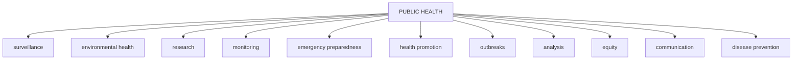

PUBLIC HEALTH BULLETIN-PAKISTAN

Vol. 3 | Week 31
15th Aug 2023

# Integrated Disease Surveillance & Response (IDSR) Report

Center of Disease Control

National Institute of Health, Islamabad

NIH Pakistan logo

Government of Pakistan logo

PAKISTAN

http://www.phb.nih.org.pk/

Integrated Disease Surveillance & Response (IDSR) Weekly Public Health Bulletin is your go-to resource for disease trends, outbreak alerts, and crucial public health information. By reading and sharing this bulletin, you can help increase awareness and promote preventive measures within your community. Together, let's build a safer, more resilient and healthier future for everyone.

# PROUD TO BE IN PUBLIC HEALTH

## Make a difference with your field work.
## Write for PHB-Pakistan and impact lives!

Public Health Bulletin Pakistan logo

Submit your achievements and field work
phb@nih.org

NIH logo

NIH logo

UK Health Security Agency logo

World Health Organization logo

USAID logo

safetynet logo

---

# Greetings
# Team PHB-Pakistan

Public Health Bulletin Pakistan logo

NIH logo

Government of Pakistan logo

*Overview*

*IDSR Reports*

*Ongoing Events*

*Field Reports*

## Preface

The Weekly Public Health Bulletin-Pakistan provides an overview of the most important public health events that occurred during week 31 of 2023. The most reported diseases during the week were Acute Diarrhea, Malaria, ILI, ALRI, B. Diarrhea, Typhoid, VH (B&C), SARI, AWD, AVH (A&E). • Four cases of CCHF reported from Balochistan need field verification. Overalll number of reported cases increased this week compared to the previous week. We need to remain vigilant and continue to monitor the situation.

The PHB team would like to express its sincere gratitude to all of the health workers who have contributed to the reporting of these cases. We would also like to remind the public to stay vigilant and to seek medical attention immediately if they experience any symptoms of these diseases.

This week's bulletin also includes an update on PHB activities, on field activities and surveillance reports on Measles cases of Karak and acute watery diarrhea cases of Malakand. Polio case response activities in district Rawalpindi and a knowledge review on acute flaccid Paralysis.

Stay well-informed about public health matters. Subscribe to the Weekly Bulletin today!

Sincerely,
The Chief Editor

NIH logo

UK Health Security Agency

World Health Organization logo

USAID logo

safetynet logo

---

# Overview

* During week 31, most frequent reported cases were of Acute Diarrhea (Non-Cholera) followed by Malaria, ILI, ALRI <5 years, B. Diarrhea, VH (B&D), Typhoid, SARI, dog bite and Mumps.

* Four cases of CCHF reported from Balochistan need field verification.

* There is overall an increase in cases of Malaria, ILI and SARI. Field investigation required to verify cases.

\* All are suspected cases and need field verification.

# IDSR compliance attributes

* *The national compliance rate for IDSR reporting in 125 implemented districts is 77%*

* *AJK and Sindh province are the top reporting region with a compliance rate of above 92% and 78% followed by Khyber Pakhtunkhwa with 75% and ICT 74%*

* *The lowest compliance rate was observed in Gilgit Baltistan.*

<table>
  <thead>
    <tr>
        <th>Region</th>
        <th>Expected Reports</th>
        <th>Received Reports</th>
        <th>Compliance (%)</th>
    </tr>
  </thead>
  <tbody>
    <tr>
        <td>Khyber Pakhtunkhwa</td>
<td>1612</td>
<td>1202</td>
<td>75</td>
    </tr>
<tr>
        <td>Azad Jammu Kashmir</td>
<td>341</td>
<td>266</td>
<td>78</td>
    </tr>
<tr>
        <td>Islamabad Capital Territory</td>
<td>27</td>
<td>20</td>
<td>74</td>
    </tr>
<tr>
        <td>Balochistan</td>
<td>1109</td>
<td>657</td>
<td>59</td>
    </tr>
<tr>
        <td>Gilgit Baltistan</td>
<td>110</td>
<td>35</td>
<td>32</td>
    </tr>
<tr>
        <td>Sindh</td>
<td>1854</td>
<td>1709</td>
<td>92</td>
    </tr>
<tr>
        <td><strong>National</strong></td>
<td><strong>5053</strong></td>
<td><strong>3889</strong></td>
<td><strong>77</strong></td>
    </tr>
  </tbody>
</table>

NIH logo

UK Health Security Agency logo

World Health Organization logo

USAID logo

safetynet logo

---

Pakistan

Table 1: Province/Area wise distribution of most frequently reported cases during week 31, Pakistan.

<table>
    <thead>
    <tr>
        <th>Diseases</th>
        <th>AJK</th>
        <th>Balochistan</th>
        <th>GB</th>
        <th>ICT</th>
        <th>KP</th>
        <th>Punjab</th>
        <th>Sindh</th>
        <th>Total</th>
    </tr>
    </thead>
    <tr>
        <td>AD (Non-Cholera)</td>
<td>1,600</td>
<td>6,402</td>
<td>192</td>
<td>227</td>
<td>32,107</td>
<td>108,618</td>
<td>47,960</td>
<td>197,106</td>
    </tr>
<tr>
        <td>Malaria</td>
<td>67</td>
<td>5,765</td>
<td>2</td>
<td>0</td>
<td>6,734</td>
<td>4,595</td>
<td>59,829</td>
<td>76,992</td>
    </tr>
<tr>
        <td>ILI</td>
<td>1639</td>
<td>3,560</td>
<td>21</td>
<td>359</td>
<td>4,055</td>
<td>289</td>
<td>14,055</td>
<td>23,978</td>
    </tr>
<tr>
        <td>ALRI &lt; 5 years</td>
<td>248</td>
<td>1704</td>
<td>69</td>
<td>1</td>
<td>865</td>
<td>NR</td>
<td>8,417</td>
<td>11,304</td>
    </tr>
<tr>
        <td>B. Diarrhea</td>
<td>44</td>
<td>1753</td>
<td>43</td>
<td>8</td>
<td>905</td>
<td>2,972</td>
<td>3579</td>
<td>9,304</td>
    </tr>
<tr>
        <td>VH (B, C & D)</td>
<td>0</td>
<td>123</td>
<td>0</td>
<td>0</td>
<td>188</td>
<td>NR</td>
<td>4359</td>
<td>4,670</td>
    </tr>
<tr>
        <td>Typhoid</td>
<td>18</td>
<td>657</td>
<td>36</td>
<td>0</td>
<td>776</td>
<td>5,648</td>
<td>1,585</td>
<td>8,720</td>
    </tr>
<tr>
        <td>SARI</td>
<td>263</td>
<td>723</td>
<td>36</td>
<td>0</td>
<td>1,561</td>
<td>NR</td>
<td>264</td>
<td>2,847</td>
    </tr>
<tr>
        <td>Dog Bite</td>
<td>47</td>
<td>67</td>
<td>0</td>
<td>0</td>
<td>191</td>
<td>NR</td>
<td>518</td>
<td>823</td>
    </tr>
<tr>
        <td>AWD (S. Cholera)</td>
<td>86</td>
<td>248</td>
<td>30</td>
<td>0</td>
<td>88</td>
<td>NR</td>
<td>111</td>
<td>563</td>
    </tr>
<tr>
        <td>Mumps</td>
<td>36</td>
<td>71</td>
<td>11</td>
<td>1</td>
<td>92</td>
<td>NR</td>
<td>335</td>
<td>546</td>
    </tr>
<tr>
        <td>AVH (A & E)</td>
<td>25</td>
<td>23</td>
<td>3</td>
<td>0</td>
<td>249</td>
<td>NR</td>
<td>91</td>
<td>391</td>
    </tr>
<tr>
        <td>CL</td>
<td>0</td>
<td>84</td>
<td>0</td>
<td>0</td>
<td>298</td>
<td>40</td>
<td>1</td>
<td>423</td>
    </tr>
<tr>
        <td>Measles</td>
<td>2</td>
<td>74</td>
<td>5</td>
<td>0</td>
<td>117</td>
<td>NR</td>
<td>25</td>
<td>223</td>
    </tr>
<tr>
        <td>Chickenpox/ Varicella</td>
<td>18</td>
<td>11</td>
<td>1</td>
<td>2</td>
<td>113</td>
<td>255</td>
<td>19</td>
<td>419</td>
    </tr>
<tr>
        <td>Gonorrhea</td>
<td>0</td>
<td>95</td>
<td>0</td>
<td>0</td>
<td>5</td>
<td>NR</td>
<td>36</td>
<td>136</td>
    </tr>
<tr>
        <td>Dengue</td>
<td>0</td>
<td>3</td>
<td>0</td>
<td>0</td>
<td>4</td>
<td>NR</td>
<td>95</td>
<td>102</td>
    </tr>
<tr>
        <td>Pertussis</td>
<td>14</td>
<td>56</td>
<td>1</td>
<td>0</td>
<td>4</td>
<td>NR</td>
<td>13</td>
<td>88</td>
    </tr>
<tr>
        <td>Meningitis</td>
<td>0</td>
<td>11</td>
<td>1</td>
<td>0</td>
<td>9</td>
<td>NR</td>
<td>13</td>
<td>34</td>
    </tr>
<tr>
        <td>AFP</td>
<td>0</td>
<td>4</td>
<td>0</td>
<td>0</td>
<td>20</td>
<td>NR</td>
<td>8</td>
<td>32</td>
    </tr>
<tr>
        <td>Brucellosis</td>
<td>0</td>
<td>7</td>
<td>2</td>
<td>0</td>
<td>8</td>
<td>NR</td>
<td>0</td>
<td>17</td>
    </tr>
<tr>
        <td>NT</td>
<td>0</td>
<td>1</td>
<td>0</td>
<td>0</td>
<td>13</td>
<td>NR</td>
<td>2</td>
<td>16</td>
    </tr>
<tr>
        <td>HIV/AIDS</td>
<td>1</td>
<td>0</td>
<td>0</td>
<td>0</td>
<td>8</td>
<td>NR</td>
<td>7</td>
<td>16</td>
    </tr>
<tr>
        <td>Syphilis</td>
<td>0</td>
<td>8</td>
<td>0</td>
<td>0</td>
<td>0</td>
<td>NR</td>
<td>6</td>
<td>14</td>
    </tr>
<tr>
        <td>Leprosy</td>
<td>0</td>
<td>5</td>
<td>0</td>
<td>0</td>
<td>0</td>
<td>NR</td>
<td>0</td>
<td>5</td>
    </tr>
<tr>
        <td>Anthrax</td>
<td>0</td>
<td>0</td>
<td>0</td>
<td>0</td>
<td>0</td>
<td>NR</td>
<td>0</td>
<td>0</td>
    </tr>
<tr>
        <td>CCHF</td>
<td>0</td>
<td>4</td>
<td>0</td>
<td>0</td>
<td>0</td>
<td>NR</td>
<td>0</td>
<td>4</td>
    </tr>
<tr>
        <td>VL</td>
<td>0</td>
<td>3</td>
<td>0</td>
<td>0</td>
<td>0</td>
<td>NR</td>
<td>0</td>
<td>3</td>
    </tr>
<tr>
        <td>Diphtheria (Probable)</td>
<td>0</td>
<td>3</td>
<td>0</td>
<td>0</td>
<td>0</td>
<td>NR</td>
<td>0</td>
<td>3</td>
    </tr>
<tr>
        <td>Chikungunya</td>
<td>0</td>
<td>0</td>
<td>1</td>
<td>0</td>
<td>0</td>
<td>NR</td>
<td>0</td>
<td>197,106</td>
    </tr>
</table>

Figure 1: Most frequently reported suspected cases during week 31, Pakistan

<table>
  <thead>
    <tr>
        <th>Disease</th>
        <th>WK 29</th>
        <th>WK 30</th>
        <th>WK 31</th>
    </tr>
  </thead>
  <tbody>
    <tr>
        <td>AD (Non-Cholera)</td>
<td>175000</td>
<td>150000</td>
<td>197106</td>
    </tr>
<tr>
        <td>Malaria</td>
<td>75000</td>
<td>58000</td>
<td>76992</td>
    </tr>
<tr>
        <td>ILI</td>
<td>24000</td>
<td>19000</td>
<td>23978</td>
    </tr>
<tr>
        <td>ALRI &lt; 5 years</td>
<td>12000</td>
<td>10000</td>
<td>11304</td>
    </tr>
<tr>
        <td>B. Diarrhea</td>
<td>9000</td>
<td>8000</td>
<td>9304</td>
    </tr>
<tr>
        <td>VH (B, C &amp; D)</td>
<td>4500</td>
<td>4000</td>
<td>4670</td>
    </tr>
<tr>
        <td>Typhoid</td>
<td>8500</td>
<td>7500</td>
<td>8720</td>
    </tr>
<tr>
        <td>SARI</td>
<td>2500</td>
<td>2000</td>
<td>2847</td>
    </tr>
<tr>
        <td>AVH (A &amp; E)</td>
<td>400</td>
<td>300</td>
<td>391</td>
    </tr>
<tr>
        <td>Dog Bite</td>
<td>800</td>
<td>700</td>
<td>823</td>
    </tr>
  </tbody>
</table>

NIH Pakistan logo

UK Health Security Agency logo

World Health Organization logo

USAID logo

safetynet logo

---

# Sindh

* Malaria cases were the most frequently reported followed by AD (Non-Cholera), ILI, ALRI<5 Years, VH (B, C), B. Diarrhea, Typhoid, dog bite, Mumps and SARI.

* Dog bite cases reported mostly from Sanghar district.

* Viral hepatitis (B<C) cases increased in numbers and reported from Sanghar , Mitiari, Ghotki and sanghar. All are suspected cases and need field investigation to verify cases for timely response and control of cases.

* Due to hot weather and rainy season, cases of water and food borne diseases have increased. Community awareness and public health intervention are required to prevent the spread of diseases.

Table 2: District wise distribution of most frequently reported suspected cases during week 31, Sindh

<table>
    <thead>
    <tr>
        <th>DISTRICTS</th>
        <th>Malaria</th>
        <th>AD (Non-
Cholera)</th>
        <th>ILI</th>
        <th>ALRI &lt; 5 
years</th>
        <th>B. 
Diarrhea</th>
        <th>Typhoid</th>
        <th>SARI</th>
        <th>Measles</th>
        <th>VH (B, C 
& D)</th>
        <th>Dengue</th>
        <th>Dog Bite</th>
    </tr>
    </thead>
    <tr>
        <td>Badin</td>
<td>5,997</td>
<td>4,727</td>
<td>354</td>
<td>673</td>
<td>340</td>
<td>129</td>
<td>1</td>
<td>0</td>
<td>275</td>
<td>0</td>
<td>46</td>
    </tr>
<tr>
        <td>Dadu</td>
<td>2,932</td>
<td>2,893</td>
<td>110</td>
<td>871</td>
<td>454</td>
<td>124</td>
<td>24</td>
<td>0</td>
<td>31</td>
<td>0</td>
<td>0</td>
    </tr>
<tr>
        <td>Ghotki</td>
<td>626</td>
<td>1,179</td>
<td>0</td>
<td>280</td>
<td>152</td>
<td>34</td>
<td>0</td>
<td>1</td>
<td>380</td>
<td>0</td>
<td>0</td>
    </tr>
<tr>
        <td>Hyderabad</td>
<td>302</td>
<td>2,139</td>
<td>302</td>
<td>49</td>
<td>12</td>
<td>22</td>
<td>0</td>
<td>1</td>
<td>46</td>
<td>0</td>
<td>0</td>
    </tr>
<tr>
        <td>Jacobabad</td>
<td>1,275</td>
<td>1,203</td>
<td>104</td>
<td>948</td>
<td>103</td>
<td>22</td>
<td>41</td>
<td>1</td>
<td>176</td>
<td>0</td>
<td>58</td>
    </tr>
<tr>
        <td>Jamshoro</td>
<td>881</td>
<td>1,052</td>
<td>0</td>
<td>124</td>
<td>48</td>
<td>57</td>
<td>3</td>
<td>8</td>
<td>371</td>
<td>0</td>
<td>40</td>
    </tr>
<tr>
        <td>Kamber</td>
<td>4,542</td>
<td>2,363</td>
<td>0</td>
<td>193</td>
<td>192</td>
<td>3</td>
<td>0</td>
<td>0</td>
<td>33</td>
<td>0</td>
<td>0</td>
    </tr>
<tr>
        <td>Karachi Central</td>
<td>145</td>
<td>1,150</td>
<td>1,294</td>
<td>32</td>
<td>56</td>
<td>224</td>
<td>0</td>
<td>0</td>
<td>128</td>
<td>2</td>
<td>0</td>
    </tr>
<tr>
        <td>Karachi East</td>
<td>92</td>
<td>313</td>
<td>27</td>
<td>0</td>
<td>6</td>
<td>0</td>
<td>0</td>
<td>0</td>
<td>20</td>
<td>20</td>
<td>2</td>
    </tr>
<tr>
        <td>Karachi Keamari</td>
<td>4</td>
<td>592</td>
<td>255</td>
<td>27</td>
<td>2</td>
<td>4</td>
<td>0</td>
<td>0</td>
<td>0</td>
<td>0</td>
<td>0</td>
    </tr>
<tr>
        <td>Karachi Korangi</td>
<td>58</td>
<td>448</td>
<td>0</td>
<td>0</td>
<td>4</td>
<td>2</td>
<td>0</td>
<td>0</td>
<td>0</td>
<td>6</td>
<td>0</td>
    </tr>
<tr>
        <td>Karachi Malir</td>
<td>115</td>
<td>1,285</td>
<td>1,241</td>
<td>340</td>
<td>30</td>
<td>20</td>
<td>72</td>
<td>1</td>
<td>36</td>
<td>4</td>
<td>10</td>
    </tr>
<tr>
        <td>Karachi South</td>
<td>32</td>
<td>107</td>
<td>0</td>
<td>0</td>
<td>1</td>
<td>1</td>
<td>0</td>
<td>0</td>
<td>0</td>
<td>0</td>
<td>0</td>
    </tr>
<tr>
        <td>Karachi West</td>
<td>115</td>
<td>796</td>
<td>505</td>
<td>243</td>
<td>41</td>
<td>38</td>
<td>43</td>
<td>4</td>
<td>24</td>
<td>4</td>
<td>36</td>
    </tr>
<tr>
        <td>Kashmore</td>
<td>1,624</td>
<td>635</td>
<td>290</td>
<td>177</td>
<td>80</td>
<td>12</td>
<td>0</td>
<td>0</td>
<td>88</td>
<td>0</td>
<td>0</td>
    </tr>
<tr>
        <td>Khairpur</td>
<td>3,197</td>
<td>2,815</td>
<td>407</td>
<td>650</td>
<td>298</td>
<td>232</td>
<td>25</td>
<td>0</td>
<td>160</td>
<td>0</td>
<td>24</td>
    </tr>
<tr>
        <td>Larkana</td>
<td>8,735</td>
<td>1,645</td>
<td>0</td>
<td>155</td>
<td>207</td>
<td>1</td>
<td>4</td>
<td>0</td>
<td>54</td>
<td>2</td>
<td>0</td>
    </tr>
<tr>
        <td>Matiari</td>
<td>1,144</td>
<td>2,546</td>
<td>748</td>
<td>481</td>
<td>118</td>
<td>19</td>
<td>0</td>
<td>0</td>
<td>439</td>
<td>4</td>
<td>15</td>
    </tr>
<tr>
        <td>Mirpurkhas</td>
<td>4,940</td>
<td>3,185</td>
<td>2,933</td>
<td>552</td>
<td>131</td>
<td>46</td>
<td>0</td>
<td>118</td>
<td>179</td>
<td>0</td>
<td>7</td>
    </tr>
<tr>
        <td>Naushero Feroze</td>
<td>1,630</td>
<td>1,629</td>
<td>392</td>
<td>119</td>
<td>103</td>
<td>88</td>
<td>0</td>
<td>0</td>
<td>110</td>
<td>0</td>
<td>43</td>
    </tr>
<tr>
        <td>Sanghar</td>
<td>1,632</td>
<td>2,251</td>
<td>61</td>
<td>378</td>
<td>141</td>
<td>64</td>
<td>20</td>
<td>2</td>
<td>744</td>
<td>0</td>
<td>171</td>
    </tr>
<tr>
        <td>Shaheed 
Benazirabad</td>
<td>1,678</td>
<td>2,488</td>
<td>20</td>
<td>461</td>
<td>101</td>
<td>261</td>
<td>3</td>
<td>0</td>
<td>153</td>
<td>0</td>
<td>5</td>
    </tr>
<tr>
        <td>Shikarpur</td>
<td>1,075</td>
<td>953</td>
<td>0</td>
<td>101</td>
<td>140</td>
<td>2</td>
<td>0</td>
<td>0</td>
<td>144</td>
<td>0</td>
<td>0</td>
    </tr>
<tr>
        <td>Sujawal</td>
<td>2,101</td>
<td>509</td>
<td>0</td>
<td>132</td>
<td>92</td>
<td>12</td>
<td>0</td>
<td>0</td>
<td>0</td>
<td>0</td>
<td>5</td>
    </tr>
<tr>
        <td>Sukkur</td>
<td>2,335</td>
<td>2,045</td>
<td>1,653</td>
<td>335</td>
<td>229</td>
<td>17</td>
<td>1</td>
<td>2</td>
<td>357</td>
<td>1</td>
<td>0</td>
    </tr>
<tr>
        <td>Tando Allahyar</td>
<td>1,081</td>
<td>1,097</td>
<td>207</td>
<td>144</td>
<td>81</td>
<td>19</td>
<td>0</td>
<td>0</td>
<td>85</td>
<td>0</td>
<td>9</td>
    </tr>
<tr>
        <td>Tando Muhammad 
Khan</td>
<td>593</td>
<td>921</td>
<td>33</td>
<td>107</td>
<td>49</td>
<td>29</td>
<td>0</td>
<td>0</td>
<td>51</td>
<td>0</td>
<td>13</td>
    </tr>
<tr>
        <td>Tharparkar</td>
<td>2,625</td>
<td>1,510</td>
<td>1,539</td>
<td>371</td>
<td>151</td>
<td>27</td>
<td>17</td>
<td>2</td>
<td>80</td>
<td>52</td>
<td>5</td>
    </tr>
<tr>
        <td>Thatta</td>
<td>4,188</td>
<td>1,761</td>
<td>1,580</td>
<td>247</td>
<td>151</td>
<td>28</td>
<td>5</td>
<td>0</td>
<td>90</td>
<td>0</td>
<td>29</td>
    </tr>
<tr>
        <td>Umerkot</td>
<td>4,135</td>
<td>1,723</td>
<td>0</td>
<td>227</td>
<td>66</td>
<td>48</td>
<td>5</td>
<td>1</td>
<td>105</td>
<td>0</td>
<td>0</td>
    </tr>
<tr>
        <td>Total</td>
<td>59,829</td>
<td>47,960</td>
<td>14,055</td>
<td>8,417</td>
<td>3,579</td>
<td>1,585</td>
<td>264</td>
<td>141</td>
<td>4,359</td>
<td>95</td>
<td>518</td>
    </tr>
</table>

Figure 2: Most frequently reported suspected cases during week 31, Sindh

<table>
  <thead>
    <tr>
        <th>Disease</th>
        <th>WK 29</th>
        <th>WK 30</th>
        <th>WK 31</th>
    </tr>
  </thead>
  <tbody>
    <tr>
        <td>Malaria</td>
<td>61,000</td>
<td>47,000</td>
<td>59,829</td>
    </tr>
<tr>
        <td>AD (Non-Cholera)</td>
<td>47,000</td>
<td>38,000</td>
<td>47,960</td>
    </tr>
<tr>
        <td>ILI</td>
<td>14,000</td>
<td>10,000</td>
<td>14,055</td>
    </tr>
<tr>
        <td>ALRI &lt; 5 years</td>
<td>8,000</td>
<td>7,500</td>
<td>8,417</td>
    </tr>
<tr>
        <td>VH (B, C &amp; D)</td>
<td>4,000</td>
<td>3,500</td>
<td>4,359</td>
    </tr>
<tr>
        <td>B. Diarrhea</td>
<td>3,000</td>
<td>3,000</td>
<td>3,579</td>
    </tr>
<tr>
        <td>Typhoid</td>
<td>1,500</td>
<td>1,500</td>
<td>1,585</td>
    </tr>
<tr>
        <td>Dog Bite</td>
<td>500</td>
<td>500</td>
<td>518</td>
    </tr>
<tr>
        <td>Mumps</td>
<td>300</td>
<td>300</td>
<td>335</td>
    </tr>
<tr>
        <td>SARI</td>
<td>250</td>
<td>250</td>
<td>264</td>
    </tr>
  </tbody>
</table>

NIH logo

UK Health Security Agency logo

World Health Organization logo

USAID logo

safetynet logo

---

# Balochistan
* AD (Non-Cholera), Malaria, ILI, B. Diarrhea, ALRI <5 years, SARI, Typhoid, AWD (S. Cholera), VH (A&E) and Gonorrhea were the most frequently reported diseases from Balochistan province.
* An upward trend seen for ILI, AD cases whereas Malaria cases declined this week.
* AWD (Susp. Cholera ) cases reported from Killa Saifullah and Mastung. These are suspected cases however field investigation required to verify cases. Similarly cases of B. Diarrhea and AD (Non Cholera ) reported from Harnai, Killah Saifullah, Quetta and Punjgur districts. Due to current heavy rains and hot weather, cases are reported in high numbers and demand early public health intervention by concerned departments.

**Table 3: District wise distribution of most frequently reported suspected cases during week 31, Balochistan**

<table>
    <thead>
    <tr>
        <th>Districts</th>
        <th>Malaria</th>
        <th>AD (Non-
Cholera)</th>
        <th>ILI</th>
        <th>B. 
Diarrhea</th>
        <th>ALRI &lt; 5 
Years</th>
        <th>Typhoid</th>
        <th>SARI</th>
        <th>CL</th>
        <th>Dog Bite</th>
        <th>AWD (S. 
Cholera)</th>
    </tr>
    </thead>
    <tr>
        <td>Awaran</td>
<td>230</td>
<td>45</td>
<td>7</td>
<td>18</td>
<td>19</td>
<td>13</td>
<td>8</td>
<td>2</td>
<td>0</td>
<td>9</td>
    </tr>
<tr>
        <td>Chagai</td>
<td>22</td>
<td>172</td>
<td>241</td>
<td>48</td>
<td>0</td>
<td>37</td>
<td>1</td>
<td>4</td>
<td>2</td>
<td>15</td>
    </tr>
<tr>
        <td>Dera Bugti</td>
<td>295</td>
<td>59</td>
<td>28</td>
<td>57</td>
<td>31</td>
<td>13</td>
<td>27</td>
<td>1</td>
<td>0</td>
<td>9</td>
    </tr>
<tr>
        <td>Duki</td>
<td>77</td>
<td>65</td>
<td>22</td>
<td>30</td>
<td>7</td>
<td>4</td>
<td>3</td>
<td>2</td>
<td>0</td>
<td>12</td>
    </tr>
<tr>
        <td>Gwadar</td>
<td>113</td>
<td>246</td>
<td>477</td>
<td>52</td>
<td>20</td>
<td>38</td>
<td>2</td>
<td>NR</td>
<td>NR</td>
<td>NR</td>
    </tr>
<tr>
        <td>Harnai</td>
<td>74</td>
<td>220</td>
<td>7</td>
<td>241</td>
<td>247</td>
<td>4</td>
<td>5</td>
<td>1</td>
<td>2</td>
<td>17</td>
    </tr>
<tr>
        <td>Hub</td>
<td>249</td>
<td>339</td>
<td>60</td>
<td>67</td>
<td>50</td>
<td>9</td>
<td>151</td>
<td>1</td>
<td>3</td>
<td>0</td>
    </tr>
<tr>
        <td>Jaffarabad</td>
<td>705</td>
<td>669</td>
<td>101</td>
<td>94</td>
<td>21</td>
<td>57</td>
<td>8</td>
<td>0</td>
<td>2</td>
<td>0</td>
    </tr>
<tr>
        <td>Jhal Magsi</td>
<td>372</td>
<td>282</td>
<td>0</td>
<td>7</td>
<td>43</td>
<td>32</td>
<td>0</td>
<td>0</td>
<td>22</td>
<td>49</td>
    </tr>
<tr>
        <td>Kachhi (Bolan)</td>
<td>103</td>
<td>106</td>
<td>33</td>
<td>16</td>
<td>1</td>
<td>34</td>
<td>0</td>
<td>0</td>
<td>0</td>
<td>4</td>
    </tr>
<tr>
        <td>Kalat</td>
<td>35</td>
<td>44</td>
<td>13</td>
<td>10</td>
<td>16</td>
<td>4</td>
<td>0</td>
<td>0</td>
<td>0</td>
<td>0</td>
    </tr>
<tr>
        <td>Kech (Turbat)</td>
<td>265</td>
<td>361</td>
<td>517</td>
<td>59</td>
<td>74</td>
<td>1</td>
<td>1</td>
<td>0</td>
<td>0</td>
<td>0</td>
    </tr>
<tr>
        <td>Khuzdar</td>
<td>106</td>
<td>66</td>
<td>52</td>
<td>42</td>
<td>5</td>
<td>20</td>
<td>4</td>
<td>0</td>
<td>0</td>
<td>1</td>
    </tr>
<tr>
        <td>Killa Saifullah</td>
<td>287</td>
<td>268</td>
<td>0</td>
<td>135</td>
<td>147</td>
<td>29</td>
<td>83</td>
<td>4</td>
<td>0</td>
<td>29</td>
    </tr>
<tr>
        <td>Kohlu</td>
<td>96</td>
<td>59</td>
<td>112</td>
<td>70</td>
<td>8</td>
<td>23</td>
<td>30</td>
<td>0</td>
<td>0</td>
<td>0</td>
    </tr>
<tr>
        <td>Lasbella</td>
<td>607</td>
<td>590</td>
<td>97</td>
<td>55</td>
<td>427</td>
<td>8</td>
<td>45</td>
<td>0</td>
<td>7</td>
<td>0</td>
    </tr>
<tr>
        <td>Loralai</td>
<td>22</td>
<td>62</td>
<td>75</td>
<td>14</td>
<td>4</td>
<td>7</td>
<td>16</td>
<td>0</td>
<td>0</td>
<td>0</td>
    </tr>
<tr>
        <td>Mastung</td>
<td>137</td>
<td>456</td>
<td>95</td>
<td>74</td>
<td>21</td>
<td>71</td>
<td>48</td>
<td>9</td>
<td>25</td>
<td>23</td>
    </tr>
<tr>
        <td>Naseerabad</td>
<td>389</td>
<td>147</td>
<td>0</td>
<td>7</td>
<td>5</td>
<td>27</td>
<td>0</td>
<td>0</td>
<td>0</td>
<td>3</td>
    </tr>
<tr>
        <td>Nushki</td>
<td>59</td>
<td>192</td>
<td>2</td>
<td>75</td>
<td>0</td>
<td>0</td>
<td>2</td>
<td>0</td>
<td>0</td>
<td>19</td>
    </tr>
<tr>
        <td>Panjgur</td>
<td>382</td>
<td>299</td>
<td>124</td>
<td>157</td>
<td>112</td>
<td>45</td>
<td>26</td>
<td>6</td>
<td>0</td>
<td>19</td>
    </tr>
<tr>
        <td>Pishin</td>
<td>24</td>
<td>127</td>
<td>99</td>
<td>49</td>
<td>18</td>
<td>23</td>
<td>0</td>
<td>19</td>
<td>0</td>
<td>2</td>
    </tr>
<tr>
        <td>Quetta</td>
<td>39</td>
<td>466</td>
<td>765</td>
<td>154</td>
<td>41</td>
<td>46</td>
<td>61</td>
<td>26</td>
<td>0</td>
<td>1</td>
    </tr>
<tr>
        <td>Sherani</td>
<td>2</td>
<td>9</td>
<td>17</td>
<td>6</td>
<td>0</td>
<td>0</td>
<td>3</td>
<td>0</td>
<td>0</td>
<td>0</td>
    </tr>
<tr>
        <td>Sibi</td>
<td>230</td>
<td>197</td>
<td>132</td>
<td>22</td>
<td>28</td>
<td>25</td>
<td>30</td>
<td>3</td>
<td>0</td>
<td>3</td>
    </tr>
<tr>
        <td>Sohbat pur</td>
<td>443</td>
<td>356</td>
<td>2</td>
<td>59</td>
<td>94</td>
<td>48</td>
<td>105</td>
<td>4</td>
<td>0</td>
<td>3</td>
    </tr>
<tr>
        <td>SURAB</td>
<td>7</td>
<td>4</td>
<td>0</td>
<td>0</td>
<td>0</td>
<td>0</td>
<td>0</td>
<td>0</td>
<td>0</td>
<td>0</td>
    </tr>
<tr>
        <td>Washuk</td>
<td>193</td>
<td>223</td>
<td>295</td>
<td>59</td>
<td>6</td>
<td>15</td>
<td>25</td>
<td>2</td>
<td>0</td>
<td>0</td>
    </tr>
<tr>
        <td>Zhob</td>
<td>153</td>
<td>161</td>
<td>100</td>
<td>54</td>
<td>227</td>
<td>17</td>
<td>36</td>
<td>0</td>
<td>4</td>
<td>18</td>
    </tr>
<tr>
        <td>Ziarat</td>
<td>49</td>
<td>112</td>
<td>87</td>
<td>22</td>
<td>32</td>
<td>7</td>
<td>3</td>
<td>0</td>
<td>0</td>
<td>12</td>
    </tr>
<tr>
        <td>Total</td>
<td>5,765</td>
<td>6,402</td>
<td>3,560</td>
<td>1,753</td>
<td>1,704</td>
<td>657</td>
<td>723</td>
<td>84</td>
<td>67</td>
<td>248</td>
    </tr>
</table>

**Figure 3: Most frequently reported suspected cases during week 31, Balochistan**

<table>
  <thead>
    <tr>
        <th>Disease</th>
        <th>WK 29</th>
        <th>WK 30</th>
        <th>WK 31</th>
    </tr>
  </thead>
  <tbody>
    <tr>
        <td>AD (Non-Cholera)</td>
<td>7800</td>
<td>6300</td>
<td>6402</td>
    </tr>
<tr>
        <td>Malaria</td>
<td>8800</td>
<td>6400</td>
<td>5765</td>
    </tr>
<tr>
        <td>ILI</td>
<td>3900</td>
<td>2800</td>
<td>3560</td>
    </tr>
<tr>
        <td>B. Diarrhea</td>
<td>2300</td>
<td>1800</td>
<td>1753</td>
    </tr>
<tr>
        <td>ALRI &lt; 5 years</td>
<td>2600</td>
<td>1600</td>
<td>1704</td>
    </tr>
<tr>
        <td>SARI</td>
<td>1000</td>
<td>850</td>
<td>723</td>
    </tr>
<tr>
        <td>Typhoid</td>
<td>1400</td>
<td>1000</td>
<td>657</td>
    </tr>
<tr>
        <td>AWD (S. Cholera)</td>
<td>350</td>
<td>300</td>
<td>248</td>
    </tr>
<tr>
        <td>VH (B, C &amp; D)</td>
<td>250</td>
<td>150</td>
<td>123</td>
    </tr>
<tr>
        <td>Gonorrhea</td>
<td>150</td>
<td>100</td>
<td>95</td>
    </tr>
  </tbody>
</table>

NIH logo

UK Health Security Agency logo

World Health Organization logo

USAID logo

safetynet logo

---

# Khyber Pakhtunkhwa

* The most frequent cases reported were AD (Non-Cholera) followed by Malaria, ILI, SARI, B. Diarrhea, ALRI<5 Years, Typhoid, CL, AVH (A&E) and dog bite.
* AD (Non Cholera) cases showed a sharp rise this week.
* Swat, Dir Lower and Nowshera reported increased cases of AD (Non Cholera) cases. These are suspected cases and a field investigation is required to verify cases.
* Cases of ALRI<5 years reported from Swabi and Haripur. Case verification is required to initiate response activities.

Table 4: District wise distribution of most frequently reported suspected cases during week 31, KP

<table>
  <thead>
    <tr>
        <th>Diseases</th>
        <th>AD (Non-Cholera)</th>
        <th>Malaria</th>
        <th>ILI</th>
        <th>SARI</th>
        <th>ALRI &lt; 5 years</th>
        <th>B. Diarrhea</th>
        <th>Typhoid</th>
        <th>Dog Bite</th>
        <th>AWD (S. Cholera)</th>
        <th>AVH (A &amp; E)</th>
    </tr>
  </thead>
  <tbody>
    <tr>
        <td>Abbottabad</td>
<td>843</td>
<td>3</td>
<td>5</td>
<td>7</td>
<td>8</td>
<td>2</td>
<td>19</td>
<td>0</td>
<td>2</td>
<td>0</td>
    </tr>
<tr>
        <td>Bajaur</td>
<td>312</td>
<td>167</td>
<td>44</td>
<td>2</td>
<td>6</td>
<td>44</td>
<td>3</td>
<td>0</td>
<td>11</td>
<td>0</td>
    </tr>
<tr>
        <td>Bannu</td>
<td>689</td>
<td>889</td>
<td>67</td>
<td>0</td>
<td>3</td>
<td>6</td>
<td>43</td>
<td>0</td>
<td>0</td>
<td>0</td>
    </tr>
<tr>
        <td>Buner</td>
<td>712</td>
<td>568</td>
<td>0</td>
<td>0</td>
<td>33</td>
<td>14</td>
<td>11</td>
<td>28</td>
<td>0</td>
<td>0</td>
    </tr>
<tr>
        <td>Charsadda</td>
<td>1,313</td>
<td>60</td>
<td>120</td>
<td>2</td>
<td>0</td>
<td>0</td>
<td>0</td>
<td>0</td>
<td>0</td>
<td>0</td>
    </tr>
<tr>
        <td>Chitral Lower</td>
<td>887</td>
<td>22</td>
<td>55</td>
<td>555</td>
<td>0</td>
<td>0</td>
<td>3</td>
<td>0</td>
<td>0</td>
<td>0</td>
    </tr>
<tr>
        <td>Chitral Upper</td>
<td>115</td>
<td>5</td>
<td>0</td>
<td>161</td>
<td>0</td>
<td>0</td>
<td>34</td>
<td>0</td>
<td>0</td>
<td>0</td>
    </tr>
<tr>
        <td>D.I. Khan</td>
<td>1,033</td>
<td>598</td>
<td>19</td>
<td>70</td>
<td>11</td>
<td>7</td>
<td>10</td>
<td>5</td>
<td>0</td>
<td>0</td>
    </tr>
<tr>
        <td>Dir Lower</td>
<td>2,649</td>
<td>789</td>
<td>0</td>
<td>0</td>
<td>98</td>
<td>153</td>
<td>44</td>
<td>14</td>
<td>1</td>
<td>59</td>
    </tr>
<tr>
        <td>Dir Upper</td>
<td>1,382</td>
<td>5</td>
<td>36</td>
<td>0</td>
<td>52</td>
<td>55</td>
<td>29</td>
<td>0</td>
<td>20</td>
<td>4</td>
    </tr>
<tr>
        <td>Hangu</td>
<td>497</td>
<td>376</td>
<td>461</td>
<td>138</td>
<td>10</td>
<td>27</td>
<td>18</td>
<td>26</td>
<td>0</td>
<td>7</td>
    </tr>
<tr>
        <td>Haripur</td>
<td>1,316</td>
<td>31</td>
<td>58</td>
<td>6</td>
<td>91</td>
<td>1</td>
<td>13</td>
<td>0</td>
<td>0</td>
<td>33</td>
    </tr>
<tr>
        <td>Karak</td>
<td>257</td>
<td>111</td>
<td>44</td>
<td>19</td>
<td>10</td>
<td>0</td>
<td>9</td>
<td>25</td>
<td>2</td>
<td>0</td>
    </tr>
<tr>
        <td>Khyber</td>
<td>10</td>
<td>68</td>
<td>95</td>
<td>2</td>
<td>1</td>
<td>6</td>
<td>5</td>
<td>0</td>
<td>1</td>
<td>3</td>
    </tr>
<tr>
        <td>Kohat</td>
<td>75</td>
<td>41</td>
<td>3</td>
<td>1</td>
<td>2</td>
<td>0</td>
<td>1</td>
<td>3</td>
<td>0</td>
<td>0</td>
    </tr>
<tr>
        <td>Kohistan Lower</td>
<td>200</td>
<td>2</td>
<td>0</td>
<td>286</td>
<td>3</td>
<td>48</td>
<td>0</td>
<td>0</td>
<td>0</td>
<td>0</td>
    </tr>
<tr>
        <td>Kohistan Upper</td>
<td>551</td>
<td>0</td>
<td>45</td>
<td>26</td>
<td>3</td>
<td>12</td>
<td>65</td>
<td>0</td>
<td>0</td>
<td>0</td>
    </tr>
<tr>
        <td>Kolai Palas</td>
<td>96</td>
<td>0</td>
<td>0</td>
<td>5</td>
<td>0</td>
<td>1</td>
<td>0</td>
<td>0</td>
<td>0</td>
<td>0</td>
    </tr>
<tr>
        <td>L &amp; C Kurram</td>
<td>47</td>
<td>30</td>
<td>55</td>
<td>0</td>
<td>0</td>
<td>10</td>
<td>6</td>
<td>0</td>
<td>0</td>
<td>0</td>
    </tr>
<tr>
        <td>Lakki Marwat</td>
<td>558</td>
<td>1,327</td>
<td>0</td>
<td>0</td>
<td>22</td>
<td>9</td>
<td>27</td>
<td>0</td>
<td>0</td>
<td>0</td>
    </tr>
<tr>
        <td>Malakand</td>
<td>969</td>
<td>8</td>
<td> </td>
<td> </td>
<td>13</td>
<td>89</td>
<td>5</td>
<td> </td>
<td>25</td>
<td>18</td>
    </tr>
<tr>
        <td>Mansehra</td>
<td>996</td>
<td>90</td>
<td>433</td>
<td>76</td>
<td>45</td>
<td>46</td>
<td>25</td>
<td>2</td>
<td>5</td>
<td>13</td>
    </tr>
<tr>
        <td>Mardan</td>
<td>1,666</td>
<td>19</td>
<td>666</td>
<td>80</td>
<td>76</td>
<td>35</td>
<td>0</td>
<td>0</td>
<td>4</td>
<td>20</td>
    </tr>
<tr>
        <td>Nowshera</td>
<td>2,952</td>
<td>142</td>
<td>30</td>
<td>26</td>
<td>4</td>
<td>37</td>
<td>26</td>
<td>0</td>
<td>0</td>
<td>17</td>
    </tr>
<tr>
        <td>Peshawar</td>
<td>3,169</td>
<td>135</td>
<td>1,128</td>
<td>44</td>
<td>84</td>
<td>136</td>
<td>116</td>
<td>5</td>
<td>1</td>
<td>30</td>
    </tr>
<tr>
        <td>Shangla</td>
<td>650</td>
<td>446</td>
<td>0</td>
<td>22</td>
<td>11</td>
<td>0</td>
<td>48</td>
<td>74</td>
<td>16</td>
<td>3</td>
    </tr>
<tr>
        <td>Swabi</td>
<td>1,524</td>
<td>37</td>
<td>495</td>
<td>8</td>
<td>139</td>
<td>17</td>
<td>23</td>
<td>2</td>
<td>0</td>
<td>30</td>
    </tr>
<tr>
        <td>Swat</td>
<td>5,914</td>
<td>76</td>
<td>196</td>
<td>0</td>
<td>70</td>
<td>101</td>
<td>123</td>
<td>7</td>
<td>0</td>
<td>12</td>
    </tr>
<tr>
        <td>Tank</td>
<td>573</td>
<td>545</td>
<td>0</td>
<td>0</td>
<td>64</td>
<td>0</td>
<td>58</td>
<td>0</td>
<td>0</td>
<td>0</td>
    </tr>
<tr>
        <td>Tor Ghar</td>
<td>152</td>
<td>144</td>
<td>0</td>
<td>25</td>
<td>6</td>
<td>49</td>
<td>12</td>
<td>0</td>
<td>0</td>
<td>0</td>
    </tr>
<tr>
        <td>Total</td>
<td>32,107</td>
<td>6,734</td>
<td>4,055</td>
<td>1,561</td>
<td>865</td>
<td>905</td>
<td>776</td>
<td>191</td>
<td>88</td>
<td>249</td>
    </tr>
  </tbody>
</table>

Figure 4: Most frequently reported suspected cases during week 31, KP

<table>
  <thead>
    <tr>
        <th>Week</th>
        <th>AD (Non-Cholera)</th>
        <th>Malaria</th>
        <th>ILI</th>
        <th>SARI</th>
        <th>B. Diarrhea</th>
        <th>ALRI &lt; 5 years</th>
        <th>Typhoid</th>
        <th>CL</th>
        <th>AVH (A &amp; E)</th>
        <th>Dog Bite</th>
    </tr>
  </thead>
  <tbody>
    <tr>
        <td>WK 31</td>
<td>32,107</td>
<td>6,734</td>
<td>4,055</td>
<td>1,561</td>
<td>905</td>
<td>865</td>
<td>776</td>
<td>298</td>
<td>249</td>
<td>191</td>
    </tr>
  </tbody>
</table>

NIH logo

UK Health Security Agency logo

World Health Organization logo

USAID logo

safetynet logo

---

# ICT, AJK & GB

**ICT**: The most frequently reported cases were ILI followed by AD (Non-Cholera). ILI cases showed a downward trend in cases this week..
**AJK**: ILI were the most frequently reported cases followed by AD (Non-Cholera), SARI, ALRI <5 years, dog bite, Malaria, B. Diarrhea, Mumps, AWD (S. Cholera), and AVH (A&E). Both ILI and AD (Non- Cholera) cases showed a downward trend in cases this week. There is an overall decline in all reported disease cases this week.
**GB**: AD (Non. Cholera) cases were most frequent reported cases followed by ALRI<5 years,B. Diarrhea, Typhoid, AWD (susp. Cholera). AD cases as compared to last week showed a sharp decline trend this week..

Figure 6: Week wise reported suspected cases of ILI, ICT

<table>
  <thead>
    <tr>
        <th>Disease</th>
        <th>WK29</th>
        <th>WK30</th>
        <th>WK31</th>
    </tr>
  </thead>
  <tbody>
    <tr>
        <td>ILI</td>
<td>390</td>
<td>650</td>
<td>359</td>
    </tr>
<tr>
        <td>AD (Non-Cholera)</td>
<td>190</td>
<td>340</td>
<td>227</td>
    </tr>
  </tbody>
</table>

Figure 6: Week wise reported suspected cases of ILI, ICT

<table>
  <thead>
    <tr>
        <th>Week</th>
        <th>ILI Cases</th>
    </tr>
  </thead>
  <tbody>
    <tr>
        <td>W32</td>
<td>1250</td>
    </tr>
<tr>
        <td>W33</td>
<td>1200</td>
    </tr>
<tr>
        <td>W34</td>
<td>400</td>
    </tr>
<tr>
        <td>W35</td>
<td>1450</td>
    </tr>
<tr>
        <td>W36</td>
<td>150</td>
    </tr>
<tr>
        <td>W37</td>
<td>100</td>
    </tr>
<tr>
        <td>W38</td>
<td>1200</td>
    </tr>
<tr>
        <td>W39</td>
<td>1000</td>
    </tr>
<tr>
        <td>W40</td>
<td>2150</td>
    </tr>
<tr>
        <td>W41</td>
<td>2300</td>
    </tr>
<tr>
        <td>W42</td>
<td>2650</td>
    </tr>
<tr>
        <td>W43</td>
<td>2600</td>
    </tr>
<tr>
        <td>W44</td>
<td>1850</td>
    </tr>
<tr>
        <td>W45</td>
<td>1700</td>
    </tr>
<tr>
        <td>W46</td>
<td>1550</td>
    </tr>
<tr>
        <td>W47</td>
<td>2450</td>
    </tr>
<tr>
        <td>W48</td>
<td>2350</td>
    </tr>
<tr>
        <td>W49</td>
<td>2550</td>
    </tr>
<tr>
        <td>W50</td>
<td>3200</td>
    </tr>
<tr>
        <td>W51</td>
<td>2450</td>
    </tr>
<tr>
        <td>W52</td>
<td>2200</td>
    </tr>
<tr>
        <td>W1</td>
<td>2000</td>
    </tr>
<tr>
        <td>W2</td>
<td>1650</td>
    </tr>
<tr>
        <td>W3</td>
<td>2000</td>
    </tr>
<tr>
        <td>W4</td>
<td>1900</td>
    </tr>
<tr>
        <td>W5</td>
<td>1850</td>
    </tr>
<tr>
        <td>W6</td>
<td>1550</td>
    </tr>
<tr>
        <td>W7</td>
<td>2350</td>
    </tr>
<tr>
        <td>W8</td>
<td>1600</td>
    </tr>
<tr>
        <td>W9</td>
<td>2250</td>
    </tr>
<tr>
        <td>W10</td>
<td>2100</td>
    </tr>
<tr>
        <td>W11</td>
<td>1650</td>
    </tr>
<tr>
        <td>W12</td>
<td>700</td>
    </tr>
<tr>
        <td>W13</td>
<td>1450</td>
    </tr>
<tr>
        <td>W14</td>
<td>1350</td>
    </tr>
<tr>
        <td>W15</td>
<td>1100</td>
    </tr>
<tr>
        <td>W16</td>
<td>700</td>
    </tr>
<tr>
        <td>W17</td>
<td>1100</td>
    </tr>
<tr>
        <td>W18</td>
<td>950</td>
    </tr>
<tr>
        <td>W19</td>
<td>1500</td>
    </tr>
<tr>
        <td>W20</td>
<td>750</td>
    </tr>
<tr>
        <td>W21</td>
<td>1150</td>
    </tr>
<tr>
        <td>W22</td>
<td>1150</td>
    </tr>
<tr>
        <td>W23</td>
<td>700</td>
    </tr>
<tr>
        <td>W24</td>
<td>1050</td>
    </tr>
<tr>
        <td>W25</td>
<td>850</td>
    </tr>
<tr>
        <td>W26</td>
<td>200</td>
    </tr>
<tr>
        <td>W27</td>
<td>650</td>
    </tr>
<tr>
        <td>W28</td>
<td>900</td>
    </tr>
<tr>
        <td>W29</td>
<td>400</td>
    </tr>
<tr>
        <td>W30</td>
<td>650</td>
    </tr>
<tr>
        <td>W31</td>
<td>350</td>
    </tr>
  </tbody>
</table>

Figure 7: Most frequently reported suspected cases during week 31, AJK

<table>
  <thead>
    <tr>
        <th>Disease</th>
        <th>WK 29</th>
        <th>WK 30</th>
        <th>WK 31</th>
    </tr>
  </thead>
  <tbody>
    <tr>
        <td>ILI</td>
<td>2350</td>
<td>2150</td>
<td>1639</td>
    </tr>
<tr>
        <td>AD (Non-Cholera)</td>
<td>2800</td>
<td>2450</td>
<td>1600</td>
    </tr>
<tr>
        <td>SARI</td>
<td>380</td>
<td>320</td>
<td>263</td>
    </tr>
<tr>
        <td>ALRI &lt; 5 years</td>
<td>800</td>
<td>550</td>
<td>248</td>
    </tr>
<tr>
        <td>Dog Bite</td>
<td>150</td>
<td>120</td>
<td>47</td>
    </tr>
<tr>
        <td>Malaria</td>
<td>120</td>
<td>110</td>
<td>67</td>
    </tr>
<tr>
        <td>B. Diarrhea</td>
<td>150</td>
<td>140</td>
<td>44</td>
    </tr>
<tr>
        <td>Mumps</td>
<td>130</td>
<td>120</td>
<td>34</td>
    </tr>
<tr>
        <td>AWD (S. Cholera)</td>
<td>80</td>
<td>110</td>
<td>86</td>
    </tr>
<tr>
        <td>AVH (A &amp; E)</td>
<td>50</td>
<td>40</td>
<td>25</td>
    </tr>
  </tbody>
</table>

NIH logo

UK Health Security Agency logo

World Health Organization logo

USAID logo

safetynet logo

---

Figure 8: Week wise reported suspected cases of AD (Non-Cholera) and ILI, AJK

<table>
  <thead>
    <tr>
        <th>Week</th>
        <th>ILI</th>
        <th>AD (Non-Cholera)</th>
    </tr>
  </thead>
  <tbody>
    <tr>
        <td>W32</td>
<td>100</td>
<td>150</td>
    </tr>
<tr>
        <td>W33</td>
<td>100</td>
<td>150</td>
    </tr>
<tr>
        <td>W34</td>
<td>100</td>
<td>180</td>
    </tr>
<tr>
        <td>W35</td>
<td>120</td>
<td>180</td>
    </tr>
<tr>
        <td>W36</td>
<td>100</td>
<td>180</td>
    </tr>
<tr>
        <td>W37</td>
<td>100</td>
<td>180</td>
    </tr>
<tr>
        <td>W38</td>
<td>100</td>
<td>150</td>
    </tr>
<tr>
        <td>W39</td>
<td>150</td>
<td>200</td>
    </tr>
<tr>
        <td>W40</td>
<td>250</td>
<td>250</td>
    </tr>
<tr>
        <td>W41</td>
<td>650</td>
<td>450</td>
    </tr>
<tr>
        <td>W42</td>
<td>800</td>
<td>380</td>
    </tr>
<tr>
        <td>W43</td>
<td>820</td>
<td>420</td>
    </tr>
<tr>
        <td>W44</td>
<td>980</td>
<td>450</td>
    </tr>
<tr>
        <td>W45</td>
<td>1020</td>
<td>450</td>
    </tr>
<tr>
        <td>W46</td>
<td>1050</td>
<td>280</td>
    </tr>
<tr>
        <td>W47</td>
<td>1700</td>
<td>450</td>
    </tr>
<tr>
        <td>W48</td>
<td>1400</td>
<td>300</td>
    </tr>
<tr>
        <td>W49</td>
<td>1250</td>
<td>350</td>
    </tr>
<tr>
        <td>W50</td>
<td>1800</td>
<td>400</td>
    </tr>
<tr>
        <td>W51</td>
<td>2600</td>
<td>600</td>
    </tr>
<tr>
        <td>W52</td>
<td>2200</td>
<td>620</td>
    </tr>
<tr>
        <td>W1</td>
<td>2250</td>
<td>780</td>
    </tr>
<tr>
        <td>W2</td>
<td>2000</td>
<td>800</td>
    </tr>
<tr>
        <td>W3</td>
<td>1680</td>
<td>580</td>
    </tr>
<tr>
        <td>W4</td>
<td>1700</td>
<td>680</td>
    </tr>
<tr>
        <td>W5</td>
<td>1800</td>
<td>780</td>
    </tr>
<tr>
        <td>W6</td>
<td>1850</td>
<td>920</td>
    </tr>
<tr>
        <td>W7</td>
<td>2400</td>
<td>1000</td>
    </tr>
<tr>
        <td>W8</td>
<td>2050</td>
<td>1050</td>
    </tr>
<tr>
        <td>W9</td>
<td>1850</td>
<td>1100</td>
    </tr>
<tr>
        <td>W10</td>
<td>2250</td>
<td>1200</td>
    </tr>
<tr>
        <td>W11</td>
<td>2200</td>
<td>1200</td>
    </tr>
<tr>
        <td>W12</td>
<td>2100</td>
<td>980</td>
    </tr>
<tr>
        <td>W13</td>
<td>2350</td>
<td>1200</td>
    </tr>
<tr>
        <td>W14</td>
<td>2300</td>
<td>1350</td>
    </tr>
<tr>
        <td>W15</td>
<td>2200</td>
<td>1250</td>
    </tr>
<tr>
        <td>W16</td>
<td>1450</td>
<td>980</td>
    </tr>
<tr>
        <td>W17</td>
<td>1850</td>
<td>1500</td>
    </tr>
<tr>
        <td>W18</td>
<td>2100</td>
<td>1750</td>
    </tr>
<tr>
        <td>W19</td>
<td>2750</td>
<td>2100</td>
    </tr>
<tr>
        <td>W20</td>
<td>2500</td>
<td>2300</td>
    </tr>
<tr>
        <td>W21</td>
<td>2580</td>
<td>2250</td>
    </tr>
<tr>
        <td>W22</td>
<td>2600</td>
<td>2200</td>
    </tr>
<tr>
        <td>W23</td>
<td>2600</td>
<td>2250</td>
    </tr>
<tr>
        <td>W24</td>
<td>2780</td>
<td>2350</td>
    </tr>
<tr>
        <td>W25</td>
<td>2400</td>
<td>2350</td>
    </tr>
<tr>
        <td>W26</td>
<td>1100</td>
<td>1500</td>
    </tr>
<tr>
        <td>W27</td>
<td>2050</td>
<td>2600</td>
    </tr>
<tr>
        <td>W28</td>
<td>2300</td>
<td>2750</td>
    </tr>
<tr>
        <td>W29</td>
<td>2350</td>
<td>2850</td>
    </tr>
<tr>
        <td>W30</td>
<td>2100</td>
<td>2450</td>
    </tr>
<tr>
        <td>W31</td>
<td>1650</td>
<td>1650</td>
    </tr>
  </tbody>
</table>

Figure 9: Most frequent cases reported during WK 31, GB

<table>
  <thead>
    <tr>
        <th>Disease</th>
        <th>WK 29</th>
        <th>WK 30</th>
        <th>WK 31</th>
    </tr>
  </thead>
  <tbody>
    <tr>
        <td>AD (Non-Cholera)</td>
<td>275</td>
<td>265</td>
<td>192</td>
    </tr>
<tr>
        <td>ALRI &lt; 5 years</td>
<td>90</td>
<td>65</td>
<td>69</td>
    </tr>
<tr>
        <td>B. Diarrhea</td>
<td>42</td>
<td>42</td>
<td>43</td>
    </tr>
<tr>
        <td>Typhoid</td>
<td>22</td>
<td>18</td>
<td>36</td>
    </tr>
<tr>
        <td>SARI</td>
<td>105</td>
<td>52</td>
<td>36</td>
    </tr>
<tr>
        <td>AWD (S. Cholera)</td>
<td>45</td>
<td>25</td>
<td>30</td>
    </tr>
<tr>
        <td>ILI</td>
<td>70</td>
<td>40</td>
<td>21</td>
    </tr>
<tr>
        <td>Mumps</td>
<td>12</td>
<td>10</td>
<td>11</td>
    </tr>
<tr>
        <td>Measles</td>
<td>5</td>
<td>5</td>
<td>5</td>
    </tr>
  </tbody>
</table>

Figure 10: Week wise reported suspected cases of AD (Non-Cholera), GB

<table>
  <thead>
    <tr>
        <th>Week</th>
        <th>AD (Non-Cholera)</th>
    </tr>
  </thead>
  <tbody>
    <tr>
        <td>W32</td>
<td>30</td>
    </tr>
<tr>
        <td>W33</td>
<td>22</td>
    </tr>
<tr>
        <td>W34</td>
<td>15</td>
    </tr>
<tr>
        <td>W35</td>
<td>18</td>
    </tr>
<tr>
        <td>W36</td>
<td>18</td>
    </tr>
<tr>
        <td>W37</td>
<td>15</td>
    </tr>
<tr>
        <td>W38</td>
<td>22</td>
    </tr>
<tr>
        <td>W39</td>
<td>22</td>
    </tr>
<tr>
        <td>W40</td>
<td>12</td>
    </tr>
<tr>
        <td>W41</td>
<td>20</td>
    </tr>
<tr>
        <td>W42</td>
<td>5</td>
    </tr>
<tr>
        <td>W43</td>
<td>10</td>
    </tr>
<tr>
        <td>W44</td>
<td>15</td>
    </tr>
<tr>
        <td>W45</td>
<td>45</td>
    </tr>
<tr>
        <td>W46</td>
<td>10</td>
    </tr>
<tr>
        <td>W47</td>
<td>5</td>
    </tr>
<tr>
        <td>W48</td>
<td>5</td>
    </tr>
<tr>
        <td>W49</td>
<td>10</td>
    </tr>
<tr>
        <td>W50</td>
<td>18</td>
    </tr>
<tr>
        <td>W51</td>
<td>10</td>
    </tr>
<tr>
        <td>W52</td>
<td>5</td>
    </tr>
<tr>
        <td>W1</td>
<td>5</td>
    </tr>
<tr>
        <td>W2</td>
<td>10</td>
    </tr>
<tr>
        <td>W3</td>
<td>5</td>
    </tr>
<tr>
        <td>W4</td>
<td>5</td>
    </tr>
<tr>
        <td>W5</td>
<td>5</td>
    </tr>
<tr>
        <td>W6</td>
<td>5</td>
    </tr>
<tr>
        <td>W7</td>
<td>5</td>
    </tr>
<tr>
        <td>W8</td>
<td>5</td>
    </tr>
<tr>
        <td>W9</td>
<td>5</td>
    </tr>
<tr>
        <td>W10</td>
<td>5</td>
    </tr>
<tr>
        <td>W11</td>
<td>5</td>
    </tr>
<tr>
        <td>W12</td>
<td>12</td>
    </tr>
<tr>
        <td>W13</td>
<td>12</td>
    </tr>
<tr>
        <td>W14</td>
<td>12</td>
    </tr>
<tr>
        <td>W15</td>
<td>35</td>
    </tr>
<tr>
        <td>W16</td>
<td>18</td>
    </tr>
<tr>
        <td>W17</td>
<td>15</td>
    </tr>
<tr>
        <td>W18</td>
<td>30</td>
    </tr>
<tr>
        <td>W19</td>
<td>28</td>
    </tr>
<tr>
        <td>W20</td>
<td>25</td>
    </tr>
<tr>
        <td>W21</td>
<td>35</td>
    </tr>
<tr>
        <td>W22</td>
<td>35</td>
    </tr>
<tr>
        <td>W23</td>
<td>45</td>
    </tr>
<tr>
        <td>W24</td>
<td>85</td>
    </tr>
<tr>
        <td>W25</td>
<td>160</td>
    </tr>
<tr>
        <td>W26</td>
<td>100</td>
    </tr>
<tr>
        <td>W27</td>
<td>105</td>
    </tr>
<tr>
        <td>W28</td>
<td>160</td>
    </tr>
<tr>
        <td>W29</td>
<td>185</td>
    </tr>
<tr>
        <td>W30</td>
<td>275</td>
    </tr>
<tr>
        <td>W31</td>
<td>195</td>
    </tr>
  </tbody>
</table>

NIH logo

UK Health Security Agency logo

World Health Organization logo

USAID logo

safetynet logo

---

# Punjab

* AD (Non. Cholera) cases were most frequent followed by Malaria and Typhoid.

* Diarrhea cases were reported in high numbers from Lahore, Faisalabad, and Gujranwala. All are suspected cases and need verification.

Figure 11: District wise distribution of most frequently reported suspected cases during week 31, Punjab

<table>
  <thead>
    <tr>
        <th>Disease</th>
        <th>week 29</th>
        <th>week 30</th>
        <th>Week 31</th>
    </tr>
  </thead>
  <tbody>
    <tr>
        <td>AD (Non Cholera)</td>
<td>92000</td>
<td>80000</td>
<td>108618</td>
    </tr>
<tr>
        <td>Malaria</td>
<td>5300</td>
<td>3600</td>
<td>4595</td>
    </tr>
<tr>
        <td>Typhoid</td>
<td>4700</td>
<td>3700</td>
<td>5648</td>
    </tr>
<tr>
        <td>B. Diarrhea</td>
<td>3200</td>
<td>2400</td>
<td>2972</td>
    </tr>
<tr>
        <td>ILI</td>
<td>350</td>
<td>300</td>
<td>289</td>
    </tr>
<tr>
        <td>Chicken pox</td>
<td>100</td>
<td>80</td>
<td>255</td>
    </tr>
  </tbody>
</table>

Table 5: Public Health Laboratories confirmed cases of IDSR Priority Diseases during Epid Week 31

<table>
  <thead>
    <tr>
        <th>Diseases</th>
        <th>Sindh</th>
        <th>Balochistan</th>
        <th>Punjab</th>
        <th>KPK</th>
        <th>ISL</th>
        <th>Gilgit</th>
    </tr>
  </thead>
  <tbody>
    <tr>
        <td>Acute Watery Diarrhoea (S. Cholera)</td>
<td>0</td>
<td>-</td>
<td>-</td>
<td>9</td>
<td>-</td>
<td>-</td>
    </tr>
<tr>
        <td>Acute diarrhea(non-cholera)</td>
<td>0</td>
<td>-</td>
<td>0</td>
<td>-</td>
<td>-</td>
<td>0</td>
    </tr>
<tr>
        <td>Malaria</td>
<td>246</td>
<td>-</td>
<td>-</td>
<td>-</td>
<td>-</td>
<td>-</td>
    </tr>
<tr>
        <td>CCHF</td>
<td>-</td>
<td>2</td>
<td>-</td>
<td>1</td>
<td>-</td>
<td>-</td>
    </tr>
<tr>
        <td>Dengue</td>
<td>9</td>
<td>-</td>
<td>-</td>
<td>-</td>
<td>-</td>
<td>-</td>
    </tr>
<tr>
        <td>Acute Viral Hepatitis(A)</td>
<td>0</td>
<td>-</td>
<td>-</td>
<td>-</td>
<td>-</td>
<td>-</td>
    </tr>
<tr>
        <td>Acute Viral Hepatitis(B)</td>
<td>73</td>
<td>-</td>
<td>-</td>
<td>-</td>
<td>-</td>
<td>3</td>
    </tr>
<tr>
        <td>Acute Viral Hepatitis(C)</td>
<td>100</td>
<td>32</td>
<td>0</td>
<td>-</td>
<td>-</td>
<td>1</td>
    </tr>
<tr>
        <td>Acute Viral Hepatitis(E)</td>
<td>93</td>
<td>-</td>
<td>-</td>
<td>-</td>
<td>-</td>
<td>-</td>
    </tr>
<tr>
        <td>Typhoid</td>
<td>12</td>
<td>-</td>
<td>-</td>
<td>-</td>
<td>-</td>
<td>-</td>
    </tr>
<tr>
        <td>COVID-19</td>
<td>-</td>
<td>-</td>
<td>-</td>
<td>-</td>
<td>6</td>
<td>-</td>
    </tr>
  </tbody>
</table>

NIH logo UK Health Security Agency logo World Health Organization logo USAID logo safetynet logo

---

# IDSR Reports Compliance

* Out OF 113 IDSR implemented districts, compliance is low from Balochistan districts. Green color showing >50% compliance while red color is <50% compliance

Table 6: IDSR reporting districts Week 31

<table>
  <thead>
    <tr>
        <th>Provinces/Regions</th>
        <th>Districts</th>
        <th>Total Number of Reporting Sites</th>
        <th>Number of Agreed Reporting Sites</th>
        <th>Number of Reported Sites for current week</th>
        <th>Compliance Rate (%)</th>
    </tr>
  </thead>
  <tbody>
    <tr>
        <td rowspan="30">Khyber Pakhtunkhwa</td>
<td>Abbottabad</td>
<td>110</td>
<td>110</td>
<td>100</td>
<td>91%</td>
    </tr>
<tr>
        <td>Bannu</td>
<td>92</td>
<td>92</td>
<td>69</td>
<td>75%</td>
    </tr>
<tr>
        <td>Buner</td>
<td>34</td>
<td>34</td>
<td>22</td>
<td>65%</td>
    </tr>
<tr>
        <td>Bajaur</td>
<td>44</td>
<td>44</td>
<td>21</td>
<td>48%</td>
    </tr>
<tr>
        <td>Charsadda</td>
<td>61</td>
<td>61</td>
<td>48</td>
<td>79%</td>
    </tr>
<tr>
        <td>Chitral Upper</td>
<td>33</td>
<td>33</td>
<td>9</td>
<td>27%</td>
    </tr>
<tr>
        <td>Chitral Lower</td>
<td>35</td>
<td>35</td>
<td>29</td>
<td>83%</td>
    </tr>
<tr>
        <td>D.I. Khan</td>
<td>89</td>
<td>89</td>
<td>69</td>
<td>78%</td>
    </tr>
<tr>
        <td>Dir Lower</td>
<td>75</td>
<td>75</td>
<td>61</td>
<td>81%</td>
    </tr>
<tr>
        <td>Dir Upper</td>
<td>55</td>
<td>55</td>
<td>38</td>
<td>69%</td>
    </tr>
<tr>
        <td>Hangu</td>
<td>22</td>
<td>22</td>
<td>22</td>
<td>100%</td>
    </tr>
<tr>
        <td>Haripur</td>
<td>69</td>
<td>69</td>
<td>63</td>
<td>91%</td>
    </tr>
<tr>
        <td>Karak</td>
<td>34</td>
<td>34</td>
<td>34</td>
<td>100%</td>
    </tr>
<tr>
        <td>Khyber</td>
<td>40</td>
<td>40</td>
<td>1</td>
<td>3%</td>
    </tr>
<tr>
        <td>Kohat</td>
<td>59</td>
<td>59</td>
<td>59</td>
<td>100%</td>
    </tr>
<tr>
        <td>Kohistan Lower</td>
<td>11</td>
<td>11</td>
<td>11</td>
<td>100%</td>
    </tr>
<tr>
        <td>Kohistan Upper</td>
<td>20</td>
<td>20</td>
<td>18</td>
<td>90%</td>
    </tr>
<tr>
        <td>Kolai Palas</td>
<td>10</td>
<td>10</td>
<td>10</td>
<td>100%</td>
    </tr>
<tr>
        <td>Lakki Marwat</td>
<td>49</td>
<td>49</td>
<td>49</td>
<td>100%</td>
    </tr>
<tr>
        <td>Lower &amp; Central Kurram</td>
<td>40</td>
<td>40</td>
<td>5</td>
<td>13%</td>
    </tr>
<tr>
        <td>Malakand</td>
<td>42</td>
<td>42</td>
<td>36</td>
<td>86%</td>
    </tr>
<tr>
        <td>Mansehra</td>
<td>133</td>
<td>133</td>
<td>66</td>
<td>50%</td>
    </tr>
<tr>
        <td>Mardan</td>
<td>84</td>
<td>84</td>
<td>59</td>
<td>70%</td>
    </tr>
<tr>
        <td>Nowshera</td>
<td>52</td>
<td>52</td>
<td>52</td>
<td>100%</td>
    </tr>
<tr>
        <td>Peshawar</td>
<td>101</td>
<td>101</td>
<td>90</td>
<td>89%</td>
    </tr>
<tr>
        <td>Shangla</td>
<td>36</td>
<td>36</td>
<td>6</td>
<td>17%</td>
    </tr>
<tr>
        <td>Swabi</td>
<td>60</td>
<td>60</td>
<td>50</td>
<td>83%</td>
    </tr>
<tr>
        <td>Swat</td>
<td>77</td>
<td>77</td>
<td>66</td>
<td>86%</td>
    </tr>
<tr>
        <td>Tank</td>
<td>34</td>
<td>34</td>
<td>28</td>
<td>82%</td>
    </tr>
<tr>
        <td>Torghar</td>
<td>11</td>
<td>11</td>
<td>11</td>
<td>100%</td>
    </tr>
<tr>
        <td rowspan="9">Azad Jammu Kashmir</td>
<td>Mirpur</td>
<td>37</td>
<td>37</td>
<td>36</td>
<td>100%</td>
    </tr>
<tr>
        <td>Bhimber</td>
<td>20</td>
<td>20</td>
<td>15</td>
<td>75%</td>
    </tr>
<tr>
        <td>Kotli</td>
<td>60</td>
<td>60</td>
<td>16</td>
<td>27%</td>
    </tr>
<tr>
        <td>Muzaffarabad</td>
<td>43</td>
<td>43</td>
<td>43</td>
<td>100%</td>
    </tr>
<tr>
        <td>Poonch</td>
<td>46</td>
<td>46</td>
<td>46</td>
<td>100%</td>
    </tr>
<tr>
        <td>Bagh</td>
<td>40</td>
<td>40</td>
<td>31</td>
<td>78%</td>
    </tr>
<tr>
        <td>Neelum</td>
<td>39</td>
<td>39</td>
<td>38</td>
<td>97%</td>
    </tr>
<tr>
        <td>Jhelum Vellay</td>
<td>29</td>
<td>29</td>
<td>14</td>
<td>48%</td>
    </tr>
<tr>
        <td>Sudhnooti</td>
<td>27</td>
<td>27</td>
<td>27</td>
<td>100%</td>
    </tr>
<tr>
        <td rowspan="2">Islamabad Capital Territory</td>
<td>ICT</td>
<td>18</td>
<td>18</td>
<td>18</td>
<td>100%</td>
    </tr>
<tr>
        <td>CDA</td>
<td>9</td>
<td>9</td>
<td>2</td>
<td>22%</td>
    </tr>
<tr>
        <td rowspan="2">Balochistan</td>
<td>Gwadar</td>
<td>24</td>
<td>24</td>
<td>19</td>
<td>79%</td>
    </tr>
<tr>
        <td>Kech</td>
<td>78</td>
<td>44</td>
<td>23</td>
<td>52%</td>
    </tr>
  </tbody>
</table>

NIH logo UK Health Security Agency logo World Health Organization logo USAID logo safetynet logo

---

<table>
    <thead>
    <tr>
        <th rowspan="28"></th>
        <th>Khuzdar</th>
        <th>136</th>
        <th>20</th>
        <th>16</th>
        <th>80%</th>
    </tr>
<tr>
        <th>Lasbella</th>
        <th>85</th>
        <th>85</th>
        <th>54</th>
        <th>64%</th>
    </tr>
<tr>
        <th>Pishin</th>
        <th>118</th>
        <th>23</th>
        <th>9</th>
        <th>39%</th>
    </tr>
<tr>
        <th>Quetta</th>
        <th>77</th>
        <th>22</th>
        <th>19</th>
        <th>86%</th>
    </tr>
<tr>
        <th>Sibi</th>
        <th>42</th>
        <th>42</th>
        <th>17</th>
        <th>40%</th>
    </tr>
<tr>
        <th>Zhob</th>
        <th>37</th>
        <th>37</th>
        <th>27</th>
        <th>73%</th>
    </tr>
<tr>
        <th>Jaffarabad</th>
        <th>47</th>
        <th>47</th>
        <th>35</th>
        <th>74%</th>
    </tr>
<tr>
        <th>Naserabad</th>
        <th>37</th>
        <th>37</th>
        <th>37</th>
        <th>100%</th>
    </tr>
<tr>
        <th>Sherani</th>
        <th>32</th>
        <th>32</th>
        <th>2</th>
        <th>6%</th>
    </tr>
<tr>
        <th>Kohlu</th>
        <th>75</th>
        <th>75</th>
        <th>20</th>
        <th>27%</th>
    </tr>
<tr>
        <th>Chagi</th>
        <th>35</th>
        <th>35</th>
        <th>23</th>
        <th>66%</th>
    </tr>
<tr>
        <th>Kalat</th>
        <th>65</th>
        <th>65</th>
        <th>10</th>
        <th>15%</th>
    </tr>
<tr>
        <th>Harnai</th>
        <th>18</th>
        <th>18</th>
        <th>17</th>
        <th>94%</th>
    </tr>
<tr>
        <th>Kachhi (Bolan)</th>
        <th>35</th>
        <th>35</th>
        <th>12</th>
        <th>34%</th>
    </tr>
<tr>
        <th>Jhal Magsi</th>
        <th>39</th>
        <th>39</th>
        <th>24</th>
        <th>62%</th>
    </tr>
<tr>
        <th>Sohbat pur</th>
        <th>25</th>
        <th>25</th>
        <th>19</th>
        <th>76%</th>
    </tr>
<tr>
        <th>Surab</th>
        <th>33</th>
        <th>33</th>
        <th>2</th>
        <th>6%</th>
    </tr>
<tr>
        <th>Mastung</th>
        <th>45</th>
        <th>45</th>
        <th>45</th>
        <th>100%</th>
    </tr>
<tr>
        <th>Loralai</th>
        <th>26</th>
        <th>26</th>
        <th>27</th>
        <th>104%</th>
    </tr>
<tr>
        <th>Killa Saifullah</th>
        <th>31</th>
        <th>31</th>
        <th>24</th>
        <th>77%</th>
    </tr>
<tr>
        <th>Ziarat</th>
        <th>42</th>
        <th>42</th>
        <th>6</th>
        <th>14%</th>
    </tr>
<tr>
        <th>Duki</th>
        <th>31</th>
        <th>31</th>
        <th>10</th>
        <th>32%</th>
    </tr>
<tr>
        <th>Nushki</th>
        <th>32</th>
        <th>32</th>
        <th>30</th>
        <th>94%</th>
    </tr>
<tr>
        <th>Dera Bugti</th>
        <th>45</th>
        <th>45</th>
        <th>24</th>
        <th>53%</th>
    </tr>
<tr>
        <th>Washuk</th>
        <th>25</th>
        <th>25</th>
        <th>24</th>
        <th>96%</th>
    </tr>
<tr>
        <th>Panjgur</th>
        <th>38</th>
        <th>38</th>
        <th>33</th>
        <th>87%</th>
    </tr>
<tr>
        <th>Awaran</th>
        <th>23</th>
        <th>23</th>
        <th>17</th>
        <th>74%</th>
    </tr>
<tr>
        <th>Hub</th>
        <th>33</th>
        <th>33</th>
        <th>32</th>
        <th>97%</th>
    </tr>
    </thead>
    <tr>
        <td rowspan="2">Gilgit Baltistan</td>
<td>Hunza</td>
<td>31</td>
<td>31</td>
<td>31</td>
<td>100%</td>
    </tr>
<tr>
        <td>Diamer</td>
<td>79</td>
<td>79</td>
<td>4</td>
<td>5%</td>
    </tr>
<tr>
        <td></td>
<td>Hyderabad</td>
<td>71</td>
<td>71</td>
<td>25</td>
<td>35%</td>
    </tr>
<tr>
        <td rowspan="18">Sindh</td>
<td>Ghotki</td>
<td>65</td>
<td>65</td>
<td>65</td>
<td>100%</td>
    </tr>
<tr>
        <td>Umerkot</td>
<td>98</td>
<td>43</td>
<td>43</td>
<td>100%</td>
    </tr>
<tr>
        <td>Naushahro Feroze</td>
<td>68</td>
<td>68</td>
<td>60</td>
<td>88%</td>
    </tr>
<tr>
        <td>Tharparkar</td>
<td>278</td>
<td>100</td>
<td>94</td>
<td>94%</td>
    </tr>
<tr>
        <td>Shikarpur</td>
<td>60</td>
<td>60</td>
<td>60</td>
<td>100%</td>
    </tr>
<tr>
        <td>Thatta</td>
<td>53</td>
<td>53</td>
<td>51</td>
<td>96%</td>
    </tr>
<tr>
        <td>Larkana</td>
<td>67</td>
<td>67</td>
<td>67</td>
<td>100%</td>
    </tr>
<tr>
        <td>Kamber Shadadkot</td>
<td>71</td>
<td>71</td>
<td>71</td>
<td>100%</td>
    </tr>
<tr>
        <td>Karachi-East</td>
<td>14</td>
<td>14</td>
<td>14</td>
<td>100%</td>
    </tr>
<tr>
        <td>Karachi-West</td>
<td>20</td>
<td>20</td>
<td>20</td>
<td>100%</td>
    </tr>
<tr>
        <td>Karachi-Malir</td>
<td>37</td>
<td>37</td>
<td>14</td>
<td>38%</td>
    </tr>
<tr>
        <td>Karachi-Kemari</td>
<td>17</td>
<td>17</td>
<td>17</td>
<td>100%</td>
    </tr>
<tr>
        <td>Karachi-Central</td>
<td>11</td>
<td>11</td>
<td>11</td>
<td>100%</td>
    </tr>
<tr>
        <td>Karachi-Korangi</td>
<td>18</td>
<td>18</td>
<td>13</td>
<td>72%</td>
    </tr>
<tr>
        <td>Karachi-South</td>
<td>4</td>
<td>4</td>
<td>3</td>
<td>75%</td>
    </tr>
<tr>
        <td>Sujawal</td>
<td>31</td>
<td>31</td>
<td>31</td>
<td>100%</td>
    </tr>
<tr>
        <td>Mirpur Khas</td>
<td>104</td>
<td>104</td>
<td>103</td>
<td>99%</td>
    </tr>
<tr>
        <td>Badin</td>
<td>144</td>
<td>144</td>
<td>110</td>
<td>76%</td>
    </tr>
</table>

National Institute of Health Pakistan logo
UK Health Security Agency logo
World Health Organization logo
USAID logo
safetynet logo

---

<table>
  
  <tbody>
    <tr>
      <td>Sukkur</td>
<td>64</td>
<td>64</td>
<td>64</td>
<td>100%</td>
    </tr>
<tr>
      <td>Dadu</td>
<td>90</td>
<td>90</td>
<td>90</td>
<td>100%</td>
    </tr>
<tr>
      <td>Sanghar</td>
<td>101</td>
<td>101</td>
<td>94</td>
<td>93%</td>
    </tr>
<tr>
      <td>Jacobabad</td>
<td>43</td>
<td>43</td>
<td>43</td>
<td>100%</td>
    </tr>
<tr>
      <td>Khairpur</td>
<td>168</td>
<td>168</td>
<td>163</td>
<td>97%</td>
    </tr>
<tr>
      <td>Kashmore</td>
<td>59</td>
<td>59</td>
<td>59</td>
<td>100%</td>
    </tr>
<tr>
      <td>Matiari</td>
<td>42</td>
<td>42</td>
<td>42</td>
<td>100%</td>
    </tr>
<tr>
      <td>Jamshoro</td>
<td>70</td>
<td>70</td>
<td>65</td>
<td>93%</td>
    </tr>
<tr>
      <td>Tando Allahyar</td>
<td>54</td>
<td>54</td>
<td>53</td>
<td>98%</td>
    </tr>
<tr>
      <td>Tando Muhammad Khan</td>
<td>41</td>
<td>41</td>
<td>41</td>
<td>100%</td>
    </tr>
<tr>
      <td>Shaheed Benazirabad</td>
<td>124</td>
<td>124</td>
<td>123</td>
<td>99%</td>
    </tr>
  </tbody>
</table>

National Institute of Health Pakistan logo UK Health Security Agency logo World Health Organization logo USAID logo safetynet logo

---

# Public Health Bulletin (PHB) Pakistan

## Public Health bulletin Pakistan.

The Pakistan Public Health Bulletin made significant strides during the quarter in improving data reporting, dissemination of surveillance information, and audience engagement. These accomplishments will help to guarantee that the PHB remains a valuable resource for public health professionals and stakeholders in Pakistan.

## Key Achievements

During the quarter, provincial surveillance teams received technical assistance to improve data reporting from district to provincial and national levels. A monitoring dashboard was implemented, utilizing historical data for trend analysis and alert indicators establishment. The National Institute of Health (NIH) supported the dissemination of surveillance information to provincial health departments and other stakeholders, enhancing the epidemiological bulletin's standards, content, and format across all levels.

Provincial surveillance teams participated in regular teleconference sessions to strengthen their public health data analysis capabilities and effectively utilize Pakistan Public Health Bulletin (PHB) surveillance information at local and district levels. The PHB delivered timely, accurate, and relevant content, adhering to editorial standards in support of its mission. A comprehensive plan outlining strategy for audience engagement, retention, visibility expansion, and readership growth are being developed.

Effective collaboration with various stakeholders and partners facilitated the bulletin's broader reach and increased its impact. Senior and Associate editors diligently ensured quality control, timeliness, evaluation, and optimization of editorial processes. Bulletin development, review, and publication were executed punctually.

Management of the review process for surveillance publications involved addressing feedback accordingly. Disease trends were monitored; disease alerts and outbreaks identified; health departments engaged for response conduction; report submissions acquired for inclusion in the bulletin. The Pakistan Public Health Bulletin website was supervised and kept up-to-date.

Timely dissemination of the bulletin via email to an updated contact list ensured stakeholder engagement.

## A note from Field Activities.

**Investigation of the Measles Outbreak in Village Nohkhani, UC/Zain Koh, District Dera Bugti, Balochistan, July 2023**

Source: DHIS-2 Reports
[https://dhis2.nih.org.pk/dhis-web-event-reports/](https://dhis2.nih.org.pk/dhis-web-event-reports/)

## Background

On July 17, 2023, the District Health Officer (DHO) of Dera Bugti received a report from a health worker in Village Nohkhani, UC/Zain Koh, about suspected measles cases. The health worker had seen several children with fever and a generalized maculopapular rash, which are the characteristic symptoms of measles. The DHO immediately formed a team to investigate the outbreak and respond accordingly. The team was led by Dr. Shahzada Kamran FETP, and included the DHO, the District Surveillance Officer (DSO), dispensers, and vaccinators.

## Objectives

The objectives of the investigation were to:

* Determine the extent of the measles outbreak.

* Identify the factors that contributed to the outbreak.

* Develop and implement a plan to control the outbreak and prevent future outbreaks.

## Methods

The team conducted a retrospective unmatched case-control study among children aged 0–60 months with measles (cases) who had either a clinical presentation or a laboratory confirmation (IgM positivity). Caregivers of the controls (whose children did not have measles) were selected at the time of data collection in July 2023. A modified WHO case investigation form was used in data collection. Quantitative data was collected and analyzed using Microsoft Excel and EPI Info. The children's immunization cards and health registers were reviewed to ascertain the immunization status of the children before the outbreak.

## Case definition

A case was defined as "Any person of any age residing in Village Nohkhani UC/ Zain Koh Dera Bugti with fever and generalized macula-popular rash or any person whom a clinician suspects measles." A WHO recommended semi-structured questionnaire was

NIH Pakistan logo

UK Health Security Agency logo

World Health Organization logo

USAID logo

safetynet logo

---

used to collect data. Active case finding was done using the case definition. Records of public and private health facilities were checked and reviewed. Routine immunization status of the children of affected areas was also reviewed.

## Findings

The investigation found that the outbreak had been ongoing for several weeks, and that there were over 100 cases reported. The majority of the cases were children under the age of 5 years. The investigation also found that the area was security compromised, which had led to low immunization coverages for all routine antigens. EPI static sites and outreach services were also compromised. There were refusals for routine immunization, and there was no social mobilization or community awareness about the importance of vaccines. Additionally, the children in the affected areas had poor hygiene practices and continued to travel to Punjab, Sindh, and other districts of Balochistan.

## Conclusion

The investigation concluded that the following measures were needed to control the measles outbreak and prevent future outbreaks:

* Mop-up activity should be done in the whole union council.

* Surveillance should be further strengthened.

* Human resources, especially vaccinators, should be properly deployed and their attendance ensured.

* EPI static sites and outreach activities should be strengthened to increase coverages.

## Recommendations

The investigation also made the following recommendations:

* Mop-up activity should be conducted in the whole union council.

* An extensive measles mop-up campaign and active case search should be conducted in the community.

* Suspected cases should be actively searched in bordering UCs and in the whole district.

* VPD surveillance should be enhanced by providing surveillance orientation to all healthcare providers and the community.

* Outreach activities should be enhanced by proper planning, strict monitoring, and supervision.

* Social mobilization should be conducted through Lady Health Workers (LHWs) and Social Mobilizers (SMs) from UNICEF.

* Regular integrated surveillance/EPI visits should be conducted in health facilities.

* Surveillance for measles cases should be strengthened by conducting regular visits.

* The investigation team also emphasized the need for improved security in the area to allow for better access to health care services and to facilitate the delivery of vaccination campaigns

* Conduct a case-control study to investigate potential risk factors.

## A note from Field Activities.

**Case Response Report Cholera Outbreak in Lower Dir, Khyber Pakhtunkhwa, July 2023**

Source: DHIS-2 Reports
[https://dhis2.nih.org.pk/dhis-web-event-reports/](https://dhis2.nih.org.pk/dhis-web-event-reports/)

## Background

Lower Dir District is a district of Khyber Pakhtunkhwa province in Pakistan. Timergara city is the district headquarter the district borders Swat District on its East, Afghanistan on its West, Upper Dir and Chitral on its North and North-West respectively and Malakand and Bajaur Agency on its South. Total population of the district is approximately 16 lacs and 50 thousand residing within 43 Union councils of 7 administrative Tehsils. Uc Rabat is the one of the largest Uc of the tehsil Timergara having total population 4822. On 26th July on duty medical officer from DHQ hospital reported a trigger of more than expected cases of AWD as per protocol samples were taken and upon the isolation of Vibrio Cholera in sample of one of the suspected case outbreaks was confirmed at Area: Malal of UC Rabat having total population of 1500.

Cholera is an acute diarrheal disease. In Pakistan, cholera is an endemic disease with a threshold of a single laboratory-confirmed case to be declared an epidemic. It is a disease related to poverty, overcrowding, poor sanitation and inaccessibility to clean water.

## Objective

1. Determine the magnitude and distribution of AWD outbreak in Lower Dir UC RABAT area

2. Identify the sources and mode of transmission of affected individuals.

3. To understand the demographic characteristics of affected individuals.

NIH Pakistan logo

UK Health Security Agency logo

World Health Organization logo

USAID logo

safetynet logo

---

## Methods

**Case definition:**

A case was defined of any age group and gender belonged to the area of MALAL UC RABAT DISTRICT DIR LOWER with three (3) or more than episodes of loose or liquid stools per day with or without vomiting and fever from JULY 25, 2023 TO 5 AUGUST,2023

**Methodology:**

The investigation was conducted as a descriptive study. The case response team conducted active searching of suspected AWD cases in affected area where the team visited 10 house hold with population of 40 people but unfortunately no such suspected cases were identified. The health sanitation team should take 3 sample of water one from water tank, one from running water and last one from stream which is the main source that community water scheme channel originated for further investigation of any foreign microorganism in water to public health engineering.

## Findings

1. The outbreak was attributed to a non-functional water supply chain that had been inactive for a significant period, leading to the contamination of water sources.

2. Detailed inquiries and water sampling at different stages of the water supply system were conducted, revealing crucial insights into the factors contributing to the outbreak.

3. Analysis of water quality in the affected households indicated a compromised state, suggesting that contaminated water was a significant factor in the outbreak.

4. Upon close observation, it was observed that several pipes within the affected houses and surrounding areas were damaged, broken, or leaking, potentially introducing contaminants into the water supply.

## Conclusion

1. The outbreak was a result of compromised water quality from damaged pipes and the water supply system.

2. Individuals using pond/stream water for drinking were most affected, highlighting a potential waterborne transmission route.

## Recommendations

**1. Immediate Cholera Treatment and Patient Care:**

* Set up a dedicated treatment center to provide medical care and support to cholera patients and affected area.

* Ensure availability of necessary medical supplies, including oral rehydration salts and intravenous fluids.

**2. Water Supply Restoration and Quality Assurance:**

* Prioritize quickly the restoration of the water supply chain to provide residents with clean and safe drinking water.

* Conduct thorough repairs of damaged pipelines and implement regular supervision and monitoring of water quality.

**3. Animal Control Measures:**

* Launch a comprehensive campaign to prevent animals, particularly ducks, from accessing water sources used for human consumption.

* Educate the community on the importance of separating animal and human water sources.

**4. Strengthening Public Health Infrastructure:**

* Deploy additional Lady Health Workers to the affected area to improve public health awareness and education.

* Conjoint synergy with local health authorities to establish a robust public health environment at the affected area.

**5. Regular Public Health Engineering Supervision :**

* Initiate routine closer inspections, monitoring and supervision of the water supply system by public health engineering teams to identify and rectify issues directly and instantly

**6. Behavioral Change Communication:**

* Conducting of community engagement sessions through LHW raise awareness about hygiene practices, water contamination risks, and disease prevention.

**7. Coordination and Reporting:**

* Maintain close coordination among the rapid response team, District Administration, local health departments, public health engineering and relevant stakeholders.

* Established a reporting mechanism to provide regular updates on the outbreak response activities. Progress and follow up.

NIE logo

UK Health Security Agency logo

World Health Organization logo

USAID logo

safetynet logo

---

# A note from Field Activities.

**Field Activity Report: Monitoring of Grubbing Activities and Health Camp in UC 87 Chak Jalal Din, Rawalpindi.**

Dr. Jawad Zahid
Deputy District health Officer
Potowar Town, Rawalpindi

Photograph of Dr. Jawad Zahid

## Background:

The field activity was conducted on 08-08-2023 at UC 87 Chak Jalal Din, Rawalpindi. The objectives of the activity were to:

* Monitor the grubbing activities that were being carried out in the area to control the mosquito population.
* Visit the house of a patient who had been diagnosed with dengue fever and check the water tanks and rooftops of the house for mosquito breeding sites.
* Sensitize the teams involved in the grubbing activities on the importance of quality surveillance and ensuring proper mechanical removal of larvae and response.

## Findings:

The grubbing activities were being carried out in a timely and efficient manner. The teams were well-trained and equipped, and they were able to remove a significant number of mosquito breeding sites.

The water tanks and rooftops of the patient's house were clean and free of mosquito breeding sites. However, there were a few stagnant water bodies in the surrounding area that could potentially become mosquito breeding sites.

The teams involved in the grubbing activities were well-aware of the importance of quality surveillance and ensuring proper mechanical removal of larvae and response. They were also aware of the need to sensitize the community about the importance of mosquito prevention and control measures.

## Recommendations:

The following recommendations were made based on the findings of the field activity:

* The grubbing activities should be continued in the area to ensure that the mosquito population is controlled.
* The community should be sensitized about the importance of mosquito prevention and control measures.
* The stagnant water bodies in the surrounding area should be drained or treated to prevent them from becoming mosquito breeding sites.

## Conclusion:

The field activity was a success. The objectives of the activity were met, and the teams involved were well-trained and equipped. The community was also sensitized about the importance of mosquito prevention and control measures.

Photograph of field activity - health camp

Photograph of field activity - inspection of water tank

Photograph of field activity - outdoor inspection

Photograph of field activity - checking containers

Photograph of field activity - team at a gate

Photograph of field activity - team discussion

NIH logo

UK Health Security Agency logo

World Health Organization logo

USAID logo

safetynet logo

---

# A note from Field Activities.

# Local Hepatitis Elimination & Prevention (LHEAP) Pilot Phase 1 Achievements, July 2023

Dr. Ehsan Ghani
District health officer
Preventive services

Photograph of Dr. Ehsan Ghani

## Background

The District Health Authority (DHA) of Rawalpindi is responsible for providing healthcare services to the residents of the district. It has a network of primary healthcare facilities, including hospitals, dispensaries, and health centers. The DHA also provides a number of specialized services, such as vaccination, maternal and child healthcare, and communicable disease control.

The DHA is committed to improving the quality of healthcare services in Rawalpindi. To achieve this goal, the DHA is working on a number of initiatives, including:

*   Expanding the network of primary healthcare facilities to make them more accessible to residents.

*   Training and capacity building of healthcare workers to improve their skills and knowledge.

*   Introducing new technologies and interventions to improve the quality of care.

*   Promoting healthy lifestyles to prevent diseases.

In July 2023, the DHA partnered with the Task Force for Global Health (TFGH) and Coalition for Global Hepatitis Elimination (CGHE) to launch the Local Hepatitis Elimination & Prevention (LHEAP) project. The LHEAP project aims to eliminate hepatitis B and C in Rawalpindi

## Project Vision and Goals

The overall vision of the LHEAP project is to conduct operational and implementation research to generate evidence through:

*   Prevention of new hepatitis B infections (including mother-to-child transmission)

*   Prevention of new hepatitis C infections (indirect: through testing, treating existing infections, limiting spread)

*   Consolidation of hepatitis B and hepatitis C testing and diagnosis at the point of care

*   Treatment, facilitated care, and active follow-up of persons with hepatitis C

*   Reduction of health inequity in the community

*   Strengthening epidemiological surveillance in the defined geographic/catchment area and ensuring production of quality data

## Aims

The specific aims of the LHEAP project are to:

*   Build the evidence base for feasibility of micro-elimination of HBV and HCV through a decentralized care mechanism

*   Use the basic, known, and proven effective tools of testing, treatment, and vaccination

*   Bring the complete care package to primary healthcare to ensure access and equity for rural/impoverished populations

## LHEAP Pilot Achievement

The LHEAP pilot phase was conducted in UC-10 of Rawalpindi. A total of 50 Frontline Hepatitis Elimination Workers (FHEWs) were trained to go door-to-door to reach out to every household in the catchment area. A total of 10,166 people were screened for hepatitis B and C. The prevalence of hepatitis B was 0.60%, with 61 people testing positive. The prevalence of hepatitis C was 1.37%, with 139 people testing positive. 2,679 people had been vaccinated for hepatitis B, and 145 people were newly detected with hepatitis B or C. Three pregnant mothers were reported to be positive for hepatitis B. A total of 476 people refused to be screened for hepatitis B or C.

The blood samples for 200 persons testing positive were drawn for Viral Load testing and sent to the LHEAP lab. 37 of the PCR samples were positive for hepatitis B virus DNA, confirming the diagnosis of active hepatitis B infection, and 71 of the PCR samples were positive for hepatitis C virus RNA, confirming the diagnosis of active hepatitis C infection.

NIH logo

UK Health Security Agency logo

World Health Organization logo

USAID logo

safetynet logo

---

## Challenges

The LHEAP pilot phase faced a number of challenges, including:

* Weak infrastructure and health system at local levels
* Lack of awareness about hepatitis
* Financial barriers to testing and treatment
* Difficulty in transporting equipment and supplies to remote areas
* Negative response from some communities
* Long working hours for FHEWs
* Some positive cases on rapid kits refused for PCR sampling & treatment

## Way Forward

The LHEAP project team is committed to addressing the challenges that were faced during the pilot phase. The following are some of the strategies that will be implemented in the next phase of the project:

* Extensive social mobilization to increase awareness about hepatitis and the importance of testing and treatment
* Involving Field Surveillance Officers and supervisors to cover refusals for PCR sampling
* Creating Hepatitis Control Program & LHEAP synergy for HBV/HCV patients medicine and logistics
* Establishment of Red Crescent as Health Facility and received medicine directly there
* Set up LHEAP Lab for PCR testing at Red Crescent
* Local partnership with businessmen for funding
* Fully trained FHEWs especially for PCR blood sampling and labeling
* FHEWs will cover 10 houses per day to enhance quality of screening and testing
* The LHEAP project team is confident that these strategies will help to achieve the project's goals of eliminating hepatitis B and C in Rawalpindi.

## Conclusion

The LHEAP pilot phase was a success, and the project team is excited to move forward with the next phase of the project. The project team is committed to working with the DHA and other partners to eliminate hepatitis B and C in Rawalpindi.

Collage of photographs showing healthcare workers conducting hepatitis screening and testing in community settings

## Knowledge Hub "Hepatitis and Hepatocellular Carcinoma"

Hepatitis refers to the inflammation of the liver, which can result from infections by viruses, bacteria, or other causative agents. There are five primary types of hepatitis: A, B, C, D, and E.

Hepatitis A is a viral infection transmitted through consumption of contaminated food or water. Though typically a mild illness that resolves within several weeks, it may occasionally cause severe complications such as liver failure. Hepatitis B is another viral infection spread through contact with infected blood or bodily fluids. It can be a persistent condition resulting in liver damage, cirrhosis, and liver cancer. Similarly, Hepatitis C is also transmitted via contact

NIH logo

UK Health Security Agency logo

World Health Organization logo

USAID logo

safetynet logo

---

with infected blood or bodily fluids and can lead to chronic infection, causing liver damage, cirrhosis, and liver cancer. Hepatitis D can only manifest in individuals already infected with hepatitis B, posing a more serious threat with accelerated liver damage compared to hepatitis B alone. Lastly, Hepatitis E is another viral infection contracted through contaminated food or water sources. Though generally mild and self-resolving within weeks, it has the potential for severe consequences in pregnant women.

Although no cure exists for hepatitis A or E, these infections typically resolve on their own within weeks. For hepatitis B and C, antiviral medications are available to treat the infection or halt its progression towards liver damage. The long-term consequences of hepatitis can differ based on the type and severity of the infection. Chronic forms of hepatitis B and C can culminate in liver damage, cirrhosis, and liver cancer.

Hepatitis A and E are typically mild illnesses that resolve spontaneously within several weeks; however, hepatitis B and C can develop into chronic infections, causing severe health issues such as liver damage, cirrhosis, and liver cancer.

Stay informed and stay safe!

Preventive measures against hepatitis and hepatocellular carcinoma (HCC) include:

1. Vaccinations for hepatitis A and B; the hepatitis A vaccine is administered in two doses while the hepatitis B vaccine requires three doses.

2. Practicing safe sex by using condoms and undergoing regular testing for sexually transmitted infections (STIs).

3. Avoiding sharing needles or drug paraphernalia.

4. Minimizing the risk of exposure to blood or bodily fluids by frequently washing hands and avoiding activities like tattooing or piercing.

5. Managing risk factors for HCC by maintaining a healthy weight, monitoring blood sugar levels, and limiting alcohol consumption.

Infographic titled "Liver Cancer Common Symptoms" showing a human silhouette and icons for jaundice (yellow skin/eyes), right-sided abdominal pain, right-sided abdominal mass, shortness of breath, and bloating.

The symptoms of hepatitis vary depending on the specific type and severity of the infection. Common symptoms include fatigue, jaundice, nausea, vomiting, loss of appetite, dark urine, and light-colored stools.

<u>Raposo et al. / GSC Biological and Pharmaceutical Sciences 2019,</u>

NIH logo

UK Health Security Agency logo

World Health Organization logo

USAID logo

safetynet logo

---

Full page infographic about liver health

Public Health Bulletin Pakistan logo

National Institute of Health Pakistan logo

Heart shaped hands holding a liver icon

# LOVE YOUR LIVER

**TO LIVE LONGER**

## Most Common Liver Diseases

**Alcoholic Liver Disease**
Caused by: Excessive Alcohol Consumption that results into liver damage, scarring, and cirrhosis, and even death

### Cirrhosis
Caused by:
1. Alcohol consumption,
2. Harmful toxins, and
3. Hepatitis

### Liver Cancer
The 6th most common form of cancer. Caused by:
1. Alcohol abuse,
2. Unhealthy lifestyle, and
3. Hepatitis

### Hepatitis
Also known as the inflammation of the liver. Caused by:
1. This illness is most commonly caused by a virus infection,
2. Toxins
3. Autoimmune response

### Fatty Liver
Also known as Accumulated Vacuoles of Triglyceride Fat. Caused by:
1. Obesity 2. Alcohol abuse.
It is a reversible condition that does not cause long-term damage.

## Prevention

* Maintain a healthy weight
* Follow a balanced diet plan Exercise regularly
* Avoid toxins
* Use alcohol
* Say no to illicit
* Don't compromise on personal hygiene
* Use prescription medications as advised by the doctor
* Wash your hands
* Get vaccinated
* Practice safe sex

Get medical care if you're exposed to someone else's blood or body fluid

## Remember, you only have one liver, it's important to know how to look after it.

Hand pointing at text

Your liver is the most important organ inside your body and does hundreds of essential jobs. It works hard and can take a lot of abuse, but it is like an elastic band — it gets damaged when it is the summit of its elasticity.

Web icon [https://phb.nih.org.pk/](https://phb.nih.org.pk/)

Twitter icon https://twitter.com/NIH_Pakistan

Email icon phb@nih.org.pk

Facebook icon https://www.facebook.com/NIH.PK/

NIH Pakistan logo

UK Health Security Agency logo

World Health Organization logo

USAID logo

safetynet logo