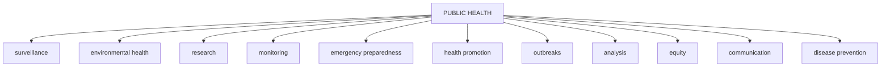

PUBLIC HEALTH BULLETIN-PAKISTAN

Vol. 3 | Week 32
22nd Aug 2023

# Integrated Disease Surveillance & Response (IDSR) Report

Center of Disease Control
National Institute of Health, Islamabad

National Institute of Health Pakistan logo Government of Pakistan logo

PAKISTAN

http://www.phb.nih.org.pk/

Integrated Disease Surveillance & Response (IDSR) Weekly Public Health Bulletin is your go-to resource for disease trends, outbreak alerts, and crucial public health information. By reading and sharing this bulletin, you can help increase awareness and promote preventive measures within your community. Together, let's build a safer, more resilient and healthier future for everyone.

# PROUD TO BE IN PUBLIC HEALTH

# Make a difference with your fieldwork.
# Write for PHB-Pakistan and impact lives!

Public Health Bulletin Pakistan logo National Institute of Health Pakistan logo

Submit your achievements and field work
phb@nih.org

National Institute of Health logo UK Health Security Agency logo World Health Organization logo USAID logo safetynet logo

---

# Greetings
# Team PHB-Pakistan

Public Health Bulletin Pakistan logo
NIH Pakistan logo
Government of Pakistan logo

*Overview*

## Preface

*IDSR Reports*

The Weekly Public Health Bulletin-Pakistan provides an overview of the most important public health events that occurred during week 32 of 2023. The most frequently reported cases during week 32 were acute diarrhea (non-cholera), followed by malaria, influenza-like illness (ILI), acute lower respiratory infection (ALRI) in children under 5 years, bacillary dysentery, typhoid, severe acute respiratory infection (SARI) and dog bite. Twenty cases of meningitis were reported this week. All are suspected cases and need to be verified in the field. There has been an overall increase in cases of acute diarrhea (non-cholera), malaria, bacillary dysentery, and typhoid this week. Measles cases have been reported in high numbers from Balochistan and Khyber Pakhtunkhwa. There has also been an increase in cases of other vaccine-preventable diseases (VPDs), such as pertussis, mumps, and chickenpox. Field investigations are underway to verify the numbers and initiate a timely response. We need to remain vigilant and continue to monitor the situation.

*Ongoing Events*

Stay well-informed about public health matters. Subscribe to the Weekly Bulletin today!

*Field Reports*

Sincerely,
The Chief Editor

NIH logo

UK Health Security Agency logo

World Health Organization logo

USAID logo

safetynet logo

---

*Overview*

* During week 32, most frequently reported cases were of Acute Diarrhea (Non-Cholera) followed by Malaria, ILI, ALRI <5 years, B. Diarrhea, Typhoid, SARI, dog bite and AVH (A&E).

* Twenty cases of Meningitis reported this week. All are suspected cases and need field verification.

* There is overall an increase in cases of Acute Diarrhea (Non Cholera), Malaria, B. Diarrhea and Typhoid reported this week.

* Measles cases reported in high numbers from Balochistan and KPK. Further, cases of other VPDs including Pertussis, mumps and Chickenpox increased too. Field investigation are in progress to verify numbers to initiate timely response.

All are suspected cases and need field verification.

## IDSR compliance attributes

* The national compliance rate for IDSR reporting in 113 implemented districts is 72%

* Sindh province and ICT are the top reporting region with a compliance rate of above 100% and 94% followed by AJK 739% and Khyber Pakhtunkhwa with 64%

* The lowest compliance rate was observed in Gilgit Baltistan.

<table>
  <thead>
    <tr>
        <th>Region</th>
        <th>Expected Reports</th>
        <th>Received Reports</th>
        <th>Compliance (%)</th>
    </tr>
  </thead>
  <tbody>
    <tr>
        <td>Khyber Pakhtunkhwa</td>
<td>1612</td>
<td>1030</td>
<td>64</td>
    </tr>
<tr>
        <td>Azad Jammu Kashmir</td>
<td>375</td>
<td>298</td>
<td>79</td>
    </tr>
<tr>
        <td>Islamabad Capital Territory</td>
<td>27</td>
<td>27</td>
<td>100</td>
    </tr>
<tr>
        <td>Balochistan</td>
<td>1075</td>
<td>580</td>
<td>54</td>
    </tr>
<tr>
        <td>Gilgit Baltistan</td>
<td>220</td>
<td>46</td>
<td>21</td>
    </tr>
<tr>
        <td>Sindh</td>
<td>1834</td>
<td>1718</td>
<td>94</td>
    </tr>
<tr>
        <td>National</td>
<td>5143</td>
<td>3699</td>
<td>72</td>
    </tr>
  </tbody>
</table>

NIH logo

UK Health Security Agency logo

World Health Organization logo

USAID logo

safetynet logo

---

Pakistan

Table 1: Province/Area wise distribution of most frequently reported cases during week 32, Pakistan.

<table>
    <thead>
    <tr>
        <th>Diseases</th>
        <th>AJK</th>
        <th>Balochistan</th>
        <th>GB</th>
        <th>ICT</th>
        <th>KP</th>
        <th>Punjab</th>
        <th>Sindh</th>
        <th>Total</th>
    </tr>
    </thead>
    <tr>
        <td>AD (Non-Cholera)</td>
<td>2,548</td>
<td>6,947</td>
<td>348</td>
<td>572</td>
<td>25,458</td>
<td>118,889</td>
<td>58,558</td>
<td>213,320</td>
    </tr>
<tr>
        <td>Malaria</td>
<td>152</td>
<td>6,506</td>
<td>0</td>
<td>3</td>
<td>6,776</td>
<td>4757</td>
<td>75,627</td>
<td>93,821</td>
    </tr>
<tr>
        <td>ILI</td>
<td>2,263</td>
<td>3,078</td>
<td>61</td>
<td>996</td>
<td>2,889</td>
<td>221</td>
<td>18,500</td>
<td>28,008</td>
    </tr>
<tr>
        <td>ALRI &lt; 5 years</td>
<td>740</td>
<td>1801</td>
<td>59</td>
<td>1</td>
<td>861</td>
<td>22</td>
<td>9,518</td>
<td>13,002</td>
    </tr>
<tr>
        <td>B. Diarrhea</td>
<td>137</td>
<td>1659</td>
<td>12</td>
<td>17</td>
<td>1420</td>
<td>3,117</td>
<td>4,126</td>
<td>10,488</td>
    </tr>
<tr>
        <td>VH (B, C & D)</td>
<td>13</td>
<td>98</td>
<td>0</td>
<td>0</td>
<td>195</td>
<td>NR</td>
<td>5,559</td>
<td>5,865</td>
    </tr>
<tr>
        <td>Typhoid</td>
<td>63</td>
<td>744</td>
<td>9</td>
<td>1</td>
<td>780</td>
<td>5,385</td>
<td>1694</td>
<td>8,676</td>
    </tr>
<tr>
        <td>SARI</td>
<td>297</td>
<td>879</td>
<td>82</td>
<td>0</td>
<td>1066</td>
<td>NR</td>
<td>528</td>
<td>2,852</td>
    </tr>
<tr>
        <td>Dog Bite</td>
<td>88</td>
<td>62</td>
<td>0</td>
<td>0</td>
<td>119</td>
<td>NR</td>
<td>695</td>
<td>964</td>
    </tr>
<tr>
        <td>AVH (A & E)</td>
<td>33</td>
<td>15</td>
<td>3</td>
<td>1</td>
<td>192</td>
<td>NR</td>
<td>512</td>
<td>756</td>
    </tr>
<tr>
        <td>Mumps</td>
<td>104</td>
<td>67</td>
<td>9</td>
<td>1</td>
<td>104</td>
<td>NR</td>
<td>340</td>
<td>625</td>
    </tr>
<tr>
        <td>AWD (S. Cholera)</td>
<td>92</td>
<td>225</td>
<td>39</td>
<td>0</td>
<td>39</td>
<td>NR</td>
<td>58</td>
<td>453</td>
    </tr>
<tr>
        <td>CL</td>
<td>0</td>
<td>69</td>
<td>0</td>
<td>0</td>
<td>242</td>
<td>4</td>
<td>0</td>
<td>315</td>
    </tr>
<tr>
        <td>Chickenpox/ Varicella</td>
<td>27</td>
<td>7</td>
<td>1</td>
<td>1</td>
<td>90</td>
<td>151</td>
<td>24</td>
<td>301</td>
    </tr>
<tr>
        <td>Measles</td>
<td>20</td>
<td>72</td>
<td>2</td>
<td>0</td>
<td>82</td>
<td>0</td>
<td>43</td>
<td>219</td>
    </tr>
<tr>
        <td>Gonorrhea</td>
<td>5</td>
<td>121</td>
<td>1</td>
<td>0</td>
<td>0</td>
<td>NR</td>
<td>25</td>
<td>152</td>
    </tr>
<tr>
        <td>Dengue</td>
<td>1</td>
<td>8</td>
<td>0</td>
<td>0</td>
<td>28</td>
<td>NR</td>
<td>107</td>
<td>144</td>
    </tr>
<tr>
        <td>Leprosy</td>
<td>0</td>
<td>97</td>
<td>0</td>
<td>0</td>
<td>16</td>
<td>NR</td>
<td>0</td>
<td>113</td>
    </tr>
<tr>
        <td>Pertussis</td>
<td>9</td>
<td>51</td>
<td>0</td>
<td>0</td>
<td>25</td>
<td>NR</td>
<td>5</td>
<td>90</td>
    </tr>
<tr>
        <td>Syphilis</td>
<td>2</td>
<td>23</td>
<td>0</td>
<td>0</td>
<td>0</td>
<td>1</td>
<td>4</td>
<td>30</td>
    </tr>
<tr>
        <td>NT</td>
<td>2</td>
<td>0</td>
<td>0</td>
<td>0</td>
<td>24</td>
<td>NR</td>
<td>2</td>
<td>28</td>
    </tr>
<tr>
        <td>AFP</td>
<td>2</td>
<td>1</td>
<td>0</td>
<td>0</td>
<td>13</td>
<td>NR</td>
<td>10</td>
<td>26</td>
    </tr>
<tr>
        <td>HIV/AIDS</td>
<td>0</td>
<td>2</td>
<td>0</td>
<td>0</td>
<td>1</td>
<td>NR</td>
<td>20</td>
<td>23</td>
    </tr>
<tr>
        <td>Meningitis</td>
<td>2</td>
<td>4</td>
<td>0</td>
<td>0</td>
<td>3</td>
<td>NR</td>
<td>11</td>
<td>20</td>
    </tr>
<tr>
        <td>Brucellosis</td>
<td>0</td>
<td>11</td>
<td>0</td>
<td>0</td>
<td>1</td>
<td>NR</td>
<td>8</td>
<td>20</td>
    </tr>
<tr>
        <td>VL</td>
<td>0</td>
<td>0</td>
<td>0</td>
<td>0</td>
<td>1</td>
<td>NR</td>
<td>2</td>
<td>3</td>
    </tr>
<tr>
        <td>Diphtheria (Probable)</td>
<td>0</td>
<td>0</td>
<td>0</td>
<td>0</td>
<td>3</td>
<td>NR</td>
<td>0</td>
<td>3</td>
    </tr>
</table>

Figure 1: Most frequently reported suspected cases during week 32, Pakistan

<table>
  <thead>
    <tr>
        <th>Disease Category</th>
        <th>WK 30</th>
        <th>WK 31</th>
        <th>WK 32</th>
    </tr>
  </thead>
  <tbody>
    <tr>
        <td>AD (Non-Cholera)</td>
<td>78000</td>
<td>98000</td>
<td>213320</td>
    </tr>
<tr>
        <td>Malaria</td>
<td>58000</td>
<td>75000</td>
<td>93821</td>
    </tr>
<tr>
        <td>ILI</td>
<td>20000</td>
<td>28008</td>
<td>28008</td>
    </tr>
<tr>
        <td>ALRI &lt; 5 years</td>
<td>10000</td>
<td>11000</td>
<td>13002</td>
    </tr>
<tr>
        <td>B. Diarrhea</td>
<td>6000</td>
<td>8000</td>
<td>10488</td>
    </tr>
<tr>
        <td>VH (B, C &amp; D)</td>
<td>3000</td>
<td>5000</td>
<td>5865</td>
    </tr>
<tr>
        <td>Typhoid</td>
<td>2000</td>
<td>3000</td>
<td>8676</td>
    </tr>
<tr>
        <td>SARI</td>
<td>1500</td>
<td>2000</td>
<td>2852</td>
    </tr>
<tr>
        <td>Dog Bite</td>
<td>500</td>
<td>800</td>
<td>964</td>
    </tr>
<tr>
        <td>AVH (A &amp; E)</td>
<td>400</td>
<td>600</td>
<td>756</td>
    </tr>
  </tbody>
</table>

NIH logo

UK Health Security Agency logo

World Health Organization logo

USAID logo

safetynet logo

---

# Sindh
* Malaria cases were maximum followed by AD (Non-Cholera), ILI, ALRI<5 Years, VH (B, C, D), B. Diarrhea, Typhoid, dog bite, SARI and AVH (A&E).
* Malaria and AD cases are from Larkana, Kambar, Dadu and Badin. Rise in cases is attributed to hot weather and continuous rains.
* Sixty cases of Dengue reported from district Tharparkar. Cases need to be verified to start appropriate public health actions.
* An upward trend in cases observed for Malaria nad AD (Non-Cholera) this week.

Table 2: District wise distribution of most frequently reported suspected cases during week 32, Sindh

<table>
    <thead>
    <tr>
        <th>DISTRICTS</th>
        <th>Malaria</th>
        <th>AD (Non-
Cholera)</th>
        <th>ILI</th>
        <th>ALRI &lt; 5 
years</th>
        <th>VH (B, C 
& D)</th>
        <th>B. 
Diarrhea</th>
        <th>Typhoid</th>
        <th>Dog Bite</th>
        <th>SARI</th>
        <th>AVH (A 
& E)</th>
        <th>Dengue</th>
    </tr>
    </thead>
    <tr>
        <td>Badin</td>
<td>9,189</td>
<td>5,819</td>
<td>378</td>
<td>806</td>
<td>333</td>
<td>429</td>
<td>180</td>
<td>75</td>
<td>2</td>
<td>2</td>
<td>0</td>
    </tr>
<tr>
        <td>Dadu</td>
<td>4,193</td>
<td>3,406</td>
<td>385</td>
<td>1,213</td>
<td>23</td>
<td>485</td>
<td>156</td>
<td>0</td>
<td>6</td>
<td>8</td>
<td>0</td>
    </tr>
<tr>
        <td>Ghotki</td>
<td>769</td>
<td>1,246</td>
<td>0</td>
<td>302</td>
<td>449</td>
<td>132</td>
<td>8</td>
<td>0</td>
<td>0</td>
<td>1</td>
<td>0</td>
    </tr>
<tr>
        <td>Hyderabad</td>
<td>442</td>
<td>2,193</td>
<td>360</td>
<td>47</td>
<td>51</td>
<td>6</td>
<td>22</td>
<td>0</td>
<td>0</td>
<td>2</td>
<td>0</td>
    </tr>
<tr>
        <td>Jacobabad</td>
<td>1,507</td>
<td>1,402</td>
<td>113</td>
<td>827</td>
<td>331</td>
<td>117</td>
<td>18</td>
<td>52</td>
<td>143</td>
<td>0</td>
<td>0</td>
    </tr>
<tr>
        <td>Jamshoro</td>
<td>2,104</td>
<td>2,313</td>
<td>395</td>
<td>131</td>
<td>132</td>
<td>103</td>
<td>89</td>
<td>61</td>
<td>6</td>
<td>4</td>
<td>0</td>
    </tr>
<tr>
        <td>Kamber</td>
<td>4,451</td>
<td>2,313</td>
<td>0</td>
<td>253</td>
<td>141</td>
<td>183</td>
<td>2</td>
<td>0</td>
<td>0</td>
<td>0</td>
<td>0</td>
    </tr>
<tr>
        <td>Karachi Central</td>
<td>87</td>
<td>1,214</td>
<td>1,719</td>
<td>69</td>
<td>241</td>
<td>43</td>
<td>132</td>
<td>0</td>
<td>0</td>
<td>31</td>
<td>1</td>
    </tr>
<tr>
        <td>Karachi East</td>
<td>87</td>
<td>343</td>
<td>108</td>
<td>0</td>
<td>21</td>
<td>7</td>
<td>5</td>
<td>3</td>
<td>0</td>
<td>0</td>
<td>19</td>
    </tr>
<tr>
        <td>Karachi Keamari</td>
<td>12</td>
<td>612</td>
<td>354</td>
<td>36</td>
<td>0</td>
<td>1</td>
<td>6</td>
<td>0</td>
<td>0</td>
<td>2</td>
<td>2</td>
    </tr>
<tr>
        <td>Karachi Korangi</td>
<td>51</td>
<td>373</td>
<td>0</td>
<td>5</td>
<td>0</td>
<td>2</td>
<td>3</td>
<td>0</td>
<td>0</td>
<td>0</td>
<td>8</td>
    </tr>
<tr>
        <td>Karachi Malir</td>
<td>159</td>
<td>1,517</td>
<td>1,912</td>
<td>426</td>
<td>21</td>
<td>75</td>
<td>33</td>
<td>34</td>
<td>32</td>
<td>7</td>
<td>9</td>
    </tr>
<tr>
        <td>Karachi South</td>
<td>33</td>
<td>163</td>
<td>0</td>
<td>0</td>
<td>0</td>
<td>0</td>
<td>1</td>
<td>0</td>
<td>0</td>
<td>0</td>
<td>0</td>
    </tr>
<tr>
        <td>Karachi West</td>
<td>138</td>
<td>994</td>
<td>664</td>
<td>145</td>
<td>23</td>
<td>43</td>
<td>68</td>
<td>42</td>
<td>68</td>
<td>8</td>
<td>1</td>
    </tr>
<tr>
        <td>Kashmore</td>
<td>1,896</td>
<td>832</td>
<td>324</td>
<td>205</td>
<td>112</td>
<td>107</td>
<td>33</td>
<td>0</td>
<td>0</td>
<td>0</td>
<td>0</td>
    </tr>
<tr>
        <td>Khairpur</td>
<td>2,664</td>
<td>2,407</td>
<td>280</td>
<td>636</td>
<td>103</td>
<td>319</td>
<td>172</td>
<td>25</td>
<td>123</td>
<td>5</td>
<td>0</td>
    </tr>
<tr>
        <td>Larkana</td>
<td>10,111</td>
<td>2,071</td>
<td>0</td>
<td>202</td>
<td>74</td>
<td>230</td>
<td>3</td>
<td>0</td>
<td>7</td>
<td>0</td>
<td>4</td>
    </tr>
<tr>
        <td>Matiari</td>
<td>1,612</td>
<td>3,158</td>
<td>923</td>
<td>665</td>
<td>669</td>
<td>135</td>
<td>31</td>
<td>26</td>
<td>0</td>
<td>7</td>
<td>3</td>
    </tr>
<tr>
        <td>Mirpurkhas</td>
<td>4,465</td>
<td>2,741</td>
<td>4,009</td>
<td>200</td>
<td>132</td>
<td>95</td>
<td>26</td>
<td>0</td>
<td>0</td>
<td>7</td>
<td>0</td>
    </tr>
<tr>
        <td>Naushero Feroze</td>
<td>2,137</td>
<td>2,138</td>
<td>410</td>
<td>100</td>
<td>129</td>
<td>125</td>
<td>145</td>
<td>55</td>
<td>0</td>
<td>0</td>
<td>0</td>
    </tr>
<tr>
        <td>Sanghar</td>
<td>2,392</td>
<td>3,207</td>
<td>63</td>
<td>537</td>
<td>917</td>
<td>170</td>
<td>97</td>
<td>175</td>
<td>85</td>
<td>12</td>
<td>0</td>
    </tr>
<tr>
        <td>Shaheed 
Benazirabad</td>
<td>1,946</td>
<td>3,067</td>
<td>0</td>
<td>383</td>
<td>142</td>
<td>94</td>
<td>260</td>
<td>4</td>
<td>2</td>
<td>1</td>
<td>0</td>
    </tr>
<tr>
        <td>Shikarpur</td>
<td>1,396</td>
<td>1,496</td>
<td>0</td>
<td>125</td>
<td>150</td>
<td>163</td>
<td>2</td>
<td>0</td>
<td>9</td>
<td>2</td>
<td>0</td>
    </tr>
<tr>
        <td>Sujawal</td>
<td>3,514</td>
<td>1,872</td>
<td>0</td>
<td>330</td>
<td>222</td>
<td>60</td>
<td>33</td>
<td>31</td>
<td>0</td>
<td>210</td>
<td>0</td>
    </tr>
<tr>
        <td>Sukkur</td>
<td>2,663</td>
<td>2,050</td>
<td>1,624</td>
<td>346</td>
<td>379</td>
<td>236</td>
<td>12</td>
<td>0</td>
<td>1</td>
<td>0</td>
<td>0</td>
    </tr>
<tr>
        <td>Tando Allahyar</td>
<td>1,601</td>
<td>2,190</td>
<td>673</td>
<td>301</td>
<td>161</td>
<td>193</td>
<td>15</td>
<td>35</td>
<td>0</td>
<td>4</td>
<td>0</td>
    </tr>
<tr>
        <td>Tando Muhammad 
Khan</td>
<td>2,893</td>
<td>1,799</td>
<td>24</td>
<td>276</td>
<td>252</td>
<td>198</td>
<td>32</td>
<td>35</td>
<td>5</td>
<td>0</td>
<td>0</td>
    </tr>
<tr>
        <td>Tharparkar</td>
<td>3,067</td>
<td>1,445</td>
<td>1,517</td>
<td>376</td>
<td>82</td>
<td>140</td>
<td>42</td>
<td>4</td>
<td>0</td>
<td>24</td>
<td>60</td>
    </tr>
<tr>
        <td>Thatta</td>
<td>5,619</td>
<td>2,143</td>
<td>2,265</td>
<td>272</td>
<td>139</td>
<td>163</td>
<td>12</td>
<td>38</td>
<td>29</td>
<td>172</td>
<td>0</td>
    </tr>
<tr>
        <td>Umerkot</td>
<td>4,429</td>
<td>2,034</td>
<td>0</td>
<td>304</td>
<td>130</td>
<td>72</td>
<td>56</td>
<td>0</td>
<td>10</td>
<td>3</td>
<td>0</td>
    </tr>
<tr>
        <td>Total</td>
<td>75,627</td>
<td>58,558</td>
<td>18,500</td>
<td>9,518</td>
<td>5,559</td>
<td>4,126</td>
<td>1,694</td>
<td>695</td>
<td>528</td>
<td>512</td>
<td>107</td>
    </tr>
</table>

Figure 2: Most frequently reported suspected cases during week 32, Sindh

<table>
  <thead>
    <tr>
        <th>Disease</th>
        <th>WK 30</th>
        <th>WK 31</th>
        <th>WK 32</th>
    </tr>
  </thead>
  <tbody>
    <tr>
        <td>Malaria</td>
<td>47000</td>
<td>61000</td>
<td>75627</td>
    </tr>
<tr>
        <td>AD (Non-Cholera)</td>
<td>38000</td>
<td>50000</td>
<td>58558</td>
    </tr>
<tr>
        <td>ILI</td>
<td>10000</td>
<td>17000</td>
<td>18500</td>
    </tr>
<tr>
        <td>ALRI &lt; 5 years</td>
<td>5000</td>
<td>9000</td>
<td>9518</td>
    </tr>
<tr>
        <td>VH (B, C &amp; D)</td>
<td>3000</td>
<td>5000</td>
<td>5559</td>
    </tr>
<tr>
        <td>B. Diarrhea</td>
<td>2000</td>
<td>4000</td>
<td>4126</td>
    </tr>
<tr>
        <td>Typhoid</td>
<td>1000</td>
<td>1500</td>
<td>1694</td>
    </tr>
<tr>
        <td>Dog Bite</td>
<td>500</td>
<td>600</td>
<td>695</td>
    </tr>
<tr>
        <td>SARI</td>
<td>400</td>
<td>500</td>
<td>528</td>
    </tr>
<tr>
        <td>AVH (A &amp; E)</td>
<td>400</td>
<td>500</td>
<td>512</td>
    </tr>
  </tbody>
</table>

NIH logo

UK Health Security Agency logo

World Health Organization logo

USAID logo

safetynet logo

---

# Balochistan
* AD (Non-Cholera), Malaria, ILI, ALRI <5 years, B. Diarrhea, SARI, Typhoid, AWD (S. Cholera), VH (A&E) and Gonorrhea were the most frequently reported diseases.

* There was a sharp decline in trend for ILI cases whereas AD and Malaria cases showed slight rise this week.

* Gonorrhea cases were reported from Mastung and Jafferabad. These are suspected cases and need verification.

* Waterborne diseases increased due recent rains across the country. Cases of AD and B. Diarrhea reported mostly from Jafferabad, Lesbella, mastung and Sohbatpur. Cases are required to be investigated for implementation of control measures..

**Table 3: District wise distribution of most frequently reported suspected cases during week 32, Balochistan**

<table>
    <thead>
    <tr>
        <th>Districts</th>
        <th>AD (Non-
Cholera)</th>
        <th>Malaria</th>
        <th>ILI</th>
        <th>ALRI &lt; 5 
years</th>
        <th>B. 
Diarrhea</th>
        <th>SARI</th>
        <th>Typhoid</th>
        <th>AWD (S. 
Cholera)</th>
        <th>Gonorrhea</th>
        <th>VH (B, C 
& D)</th>
    </tr>
    </thead>
    <tr>
        <td>Awaran</td>
<td>25</td>
<td>21</td>
<td>18</td>
<td>0</td>
<td>8</td>
<td>0</td>
<td>0</td>
<td>9</td>
<td>0</td>
<td>0</td>
    </tr>
<tr>
        <td>Dera Bugti</td>
<td>59</td>
<td>246</td>
<td>24</td>
<td>36</td>
<td>42</td>
<td>31</td>
<td>8</td>
<td>9</td>
<td>0</td>
<td>0</td>
    </tr>
<tr>
        <td>Duki</td>
<td>175</td>
<td>138</td>
<td>69</td>
<td>32</td>
<td>99</td>
<td>27</td>
<td>27</td>
<td>44</td>
<td>2</td>
<td>0</td>
    </tr>
<tr>
        <td>Gwadar</td>
<td>14</td>
<td>NR</td>
<td>27</td>
<td>NR</td>
<td>NR</td>
<td>NR</td>
<td>NR</td>
<td>NR</td>
<td>NR</td>
<td>NR</td>
    </tr>
<tr>
        <td>Harnai</td>
<td>171</td>
<td>109</td>
<td>3</td>
<td>320</td>
<td>206</td>
<td>2</td>
<td>4</td>
<td>31</td>
<td>0</td>
<td>0</td>
    </tr>
<tr>
        <td>Hub</td>
<td>291</td>
<td>279</td>
<td>75</td>
<td>23</td>
<td>44</td>
<td>162</td>
<td>11</td>
<td>0</td>
<td>0</td>
<td>29</td>
    </tr>
<tr>
        <td>Jaffarabad</td>
<td>1,059</td>
<td>1,537</td>
<td>182</td>
<td>209</td>
<td>144</td>
<td>108</td>
<td>145</td>
<td>0</td>
<td>20</td>
<td>32</td>
    </tr>
<tr>
        <td>Jhal Magsi</td>
<td>390</td>
<td>506</td>
<td>0</td>
<td>86</td>
<td>7</td>
<td>3</td>
<td>8</td>
<td>1</td>
<td>0</td>
<td>0</td>
    </tr>
<tr>
        <td>Kachhi (Bolan)</td>
<td>109</td>
<td>137</td>
<td>76</td>
<td>17</td>
<td>36</td>
<td>33</td>
<td>38</td>
<td>3</td>
<td>0</td>
<td>0</td>
    </tr>
<tr>
        <td>Kalat</td>
<td>25</td>
<td>42</td>
<td>14</td>
<td>6</td>
<td>9</td>
<td>0</td>
<td>38</td>
<td>0</td>
<td>8</td>
<td>2</td>
    </tr>
<tr>
        <td>Kech (Turbat)</td>
<td>465</td>
<td>245</td>
<td>588</td>
<td>84</td>
<td>59</td>
<td>0</td>
<td>0</td>
<td>2</td>
<td>0</td>
<td>0</td>
    </tr>
<tr>
        <td>Kharan</td>
<td>139</td>
<td>95</td>
<td>228</td>
<td>0</td>
<td>77</td>
<td>0</td>
<td>3</td>
<td>6</td>
<td>2</td>
<td>0</td>
    </tr>
<tr>
        <td>Khuzdar</td>
<td>206</td>
<td>155</td>
<td>114</td>
<td>0</td>
<td>98</td>
<td>8</td>
<td>25</td>
<td>1</td>
<td>10</td>
<td>1</td>
    </tr>
<tr>
        <td>Kohlu</td>
<td>50</td>
<td>107</td>
<td>127</td>
<td>14</td>
<td>86</td>
<td>28</td>
<td>27</td>
<td>2</td>
<td>0</td>
<td>2</td>
    </tr>
<tr>
        <td>Lasbella</td>
<td>946</td>
<td>756</td>
<td>77</td>
<td>551</td>
<td>88</td>
<td>41</td>
<td>13</td>
<td>0</td>
<td>0</td>
<td>1</td>
    </tr>
<tr>
        <td>Loralai</td>
<td>206</td>
<td>80</td>
<td>177</td>
<td>41</td>
<td>45</td>
<td>84</td>
<td>36</td>
<td>7</td>
<td>0</td>
<td>0</td>
    </tr>
<tr>
        <td>Mastung</td>
<td>769</td>
<td>447</td>
<td>104</td>
<td>50</td>
<td>112</td>
<td>54</td>
<td>180</td>
<td>13</td>
<td>57</td>
<td>15</td>
    </tr>
<tr>
        <td>Naseerabad</td>
<td>219</td>
<td>477</td>
<td>0</td>
<td>0</td>
<td>9</td>
<td>0</td>
<td>37</td>
<td>6</td>
<td>0</td>
<td>0</td>
    </tr>
<tr>
        <td>Nushki</td>
<td>218</td>
<td>93</td>
<td>10</td>
<td>0</td>
<td>97</td>
<td>6</td>
<td>0</td>
<td>19</td>
<td>4</td>
<td>0</td>
    </tr>
<tr>
        <td>Panjgur</td>
<td>59</td>
<td>64</td>
<td>34</td>
<td>23</td>
<td>25</td>
<td>30</td>
<td>16</td>
<td>45</td>
<td>4</td>
<td>0</td>
    </tr>
<tr>
        <td>Pishin</td>
<td>72</td>
<td>17</td>
<td>96</td>
<td>11</td>
<td>55</td>
<td>2</td>
<td>10</td>
<td>0</td>
<td>0</td>
<td>0</td>
    </tr>
<tr>
        <td>Quetta</td>
<td>510</td>
<td>29</td>
<td>843</td>
<td>35</td>
<td>121</td>
<td>109</td>
<td>43</td>
<td>13</td>
<td>2</td>
<td>1</td>
    </tr>
<tr>
        <td>Sherani</td>
<td>5</td>
<td>1</td>
<td>6</td>
<td>0</td>
<td>1</td>
<td>0</td>
<td>0</td>
<td>0</td>
<td>0</td>
<td>0</td>
    </tr>
<tr>
        <td>Sibi</td>
<td>88</td>
<td>131</td>
<td>96</td>
<td>3</td>
<td>14</td>
<td>5</td>
<td>8</td>
<td>0</td>
<td>12</td>
<td>0</td>
    </tr>
<tr>
        <td>Sohbat pur</td>
<td>561</td>
<td>711</td>
<td>9</td>
<td>103</td>
<td>125</td>
<td>110</td>
<td>56</td>
<td>0</td>
<td>0</td>
<td>15</td>
    </tr>
<tr>
        <td>SURAB</td>
<td>5</td>
<td>9</td>
<td>5</td>
<td>0</td>
<td>0</td>
<td>0</td>
<td>3</td>
<td>0</td>
<td>0</td>
<td>0</td>
    </tr>
<tr>
        <td>Zhob</td>
<td>101</td>
<td>55</td>
<td>53</td>
<td>153</td>
<td>38</td>
<td>36</td>
<td>8</td>
<td>6</td>
<td>0</td>
<td>0</td>
    </tr>
<tr>
        <td>Ziarat</td>
<td>10</td>
<td>19</td>
<td>23</td>
<td>4</td>
<td>14</td>
<td>0</td>
<td>0</td>
<td>8</td>
<td>0</td>
<td>0</td>
    </tr>
<tr>
        <td>Total</td>
<td>6,947</td>
<td>6,506</td>
<td>3,078</td>
<td>1,801</td>
<td>1,659</td>
<td>879</td>
<td>744</td>
<td>225</td>
<td>121</td>
<td>98</td>
    </tr>
</table>

Figure 3: Most frequently reported suspected cases during week 32, Balochistan

<table>
  <thead>
    <tr>
        <th>Week</th>
        <th>AD (Non-Cholera)</th>
        <th>Malaria</th>
        <th>ILI</th>
        <th>ALRI &lt; 5 years</th>
        <th>B. Diarrhea</th>
        <th>SARI</th>
        <th>Typhoid</th>
        <th>AWD (S. Cholera)</th>
        <th>Gonorrhea</th>
        <th>VH (B, C &amp; D)</th>
    </tr>
  </thead>
  <tbody>
    <tr>
        <td>WK 30</td>
<td>6400</td>
<td>6400</td>
<td>3000</td>
<td>1600</td>
<td>1900</td>
<td>850</td>
<td>950</td>
<td>200</td>
<td>100</td>
<td>150</td>
    </tr>
<tr>
        <td>WK 31</td>
<td>6750</td>
<td>6050</td>
<td>4000</td>
<td>1850</td>
<td>1900</td>
<td>850</td>
<td>750</td>
<td>250</td>
<td>100</td>
<td>100</td>
    </tr>
<tr>
        <td>WK 32</td>
<td>6947</td>
<td>6506</td>
<td>3078</td>
<td>1801</td>
<td>1659</td>
<td>879</td>
<td>744</td>
<td>225</td>
<td>121</td>
<td>98</td>
    </tr>
  </tbody>
</table>

NIH logo

UK Health Security Agency logo

World Health Organization logo

USAID logo

safetynet logo

---

# Khyber Pakhtunkhwa

* Cases of AD (Non-Cholera) were the most frequently reported cases followed by Malaria, ILI, SB. Diarrhea, ALRI<5 Years, Typhoid, CL, AVH (A&E ) and AVH (B&C) cases.

* There is sharp decline trend in cases of AD (Non Cholera) this week.

* Cutaneous Leishmaniasis cases increased and mostly reported from lower Dir, Karak, Hango and Noweshera. Field investigations required to verify cases.

Table 4: District wise distribution of most frequently reported suspected cases during week 32, KP

<table>
    <thead>
    <tr>
        <th>Districts</th>
        <th>AD (Non-
Cholera)</th>
        <th>Malaria</th>
        <th>ILI</th>
        <th>B. 
Diarrhea</th>
        <th>SARI</th>
        <th>ALRI &lt; 5 
years</th>
        <th>Typhoid</th>
        <th>CL</th>
        <th>VH (B, C & 
D)</th>
        <th>AVH (A & 
E)</th>
    </tr>
    </thead>
    <tr>
        <td>Abbottabad</td>
<td>928</td>
<td>3</td>
<td>7</td>
<td>2</td>
<td>6</td>
<td>10</td>
<td>11</td>
<td>0</td>
<td>1</td>
<td>0</td>
    </tr>
<tr>
        <td>Bajaur</td>
<td>407</td>
<td>170</td>
<td>39</td>
<td>35</td>
<td>2</td>
<td>8</td>
<td>3</td>
<td>1</td>
<td>0</td>
<td>0</td>
    </tr>
<tr>
        <td>Bannu</td>
<td>560</td>
<td>727</td>
<td>25</td>
<td>4</td>
<td>0</td>
<td>1</td>
<td>51</td>
<td>1</td>
<td>1</td>
<td>0</td>
    </tr>
<tr>
        <td>Buner</td>
<td>763</td>
<td>751</td>
<td>0</td>
<td>8</td>
<td>0</td>
<td>35</td>
<td>8</td>
<td>1</td>
<td>0</td>
<td>0</td>
    </tr>
<tr>
        <td>Charsadda</td>
<td>1,378</td>
<td>64</td>
<td>179</td>
<td>0</td>
<td>22</td>
<td>5</td>
<td>0</td>
<td>0</td>
<td>0</td>
<td>0</td>
    </tr>
<tr>
        <td>Chitral Lower</td>
<td>777</td>
<td>13</td>
<td>137</td>
<td>0</td>
<td>419</td>
<td>3</td>
<td>10</td>
<td>21</td>
<td>0</td>
<td>3</td>
    </tr>
<tr>
        <td>Chitral Upper</td>
<td>106</td>
<td>10</td>
<td>0</td>
<td>0</td>
<td>117</td>
<td>0</td>
<td>19</td>
<td>0</td>
<td>0</td>
<td>0</td>
    </tr>
<tr>
        <td>D.I. Khan</td>
<td>1,024</td>
<td>572</td>
<td>16</td>
<td>20</td>
<td>51</td>
<td>11</td>
<td>8</td>
<td>0</td>
<td>0</td>
<td>0</td>
    </tr>
<tr>
        <td>Dir Lower</td>
<td>2,889</td>
<td>607</td>
<td>18</td>
<td>158</td>
<td>0</td>
<td>134</td>
<td>55</td>
<td>23</td>
<td>0</td>
<td>52</td>
    </tr>
<tr>
        <td>Dir Upper</td>
<td>1,424</td>
<td>11</td>
<td>10</td>
<td>71</td>
<td>0</td>
<td>25</td>
<td>17</td>
<td>8</td>
<td>0</td>
<td>8</td>
    </tr>
<tr>
        <td>Hangu</td>
<td>415</td>
<td>397</td>
<td>59</td>
<td>12</td>
<td>53</td>
<td>8</td>
<td>16</td>
<td>29</td>
<td>0</td>
<td>10</td>
    </tr>
<tr>
        <td>Haripur</td>
<td>1,684</td>
<td>87</td>
<td>265</td>
<td>2</td>
<td>12</td>
<td>134</td>
<td>70</td>
<td>0</td>
<td>21</td>
<td>26</td>
    </tr>
<tr>
        <td>Karak</td>
<td>288</td>
<td>172</td>
<td>35</td>
<td>1</td>
<td>20</td>
<td>5</td>
<td>2</td>
<td>67</td>
<td>0</td>
<td>0</td>
    </tr>
<tr>
        <td>Khyber</td>
<td>15</td>
<td>52</td>
<td>98</td>
<td>10</td>
<td>1</td>
<td>0</td>
<td>9</td>
<td>6</td>
<td>3</td>
<td>5</td>
    </tr>
<tr>
        <td>Kohat</td>
<td>74</td>
<td>51</td>
<td>1</td>
<td>0</td>
<td>0</td>
<td>2</td>
<td>0</td>
<td>5</td>
<td>0</td>
<td>0</td>
    </tr>
<tr>
        <td>Kohistan Lower</td>
<td>220</td>
<td>6</td>
<td>0</td>
<td>20</td>
<td>23</td>
<td>19</td>
<td>2</td>
<td>0</td>
<td>0</td>
<td>0</td>
    </tr>
<tr>
        <td>Kohistan Upper</td>
<td>555</td>
<td>2</td>
<td>26</td>
<td>19</td>
<td>3</td>
<td>3</td>
<td>98</td>
<td>0</td>
<td>0</td>
<td>0</td>
    </tr>
<tr>
        <td>Kolai Palas</td>
<td>146</td>
<td>1</td>
<td>0</td>
<td>7</td>
<td>2</td>
<td>2</td>
<td>1</td>
<td>0</td>
<td>0</td>
<td>0</td>
    </tr>
<tr>
        <td>L & C Kurram</td>
<td>25</td>
<td>22</td>
<td>37</td>
<td>22</td>
<td>0</td>
<td>0</td>
<td>3</td>
<td>0</td>
<td>0</td>
<td>0</td>
    </tr>
<tr>
        <td>Lakki Marwat</td>
<td>655</td>
<td>1,609</td>
<td>0</td>
<td>14</td>
<td>0</td>
<td>19</td>
<td>18</td>
<td>12</td>
<td>0</td>
<td>0</td>
    </tr>
<tr>
        <td>Malakand</td>
<td>732</td>
<td>26</td>
<td>1</td>
<td>133</td>
<td>1</td>
<td>24</td>
<td>8</td>
<td>0</td>
<td>0</td>
<td>20</td>
    </tr>
<tr>
        <td>Mansehra</td>
<td>1,004</td>
<td>9</td>
<td>487</td>
<td>42</td>
<td>204</td>
<td>34</td>
<td>29</td>
<td>0</td>
<td>8</td>
<td>10</td>
    </tr>
<tr>
        <td>Mardan</td>
<td>1,179</td>
<td>55</td>
<td>70</td>
<td>29</td>
<td>0</td>
<td>43</td>
<td>0</td>
<td>4</td>
<td>0</td>
<td>3</td>
    </tr>
<tr>
        <td>Nowshera</td>
<td>2,980</td>
<td>211</td>
<td>19</td>
<td>36</td>
<td>26</td>
<td>0</td>
<td>25</td>
<td>25</td>
<td>7</td>
<td>14</td>
    </tr>
<tr>
        <td>Peshawar</td>
<td>2,171</td>
<td>37</td>
<td>756</td>
<td>690</td>
<td>28</td>
<td>75</td>
<td>146</td>
<td>16</td>
<td>135</td>
<td>14</td>
    </tr>
<tr>
        <td>Shangla</td>
<td>589</td>
<td>392</td>
<td>0</td>
<td>0</td>
<td>0</td>
<td>8</td>
<td>14</td>
<td>0</td>
<td>2</td>
<td>0</td>
    </tr>
<tr>
        <td>Swabi</td>
<td>1,750</td>
<td>72</td>
<td>585</td>
<td>27</td>
<td>53</td>
<td>126</td>
<td>39</td>
<td>0</td>
<td>17</td>
<td>23</td>
    </tr>
<tr>
        <td>Swat</td>
<td>221</td>
<td>0</td>
<td>12</td>
<td>0</td>
<td>0</td>
<td>0</td>
<td>1</td>
<td>0</td>
<td>0</td>
<td>0</td>
    </tr>
<tr>
        <td>Tank</td>
<td>336</td>
<td>459</td>
<td>0</td>
<td>3</td>
<td>0</td>
<td>103</td>
<td>89</td>
<td>10</td>
<td>0</td>
<td>0</td>
    </tr>
<tr>
        <td>Tor Ghar</td>
<td>155</td>
<td>132</td>
<td>5</td>
<td>51</td>
<td>15</td>
<td>0</td>
<td>19</td>
<td>13</td>
<td>0</td>
<td>4</td>
    </tr>
<tr>
        <td>Upper Kurram</td>
<td>8</td>
<td>56</td>
<td>2</td>
<td>4</td>
<td>8</td>
<td>24</td>
<td>9</td>
<td>0</td>
<td>0</td>
<td>0</td>
    </tr>
<tr>
        <td>Total</td>
<td>25,458</td>
<td>6,776</td>
<td>2,889</td>
<td>1,420</td>
<td>1,066</td>
<td>861</td>
<td>780</td>
<td>242</td>
<td>195</td>
<td>192</td>
    </tr>
</table>

Figure 4: Most frequently reported suspected cases during week 32, KP

<table>
  <thead>
    <tr>
        <th>Disease</th>
        <th>WK 30</th>
        <th>WK 31</th>
        <th>WK 32</th>
    </tr>
  </thead>
  <tbody>
    <tr>
        <td>AD (Non-Cholera)</td>
<td>28000</td>
<td>35000</td>
<td>25458</td>
    </tr>
<tr>
        <td>Malaria</td>
<td>6000</td>
<td>7500</td>
<td>6776</td>
    </tr>
<tr>
        <td>ILI</td>
<td>3500</td>
<td>4000</td>
<td>2889</td>
    </tr>
<tr>
        <td>B. Diarrhea</td>
<td>1500</td>
<td>1800</td>
<td>1420</td>
    </tr>
<tr>
        <td>SARI</td>
<td>1200</td>
<td>1500</td>
<td>1066</td>
    </tr>
<tr>
        <td>ALRI &lt; 5 years</td>
<td>1000</td>
<td>1200</td>
<td>861</td>
    </tr>
<tr>
        <td>Typhoid</td>
<td>900</td>
<td>1100</td>
<td>780</td>
    </tr>
<tr>
        <td>CL</td>
<td>300</td>
<td>400</td>
<td>242</td>
    </tr>
<tr>
        <td>VH (B, C &amp; D)</td>
<td>250</td>
<td>300</td>
<td>195</td>
    </tr>
<tr>
        <td>AVH (A &amp; E) (New Susp. Cases)</td>
<td>200</td>
<td>250</td>
<td>192</td>
    </tr>
  </tbody>
</table>

NIH logo

UK Health Security Agency logo

World Health Organization logo

USAID logo

safetynet logo

---

# ICT, AJK & GB

**ICT:** The most frequently reported cases from Islamabad were ILI followed by AD (Non-Cholera). ILI cases showed continued rising trend in cases this week.

**AJK:** AD (Non-Cholera) cases were the most frequent followed by ILI, ALRI <5 years, SARI, Malaria, B. Diarrhea, Mumps, AWD (S. Cholera), dog bite and Typhoid. Both ILI and ALRI <5 years cases showed a slight decline trend in cases this week.

**GB:** AD (Non. Cholera) cases were the most frequently reported followed by SARI, ILI, ALRI<5 years, AWD (Sus. Cholera), B. Diarrhea, Typhoid and Mumps. A sharp upward trend in AD (S. Cholera) cases observed this week

Figure 6: Week wise reported suspected cases of ILI, ICT

<table>
  <thead>
    <tr>
        <th>Disease</th>
        <th>WK30</th>
        <th>WK31</th>
        <th>WK32</th>
    </tr>
  </thead>
  <tbody>
    <tr>
        <td>ILI</td>
<td>720</td>
<td>940</td>
<td>996</td>
    </tr>
<tr>
        <td>AD (Non-Cholera)</td>
<td>380</td>
<td>630</td>
<td>572</td>
    </tr>
  </tbody>
</table>

Figure 6: Week wise reported suspected cases of ILI, ICT

<table>
  <thead>
    <tr>
        <th>Week</th>
        <th>ILI</th>
    </tr>
  </thead>
  <tbody>
    <tr>
        <td>W33</td>
<td>1200</td>
    </tr>
<tr>
        <td>W34</td>
<td>800</td>
    </tr>
<tr>
        <td>W35</td>
<td>400</td>
    </tr>
<tr>
        <td>W36</td>
<td>1450</td>
    </tr>
<tr>
        <td>W37</td>
<td>150</td>
    </tr>
<tr>
        <td>W38</td>
<td>100</td>
    </tr>
<tr>
        <td>W39</td>
<td>1200</td>
    </tr>
<tr>
        <td>W40</td>
<td>1000</td>
    </tr>
<tr>
        <td>W41</td>
<td>2150</td>
    </tr>
<tr>
        <td>W42</td>
<td>2300</td>
    </tr>
<tr>
        <td>W43</td>
<td>2650</td>
    </tr>
<tr>
        <td>W44</td>
<td>2600</td>
    </tr>
<tr>
        <td>W45</td>
<td>1800</td>
    </tr>
<tr>
        <td>W46</td>
<td>1700</td>
    </tr>
<tr>
        <td>W47</td>
<td>1600</td>
    </tr>
<tr>
        <td>W48</td>
<td>2400</td>
    </tr>
<tr>
        <td>W49</td>
<td>2350</td>
    </tr>
<tr>
        <td>W50</td>
<td>2600</td>
    </tr>
<tr>
        <td>W51</td>
<td>3200</td>
    </tr>
<tr>
        <td>W52</td>
<td>2400</td>
    </tr>
<tr>
        <td>W1</td>
<td>2150</td>
    </tr>
<tr>
        <td>W2</td>
<td>2000</td>
    </tr>
<tr>
        <td>W3</td>
<td>1650</td>
    </tr>
<tr>
        <td>W4</td>
<td>1950</td>
    </tr>
<tr>
        <td>W5</td>
<td>1900</td>
    </tr>
<tr>
        <td>W6</td>
<td>1800</td>
    </tr>
<tr>
        <td>W7</td>
<td>1550</td>
    </tr>
<tr>
        <td>W8</td>
<td>2300</td>
    </tr>
<tr>
        <td>W9</td>
<td>1600</td>
    </tr>
<tr>
        <td>W10</td>
<td>2250</td>
    </tr>
<tr>
        <td>W11</td>
<td>2100</td>
    </tr>
<tr>
        <td>W12</td>
<td>1700</td>
    </tr>
<tr>
        <td>W13</td>
<td>700</td>
    </tr>
<tr>
        <td>W14</td>
<td>1450</td>
    </tr>
<tr>
        <td>W15</td>
<td>1400</td>
    </tr>
<tr>
        <td>W16</td>
<td>1100</td>
    </tr>
<tr>
        <td>W17</td>
<td>650</td>
    </tr>
<tr>
        <td>W18</td>
<td>1100</td>
    </tr>
<tr>
        <td>W19</td>
<td>1000</td>
    </tr>
<tr>
        <td>W20</td>
<td>1500</td>
    </tr>
<tr>
        <td>W21</td>
<td>750</td>
    </tr>
<tr>
        <td>W22</td>
<td>1150</td>
    </tr>
<tr>
        <td>W23</td>
<td>1150</td>
    </tr>
<tr>
        <td>W24</td>
<td>700</td>
    </tr>
<tr>
        <td>W25</td>
<td>1050</td>
    </tr>
<tr>
        <td>W26</td>
<td>850</td>
    </tr>
<tr>
        <td>W27</td>
<td>200</td>
    </tr>
<tr>
        <td>W28</td>
<td>650</td>
    </tr>
<tr>
        <td>W29</td>
<td>900</td>
    </tr>
<tr>
        <td>W30</td>
<td>400</td>
    </tr>
<tr>
        <td>W31</td>
<td>750</td>
    </tr>
<tr>
        <td>W32</td>
<td>950</td>
    </tr>
<tr>
        <td>W33</td>
<td>1000</td>
    </tr>
  </tbody>
</table>

Figure 7: Most frequently reported suspected cases during week 32, AJK

<table>
  <thead>
    <tr>
        <th>Disease</th>
        <th>WK 30</th>
        <th>WK 31</th>
        <th>WK 32</th>
    </tr>
  </thead>
  <tbody>
    <tr>
        <td>AD (Non-Cholera)</td>
<td>2450</td>
<td>2650</td>
<td>2548</td>
    </tr>
<tr>
        <td>ILI</td>
<td>2150</td>
<td>2350</td>
<td>2263</td>
    </tr>
<tr>
        <td>ALRI &lt; 5 years</td>
<td>550</td>
<td>650</td>
<td>740</td>
    </tr>
<tr>
        <td>SARI</td>
<td>300</td>
<td>400</td>
<td>297</td>
    </tr>
<tr>
        <td>Malaria</td>
<td>100</td>
<td>120</td>
<td>152</td>
    </tr>
<tr>
        <td>B. Diarrhea</td>
<td>150</td>
<td>100</td>
<td>137</td>
    </tr>
<tr>
        <td>Mumps</td>
<td>100</td>
<td>80</td>
<td>104</td>
    </tr>
<tr>
        <td>AWD (S. Cholera)</td>
<td>120</td>
<td>150</td>
<td>92</td>
    </tr>
<tr>
        <td>Dog Bite</td>
<td>80</td>
<td>100</td>
<td>88</td>
    </tr>
<tr>
        <td>Typhoid</td>
<td>120</td>
<td>60</td>
<td>63</td>
    </tr>
  </tbody>
</table>

NIH logo

UK Health Security Agency logo

World Health Organization logo

USAID logo

safetynet logo

---

Figure 8: Week wise reported suspected cases of AD (Non-Cholera) and ILI, AJK

<table>
  <thead>
    <tr>
        <th>Week</th>
        <th>AD (Non-Cholera)</th>
        <th>ILI</th>
    </tr>
  </thead>
  <tbody>
    <tr>
        <td colspan="3">3rd Quarter 2022</td>
    </tr>
<tr>
        <td>W33</td>
<td>150</td>
<td>50</td>
    </tr>
<tr>
        <td>W34</td>
<td>160</td>
<td>60</td>
    </tr>
<tr>
        <td>W35</td>
<td>170</td>
<td>70</td>
    </tr>
<tr>
        <td>W36</td>
<td>160</td>
<td>50</td>
    </tr>
<tr>
        <td>W37</td>
<td>160</td>
<td>40</td>
    </tr>
<tr>
        <td>W38</td>
<td>150</td>
<td>30</td>
    </tr>
<tr>
        <td>W39</td>
<td>200</td>
<td>200</td>
    </tr>
<tr>
        <td colspan="3">4th Quarter 2022</td>
    </tr>
<tr>
        <td>W40</td>
<td>250</td>
<td>250</td>
    </tr>
<tr>
        <td>W41</td>
<td>450</td>
<td>700</td>
    </tr>
<tr>
        <td>W42</td>
<td>380</td>
<td>820</td>
    </tr>
<tr>
        <td>W43</td>
<td>420</td>
<td>820</td>
    </tr>
<tr>
        <td>W44</td>
<td>450</td>
<td>1000</td>
    </tr>
<tr>
        <td>W45</td>
<td>450</td>
<td>1000</td>
    </tr>
<tr>
        <td>W46</td>
<td>250</td>
<td>1050</td>
    </tr>
<tr>
        <td>W47</td>
<td>450</td>
<td>1700</td>
    </tr>
<tr>
        <td>W48</td>
<td>280</td>
<td>1400</td>
    </tr>
<tr>
        <td>W49</td>
<td>350</td>
<td>1220</td>
    </tr>
<tr>
        <td>W50</td>
<td>380</td>
<td>1750</td>
    </tr>
<tr>
        <td>W51</td>
<td>580</td>
<td>2600</td>
    </tr>
<tr>
        <td>W52</td>
<td>620</td>
<td>2150</td>
    </tr>
<tr>
        <td colspan="3">1st Quarter 2023</td>
    </tr>
<tr>
        <td>W1</td>
<td>780</td>
<td>2250</td>
    </tr>
<tr>
        <td>W2</td>
<td>820</td>
<td>2050</td>
    </tr>
<tr>
        <td>W3</td>
<td>580</td>
<td>1680</td>
    </tr>
<tr>
        <td>W4</td>
<td>650</td>
<td>1700</td>
    </tr>
<tr>
        <td>W5</td>
<td>780</td>
<td>1820</td>
    </tr>
<tr>
        <td>W6</td>
<td>920</td>
<td>1850</td>
    </tr>
<tr>
        <td>W7</td>
<td>980</td>
<td>2400</td>
    </tr>
<tr>
        <td>W8</td>
<td>1050</td>
<td>2050</td>
    </tr>
<tr>
        <td>W9</td>
<td>1100</td>
<td>1850</td>
    </tr>
<tr>
        <td>W10</td>
<td>1200</td>
<td>2250</td>
    </tr>
<tr>
        <td>W11</td>
<td>1200</td>
<td>2200</td>
    </tr>
<tr>
        <td>W12</td>
<td>980</td>
<td>2100</td>
    </tr>
<tr>
        <td>W13</td>
<td>1200</td>
<td>2350</td>
    </tr>
<tr>
        <td colspan="3">2nd Quarter 2023</td>
    </tr>
<tr>
        <td>W14</td>
<td>1350</td>
<td>2250</td>
    </tr>
<tr>
        <td>W15</td>
<td>1250</td>
<td>2180</td>
    </tr>
<tr>
        <td>W16</td>
<td>950</td>
<td>1480</td>
    </tr>
<tr>
        <td>W17</td>
<td>1500</td>
<td>1850</td>
    </tr>
<tr>
        <td>W18</td>
<td>1750</td>
<td>2100</td>
    </tr>
<tr>
        <td>W19</td>
<td>2150</td>
<td>2750</td>
    </tr>
<tr>
        <td>W20</td>
<td>2300</td>
<td>2450</td>
    </tr>
<tr>
        <td>W21</td>
<td>2200</td>
<td>2580</td>
    </tr>
<tr>
        <td>W22</td>
<td>2180</td>
<td>2600</td>
    </tr>
<tr>
        <td>W23</td>
<td>2250</td>
<td>2600</td>
    </tr>
<tr>
        <td>W24</td>
<td>2350</td>
<td>2780</td>
    </tr>
<tr>
        <td>W25</td>
<td>2350</td>
<td>2450</td>
    </tr>
<tr>
        <td>W26</td>
<td>1500</td>
<td>1100</td>
    </tr>
<tr>
        <td colspan="3">3rd Quarter 2023</td>
    </tr>
<tr>
        <td>W27</td>
<td>2600</td>
<td>2100</td>
    </tr>
<tr>
        <td>W28</td>
<td>2850</td>
<td>2300</td>
    </tr>
<tr>
        <td>W29</td>
<td>2850</td>
<td>2350</td>
    </tr>
<tr>
        <td>W30</td>
<td>2500</td>
<td>2180</td>
    </tr>
<tr>
        <td>W31</td>
<td>2650</td>
<td>2350</td>
    </tr>
<tr>
        <td>W32</td>
<td>2550</td>
<td>2280</td>
    </tr>
  </tbody>
</table>

Figure 9: Most frequent cases reported during WK 32, GB

<table>
  <thead>
    <tr>
        <th>Disease</th>
        <th>WK 30</th>
        <th>WK 31</th>
        <th>WK 32</th>
    </tr>
  </thead>
  <tbody>
    <tr>
        <td>AD (Non-Cholera)</td>
<td>295</td>
<td>295</td>
<td>348</td>
    </tr>
<tr>
        <td>SARI</td>
<td>55</td>
<td>55</td>
<td>82</td>
    </tr>
<tr>
        <td>ILI</td>
<td>40</td>
<td>35</td>
<td>61</td>
    </tr>
<tr>
        <td>ALRI &lt; 5 years</td>
<td>65</td>
<td>85</td>
<td>59</td>
    </tr>
<tr>
        <td>AWD (S. Cholera)</td>
<td>35</td>
<td>35</td>
<td>39</td>
    </tr>
<tr>
        <td>B. Diarrhea</td>
<td>40</td>
<td>50</td>
<td>12</td>
    </tr>
<tr>
        <td>Typhoid</td>
<td>18</td>
<td>10</td>
<td>9</td>
    </tr>
<tr>
        <td>Mumps</td>
<td>10</td>
<td>15</td>
<td>9</td>
    </tr>
<tr>
        <td>AVH (A &amp; E)</td>
<td>2</td>
<td>2</td>
<td>3</td>
    </tr>
  </tbody>
</table>

Figure 10: Week wise reported suspected cases of AD (Non-Cholera), GB

<table>
  <thead>
    <tr>
        <th>Week</th>
        <th>AD (Non-Cholera)</th>
    </tr>
  </thead>
  <tbody>
    <tr>
        <td colspan="2">3rd Quarter 2022</td>
    </tr>
<tr>
        <td>W33</td>
<td>20</td>
    </tr>
<tr>
        <td>W34</td>
<td>15</td>
    </tr>
<tr>
        <td>W35</td>
<td>18</td>
    </tr>
<tr>
        <td>W36</td>
<td>15</td>
    </tr>
<tr>
        <td>W37</td>
<td>20</td>
    </tr>
<tr>
        <td>W38</td>
<td>22</td>
    </tr>
<tr>
        <td>W39</td>
<td>10</td>
    </tr>
<tr>
        <td colspan="2">4th Quarter 2022</td>
    </tr>
<tr>
        <td>W40</td>
<td>20</td>
    </tr>
<tr>
        <td>W41</td>
<td>5</td>
    </tr>
<tr>
        <td>W42</td>
<td>5</td>
    </tr>
<tr>
        <td>W43</td>
<td>15</td>
    </tr>
<tr>
        <td>W44</td>
<td>48</td>
    </tr>
<tr>
        <td>W45</td>
<td>5</td>
    </tr>
<tr>
        <td>W46</td>
<td>5</td>
    </tr>
<tr>
        <td>W47</td>
<td>5</td>
    </tr>
<tr>
        <td>W48</td>
<td>10</td>
    </tr>
<tr>
        <td>W49</td>
<td>5</td>
    </tr>
<tr>
        <td>W50</td>
<td>18</td>
    </tr>
<tr>
        <td>W51</td>
<td>5</td>
    </tr>
<tr>
        <td>W52</td>
<td>5</td>
    </tr>
<tr>
        <td colspan="2">1st Quarter 2023</td>
    </tr>
<tr>
        <td>W1</td>
<td>5</td>
    </tr>
<tr>
        <td>W2</td>
<td>5</td>
    </tr>
<tr>
        <td>W3</td>
<td>5</td>
    </tr>
<tr>
        <td>W4</td>
<td>5</td>
    </tr>
<tr>
        <td>W5</td>
<td>5</td>
    </tr>
<tr>
        <td>W6</td>
<td>5</td>
    </tr>
<tr>
        <td>W7</td>
<td>5</td>
    </tr>
<tr>
        <td>W8</td>
<td>5</td>
    </tr>
<tr>
        <td>W9</td>
<td>10</td>
    </tr>
<tr>
        <td>W10</td>
<td>8</td>
    </tr>
<tr>
        <td>W11</td>
<td>5</td>
    </tr>
<tr>
        <td>W12</td>
<td>12</td>
    </tr>
<tr>
        <td>W13</td>
<td>10</td>
    </tr>
<tr>
        <td colspan="2">2nd Quarter 2023</td>
    </tr>
<tr>
        <td>W14</td>
<td>35</td>
    </tr>
<tr>
        <td>W15</td>
<td>10</td>
    </tr>
<tr>
        <td>W16</td>
<td>15</td>
    </tr>
<tr>
        <td>W17</td>
<td>25</td>
    </tr>
<tr>
        <td>W18</td>
<td>25</td>
    </tr>
<tr>
        <td>W19</td>
<td>20</td>
    </tr>
<tr>
        <td>W20</td>
<td>35</td>
    </tr>
<tr>
        <td>W21</td>
<td>32</td>
    </tr>
<tr>
        <td>W22</td>
<td>38</td>
    </tr>
<tr>
        <td>W23</td>
<td>45</td>
    </tr>
<tr>
        <td>W24</td>
<td>100</td>
    </tr>
<tr>
        <td>W25</td>
<td>165</td>
    </tr>
<tr>
        <td>W26</td>
<td>100</td>
    </tr>
<tr>
        <td colspan="2">3rd Quarter 2023</td>
    </tr>
<tr>
        <td>W27</td>
<td>110</td>
    </tr>
<tr>
        <td>W28</td>
<td>180</td>
    </tr>
<tr>
        <td>W29</td>
<td>200</td>
    </tr>
<tr>
        <td>W30</td>
<td>300</td>
    </tr>
<tr>
        <td>W31</td>
<td>295</td>
    </tr>
<tr>
        <td>W32</td>
<td>348</td>
    </tr>
  </tbody>
</table>

NIH logo

UK Health Security Agency logo

World Health Organization logo

USAID logo

safetynet logo

---

# Punjab

* AD (Non. Cholera) cases were most frequent followed by Malaria and Typhoid.

* Diarrhea cases were reported in high numbers from Lahore, Faisalabad, and Gujranwala. All are suspected cases and need verification.

Figure 11: District wise distribution of most frequently reported suspected cases during week 32, Punjab

<table>
  <thead>
    <tr>
        <th>Disease</th>
        <th>Week 30</th>
        <th>Week 31</th>
        <th>Week 32</th>
    </tr>
  </thead>
  <tbody>
    <tr>
        <td>AD (Non Chlorea)</td>
<td>80000</td>
<td>108000</td>
<td>118889</td>
    </tr>
<tr>
        <td>malaria</td>
<td>3600</td>
<td>4600</td>
<td>4757</td>
    </tr>
<tr>
        <td>Typhoid</td>
<td>3700</td>
<td>5600</td>
<td>5385</td>
    </tr>
<tr>
        <td>B. Diarrhea</td>
<td>2400</td>
<td>3000</td>
<td>3117</td>
    </tr>
<tr>
        <td>ILI</td>
<td>300</td>
<td>400</td>
<td>221</td>
    </tr>
<tr>
        <td>Chicken Pox</td>
<td>100</td>
<td>200</td>
<td>151</td>
    </tr>
  </tbody>
</table>

Table 5: Public Health Laboratories confirmed cases of IDSR Priority Diseases during Epid Week 32

<table>
  <thead>
    <tr>
        <th>Diseases</th>
        <th>Sindh</th>
        <th>Balochistan</th>
        <th>Punjab</th>
        <th>KPK</th>
        <th>ISL</th>
        <th>Gilgit</th>
    </tr>
  </thead>
  <tbody>
    <tr>
        <td>Acute Watery Diarrhoea (S. Cholera)</td>
<td>0</td>
<td>-</td>
<td>-</td>
<td>0</td>
<td>-</td>
<td>-</td>
    </tr>
<tr>
        <td>Acute diarrhea(non-cholera)</td>
<td>1</td>
<td>-</td>
<td>0</td>
<td>-</td>
<td>-</td>
<td>-</td>
    </tr>
<tr>
        <td>Malaria</td>
<td>236</td>
<td>-</td>
<td>-</td>
<td>-</td>
<td>-</td>
<td>-</td>
    </tr>
<tr>
        <td>CCHF</td>
<td>-</td>
<td>8</td>
<td>-</td>
<td>1</td>
<td>-</td>
<td>-</td>
    </tr>
<tr>
        <td>Dengue</td>
<td>9</td>
<td>-</td>
<td>-</td>
<td>-</td>
<td>1</td>
<td>-</td>
    </tr>
<tr>
        <td>Acute Viral Hepatitis(A)</td>
<td>1</td>
<td>-</td>
<td>-</td>
<td>-</td>
<td>-</td>
<td>-</td>
    </tr>
<tr>
        <td>Acute Viral Hepatitis(B)</td>
<td>86</td>
<td>-</td>
<td>-</td>
<td>-</td>
<td>-</td>
<td>1</td>
    </tr>
<tr>
        <td>Acute Viral Hepatitis(C)</td>
<td>190</td>
<td>0</td>
<td>0</td>
<td>-</td>
<td>-</td>
<td>-</td>
    </tr>
<tr>
        <td>Acute Viral Hepatitis(E)</td>
<td>0</td>
<td>-</td>
<td>-</td>
<td>-</td>
<td>-</td>
<td>-</td>
    </tr>
<tr>
        <td>Typhoid</td>
<td>0</td>
<td>-</td>
<td>-</td>
<td>22</td>
<td>-</td>
<td>-</td>
    </tr>
<tr>
        <td>Covid 19</td>
<td>-</td>
<td>-</td>
<td>-</td>
<td>-</td>
<td>3</td>
<td>-</td>
    </tr>
  </tbody>
</table>

NIH logo

UK Health Security Agency logo

World Health Organization logo

USAID logo

safetynet logo

---

# IDSR Reports Compliance

* Out OF 113 IDSR implemented districts, compliance is low from Balochistan districts. Green color showing >50% compliance while red color is <50% compliance

Table 6: IDSR reporting districts Week 31

<table>
  <thead>
    <tr>
        <th>Provinces/Regions</th>
        <th>Districts</th>
        <th>Total Number of Reporting Sites</th>
        <th>Number of Agreed Reporting Sites</th>
        <th>Number of Reported Sites for current week</th>
        <th>Compliance Rate (%)</th>
    </tr>
  </thead>
  <tbody>
    <tr>
        <td rowspan="30">Khyber Pakhtunkhwa</td>
<td>Abbottabad</td>
<td>110</td>
<td>110</td>
<td>100</td>
<td>91%</td>
    </tr>
<tr>
        <td>Bannu</td>
<td>92</td>
<td>92</td>
<td>64</td>
<td>70%</td>
    </tr>
<tr>
        <td>Buner</td>
<td>34</td>
<td>34</td>
<td>26</td>
<td>76%</td>
    </tr>
<tr>
        <td>Bajaur</td>
<td>44</td>
<td>44</td>
<td>20</td>
<td>45%</td>
    </tr>
<tr>
        <td>Charsadda</td>
<td>61</td>
<td>61</td>
<td>51</td>
<td>84%</td>
    </tr>
<tr>
        <td>Chitral Upper</td>
<td>33</td>
<td>33</td>
<td>7</td>
<td>21%</td>
    </tr>
<tr>
        <td>Chitral Lower</td>
<td>35</td>
<td>35</td>
<td>28</td>
<td>80%</td>
    </tr>
<tr>
        <td>D.I. Khan</td>
<td>89</td>
<td>89</td>
<td>72</td>
<td>81%</td>
    </tr>
<tr>
        <td>Dir Lower</td>
<td>75</td>
<td>75</td>
<td>57</td>
<td>76%</td>
    </tr>
<tr>
        <td>Dir Upper</td>
<td>55</td>
<td>55</td>
<td>30</td>
<td>55%</td>
    </tr>
<tr>
        <td>Hangu</td>
<td>22</td>
<td>22</td>
<td>22</td>
<td>100%</td>
    </tr>
<tr>
        <td>Haripur</td>
<td>69</td>
<td>69</td>
<td>2</td>
<td>3%</td>
    </tr>
<tr>
        <td>Karak</td>
<td>34</td>
<td>34</td>
<td>34</td>
<td>100%</td>
    </tr>
<tr>
        <td>Khyber</td>
<td>40</td>
<td>40</td>
<td>1</td>
<td>3%</td>
    </tr>
<tr>
        <td>Kohat</td>
<td>59</td>
<td>59</td>
<td>59</td>
<td>100%</td>
    </tr>
<tr>
        <td>Kohistan Lower</td>
<td>11</td>
<td>11</td>
<td>11</td>
<td>100%</td>
    </tr>
<tr>
        <td>Kohistan Upper</td>
<td>20</td>
<td>20</td>
<td>17</td>
<td>85%</td>
    </tr>
<tr>
        <td>Kolai Palas</td>
<td>10</td>
<td>10</td>
<td>10</td>
<td>100%</td>
    </tr>
<tr>
        <td>Lakki Marwat</td>
<td>49</td>
<td>49</td>
<td>47</td>
<td>96%</td>
    </tr>
<tr>
        <td>Lower &amp; Central Kurram</td>
<td>40</td>
<td>40</td>
<td>6</td>
<td>15%</td>
    </tr>
<tr>
        <td>Malakand</td>
<td>42</td>
<td>42</td>
<td>30</td>
<td>71%</td>
    </tr>
<tr>
        <td>Mansehra</td>
<td>133</td>
<td>133</td>
<td>61</td>
<td>46%</td>
    </tr>
<tr>
        <td>Mardan</td>
<td>84</td>
<td>84</td>
<td>46</td>
<td>55%</td>
    </tr>
<tr>
        <td>Nowshera</td>
<td>52</td>
<td>52</td>
<td>45</td>
<td>87%</td>
    </tr>
<tr>
        <td>Peshawar</td>
<td>101</td>
<td>101</td>
<td>79</td>
<td>78%</td>
    </tr>
<tr>
        <td>Shangla</td>
<td>36</td>
<td>36</td>
<td>6</td>
<td>17%</td>
    </tr>
<tr>
        <td>Swabi</td>
<td>60</td>
<td>60</td>
<td>54</td>
<td>90%</td>
    </tr>
<tr>
        <td>Swat</td>
<td>77</td>
<td>77</td>
<td>6</td>
<td>8%</td>
    </tr>
<tr>
        <td>Tank</td>
<td>34</td>
<td>34</td>
<td>28</td>
<td>82%</td>
    </tr>
<tr>
        <td>Torghar</td>
<td>11</td>
<td>11</td>
<td>11</td>
<td>100%</td>
    </tr>
<tr>
        <td rowspan="10">Azad Jammu Kashmir</td>
<td>Mirpur</td>
<td>37</td>
<td>37</td>
<td>37</td>
<td>100%</td>
    </tr>
<tr>
        <td>Bhimber</td>
<td>20</td>
<td>20</td>
<td>20</td>
<td>100%</td>
    </tr>
<tr>
        <td>Kotli</td>
<td>60</td>
<td>60</td>
<td>29</td>
<td>48%</td>
    </tr>
<tr>
        <td>Muzaffarabad</td>
<td>43</td>
<td>43</td>
<td>42</td>
<td>98%</td>
    </tr>
<tr>
        <td>Poonch</td>
<td>46</td>
<td>46</td>
<td>46</td>
<td>100%</td>
    </tr>
<tr>
        <td>Haveli</td>
<td>34</td>
<td>34</td>
<td>32</td>
<td>94%</td>
    </tr>
<tr>
        <td>Bagh</td>
<td>40</td>
<td>40</td>
<td>18</td>
<td>45%</td>
    </tr>
<tr>
        <td>Neelum</td>
<td>39</td>
<td>39</td>
<td>37</td>
<td>95%</td>
    </tr>
<tr>
        <td>Jhelum Vellay</td>
<td>29</td>
<td>29</td>
<td>12</td>
<td>41%</td>
    </tr>
<tr>
        <td>Sudhnooti</td>
<td>27</td>
<td>27</td>
<td>25</td>
<td>93%</td>
    </tr>
<tr>
        <td rowspan="2">Islamabad Capital Territory</td>
<td>ICT</td>
<td>18</td>
<td>18</td>
<td>18</td>
<td>100%</td>
    </tr>
<tr>
        <td>CDA</td>
<td>9</td>
<td>9</td>
<td>9</td>
<td>100%</td>
    </tr>
<tr>
        <td> </td>
<td>Gwadar</td>
<td>24</td>
<td>24</td>
<td>1</td>
<td>4%</td>
    </tr>
<tr>
        <td> </td>
<td>Kech</td>
<td>78</td>
<td>44</td>
<td>21</td>
<td>48%</td>
    </tr>
  </tbody>
</table>

NIH logo UK Health Security Agency logo World Health Organization logo USAID logo safetynet logo

---

<table>
  <thead>
    <tr>
      <th rowspan="27">Balochistan</th>
      <th>Khuzdar</th>
      <th>136</th>
      <th>20</th>
      <th>17</th>
      <th>85%</th>
    </tr>
  </thead>
  <tbody>
    <tr>
      <td>Lasbella</td>
<td>85</td>
<td>85</td>
<td>55</td>
<td>65%</td>
    </tr>
<tr>
      <td>Pishin</td>
<td>118</td>
<td>23</td>
<td>6</td>
<td>26%</td>
    </tr>
<tr>
      <td>Quetta</td>
<td>77</td>
<td>22</td>
<td>18</td>
<td>82%</td>
    </tr>
<tr>
      <td>Sibi</td>
<td>42</td>
<td>42</td>
<td>5</td>
<td>12%</td>
    </tr>
<tr>
      <td>Zhob</td>
<td>37</td>
<td>37</td>
<td>21</td>
<td>57%</td>
    </tr>
<tr>
      <td>Jaffarabad</td>
<td>47</td>
<td>47</td>
<td>47</td>
<td>100%</td>
    </tr>
<tr>
      <td>Naserabad</td>
<td>37</td>
<td>37</td>
<td>37</td>
<td>100%</td>
    </tr>
<tr>
      <td>Kharan</td>
<td>32</td>
<td>32</td>
<td>29</td>
<td>91%</td>
    </tr>
<tr>
      <td>Sherani</td>
<td>32</td>
<td>32</td>
<td>1</td>
<td>3%</td>
    </tr>
<tr>
      <td>Kohlu</td>
<td>75</td>
<td>75</td>
<td>21</td>
<td>28%</td>
    </tr>
<tr>
      <td>Kalat</td>
<td>65</td>
<td>65</td>
<td>15</td>
<td>23%</td>
    </tr>
<tr>
      <td>Harnai</td>
<td>18</td>
<td>18</td>
<td>17</td>
<td>94%</td>
    </tr>
<tr>
      <td>Kachhi (Bolan)</td>
<td>35</td>
<td>35</td>
<td>14</td>
<td>40%</td>
    </tr>
<tr>
      <td>Jhal Magsi</td>
<td>39</td>
<td>39</td>
<td>23</td>
<td>59%</td>
    </tr>
<tr>
      <td>Sohbat pur</td>
<td>25</td>
<td>25</td>
<td>25</td>
<td>100%</td>
    </tr>
<tr>
      <td>Surab</td>
<td>33</td>
<td>33</td>
<td>2</td>
<td>6%</td>
    </tr>
<tr>
      <td>Mastung</td>
<td>45</td>
<td>45</td>
<td>45</td>
<td>100%</td>
    </tr>
<tr>
      <td>Loralai</td>
<td>26</td>
<td>26</td>
<td>22</td>
<td>85%</td>
    </tr>
<tr>
      <td>Ziarat</td>
<td>42</td>
<td>42</td>
<td>10</td>
<td>24%</td>
    </tr>
<tr>
      <td>Duki</td>
<td>31</td>
<td>31</td>
<td>29</td>
<td>94%</td>
    </tr>
<tr>
      <td>Nushki</td>
<td>32</td>
<td>32</td>
<td>30</td>
<td>94%</td>
    </tr>
<tr>
      <td>Dera Bugti</td>
<td>45</td>
<td>45</td>
<td>26</td>
<td>58%</td>
    </tr>
<tr>
      <td>Washuk</td>
<td>25</td>
<td>25</td>
<td>0</td>
<td>0%</td>
    </tr>
<tr>
      <td>Panjgur</td>
<td>38</td>
<td>38</td>
<td>9</td>
<td>24%</td>
    </tr>
<tr>
      <td>Awaran</td>
<td>23</td>
<td>23</td>
<td>3</td>
<td>13%</td>
    </tr>
<tr>
      <td>Hub</td>
<td>33</td>
<td>33</td>
<td>31</td>
<td>94%</td>
    </tr>
<tr>
      <td rowspan="4">Gilgit Baltistan</td>
<td>Hunza</td>
<td>31</td>
<td>31</td>
<td>31</td>
<td>100%</td>
    </tr>
<tr>
      <td>Ghizer</td>
<td>62</td>
<td>62</td>
<td>3</td>
<td>5%</td>
    </tr>
<tr>
      <td>Gilgit</td>
<td>48</td>
<td>48</td>
<td>8</td>
<td>5%</td>
    </tr>
<tr>
      <td>Diamer</td>
<td>79</td>
<td>79</td>
<td>4</td>
<td>5%</td>
    </tr>
<tr>
      <td rowspan="18">Sindh</td>
<td>Hyderabad</td>
<td>71</td>
<td>71</td>
<td>25</td>
<td>35%</td>
    </tr>
<tr>
      <td>Ghotki</td>
<td>65</td>
<td>65</td>
<td>64</td>
<td>98%</td>
    </tr>
<tr>
      <td>Umerkot</td>
<td>98</td>
<td>43</td>
<td>43</td>
<td>100%</td>
    </tr>
<tr>
      <td>Naushahro Feroze</td>
<td>68</td>
<td>68</td>
<td>62</td>
<td>91%</td>
    </tr>
<tr>
      <td>Tharparkar</td>
<td>278</td>
<td>100</td>
<td>94</td>
<td>94%</td>
    </tr>
<tr>
      <td>Shikarpur</td>
<td>60</td>
<td>60</td>
<td>60</td>
<td>100%</td>
    </tr>
<tr>
      <td>Thatta</td>
<td>53</td>
<td>53</td>
<td>51</td>
<td>96%</td>
    </tr>
<tr>
      <td>Larkana</td>
<td>67</td>
<td>67</td>
<td>67</td>
<td>100%</td>
    </tr>
<tr>
      <td>Kamber Shadadkot</td>
<td>71</td>
<td>71</td>
<td>71</td>
<td>100%</td>
    </tr>
<tr>
      <td>Karachi-East</td>
<td>14</td>
<td>14</td>
<td>14</td>
<td>100%</td>
    </tr>
<tr>
      <td>Karachi-West</td>
<td>20</td>
<td>20</td>
<td>20</td>
<td>100%</td>
    </tr>
<tr>
      <td>Karachi-Malir</td>
<td>37</td>
<td>37</td>
<td>24</td>
<td>65%</td>
    </tr>
<tr>
      <td>Karachi-Kemari</td>
<td>17</td>
<td>17</td>
<td>17</td>
<td>100%</td>
    </tr>
<tr>
      <td>Karachi-Central</td>
<td>11</td>
<td>11</td>
<td>11</td>
<td>100%</td>
    </tr>
<tr>
      <td>Karachi-Korangi</td>
<td>18</td>
<td>18</td>
<td>13</td>
<td>72%</td>
    </tr>
<tr>
      <td>Karachi-South</td>
<td>4</td>
<td>4</td>
<td>4</td>
<td>100%</td>
    </tr>
<tr>
      <td>Sujawal</td>
<td>31</td>
<td>31</td>
<td>31</td>
<td>100%</td>
    </tr>
<tr>
      <td>Mirpur Khas</td>
<td>104</td>
<td>104</td>
<td>103</td>
<td>99%</td>
    </tr>
  </tbody>
</table>

National Institute of Health Pakistan logo UK Health Security Agency logo World Health Organization logo USAID logo safetynet logo

---

<table>
  
  <tbody>
    <tr>
      <td>Badin</td>
<td>124</td>
<td>124</td>
<td>107</td>
<td>86%</td>
    </tr>
<tr>
      <td>Sukkur</td>
<td>64</td>
<td>64</td>
<td>64</td>
<td>100%</td>
    </tr>
<tr>
      <td>Dadu</td>
<td>90</td>
<td>90</td>
<td>90</td>
<td>100%</td>
    </tr>
<tr>
      <td>Sanghar</td>
<td>101</td>
<td>101</td>
<td>94</td>
<td>93%</td>
    </tr>
<tr>
      <td>Jacobabad</td>
<td>43</td>
<td>43</td>
<td>43</td>
<td>100%</td>
    </tr>
<tr>
      <td>Khairpur</td>
<td>168</td>
<td>168</td>
<td>163</td>
<td>97%</td>
    </tr>
<tr>
      <td>Kashmore</td>
<td>59</td>
<td>59</td>
<td>59</td>
<td>100%</td>
    </tr>
<tr>
      <td>Matiari</td>
<td>42</td>
<td>42</td>
<td>42</td>
<td>100%</td>
    </tr>
<tr>
      <td>Jamshoro</td>
<td>70</td>
<td>70</td>
<td>65</td>
<td>93%</td>
    </tr>
<tr>
      <td>Tando Allahyar</td>
<td>54</td>
<td>54</td>
<td>53</td>
<td>98%</td>
    </tr>
<tr>
      <td>Tando Muhammad Khan</td>
<td>41</td>
<td>41</td>
<td>41</td>
<td>100%</td>
    </tr>
<tr>
      <td>Shaheed Benazirabad</td>
<td>124</td>
<td>124</td>
<td>123</td>
<td>99%</td>
    </tr>
  </tbody>
</table>

National Institute of Health Pakistan logo UK Health Security Agency logo World Health Organization logo USAID logo safetynet logo

---

# Public Health Bulletin (PHB) Pakistan

## Public Health bulletin Pakistan.

The Pakistan Public Health Bulletin made significant strides during the quarter in improving data reporting, dissemination of surveillance information, and audience engagement. These accomplishments will help to guarantee that the PHB remains a valuable resource for public health professionals and stakeholders in Pakistan.

## Key Achievements

During the quarter, provincial surveillance teams received technical assistance to improve data reporting from district to provincial and national levels. A monitoring dashboard was implemented, utilizing historical data for trend analysis and alert indicators establishment. The National Institute of Health (NIH) supported the dissemination of surveillance information to provincial health departments and other stakeholders, enhancing the epidemiological bulletin's standards, content, and format across all levels.

Provincial surveillance teams participated in regular teleconference sessions to strengthen their public health data analysis capabilities and effectively utilize Pakistan Public Health Bulletin (PHB) surveillance information at local and district levels. The PHB delivered timely, accurate, and relevant content, adhering to editorial standards in support of its mission. A comprehensive plan outlining strategy for audience engagement, retention, visibility expansion, and readership growth are being developed.

Effective collaboration with various stakeholders and partners facilitated the bulletin's broader reach and increased its impact. Senior and Associate editors diligently ensured quality control, timeliness, evaluation, and optimization of editorial processes. Bulletin development, review, and publication were executed punctually.

Management of the review process for surveillance publications involved addressing feedback accordingly. Disease trends were monitored; disease alerts and outbreaks identified; health departments engaged for response conduction; report submissions acquired for inclusion in the bulletin. The Pakistan Public Health Bulletin website was supervised and kept up-to-date.

Timely dissemination of the bulletin via email to an updated contact list ensured stakeholder engagement.

## A note from Field Activities.

### Acute Watery Diarrhea Outbreak in UC Malakand Khas, Malakand, July-Aug 2023

Source: DHIS-2 Reports
[https://dhis2.nih.org.pk/dhis-web-event-reports/](https://dhis2.nih.org.pk/dhis-web-event-reports/)

## Background:

An outbreak of acute watery diarrhea (AWD) was reported in UC Malakand Khas, Malakand, Pakistan, in the second week of July. The outbreak was confirmed to be cholera after 13 cases tested positive for Vibrio cholerae.

## Objective:

The objective of the investigation was to:

1. Identify and investigate the increase in AWD cases confirmed as cholera in UC Malakand Khas.

2. Determine the source of the outbreak and recommend measures to control it.

## Methods:

The investigation team collected information on suspected and confirmed cholera cases from health facilities, community active surveillance, and laboratory reports. They also interviewed confirmed cases to collect clinical and exposure information. In addition, they conducted an environmental investigation to assess water sources, sanitation, and hygiene practices in the area.

## Findings:

The investigation found that the outbreak was associated with poor sanitation and hygiene practices in the area. The confirmed cases lived in households with poor sanitation, and they all used the same source of contaminated water for drinking and other household purposes.

The most common symptoms among the affected individuals were abdominal discomfort and diarrhea.

## Conclusion:

The investigation confirmed a cholera outbreak in UC Malakand Khas. The risk factors identified for the outbreak were poor sanitation, contaminated water

National Institute of Health Pakistan logo

UK Health Security Agency logo

World Health Organization logo

USAID logo

safetynet logo

---

supply, and lack of awareness about proper hygiene practices.

## Recommendations:

The investigation team recommends the following measures to control the outbreak and prevent future outbreaks:

* Strengthen surveillance systems for early detection and response.

* Streamline the flow of data on suspected cases and sample collection to determine the extent of the outbreak.

* Provide adequate oral rehydration medicine (ORS) and other essential drugs to nearby health facilities.

* Conduct a cholera vaccination campaign in the community.

* Coordinated efforts from all stakeholders are necessary to control the spread of the disease and prevent future outbreaks.

## A note from Field Activities.

**Leishmaniasis "Outbreak Investigation" District Charsadda, Khyber Pakhtunkhwa, Pakistan, July 2023**

Source: DHIS-2 Reports
[https://dhis2.nih.org.pk/dhis-web-event-reports/](https://dhis2.nih.org.pk/dhis-web-event-reports/)

## Background

Leishmaniasis is the third largest neglected tropical disease. Leishmaniasis is caused by hemoflagellate which is parasitic protozoan of the genus leishmania; family trypanosomatidae. Rise in Leishmaniasis cases were being noticed in district Charsadda and this was discussed with CDC, NIH. The CDC, NIH issued and approval letter and send Dr. Shah Fahad for outbreak investigation

## Objective

* To investigate Leishmaniasis cases and its possible via its vector; phlebotomous

* To analyze the treatment protocols of leishmaniasis patients and dose of SSG

## Methods

The line list of 58 leishmaniasis patients from the BHUs (UC Tangi, UC Sherpao, UC Harichand, UC Mandani, UC Ziam) of tehsil Tangi, district Charsadda were collected. All serious, suspected and complicated cases were examined and the line list of patients were collected.

## Findings

The findings indicate the low socio-economic conditions of the people in this region. The various risk factors observed in this study facilitate vectors population and thus affect transmission dynamics. The high incidence 48.5% (424) of leishmaniasis in teenage males is evident from the fact that they gather in the evening in the so-called designated play grounds.

## Conclusion

In light of the current findings it is concluded that vector breeding sites are usually surrounded by rubbish, dry cow dung or animal sheds where sand flies get shelter. The play grounds must be cleaned properly. Chemical intervention (fogging and IRS) is the need of the day in effected areas.

## Recommendation

Being potential carriers of the disease, Refuges and people of tehsil Tangi, are in constant touch for logistic purposes which may support cross-border transmission. The region needs proper attentions in terms of preventive and control measures at individual and community level. The potential risk for future epidemics in the surrounding regions is predicted with the possibility of the co-spreading of the disease. Use of bed net (LLINs & ITNs) is highly recommended. Mechanical, Biological and Chemical interventions as IVM should be focused in the area for affective vector control.

## A note from Field Activities.

**Field Activity Report: Monitoring of Grubbing Activities and Health Camp in CTC - 5 Cantt, Rawalpindi.**

Dr. Naveed Qasim
Deputy District health
Officer, Cantt
Rawalpindi

Photograph of Dr. Naveed Qasim

NIH Pakistan logo

UK Health Security Agency logo

World Health Organization logo

USAID logo

safetynet logo

---

*Team:*

* DDHO Cantt, Dr. Naveed Qasim
* Town Entomologist, Mr. Adnan Rafi
* Notable persons of concern from UC
* Indoor and outdoor Dengue surveillance teams

Objectives

* Conduct indoor and outdoor surveillance for dengue vectors.
* Educate the public about dengue prevention and control measures.
* Sensitize the community about the importance of mosquito control.

Activities

* Celebrated Dengue Day by distributing awareness pamphlets among the public.
* Visited cattle farms and issued notices to cattle farm owners to avoid dumping garbage and animal dung into nallahs.
* Sensitized residents to avoid dumping garbage and animal dung into nallahs.
* Verified the work of dengue teams and sensitized them to detect maximum larvae and improve surveillance.
* The indoor vector surveillance team visited 100 households and inspected them for potential mosquito breeding sites.
* The outdoor vector surveillance team visited 50 public places and inspected them for potential mosquito breeding sites.
* A total of 50 potential mosquito breeding sites were identified and eliminated.

Conclusion

The dengue surveillance activities in CTC-5 were successful in raising awareness about the disease and in sensitizing the public about the importance of avoiding mosquito breeding grounds. The team conducted successful indoor and outdoor dengue surveillance in CTC-5. They were able to detect a significant number of larvae, which will help them to target their interventions more effectively. A total of 50 potential mosquito breeding sites were identified and eliminated. The teams will continue to monitor the situation and will take further action as needed. The team also educated the public about dengue prevention measures. These activities will help to reduce the risk of dengue in the community.

Recommendations

* The teams should continue to visit cattle farms and other potential mosquito breeding grounds on a regular basis.
* The teams should work with the local government to ensure that garbage is disposed of properly and that animal dung is not dumped into nallahs.
* The teams should continue to raise awareness about dengue among the public and educate them about the importance of avoiding mosquito breeding grounds.

Photograph of a group of men in a meeting

Photograph of a group of men standing together outdoors

Photograph of men working at a table outdoors

A note from Field Activities.

**Rawalpindi**: Poliovirus detected in environmental sample

**Dr. Ehsan Ghani**:     
**District health officer**:     
**Preventive services**:     

Portrait photograph of Dr. Ehsan Ghani

Background

Environmental surveillance is a valuable tool for detecting poliovirus, especially in areas with high-risk populations. In Pakistan, environmental surveillance

1

National Institute of Health Pakistan logo

UK Health Security Agency logo

World Health Organization logo

USAID logo and Safetynet logo

---

has been used since 2009 to support the AFP surveillance system. The district of Rawalpindi has three environmental sampling sites: Safdarabad, Dhok Dallal, and Serae Kala. Serae Kala Tehsil Taxila was added to the list of environmental sites in 2022 to strengthen polio virus surveillance.

campaign is a major undertaking, but it is essential to the health of children in the district

Pakistan’s National Polio Laboratory at the National Institute of Health Islamabad has confirmed the detection of Type-1 Wild polio virus (WPV1) in an environmental (sewage) sample collected from District Rawalpindi in August 2023. The environmental (sewage) sample was collected on August 10, 2023 from the Safdarabad environmental sample collection site. Previous positive sample was collected on July 17, 2023 from the Serae Kala site.

> *The detection of wild poliovirus in Rawalpindi is a serious development. However, the DHA's swift response is a positive sign. The polio case response campaign is a critical step in the fight to eradicate polio from Pakistan. With continued effort, Pakistan can achieve the goal of polio eradication and protect its children from this devastating disease.*

“The isolated virus is classified as YB3A cluster and 98.56 percent genetically linked to the virus detected in an environmental sample in Jalalabad (Nangarhar), Afghanistan on January 01, 2023,” polio eradication initiative official added.

This new detection takes the total number of positive environmental (sewage) samples in Pakistan in 2023 to 16 while the number of Polio cases in Pakistan in 2023 remains two.

Photograph of health workers collecting environmental sewage samples

## Response

In response to the positive environmental sample, the District Health Authority (DHA) Rawalpindi is planning a mass vaccination campaign in five tehsils of the district focusing High Risk union councils. The polio case response campaign will target a total of 867,885 children under the age of five who need to be vaccinated against polio, reaching 669,412 households. To reach all of these children, the DHA has deployed a total of 3,251 teams. These teams are responsible for vaccinating children in all parts of the district, including hard-to-reach areas.

ES collection, Safdarabad, Rawalpindi August, 2023

The mobile teams are the most numerous, followed by the fix teams and the transit teams. This suggests that the focus of the polio vaccination campaign is on reaching children in hard-to-reach areas.

## Article Abstract.

*Anxiety, depression, and resilience among caregivers of children with neuro-developmental disorders in Rawalpindi, 2023*

The DHA is committed to ensuring that all children in the five high-risk tehsils of District Rawalpindi are vaccinated against polio. The polio case response

Iqra Ali Mirza
Dept of Psychology (NUST)

Portrait of Iqra Ali Mirza

## Introduction

Anxiety, depression, and resilience are three important concepts that have been studied in the context of

NIH logo

UK Health Security Agency logo

World Health Organization logo

USAID logo

safetynet logo

---

caring for children with neurodevelopmental disorders. Anxiety is a condition characterized by feelings of tension, worry, and physical changes. Depression is a mood disorder accompanied by a persistent feeling of sadness and loss of interest. Resilience refers to the ability to cope with adversity and maintain positive functioning.

# Knowledge Hub

## “The Importance of Disease Prevention and Healthy Aging in Older Adults ”

## Materials and Methods

As individuals age, it is increasingly important to prioritize disease prevention and healthy aging.

This cross-sectional study involved 80 caregivers of children with neurodevelopmental disorders in a primary healthcare hospital in Rawalpindi, Pakistan. The Beck Anxiety Inventory, Hamilton Depression Rating Scale, and Brief Resilience Scale were used to assess anxiety, depression, and resilience, respectively. The data was analyzed using SPSS, and the significance level was set at p<0.001.

## Communicable Diseases

## Results

With increasing age immune system weakens, making them more susceptible to communicable diseases. However, there are many things we can do to protect from these diseases and promote healthy aging.

The caregivers' ages ranged from 25 to 65 years (mean age 47 years). The results showed that older caregivers had significantly higher levels of anxiety and depression, and significantly lower levels of resilience, than younger caregivers. There was also a negative correlation between resilience and both anxiety and depression, indicating that caregivers with lower resilience were more likely to experience higher levels of these emotional states.

* Wash hands often with soap and water for at least 20 seconds, especially after using the toilet, changing diapers, before eating, and after being around someone who is sick.

* Get vaccinated. Vaccines help protect from many serious communicable diseases, such as influenza, pneumonia, and shingles. Talk to your doctor about which vaccines are right for you.

## Discussion

* Avoid close contact with people who are sick. If you can, avoid close contact with people who are sick, especially if they have a respiratory infection. If you must be around someone who is sick, wear a mask to help protect yourself from germs.

The findings of this study suggest that anxiety, depression, and resilience are interconnected among caregivers of children with neurodevelopmental disorders. Older caregivers may be more vulnerable to these emotional states due to the increased demands of caregiving, as well as the physiological changes that occur with aging.

* Stay home when you are sick. This will help prevent the spread of germs to others. If you must go out, cover your mouth and nose with a tissue when you cough or sneeze.

## Conclusion

## Non-Communicable Diseases

The findings of this study highlight the need for focused interventions to improve the mental health and well-being of caregivers of children with neurodevelopmental disorders. Interventions that focus on increasing caregiver resilience, regardless of age, could have a significant impact on their mental health and well-being.

As individuals age, it is increasingly important to prioritize disease prevention and healthy aging. This is particularly crucial in the context of prevalent health concerns such as heart disease, stroke, cancer, diabetes, osteoporosis, and arthritis. By adopting proactive measures and making informed lifestyle choices, older individuals can significantly reduce their risk of developing these debilitating conditions.

## Heart Disease

Heart disease is a leading cause of mortality worldwide. To prevent heart-related issues, seniors should focus on maintaining a balanced diet that is low in saturated fats and cholesterol, while incorporating regular exercise into their routine. Additionally, avoiding smoking and excessive alcohol

NIH logo

UK Health Security Agency logo

World Health Organization logo

USAID logo

safetynet logo

---

consumption can greatly contribute to cardiovascular health.

## Stroke

Stroke prevention is closely linked to heart health. Older adults should be mindful of managing their blood pressure levels through regular monitoring and adherence to prescribed medications. Engaging in physical activities that promote cardiovascular fitness can also aid in reducing the risk of stroke.

## Cancer

Cancer prevention involves a variety of strategies, including:

* Regular screenings for early detection

* Vaccination against certain types of cancers (such as cervical or liver cancer)

* Maintaining a healthy body weight through proper nutrition and physical activity

* Limiting exposure to harmful substances (such as tobacco or excessive sunlight)

* Minimizing alcohol consumption

## Diabetes

Diabetes prevention is centered around maintaining a healthy weight through a balanced diet rich in whole grains, lean proteins, fruits, and vegetables. Regular physical activity plays a vital role in managing blood sugar levels effectively. Monitoring blood glucose levels regularly is also crucial for early detection and management of diabetes.

## Osteoporosis

Osteoporosis prevention involves ensuring an adequate intake of calcium and vitamin D through diet or supplementation. Weight-bearing exercises are beneficial for bone strength and density. Avoiding smoking and excessive alcohol consumption can further protect against osteoporosis development.

## Arthritis

Arthritis prevention focuses on maintaining joint health through regular exercise that strengthens muscles surrounding the joints without causing undue stress or strain. Maintaining a healthy weight reduces the burden on joints, while ensuring proper posture during daily activities helps prevent joint damage.

## Conclusion

In conclusion, prioritizing disease prevention is essential for healthy aging in the context of both communicable and non-communicable diseases. By adopting a proactive approach and making informed lifestyle choices, older individuals can significantly reduce their risk of developing these conditions and enjoy a better quality of life in their later years.

NIH logo

UK Health Security Agency logo

World Health Organization logo

USAID logo

safetynet logo

---

Public Health Bulletin Pakistan logo

National Institute of Health Pakistan logo

Senior Citizens Day is the day to let them know how much we care and it's an opportunity to recognize their accomplishments.

Photograph of a younger hand holding an older hand

Photograph of a senior man

# Aug, 21 senior citizen day

*To provide care for the people who once cared for us is one of life's greatest honors*

<table>
  <tbody>
    <tr>
        <td rowspan="2">Web icon</td>
<td>[https://phb.nih.org.pk/](https://phb.nih.org.pk/)</td>
        <td rowspan="2">Twitter icon</td>
<td>https://twitter.com/NIH_Pakistan</td>
    </tr>
<tr>
        <td rowspan="2">phb@nih.org.pk</td>
        <td rowspan="2">https://www.facebook.com/NIH.PK/</td>
    </tr>
<tr>
        <td rowspan="2">Email icon</td>
        <td rowspan="2">Facebook icon</td>
    </tr>
  </tbody>
</table>

NIH Pakistan logo

UK Health Security Agency logo

World Health Organization logo

USAID logo

safetynet logo