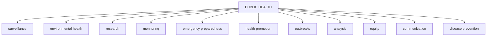

PUBLIC HEALTH BULLETIN-PAKISTAN

Vol. 3 | Week 33 29th Aug 2023

# Integrated Disease Surveillance & Response (IDSR) Report

Center of Disease Control
National Institute of Health, Islamabad

NIH Pakistan Logo Government of Pakistan Logo

# PAKISTAN

http://www.phb.nih.org.pk/

Integrated Disease Surveillance & Response (IDSR) Weekly Public Health Bulletin is your go-to resource for disease trends, outbreak alerts, and crucial public health information. By reading and sharing this bulletin, you can help increase awareness and promote preventive measures within your community. Together, let's build a safer, more resilient and healthier future for everyone.

# PROUD TO BE IN PUBLIC HEALTH

# Make a difference with your fieldwork.
## Write for PHB-Pakistan and impact lives!

Public Health Bulletin Pakistan Logo

Submit your achievements and field work
phb@nih.org

NIH Logo

NIH Logo

UK Health Security Agency Logo

World Health Organization Logo

USAID Logo

safetynet Logo

---

# Greetings
# Team PHB-Pakistan

Public Health Bulletin Pakistan logo

NIH logo

Government of Pakistan logo

## Overview

## IDSR Reports

## Ongoing Events

## Field Reports

## Preface

The Weekly Public Health Bulletin-Pakistan provides a summary of the most important public health events that occurred during week 33 of 2023. The most frequent reported cases were malaria, acute diarrhea (non-cholera), ILI, ALRI <5 years, bloody diarrhea, VH (A&E), SARI, AVH (A&E), and dog bite.

There has been an overall increase in cases of malaria and acute diarrhea (non-cholera), mostly from Sindh and KPK provinces. The recent heavy rains across the country have created ideal conditions for mosquito breeding and disrupted sewerage pipes, leading to an increase in cases. Community awareness and public health measures are essential to prevent the further spread of these diseases.

Measles and mumps cases were also reported in high numbers. All of these cases are suspected and require field verification. The health authorities are investigating the cases and taking necessary measures to control the spread of the diseases.

Field investigations are underway to verify the numbers and initiate a timely response. We must remain vigilant and continue to monitor the situation.

This issue of the bulletin also includes response reports on the measles outbreak in Kacchi, Sindh, suspected food poisoning in Gujranwala, Punjab, and an editorial note on World Breastfeeding Week. It also includes a case report on pediatric visceral leishmaniasis and a knowledge update on Kala azar disease.

Stay informed about public health issues by subscribing to the Weekly Bulletin today!

Sincerely,
The Chief Editor

NIH logo

UK Health Security Agency logo

World Health Organization logo

USAID logo

safetynet logo

---

# Overview

* During week 33, most frequent reported cases were of Malaria followed by Acute Diarrhea (Non-Cholera), ILI, ALRI <5 years, B. Diarrhea, VH (A&E), SARI, AVH (A&E) and dog bite.

* There is overall an increase in cases of Malaria and AD (Non Cholera) mostly from Sindh and KPK provinces. Recent heavy rains across the country have facilitated mosquito breeding sites and disruption of sewerage pipes resulting in rise in cases. Community awareness and public health measures are required to control the diseases.

* Measles and Mumps cases were reported in high numbers. All are suspected cases and need field verification.

All are suspected cases and need field verification.

## IDSR compliance attributes

* The national compliance rate for IDSR reporting in 113 implemented districts is 78%

* ICT and AJK are the top reporting region with a compliance rate of 100% and 96% followed by Sindh 92% and Khyber Pakhtunkhwa with 77%

* The lowest compliance rate was observed in Gilgit Baltistan.

<table>
  <thead>
    <tr>
        <th>Region</th>
        <th>Expected Reports</th>
        <th>Received Reports</th>
        <th>Compliance (%)</th>
    </tr>
  </thead>
  <tbody>
    <tr>
        <td><em>Khyber Pakhtunkhwa</em></td>
<td>1612</td>
<td>1247</td>
<td>77</td>
    </tr>
<tr>
        <td><em>Azad Jammu Kashmir</em></td>
<td>375</td>
<td>361</td>
<td>96</td>
    </tr>
<tr>
        <td><em>Islamabad Capital Territory</em></td>
<td>27</td>
<td>27</td>
<td>100</td>
    </tr>
<tr>
        <td><em>Balochistan</em></td>
<td>1075</td>
<td>681</td>
<td>63</td>
    </tr>
<tr>
        <td><em>Gilgit Baltistan</em></td>
<td>297</td>
<td>54</td>
<td>18</td>
    </tr>
<tr>
        <td><em>Sindh</em></td>
<td>1834</td>
<td>1696</td>
<td>92</td>
    </tr>
<tr>
        <td><strong>National</strong></td>
<td><strong>5220</strong></td>
<td><strong>4066</strong></td>
<td><strong>78</strong></td>
    </tr>
  </tbody>
</table>

NIH logo

UK Health Security Agency logo

World Health Organization logo

USAID logo

safetynet logo

---

Pakistan

**Table 1: Province/Area wise distribution of most frequently reported cases during week 33, Pakistan.**

<table>
    <thead>
    <tr>
        <th>Diseases</th>
        <th>AJK</th>
        <th>Balochistan</th>
        <th>GB</th>
        <th>ICT</th>
        <th>KP</th>
        <th>Punjab</th>
        <th>Sindh</th>
        <th>Total</th>
    </tr>
    </thead>
    <tr>
        <td>Malaria</td>
<td>106</td>
<td>8,699</td>
<td>2</td>
<td>4</td>
<td>8,894</td>
<td>3,577</td>
<td>93,841</td>
<td>115,123</td>
    </tr>
<tr>
        <td>AD (Non-Cholera)</td>
<td>2499</td>
<td>7,488</td>
<td>242</td>
<td>553</td>
<td>33,458</td>
<td>93,054</td>
<td>58,571</td>
<td>195,865</td>
    </tr>
<tr>
        <td>ILI</td>
<td>2,576</td>
<td>4,242</td>
<td>59</td>
<td>989</td>
<td>3,697</td>
<td>245</td>
<td>16,507</td>
<td>28,315</td>
    </tr>
<tr>
        <td>ALRI &lt; 5 years</td>
<td>790</td>
<td>1,793</td>
<td>61</td>
<td>0</td>
<td>952</td>
<td>15</td>
<td>10,190</td>
<td>13,801</td>
    </tr>
<tr>
        <td>B. Diarrhea</td>
<td>118</td>
<td>1935</td>
<td>31</td>
<td>3</td>
<td>1169</td>
<td>2,989</td>
<td>4,393</td>
<td>10,638</td>
    </tr>
<tr>
        <td>VH (B, C & D)</td>
<td>23</td>
<td>128</td>
<td>0</td>
<td>1</td>
<td>280</td>
<td>NR</td>
<td>5284</td>
<td>5,716</td>
    </tr>
<tr>
        <td>Typhoid</td>
<td>54</td>
<td>755</td>
<td>18</td>
<td>2</td>
<td>1223</td>
<td>4474</td>
<td>2,031</td>
<td>8,557</td>
    </tr>
<tr>
        <td>SARI</td>
<td>313</td>
<td>1017</td>
<td>119</td>
<td>0</td>
<td>2187</td>
<td>NR</td>
<td>359</td>
<td>3,995</td>
    </tr>
<tr>
        <td>AVH (A & E)</td>
<td>40</td>
<td>25</td>
<td>2</td>
<td>7</td>
<td>366</td>
<td>0</td>
<td>1082</td>
<td>1,522</td>
    </tr>
<tr>
        <td>Dog Bite</td>
<td>73</td>
<td>90</td>
<td>0</td>
<td>0</td>
<td>202</td>
<td>NR</td>
<td>646</td>
<td>1,011</td>
    </tr>
<tr>
        <td>Mumps</td>
<td>104</td>
<td>93</td>
<td>9</td>
<td>0</td>
<td>128</td>
<td>NR</td>
<td>254</td>
<td>588</td>
    </tr>
<tr>
        <td>AWD (S. Cholera)</td>
<td>67</td>
<td>193</td>
<td>61</td>
<td>0</td>
<td>93</td>
<td>1</td>
<td>33</td>
<td>448</td>
    </tr>
<tr>
        <td>CL</td>
<td>0</td>
<td>138</td>
<td>0</td>
<td>0</td>
<td>255</td>
<td>4</td>
<td>0</td>
<td>397</td>
    </tr>
<tr>
        <td>Measles</td>
<td>12</td>
<td>36</td>
<td>3</td>
<td>0</td>
<td>151</td>
<td>NR</td>
<td>35</td>
<td>237</td>
    </tr>
<tr>
        <td>Chickenpox/ Varicella</td>
<td>25</td>
<td>5</td>
<td>2</td>
<td>1</td>
<td>131</td>
<td>125</td>
<td>15</td>
<td>304</td>
    </tr>
<tr>
        <td>Gonorrhea</td>
<td>5</td>
<td>100</td>
<td>1</td>
<td>0</td>
<td>16</td>
<td>NR</td>
<td>36</td>
<td>158</td>
    </tr>
<tr>
        <td>Dengue</td>
<td>1</td>
<td>5</td>
<td>0</td>
<td>0</td>
<td>29</td>
<td>NR</td>
<td>110</td>
<td>145</td>
    </tr>
<tr>
        <td>Pertussis</td>
<td>6</td>
<td>38</td>
<td>1</td>
<td>0</td>
<td>13</td>
<td>NR</td>
<td>2</td>
<td>60</td>
    </tr>
<tr>
        <td>AFP</td>
<td>23</td>
<td>0</td>
<td>0</td>
<td>0</td>
<td>20</td>
<td>0</td>
<td>15</td>
<td>58</td>
    </tr>
<tr>
        <td>HIV/AIDS</td>
<td>0</td>
<td>16</td>
<td>7</td>
<td>0</td>
<td>3</td>
<td>NR</td>
<td>14</td>
<td>40</td>
    </tr>
<tr>
        <td>Syphilis</td>
<td>2</td>
<td>13</td>
<td>0</td>
<td>0</td>
<td>7</td>
<td>NR</td>
<td>12</td>
<td>34</td>
    </tr>
<tr>
        <td>Meningitis</td>
<td>5</td>
<td>0</td>
<td>0</td>
<td>0</td>
<td>3</td>
<td>NR</td>
<td>15</td>
<td>23</td>
    </tr>
<tr>
        <td>Brucellosis</td>
<td>0</td>
<td>7</td>
<td>0</td>
<td>0</td>
<td>16</td>
<td>NR</td>
<td>0</td>
<td>23</td>
    </tr>
<tr>
        <td>VL</td>
<td>0</td>
<td>12</td>
<td>0</td>
<td>0</td>
<td>6</td>
<td>NR</td>
<td>0</td>
<td>18</td>
    </tr>
<tr>
        <td>Diphtheria (Probable)</td>
<td>0</td>
<td>3</td>
<td>0</td>
<td>0</td>
<td>7</td>
<td>NR</td>
<td>0</td>
<td>10</td>
    </tr>
<tr>
        <td>NT</td>
<td>0</td>
<td>2</td>
<td>0</td>
<td>0</td>
<td>4</td>
<td>NR</td>
<td>2</td>
<td>8</td>
    </tr>
<tr>
        <td>Anthrax</td>
<td>0</td>
<td>0</td>
<td>0</td>
<td>0</td>
<td>0</td>
<td>NR</td>
<td>0</td>
<td>0</td>
    </tr>
<tr>
        <td>Leprosy</td>
<td>0</td>
<td>1</td>
<td>0</td>
<td>0</td>
<td>2</td>
<td>NR</td>
<td>1</td>
<td>4</td>
    </tr>
</table>

**Figure 1: Most frequently reported suspected cases during week 33, Pakistan**

<table>
  <thead>
    <tr>
        <th>Disease</th>
        <th>Week 31</th>
        <th>Week 32</th>
        <th>Week 33</th>
    </tr>
  </thead>
  <tbody>
    <tr>
        <td>AD (Non-Cholera)</td>
<td> </td>
<td> </td>
<td>195865</td>
    </tr>
<tr>
        <td>Malaria</td>
<td> </td>
<td> </td>
<td>115123</td>
    </tr>
<tr>
        <td>ILI</td>
<td> </td>
<td> </td>
<td>28315</td>
    </tr>
<tr>
        <td>ALRI &lt; 5 years</td>
<td> </td>
<td> </td>
<td>13801</td>
    </tr>
<tr>
        <td>B. Diarrhea</td>
<td> </td>
<td> </td>
<td>10638</td>
    </tr>
<tr>
        <td>Typhoid</td>
<td> </td>
<td> </td>
<td>8557</td>
    </tr>
<tr>
        <td>VH (B, C &amp; D)</td>
<td> </td>
<td> </td>
<td>5716</td>
    </tr>
<tr>
        <td>SARI</td>
<td> </td>
<td> </td>
<td>3995</td>
    </tr>
<tr>
        <td>AVH (A &amp; E)</td>
<td> </td>
<td> </td>
<td>1522</td>
    </tr>
<tr>
        <td>Dog Bite</td>
<td> </td>
<td> </td>
<td>1011</td>
    </tr>
  </tbody>
</table>

NIH Pakistan logo

UK Health Security Agency logo

World Health Organization logo

USAID logo

safetynet logo

---

# Sindh

* Malaria cases were maximum followed by AD (Non-Cholera), ILI, ALRI<5 Years, VH (B, C, D), B. Diarrhea, Typhoid, AVH (A&E), dog bite, SARI.

* Malaria cases are from Larkana, Badin, Kambar, MirpurKhas, and Thatta whereas AD cases are mostly from Badin, Dadu and Khairpur.

* Cases of AVH (A&E) reported in high numbers from Thatta, Sujawal and Larkana. Field investigation is required to identify the source to control the spread of disease.

* Trend for Malaria showed a sharp spike whereas AD and ILI cases declined this week.

Table 2: District wise distribution of most frequently reported suspected cases during week 33, Sindh

<table>
    <thead>
    <tr>
        <th>DISTRICTS</th>
        <th>Malaria</th>
        <th>AD (Non-
Cholera)</th>
        <th>ILI</th>
        <th>ALRI &lt; 5 
years</th>
        <th>VH (B, C 
& D)</th>
        <th>B. 
Diarrhea</th>
        <th>Typhoid</th>
        <th>AVH (A & 
E)</th>
        <th>Dog Bite</th>
        <th>SARI</th>
    </tr>
    </thead>
    <tr>
        <td>Badin</td>
<td>9,198</td>
<td>4,334</td>
<td>317</td>
<td>745</td>
<td>430</td>
<td>363</td>
<td>129</td>
<td>57</td>
<td>51</td>
<td>0</td>
    </tr>
<tr>
        <td>Dadu</td>
<td>4,576</td>
<td>4,651</td>
<td>355</td>
<td>1,148</td>
<td>7</td>
<td>652</td>
<td>455</td>
<td>5</td>
<td>0</td>
<td>86</td>
    </tr>
<tr>
        <td>Ghotki</td>
<td>1,453</td>
<td>1,464</td>
<td>0</td>
<td>352</td>
<td>492</td>
<td>139</td>
<td>6</td>
<td>1</td>
<td>0</td>
<td>0</td>
    </tr>
<tr>
        <td>Hyderabad</td>
<td>549</td>
<td>1,920</td>
<td>216</td>
<td>18</td>
<td>59</td>
<td>1</td>
<td>10</td>
<td>0</td>
<td>0</td>
<td>0</td>
    </tr>
<tr>
        <td>Jacobabad</td>
<td>1,639</td>
<td>1,822</td>
<td>129</td>
<td>1,280</td>
<td>143</td>
<td>172</td>
<td>16</td>
<td>0</td>
<td>51</td>
<td>56</td>
    </tr>
<tr>
        <td>Jamshoro</td>
<td>2,019</td>
<td>2,311</td>
<td>335</td>
<td>161</td>
<td>162</td>
<td>163</td>
<td>105</td>
<td>3</td>
<td>53</td>
<td>16</td>
    </tr>
<tr>
        <td>Kamber</td>
<td>5,617</td>
<td>2,464</td>
<td>0</td>
<td>195</td>
<td>59</td>
<td>177</td>
<td>31</td>
<td>0</td>
<td>0</td>
<td>0</td>
    </tr>
<tr>
        <td>Karachi Central</td>
<td>86</td>
<td>1,036</td>
<td>1,329</td>
<td>61</td>
<td>154</td>
<td>60</td>
<td>103</td>
<td>17</td>
<td>0</td>
<td>0</td>
    </tr>
<tr>
        <td>Karachi East</td>
<td>71</td>
<td>302</td>
<td>83</td>
<td>0</td>
<td>1</td>
<td>9</td>
<td>0</td>
<td>0</td>
<td>2</td>
<td>0</td>
    </tr>
<tr>
        <td>Karachi Keamari</td>
<td>8</td>
<td>587</td>
<td>279</td>
<td>29</td>
<td>0</td>
<td>2</td>
<td>6</td>
<td>1</td>
<td>0</td>
<td>0</td>
    </tr>
<tr>
        <td>Karachi Korangi</td>
<td>62</td>
<td>349</td>
<td>3</td>
<td>0</td>
<td>0</td>
<td>3</td>
<td>0</td>
<td>0</td>
<td>1</td>
<td>0</td>
    </tr>
<tr>
        <td>Karachi Malir</td>
<td>169</td>
<td>1,483</td>
<td>2,016</td>
<td>452</td>
<td>21</td>
<td>67</td>
<td>22</td>
<td>3</td>
<td>7</td>
<td>39</td>
    </tr>
<tr>
        <td>Karachi South</td>
<td>30</td>
<td>109</td>
<td>0</td>
<td>0</td>
<td>0</td>
<td>1</td>
<td>1</td>
<td>0</td>
<td>0</td>
<td>0</td>
    </tr>
<tr>
        <td>Karachi West</td>
<td>131</td>
<td>837</td>
<td>680</td>
<td>139</td>
<td>18</td>
<td>37</td>
<td>44</td>
<td>3</td>
<td>44</td>
<td>52</td>
    </tr>
<tr>
        <td>Kashmore</td>
<td>1,975</td>
<td>770</td>
<td>352</td>
<td>193</td>
<td>75</td>
<td>79</td>
<td>18</td>
<td>0</td>
<td>0</td>
<td>0</td>
    </tr>
<tr>
        <td>Khairpur</td>
<td>5,114</td>
<td>3,399</td>
<td>590</td>
<td>875</td>
<td>185</td>
<td>365</td>
<td>279</td>
<td>11</td>
<td>27</td>
<td>0</td>
    </tr>
<tr>
        <td>Larkana</td>
<td>12,480</td>
<td>2,546</td>
<td>0</td>
<td>231</td>
<td>144</td>
<td>362</td>
<td>70</td>
<td>193</td>
<td>0</td>
<td>0</td>
    </tr>
<tr>
        <td>Matiari</td>
<td>1,642</td>
<td>2,708</td>
<td>11</td>
<td>322</td>
<td>398</td>
<td>117</td>
<td>19</td>
<td>6</td>
<td>11</td>
<td>0</td>
    </tr>
<tr>
        <td>Mirpurkhas</td>
<td>6,618</td>
<td>2,874</td>
<td>3,258</td>
<td>540</td>
<td>171</td>
<td>92</td>
<td>52</td>
<td>4</td>
<td>7</td>
<td>0</td>
    </tr>
<tr>
        <td>Naushero Feroze</td>
<td>2,422</td>
<td>2,095</td>
<td>588</td>
<td>137</td>
<td>99</td>
<td>109</td>
<td>118</td>
<td>0</td>
<td>68</td>
<td>0</td>
    </tr>
<tr>
        <td>Sanghar</td>
<td>2,644</td>
<td>2,856</td>
<td>35</td>
<td>481</td>
<td>1,069</td>
<td>73</td>
<td>65</td>
<td>3</td>
<td>187</td>
<td>7</td>
    </tr>
<tr>
        <td>Shaheed Benazirabad</td>
<td>2,310</td>
<td>2,882</td>
<td>21</td>
<td>452</td>
<td>136</td>
<td>110</td>
<td>278</td>
<td>0</td>
<td>0</td>
<td>3</td>
    </tr>
<tr>
        <td>Shikarpur</td>
<td>1,648</td>
<td>1,644</td>
<td>0</td>
<td>143</td>
<td>120</td>
<td>174</td>
<td>9</td>
<td>0</td>
<td>28</td>
<td>14</td>
    </tr>
<tr>
        <td>Sujawal</td>
<td>6,112</td>
<td>1,847</td>
<td>0</td>
<td>356</td>
<td>200</td>
<td>127</td>
<td>0</td>
<td>270</td>
<td>22</td>
<td>0</td>
    </tr>
<tr>
        <td>Sukkur</td>
<td>3,565</td>
<td>2,122</td>
<td>1,647</td>
<td>338</td>
<td>546</td>
<td>258</td>
<td>13</td>
<td>0</td>
<td>0</td>
<td>0</td>
    </tr>
<tr>
        <td>Tando Allahyar</td>
<td>2,028</td>
<td>1,958</td>
<td>599</td>
<td>254</td>
<td>171</td>
<td>141</td>
<td>23</td>
<td>9</td>
<td>24</td>
<td>0</td>
    </tr>
<tr>
        <td>Tando Muhammad 
Khan</td>
<td>4,132</td>
<td>1,444</td>
<td>0</td>
<td>266</td>
<td>104</td>
<td>118</td>
<td>6</td>
<td>0</td>
<td>29</td>
<td>0</td>
    </tr>
<tr>
        <td>Tharparkar</td>
<td>3,341</td>
<td>1,504</td>
<td>1,749</td>
<td>434</td>
<td>86</td>
<td>124</td>
<td>35</td>
<td>20</td>
<td>6</td>
<td>61</td>
    </tr>
<tr>
        <td>Thatta</td>
<td>6,621</td>
<td>2,202</td>
<td>1,915</td>
<td>312</td>
<td>90</td>
<td>178</td>
<td>64</td>
<td>473</td>
<td>28</td>
<td>10</td>
    </tr>
<tr>
        <td>Umerkot</td>
<td>5,581</td>
<td>2,051</td>
<td>0</td>
<td>276</td>
<td>144</td>
<td>120</td>
<td>54</td>
<td>3</td>
<td>0</td>
<td>15</td>
    </tr>
<tr>
        <td>Total</td>
<td>93,841</td>
<td>58,571</td>
<td>16,507</td>
<td>10,190</td>
<td>5,284</td>
<td>4,393</td>
<td>2,031</td>
<td>1,082</td>
<td>646</td>
<td>359</td>
    </tr>
</table>

Figure 2: Most frequently reported suspected cases during week 33, Sindh

<table>
  <thead>
    <tr>
        <th>Disease</th>
        <th>WK 31</th>
        <th>WK 32</th>
        <th>WK 33</th>
    </tr>
  </thead>
  <tbody>
    <tr>
        <td>Malaria</td>
<td>61000</td>
<td>78000</td>
<td>93841</td>
    </tr>
<tr>
        <td>AD (Non-Cholera)</td>
<td>50000</td>
<td>60000</td>
<td>58571</td>
    </tr>
<tr>
        <td>ILI</td>
<td>17000</td>
<td>18000</td>
<td>16507</td>
    </tr>
<tr>
        <td>ALRI &lt; 5 years</td>
<td>9000</td>
<td>10000</td>
<td>10190</td>
    </tr>
<tr>
        <td>VH (B, C &amp; D)</td>
<td>4500</td>
<td>5500</td>
<td>5284</td>
    </tr>
<tr>
        <td>B. Diarrhea</td>
<td>3500</td>
<td>4500</td>
<td>4393</td>
    </tr>
<tr>
        <td>Typhoid</td>
<td>1000</td>
<td>1500</td>
<td>2031</td>
    </tr>
<tr>
        <td>AVH (A &amp; E)</td>
<td>500</td>
<td>800</td>
<td>1082</td>
    </tr>
<tr>
        <td>Dog Bite</td>
<td>400</td>
<td>500</td>
<td>646</td>
    </tr>
<tr>
        <td>SARI</td>
<td>200</td>
<td>300</td>
<td>359</td>
    </tr>
  </tbody>
</table>

NIH logo

UK Health Security Agency logo

World Health Organization logo

USAID logo

safetynet logo

---

# Balochistan
* Malaria, AD (Non-Cholera), ILI, B. Diarrhea, ALRI <5 years, SARI, Typhoid, AWD (S. Cholera),CL and VH (A&E) and Gonorrhea were the most frequently reported diseases from Balochistan province.
* Trend for Malaria and ILI showed an increase whereas AD cases declined this week.
* Cases of malaria and AD( Non-Cholera) reported in high numbers from Sohbatpur and Jaffarabad. All are suspected cases and need field investigation to verify the cases.

**Table 3: District wise distribution of most frequently reported suspected cases during week 33, Balochistan**

<table>
  <thead>
    <tr>
      <th>Districts</th>
      <th>Malaria</th>
      <th>AD (Non-
Cholera)</th>
      <th>ILI</th>
      <th>B. 
Diarrhea</th>
      <th>ALRI &lt; 5 
years</th>
      <th>SARI</th>
      <th>Typhoid</th>
      <th>AWD (S. 
Cholera)</th>
      <th>CL</th>
      <th>VH (B, C & D)</th>
    </tr>
  </thead>
  <tbody>
    <tr>
      <td>Chagai</td>
<td>22</td>
<td>155</td>
<td>232</td>
<td>49</td>
<td>0</td>
<td>0</td>
<td>26</td>
<td>13</td>
<td>0</td>
<td>0</td>
    </tr>
<tr>
      <td>Dera Bugti</td>
<td>346</td>
<td>76</td>
<td>19</td>
<td>55</td>
<td>36</td>
<td>30</td>
<td>17</td>
<td>9</td>
<td>1</td>
<td>0</td>
    </tr>
<tr>
      <td>Duki</td>
<td>201</td>
<td>174</td>
<td>96</td>
<td>89</td>
<td>29</td>
<td>44</td>
<td>13</td>
<td>37</td>
<td>5</td>
<td>0</td>
    </tr>
<tr>
      <td>Gwadar</td>
<td>116</td>
<td>252</td>
<td>442</td>
<td>48</td>
<td>13</td>
<td>1</td>
<td>2</td>
<td>NR</td>
<td>NR</td>
<td>NR</td>
    </tr>
<tr>
      <td>Harnai</td>
<td>80</td>
<td>118</td>
<td>6</td>
<td>277</td>
<td>237</td>
<td>0</td>
<td>1</td>
<td>16</td>
<td>0</td>
<td>1</td>
    </tr>
<tr>
      <td>Hub</td>
<td>349</td>
<td>384</td>
<td>77</td>
<td>53</td>
<td>8</td>
<td>178</td>
<td>11</td>
<td>6</td>
<td>21</td>
<td>43</td>
    </tr>
<tr>
      <td>Jaffarabad</td>
<td>1,601</td>
<td>1,019</td>
<td>144</td>
<td>147</td>
<td>160</td>
<td>50</td>
<td>29</td>
<td>1</td>
<td>5</td>
<td>21</td>
    </tr>
<tr>
      <td>Jhal Magsi</td>
<td>507</td>
<td>383</td>
<td>46</td>
<td>21</td>
<td>45</td>
<td>2</td>
<td>7</td>
<td>0</td>
<td>0</td>
<td>0</td>
    </tr>
<tr>
      <td>Kachhi (Bolan)</td>
<td>93</td>
<td>96</td>
<td>34</td>
<td>10</td>
<td>4</td>
<td>11</td>
<td>31</td>
<td>1</td>
<td>0</td>
<td>0</td>
    </tr>
<tr>
      <td>Kalat</td>
<td>33</td>
<td>28</td>
<td>2</td>
<td>7</td>
<td>9</td>
<td>0</td>
<td>17</td>
<td>0</td>
<td>4</td>
<td>0</td>
    </tr>
<tr>
      <td>Kech (Turbat)</td>
<td>449</td>
<td>365</td>
<td>636</td>
<td>58</td>
<td>61</td>
<td>2</td>
<td>1</td>
<td>0</td>
<td>0</td>
<td>0</td>
    </tr>
<tr>
      <td>Kharan</td>
<td>131</td>
<td>120</td>
<td>225</td>
<td>68</td>
<td>0</td>
<td>0</td>
<td>9</td>
<td>11</td>
<td>0</td>
<td>0</td>
    </tr>
<tr>
      <td>Khuzdar</td>
<td>166</td>
<td>185</td>
<td>123</td>
<td>53</td>
<td>2</td>
<td>3</td>
<td>40</td>
<td>2</td>
<td>0</td>
<td>1</td>
    </tr>
<tr>
      <td>Killa Saifullah</td>
<td>376</td>
<td>314</td>
<td>0</td>
<td>121</td>
<td>191</td>
<td>134</td>
<td>54</td>
<td>11</td>
<td>28</td>
<td>0</td>
    </tr>
<tr>
      <td>Kohlu</td>
<td>250</td>
<td>173</td>
<td>355</td>
<td>129</td>
<td>24</td>
<td>51</td>
<td>58</td>
<td>31</td>
<td>4</td>
<td>4</td>
    </tr>
<tr>
      <td>Lasbella</td>
<td>755</td>
<td>595</td>
<td>71</td>
<td>45</td>
<td>455</td>
<td>41</td>
<td>22</td>
<td>0</td>
<td>12</td>
<td>3</td>
    </tr>
<tr>
      <td>Loralai</td>
<td>103</td>
<td>259</td>
<td>270</td>
<td>62</td>
<td>53</td>
<td>96</td>
<td>33</td>
<td>6</td>
<td>0</td>
<td>0</td>
    </tr>
<tr>
      <td>Mastung</td>
<td>339</td>
<td>759</td>
<td>132</td>
<td>103</td>
<td>65</td>
<td>63</td>
<td>146</td>
<td>22</td>
<td>17</td>
<td>34</td>
    </tr>
<tr>
      <td>Naseerabad</td>
<td>648</td>
<td>226</td>
<td>0</td>
<td>6</td>
<td>4</td>
<td>0</td>
<td>37</td>
<td>4</td>
<td>0</td>
<td>6</td>
    </tr>
<tr>
      <td>Nushki</td>
<td>174</td>
<td>227</td>
<td>0</td>
<td>89</td>
<td>0</td>
<td>4</td>
<td>0</td>
<td>8</td>
<td>0</td>
<td>0</td>
    </tr>
<tr>
      <td>Panjgur</td>
<td>251</td>
<td>63</td>
<td>42</td>
<td>25</td>
<td>22</td>
<td>21</td>
<td>8</td>
<td>0</td>
<td>0</td>
<td>0</td>
    </tr>
<tr>
      <td>Pishin</td>
<td>19</td>
<td>99</td>
<td>125</td>
<td>61</td>
<td>9</td>
<td>0</td>
<td>27</td>
<td>0</td>
<td>11</td>
<td>0</td>
    </tr>
<tr>
      <td>Quetta</td>
<td>23</td>
<td>489</td>
<td>746</td>
<td>102</td>
<td>30</td>
<td>71</td>
<td>34</td>
<td>2</td>
<td>7</td>
<td>1</td>
    </tr>
<tr>
      <td>Sherani</td>
<td>17</td>
<td>11</td>
<td>19</td>
<td>10</td>
<td>0</td>
<td>0</td>
<td>6</td>
<td>0</td>
<td>4</td>
<td>0</td>
    </tr>
<tr>
      <td>Sibi</td>
<td>252</td>
<td>140</td>
<td>175</td>
<td>29</td>
<td>18</td>
<td>26</td>
<td>27</td>
<td>9</td>
<td>11</td>
<td>1</td>
    </tr>
<tr>
      <td>Sohbat pur</td>
<td>1,018</td>
<td>544</td>
<td>3</td>
<td>166</td>
<td>110</td>
<td>135</td>
<td>59</td>
<td>2</td>
<td>8</td>
<td>13</td>
    </tr>
<tr>
      <td>SURAB</td>
<td>94</td>
<td>54</td>
<td>62</td>
<td>1</td>
<td>9</td>
<td>10</td>
<td>29</td>
<td>0</td>
<td>0</td>
<td>0</td>
    </tr>
<tr>
      <td>Washuk</td>
<td>125</td>
<td>57</td>
<td>76</td>
<td>10</td>
<td>3</td>
<td>0</td>
<td>3</td>
<td>0</td>
<td>0</td>
<td>0</td>
    </tr>
<tr>
      <td>Zhob</td>
<td>161</td>
<td>123</td>
<td>84</td>
<td>41</td>
<td>196</td>
<td>44</td>
<td>8</td>
<td>2</td>
<td>0</td>
<td>0</td>
    </tr>
<tr>
      <td>Total</td>
<td>8,699</td>
<td>7,488</td>
<td>4,242</td>
<td>1,935</td>
<td>1,793</td>
<td>1,017</td>
<td>755</td>
<td>193</td>
<td>138</td>
<td>128</td>
    </tr>
  </tbody>
</table>

**Figure 3: Most frequently reported suspected cases during week 33, Balochistan**

<table>
  <thead>
    <tr>
        <th>Disease</th>
        <th>WK 31</th>
        <th>WK 32</th>
        <th>WK 33</th>
    </tr>
  </thead>
  <tbody>
    <tr>
        <td>Malaria</td>
<td>6100</td>
<td>7300</td>
<td>8,699</td>
    </tr>
<tr>
        <td>AD (Non-Cholera)</td>
<td>6800</td>
<td>7700</td>
<td>7,488</td>
    </tr>
<tr>
        <td>ILI</td>
<td>4000</td>
<td>3500</td>
<td>4,242</td>
    </tr>
<tr>
        <td>B. Diarrhea</td>
<td>1800</td>
<td>1900</td>
<td>1,935</td>
    </tr>
<tr>
        <td>ALRI &lt; 5 years</td>
<td>1800</td>
<td>2200</td>
<td>1,793</td>
    </tr>
<tr>
        <td>SARI</td>
<td>800</td>
<td>1100</td>
<td>1,017</td>
    </tr>
<tr>
        <td>Typhoid</td>
<td>700</td>
<td>800</td>
<td>755</td>
    </tr>
<tr>
        <td>AWD (S. Cholera)</td>
<td>300</td>
<td>100</td>
<td>193</td>
    </tr>
<tr>
        <td>CL</td>
<td>100</td>
<td>100</td>
<td>138</td>
    </tr>
<tr>
        <td>VH (B, C &amp; D)</td>
<td>100</td>
<td>100</td>
<td>128</td>
    </tr>
  </tbody>
</table>

NIH logo

UK Health Security Agency logo

World Health Organization logo

USAID logo

safetynet logo

---

# Khyber Pakhtunkhwa

* Cases of AD (Non-Cholera) were the most frequently reported cases followed by Malaria, ILI, SB. Diarrhea, ALRI<5 Years, Typhoid, CL, AVH (A&E) and AVH (B&C) cases.

* There is sharp decline trend in cases of AD (Non Cholera) this week.

* Cutaneous Leishmaniasis cases increased and mostly reported from lower Dir, Karak, Hango and Noweshera. Field investigations required to verify cases.

Table 4: District wise distribution of most frequently reported suspected cases during week 33, KP

<table>
  <thead>
    <tr>
        <th>Districts</th>
        <th>AD (Non-Cholera)</th>
        <th>Malaria</th>
        <th>ILI</th>
        <th>Sari</th>
        <th>Typhoid</th>
        <th>B. Diarrhea</th>
        <th>ALRI &lt;5 Years</th>
        <th>AVH (A &amp; E)</th>
        <th>VH (B, C &amp; D)</th>
        <th>CL</th>
    </tr>
  </thead>
  <tbody>
    <tr>
        <td>Abbottabad</td>
<td>741</td>
<td>2</td>
<td>6</td>
<td>9</td>
<td>18</td>
<td>5</td>
<td>9</td>
<td>0</td>
<td>1</td>
<td>0</td>
    </tr>
<tr>
        <td>Bajaur</td>
<td>330</td>
<td>183</td>
<td>29</td>
<td>1</td>
<td>3</td>
<td>39</td>
<td>8</td>
<td>0</td>
<td>0</td>
<td>3</td>
    </tr>
<tr>
        <td>Bannu</td>
<td>683</td>
<td>1,239</td>
<td>53</td>
<td>8</td>
<td>26</td>
<td>4</td>
<td>0</td>
<td>0</td>
<td>2</td>
<td>0</td>
    </tr>
<tr>
        <td>Buner</td>
<td>781</td>
<td>840</td>
<td>0</td>
<td>0</td>
<td>20</td>
<td>1</td>
<td>0</td>
<td>0</td>
<td>0</td>
<td>0</td>
    </tr>
<tr>
        <td>Charsadda</td>
<td>1,436</td>
<td>114</td>
<td>149</td>
<td>18</td>
<td>0</td>
<td>0</td>
<td>2</td>
<td>0</td>
<td>0</td>
<td>0</td>
    </tr>
<tr>
        <td>Chitral Lower</td>
<td>837</td>
<td>30</td>
<td>149</td>
<td>591</td>
<td>6</td>
<td>0</td>
<td>3</td>
<td>14</td>
<td>0</td>
<td>9</td>
    </tr>
<tr>
        <td>Chitral Upper</td>
<td>111</td>
<td>18</td>
<td>0</td>
<td>168</td>
<td>13</td>
<td>0</td>
<td>0</td>
<td>1</td>
<td>0</td>
<td>0</td>
    </tr>
<tr>
        <td>D.I. Khan</td>
<td>1,116</td>
<td>1,010</td>
<td>19</td>
<td>39</td>
<td>4</td>
<td>18</td>
<td>15</td>
<td>0</td>
<td>0</td>
<td>2</td>
    </tr>
<tr>
        <td>Dir Lower</td>
<td>2,410</td>
<td>812</td>
<td>0</td>
<td>2</td>
<td>40</td>
<td>175</td>
<td>172</td>
<td>48</td>
<td>2</td>
<td>2</td>
    </tr>
<tr>
        <td>Dir Upper</td>
<td>1,600</td>
<td>7</td>
<td>6</td>
<td>0</td>
<td>2</td>
<td>34</td>
<td>24</td>
<td>2</td>
<td>0</td>
<td>5</td>
    </tr>
<tr>
        <td>Hangu</td>
<td>332</td>
<td>595</td>
<td>146</td>
<td>66</td>
<td>25</td>
<td>15</td>
<td>7</td>
<td>0</td>
<td>4</td>
<td>34</td>
    </tr>
<tr>
        <td>Haripur</td>
<td>1,276</td>
<td>78</td>
<td>287</td>
<td>20</td>
<td>85</td>
<td>3</td>
<td>95</td>
<td>63</td>
<td>21</td>
<td>0</td>
    </tr>
<tr>
        <td>Karak</td>
<td>367</td>
<td>309</td>
<td>35</td>
<td>27</td>
<td>13</td>
<td>4</td>
<td>4</td>
<td>0</td>
<td>0</td>
<td>106</td>
    </tr>
<tr>
        <td>Khyber</td>
<td>5</td>
<td>1</td>
<td>0</td>
<td>3</td>
<td>5</td>
<td>5</td>
<td>0</td>
<td>0</td>
<td>0</td>
<td>0</td>
    </tr>
<tr>
        <td>Kohat</td>
<td>82</td>
<td>44</td>
<td>1</td>
<td>2</td>
<td>1</td>
<td>0</td>
<td>6</td>
<td>0</td>
<td>0</td>
<td>5</td>
    </tr>
<tr>
        <td>Kohistan Lower</td>
<td>122</td>
<td>1</td>
<td>0</td>
<td>218</td>
<td>0</td>
<td>39</td>
<td>4</td>
<td>0</td>
<td>0</td>
<td>2</td>
    </tr>
<tr>
        <td>Kohistan Upper</td>
<td>509</td>
<td>19</td>
<td>42</td>
<td>94</td>
<td>37</td>
<td>15</td>
<td>6</td>
<td>0</td>
<td>0</td>
<td>0</td>
    </tr>
<tr>
        <td>Kolai Palas</td>
<td>138</td>
<td>10</td>
<td>0</td>
<td>30</td>
<td>8</td>
<td>30</td>
<td>11</td>
<td>0</td>
<td>0</td>
<td>0</td>
    </tr>
<tr>
        <td>L &amp; C Kurram</td>
<td>41</td>
<td>20</td>
<td>111</td>
<td>0</td>
<td>4</td>
<td>9</td>
<td>2</td>
<td>0</td>
<td>0</td>
<td>0</td>
    </tr>
<tr>
        <td>Lakki Marwat</td>
<td>684</td>
<td>1,649</td>
<td>0</td>
<td>0</td>
<td>25</td>
<td>16</td>
<td>18</td>
<td>0</td>
<td>0</td>
<td>8</td>
    </tr>
<tr>
        <td>Malakand</td>
<td>1,018</td>
<td>30</td>
<td>0</td>
<td>20</td>
<td>9</td>
<td>135</td>
<td>53</td>
<td>28</td>
<td>2</td>
<td>18</td>
    </tr>
<tr>
        <td>Mansehra</td>
<td>1,001</td>
<td>6</td>
<td>591</td>
<td>28</td>
<td>19</td>
<td>45</td>
<td>39</td>
<td>10</td>
<td>7</td>
<td>1</td>
    </tr>
<tr>
        <td>Mardan</td>
<td>1,416</td>
<td>67</td>
<td>103</td>
<td>7</td>
<td>0</td>
<td>25</td>
<td>5</td>
<td>9</td>
<td>8</td>
<td>0</td>
    </tr>
<tr>
        <td>Nowshera</td>
<td>2,542</td>
<td>184</td>
<td>3</td>
<td>30</td>
<td>36</td>
<td>30</td>
<td>3</td>
<td>4</td>
<td>22</td>
<td>46</td>
    </tr>
<tr>
        <td>Peshawar</td>
<td>3,806</td>
<td>95</td>
<td>560</td>
<td>60</td>
<td>142</td>
<td>140</td>
<td>106</td>
<td>36</td>
<td>57</td>
<td>10</td>
    </tr>
<tr>
        <td>Shangla</td>
<td>2,179</td>
<td>515</td>
<td>0</td>
<td>0</td>
<td>34</td>
<td>7</td>
<td>9</td>
<td>2</td>
<td>95</td>
<td>0</td>
    </tr>
<tr>
        <td>Swabi</td>
<td>1,661</td>
<td>67</td>
<td>373</td>
<td>43</td>
<td>34</td>
<td>31</td>
<td>108</td>
<td>21</td>
<td>1</td>
<td>0</td>
    </tr>
<tr>
        <td>Swat</td>
<td>5,257</td>
<td>82</td>
<td>222</td>
<td>0</td>
<td>75</td>
<td>64</td>
<td>87</td>
<td>16</td>
<td>8</td>
<td>0</td>
    </tr>
<tr>
        <td>Tank</td>
<td>448</td>
<td>611</td>
<td>0</td>
<td>0</td>
<td>54</td>
<td>3</td>
<td>87</td>
<td>0</td>
<td>0</td>
<td>3</td>
    </tr>
<tr>
        <td>Tor Ghar</td>
<td>109</td>
<td>143</td>
<td>0</td>
<td>23</td>
<td>11</td>
<td>35</td>
<td>0</td>
<td>1</td>
<td>0</td>
<td>1</td>
    </tr>
<tr>
        <td>Upper Kurram</td>
<td>420</td>
<td>113</td>
<td>812</td>
<td>680</td>
<td>474</td>
<td>242</td>
<td>69</td>
<td>111</td>
<td>50</td>
<td>0</td>
    </tr>
<tr>
        <td>Total</td>
<td>33,458</td>
<td>8,894</td>
<td>3,697</td>
<td>2,187</td>
<td>1,223</td>
<td>1,169</td>
<td>952</td>
<td>366</td>
<td>280</td>
<td>255</td>
    </tr>
  </tbody>
</table>

Figure 4: Most frequently reported suspected cases during week 33, KP

<table>
  <thead>
    <tr>
        <th>Category</th>
        <th>WK 31</th>
        <th>WK 32</th>
        <th>WK 33</th>
    </tr>
  </thead>
  <tbody>
    <tr>
        <td>AD (Non-Cholera)</td>
<td> </td>
<td> </td>
<td>33,458</td>
    </tr>
<tr>
        <td>Malaria</td>
<td> </td>
<td> </td>
<td>8,894</td>
    </tr>
<tr>
        <td>ILI</td>
<td> </td>
<td> </td>
<td>3,697</td>
    </tr>
<tr>
        <td>SARI</td>
<td> </td>
<td> </td>
<td>2,187</td>
    </tr>
<tr>
        <td>Typhoid</td>
<td> </td>
<td> </td>
<td>1,222</td>
    </tr>
<tr>
        <td>B. Diarrhea</td>
<td> </td>
<td> </td>
<td>1,169</td>
    </tr>
<tr>
        <td>ALRI &lt; 5 years</td>
<td> </td>
<td> </td>
<td>952</td>
    </tr>
<tr>
        <td>AVH (A &amp; E)</td>
<td> </td>
<td> </td>
<td>366</td>
    </tr>
<tr>
        <td>VH (B, C &amp; D)</td>
<td> </td>
<td> </td>
<td>280</td>
    </tr>
<tr>
        <td>CL</td>
<td> </td>
<td> </td>
<td>255</td>
    </tr>
  </tbody>
</table>

NIH logo

UK Health Security Agency logo

World Health Organization logo

USAID logo

safetynet logo

---

# ICT, AJK & GB

**ICT**: The most frequently reported cases from Islamabad were ILI followed by AD (Non-Cholera). ILI cases showed a downward trend in cases this week..

**AJK**: ILI cases were maximum followed by AD (Non-Cholera) , ALRI <5 years, SARI, B. Diarrhea, Malaria, Mumps, dog bite and typhoid . Both ILI and AD cases showed a downward trend in cases this week.

**GB**: AD (Non. Cholera) cases were maximum followed by SARI,ALRI<5 years, ILI and AWD (S. Cholera). AD (Non Cholera) cases show downward trend this week.

Figure 6: Week wise reported suspected cases of ILI, ICT

<table>
  <thead>
    <tr>
        <th>Disease</th>
        <th>WK31</th>
        <th>WK32</th>
        <th>WK33</th>
    </tr>
  </thead>
  <tbody>
    <tr>
        <td>ILI</td>
<td>940</td>
<td>1090</td>
<td>989</td>
    </tr>
<tr>
        <td>AD (Non-Cholera)</td>
<td>620</td>
<td>640</td>
<td>553</td>
    </tr>
  </tbody>
</table>

Figure 6: Week wise reported suspected cases of ILI, ICT

<table>
  <thead>
    <tr>
        <th>Week</th>
        <th>ILI</th>
    </tr>
  </thead>
  <tbody>
    <tr>
        <td>W34</td>
<td>500</td>
    </tr>
<tr>
        <td>W35</td>
<td>1450</td>
    </tr>
<tr>
        <td>W36</td>
<td>200</td>
    </tr>
<tr>
        <td>W37</td>
<td>50</td>
    </tr>
<tr>
        <td>W38</td>
<td>1200</td>
    </tr>
<tr>
        <td>W39</td>
<td>950</td>
    </tr>
<tr>
        <td>W40</td>
<td>2150</td>
    </tr>
<tr>
        <td>W41</td>
<td>2300</td>
    </tr>
<tr>
        <td>W42</td>
<td>2650</td>
    </tr>
<tr>
        <td>W43</td>
<td>2600</td>
    </tr>
<tr>
        <td>W44</td>
<td>1850</td>
    </tr>
<tr>
        <td>W45</td>
<td>1700</td>
    </tr>
<tr>
        <td>W46</td>
<td>1550</td>
    </tr>
<tr>
        <td>W47</td>
<td>2450</td>
    </tr>
<tr>
        <td>W48</td>
<td>2350</td>
    </tr>
<tr>
        <td>W49</td>
<td>2650</td>
    </tr>
<tr>
        <td>W50</td>
<td>3200</td>
    </tr>
<tr>
        <td>W51</td>
<td>2450</td>
    </tr>
<tr>
        <td>W52</td>
<td>2200</td>
    </tr>
<tr>
        <td>W1</td>
<td>2000</td>
    </tr>
<tr>
        <td>W2</td>
<td>1650</td>
    </tr>
<tr>
        <td>W3</td>
<td>2000</td>
    </tr>
<tr>
        <td>W4</td>
<td>1900</td>
    </tr>
<tr>
        <td>W5</td>
<td>1850</td>
    </tr>
<tr>
        <td>W6</td>
<td>1550</td>
    </tr>
<tr>
        <td>W7</td>
<td>2350</td>
    </tr>
<tr>
        <td>W8</td>
<td>1600</td>
    </tr>
<tr>
        <td>W9</td>
<td>2250</td>
    </tr>
<tr>
        <td>W10</td>
<td>2100</td>
    </tr>
<tr>
        <td>W11</td>
<td>1700</td>
    </tr>
<tr>
        <td>W12</td>
<td>700</td>
    </tr>
<tr>
        <td>W13</td>
<td>1450</td>
    </tr>
<tr>
        <td>W14</td>
<td>1350</td>
    </tr>
<tr>
        <td>W15</td>
<td>1150</td>
    </tr>
<tr>
        <td>W16</td>
<td>650</td>
    </tr>
<tr>
        <td>W17</td>
<td>1150</td>
    </tr>
<tr>
        <td>W18</td>
<td>950</td>
    </tr>
<tr>
        <td>W19</td>
<td>1500</td>
    </tr>
<tr>
        <td>W20</td>
<td>750</td>
    </tr>
<tr>
        <td>W21</td>
<td>1150</td>
    </tr>
<tr>
        <td>W22</td>
<td>1150</td>
    </tr>
<tr>
        <td>W23</td>
<td>650</td>
    </tr>
<tr>
        <td>W24</td>
<td>1050</td>
    </tr>
<tr>
        <td>W25</td>
<td>850</td>
    </tr>
<tr>
        <td>W26</td>
<td>250</td>
    </tr>
<tr>
        <td>W27</td>
<td>650</td>
    </tr>
<tr>
        <td>W28</td>
<td>900</td>
    </tr>
<tr>
        <td>W29</td>
<td>450</td>
    </tr>
<tr>
        <td>W30</td>
<td>750</td>
    </tr>
<tr>
        <td>W31</td>
<td>950</td>
    </tr>
<tr>
        <td>W32</td>
<td>1100</td>
    </tr>
<tr>
        <td>W33</td>
<td>1000</td>
    </tr>
  </tbody>
</table>

Figure 7: Most frequently reported suspected cases during week 33, AJK

<table>
  <thead>
    <tr>
        <th>Disease</th>
        <th>WK 31</th>
        <th>WK 32</th>
        <th>WK 33</th>
    </tr>
  </thead>
  <tbody>
    <tr>
        <td>ILI</td>
<td>2310</td>
<td>2700</td>
<td>2576</td>
    </tr>
<tr>
        <td>AD (Non-Cholera)</td>
<td>2650</td>
<td>2950</td>
<td>2499</td>
    </tr>
<tr>
        <td>ALRI &lt; 5 years</td>
<td>670</td>
<td>810</td>
<td>790</td>
    </tr>
<tr>
        <td>SARI</td>
<td>380</td>
<td>370</td>
<td>313</td>
    </tr>
<tr>
        <td>B. Diarrhea</td>
<td>150</td>
<td>140</td>
<td>118</td>
    </tr>
<tr>
        <td>Malaria</td>
<td>120</td>
<td>150</td>
<td>106</td>
    </tr>
<tr>
        <td>Mumps</td>
<td>110</td>
<td>100</td>
<td>104</td>
    </tr>
<tr>
        <td>Dog Bite</td>
<td>100</td>
<td>100</td>
<td>73</td>
    </tr>
<tr>
        <td>AWD (S. Cholera)</td>
<td>60</td>
<td>70</td>
<td>67</td>
    </tr>
<tr>
        <td>Typhoid</td>
<td>60</td>
<td>60</td>
<td>54</td>
    </tr>
  </tbody>
</table>

NIH logo

UK Health Security Agency logo

World Health Organization logo

USAID logo

safetynet logo

---

Figure 8: Week wise reported suspected cases of AD (Non-Cholera) and ILI, AJK

<table>
  <thead>
    <tr>
        <th>Quarter</th>
        <th>Week</th>
        <th>ILI</th>
        <th>AD (Non-Cholera)</th>
    </tr>
  </thead>
  <tbody>
    <tr>
        <td>3rd Quarter 2022</td>
<td>W34</td>
<td>100</td>
<td>200</td>
    </tr>
<tr>
        <td>3rd Quarter 2022</td>
<td>W35</td>
<td>100</td>
<td>200</td>
    </tr>
<tr>
        <td>3rd Quarter 2022</td>
<td>W36</td>
<td>100</td>
<td>200</td>
    </tr>
<tr>
        <td>3rd Quarter 2022</td>
<td>W37</td>
<td>100</td>
<td>200</td>
    </tr>
<tr>
        <td>3rd Quarter 2022</td>
<td>W38</td>
<td>100</td>
<td>200</td>
    </tr>
<tr>
        <td>3rd Quarter 2022</td>
<td>W39</td>
<td>250</td>
<td>250</td>
    </tr>
<tr>
        <td>4th Quarter 2022</td>
<td>W40</td>
<td>450</td>
<td>250</td>
    </tr>
<tr>
        <td>4th Quarter 2022</td>
<td>W41</td>
<td>750</td>
<td>450</td>
    </tr>
<tr>
        <td>4th Quarter 2022</td>
<td>W42</td>
<td>850</td>
<td>450</td>
    </tr>
<tr>
        <td>4th Quarter 2022</td>
<td>W43</td>
<td>850</td>
<td>450</td>
    </tr>
<tr>
        <td>4th Quarter 2022</td>
<td>W44</td>
<td>1000</td>
<td>500</td>
    </tr>
<tr>
        <td>4th Quarter 2022</td>
<td>W45</td>
<td>1050</td>
<td>500</td>
    </tr>
<tr>
        <td>4th Quarter 2022</td>
<td>W46</td>
<td>1100</td>
<td>300</td>
    </tr>
<tr>
        <td>4th Quarter 2022</td>
<td>W47</td>
<td>1700</td>
<td>500</td>
    </tr>
<tr>
        <td>4th Quarter 2022</td>
<td>W48</td>
<td>1400</td>
<td>350</td>
    </tr>
<tr>
        <td>4th Quarter 2022</td>
<td>W49</td>
<td>1250</td>
<td>350</td>
    </tr>
<tr>
        <td>4th Quarter 2022</td>
<td>W50</td>
<td>1800</td>
<td>450</td>
    </tr>
<tr>
        <td>4th Quarter 2022</td>
<td>W51</td>
<td>2600</td>
<td>600</td>
    </tr>
<tr>
        <td>4th Quarter 2022</td>
<td>W52</td>
<td>2200</td>
<td>700</td>
    </tr>
<tr>
        <td>1st Quarter 2023</td>
<td>W1</td>
<td>2250</td>
<td>800</td>
    </tr>
<tr>
        <td>1st Quarter 2023</td>
<td>W2</td>
<td>2000</td>
<td>850</td>
    </tr>
<tr>
        <td>1st Quarter 2023</td>
<td>W3</td>
<td>1700</td>
<td>600</td>
    </tr>
<tr>
        <td>1st Quarter 2023</td>
<td>W4</td>
<td>1700</td>
<td>700</td>
    </tr>
<tr>
        <td>1st Quarter 2023</td>
<td>W5</td>
<td>1800</td>
<td>800</td>
    </tr>
<tr>
        <td>1st Quarter 2023</td>
<td>W6</td>
<td>1900</td>
<td>950</td>
    </tr>
<tr>
        <td>1st Quarter 2023</td>
<td>W7</td>
<td>2400</td>
<td>1050</td>
    </tr>
<tr>
        <td>1st Quarter 2023</td>
<td>W8</td>
<td>2000</td>
<td>1100</td>
    </tr>
<tr>
        <td>1st Quarter 2023</td>
<td>W9</td>
<td>1850</td>
<td>1150</td>
    </tr>
<tr>
        <td>1st Quarter 2023</td>
<td>W10</td>
<td>2250</td>
<td>1250</td>
    </tr>
<tr>
        <td>1st Quarter 2023</td>
<td>W11</td>
<td>2200</td>
<td>1250</td>
    </tr>
<tr>
        <td>1st Quarter 2023</td>
<td>W12</td>
<td>2100</td>
<td>1000</td>
    </tr>
<tr>
        <td>1st Quarter 2023</td>
<td>W13</td>
<td>2350</td>
<td>1250</td>
    </tr>
<tr>
        <td>2nd Quarter 2023</td>
<td>W14</td>
<td>2250</td>
<td>1400</td>
    </tr>
<tr>
        <td>2nd Quarter 2023</td>
<td>W15</td>
<td>2200</td>
<td>1300</td>
    </tr>
<tr>
        <td>2nd Quarter 2023</td>
<td>W16</td>
<td>1450</td>
<td>1000</td>
    </tr>
<tr>
        <td>2nd Quarter 2023</td>
<td>W17</td>
<td>1900</td>
<td>1600</td>
    </tr>
<tr>
        <td>2nd Quarter 2023</td>
<td>W18</td>
<td>2150</td>
<td>1800</td>
    </tr>
<tr>
        <td>2nd Quarter 2023</td>
<td>W19</td>
<td>2750</td>
<td>2150</td>
    </tr>
<tr>
        <td>2nd Quarter 2023</td>
<td>W20</td>
<td>2450</td>
<td>2350</td>
    </tr>
<tr>
        <td>2nd Quarter 2023</td>
<td>W21</td>
<td>2550</td>
<td>2250</td>
    </tr>
<tr>
        <td>2nd Quarter 2023</td>
<td>W22</td>
<td>2600</td>
<td>2200</td>
    </tr>
<tr>
        <td>2nd Quarter 2023</td>
<td>W23</td>
<td>2600</td>
<td>2250</td>
    </tr>
<tr>
        <td>2nd Quarter 2023</td>
<td>W24</td>
<td>2750</td>
<td>2350</td>
    </tr>
<tr>
        <td>2nd Quarter 2023</td>
<td>W25</td>
<td>2400</td>
<td>2350</td>
    </tr>
<tr>
        <td>2nd Quarter 2023</td>
<td>W26</td>
<td>1150</td>
<td>1600</td>
    </tr>
<tr>
        <td>3rd Quarter 2023</td>
<td>W27</td>
<td>2100</td>
<td>2550</td>
    </tr>
<tr>
        <td>3rd Quarter 2023</td>
<td>W28</td>
<td>2300</td>
<td>2950</td>
    </tr>
<tr>
        <td>3rd Quarter 2023</td>
<td>W29</td>
<td>2350</td>
<td>2850</td>
    </tr>
<tr>
        <td>3rd Quarter 2023</td>
<td>W30</td>
<td>2200</td>
<td>2550</td>
    </tr>
<tr>
        <td>3rd Quarter 2023</td>
<td>W31</td>
<td>2400</td>
<td>2650</td>
    </tr>
<tr>
        <td>3rd Quarter 2023</td>
<td>W32</td>
<td>2700</td>
<td>2950</td>
    </tr>
<tr>
        <td>3rd Quarter 2023</td>
<td>W33</td>
<td>2550</td>
<td>2550</td>
    </tr>
  </tbody>
</table>

Figure 9: Most frequent cases reported during WK 33, GB

<table>
  <thead>
    <tr>
        <th>Disease Category</th>
        <th>WK 31</th>
        <th>WK 32</th>
        <th>WK 33</th>
    </tr>
  </thead>
  <tbody>
    <tr>
        <td>AD (Non-Cholera)</td>
<td>360</td>
<td>450</td>
<td>242</td>
    </tr>
<tr>
        <td>SARI</td>
<td>60</td>
<td>100</td>
<td>119</td>
    </tr>
<tr>
        <td>ALRI &lt; 5 years</td>
<td>100</td>
<td>70</td>
<td>61</td>
    </tr>
<tr>
        <td>AWD (S. Cholera)</td>
<td>40</td>
<td>50</td>
<td>61</td>
    </tr>
<tr>
        <td>ILI</td>
<td>35</td>
<td>65</td>
<td>59</td>
    </tr>
<tr>
        <td>B. Diarrhea</td>
<td>50</td>
<td>30</td>
<td>31</td>
    </tr>
<tr>
        <td>Typhoid</td>
<td>40</td>
<td>20</td>
<td>18</td>
    </tr>
<tr>
        <td>Mumps</td>
<td>15</td>
<td>10</td>
<td>9</td>
    </tr>
<tr>
        <td>HIV/AIDS</td>
<td>5</td>
<td>2</td>
<td>7</td>
    </tr>
  </tbody>
</table>

Figure 10: Week wise reported suspected cases of AD (Non-Cholera), GB

<table>
  <thead>
    <tr>
        <th>Quarter</th>
        <th>Week</th>
        <th>AD (Non-Cholera)</th>
    </tr>
  </thead>
  <tbody>
    <tr>
        <td>3rd Quarter 2022</td>
<td>W34</td>
<td>20</td>
    </tr>
<tr>
        <td>3rd Quarter 2022</td>
<td>W35</td>
<td>20</td>
    </tr>
<tr>
        <td>3rd Quarter 2022</td>
<td>W36</td>
<td>20</td>
    </tr>
<tr>
        <td>3rd Quarter 2022</td>
<td>W37</td>
<td>25</td>
    </tr>
<tr>
        <td>3rd Quarter 2022</td>
<td>W38</td>
<td>25</td>
    </tr>
<tr>
        <td>3rd Quarter 2022</td>
<td>W39</td>
<td>15</td>
    </tr>
<tr>
        <td>4th Quarter 2022</td>
<td>W40</td>
<td>25</td>
    </tr>
<tr>
        <td>4th Quarter 2022</td>
<td>W41</td>
<td>5</td>
    </tr>
<tr>
        <td>4th Quarter 2022</td>
<td>W42</td>
<td>5</td>
    </tr>
<tr>
        <td>4th Quarter 2022</td>
<td>W43</td>
<td>25</td>
    </tr>
<tr>
        <td>4th Quarter 2022</td>
<td>W44</td>
<td>50</td>
    </tr>
<tr>
        <td>4th Quarter 2022</td>
<td>W45</td>
<td>5</td>
    </tr>
<tr>
        <td>4th Quarter 2022</td>
<td>W46</td>
<td>5</td>
    </tr>
<tr>
        <td>4th Quarter 2022</td>
<td>W47</td>
<td>5</td>
    </tr>
<tr>
        <td>4th Quarter 2022</td>
<td>W48</td>
<td>5</td>
    </tr>
<tr>
        <td>4th Quarter 2022</td>
<td>W49</td>
<td>10</td>
    </tr>
<tr>
        <td>4th Quarter 2022</td>
<td>W50</td>
<td>20</td>
    </tr>
<tr>
        <td>4th Quarter 2022</td>
<td>W51</td>
<td>5</td>
    </tr>
<tr>
        <td>4th Quarter 2022</td>
<td>W52</td>
<td>5</td>
    </tr>
<tr>
        <td>1st Quarter 2023</td>
<td>W1</td>
<td>5</td>
    </tr>
<tr>
        <td>1st Quarter 2023</td>
<td>W2</td>
<td>5</td>
    </tr>
<tr>
        <td>1st Quarter 2023</td>
<td>W3</td>
<td>5</td>
    </tr>
<tr>
        <td>1st Quarter 2023</td>
<td>W4</td>
<td>5</td>
    </tr>
<tr>
        <td>1st Quarter 2023</td>
<td>W5</td>
<td>5</td>
    </tr>
<tr>
        <td>1st Quarter 2023</td>
<td>W6</td>
<td>5</td>
    </tr>
<tr>
        <td>1st Quarter 2023</td>
<td>W7</td>
<td>5</td>
    </tr>
<tr>
        <td>1st Quarter 2023</td>
<td>W8</td>
<td>5</td>
    </tr>
<tr>
        <td>1st Quarter 2023</td>
<td>W9</td>
<td>5</td>
    </tr>
<tr>
        <td>1st Quarter 2023</td>
<td>W10</td>
<td>5</td>
    </tr>
<tr>
        <td>1st Quarter 2023</td>
<td>W11</td>
<td>10</td>
    </tr>
<tr>
        <td>1st Quarter 2023</td>
<td>W12</td>
<td>10</td>
    </tr>
<tr>
        <td>1st Quarter 2023</td>
<td>W13</td>
<td>15</td>
    </tr>
<tr>
        <td>2nd Quarter 2023</td>
<td>W14</td>
<td>35</td>
    </tr>
<tr>
        <td>2nd Quarter 2023</td>
<td>W15</td>
<td>15</td>
    </tr>
<tr>
        <td>2nd Quarter 2023</td>
<td>W16</td>
<td>20</td>
    </tr>
<tr>
        <td>2nd Quarter 2023</td>
<td>W17</td>
<td>30</td>
    </tr>
<tr>
        <td>2nd Quarter 2023</td>
<td>W18</td>
<td>30</td>
    </tr>
<tr>
        <td>2nd Quarter 2023</td>
<td>W19</td>
<td>25</td>
    </tr>
<tr>
        <td>2nd Quarter 2023</td>
<td>W20</td>
<td>35</td>
    </tr>
<tr>
        <td>2nd Quarter 2023</td>
<td>W21</td>
<td>35</td>
    </tr>
<tr>
        <td>2nd Quarter 2023</td>
<td>W22</td>
<td>45</td>
    </tr>
<tr>
        <td>2nd Quarter 2023</td>
<td>W23</td>
<td>110</td>
    </tr>
<tr>
        <td>2nd Quarter 2023</td>
<td>W24</td>
<td>175</td>
    </tr>
<tr>
        <td>2nd Quarter 2023</td>
<td>W25</td>
<td>115</td>
    </tr>
<tr>
        <td>2nd Quarter 2023</td>
<td>W26</td>
<td>120</td>
    </tr>
<tr>
        <td>3rd Quarter 2023</td>
<td>W27</td>
<td>180</td>
    </tr>
<tr>
        <td>3rd Quarter 2023</td>
<td>W28</td>
<td>240</td>
    </tr>
<tr>
        <td>3rd Quarter 2023</td>
<td>W29</td>
<td>340</td>
    </tr>
<tr>
        <td>3rd Quarter 2023</td>
<td>W30</td>
<td>335</td>
    </tr>
<tr>
        <td>3rd Quarter 2023</td>
<td>W31</td>
<td>355</td>
    </tr>
<tr>
        <td>3rd Quarter 2023</td>
<td>W32</td>
<td>450</td>
    </tr>
<tr>
        <td>3rd Quarter 2023</td>
<td>W33</td>
<td>242</td>
    </tr>
  </tbody>
</table>

NIH logo

UK Health Security Agency logo

World Health Organization logo

USAID logo

safetynet logo

---

# Punjab

* AD (Non. Cholera) cases were most frequent followed by Malaria and Typhoid.

* Diarrhea cases were reported in high numbers from Lahore, Faisalabad, Rawalpindi and Gujranwala. All are suspected cases and need verification.

**Figure 11: District wise distribution of most frequently reported suspected cases during week 33, Punjab**

<table>
  <thead>
    <tr>
        <th>Category</th>
        <th>Week 31</th>
        <th>Week 32</th>
        <th>Week 33</th>
    </tr>
  </thead>
  <tbody>
    <tr>
        <td>AD (Non Chlorea)</td>
<td>110000</td>
<td>120000</td>
<td>93054</td>
    </tr>
<tr>
        <td>Malaria</td>
<td>4600</td>
<td>4800</td>
<td>3577</td>
    </tr>
<tr>
        <td>Typhoid</td>
<td>5700</td>
<td>5400</td>
<td>4474</td>
    </tr>
<tr>
        <td>B. Diarrhea</td>
<td>3000</td>
<td>3100</td>
<td>2989</td>
    </tr>
<tr>
        <td>ILI</td>
<td>300</td>
<td>250</td>
<td>245</td>
    </tr>
<tr>
        <td>Chicken Pox</td>
<td>250</td>
<td>150</td>
<td>125</td>
    </tr>
  </tbody>
</table>

**Table 5: Public Health Laboratories confirmed cases of IDSR Priority Diseases during Epid Week 33**

<table>
  <thead>
    <tr>
        <th>Diseases</th>
        <th>Sindh</th>
        <th>Balochistan</th>
        <th>Punjab</th>
        <th>KPK</th>
        <th>ISL</th>
        <th>Gilgit</th>
    </tr>
  </thead>
  <tbody>
    <tr>
        <td>Acute Watery Diarrhoea (S. Cholera)</td>
<td>0</td>
<td>-</td>
<td>-</td>
<td>0</td>
<td>-</td>
<td>-</td>
    </tr>
<tr>
        <td>Acute diarrhea(non-cholera)</td>
<td>1</td>
<td>-</td>
<td>0</td>
<td>-</td>
<td>-</td>
<td>-</td>
    </tr>
<tr>
        <td>Malaria</td>
<td>340</td>
<td>-</td>
<td>-</td>
<td>-</td>
<td>-</td>
<td>-</td>
    </tr>
<tr>
        <td>CCHF</td>
<td>-</td>
<td>5</td>
<td>-</td>
<td>0</td>
<td>-</td>
<td>-</td>
    </tr>
<tr>
        <td>Dengue</td>
<td>23</td>
<td>-</td>
<td>-</td>
<td>-</td>
<td>1</td>
<td>-</td>
    </tr>
<tr>
        <td>Acute Viral Hepatitis(A)</td>
<td>0</td>
<td>-</td>
<td>-</td>
<td>-</td>
<td>-</td>
<td>2</td>
    </tr>
<tr>
        <td>Acute Viral Hepatitis(B)</td>
<td>91</td>
<td>23</td>
<td>-</td>
<td>-</td>
<td>-</td>
<td>-</td>
    </tr>
<tr>
        <td>Acute Viral Hepatitis(C)</td>
<td>186</td>
<td>-</td>
<td>0</td>
<td>-</td>
<td>-</td>
<td>-</td>
    </tr>
<tr>
        <td>Acute Viral Hepatitis(E)</td>
<td>20</td>
<td>-</td>
<td>-</td>
<td>-</td>
<td>-</td>
<td>-</td>
    </tr>
<tr>
        <td>Typhoid</td>
<td>2</td>
<td>-</td>
<td>-</td>
<td>0</td>
<td>-</td>
<td>-</td>
    </tr>
<tr>
        <td>Covid 19</td>
<td>-</td>
<td>1</td>
<td>-</td>
<td>-</td>
<td>3</td>
<td>-</td>
    </tr>
  </tbody>
</table>

NIH Pakistan logo

UK Health Security Agency logo

World Health Organization logo

USAID logo

safetynet logo

---

# IDSR Reports Compliance

* Out OF 113 IDSR implemented districts, compliance is low from Balochistan districts. Green color showing >50% compliance while red color is <50% compliance

Table 6: IDSR reporting districts Week 33

<table>
  <thead>
    <tr>
        <th>Provinces/Regions</th>
        <th>Districts</th>
        <th>Total Number of Reporting Sites</th>
        <th>Number of Agreed Reporting Sites</th>
        <th>Number of Reported Sites for current week</th>
        <th>Compliance Rate (%)</th>
    </tr>
  </thead>
  <tbody>
    <tr>
        <td rowspan="30">Khyber Pakhtunkhwa</td>
<td>Abbottabad</td>
<td>110</td>
<td>110</td>
<td>100</td>
<td>91%</td>
    </tr>
<tr>
        <td>Bannu</td>
<td>92</td>
<td>92</td>
<td>74</td>
<td>80%</td>
    </tr>
<tr>
        <td>Buner</td>
<td>34</td>
<td>34</td>
<td>27</td>
<td>79%</td>
    </tr>
<tr>
        <td>Bajaur</td>
<td>44</td>
<td>44</td>
<td>30</td>
<td>68%</td>
    </tr>
<tr>
        <td>Charsadda</td>
<td>61</td>
<td>61</td>
<td>54</td>
<td>89%</td>
    </tr>
<tr>
        <td>Chitral Upper</td>
<td>33</td>
<td>33</td>
<td>9</td>
<td>27%</td>
    </tr>
<tr>
        <td>Chitral Lower</td>
<td>35</td>
<td>35</td>
<td>33</td>
<td>94%</td>
    </tr>
<tr>
        <td>D.I. Khan</td>
<td>89</td>
<td>89</td>
<td>71</td>
<td>80%</td>
    </tr>
<tr>
        <td>Dir Lower</td>
<td>75</td>
<td>75</td>
<td>59</td>
<td>79%</td>
    </tr>
<tr>
        <td>Dir Upper</td>
<td>55</td>
<td>55</td>
<td>28</td>
<td>51%</td>
    </tr>
<tr>
        <td>Hangu</td>
<td>22</td>
<td>22</td>
<td>22</td>
<td>100%</td>
    </tr>
<tr>
        <td>Haripur</td>
<td>69</td>
<td>69</td>
<td>60</td>
<td>87%</td>
    </tr>
<tr>
        <td>Karak</td>
<td>34</td>
<td>34</td>
<td>34</td>
<td>100%</td>
    </tr>
<tr>
        <td>Kohat</td>
<td>59</td>
<td>59</td>
<td>59</td>
<td>100%</td>
    </tr>
<tr>
        <td>Kohistan Lower</td>
<td>11</td>
<td>11</td>
<td>11</td>
<td>100%</td>
    </tr>
<tr>
        <td>Kohistan Upper</td>
<td>20</td>
<td>20</td>
<td>20</td>
<td>100%</td>
    </tr>
<tr>
        <td>Kolai Palas</td>
<td>10</td>
<td>10</td>
<td>10</td>
<td>100%</td>
    </tr>
<tr>
        <td>Lakki Marwat</td>
<td>49</td>
<td>49</td>
<td>49</td>
<td>100%</td>
    </tr>
<tr>
        <td>Lower &amp; Central Kurram</td>
<td>40</td>
<td>40</td>
<td>13</td>
<td>33%</td>
    </tr>
<tr>
        <td>Upper Kurram</td>
<td>42</td>
<td>42</td>
<td>12</td>
<td>29%</td>
    </tr>
<tr>
        <td>Malakand</td>
<td>42</td>
<td>42</td>
<td>34</td>
<td>81%</td>
    </tr>
<tr>
        <td>Mansehra</td>
<td>133</td>
<td>133</td>
<td>69</td>
<td>52%</td>
    </tr>
<tr>
        <td>Mardan</td>
<td>84</td>
<td>84</td>
<td>48</td>
<td>57%</td>
    </tr>
<tr>
        <td>Nowshera</td>
<td>52</td>
<td>52</td>
<td>52</td>
<td>100%</td>
    </tr>
<tr>
        <td>Peshawar</td>
<td>101</td>
<td>101</td>
<td>96</td>
<td>95%</td>
    </tr>
<tr>
        <td>Shangla</td>
<td>36</td>
<td>36</td>
<td>6</td>
<td>17%</td>
    </tr>
<tr>
        <td>Swabi</td>
<td>60</td>
<td>60</td>
<td>56</td>
<td>93%</td>
    </tr>
<tr>
        <td>Swat</td>
<td>77</td>
<td>77</td>
<td>70</td>
<td>91%</td>
    </tr>
<tr>
        <td>Tank</td>
<td>34</td>
<td>34</td>
<td>30</td>
<td>88%</td>
    </tr>
<tr>
        <td>Torghar</td>
<td>11</td>
<td>11</td>
<td>11</td>
<td>100%</td>
    </tr>
<tr>
        <td rowspan="10">Azad Jammu Kashmir</td>
<td>Mirpur</td>
<td>37</td>
<td>37</td>
<td>36</td>
<td>100%</td>
    </tr>
<tr>
        <td>Bhimber</td>
<td>20</td>
<td>20</td>
<td>19</td>
<td>95%</td>
    </tr>
<tr>
        <td>Kotli</td>
<td>60</td>
<td>60</td>
<td>59</td>
<td>98%</td>
    </tr>
<tr>
        <td>Muzaffarabad</td>
<td>43</td>
<td>43</td>
<td>43</td>
<td>100%</td>
    </tr>
<tr>
        <td>Poonch</td>
<td>46</td>
<td>46</td>
<td>45</td>
<td>98%</td>
    </tr>
<tr>
        <td>Haveli</td>
<td>34</td>
<td>34</td>
<td>33</td>
<td>97%</td>
    </tr>
<tr>
        <td>Bagh</td>
<td>40</td>
<td>40</td>
<td>37</td>
<td>93%</td>
    </tr>
<tr>
        <td>Neelum</td>
<td>39</td>
<td>39</td>
<td>36</td>
<td>92%</td>
    </tr>
<tr>
        <td>Jhelum Vellay</td>
<td>29</td>
<td>29</td>
<td>28</td>
<td>97%</td>
    </tr>
<tr>
        <td>Sudhnooti</td>
<td>27</td>
<td>27</td>
<td>25</td>
<td>93%</td>
    </tr>
<tr>
        <td rowspan="2">Islamabad Capital Territory</td>
<td>Jhelum Vellay</td>
<td>29</td>
<td>29</td>
<td>28</td>
<td>97%</td>
    </tr>
<tr>
        <td>Sudhnooti</td>
<td>27</td>
<td>27</td>
<td>25</td>
<td>93%</td>
    </tr>
  </tbody>
</table>

National Institute of Health Pakistan logo

UK Health Security Agency logo

World Health Organization logo

USAID logo

safetynet logo

---

<table>
  <thead>
    <tr>
      <th rowspan="29">Balochistan</th>
      <th>Gwadar</th>
      <th>24</th>
      <th>24</th>
      <th>19</th>
      <th>79%</th>
    </tr>
  </thead>
  <tbody>
    <tr>
      <td>Kech</td>
<td>78</td>
<td>44</td>
<td>18</td>
<td>41%</td>
    </tr>
<tr>
      <td>Khuzdar</td>
<td>136</td>
<td>20</td>
<td>20</td>
<td>100%</td>
    </tr>
<tr>
      <td>Lasbella</td>
<td>85</td>
<td>85</td>
<td>55</td>
<td>65%</td>
    </tr>
<tr>
      <td>Pishin</td>
<td>118</td>
<td>23</td>
<td>9</td>
<td>39%</td>
    </tr>
<tr>
      <td>Quetta</td>
<td>77</td>
<td>22</td>
<td>19</td>
<td>86%</td>
    </tr>
<tr>
      <td>Sibi</td>
<td>42</td>
<td>42</td>
<td>16</td>
<td>38%</td>
    </tr>
<tr>
      <td>Zhob</td>
<td>37</td>
<td>37</td>
<td>23</td>
<td>62%</td>
    </tr>
<tr>
      <td>Jaffarabad</td>
<td>47</td>
<td>47</td>
<td>47</td>
<td>100%</td>
    </tr>
<tr>
      <td>Naserabad</td>
<td>37</td>
<td>37</td>
<td>34</td>
<td>92%</td>
    </tr>
<tr>
      <td>Kharan</td>
<td>32</td>
<td>32</td>
<td>26</td>
<td>81%</td>
    </tr>
<tr>
      <td>Sherani</td>
<td>32</td>
<td>32</td>
<td>3</td>
<td>9%</td>
    </tr>
<tr>
      <td>Kohlu</td>
<td>75</td>
<td>75</td>
<td>45</td>
<td>60%</td>
    </tr>
<tr>
      <td>Chagi</td>
<td>35</td>
<td>35</td>
<td>21</td>
<td>60%</td>
    </tr>
<tr>
      <td>Kalat</td>
<td>65</td>
<td>65</td>
<td>9</td>
<td>14%</td>
    </tr>
<tr>
      <td>Harnai</td>
<td>18</td>
<td>18</td>
<td>16</td>
<td>89%</td>
    </tr>
<tr>
      <td>Kachhi (Bolan)</td>
<td>35</td>
<td>35</td>
<td>11</td>
<td>31%</td>
    </tr>
<tr>
      <td>Jhal Magsi</td>
<td>39</td>
<td>39</td>
<td>23</td>
<td>59%</td>
    </tr>
<tr>
      <td>Sohbat pur</td>
<td>25</td>
<td>25</td>
<td>25</td>
<td>100%</td>
    </tr>
<tr>
      <td>Surab</td>
<td>33</td>
<td>33</td>
<td>14</td>
<td>42%</td>
    </tr>
<tr>
      <td>Mastung</td>
<td>45</td>
<td>45</td>
<td>45</td>
<td>100%</td>
    </tr>
<tr>
      <td>Loralai</td>
<td>26</td>
<td>26</td>
<td>26</td>
<td>100%</td>
    </tr>
<tr>
      <td>Killa Saifullah</td>
<td>31</td>
<td>31</td>
<td>27</td>
<td>87%</td>
    </tr>
<tr>
      <td>Duki</td>
<td>31</td>
<td>31</td>
<td>30</td>
<td>97%</td>
    </tr>
<tr>
      <td>Nushki</td>
<td>32</td>
<td>32</td>
<td>29</td>
<td>91%</td>
    </tr>
<tr>
      <td>Dera Bugti</td>
<td>45</td>
<td>45</td>
<td>24</td>
<td>53%</td>
    </tr>
<tr>
      <td>Washuk</td>
<td>25</td>
<td>25</td>
<td>7</td>
<td>28%</td>
    </tr>
<tr>
      <td>Panjgur</td>
<td>38</td>
<td>38</td>
<td>7</td>
<td>18%</td>
    </tr>
<tr>
      <td>Hub</td>
<td>33</td>
<td>33</td>
<td>33</td>
<td>100%</td>
    </tr>
<tr>
      <td rowspan="6">Gilgit Baltistan</td>
<td>Hunza</td>
<td>31</td>
<td>31</td>
<td>31</td>
<td>100%</td>
    </tr>
<tr>
      <td>Ghizer</td>
<td>62</td>
<td>62</td>
<td>2</td>
<td>3%</td>
    </tr>
<tr>
      <td>Gilgit</td>
<td>48</td>
<td>48</td>
<td>11</td>
<td>3%</td>
    </tr>
<tr>
      <td>Diamer</td>
<td>79</td>
<td>79</td>
<td>3</td>
<td>4%</td>
    </tr>
<tr>
      <td>Astore</td>
<td>53</td>
<td>53</td>
<td>5</td>
<td>9%</td>
    </tr>
<tr>
      <td>Shigar</td>
<td>24</td>
<td>24</td>
<td>2</td>
<td>8%</td>
    </tr>
<tr>
      <td rowspan="14">Sindh</td>
<td>Hyderabad</td>
<td>71</td>
<td>71</td>
<td>24</td>
<td>34%</td>
    </tr>
<tr>
      <td>Ghotki</td>
<td>65</td>
<td>65</td>
<td>64</td>
<td>98%</td>
    </tr>
<tr>
      <td>Umerkot</td>
<td>98</td>
<td>43</td>
<td>42</td>
<td>98%</td>
    </tr>
<tr>
      <td>Naushahro Feroze</td>
<td>68</td>
<td>68</td>
<td>61</td>
<td>90%</td>
    </tr>
<tr>
      <td>Tharparkar</td>
<td>278</td>
<td>100</td>
<td>97</td>
<td>97%</td>
    </tr>
<tr>
      <td>Shikarpur</td>
<td>60</td>
<td>60</td>
<td>60</td>
<td>100%</td>
    </tr>
<tr>
      <td>Thatta</td>
<td>53</td>
<td>53</td>
<td>50</td>
<td>94%</td>
    </tr>
<tr>
      <td>Larkana</td>
<td>67</td>
<td>67</td>
<td>66</td>
<td>99%</td>
    </tr>
<tr>
      <td>Kamber Shadadkot</td>
<td>71</td>
<td>71</td>
<td>71</td>
<td>100%</td>
    </tr>
<tr>
      <td>Karachi-East</td>
<td>14</td>
<td>14</td>
<td>14</td>
<td>100%</td>
    </tr>
<tr>
      <td>Karachi-West</td>
<td>20</td>
<td>20</td>
<td>20</td>
<td>100%</td>
    </tr>
<tr>
      <td>Karachi-Malir</td>
<td>37</td>
<td>37</td>
<td>25</td>
<td>68%</td>
    </tr>
<tr>
      <td>Karachi-Kemari</td>
<td>17</td>
<td>17</td>
<td>13</td>
<td>76%</td>
    </tr>
<tr>
      <td>Karachi-Central</td>
<td>11</td>
<td>11</td>
<td>11</td>
<td>100%</td>
    </tr>
  </tbody>
</table>

National Institute of Health Pakistan logo
UK Health Security Agency logo
World Health Organization logo
USAID logo
safetynet logo

---

<table>
  
  <tbody>
    <tr>
      <td>Karachi-Korangi</td>
<td>18</td>
<td>18</td>
<td>14</td>
<td>78%</td>
    </tr>
<tr>
      <td>Karachi-South</td>
<td>4</td>
<td>4</td>
<td>4</td>
<td>100%</td>
    </tr>
<tr>
      <td>Sujawal</td>
<td>31</td>
<td>31</td>
<td>31</td>
<td>100%</td>
    </tr>
<tr>
      <td>Mirpur Khas</td>
<td>104</td>
<td>104</td>
<td>84</td>
<td>81%</td>
    </tr>
<tr>
      <td>Badin</td>
<td>124</td>
<td>124</td>
<td>105</td>
<td>85%</td>
    </tr>
<tr>
      <td>Sukkur</td>
<td>64</td>
<td>64</td>
<td>64</td>
<td>100%</td>
    </tr>
<tr>
      <td>Dadu</td>
<td>90</td>
<td>90</td>
<td>90</td>
<td>100%</td>
    </tr>
<tr>
      <td>Sanghar</td>
<td>101</td>
<td>101</td>
<td>100</td>
<td>99%</td>
    </tr>
<tr>
      <td>Jacobabad</td>
<td>43</td>
<td>43</td>
<td>42</td>
<td>98%</td>
    </tr>
<tr>
      <td>Khairpur</td>
<td>168</td>
<td>168</td>
<td>166</td>
<td>99%</td>
    </tr>
<tr>
      <td>Kashmore</td>
<td>59</td>
<td>59</td>
<td>59</td>
<td>100%</td>
    </tr>
<tr>
      <td>Matiari</td>
<td>42</td>
<td>42</td>
<td>41</td>
<td>98%</td>
    </tr>
<tr>
      <td>Jamshoro</td>
<td>70</td>
<td>70</td>
<td>65</td>
<td>93%</td>
    </tr>
<tr>
      <td>Tando Allahyar</td>
<td>54</td>
<td>54</td>
<td>35</td>
<td>65%</td>
    </tr>
<tr>
      <td>Tando Muhammad Khan</td>
<td>41</td>
<td>41</td>
<td>54</td>
<td>100%</td>
    </tr>
<tr>
      <td>Shaheed Benazirabad</td>
<td>124</td>
<td>124</td>
<td>124</td>
<td>100%</td>
    </tr>
  </tbody>
</table>

NIH logo
UK Health Security Agency logo
World Health Organization logo
USAID logo
safetynet logo

---

# Public Health Bulletin (PHB) Pakistan

## Public Health bulletin Pakistan.

The Pakistan Public Health Bulletin made significant strides during the quarter in improving data reporting, dissemination of surveillance information, and audience engagement. These accomplishments will help to guarantee that the PHB remains a valuable resource for public health professionals and stakeholders in Pakistan.

## Key Achievements

During the quarter, provincial surveillance teams received technical assistance to improve data reporting from district to provincial and national levels. A monitoring dashboard was implemented, utilizing historical data for trend analysis and alert indicators establishment. The National Institute of Health (NIH) supported the dissemination of surveillance information to provincial health departments and other stakeholders, enhancing the epidemiological bulletin's standards, content, and format across all levels.

Provincial surveillance teams participated in regular teleconference sessions to strengthen their public health data analysis capabilities and effectively utilize Pakistan Public Health Bulletin (PHB) surveillance information at local and district levels. The PHB delivered timely, accurate, and relevant content, adhering to editorial standards in support of its mission. A comprehensive plan outlining strategy for audience engagement, retention, visibility expansion, and readership growth are being developed.

Effective collaboration with various stakeholders and partners facilitated the bulletin's broader reach and increased its impact. Senior and Associate editors diligently ensured quality control, timeliness, evaluation, and optimization of editorial processes. Bulletin development, review, and publication were executed punctually.

Management of the review process for surveillance publications involved addressing feedback accordingly. Disease trends were monitored; disease alerts and outbreaks identified; health departments engaged for response conduction; report submissions acquired for inclusion in the bulletin. The Pakistan Public Health Bulletin website was supervised and kept up-to-date.

Timely dissemination of the bulletin via email to an updated contact list ensured stakeholder engagement.

## Outbreak Investigation Report:

**Outbreak Investigation Of Suspected Food Poisoning August,2023 Ali Pur Chatta Tehsil And Dist Gujranwala**

**Source**: DHIS-2 Reports
[https://dhis2.nih.org.pk/dhis-web-event-reports/](https://dhis2.nih.org.pk/dhis-web-event-reports/)

Dr. Muhammad Mohsan Watto
Provincial Epidemiologist,
Punjab
Dr. Aman
FETP- 15th cohort, Punjab

Portrait of Dr. Muhammad Mohsan Watto

## Introduction

An outbreak of suspected food poisoning occurred in

Ali Pur Chatta Tehsil and District Gujranwala, Pakistan, in August 2023. The outbreak was reported on August 8, 2023, from a local manufacturing factory, and was highlighted over the local media. An investigation was initiated immediately. The objective of the investigation was to identify the source and cause of the outbreak, as well as to implement control measures to prevent further cases.

## Methods

The investigation was conducted using the standard operating procedures for outbreak investigations. The following steps were taken:

1. Case identification: Cases were identified through reports from healthcare facilities and by contacting factory workers who ate breakfast at the factory mess on the given data. Out of 100 worker, A total of 70 cases were identified, with symptoms including vomiting, dizziness, nausea, and diarrhea.

2. Data collection: Information was collected from each case using a standardized questionnaire. The questionnaire included questions on demographics, symptoms, food history, and exposure to potential sources of infection.

3. Food history: A food history was taken from each case, focusing on foods consumed preceding the onset of symptoms. All cases reported consuming food from a factory mess located within the premises.

National Institute of Health (NIH) Pakistan logo

UK Health Security Agency logo

World Health Organization logo

USAID logo

safetynet logo

---

4. Environmental investigation: An environmental investigation was conducted at the factory to identify potential sources of contamination. The investigation found that the mess did not have proper food handling and storage practices, and the kitchen was not properly cleaned and maintained.

5. Laboratory testing: Food samples were collected from the factory mess and sent to a laboratory for testing. The results showed that the food samples were positive for E. coli and Salmonella.

6. Control measures: Based on the findings of the investigation, the following control measures were implemented:

* The factory mess was closed temporarily for proper cleaning and disinfection.

* Food handlers were trained on proper food handling and storage practices.

* The factory was advised to improve their waste disposal practices.

* Awareness campaigns were conducted in the community to educate residents on proper food handling and storage practices.

## Results

The investigation found that the outbreak was caused by consumption of contaminated food from the factory mess. The food samples collected from the kitchen were positive for E. coli and Salmonella. The poor food handling and storage practices at the factory were identified as the likely source of contamination.

## Conclusion

The outbreak of suspected food poisoning in Ali Pur Chatta Tehsil and District Gujranwala was caused by the consumption of contaminated food from the factory mess. The investigation highlighted the importance of proper food handling and storage practices in preventing foodborne illnesses. The control measures implemented were effective in containing the outbreak and preventing further cases. It is recommended that similar awareness campaigns be conducted in the future to educate food handlers and the community on proper food handling and storage practices.

## Recommendations

* The following recommendations are made to prevent future outbreaks of foodborne illness:

* Food establishments should ensure proper food handling and storage practices.

* Regular inspections of food establishments should be conducted to ensure compliance with food safety regulations.

* Awareness campaigns should be conducted regularly to educate the community on proper food handling and storage practices.

* Food handlers should receive regular training on proper food handling and storage practices.

## A note from Field Activities.

**Measles Outbreak Investigation Report**
**Uc Goor Tehsil Dhadhar District Kacchi,**
**July 2023**

Source: DHIS-2 Reports
[https://dhis2.nih.org.pk/dhis-web-event-reports/](https://dhis2.nih.org.pk/dhis-web-event-reports/)

## Background

An outbreak of measles was reported in the village of Aeri UC Goor, Tehsil Dhadhar District Bolan, on July 1, 2023. The outbreak was first notified to the DHQ Hospital Sibi on June 29, 2023, when four suspected cases were reported. The Director General of Health Services (DGHS) and the Public Health Department of Sindh (PDSRU) immediately responded and formed a team of experts to investigate the situation. The team included the following officers:

* Dr. Mudassir Ali Abro, FELTP Fellow, PDSRU

* Dr. Liaqat Ali Rind, District Health Officer (DHO), Kacchi

* Dr. Zahid Hussain, Deputy District Health Officer (DDHO), Kacchi

* Mr. Fazal Mohammad Barozai, District Surveillance Officer (DSV), Kacchi

* Mr. Bakshal Khan Soomro, Assistant Surveillance Officer (ASV), Kacchi

## Objective

The objectives of the investigation were to identify and confirm cases of measles, determine the source of the outbreak, assess the magnitude of the outbreak, identify risk factors and the population at risk, monitor and evaluate the response, and make recommendations for prevention and control.

## Methods

National Institute of Health Pakistan logo

UK Health Security Agency logo

World Health Organization logo

USAID logo

safetynet logo

---

The team used the following methods to investigate the outbreak:

*   Active case search: The team visited all households in the affected area and interviewed residents to identify suspected cases of measles.

*   Laboratory testing: Blood samples were collected from suspected cases and sent to a laboratory for testing.

*   Contact tracing: The team traced the contacts of all confirmed cases to identify other individuals who may have been exposed to the virus.

*   Health education: The team conducted health education sessions in the affected community to raise awareness about measles and the importance of vaccination.

## Findings

The investigation found that there were 13 clinically confirmed cases of measles in the affected area. The majority of the cases were children under the age of 5 years. The investigation also found that the following factors may have contributed to the outbreak:

*   Low vaccination coverage: The vaccination coverage in the affected area was low, which made the community more vulnerable to the outbreak.

*   Frequent travel: Many people in the affected community travel to and from Sibi and Jacobabad, which may have facilitated the spread of the virus.

*   Poor hygiene: The investigation found that the sanitation conditions in the affected area were poor, which may have contributed to the spread of the virus.

*   High temperature: The high temperature in the area may have also contributed to the spread of the virus.

## Conclusion

The investigation team concluded that the measles outbreak in the village of Aeri UC Goor was likely caused by a combination of factors, including low vaccination coverage, frequent travel, poor hygiene, and high temperature.

## Recommendation:

The team recommended the following measures to control the outbreak and prevent its further spread:

*   Vaccination campaign: A vaccination campaign should be conducted in the affected area to ensure that all individuals receive the measles vaccine.

*   Isolation of suspected cases: Suspected cases should be isolated immediately to prevent the spread of the virus.

*   Contact tracing: Contact tracing should be conducted to identify all individuals who have been in close contact with the confirmed cases. These individuals should be monitored for symptoms and should receive the measles vaccine.

*   Health education: Health education campaigns should be conducted to raise awareness about the importance of vaccination and the signs and symptoms of measles.

## Note to editor.

### Breastfeeding Week to Address Rising Cancer Cases in Mothers

Dr. Naveed Akhter Malik
Director, IRMNCH,
Rawalpindi

Portrait of Dr. Naveed Akhter Malik

The Rawalpindi District Health Authority (DHA) is all set to hold a week-long campaign to raise awareness about the benefits of breastfeeding. The campaign, which will start on Monday, aims to address the 40% rise in cancer cases among women who do not breastfeed their children.

"Breastfeeding is not just good for babies, it's also good for mothers," said Dr. Naveed Akhter Malik, the coordinator of the maternal & child health program at the DHA. "Breastfeeding helps to protect mothers from diseases like breast cancer, ovarian cancer, and type 2 diabetes."

The campaign will be held at basic health units (BHUs), rural health centers, and teaching hospitals in all seven sub-districts of Rawalpindi. Mothers will be given brief sessions on the benefits of breastfeeding and how to do it properly. The DHA is also working with the government and the private sector to establish daycare centers for working mothers. These centers will provide mothers with a safe and convenient place to breastfeed their children.

"We want to make it as easy as possible for mothers to breastfeed their children," said Dr. Malik.

NIH Logo

UK Health Security Agency Logo

World Health Organization Logo

USAID Logo

safetynet Logo

---

"We believe that breastfeeding is the best way to start a child's life."

The campaign is part of the DHA's efforts to improve the health of mothers and children in Rawalpindi. The DHA is also working to reduce infant mortality rates and improve access to quality healthcare.

The campaign is supported by the Punjab Caretaker Health Minister Dr. Jamal Nasir. He will inaugurate the campaign at a ceremony at the DHA office on Monday.

"I am proud to support this campaign," said Dr. Nasir. "Breastfeeding is a natural and healthy way to feed a baby. It is also good for the mother's health. I urge all mothers to breastfeed their children."

The campaign is a valuable initiative that will help to improve the health of mothers and children in Rawalpindi. I commend the DHA for their efforts and I urge all mothers to participate in the campaign.

## Case- Report

Childhood Visceral Leishmaniasis: A Case Report

**Dr. Rai Muhammad Asghar:** Dean, Department of Pediatrics, Rawalpindi Medical University, Rawalpindi

Portrait of Dr. Rai Muhammad Asghar

**Dr. Khalid Saeed Akhter:** Consultant Pediatrician

**Dr. Muhammad Haris Rafiq** Surveillance Coordinator, Communicable diseases, DHA, Rawalpindi

**Dr. Taiba Syed** Registrar Pediatrics, Holy Family Hospital, Rawalpindi

## Introduction

Visceral Leishmaniasis, the most severe form of Leishmaniasis also known as kala-azar, is a life-threatening disease caused by a protozoan parasite of the genus Leishmania which are transmitted by female sandflies. Visceral Leishmaniasis causes fever, weight loss, spleen and liver enlargement, and, if not treated, death. It is endemic in various regions worldwide, including South Asia, Africa, and the Middle East. The disease is transmitted through the bite of an infected sand fly.

This report documents the case of a 4-year-old female child who was diagnosed with visceral Leishmaniasis at Rai Children Hospital Rawalpindi. She is resident of Village Chirala, Dir Kot, Azad Kashmir, but is currently in Gori Town, Islamabad for treatment.

## Clinical Presentation

The child presented with a combination of symptoms, included fever, lethargy, pallor, and abdominal pain. She was underweight for her age, and her BMI and MUAC were also below the 3rd percentile. She also had other signs of malnutrition, such as fatigue, weakness, pale skin, diarrhea, and a distended abdomen. Her physical examination revealed pallor and hepatosplenomegaly. Her laboratory findings showed pancytopenia, hypochromia, micocytosis.

A bone marrow aspirate biopsy was performed, which confirmed the presence of both intracellular and extracellular amastigotes of Leishmania species. Amastigotes are the non-infectious form of the parasite that lives inside the cells of the host. The biopsy sample also revealed the presence of iron and haemophagocytes.

## Family History

The child's father has been exposed to both subcutaneous and visceral Leishmaniasis in the neighborhood and family. A case of visceral Leishmaniasis was also reported in the family four years ago. However, there are no records of any cases within the child's own household.

## Current Management

She is currently undergoing outpatient management and continues to reside at home. She is receiving a tailored treatment regimen to address the visceral Leishmaniasis infection, which consist of anti-parasitic medications, pentavalent antimonial and Liposomal amphotericin B. Regular follow-up appointments are essential to monitor her progress.

## Discussion

The factors contributing to the dynamics of VL transmission within familial and community settings are complex and not fully understood. However, some of the factors that may play a role include:

The presence of infected sand flies: The sand fly is the vector for VL, and the presence of infected sand flies is a necessary condition for transmission of the disease.

NIH logo

UK Health Security Agency logo

World Health Organization logo

USAID logo

safetynet logo

---

The proximity of people to sand fly breeding sites: Sand flies breed in moist, shady areas, such as around water bodies, vegetation, and garbage dumps. People who live or work in close proximity to these areas are at increased risk of exposure to infected sand flies.

The lack of access to adequate sanitation: Poor sanitation can increase the risk of VL transmission by providing breeding sites for sand flies.

The lack of access to healthcare: People who do not have access to healthcare may not be diagnosed or treated for VL, which can lead to the spread of the disease.

The social and economic conditions: Poverty, malnutrition, and poor housing conditions can increase the risk of VL transmission.

## Conclusion

This case report highlights the importance of understanding the factors that contribute to the dynamics of VL transmission within familial and community settings. Further research in this area is essential to develop effective strategies for prevention and control of the disease.

# Knowledge Hub

## Visceral leishmaniasis

Visceral leishmaniasis (VL) is a parasitic disease caused by the protozoan parasite Leishmania. It is also known as kala-azar, black fever, and dumdum fever. VL is endemic in various parts of the world, including South Asia, Africa, and the Middle East. The disease is transmitted through the bite of an infected sand fly.

The sand fly is a small, biting insect that is found in tropical and subtropical regions. The sand fly becomes infected with Leishmania when it bites an infected animal or person. When the sand fly bites a healthy person, it can transmit the parasite to the person.

The sand fly is most active at dusk and dawn, so people are at increased risk of being bitten during these times. The sand fly also bites indoors, so people who live in areas where VL is endemic should take precautions to avoid being bitten, such as using bed nets treated with insecticide, wearing protective clothing, and using insect repellent.

Life cycle of sand Fly: https://bioprocessintl.com/

### Symptoms

The symptoms of VL typically develop over a period of weeks or months. The most common symptoms include:

**Fever:** The fever is often irregular and may last for weeks or months.

**Weight loss:** People with VL often lose a significant amount of weight.

**Enlarged spleen and liver:** The spleen and liver are important organs that help to filter the blood and remove toxins. In VL, the spleen and liver can become

Lutzomyia longipalpis life cycle diagram showing Adults (mating), Seeking for mammal hosts, Blood meal, Metacyclic promastigotes, Metacyclogenesis, Procyclic promastigotes, Amastigotes in mammal host (human and dog), Gravid female, Eggs, Larvae (I-IV instars), and Pupa.

enlarged due to the presence of the parasite.
**Anemia:** Anemia is a condition in which the body does not have enough red blood cells. Red blood cells carry oxygen to the tissues, so anemia can cause fatigue, shortness of breath, and pale skin.

**Fatigue:** People with VL often feel tired and weak.
**Weakness:** People with VL may also experience weakness and muscle wasting.

**Night sweats:** Night sweats are a common symptom of VL. They occur when the body temperature rises during sleep.

**Pale skin:** The skin may become pale due to anemia.
**Cough:** A cough may develop due to fluid accumulation in the lungs.

**Indigestion:** Indigestion may occur due to damage to the liver.

If left untreated, VL can be fatal. However, with early diagnosis and treatment, the prognosis is good.

NIH logo

UK Health Security Agency logo

World Health Organization logo

USAID logo

safetynet logo

---

* *VL is more common in children and people with weakened immune systems.*
* *VL can be a chronic disease, meaning that it can last for months or years.*
* *VL can be fatal if left untreated.*
* *There is no vaccine for VL.*
* *VL is a neglected tropical disease, meaning that it receives less attention and funding than other diseases.*

Despite the challenges, there is hope for the future of VL. Continued research is ongoing, and new treatments and prevention strategies are being developed

### Diagonosis:

The diagnosis of VL is made through a blood test or a biopsy of the bone, spleen or liver. The blood test looks for antibodies to the parasite. The biopsy is a more invasive procedure, but it can provide more definitive diagnosis.

### Treatment

The treatment for VL depends on the severity of the disease. Mild cases can be treated with oral medications, such as miltefosine or liposomal amphotericin B. More severe cases may require hospitalization and intravenous treatment, such as amphotericin B or pentamidine.

### Prevention

There are a number of preventive measures that can be taken to reduce the risk of VL, including:
**Avoiding contact with sand flies:** This can be done by sleeping under a bed net treated with insecticide, wearing protective clothing, and using insect repellent.
**Vector control:** This involves reducing the number of sand flies in the environment. This can be done by spraying insecticides, removing breeding sites, and improving sanitation.
**Community engagement:** Active involvement of communities in planning and implementing prevention strategies is essential. Engaging communities helps in raising awareness, promoting behavior change, and ensuring sustainable preventive practices.

**Research:** Continued research is needed to develop new and imroved diagnostic tests, treatments, and vaccines for VL.
By working together, we can help to reduce the burden of VL and improve the lives of those affected by this disease.

### Type of exposure & prevention

Leishmaniasis is caused by bite of an infected female sandfly (phlebotomine), a tiny 2-3 mm long insect vector. Poverty, poor housing, population mobility, malnutrition and weak immune system increases the risk of developing and transmitting disease. Prevent it by:

Remaining vigilant of sandflies, especially when outdoors

Remaining vigilant of sandflies, especially when outdoors

Conduct vector control by using pesticides

Conduct vector control by using pesticides

Cover full body with clothing to avoid exposing skin to sandfly bites

Cover full body with clothing to avoid exposing skin to sandfly bites

Use insecticide-treated nets

Use insecticide-treated nets

### Symptoms
Leishmaniasis has three forms: visceral (Kala-Azar, most serious form); cutaneous (most common); and mucocutaneous. Depending upon its type it can be fatal. Symptoms include:

#### Visceral leishmaniasis

Irregular fever

Irregular fever

Anaemia

Anaemia

Weight loss

Weight loss

Spleen and liver enlargement

Spleen and liver enlargement

Rash usually on face, upper arms, trunk and other parts of the body

Rash usually on face, upper arms, trunk and other parts of the body

#### Cutaneous leishmaniasis

Ulcers on exposed parts of the body (face, arms and legs)

Ulcers on exposed parts of the body (face, arms and legs)

Disfigured skin lesions after recovery

Disfigured skin lesions after recovery

#### Mucocutaneous leishmaniasis

Lesions in the mucous membranes (nose, throat or mouth)

Lesions in the mucous membranes (nose, throat or mouth)

NIH logo

UK Health Security Agency logo

World Health Organization logo

USAID logo

safetynet logo

---

Public Health Bulletin Pakistan logo

Illustration of animals and people around a globe

# ZOONOSES

## INFECTIOUS DISEASES OF ANIMALS TRANSMISSIBLE TO HUMANS

----

More than half of all infections that people can get are zoonotic (they can spread between animals and people).

Illustration showing transmission between various animals and a group of people

These factors make it easier for disease to spread between animals and people

Icon showing people in a crowded area

Icon showing climate change and land use

Icon showing global travel with an airplane over a globe

Icon showing animals in various roles beyond food

People live closer together

Changes in climate and land use

More global travel and trade

Animals are more than just food

These factors help in prevention and control of zoonotic diseases

Icons for prevention: healthcare access, medical professional, face mask, handwashing, and protective gloves

<table>
    <tr>
        <td>

 Web icon</td>
<td>

 [https://phb.nih.org.pk/](https://phb.nih.org.pk/)</td>
<td>

 Twitter icon</td>
<td>

 https://twitter.com/NIH_Pakistan</td>
    </tr>
<tr>
        <td>

 Email icon</td>
<td>

 phb@nih.org.pk</td>
<td>

 Facebook icon</td>
<td>

 https://www.facebook.com/NIH.PK/</td>
    </tr>
</table>

National Institute of Health Pakistan logo

UK Health Security Agency logo

World Health Organization logo

USAID logo

safetynet logo