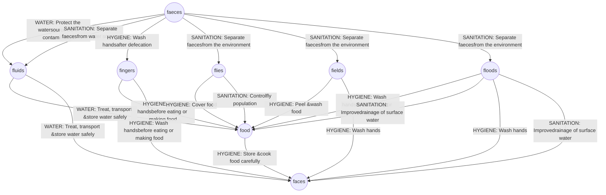

PUBLIC HEALTH BULLETIN-PAKISTAN

Vol. 3 | Week 34 05th Sep 2023 banner

PUBLIC HEALTH BULLETIN PAKISTAN

# Integrated Disease Surveillance & Response (IDSR) Report

Center of Disease Control
National Institute of Health, Islamabad

**PAKISTAN**

NIH Logo Pakistan Government Crest

http://www.phb.nih.org.pk/

Integrated Disease Surveillance & Response (IDSR) Weekly Public Health Bulletin is your go-to resource for disease trends, outbreak alerts, and crucial public health information. By reading and sharing this bulletin, you can help increase awareness and promote preventive measures within your community.

World Field Epidemiology Day graphic

Public Health Bulletin Pakistan Logo

World Field Epidemiology Day icon

## WORLD FIELD EPIDEMIOLOGY DAY

**7 SEPTEMBER**

Globe showing Pakistan and surrounding regions

**Promoting Diversity, Equity, and Inclusion in Field Epidemiology**

**UPCOMING**

**Public Health Bulletin-Pakistan: Vol 3, Issue 35**
**Special Edition World Field Epidemiology Day**
We invite you to join us in celebrating World Field Epidemiology Day on September 7, 2023.

NIH Logo large

Write for yourself
Share with us
phb@nih.org.pk

Public Health Bulletin Pakistan Logo large

NIH Logo small

UK Health Security Agency logo

World Health Organization logo

USAID logo

safetynet logo

---

# Greetings
# Team PHB-Pakistan

Public Health Bulletin Pakistan logo

NIH logo

Government of Pakistan logo

## Overview

## IDSR Reports

## Ongoing Events

## Field Reports

### Preface

The Weekly Public Health Bulletin-Pakistan provides a summary of the most important public health events that occurred during week 34 of 2023. This issue of the bulletin reports on an increase in cases of malaria and influenza-like illness (ILI), as well as suspected cases of acute watery diarrhea (AWD) caused by *Salmonella cholerae*. Additionally, there have been high numbers of reported cases of measles and mumps. All of these cases are suspected and require field verification.

During the rainy season and with the possibility of flooding, cases of waterborne and vector-borne diseases may increase. It is essential to raise awareness in the community and take public health measures to prevent and control the spread of these diseases.

The health authorities are investigating the cases and taking necessary measures to control the spread of the diseases. Field investigations are underway to verify the numbers and initiate a timely response. We must remain vigilant and continue to monitor the situation.

The Weekly Public Health Bulletin-Pakistan is a valuable resource for public health professionals and anyone who is interested in public health. To stay informed about public health issues, please subscribe to the bulletin today!

Sincerely,
The Chief Editor

NIH logo

UK Health Security Agency logo

World Health Organization logo

USAID logo

safetynet logo

---

# Overview

* During week 34, most frequent reported cases were of Acute Diarrhea (Non-Cholera) followed by Malaria, ILI, ALRI <5 years, B. Diarrhea, VH (B & C), Typhoid, SARI, dog bite and AWD (S. Cholera).

* There is overall an increase in cases of Malaria and ILI cases.

* Cases of AWD (S. Cholera) are regularly reported from all parts of the country. All are suspected cases and need field verification

* Measles and Mumps cases were reported in high numbers. All are suspected cases and need field verification.
All are suspected cases and need field verification.

## IDSR compliance attributes

* The national compliance rate for IDSR reporting in 113 implemented districts is 77%

* ICT and AJK are the top reporting region with a compliance rate of 100% and 97% followed by Sindh 94% and Khyber Pakhtunkhwa with 77%

* The lowest compliance rate was observed in Gilgit Baltistan.

<table>
  <thead>
    <tr>
        <th>Region</th>
        <th>Expected Reports</th>
        <th>Received Reports</th>
        <th>Compliance (%)</th>
    </tr>
  </thead>
  <tbody>
    <tr>
        <td>Khyber Pakhtunkhwa</td>
<td>1636</td>
<td>1265</td>
<td>77</td>
    </tr>
<tr>
        <td>Azad Jammu Kashmir</td>
<td>375</td>
<td>365</td>
<td>97</td>
    </tr>
<tr>
        <td>Islamabad Capital Territory</td>
<td>18</td>
<td>18</td>
<td>100</td>
    </tr>
<tr>
        <td>Balochistan</td>
<td>1160</td>
<td>687</td>
<td>59</td>
    </tr>
<tr>
        <td>Gilgit Baltistan</td>
<td>348</td>
<td>60</td>
<td>17</td>
    </tr>
<tr>
        <td>Sindh</td>
<td>1856</td>
<td>1748</td>
<td>94</td>
    </tr>
<tr>
        <td>National</td>
<td>5393</td>
<td>4143</td>
<td>77</td>
    </tr>
  </tbody>
</table>

NIH logo

UK Health Security Agency logo

World Health Organization logo

USAID logo

safetynet logo

---

Pakistan

**Table 1: Province/Area wise distribution of most frequently reported cases during week 34, Pakistan.**

<table>
    <thead>
    <tr>
        <th></th>
        <th>AJK</th>
        <th>Balochistan</th>
        <th>GB</th>
        <th>ICT</th>
        <th>KP</th>
        <th>Punjab</th>
        <th>Sindh</th>
        <th>Total</th>
    </tr>
    </thead>
    <tr>
        <td>AD (Non-Cholera)</td>
<td>2309</td>
<td>7,830</td>
<td>220</td>
<td>198</td>
<td>33,618</td>
<td>101,350</td>
<td>56,297</td>
<td>201,822</td>
    </tr>
<tr>
        <td>Malaria</td>
<td>143</td>
<td>11,724</td>
<td>0</td>
<td>5</td>
<td>8,955</td>
<td>4,522</td>
<td>113,217</td>
<td>138,566</td>
    </tr>
<tr>
        <td>ILI</td>
<td>2,723</td>
<td>5,333</td>
<td>129</td>
<td>409</td>
<td>3,948</td>
<td>469</td>
<td>17,737</td>
<td>30,748</td>
    </tr>
<tr>
        <td>ALRI &lt; 5 years</td>
<td>817</td>
<td>1981</td>
<td>90</td>
<td>1</td>
<td>1101</td>
<td>3,440</td>
<td>10,460</td>
<td>17,890</td>
    </tr>
<tr>
        <td>B. Diarrhea</td>
<td>133</td>
<td>2,079</td>
<td>20</td>
<td>22</td>
<td>1333</td>
<td>3,391</td>
<td>4,262</td>
<td>11,240</td>
    </tr>
<tr>
        <td>VH (B, C & D)</td>
<td>22</td>
<td>101</td>
<td>0</td>
<td>0</td>
<td>155</td>
<td>NR</td>
<td>6262</td>
<td>6,540</td>
    </tr>
<tr>
        <td>Typhoid</td>
<td>53</td>
<td>791</td>
<td>12</td>
<td>0</td>
<td>1336</td>
<td>5,060</td>
<td>1,583</td>
<td>8,835</td>
    </tr>
<tr>
        <td>SARI</td>
<td>343</td>
<td>1006</td>
<td>146</td>
<td>0</td>
<td>1,533</td>
<td>NR</td>
<td>627</td>
<td>3,655</td>
    </tr>
<tr>
        <td>Dog Bite</td>
<td>85</td>
<td>62</td>
<td>0</td>
<td>0</td>
<td>166</td>
<td>NR</td>
<td>701</td>
<td>1,014</td>
    </tr>
<tr>
        <td>AWD (S. Cholera)</td>
<td>71</td>
<td>316</td>
<td>71</td>
<td>0</td>
<td>229</td>
<td>NR</td>
<td>126</td>
<td>813</td>
    </tr>
<tr>
        <td>AVH (A & E)</td>
<td>40</td>
<td>21</td>
<td>3</td>
<td>1</td>
<td>278</td>
<td>NR</td>
<td>418</td>
<td>761</td>
    </tr>
<tr>
        <td>Mumps</td>
<td>97</td>
<td>85</td>
<td>15</td>
<td>1</td>
<td>140</td>
<td>NR</td>
<td>327</td>
<td>665</td>
    </tr>
<tr>
        <td>Measles</td>
<td>8</td>
<td>30</td>
<td>3</td>
<td>0</td>
<td>139</td>
<td>NR</td>
<td>267</td>
<td>447</td>
    </tr>
<tr>
        <td>CL</td>
<td>0</td>
<td>166</td>
<td>0</td>
<td>0</td>
<td>272</td>
<td>45</td>
<td>1</td>
<td>484</td>
    </tr>
<tr>
        <td>Gonorrhea</td>
<td>0</td>
<td>191</td>
<td>1</td>
<td>0</td>
<td>22</td>
<td>NR</td>
<td>44</td>
<td>258</td>
    </tr>
<tr>
        <td>Pertussis</td>
<td>7</td>
<td>126</td>
<td>3</td>
<td>0</td>
<td>38</td>
<td>NR</td>
<td>2</td>
<td>176</td>
    </tr>
<tr>
        <td>Chickenpox/ 
Varicella</td>
<td>18</td>
<td>8</td>
<td>3</td>
<td>1</td>
<td>103</td>
<td>165</td>
<td>15</td>
<td>313</td>
    </tr>
<tr>
        <td>Dengue</td>
<td>0</td>
<td>0</td>
<td>2</td>
<td>0</td>
<td>22</td>
<td>NR</td>
<td>59</td>
<td>83</td>
    </tr>
<tr>
        <td>AFP</td>
<td>1</td>
<td>1</td>
<td>0</td>
<td>0</td>
<td>15</td>
<td>NR</td>
<td>27</td>
<td>44</td>
    </tr>
<tr>
        <td>Syphilis</td>
<td>3</td>
<td>6</td>
<td>0</td>
<td>0</td>
<td>15</td>
<td>13</td>
<td>7</td>
<td>44</td>
    </tr>
<tr>
        <td>NT</td>
<td>12</td>
<td>0</td>
<td>0</td>
<td>0</td>
<td>10</td>
<td>NR</td>
<td>0</td>
<td>22</td>
    </tr>
<tr>
        <td>Brucellosis</td>
<td>0</td>
<td>13</td>
<td>0</td>
<td>0</td>
<td>9</td>
<td>NR</td>
<td>0</td>
<td>22</td>
    </tr>
<tr>
        <td>Rubella (CRS)</td>
<td>0</td>
<td>2</td>
<td>0</td>
<td>0</td>
<td>1</td>
<td>NR</td>
<td>19</td>
<td>22</td>
    </tr>
<tr>
        <td>Diphtheria 
(Probable)</td>
<td>1</td>
<td>5</td>
<td>0</td>
<td>0</td>
<td>8</td>
<td>NR</td>
<td>0</td>
<td>14</td>
    </tr>
<tr>
        <td>Leprosy</td>
<td>0</td>
<td>2</td>
<td>0</td>
<td>0</td>
<td>10</td>
<td>NR</td>
<td>0</td>
<td>12</td>
    </tr>
<tr>
        <td>VL</td>
<td>0</td>
<td>5</td>
<td>0</td>
<td>0</td>
<td>6</td>
<td>NR</td>
<td>0</td>
<td>11</td>
    </tr>
<tr>
        <td>Meningitis</td>
<td>3</td>
<td>0</td>
<td>0</td>
<td>0</td>
<td>0</td>
<td>NR</td>
<td>5</td>
<td>8</td>
    </tr>
<tr>
        <td>CCHF</td>
<td>0</td>
<td>0</td>
<td>0</td>
<td>0</td>
<td>0</td>
<td>NR</td>
<td>8</td>
<td>8</td>
    </tr>
</table>

**Figure 1: Most frequently reported suspected cases during week 34, Pakistan**

<table>
  <thead>
    <tr>
        <th>Disease Category</th>
        <th>WK 32</th>
        <th>WK 33</th>
        <th>WK 34</th>
    </tr>
  </thead>
  <tbody>
    <tr>
        <td>AD (Non-Cholera)</td>
<td> </td>
<td> </td>
<td>201,822</td>
    </tr>
<tr>
        <td>Malaria</td>
<td> </td>
<td> </td>
<td>138,566</td>
    </tr>
<tr>
        <td>ILI</td>
<td> </td>
<td> </td>
<td>30,748</td>
    </tr>
<tr>
        <td>ALRI &lt; 5 years</td>
<td> </td>
<td> </td>
<td>17,890</td>
    </tr>
<tr>
        <td>B. Diarrhea</td>
<td> </td>
<td> </td>
<td>11,240</td>
    </tr>
<tr>
        <td>VH (B, C &amp; D)</td>
<td> </td>
<td> </td>
<td>6,540</td>
    </tr>
<tr>
        <td>Typhoid</td>
<td> </td>
<td> </td>
<td>8,835</td>
    </tr>
<tr>
        <td>SARI</td>
<td> </td>
<td> </td>
<td>3,655</td>
    </tr>
<tr>
        <td>Dog Bite</td>
<td> </td>
<td> </td>
<td>1,014</td>
    </tr>
<tr>
        <td>AWD (S. Cholera)</td>
<td> </td>
<td> </td>
<td>813</td>
    </tr>
  </tbody>
</table>

NIH logo

UK Health Security Agency logo

World Health Organization logo

USAID logo

safetynet logo

---

# Sindh

* Malaria cases were maximum followed by AD (Non-Cholera), ILI, ALRI<5 Years, B. Diarrhea, VH (B, C, D), SARI, Typhoid, dog bite and AWD (S. Cholera).

* One hundred and twenty-eight cases from Mirpur Khas and 108 cases from Tando Muhammad Khan of Measles reported this week. Field investigation is required to identify the source to control the spread of disease.

* There is sharp rise in trend for Malaria whereas AD declined this week.

**Table 2: District wise distribution of most frequently reported suspected cases during week 34, Sindh**

<table>
    <thead>
    <tr>
        <th>Districts</th>
        <th>Malaria</th>
        <th>AD 
(Non-
Cholera)</th>
        <th>ILI</th>
        <th>ALRI &lt; 
5 
years</th>
        <th>VH (B, C & D)</th>
        <th>B. Diarrhea</th>
        <th>Typhoid</th>
        <th>Dog Bite</th>
        <th>SARI</th>
        <th>AVH (A & E)</th>
    </tr>
    </thead>
    <tr>
        <td>Badin</td>
<td>9,944</td>
<td>3,741</td>
<td>309</td>
<td>525</td>
<td>625</td>
<td>308</td>
<td>53</td>
<td>63</td>
<td>0</td>
<td>0</td>
    </tr>
<tr>
        <td>Dadu</td>
<td>3,652</td>
<td>1,772</td>
<td>0</td>
<td>562</td>
<td>5</td>
<td>348</td>
<td>64</td>
<td>0</td>
<td>3</td>
<td>0</td>
    </tr>
<tr>
        <td>Ghotki</td>
<td>1,470</td>
<td>1,469</td>
<td>0</td>
<td>378</td>
<td>510</td>
<td>132</td>
<td>3</td>
<td>0</td>
<td>0</td>
<td>1</td>
    </tr>
<tr>
        <td>Hyderabad</td>
<td>588</td>
<td>1,894</td>
<td>266</td>
<td>29</td>
<td>50</td>
<td>0</td>
<td>5</td>
<td>0</td>
<td>0</td>
<td>0</td>
    </tr>
<tr>
        <td>Jacobabad</td>
<td>2,153</td>
<td>1,463</td>
<td>145</td>
<td>1,248</td>
<td>337</td>
<td>125</td>
<td>22</td>
<td>39</td>
<td>84</td>
<td>0</td>
    </tr>
<tr>
        <td>Jamshoro</td>
<td>2,310</td>
<td>2,575</td>
<td>324</td>
<td>159</td>
<td>173</td>
<td>161</td>
<td>74</td>
<td>44</td>
<td>7</td>
<td>2</td>
    </tr>
<tr>
        <td>Kamber</td>
<td>7,406</td>
<td>1,549</td>
<td>0</td>
<td>314</td>
<td>82</td>
<td>236</td>
<td>16</td>
<td>0</td>
<td>0</td>
<td>0</td>
    </tr>
<tr>
        <td>Karachi Central</td>
<td>150</td>
<td>1,237</td>
<td>1,736</td>
<td>124</td>
<td>204</td>
<td>83</td>
<td>143</td>
<td>0</td>
<td>0</td>
<td>19</td>
    </tr>
<tr>
        <td>Karachi East</td>
<td>110</td>
<td>996</td>
<td>112</td>
<td>4</td>
<td>19</td>
<td>13</td>
<td>10</td>
<td>1</td>
<td>1</td>
<td>0</td>
    </tr>
<tr>
        <td>Karachi Keamari</td>
<td>13</td>
<td>596</td>
<td>276</td>
<td>26</td>
<td>0</td>
<td>0</td>
<td>5</td>
<td>0</td>
<td>8</td>
<td>1</td>
    </tr>
<tr>
        <td>Karachi Korangi</td>
<td>78</td>
<td>394</td>
<td>3</td>
<td>3</td>
<td>5</td>
<td>7</td>
<td>2</td>
<td>1</td>
<td>0</td>
<td>1</td>
    </tr>
<tr>
        <td>Karachi Malir</td>
<td>281</td>
<td>1,681</td>
<td>2,727</td>
<td>463</td>
<td>15</td>
<td>61</td>
<td>24</td>
<td>4</td>
<td>37</td>
<td>5</td>
    </tr>
<tr>
        <td>Karachi South</td>
<td>46</td>
<td>151</td>
<td>0</td>
<td>0</td>
<td>0</td>
<td>1</td>
<td>3</td>
<td>0</td>
<td>0</td>
<td>0</td>
    </tr>
<tr>
        <td>Karachi West</td>
<td>149</td>
<td>1,177</td>
<td>733</td>
<td>200</td>
<td>22</td>
<td>53</td>
<td>43</td>
<td>35</td>
<td>74</td>
<td>4</td>
    </tr>
<tr>
        <td>Kashmore</td>
<td>2,751</td>
<td>1,017</td>
<td>508</td>
<td>212</td>
<td>85</td>
<td>96</td>
<td>20</td>
<td>0</td>
<td>0</td>
<td>0</td>
    </tr>
<tr>
        <td>Khairpur</td>
<td>8,025</td>
<td>4,105</td>
<td>776</td>
<td>976</td>
<td>164</td>
<td>397</td>
<td>262</td>
<td>36</td>
<td>229</td>
<td>27</td>
    </tr>
<tr>
        <td>Larkana</td>
<td>15,159</td>
<td>2,599</td>
<td>0</td>
<td>272</td>
<td>95</td>
<td>409</td>
<td>11</td>
<td>0</td>
<td>0</td>
<td>0</td>
    </tr>
<tr>
        <td>Matiari</td>
<td>2,232</td>
<td>2,974</td>
<td>28</td>
<td>506</td>
<td>521</td>
<td>123</td>
<td>52</td>
<td>10</td>
<td>27</td>
<td>4</td>
    </tr>
<tr>
        <td>Mirpurkhas</td>
<td>7,269</td>
<td>1,977</td>
<td>3,567</td>
<td>265</td>
<td>605</td>
<td>92</td>
<td>59</td>
<td>0</td>
<td>0</td>
<td>0</td>
    </tr>
<tr>
        <td>Naushero Feroze</td>
<td>2,084</td>
<td>1,799</td>
<td>412</td>
<td>242</td>
<td>112</td>
<td>84</td>
<td>136</td>
<td>65</td>
<td>0</td>
<td>0</td>
    </tr>
<tr>
        <td>Sanghar</td>
<td>3,595</td>
<td>2,835</td>
<td>119</td>
<td>500</td>
<td>1,090</td>
<td>123</td>
<td>119</td>
<td>191</td>
<td>69</td>
<td>7</td>
    </tr>
<tr>
        <td>Shaheed Benazirabad</td>
<td>2,627</td>
<td>2,721</td>
<td>19</td>
<td>491</td>
<td>120</td>
<td>114</td>
<td>242</td>
<td>0</td>
<td>10</td>
<td>0</td>
    </tr>
<tr>
        <td>Shikarpur</td>
<td>2,035</td>
<td>1,732</td>
<td>3</td>
<td>145</td>
<td>177</td>
<td>209</td>
<td>9</td>
<td>54</td>
<td>6</td>
<td>0</td>
    </tr>
<tr>
        <td>Sujawal</td>
<td>6,299</td>
<td>2,735</td>
<td>0</td>
<td>714</td>
<td>252</td>
<td>120</td>
<td>30</td>
<td>48</td>
<td>0</td>
<td>311</td>
    </tr>
<tr>
        <td>Sukkur</td>
<td>4,855</td>
<td>2,247</td>
<td>1,476</td>
<td>413</td>
<td>387</td>
<td>250</td>
<td>20</td>
<td>0</td>
<td>1</td>
<td>0</td>
    </tr>
<tr>
        <td>Tando Allahyar</td>
<td>2,908</td>
<td>1,717</td>
<td>705</td>
<td>265</td>
<td>141</td>
<td>159</td>
<td>13</td>
<td>29</td>
<td>0</td>
<td>8</td>
    </tr>
<tr>
        <td>Tando Muhammad Khan</td>
<td>7,517</td>
<td>1,825</td>
<td>15</td>
<td>336</td>
<td>97</td>
<td>151</td>
<td>14</td>
<td>37</td>
<td>0</td>
<td>0</td>
    </tr>
<tr>
        <td>Tharparkar</td>
<td>3,532</td>
<td>1,539</td>
<td>1,926</td>
<td>484</td>
<td>97</td>
<td>136</td>
<td>64</td>
<td>5</td>
<td>56</td>
<td>22</td>
    </tr>
<tr>
        <td>Thatta</td>
<td>7,050</td>
<td>1,762</td>
<td>1,552</td>
<td>315</td>
<td>78</td>
<td>109</td>
<td>11</td>
<td>39</td>
<td>4</td>
<td>6</td>
    </tr>
<tr>
        <td>Umerkot</td>
<td>6,929</td>
<td>2,018</td>
<td>0</td>
<td>289</td>
<td>194</td>
<td>162</td>
<td>54</td>
<td>0</td>
<td>11</td>
<td>0</td>
    </tr>
<tr>
        <td>Total</td>
<td>113,217</td>
<td>56,297</td>
<td>17,737</td>
<td>10,460</td>
<td>6,262</td>
<td>4,262</td>
<td>1,583</td>
<td>701</td>
<td>627</td>
<td>418</td>
    </tr>
</table>

**Figure 2: Most frequently reported suspected cases during week 34, Sindh**

<table>
  <thead>
    <tr>
        <th>Disease</th>
        <th>WK 32</th>
        <th>WK 33</th>
        <th>WK 34</th>
    </tr>
  </thead>
  <tbody>
    <tr>
        <td>Malaria</td>
<td>78000</td>
<td>96000</td>
<td>113217</td>
    </tr>
<tr>
        <td>AD (Non-Cholera)</td>
<td>60000</td>
<td>59000</td>
<td>56297</td>
    </tr>
<tr>
        <td>ILI</td>
<td>18000</td>
<td>17500</td>
<td>17737</td>
    </tr>
<tr>
        <td>ALRI &lt; 5 years</td>
<td>10000</td>
<td>11000</td>
<td>10460</td>
    </tr>
<tr>
        <td>VH (B, C &amp; D)</td>
<td>6000</td>
<td>6500</td>
<td>6262</td>
    </tr>
<tr>
        <td>B. Diarrhea</td>
<td>4000</td>
<td>4500</td>
<td>4262</td>
    </tr>
<tr>
        <td>Typhoid</td>
<td>1500</td>
<td>1600</td>
<td>1583</td>
    </tr>
<tr>
        <td>Dog Bite</td>
<td>600</td>
<td>750</td>
<td>701</td>
    </tr>
<tr>
        <td>SARI</td>
<td>500</td>
<td>600</td>
<td>627</td>
    </tr>
<tr>
        <td>AVH (A &amp; E)</td>
<td>400</td>
<td>450</td>
<td>418</td>
    </tr>
  </tbody>
</table>

NIH logo

UK Health Security Agency logo

World Health Organization logo

USAID logo

safetynet logo

---

# Balochistan
* Malaria, AD (Non-Cholera), ILI, B. Diarrhea, ALRI <5 years, SARI, Typhoid, AWD (S. Cholera), CL and VH (A&E) and Gonorrhea were the most frequently reported diseases from Balochistan province.
* Trend for Malaria and ILI showed an increase whereas AD cases declined this week.
* Cases of malaria and AD( Non-Cholera) reported in high numbers from Sohbatpur and Jaffarabad. All are suspected cases and need field investigation to verify the cases.

**Table 3: District wise distribution of most frequently reported suspected cases during week 34, Balochistan**

<table>
    <thead>
    <tr>
        <th>Districts</th>
        <th>Malaria</th>
        <th>AD (Non-
Cholera)</th>
        <th>ILI</th>
        <th>B. 
Diarrhea</th>
        <th>ALRI &lt; 5 
years</th>
        <th>SARI</th>
        <th>Typhoid</th>
        <th>AWD (S. 
Cholera)</th>
        <th>Gonorrhea</th>
        <th>CL</th>
    </tr>
    </thead>
    <tr>
        <td>Chagai</td>
<td>30</td>
<td>151</td>
<td>231</td>
<td>47</td>
<td>0</td>
<td>0</td>
<td>30</td>
<td>10</td>
<td>0</td>
<td>0</td>
    </tr>
<tr>
        <td>Chaman</td>
<td>12</td>
<td>52</td>
<td>67</td>
<td>25</td>
<td>2</td>
<td>14</td>
<td>16</td>
<td>31</td>
<td>0</td>
<td>5</td>
    </tr>
<tr>
        <td>Dera Bugti</td>
<td>570</td>
<td>71</td>
<td>18</td>
<td>41</td>
<td>26</td>
<td>28</td>
<td>14</td>
<td>7</td>
<td>0</td>
<td>0</td>
    </tr>
<tr>
        <td>Duki</td>
<td>188</td>
<td>135</td>
<td>124</td>
<td>108</td>
<td>20</td>
<td>45</td>
<td>22</td>
<td>39</td>
<td>2</td>
<td>5</td>
    </tr>
<tr>
        <td>Gwadar</td>
<td>212</td>
<td>406</td>
<td>735</td>
<td>80</td>
<td>15</td>
<td>NR</td>
<td>42</td>
<td>NR</td>
<td>NR</td>
<td>NR</td>
    </tr>
<tr>
        <td>Harnai</td>
<td>122</td>
<td>117</td>
<td>8</td>
<td>202</td>
<td>232</td>
<td>0</td>
<td>11</td>
<td>13</td>
<td>0</td>
<td>0</td>
    </tr>
<tr>
        <td>Hub</td>
<td>382</td>
<td>459</td>
<td>67</td>
<td>53</td>
<td>18</td>
<td>193</td>
<td>16</td>
<td>8</td>
<td>0</td>
<td>3</td>
    </tr>
<tr>
        <td>Jaffarabad</td>
<td>3,594</td>
<td>1,064</td>
<td>277</td>
<td>119</td>
<td>122</td>
<td>43</td>
<td>25</td>
<td>0</td>
<td>9</td>
<td>23</td>
    </tr>
<tr>
        <td>Jhal Magsi</td>
<td>844</td>
<td>461</td>
<td>80</td>
<td>23</td>
<td>34</td>
<td>16</td>
<td>10</td>
<td>44</td>
<td>0</td>
<td>0</td>
    </tr>
<tr>
        <td>Kachhi (Bolan)</td>
<td>184</td>
<td>141</td>
<td>46</td>
<td>33</td>
<td>52</td>
<td>16</td>
<td>46</td>
<td>4</td>
<td>0</td>
<td>1</td>
    </tr>
<tr>
        <td>Kalat</td>
<td>33</td>
<td>14</td>
<td>2</td>
<td>7</td>
<td>10</td>
<td>0</td>
<td>9</td>
<td>0</td>
<td>8</td>
<td>3</td>
    </tr>
<tr>
        <td>Kech (Turbat)</td>
<td>658</td>
<td>393</td>
<td>774</td>
<td>98</td>
<td>92</td>
<td>0</td>
<td>5</td>
<td>9</td>
<td>0</td>
<td>1</td>
    </tr>
<tr>
        <td>Kharan</td>
<td>129</td>
<td>128</td>
<td>246</td>
<td>85</td>
<td>0</td>
<td>0</td>
<td>6</td>
<td>9</td>
<td>5</td>
<td>0</td>
    </tr>
<tr>
        <td>Khuzdar</td>
<td>136</td>
<td>170</td>
<td>122</td>
<td>61</td>
<td>7</td>
<td>7</td>
<td>14</td>
<td>0</td>
<td>10</td>
<td>6</td>
    </tr>
<tr>
        <td>Killa Saifullah</td>
<td>585</td>
<td>261</td>
<td>0</td>
<td>111</td>
<td>195</td>
<td>88</td>
<td>56</td>
<td>10</td>
<td>0</td>
<td>21</td>
    </tr>
<tr>
        <td>Kohlu</td>
<td>231</td>
<td>178</td>
<td>336</td>
<td>137</td>
<td>28</td>
<td>51</td>
<td>65</td>
<td>24</td>
<td>1</td>
<td>3</td>
    </tr>
<tr>
        <td>Lasbella</td>
<td>1,142</td>
<td>683</td>
<td>160</td>
<td>33</td>
<td>510</td>
<td>57</td>
<td>16</td>
<td>5</td>
<td>0</td>
<td>18</td>
    </tr>
<tr>
        <td>Loralai</td>
<td>109</td>
<td>303</td>
<td>295</td>
<td>51</td>
<td>85</td>
<td>117</td>
<td>41</td>
<td>8</td>
<td>0</td>
<td>0</td>
    </tr>
<tr>
        <td>Mastung</td>
<td>212</td>
<td>704</td>
<td>232</td>
<td>196</td>
<td>60</td>
<td>77</td>
<td>127</td>
<td>25</td>
<td>130</td>
<td>0</td>
    </tr>
<tr>
        <td>Nushki</td>
<td>187</td>
<td>224</td>
<td>0</td>
<td>85</td>
<td>0</td>
<td>0</td>
<td>0</td>
<td>10</td>
<td>2</td>
<td>0</td>
    </tr>
<tr>
        <td>Panjgur</td>
<td>349</td>
<td>118</td>
<td>108</td>
<td>58</td>
<td>18</td>
<td>7</td>
<td>7</td>
<td>39</td>
<td>9</td>
<td>2</td>
    </tr>
<tr>
        <td>Pishin</td>
<td>26</td>
<td>178</td>
<td>148</td>
<td>68</td>
<td>17</td>
<td>2</td>
<td>25</td>
<td>0</td>
<td>4</td>
<td>20</td>
    </tr>
<tr>
        <td>Quetta</td>
<td>39</td>
<td>614</td>
<td>1,073</td>
<td>146</td>
<td>39</td>
<td>46</td>
<td>43</td>
<td>0</td>
<td>1</td>
<td>36</td>
    </tr>
<tr>
        <td>Sherani</td>
<td>29</td>
<td>17</td>
<td>27</td>
<td>11</td>
<td>2</td>
<td>3</td>
<td>8</td>
<td>0</td>
<td>2</td>
<td>9</td>
    </tr>
<tr>
        <td>Sibi</td>
<td>114</td>
<td>68</td>
<td>39</td>
<td>23</td>
<td>15</td>
<td>0</td>
<td>27</td>
<td>13</td>
<td>8</td>
<td>2</td>
    </tr>
<tr>
        <td>Sohbat pur</td>
<td>1,388</td>
<td>518</td>
<td>20</td>
<td>106</td>
<td>134</td>
<td>151</td>
<td>96</td>
<td>4</td>
<td>0</td>
<td>8</td>
    </tr>
<tr>
        <td>SURAB</td>
<td>3</td>
<td>1</td>
<td>0</td>
<td>0</td>
<td>0</td>
<td>0</td>
<td>1</td>
<td>0</td>
<td>0</td>
<td>0</td>
    </tr>
<tr>
        <td>Zhob</td>
<td>216</td>
<td>201</td>
<td>98</td>
<td>72</td>
<td>248</td>
<td>45</td>
<td>13</td>
<td>4</td>
<td>0</td>
<td>0</td>
    </tr>
<tr>
        <td>Total</td>
<td>11,724</td>
<td>7,830</td>
<td>5,333</td>
<td>2,079</td>
<td>1,981</td>
<td>1,006</td>
<td>791</td>
<td>316</td>
<td>191</td>
<td>166</td>
    </tr>
</table>

**Figure 3: Most frequently reported suspected cases during week 34, Balochistan**

<table>
  <thead>
    <tr>
        <th>Disease</th>
        <th>WK 32</th>
        <th>WK 33</th>
        <th>WK 34</th>
    </tr>
  </thead>
  <tbody>
    <tr>
        <td>Malaria</td>
<td>7,300</td>
<td>8,900</td>
<td>11,724</td>
    </tr>
<tr>
        <td>AD (Non-Cholera)</td>
<td>7,700</td>
<td>7,800</td>
<td>7,830</td>
    </tr>
<tr>
        <td>ILI</td>
<td>3,600</td>
<td>4,400</td>
<td>5,333</td>
    </tr>
<tr>
        <td>B. Diarrhea</td>
<td>2,000</td>
<td>2,050</td>
<td>2,079</td>
    </tr>
<tr>
        <td>ALRI &lt; 5 years</td>
<td>2,200</td>
<td>1,800</td>
<td>1,981</td>
    </tr>
<tr>
        <td>SARI</td>
<td>1,100</td>
<td>1,100</td>
<td>1,006</td>
    </tr>
<tr>
        <td>Typhoid</td>
<td>1,000</td>
<td>900</td>
<td>791</td>
    </tr>
<tr>
        <td>AWD (S. Cholera)</td>
<td>200</td>
<td>250</td>
<td>316</td>
    </tr>
<tr>
        <td>Gonorrhea</td>
<td>100</td>
<td>150</td>
<td>191</td>
    </tr>
<tr>
        <td>CL</td>
<td>100</td>
<td>150</td>
<td>166</td>
    </tr>
  </tbody>
</table>

NIH logo

UK Health Security Agency logo

World Health Organization logo

USAID logo

safetynet logo

---

# Khyber Pakhtunkhwa

* Cases of AD (Non-Cholera) were maximum followed by Malaria, ILI, SARI, Typhoid, B. Diarrhea, ALRI<5 Years, AVH (A&E), CL and AWD (S. Cholera).

* Nowshera, Karak and Hungu reported high numbers of CL. All are suspected cases and need verification.

* Trend for Malaria, AD and ILI cases remained same this week.

* Dir Lower, Peshawar, swat and Upper Kurrum districts reported increased numbers of Typhoid cases. Cases are suspected, field investigations required to verify cases.

**Table 4: District wise distribution of most frequently reported suspected cases during week 34, KP**

<table>
    <thead>
    <tr>
        <th>Districts</th>
        <th>AD (Non-
Cholera)</th>
        <th>Malaria</th>
        <th>ILI</th>
        <th>SARI</th>
        <th>Typhoid</th>
        <th>B. 
Diarrhea</th>
        <th>ALRI &lt; 5 
years</th>
        <th>AVH (A & 
E)</th>
        <th>CL</th>
        <th>AWD (S. 
Cholera)</th>
    </tr>
    </thead>
    <tr>
        <td>Abbottabad</td>
<td>786</td>
<td>3</td>
<td>20</td>
<td>11</td>
<td>16</td>
<td>4</td>
<td>12</td>
<td>0</td>
<td>0</td>
<td>0</td>
    </tr>
<tr>
        <td>Bajaur</td>
<td>316</td>
<td>166</td>
<td>25</td>
<td>0</td>
<td>0</td>
<td>27</td>
<td>6</td>
<td>0</td>
<td>1</td>
<td>8</td>
    </tr>
<tr>
        <td>Bannu</td>
<td>729</td>
<td>1,350</td>
<td>50</td>
<td>2</td>
<td>40</td>
<td>1</td>
<td>1</td>
<td>0</td>
<td>2</td>
<td>0</td>
    </tr>
<tr>
        <td>Buner</td>
<td>771</td>
<td>604</td>
<td>0</td>
<td>0</td>
<td>27</td>
<td>1</td>
<td>38</td>
<td>1</td>
<td>0</td>
<td>0</td>
    </tr>
<tr>
        <td>Charsadda</td>
<td>1,417</td>
<td>45</td>
<td>197</td>
<td>8</td>
<td>5</td>
<td>0</td>
<td>11</td>
<td>0</td>
<td>0</td>
<td>0</td>
    </tr>
<tr>
        <td>Chitral Lower</td>
<td>704</td>
<td>40</td>
<td>135</td>
<td>444</td>
<td>42</td>
<td>0</td>
<td>10</td>
<td>3</td>
<td>13</td>
<td>0</td>
    </tr>
<tr>
        <td>Chitral Upper</td>
<td>125</td>
<td>5</td>
<td>0</td>
<td>151</td>
<td>6</td>
<td>0</td>
<td>0</td>
<td>1</td>
<td>0</td>
<td>0</td>
    </tr>
<tr>
        <td>D.I. Khan</td>
<td>1,012</td>
<td>930</td>
<td>18</td>
<td>53</td>
<td>0</td>
<td>22</td>
<td>18</td>
<td>0</td>
<td>0</td>
<td>0</td>
    </tr>
<tr>
        <td>Dir Lower</td>
<td>2,466</td>
<td>843</td>
<td>2</td>
<td>2</td>
<td>53</td>
<td>205</td>
<td>155</td>
<td>42</td>
<td>12</td>
<td>0</td>
    </tr>
<tr>
        <td>Dir Upper</td>
<td>1,890</td>
<td>8</td>
<td>4</td>
<td>0</td>
<td>45</td>
<td>51</td>
<td>18</td>
<td>6</td>
<td>4</td>
<td>142</td>
    </tr>
<tr>
        <td>Hangu</td>
<td>457</td>
<td>649</td>
<td>195</td>
<td>65</td>
<td>17</td>
<td>26</td>
<td>5</td>
<td>4</td>
<td>35</td>
<td>0</td>
    </tr>
<tr>
        <td>Haripur</td>
<td>1,373</td>
<td>86</td>
<td>378</td>
<td>10</td>
<td>55</td>
<td>6</td>
<td>155</td>
<td>29</td>
<td>0</td>
<td>1</td>
    </tr>
<tr>
        <td>Karak</td>
<td>375</td>
<td>317</td>
<td>61</td>
<td>7</td>
<td>2</td>
<td>0</td>
<td>7</td>
<td>0</td>
<td>91</td>
<td>2</td>
    </tr>
<tr>
        <td>Khyber</td>
<td>20</td>
<td>154</td>
<td>48</td>
<td>2</td>
<td>4</td>
<td>10</td>
<td>2</td>
<td>0</td>
<td>15</td>
<td>0</td>
    </tr>
<tr>
        <td>Kohat</td>
<td>72</td>
<td>51</td>
<td>0</td>
<td>1</td>
<td>1</td>
<td>0</td>
<td>3</td>
<td>0</td>
<td>3</td>
<td>0</td>
    </tr>
<tr>
        <td>Kohistan Lower</td>
<td>206</td>
<td>3</td>
<td>0</td>
<td>1</td>
<td>0</td>
<td>24</td>
<td>13</td>
<td>0</td>
<td>0</td>
<td>1</td>
    </tr>
<tr>
        <td>Kohistan Upper</td>
<td>498</td>
<td>3</td>
<td>41</td>
<td>44</td>
<td>43</td>
<td>17</td>
<td>2</td>
<td>0</td>
<td>0</td>
<td>0</td>
    </tr>
<tr>
        <td>Kolai Palas</td>
<td>129</td>
<td>4</td>
<td>0</td>
<td>1</td>
<td>0</td>
<td>12</td>
<td>3</td>
<td>0</td>
<td>1</td>
<td>16</td>
    </tr>
<tr>
        <td>L & C Kurram</td>
<td>31</td>
<td>36</td>
<td>20</td>
<td>0</td>
<td>1</td>
<td>16</td>
<td>1</td>
<td>0</td>
<td>1</td>
<td>6</td>
    </tr>
<tr>
        <td>Lakki Marwat</td>
<td>758</td>
<td>1,911</td>
<td>0</td>
<td>0</td>
<td>25</td>
<td>16</td>
<td>16</td>
<td>0</td>
<td>9</td>
<td>0</td>
    </tr>
<tr>
        <td>Malakand</td>
<td>678</td>
<td>17</td>
<td>0</td>
<td>14</td>
<td>8</td>
<td>99</td>
<td>22</td>
<td>24</td>
<td>0</td>
<td>0</td>
    </tr>
<tr>
        <td>Mansehra</td>
<td>1,050</td>
<td>26</td>
<td>628</td>
<td>37</td>
<td>55</td>
<td>27</td>
<td>56</td>
<td>16</td>
<td>0</td>
<td>0</td>
    </tr>
<tr>
        <td>Mardan</td>
<td>1,254</td>
<td>82</td>
<td>123</td>
<td>0</td>
<td>0</td>
<td>32</td>
<td>308</td>
<td>19</td>
<td>1</td>
<td>0</td>
    </tr>
<tr>
        <td>Nowshera</td>
<td>2,633</td>
<td>229</td>
<td>77</td>
<td>49</td>
<td>18</td>
<td>23</td>
<td>2</td>
<td>0</td>
<td>46</td>
<td>0</td>
    </tr>
<tr>
        <td>Peshawar</td>
<td>3,739</td>
<td>81</td>
<td>529</td>
<td>48</td>
<td>168</td>
<td>188</td>
<td>45</td>
<td>24</td>
<td>23</td>
<td>7</td>
    </tr>
<tr>
        <td>Shangla</td>
<td>364</td>
<td>375</td>
<td>0</td>
<td>0</td>
<td>17</td>
<td>5</td>
<td>5</td>
<td>2</td>
<td>0</td>
<td>0</td>
    </tr>
<tr>
        <td>SWA</td>
<td>0</td>
<td>0</td>
<td>0</td>
<td>5</td>
<td>0</td>
<td>0</td>
<td>0</td>
<td>0</td>
<td>0</td>
<td>0</td>
    </tr>
<tr>
        <td>Swabi</td>
<td>1,341</td>
<td>108</td>
<td>436</td>
<td>6</td>
<td>30</td>
<td>22</td>
<td>85</td>
<td>19</td>
<td>0</td>
<td>0</td>
    </tr>
<tr>
        <td>Swat</td>
<td>7,675</td>
<td>132</td>
<td>380</td>
<td>0</td>
<td>259</td>
<td>185</td>
<td>62</td>
<td>12</td>
<td>0</td>
<td>0</td>
    </tr>
<tr>
        <td>Tank</td>
<td>280</td>
<td>417</td>
<td>0</td>
<td>0</td>
<td>0</td>
<td>2</td>
<td>0</td>
<td>0</td>
<td>0</td>
<td>0</td>
    </tr>
<tr>
        <td>Tor Ghar</td>
<td>138</td>
<td>176</td>
<td>0</td>
<td>31</td>
<td>15</td>
<td>17</td>
<td>1</td>
<td>0</td>
<td>15</td>
<td>0</td>
    </tr>
<tr>
        <td>Upper Kurram</td>
<td>331</td>
<td>104</td>
<td>581</td>
<td>541</td>
<td>384</td>
<td>295</td>
<td>39</td>
<td>76</td>
<td>0</td>
<td>46</td>
    </tr>
</table>

**Figure 4: Most frequently reported suspected cases during week 34, KP**

<table>
  <thead>
    <tr>
        <th>Disease Category</th>
        <th>WK 32</th>
        <th>WK 33</th>
        <th>WK 34</th>
    </tr>
  </thead>
  <tbody>
    <tr>
        <td>AD (Non-Cholera)</td>
<td>27500</td>
<td>33618</td>
<td>33618</td>
    </tr>
<tr>
        <td>Malaria</td>
<td>7000</td>
<td>8955</td>
<td>8955</td>
    </tr>
<tr>
        <td>ILI</td>
<td>3000</td>
<td>3948</td>
<td>3948</td>
    </tr>
<tr>
        <td>SARI</td>
<td>1000</td>
<td>1533</td>
<td>1533</td>
    </tr>
<tr>
        <td>Typhoid</td>
<td>1000</td>
<td>1336</td>
<td>1336</td>
    </tr>
<tr>
        <td>B. Diarrhea</td>
<td>1000</td>
<td>1333</td>
<td>1333</td>
    </tr>
<tr>
        <td>ALRI &lt; 5 years</td>
<td>800</td>
<td>1101</td>
<td>1101</td>
    </tr>
<tr>
        <td>AVH (A &amp; E)</td>
<td>200</td>
<td>278</td>
<td>278</td>
    </tr>
<tr>
        <td>CL</td>
<td>200</td>
<td>272</td>
<td>272</td>
    </tr>
<tr>
        <td>AWD (S. Cholera)</td>
<td>150</td>
<td>229</td>
<td>229</td>
    </tr>
  </tbody>
</table>

NIH logo

UK Health Security Agency logo

World Health Organization logo

USAID logo

safetynet logo

---

# ICT, AJK & GB
**ICT:** The most frequently reported cases from Islamabad were ILI followed by AD (Non-Cholera). ILI cases showed a downward trend in cases this week..
**AJK:** ILI cases were maximum followed by AD (Non-Cholera) , ALRI <5 years, SARI, Malaria, B. Diarrhea, Mumps ,dogbite, AWD (S. Cholera) and Typhoid . ILI cases showed an upward trend in cases this week.
**GB:** AD (Non. Cholera) cases were maximum followed by SARI, ILI, ALRI<5 years, and AWD (S. Cholera), B. Diarrhea and Mumps. AD (Non Cholera) show downward trend in cases this week.

Figure 6: Week wise reported suspected cases of ILI, ICT

<table>
  <thead>
    <tr>
        <th>Category</th>
        <th>WK32</th>
        <th>WK33</th>
        <th>WK34</th>
    </tr>
  </thead>
  <tbody>
    <tr>
        <td>ILI</td>
<td>1080</td>
<td>980</td>
<td>409</td>
    </tr>
<tr>
        <td>AD (Non-Cholera)</td>
<td>640</td>
<td>550</td>
<td>198</td>
    </tr>
<tr>
        <td>B. Diarrhea</td>
<td>20</td>
<td>10</td>
<td>22</td>
    </tr>
  </tbody>
</table>

Figure 6: Week wise reported suspected cases of ILI, ICT

<table>
  <thead>
    <tr>
        <th>Week</th>
        <th>ILI</th>
    </tr>
  </thead>
  <tbody>
    <tr>
        <td>W35</td>
<td>1450</td>
    </tr>
<tr>
        <td>W36</td>
<td>150</td>
    </tr>
<tr>
        <td>W37</td>
<td>100</td>
    </tr>
<tr>
        <td>W38</td>
<td>1200</td>
    </tr>
<tr>
        <td>W39</td>
<td>1000</td>
    </tr>
<tr>
        <td>W40</td>
<td>2150</td>
    </tr>
<tr>
        <td>W41</td>
<td>2300</td>
    </tr>
<tr>
        <td>W42</td>
<td>2650</td>
    </tr>
<tr>
        <td>W43</td>
<td>2600</td>
    </tr>
<tr>
        <td>W44</td>
<td>1850</td>
    </tr>
<tr>
        <td>W45</td>
<td>1700</td>
    </tr>
<tr>
        <td>W46</td>
<td>1550</td>
    </tr>
<tr>
        <td>W47</td>
<td>2400</td>
    </tr>
<tr>
        <td>W48</td>
<td>2350</td>
    </tr>
<tr>
        <td>W49</td>
<td>2550</td>
    </tr>
<tr>
        <td>W50</td>
<td>3150</td>
    </tr>
<tr>
        <td>W51</td>
<td>2450</td>
    </tr>
<tr>
        <td>W52</td>
<td>2200</td>
    </tr>
<tr>
        <td>W1</td>
<td>2050</td>
    </tr>
<tr>
        <td>W2</td>
<td>1650</td>
    </tr>
<tr>
        <td>W3</td>
<td>1950</td>
    </tr>
<tr>
        <td>W4</td>
<td>1900</td>
    </tr>
<tr>
        <td>W5</td>
<td>1850</td>
    </tr>
<tr>
        <td>W6</td>
<td>1600</td>
    </tr>
<tr>
        <td>W7</td>
<td>2300</td>
    </tr>
<tr>
        <td>W8</td>
<td>1600</td>
    </tr>
<tr>
        <td>W9</td>
<td>2250</td>
    </tr>
<tr>
        <td>W10</td>
<td>2100</td>
    </tr>
<tr>
        <td>W11</td>
<td>1700</td>
    </tr>
<tr>
        <td>W12</td>
<td>700</td>
    </tr>
<tr>
        <td>W13</td>
<td>1450</td>
    </tr>
<tr>
        <td>W14</td>
<td>1350</td>
    </tr>
<tr>
        <td>W15</td>
<td>1100</td>
    </tr>
<tr>
        <td>W16</td>
<td>700</td>
    </tr>
<tr>
        <td>W17</td>
<td>1100</td>
    </tr>
<tr>
        <td>W18</td>
<td>950</td>
    </tr>
<tr>
        <td>W19</td>
<td>1500</td>
    </tr>
<tr>
        <td>W20</td>
<td>800</td>
    </tr>
<tr>
        <td>W21</td>
<td>1150</td>
    </tr>
<tr>
        <td>W22</td>
<td>1150</td>
    </tr>
<tr>
        <td>W23</td>
<td>700</td>
    </tr>
<tr>
        <td>W24</td>
<td>1050</td>
    </tr>
<tr>
        <td>W25</td>
<td>850</td>
    </tr>
<tr>
        <td>W26</td>
<td>200</td>
    </tr>
<tr>
        <td>W27</td>
<td>650</td>
    </tr>
<tr>
        <td>W28</td>
<td>900</td>
    </tr>
<tr>
        <td>W29</td>
<td>400</td>
    </tr>
<tr>
        <td>W30</td>
<td>750</td>
    </tr>
<tr>
        <td>W31</td>
<td>950</td>
    </tr>
<tr>
        <td>W32</td>
<td>1100</td>
    </tr>
<tr>
        <td>W33</td>
<td>950</td>
    </tr>
<tr>
        <td>W34</td>
<td>400</td>
    </tr>
  </tbody>
</table>

Figure 7: Most frequently reported suspected cases during week 34, AJK

<table>
  <thead>
    <tr>
        <th>Category</th>
        <th>WK 32</th>
        <th>WK 33</th>
        <th>WK 34</th>
    </tr>
  </thead>
  <tbody>
    <tr>
        <td>ILI</td>
<td>2700</td>
<td>2700</td>
<td>2723</td>
    </tr>
<tr>
        <td>AD (Non-Cholera)</td>
<td>2950</td>
<td>2550</td>
<td>2309</td>
    </tr>
<tr>
        <td>ALRI &lt; 5 years</td>
<td>800</td>
<td>800</td>
<td>817</td>
    </tr>
<tr>
        <td>SARI</td>
<td>350</td>
<td>350</td>
<td>343</td>
    </tr>
<tr>
        <td>Malaria</td>
<td>200</td>
<td>100</td>
<td>143</td>
    </tr>
<tr>
        <td>B. Diarrhea</td>
<td>150</td>
<td>150</td>
<td>133</td>
    </tr>
<tr>
        <td>Mumps</td>
<td>100</td>
<td>100</td>
<td>97</td>
    </tr>
<tr>
        <td>Dog Bite</td>
<td>100</td>
<td>100</td>
<td>85</td>
    </tr>
<tr>
        <td>AWD (S. Cholera)</td>
<td>100</td>
<td>100</td>
<td>71</td>
    </tr>
<tr>
        <td>Typhoid</td>
<td>100</td>
<td>100</td>
<td>53</td>
    </tr>
  </tbody>
</table>

NIH logo

UK Health Security Agency logo

World Health Organization logo

USAID logo

safetynet logo

---

Figure 8: Week wise reported suspected cases of AD (Non-Cholera) and ILI, AJK

<table>
  <thead>
    <tr>
        <th>Week</th>
        <th>AD (Non-Cholera)</th>
        <th>ILI</th>
    </tr>
  </thead>
  <tbody>
    <tr>
        <td>W35</td>
<td>150</td>
<td>100</td>
    </tr>
<tr>
        <td>W36</td>
<td>140</td>
<td>90</td>
    </tr>
<tr>
        <td>W37</td>
<td>130</td>
<td>80</td>
    </tr>
<tr>
        <td>W38</td>
<td>120</td>
<td>70</td>
    </tr>
<tr>
        <td>W39</td>
<td>180</td>
<td>150</td>
    </tr>
<tr>
        <td>W40</td>
<td>200</td>
<td>300</td>
    </tr>
<tr>
        <td>W41</td>
<td>350</td>
<td>650</td>
    </tr>
<tr>
        <td>W42</td>
<td>380</td>
<td>800</td>
    </tr>
<tr>
        <td>W43</td>
<td>390</td>
<td>810</td>
    </tr>
<tr>
        <td>W44</td>
<td>420</td>
<td>980</td>
    </tr>
<tr>
        <td>W45</td>
<td>430</td>
<td>1000</td>
    </tr>
<tr>
        <td>W46</td>
<td>250</td>
<td>1050</td>
    </tr>
<tr>
        <td>W47</td>
<td>430</td>
<td>1680</td>
    </tr>
<tr>
        <td>W48</td>
<td>280</td>
<td>1350</td>
    </tr>
<tr>
        <td>W49</td>
<td>350</td>
<td>1230</td>
    </tr>
<tr>
        <td>W50</td>
<td>380</td>
<td>1750</td>
    </tr>
<tr>
        <td>W51</td>
<td>580</td>
<td>2550</td>
    </tr>
<tr>
        <td>W52</td>
<td>620</td>
<td>2150</td>
    </tr>
<tr>
        <td>W1</td>
<td>750</td>
<td>2210</td>
    </tr>
<tr>
        <td>W2</td>
<td>800</td>
<td>2050</td>
    </tr>
<tr>
        <td>W3</td>
<td>580</td>
<td>1650</td>
    </tr>
<tr>
        <td>W4</td>
<td>650</td>
<td>1660</td>
    </tr>
<tr>
        <td>W5</td>
<td>750</td>
<td>1800</td>
    </tr>
<tr>
        <td>W6</td>
<td>900</td>
<td>1850</td>
    </tr>
<tr>
        <td>W7</td>
<td>980</td>
<td>2350</td>
    </tr>
<tr>
        <td>W8</td>
<td>1020</td>
<td>2000</td>
    </tr>
<tr>
        <td>W9</td>
<td>1080</td>
<td>1850</td>
    </tr>
<tr>
        <td>W10</td>
<td>1180</td>
<td>2230</td>
    </tr>
<tr>
        <td>W11</td>
<td>1200</td>
<td>2180</td>
    </tr>
<tr>
        <td>W12</td>
<td>950</td>
<td>2080</td>
    </tr>
<tr>
        <td>W13</td>
<td>1200</td>
<td>2330</td>
    </tr>
<tr>
        <td>W14</td>
<td>1320</td>
<td>2280</td>
    </tr>
<tr>
        <td>W15</td>
<td>1250</td>
<td>2150</td>
    </tr>
<tr>
        <td>W16</td>
<td>950</td>
<td>1450</td>
    </tr>
<tr>
        <td>W17</td>
<td>1450</td>
<td>1850</td>
    </tr>
<tr>
        <td>W18</td>
<td>1700</td>
<td>2050</td>
    </tr>
<tr>
        <td>W19</td>
<td>2100</td>
<td>2750</td>
    </tr>
<tr>
        <td>W20</td>
<td>2280</td>
<td>2450</td>
    </tr>
<tr>
        <td>W21</td>
<td>2200</td>
<td>2450</td>
    </tr>
<tr>
        <td>W22</td>
<td>2150</td>
<td>2750</td>
    </tr>
<tr>
        <td>W23</td>
<td>2230</td>
<td>2450</td>
    </tr>
<tr>
        <td>W24</td>
<td>2320</td>
<td>2750</td>
    </tr>
<tr>
        <td>W25</td>
<td>2350</td>
<td>2450</td>
    </tr>
<tr>
        <td>W26</td>
<td>1100</td>
<td>1250</td>
    </tr>
<tr>
        <td>W27</td>
<td>2500</td>
<td>2050</td>
    </tr>
<tr>
        <td>W28</td>
<td>2900</td>
<td>2280</td>
    </tr>
<tr>
        <td>W29</td>
<td>2820</td>
<td>2350</td>
    </tr>
<tr>
        <td>W30</td>
<td>2500</td>
<td>2150</td>
    </tr>
<tr>
        <td>W31</td>
<td>2650</td>
<td>2300</td>
    </tr>
<tr>
        <td>W32</td>
<td>2920</td>
<td>2700</td>
    </tr>
<tr>
        <td>W33</td>
<td>2500</td>
<td>2680</td>
    </tr>
<tr>
        <td>W34</td>
<td>2300</td>
<td>2720</td>
    </tr>
  </tbody>
</table>

Figure 9: Most frequent cases reported during WK 34, GB

<table>
  <thead>
    <tr>
        <th>Disease</th>
        <th>WK 32</th>
        <th>WK 33</th>
        <th>WK 34</th>
    </tr>
  </thead>
  <tbody>
    <tr>
        <td>AD (Non-Cholera)</td>
<td>510</td>
<td>340</td>
<td>220</td>
    </tr>
<tr>
        <td>SARI</td>
<td>125</td>
<td>135</td>
<td>146</td>
    </tr>
<tr>
        <td>ILI</td>
<td>100</td>
<td>120</td>
<td>129</td>
    </tr>
<tr>
        <td>ALRI &lt; 5 years</td>
<td>105</td>
<td>125</td>
<td>90</td>
    </tr>
<tr>
        <td>AWD (S. Cholera)</td>
<td>60</td>
<td>75</td>
<td>71</td>
    </tr>
<tr>
        <td>B. Diarrhea</td>
<td>45</td>
<td>40</td>
<td>20</td>
    </tr>
<tr>
        <td>Mumps</td>
<td>15</td>
<td>10</td>
<td>15</td>
    </tr>
<tr>
        <td>Typhoid</td>
<td>25</td>
<td>20</td>
<td>12</td>
    </tr>
  </tbody>
</table>

Figure 10: Week wise reported suspected cases of AD (Non-Cholera), GB

<table>
  <thead>
    <tr>
        <th>Week</th>
        <th>AD (Non-Cholera)</th>
    </tr>
  </thead>
  <tbody>
    <tr>
        <td>W35</td>
<td>20</td>
    </tr>
<tr>
        <td>W36</td>
<td>15</td>
    </tr>
<tr>
        <td>W37</td>
<td>25</td>
    </tr>
<tr>
        <td>W38</td>
<td>10</td>
    </tr>
<tr>
        <td>W39</td>
<td>20</td>
    </tr>
<tr>
        <td>W40</td>
<td>25</td>
    </tr>
<tr>
        <td>W41</td>
<td>5</td>
    </tr>
<tr>
        <td>W42</td>
<td>15</td>
    </tr>
<tr>
        <td>W43</td>
<td>20</td>
    </tr>
<tr>
        <td>W44</td>
<td>50</td>
    </tr>
<tr>
        <td>W45</td>
<td>15</td>
    </tr>
<tr>
        <td>W46</td>
<td>5</td>
    </tr>
<tr>
        <td>W47</td>
<td>10</td>
    </tr>
<tr>
        <td>W48</td>
<td>10</td>
    </tr>
<tr>
        <td>W49</td>
<td>15</td>
    </tr>
<tr>
        <td>W50</td>
<td>20</td>
    </tr>
<tr>
        <td>W51</td>
<td>5</td>
    </tr>
<tr>
        <td>W52</td>
<td>10</td>
    </tr>
<tr>
        <td>W1</td>
<td>5</td>
    </tr>
<tr>
        <td>W2</td>
<td>10</td>
    </tr>
<tr>
        <td>W3</td>
<td>15</td>
    </tr>
<tr>
        <td>W4</td>
<td>10</td>
    </tr>
<tr>
        <td>W5</td>
<td>15</td>
    </tr>
<tr>
        <td>W6</td>
<td>10</td>
    </tr>
<tr>
        <td>W7</td>
<td>15</td>
    </tr>
<tr>
        <td>W8</td>
<td>10</td>
    </tr>
<tr>
        <td>W9</td>
<td>15</td>
    </tr>
<tr>
        <td>W10</td>
<td>10</td>
    </tr>
<tr>
        <td>W11</td>
<td>15</td>
    </tr>
<tr>
        <td>W12</td>
<td>10</td>
    </tr>
<tr>
        <td>W13</td>
<td>20</td>
    </tr>
<tr>
        <td>W14</td>
<td>35</td>
    </tr>
<tr>
        <td>W15</td>
<td>15</td>
    </tr>
<tr>
        <td>W16</td>
<td>15</td>
    </tr>
<tr>
        <td>W17</td>
<td>30</td>
    </tr>
<tr>
        <td>W18</td>
<td>25</td>
    </tr>
<tr>
        <td>W19</td>
<td>25</td>
    </tr>
<tr>
        <td>W20</td>
<td>35</td>
    </tr>
<tr>
        <td>W21</td>
<td>35</td>
    </tr>
<tr>
        <td>W22</td>
<td>45</td>
    </tr>
<tr>
        <td>W23</td>
<td>100</td>
    </tr>
<tr>
        <td>W24</td>
<td>175</td>
    </tr>
<tr>
        <td>W25</td>
<td>120</td>
    </tr>
<tr>
        <td>W26</td>
<td>120</td>
    </tr>
<tr>
        <td>W27</td>
<td>180</td>
    </tr>
<tr>
        <td>W28</td>
<td>240</td>
    </tr>
<tr>
        <td>W29</td>
<td>330</td>
    </tr>
<tr>
        <td>W30</td>
<td>360</td>
    </tr>
<tr>
        <td>W31</td>
<td>400</td>
    </tr>
<tr>
        <td>W32</td>
<td>510</td>
    </tr>
<tr>
        <td>W33</td>
<td>350</td>
    </tr>
<tr>
        <td>W34</td>
<td>220</td>
    </tr>
  </tbody>
</table>

NIH logo

UK Health Security Agency logo

World Health Organization logo

USAID logo

safetynet logo

---

# Punjab

* AD (Non. Cholera) cases were most frequent followed by Malaria and Typhoid.

* Diarrhea cases were reported in high numbers from Lahore, Faisalabad, Rawalpindi and Gujranwala. All are suspected cases and need verification.

**Figure 11: District wise distribution of most frequently reported suspected cases during week 34, Punjab**

<table>
  <thead>
    <tr>
        <th>Disease</th>
        <th>Week 32</th>
        <th>Week 33</th>
        <th>Week 34</th>
    </tr>
  </thead>
  <tbody>
    <tr>
        <td>AD (Non Chlorea)</td>
<td>120000</td>
<td>95000</td>
<td>101350</td>
    </tr>
<tr>
        <td>Malaria</td>
<td>4800</td>
<td>3600</td>
<td>4522</td>
    </tr>
<tr>
        <td>Typhoid</td>
<td>5400</td>
<td>4500</td>
<td>5060</td>
    </tr>
<tr>
        <td>B. Diarrhea</td>
<td>3100</td>
<td>3000</td>
<td>3391</td>
    </tr>
<tr>
        <td>ILI</td>
<td>200</td>
<td>250</td>
<td>469</td>
    </tr>
<tr>
        <td>Chicken Pox</td>
<td>150</td>
<td>120</td>
<td>165</td>
    </tr>
  </tbody>
</table>

**Table 5: Public Health Laboratories confirmed cases of IDSR Priority Diseases during Epid Week 34**

<table>
  <thead>
    <tr>
        <th>Diseases</th>
        <th>Sindh</th>
        <th>Balochistan</th>
        <th>ICT</th>
        <th>kp</th>
        <th>Gilgit</th>
    </tr>
  </thead>
  <tbody>
    <tr>
        <td>Acute Watery Diarrhoea (S. Cholera)</td>
<td>1</td>
<td> </td>
<td> </td>
<td>0</td>
<td>1</td>
    </tr>
<tr>
        <td>Acute diarrhea(non-cholera)</td>
<td>1</td>
<td> </td>
<td>0</td>
<td> </td>
<td> </td>
    </tr>
<tr>
        <td>Malaria</td>
<td>430</td>
<td> </td>
<td> </td>
<td> </td>
<td> </td>
    </tr>
<tr>
        <td>CCHF</td>
<td> </td>
<td>2</td>
<td> </td>
<td>1</td>
<td> </td>
    </tr>
<tr>
        <td>Dengue</td>
<td>20</td>
<td> </td>
<td>2</td>
<td> </td>
<td> </td>
    </tr>
<tr>
        <td>Acute Viral Hepatitis(A)</td>
<td>4</td>
<td> </td>
<td> </td>
<td> </td>
<td>1</td>
    </tr>
<tr>
        <td>Acute Viral Hepatitis(B)</td>
<td>73</td>
<td>18</td>
<td> </td>
<td> </td>
<td>3</td>
    </tr>
<tr>
        <td>Acute Viral Hepatitis(C)</td>
<td>205</td>
<td> </td>
<td>0</td>
<td> </td>
<td> </td>
    </tr>
<tr>
        <td>Acute Viral Hepatitis(E)</td>
<td>26</td>
<td> </td>
<td> </td>
<td> </td>
<td> </td>
    </tr>
<tr>
        <td>Typhoid</td>
<td>3</td>
<td> </td>
<td> </td>
<td>12</td>
<td> </td>
    </tr>
<tr>
        <td>influenza</td>
<td> </td>
<td>0</td>
<td> </td>
<td>1</td>
<td> </td>
    </tr>
<tr>
        <td>MPOX</td>
<td> </td>
<td> </td>
<td>1</td>
<td> </td>
<td> </td>
    </tr>
<tr>
        <td>COVID19</td>
<td> </td>
<td> </td>
<td>6</td>
<td> </td>
<td> </td>
    </tr>
  </tbody>
</table>

NIH logo

**UK Health Security Agency**

World Health Organization logo

USAID logo

safetynet logo

---

# IDSR Reports Compliance

* Out OF 113 IDSR implemented districts, compliance is low from Balochistan districts. Green color showing >50% compliance while red color is <50% compliance

**Table 6: IDSR reporting districts Week 33**

<table>
  <thead>
    <tr>
        <th>Provinces/Regions</th>
        <th>Districts</th>
        <th>Total Number of Reporting Sites</th>
        <th>Number of Agreed Reporting Sites</th>
        <th>Number of Reported Sites for current week</th>
        <th>Compliance Rate (%)</th>
    </tr>
  </thead>
  <tbody>
    <tr>
        <td rowspan="31">Khyber Pakhtunkhwa</td>
<td>Abbottabad</td>
<td>110</td>
<td>110</td>
<td>99</td>
<td>90%</td>
    </tr>
<tr>
        <td>Bannu</td>
<td>92</td>
<td>92</td>
<td>69</td>
<td>75%</td>
    </tr>
<tr>
        <td>Buner</td>
<td>34</td>
<td>34</td>
<td>27</td>
<td>79%</td>
    </tr>
<tr>
        <td>Bajaur</td>
<td>44</td>
<td>44</td>
<td>29</td>
<td>66%</td>
    </tr>
<tr>
        <td>Charsadda</td>
<td>61</td>
<td>61</td>
<td>53</td>
<td>87%</td>
    </tr>
<tr>
        <td>Chitral Upper</td>
<td>33</td>
<td>33</td>
<td>9</td>
<td>27%</td>
    </tr>
<tr>
        <td>Chitral Lower</td>
<td>35</td>
<td>35</td>
<td>31</td>
<td>89%</td>
    </tr>
<tr>
        <td>D.I. Khan</td>
<td>89</td>
<td>89</td>
<td>73</td>
<td>82%</td>
    </tr>
<tr>
        <td>Dir Lower</td>
<td>75</td>
<td>75</td>
<td>62</td>
<td>83%</td>
    </tr>
<tr>
        <td>Dir Upper</td>
<td>55</td>
<td>55</td>
<td>36</td>
<td>65%</td>
    </tr>
<tr>
        <td>Hangu</td>
<td>22</td>
<td>22</td>
<td>21</td>
<td>95%</td>
    </tr>
<tr>
        <td>Haripur</td>
<td>69</td>
<td>69</td>
<td>61</td>
<td>88%</td>
    </tr>
<tr>
        <td>Karak</td>
<td>34</td>
<td>34</td>
<td>36</td>
<td>106%</td>
    </tr>
<tr>
        <td>Kohat</td>
<td>59</td>
<td>59</td>
<td>59</td>
<td>100%</td>
    </tr>
<tr>
        <td>Kohistan Lower</td>
<td>11</td>
<td>11</td>
<td>11</td>
<td>100%</td>
    </tr>
<tr>
        <td>Kohistan Upper</td>
<td>20</td>
<td>20</td>
<td>14</td>
<td>70%</td>
    </tr>
<tr>
        <td>Kolai Palas</td>
<td>10</td>
<td>10</td>
<td>10</td>
<td>100%</td>
    </tr>
<tr>
        <td>Lakki Marwat</td>
<td>49</td>
<td>49</td>
<td>49</td>
<td>100%</td>
    </tr>
<tr>
        <td>Lower &amp; Central Kurram</td>
<td>40</td>
<td>40</td>
<td>11</td>
<td>28%</td>
    </tr>
<tr>
        <td>Upper Kurram</td>
<td>42</td>
<td>42</td>
<td>31</td>
<td>74%</td>
    </tr>
<tr>
        <td>Malakand</td>
<td>42</td>
<td>42</td>
<td>32</td>
<td>76%</td>
    </tr>
<tr>
        <td>Mansehra</td>
<td>133</td>
<td>133</td>
<td>68</td>
<td>51%</td>
    </tr>
<tr>
        <td>Mardan</td>
<td>84</td>
<td>84</td>
<td>53</td>
<td>63%</td>
    </tr>
<tr>
        <td>Nowshera</td>
<td>52</td>
<td>52</td>
<td>50</td>
<td>96%</td>
    </tr>
<tr>
        <td>Peshawar</td>
<td>102</td>
<td>102</td>
<td>102</td>
<td>100%</td>
    </tr>
<tr>
        <td>N. Waziristan</td>
<td>21</td>
<td>21</td>
<td>2</td>
<td>10%</td>
    </tr>
<tr>
        <td>Shangla</td>
<td>36</td>
<td>36</td>
<td>7</td>
<td>19%</td>
    </tr>
<tr>
        <td>Swabi</td>
<td>60</td>
<td>60</td>
<td>53</td>
<td>88%</td>
    </tr>
<tr>
        <td>Swat</td>
<td>77</td>
<td>77</td>
<td>68</td>
<td>88%</td>
    </tr>
<tr>
        <td>Tank</td>
<td>34</td>
<td>34</td>
<td>28</td>
<td>82%</td>
    </tr>
<tr>
        <td>Torghar</td>
<td>11</td>
<td>11</td>
<td>11</td>
<td>100%</td>
    </tr>
<tr>
        <td rowspan="6">Azad Jammu Kashmir</td>
<td>Mirpur</td>
<td>37</td>
<td>37</td>
<td>36</td>
<td>100%</td>
    </tr>
<tr>
        <td>Bhimber</td>
<td>20</td>
<td>20</td>
<td>19</td>
<td>95%</td>
    </tr>
<tr>
        <td>Kotli</td>
<td>60</td>
<td>60</td>
<td>60</td>
<td>100%</td>
    </tr>
<tr>
        <td>Muzaffarabad</td>
<td>43</td>
<td>43</td>
<td>43</td>
<td>100%</td>
    </tr>
<tr>
        <td>Poonch</td>
<td>46</td>
<td>46</td>
<td>46</td>
<td>100%</td>
    </tr>
<tr>
        <td>Haveli</td>
<td>34</td>
<td>34</td>
<td>31</td>
<td>91%</td>
    </tr>
  </tbody>
</table>

NIH Pakistan logo

UK Health Security Agency logo

World Health Organization logo

USAID logo

safetynet logo

---

<table>
  <tbody>
    <tr>
        <td> </td>
<td>Bagh</td>
<td>40</td>
<td>40</td>
<td>38</td>
<td>95%</td>
    </tr>
<tr>
        <td> </td>
<td>Neelum</td>
<td>39</td>
<td>39</td>
<td>36</td>
<td>92%</td>
    </tr>
<tr>
        <td> </td>
<td>Jhelum Vellay</td>
<td>29</td>
<td>29</td>
<td>29</td>
<td>100%</td>
    </tr>
<tr>
        <td> </td>
<td>Sudhnooti</td>
<td>27</td>
<td>27</td>
<td>27</td>
<td>100%</td>
    </tr>
<tr>
        <td>Islamabad Capital Territory</td>
<td>ICT/CDA</td>
<td>27</td>
<td>18</td>
<td>18</td>
<td>100%</td>
    </tr>
<tr>
        <td rowspan="31">Baluchistan</td>
<td>Gwadar</td>
<td>24</td>
<td>24</td>
<td>20</td>
<td>83%</td>
    </tr>
<tr>
        <td>Kech</td>
<td>78</td>
<td>44</td>
<td>23</td>
<td>52%</td>
    </tr>
<tr>
        <td>Khuzdar</td>
<td>136</td>
<td>20</td>
<td>18</td>
<td>90%</td>
    </tr>
<tr>
        <td>Lasbella</td>
<td>85</td>
<td>85</td>
<td>55</td>
<td>65%</td>
    </tr>
<tr>
        <td>Pishin</td>
<td>118</td>
<td>23</td>
<td>9</td>
<td>39%</td>
    </tr>
<tr>
        <td>Quetta</td>
<td>77</td>
<td>22</td>
<td>19</td>
<td>86%</td>
    </tr>
<tr>
        <td>Sibi</td>
<td>42</td>
<td>42</td>
<td>15</td>
<td>36%</td>
    </tr>
<tr>
        <td>Zhob</td>
<td>37</td>
<td>37</td>
<td>28</td>
<td>76%</td>
    </tr>
<tr>
        <td>Jaffarabad</td>
<td>47</td>
<td>47</td>
<td>16</td>
<td>34%</td>
    </tr>
<tr>
        <td>Naserabad</td>
<td>37</td>
<td>37</td>
<td>32</td>
<td>86%</td>
    </tr>
<tr>
        <td>Kharan</td>
<td>32</td>
<td>32</td>
<td>29</td>
<td>91%</td>
    </tr>
<tr>
        <td>Sherani</td>
<td>32</td>
<td>32</td>
<td>5</td>
<td>16%</td>
    </tr>
<tr>
        <td>Kohlu</td>
<td>75</td>
<td>75</td>
<td>45</td>
<td>60%</td>
    </tr>
<tr>
        <td>Chagi</td>
<td>35</td>
<td>35</td>
<td>23</td>
<td>66%</td>
    </tr>
<tr>
        <td>Kalat</td>
<td>65</td>
<td>65</td>
<td>7</td>
<td>11%</td>
    </tr>
<tr>
        <td>Harnai</td>
<td>18</td>
<td>18</td>
<td>17</td>
<td>94%</td>
    </tr>
<tr>
        <td>Kachhi (Bolan)</td>
<td>35</td>
<td>35</td>
<td>13</td>
<td>37%</td>
    </tr>
<tr>
        <td>Jhal Magsi</td>
<td>39</td>
<td>39</td>
<td>26</td>
<td>67%</td>
    </tr>
<tr>
        <td>Sohbat pur</td>
<td>25</td>
<td>25</td>
<td>25</td>
<td>100%</td>
    </tr>
<tr>
        <td>Surab</td>
<td>33</td>
<td>33</td>
<td>31</td>
<td>94%</td>
    </tr>
<tr>
        <td>Mastung</td>
<td>45</td>
<td>45</td>
<td>45</td>
<td>100%</td>
    </tr>
<tr>
        <td>Loralai</td>
<td>34</td>
<td>34</td>
<td>26</td>
<td>76%</td>
    </tr>
<tr>
        <td>Killa Saifullah</td>
<td>31</td>
<td>31</td>
<td>26</td>
<td>84%</td>
    </tr>
<tr>
        <td>Duki</td>
<td>31</td>
<td>31</td>
<td>28</td>
<td>90%</td>
    </tr>
<tr>
        <td>Nushki</td>
<td>32</td>
<td>32</td>
<td>30</td>
<td>94%</td>
    </tr>
<tr>
        <td>Dera Bugti</td>
<td>45</td>
<td>45</td>
<td>26</td>
<td>58%</td>
    </tr>
<tr>
        <td>Washuk</td>
<td>46</td>
<td>46</td>
<td>26</td>
<td>57%</td>
    </tr>
<tr>
        <td>Panjgur</td>
<td>38</td>
<td>38</td>
<td>16</td>
<td>42%</td>
    </tr>
<tr>
        <td>Chaman</td>
<td>22</td>
<td>22</td>
<td>8</td>
<td>36%</td>
    </tr>
<tr>
        <td>Hub</td>
<td>33</td>
<td>33</td>
<td>33</td>
<td>100%</td>
    </tr>
<tr>
        <td>Usta Muhammad</td>
<td>34</td>
<td>34</td>
<td>34</td>
<td>100%</td>
    </tr>
<tr>
        <td rowspan="6">Gilgit Baltistan</td>
<td>Hunza</td>
<td>31</td>
<td>31</td>
<td>31</td>
<td>100%</td>
    </tr>
<tr>
        <td>Ghizer</td>
<td>62</td>
<td>62</td>
<td>5</td>
<td>8%</td>
    </tr>
<tr>
        <td>Gilgit</td>
<td>48</td>
<td>48</td>
<td>16</td>
<td>8%</td>
    </tr>
<tr>
        <td>Diamer</td>
<td>79</td>
<td>79</td>
<td>1</td>
<td>1%</td>
    </tr>
<tr>
        <td>Astore</td>
<td>53</td>
<td>53</td>
<td>4</td>
<td>8%</td>
    </tr>
<tr>
        <td>Shigar</td>
<td>24</td>
<td>24</td>
<td>1</td>
<td>4%</td>
    </tr>
  </tbody>
</table>

National Institute of Health Pakistan logo

UK Health Security Agency logo

World Health Organization logo

USAID logo

safetynet logo

---

<table>
  <tbody>
    <tr>
        <td> </td>
<td>Skardu</td>
<td>51</td>
<td>51</td>
<td>2</td>
<td>4%</td>
    </tr>
<tr>
        <td rowspan="30">Sindh</td>
<td>Hyderabad</td>
<td>71</td>
<td>71</td>
<td>25</td>
<td>35%</td>
    </tr>
<tr>
        <td>Ghotki</td>
<td>65</td>
<td>65</td>
<td>64</td>
<td>98%</td>
    </tr>
<tr>
        <td>Umerkot</td>
<td>98</td>
<td>43</td>
<td>42</td>
<td>98%</td>
    </tr>
<tr>
        <td>Naushahro Feroze</td>
<td>68</td>
<td>68</td>
<td>62</td>
<td>91%</td>
    </tr>
<tr>
        <td>Tharparkar</td>
<td>278</td>
<td>100</td>
<td>96</td>
<td>96%</td>
    </tr>
<tr>
        <td>Shikarpur</td>
<td>60</td>
<td>60</td>
<td>60</td>
<td>100%</td>
    </tr>
<tr>
        <td>Thatta</td>
<td>53</td>
<td>53</td>
<td>52</td>
<td>98%</td>
    </tr>
<tr>
        <td>Larkana</td>
<td>67</td>
<td>67</td>
<td>67</td>
<td>100%</td>
    </tr>
<tr>
        <td>Kamber Shadadkot</td>
<td>71</td>
<td>71</td>
<td>71</td>
<td>100%</td>
    </tr>
<tr>
        <td>Karachi-East</td>
<td>14</td>
<td>14</td>
<td>14</td>
<td>100%</td>
    </tr>
<tr>
        <td>Karachi-West</td>
<td>20</td>
<td>20</td>
<td>20</td>
<td>100%</td>
    </tr>
<tr>
        <td>Karachi-Malir</td>
<td>37</td>
<td>37</td>
<td>30</td>
<td>81%</td>
    </tr>
<tr>
        <td>Karachi-Kemari</td>
<td>17</td>
<td>17</td>
<td>14</td>
<td>82%</td>
    </tr>
<tr>
        <td>Karachi-Central</td>
<td>11</td>
<td>11</td>
<td>11</td>
<td>100%</td>
    </tr>
<tr>
        <td>Karachi-Korangi</td>
<td>18</td>
<td>18</td>
<td>16</td>
<td>89%</td>
    </tr>
<tr>
        <td>Karachi-South</td>
<td>4</td>
<td>4</td>
<td>4</td>
<td>100%</td>
    </tr>
<tr>
        <td>Sujawal</td>
<td>54</td>
<td>54</td>
<td>50</td>
<td>93%</td>
    </tr>
<tr>
        <td>Mirpur Khas</td>
<td>104</td>
<td>104</td>
<td>104</td>
<td>100%</td>
    </tr>
<tr>
        <td>Badin</td>
<td>124</td>
<td>124</td>
<td>108</td>
<td>87%</td>
    </tr>
<tr>
        <td>Sukkur</td>
<td>64</td>
<td>64</td>
<td>64</td>
<td>100%</td>
    </tr>
<tr>
        <td>Dadu</td>
<td>90</td>
<td>90</td>
<td>85</td>
<td>94%</td>
    </tr>
<tr>
        <td>Sanghar</td>
<td>101</td>
<td>101</td>
<td>99</td>
<td>98%</td>
    </tr>
<tr>
        <td>Jacobabad</td>
<td>43</td>
<td>43</td>
<td>41</td>
<td>95%</td>
    </tr>
<tr>
        <td>Khairpur</td>
<td>168</td>
<td>168</td>
<td>164</td>
<td>98%</td>
    </tr>
<tr>
        <td>Kashmore</td>
<td>59</td>
<td>59</td>
<td>59</td>
<td>100%</td>
    </tr>
<tr>
        <td>Matiari</td>
<td>42</td>
<td>42</td>
<td>42</td>
<td>100%</td>
    </tr>
<tr>
        <td>Jamshoro</td>
<td>70</td>
<td>70</td>
<td>66</td>
<td>94%</td>
    </tr>
<tr>
        <td>Tando Allahyar</td>
<td>54</td>
<td>54</td>
<td>54</td>
<td>100%</td>
    </tr>
<tr>
        <td>Tando Muhammad Khan</td>
<td>40</td>
<td>40</td>
<td>40</td>
<td>100%</td>
    </tr>
<tr>
        <td>Shaheed Benazirabad</td>
<td>124</td>
<td>124</td>
<td>124</td>
<td>100%</td>
    </tr>
  </tbody>
</table>

National Institute of Health Pakistan logo

UK Health Security Agency logo

World Health Organization logo

USAID logo

safetynet logo

---

<u>Public Health Bulletin (PHB) Pakistan</u>

# Public Health Bulletin-Pakistan: Vol 3, Issue 35 Special Edition World Field Epidemiology Day.

**Dear Health Managers, Field Epidemiologists, Surveillance Coordinators, and Data Collection and Dissemination Teams,**

On behalf of Public Health Bulletin-Pakistan: Vol 3, Issue 35 Special Edition World Field Epidemiology Day, I am writing to invite you to join us in celebrating World Field Epidemiology Day on September 7, 2023. This year's theme is "Increasing Diversity, Equity, and Inclusion in Field Epidemiology."

Field epidemiology is the practice of applying epidemiological principles and methods to the investigation and control of diseases in the field. It is a critical field of public health that plays a vital role in preventing and controlling infectious diseases.

The theme of this year's World Field Epidemiology Day is particularly important in light of the growing diversity of the global population. We need to ensure that field epidemiology is inclusive and welcoming to all people, regardless of their race, ethnicity, gender, sexual orientation, or socio-economic status.

There are many ways to celebrate World Field Epidemiology Day and to promote diversity, equity, and inclusion in the field. Here are a few ideas:

* Share your work with us with HQ field work images and become a part of PHB-Pakistan.

* Write a blog post or article about the importance of field epidemiology and how to increase diversity in the field.

* Reach out to your colleagues and networks to discuss the importance of diversity, equity, and inclusion in field epidemiology.

* Attend or organize an event or workshop on the theme of diversity, equity, and inclusion in field epidemiology.

We also invite you to share stories on the theme of increasing diversity, equity, and inclusion in field epidemiology. These stories can highlight the

challenges and opportunities of increasing diversity in the field, and they can also celebrate the contributions of diverse field epidemiologists.

*Write for yourself and send it to phb@nih.org.pk*

Together, we can make a strong case for increased support and investment in field epidemiology for the health and security of the world.

WORLD FIELD EPIDEMIOLOGY Day Sept, 07, 2023

**Public Health Bulletin-Pakistan: Vol 3, Issue 35 Special Edition World Field Epidemiology Day,**

On behalf of Public Health Bulletin-Pakistan, we invite you to join us in celebrating World Field Epidemiology Day on September 7, 2023.

**Share your stories on the theme of increasing diversity, equity, and inclusion in field epidemiology. These stories can highlight the challenges and opportunities of increasing diversity in the field, and they can also celebrate the contributions of diverse field epidemiologists.**

Public Health Bulletin Pakistan graphic with hands and contact info: Visit us www.phb.nih.org.pk Write to us phb@nih.org.pk

National Institute of Health Pakistan logo

UK Health Security Agency logo

World Health Organization logo

USAID logo

safetynet logo

---

# A note from Field Activities.

## Investigation of a Suspected Typhoid Outbreak in Dera Allah Yar, Jaffarabad, Balochistan, Pakistan (August 23-27, 2023)

Source: DHIS-2 Reports
[https://dhis2.nih.org.pk/dhis-web-event-reports/](https://dhis2.nih.org.pk/dhis-web-event-reports/)

## Background

Dera Allah Yar, a district in the Jaffarabad region, experienced a probable typhoid outbreak in the 32nd epidemiological week of 2023. The outbreak occurred in the aftermath of floods in the region, which damaged water infrastructure and sanitation systems. The outbreak was characterized by an unusually high number of cases of acute febrile diseases, including typhoid fever. Typhoid fever is a waterborne illness caused by the bacterium Salmonella enterica serotype Typhi. It is spread through the consumption of contaminated food or water.

## Objectives

* To determine the magnitude of the typhoid outbreak in Dera Allah Yar Jaffarabad.

* To identify, assess, and evaluate the risk factors associated with typhoid fever in Dera Allah Yar Jaffarabad.

* To formulate future recommendations to contain the outbreak.

## Methods:

A retrospective outbreak investigation was conducted in Dera Allah Yar Jaffarabad during the 32nd epidemiological week of 2023. The investigation included the following methods:

* **Case definition:** A case was defined as a person with acute febrile illness, a fever of at least 38°C for 3 or more days with abdominal discomfort, fatigue, and diarrhea or constipation.

* **Case ascertainment:** Cases were identified through active surveillance and passive surveillance. Active surveillance involved the active search for cases by healthcare providers. Passive surveillance involved the reporting of cases by healthcare providers. A structured questionnaire from the Integrated Disease Surveillance and Response (IDSR) for typhoid fever was used to assess the clinical signs and symptoms, as well as the source of drinking water, travel history, treatment history, and contact tracing of the suspected patients.

* **Laboratory confirmation:** Blood samples were collected from suspected cases and tested for the presence of the bacteria Salmonella enterica serotype Typhi.

* **Epidemiological investigation:** A structured questionnaire was used to collect information on the clinical signs and symptoms, source of drinking water, travel history, treatment history, and contact tracing of suspected patients.

* **Environmental investigation:** Environmental samples were collected from suspected sources of contamination, such as water, food, and sewage.

## Findings

A total of 300 suspected cases of typhoid fever were reported during this period. The affected population included individuals of all age groups, with a slight predominance of cases among the 15-25 year-old age group. 56.6% of cases were male, while 43.3% were female. Common clinical symptoms among suspected cases included high fever, abdominal pain, headache, and general malaise. Cases were dispersed throughout Dera Allah Yar, with specific clusters identified in Murad Colony and Hospital Colony.

The preliminary findings of the investigation suggest that the primary mode of transmission was the consumption of contaminated water. Other possible modes of transmission include the consumption of contaminated food, contact with an infected person, and the handling of contaminated feces. The investigation is ongoing, and the findings will be used to develop strategies to prevent future outbreaks.

## Conclusion

A significant typhoid outbreak occurred in Dera Allah Yar, Jaffarabad District during the 32nd epidemiological week of 2023. The outbreak was caused by the consumption of contaminated water, and it affected people of all age groups. The investigation is ongoing, and the findings will be used to develop strategies to prevent future outbreaks.

National Institute of Health Pakistan logo

UK Health Security Agency logo

World Health Organization logo

USAID logo

safetynet logo

---

# Correspondence to Editor.

Progress on Local Hepatitis Elimination and Prevention program, Rawalpindi

**Dr. Ansar Ishaq**
Coordinator to
Minister Health Dr.
Jamal Nasir (PSHD),
Punjab

Photograph of Dr. Ansar Ishaq

The District Health Authority (DHA) and the Coalition for Global Hepatitis Elimination have expanded the Local Hepatitis Elimination and Prevention Program to raise awareness of the deadly virus and develop strategies to contain its spread. The program was initially launched in Khayaban-i-Sir Syed and has since expanded to other union councils in the district. After completing a pilot project in selected union councils, the program has been extended to four high-risk urban areas to target 100,000 individuals.

Out of 20,480 individuals screened so far, 115 people have been diagnosed with hepatitis B, 350 with hepatitis C, and 297 with a positive PCR test. A total of 6,098 people has been vaccinated against hepatitis B, of whom 6,098 have received the first dose and 1,945 have received the second dose. The remaining 4,153 people are pending the second dose of the vaccine.

The program aims to prevent new hepatitis B infections (including mother-to-child transmission), hepatitis C infections, testing and diagnosis of hepatitis B and C, and treatment of persons with hepatitis C.

Dr. Ansar Ishaq, coordinator Health, said that the rapid test for hepatitis B and C is sometimes inaccurate, so a polymerase chain reaction (PCR) test is also being conducted to confirm the results. The pathological test of liver function is also being done for the hepatitis patients. He said that vaccination and other medicines are provided to the patients after consulting senior medical practitioners without any charges.

20 teams have been trained for the drive and the program will continue until all the eligible people in the district have been screened for hepatitis B and C. He urged the people to come forward and get themselves screened for hepatitis B and C as early

detection and treatment of the disease can prevent serious liver damage and death.

Following are the recommendations for the further improvement of the Local Hepatitis Elimination and Prevention Program

* The program should be expanded to cover all the union councils in the district.

* The number of teams conducting the screening should be increased.

* The program should be made more visible to the public.

* More resources should be allocated to the program.

# Knowledge Hub

## Typhoid Fever: A Persistent Global Health Threat.

### Introduction

Typhoid fever, a serious and potentially life-threatening infectious disease, has been a significant public health concern for centuries. Caused by the bacterium Salmonella enterica serovar Typhi (S. Typhi), typhoid fever primarily affects developing countries with poor sanitation and limited access to clean water. The World Health Organization (WHO) estimates that approximately 11-21 million people contract typhoid fever each year, with approximately 128,000 to 161,000 fatalities. This essay aims to delve into the causes, transmission, and treatment options for typhoid fever using available scientific articles as resources.

### Causes of Typhoid Fever

S. Typhi is responsible for causing typhoid fever. This bacterium is part of the Salmonella genus and is primarily transmitted through the fecal-oral route. The bacterium lives within the human intestines and bloodstream, with infected individuals shedding the bacteria in their feces. When contaminated feces come into contact with food or water sources meant for human consumption, it can lead to typhoid fever infection in previously unexposed individuals.

### Transmission

Contaminated food and water are the primary sources of typhoid fever transmission to humans. Poor sanitation practices and inadequate access to safe water supplies contribute significantly to the persistence of this public health threat in developing countries. Additionally, carriers who have

NIH logo

UK Health Security Agency logo

World Health Organization logo

USAID logo

safetynet logo

---

recovered from typhoid fever can still shed S. Typhi bacteria in their feces for several months after they've stopped experiencing symptoms of the disease. This indicates that proper personal hygiene practices and sanitation systems are crucial for preventing typhoid transmission within communities.

## Transmission and Risk Factors

Salmonella Typhi colonizes the intestines of infected individuals. Transmission generally occurs via fecal-oral route through contaminated water and food sources or poor hygiene. Typhoid fever outbreaks frequently correlate with contaminated municipal water supplies or close human contact with carriers.

Risk factors for typhoid fever encompass environmental factors such as inadequate sanitation measures, overcrowding and insufficient access to clean water. Additionally, individuals traveling to high-risk areas without receiving proper vaccination may be more susceptible to infection.

## Clinical Manifestations and Treatment Strategies

Symptoms generally manifest within 1-2 weeks of exposure, characterized by high fever, weakness, abdominal pain, constipation or diarrhea, and a maculopapular rash known as "rose spots". If untreated, severe complications may arise, including intestinal perforation and internal bleeding.

The treatment involves antibiotics such as azithromycin or ceftriaxone administered after laboratory confirmation. However, the emergence of antibiotic-resistant strains poses severe challenges to treatment efforts.

## Public Health Approaches

Preventing typhoid fever is centered around swift detection and management of cases to break the transmission chain. Public health strategies encompass immunization programs targeting high-risk communities, accurate water quality monitoring systems to detect contamination risks and advocating initiatives such as handwashing and proper food handling practices.

# Stop the Transmission
Use water, sanitation and hygiene interventions to block the paths of pathogens from a sick person's faeces to being ingested by another person.

credit typhoidland

National Institutes of Health logo

UK Health Security Agency logo

World Health Organization logo

USAID logo

safetynet logo

---

World Field Epidemiology Day logo with Public Health Bulletin Pakistan seal Public Health Bulletin Pakistan seal

World Field Epidemiology Day 7 September logo Globe graphic

**Public Health Bulletin-Pakistan:**
**Vol 3, Issue 35**
**Special Edition World Field Epidemiology Day,**

**Dear Health Managers, Field Epidemiologists, Surveillance Coordinators, and Data Collection and Dissemination Teams**

*We invite you to join us in celebrating World Field Epidemiology Day on September 7, 2023.*

*We invite you to share stories on the theme of increasing diversity, equity, and inclusion in field epidemiology. These stories can highlight the challenges and opportunities of increasing diversity in the field, and they can also celebrate the contributions of diverse field epidemiologists.*

National Institute of Health Pakistan logo **write to us phb@nih.org.pk** Public Health Bulletin Pakistan seal

<table>
    <tr>
        <td>Web icon</td>
<td>[https://phb.nih.org.pk/](https://phb.nih.org.pk/)</td>
<td>Twitter icon</td>
<td>https://twitter.com/NIH_Pakistan</td>
    </tr>
<tr>
        <td>Email icon</td>
<td>phb@nih.org.pk</td>
<td>Facebook icon</td>
<td>https://www.facebook.com/NIH.PK/</td>
    </tr>
</table>

National Institute of Health Pakistan logo UK Health Security Agency logo World Health Organization logo USAID logo safetynet logo