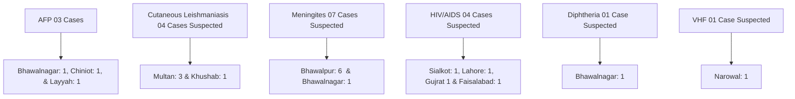

Punjab Information Technology Board logo
# PUNJAB INFORMATION TECHNOLOGY BOARD (PITB)
# DISEASE SURVEILLANCE SYSTEM
**WEEKLY SITREP**

EPIDEMIOLOGICAL WEEK NO.47 (16 NOV TO 22 NOV , 2014)

## DSS HIGHLIGHTS (WEEK 47)

## COMMUNICABLE DISEASE PATTERN FROM PUNJAB (WEEK 47)

<table>
  <thead>
    <tr>
        <th>Disease</th>
        <th>AD</th>
        <th>AFP</th>
        <th>ARI</th>
        <th>AVH</th>
        <th>AWD</th>
        <th>BD</th>
        <th>CL</th>
        <th>DB</th>
        <th>Diph</th>
        <th>HIV/AIDS</th>
        <th>Mal</th>
        <th>Meas</th>
        <th>Men</th>
        <th>NNT</th>
        <th>Pert</th>
        <th>Pneu</th>
        <th>PUO</th>
        <th>SB</th>
        <th>Scb</th>
        <th>STI</th>
        <th>TB</th>
        <th>TF</th>
        <th>VHF</th>
    </tr>
  </thead>
  <tbody>
    <tr>
        <td>Cases</td>
<td>9918</td>
<td>3</td>
<td>31351</td>
<td>336</td>
<td>756</td>
<td>169</td>
<td>4</td>
<td>1030</td>
<td>1</td>
<td>4</td>
<td>164</td>
<td>4</td>
<td>7</td>
<td>0</td>
<td>0</td>
<td>947</td>
<td>7524</td>
<td>18</td>
<td>2308</td>
<td>35</td>
<td>1446</td>
<td>1242</td>
<td>1</td>
    </tr>
  </tbody>
</table>

Disease cases as reported in week 47, Diarrhea (Acute) and ARI have had the biggest share

<table>
  <tbody>
    <tr>
        <td>Acute Flaccid Paralysis</td>
<td>AFP</td>
<td>Diphtheria Suspected</td>
<td>Diph</td>
<td>Pyrexia of Unknown Origin (PUO)</td>
<td>PUO</td>
    </tr>
<tr>
        <td>Acute (upper) Respiratory infections</td>
<td>ARI</td>
<td>Dog Bite</td>
<td>DB</td>
<td>Scabies</td>
<td>Scb</td>
    </tr>
<tr>
        <td>Acute Viral Hepatitis</td>
<td>AVH</td>
<td>Enteric /Typhoid Fever</td>
<td>TF</td>
<td>Sexually Transmitted Infections</td>
<td>STI</td>
    </tr>
<tr>
        <td>Acute Watery Diarrhea/Suspected Cholera</td>
<td>AWD</td>
<td>HIV/AIDS (Suspected)</td>
<td>HIV/AIDS</td>
<td>Snake Bite (with signs/ symptoms of poisoning)</td>
<td>SB</td>
    </tr>
<tr>
        <td>Tuberculosis (Suspected)</td>
<td>TB</td>
<td>Malaria (Suspected)</td>
<td>Mal</td>
<td>Suspected Viral Hemorrhagic Fever</td>
<td>VHF</td>
    </tr>
<tr>
        <td>Bloody Diarrhea/Dysentery</td>
<td>BD</td>
<td>Measles (Suspected)</td>
<td>Meas</td>
<td> </td>
<td> </td>
    </tr>
<tr>
        <td>Cutaneous Leishmaniasis</td>
<td>CL</td>
<td>Meningitis (Suspected)</td>
<td>Men</td>
<td> </td>
<td> </td>
    </tr>
<tr>
        <td>Diarrhoea (Acute)</td>
<td>AD</td>
<td>Neonatal Tetanus (Suspected)</td>
<td>NNT</td>
<td> </td>
<td> </td>
    </tr>
<tr>
        <td>Pneumonia</td>
<td>Pneu</td>
<td>Pertussis Suspected</td>
<td>Pert</td>
<td> </td>
<td> </td>
    </tr>
  </tbody>
</table>

\* "Data as reported from DHQs, THQs & Teaching Hospitals of Punjab"

Institute of Public Health logo World Health Organization Country office for Pakistan logo Department of Health Government of the Punjab logo

---

# DISEASE SURVEILLANCE SYSTEM

EPIDEMIOLOGICAL WEEK NO. 47 (16 NOV TO 22 NOV, 2014) WEEKLY SITREP

## DATA ANALYSIS OF SUSPECTED MEASLES FROM DSS DASHBOARD
## (01 JANUARY TO 23 NOVEMBER 2014)

### EPI CURVE OF CASES OF SUSPECTED MEASLES FROM PUNJAB PROVINCE

> The number of cases started rising in mid April as is expected from the seasonal trend of the disease. The typical rise and fall of the cases supports the occurance of a propagative epidemic which settled by the 30th week (August)

<table>
  <thead>
    <tr>
        <th>Week</th>
        <th>No. of Cases</th>
    </tr>
  </thead>
  <tbody>
    <tr>
        <td>1</td>
<td>5</td>
    </tr>
<tr>
        <td>2</td>
<td>7</td>
    </tr>
<tr>
        <td>3</td>
<td>4</td>
    </tr>
<tr>
        <td>4</td>
<td>10</td>
    </tr>
<tr>
        <td>5</td>
<td>3</td>
    </tr>
<tr>
        <td>6</td>
<td>1</td>
    </tr>
<tr>
        <td>7</td>
<td>1</td>
    </tr>
<tr>
        <td>8</td>
<td>3</td>
    </tr>
<tr>
        <td>9</td>
<td>11</td>
    </tr>
<tr>
        <td>10</td>
<td>5</td>
    </tr>
<tr>
        <td>11</td>
<td>10</td>
    </tr>
<tr>
        <td>12</td>
<td>8</td>
    </tr>
<tr>
        <td>13</td>
<td>8</td>
    </tr>
<tr>
        <td>14</td>
<td>10</td>
    </tr>
<tr>
        <td>15</td>
<td>6</td>
    </tr>
<tr>
        <td>16</td>
<td>18</td>
    </tr>
<tr>
        <td>17</td>
<td>26</td>
    </tr>
<tr>
        <td>18</td>
<td>29</td>
    </tr>
<tr>
        <td>19</td>
<td>43</td>
    </tr>
<tr>
        <td>20</td>
<td>61</td>
    </tr>
<tr>
        <td>21</td>
<td>56</td>
    </tr>
<tr>
        <td>22</td>
<td>48</td>
    </tr>
<tr>
        <td>23</td>
<td>48</td>
    </tr>
<tr>
        <td>24</td>
<td>34</td>
    </tr>
<tr>
        <td>25</td>
<td>28</td>
    </tr>
<tr>
        <td>26</td>
<td>25</td>
    </tr>
<tr>
        <td>27</td>
<td>16</td>
    </tr>
<tr>
        <td>28</td>
<td>13</td>
    </tr>
<tr>
        <td>29</td>
<td>6</td>
    </tr>
<tr>
        <td>30</td>
<td>2</td>
    </tr>
<tr>
        <td>31</td>
<td>10</td>
    </tr>
<tr>
        <td>32</td>
<td>2</td>
    </tr>
<tr>
        <td>33</td>
<td>2</td>
    </tr>
<tr>
        <td>34</td>
<td>4</td>
    </tr>
<tr>
        <td>35</td>
<td>8</td>
    </tr>
<tr>
        <td>36</td>
<td>3</td>
    </tr>
<tr>
        <td>37</td>
<td>3</td>
    </tr>
<tr>
        <td>38</td>
<td>3</td>
    </tr>
<tr>
        <td>39</td>
<td>3</td>
    </tr>
<tr>
        <td>40</td>
<td>4</td>
    </tr>
<tr>
        <td>41</td>
<td>2</td>
    </tr>
<tr>
        <td>43</td>
<td>3</td>
    </tr>
<tr>
        <td>45</td>
<td>2</td>
    </tr>
<tr>
        <td>46</td>
<td>2</td>
    </tr>
<tr>
        <td>47</td>
<td>2</td>
    </tr>
  </tbody>
</table>

### AGE WISE DISTRIBUTION OF CASES OF SUSPECTED MEASLES FROM PUNJAB

> Bimodal presentation with most cases presenting before the age of one year. The second peak occurs at 5-10 years of age after the scheduled time for the second dose of Measles Vaccine. Increase in number of cases between the age of 2-10 years raises questions on current EPI campaign.

<table>
  <thead>
    <tr>
        <th>Age (Years)</th>
        <th>No. of Cases</th>
    </tr>
  </thead>
  <tbody>
    <tr>
        <td>Up to 1</td>
<td>177</td>
    </tr>
<tr>
        <td>1 to 2</td>
<td>43</td>
    </tr>
<tr>
        <td>2 to 5</td>
<td>162</td>
    </tr>
<tr>
        <td>5 to 10</td>
<td>173</td>
    </tr>
<tr>
        <td>10 to 20</td>
<td>39</td>
    </tr>
<tr>
        <td>20 to 30</td>
<td>7</td>
    </tr>
<tr>
        <td>30 to 40</td>
<td>2</td>
    </tr>
<tr>
        <td>40 to 50</td>
<td>2</td>
    </tr>
<tr>
        <td>50 to 60</td>
<td>1</td>
    </tr>
  </tbody>
</table>

### DISTRIBUTION OF CASES OF SUSPECTED MEASLES BELOW 1 YEAR OF AGE

> Age which is expected to be protected by transplacental maternal antibodies which may persist up to 1 year of age. Lack of this protection is a topic for future research

> Measles Vaccination Dose - I expected to be injected

<table>
  <thead>
    <tr>
        <th>Age (Month)</th>
        <th>No. of Csases</th>
    </tr>
  </thead>
  <tbody>
    <tr>
        <td>0-5.99</td>
<td>63</td>
    </tr>
<tr>
        <td>6-8.99</td>
<td>114</td>
    </tr>
<tr>
        <td>9-11.99</td>
<td>46</td>
    </tr>
  </tbody>
</table>

\* "Data as reported from DHQs, THQs & Teaching Hospitals of Punjab"

Punjab Information Technology Board

Page 2

---

# DISEASE SURVEILLANCE SYSTEM

EPIDEMIOLOGICAL WEEK NO. 47 (16 NOV TO 22 NOV, 2014) WEEKLY SITREP

## DISTRICTS OF ORIGIN OF CASES OF SUSPECTED MEASLES

<table>
  <thead>
    <tr>
        <th>District</th>
        <th>No. of Cases</th>
    </tr>
  </thead>
  <tbody>
    <tr>
        <td>Rawalpindi</td>
<td>72</td>
    </tr>
<tr>
        <td>Lahore</td>
<td>66</td>
    </tr>
<tr>
        <td>Sialkot</td>
<td>51</td>
    </tr>
<tr>
        <td>Chiniot</td>
<td>41</td>
    </tr>
<tr>
        <td>Gujrat</td>
<td>36</td>
    </tr>
<tr>
        <td>Okara</td>
<td>31</td>
    </tr>
<tr>
        <td>Rahim Yar Khan</td>
<td>28</td>
    </tr>
<tr>
        <td>Sheikhupura</td>
<td>26</td>
    </tr>
<tr>
        <td>Bahawalpur</td>
<td>23</td>
    </tr>
<tr>
        <td>Attock</td>
<td>21</td>
    </tr>
<tr>
        <td>Jhelum</td>
<td>18</td>
    </tr>
<tr>
        <td>Gujranwala</td>
<td>17</td>
    </tr>
<tr>
        <td>Muzaffargarh</td>
<td>15</td>
    </tr>
<tr>
        <td>Lodhran</td>
<td>14</td>
    </tr>
<tr>
        <td>Sargodha</td>
<td>13</td>
    </tr>
<tr>
        <td>Toba Tek Singh</td>
<td>13</td>
    </tr>
<tr>
        <td>Chakwal</td>
<td>11</td>
    </tr>
<tr>
        <td>Layyah</td>
<td>10</td>
    </tr>
<tr>
        <td>Mandi Bahauddin</td>
<td>9</td>
    </tr>
<tr>
        <td>Hafizabad</td>
<td>8</td>
    </tr>
<tr>
        <td>Khushab</td>
<td>8</td>
    </tr>
<tr>
        <td>Nankana Sahib</td>
<td>8</td>
    </tr>
<tr>
        <td>Rajanpur</td>
<td>8</td>
    </tr>
<tr>
        <td>Jhang</td>
<td>7</td>
    </tr>
<tr>
        <td>Narowal</td>
<td>7</td>
    </tr>
<tr>
        <td>Bhakkar</td>
<td>6</td>
    </tr>
<tr>
        <td>Faisalabad</td>
<td>6</td>
    </tr>
<tr>
        <td>Bahawalnagar</td>
<td>5</td>
    </tr>
<tr>
        <td>Kasur</td>
<td>5</td>
    </tr>
<tr>
        <td>Khanewal</td>
<td>5</td>
    </tr>
<tr>
        <td>Multan</td>
<td>5</td>
    </tr>
<tr>
        <td>Mianwali</td>
<td>2</td>
    </tr>
<tr>
        <td>Pakpattan</td>
<td>2</td>
    </tr>
<tr>
        <td>Vehari</td>
<td>2</td>
    </tr>
<tr>
        <td>Sahiwal</td>
<td>1</td>
    </tr>
  </tbody>
</table>

\* No. of cases as shown in graph suggest needs for improvement in reporting system for better understanding of disease distribution

## TYPE OF HEALTH FACILITIES FROM WHERE THE CASES OF SUSPECTED MEASLES WERE REPORTED

<table>
  <thead>
    <tr>
        <th>Facility Type</th>
        <th>No. of Cases</th>
    </tr>
  </thead>
  <tbody>
    <tr>
        <td>BHU</td>
<td>24</td>
    </tr>
<tr>
        <td>RHC</td>
<td>23</td>
    </tr>
<tr>
        <td>THQ</td>
<td>111</td>
    </tr>
<tr>
        <td>DHQ</td>
<td>220</td>
    </tr>
<tr>
        <td>Tertiary</td>
<td>124</td>
    </tr>
<tr>
        <td>EDOs Office</td>
<td>104</td>
    </tr>
  </tbody>
</table>

## GENDER WISE DISTRIBUTION OF CASES OF SUSPECTED MEASLES FROM PUNJAB

<table>
  <thead>
    <tr>
        <th>Gender</th>
        <th>Count</th>
        <th>Percentage</th>
    </tr>
  </thead>
  <tbody>
    <tr>
        <td>Male</td>
<td>325</td>
<td>54%</td>
    </tr>
<tr>
        <td>Female</td>
<td>279</td>
<td>46%</td>
    </tr>
  </tbody>
</table>

\* "Data as reported from DHQs, THQs & Teaching Hospitals of Punjab"

Punjab Information Technology Board Page 3

---

# DISEASE SURVEILLANCE SYSTEM

EPIDEMIOLOGICAL WEEK NO. 47 (16 NOV TO 22 NOV, 2014) | WEEKLY SITREP

## GEOGRAPHICAL DISTRIBUTION OF LAB CONFIRMED DENGUE PATIENTS

Map of Punjab showing geographical distribution of lab confirmed dengue patients for weeks 1 to 47. Various districts are marked with red circles containing patient counts, such as Rawalpindi (1175), Lahore (94), and Sheikhupura (60).

Map of Punjab showing geographical distribution of lab confirmed dengue patients for week 47. Districts are marked with blue circles containing patient counts, such as Rawalpindi (74) and Lahore (4).

## SATSCAN ALERTS FOR DENGUE (WEEK 47)

Map of Rawalpindi area showing SatScan alerts for dengue with red and yellow circular buffer zones. An inset shows a mobile phone screen with a "Dengue Alerts" SMS from PITB Dashboard Alert detailing specific epicenters and radii in Lahore.

Alerts are also sent on daily basis in SMS to concerned stakeholders

Punjab Information Technology Board
Page 4
