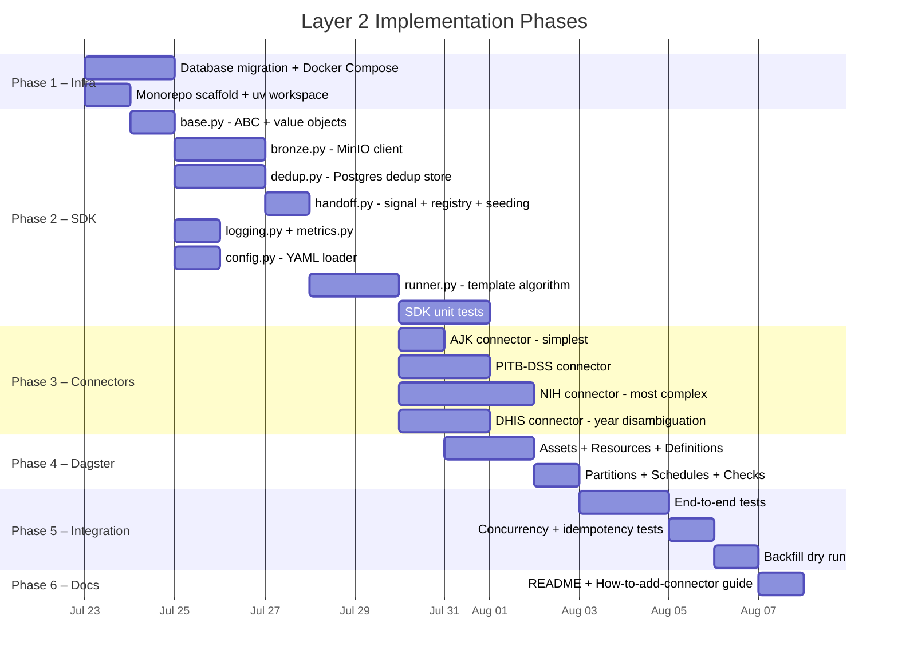
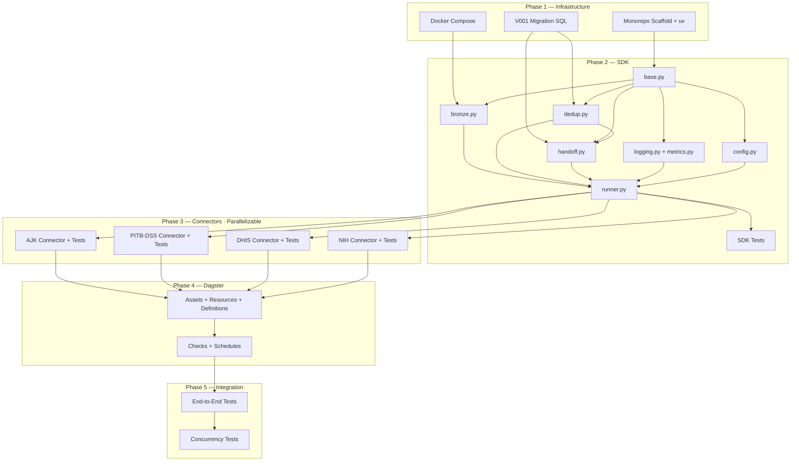

# CHIP Layer 2 — Implementation Plan

**Layer:** Layer 2 — Data Collection Connectors (Thin Connector Model)  
**Source spec:** [02-connectors-thin-model.md](file:///home/ibtasaam/PCN/CHIP/docs/architecture_v1/zoomed_in_layer/layer2/02-connectors-thin-model.md)  
**Status:** Ready to implement  
**Created:** 2026-07-22  

---

## 0. Resolved Design Decisions (Pre-Implementation)

These were resolved during planning. They are **binding** for implementation.

| ID | Decision | Rationale |
|---|---|---|
| **IMPL-01** | `extractor_status` rows are seeded by **application logic** in `runner.py` Step 7, not by a Postgres trigger | Easier to debug and test; the runner is the only code path that INSERTs into `raw_documents` |
| **IMPL-02** | Kafka is **not deployed** in Layer 2's docker-compose — deferred to Layer 3 | Layer 2 only needs Postgres + MinIO |
| **IMPL-03** | NIH files without a year in the filename use **content-based year extraction** (scan first 50 lines). Trailing `-1`, `_3` are **duplicate markers** — stripped before identity derivation. Identity dedup handles collisions (first one wins) | 5 affected files: `IDSR-Weekly-Report-50.md`, `-7-1.md`, `-23_3.md`, `-40-Final.md`, `-48-Final.md` |
| **IMPL-04** | NIH files with `-NEW`, `-updated`, `-NG`, `(1)` suffixes: **strip all suffixes** before deriving identity. No original (unsuffixed) versions exist — these ARE the files | 9 affected files. No collision risk since originals don't exist |
| **IMPL-05** | DHIS non-weekly files (annual reports, outbreak reports, monthly reports): **silently skipped** by discover(). The regex `[Ww]eek[_ ]?(\d+)` won't match them. No log, no count. Future: separate `dhis_punjab_annual` connector | ~60 non-weekly files in DHIS/MD |
| **IMPL-06** | DHIS duplicate files (`week_18.md`, `Week_18(1).md`, `week_18(2).md`): **first file found wins** via identity dedup. Parenthetical suffixes stripped before identity derivation. Likely parser artifacts, not substantive differences | Up to 4 copies per week observed |
| **IMPL-07** | Python tooling: **`uv`** with `pyproject.toml`. Single monorepo `pyproject.toml` with workspace packages | Fast, modern, lockfile-based |

---

## 1. Monorepo Folder Structure (Target Scaffold)

This is the full folder structure that will exist when Layer 2 is complete. Phases reference files by their path below.

```
CHIP/
├── pyproject.toml                          # Monorepo root — uv workspace definition
├── uv.lock                                 # Generated lockfile
├── .python-version                         # Pin Python 3.12
│
├── libs/
│   └── chip_connectors/                    # SDK package
│       ├── pyproject.toml                  # Workspace member: [project] name = "chip-connectors"
│       ├── __init__.py
│       ├── base.py                         # Connector ABC, DiscoveredItem, RawArtifact,
│       │                                   #   RawDocumentRow, RunSummary
│       ├── runner.py                       # run_connector() — the template algorithm
│       ├── bronze.py                       # BronzeClient — MinIO archive + .meta.json sidecar
│       ├── dedup.py                        # DedupStore — identity + content dedup (Postgres)
│       ├── handoff.py                      # HandoffStore — signal(), get_registered_extractors(),
│       │                                   #   seed_extractor_status()
│       ├── logging.py                      # structlog config + context binding
│       ├── metrics.py                      # RunSummary → connector_runs table writer
│       └── config.py                       # YAML config loader + validation (Pydantic)
│
├── connectors/                             # One package per source
│   ├── nih_idsr/
│   │   ├── pyproject.toml                  # Workspace member, depends on chip-connectors
│   │   ├── __init__.py
│   │   ├── connector.py                    # NihIdsrConnector(Connector)
│   │   ├── config.yaml
│   │   └── tests/
│   │       ├── __init__.py
│   │       ├── test_discover.py            # Identity derivation for all 6+ filename patterns
│   │       ├── test_fetch.py               # Read .md files, verify RawArtifact shape
│   │       └── conftest.py                 # Fixtures: sample filenames, mock RunContext
│   │
│   ├── pitb_dss/
│   │   ├── pyproject.toml
│   │   ├── __init__.py
│   │   ├── connector.py                    # PitbDssConnector(Connector)
│   │   ├── config.yaml
│   │   └── tests/
│   │       ├── __init__.py
│   │       ├── test_discover.py
│   │       ├── test_fetch.py
│   │       └── conftest.py
│   │
│   ├── ajk_idsrs/
│   │   ├── pyproject.toml
│   │   ├── __init__.py
│   │   ├── connector.py                    # AjkIdsrsConnector(Connector)
│   │   ├── config.yaml
│   │   └── tests/
│   │       ├── __init__.py
│   │       ├── test_discover.py
│   │       ├── test_fetch.py
│   │       └── conftest.py
│   │
│   ├── dhis_punjab_weekly/
│   │   ├── pyproject.toml
│   │   ├── __init__.py
│   │   ├── connector.py                    # DhisPunjabWeeklyConnector(Connector)
│   │   ├── config.yaml
│   │   └── tests/
│   │       ├── __init__.py
│   │       ├── test_discover.py            # Year disambiguation from content
│   │       ├── test_fetch.py
│   │       └── conftest.py
│   │
│   └── README.md                           # "How to add a connector" guide
│
├── pipelines/
│   └── ingestion/
│       ├── __init__.py
│       ├── assets.py                       # Dagster SDAs: raw_nih_idsr, raw_pitb_dss, etc.
│       ├── resources.py                    # Dagster resources → RunContext factory
│       ├── partitions.py                   # WeeklyPartitionsDefinition per source
│       ├── schedules.py                    # Cron schedules (prototype: manual trigger)
│       ├── checks.py                       # Asset checks: freshness, zero-discovery, status seeding
│       └── definitions.py                  # Dagster Definitions() entry point
│
├── migrations/
│   └── V001__layer2_ingestion_schema.sql   # All CREATE TABLE statements for Layer 2
│
├── infra/
│   └── docker/
│       ├── Dockerfile.connector            # Python 3.12 slim + uv + chip-connectors
│       └── docker-compose.layer2.yaml      # MinIO + Postgres (no Kafka)
│
├── tests/
│   ├── __init__.py
│   ├── conftest.py                         # Shared fixtures: Postgres testcontainer, MinIO mock
│   ├── sdk/
│   │   ├── __init__.py
│   │   ├── test_runner.py                  # Full run_connector() integration (mock connector)
│   │   ├── test_bronze.py                  # MinIO archive + .meta.json + content addressing
│   │   ├── test_dedup.py                   # Identity + content dedup (Postgres)
│   │   ├── test_handoff.py                 # signal(), get_registered_extractors(), seed_extractor_status()
│   │   └── test_metrics.py                 # RunSummary → connector_runs
│   └── integration/
│       ├── __init__.py
│       ├── test_end_to_end.py              # Full pipeline: discover → archive → verify in Postgres + MinIO
│       ├── test_dedup_concurrency.py       # Concurrent connector runs don't produce duplicates
│       └── test_idempotency.py             # Re-running the same connector is a no-op
│
├── docs/
│   └── implementation_plans/
│       └── layer2_implementation_plan.md    # ← This file
│
└── Data_sources_1/                         # Existing — NOT modified
    ├── NIH/MD/                             # 174 .md files
    ├── PITB-DSS/{2015..2018}/MD/           # 169 .md files
    ├── AJK/out/MD/                         # 3 .md files
    └── DHIS/MD/                            # 111 .md files (only ~52 weekly ingested)
```

---

## 2. Phase Overview



---

## 3. Phase 1 — Infrastructure Scaffold

### Task 1.1 — Database Migration

**File:** `migrations/V001__layer2_ingestion_schema.sql`

Create all Layer 2 Postgres tables in a single, versioned migration file. This migration is idempotent (uses `IF NOT EXISTS`).

```sql
-- Schema
CREATE SCHEMA IF NOT EXISTS ingestion;

-- 1. Dedup state
CREATE TABLE IF NOT EXISTS ingestion.dedup_state (
    source          TEXT NOT NULL,
    identity        TEXT NOT NULL,
    content_hash    TEXT NOT NULL,
    bronze_uri      TEXT,
    first_seen_at   TIMESTAMPTZ NOT NULL DEFAULT now(),
    last_seen_at    TIMESTAMPTZ NOT NULL DEFAULT now(),
    PRIMARY KEY (source, identity)
);
CREATE INDEX IF NOT EXISTS idx_dedup_content
    ON ingestion.dedup_state (source, content_hash);

-- 2. Raw documents (connector → extractor handoff)
CREATE TABLE IF NOT EXISTS ingestion.raw_documents (
    id                BIGINT GENERATED ALWAYS AS IDENTITY PRIMARY KEY,
    source            TEXT NOT NULL,
    identity          TEXT NOT NULL,
    bronze_uri        TEXT NOT NULL,
    content_hash      TEXT NOT NULL,
    content_type      TEXT NOT NULL,
    original_filename TEXT NOT NULL,
    source_uri        TEXT NOT NULL,
    connector_version TEXT NOT NULL,
    retrieved_at      TIMESTAMPTZ NOT NULL,
    file_size_bytes   BIGINT NOT NULL,
    created_at        TIMESTAMPTZ NOT NULL DEFAULT now(),
    UNIQUE (source, identity)
);

-- 3. Extractor registry (config table)
CREATE TABLE IF NOT EXISTS ingestion.extractor_registry (
    source          TEXT NOT NULL,
    extractor_name  TEXT NOT NULL,
    PRIMARY KEY (source, extractor_name)
);

-- Seed data for prototype
INSERT INTO ingestion.extractor_registry (source, extractor_name) VALUES
    ('nih_idsr',            'nih_idsr_disease_tables'),
    ('pitb_dss',            'pitb_dss_disease_tables'),
    ('ajk_idsrs',           'ajk_idsrs_disease_tables'),
    ('dhis_punjab_weekly',  'dhis_punjab_disease_tables')
ON CONFLICT DO NOTHING;

-- 4. Extractor status (per document x per extractor)
CREATE TABLE IF NOT EXISTS ingestion.extractor_status (
    id                BIGINT GENERATED ALWAYS AS IDENTITY PRIMARY KEY,
    raw_document_id   BIGINT NOT NULL REFERENCES ingestion.raw_documents(id),
    extractor_name    TEXT NOT NULL,
    status            TEXT NOT NULL DEFAULT 'pending',
    records_produced  INT,
    error_message     TEXT,
    error_at          TIMESTAMPTZ,
    started_at        TIMESTAMPTZ,
    completed_at      TIMESTAMPTZ,
    created_at        TIMESTAMPTZ NOT NULL DEFAULT now(),
    UNIQUE (raw_document_id, extractor_name)
);
CREATE INDEX IF NOT EXISTS idx_extractor_status_pending
    ON ingestion.extractor_status (extractor_name, status)
    WHERE status = 'pending';

-- 5. Connector runs (operational audit)
CREATE TABLE IF NOT EXISTS ingestion.connector_runs (
    run_id            BIGINT GENERATED ALWAYS AS IDENTITY PRIMARY KEY,
    source            TEXT NOT NULL,
    connector_version TEXT NOT NULL,
    discovered        INT NOT NULL DEFAULT 0,
    fetched           INT NOT NULL DEFAULT 0,
    archived          INT NOT NULL DEFAULT 0,
    skipped_identity  INT NOT NULL DEFAULT 0,
    skipped_content   INT NOT NULL DEFAULT 0,
    errors            INT NOT NULL DEFAULT 0,
    duration_ms       INT NOT NULL,
    started_at        TIMESTAMPTZ NOT NULL,
    finished_at       TIMESTAMPTZ NOT NULL DEFAULT now()
);
```

**Acceptance criteria:**
- [ ] Migration runs cleanly on a fresh Postgres 16 instance
- [ ] Migration is idempotent (can run twice without error)
- [ ] All tables exist in the `ingestion` schema
- [ ] Seed data is present in `extractor_registry`

---

### Task 1.2 — Docker Compose

**File:** `infra/docker/docker-compose.layer2.yaml`

Stand up MinIO + Postgres. No Kafka (deferred to Layer 3 per IMPL-02).

| Service | Image | Ports | Purpose |
|---|---|---|---|
| `postgres` | `postgres:16-alpine` | `5432` | Metadata DB (dedup, raw_documents, extractor_status, connector_runs) |
| `minio` | `minio/minio:latest` | `9000` (API), `9001` (console) | Bronze object store |
| `minio-init` | `minio/mc:latest` | — | One-shot: create `chip-bronze` bucket, enable versioning, set WORM policy |

**Acceptance criteria:**
- [ ] `docker compose -f infra/docker/docker-compose.layer2.yaml up -d` starts all services
- [ ] Postgres is accessible on `localhost:5432` with database `chip`
- [ ] MinIO is accessible on `localhost:9000` with bucket `chip-bronze`
- [ ] MinIO bucket has versioning enabled

---

### Task 1.3 — Monorepo Scaffold

**Files:** Root `pyproject.toml`, `.python-version`, `libs/chip_connectors/pyproject.toml`

Set up `uv` workspaces with the following dependency tree:

```
chip (root workspace)
├── chip-connectors          # libs/chip_connectors/
│   ├── minio                # MinIO Python client
│   ├── psycopg[binary]      # Postgres driver
│   ├── structlog            # Structured logging
│   ├── pyyaml               # YAML config
│   └── pydantic >= 2.0      # Config validation
│
├── chip-connector-nih-idsr  # connectors/nih_idsr/ (depends on chip-connectors)
├── chip-connector-pitb-dss  # connectors/pitb_dss/
├── chip-connector-ajk-idsrs # connectors/ajk_idsrs/
├── chip-connector-dhis      # connectors/dhis_punjab_weekly/
│
└── dev dependencies
    ├── pytest
    ├── pytest-asyncio
    ├── pytest-cov
    ├── testcontainers[postgres,minio]
    └── dagster + dagster-webserver
```

**Acceptance criteria:**
- [ ] `uv sync` resolves and installs all dependencies
- [ ] `uv run pytest --collect-only` discovers test modules
- [ ] Each workspace member is importable: `from libs.chip_connectors.base import Connector`

---

## 4. Phase 2 — Connector SDK (`libs/chip_connectors/`)

### Task 2.1 — `base.py` — Core Interfaces

**Implements:** [02-connectors-thin-model.md §1.2](file:///home/ibtasaam/PCN/CHIP/docs/architecture_v1/zoomed_in_layer/layer2/02-connectors-thin-model.md#L110-L208)

| Class / Dataclass | Fields | Notes |
|---|---|---|
| `DiscoveredItem` | `source_uri`, `identity`, `hints` | Frozen dataclass |
| `RawArtifact` | `item`, `content`, `content_type`, `fetched_at`, `original_filename`, `http_meta` | Frozen; `.content_hash` is a computed `@property` |
| `RawDocumentRow` | All 10 fields from spec | Frozen; maps 1:1 to `ingestion.raw_documents` |
| `RunSummary` | `source`, `discovered`, `fetched`, `archived`, `skipped_identity`, `skipped_content`, `errors`, `duration_ms` | Mutable dataclass |
| `RunContext` | `bronze`, `dedup`, `handoff`, `log`, `metrics` | Container for injected services |
| `Connector` (ABC) | `name`, `connector_version`, `content_type` | 3 abstract methods: `discover()`, `fetch()`, `derive_identity()` |

**Tests:** `tests/sdk/test_base.py`
- [ ] `RawArtifact.content_hash` returns deterministic `sha256:...` for the same bytes
- [ ] `DiscoveredItem` and `RawArtifact` are immutable (frozen)
- [ ] `Connector` cannot be instantiated directly (ABC enforcement)

---

### Task 2.2 — `bronze.py` — MinIO Archival Client

**Implements:** [02-connectors-thin-model.md §1.6](file:///home/ibtasaam/PCN/CHIP/docs/architecture_v1/zoomed_in_layer/layer2/02-connectors-thin-model.md#L340-L371)

| Method | Signature | Behavior |
|---|---|---|
| `archive()` | `(source, identity, content, content_type, content_hash, original_filename, metadata) -> str` | PUT raw bytes + `.meta.json` sidecar. Returns `bronze_uri`. |
| `get()` | `(bronze_uri) -> bytes` | GET raw bytes from MinIO. Used by Layer 3 extractor. |

**Key properties to test:**
- Content-addressed path: same bytes → same path → idempotent write
- `.meta.json` sidecar contains `source_uri`, `retrieved_at`, `connector_version`
- Identity keys with colons (`:`) in the path are handled correctly
- Content hash in path uses URL-safe format

**Tests:** `tests/sdk/test_bronze.py`
- [ ] Archive a file → verify object exists in MinIO with correct path
- [ ] Archive same file twice → no error, same path
- [ ] `.meta.json` sidecar is parseable and contains expected keys
- [ ] `get()` retrieves the exact bytes that were archived
- [ ] Content hash in path uses URL-safe format (no `/` in hash)

---

### Task 2.3 — `dedup.py` — Identity + Content Dedup Store

**Implements:** [02-connectors-thin-model.md §1.5](file:///home/ibtasaam/PCN/CHIP/docs/architecture_v1/zoomed_in_layer/layer2/02-connectors-thin-model.md#L316-L338)

| Method | Signature | Behavior |
|---|---|---|
| `identity_seen()` | `(source, identity) -> bool` | `SELECT EXISTS(... WHERE source=? AND identity=?)` |
| `content_seen()` | `(source, content_hash) -> bool` | `SELECT EXISTS(... WHERE source=? AND content_hash=?)` |
| `record_identity()` | `(source, identity)` | `INSERT ... ON CONFLICT DO UPDATE SET last_seen_at = now()` |
| `record_content()` | `(source, content_hash)` | Update `content_hash` in existing row |

**Tests:** `tests/sdk/test_dedup.py`
- [ ] `identity_seen()` returns `False` for unseen identity, `True` after `record_identity()`
- [ ] `content_seen()` returns `False` for unseen hash, `True` after `record_content()`
- [ ] Different sources have independent dedup (same identity in source A and B → both ingest)
- [ ] `record_identity()` is idempotent (updates `last_seen_at` on conflict)
- [ ] **Concurrency test:** Two threads calling `record_identity()` with the same key simultaneously → no duplicate rows, no deadlock

---

### Task 2.4 — `handoff.py` — Downstream Signal + Extractor Seeding

**Implements:** [02-connectors-thin-model.md §1.7 and §1.8](file:///home/ibtasaam/PCN/CHIP/docs/architecture_v1/zoomed_in_layer/layer2/02-connectors-thin-model.md#L372-L439)

| Method | Signature | Behavior |
|---|---|---|
| `signal()` | `(row: RawDocumentRow) -> int` | `INSERT INTO raw_documents ... RETURNING id`. Returns the `doc_id`. |
| `get_registered_extractors()` | `(source: str) -> list[str]` | `SELECT extractor_name FROM extractor_registry WHERE source = ?` |
| `seed_extractor_status()` | `(raw_document_id: int, extractor_name: str)` | `INSERT INTO extractor_status ON CONFLICT DO NOTHING` |

**Tests:** `tests/sdk/test_handoff.py`
- [ ] `signal()` inserts a row and returns a valid integer `id`
- [ ] `signal()` with duplicate `(source, identity)` raises or handles the UNIQUE violation gracefully
- [ ] `get_registered_extractors()` returns correct names from seeded registry
- [ ] `get_registered_extractors()` returns empty list for unknown source
- [ ] `seed_extractor_status()` creates a `pending` row
- [ ] `seed_extractor_status()` is idempotent (ON CONFLICT DO NOTHING)
- [ ] Full flow: `signal()` → `get_registered_extractors()` → `seed_extractor_status()` → verify `extractor_status` row exists with `status = 'pending'`

---

### Task 2.5 — `logging.py` + `metrics.py`

**Implements:** [02-connectors-thin-model.md §1.9](file:///home/ibtasaam/PCN/CHIP/docs/architecture_v1/zoomed_in_layer/layer2/02-connectors-thin-model.md#L441-L471)

`logging.py`:
- Configure `structlog` with JSON output, bound context (`source`, `run_id`)
- Factory function: `get_connector_logger(source: str, run_id: str) -> BoundLogger`

`metrics.py`:
- `emit(summary: RunSummary, db_url: str)` → `INSERT INTO ingestion.connector_runs`

**Tests:** `tests/sdk/test_metrics.py`
- [ ] `emit()` inserts a row into `connector_runs` with correct field mapping
- [ ] `duration_ms` is a non-negative integer

---

### Task 2.6 — `config.py` — YAML Config Loader

| Responsibility | Detail |
|---|---|
| Load `config.yaml` for a connector | Uses `PyYAML` + `Pydantic` model validation |
| Validate required fields | `source`, `connector_version`, `content_type`, `discovery.source_directory`, `discovery.file_extension` |
| Provide typed access | `config.discovery.source_directory` → `Path` |

**Tests:**
- [ ] Valid YAML loads successfully
- [ ] Missing required field raises `ValidationError`
- [ ] Extra fields are ignored (forward compatibility)

---

### Task 2.7 — `runner.py` — The Template Algorithm

**Implements:** [02-connectors-thin-model.md §1.3](file:///home/ibtasaam/PCN/CHIP/docs/architecture_v1/zoomed_in_layer/layer2/02-connectors-thin-model.md#L210-L306)

This is the **heart of the SDK**. It implements the 7-step algorithm:

```
Step 1: Identity dedup check      → skip if seen
Step 2: Fetch raw bytes            → connector.fetch()
Step 3: Content dedup check        → skip if same hash seen
Step 4: Archive to bronze          → BronzeClient.archive()
Step 5: Record content hash        → DedupStore.record_content()
Step 6: Signal downstream          → HandoffStore.signal() + record_identity()
Step 7: Seed extractor_status      → HandoffStore.seed_extractor_status()
```

**Critical implementation notes:**
- `doc_id` must be the return value of `ctx.handoff.signal()` (Step 6), used in Step 7
- Steps 5-7 should be in a single database transaction (atomic: either all succeed or all roll back)
- Timing: capture `started_at` before the loop, compute `duration_ms` after

**Tests:** `tests/sdk/test_runner.py`
- [ ] **Happy path:** Mock connector with 3 items → 3 archived, 0 skipped, RunSummary correct
- [ ] **Identity dedup:** Pre-seed dedup_state → items are skipped, `skipped_identity` count correct
- [ ] **Content dedup:** Two items with same content hash → second is skipped, `skipped_content` count correct
- [ ] **Fetch error:** Mock connector raises on fetch → item counted as `error`, other items still processed
- [ ] **Bronze error:** Mock bronze client raises → item counted as `error`, dedup NOT recorded (no false positive)
- [ ] **Extractor seeding:** After run, verify `extractor_status` rows exist for each archived document x each registered extractor
- [ ] **Empty discover:** Connector yields 0 items → RunSummary all zeros, no errors
- [ ] **Idempotency:** Run same connector twice → second run skips all items via identity dedup

---

## 5. Phase 3 — Per-Source Connectors

> [!TIP]
> All 4 connectors are **independent** — they can be implemented in parallel once the SDK (Phase 2) is complete. The recommended order is AJK → PITB-DSS → DHIS → NIH, from simplest to most complex.

### Task 3.1 — AJK IDSRS Connector (Simplest — 3 files, 1 regex)

**File:** `connectors/ajk_idsrs/connector.py`  
**Implements:** [02-connectors-thin-model.md §2.3](file:///home/ibtasaam/PCN/CHIP/docs/architecture_v1/zoomed_in_layer/layer2/02-connectors-thin-model.md#L654-L695)

| Method | Logic |
|---|---|
| `discover()` | Scan `Data_sources_1/AJK/out/MD/` for `.md` files. Single regex: `IDSR-WEEKLY-BULLETIN-AJK_EPI-Week-(\d+)_(\d{4})` |
| `derive_identity()` | `ajk_idsrs:{year}:W{week:02d}` |
| `fetch()` | `Path(source_uri).read_bytes()` |

**Tests:** `connectors/ajk_idsrs/tests/test_discover.py`
- [ ] `derive_identity("IDSR-WEEKLY-BULLETIN-AJK_EPI-Week-18_2026.md")` → `"ajk_idsrs:2026:W18"`
- [ ] `discover()` yields exactly 3 items from the real `Data_sources_1/AJK/out/MD/` directory
- [ ] Each item has a valid identity and source_uri

---

### Task 3.2 — PITB-DSS Connector (3 regexes, year from path)

**File:** `connectors/pitb_dss/connector.py`  
**Implements:** [02-connectors-thin-model.md §2.2](file:///home/ibtasaam/PCN/CHIP/docs/architecture_v1/zoomed_in_layer/layer2/02-connectors-thin-model.md#L590-L651)

| Method | Logic |
|---|---|
| `discover()` | Recursive scan of `Data_sources_1/PITB-DSS/20{YY}/MD/` subdirectories. 3 regexes with year from path or filename. |
| `derive_identity()` | `pitb_dss:{year}:W{week:02d}` |
| `fetch()` | `Path(source_uri).read_bytes()` |

**Tests:** `connectors/pitb_dss/tests/test_discover.py`
- [ ] `derive_identity("DSS-Bulletin-Week-11.md", year_hint=2015)` → `"pitb_dss:2015:W11"`
- [ ] `derive_identity("DSS Bulletin Week 12-2016.md")` → `"pitb_dss:2016:W12"`
- [ ] `derive_identity("HRS Bulletin Week 5,2017.md")` → `"pitb_dss:2017:W05"`
- [ ] `discover()` yields 169 items from the real directory
- [ ] 2015 files derive year from parent directory path (not filename)

---

### Task 3.3 — DHIS Punjab Weekly Connector (Year disambiguation from content)

**File:** `connectors/dhis_punjab_weekly/connector.py`  
**Implements:** [02-connectors-thin-model.md §2.4](file:///home/ibtasaam/PCN/CHIP/docs/architecture_v1/zoomed_in_layer/layer2/02-connectors-thin-model.md#L698-L763)

| Method | Logic |
|---|---|
| `discover()` | Scan `Data_sources_1/DHIS/MD/` for `.md` files matching `[Ww]eek[_ ]?(\d+)`. Open file, scan first 30 lines for year. Skip DHIS2 era (2024-2025). Strip parenthetical suffixes. Non-weekly files silently skipped. |
| `derive_identity()` | `dhis_punjab_weekly:{year}:W{week:02d}` |
| `fetch()` | `Path(source_uri).read_bytes()` |

**Special handling (per IMPL-05, IMPL-06):**
- Files like `Annual_Report_2013.md` → regex doesn't match → no `DiscoveredItem` → silent skip
- Files like `week_18(2).md` → strip `(2)` → identity `dhis_punjab_weekly:2022:W18` → identity dedup handles collision

**Tests:** `connectors/dhis_punjab_weekly/tests/test_discover.py`
- [ ] `derive_identity("week_18.md", year_hint=2022)` → `"dhis_punjab_weekly:2022:W18"`
- [ ] `derive_identity("Week_18(1).md", year_hint=2022)` → `"dhis_punjab_weekly:2022:W18"` (same — suffix stripped)
- [ ] Non-weekly file `Annual_Report_2013.md` produces no `DiscoveredItem`
- [ ] DHIS2 era file (year 2024 from content) → skipped, no `DiscoveredItem`
- [ ] `discover()` on real data yields ~52 items (DHIS-II era 2022 weeklies only)
- [ ] Year extraction from content: mock file with "DHIS-II" → year 2022

---

### Task 3.4 — NIH IDSR Connector (Most complex — 6+ regexes, edge cases)

**File:** `connectors/nih_idsr/connector.py`  
**Implements:** [02-connectors-thin-model.md §2.1](file:///home/ibtasaam/PCN/CHIP/docs/architecture_v1/zoomed_in_layer/layer2/02-connectors-thin-model.md#L476-L586)

| Method | Logic |
|---|---|
| `discover()` | Scan `Data_sources_1/NIH/MD/` for `.md` files (skip `.txt`). 6+ regex cascade. Content-based fallback for year-less files. Strip suffixes: `-NEW`, `-updated`, `-NG`, `-Final`, `(1)`, `-1`, `_3`. |
| `derive_identity()` | `idsr:{year}:W{week:02d}` |
| `fetch()` | `Path(source_uri).read_bytes()` |

**Regex cascade (from spec + real filenames observed):**

| Priority | Pattern | Example match | Year | Week |
|---|---|---|---|---|
| 1 | `Week-(\d{2})-(\d{4})` | `Week-01-2025.md` | group 2 | group 1 |
| 2 | `Weekly[_ ]Report-(\d+)-(\d{4})` | `Weekly Report-01-2024.md` | group 2 | group 1 |
| 3 | `IDSR-Weekly-Report-(\d+)-(\d{4})` | `IDSR-Weekly-Report-11-2022.md` | group 2 | group 1 |
| 4 | `IDSRS Weekly Report[- ](\d+)-(\d{4})` | `IDSRS Weekly Report-01-2026-NEW.md` | group 2 | group 1 |
| 5 | `Weekly_Report_(\d+)[_ ](\d{4})` | `Weekly_Report_22_2023.md` | group 2 | group 1 |
| 6 | `IDSR Week (\d+) Bulletin \((\d{4})\)` | `IDSR Week 13 Bulletin (2025).md` | group 2 | group 1 |
| 7 | Content fallback | `IDSR-Weekly-Report-50.md` | scan first 50 lines | from filename |

**Suffix stripping (applied BEFORE regex matching, per IMPL-03, IMPL-04):**
Strip these suffixes from the filename before applying the regex cascade: `-NEW`, `-updated`, `-NG`, `-Final`, `(1)`, `(2)`, `-1`, `_3`, `-updated (1)`, `-updated-NG`

**Tests:** `connectors/nih_idsr/tests/test_discover.py`
- [ ] All 6 regex patterns match their respective filename formats
- [ ] `derive_identity("Week-01-2025.md")` → `"idsr:2025:W01"`
- [ ] `derive_identity("Weekly Report-01-2024.md")` → `"idsr:2024:W01"`
- [ ] `derive_identity("IDSR-Weekly-Report-11-2022.md")` → `"idsr:2022:W11"`
- [ ] `derive_identity("IDSRS Weekly Report-01-2026-NEW.md")` → `"idsr:2026:W01"` (suffix stripped)
- [ ] `derive_identity("Weekly_Report_22_2023.md")` → `"idsr:2023:W22"`
- [ ] `derive_identity("IDSR Week 13 Bulletin (2025).md")` → `"idsr:2025:W13"`
- [ ] `derive_identity("IDSR-Weekly-Report-50.md")` → uses content fallback → year from first 50 lines
- [ ] `derive_identity("IDSR-Weekly-Report-7-1.md")` → suffix `-1` stripped → week 7 → content fallback for year
- [ ] `derive_identity("IDSR-Weekly-Report-13-2022-1.md")` → suffix `-1` stripped → `"idsr:2022:W13"`
- [ ] `derive_identity("IDSRS Weekly Report-02-2026-updated (1).md")` → suffixes stripped → `"idsr:2026:W02"`
- [ ] `discover()` on real data yields exactly 174 items
- [ ] Files that fail all patterns + content fallback → logged as ERROR, skipped

---

## 6. Phase 4 — Dagster Orchestration

### Task 4.1 — Assets + Resources + Definitions

**Files:** `pipelines/ingestion/assets.py`, `resources.py`, `definitions.py`

**Implements:** [02-connectors-thin-model.md §5](file:///home/ibtasaam/PCN/CHIP/docs/architecture_v1/zoomed_in_layer/layer2/02-connectors-thin-model.md#L869-L955)

| Asset | Connector | Group |
|---|---|---|
| `raw_nih_idsr` | `NihIdsrConnector` | `ingestion` |
| `raw_pitb_dss` | `PitbDssConnector` | `ingestion` |
| `raw_ajk_idsrs` | `AjkIdsrsConnector` | `ingestion` |
| `raw_dhis_punjab_weekly` | `DhisPunjabWeeklyConnector` | `ingestion` |

`resources.py`:
- `connector_ctx_resource` → builds `RunContext` from environment variables (`MINIO_ENDPOINT`, `DATABASE_URL`, etc.)

`definitions.py`:
- Single `Definitions()` entry point bundling all assets, resources, schedules, and checks

**Acceptance criteria:**
- [ ] `dagster dev -f pipelines/ingestion/definitions.py` starts the Dagster UI
- [ ] All 4 assets appear in the UI under the `ingestion` group
- [ ] Materialize `raw_ajk_idsrs` → succeeds, metadata shows `discovered=3, archived=3`

---

### Task 4.2 — Partitions + Schedules + Asset Checks

**Files:** `pipelines/ingestion/partitions.py`, `schedules.py`, `checks.py`

`partitions.py`: Prototype doesn't need partitioned assets — the connector's internal dedup makes re-running safe. Partitions can be added later for targeted replay.

`schedules.py`: Prototype uses manual materialization (no cron). Define schedules as comments for production reference.

`checks.py`:
- **Zero-discovery guard:** After materialization, assert `discovered > 0`
- **Status seeding check:** For every row in `raw_documents`, assert at least one `extractor_status` row exists (IMPL-01 safety net)
- **Error rate check:** Assert `errors / discovered < 0.05` (less than 5% error rate)

---

## 7. Phase 5 — Integration Testing

### Task 5.1 — End-to-End Tests

**File:** `tests/integration/test_end_to_end.py`

Uses `testcontainers` to spin up ephemeral Postgres + MinIO instances.

| Test | Scenario |
|---|---|
| `test_e2e_ajk_full_pipeline` | Run AJK connector against real `Data_sources_1/AJK/out/MD/` → verify 3 rows in `raw_documents`, 3 objects in MinIO, 3 `extractor_status` rows |
| `test_e2e_nih_smoke` | Run NIH connector against a 5-file subset → verify correct identities, bronze paths, and metadata |
| `test_e2e_pitb_dss_smoke` | Run PITB-DSS connector against a 5-file subset → verify year derivation from path |
| `test_e2e_dhis_weekly_only` | Run DHIS connector → verify only weekly files ingested, non-weekly files ignored, DHIS2 era skipped |

**Acceptance criteria:**
- [ ] All tests pass with real data files (not mocks)
- [ ] MinIO objects contain the exact bytes from the original `.md` files
- [ ] `.meta.json` sidecars are parseable and contain correct provenance

---

### Task 5.2 — Concurrency + Idempotency Tests

**File:** `tests/integration/test_dedup_concurrency.py`, `tests/integration/test_idempotency.py`

| Test | Scenario |
|---|---|
| `test_concurrent_connectors` | Run NIH and PITB-DSS connectors simultaneously in separate threads → no deadlocks, no cross-source interference, correct row counts |
| `test_concurrent_same_connector` | Run the same AJK connector in 2 threads simultaneously → no duplicate `raw_documents` rows (UNIQUE constraint holds) |
| `test_idempotent_rerun` | Run AJK connector once (3 archived) → run again → second run: `discovered=3, skipped_identity=3, archived=0` |
| `test_idempotent_partial_failure` | Run NIH connector, simulate failure after 50 documents → run again → second run picks up remaining documents, doesn't re-archive the first 50 |

---

## 8. Phase 6 — Documentation

### Task 6.1 — Connector README

**File:** `connectors/README.md`

"How to add a connector" guide:
1. Copy `connectors/ajk_idsrs/` as a template
2. Implement `discover()`, `fetch()`, `derive_identity()`
3. Write `config.yaml`
4. Register in `ingestion.extractor_registry`
5. Add a Dagster asset in `pipelines/ingestion/assets.py`
6. Run and verify

---

## 9. Test Matrix Summary

| Test category | Location | Count | Needs infra? |
|---|---|---|---|
| SDK unit tests | `tests/sdk/` | ~25 | Postgres + MinIO (testcontainers) |
| Connector unit tests (identity derivation) | `connectors/*/tests/` | ~30 | No (pure functions) |
| Connector unit tests (discover/fetch) | `connectors/*/tests/` | ~12 | Filesystem only |
| Integration tests (end-to-end) | `tests/integration/` | ~4 | Postgres + MinIO (testcontainers) |
| Concurrency / idempotency tests | `tests/integration/` | ~4 | Postgres + MinIO (testcontainers) |
| **Total** | | **~75** | |

---

## 10. Dependency Graph (Build Order)



> [!IMPORTANT]
> **Critical path:** Scaffold → `base.py` → (`bronze.py` ‖ `dedup.py`) → `handoff.py` → `runner.py` → Connectors (parallel) → Dagster → Integration tests.
>
> The longest pole is the NIH connector (Task 3.4) due to its 6+ regex patterns and content fallback. Start it as soon as `runner.py` is testable.
