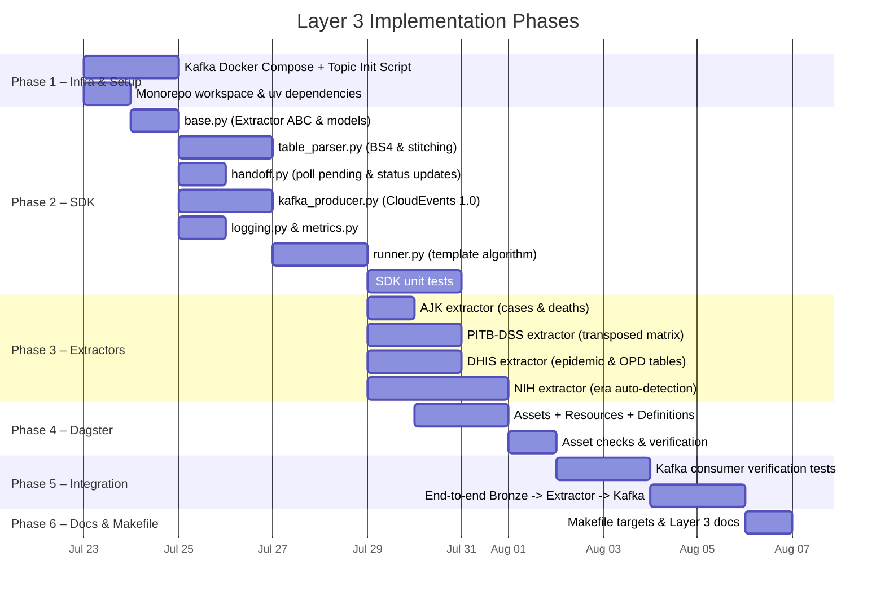
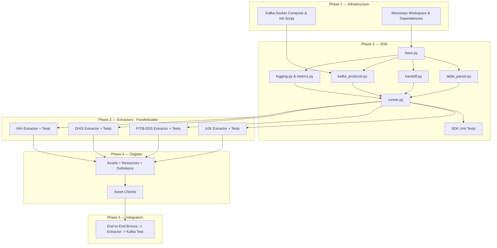

# CHIP Layer 3 — Implementation Plan

**Layer:** Layer 3 — Document Extractors  
**Source spec:** [03-document-extractors.md](file:///home/ibtasaam/PCN/CHIP/docs/architecture_v1/zoomed_in_layer/layer3/03-document-extractors.md)  
**Status:** Ready to implement  
**Created:** 2026-07-22  

---

## 0. Resolved Design Decisions (Pre-Implementation)

These design choices were confirmed for Layer 3 implementation:

| ID | Decision | Rationale |
|---|---|---|
| **L3-IMPL-01** | **Kafka Client**: `confluent-kafka` (Python binding for `librdkafka`) | C-based, high performance, industry standard for production Kafka |
| **L3-IMPL-02** | **Docker Compose & Makefile Orchestration**: `infra/docker/docker-compose.layer3.yaml` (Kafka in KRaft mode) and `infra/docker/docker-compose.full.yaml`. `make up` starts the full stack (Postgres + MinIO + Kafka) | Provides modular layer composes while allowing `make up` to orchestrate everything cleanly |
| **L3-IMPL-03** | **HTML Table Engine**: `BeautifulSoup4` with `lxml` parser | Reliable extraction, cleaning, and stitching of embedded `<table>...</table>` blocks in Markdown |
| **L3-IMPL-04** | **Table Stitching Rule**: Consecutive `<table>` blocks sharing identical header structures or matching district/disease signatures within the same document section are automatically merged before row extraction | Solves table fragmentation caused by PDF page breaks during Markdown conversion |
| **L3-IMPL-05** | **CloudEvents 1.0 Envelope (ADR-007)**: Every record published to Kafka is wrapped in standard CloudEvents JSON carrying full provenance (`source`, `identity`, `content_hash`, `bronze_uri`) | Guarantees auditability and trace-level tracking downstream |
| **L3-IMPL-06** | **Source-Native Granularity**: Extractor emits original string labels (`"D.G KHAN"`, `"ILI"`, `"AD (Non-Cholera)"`) without ontology translation or P-code mapping | Keeps Layer 3 focused strictly on document structure; Layer 4 (Normalizer) owns ontology and Silver layer writes |

---

## 1. Monorepo Folder Structure (Target Scaffold)

```
CHIP/
├── pyproject.toml                             # Monorepo root — uv workspace definition
├── Makefile                                   # Orchestrates up, test, extract, kafka-topics, db-status
│
├── libs/
│   ├── chip_connectors/                       # Layer 2 SDK (Existing)
│   └── chip_extractors/                       # Layer 3 SDK package (NEW)
│       ├── pyproject.toml                     # Workspace member: [project] name = "chip-extractors"
│       ├── __init__.py
│       ├── base.py                            # Extractor ABC, SourceRecord, ExtractionInput, RunSummary
│       ├── runner.py                          # run_extractor() — template algorithm
│       ├── handoff.py                         # HandoffClient — poll raw_documents & update status
│       ├── kafka_producer.py                  # KafkaProducerClient — CloudEvents envelope producer
│       ├── table_parser.py                    # BeautifulSoup HTML table extractor & multi-page stitcher
│       ├── logging.py                         # structlog config
│       ├── metrics.py                         # RunSummary emitter
│       └── config.py                          # Extractor config loader (Pydantic)
│
├── extractors/                                # One package per source extractor (NEW)
│   ├── nih_idsr_disease_tables/
│   │   ├── pyproject.toml
│   │   ├── __init__.py
│   │   ├── extractor.py                       # NihIdsrDiseaseTableExtractor(Extractor)
│   │   ├── config.yaml
│   │   └── tests/
│   │       ├── __init__.py
│   │       └── test_nih_extractor.py          # Transposed vs Pivoted era parsing & table extraction
│   │
│   ├── pitb_dss_disease_tables/
│   │   ├── pyproject.toml
│   │   ├── __init__.py
│   │   ├── extractor.py                       # PitbDssDiseaseTableExtractor(Extractor)
│   │   ├── config.yaml
│   │   └── tests/
│   │       ├── __init__.py
│   │       └── test_pitb_extractor.py          # Transposed matrix extraction (36 Punjab districts)
│   │
│   ├── ajk_idsrs_disease_tables/
│   │   ├── pyproject.toml
│   │   ├── __init__.py
│   │   ├── extractor.py                       # AjkIdsrsDiseaseTableExtractor(Extractor)
│   │   ├── config.yaml
│   │   └── tests/
│   │       ├── __init__.py
│   │       └── test_ajk_extractor.py           # Cases + Deaths columns & multi-table extraction
│   │
│   ├── dhis_punjab_disease_tables/
│   │   ├── pyproject.toml
│   │   ├── __init__.py
│   │   ├── extractor.py                       # DhisPunjabDiseaseTableExtractor(Extractor)
│   │   ├── config.yaml
│   │   └── tests/
│   │       ├── __init__.py
│   │       └── test_dhis_extractor.py          # Epidemic table + OPD summary table extraction
│   │
│   └── README.md                              # "How to add an extractor" guide
│
├── pipelines/
│   ├── ingestion/                             # Layer 2 Dagster assets (Existing)
│   └── extraction/                            # Layer 3 Dagster assets (NEW)
│       ├── __init__.py
│       ├── assets.py                          # Dagster SDAs: extracted_nih_idsr, extracted_pitb_dss, etc.
│       ├── resources.py                       # Dagster resources → ExtractorContext factory
│       ├── checks.py                          # Asset checks: extraction error rates & records count
│       └── definitions.py                     # Dagster Definitions() entry point for Layer 3
│
├── infra/
│   └── docker/
│       ├── docker-compose.layer2.yaml         # Postgres + MinIO (Existing)
│       ├── docker-compose.layer3.yaml         # Apache Kafka (KRaft mode) (NEW)
│       └── docker-compose.full.yaml           # Full stack: Postgres + MinIO + Kafka (NEW)
│
└── tests/
    ├── sdk/                                   # Layer 2 SDK tests (Existing)
    ├── extractors_sdk/                        # Layer 3 SDK tests (NEW)
    │   ├── __init__.py
    │   ├── test_table_parser.py               # Unit tests for HTML table parsing & page-break stitching
    │   ├── test_kafka_producer.py             # CloudEvents envelope formatting
    │   ├── test_handoff_client.py             # Polling pending raw_documents & status updates
    │   └── test_extractor_runner.py           # End-to-end run_extractor() logic with mock extractor
    └── integration/
        ├── test_end_to_end.py                 # Layer 2 integration tests (Existing)
        └── test_layer3_end_to_end.py          # Full pipeline: Bronze -> Extractor -> Kafka verification (NEW)
```

---

## 2. Phase Overview



---

## 3. Phase 1 — Infrastructure & Kafka Topic Setup

### Task 1.1 — Docker Compose for Kafka (KRaft Mode)

**Files:** `infra/docker/docker-compose.layer3.yaml`, `infra/docker/docker-compose.full.yaml`

Stand up Apache Kafka in KRaft mode (no Zookeeper required):

| Service | Image | Ports | Purpose |
|---|---|---|---|
| `kafka` | `confluentinc/cp-kafka:7.6.0` | `9092` (internal), `9094` (external) | Message backbone for CloudEvents |
| `kafka-init` | `confluentinc/cp-kafka:7.6.0` | — | One-shot topic creation script |

**Kafka Topics to create:**
- `chip.health.nih_idsr.disease_case_report.v1`
- `chip.health.pitb_dss.disease_case_report.v1`
- `chip.health.ajk_idsrs.disease_case_report.v1`
- `chip.health.dhis_punjab_weekly.disease_case_report.v1`

**Acceptance criteria:**
- [ ] `docker compose -f infra/docker/docker-compose.layer3.yaml up -d` starts Kafka cleanly
- [ ] `kafka-init` creates all 4 topics with 1 partition and 90-day retention
- [ ] `docker compose -f infra/docker/docker-compose.full.yaml up -d` starts Postgres, MinIO, and Kafka together

---

### Task 1.2 — Workspace Dependencies

Add `chip-extractors` and the 4 extractor packages to `pyproject.toml`:

Dependencies for `libs/chip_extractors/pyproject.toml`:
- `chip-connectors` (workspace dependency)
- `confluent-kafka>=2.3.0`
- `beautifulsoup4>=4.12.0`
- `lxml>=5.1.0`
- `structlog>=24.1.0`
- `psycopg[binary]>=3.1.0`
- `pydantic>=2.6.0`

---

## 4. Phase 2 — Extractor SDK (`libs/chip_extractors/`)

### Task 2.1 — `base.py` — Core Interfaces & Value Objects

| Model / Class | Purpose |
|---|---|
| `ExtractionInput` | Metadata from `raw_documents` (id, source, identity, bronze_uri, content_hash, etc.) |
| `SourceRecord` | One extracted data point (`payload: dict`, `record_key: str`, `occurred_at: datetime \| None`) |
| `Extractor` (ABC) | `name`, `extractor_version`, `kafka_topic`, `input_sources`, abstract `extract(inp, content, ctx)` |
| `RunSummary` | Extraction metrics (`documents_read`, `documents_extracted`, `records_produced`, `errors`, `duration_ms`) |

---

### Task 2.2 — `table_parser.py` — HTML Table Engine & Page Stitcher

Implements HTML table extraction and broken-table stitching using `BeautifulSoup4`:

```python
class TableParser:
    """Parses HTML <table> elements from Markdown documents and stitches split tables."""

    def extract_tables(self, markdown_content: str) -> list[ParsedTable]:
        """Find all <table> elements, clean headers/cells, and extract structured matrices."""
        ...

    def stitch_split_tables(self, tables: list[ParsedTable]) -> list[ParsedTable]:
        """Merge consecutive tables that share identical column headers (caused by PDF page breaks)."""
        ...
```

**Key functionality to test:**
- Strips `<br>`, `\n`, `<b>` tags from table header names
- Converts numeric cell values with commas (`"1,668"` $\rightarrow$ `1668`)
- Handles empty/`NR` cells gracefully
- Merges consecutive tables split by page headers

---

### Task 2.3 — `handoff.py` — Handoff Client

Polling `ingestion.extractor_status` and status updates:

| Method | Behavior |
|---|---|
| `poll_pending()` | Query `raw_documents` JOIN `extractor_status` WHERE `extractor_name = ?` AND `status = 'pending'` ORDER BY `raw_documents.created_at` |
| `update_status()` | Update `extractor_status` (`pending` $\rightarrow$ `extracting` $\rightarrow$ `extracted` / `failed`), set `records_produced` or `error_message` |

---

### Task 2.4 — `kafka_producer.py` — CloudEvents 1.0 Producer

Formats and emits standard CloudEvents 1.0 JSON messages:

```json
{
  "specversion": "1.0",
  "id": "01J9Z6K3M2T4V8QW2R7X",
  "source": "/chip/extractors/nih_idsr_disease_tables",
  "type": "pk.chip.health.disease_case_report.v1",
  "time": "2026-07-22T13:00:00Z",
  "datacontenttype": "application/json",
  "chip_epiweek": "202501",
  "data": {
    "payload": { ... },
    "provenance": {
      "source": "nih_idsr",
      "identity": "idsr:2025:W01",
      "bronze_uri": "s3://chip-bronze/...",
      "content_hash": "sha256:..."
    }
  }
}
```

---

### Task 2.5 — `runner.py` — Template Algorithm

Executes the 6-step extraction loop:
1. `poll_pending()` items from `extractor_status`
2. Mark item `status = 'extracting'`
3. Fetch raw content from MinIO Bronze via `bronze_uri`
4. Execute `extractor.extract(inp, content, ctx)`
5. Publish CloudEvents messages to Kafka
6. Mark item `status = 'extracted'` (or `'failed'` on error) and flush Kafka

---

## 5. Phase 3 — Per-Source Extractors

### Task 3.1 — AJK IDSRS Extractor (`extractors/ajk_idsrs_disease_tables/`)
- Extracts 3 tables: Overall cases & deaths table, District detail table (10 AJ&K districts: `MZD`, `JV`, `Neelum`, etc.), and Weekly comparison trend table
- Emits both `cases` and `deaths` fields explicitly

### Task 3.2 — PITB-DSS Extractor (`extractors/pitb_dss_disease_tables/`)
- Transposed matrix (diseases as rows, 36 Punjab districts as columns)
- Handles abbreviated column headers (`D.G KHAN`, `R.Y. KHAN`)

### Task 3.3 — DHIS Punjab Extractor (`extractors/dhis_punjab_disease_tables/`)
- Extracts Table 1: 31-district epidemic disease table (ALL CAPS headers)
- Extracts Table 2: 68-disease OPD summary table (province-level aggregate)

### Task 3.4 — NIH IDSR Extractor (`extractors/nih_idsr_disease_tables/`)
- Auto-detects **Era 1 (2021–2022: transposed)** vs **Era 2 (2023–2026: pivoted)** layout signatures
- Extracts Table 1 (Province summary) + Tables 2–4 (Sindh, Balochistan, KP district tables)
- Ignores compliance & lab tables
- Tags printed total rows with `row_type: "total"` for normalizer reconciliation

---

## 6. Phase 4 — Dagster Extraction Orchestration

### Task 4.1 — Assets + Resources + Definitions

**Files:** `pipelines/extraction/assets.py`, `resources.py`, `checks.py`, `definitions.py`

Assets:
- `extracted_nih_idsr` (depends on `raw_nih_idsr`)
- `extracted_pitb_dss` (depends on `raw_pitb_dss`)
- `extracted_ajk_idsrs` (depends on `raw_ajk_idsrs`)
- `extracted_dhis_punjab_weekly` (depends on `raw_dhis_punjab_weekly`)

Asset Checks:
- Assert `documents_extracted > 0`
- Assert `errors == 0` or error rate $< 5\%$

---

## 7. Phase 5 — Integration & Kafka Consumer Verification Testing

### Task 5.1 — Kafka Consumer Verification Tests

**File:** `tests/integration/test_layer3_end_to_end.py`

Spins up ephemeral test environment, runs connectors, runs extractors, and verifies:
1. `extractor_status` transitions from `pending` $\rightarrow$ `extracted` with non-zero `records_produced`
2. Messages received on Kafka topics are valid CloudEvents 1.0 JSON
3. Message payloads contain exact source-native labels
4. Message keys match `district|disease|year-Wweek` format

---

## 8. Phase 6 — Documentation & Makefile Updates

Add new Makefile targets:
- `make kafka-up` — start Kafka container
- `make extract` — run all Layer 3 extraction assets via Dagster
- `make kafka-topics` — list Kafka topics and message counts
- `make full-backfill` — run Layer 2 connectors + Layer 3 extractors end-to-end

---

## 9. Dependency Graph (Build Order)


